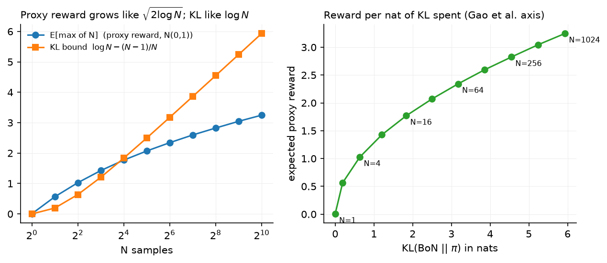
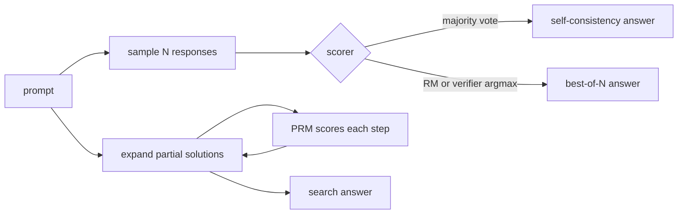

# Test-time compute

> **Why this matters at staff level.** Capability stopped being a function of training compute alone. A model that answers in one pass and the same model allowed to sample 64 times, rerank, and revise are different products with different cost curves, and the second one is often cheaper than training a larger model to match it. Interviews probe whether you can derive the best-of-N KL bound, say when search beats sampling, and then cost the thing out per query at serving time.

## TL;DR the interview card

- Chain of thought turns one forward pass into many by putting intermediate steps in the context. The extra tokens are extra serial compute the model can condition on.
- Self-consistency samples $N$ chains at temperature $>0$ and takes the majority answer. It needs an answer that can be compared for equality. Accuracy rises with $N$ and saturates.
- Best-of-N samples $N$ responses and keeps the highest scorer under a reward model or verifier. Its KL cost against the base policy has a closed form: $\boxed{\KL(\mathrm{BoN}\,\|\,\pi) = \log N - \dfrac{N-1}{N}}$.
- Expected best-of-N reward grows like $\sqrt{2\log N}$ for Gaussian-ish reward, so reward buys in at $\sqrt{\log N}$ while KL is paid at $\log N$. Doubling $N$ repeatedly gives diminishing reward per nat spent.
- Beam search over tokens maximises sequence log-probability, which is a different objective from correctness. For reasoning it often underperforms plain sampling plus reranking, because high-likelihood text is not high-accuracy text.
- Tree search (ToT, MCTS) expands partial solutions and scores them with a PRM or value model. It pays off when the problem decomposes into verifiable steps and the branching factor is small.
- Verifier reranking is best-of-N with a verifier instead of an RM. When a verifier exists it dominates RM reranking, because it cannot be gamed by style.
- Snell et al. showed the optimal strategy depends on prompt difficulty: easy prompts favour sequential revision, hard prompts favour parallel sampling plus search, and choosing per-prompt ("compute-optimal") beats a fixed strategy by several times in efficiency.
- Serving: $N$ samples is $N$ times the prefill-amortised decode cost, but the prompt KV cache is shared, and the samples are embarrassingly parallel so latency need not scale with $N$. Sequential revision multiplies latency directly.

## 1. Intuition first

Fix a model and a hard arithmetic prompt. Four ways to spend more compute at inference:

| Strategy | What it does | Cost | Needs |
|---|---|---|---|
| Chain of thought | one sample, more tokens | $\sim L$ tokens | nothing |
| Self-consistency | $N$ samples, majority answer | $N \times L$ | comparable answers |
| Best-of-N | $N$ samples, keep top scorer | $N \times L$ + $N$ scorings | RM or verifier |
| Beam / tree search | expand and prune partial solutions | $B \times$ depth | step scorer |

Say the model answers correctly 40 % of the time and its errors are scattered rather than systematic. Sample 5 times and take the majority: the majority is correct whenever 3 or more of 5 samples are correct, which for independent samples at $p = 0.4$ is about 32 %. That is *worse* than one sample, and the reason is that the wrong answers are not spread evenly; if they concentrate on one wrong value, that value wins the vote. Self-consistency helps when the correct answer is modal even though it is not majority, which is the usual case on reasoning tasks where errors diverge but correct derivations converge.

Best-of-N has a different shape. With a perfect verifier, accuracy after $N$ samples is $1 - (1-p)^N$: at $p = 0.4$ and $N = 5$ that is 92 %. That gap between 32 % and 92 % is the value of a verifier, and it is why RLVR-style tasks get so much from test-time compute.

{ width="720" }

The left panel plots the Monte-Carlo expectation of the maximum of $N$ standard normals next to the KL bound $\log N - (N-1)/N$. Reward climbs like $\sqrt{2\log N}$, KL climbs like $\log N$. The right panel replots reward against KL, which is the axis Gao et al. use for over-optimisation: each extra nat of KL buys less reward than the one before.



## 2. The math

### 2.1 The best-of-N distribution

Let $\pi$ be the base policy over responses and let $r$ be a scoring function with no ties (continuous, or ties broken at random). Best-of-N draws $y_1, \dots, y_N \sim \pi$ independently and returns $\argmax_i r(y_i)$. The induced distribution is

$$
\pi_{\mathrm{BoN}}(y) = N\,\pi(y)\,F(y)^{N-1}, \qquad F(y) = \Pr_{y'\sim\pi}\big[r(y') < r(y)\big],
$$

because $y$ is returned when it is drawn (probability $\pi(y)$, times $N$ choices of which draw it was) and the other $N-1$ draws all score below it.

### 2.2 The KL cost

Compute $\KL(\pi_{\mathrm{BoN}}\|\pi)$ directly:

$$
\KL = \E_{y\sim\pi_{\mathrm{BoN}}}\!\left[\log\frac{\pi_{\mathrm{BoN}}(y)}{\pi(y)}\right]
= \E_{y\sim\pi_{\mathrm{BoN}}}\!\big[\log N + (N-1)\log F(y)\big]
= \log N + (N-1)\,\E_{\mathrm{BoN}}\big[\log F(y)\big].
$$

Change variables to $u = F(y)$. Under $\pi$, $u$ is uniform on $[0,1]$ (the probability integral transform). Under $\pi_{\mathrm{BoN}}$, $u$ is the maximum of $N$ uniforms, with density $N u^{N-1}$ on $[0,1]$. So

$$
\E_{\mathrm{BoN}}[\log F] = \int_0^1 \log u \cdot N u^{N-1}\,du = N\left[\frac{u^N \log u}{N} - \frac{u^N}{N^2}\right]_0^1 = -\frac{1}{N}.
$$

Therefore

$$
\boxed{\;\KL(\pi_{\mathrm{BoN}}\,\|\,\pi) = \log N - \frac{N-1}{N}\;}
$$

The result depends only on $N$, not on the reward or the policy, which is what makes it useful as a budget. At $N = 1$ it is 0. At $N = 4$ it is $\log 4 - 0.75 \approx 0.64$ nats. At $N = 1024$ it is about $5.93$ nats. Note that $\log N$ alone is a common approximation and overstates the cost by up to 1 nat.

*Meaning:* best-of-N moves the policy a bounded, known distance from the base model, which is why it over-optimises a proxy reward more gently than RL does. RL can put mass on sequences the base policy essentially never emits; best-of-N can only ever return something the base policy sampled.

### 2.3 Expected reward against N

If reward under $\pi$ is approximately Gaussian, $r \sim \mathcal N(\mu, \sigma^2)$, then the expectation of the maximum of $N$ draws satisfies

$$
\E\big[\max_{i\le N} r_i\big] \approx \mu + \sigma\sqrt{2\log N}
$$

to leading order. Combining with §2.2, the proxy reward gained per nat of KL spent falls off like $1/\sqrt{\log N}$: going from $N=1$ to $N=16$ buys roughly $2.0\sigma$ for $2.7$ nats, while $N=256$ to $N=4096$ buys about $0.7\sigma$ for another $2.8$ nats.

This is a statement about the *proxy*. Gao et al.'s measured gold reward for best-of-N follows $d(\alpha - \beta\log d)$ with $d = \sqrt{\KL}$, rising then falling, so past some $N$ the true quality degrades even though the RM score keeps climbing (chapter 2 §2.5).

With a **verifier** rather than an RM, there is no proxy gap. Accuracy is $1 - (1-p)^N$ for a per-sample success rate $p$, monotone in $N$, saturating at 1. The cost of more samples is money and latency, not quality.

### 2.4 Self-consistency

Sample $N$ chains, extract the final answer from each, return the mode. Let $q_a$ be the probability the model's answer is $a$. Majority voting returns $\argmax_a \hat q_a$, and as $N \to \infty$ that converges to $\argmax_a q_a$. So self-consistency succeeds exactly when the correct answer is the **modal** answer under the model, whatever its absolute probability.

The condition to remember: self-consistency helps when $q_{\text{correct}} > \max_{a \ne \text{correct}} q_a$, even if $q_{\text{correct}} < 0.5$. It cannot fix a model that is confidently and consistently wrong, and it does not need a reward model, which is why it is the cheapest of the parallel methods to deploy.

### 2.5 Search

Beam search keeps the $B$ highest-scoring partial sequences at each step, scoring by cumulative log-probability $\sum_t \log\pi(y_t|y_{<t})$. For translation and summarisation, where fluent high-likelihood text is the goal, this works. For reasoning it is a mismatch: the objective is correctness and the search objective is likelihood, so beam search concentrates on confident, generic continuations and loses the diversity that best-of-N depends on. Snell et al. report beam search underperforming plain sampling at large budgets for exactly this reason.

Tree search replaces the likelihood score with a learned value. Tree of Thoughts expands a tree of partial solutions and scores nodes with the model itself acting as evaluator. MCTS-style methods run selection, expansion, simulation and backup, with a PRM supplying the value of a partial solution. The practical requirements are a meaningful step boundary, a scorer that is accurate on partial work, and a branching factor small enough that the tree does not explode.

### 2.6 Compute-optimal inference

Snell et al. pose the allocation problem: given a fixed inference budget, how should it be split between generating more samples in parallel and revising sequentially? Their finding is that the answer depends on prompt difficulty. Easy prompts, where the model's first answer is close, benefit from sequential revision. Hard prompts, where the model needs a different approach rather than a repair, benefit from parallel sampling with search over the samples. Selecting the strategy per prompt using a difficulty estimate ("compute-optimal" scaling) reached the same accuracy as a fixed best-of-N baseline with roughly $4\times$ less compute in their experiments, and they report settings where a smaller model with extra test-time compute beats a roughly $14\times$ larger model evaluated in one pass.

The caveat they state: this holds when the base model has a non-trivial chance of producing a correct answer. For problems far beyond the model's reach, extra inference compute does not help and a bigger or better-trained model is required.

## 3. Implementation

Code: `src/mlbook/posttrain/test_time.py`.

### 3.1 The KL bound and the expected max

```python
def bon_kl_bound(n):
    return math.log(n) - (n - 1) / n          # KL(BoN || pi), exact

def expected_max_of_n_gaussian(n, num_mc=20000, seed=0):
    g = torch.Generator().manual_seed(seed)
    draws = torch.randn(num_mc, n, generator=g)   # (num_mc, N)
    return float(draws.max(dim=1).values.mean())  # scalar
```

`bon_kl_bound` is the boxed result. `expected_max_of_n_gaussian` is a Monte-Carlo check of §2.3 and is what the left panel of the figure plots.

### 3.2 Best-of-N

```python
def best_of_n(model, prompt, n, reward_fn, eos_id, max_new_tokens, temperature=1.0):
    prompt = prompt.view(1, -1).expand(n, -1)                                # (N, T_p)
    tokens, mask = sample(model, prompt, max_new_tokens, eos_id, temperature) # (N, T), (N, T)
    rewards = reward_fn(tokens, mask)                                        # (N,)
    best = int(rewards.argmax())
    return tokens[best], mask[best], rewards
```

The prompt is expanded to $N$ rows so all samples are generated in one batched call, which is what a real system does too (one prefill, $N$ decode streams sharing the prompt KV cache). All $N$ rewards are returned, not just the best, because the spread is the diagnostic you want when tuning $N$.

### 3.3 Self-consistency

```python
def self_consistency(model, prompt, n, extract_answer, eos_id, max_new_tokens, temperature=1.0):
    prompt = prompt.view(1, -1).expand(n, -1)                                 # (N, T_p)
    tokens, mask = sample(model, prompt, max_new_tokens, eos_id, temperature)  # (N, T), (N, T)
    votes = Counter(extract_answer(tokens[i], mask[i]) for i in range(n))
    return votes.most_common(1)[0][0], votes
```

`extract_answer` is supplied by the caller because answer extraction is task-specific (a boxed expression for math, a parsed JSON field for structured output). Returning the full `Counter` lets the caller measure vote margin, which is a usable confidence signal.

### 3.4 Beam search

```python
@torch.no_grad()
def beam_search(model, prompt, beam_width, max_new_tokens, eos_id):
    beams = [([], 0.0)]                                     # (generated tokens, cumulative log-prob)
    finished = []
    for _ in range(max_new_tokens):
        candidates = []
        for gen, score in beams:
            seq = torch.cat([prompt, torch.tensor(gen, dtype=prompt.dtype)]).unsqueeze(0)  # (1, T_p + len(gen))
            logp = F.log_softmax(model(seq)[0, -1], dim=-1)  # (V,) next-token log-probs
            top_logp, top_ids = logp.topk(beam_width)        # (beam_width,) each
            for lp, tid in zip(top_logp.tolist(), top_ids.tolist()):
                candidates.append((gen + [tid], score + lp))
        candidates.sort(key=lambda c: c[1], reverse=True)
        beams = []
        for gen, score in candidates[:beam_width]:
            (finished if gen[-1] == eos_id else beams).append((gen, score))
        if not beams:
            break
    finished.extend(beams)
    finished.sort(key=lambda c: c[1], reverse=True)
    return finished[:beam_width]
```

Scores are summed log-probabilities, so the search is length-unnormalised and biased toward short sequences; production beam search divides by $|y|^\alpha$ to compensate. Beams that emit EOS move to `finished` and stop expanding. The test compares the top beam against brute-force enumeration of all $V^2$ two-token continuations, which pins the search down exactly rather than checking a property.

**How you'd test it.** Check `bon_kl_bound(1) == 0` and the exact value at $N = 4$. Check the returned best-of-N response really is the argmax of the returned rewards and that prompt tokens are never marked as response. Check the self-consistency winner has the maximum vote count and the votes sum to $N$. Check beam search returns sorted beams and that its top scorer matches exhaustive search to $10^{-4}$. In `tests/test_posttrain_test_time.py`.

??? example "Full implementation, `src/mlbook/posttrain/test_time.py`"
    ```python
    --8<-- "src/mlbook/posttrain/test_time.py"
    ```

## Retype by hand

| Symbol | File | Retype from memory? | Target time |
|---|---|---|---|
| `bon_kl_bound` | `src/mlbook/posttrain/test_time.py` | yes, with the derivation on paper | 10 minutes (1 for the code) |
| `best_of_n` | `src/mlbook/posttrain/test_time.py` | yes | 6 minutes |
| `self_consistency` | `src/mlbook/posttrain/test_time.py` | yes | 5 minutes |
| `beam_search` | `src/mlbook/posttrain/test_time.py` | yes | 15 minutes |
| `expected_max_of_n_gaussian` | `src/mlbook/posttrain/test_time.py` | read only | |

The derivation in §2.2 is worth more interview marks than the code, so do it on paper first, then type `bon_kl_bound` as a one-liner. Check with `pytest tests/test_posttrain_test_time.py -q`. Per-symbol tests: `test_bon_kl_bound_values`, `test_best_of_n_returns_argmax_reward`, `test_self_consistency_majority_vote`, `test_beam_search_matches_exhaustive_search`.

## 4. Systems view: cost, failure modes, trade-offs

**Cost of $N$ samples.** The prompt is prefilled once and its KV cache is shared across the $N$ continuations, so prefill cost is paid once. Decode cost scales with $N \times L$ generated tokens, and decode is memory-bandwidth bound, so $N$ parallel streams batch well and the marginal cost per extra sample is far below the first sample's. See [inference systems](../part14-systems/03-inference-systems.md) for the arithmetic.

**Latency.** Parallel methods (self-consistency, best-of-N) add throughput cost without adding serial latency, as long as you have the capacity to run $N$ streams concurrently. Sequential methods (revision, agentic loops, MCTS rollouts) add latency directly, one full generation per round. For an interactive product that distinction usually decides the design.

**Scoring cost.** Best-of-N with a 70B RM scoring $N=64$ responses of 1k tokens is $64 \times 10^3 \times 2 \times 70\mathrm{B} \approx 9\times10^{15}$ FLOPs per query, which can exceed the generation cost. Use a smaller RM, score only the final answer rather than the whole chain, or prune candidates early.

**Failure modes.**

| Symptom | Cause | Fix |
|---|---|---|
| Self-consistency worse than one sample | errors concentrate on one wrong answer | check the vote distribution; use a verifier instead of voting |
| Best-of-N plateaus then degrades on human eval | RM over-optimisation at large $N$ | cap $N$ from a gold-vs-proxy study; ensemble the RM |
| Beam search worse than sampling | likelihood objective, not correctness | sample with temperature and rerank |
| Tree search too slow | branching factor and depth | limit expansions per node; prune with a cheap scorer first |
| Latency blows up | sequential revision in the serving path | move to parallel sampling; cap rounds |
| Cost per query unpredictable | adaptive $N$ with no ceiling | hard token budget per request |

**When to use what.**

| Situation | Choice |
|---|---|
| Verifier exists (code, math, schema) | best-of-N with the verifier; $N$ set by budget |
| No verifier, answers comparable for equality | self-consistency |
| No verifier, free-form answers | best-of-N with an RM, $N$ in the tens |
| Steps are checkable and decompose | tree search with a PRM |
| Latency-critical interactive path | one sample, or $N$ small and parallel |
| Offline batch (data generation, evals) | large $N$, rejection sampling into training data |

The last row connects back to chapter 1: rejection sampling is best-of-N used offline to make SFT data, and it is how Llama 2 and Llama 3 generated most of their later-round training sets. Test-time compute spent offline becomes training compute.

## 5. In production

!!! production "Google, self-consistency: majority voting over sampled chains"
    Wang et al. replaced greedy decoding of a single chain of thought with sampling a diverse set of chains and taking the most consistent final answer. They report large gains on arithmetic and commonsense reasoning benchmarks across several model families, with accuracy rising as the number of sampled paths grows and then saturating. The method needs no extra training and no verifier, which is why it became a default baseline. Source: Wang et al., *Self-Consistency Improves Chain of Thought Reasoning in Language Models*, 2022 (arXiv 2203.11171).

!!! production "OpenAI, verifiers on GSM8K: reranking beats fine-tuning"
    Cobbe et al. trained a verifier to judge the correctness of sampled solutions, then sampled many candidates at test time and ranked by verifier score. They report that this outperformed fine-tuning the generator alone at equivalent scale, with the gap widening as more samples were drawn. This is the original demonstration that a checker plus sampling substitutes for parameters. Source: Cobbe et al., *Training Verifiers to Solve Math Word Problems*, 2021 (arXiv 2110.14168).

!!! production "OpenAI, process supervision: PRMs outperform ORMs for reranking"
    Lightman et al. collected step-level human labels (PRM800K) and trained a process reward model, then used it to rerank solutions to MATH problems. The PRM outperformed an outcome-only reward model at the same number of samples, and the gap grew with the number of candidates, because step-level scoring identifies solutions that reached a right answer through wrong reasoning. Source: Lightman et al., *Let's Verify Step by Step*, 2023 (arXiv 2305.20050).

!!! production "Google DeepMind and Berkeley, compute-optimal test-time scaling"
    Snell et al. compared sequential revision against parallel sampling with search, under a fixed budget, and found the better strategy depends on prompt difficulty. Allocating per-prompt using a difficulty estimate reached baseline best-of-N accuracy with about $4\times$ less compute, and in the regimes they measured a smaller model with extra inference compute outperformed a roughly $14\times$ larger model in a single pass. They also report that this advantage disappears for problems the base model cannot approach. Source: Snell et al., *Scaling LLM Test-Time Compute Optimally can be More Effective than Scaling Model Parameters*, 2024 (arXiv 2408.03314).

!!! production "OpenAI, o1: inference-time thinking as a scaling axis"
    OpenAI describes o1 as improving along two separate axes, more RL training compute and more time spent thinking at inference, and reports benchmark accuracy rising with both. The chain of thought is kept private and a summary is shown to the user, which has a serving consequence: billed reasoning tokens are generated but not returned. Source: OpenAI, *Learning to reason with LLMs*, 2024.

!!! production "Meta, Llama 2 and Llama 3: best-of-N offline as a data engine"
    Both reports use rejection sampling, which is best-of-N applied offline: sample $K$ responses per prompt from the current policy, score with the reward model, keep the winner, and fine-tune on it. Llama 2 used this for four of its five RLHF iterations before adding PPO. Llama 3 used it to build SFT data across six rounds. Sources: Touvron et al., 2023, [arXiv:2307.09288](https://arxiv.org/abs/2307.09288); Grattafiori et al., 2024, [arXiv:2407.21783](https://arxiv.org/abs/2407.21783).

## 6. Interview questions and strong answers

!!! interview "Q1. Derive the KL cost of best-of-N."
    The BoN density is $N\pi(y)F(y)^{N-1}$ with $F$ the CDF of the reward under $\pi$. The log density ratio is $\log N + (N-1)\log F(y)$. Substitute $u = F(y)$: under $\pi$ it is uniform, under BoN it is the max of $N$ uniforms with density $Nu^{N-1}$. Then $\E[\log u] = \int_0^1 \log u \cdot Nu^{N-1} du = -1/N$, giving $\KL = \log N - (N-1)/N$. It depends only on $N$. **Staff follow-up:** *why does this make BoN safer than RL against the same RM?* The KL is bounded and known in advance, and every returned sample is one the base policy actually produced, so BoN cannot move mass onto sequences outside the base model's support. RL can.

!!! interview "Q2. Self-consistency gives worse accuracy than greedy on one of your tasks. What is happening?"
    The model's modal answer is wrong on that task. Voting converges to $\argmax_a q_a$, so if a particular wrong answer is the single most likely output, more samples make the wrong answer *more* certain to win. Greedy can differ from the mode of sampled answers when the wrong answer is reachable by many distinct chains. Check the vote histogram: a tight distribution around a wrong answer confirms it. Switch to a verifier if one exists, since best-of-N only needs the right answer to appear once.

!!! interview "Q3. Best-of-N with a reward model: how do you pick N?"
    Run a gold-versus-proxy study at small scale: score candidates with the deployed RM, evaluate the selected responses with humans or a stronger judge, and plot true quality against $\log N$. Pick $N$ at or before the peak of that curve, not where proxy reward is still rising. Then check the budget: scoring cost is $N$ forward passes of the RM and can exceed generation. Typical deployed values sit in the tens, not the thousands.

!!! interview "Q4. Beam search or sampling plus reranking for a math model?"
    Sampling plus reranking. Beam search optimises cumulative log-probability, which correlates with fluency, not correctness, and it collapses diversity exactly when you need several independent attempts. Sampling at temperature produces genuinely different derivations, and a verifier or PRM picks among them. Beam search remains right where likelihood is the objective, such as translation. **Staff follow-up:** *what if you must use beam search?* Length-normalise the score, use a wide beam with diverse-beam penalties, and rerank the final beams with a verifier rather than trusting the beam score.

!!! interview "Q5. Give the serving cost model for N-sample inference."
    Prefill once, sharing the prompt KV cache across $N$ streams, so prefill is $O(1)$ in $N$. Decode is $N \times L$ tokens, memory-bandwidth bound, and batches well, so throughput cost scales with $N$ while latency does not, given capacity. Add $N$ scoring passes if reranking. Sequential revision is different: $R$ rounds multiply latency by $R$ because each round waits for the previous one. For an interactive product, prefer parallel; for offline data generation, either is fine and you should push $N$ up.

!!! interview "Q6. When does test-time compute stop helping?"
    When the base model's per-sample success probability is near zero, since $1-(1-p)^N$ stays near zero for any practical $N$. Snell et al. state this limit directly: their compute-optimal gains hold for questions within reach of the base model and vanish for harder ones. At that point the fix is a better model, whether by scale, by better pretraining data, or by RL that teaches the reasoning behaviour. **Staff follow-up:** *how do you detect it in production?* Track accuracy against $N$ per difficulty bucket; a flat curve in the hardest bucket means more samples are wasted money.

!!! interview "Q7. How do test-time compute and post-training interact?"
    They substitute for each other and they feed each other. Best-of-N applied offline is rejection sampling, and training on its winners moves the test-time gain into the weights, so the deployed model needs fewer samples. Running RL against a verifier teaches the model to produce what search would have found. In the other direction, a model post-trained for long reasoning uses test-time compute more efficiently, which is the o1 and R1 claim. Budget them together: the question is where a marginal FLOP is worth more, in training or per query, and that depends on query volume.

## 7. Exercises

1. ★ Compute $\KL(\mathrm{BoN}\|\pi)$ for $N = 2, 8, 64$ and compare against the $\log N$ approximation.

    ??? success "Solution"
        $N=2$: $\log 2 - 0.5 = 0.193$ against $0.693$. $N=8$: $2.079 - 0.875 = 1.204$ against $2.079$. $N=64$: $4.159 - 0.984 = 3.175$ against $4.159$. The approximation overstates by $(N-1)/N$, which approaches 1 nat, so it is worst in relative terms at small $N$.

2. ★★ With a perfect verifier and per-sample success $p$, how many samples are needed for 95 % accuracy? Evaluate at $p = 0.1$ and $p = 0.4$.

    ??? success "Solution"
        Solve $1-(1-p)^N \ge 0.95$, so $N \ge \log(0.05)/\log(1-p)$. At $p=0.4$: $N \ge 2.996/0.511 = 5.9$, so 6 samples. At $p=0.1$: $N \ge 2.996/0.105 = 28.4$, so 29. The cost grows roughly like $1/p$.

3. ★★ (coding) Measure the toy model's accuracy against $N$ for best-of-N with the arithmetic verifier, for $N \in \{1,2,4,8,16\}$, and compare against $1-(1-p)^N$ with $p$ the single-sample accuracy.

    ??? success "Solution"
        Use the SFT policy from `tests/test_posttrain_grpo.py`, call `best_of_n` per prompt with `arithmetic_reward` as the scorer, and average over prompts. The measured curve tracks $1-(1-p)^N$ closely where samples are near-independent, and falls below it where the model is deterministic for a given prompt (all $N$ samples identical, so extra samples add nothing). That deviation is the practical reason temperature matters for best-of-N.

4. ★★ Show that majority voting over $N$ samples converges to $\argmax_a q_a$ and give a case where that is the wrong answer even though the model "knows" the right one.

    ??? success "Solution"
        Empirical frequencies converge to $q_a$ by the law of large numbers, and the argmax of the empirical distribution converges to the argmax of $q$ when the mode is unique. Failure case: $q_{\text{correct}} = 0.3$ spread over many distinct correct derivations that produce slightly different formatted answers, while one wrong answer has $q = 0.35$ concentrated. Normalising answers before voting (canonicalising formatting) can recover the loss.

5. ★★★ (coding) Add length normalisation to `beam_search`, dividing the cumulative log-probability by $|y|^\alpha$, and show that $\alpha = 0$ favours short sequences while $\alpha = 1$ removes the bias.

    ??? success "Solution"
        Sort candidates by `score / (len(gen) ** alpha)` instead of `score`. With $\alpha = 0$ every extra token adds a negative log-probability, so the top beam terminates as early as EOS allows. With $\alpha = 1$ the criterion is mean per-token log-probability, so length no longer penalises directly. Values near $0.6$ to $0.7$ are common in translation systems, which is a tuned compromise rather than a principled constant.

6. ★★★ Design the inference stack for a code assistant with a unit-test runner available, a p95 latency budget of 4 seconds, and a cost ceiling of one cent per request. State $N$, the scorer, and what you would cut first under load.

    ??? success "Solution"
        Parallel sample $N$ candidates in one batched call sharing the prompt KV cache, run the tests on all of them concurrently, and return the first that passes. Choose $N$ from measured per-sample pass rate and the cost ceiling: at $p=0.5$, $N=8$ gives 99.6 % coverage. Tests run in a sandbox and are usually faster than generation, so latency is generation-bound and independent of $N$ given capacity. Under load, cut $N$ first (graceful quality degradation), then fall back to a single greedy sample, and never cut the sandbox. Hold out a test set from RL training so the pass signal stays honest.

## References

- Wei et al. (2022). *Chain-of-Thought Prompting Elicits Reasoning in Large Language Models*. arXiv 2201.11903.
- Wang et al. (2022). *Self-Consistency Improves Chain of Thought Reasoning in Language Models*. arXiv 2203.11171.
- Cobbe et al. (2021). *Training Verifiers to Solve Math Word Problems*. arXiv 2110.14168.
- Lightman et al. (2023). *Let's Verify Step by Step*. arXiv 2305.20050.
- Snell et al. (2024). *Scaling LLM Test-Time Compute Optimally can be More Effective than Scaling Model Parameters*. arXiv 2408.03314.
- Wu et al. (2024). *Inference Scaling Laws: An Empirical Analysis of Compute-Optimal Inference*. arXiv 2408.00724.
- Yao et al. (2023). *Tree of Thoughts: Deliberate Problem Solving with Large Language Models*. arXiv 2305.10601.
- Madaan et al. (2023). *Self-Refine: Iterative Refinement with Self-Feedback*. arXiv 2303.17651.
- Gao, L., Schulman, J. and Hilton, J. (2022). *Scaling Laws for Reward Model Overoptimization*. arXiv 2210.10760.
- Beirami et al. (2024). *Theoretical guarantees on the best-of-n alignment policy*. arXiv 2401.01879.
- Stiennon et al. (2020). *Learning to summarize from human feedback* (the $\log N - (N-1)/N$ result appears here). arXiv 2009.01325.
- OpenAI (2024). *Learning to reason with LLMs*.
- Touvron et al. (2023). *Llama 2: Open Foundation and Fine-Tuned Chat Models*. [arXiv:2307.09288](https://arxiv.org/abs/2307.09288).
- Grattafiori et al. (2024). *The Llama 3 Herd of Models*. [arXiv:2407.21783](https://arxiv.org/abs/2407.21783).
