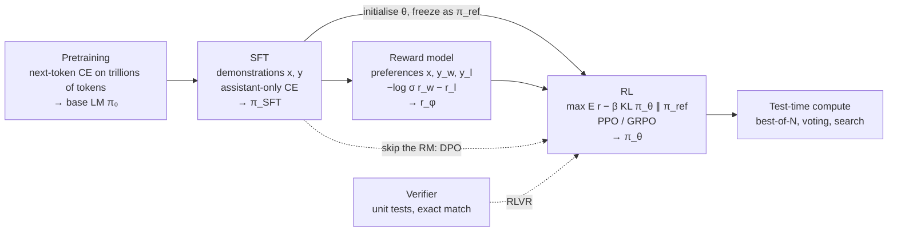
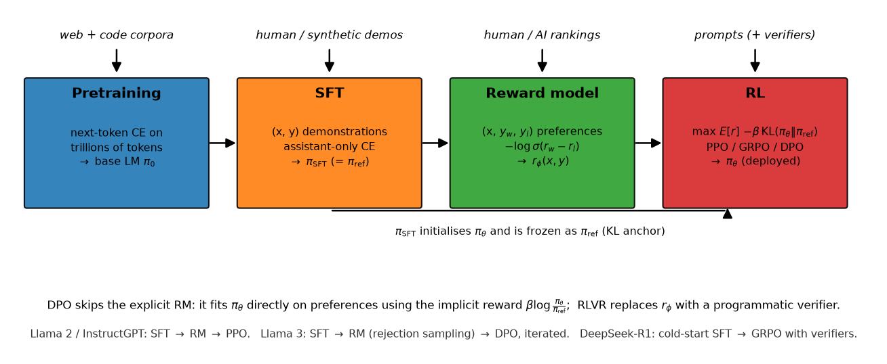

# Part VII: Post-training

Pretraining gives you a model that continues text. Post-training turns it into a
model that *does what you ask*, refuses what it should, reasons for as long as the
problem needs, and can be steered by a reward. Since 2022 this stage has moved from
a finishing step (InstructGPT) to a primary capability driver (DeepSeek-R1, o1), and
it is now the part of the stack where a staff engineer is most likely to be asked
to derive an objective at a whiteboard and then explain what it costs to run.

## The pipeline

{ width="760" }

The figure shows the same four stages with the data that feeds each and the two
places the reference policy is reused: it initialises the RL policy and it anchors
the KL penalty.

Every stage is one objective applied to the same autoregressive model:

| Stage | Data | Objective | Output |
|---|---|---|---|
| SFT | $(x, y)$ demonstrations | $-\sum_{t \in \text{assistant}} \log \pi_\theta(y_t \mid x, y_{<t})$ | $\pi_{\mathrm{SFT}}$ |
| Reward model | $(x, y_w, y_l)$ | $-\log \sigma\big(r_\phi(x,y_w) - r_\phi(x,y_l)\big)$ | $r_\phi$ |
| RLHF (PPO) | prompts $x$, online samples | $\E[r_\phi(x,y)] - \beta\,\KL(\pi_\theta \,\|\, \pi_{\mathrm{ref}})$ | $\pi_\theta$ |
| DPO | $(x, y_w, y_l)$ | $-\log \sigma\big(\beta[\log\tfrac{\pi_\theta}{\pi_{\mathrm{ref}}}(y_w) - \log\tfrac{\pi_\theta}{\pi_{\mathrm{ref}}}(y_l)]\big)$ | $\pi_\theta$ |
| RLVR / GRPO | prompts + verifier | group-normalised advantage, clipped ratio, $k_3$ KL | $\pi_\theta$ |
| Test-time compute | none (inference) | $\max_{y_1..y_N} r(x, y_i)$, majority vote, search | better answers, more FLOPs |

## Chapters

1. [Supervised fine-tuning](01-sft.md): chat templates, assistant-only loss masks, packing with segment masks, data mixtures, synthetic data, why SFT overfits.
2. [Reward models & preferences](02-reward-models.md): Bradley–Terry from first principles, RM architecture, calibration, over-optimisation scaling laws, ensembles, LLM-as-judge.
3. [RLHF with PPO](03-rlhf-ppo.md): the KL-regularised objective, the clipped surrogate derived, GAE, the four-model memory footprint, generation as the bottleneck.
4. [DPO and its relatives](04-dpo-and-friends.md): the closed-form optimum, the substitution that cancels the partition function, implicit rewards, IPO / ORPO / KTO / SimPO.
5. [Reasoning RL, RLVR & GRPO](05-reasoning-rl-grpo.md): verifiable rewards, GRPO derived, DAPO / Dr. GRPO, process rewards, reward hacking, RLAIF and Constitutional AI, DeepSeek-R1.
6. [Test-time compute](06-test-time-compute.md): chain of thought, self-consistency, best-of-N and its KL cost, beam and tree search, compute-optimal inference, serving cost.

## Prerequisites

* [Pretraining data & objective](../part06-llm-training/01-pretraining-data-objective.md): the next-token cross-entropy that SFT reuses unchanged.
* [Fine-tuning & LoRA](../part06-llm-training/06-fine-tuning-lora.md): parameter-efficient variants of everything here.
* [Policy gradients, GAE & PPO](../part12-rl/04-policy-gradients-ppo.md): the policy-gradient theorem, GAE and PPO on a control task. Chapter 3 states those results and adds the LM specifics.
* [Information theory](../part01-math/05-information-theory.md): KL divergence, its estimators, entropy.
* [Logistic & softmax regression](../part02-classical/02-logistic-softmax-regression.md): the Bradley–Terry loss *is* logistic regression on a reward difference.
* [Inference systems](../part14-systems/03-inference-systems.md) and [distributed training](../part14-systems/01-distributed-training.md): why generation dominates RLHF wall-clock and how the four models are sharded.

## The one-day ordering

If you have one day before an interview that touches post-training:

1. **Morning (3 h).** Chapter 1 §2–3 (the mask and the packing mask; ten minutes each to retype), then chapter 2 §2 (derive Bradley–Terry from the logistic model, twice), then chapter 4 §2 (derive DPO end to end on paper without looking; this is the single most-asked derivation).
2. **Early afternoon (2 h).** Chapter 3: the objective, where the KL enters the per-token reward, the clipped surrogate and *why* clipping is a trust region, the four-model memory table. Then chapter 5 §2: GRPO advantages and the $k_3$ estimator; be able to say what DAPO changed and why.
3. **Late afternoon (1.5 h).** Chapter 6: best-of-N's $\log N - (N-1)/N$ bound, self-consistency, when tree search pays, compute-optimal inference. Then every chapter's *TL;DR* and §5 case studies: InstructGPT, Llama 2, Llama 3, Constitutional AI, DeepSeek-R1, Tülu 3.
4. **Evening (1 h).** Run `pytest tests/test_posttrain_* -q`, then retype `dpo_loss`, `bradley_terry_loss`, `group_relative_advantages` + `grpo_loss` and `ppo_clip_loss` from memory against the tests.

## Code map

All Part VII code is self-contained in `src/mlbook/posttrain/` and runs on a tiny
explicit causal LM (`toy_lm.py`, ~50 k parameters) so that every algorithm trains on
a CPU in seconds:

| Module | What it implements | Test |
|---|---|---|
| `toy_lm.py` | `TinyCausalLM`, `token_log_probs`, `sequence_log_prob`, `sample` | used by every test |
| `chat_template.py` | `ToyTokenizer`, `render_chat`, `tokenize_chat` (assistant mask) | `tests/test_posttrain_chat_template.py` |
| `sft.py` | `assistant_only_labels`, `sft_loss`, `pack_examples`, `packed_attention_mask`, `train_sft` | `tests/test_posttrain_sft.py` |
| `reward_model.py` | `TinyRewardModel`, `bradley_terry_loss`, `train_reward_model` | `tests/test_posttrain_reward_model.py` |
| `ppo_lm.py` | `shaped_rewards`, `gae`, `ppo_clip_loss`, `value_loss`, `AdaptiveKLController`, `train_ppo` | `tests/test_posttrain_ppo.py` |
| `dpo.py` | `dpo_loss`, `ipo_loss`, `simpo_loss`, `orpo_loss`, `kto_loss`, `dpo_train_step` | `tests/test_posttrain_dpo.py` |
| `grpo.py` | `group_relative_advantages`, `k3_kl`, `grpo_loss`, `train_grpo` | `tests/test_posttrain_grpo.py` |
| `verifiers.py` | arithmetic verifier, target-token reward, noisy SFT data | `tests/test_posttrain_grpo.py` |
| `test_time.py` | `best_of_n`, `self_consistency`, `beam_search`, `bon_kl_bound` | `tests/test_posttrain_test_time.py` |
