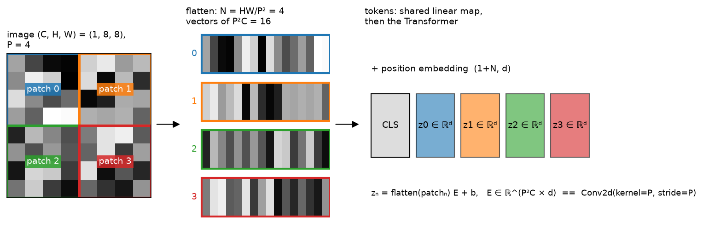
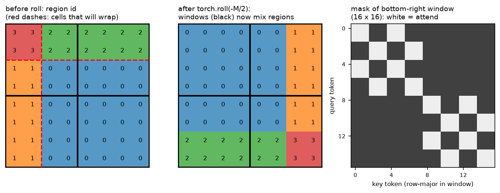

# Vision Transformers

> **Why this matters at staff level.** Every modern perception stack that talks to a
> language model starts by turning an image into tokens, and interviewers at autonomy
> companies and frontier labs use the ViT to test whether you can reason about sequence
> length, inductive bias and compute at the same time. Strong signal is writing patch
> embedding as a strided convolution, stating the $O(N^2)$ attention cost as a function of
> resolution and patch size, explaining exactly why Swin needs a mask after the cyclic
> shift, and saying when you would still ship a ConvNet.

## TL;DR: the interview card

- An image $x \in \R^{C\times H\times W}$ becomes $N = HW/P^2$ tokens. Each $P\times P\times C$
  patch is flattened and mapped by one shared matrix $E \in \R^{P^2C\times d}$, which is
  exactly `Conv2d(C, d, kernel_size=P, stride=P)`.
- Sequence: $[\text{CLS};\, z_1;\dots;z_N] + E_{pos} \in \R^{(N+1)\times d}$, then $L$ pre-norm
  Transformer blocks, then a head on CLS or on the mean of the patch tokens.
- Per-layer cost in multiply-adds: $12Nd^2 + 2N^2d$. Halving $P$ quadruples $N$ and
  multiplies the quadratic term by 16.
- ViTs carry less inductive bias than CNNs (no locality, no translation equivariance beyond
  the patch grid), so they are data-hungry. ViT beats ResNets only with JFT-scale
  pretraining, or with DeiT-style augmentation and distillation on ImageNet-1k.
- Resolution change: interpolate the learned $\sqrt{N}\times\sqrt{N}$ position grid
  bicubically. FlexiViT resizes the patch kernel instead; NaViT keeps native resolution and
  packs variable-size images into one sequence.
- Swin: attention inside $M\times M$ windows costs $O(hw\,M^2 d)$ instead of $O((hw)^2 d)$.
  Alternate blocks shift the grid by $M/2$ with `torch.roll`, and a mask blocks attention
  between tokens that wrapped around and tokens that did not. Patch merging halves
  resolution and doubles width, giving a feature pyramid for detection.
- Registers are extra learned tokens that soak up global information so background patches
  stop being used as scratch space. ViT-22B needs QK-normalisation and parallel blocks to
  train stably.
- ConvNeXt: a ResNet with ViT-era design choices matches Swin at equal FLOPs, so the gain
  came from the training recipe and macro design rather than from attention itself.

## 1. Intuition first

Take a $1\times 8\times 8$ grayscale image and a patch size $P = 4$. There are
$N = (8/4)^2 = 4$ patches. Each one is a $4\times 4$ block flattened to a 16-vector. One
linear map $E \in \R^{16\times d}$, the same $E$ for every patch, turns each into a
$d$-dimensional token. Prepend a learned CLS token, add a position embedding, and you have
a 5-token sequence a Transformer can read.

{ width="760" }

*Look at the middle panel: the four flattened vectors are the rows of a $4\times 16$ matrix,
and the right panel is that matrix multiplied by $E$. Nothing in the Transformer knows that
patches 0 and 1 are neighbours. Only the position embedding can tell it.*

Two things follow from this picture and drive the whole chapter.

First, the linear patch map is a convolution. A conv with kernel $P$ and stride $P$ visits
the same non-overlapping blocks and applies the same weights, so the two are the same
module with reshaped weights. The test in section 3 checks that to $10^{-5}$.

Second, the sequence length is set by resolution and patch size, not by content. A ViT-B/16
at $224^2$ sees $N = 196$ tokens. At $448^2$ it sees 784; with $P = 8$ at $448^2$ it sees
3136. Attention cost is quadratic in $N$, so "use higher resolution" is a decision with a
bill attached. Much of the engineering in this part (Swin windows, token compression in
VLMs, factorised video attention) exists to pay that bill.


## 2. The math

### 2.1 Patch embedding as a strided convolution

Write the image as $x \in \R^{C\times H\times W}$ and index patches by $(i, j)$ with
$i < H/P$, $j < W/P$. Patch $(i,j)$ is $x[:, iP:(i+1)P, jP:(j+1)P] \in \R^{C\times P\times P}$,
flattened in $(C, P, P)$ order into $p_{ij} \in \R^{P^2C}$. The token is

$$
z_{ij} = p_{ij} E + b, \qquad E \in \R^{P^2C \times d},\; b \in \R^d .
$$

A `Conv2d(C, d, kernel_size=P, stride=P)` with weight $W \in \R^{d\times C\times P\times P}$
computes output channel $k$ at position $(i, j)$ as
$\sum_{c,u,v} W[k,c,u,v]\, x[c, iP+u, jP+v] + b_k$, which is the dot product of $p_{ij}$ with
row $k$ of $W$ reshaped to $(d, P^2C)$. So

$$
\boxed{\;\text{PatchEmbed}(x) = \text{Conv2d}_{k=P,\,s=P}(x)\ \text{with}\ W = E^\top \text{ reshaped to } (d, C, P, P)\;}
$$

The "no convolutions" in the ViT title is marketing. The first layer is a convolution whose
receptive field never grows, and all spatial mixing after it is attention.

### 2.2 The encoder and the head

Stack the tokens row-wise, $Z \in \R^{N\times d}$, prepend a learned $z_{cls} \in \R^d$ and add
a learned position matrix $E_{pos} \in \R^{(N+1)\times d}$:

$$
X^{(0)} = [z_{cls}; Z] + E_{pos} \in \R^{(N+1)\times d}.
$$

Each pre-norm block (see [Transformer architectures](../part05-sequence-transformers/04-transformer-architectures.md))
is

$$
X' = X + \text{MHSA}(\text{LN}(X)), \qquad X^{(\ell+1)} = X' + \text{MLP}(\text{LN}(X')),
$$

with multi-head self-attention per head $h$ using three separate projections
$Q_h = XW^Q_h$, $K_h = XW^K_h$, $V_h = XW^V_h$ where $W \in \R^{d\times d_{head}}$:

$$
\text{head}_h = \softmax\!\left(\frac{Q_h K_h^\top}{\sqrt{d_{head}}}\right) V_h \in \R^{(N+1)\times d_{head}}.
$$

Why $\sqrt{d_{head}}$, and the gradient of softmax attention, are derived in
[attention mathematics](../part05-sequence-transformers/03-attention-mathematics.md), so
this chapter does not repeat them.

The classifier reads either the CLS row, $\hat y = \text{LN}(X^{(L)})_0 W_{head}$, or the mean
of the patch rows (global average pooling). The two have the same expressive power: CLS is
a learned query that can attend to whatever it needs, GAP is a fixed uniform query. They
differ in optimisation. CLS-pooled ViTs are a little more sensitive to learning rate.
GAP-pooled ones, used in the ViT paper's ablations and in SigLIP-style encoders with an
attention-pooling head, transfer more predictably to dense tasks because every patch token
carries gradient directly.

### 2.3 Cost: where the FLOPs go

Count multiply-adds for one block with sequence length $N$ (ignoring the CLS token) and
width $d$:

| Sub-layer | Multiply-adds | Scaling |
|---|---|---|
| $Q, K, V, O$ projections | $4Nd^2$ | linear in $N$ |
| $QK^\top$ and $AV$ | $2N^2 d$ | quadratic in $N$ |
| MLP (ratio 4) | $8Nd^2$ | linear in $N$ |

$$
\boxed{\;\text{MACs per block} = 12Nd^2 + 2N^2 d, \qquad N = \frac{HW}{P^2}\;}
$$

For ViT-B/16 at $224^2$: $N = 196$, $d = 768$, so $12Nd^2 \approx 1.39\times10^9$ and
$2N^2 d \approx 0.06\times10^9$. The quadratic term is 4% of the total and the model is
dominated by the linear layers. That changes fast with resolution. At $1024^2$ with
$P = 16$, $N = 4096$ and $2N^2 d \approx 25.8\times10^9$ against $12Nd^2 \approx 29\times10^9$.
Above roughly $N \approx 6d$, attention overtakes the MLP. The patch size is a knob that
trades spatial detail for a quartic change in attention cost, since $N^2 \propto 1/P^4$,
which is why detection and OCR backbones at high resolution use windows (Swin, ViTDet) or
hierarchical pooling (PVT).

### 2.4 Position embeddings and changing resolution

The ViT uses a learned $E_{pos} \in \R^{(N+1)\times d}$. It has no built-in notion of 2-D
structure, but plotting the cosine similarity between rows of a trained model recovers a
grid. A fixed 2-D sinusoidal alternative concatenates a 1-D sinusoid of the row index (first
$d/2$ dims) with one of the column index (last $d/2$):

$$
E_{pos}[(i,j)] = \big[\,\text{sin/cos}(i\,\omega_k)\ \|\ \text{sin/cos}(j\,\omega_k)\,\big], \qquad \omega_k = 10000^{-2k/(d/2)}.
$$

To fine-tune at a new resolution, treat the learned $\sqrt N\times\sqrt N\times d$ grid as a
$d$-channel image and resample it bicubically to $\sqrt{N'}\times\sqrt{N'}$. The patch
embedding is unchanged. This works because neighbouring position vectors are similar, so
interpolation produces plausible embeddings for positions the model never saw. It stops
working across large ratios: 2x is routine, 8x degrades. That limitation motivates FlexiViT
(train with random patch sizes and resize the kernel $E$ with a pseudo-inverse so the token
stays comparable) and NaViT (keep native resolution and aspect ratio, use factorised
row/column position embeddings, and pack several images' tokens into one fixed-length
sequence with an attention mask that blocks cross-image attention, the same packing trick
used for LLM pretraining in
[Part VI](../part06-llm-training/01-pretraining-data-objective.md)).

### 2.5 Inductive bias, data hunger, and DeiT

A convolution encodes two priors: locality, since a unit sees only its neighbourhood, and
translation equivariance, since the same filter runs everywhere. A ViT encodes neither
beyond the patch boundary. Every token can attend to every other from layer 1, and the
position embedding is free. With enough data the model learns locality (early heads in
trained ViTs have small attention distances, later heads global) and the freedom pays off.
With little data it overfits: in the ViT paper, ImageNet-1k-only training lands below a
comparable ResNet, and the ordering flips once pretraining reaches tens of millions of
images (ImageNet-21k) and beyond (JFT-300M).

DeiT showed that data can be replaced by regularisation and a teacher. Its recipe is heavy
augmentation (RandAugment, Mixup, CutMix, random erasing, repeated augmentation),
stochastic depth, and a distillation token: a second learned token whose output is trained
with cross-entropy against the hard label of a ConvNet teacher,

$$
L = \tfrac12\,\text{CE}(y_{cls}, y) + \tfrac12\,\text{CE}(y_{dist}, \argmax_k f_{teacher}(x)_k).
$$

The teacher's inductive bias transfers through its predictions: the ConvNet's locality prior
becomes a target the ViT must reproduce. At inference the two logit vectors are averaged.
"ViTs need more data" is better stated as "ViTs need more constraint", and constraint can
come from data, augmentation or a teacher.

### 2.6 Swin: windows, shifted windows and the mask

Let the tokens sit on an $h\times w$ grid with $h = H/P$. Global attention costs $2(hw)^2 d$
in the quadratic term. Windowed attention partitions the grid into non-overlapping
$M\times M$ windows and runs full attention inside each:

$$
\Omega(\text{MSA}) = 4hwd^2 + 2(hw)^2 d, \qquad
\Omega(\text{W-MSA}) = 4hwd^2 + 2M^2\,hw\,d .
$$

The quadratic term became linear in $hw$, with constant $M^2 = 49$ for $M = 7$. The cost is
that tokens in different windows never communicate.

Shifted windows fix that in the next block: shift the window grid by
$(\lfloor M/2\rfloor, \lfloor M/2\rfloor)$ so every new window straddles four old ones.
Implementing the shift naively creates $(h/M+1)(w/M+1)$ windows of unequal size. Swin's
trick is a cyclic shift: `torch.roll(x, (-M/2, -M/2), dims=(1, 2))` moves the top $M/2$ rows
to the bottom and the left $M/2$ columns to the right, after which the ordinary
$M$-aligned partition gives the shifted windows. The catch is that windows on the bottom and
right edges now contain tokens that wrapped around from the opposite side of the image and
are not spatial neighbours of the tokens they sit beside.

The mask repairs that. Label every cell of the un-shifted grid with
$r = 2\cdot[\text{row} < M/2] + [\text{col} < M/2]$, four regions recording whether the row
wrapped and whether the column wrapped. Roll the label grid exactly as the tokens were
rolled, partition it into windows, and set

$$
\boxed{\;\text{mask}[w, q, k] = \begin{cases} 0 & r_q = r_k \\ -100 & r_q \ne r_k\end{cases}\;}
$$

added to the logits before the softmax. Within a window, tokens attend only to tokens from
the same region. A value of $-100$ is enough to zero the softmax weight in float32. After
attention, roll back by $(+M/2, +M/2)$.

{ width="760" }

*Look at the middle panel: the top-left window is entirely region 0 with no wrapped cells,
so its mask is all zeros. The bottom-right window mixes four regions, and its mask on the
right is the block pattern of same-region pairs. The test in section 3 checks the mask
against a brute-force definition: two tokens may attend if and only if their original
coordinates differ by less than $M$ on both axes.*

The official implementation labels nine regions with the slices $[0, h-M)$, $[h-M, h-M/2)$,
$[h-M/2, h)$ in rolled coordinates. That is equivalent inside every window, because the
extra boundary at $h - M$ falls on a window edge. The two-region-per-axis version above is
the minimal statement of what the mask has to do.

**Relative position bias.** Swin replaces absolute position embeddings with a learned table
$\hat B \in \R^{(2M-1)^2\times H}$ indexed by the offset $(\Delta i, \Delta j)$ between query and
key inside the window:

$$
\text{Attention}(Q,K,V) = \softmax\!\left(\frac{QK^\top}{\sqrt{d_{head}}} + B\right)V, \qquad B[q,k] = \hat B[(\Delta i + M - 1)(2M-1) + \Delta j + M - 1].
$$

Because the bias depends on relative offset, one table serves every window and every image
size. It is translation equivariance re-introduced by hand.

**Patch merging.** Between stages, concatenate each $2\times 2$ group of neighbouring tokens
into $4d$ channels, LayerNorm, and project $4d \to 2d$. Resolution halves, width doubles, and
the four stages emit features at strides 4, 8, 16 and 32. A detector or segmenter consumes
that pyramid through FPN exactly as it would a ResNet's, as in
[object detection](../part04-vision/04-detection.md).

### 2.7 PVT and the ConvNeXt counterpoint

PVT keeps global attention but shrinks the keys and values. Spatial-reduction attention
reshapes $K, V$ from $hw\times d$ to $(hw/R^2)\times d$ with a strided conv, so the quadratic
term becomes $2(hw)(hw/R^2)d$. Queries stay at full resolution, and the pyramid comes from
patch-embedding with stride at each stage. It is the simpler design when you want global
context and can afford the $R^2$ information loss on the key side.

ConvNeXt asks the opposite question: how much of Swin's accuracy is attention, and how much
is the modern recipe? Starting from a ResNet-50 and adopting, one at a time, a $4\times4$
stride-4 patchify stem, stage ratio 1:1:3:1, depthwise $7\times7$ convolutions, the inverted
bottleneck, LayerNorm for BatchNorm, GELU for ReLU, fewer activations and norms, and the
DeiT/Swin training recipe (AdamW, 300 epochs, Mixup/CutMix, stochastic depth), it matches
Swin at each FLOP budget on ImageNet and on COCO and ADE20K. The decision between a ViT and
a ConvNet is therefore about deployment (hardware kernels, resolution schedule, multimodal
integration) rather than accuracy at fixed compute. A ConvNet is still the right answer for
a fixed-resolution edge camera with INT8 conv accelerators. A ViT is the right answer when
the features have to feed a Transformer decoder or a language model.

### 2.8 Scaling and registers

Two phenomena appear only at scale and are worth naming.

*Training instability (ViT-22B).* Attention logits $QK^\top/\sqrt{d_{head}}$ grow during
training in very wide models, saturating the softmax and producing near-zero gradients. The
fix is LayerNorm on $Q$ and $K$ before the dot product (QK-normalisation), plus running the
attention and MLP sub-layers in parallel from the same input to improve throughput at 22B
parameters.

*Artifact tokens (registers).* In large self-supervised ViTs at DINOv2 scale, a few
background patch tokens acquire very high norms and act as scratch space for global
computation, corrupting attention maps and dense features. Adding a handful of learned
register tokens to the sequence, discarded at the output, gives the model somewhere else to
put that computation. The artifacts disappear and dense-task transfer improves. `TinyViT`
in section 3 takes `n_registers` for this reason.

## 3. Implementation

All code is in `src/mlbook/multimodal/`. The attention block is written with three separate
linears so you can retype it, and the tests compare it to `nn.MultiheadAttention`.

### 3.1 Patchify and the two patch embeddings

```python
def patchify(x: torch.Tensor, patch: int) -> torch.Tensor:
    B, C, H, W = x.shape
    h, w = H // patch, W // patch
    x = x.view(B, C, h, patch, w, patch)          # (B, C, h, P, w, P)
    x = x.permute(0, 2, 4, 1, 3, 5)               # (B, h, w, C, P, P)
    return x.reshape(B, h * w, C * patch * patch) # (B, N, P*P*C)


class PatchEmbedLinear(nn.Module):
    def __init__(self, in_channels: int, patch: int, d: int) -> None:
        super().__init__()
        self.patch = patch
        self.proj = nn.Linear(in_channels * patch * patch, d)

    def forward(self, x: torch.Tensor) -> torch.Tensor:
        tokens = patchify(x, self.patch)               # (B, N, P*P*C)
        return self.proj(tokens)                       # (B, N, d)


class PatchEmbedConv(nn.Module):
    def __init__(self, in_channels: int, patch: int, d: int) -> None:
        super().__init__()
        self.proj = nn.Conv2d(in_channels, d, kernel_size=patch, stride=patch)

    def forward(self, x: torch.Tensor) -> torch.Tensor:
        z = self.proj(x)                               # (B, d, H/P, W/P)
        return z.flatten(2).transpose(1, 2)            # (B, N, d)
```

The `view` in `patchify` splits $H$ into $(h, P)$ and $W$ into $(w, P)$. The `permute` brings
the two patch-index axes to the front and the $(C, P, P)$ content axes to the back, in the
same order as a conv weight, so `PatchEmbedConv.load_from_linear` is a pure reshape of the
weight. That reshape is the boxed identity of section 2.1 written in code.

### 3.2 Multi-head self-attention, explicitly

```python
class MultiHeadSelfAttention(nn.Module):
    def __init__(self, d: int, n_heads: int) -> None:
        super().__init__()
        self.d, self.n_heads, self.d_head = d, n_heads, d // n_heads
        self.w_q = nn.Linear(d, d)
        self.w_k = nn.Linear(d, d)
        self.w_v = nn.Linear(d, d)
        self.w_o = nn.Linear(d, d)

    def split_heads(self, t: torch.Tensor) -> torch.Tensor:
        B, N, _ = t.shape
        t = t.view(B, N, self.n_heads, self.d_head)   # (B, N, H, d_head)
        return t.transpose(1, 2)                      # (B, H, N, d_head)

    def forward(self, x: torch.Tensor, mask: torch.Tensor | None = None) -> torch.Tensor:
        B, N, _ = x.shape
        q = self.split_heads(self.w_q(x))             # (B, H, N, d_head)
        k = self.split_heads(self.w_k(x))             # (B, H, N, d_head)
        v = self.split_heads(self.w_v(x))             # (B, H, N, d_head)
        scores = q @ k.transpose(-2, -1) / math.sqrt(self.d_head)  # (B, H, N, N)
        if mask is not None:
            scores = scores + mask                    # (B, H, N, N), broadcast
        attn = torch.softmax(scores, dim=-1)          # (B, H, N, N)
        out = attn @ v                                # (B, H, N, d_head)
        out = out.transpose(1, 2).reshape(B, N, self.d)  # (B, N, d)
        return self.w_o(out)                          # (B, N, d)
```

The mask is additive and broadcastable to `(B, H, N, N)`. The same module serves the causal
LM in [chapter 4](04-vlm-architecture.md), where the mask is a `(1, 1, T, T)`
upper-triangular $-10^9$, and the padded text encoder in
[chapter 3](03-clip-contrastive.md), where it is a `(B, 1, 1, T)` key mask.

### 3.3 The ViT

```python
class TinyViT(nn.Module):
    def __init__(self, image_size, patch, in_channels, d, depth, n_heads, n_classes,
                 pool="cls", n_registers=0, mlp_ratio=4) -> None:
        super().__init__()
        self.pool, self.n_registers = pool, n_registers
        n_patches = (image_size // patch) ** 2
        self.patch_embed = PatchEmbedLinear(in_channels, patch, d)
        self.cls_token = nn.Parameter(torch.zeros(1, 1, d))                      # (1, 1, d)
        self.registers = nn.Parameter(torch.zeros(1, n_registers, d))            # (1, R, d)
        self.pos_embed = nn.Parameter(torch.zeros(1, 1 + n_registers + n_patches, d))  # (1, 1+R+N, d)
        self.blocks = nn.ModuleList([TransformerBlock(d, n_heads, mlp_ratio) for _ in range(depth)])
        self.norm = nn.LayerNorm(d)
        self.head = nn.Linear(d, n_classes)

    def tokens(self, x: torch.Tensor) -> torch.Tensor:
        B = x.shape[0]
        t = self.patch_embed(x)                        # (B, N, d)
        cls = self.cls_token.expand(B, -1, -1)         # (B, 1, d)
        reg = self.registers.expand(B, -1, -1)         # (B, R, d)
        t = torch.cat([cls, reg, t], dim=1)            # (B, 1+R+N, d)
        t = t + self.pos_embed                         # (B, 1+R+N, d)
        for block in self.blocks:
            t = block(t)                               # (B, 1+R+N, d)
        return self.norm(t)                            # (B, 1+R+N, d)

    def forward(self, x: torch.Tensor) -> torch.Tensor:
        t = self.tokens(x)                             # (B, 1+R+N, d)
        if self.pool == "cls":
            feat = t[:, 0]                             # (B, d)
        else:
            feat = t[:, 1 + self.n_registers:].mean(dim=1)  # (B, d)
        return self.head(feat)                         # (B, K)
```

`tokens()` is separate from `forward()` because every later chapter wants the token grid
rather than the logits: CLIP pools it, a VLM projects it, a detector reshapes it back to
$h\times w$. `DistillableViT` in the same file adds the DeiT distillation token and a second
head.

### 3.4 Windowed and shifted-window attention

```python
def shifted_window_mask(h: int, w: int, M: int, shift: int) -> torch.Tensor:
    if shift == 0:
        return torch.zeros((h // M) * (w // M), M * M, M * M)         # (nW, M*M, M*M)
    ids = region_ids(h, w, shift)                                      # (h, w)  2*row_wrapped + col_wrapped
    ids = torch.roll(ids, shifts=(-shift, -shift), dims=(0, 1))        # (h, w)  same roll as the tokens
    win = window_partition(ids[None, :, :, None].float(), M).squeeze(-1)  # (nW, M*M)
    diff = win[:, :, None] - win[:, None, :]                           # (nW, M*M, M*M)
    return torch.where(diff == 0, 0.0, -100.0)                         # (nW, M*M, M*M)
```

```python
class SwinBlock(nn.Module):
    def forward(self, x: torch.Tensor) -> torch.Tensor:
        B, h, w, d = x.shape
        y = self.ln1(x)                                                # (B, h, w, d)
        if self.shift > 0:
            y = torch.roll(y, shifts=(-self.shift, -self.shift), dims=(1, 2))  # (B, h, w, d)
            mask = shifted_window_mask(h, w, self.M, self.shift)       # (nW, M*M, M*M)
        else:
            mask = None
        y = window_partition(y, self.M)                                # (B*nW, M*M, d)
        y = self.attn(y, mask)                                         # (B*nW, M*M, d)
        y = window_reverse(y, self.M, h, w)                            # (B, h, w, d)
        if self.shift > 0:
            y = torch.roll(y, shifts=(self.shift, self.shift), dims=(1, 2))  # (B, h, w, d)
        x = x + y                                                      # (B, h, w, d)
        x = x + self.fc2(F.gelu(self.fc1(self.ln2(x))))                # (B, h, w, d)
        return x
```

`WindowAttention` in the same file is the explicit MHSA of section 3.2 with two additions:
the relative-position bias gathered from a $(2M-1)^2\times H$ table by a precomputed index,
and a mask broadcast over the batch by viewing `(B*nW, H, L, L)` as `(B, nW, H, L, L)`.
`PatchMerging` slices the four $2\times2$ sub-grids with strides (`x[:, 0::2, 0::2]` and so
on) and concatenates them before the $4d \to 2d$ linear.

??? example "Full implementation: `src/mlbook/multimodal/patch_embed.py`"
    ```python
    --8<-- "src/mlbook/multimodal/patch_embed.py"
    ```

??? example "Full implementation: `src/mlbook/multimodal/vit.py`"
    ```python
    --8<-- "src/mlbook/multimodal/vit.py"
    ```

??? example "Full implementation: `src/mlbook/multimodal/swin_window.py`"
    ```python
    --8<-- "src/mlbook/multimodal/swin_window.py"
    ```

**How you'd test it.** `tests/test_multimodal_vit.py` checks that `patchify` round-trips
through `unpatchify` and that patch 0 equals the top-left block; that the linear and conv
embeddings agree after the weight reshape; that the ViT reaches above 95% train accuracy on
a 32-image synthetic task where the class is encoded by which patch is bright, which a model
with broken position embeddings cannot solve; that 2-D sinusoids are constant along the axis
they do not encode; and that interpolation at the same size is the identity.
`tests/test_multimodal_swin.py` checks the mask against the brute-force neighbour rule, that
a masked key cannot influence a query's output, the bias-index range, and the merging shapes.
`tests/test_multimodal_attention.py` compares both attention modules to
`nn.MultiheadAttention` with copied weights.

## Retype by hand

Reproduce these from memory, in this order, then run the checks.

| Symbol | File | Retype? | Target time |
|---|---|---|---|
| `patchify`, `PatchEmbedLinear`, `PatchEmbedConv.load_from_linear` | `src/mlbook/multimodal/patch_embed.py` | Yes | 10 min |
| `MultiHeadSelfAttention` | `src/mlbook/multimodal/attention_block.py` | Yes | 10 min |
| `TinyViT` (`tokens` and `forward`) | `src/mlbook/multimodal/vit.py` | Yes | PatchEmbed plus ViT together: 25 min |
| `window_partition`, `window_reverse`, `region_ids`, `shifted_window_mask` | `src/mlbook/multimodal/swin_window.py` | Yes | 20 min |
| `interpolate_pos_embed` | `src/mlbook/multimodal/patch_embed.py` | Yes, it is short | 5 min |
| `sinusoidal_2d_pos_embed`, `relative_position_index`, `WindowAttention`, `SwinBlock`, `PatchMerging`, `DistillableViT` | same files | Read. Retype only if you are targeting a vision-heavy loop | |

Checks: `python -m pytest tests/test_multimodal_attention.py -q`,
`python -m pytest tests/test_multimodal_vit.py -q`,
`python -m pytest tests/test_multimodal_swin.py -q`. Each test function targets one symbol,
so `-k shifted_mask` or `-k linear_patch_embed_equals_conv` isolates what you just wrote.

## 4. Systems view: cost, failure modes, trade-offs

**Compute.** Use the boxed cost. For a fixed image, halving $P$ multiplies the linear term
by 4 and the quadratic term by 16. For fixed $P$, doubling the side length does the same. At
the resolutions detectors and OCR need (1024 to 2048 px), a plain ViT with global attention
is not viable without windows. ViTDet's answer is windowed attention in most blocks and four
global blocks, which keeps the quadratic term at $O(hw\,M^2 d)$ almost everywhere while
still letting information propagate.

**Memory.** Attention materialises $(B, H, N, N)$ score matrices unless you use a fused
kernel. At $N = 4096$, $H = 16$ in float16 that is 512 MB per image per layer.
FlashAttention, covered in
[efficient attention](../part06-llm-training/04-efficient-attention-kv-cache.md), removes
the materialisation and is the default for ViTs at high resolution.

**Data.** A rule of thumb from the ViT and DeiT results: below about 1M labelled images, use
a ConvNet or a ViT with the DeiT recipe and a distillation teacher. Above about 10M, a plain
ViT wins and keeps winning with scale. In between, self-supervised pretraining (MAE, DINOv2,
covered in [Part X](../part10-self-supervised/01-self-supervised-learning.md)) closes the gap.

**Failure modes.**

* Resolution mismatch at deployment. Fine-tuned at 224 and served at 448 without
  interpolating position embeddings gives a shape error, or silently wrong positions if you
  truncate. Always resample $E_{pos}$, and verify with a fixed image that the top-1
  prediction is stable across the change.
* Aspect-ratio squashing. Resizing a $1600\times 400$ document to $224\times 224$ destroys the
  text. Use tiling (AnyRes in [chapter 4](04-vlm-architecture.md)), NaViT-style native
  resolution, or a windowed backbone.
* Patch-boundary artifacts. A ViT's features are piecewise constant at patch granularity, so
  dense outputs such as segmentation and depth need a decoder that upsamples with skip
  connections, or a Swin/ConvNeXt backbone with a pyramid.
* Attention collapse and high-norm tokens in large models. The symptoms are noisy attention
  maps and unstable dense transfer. The fixes are registers and QK-norm.
* Training divergence at scale. Loss spikes after warm-up in wide ViTs. Use QK-norm, a lower
  learning rate for the patch embedding, and gradient clipping.

**When to use what.**

| Situation | Choose | Decision rule |
|---|---|---|
| Classification or retrieval backbone, 10M+ images or a strong SSL checkpoint | Plain ViT (B/L at $P=14$ or 16) | Simplest, scales best, feeds Transformers downstream |
| Detection or segmentation at 800 px and above | Swin or ConvNeXt (pyramid), or ViTDet | You need strides 4 to 32 and sub-quadratic attention |
| Edge device with conv accelerators, fixed resolution | ConvNeXt or RegNet | INT8 conv kernels are mature, attention kernels rarely are on NPUs |
| Backbone that must feed a language model | ViT pretrained with CLIP or SigLIP | The LLM wants a token grid with language-aligned features |
| Variable resolution or aspect ratio (documents, multi-camera) | NaViT-style packing or tiling | Avoids squashing, packing keeps GPU utilisation high |
| Under 1M labelled images, no SSL checkpoint | ConvNet, or DeiT recipe with a ConvNet teacher | Inductive bias from the teacher replaces the data |

## 5. In production

!!! production "Meta (FAIR): Segment Anything, a plain ViT-H backbone at 1024 px"
    SAM's image encoder is an MAE-pretrained ViT-H with $P = 16$ at $1024\times1024$, so
    $N = 4096$, using windowed attention with $14\times14$ windows in most blocks and four
    equally spaced global-attention blocks, following ViTDet. The trade-off they took is a
    heavy encoder run once per image so that a lightweight prompt decoder can answer many
    prompts interactively. The global blocks are the minimum needed to propagate context
    across windows. Sources: *Segment Anything*, Kirillov et al., ICCV 2023
    ([arXiv:2304.02643](https://arxiv.org/abs/2304.02643)); *Exploring Plain Vision Transformer Backbones for Object Detection*,
    Li et al., ECCV 2022 ([arXiv:2203.16527](https://arxiv.org/abs/2203.16527)).

!!! production "Google: ViT-22B and the SigLIP encoders used by PaliGemma"
    Google scaled a plain ViT to 22B parameters by adding QK-normalisation and parallel
    attention/MLP sub-layers, and reports that instability from attention-logit growth was
    the blocker before those changes rather than data. The SigLIP ViTs used as the vision
    tower in PaliGemma are plain ViTs with an attention-pooling head instead of a CLS token,
    trained contrastively at 224 to 896 px. Sources: *Scaling Vision Transformers to 22
    Billion Parameters*, Dehghani et al., ICML 2023 ([arXiv:2302.05442](https://arxiv.org/abs/2302.05442)); *PaliGemma: A
    versatile 3B VLM for transfer*, Beyer et al., 2024 ([arXiv:2407.07726](https://arxiv.org/abs/2407.07726)).

!!! production "Meta (FAIR): DINOv2 with registers as a frozen dense backbone"
    DINOv2 is a ViT-g trained with self-distillation on a curated 142M-image set and served
    frozen for depth, segmentation and retrieval. The follow-up paper on registers exists
    because dense features of that model showed high-norm artifact tokens in background
    regions. The trade-off is four extra tokens per image, which is negligible compute, in
    exchange for clean attention maps and better linear-probe dense transfer. Sources:
    *DINOv2: Learning Robust Visual Features without Supervision*, Oquab et al., 2023
    ([arXiv:2304.07193](https://arxiv.org/abs/2304.07193)); *Vision Transformers Need Registers*, Darcet et al., ICLR 2024
    ([arXiv:2309.16588](https://arxiv.org/abs/2309.16588)).

!!! production "Tesla: Transformer fusion of multi-camera features (public talk)"
    At Tesla AI Day 2021 the perception team described replacing per-camera detection with a
    Transformer that uses learned bird's-eye-view queries to cross-attend over features from
    eight cameras. The backbone at the time was RegNet-based rather than a ViT. The design
    lesson that carries into this chapter is that once per-camera features are tokens,
    fusion across cameras and fusion across time are both attention, and the cost model of
    section 2.3 governs how many tokens per camera you can afford. This is a recorded talk
    rather than a paper. See the [Tesla deep dive](../part18-company-deep-dives/tesla.md)
    and [multi-camera and BEV](../part11-perception-autonomy/02-multi-camera-bev.md).

## 6. Interview questions and strong answers

!!! interview "Why is patch embedding a convolution, and does the ViT have any inductive bias at all?"
    A conv with kernel $P$ and stride $P$ evaluates one dot product per non-overlapping
    $P\times P\times C$ block with shared weights, which is the flatten-then-linear map. The
    ViT therefore has locality and weight sharing inside a patch, and no locality across
    patches. The only cross-patch prior is the learned position embedding, which starts
    uninformative. That is the whole inductive-bias story: less prior, more data needed, more
    capacity to learn long-range structure early.
    **Staff follow-up:** "Your team has 300k labelled images. ViT or ConvNet?" A ConvNet, or
    a ViT initialised from a self-supervised checkpoint (DINOv2 or MAE) and fine-tuned with
    the DeiT augmentation recipe. A ViT trained from scratch at that scale will
    underperform. If the features have to feed an LLM, take the pretrained ViT anyway and
    freeze it.

!!! interview "Derive the cost of a ViT block and tell me what happens when I halve the patch size."
    $12Nd^2$ for the linear layers and $2N^2d$ for attention, with $N = HW/P^2$. Halving $P$
    quadruples $N$, so the linear term goes up 4x and the attention term 16x. At ViT-B/16 and
    224 px the attention term is about 4% of the block, so cost roughly quadruples. At 1024
    px the attention term is already comparable to the MLP and cost grows closer to 10x.
    **Staff follow-up:** "What would you do to run at 1024 px?" Windowed attention with a few
    global blocks as in ViTDet, or a hierarchical backbone. FlashAttention for memory. And I
    would ask whether the task needs 1024 px everywhere or only on tiles around regions of
    interest.

!!! interview "Explain the Swin shifted-window mask precisely."
    Cyclic shift with `roll(-M/2)` moves the first $M/2$ rows and columns to the end, so a
    regular window partition yields the shifted windows without ragged edges. The last row
    and column of windows then contain tokens that wrapped around from the opposite edge.
    Label each token by whether its row wrapped and whether its column wrapped, giving four
    regions, roll the labels, and add $-100$ to the logit of any query-key pair with
    different labels. Roll back after attention. The mask depends only on
    $(h, w, M, \text{shift})$, so it is computed once per resolution.
    **Staff follow-up:** "Why not pad instead of rolling?" Padding creates up to
    $(h/M+1)(w/M+1)$ windows, many partially empty, and wastes compute on padding tokens. The
    roll keeps exactly $hw/M^2$ full windows and pays only for a mask addition.

!!! interview "CLS token or global average pooling?"
    Equal capacity. CLS is a learned query that attends to what the head needs, GAP is a
    uniform query. In practice GAP, or an attention-pooling head as in SigLIP, is more robust
    to hyperparameters and gives every patch token direct gradient, which helps dense
    transfer. CLS remains standard in CLIP-style encoders, and DeiT adds a second
    distillation token alongside it.
    **Staff follow-up:** "You are fine-tuning a CLS-pooled ViT for segmentation. Which tokens
    do you feed the decoder?" The patch tokens reshaped to $h\times w$, from several depths if
    the decoder wants multi-scale. The CLS token can be concatenated to every patch as global
    context, which is what DPT does.

!!! interview "You pretrained at 224 and need to serve at 448. What changes?"
    Sequence length goes up 4x. Interpolate the position grid bicubically from $14\times14$ to
    $28\times28$ and keep the patch embedding. Expect a short fine-tune at the new resolution
    to recover accuracy, because of the train/test resolution discrepancy documented in the
    FixRes work. Attention cost goes up 16x for that term, and memory for scores 16x without
    fused kernels.
    **Staff follow-up:** "And for arbitrary aspect ratios from a document scanner?" Do not
    squash. Tile at the training resolution and encode tiles independently plus a downscaled
    global view, or use NaViT-style packing with factorised row and column position
    embeddings and a block-diagonal attention mask.

!!! interview "Why did ConvNeXt matter, and when would you still ship it?"
    It isolated the contribution of the training recipe and macro design from attention. A
    ResNet rebuilt with a patchify stem, $7\times7$ depthwise convs, inverted bottlenecks,
    LN and GELU, and the Swin schedule matches Swin at every FLOP budget. Ship it when
    inference runs on hardware with mature conv kernels, resolution is fixed, and nothing
    downstream needs a token interface.
    **Staff follow-up:** "If accuracy is equal, why do VLMs all use ViTs?" Because a ViT's
    output is already a sequence of $d$-dimensional tokens aligned with language by
    contrastive pretraining. A ConvNet needs an extra tokenisation step and has no
    language-aligned checkpoints at scale.

!!! interview "What are register tokens fixing?"
    Large ViTs recycle low-information patch tokens as global scratch space. Those tokens get
    very high norms, their attention rows become meaningless, and dense features at those
    positions are corrupted. Registers are extra learned input tokens, discarded at the
    output, that provide the scratch space explicitly. The cost is a few tokens and the
    benefit is clean attention maps and better dense transfer.
    **Staff follow-up:** "How would you detect the problem in your own model?" Plot per-token
    output norms over a batch. A heavy tail concentrated in background positions, together
    with attention maps that focus on those positions, is the signature.

## 7. Exercises

1. ★ Show that a `Conv2d(C, d, kernel_size=P, stride=P)` has exactly $P^2Cd + d$ parameters
   and that it matches `PatchEmbedLinear` in parameter count.

    ??? success "Solution"
        The conv weight is $(d, C, P, P)$, which is $dCP^2$ numbers, plus $d$ biases. The
        linear is $(P^2C, d)$ plus $d$. Same count. The test
        `test_linear_patch_embed_equals_conv` copies one into the other with a reshape.

2. ★ For ViT-L/14 with $d = 1024$ and 24 layers at $336^2$, compute $N$ and the fraction of a
   block's multiply-adds spent in $QK^\top$ and $AV$.

    ??? success "Solution"
        $N = (336/14)^2 = 576$. Attention term $2N^2d = 2\cdot 576^2\cdot 1024 \approx 6.8\times10^8$.
        Linear term $12Nd^2 = 12\cdot576\cdot1024^2 \approx 7.2\times10^9$. The fraction is about
        8.6%. This is the LLaVA-1.5 vision tower, and the 576 is the number of visual tokens
        per image that [chapter 4](04-vlm-architecture.md) worries about.

3. ★★ (coding) Write `attention_distance(attn)` that, given an attention map `(H, N, N)` over
   an $\sqrt N\times\sqrt N$ grid, returns the mean Euclidean distance in patch units between
   each query and the keys it attends to, weighted by attention. Verify that a uniform
   attention map over a $4\times4$ grid gives the same value for every head, and that a
   diagonal map gives 0.

    ??? success "Solution"
        ```python
        def attention_distance(attn: torch.Tensor) -> torch.Tensor:
            H, N, _ = attn.shape
            g = int(N ** 0.5)
            ii, jj = torch.meshgrid(torch.arange(g), torch.arange(g), indexing="ij")
            coords = torch.stack([ii.flatten(), jj.flatten()], 1).float()      # (N, 2)
            dist = torch.cdist(coords, coords)                                  # (N, N)
            return (attn * dist[None]).sum(-1).mean(-1)                         # (H,)

        uniform = torch.full((3, 16, 16), 1 / 16)
        assert torch.allclose(attention_distance(uniform), attention_distance(uniform)[0].expand(3))
        assert torch.allclose(attention_distance(torch.eye(16)[None]), torch.zeros(1))
        ```
        Plot this per head and per layer for a trained ViT. Early layers show a mix of short-
        and long-distance heads, late layers are mostly long-distance, which is the ViT
        learning locality where locality helps.

4. ★★ Prove that the Swin two-region-per-axis labelling and the official three-slice
   labelling produce the same mask inside every window when $h$ and $w$ are multiples of $M$.

    ??? success "Solution"
        In rolled coordinates the official slices are $[0, h-M)$, $[h-M, h-s)$, $[h-s, h)$
        with $s = M/2$. The boundary at $h - M$ is a multiple of $M$, so it coincides with a
        window edge and never separates two tokens of the same window. The only boundary that
        matters inside a window is at $h - s$, which is exactly where the rolled wrapped rows
        (original rows $[0, s)$) begin. The same argument holds for columns, so both
        labellings partition every window identically.

5. ★★ (coding) Extend `TinyViT` with stochastic depth: in each block, with probability
   $p_\ell$ increasing linearly with depth, skip the residual branch during training, and
   scale it by $1/(1-p_\ell)$ otherwise. Check that in `eval()` mode the output equals the
   unmodified block.

    ??? success "Solution"
        ```python
        class DropPathBlock(TransformerBlock):
            def __init__(self, d, n_heads, p_drop):
                super().__init__(d, n_heads); self.p = p_drop
            def _keep(self, x):
                if not self.training or self.p == 0: return 1.0
                mask = (torch.rand(x.shape[0], 1, 1) >= self.p).float()          # (B, 1, 1)
                return mask / (1 - self.p)
            def forward(self, x, mask=None):
                x = x + self._keep(x) * self.attn(self.ln1(x), mask)              # (B, N, d)
                x = x + self._keep(x) * self.mlp(self.ln2(x))                     # (B, N, d)
                return x
        ```
        DeiT uses $p_L \approx 0.1$ for ViT-B and higher for larger models. It is the single
        most important regulariser for ImageNet-1k-only ViT training.

6. ★★★ Implement PVT's spatial-reduction attention: reduce $K, V$ by a factor $R$ with a
   `Conv2d(d, d, kernel_size=R, stride=R)` on the token grid before the key and value
   projections. Show the attention term becomes $2(hw)^2 d / R^2$ and verify by counting on a
   $16\times16$ grid with $R = 4$.

    ??? success "Solution"
        Keys and values have $hw/R^2$ rows, so $QK^\top$ is $(hw)\times(hw/R^2)$ and costs
        $(hw)^2 d/R^2$, and likewise $AV$. With $hw = 256$ and $R = 4$, keys drop from 256 to
        16 tokens and the quadratic term from $2\cdot256^2 d$ to $2\cdot256\cdot16\,d$, a 16x
        reduction, at the cost of an $R\times R$ pooling of what the queries can see. To
        implement: reshape `(B, N, d)` to `(B, d, h, w)`, apply the strided conv, flatten back
        to `(B, N/R², d)`, then apply `w_k` and `w_v` as in `MultiHeadCrossAttention` with
        `ctx` set to the reduced grid.

## References

* Dosovitskiy et al., *An Image is Worth 16x16 Words: Transformers for Image Recognition at Scale*, ICLR 2021. [arXiv:2010.11929](https://arxiv.org/abs/2010.11929).
* Touvron et al., *Training data-efficient image transformers and distillation through attention* (DeiT), ICML 2021. [arXiv:2012.12877](https://arxiv.org/abs/2012.12877).
* Liu et al., *Swin Transformer: Hierarchical Vision Transformer using Shifted Windows*, ICCV 2021. [arXiv:2103.14030](https://arxiv.org/abs/2103.14030).
* Wang et al., *Pyramid Vision Transformer: A Versatile Backbone for Dense Prediction without Convolutions*, ICCV 2021. [arXiv:2102.12122](https://arxiv.org/abs/2102.12122).
* Liu et al., *A ConvNet for the 2020s* (ConvNeXt), CVPR 2022. [arXiv:2201.03545](https://arxiv.org/abs/2201.03545).
* Dehghani et al., *Scaling Vision Transformers to 22 Billion Parameters*, ICML 2023. [arXiv:2302.05442](https://arxiv.org/abs/2302.05442).
* Darcet et al., *Vision Transformers Need Registers*, ICLR 2024. [arXiv:2309.16588](https://arxiv.org/abs/2309.16588).
* Beyer et al., *FlexiViT: One Model for All Patch Sizes*, CVPR 2023. [arXiv:2212.08013](https://arxiv.org/abs/2212.08013).
* Dehghani et al., *Patch n' Pack: NaViT, a Vision Transformer for any Aspect Ratio and Resolution*, NeurIPS 2023. [arXiv:2307.06304](https://arxiv.org/abs/2307.06304).
* Li et al., *Exploring Plain Vision Transformer Backbones for Object Detection* (ViTDet), ECCV 2022. [arXiv:2203.16527](https://arxiv.org/abs/2203.16527).
* He et al., *Masked Autoencoders Are Scalable Vision Learners*, CVPR 2022. [arXiv:2111.06377](https://arxiv.org/abs/2111.06377).
* Oquab et al., *DINOv2: Learning Robust Visual Features without Supervision*, 2023. [arXiv:2304.07193](https://arxiv.org/abs/2304.07193).
* Kirillov et al., *Segment Anything*, ICCV 2023. [arXiv:2304.02643](https://arxiv.org/abs/2304.02643).
* Beyer et al., *PaliGemma: A versatile 3B VLM for transfer*, 2024. [arXiv:2407.07726](https://arxiv.org/abs/2407.07726).
* Tesla AI Day 2021, recorded public talk, multi-camera Transformer fusion segment.
