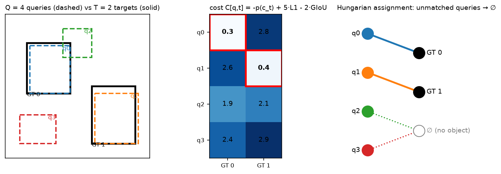
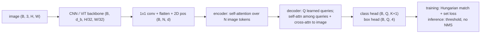

# DETR & set prediction

> **Why this matters at staff level.** DETR turned detection into the same problem a
> language model solves (emit a set of outputs from a fixed pool of queries) and its
> descendants (Deformable DETR, DINO, RT-DETR, DETR3D/BEVFormer in autonomy, Mask2Former
> in segmentation, the SAM decoder) are how modern perception systems talk to
> Transformers. Interviewers use it to test whether you can turn "no NMS" into a concrete
> loss: the matching cost, the Hungarian step, the "no object" weighting, and why the
> original converged so slowly. Strong signal is deriving the loss on a whiteboard,
> implementing the matcher, and naming which fix addresses which failure.

## TL;DR: the interview card

- Detection as **set prediction**: $Q$ learned object queries (100–900) cross-attend to
  image tokens in a Transformer decoder and each emits $(\hat p_q \in \Delta^{K+1}, \hat b_q \in [0,1]^4)$.
  No anchors, no NMS; the model must learn not to duplicate.
  - **Matching** is a minimum-cost bipartite assignment $\hat\sigma = \argmin_\sigma \sum_t C[\sigma(t), t]$ with
  $C[q,t] = -\hat p_q(c_t) + \lambda_1 \|\hat b_q - b_t\|_1 + \lambda_2\,(1 - \text{GIoU}(\hat b_q, b_t))$,
  solved by the Hungarian algorithm in $O(Q^3)$.
  - **Loss** after matching:
  $L = \sum_q -\log \hat p_q(c_{\sigma^{-1}(q)}) + \sum_t [\lambda_1 \|\cdot\|_1 + \lambda_2 (1-\text{GIoU})]$, with
  the "no object" class weighted by $0.1$ because $Q \gg$ objects. DETR uses
  $\lambda_1 = 5$, $\lambda_2 = 2$, and adds the same loss at every decoder layer (auxiliary losses).
  - GIoU $= \text{IoU} - |C\setminus(A\cup B)|/|C|$ where $C$ is the enclosing box: a bounded, scale-
  invariant box loss with gradient even when boxes do not overlap.
  - Slow convergence (500 epochs on COCO) came from (i) dense global attention over
  high-resolution features and (ii) queries with no spatial prior, so early matchings
  are unstable. Fixes: **Deformable DETR** (sparse multi-scale sampling), **Conditional /
  DAB-DETR** (queries are anchor boxes), **DN-DETR / DINO** (denoising queries make the
  matching stable), **RT-DETR** (hybrid encoder, query selection) for real time.
  - Set prediction removes the NMS threshold and the anchor design from your system; the
  cost is $Q$ fixed output slots and a matcher in the training loop.
  - Cross-link: the anchor-based detectors this replaces are in
  [object detection](../part04-vision/04-detection.md).

  ## 1. Intuition first

  Consider an image with two objects and a detector with $Q = 4$ query slots. Each slot
  outputs a class distribution over $\{\text{cat}, \text{dog}, \dots, \varnothing\}$ and a box. The
  question a set loss must answer is: *which slot is responsible for which object?* An
  anchor-based detector answers this by geometry (the anchor with highest IoU) and then
  needs NMS to remove the other anchors that also fired. DETR answers it by solving a tiny
  optimisation: build a $4\times2$ cost matrix, find the one-to-one assignment of lowest total
  cost, train the matched slots to predict their object, and train the other two to say
  $\varnothing$.

  { width="760" }

  *Look at the middle panel: the cost is low where the box overlaps and the class
  probability is high. The red cells are the assignment; queries 2 and 3 are unmatched and
  get the "no object" target. Because the assignment is one-to-one, at most one query can
  be rewarded for each object, so duplicates are penalised by construction, the reason
  NMS is unnecessary.*

  Here is the whole pipeline; everything after the backbone is a Transformer.



## 2. The math

### 2.1 Set prediction and the matching problem

Let the ground truth be a set $y = \{(c_t, b_t)\}_{t=1}^{T}$ with $c_t \in \{1..K\}$ and
$b_t \in [0,1]^4$ in normalised $(c_x, c_y, w, h)$. Pad $y$ with $\varnothing$ to size $Q$. The model
outputs $\hat y = \{(\hat p_q, \hat b_q)\}_{q=1}^{Q}$. Because the outputs form a *set*, the
loss must be invariant to how we order the $Q$ slots; we obtain that by minimising over
permutations $\sigma \in \mathfrak S_Q$:

$$
\hat\sigma = \argmin_{\sigma} \sum_{t=1}^{Q} \mathcal L_{match}\big(y_t, \hat y_{\sigma(t)}\big),
\qquad
\mathcal L_{match}(y_t, \hat y_q) = \mathbb 1[c_t \ne \varnothing]\Big(-\hat p_q(c_t) + \mathcal L_{box}(b_t, \hat b_q)\Big).
$$

Padded targets contribute zero cost to every query, so only the $T$ real targets matter and
the problem is a rectangular $Q\times T$ assignment. Two choices in the matching cost
deserve a sentence each. The class term uses the *probability* $-\hat p_q(c_t)$, not the
log-probability, so that it is commensurate with the box terms (both bounded); the loss
proper uses $-\log \hat p$. And the matching is computed under `no_grad`: it is a
combinatorial step that selects targets, not a differentiable function.

### 2.2 The box cost: L1 and GIoU

An $\ell_1$ loss on normalised boxes has the same value for a 1-pixel error on a small box
and a large one, so it is scale-sensitive. IoU is scale-invariant but has zero gradient when
boxes do not overlap. Generalised IoU fixes that: with $C$ the smallest box enclosing $A$ and $B$,

$$
\boxed{\;\text{GIoU}(A, B) = \frac{|A\cap B|}{|A\cup B|} - \frac{|C \setminus (A\cup B)|}{|C|}\;} \in (-1, 1],
$$

equal to IoU when $C = A\cup B$ (boxes touch or nest) and decreasing towards $-1$ as boxes
separate, so it pulls non-overlapping boxes together. The combined box term is

$$
\mathcal L_{box}(b, \hat b) = \lambda_{L1}\,\|b - \hat b\|_1 + \lambda_{giou}\,\big(1 - \text{GIoU}(b, \hat b)\big), \qquad \lambda_{L1} = 5,\ \lambda_{giou} = 2.
$$

### 2.3 The Hungarian algorithm

Given a cost matrix $C \in \R^{n\times m}$ ($n \le m$ after transposing), the assignment
problem is a linear program whose dual has potentials $u \in \R^n$, $v \in \R^m$ with
$u_i + v_j \le C_{ij}$; the optimum has $\sum_i u_i + \sum_j v_j = \sum_{(i,j)\in\sigma} C_{ij}$
and every matched edge *tight* ($u_i + v_j = C_{ij}$). The $O(n^2 m)$ shortest-augmenting-path
form inserts rows one at a time: starting from the new row, run a Dijkstra-like search
over reduced costs $C_{ij} - u_i - v_j$ across the alternating tree of matched edges until
a free column is reached, adjusting the potentials by the minimum slack $\delta$ at each
step so the tree stays tight, then flip the matched/unmatched status along the path. Each
insertion adds one matched pair and keeps dual feasibility, so after $n$ insertions the
assignment is optimal. `hungarian()` in §3 is this algorithm, tested against
`scipy.optimize.linear_sum_assignment` on square and rectangular matrices.

*What it means:* the matcher is exact and cheap ($Q = 100$, $T \le 100$: microseconds), so
the cost of set prediction is never the matching itself; it is the *instability* of the
matching early in training, which §2.6 addresses.

### 2.4 The DETR loss

With $\hat\sigma$ fixed, the loss is a plain sum over slots:

$$
\boxed{\;
L(y, \hat y) = \sum_{q=1}^{Q} w_{c_q}\,\big(-\log \hat p_q(c_q)\big)
\;+\; \sum_{t:\, c_t \ne \varnothing} \Big[\lambda_{L1}\|b_t - \hat b_{\hat\sigma(t)}\|_1 + \lambda_{giou}\big(1-\text{GIoU}(b_t, \hat b_{\hat\sigma(t)})\big)\Big]
\;}
$$

where $c_q$ is the class of the target matched to slot $q$ (or $\varnothing$), and
$w_{\varnothing} = 0.1$, $w_{k} = 1$ otherwise. The down-weighting is a class-imbalance
correction: with $Q = 100$ and a median of ~7 objects per COCO image, over 90% of slots are
$\varnothing$ and would dominate the gradient. Box terms are normalised by the number of
targets in the batch (not per image) so images with many objects are not down-weighted.
DETR also applies the same loss to the output of *every* decoder layer ("auxiliary
losses"), which the paper reports as important: it forces each layer to produce a usable
set rather than relying on the last one, and gives $6\times$ more gradient signal to the
queries.

*What it means:* the whole objective is a classification loss plus a regression loss; the
only new machinery is choosing the targets by matching, and the only new hyperparameter
is the $\varnothing$ weight.

### 2.5 The architecture

Backbone features $(B, d_b, H/32, W/32)$ are reduced by a $1\times1$ conv to $d = 256$,
flattened to $N = HW/1024$ tokens, and given a fixed 2-D sinusoidal position encoding
(added to $Q$ and $K$ at every attention layer, not once at the input). Six encoder
layers apply self-attention over the $N$ tokens. Six decoder layers take $Q$ learned
*object queries* $O \in \R^{Q\times d}$ (a learned embedding, identical for every image):
each layer runs self-attention among the queries (so they can coordinate and avoid
duplicates), then cross-attention where the queries are $Q$, the image tokens supply $K$
and $V$, the `MultiHeadCrossAttention` of `attention_block.py`. Unlike the original
Transformer, decoding is *parallel*: all $Q$ outputs are produced in one pass, no
autoregression. A linear class head and a 3-layer MLP box head (sigmoid output) sit on
every decoder layer.

### 2.6 Why it converged slowly, and the fixes

DETR needed 500 epochs on COCO to reach 42 AP with a ResNet-50 (its authors' number);
Faster R-CNN gets there in ~36. Two causes are identifiable.

*Dense attention on high-resolution features.* Cross-attention weights start uniform
over $N$ image tokens; learning to focus on a few relevant tokens through softmax over
thousands of positions is slow, and going to multi-scale features (which small objects
need) makes $N$ prohibitive. **Deformable DETR** replaces dense attention with sparse
sampling: each query predicts, per head and per scale, $K = 4$ sampling offsets around a
reference point and $K$ attention weights, and reads bilinearly interpolated values there.
Cost per query drops from $O(N)$ to $O(LK)$ over $L = 4$ scales, training drops to 50
epochs, and small-object AP improves because the decoder can read stride-8 features. The
same mechanism runs in the encoder (each token samples around itself).

*Queries without a spatial prior.* A learned query vector has to encode "where to look"
implicitly; early in training that is random, so the Hungarian assignment flips between
epochs and the gradient chases a moving target. **Conditional DETR** separates content
and spatial parts of the query so cross-attention can localise by position. **DAB-DETR**
makes it explicit: each query *is* a 4-D anchor box $(x, y, w, h)$, its positional
embedding is a sinusoid of that box, width and height modulate the attention spread, and
each decoder layer refines the box (the decoder becomes iterative regression from anchors,
which is the two-stage detector intuition re-entering through the front door).
**DN-DETR** attacks the matching instability directly: add extra queries built from
ground-truth boxes with noise (jittered coordinates, flipped labels) and train them to
reconstruct the clean box *without* matching, those queries have known targets, so they
provide a stable gradient from step 1. **DINO** adds contrastive denoising (positive and
negative noised boxes, so the model also learns to reject near-duplicates), initialises
queries from top-scoring encoder tokens (mixed query selection), and refines boxes
across layers; it was the first DETR family model to top the COCO leaderboard.

**RT-DETR** makes the family real-time: it restricts full self-attention to the lowest
resolution scale and fuses scales with a lightweight CNN path (the "efficient hybrid
encoder"), selects the initial queries by predicted IoU-aware confidence, and lets you
drop decoder layers at inference to trade accuracy for latency without retraining; its
authors report it outperforming YOLO detectors at the same speed on a T4 GPU, with no NMS
in the deployment graph, which removes NMS's data-dependent latency from the pipeline.

*What it means:* the modern recipe (DINO/RT-DETR) is anchor boxes as queries, sparse
multi-scale attention, and denoising queries; the set loss of §2.4 is unchanged.

## 3. Implementation

### 3.1 Hungarian algorithm in NumPy

```python
def hungarian(cost: np.ndarray) -> tuple[np.ndarray, np.ndarray]:
    cost = np.asarray(cost, dtype=float)
    transposed = cost.shape[0] > cost.shape[1]
    if transposed:
        cost = cost.T                                  # (n, m) with n <= m
    n, m = cost.shape
    u = np.zeros(n + 1)                                # row potentials, 1-indexed
    v = np.zeros(m + 1)                                # column potentials, 1-indexed
    match_col = np.zeros(m + 1, dtype=int)             # match_col[j] = row matched to column j (0 = free)
    for i in range(1, n + 1):
        match_col[0] = i                               # virtual column 0 holds the row being inserted
        j0 = 0
        min_v = np.full(m + 1, np.inf)                 # best reduced cost seen per column
        way = np.zeros(m + 1, dtype=int)               # predecessor column on the alternating path
        used = np.zeros(m + 1, dtype=bool)
        while True:                                    # shortest augmenting path over reduced costs
            used[j0] = True
            i0 = match_col[j0]
            delta, j1 = np.inf, 0
            for j in range(1, m + 1):
                if used[j]:
                    continue
                cur = cost[i0 - 1, j - 1] - u[i0] - v[j]
                if cur < min_v[j]:
                    min_v[j], way[j] = cur, j0
                if min_v[j] < delta:
                    delta, j1 = min_v[j], j
            for j in range(m + 1):                     # shift potentials; visited tree stays tight
                if used[j]:
                    u[match_col[j]] += delta
                    v[j] -= delta
                else:
                    min_v[j] -= delta
            j0 = j1
            if match_col[j0] == 0:
                break                                  # free column reached: augment
        while j0 != 0:                                 # flip the path
            j1 = way[j0]
            match_col[j0] = match_col[j1]
            j0 = j1
    ...  # unpack match_col into (rows, cols); undo the transpose
```

Read the inner loop as Dijkstra where the "distance" to column $j$ is the smallest
reduced cost of any edge from the visited rows, and $\delta$ is the next node to settle.
The potential update is what keeps every already-matched edge tight after settling.

### 3.2 GIoU, the matching cost and the loss

```python
def pairwise_giou(a: torch.Tensor, b: torch.Tensor) -> torch.Tensor:
    area_a = (a[:, 2] - a[:, 0]) * (a[:, 3] - a[:, 1])        # (N,)
    area_b = (b[:, 2] - b[:, 0]) * (b[:, 3] - b[:, 1])        # (M,)
    lt = torch.max(a[:, None, :2], b[None, :, :2])            # (N, M, 2)
    rb = torch.min(a[:, None, 2:], b[None, :, 2:])            # (N, M, 2)
    wh = (rb - lt).clamp(min=0)                               # (N, M, 2)
    inter = wh[..., 0] * wh[..., 1]                           # (N, M)
    union = area_a[:, None] + area_b[None, :] - inter         # (N, M)
    iou = inter / union                                       # (N, M)
    lt_c = torch.min(a[:, None, :2], b[None, :, :2])          # (N, M, 2) enclosing box
    rb_c = torch.max(a[:, None, 2:], b[None, :, 2:])          # (N, M, 2)
    wh_c = (rb_c - lt_c).clamp(min=0)                         # (N, M, 2)
    area_c = wh_c[..., 0] * wh_c[..., 1]                      # (N, M)
    return iou - (area_c - union) / area_c                    # (N, M)
```

```python
@torch.no_grad()
def hungarian_match(logits, boxes, targets, w_class=1.0, w_l1=5.0, w_giou=2.0):
    out = []
    for b, tgt in enumerate(targets):
        prob = logits[b].softmax(-1)                                       # (Q, K+1)
        cost_class = -prob[:, tgt["labels"]]                               # (Q, T)
        cost_l1 = torch.cdist(boxes[b], tgt["boxes"], p=1)                 # (Q, T)
        cost_giou = -pairwise_giou(box_cxcywh_to_xyxy(boxes[b]),
                                   box_cxcywh_to_xyxy(tgt["boxes"]))       # (Q, T)
        C = w_class * cost_class + w_l1 * cost_l1 + w_giou * cost_giou     # (Q, T)
        rows, cols = hungarian(C.cpu().numpy())
        out.append((torch.as_tensor(rows), torch.as_tensor(cols)))
    return out
```

```python
def detr_loss(logits, boxes, targets, w_l1=5.0, w_giou=2.0, eos_coef=0.1):
    B, Q, K1 = logits.shape
    no_obj = K1 - 1
    match = hungarian_match(logits, boxes, targets, w_l1=w_l1, w_giou=w_giou)
    target_classes = torch.full((B, Q), no_obj, dtype=torch.long)          # (B, Q): default = no object
    matched_pred, matched_tgt = [], []
    for b, (rows, cols) in enumerate(match):
        target_classes[b, rows] = targets[b]["labels"][cols]
        matched_pred.append(boxes[b, rows])                                # (T_b, 4)
        matched_tgt.append(targets[b]["boxes"][cols])                      # (T_b, 4)
    class_weight = torch.ones(K1)                                          # (K+1,)
    class_weight[no_obj] = eos_coef
    loss_ce = F.cross_entropy(logits.reshape(B * Q, K1), target_classes.reshape(B * Q), weight=class_weight)
    pred_b = torch.cat(matched_pred, dim=0)                                # (T_total, 4)
    tgt_b = torch.cat(matched_tgt, dim=0)                                  # (T_total, 4)
    n_tgt = max(pred_b.shape[0], 1)
    loss_l1 = (pred_b - tgt_b).abs().sum() / n_tgt
    giou = pairwise_giou(box_cxcywh_to_xyxy(pred_b), box_cxcywh_to_xyxy(tgt_b)).diagonal()  # (T_total,)
    loss_giou = (1.0 - giou).sum() / n_tgt
    return {"loss": loss_ce + w_l1 * loss_l1 + w_giou * loss_giou, ...}
```

The matcher builds the $Q\times T$ cost with three broadcasts and calls the NumPy
Hungarian; the loss writes matched labels into a `(B, Q)` target tensor pre-filled with
$\varnothing$, so the cross-entropy over all $BQ$ slots with `weight` implements
$w_\varnothing = 0.1$ in one call. Box terms use only the matched rows, normalised by the
number of targets in the batch.

??? example "Full implementation: `src/mlbook/multimodal/hungarian.py`"
    ```python
    --8<-- "src/mlbook/multimodal/hungarian.py"
    ```

??? example "Full implementation: `src/mlbook/multimodal/detr_loss.py`"
    ```python
    --8<-- "src/mlbook/multimodal/detr_loss.py"
    ```

**How you'd test it.** `tests/test_multimodal_detr.py`: (i) `hungarian` equals
`scipy.optimize.linear_sum_assignment` in total cost on random square and rectangular
matrices and on a hand-solved $3\times3$; (ii) `pairwise_giou` returns $1$ for identical
boxes, $0$ for touching boxes and $-1/3$ for unit boxes separated by a unit gap; (iii) the
loss is $< 10^{-5}$ when two queries predict the two targets exactly with confident logits
and the rest predict $\varnothing$; (iv) permuting the queries (and separately the targets)
leaves the matching and the loss unchanged; (v) gradients are finite with an empty target
image in the batch.

## Retype by hand

| Symbol | File | Retype? | Target time |
|---|---|---|---|
| `hungarian` | `src/mlbook/multimodal/hungarian.py` | **Yes**: the classic coding-round ask | 30 min |
| `pairwise_giou`, `box_cxcywh_to_xyxy` | `src/mlbook/multimodal/detr_loss.py` | **Yes** | 10 min |
| `hungarian_match` | `src/mlbook/multimodal/detr_loss.py` | **Yes** | 10 min |
| `detr_loss` | `src/mlbook/multimodal/detr_loss.py` | **Yes** | 15 min |
| `assignment_cost`, `matching_as_permutation` | same files | Read |: |

Checks: `python -m pytest tests/test_multimodal_detr.py -q`; per symbol
`-k hungarian`, `-k giou`, `-k perfect_prediction`, `-k permutation`.

## 4. Systems view: cost, failure modes, trade-offs

**Compute.** Encoder self-attention over $N = HW/1024$ tokens costs $2N^2 d$ per layer:
at $800\times1333$ input, $N \approx 1050$, which is cheap; the problem is that multi-scale
features (stride 8 adds $16\times$ more tokens) push $N$ past $10^4$ and the quadratic term
past the backbone. Deformable attention makes the encoder $O(N L K d)$. The decoder is
$O(Q N d)$ for cross-attention plus $O(Q^2 d)$ for self-attention, negligible. The
matcher is $O(Q^3)$ per image on the CPU; at $Q = 900$ (DINO) it is a few milliseconds and
worth running in a background thread alongside the GPU.

**Latency at inference.** No NMS means no data-dependent post-processing; the output is
a fixed $(Q, K+1)$ and $(Q, 4)$ tensor and thresholding is a single comparison. This matters
for deployment on accelerators and for latency SLAs: NMS is a serial, variable-time op
that is awkward to express in TensorRT graphs, and the reason RT-DETR's authors make a
point of "end-to-end" speed.

**Failure modes.**

* *Small objects*: DETR-R50 lags Faster R-CNN by several AP on $\text{AP}_S$ because it
  decodes from stride-32 features; fix with multi-scale deformable attention or a
  higher-resolution backbone stage (DC5).
  * *Crowded scenes with $T > Q$*: the model can output at most $Q$ objects. Set $Q$ well above
  the maximum expected count (DINO uses 900), or tile.
  * *Matching flicker early in training*: loss plateaus for many epochs; symptom is that
  the same query's target changes every step. Fix with denoising queries (DN/DINO) and
  anchor-box queries (DAB).
  * *Duplicate predictions after fine-tuning on a small dataset*: the query self-attention
  has not learned to de-duplicate for the new class distribution. More epochs, or the
  contrastive denoising of DINO, which explicitly trains rejection of near-duplicates.
  * *Confidence calibration*: with $w_\varnothing = 0.1$ the $\varnothing$ probability is
  under-estimated; calibrate the operating threshold on a validation set rather than
  reusing a Faster R-CNN threshold.

  **When to use what.**

  | Situation | Choose | Decision rule |
  |---|---|---|
  | Real-time detection on GPU, need end-to-end graph without NMS | RT-DETR (or a YOLO with NMS if edge NPU) | RT-DETR when NMS latency variance is a problem and a GPU is available |
  | Highest accuracy, offline or server, large data | DINO-style DETR with Swin/ViT backbone | Denoising + anchor queries + multi-scale deformable attention |
  | Tiny dataset (< 5k images) | Fine-tune a pre-trained DETR family model or use a two-stage detector | DETR family from scratch will not converge in reasonable time |
  | Multi-camera 3-D detection (autonomy) | DETR3D / BEVFormer style queries in 3-D space | Queries are the natural way to fuse cameras; see [Part XI](../part11-perception-autonomy/02-multi-camera-bev.md) |
  | Open-vocabulary detection | Grounding DINO / OWL-ViT | Class head becomes a dot product with text embeddings from [CLIP](03-clip-contrastive.md) |
  | Segmentation with the same machinery | Mask2Former | Queries emit mask embeddings; matching cost adds a mask term |

  ## 5. In production

  !!! production "Baidu: RT-DETR, a real-time DETR for deployment without NMS"
    The RT-DETR paper (Baidu authors) frames the business problem as YOLO's NMS being a
    latency and tuning liability at deployment. They built a hybrid encoder (attention only
    on the coarsest scale, CNN fusion across scales), IoU-aware query selection, and a
    decoder whose depth can be cut at inference; they report beating YOLO-family detectors
    at matched speed on a T4 GPU on COCO and ship it in PaddleDetection. What they rejected:
    Deformable DETR's full multi-scale encoder, which was too slow for real time. Source:
    *DETRs Beat YOLOs on Real-time Object Detection*, Zhao et al., CVPR 2024
    (arXiv:2304.08069).

    !!! production "Meta (FAIR): Segment Anything's prompt decoder is a DETR-style decoder"
    SAM's mask decoder feeds learned output tokens (one per mask candidate plus an IoU
    token) together with prompt tokens through a two-way Transformer that cross-attends
    to the image embedding, then predicts masks from the output tokens, the object-query
    pattern with prompts as extra queries. The trade-off: a decoder small enough to run in
    tens of milliseconds in a browser so that the heavy image encoder runs once per image.
    Source: *Segment Anything*, Kirillov et al., ICCV 2023 (arXiv:2304.02643).

    !!! production "Autonomy stacks: queries as the interface between cameras and 3-D"
    DETR3D and BEVFormer generalise object queries to 3-D reference points that project
    into each camera to gather features, and the public BEV-perception literature that
    autonomy companies build on is DETR-shaped; Tesla's AI Day 2021 talk described learned
    BEV queries cross-attending to multi-camera features. The set-prediction loss carries
    over unchanged with 3-D boxes and a 3-D GIoU/L1 cost. Sources: *DETR3D*, Wang et al.,
    CoRL 2021 (arXiv:2110.06922); *BEVFormer*, Li et al., ECCV 2022 (arXiv:2203.17270);
    details in [multi-camera & BEV](../part11-perception-autonomy/02-multi-camera-bev.md).

    !!! production "Labelling pipelines: open-vocabulary DETRs as auto-labelers"
    Grounding DINO (a DINO detector whose class head is a dot product with text features)
    combined with SAM is the standard open-source recipe for turning a text prompt into
    boxes and masks over an unlabelled corpus, used as the first pass in the auto-labelling
    systems of [Part X](../part10-self-supervised/03-weak-supervision-and-auto-labeling.md).
    The trade-off is precision: the matcher trains for recall across many prompts, so a
    human-verification or high-threshold stage follows. Source: *Grounding DINO*, Liu et
    al., ECCV 2024 (arXiv:2303.05499).

    ## 6. Interview questions and strong answers

    !!! interview "Why does DETR not need NMS?"
    Because the training loss is defined through a one-to-one matching: for each image,
    exactly one query is matched to each ground-truth object and rewarded for predicting
    it; every other query is trained to output $\varnothing$. A duplicate prediction is,
    by construction, an unmatched query predicting an object, and is penalised. The
    decoder's self-attention among queries is the mechanism that lets queries see each
    other and coordinate. NMS in anchor-based detectors exists because their loss assigns
    *many* anchors to each object (all with IoU above a threshold), so duplicates are
    rewarded in training and must be removed afterwards.
    **Staff follow-up:** "Then why do fine-tuned DETRs sometimes still emit duplicates?", 
    De-duplication is learned, not guaranteed; with few examples of a new class the
    queries have not learned to compete for it. DINO's contrastive denoising adds negative
    queries near each GT box that must predict $\varnothing$, which trains rejection of
    near-duplicates explicitly.

    !!! interview "Write down the matching cost and the loss. Why are they different?"
    Cost $C[q,t] = -\hat p_q(c_t) + 5\|\hat b_q - b_t\|_1 + 2(1 - \text{GIoU})$; loss
    $= -\log \hat p_q(c_q)$ (weighted 0.1 for $\varnothing$) plus the same box terms on
    matched pairs. The cost uses the probability rather than the log so its scale matches
    the bounded box terms and the assignment is not dominated by a few very confident
    slots; the loss uses the log because cross-entropy is the proper scoring rule with
    the right gradient. The matching is `no_grad`; the loss is differentiable.
    **Staff follow-up:** "What breaks if you set $w_\varnothing = 1$?", 90%+ of slots
    are $\varnothing$, the classifier collapses toward predicting $\varnothing$
    everywhere, recall dies early and the matching gets no useful class signal.

    !!! interview "Explain GIoU and why it is in both the cost and the loss."
    $\text{GIoU} = \text{IoU} - |C\setminus(A\cup B)|/|C|$ with $C$ the enclosing box. IoU
    alone is zero (with zero gradient) for disjoint boxes; the enclosing-box term gives a
    signal that decreases as boxes drift apart. It is scale-invariant, unlike L1, so the
    combination handles large and small boxes evenly. It appears in the cost so the
    matching prefers spatially close queries even before the class head is trained.
    **Staff follow-up:** "What would you change for 3-D boxes with yaw?" Rotated IoU is
    non-differentiable in the corner cases; production 3-D detectors use L1 on
    $(x,y,z,l,w,h,\sin\theta,\cos\theta)$ plus an IoU-based cost computed without
    gradients for matching.

    !!! interview "Implement the Hungarian algorithm. What is its complexity, and does it matter?"
    The shortest-augmenting-path form: insert rows one at a time, run a Dijkstra over
    reduced costs $C_{ij} - u_i - v_j$ through the alternating tree until a free column,
    update potentials by the minimum slack, flip the path. $O(n^2 m)$; for $Q = 100$–$900$
    it is microseconds to milliseconds per image on CPU. It does not bottleneck training;
    in a distributed setup you run it per rank on the CPU while the GPU computes the
    encoder for the next batch. (The code in §3 is the whiteboard version.)
    **Staff follow-up:** "Could you use a greedy assignment instead?" Greedy is not
    optimal and produces a different, order-dependent matching; the loss would then not be
    permutation-invariant and training becomes noisier. Some works use a *Sinkhorn*
    soft assignment for speed at very large $Q$, but exact Hungarian is standard.

    !!! interview "DETR took 500 epochs. Name the two causes and the fix for each."
    (1) Dense softmax attention over thousands of image tokens has to learn sparsity
    from uniform; multi-scale makes it worse, fix: deformable attention, sampling 4 points
    per scale per head with predicted offsets. (2) Queries carry no spatial prior, so the
    Hungarian assignment is unstable early, fixes: anchor-box queries (DAB-DETR) so the
    query knows where it looks, and denoising queries (DN-DETR/DINO) that provide matched
    targets without the matcher. Together, 12–36 epochs instead of 500.
    **Staff follow-up:** "Which of these would you keep for a real-time model?", 
    RT-DETR keeps query selection from encoder tokens and drops the full multi-scale
    attention encoder; deformable attention in the decoder is retained; denoising is a
    training-only cost, so keep it.

    !!! interview "You have a DETR family detector with 900 queries and a scene with 1,200 objects. What happens, and what do you do?"
    The model cannot emit more than $Q$ detections; the matcher will leave 300 targets
    unmatched every step and the model learns to ignore them, biasing toward the largest
    or most confident objects. Options: raise $Q$ (cost is $O(Q^2 d)$ in self-attention and
    $O(Q N d)$ in cross-attention, cheap up to a few thousand), tile the image and merge
    with a light NMS across tile borders, or move to a dense (per-pixel) head for this
    regime, where set prediction's advantages are smallest.

    ## 7. Exercises

    1. ★ Compute GIoU by hand for $A = [0,0,2,2]$ and $B = [1,1,3,3]$ (xyxy).

    ??? success "Solution"
        Intersection $= 1$, union $= 4 + 4 - 1 = 7$, IoU $= 1/7$. Enclosing box $[0,0,3,3]$ has
        area 9. GIoU $= 1/7 - (9 - 7)/9 = 0.1429 - 0.2222 = -0.079$. Negative even though the
        boxes overlap: the enclosing-box penalty is larger than the IoU when overlap is small.

        2. ★ Show that the DETR loss is invariant to permuting the $Q$ output slots.

    ??? success "Solution"
        Let $\pi$ permute the slots, $\hat y' = \hat y \circ \pi$. For any $\sigma$,
        $\sum_t \mathcal L_{match}(y_t, \hat y'_{\sigma(t)}) = \sum_t \mathcal L_{match}(y_t, \hat y_{\pi(\sigma(t))})$,
        so the minimum over $\sigma$ of the permuted problem equals the minimum over
        $\pi\circ\sigma$ of the original, which ranges over the same set. Hence
        $\hat\sigma' = \pi^{-1}\circ\hat\sigma$ and every term in $L$ is the same.
        `test_matching_permutation_invariant` checks this numerically.

        3. ★★ (coding) Add auxiliary losses: given a list of per-layer `(logits, boxes)`
   outputs, return the sum of `detr_loss` over layers. Check with the toy perfect case
   that the total is zero when every layer is perfect and grows linearly with the number
   of imperfect layers.

    ??? success "Solution"
        ```python
        def detr_loss_with_aux(layer_outputs, targets):
            total = 0.0
            for logits, boxes in layer_outputs:                    # each (B, Q, K+1), (B, Q, 4)
                total = total + detr_loss(logits, boxes, targets)["loss"]
            return total
        ```
        Each layer is matched *independently* (its own Hungarian call), which is what
        DETR does; a query may be matched to different targets at different layers early
        in training.

        4. ★★ Derive the cost of multi-scale deformable attention per query and compare with
   dense attention over four scales for a $1024\times1024$ image with strides 8–64.

    ??? success "Solution"
        Dense: token counts $128^2 + 64^2 + 32^2 + 16^2 = 21{,}760$; per query $O(N d) = 21{,}760\,d$.
        Deformable with $L = 4$ scales, $K = 4$ points, $H = 8$ heads: $L K H = 128$ samples,
        each a bilinear read of $d/H$ channels: $O(LKd) = 16d$ plus predicting $2LKH$ offsets
        and $LKH$ weights from the query ($O(3LKH\,d)$ linear). Roughly $10^3\times$ fewer
        reads per query.

        5. ★★★ (coding) Implement DN-DETR-style denoising queries on the toy problem: for each
   target, create a noised copy of its box (add $\mathcal N(0, 0.05)$ to each coordinate),
   append these as extra "queries" with known targets, and add an L1 + GIoU
   reconstruction loss for them that bypasses the matcher. Verify that the extra loss is
   zero when the noise is zero, and that with the attention mask of your choice the
   denoising queries cannot leak the answer to the ordinary queries.

    ??? success "Solution"
        The denoising loss is `(pred_dn - boxes_gt).abs().sum()/T + (1 - giou).sum()/T` on
        the appended slots; with zero noise and an identity "decoder" it vanishes. The
        leakage mask is a block matrix over `[Q ordinary | T_dn denoising]` queries in the
        decoder self-attention: ordinary queries must not attend to denoising queries
        (they would read the ground truth), and denoising groups must not attend to each
        other (they would read other groups' clean boxes). Implement it as an additive
        $(Q+T_{dn})\times(Q+T_{dn})$ mask with $-10^9$ in the forbidden blocks and pass it to
        `MultiHeadSelfAttention`.

        ## References

        Sources are listed by title, venue and arXiv identifier (external links could not be
        verified from this build environment; search the title or the identifier).

        * Carion et al., *End-to-End Object Detection with Transformers*, ECCV 2020. arXiv:2005.12872.
        * Zhu et al., *Deformable DETR: Deformable Transformers for End-to-End Object Detection*, ICLR 2021. arXiv:2010.04159.
        * Meng et al., *Conditional DETR for Fast Training Convergence*, ICCV 2021. arXiv:2108.06152.
        * Liu et al., *DAB-DETR: Dynamic Anchor Boxes are Better Queries for DETR*, ICLR 2022. arXiv:2201.12329.
        * Li et al., *DN-DETR: Accelerate DETR Training by Introducing Query DeNoising*, CVPR 2022. arXiv:2203.01305.
        * Zhang et al., *DINO: DETR with Improved DeNoising Anchor Boxes for End-to-End Object Detection*, ICLR 2023. arXiv:2203.03605.
        * Zhao et al., *DETRs Beat YOLOs on Real-time Object Detection* (RT-DETR), CVPR 2024. arXiv:2304.08069.
        * Rezatofighi et al., *Generalized Intersection over Union: A Metric and A Loss for Bounding Box Regression*, CVPR 2019. arXiv:1902.09630.
        * Kuhn, *The Hungarian method for the assignment problem*, Naval Research Logistics Quarterly, 1955; Munkres, *Algorithms for the assignment and transportation problems*, J. SIAM, 1957.
        * Cheng et al., *Masked-attention Mask Transformer for Universal Image Segmentation* (Mask2Former), CVPR 2022. arXiv:2112.01527.
        * Wang et al., *DETR3D: 3D Object Detection from Multi-view Images via 3D-to-2D Queries*, CoRL 2021. arXiv:2110.06922.
        * Li et al., *BEVFormer: Learning Bird's-Eye-View Representation from Multi-Camera Images via Spatiotemporal Transformers*, ECCV 2022. arXiv:2203.17270.
        * Liu et al., *Grounding DINO: Marrying DINO with Grounded Pre-Training for Open-Set Object Detection*, ECCV 2024. arXiv:2303.05499.
        * Minderer et al., *Simple Open-Vocabulary Object Detection with Vision Transformers* (OWL-ViT), ECCV 2022. arXiv:2205.06230.
        * Kirillov et al., *Segment Anything*, ICCV 2023. arXiv:2304.02643.
