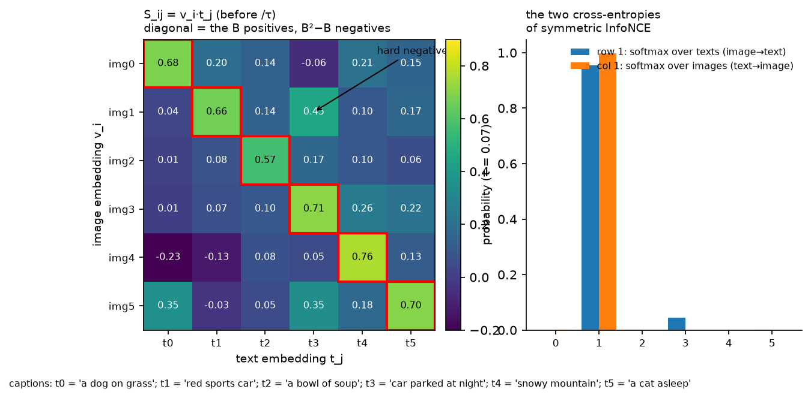
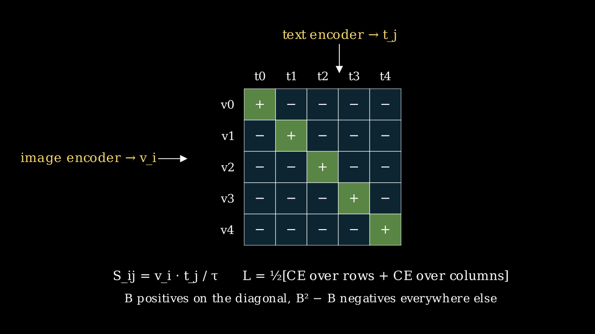
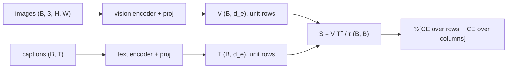

# CLIP and contrastive learning

> **Why this matters at staff level.** CLIP is the layer of the stack where images and
> language first meet, and it is the vision tower inside almost every VLM you will be asked
> about. Interviewers use it to test three things at once: whether you can derive a
> contrastive loss and say what it estimates, whether you understand why batch size and
> temperature are the real hyperparameters, and whether you know how a retrieval or
> zero-shot system built on it fails in production. Strong signal is deriving symmetric
> InfoNCE and the SigLIP alternative at a whiteboard, then explaining why one decouples from
> batch size and the other does not.

## TL;DR: the interview card

- Two encoders and two projection heads produce unit vectors $v_i = f_V(x_i)/\|\cdot\|$ and
  $t_j = f_T(c_j)/\|\cdot\|$. The batch similarity matrix is $S_{ij} = v_i^\top t_j/\tau$,
  with $S \in \R^{B\times B}$.
- Symmetric InfoNCE: $L = \tfrac12[\text{CE}(S, \text{diag}) + \text{CE}(S^\top, \text{diag})]$.
  Each image picks its caption out of $B$, and each caption its image.
- InfoNCE lower-bounds mutual information: $I(v; t) \ge \log B - L$. The bound is capped at
  $\log B$, which is one reason large batches matter, CLIP used 32,768. The other reason is
  more negatives per positive.
- Temperature $\tau$ is learned as $\log(1/\tau)$, initialised at $1/0.07$ and clamped at
  100. It sets how peaked the softmax is and therefore how hard the hard negatives bite.
- SigLIP: $L = -\frac1B\sum_{ij}\log\sigma(z_{ij}(t' v_i^\top t_j + b))$ with $z_{ij} = \pm1$.
  Every pair is an independent binary problem with no normalisation over the batch, so the
  per-pair gradient does not change with $B$, and the loss can be computed chunk-wise across
  devices without an all-gather of the full logits.
- Zero-shot classification: embed prompts such as "a photo of a {class}", ensemble several
  templates, classify by cosine similarity. Prompt wording is a hyperparameter.
- Data is the model: WIT-400M (CLIP), ALIGN's 1.8B noisy pairs, LAION-5B filtered by CLIP
  score, DataComp's controlled filtering benchmark. Filtering with a CLIP model bakes CLIP's
  biases into the next CLIP.
- Failure modes: bag-of-words behaviour where word order and relations are ignored,
  typographic attacks where text in the image overrides the object, a modality gap where
  image and text embeddings occupy separate cones, and weak counting and spatial reasoning.
- As a VLM backbone, take patch tokens from a late but not final layer, not the pooled
  vector.

## 1. Intuition first

Six images and six captions arrive as a batch. Embed each image to a unit vector and each
caption to a unit vector, then compute all 36 dot products. The six pairs that came together
(the diagonal) should score high, and the thirty that did not should score low. That is the
entire training signal. There are no labels, only the fact that this caption was written
about this image.

{ width="760" }

*Look at the off-diagonal cell (img1, t3): "red sports car" and "car parked at night" are a
hard negative, similar captions for different images. With $\tau = 0.07$ the row-1 softmax
still puts visible mass on it, shown in the right panel. Hard negatives in the batch are
where the gradient comes from once easy pairs are separated, so batch composition matters as
much as batch size.*

{ width="640" }

*The same picture as a schematic: $B$ positives, $B^2 - B$ negatives, both encoders trained
only through $S$.*

This produces a useful space because to score its own caption above thirty others, the image
encoder has to encode whatever the caption mentions: objects, attributes, scene, style, text
in the image. The text encoder has to encode the same things in the same directions. Nothing
forces either to encode what captions never mention, such as precise counts or exact spatial
layout, which is exactly the failure profile in section 4.



## 2. The math

### 2.1 Symmetric InfoNCE

Let $V \in \R^{B\times d_e}$ and $T \in \R^{B\times d_e}$ have unit rows and $S = VT^\top/\tau$.
The image-to-text term treats row $i$ as logits over the $B$ captions with correct label $i$:

$$
L_{i\to t} = -\frac1B\sum_{i=1}^{B} \log \frac{\exp(S_{ii})}{\sum_{j=1}^{B}\exp(S_{ij})},
\qquad
L_{t\to i} = -\frac1B\sum_{j=1}^{B} \log \frac{\exp(S_{jj})}{\sum_{i=1}^{B}\exp(S_{ij})},
$$

$$
\boxed{\;L_{\text{CLIP}} = \tfrac12\,(L_{i\to t} + L_{t\to i})\;}
$$

Both terms are needed. The row softmax alone lets one caption be the argmax for many images,
because nothing normalises over images, and the column softmax alone has the mirror problem.
At initialisation with $S \approx 0$, each term equals $\log B$, which the test in section 3
checks.

**Gradient.** For the row term, with $p_{ij} = \softmax_j(S_{i\cdot})$,

$$
\frac{\partial L_{i\to t}}{\partial v_i} = \frac{1}{B\tau}\Big(\sum_j p_{ij}\,t_j - t_i\Big) = \frac{1}{B\tau}\sum_{j\ne i} p_{ij}\,(t_j - t_i).
$$

Each image embedding is pushed toward its caption and away from the other captions, weighted
by how much probability the model currently gives them. Once $p_{ii} \to 1$ the gradient
vanishes, and the surviving gradient comes from hard negatives with non-negligible $p_{ij}$.
Dividing by $\tau$ scales the whole thing, so a small $\tau$ means a sharp softmax where only
the few hardest negatives contribute, and a large gradient magnitude.

### 2.2 InfoNCE bounds mutual information

Take the row term with one positive and $B-1$ negatives drawn from the marginal. Let
$f(v, t) = \exp(v^\top t/\tau)$. The optimal critic satisfies
$f^\star(v,t) \propto p(t\mid v)/p(t)$, the standard result that the Bayes-optimal classifier
for "which of the $B$ captions is the true one" scores each by the density ratio. Because the
negatives are independent of $v_i$, $\E_{t_j}\big[p(t_j\mid v_i)/p(t_j)\big] = 1$, and applying
Jensen's inequality to the resulting expression gives $L^\star \ge \log B - I(v; t)$, that is

$$
\boxed{\;I(v; t) \;\ge\; \log B - L_{\text{InfoNCE}}\;}
$$

Minimising the loss maximises a lower bound on the mutual information between image and text
representations, and the bound can never exceed $\log B$. With $B = 32{,}768$,
$\log B \approx 10.4$ nats; with $B = 256$, 5.5 nats. This is one mechanism, though not the
only one, by which batch size acts as a capacity limit on what contrastive training can
learn: if the true mutual information exceeds $\log B$, the loss saturates before the
representation is finished. The full derivation is in the CPC paper, and the
information-theory prerequisites are in [Part I](../part01-math/05-information-theory.md).

### 2.3 The temperature and its clamp

CLIP parameterises $\tau$ through a scalar $s = \log(1/\tau)$ so that $1/\tau = e^s$ is
positive and the optimiser works in log space. $s$ is initialised to
$\log(1/0.07) \approx 2.66$ and clamped so that $1/\tau \le 100$. Learning it helps because
the right sharpness depends on how separated the embeddings currently are, and it rises
during training as positives pull away from negatives. Clamping it is necessary because the
loss can be reduced by scaling all logits, making the softmax arbitrarily sharp, once the
ranking is right. That produces huge gradients and instability, and the clamp removes the
degenerate direction. Because the embeddings are unit vectors,
$S_{ij} \in [-100, 100]$ at the clamp, which is why CLIP normalises before the dot product
rather than after.

### 2.4 SigLIP: a sigmoid instead of a softmax

Replace the two softmaxes with $B^2$ independent logistic regressions. With learnable
$t' = e^{s}$ and bias $b$, and labels $z_{ij} = +1$ on the diagonal and $-1$ elsewhere,

$$
\boxed{\;L_{\text{SigLIP}} = -\frac1B\sum_{i=1}^{B}\sum_{j=1}^{B}\log\sigma\!\big(z_{ij}\,(t'\,v_i^\top t_j + b)\big)\;}
$$

Three consequences follow from the formula.

1. There is no normalisation across the batch. The gradient of pair $(i,j)$ is
   $-z_{ij}\,\sigma(-z_{ij}\ell_{ij})\,\partial\ell_{ij}$, which depends only on that pair's
   logit. In InfoNCE the gradient of every pair carries $p_{ij}$, which depends on all $B$
   logits in the row. SigLIP's per-pair signal is therefore the same at $B = 4$k and
   $B = 32$k; what changes with $B$ is only how many negatives you see per step.
2. Imbalance needs a bias. There are $B$ positives and $B^2 - B$ negatives, so at
   initialisation the loss is dominated by negatives. SigLIP initialises $b = -10$ so every
   pair starts confidently negative and the positives supply the early gradient. $t'$ is
   initialised at 10.
3. Computation chunks. Because the loss is a sum over pairs, a device holding $b$ images can
   compute its block of the loss against text embeddings passed around a ring, one device's
   chunk at a time, never materialising the $B\times B$ matrix or all-gathering embeddings.
   Memory is $O(b^2)$ per device instead of $O(B^2)$.

SigLIP's authors report that the sigmoid loss is better than softmax at small batches, equal
at 32k, and that gains from batch size saturate around 32k for both. The practical result is
that a strong contrastive encoder can be trained on a small number of TPU chips without the
batch-size arms race.

### 2.5 Zero-shot classification and prompts

For $K$ classes, build prompts $c_k$ such as "a photo of a $\{\text{name}_k\}$", embed them
to $t_k$, and classify $x$ by $\argmax_k v^\top t_k$. This is a linear classifier whose
weight matrix is written by the text encoder. CLIP's authors report that prompt engineering,
for example "a photo of a {}, a type of pet" for Oxford Pets, and ensembling 80 templates by
averaging the text embeddings before normalising, improves ImageNet zero-shot accuracy by
several points. The class name alone is out of distribution for a model trained on captions.
Averaging templates in embedding space is an ensemble of classifiers computed once, at zero
inference cost.

### 2.6 The modality gap

Image and text embeddings from a trained CLIP occupy two separate narrow cones on the
sphere, and the cosine similarity between an image and any text is much lower than between
two images. Two contributors are documented: the cone effect of initialisation, where
randomly initialised deep encoders map all inputs to a narrow cone and the two encoders
start in different cones, and a contrastive loss with a temperature that does not push the
cones together because the ranking is already right. The consequences for you are that
image-text similarities are only comparable within a modality pair, so rank rather than
threshold across modalities, and that mixing image and text queries in one nearest-neighbour
index needs per-modality calibration.

## 3. Implementation

### 3.1 Encoders and the model

```python
class MiniCLIP(nn.Module):
    def __init__(self, image_encoder, text_encoder, d_img, d_txt, d_embed) -> None:
        super().__init__()
        self.image_encoder = image_encoder
        self.text_encoder = text_encoder
        self.proj_img = nn.Linear(d_img, d_embed, bias=False)
        self.proj_txt = nn.Linear(d_txt, d_embed, bias=False)
        self.logit_scale = nn.Parameter(torch.tensor(math.log(1 / 0.07)))   # scalar, τ = 0.07 at init
        self.max_logit_scale = math.log(100.0)                              # CLIP clamps 1/τ <= 100

    def encode_image(self, x: torch.Tensor) -> torch.Tensor:
        v = self.proj_img(self.image_encoder(x))                            # (B, d_e)
        return nn.functional.normalize(v, dim=-1)                           # (B, d_e)

    def encode_text(self, ids: torch.Tensor) -> torch.Tensor:
        t = self.proj_txt(self.text_encoder(ids))                           # (B, d_e)
        return nn.functional.normalize(t, dim=-1)                           # (B, d_e)

    def forward(self, x: torch.Tensor, ids: torch.Tensor) -> torch.Tensor:
        v = self.encode_image(x)                                            # (B, d_e)
        t = self.encode_text(ids)                                           # (B, d_e)
        scale = self.logit_scale.clamp(max=self.max_logit_scale).exp()     # scalar = 1/τ
        return scale * v @ t.T                                              # (B, B)
```

`TinyImageEncoder` is the ViT of [chapter 1](01-vision-transformers.md) with mean pooling.
`TinyTextEncoder` is a token-embedding Transformer with an additive key mask of shape
`(B, 1, 1, T)` so padded positions receive no attention, followed by a masked mean pool. The
projection heads are bias-free linear maps to a shared $d_e$, and normalisation happens after
projection so that `forward` returns cosine similarities scaled by $1/\tau$.

### 3.2 The two losses

```python
def clip_loss(logits_per_image: torch.Tensor) -> torch.Tensor:
    B = logits_per_image.shape[0]
    labels = torch.arange(B, device=logits_per_image.device)                # (B,)
    loss_i = nn.functional.cross_entropy(logits_per_image, labels)          # rows: image -> text
    loss_t = nn.functional.cross_entropy(logits_per_image.T, labels)        # columns: text -> image
    return 0.5 * (loss_i + loss_t)


def siglip_loss(v, t, log_t, bias) -> torch.Tensor:
    B = v.shape[0]
    logits = (v @ t.T) * log_t.exp() + bias                                 # (B, B)
    z = 2 * torch.eye(B, device=v.device) - 1                               # (B, B): +1 diag, -1 off
    return -nn.functional.logsigmoid(z * logits).sum() / B
```

`clip_loss` is two cross-entropies with the identity as the label matrix, and the transpose
is the only difference between the image-to-text and text-to-image terms. `siglip_loss`
builds the $\pm1$ label matrix and applies `logsigmoid` elementwise. The sum over $B^2$ pairs
divided by $B$ matches the paper's normalisation.

### 3.3 Zero-shot classification

```python
@torch.no_grad()
def zero_shot_classify(model, images, class_prompt_ids) -> torch.Tensor:
    v = model.encode_image(images)                 # (B, d_e)
    t = model.encode_text(class_prompt_ids)        # (K, d_e)
    return model.logit_scale.exp() * v @ t.T       # (B, K)
```

To ensemble templates, embed each template for each class, average over templates before
normalising, then normalise, because the average of unit vectors is not a unit vector.

??? example "Full implementation: `src/mlbook/multimodal/clip.py`"
    ```python
    --8<-- "src/mlbook/multimodal/clip.py"
    ```

**How you'd test it.** `tests/test_multimodal_clip.py` checks that `clip_loss` of an all-zero
logit matrix is exactly $\log B$; that `siglip_loss` matches a three-line manual loop over
pairs; that training mini-CLIP for 80 steps on a toy dataset (class $k$ is a bright quadrant
$k$, caption is token $k$) with batches of one image per class reaches above 90% zero-shot
accuracy and the logit scale respects the clamp; that the same holds with the SigLIP loss;
and that the text encoder's output changes when a non-pad token is added while padding stays
masked.

## Retype by hand

| Symbol | File | Retype? | Target time |
|---|---|---|---|
| `clip_loss` (symmetric InfoNCE) | `src/mlbook/multimodal/clip.py` | Yes | 10 min |
| `siglip_loss` | `src/mlbook/multimodal/clip.py` | Yes | 10 min |
| `MiniCLIP.encode_image`, `encode_text`, `forward` (normalise, temperature, clamp) | `src/mlbook/multimodal/clip.py` | Yes | 15 min |
| `zero_shot_classify` | `src/mlbook/multimodal/clip.py` | Yes, it is short | 5 min |
| `TinyImageEncoder`, `TinyTextEncoder` (padding mask) | `src/mlbook/multimodal/clip.py` | Read, but retype the key-mask line | |

Checks: `python -m pytest tests/test_multimodal_clip.py -q`. Per symbol, use `-k log_batch`,
`-k siglip_loss_matches`, `-k learns_alignment`, `-k text_encoder`.

## 4. Systems view: cost, failure modes, trade-offs

**Compute and the batch.** Encoders dominate and the loss is $O(B^2 d_e)$, which is trivial.
The constraint is that the $B\times B$ matrix needs all $B$ image and text embeddings on
every device, an all-gather of $2B d_e$ floats per step, and that the gradient of InfoNCE for
a local pair depends on the global row normaliser. The standard implementation therefore
all-gathers embeddings, computes the full matrix on every rank, and backpropagates only
through the local rows. With SigLIP's chunked loss you pass text-embedding chunks around a
ring instead. Batch size also interacts with the learning-rate schedule and with memory:
CLIP-scale batches of 32k at ViT-L need hundreds of accelerators purely to hold the encoder
activations. The loss is not the bottleneck.

**Data.** CLIP trained on 400M pairs collected by querying for 500k text strings and
balancing per query. ALIGN used 1.8B pairs with almost no filtering, relying on scale to
average out noise. LAION-5B filtered CommonCrawl pairs by a CLIP similarity threshold.
DataComp fixed the pool and the training recipe and varied only the filtering, showing that
filtering choices move ImageNet zero-shot by tens of points at the same compute. The trap in
"filter with CLIP" is that the new model inherits the old model's blind spots, and its
preference for image-text pairs CLIP already understands. MetaCLIP reproduces CLIP's original
query-balanced curation without a model in the loop for that reason.

**Failure modes, with the diagnosis.**

* Bag-of-words behaviour. CLIP scores "a horse eating grass" and "grass eating a horse"
  nearly equally, and the ARO benchmark shows near-chance accuracy on attribute binding and
  relation ordering. Captions rarely contain word-order minimal pairs, so nothing in the
  contrastive objective rewards composition. Fix with hard-negative captions generated by
  swapping words, or use a VLM with an LLM decoder for tasks that need composition.
* Typographic attacks. A sticky note reading "iPod" on an apple makes CLIP say iPod. Text in
  images is a highly predictive feature for captions, so the vision encoder learns to read.
  For a retrieval or moderation system this is an adversarial surface. Mitigate by OCR and
  masking, or by a second model for the decision.
* Modality gap. Image-text cosine similarities live in a different range from image-image
  ones, so do not compare them, and calibrate thresholds per modality pair.
* Counting, spatial layout and fine-grained attributes. These are under-represented in
  captions, so expect near-chance on "three versus four dogs". It is why OCR and document
  VLMs fine-tune the vision tower, covered in [chapter 4](04-vlm-architecture.md).
* The caption source's distribution. Alt-text is written for SEO rather than description, so
  the model learns brand names, product photos and stock-image styles disproportionately.

**When to use what.**

| Situation | Choose | Decision rule |
|---|---|---|
| Image-text retrieval, zero-shot tagging, dedup, moderation triage | CLIP or SigLIP dual encoder | Embeddings are precomputable. Index once, query with either modality |
| Any task needing composition, counting, reading or reasoning | VLM (chapter 4) | Dual encoders have no mechanism for it |
| Training a contrastive model on under 1k accelerators | SigLIP loss | Better at small batch, chunkable, no all-gather of the logit matrix |
| Training at 32k+ batch with existing CLIP infrastructure | Either | Both saturate, so keep what your codebase has |
| Choosing the vision tower for a VLM | SigLIP or CLIP ViT-L/SO400M, patch tokens from a late layer | Language-aligned features transfer better than ImageNet or SSL features at equal size |
| Fine-grained domain (medical, satellite, product SKUs) | Fine-tune the dual encoder with domain pairs or hard negatives | Off-the-shelf CLIP is coarse |

## 5. In production

!!! production "OpenAI: CLIP as the conditioning backbone for DALL-E 2, and the origin of the typographic-attack finding"
    OpenAI trained CLIP on 400M pairs primarily as a zero-shot classifier, then reused the
    frozen encoders in unCLIP (DALL-E 2), where a prior maps a CLIP text embedding to a CLIP
    image embedding and a diffusion decoder inverts it. They chose CLIP's space as the
    interface because text and image semantics are already aligned there, so the decoder only
    has to learn to render. The same team's interpretability work found multimodal neurons
    that fire for both an object and its written name, which is the mechanism behind
    typographic attacks. Sources: *Learning Transferable Visual Models From Natural Language
    Supervision*, Radford et al., ICML 2021 (arXiv:2103.00020); *Hierarchical Text-Conditional
    Image Generation with CLIP Latents*, Ramesh et al., 2022 (arXiv:2204.06125); *Multimodal
    Neurons in Artificial Neural Networks*, Goh et al., Distill, 2021.

!!! production "Google: SigLIP as the vision tower for PaliGemma and Gemma-family VLMs"
    Google's SigLIP encoders, trained with the sigmoid loss at up to 32k batch on TPUs, are
    the frozen-then-unfrozen vision towers of PaliGemma. The report chooses SigLIP over a
    classification-pretrained ViT because contrastive features transfer better to captioning,
    VQA and OCR-heavy tasks at equal size, and chooses a 400M-parameter shape-optimised ViT to
    balance the 2B LLM. Sources: *Sigmoid Loss for Language Image Pre-Training*, Zhai et al.,
    ICCV 2023 (arXiv:2303.15343); *PaliGemma*, Beyer et al., 2024 (arXiv:2407.07726).

!!! production "Stability AI, CompVis and LAION: open CLIP as text conditioning for Stable Diffusion"
    Stable Diffusion conditions its latent diffusion U-Net on the token-level outputs of a
    frozen CLIP text encoder, OpenAI's for v1 and OpenCLIP's ViT-H/14 trained on LAION-2B for
    v2. A text encoder whose space is already aligned with images gives usable text-to-image
    control without training a language model, and the cost is inheriting CLIP's 77-token
    limit and composition weaknesses. LAION-5B itself was built by filtering CommonCrawl pairs
    with a CLIP score. Sources: *High-Resolution Image Synthesis with Latent Diffusion Models*,
    Rombach et al., CVPR 2022 (arXiv:2112.10752); *LAION-5B*, Schuhmann et al., NeurIPS 2022
    (arXiv:2210.08402); *Reproducible scaling laws for contrastive language-image learning*,
    Cherti et al., CVPR 2023 (arXiv:2212.07143).

!!! production "Pinterest: unified visual embeddings and multimodal search retrieval"
    Pinterest's visual search stack is built on a single image embedding trained multi-task
    across shopping, visual search and related-pin surfaces, so one model and one index serve
    several surfaces through separate heads. Its later search retrieval system
    (OmniSearchSage) trains query embeddings jointly against pin and product representations
    that include image and text signals, which is the dual-encoder pattern of this chapter
    with engagement pairs in place of captions. The documented trade-off is that one shared
    embedding is cheaper to serve and keeps surfaces consistent, at the cost of per-surface
    tuning. Sources: *Learning a Unified Embedding for Visual Search at Pinterest*, Zhai et
    al., KDD 2019 (arXiv:1908.01707); *OmniSearchSage: Multi-Task Multi-Entity Embeddings for
    Pinterest Search*, Agarwal et al., 2024 (arXiv:2404.16260). See the
    [visual search system design](../part17-ml-system-design/06-visual-search-image-retrieval.md)
    and the [Pinterest deep dive](../part18-company-deep-dives/pinterest.md).

!!! production "Meta (FAIR): ImageBind extends the CLIP space to six modalities"
    ImageBind keeps a frozen CLIP image-text space and trains audio, depth, thermal and IMU
    encoders contrastively against images only, so the other modalities become aligned with
    text transitively. Image-paired data exists for every modality while text-paired data does
    not, which is the reason for the design. The cost is that cross-modal alignment quality is
    bounded by the image bridge. Source: *ImageBind: One Embedding Space To Bind Them All*,
    Girdhar et al., CVPR 2023 (arXiv:2305.05665). More in
    [chapter 5](05-multimodal-foundation.md).

## 6. Interview questions and strong answers

!!! interview "Derive the CLIP loss and explain why it is symmetric."
    Unit-normalise both embeddings and set $S = VT^\top/\tau$. Row $i$ is a $B$-way
    classification, "which caption belongs to image $i$", with label $i$. Column $j$ is "which
    image belongs to caption $j$". Average the two cross-entropies. Symmetry is required
    because each softmax normalises over only one modality: with the row term alone, one
    caption could be the best match for every image without penalty.
    **Staff follow-up:** "What is the loss at initialisation and what does that tell you about
    a training curve?" It is $\log B$, since all logits are equal. A run whose loss starts far
    from $\log B$ has a bug, usually unnormalised embeddings or a wrong label index, and
    progress should be judged relative to $\log B$, so a loss of 2.0 means very different
    things at $B = 256$ and $B = 32$k.

!!! interview "Why does batch size matter so much for contrastive learning?"
    Two mechanisms. The InfoNCE bound $I \ge \log B - L$ means the objective cannot certify
    more than $\log B$ nats of shared information, and empirically zero-shot accuracy improves
    steadily up to tens of thousands. Separately, the gradient comes from hard negatives with
    non-trivial softmax mass, and a larger batch contains more of them per positive,
    especially rare fine-grained confusions. Batch size also costs: memory for encoder
    activations and an all-gather of embeddings per step.
    **Staff follow-up:** "How would you get the benefit of a large batch on few GPUs?" A memory
    bank or momentum queue of past embeddings in the MoCo style, gradient caching where you
    compute embeddings without a graph and then recompute per chunk with the cached loss
    gradient, or SigLIP's chunked sigmoid loss, which needs no global normaliser.

!!! interview "Why does SigLIP decouple from batch size, and what does it not solve?"
    Each pair is an independent logistic loss whose gradient depends only on its own logit,
    not on a softmax over the batch. Changing $B$ changes how many negatives you see per step
    but not the per-pair signal, and the loss can be computed in local blocks without
    materialising $B\times B$. It does not remove the need for negatives, since hard negatives
    are still the useful signal, and it introduces a class-imbalance problem, $B$ positives
    against $B^2 - B$ negatives, handled by the $b = -10$ bias initialisation.
    **Staff follow-up:** "What does the learned bias converge to and why?" It stays strongly
    negative. With thousands of negatives per positive, the calibrated prior log-odds of "this
    pair is a match" is about $-\log B$.

!!! interview "You built a zero-shot moderation classifier on CLIP. How does it get attacked, and what do you do?"
    Typographic attacks that overlay text naming an allowed class, style shifts the caption
    distribution under-represents, and composition failures where a benign caption template
    matches an offending image because the objects are the same and only the relation differs.
    Mitigations: OCR and inpaint text regions before embedding, ensemble prompts, use CLIP as
    a retrieval stage that routes to a VLM or a supervised classifier for the decision,
    monitor the score distribution per modality because of the modality gap, and keep a
    red-team set of typographic examples in the eval. See
    [content moderation](../part17-ml-system-design/07-content-moderation.md).

!!! interview "Which CLIP features feed a VLM, and why not the pooled vector?"
    The pooled vector is optimised to match a caption, so it is a compressed summary. A VLM
    needs the patch tokens, 576 of them for ViT-L/14 at 336 px in LLaVA, so the LLM can attend
    to regions, read text and count. LLaVA takes the penultimate layer's tokens rather than
    the last, because the last layer is specialised toward the pooled contrastive objective
    and loses local detail.
    **Staff follow-up:** "Does the choice of CLIP versus SigLIP versus DINOv2 matter?" For
    language tasks, contrastively trained towers win at equal size because their features are
    already in a language-aligned basis. DINOv2 gives better geometry and dense features.
    Several 2024 VLMs concatenate both for that reason.

!!! interview "What is the modality gap and where does it bite a system?"
    Images and texts occupy separate cones on the sphere, so image-text cosines are
    systematically lower than image-image cosines. It is caused by the cone effect at
    initialisation plus a loss that stops pushing once ranking is correct. It bites whenever
    you threshold similarity across modality pairs, or mix image and text queries in one ANN
    index without per-modality score calibration. Ranking within a pair type is unaffected.

## 7. Exercises

1. ★ Show that with unit vectors $\|v - t\|^2 = 2 - 2v^\top t$, so maximising cosine
   similarity equals minimising Euclidean distance on the sphere.

    ??? success "Solution"
        $\|v - t\|^2 = \|v\|^2 + \|t\|^2 - 2v^\top t = 2 - 2v^\top t$. An ANN index built on L2
        distance over normalised vectors therefore returns the same ranking as cosine
        similarity, which is why production indices store normalised CLIP embeddings and use
        L2 or inner product interchangeably.

2. ★ For $B = 32{,}768$, what is the InfoNCE loss at initialisation and the maximum mutual
   information the bound can certify?

    ??? success "Solution"
        $\log 32768 = 15\log 2 \approx 10.4$ nats for both.

3. ★★ (coding) Implement prompt ensembling: given a list of templates and class names, produce
   a `(K, d_e)` classifier by averaging template embeddings before normalising. Check that
   with a single template the result equals `encode_text` on that template.

    ??? success "Solution"
        ```python
        @torch.no_grad()
        def ensembled_classifier(model, tokenize, templates, class_names):
            weights = []
            for name in class_names:
                ids = torch.stack([tokenize(t.format(name)) for t in templates])   # (n_templ, T)
                t = model.proj_txt(model.text_encoder(ids))                       # (n_templ, d_e)
                t = nn.functional.normalize(t, dim=-1).mean(0)                    # (d_e,) mean of unit vectors
                weights.append(nn.functional.normalize(t, dim=0))                 # (d_e,) re-normalise
            return torch.stack(weights)                                           # (K, d_e)
        ```
        CLIP averages the normalised template embeddings then re-normalises. With one template
        the two normalisations are idempotent and the result equals `encode_text`.

4. ★★ Derive the gradient of the SigLIP loss with respect to the logit $\ell_{ij}$ and explain
   the role of the $-10$ bias at initialisation.

    ??? success "Solution"
        $\partial L/\partial \ell_{ij} = -\frac{1}{B} z_{ij}\,\sigma(-z_{ij}\ell_{ij})$. For a
        negative with $z = -1$, $\partial L/\partial\ell = \frac1B\sigma(\ell)$, and with
        $\ell \approx t' v^\top t + b \approx 10\cdot 0 - 10$, $\sigma(-10) \approx 4.5\times10^{-5}$,
        so the $B^2 - B$ negatives contribute almost nothing. For a positive,
        $\partial L/\partial\ell = -\frac1B\sigma(-\ell) \approx -\frac1B$, a full-strength
        pull. Without the bias the negatives' total gradient would be about $B$ times the
        positives'.

5. ★★★ (coding) Implement a hard-negative-aware variant: for each batch, generate one swapped
   caption per example by exchanging two content tokens, and add it as an extra column of the
   similarity matrix that must lose to the true caption. Train mini-CLIP with and without it
   on a toy set where captions are two-token sequences `[attr, obj]`, and check that only the
   variant with hard negatives distinguishes `[red, cube]` from `[cube, red]`.

    ??? success "Solution"
        Build `ids_neg = ids[:, [0, 2, 1]]` to swap positions 1 and 2, compute
        `t_neg = model.encode_text(ids_neg)` and logits `(B, 2B)` by concatenating `v @ t.T`
        and `v @ t_neg.T`, with labels still `arange(B)`. The baseline model can solve the
        batch by matching the set of tokens, while the variant must encode order because the
        swapped caption shares the set. Evaluate with an order-sensitive probe: accuracy at
        picking the correctly ordered caption from the pair. This is the mechanism of
        composition-aware contrastive fine-tuning proposed with the ARO benchmark.

## References

Sources are listed by title, venue and arXiv identifier. External links could not be
verified from this build environment, so search the title or the identifier.

* Radford et al., *Learning Transferable Visual Models From Natural Language Supervision* (CLIP), ICML 2021. arXiv:2103.00020.
* Jia et al., *Scaling Up Visual and Vision-Language Representation Learning With Noisy Text Supervision* (ALIGN), ICML 2021. arXiv:2102.05918.
* Zhai et al., *Sigmoid Loss for Language Image Pre-Training* (SigLIP), ICCV 2023. arXiv:2303.15343.
* van den Oord, Li, Vinyals, *Representation Learning with Contrastive Predictive Coding* (InfoNCE and the MI bound), 2018. arXiv:1807.03748.
* Schuhmann et al., *LAION-5B: An open large-scale dataset for training next generation image-text models*, NeurIPS 2022. arXiv:2210.08402.
* Gadre et al., *DataComp: In search of the next generation of multimodal datasets*, NeurIPS 2023. arXiv:2304.14108.
* Xu et al., *Demystifying CLIP Data* (MetaCLIP), ICLR 2024. arXiv:2309.16671.
* Cherti et al., *Reproducible scaling laws for contrastive language-image learning* (OpenCLIP), CVPR 2023. arXiv:2212.07143.
* Yuksekgonul et al., *When and why vision-language models behave like bags-of-words, and what to do about it?* (ARO), ICLR 2023. arXiv:2210.01936.
* Liang et al., *Mind the Gap: Understanding the Modality Gap in Multi-modal Contrastive Representation Learning*, NeurIPS 2022. arXiv:2203.02053.
* Goh et al., *Multimodal Neurons in Artificial Neural Networks*, Distill, 2021.
* Ramesh et al., *Hierarchical Text-Conditional Image Generation with CLIP Latents* (unCLIP, DALL-E 2), 2022. arXiv:2204.06125.
* Rombach et al., *High-Resolution Image Synthesis with Latent Diffusion Models*, CVPR 2022. arXiv:2112.10752.
* Girdhar et al., *ImageBind: One Embedding Space To Bind Them All*, CVPR 2023. arXiv:2305.05665.
* Zhai et al., *Learning a Unified Embedding for Visual Search at Pinterest*, KDD 2019. arXiv:1908.01707.
* Agarwal et al., *OmniSearchSage: Multi-Task Multi-Entity Embeddings for Pinterest Search*, WWW 2024 companion. arXiv:2404.16260.
* Beyer et al., *PaliGemma: A versatile 3B VLM for transfer*, 2024. arXiv:2407.07726.
