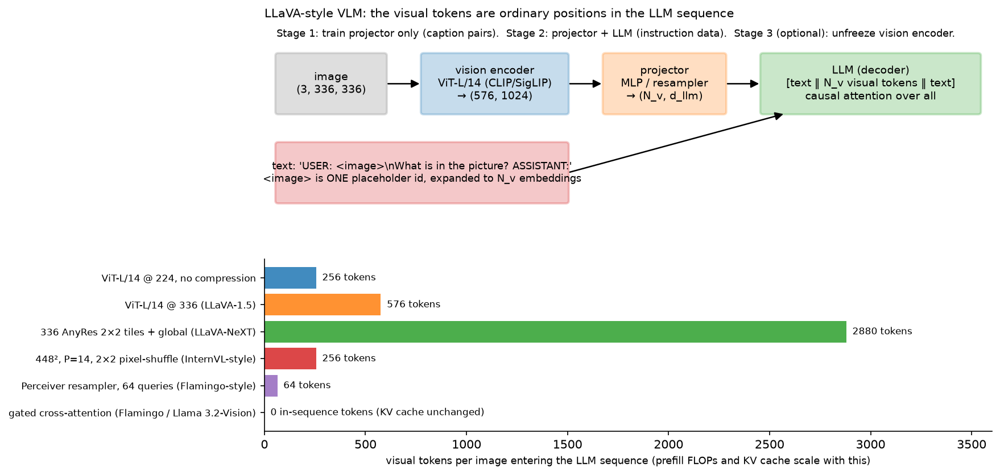
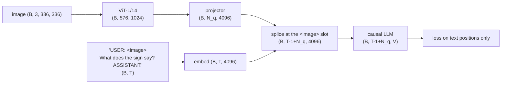

# VLM architecture

> **Why this matters at staff level.** This is the chapter where your perception
> background becomes a VLM background. Almost every production vision-language model is
> the same three boxes (vision encoder, projector, LLM) and the interesting decisions
> are all about *tokens*: how many an image produces, where they go in the sequence, and
> what that costs in prefill latency and KV cache. Strong signal is being able to draw the
> architecture, write the four projector variants as modules, compute the visual-token
> count for a given resolution and tiling scheme, and turn that into a latency and memory
> number before anyone asks you to.

## TL;DR: the interview card

- Canonical architecture: $\text{image} \to \text{ViT} \to \text{projector} \to$ visual tokens
  spliced into the LLM's token sequence, then ordinary causal LM. LLaVA is the minimal
  instance: CLIP ViT-L/14 + one MLP + Vicuna.
  - Vision tower: a contrastively pretrained ViT (CLIP or SigLIP). Take **patch tokens**
  (not the pooled vector) from the **penultimate** layer; the last layer is specialised
  for the contrastive objective.
  - Four projectors, all mapping $(B, N_v, d_v) \to (B, N_q, d_{llm})$:
  **linear** ($N_q = N_v$), **MLP** ($N_q = N_v$, LLaVA-1.5), **resampler / Q-Former**
  ($N_q$ fixed by learned queries, Flamingo, BLIP-2), **gated cross-attention**
  ($N_q = 0$ in-sequence; text attends to image inside the LLM, Flamingo, Llama 3.2-Vision).
  - Token count is the cost model: ViT-L/14 at $336^2$ gives $N_v = (336/14)^2 = 576$ tokens
  per image. Prefill FLOPs $\approx 2 P N$ for $P$ non-embedding parameters and $N$ tokens;
  KV cache $= 2 \cdot L \cdot N \cdot H_{kv} \cdot d_{head} \cdot \text{bytes}$.
  - Compression levers: average pooling, $k\times k$ **pixel shuffle** (space-to-depth, no
  information lost, tokens $/k^2$), learned queries, token pruning, and **AnyRes** tiling
  (which *multiplies* tokens, 5 tiles × 576 = 2,880).
  - Training stages: (1) projector-only alignment on caption pairs, (2) visual instruction
  tuning with projector + LLM unfrozen, (3) optional vision-encoder unfreezing (needed for
  OCR/document/high-resolution work).
  - Position ids: visual tokens occupy ordinary consecutive positions in the simple design;
  Qwen2-VL's M-RoPE instead gives them (t, h, w) coordinates.
  - Data: caption pairs align, instruction data teaches following, OCR/document data teaches
  reading, grounding data (boxes written as text, e.g. `<box>x1 y1 x2 y2</box>`) teaches
  pointing.

  ## 1. Intuition first

  An LLM reads a sequence of $d_{llm}$-dimensional vectors. It does not care where they came
  from. So: run the image through a ViT to get 576 patch tokens of width 1024, multiply each
  by a matrix to get width 4096, and paste them into the sequence where the `<image>`
  placeholder was. The LLM's causal attention now lets every text token after the image
  attend to every patch. That is a VLM.

  { width="760" }

  *Look at the bottom panel. Every design choice in this chapter is a point on that axis.
  LLaVA-1.5 at 336 px costs 576 tokens, more than most user prompts. LLaVA-NeXT's AnyRes
  tiling costs 2,880, which is a 5× increase in prefill compute and KV cache for one image.
  A Perceiver resampler costs 64 regardless of resolution. Gated cross-attention costs zero
  in-sequence tokens but adds parameters and FLOPs inside every adapted LLM layer.*

  The three boxes, with the shapes that matter:



Two details in that diagram are where implementations go wrong. First, `<image>` is **one**
token id in `input_ids` that gets **expanded** to $N_q$ embeddings, so the sequence length
changes between `input_ids` and `inputs_embeds`, and every downstream index (labels,
attention mask, position ids) must be rebuilt. Second, the loss must **ignore** the visual
positions: there is no ground-truth token to predict there.

## 2. The math

### 2.1 The visual-token count

For a vision tower with patch size $P$ at resolution $H\times W$, one tile produces

$$
N_v = \frac{H}{P}\cdot\frac{W}{P}.
$$

With a $k\times k$ merge (pooling or pixel shuffle) and $n_{\text{tiles}}$ tiles, and with a
resampler overriding everything:

$$
\boxed{\;N_q = \begin{cases}
n_{\text{queries}} & \text{resampler / Q-Former}\\[2pt]
0 & \text{gated cross-attention}\\[2pt]
n_{\text{tiles}}\cdot \dfrac{(H/P)(W/P)}{k^2} & \text{otherwise}
\end{cases}\;}
$$

Worked examples you should be able to produce from memory:

| Design | $H$ | $P$ | $k$ | tiles | $N_q$ |
|---|---|---|---|---|---|
| LLaVA-1 (CLIP ViT-L/14 @ 224) | 224 | 14 | 1 | 1 | 256 |
| LLaVA-1.5 (@ 336) | 336 | 14 | 1 | 1 | 576 |
| LLaVA-NeXT AnyRes (4 tiles + global) | 336/tile | 14 | 1 | 5 | 2,880 |
| InternVL-style pixel shuffle @ 448 | 448 | 14 | 2 | 1 | 256 |
| Flamingo resampler | any |: |: |: | 64 |

### 2.2 What those tokens cost

Let the LLM have $L$ layers, width $d$, $H_{kv}$ key/value heads of size $d_{head}$, and $P_{nz}$
non-embedding parameters. For a prompt of $N = T_{\text{text}} + N_q$ tokens:

**Prefill FLOPs.** Every parameter is used once per token in a forward pass, with two
FLOPs per multiply-add:

$$
\text{FLOPs}_{\text{prefill}} \approx 2\,P_{nz}\,N \;+\; 2\,L\,N^2 d \quad (\text{the second term is attention}).
$$

**KV cache bytes.**

$$
\boxed{\;\text{KV bytes} = 2 \cdot L \cdot N \cdot H_{kv} \cdot d_{head} \cdot b\;}
$$

with $b$ bytes per element (2 for fp16/bf16). The leading 2 is for K and V.

*Worked example.* Llama-3-8B-shaped: $L = 32$, $H_{kv} = 8$ (GQA), $d_{head} = 128$,
$P_{nz} \approx 7\times10^9$, bf16. One LLaVA-1.5-style image at 576 tokens:

* KV cache: $2 \cdot 32 \cdot 576 \cdot 8 \cdot 128 \cdot 2 = 75.5$ MB. A 60-token text prompt is 7.9 MB.
  The image is **90%** of the KV cache for that request.
  * Prefill: $2 \cdot 7\times10^9 \cdot 576 \approx 8.1$ TFLOPs, versus $0.84$ TFLOPs for the text.

  With AnyRes at 2,880 tokens: 377 MB of KV cache and 40 TFLOPs of prefill per image. At a
  realistic 200 TFLOP/s effective throughput that is 200 ms of prefill *before the first
  token*. This arithmetic is the reason token compression exists, and it is the answer
  interviewers are looking for when they ask "what does adding vision cost you?"

  *What it means:* a VLM request is prefill-dominated in a way a text request is not. The
  decode phase is unchanged (one token at a time over a longer cache), so vision moves your
  serving profile toward compute-bound prefill, see
  [inference systems](../part14-systems/03-inference-systems.md) for the batching
  consequences, and [efficient attention & KV cache](../part06-llm-training/04-efficient-attention-kv-cache.md)
  for the cache arithmetic in general.

  ### 2.3 The four projectors

  All four map $(B, N_v, d_v) \to (B, N_q, d_{llm})$. They differ in $N_q$ and in where the
  image–text interaction happens.

  **Linear.** $z = f W + b$, $W \in \R^{d_v\times d_{llm}}$. $N_q = N_v$. This is LLaVA-1's
  projector; its virtue is that it is trivially trainable in stage 1 and preserves the
  one-to-one correspondence between a token and an image region, which matters for grounding.

  **MLP.** $z = \text{GELU}(fW_1 + b_1)W_2 + b_2$. $N_q = N_v$. LLaVA-1.5 found that a two-layer
  MLP beats the linear map at no meaningful cost; the non-linearity lets the projector do
  some feature transformation rather than pure basis change.

  **Perceiver resampler / Q-Former.** $N_q$ learned query vectors cross-attend to the image
  features:

  $$
  q \leftarrow q + \text{CrossAttn}(\text{LN}(q), \text{LN}(f)), \qquad q \leftarrow q + \text{MLP}(\text{LN}(q)),
  $$

  repeated for a few layers, then projected to $d_{llm}$. Output length is $N_q$ **regardless
  of $N_v$**, so resolution and tiling become free from the LLM's point of view, and video
  (hundreds of frames) becomes tractable. A Q-Former additionally runs self-attention among
  the queries each layer (so they can specialise and de-duplicate) and, in BLIP-2, is
  pretrained with its own image–text objectives before being attached to the LLM. The cost:
  a fixed bottleneck. If 64 queries cannot carry the text in a document, no amount of LLM
  capacity recovers it, which is why OCR-heavy models moved away from resamplers.

  **Gated cross-attention.** The image never enters the sequence. Instead, new layers are
  inserted between the LLM's frozen layers, where the text hidden states cross-attend to
  the visual features:

  $$
  h \leftarrow h + \tanh(\alpha)\cdot\text{CrossAttn}(\text{LN}(h), f), \qquad h \leftarrow h + \tanh(\beta)\cdot\text{MLP}(\text{LN}(h)),
  $$

  with $\alpha = \beta = 0$ at initialisation, so the adapted model is **exactly** the original
  LLM at step 0 and training starts from a known-good state. This is Flamingo's design and
  Llama 3.2-Vision's. Its advantages: the LLM's own weights can stay frozen (preserving text
  ability), the KV cache does not grow with $N_v$, and many images can be attended to
  cheaply. Its costs: extra parameters and FLOPs in every adapted layer for *every* text
  token (including during decode), a more invasive change to the serving stack, and weaker
  performance per-training-FLOP than the splice-in-sequence approach on single-image
  benchmarks, which is why the LLaVA pattern dominates open models.

  ### 2.4 Splicing, attention masks and position ids

  Let the prompt have the `<image>` placeholder at position $p$. After splicing,

  $$
  \text{seq} = [\,e_0,\dots,e_{p-1},\; z_1,\dots,z_{N_q},\; e_{p+1},\dots,e_{T-1}\,] \in \R^{(T-1+N_q)\times d_{llm}}.
  $$

  Three bookkeeping rules:

  1. **Position ids** are $0, 1, \dots, T-2+N_q$, consecutive, with the visual tokens
   consuming $N_q$ positions. (Qwen2-VL's M-RoPE instead assigns each visual token a
   3-D position $(t, h, w)$ so that the image's 2-D structure and a video's time axis are
   encoded in the rotary embedding, and the text positions continue from the maximum; this
   also lets the model extrapolate to more tokens than it saw in training.)
   2. **Attention mask**: the standard causal mask over the *merged* length. Visual tokens
   attend to each other causally in the naive implementation, a slightly odd choice
   (there is no left-to-right order in an image) that works anyway; some models make the
   visual block bidirectional, which is a strict relaxation and requires a custom mask.
   3. **Labels**: `-100` (ignore) at every visual position and at every prompt position; the
   loss is computed only on the assistant's response tokens.

   ### 2.5 The training stages

   **Stage 1, feature alignment.** Freeze the vision encoder and the LLM; train only the
   projector on image–caption pairs (LLaVA used 558k filtered CC3M captions). The objective
   is the ordinary next-token loss on the caption. Purpose: learn the linear map from the
   vision tower's basis into the LLM's embedding space. Cheap (hours on a few GPUs) because
   only the projector has gradients.

   **Stage 2, visual instruction tuning.** Unfreeze the LLM (and keep the projector
   training); train on multi-turn instruction data (LLaVA's 158k GPT-4-generated
   conversations, then the 665k mixture of LLaVA-1.5 including VQA, OCR and region data).
   Purpose: teach the model to *use* the visual tokens to follow instructions. This is where
   the model's character comes from.

   **Stage 3 (optional), unfreeze the vision encoder.** Needed when the target domain is
   far from the contrastive pretraining distribution: documents, charts, screenshots,
   high-resolution scenes. Costs more memory and risks degrading the encoder; typically done
   with a much lower learning rate (10× lower) than the LLM's.

   A recurring failure: unfreezing the LLM in stage 1. With a randomly initialised projector,
   the visual tokens are noise, and the LLM learns to ignore them while its text ability
   degrades. Stage 1 exists to make the visual tokens meaningful *before* the LLM adapts.

   ### 2.6 Data

   | Data type | Teaches | Example sources | Typical scale |
   |---|---|---|---|
   | Image–caption pairs | Alignment of the projector | CC3M/CC12M, LAION, COYO | 0.5M–1B |
   | Visual instruction data | Following instructions about an image | LLaVA-Instruct (GPT-4 generated from COCO annotations) | 100k–1M |
   | VQA / academic task data | Short-answer formats, chart and diagram reading | VQAv2, GQA, OK-VQA, DocVQA, ChartQA, TextVQA | 100k–1M |
   | OCR / document data | Reading dense text, layout | Synthetic renders, PDF corpora, scanned documents | 1M–100M |
   | Grounding data | Pointing: boxes and points as text | Visual Genome, RefCOCO, generated region captions | 100k–10M |
   | Interleaved image–text documents | Multi-image context, in-context learning | MMC4, OBELICS | 100M+ |

   Two notes for a reader with an OCR background. First, **boxes become text**: a grounding
   example is an ordinary next-token problem where the target is a string like
   `<box>0.12 0.44 0.31 0.57</box>` or, in Qwen-VL, special coordinate tokens. Nothing in the
   architecture knows about geometry; the model learns the format. Second, **OCR data is the
   strongest argument for high resolution**: at 336 px a full page of text occupies a few
   pixels per character and is unreadable regardless of model size. This is the real driver
   of AnyRes and native-resolution designs, and the interleaving of that with
   [document understanding system design](../part17-ml-system-design/09-ocr-document-understanding.md).

   ## 3. Implementation

   ### 3.1 The four projectors

```python
class LinearProjector(nn.Module):
    """(B, N_v, d_v) -> (B, N_v, d_llm)."""
    def __init__(self, d_v: int, d_llm: int) -> None:
        super().__init__()
        self.proj = nn.Linear(d_v, d_llm)

    def forward(self, feats: torch.Tensor) -> torch.Tensor:
        return self.proj(feats)                        # (B, N_v, d_llm)


class MLPProjector(nn.Module):
    """(B, N_v, d_v) -> (B, N_v, d_llm) via Linear -> GELU -> Linear."""
    def __init__(self, d_v: int, d_llm: int) -> None:
        super().__init__()
        self.fc1 = nn.Linear(d_v, d_llm)
        self.fc2 = nn.Linear(d_llm, d_llm)

    def forward(self, feats: torch.Tensor) -> torch.Tensor:
        h = torch.nn.functional.gelu(self.fc1(feats))  # (B, N_v, d_llm)
        return self.fc2(h)                             # (B, N_v, d_llm)
```

```python
class PerceiverResampler(nn.Module):
    """Learned queries attend to visual features: (B, N_v, d_v) -> (B, N_q, d_llm)."""
    def __init__(self, d_v, d_llm, n_queries, n_heads, depth=2, d_inner=None) -> None:
        super().__init__()
        d = d_inner or d_llm
        self.queries = nn.Parameter(torch.randn(1, n_queries, d) * 0.02)   # (1, N_q, d)
        self.layers = nn.ModuleList()
        for _ in range(depth):
            self.layers.append(nn.ModuleDict({
                "ln_q": nn.LayerNorm(d), "ln_kv": nn.LayerNorm(d_v),
                "xattn": MultiHeadCrossAttention(d, d_v, n_heads),
                "ln_mlp": nn.LayerNorm(d), "mlp": MLP(d),
            }))
        self.out = nn.Linear(d, d_llm)

    def forward(self, feats: torch.Tensor) -> torch.Tensor:
        B = feats.shape[0]
        q = self.queries.expand(B, -1, -1)                                  # (B, N_q, d)
        for layer in self.layers:
            q = q + layer["xattn"](layer["ln_q"](q), layer["ln_kv"](feats)) # (B, N_q, d)
            q = q + layer["mlp"](layer["ln_mlp"](q))                        # (B, N_q, d)
        return self.out(q)                                                  # (B, N_q, d_llm)
```

`QFormer` in the same file adds `self_attn` over the queries before the cross-attention in
each layer. The test asserts what matters about both: the output length is $N_q$ whether
$N_v$ is 9 or 50.

```python
class GatedCrossAttentionAdapter(nn.Module):
    """text (B, T, d_llm) cross-attends to feats (B, N_v, d_v); zero-gated at init."""
    def __init__(self, d_llm: int, d_v: int, n_heads: int) -> None:
        super().__init__()
        self.ln_t = nn.LayerNorm(d_llm)
        self.ln_v = nn.LayerNorm(d_v)
        self.xattn = MultiHeadCrossAttention(d_llm, d_v, n_heads)
        self.gate_attn = nn.Parameter(torch.zeros(1))                       # scalar; tanh(0) = 0
        self.ln_m = nn.LayerNorm(d_llm)
        self.mlp = MLP(d_llm)
        self.gate_mlp = nn.Parameter(torch.zeros(1))                        # scalar

    def forward(self, text: torch.Tensor, feats: torch.Tensor) -> torch.Tensor:
        text = text + torch.tanh(self.gate_attn) * self.xattn(self.ln_t(text), self.ln_v(feats))  # (B, T, d_llm)
        text = text + torch.tanh(self.gate_mlp) * self.mlp(self.ln_m(text))                        # (B, T, d_llm)
        return text
```

The `tanh` of a zero-initialised scalar is exactly 0, so `adapter(text, feats) == text` at
step 0, the test asserts this with `torch.allclose`. That property is the whole point:
you can insert these into a frozen, already-good LLM and training begins from its exact
behaviour rather than from a perturbation of it.

### 3.2 Splicing visual tokens into the sequence

```python
def merge_visual_tokens(text_embeds, input_ids, visual, image_token_id):
    """Replace the single <image> slot with N_v visual embeddings."""
    B, T, d = text_embeds.shape
    pos = (input_ids == image_token_id).nonzero()                           # (B, 2): (row, col)
    if pos.shape[0] != B or not bool((pos[:, 1] == pos[0, 1]).all()):
        raise ValueError("expected exactly one <image> token per row, at the same column")
    p = int(pos[0, 1])
    N_v = visual.shape[1]
    merged = torch.cat([text_embeds[:, :p], visual, text_embeds[:, p + 1:]], dim=1)  # (B, T-1+N_v, d)
    L = merged.shape[1]
    position_ids = torch.arange(L, device=text_embeds.device)[None].expand(B, -1)    # (B, L)
    is_visual = torch.zeros(B, L, dtype=torch.bool, device=text_embeds.device)       # (B, L)
    is_visual[:, p:p + N_v] = True
    return merged, position_ids, is_visual
```

The restriction to one image at a fixed column keeps the code a `cat` instead of a
scatter; production implementations handle ragged placements with an index_put over a
pre-allocated `(B, L_max, d)` buffer plus a padding mask. The returned `is_visual` mask is
what the loss uses to skip those positions:

```python
def vlm_lm_loss(logits, input_ids, is_visual, image_token_id):
    """Next-token loss on text positions only."""
    B, L, V = logits.shape
    N_v = int(is_visual[0].sum())
    p = int(is_visual[0].nonzero()[0, 0])
    ignore = torch.full((B, N_v), -100, dtype=torch.long, device=input_ids.device)   # (B, N_v)
    targets = torch.cat([input_ids[:, :p], ignore, input_ids[:, p + 1:]], dim=1)     # (B, L)
    pred = logits[:, :-1].reshape(-1, V)                                             # (B*(L-1), V)
    tgt = targets[:, 1:].reshape(-1)                                                 # (B*(L-1),)
    return nn.functional.cross_entropy(pred, tgt, ignore_index=-100)
```

Note the off-by-one that trips everyone: the logit at merged position $i$ predicts the
token at position $i+1$, so the *last* visual position produces the prediction for the
first text token after the image. That position must **not** be ignored, only positions
whose *target* is visual are ignored. The test checks this against a hand-computed
three-term loss.

### 3.3 The mini VLM

```python
class MiniVLM(nn.Module):
    def __init__(self, vision, d_v, lm, d_llm, image_token_id) -> None:
        super().__init__()
        self.vision = vision
        self.projector = MLPProjector(d_v, d_llm)
        self.lm = lm
        self.image_token_id = image_token_id

    def forward(self, images, input_ids):
        feats = self.vision(images)                                        # (B, N_v, d_v)
        visual = self.projector(feats)                                     # (B, N_v, d_llm)
        text = self.lm.tok(input_ids)                                      # (B, T, d_llm)
        merged, position_ids, is_visual = merge_visual_tokens(
            text, input_ids, visual, self.image_token_id)                  # (B, L, d_llm)
        logits = self.lm(merged, position_ids)                             # (B, L, V)
        return logits, is_visual
```

`TinyCausalLM` accepts *embeddings* rather than ids precisely so that a caller can splice;
any real LLM wrapper needs the same `inputs_embeds` entry point. Its causal mask is built
over the merged length, and its position embedding is indexed by the `position_ids` the
merge produced.

### 3.4 Token compression

```python
def pixel_shuffle_merge(grid: torch.Tensor, k: int) -> torch.Tensor:
    """Space-to-depth: (B, h, w, d) -> (B, (h/k)*(w/k), k*k*d). No information discarded."""
    B, h, w, d = grid.shape
    x = grid.view(B, h // k, k, w // k, k, d)      # (B, h/k, k, w/k, k, d)
    x = x.permute(0, 1, 3, 2, 4, 5)                # (B, h/k, w/k, k, k, d)
    return x.reshape(B, (h // k) * (w // k), k * k * d)  # (B, N/k², k*k*d)


def anyres_tiles(image: torch.Tensor, tile: int) -> torch.Tensor:
    """(B, C, H, W) -> (B*n_tiles, C, tile, tile): encode each tile at native training resolution."""
    B, C, H, W = image.shape
    x = image.view(B, C, H // tile, tile, W // tile, tile)  # (B, C, nh, t, nw, t)
    x = x.permute(0, 2, 4, 1, 3, 5)                          # (B, nh, nw, C, t, t)
    return x.reshape(B * (H // tile) * (W // tile), C, tile, tile)
```

Pixel shuffle is the compression to reach for first: unlike average pooling it is
lossless at the token level (the $k^2$ neighbouring feature vectors are concatenated, not
averaged), and the following MLP learns what to keep. The pairing of `anyres_tiles`
(which multiplies tokens by $n_{\text{tiles}}$) with `pixel_shuffle_merge` (which divides by
$k^2$) is how Qwen-VL and InternVL get high resolution at a bounded token budget.

??? example "Full implementation: `src/mlbook/multimodal/projectors.py`"
    ```python
    --8<-- "src/mlbook/multimodal/projectors.py"
    ```

??? example "Full implementation: `src/mlbook/multimodal/vlm.py`"
    ```python
    --8<-- "src/mlbook/multimodal/vlm.py"
    ```

??? example "Full implementation: `src/mlbook/multimodal/token_compression.py`"
    ```python
    --8<-- "src/mlbook/multimodal/token_compression.py"
    ```

**How you'd test it.** `tests/test_multimodal_projectors.py` checks each projector's
output shape, that the resampler and Q-Former are invariant in output length to $N_v$,
that the gated adapter is the identity at init and is not after the gate is opened, that
pixel shuffle preserves every value (`ps[0,0] == grid[0,:k,:k].reshape(-1)`), that pruning
keeps spatial order, and the token-count arithmetic of §2.1.
`tests/test_multimodal_vlm.py` checks the merged shapes and that the text before and after
the image lands where it should, that `TinyCausalLM` is causal (changing token 4 leaves
positions $<4$ untouched), that `vlm_lm_loss` equals a hand-computed three-term
cross-entropy, and that the mini VLM overfits a set of image-conditioned captions, the
prediction at the position after the image must equal the class-dependent token, which is
only possible if the visual tokens are actually being read.

## Retype by hand

| Symbol | File | Retype? | Target time |
|---|---|---|---|
| `merge_visual_tokens` (splice, position ids, `is_visual`) | `src/mlbook/multimodal/vlm.py` | **Yes**: the classic VLM coding ask | 15 min |
| `vlm_lm_loss` (ignore_index on visual positions, the off-by-one) | `src/mlbook/multimodal/vlm.py` | **Yes** | 10 min |
| `LinearProjector`, `MLPProjector` | `src/mlbook/multimodal/projectors.py` | **Yes** (trivial, but say the shapes aloud) | 5 min |
| `PerceiverResampler` | `src/mlbook/multimodal/projectors.py` | **Yes** | 20 min |
| `GatedCrossAttentionAdapter` (zero-init gates) | `src/mlbook/multimodal/projectors.py` | **Yes** | 15 min |
| `pixel_shuffle_merge`, `visual_token_count` | `src/mlbook/multimodal/token_compression.py` | **Yes** | 10 min |
| `MiniVLM`, `TinyCausalLM`, `ToyVisionEncoder` | `src/mlbook/multimodal/vlm.py` | Read (they assemble pieces you already retyped) |: |
| `QFormer`, `anyres_tiles`, `prune_tokens_by_score`, `PixelShuffleProjector` | both files | Read |: |

Whole-chapter target: **projectors + splice + loss: 60 minutes** from a blank file to
green tests.

Checks: `python -m pytest tests/test_multimodal_projectors.py -q` and
`python -m pytest tests/test_multimodal_vlm.py -q`; per symbol
`-k perceiver`, `-k gated`, `-k pixel_shuffle`, `-k merge_and_forward`,
`-k lm_loss_ignores`, `-k overfits_captions`.

## 4. Systems view: cost, failure modes, trade-offs

**Prefill vs decode.** Use §2.2. A single 336-px image adds ~576 tokens: 8 TFLOPs of
prefill and 75 MB of KV cache on an 8B model. Consequences for serving: time-to-first-token
is dominated by the image; continuous batching (see
[inference systems](../part14-systems/03-inference-systems.md)) must account for a prefill
that is 10× a text request's; and prefix caching helps enormously in multi-turn chat about
*the same* image, because the visual tokens are a fixed prefix, cache them once and reuse
across turns. If your product shows one image and then several follow-up questions, prefix
caching is the single highest-leverage optimisation available.

**Where to spend tokens.** The empirical ordering from the open literature: resolution
matters more than LLM size for OCR/document/chart tasks, and less than LLM size for
reasoning and conversation. So: a document product should buy resolution (AnyRes + pixel
shuffle + unfrozen vision encoder); a general assistant should buy LLM.

**Vision encoder choices.**

| Tower | Strength | Use when |
|---|---|---|
| CLIP ViT-L/14 | Ubiquitous, well-understood, 336-px checkpoint | Baseline, reproducing LLaVA-family results |
| SigLIP (SO400M) | Better accuracy per parameter, native higher resolutions | New builds; the default in recent open models |
| DINOv2 | Strong geometry and dense features, not language-aligned | Concatenate with a contrastive tower for spatial tasks |
| Native-resolution ViT (Qwen2-VL style) | No squashing, arbitrary aspect ratio | Documents, screenshots, multi-camera |

**Which layer.** The penultimate layer, for the reason in
[chapter 3](03-clip-contrastive.md): the final layer is specialised for the pooled
contrastive objective and discards local detail. LLaVA-1.5 ablated this and kept the
penultimate.

**Failure modes.**

* *Hallucinated objects.* The LLM's language prior overrides weak visual evidence ("a
  kitchen usually has a sink, so there is a sink"). Diagnose with POPE-style yes/no object
  probes; mitigate with more grounded/negative data, higher resolution, and decoding that
  contrasts image-conditioned and unconditioned logits.
  * *Text ability regression.* Stage-2 training on visual instruction data degrades pure-text
  benchmarks. Mitigate by mixing text-only data into stage 2, or by freezing the LLM and
  using cross-attention adapters (this is precisely why Llama 3.2-Vision's design keeps the
  text model's weights untouched).
  * *Aspect-ratio squashing and unreadable text.* A $2000\times600$ screenshot resized to $336^2$
  cannot be read at any model size. Diagnose by rendering what the model sees.
  * *Position-id bugs.* Forgetting to rebuild position ids after the splice produces a model
  that trains but degrades on long prompts; the symptom is fine behaviour on short prompts
  and nonsense past the original training length.
  * *Loss on visual positions.* If you forget the `-100`, the model is trained to "predict"
  the image token id at $N_v$ positions per example; the loss looks fine (that is an easy
  prediction) and quality is quietly worse.
  * *Tile boundary artifacts.* AnyRes tiles are encoded independently, so an object spanning
  a boundary is seen twice, halved; the global downscaled view exists to repair this.

  **When to use what.**

  | Situation | Choose | Decision rule |
  |---|---|---|
  | General assistant, single image, open weights | MLP projector, SigLIP tower, splice in sequence | Best quality per training FLOP; simplest serving |
  | Documents / OCR / charts | High resolution + tiling + pixel-shuffle merge, unfrozen vision tower | Resolution is the binding constraint, tokens are the budget |
  | Many images or long video per request | Perceiver resampler or gated cross-attention | Fixed (or zero) in-sequence token cost per image |
  | Must preserve an existing text model's behaviour exactly | Gated cross-attention adapters | Zero-init gates keep step-0 behaviour; LLM stays frozen |
  | Latency-critical, one image, many follow-up turns | Splice + prefix caching of the visual prefix | Visual tokens are a fixed prefix; cache and reuse |
  | Grounding / detection output | Splice (token↔region correspondence preserved), boxes as text | Resamplers destroy the positional correspondence |

  ## 5. In production

  !!! production "LLaVA: the minimal recipe that defined the pattern"
    LLaVA connected a frozen CLIP ViT-L/14 to Vicuna with a single linear projector,
    trained in two stages (558k caption pairs for alignment, then 158k GPT-4-generated
    instruction conversations), and showed that visual instruction tuning was the missing
    ingredient rather than architecture. LLaVA-1.5 changed three things, a two-layer MLP
    projector, 336-px input, and a 665k academic-task data mixture with response-format
    prompts, and reached state-of-the-art on 11 benchmarks with about a day of training on
    8 A100s. LLaVA-NeXT added AnyRes tiling for higher effective resolution. The rejected
    alternative was the Q-Former: the authors report the simpler projector works better at
    this scale and is far easier to train. Sources: *Visual Instruction Tuning*, Liu et al.,
    NeurIPS 2023 (arXiv:2304.08485); *Improved Baselines with Visual Instruction Tuning*,
    Liu et al., CVPR 2024 (arXiv:2310.03744); the LLaVA-NeXT blog post (January 2024).

    !!! production "DeepMind: Flamingo's gated cross-attention over a frozen LLM"
    Flamingo's business problem was few-shot multimodal learning without retraining a
    language model: it froze a 70B Chinchilla LLM and a contrastive vision encoder, and
    inserted gated cross-attention layers (with tanh gates initialised to zero) plus a
    Perceiver resampler that maps variable numbers of visual features to 64 tokens. The
    design lets interleaved image–text sequences work naturally and preserves the LLM's
    text ability exactly at initialisation. What they rejected: fine-tuning the LLM, which
    would have cost far more and degraded the language model. Source: *Flamingo: a Visual
    Language Model for Few-Shot Learning*, Alayrac et al., NeurIPS 2022 (arXiv:2204.14198).

    !!! production "Salesforce: BLIP-2's Q-Former as a cheap bridge to frozen LLMs"
    BLIP-2 keeps both the image encoder and the LLM frozen and trains only a Q-Former: 32
    learned queries pretrained in two stages (first with image–text contrastive, matching
    and grounded-captioning objectives against the frozen encoder, then with a
    language-modelling objective against the frozen LLM). The motivation was cost, training
    only a small bridge module, and the trade-off is the fixed 32-token bottleneck, which
    limits fine-grained reading. Source: *BLIP-2: Bootstrapping Language-Image Pre-training
    with Frozen Image Encoders and Large Language Models*, Li et al., ICML 2023
    (arXiv:2301.12597).

    !!! production "Meta: Llama 3.2-Vision keeps the text model untouched"
    Meta's Llama 3.2 11B and 90B vision models add a separately trained image encoder
    and cross-attention layers into the pretrained text model, and Meta's announcement
    states that the language model's weights are not updated, so text-only behaviour is
    preserved exactly, the practical argument for the Flamingo-style design in a product
    line where the text models must not regress. Source: Meta AI blog, *Llama 3.2:
    Revolutionizing edge AI and vision with open, customizable models* (September 2024);
    the Llama 3 herd of models paper, arXiv:2407.21783.

    !!! production "Alibaba: Qwen2-VL's native dynamic resolution and M-RoPE"
    Qwen2-VL processes images at their native resolution, producing a variable number of
    visual tokens, and merges adjacent $2\times2$ tokens with an MLP to cut the count by 4×;
    it replaces 1-D position ids for visual tokens with Multimodal RoPE, decomposing
    position into temporal, height and width components so that images and videos carry
    their real structure and the model can extrapolate. The report frames this as the fix
    for the fixed-resolution squashing that hurts documents and video. Source: *Qwen2-VL:
    Enhancing Vision-Language Model's Perception of the World at Any Resolution*, Wang et
    al., 2024 (arXiv:2409.12191); InternVL's pixel-shuffle variant: *InternVL: Scaling up
    Vision Foundation Models and Aligning for Generic Visual-Linguistic Tasks*, Chen et al.,
    CVPR 2024 (arXiv:2312.14238).

    !!! production "Document VLMs: Donut and Nougat as the OCR-free precursors"
    Donut (Clova AI) removed the OCR engine from document understanding entirely: a Swin
    encoder and a text decoder trained end-to-end to emit structured output directly,
    motivated by OCR error propagation and the cost of maintaining an OCR stage. Nougat
    (Meta) applies the same encoder–decoder recipe to scientific PDFs, emitting markup.
    Both are the direct ancestors of the document-focused VLMs, and the reason resolution
    and an unfrozen vision tower matter for this domain. Sources: *OCR-free Document
    Understanding Transformer* (Donut), Kim et al., ECCV 2022 (arXiv:2111.15664);
    *Nougat: Neural Optical Understanding for Academic Documents*, Blecher et al., 2023
    (arXiv:2308.13418). See
    [OCR & document understanding](../part17-ml-system-design/09-ocr-document-understanding.md).

    ## 6. Interview questions and strong answers

    !!! interview "Draw a VLM and tell me what each box costs."
    Vision encoder (a ViT-L/14: ~0.3B parameters, run once per image, ~$2\cdot0.3\text{B}\cdot576$
    ≈ 0.35 TFLOPs), projector (an MLP: negligible), LLM (the whole cost). The number that
    matters is $N_v$: at 336 px with $P = 14$, $N_v = 576$ tokens, which on an 8B model is
    ~8 TFLOPs of prefill and ~75 MB of KV cache, typically 10× the text prompt. So a VLM
    request is prefill-heavy, and time-to-first-token is dominated by the image.
    **Staff follow-up:** "Your p99 TTFT budget is 300 ms and you are at 900 ms. What do
    you change first?" In order: prefix-cache the visual tokens if the same image is
    reused across turns; compress tokens ($2\times2$ pixel shuffle is 4× for little quality
    loss); drop from AnyRes to a single tile for non-document requests (route by a cheap
    classifier); only then consider a smaller LLM. Note that a resampler would fix it
    structurally but requires retraining.

    !!! interview "Compare the four projectors. When would you pick each?"
    Linear and MLP preserve one token per patch, so grounding and OCR work and training is
    simple, pick them for general single-image assistants; MLP over linear because it is
    free. A Perceiver resampler / Q-Former fixes the output length, which is what you want
    for video or many-image contexts where $N_v$ would otherwise explode, at the cost of a
    hard bottleneck that hurts dense text. Gated cross-attention keeps images out of the
    sequence entirely, so the KV cache does not grow and a frozen LLM's text ability is
    preserved exactly (tanh-zero gates), at the cost of extra FLOPs on every text token and
    a more invasive serving change.
    **Staff follow-up:** "Why did the field mostly converge on the MLP?" Per unit of
    training compute it wins on single-image benchmarks; the bottleneck designs were
    motivated by *frozen* LLMs, and once you are willing to train the LLM (which
    instruction tuning requires anyway), the resampler's main advantage disappears while
    its information loss remains.

    !!! interview "Walk me through exactly what happens to `input_ids` when you add an image."
    The tokenizer emits one `<image>` id at position $p$. You embed the ids to
    `(B, T, d)`, run the image to `(B, N_v, d_v)`, project to `(B, N_v, d)`, and concatenate
    `[:p]`, the visual block, `[p+1:]` into `(B, T-1+N_v, d)`. Then rebuild: position ids
    `0..T-2+N_v`, a causal mask over the new length, and labels with `-100` at all $N_v$
    visual positions and all prompt positions. The subtlety is the off-by-one, the logit at
    the last visual position predicts the first text token after the image, so that
    *logit* is supervised even though that *position* is visual; you ignore positions whose
    target is visual, not whose input is visual.
    **Staff follow-up:** "Now two images at arbitrary positions in a batch of different
    lengths." The concatenate becomes a scatter: allocate `(B, L_max, d)`, compute per-row
    destination indices with a cumulative sum over "expansion sizes" per token, `index_put`
    the text and visual embeddings, and build a padding mask. Position ids come from the
    cumulative sum too.

    !!! interview "Why train in stages? What breaks if you skip stage 1?"
    Stage 1 trains only the projector on caption pairs, so the visual tokens become
    meaningful vectors in the LLM's embedding space before the LLM adapts. If you unfreeze
    the LLM from step 0, the projector's output is noise; the fastest way for the LLM to
    reduce loss is to *ignore* the visual tokens and rely on its language prior, and
    simultaneously its text weights drift on a small, narrow dataset. You end up with a
    model that hallucinates from the prompt and has degraded text ability.
    **Staff follow-up:** "How do you know when to also unfreeze the vision encoder?", 
    When the target domain is outside the contrastive pretraining distribution and errors
    are *perceptual* rather than reasoning: unreadable text, misread chart values,
    fine-grained categories. Check by asking the model to transcribe what it sees; if
    transcription fails, no LLM-side change helps. Use a 10× lower LR for the tower.

    !!! interview "An image costs 576 tokens. How do you get it to 144 without retraining from scratch?"
    $2\times2$ pixel shuffle: concatenate each $2\times2$ group of neighbouring tokens along
    the channel axis ($576\to144$ tokens of $4d_v$) and let the projector MLP map $4d_v \to d_{llm}$.
    No information is discarded at the merge step (unlike average pooling) and the MLP
    learns the compression. You need to retrain the projector (its input width changed) and
    ideally fine-tune the LLM briefly, but not the vision tower. Qwen2-VL and InternVL do
    exactly this.
    **Staff follow-up:** "What do you lose?" Effective spatial resolution for grounding:
    each output token now covers a $2P\times2P$ region, so box predictions get coarser and
    small text may become unreadable. Measure on a grounding benchmark and on DocVQA before
    and after; the trade is usually worth it above ~1000 tokens and rarely worth it below
    ~256.

    !!! interview "Your VLM hallucinates objects that are not in the image. Diagnose it."
    First establish whether it is perception or language prior: ask a yes/no question about
    a present and an absent object (POPE-style) and check whether the failure is
    *asymmetric*, models with a strong language prior say "yes" to plausible absent
    objects. Then check resolution (render what the model sees), check whether the object
    is small relative to the patch grid, and check the training data for a bias toward
    affirmative captions (caption datasets almost never describe absences). Fixes, in
    order of effort: add negative/grounded instruction data, raise resolution, and at
    inference use contrastive decoding between image-conditioned and image-free logits to
    subtract the language prior.

    !!! interview "Why is the vision encoder's *penultimate* layer used?"
    The final layer of a CLIP/SigLIP tower is optimised to produce a single pooled vector
    that matches a caption, so it compresses toward global semantics and discards local
    detail that the pooling would throw away anyway. The penultimate layer retains more
    spatial and fine-grained information, which is what an LLM attending over patches
    needs. LLaVA-1.5 ablated the choice and kept the penultimate.
    **Staff follow-up:** "Would you ever use multiple layers?" Yes: concatenating or
    summing features from several depths (or from two towers, e.g. SigLIP + DINOv2) gives
    the LLM both semantic and geometric features; the cost is projector width and a
    slightly harder stage-1 optimisation.

    ## 7. Exercises

    1. ★ Compute $N_v$ for SigLIP-SO400M at $384^2$ with $P = 14$, and the KV cache in MB it
   adds to a 32-layer model with 8 KV heads of dimension 128 in bf16.

    ??? success "Solution"
    $384/14 = 27.43$, not an integer, which is why that checkpoint uses $P = 14$ at
        $378^2$ ($27^2 = 729$) or resizes. Take $378^2$: $N_v = 729$.
        KV $= 2\cdot32\cdot729\cdot8\cdot128\cdot2 = 95.6$ MB. Over a 32k-token context budget
        that image consumes 2.2% of positions and the same fraction of cache.

        2. ★ A product shows one image and supports 6 follow-up turns. Compare total prefill
   FLOPs with and without prefix caching of the visual tokens, for $N_v = 576$ and 50-token
   turns on an 8B model.

    ??? success "Solution"
        Without caching, each turn re-prefills the image: $7\cdot2\cdot7\times10^9\cdot576 \approx 56$ TFLOPs
        for the visual part. With prefix caching the image is prefilled once: 8 TFLOPs. A 7×
        reduction on the dominant term, for a cache of ~75 MB held for the conversation.
        This is why VLM chat products hold the visual prefix.

        3. ★★ (coding) Extend `merge_visual_tokens` to handle **two** images per row at
   arbitrary (but per-row identical) columns. Verify that text before, between and after
   the images lands in the right place.

    ??? success "Solution"
        ```python
        def merge_two(text_embeds, input_ids, visual_a, visual_b, image_token_id):
            B, T, d = text_embeds.shape
            cols = (input_ids[0] == image_token_id).nonzero().flatten()          # (2,)
            p, q = int(cols[0]), int(cols[1])
            merged = torch.cat([
                text_embeds[:, :p], visual_a,                                     # (B, p + N_a, d)
                text_embeds[:, p + 1:q], visual_b,                                # (B, ..., d)
                text_embeds[:, q + 1:],
            ], dim=1)                                                             # (B, T-2+N_a+N_b, d)
            L = merged.shape[1]
            position_ids = torch.arange(L)[None].expand(B, -1)                    # (B, L)
            is_visual = torch.zeros(B, L, dtype=torch.bool)                       # (B, L)
            is_visual[:, p:p + visual_a.shape[1]] = True
            off = p + visual_a.shape[1] + (q - p - 1)
            is_visual[:, off:off + visual_b.shape[1]] = True
            return merged, position_ids, is_visual
        ```
        Check with `torch.equal(merged[:, 0], text[:, 0])` and
        `torch.equal(merged[:, p + N_a], text[:, p + 1])`. The general $n$-image case is the
        cumulative-sum scatter described in §6.

        4. ★★ Derive how the Perceiver resampler's cost depends on $N_v$ and $N_q$, and explain
   why it makes video tractable.

    ??? success "Solution"
        Cross-attention is $O(N_q N_v d)$ for the scores and values plus $O((N_q + N_v)d^2)$ for
        the projections; the query self-attention (Q-Former) adds $O(N_q^2 d)$. It is *linear*
        in $N_v$, and the LLM downstream sees only $N_q$. For a 64-frame video at 256 tokens
        per frame, $N_v = 16{,}384$: the resampler costs $64\cdot16{,}384\cdot d$ ≈ 1M·$d$ MACs
        (trivial) and hands the LLM 64 tokens instead of 16,384. Splicing 16,384 tokens into
        an 8B model would be 230 TFLOPs of prefill and 2.1 GB of KV cache.

        5. ★★ (coding) Implement `average_pool_tokens` vs `pixel_shuffle_merge` on the same
   grid and measure what each preserves: reconstruct the original grid from the compressed
   representation with a learned linear map and compare reconstruction error.

    ??? success "Solution"
        ```python
        grid = torch.randn(64, 8, 8, 16)                                  # (B, h, w, d)
        pooled = average_pool_tokens(grid, 2)                             # (B, 16, 16)
        shuffled = pixel_shuffle_merge(grid, 2)                           # (B, 16, 64)
        target = pixel_shuffle_merge(grid, 2)                             # (B, 16, 64) = the true content
        for name, x in [("pool", pooled), ("shuffle", shuffled)]:
            W = torch.linalg.lstsq(x.reshape(-1, x.shape[-1]), target.reshape(-1, 64)).solution
            err = ((x.reshape(-1, x.shape[-1]) @ W) - target.reshape(-1, 64)).pow(2).mean()
            print(name, err.item())
        ```
        Pixel shuffle reconstructs exactly (it *is* the target, up to an invertible map);
        pooling cannot, because averaging four vectors is rank-deficient, it discards the
        three difference directions per group. That is the formal statement of "pixel
        shuffle is lossless, pooling is not".

        6. ★★★ (coding) Implement a token-pruning projector: score visual tokens by their
   attention from a learned query (or by CLS attention), keep the top $m$, and verify on
   the mini VLM that the overfit test still passes with $m = N_v/2$ when the informative
   patch survives, and fails when you prune randomly.

    ??? success "Solution"
        Use `prune_tokens_by_score(tokens, scores, keep=m)` with
        `scores = (tokens @ w).squeeze(-1)` for a learned `w`, then project. On the synthetic
        task of `test_vlm_overfits_captions` the class is determined by one bright quadrant,
        so a learned scorer converges to keeping those tokens and the loss still drops below
        0.1; replacing `scores` with `torch.randn_like(scores)` (re-sampled each step) drops
        the informative token half the time and the loss plateaus. The lesson generalises:
        pruning is safe exactly when the score correlates with task relevance, which is why
        production pruning conditions on the *text* (keep tokens the question attends to),
        not on vision alone.

        ## References

        Sources are listed by title, venue and arXiv identifier (external links could not be
        verified from this build environment; search the title or the identifier).

        * Liu et al., *Visual Instruction Tuning* (LLaVA), NeurIPS 2023. arXiv:2304.08485.
        * Liu et al., *Improved Baselines with Visual Instruction Tuning* (LLaVA-1.5), CVPR 2024. arXiv:2310.03744.
        * Liu et al., *LLaVA-NeXT: Improved reasoning, OCR, and world knowledge*, LLaVA blog, January 2024.
        * Alayrac et al., *Flamingo: a Visual Language Model for Few-Shot Learning*, NeurIPS 2022. arXiv:2204.14198.
        * Li et al., *BLIP-2: Bootstrapping Language-Image Pre-training with Frozen Image Encoders and Large Language Models*, ICML 2023. arXiv:2301.12597.
        * Jaegle et al., *Perceiver IO: A General Architecture for Structured Inputs & Outputs*, ICLR 2022. arXiv:2107.14795.
        * Dubey et al., *The Llama 3 Herd of Models*, 2024. arXiv:2407.21783; Meta AI blog, *Llama 3.2: Revolutionizing edge AI and vision with open, customizable models*, September 2024.
        * Wang et al., *Qwen2-VL: Enhancing Vision-Language Model's Perception of the World at Any Resolution*, 2024. arXiv:2409.12191.
        * Bai et al., *Qwen-VL: A Versatile Vision-Language Model for Understanding, Localization, Text Reading, and Beyond*, 2023. arXiv:2308.12966.
        * Chen et al., *InternVL: Scaling up Vision Foundation Models and Aligning for Generic Visual-Linguistic Tasks*, CVPR 2024. arXiv:2312.14238.
        * Beyer et al., *PaliGemma: A versatile 3B VLM for transfer*, 2024. arXiv:2407.07726.
        * Laurençon et al., *What matters when building vision-language models?* (Idefics2), NeurIPS 2024. arXiv:2405.02246.
        * Kim et al., *OCR-free Document Understanding Transformer* (Donut), ECCV 2022. arXiv:2111.15664.
        * Blecher et al., *Nougat: Neural Optical Understanding for Academic Documents*, 2023. arXiv:2308.13418.
        * Li et al., *Evaluating Object Hallucination in Large Vision-Language Models* (POPE), EMNLP 2023. arXiv:2305.10355.
        * Leng et al., *Mitigating Object Hallucinations in Large Vision-Language Models through Visual Contrastive Decoding*, CVPR 2024. arXiv:2311.16922.
