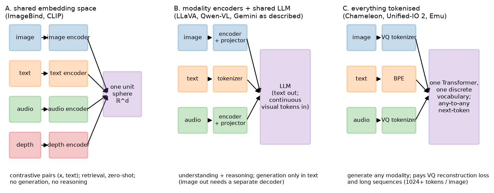

# Multimodal foundation models

> **Why this matters at staff level.** "Multimodal" in a job description means one of three
> quite different architectures, and the interview signal is whether you can name which one
> a system needs and defend it. This chapter is the decision framework: how each modality
> becomes tokens, the three strategies for combining them, what each can and cannot
> generate, and where vision-language-action models take the same machinery into robotics.
> Strong signal is refusing to say "we'd use a multimodal model" and instead saying "shared
> embedding space, because the product is retrieval and we need precomputable indices".

## TL;DR: the interview card

- The goal is a model of a joint distribution $p(x^{\text{text}}, x^{\text{image}}, x^{\text{audio}}, \dots)$,
  but every practical system factorises it: either everything maps into one embedding
  space, or every modality is encoded and fused inside one LLM, or everything is discretised
  into one token vocabulary.
  - **Representations**: text → BPE tokens; image → ViT patches (continuous) or VQ codes
  (discrete); audio → mel spectrogram patches, or neural-codec residual-VQ tokens
  (EnCodec/SoundStream); video → tubelets; depth/thermal → image-like 2-D maps; point
  clouds → per-point or voxel/pillar features; actions → discretised bins or continuous
  vectors from a flow/diffusion head.
  - **Strategy A, shared embedding space** (CLIP, ImageBind): one vector per input, cosine
  similarity is the interface. Retrieval, zero-shot, cross-modal search. No generation, no
  reasoning, no composition.
  - **Strategy B, modality encoders + shared LLM** (LLaVA, Qwen-VL, and Gemini as publicly
  described): each modality gets an encoder and a projector; the LLM reasons over mixed
  tokens and emits text. This is where almost all production understanding lives.
  - **Strategy C, everything tokenised** (Chameleon, Unified-IO 2, Emu): one discrete
  vocabulary, one Transformer, next-token prediction over interleaved modalities. The only
  strategy that generates non-text modalities natively; pays VQ reconstruction loss and long
  sequences.
  - **ImageBind's insight**: you do not need $\binom{M}{2}$ paired datasets. Bind every
  modality to *images* and the rest align transitively, because image-paired data exists
  for everything.
  - **VLA models** (RT-2, OpenVLA, $\pi_0$) are strategy B or C with actions as the output
  modality: RT-2 and OpenVLA discretise actions into text-like tokens; $\pi_0$ attaches a
  flow-matching action expert for high-frequency continuous control.
  - Decision rule: **generate it → C; reason about it → B; search it → A.**

  ## 1. Intuition first

  Take four inputs: a photo of a dog, the caption "a dog on grass", a 2-second bark, and a
  depth map of the same scene. What does "one model" mean?

  *Version A.* Four encoders, four vectors, one sphere. You can now ask "which audio clip
  matches this photo?" by a dot product. You cannot ask "how many dogs?", there is no
  mechanism that composes, counts or explains; a single vector per input is all there is.

  *Version B.* Four encoders, four projectors, one LLM. The dog photo becomes 576 tokens, the
  bark becomes 50, the depth map becomes 576, and all of them sit in the LLM's context next
  to the text. Now you can ask anything answerable *in words*. You cannot get a picture back:
  the output head is a text vocabulary.

  *Version C.* Every input is discretised into codes from one vocabulary, text BPE ids
  32,000–32,999 say, image VQ codes 33,000–41,191, audio codes 41,192–42,215, and a single
  Transformer predicts the next code. Ask for a picture and it emits image codes that a VQ
  decoder renders. The price: the VQ tokeniser throws information away before the model ever
  sees it, and an image is 1,024+ tokens of sequence.

  { width="780" }

  *Look at where the arrows converge in each panel. In A they converge on a sphere and stop.
  In B they converge on an LLM whose output is text. In C they converge on a vocabulary, and
  the output can be any modality because the output space is the same as the input space.
  That single structural difference explains almost every capability difference between these
  systems.*

  ## 2. The math

  ### 2.1 What a "modality" is, operationally

  A modality is anything you can turn into a sequence of vectors. The engineering question is
  always the same three-part one: *what is the unit, how many units per second (or per
  image), and is the unit continuous or discrete?*

  | Modality | Unit | Typical rate | Continuous form | Discrete form |
  |---|---|---|---|---|
  | Text | BPE token | ~1.3 tokens/word | embedding lookup | the vocabulary itself |
  | Image | patch / tubelet | $HW/P^2$ per image | ViT features | VQ-VAE / VQGAN codes (e.g. $32\times32 = 1024$) |
  | Video | tubelet | $(T/t)(HW/P^2)$ | ViT features | per-frame VQ, or 3-D VQ |
  | Audio (understanding) | spectrogram patch | ~50/s at 20 ms hop | mel patches → ViT/Conformer |: |
  | Audio (generation) | codec frame | 50–75 Hz × $Q$ codebooks | encoder latents | residual-VQ codes (EnCodec, SoundStream) |
  | Depth / thermal | pixel patch | as image | image-like encoder | as image |
  | Point cloud | point / voxel / pillar | $10^4$–$10^5$ points | PointNet, sparse conv, pillar features | voxel indices |
  | IMU / sensor stream | window | 100–1000 Hz | 1-D conv or Transformer over windows | binned |
  | Action (robot) | timestep | 5–50 Hz | continuous vector $a_t \in \R^{d_a}$ | 256 bins per dimension |

  Two consequences for system design. First, **rates differ by orders of magnitude**, so
  naive concatenation gives one modality all the tokens; every real system compresses the
  high-rate ones (§2.5). Second, **discretisation is a choice with a loss attached**: a VQ
  tokeniser has a reconstruction error that upper-bounds the fidelity of anything generated
  through it, no matter how good the Transformer is.

  ### 2.2 Audio, in the detail an interviewer will push on

  Audio is the modality most often hand-waved, so state it precisely. For *understanding*,
  the standard representation is a log-mel spectrogram: 80 mel bins, 25 ms window, 10 ms hop,
  so 100 frames/s; Whisper stacks two conv layers with stride 2 to reach 50 frames/s and
  feeds a Transformer encoder. A 30-second clip is 1,500 tokens, comparable to three images.

  For *generation*, spectrograms are awkward (phase must be reconstructed), so neural audio
  codecs are used instead: an encoder maps the waveform to ~50–75 latent frames/s, and
  **residual vector quantisation** quantises each frame with $Q$ successive codebooks, where
  codebook $q$ quantises the residual left by codebooks $1..q-1$. One second of audio is
  $75 \times Q$ tokens (e.g. $Q = 8$: 600 tokens/s), which is why audio LLMs use either a
  coarse-to-fine hierarchy (AudioLM's semantic → coarse acoustic → fine acoustic stages) or
  parallel prediction of the $Q$ codebooks per frame (MusicGen's delay pattern).

  *What it means:* audio generation is a sequence-length problem before it is a modelling
  problem, and the standard fixes (hierarchy, parallel heads over codebooks) are the
  same "reduce the token rate" moves as §2.5 for vision.

  ### 2.3 Strategy A: one shared embedding space

  Train encoders $f_m$ for modalities $m = 1..M$ so that paired inputs land nearby on the
  unit sphere. The naive version needs paired data for every pair, $\binom{M}{2}$ datasets,
  most of which do not exist (there is no "depth map ↔ audio" corpus). **ImageBind's**
  observation is that alignment is *transitive enough*: train each $f_m$ contrastively
  against a **frozen** image encoder using $(image, m)$ pairs, which do exist for every
  modality (video frames come with audio; RGB-D sensors give image+depth; IMU comes with
  egocentric video). With $L$ the InfoNCE loss of
  [chapter 3](03-clip-contrastive.md),

  $$
  \min_{f_m} \; L\big(f_{\text{image}}(x^{\text{img}}),\, f_m(x^{m})\big) \quad \text{for each } m \text{ independently},
  $$

  and because the image space is already aligned with text (it is CLIP's), every modality
  becomes aligned with text and (empirically) with every other modality, *without* ever
  seeing those pairs. That emergent cross-modal retrieval is the paper's headline claim.

  The limits follow from the structure. The binding modality is a bottleneck: two modalities
  can only be as aligned as their respective alignments to images. And a single vector per
  input cannot represent composition, this is
  [chapter 3's](03-clip-contrastive.md) bag-of-words failure inherited by every modality.

  ### 2.4 Strategy B: modality encoders into one LLM

  This is [chapter 4](04-vlm-architecture.md) generalised: for each modality, an encoder and
  a projector producing tokens in the LLM's embedding space, then one causal LLM over the
  interleaved sequence. Audio adds an audio encoder (Whisper-style) and a projector; video
  adds a video encoder with temporal compression; point clouds add a 3-D encoder.

  The reason this dominates production *understanding*: the LLM is the expensive, capable,
  already-trained part, and every modality is a comparatively cheap adapter onto it. You
  inherit instruction-following, reasoning, tool use and safety training for free, and you
  can add a modality without touching the others.

  The reason it cannot generate images: the output head is a softmax over a text vocabulary.
  Systems that appear to do both (a chat model that returns pictures) usually *call* a
  separate image generator, conditioning it on text or on an embedding. That is a product
  composition, not a joint model, and it shows: the generator does not see the conversation's
  full context, and the LLM cannot inspect what it produced unless the image is fed back
  through the vision encoder.

  ### 2.5 Strategy C: one token stream

  Quantise every modality into one vocabulary and train a single Transformer with the
  next-token objective of [Part VI](../part06-llm-training/01-pretraining-data-objective.md):

  $$
  p(x_1,\dots,x_N) = \prod_{i=1}^{N} p(x_i \mid x_{<i}), \qquad x_i \in \mathcal V_{\text{text}} \cup \mathcal V_{\text{image}} \cup \mathcal V_{\text{audio}} \cup \dots
  $$

  Now generation is symmetric: the model can emit image codes as easily as words, and
  interleaved outputs (text, then a picture, then more text) are just sequences. This is
  **early fusion**, modalities mix from layer 1, in every layer, rather than being encoded
  separately and concatenated.

  Three costs, all reported in the Chameleon paper and worth knowing:

  1. **Tokeniser loss.** A VQGAN at $32\times32$ codes per $512^2$ image discards high-frequency
   detail permanently; Chameleon's authors note their tokeniser struggles with text inside
   images, which caps OCR quality regardless of model scale.
   2. **Sequence length.** 1,024 tokens per image, so an interleaved document is long, and
   training compute goes up accordingly.
   3. **Training instability.** Mixing modalities with different token statistics in one
   softmax destabilises training at scale; Chameleon's fixes were query-key normalisation
   and a careful placement of layer norms in the architecture, the same QK-norm
   intervention as ViT-22B in [chapter 1](01-vision-transformers.md), for the same reason
   (logit growth).

   ### 2.6 The decision table

   | Dimension | A: shared embedding | B: encoders + LLM | C: one token stream |
   |---|---|---|---|
   | Examples | CLIP, ALIGN, SigLIP, ImageBind | LLaVA, Qwen2-VL, Flamingo, Gemini (as described) | Chameleon, Unified-IO 2, Emu |
   | Output | a vector | text (and text-encoded boxes/actions) | any tokenised modality |
   | Reasoning / composition | none | strong (the LLM's) | strong |
   | Generation of images/audio | no | no (needs an external generator) | yes, natively |
   | Cost per image at inference | one encoder pass | encoder + $N_v$ LLM tokens | ~1,024 LLM tokens |
   | Precomputable / indexable | yes: this is its superpower | no | no |
   | Add a new modality | train one encoder against images | train one encoder + projector | retrain the tokeniser and the model |
   | Fidelity ceiling | n/a | the encoder's | the VQ tokeniser's |
   | Biggest risk | no composition | cannot generate | tokeniser loss, instability, length |

   **Decision rule.** *Does the product need to generate a non-text modality?* If yes → C (or
   B plus an external generator, if the modalities do not need to reason about each other).
   *Does it need reasoning, instructions or explanation?* If yes → B. *Is it search, ranking,
   dedup or zero-shot tagging at scale?* → A, because only A gives you an index you can build
   offline and query in microseconds. Most real systems are **A for retrieval, B for
   understanding**, in a funnel: embed everything, retrieve with A, explain or decide with B
   on the shortlist. That is the architecture of visual search, moderation triage and
   multimodal RAG, see
   [visual search](../part17-ml-system-design/06-visual-search-image-retrieval.md),
   [content moderation](../part17-ml-system-design/07-content-moderation.md) and
   [retrieval & RAG](../part13-retrieval-eval-reliability/01-retrieval-and-rag.md).

   ### 2.7 Native multimodality and any-to-any

   "Natively multimodal" means trained on multiple modalities from the start of pretraining
   rather than adapted afterwards. The public argument for it (made in Google's Gemini report
   and in Chameleon) is that late-fused models learn cross-modal structure only in the
   adapter and only from the comparatively tiny alignment corpus, whereas early fusion lets
   every layer learn it from the full pretraining budget. The measurable consequences claimed
   are better interleaved reasoning and better transfer to modalities with little instruction
   data. The counter-argument is economic: adapting a strong text LLM is enormously cheaper
   than pretraining a multimodal one, and open benchmarks are still dominated by adapted
   models. Both facts can be true, early fusion may be better at the frontier and worse per
   dollar.

   ### 2.8 Vision-language-action models

   Robotics is where multimodal models stop being about perception. A VLA maps
   (image(s), language instruction) → actions. Three designs, in increasing sophistication:

   **RT-2 (actions as text).** Take a VLM, discretise each action dimension into 256 bins, and
   represent an action as a string of bin indices. The action becomes just another output
   sequence, so the entire VLM (including its web-scale knowledge) transfers directly. The
   paper's striking result is *emergent* semantic generalisation: instructions referring to
   objects or concepts never in the robot data ("pick up the extinct animal") work, because
   the VLM knows what those words mean. The constraint is rate: a large VLM produces actions
   at a few Hz, which limits it to relatively slow manipulation.

   **OpenVLA (the open reproduction).** A 7B model on a SigLIP + DINOv2 dual vision backbone
   with a Llama-2 LLM, trained on ~970k real robot episodes from the Open X-Embodiment
   collection, with the same discretised-action-as-token scheme, released with weights and
   fine-tuning recipes (including LoRA and quantised serving). Its role in an interview is as
   the concrete, inspectable instance of the RT-2 idea.

   **$\pi_0$ (a flow-matching action expert).** Discretised autoregressive actions cap both
   frequency and smoothness. $\pi_0$ keeps a pretrained VLM backbone but attaches a separate
   "action expert" that produces **continuous action chunks** via flow matching (see
   [flow matching](../part09-generative/04-flow-matching.md)), reaching up to 50 Hz control for
   dexterous tasks such as laundry folding, and it is trained on a large cross-embodiment
   mixture. The design lesson: use the VLM for semantics and a continuous generative head for
   control, rather than forcing control through a text vocabulary.

   *What it means:* an action is a modality like any other, and the three strategies map onto
   robotics unchanged, A gives you visual goal retrieval, B gives you a language-conditioned
   policy that emits discrete actions, C-like continuous heads give you high-frequency control.

   ## 3. Implementation

   This chapter introduces no new module: its architectures are compositions of code you
   already have. Two short compositions make the strategies concrete.

   ### 3.1 Binding a third modality to a frozen image–text space (strategy A)

   ImageBind in fifteen lines, using `MiniCLIP`'s pieces from
   [chapter 3](03-clip-contrastive.md). The key detail is that the image tower is **frozen**:
   only the new modality's encoder moves, so the existing image–text alignment is preserved
   exactly.

```python
from mlbook.multimodal.clip import MiniCLIP, clip_loss

def bind_modality(clip_model: MiniCLIP, new_encoder: nn.Module, proj: nn.Module,
                  images: torch.Tensor, paired: torch.Tensor,
                  opt: torch.optim.Optimizer) -> float:
    """One step of aligning a new modality to a FROZEN image space."""
    with torch.no_grad():
        v = clip_model.encode_image(images)                       # (B, d_e) frozen anchor
    m = nn.functional.normalize(proj(new_encoder(paired)), dim=-1)  # (B, d_e) trainable
    scale = clip_model.logit_scale.clamp(max=clip_model.max_logit_scale).exp()  # scalar
    logits = scale * m @ v.T                                      # (B, B) new-modality -> image
    loss = clip_loss(logits)                                      # symmetric InfoNCE
    opt.zero_grad(); loss.backward(); opt.step()
    return float(loss)
```

Only `new_encoder` and `proj` receive gradients (`clip_model.parameters()` are excluded from
`opt`). After training, `m` can be compared with *text* embeddings the new encoder never
saw, the emergent alignment of §2.3. The same `clip_loss` that trained image–text now
trains audio–image, depth–image and IMU–image, one modality at a time.

### 3.2 Assembling one token stream (strategy C)

Strategy C is an offsetting problem, not a modelling one: each modality's codes occupy a
disjoint range of one vocabulary, and boundary tokens tell the model which modality is
coming.

```python
VOCAB = {"text": (0, 32000), "image": (32002, 40194), "audio": (40194, 41218)}
BOI, EOI = 32000, 32001        # begin/end of image, in the text range

def interleave(text_ids: torch.Tensor, image_codes: torch.Tensor) -> torch.Tensor:
    """Text ids (T,) and VQ image codes (N_img,) -> one sequence (T + N_img + 2,).

    Image codes are shifted into their own range so a single softmax covers everything.
    """
    img = image_codes + VOCAB["image"][0]                         # (N_img,) shifted into the image range
    boi = torch.tensor([BOI]); eoi = torch.tensor([EOI])          # (1,), (1,)
    return torch.cat([text_ids, boi, img, eoi], dim=0)            # (T + N_img + 2,)
```

The model is then an ordinary causal LM (`TinyCausalLM` from `vlm.py` works unchanged if
you widen its vocabulary). Two production details this sketch omits and an interviewer may
probe: generation must be *constrained*, after `BOI` you must sample exactly $N_{img}$
tokens from the image range and then force `EOI`, otherwise the model can emit a
half-image, and the image codes are usually predicted with their own output head or
normalisation because their token statistics differ sharply from text's, which is the
instability of §2.5.

### 3.3 Actions as tokens (VLA)

```python
def discretise_action(a: torch.Tensor, low: torch.Tensor, high: torch.Tensor,
                      n_bins: int = 256) -> torch.Tensor:
    """Continuous action (B, d_a) -> integer bins (B, d_a), uniform in [low, high] per dimension."""
    scaled = (a - low) / (high - low)                             # (B, d_a) in [0, 1]
    return (scaled.clamp(0, 1) * (n_bins - 1)).round().long()     # (B, d_a) in [0, 255]


def action_tokens(bins: torch.Tensor, action_vocab_start: int) -> torch.Tensor:
    """(B, d_a) bins -> (B, d_a) token ids in the action range; emitted as an ordinary text-like sequence."""
    return bins + action_vocab_start                              # (B, d_a)
```

RT-2 and OpenVLA overload rarely used tokens of the text vocabulary rather than extending
it, which avoids resizing the embedding matrix of a pretrained LLM. The inverse map at
inference (bin centre → continuous action) is where quantisation error enters: with 256
bins over a $\pm0.1$ m range, positional resolution is 0.8 mm, which is fine for grasping
and not for insertion, the practical argument for $\pi_0$'s continuous head.

**How you'd test it.** The tested code this chapter depends on is
`tests/test_multimodal_clip.py` (the contrastive loss and alignment that strategy A is
built from) and `tests/test_multimodal_vlm.py` / `tests/test_multimodal_projectors.py`
(strategy B's splice and projectors). For the snippets above, the checks that matter are:
`bind_modality` leaves `clip_model`'s parameters bit-identical (assert on a cloned
`state_dict`); `interleave` produces ids whose image segment lies entirely within
`VOCAB["image"]`; `discretise_action` round-trips to within one bin width.

## Retype by hand

This chapter's architectures reuse symbols you have already retyped; what is worth
reproducing from memory here is the *composition*, not new primitives.

| Symbol | File | Retype? | Target time |
|---|---|---|---|
| `clip_loss` (the binding objective of strategy A) | `src/mlbook/multimodal/clip.py` | Already retyped in [chapter 3](03-clip-contrastive.md): re-derive, do not re-type | 5 min |
| `bind_modality` (freeze the anchor, train the new encoder) | this chapter, §3.1 | **Yes**: from memory, including the `no_grad` on the anchor | 10 min |
| `interleave` + the vocabulary-offset scheme | this chapter, §3.2 | **Yes** | 10 min |
| `discretise_action` / `action_tokens` | this chapter, §3.3 | **Yes** | 5 min |
| `merge_visual_tokens` (strategy B's mechanism) | `src/mlbook/multimodal/vlm.py` | Already retyped in [chapter 4](04-vlm-architecture.md) |: |
| `PerceiverResampler` (how a high-rate modality is compressed before the LLM) | `src/mlbook/multimodal/projectors.py` | Already retyped in chapter 4 |: |

The whiteboard exercise that actually gets tested in interviews for this chapter is the
**decision table of §2.6**: reproduce its rows from memory and defend one choice per row.
Target: 10 minutes.

Checks for the underlying code: `python -m pytest tests/test_multimodal_clip.py -q` and
`python -m pytest tests/test_multimodal_vlm.py -q`.

## 4. Systems view: cost, failure modes, trade-offs

**Token budgets across modalities.** For a 32k-token context, the practical budget:

| Content | Tokens | Share of 32k |
|---|---|---|
| One 336-px image (LLaVA-1.5) | 576 | 1.8% |
| One image, AnyRes 5 tiles | 2,880 | 9% |
| One VQ image (Chameleon-style) | 1,024 | 3.2% |
| 30 s of audio (Whisper-rate) | 1,500 | 4.7% |
| 1 s of generated audio (EnCodec, $Q=8$) | 600 | 1.9% |
| 1 minute of video at 1 fps, 256 tok/frame | 15,360 | 48% |

Video is the modality that breaks context budgets, which is [chapter 6's](06-video-models.md)
subject. Audio generation is second. The lever in every case is the same: compress before
the LLM (resampler, pooling, hierarchy), not inside it.

**Failure modes.**

* *Modality imbalance in training.* The modality with the most tokens dominates the loss;
  models trained on a naive mixture get very good at the majority modality and ignore the
  others. Fix by re-weighting the loss per modality or by sampling batches to a target
  token ratio.
  * *Modality collapse / shortcut learning.* If one modality predicts the target almost as
  well alone (audio in a video-classification task, text in a VQA dataset with strong
  priors), the model learns to ignore the others. Diagnose by ablating inputs at eval, 
  if accuracy barely drops when you blank the image, the model is not using it.
  * *Transitive alignment degradation (strategy A).* Audio↔text similarity is mediated by
  images, so it is weaker than either audio↔image or image↔text. Do not assume the
  emergent pairs are as good as the trained ones; measure them.
  * *Tokeniser ceiling (strategy C).* Generated images inherit the VQ decoder's artifacts.
  Check by encoding and decoding ground-truth images through the tokeniser alone, that
  reconstruction is the model's upper bound.
  * *Safety surface grows per modality.* Each new input modality is a new injection channel
  (text rendered inside an image, instructions spoken in audio) and each new output
  modality is a new harm channel. The GPT-4V system card is the canonical enumeration:
  it documents mitigations around person identification, captcha solving, and
  jailbreaks delivered as images. See
  [safety & failure modes](../part15-interpretability-safety/02-safety-failure-modes.md).

  **When to use what**, the summary table of §2.6 is the decision artifact; here is the
  serving-side complement:

  | Requirement | Implication |
  |---|---|
  | Sub-10 ms retrieval over $10^9$ items | Strategy A only; embeddings precomputed, ANN index ([Part XIII](../part13-retrieval-eval-reliability/01-retrieval-and-rag.md)) |
  | Explanation or instruction-following | Strategy B; budget prefill for the visual tokens |
  | Generate an image conditioned on a conversation | Strategy C, or B + external generator with an explicit context summary |
  | Add a modality in one quarter with a small team | Strategy A or B; C requires retraining everything |
  | On-robot control at ≥ 30 Hz | VLA with a continuous action head; a token-by-token LLM cannot hit the rate |

  ## 5. In production

  !!! production "Meta (FAIR): ImageBind binds six modalities through images alone"
    ImageBind trains image-paired encoders for text, audio, depth, thermal and IMU against a
    frozen CLIP-style image space, and reports *emergent* zero-shot capability on pairs
    never seen in training (audio→depth retrieval, audio-driven detection) because
    alignment through images is transitive. The explicit rejected alternative is
    collecting $\binom{M}{2}$ paired datasets, most of which do not exist naturally. The
    cost is that every cross-modal capability is bounded by each modality's alignment to
    images. Source: *ImageBind: One Embedding Space To Bind Them All*, Girdhar et al.,
    CVPR 2023 (arXiv:2305.05665).

    !!! production "Meta: Chameleon as an early-fusion, mixed-modal token model"
    Chameleon tokenises images into 1,024 discrete codes with a learned image tokeniser and
    trains a single Transformer over interleaved image and text tokens from the start, so
    it can generate both. The paper documents the price of early fusion at scale: training
    instability from mixing modalities in one softmax, resolved with query-key
    normalisation and a revised norm placement, and a tokeniser that limits text-heavy
    images. What it buys: genuinely interleaved generation, which two-tower or
    encoder+LLM designs cannot do. Source: *Chameleon: Mixed-Modal Early-Fusion Foundation
    Models*, Chameleon Team, 2024 (arXiv:2405.09818). Compare *Unified-IO 2*, Lu et al.,
    CVPR 2024 (arXiv:2312.17172), which tokenises images, text, audio and action into one
    space.

    !!! production "Google: Gemini as a natively multimodal model"
    Google's Gemini technical report describes models trained from the start on interleaved
    text, images, audio and video rather than adapting a text model, with audio ingested
    natively (16 kHz USM features) rather than via a speech-to-text front end, so that
    prosody and non-speech audio survive. The stated argument for native training is
    seamless cross-modal reasoning; the rejected alternative is the adapter approach that
    dominates open models. Treat the capability claims as the vendor's own evaluation.
    Source: *Gemini: A Family of Highly Capable Multimodal Models*, Gemini Team, Google,
    2023 (arXiv:2312.11805).

    !!! production "OpenAI: GPT-4V(ision) and the safety surface of a new input modality"
    The GPT-4V system card documents what changes when images become an input to a
    deployed assistant: new refusal categories (identifying real people, solving captchas,
    medical diagnosis from images), new jailbreak vectors (instructions written inside an
    image), and the evaluation process used before release. It is the best public
    enumeration of multimodal deployment risk and is worth citing directly in a system
    design round. Source: *GPT-4V(ision) System Card*, OpenAI, September 2023.

    !!! production "Google DeepMind: RT-2: web-scale VLMs as robot policies"
    RT-2 co-fine-tunes a VLM on web vision-language data *and* robot trajectories, with
    actions represented as discretised text tokens, and reports emergent semantic
    generalisation to objects, categories and instructions absent from the robot data, 
    the web knowledge transfers because the action is emitted by the same decoder as text.
    The trade-off they accept is inference rate: a large VLM emits actions at a few Hz.
    Source: *RT-2: Vision-Language-Action Models Transfer Web Knowledge to Robotic
    Control*, Brohan et al., CoRL 2023 (arXiv:2307.15818).

    !!! production "Stanford/Berkeley and Physical Intelligence: OpenVLA and π₀"
    OpenVLA is a 7B open VLA (SigLIP + DINOv2 vision, Llama-2 LLM) trained on ~970k
    episodes from Open X-Embodiment, released with weights, LoRA fine-tuning and quantised
    serving, the reproducible instance of RT-2's recipe. $\pi_0$ takes the opposite view of
    the action head: it attaches a flow-matching action expert to a pretrained VLM to emit
    continuous action chunks at up to 50 Hz, enabling dexterous tasks (laundry folding,
    box assembly) that discretised low-rate actions cannot express. Sources: *OpenVLA: An
    Open-Source Vision-Language-Action Model*, Kim et al., CoRL 2024 (arXiv:2406.09246);
    *π₀: A Vision-Language-Action Flow Model for General Robot Control*, Black et al.,
    Physical Intelligence, 2024 (arXiv:2410.24164); *Open X-Embodiment: Robotic Learning
    Datasets and RT-X Models*, Open X-Embodiment Collaboration, ICRA 2024 (arXiv:2310.08864).

    ## 6. Interview questions and strong answers

    !!! interview "A product team says 'we want a multimodal model'. What do you ask?"
    One question: *what must come out?* If the output is a ranking or a match, it is a
    shared embedding space, one vector per item, precomputed, in an ANN index; nothing
    else gives you $10^9$ items at 10 ms. If the output is an answer, an explanation or a
    decision in words, it is encoders into an LLM. If the output is an image, audio or
    video, it is a tokenised single stream (or an external generator, if the generated
    artifact does not need to reason about the conversation). Then I ask about scale and
    latency, because A is the only one that amortises.
    **Staff follow-up:** "They want all three." Then build the funnel: A for retrieval
    over the corpus, B for understanding on the shortlist, and a separate generator called
    by B. Do not try to make one model do retrieval at $10^9$ scale; an LLM cannot be an
    index.

    !!! interview "Explain ImageBind's central trick and its limit."
    Pairwise alignment of $M$ modalities naively needs $\binom{M}{2}$ paired corpora, and
    most pairs (depth↔audio) have no natural data. ImageBind trains each modality's encoder
    contrastively against a *frozen* image encoder, using pairs that occur naturally, video
    gives image+audio, RGB-D gives image+depth, egocentric video gives image+IMU. Because
    the image space is already aligned with text, everything ends up in one space, and
    cross-modal retrieval emerges for untrained pairs. The limit is that image is a
    bottleneck: audio↔text is only as good as audio↔image composed with image↔text, and it
    measures worse than either. Also inherited: no composition, one vector per input.
    **Staff follow-up:** "How would you improve audio↔text specifically?" Fine-tune with
    whatever direct audio–caption data exists (AudioCaps-style) as a second stage, keeping
    the image alignment as a regulariser so the shared space does not drift.

    !!! interview "Why can't LLaVA generate an image, and what would you change?"
    Because its output head is a softmax over a text vocabulary; there is no token that
    means "pixel". The changes, in increasing order of cost: (1) call an external
    generator, passing a text prompt, cheap, but the generator does not see the
    conversation; (2) add an image-generation head that predicts a continuous embedding
    consumed by a diffusion decoder; (3) tokenise images with a VQ model, extend the
    vocabulary, and train on interleaved data, genuine any-to-any, but you have retrained
    the model and capped fidelity at the tokeniser's reconstruction.
    **Staff follow-up:** "What does option 3 cost you on understanding tasks?" VQ codes
    are lossier than continuous ViT features, particularly for text inside images, so OCR
    and fine-grained recognition regress. Some models keep continuous features for *input*
    and discrete codes for *output*, which is the pragmatic middle.

    !!! interview "How do you tokenise audio, and why is it different for understanding and generation?"
    For understanding: log-mel spectrogram (80 bins, 25 ms window, 10 ms hop) with conv
    stride to ~50 frames/s, then a Transformer encoder, 30 s is ~1,500 tokens. Phase does
    not matter because nothing is reconstructed. For generation you must reconstruct a
    waveform, so a neural codec is used: an encoder at ~50–75 Hz with residual vector
    quantisation, where codebook $q$ quantises the residual of codebooks $1..q-1$. That
    gives $75Q$ tokens/s (600/s at $Q=8$) so generation is a sequence-length problem,
    handled by hierarchy (semantic then acoustic) or parallel prediction across codebooks.
    **Staff follow-up:** "How would you put speech into an existing VLM cheaply?" A
    Whisper encoder plus a projector, exactly the chapter-4 pattern; train the projector on
    (audio, transcript-or-instruction) pairs with the LLM frozen, then unfreeze. Do not
    transcribe to text first if you care about prosody, speaker or non-speech audio.

    !!! interview "What is a VLA, and why did RT-2 generalise better than a policy trained only on robot data?"
    A vision-language-action model maps images plus an instruction to actions. RT-2's
    construction is a VLM whose action outputs are discretised into token strings, co-fine-tuned
    on web vision-language data and robot trajectories. It generalises because the *same*
    decoder that emits actions already knows what words mean from web-scale pretraining, 
    so an instruction naming an object never seen in the robot data still grounds. A policy
    trained only on robot data has no such prior and can only interpolate within its
    demonstration distribution.
    **Staff follow-up:** "Why did π₀ move away from discretised actions?" Rate and
    smoothness. Autoregressive token-by-token emission at 256 bins per dimension caps
    control frequency at a few Hz and quantises fine motion. A flow-matching action expert
    emits a continuous chunk of future actions in one shot at up to 50 Hz, which is what
    dexterous manipulation needs.

    !!! interview "You are adding image input to a deployed text assistant. What is on your risk list?"
    New injection channel: instructions rendered inside an image bypass text-level filters,
    so prompt-injection defence must run on what the *model reads*, not just on the text
    field. New capability harms: person identification, reading documents the user should
    not have, captcha solving, medical or legal advice from photographs. New evaluation
    gaps: your existing refusal evals are text-only. New privacy surface: images carry
    metadata and incidental third parties. The GPT-4V system card enumerates these with the
    mitigations OpenAI shipped, and I would build the eval set before the feature.

    ## 7. Exercises

    1. ★ Compute the token cost of a 5-minute video at 1 fps with 256 tokens per frame, and
   say what must change to fit a 32k context.

    ??? success "Solution"
    $300 \times 256 = 76{,}800$ tokens, 2.4× the context. Options: drop to 0.2 fps
        (15,360), pool $2\times2$ spatially (19,200 at 1 fps), use a resampler at 32
        tokens/frame (9,600), or select keyframes. Most production video models combine
        two of these; see [chapter 6](06-video-models.md).

        2. ★ For each system, name the strategy: CLIP, LLaVA, Chameleon, ImageBind, Flamingo,
   RT-2, Unified-IO 2.

    ??? success "Solution"
        A: CLIP, ImageBind. B: LLaVA, Flamingo (encoders + LLM, with cross-attention rather
        than splicing), RT-2 (B with actions discretised into the text vocabulary, arguably
        a hybrid, since the *output* modality is tokenised). C: Chameleon, Unified-IO 2.

        3. ★★ (coding) Implement `bind_modality` from §3.1 with a toy third modality (a 1-D
   signal whose frequency encodes the same class as the image quadrant) and verify two
   things: the CLIP model's parameters are unchanged after training, and the new
   modality retrieves the correct *text* prompt it never trained against.

    ??? success "Solution"
        Reuse `_toy_data` from `tests/test_multimodal_clip.py` for images and captions, and
        build `signals[k] = sin(2π f_k t) + noise`. Encode signals with a small 1-D conv
        Transformer. After ~100 steps of `bind_modality`, compute
        `m @ model.encode_text(prompts).T` and check the argmax matches the class. For the
        frozen check:
        ```python
        before = {k: v.clone() for k, v in clip_model.state_dict().items()}
        ...  # training steps
        assert all(torch.equal(before[k], v) for k, v in clip_model.state_dict().items())
        ```
 The retrieval works despite no (signal, text) pair ever being trained, that is
        ImageBind's emergent alignment on a toy scale.

        4. ★★ Derive the sequence length of one second of 44.1 kHz stereo audio under (a) raw
   samples, (b) a 50 Hz codec with $Q = 8$ codebooks, (c) a 50 Hz codec with only the
   first codebook. Comment on what (c) loses.

    ??? success "Solution"
    (a) $44{,}100\times2 = 88{,}200$ tokens, hopeless. (b) $50\times8 = 400$ tokens.
        (c) 50 tokens. The first codebook of an RVQ carries the coarsest, most
        "semantic" content; dropping the residual codebooks yields intelligible but
        low-fidelity audio (metallic, missing timbre). This is exactly why AudioLM models
        semantic tokens first and then predicts acoustic residuals conditioned on them:
        the cheap stage carries meaning, the expensive stages carry fidelity.

        5. ★★ A team proposes strategy C for a document-understanding product. Argue against it
   with numbers.

    ??? success "Solution"
        A VQ tokeniser at $32\times32$ codes for a $512^2$ image gives each code a $16\times16$
        pixel receptive field. At typical document scan resolution, a character is 10–20
        pixels tall, so a code covers roughly one character and its quantisation error is
        the difference between similar glyphs. The encode–decode reconstruction of a text
        page is the model's ceiling: render it and read it, if you cannot, neither can the
        model. Strategy B with a high-resolution, native-aspect-ratio vision tower keeps
        continuous features and is the documented choice of document VLMs. Reserve C for
        products that must *generate* images.

        6. ★★★ (coding) Build a three-modality toy "strategy C" model: BPE-like text ids, VQ image
   codes from a tiny learned codebook, and binned action tokens, all in one vocabulary;
   train `TinyCausalLM` to emit the correct action tokens given an image and an
   instruction. Verify that (i) generation is constrained to the action range after the
   action-begin token, and (ii) the model fails when the image is replaced by noise, 
   proving it is reading the image and not just the instruction.

    ??? success "Solution"
        Use `interleave` from §3.2 with three ranges. For the codebook, quantise the toy
        image's 4 quadrant means against 8 learned centroids (a $k$-means step suffices).
        Constrained decoding is a logit mask: after `BOA`, set
        `logits[:, :action_start] = -inf` and `logits[:, action_start + n_bins:] = -inf` for
        exactly $d_a$ steps. The ablation in (ii) is the *modality collapse* diagnostic of
        §4, if accuracy does not drop when the image is noise, your instruction alone
        determines the answer and the task is not testing multimodality. Design the toy
        data so that the instruction names an attribute ("the bright quadrant") whose value
        only the image supplies.

        ## References

        Sources are listed by title, venue and arXiv identifier (external links could not be
        verified from this build environment; search the title or the identifier).

        * Girdhar et al., *ImageBind: One Embedding Space To Bind Them All*, CVPR 2023. arXiv:2305.05665.
        * Chameleon Team (Meta FAIR), *Chameleon: Mixed-Modal Early-Fusion Foundation Models*, 2024. arXiv:2405.09818.
        * Lu et al., *Unified-IO 2: Scaling Autoregressive Multimodal Models with Vision, Language, Audio, and Action*, CVPR 2024. arXiv:2312.17172.
        * Sun et al., *Generative Pretraining in Multimodality* (Emu), ICLR 2024. arXiv:2307.05222.
        * Gemini Team, Google, *Gemini: A Family of Highly Capable Multimodal Models*, 2023. arXiv:2312.11805.
        * OpenAI, *GPT-4V(ision) System Card*, September 2023.
        * Radford et al., *Robust Speech Recognition via Large-Scale Weak Supervision* (Whisper), ICML 2023. arXiv:2212.04356.
        * Défossez et al., *High Fidelity Neural Audio Compression* (EnCodec), TMLR 2023. arXiv:2210.13438.
        * Zeghidour et al., *SoundStream: An End-to-End Neural Audio Codec*, IEEE/ACM TASLP 2021. arXiv:2107.03312.
        * Borsos et al., *AudioLM: a Language Modeling Approach to Audio Generation*, IEEE/ACM TASLP 2023. arXiv:2209.03143.
        * Copet et al., *Simple and Controllable Music Generation* (MusicGen), NeurIPS 2023. arXiv:2306.05284.
        * Esser, Rombach, Ommer, *Taming Transformers for High-Resolution Image Synthesis* (VQGAN), CVPR 2021. arXiv:2012.09841.
        * van den Oord, Vinyals, Kavukcuoglu, *Neural Discrete Representation Learning* (VQ-VAE), NeurIPS 2017. arXiv:1711.00937.
        * Brohan et al., *RT-2: Vision-Language-Action Models Transfer Web Knowledge to Robotic Control*, CoRL 2023. arXiv:2307.15818.
        * Kim et al., *OpenVLA: An Open-Source Vision-Language-Action Model*, CoRL 2024. arXiv:2406.09246.
        * Black et al., *π₀: A Vision-Language-Action Flow Model for General Robot Control*, Physical Intelligence, 2024. arXiv:2410.24164.
        * Open X-Embodiment Collaboration, *Open X-Embodiment: Robotic Learning Datasets and RT-X Models*, ICRA 2024. arXiv:2310.08864.
