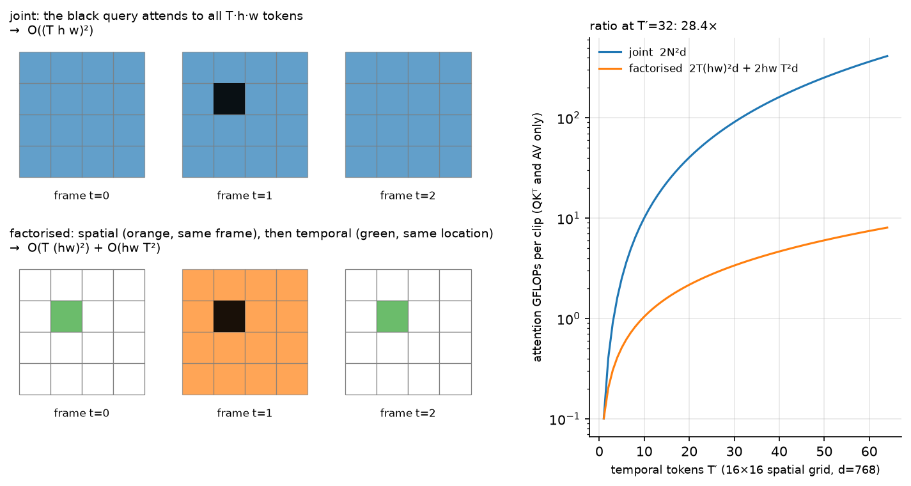

# Video models

> **Why this matters at staff level.** Video is where the token arithmetic of the previous
> chapters stops being an optimisation and becomes the design constraint: one minute at 1 fps
> already fills half a 32k context. Interviewers use video to test whether you can derive a
> cost model and then choose an architecture from it instead of reaching for the biggest
> model. Strong signal is deriving factorised space-time attention from the joint version,
> saying exactly what it gives up, and naming the compression you would apply first for a
> given latency budget.

## TL;DR: the interview card

- A clip $(B, C, T, H, W)$ is cut into tubelets of size $(t, P, P)$, giving
  $N = (T/t)(H/P)(W/P)$ tokens. ViViT calls this tubelet embedding, and it is
  [chapter 1's](01-vision-transformers.md) patch embedding with a third axis.
- Joint space-time attention costs $2N^2 d = 2(T'hw)^2 d$ in the quadratic term. Factorised
  attention runs spatial attention within each frame, then temporal attention along each
  location, for $2T'(hw)^2 d + 2hw\,T'^2 d$.
- The ratio is $\dfrac{T'hw}{hw + T'}$, so at $T' = 32$ on a $16\times16$ grid it is about 28x
  less attention compute.
- Factorisation gives up direct token-to-token paths across space and time within one block.
  Two tokens at different positions in different frames communicate only through the shared
  location or frame, which takes two hops.
- When either axis has length 1, factorised and joint attention compute the same function.
  The test asserts this.
- ViViT model 2 factorises by encoder (spatial encoder per frame, then a temporal encoder
  over frame embeddings); model 3 factorises by block; TimeSformer calls the block version
  divided space-time attention.
- Long video needs compression, not just a bigger context: token merging (ToMe), keyframe
  selection, a resampler per frame, memory banks, or hierarchical summaries.
- Video-language alignment is CLIP with a temporal pooling or a temporal Transformer on the
  vision side, trained on (clip, transcript) pairs. VideoMAE shows masked autoencoding works
  better than supervised pretraining at video scale, with very high mask ratios (90 to 95%)
  because video is redundant.
- Video understanding and video generation are different problems. Generation is latent
  diffusion over space-time patches (Sora-style DiTs), which connects to
  [diffusion](../part09-generative/03-diffusion.md) and
  [world models](../part11-perception-autonomy/07-world-models.md).

## 1. Intuition first

Take a 4-frame clip at $8\times8$ pixels with a tubelet of $(t, P, P) = (2, 4, 4)$. The clip
becomes $T' = 2$ temporal positions, each with a $2\times2$ spatial grid, so $N = 8$ tokens.
Every token summarises a $2\times4\times4$ block of pixels: a small patch over a short time.

With 8 tokens, joint attention is a $8\times8$ score matrix and nobody cares. Scale to a
realistic clip, 32 frames at $224^2$ with $P = 16$ and $t = 2$: $T' = 16$, $hw = 196$, so
$N = 3{,}136$ tokens and the score matrix has 9.8M entries per head per layer. Double the
frames and it is 39M.

{ width="780" }

*Look at the two token grids. In the joint panel the black query attends to every cell of
every frame. In the factorised panel it attends to the orange cells (its own frame) and then
the green cells (its own location across frames), which is $hw + T'$ keys instead of
$T' \cdot hw$. The right panel plots the consequence: at a $16\times16$ grid and $T' = 32$,
factorised attention costs about 28 times fewer FLOPs in the quadratic term.*

## 2. The math

### 2.1 Tubelets

A clip is $x \in \R^{C\times T\times H\times W}$. Choose a tubelet $(t, P, P)$ dividing
$(T, H, W)$. Token $(\tau, i, j)$ is the block
$x[:,\; \tau t:(\tau+1)t,\; iP:(i+1)P,\; jP:(j+1)P] \in \R^{C\times t\times P\times P}$,
flattened to $\R^{tP^2C}$ and mapped by one shared $E \in \R^{tP^2C\times d}$. The token count
is

$$
N = \underbrace{\frac{T}{t}}_{T'} \cdot \underbrace{\frac{H}{P}\cdot\frac{W}{P}}_{hw}.
$$

Exactly as in [chapter 1](01-vision-transformers.md), this linear map is a convolution, here
`Conv3d(C, d, kernel_size=(t,P,P), stride=(t,P,P))`. The alternative, called uniform frame
sampling in ViViT, uses $t = 1$ and embeds each frame independently, which keeps 2-D
pretrained weights usable. Tubelet embedding with $t > 1$ fuses time in the very first layer
and reduces $T'$ by a factor of $t$, so it is cheaper and gives up the ability to initialise
directly from an image ViT without inflating the kernel.

### 2.2 Joint attention and its cost

Flatten all $N$ tokens into one sequence and run ordinary self-attention. Counting
multiply-adds in the two matrix products that scale quadratically, $QK^\top$ and $AV$:

$$
\boxed{\;\text{MACs}_{\text{joint}} = 2N^2 d = 2\,(T' h w)^2\, d\;}
$$

plus the usual $12Nd^2$ for projections and MLP. The quadratic term grows with the square of
the clip length, so doubling the frames quadruples it.

### 2.3 Factorised space-time attention

Keep the tokens on a $(T', h, w)$ grid. Two attention operations per block:

$$
\text{spatial: } \forall \tau,\quad X_{\tau,:,:} \leftarrow X_{\tau,:,:} + \text{MHSA}\big(\text{LN}(X_{\tau,:,:})\big) \quad \text{over } hw \text{ tokens},
$$

$$
\text{temporal: } \forall (i,j),\quad X_{:,i,j} \leftarrow X_{:,i,j} + \text{MHSA}\big(\text{LN}(X_{:,i,j})\big) \quad \text{over } T' \text{ tokens}.
$$

The spatial operation runs $T'$ independent attentions over $hw$ tokens each, and the temporal
operation runs $hw$ independent attentions over $T'$ tokens each:

$$
\boxed{\;\text{MACs}_{\text{fact}} = 2\,T'(hw)^2 d \;+\; 2\,hw\,T'^2 d\;}
$$

The ratio is

$$
\frac{\text{MACs}_{\text{joint}}}{\text{MACs}_{\text{fact}}}
= \frac{(T'hw)^2}{T'(hw)^2 + hw T'^2}
= \frac{T'hw}{hw + T'} .
$$

With $hw = 256$ and $T' = 32$: $\frac{32\cdot256}{256+32} = 28.4$. With $T' = 64$: 51.2. The
saving grows with clip length, which is why every long-video architecture factorises
somewhere.

**What factorisation gives up.** In joint attention, the token at $(\tau_1, i_1, j_1)$ has a
direct weighted path to $(\tau_2, i_2, j_2)$ in a single operation. In the factorised block it
does not. Information travels from $(\tau_1, i_1, j_1)$ to $(\tau_1, i_2, j_2)$ through the
spatial step, and then to $(\tau_2, i_2, j_2)$ through the temporal step, so any
space-and-time displacement takes two hops within a block. For motion that is small per
frame, which is most video, the two-hop path is enough. For fast motion where an object moves
several patches between frames, joint attention has an advantage, and ViViT's ablations show
joint attention winning slightly on accuracy while costing far more.

**Order.** Spatial-then-temporal and temporal-then-spatial differ, and spatial-first is the
common choice because it lets each frame form a coherent representation before frames are
compared, which also allows initialising the spatial half from an image ViT.

### 2.4 The four ViViT variants, in cost terms

| Variant | Structure | Quadratic cost | Notes |
|---|---|---|---|
| Model 1, spatio-temporal attention | joint over all $N$ | $2(T'hw)^2d$ | Best accuracy, worst cost |
| Model 2, factorised encoder | spatial encoder per frame, then a temporal encoder over $T'$ frame embeddings | $2T'(hw)^2d + 2T'^2 d$ | Cheapest. Temporal reasoning only over pooled frames |
| Model 3, factorised self-attention | spatial then temporal attention inside each block | $2T'(hw)^2d + 2hwT'^2d$ | The block in section 3 |
| Model 4, factorised dot-product | half the heads do spatial, half do temporal, fused in one layer | same as model 3 | Same parameter count as joint attention |

Model 2 is the cheapest because the temporal encoder sees $T'$ vectors rather than $T' hw$
tokens, and it is the right default when the task is clip-level classification. Model 3 keeps
per-location temporal detail, so it can answer where-and-when questions that a pooled frame
embedding has already thrown away.

### 2.5 The degenerate cases

Two checks worth carrying into an interview. If $T' = 1$, the temporal attention is a softmax
over a single key, which returns $W_O W_V \text{LN}(x)$ regardless of the query, and the
spatial attention over $hw$ tokens is exactly joint attention over $N = hw$ tokens. If
$h = w = 1$, the mirror holds. The test in section 3 verifies both by zeroing the degenerate
branch's output projection and comparing against a joint block with copied weights.

### 2.6 Video-language alignment

The dual-encoder recipe of [chapter 3](03-clip-contrastive.md) carries over with a video
encoder in place of the image encoder, trained on (clip, transcript) or (clip, caption) pairs
harvested from narrated video. Three designs appear in practice.

*Mean-pool CLIP frames.* Encode $F$ frames with a frozen image CLIP, average the embeddings,
and contrast against the text. It is a strong baseline and ignores temporal order completely,
so it cannot distinguish "opening a door" from "closing a door".

*Temporal Transformer on frame embeddings.* Encode frames independently, then run a few
Transformer layers over the $F$ frame embeddings before pooling. Order is now representable,
and the cost over the frozen frame encoder is negligible. This is ViViT model 2 applied to
retrieval.

*Joint video encoder.* Tubelets and factorised space-time attention end to end, as in section
2.3. The most capable and the most expensive, and it needs video-scale pretraining to pay off.

VideoCLIP-style work adds two ingredients worth naming: overlapping positive clips in place of
exact temporal alignment, since narration lags the action it describes, and retrieval-based
hard negatives, clips from other videos that are semantically close, because random negatives
from a batch are too easy for video.

### 2.7 Pretraining: VideoMAE and the redundancy of video

Video is far more redundant than images, because consecutive frames are nearly identical.
VideoMAE exploits that with tube masking: mask the same spatial positions across all frames,
at 90 to 95% masking, and reconstruct the pixels. Masking randomly per frame lets the model
copy an unmasked patch from a neighbouring frame, which makes the task trivial and teaches
nothing about semantics; the tube mask removes that shortcut. The high mask ratio also makes
the encoder cheap, since it sees only 5 to 10% of tokens, which is what makes video MAE
affordable at all.

### 2.8 Long video: what to cut

For a 10-minute video, no context window is the answer. The levers, roughly in the order you
should try them:

1. **Sample fewer frames.** Most benchmarks saturate between 8 and 32 uniformly sampled
   frames. Uniform sampling is a strong baseline that costs nothing to implement.
2. **Keyframe selection.** Score frames by change from the previous keyframe, or by relevance
   to the query text, and keep the top $k$. Query-conditioned selection helps most when the
   question is about a moment.
3. **Spatial compression per frame.** Pixel shuffle or pooling from
   [chapter 4](04-vlm-architecture.md), applied per frame, divides tokens by $k^2$ at every
   frame at once.
4. **Resampler per frame or per clip.** A Perceiver resampler with $N_q$ queries makes the
   per-frame cost constant. At 32 queries per frame, 64 frames is 2,048 tokens instead of
   16,384.
5. **Token merging (ToMe).** Between blocks, merge the most similar token pairs with bipartite
   soft matching, removing a fixed number of tokens per layer. It requires no training and
   composes with a trained model, which makes it the cheapest thing to try on an existing
   checkpoint.
6. **Memory banks and hierarchical summaries.** Encode the video in windows, summarise each
   window into a few tokens, and attend over summaries. This is the design when video length is
   unbounded, for example a continuously running camera.

### 2.9 Understanding compared with generation

Everything above predicts a label, a caption or an answer. Video generation predicts pixels,
and the dominant recipe is latent diffusion with a Transformer backbone: a 3-D autoencoder
compresses the clip into a space-time latent grid, the latent grid is cut into patches, and a
diffusion Transformer denoises them, conditioned on text. OpenAI's Sora technical report
describes exactly this shape, spacetime latent patches as the unifying representation that
lets one model handle variable durations, resolutions and aspect ratios. The token arithmetic
of section 2.2 applies unchanged to the latent grid, which is why the autoencoder's compression
ratio is the architectural decision that matters most.

A generator that predicts future frames conditioned on actions is a world model, covered in
[world models](../part11-perception-autonomy/07-world-models.md), and the diffusion machinery
itself is derived in [diffusion](../part09-generative/03-diffusion.md). The connection worth
carrying: a video generator that is accurate enough to plan against is a simulator, and the
evaluation question shifts from perceptual quality to physical consistency.

## 3. Implementation

### 3.1 Tubelet embedding

```python
def tubelet_embed(video: torch.Tensor, t: int, P: int) -> torch.Tensor:
    """(B, C, T, H, W) -> (B, T/t, H/P, W/P, t*P*P*C): flatten each tubelet."""
    B, C, T, H, W = video.shape
    x = video.view(B, C, T // t, t, H // P, P, W // P, P)  # (B, C, T', t, h, P, w, P)
    x = x.permute(0, 2, 4, 6, 1, 3, 5, 7)                  # (B, T', h, w, C, t, P, P)
    return x.reshape(B, T // t, H // P, W // P, C * t * P * P)  # (B, T', h, w, t*P*P*C)


class TubeletEmbed(nn.Module):
    """Tubelet flatten plus a shared linear map: (B, C, T, H, W) -> (B, T', h, w, d)."""
    def __init__(self, in_channels: int, t: int, P: int, d: int) -> None:
        super().__init__()
        self.t, self.P = t, P
        self.proj = nn.Linear(in_channels * t * P * P, d)

    def forward(self, video: torch.Tensor) -> torch.Tensor:
        return self.proj(tubelet_embed(video, self.t, self.P))  # (B, T', h, w, d)
```

The permutation puts the three grid axes first and the content axes $(C, t, P, P)$ last, in
the order a `Conv3d` weight expects, so the same weight-reshape trick from
[chapter 1](01-vision-transformers.md) applies. Keeping the output as a `(B, T', h, w, d)`
grid, instead of a flat sequence, is what makes the factorised block a pair of reshapes.

### 3.2 The factorised block

```python
class FactorisedSpaceTimeBlock(nn.Module):
    """Spatial attention per frame, then temporal attention per location. (B, T', h, w, d) -> same."""
    def __init__(self, d: int, n_heads: int, mlp_ratio: int = 4) -> None:
        super().__init__()
        self.ln_s = nn.LayerNorm(d)
        self.spatial = MultiHeadSelfAttention(d, n_heads)
        self.ln_t = nn.LayerNorm(d)
        self.temporal = MultiHeadSelfAttention(d, n_heads)
        self.ln_m = nn.LayerNorm(d)
        self.fc1 = nn.Linear(d, mlp_ratio * d)
        self.fc2 = nn.Linear(mlp_ratio * d, d)

    def forward(self, x: torch.Tensor) -> torch.Tensor:
        B, T, h, w, d = x.shape
        s = self.ln_s(x).reshape(B * T, h * w, d)      # (B*T', h*w, d): one sequence per frame
        s = self.spatial(s).view(B, T, h, w, d)        # (B, T', h, w, d)
        x = x + s
        t = self.ln_t(x).permute(0, 2, 3, 1, 4).reshape(B * h * w, T, d)  # (B*h*w, T', d): one sequence per location
        t = self.temporal(t).view(B, h, w, T, d).permute(0, 3, 1, 2, 4)   # (B, T', h, w, d)
        x = x + t
        x = x + self.fc2(torch.nn.functional.gelu(self.fc1(self.ln_m(x))))  # (B, T', h, w, d)
        return x
```

Both attention calls are the same `MultiHeadSelfAttention` from
[chapter 1](01-vision-transformers.md). The whole of factorisation is two reshapes: fold
$T'$ into the batch to attend spatially, then fold $hw$ into the batch to attend temporally.
`JointSpaceTimeBlock` in the same file reshapes to `(B, T'*h*w, d)` and calls attention once,
which is the baseline the cost model compares against.

```python
def attention_flops(T: int, h: int, w: int, d: int, factorised: bool) -> int:
    """Multiply-adds in the QK^T and AV products only, per example."""
    S = h * w
    if factorised:
        return 2 * T * S * S * d + 2 * S * T * T * d
    N = T * S
    return 2 * N * N * d
```

??? example "Full implementation: `src/mlbook/multimodal/video_attention.py`"
    ```python
    --8<-- "src/mlbook/multimodal/video_attention.py"
    ```

**How you'd test it.** `tests/test_multimodal_video.py` checks that `tubelet_embed` produces
$(B, T/t, H/P, W/P, tP^2C)$ and that tubelet $(0,0,0)$ equals
`v[0, :, :t, :P, :P].reshape(-1)`; that both blocks preserve shape; that with $T' = 1$ the
factorised block equals a joint block with copied weights, after zeroing the temporal branch's
output projection, and the mirror case with $h = w = 1$; and that `attention_flops` matches the
formula, with the joint cost at least 10 times the factorised cost at $T' = 16$ on a
$16\times16$ grid.

## Retype by hand

| Symbol | File | Retype? | Target time |
|---|---|---|---|
| `tubelet_embed` (the two reshapes and the permute) | `src/mlbook/multimodal/video_attention.py` | Yes | 10 min |
| `FactorisedSpaceTimeBlock.forward` (the fold-into-batch reshapes) | `src/mlbook/multimodal/video_attention.py` | Yes, this is the chapter's coding ask | 20 min |
| `attention_flops` (derive it, then write it) | `src/mlbook/multimodal/video_attention.py` | Yes | 5 min |
| `JointSpaceTimeBlock` | `src/mlbook/multimodal/video_attention.py` | Read, it is the factorised block with one reshape | |
| `TubeletEmbed` | `src/mlbook/multimodal/video_attention.py` | Read | |

Checks: `python -m pytest tests/test_multimodal_video.py -q`. Per symbol, use `-k tubelet`,
`-k factorised_block`, `-k singleton`, `-k flops`.

## 4. Systems view: cost, failure modes, trade-offs

**The token budget.** Start from the clip and work forward. 32 frames at $224^2$, $P = 16$,
$t = 2$ gives $T' = 16$ and $hw = 196$, so $N = 3{,}136$ tokens. Joint attention at $d = 768$
costs $2N^2d \approx 15$ GFLOPs per layer in the quadratic term alone, against 0.5 GFLOPs
factorised. For a VLM consuming video, the number that matters is what reaches the LLM: at 576
tokens per frame with no compression, 32 frames is 18,432 tokens, which is 2.4 GB of KV cache
on the 8B model of [chapter 4](04-vlm-architecture.md). At that point compression decides
whether the feature ships.

**Memory during training.** Activations scale with $N$ per layer, and video clips are large
before any attention happens. Gradient checkpointing on the spatial attention, mixed
precision, and the high mask ratio of VideoMAE are the three levers that make video
pretraining fit.

**Data.** Video-text pairs come from narrated video with ASR transcripts (HowTo100M-style),
which are noisy and temporally misaligned, or from short captioned clips (WebVid-style), which
are cleaner and smaller. Temporal misalignment between narration and action is the defining
data problem: people describe an action before, during or after doing it.

**Failure modes.**

* Static-frame shortcut. Many video benchmarks are solvable from a single frame, so a model
  that ignores time scores well. Diagnose by evaluating with shuffled frames: if accuracy
  barely drops, neither your model nor your benchmark uses temporal information.
* Temporal misalignment in the data. Narration lags or leads the action, so exact-window
  positives are often wrong. Use overlapping or expanded windows for positives.
* Fast motion under factorisation. An object that moves several patches between frames is not
  reachable in one hop. Symptoms are errors on fast actions and on temporal ordering. Consider
  joint attention in a few blocks, or larger patches so that motion is smaller in patch units.
* Frame sampling that misses the event. Uniform sampling at 8 frames over 10 minutes will miss
  a 2-second event. If the task is moment localisation, uniform sampling is the wrong
  retrieval stage; use a dense cheap scorer first.
* Aspect ratio and letterboxing. Videos arrive in many shapes, and padding wastes tokens on
  black bars. Crop or use native-resolution packing.

**When to use what.**

| Situation | Choose | Decision rule |
|---|---|---|
| Clip classification, 8 to 32 frames | ViViT model 2 (factorised encoder) or VideoMAE fine-tuned | Cheapest that works. Temporal reasoning over pooled frames is enough for action labels |
| Temporal localisation, where-and-when | ViViT model 3 or TimeSformer divided attention | Per-location temporal detail is needed |
| Video-text retrieval at scale | Frame-CLIP with a temporal Transformer, embeddings precomputed | Index once per video. Strategy A of [chapter 5](05-multimodal-foundation.md) |
| Video question answering in a VLM | Per-frame compression plus keyframe selection, spliced into the LLM | The LLM does the reasoning. Your job is the token budget |
| Hour-long or unbounded video | Memory bank or hierarchical summaries plus query-conditioned retrieval | No context window is long enough. Treat it as retrieval |
| Existing checkpoint, need 2x speedup today | Token merging (ToMe) | No training required, composes with a trained model |
| Video generation or planning | Latent diffusion Transformer over space-time patches | See [diffusion](../part09-generative/03-diffusion.md) and [world models](../part11-perception-autonomy/07-world-models.md) |

## 5. In production

!!! production "Google: ViViT and the four factorisation variants"
    ViViT set out the design space this chapter uses: tubelet embedding against uniform frame
    sampling, and four ways to arrange space-time attention. The paper reports that joint
    spatio-temporal attention is the most accurate and that the factorised encoder is far
    cheaper with a small accuracy cost, and that initialising from image-pretrained ViT weights
    plus strong regularisation is what makes video Transformers trainable on datasets far
    smaller than image corpora. Source: *ViViT: A Video Vision Transformer*, Arnab et al., ICCV
    2021 (arXiv:2103.15691). The block-factorised variant was developed concurrently as
    divided space-time attention in *Is Space-Time Attention All You Need for Video
    Understanding?* (TimeSformer), Bertasius et al., ICML 2021 (arXiv:2102.05095).

!!! production "Nanjing University and Tencent: VideoMAE's tube masking at 90 to 95%"
    VideoMAE masks 90 to 95% of tubelets with the same spatial pattern across frames, and
    reconstructs pixels. Tube masking exists because per-frame random masking lets the model
    copy an unmasked patch from an adjacent frame, which makes reconstruction easy and
    uninformative. The extreme mask ratio also means the encoder processes 5 to 10% of tokens,
    which is what makes the pretraining affordable, and the authors report that it trains
    usefully on datasets of a few thousand videos where supervised training fails. Source:
    *VideoMAE: Masked Autoencoders are Data-Efficient Learners for Self-Supervised Video
    Pre-Training*, Tong et al., NeurIPS 2022 (arXiv:2203.12602).

!!! production "Meta: token merging as a training-free speedup"
    ToMe merges the most similar token pairs between blocks using bipartite soft matching,
    removing a fixed number of tokens per layer. It requires no training, applies to an
    existing checkpoint, and the paper reports roughly 2x throughput on video models at small
    accuracy cost. For a team with a deployed model and a latency problem, it is the cheapest
    intervention available, because nothing has to be retrained. Source: *Token Merging: Your
    ViT But Faster*, Bolya et al., ICLR 2023 (arXiv:2210.09461).

!!! production "OpenAI: Sora's spacetime latent patches"
    OpenAI's Sora technical report describes compressing video into a lower-dimensional latent
    space with a learned 3-D encoder, decomposing that latent into spacetime patches, and
    training a diffusion Transformer over them. Patches are chosen as the representation
    because they let one model train on video of varying duration, resolution and aspect ratio
    instead of resizing everything to a fixed shape, and because scaling behaviour with
    training compute was observed to be favourable. The report is a technical blog post rather
    than a peer-reviewed paper and does not give architecture sizes or data details. Source:
    *Video generation models as world simulators*, OpenAI, February 2024. The diffusion
    Transformer backbone is *Scalable Diffusion Models with Transformers* (DiT), Peebles and
    Xie, ICCV 2023 (arXiv:2212.09748).

!!! production "Alibaba: Qwen2-VL's unified image and video tokenisation"
    Qwen2-VL treats an image as a two-frame video and processes real video with 3-D
    convolutions over tubelets, applying the same $2\times2$ token merge used for images, and
    extends M-RoPE's temporal component across frames. One tokenisation path serves both
    modalities, which removes a separate video stack, and the temporal component of the
    position encoding is what lets the model answer questions about ordering and timing.
    Source: *Qwen2-VL: Enhancing Vision-Language Model's Perception of the World at Any
    Resolution*, Wang et al., 2024 (arXiv:2409.12191).

## 6. Interview questions and strong answers

!!! interview "Derive the cost of joint against factorised space-time attention."
    Tokens are $N = T'hw$. Joint attention's quadratic term is $2N^2d = 2(T'hw)^2d$. Factorised
    runs $T'$ spatial attentions over $hw$ tokens, $2T'(hw)^2d$, and $hw$ temporal attentions
    over $T'$ tokens, $2hw T'^2 d$. The ratio is $\frac{T'hw}{hw+T'}$, so at $hw = 256$ and
    $T' = 32$ it is 28x. The saving grows with clip length, which is why long-video
    architectures always factorise somewhere.
    **Staff follow-up:** "What does factorisation cost you in expressiveness?" A direct
    token-to-token path across both axes within one block. A token reaches a different location
    in a different frame in two hops, through either the shared frame or the shared location.
    For small per-frame motion that is fine. For fast motion the object is not at the same
    location in the next frame, so the temporal attention at that location does not see it,
    and ViViT's ablations show joint attention slightly ahead on accuracy.

!!! interview "When are joint and factorised attention the same function?"
    When either axis has length 1. If $T' = 1$, the temporal softmax has a single key, so its
    output is independent of the query and reduces to a linear map of the input, and the
    spatial attention over $hw$ tokens is joint attention over all $N = hw$ tokens. The mirror
    holds at $h = w = 1$. The test verifies both by zeroing the degenerate branch's output
    projection and comparing against a joint block with copied weights.

!!! interview "You have to answer questions about a 10-minute video with a 32k-token LLM. Design it."
    At 1 fps and 576 tokens per frame that is 345,600 tokens, ten times over budget, so this is
    a retrieval problem rather than a context problem. Stage 1: sample densely and cheaply,
    embed each frame with a frozen CLIP, and score frames against the question text. Stage 2:
    select 16 to 32 keyframes by relevance plus a coverage constraint so the selection is not
    all from one moment. Stage 3: compress each selected frame with $2\times2$ pixel shuffle to
    144 tokens, giving about 4,600 tokens, and splice into the LLM with timestamps as text so
    the model can reason about ordering. If the question is about a global property rather than
    a moment, replace query-conditioned selection with uniform sampling plus per-window
    summaries.
    **Staff follow-up:** "How do you evaluate the retrieval stage separately?" Label which
    seconds of the video contain the answer, then measure recall of the selected frames against
    those spans. A pipeline that fails end-to-end usually fails at stage 2, and measuring it in
    isolation tells you whether to fix selection or the VLM.

!!! interview "Why does VideoMAE mask 90 to 95%, when image MAE masks 75%?"
    Video is far more redundant, because consecutive frames are nearly identical. At an image's
    mask ratio, reconstruction in video is close to interpolation between neighbouring frames,
    which teaches little. The mask also has to be a tube, the same spatial positions across all
    frames, because per-frame random masking lets the model copy the same patch from an
    adjacent frame. Two side effects: the encoder sees only 5 to 10% of tokens, which makes
    pretraining affordable, and the task is hard enough to force semantic representations.
    **Staff follow-up:** "What breaks if the clip has a scene cut?" Tube masking assumes
    temporal correspondence at a fixed spatial position, which a cut violates, so the
    reconstruction target becomes unpredictable from the visible context. In practice clips are
    sampled short enough that cuts are rare, and shot-boundary detection during data
    preparation is worth the cost for edited content.

!!! interview "How would you build video-text retrieval for 100M videos?"
    A dual encoder, because only precomputed embeddings give sub-10 ms retrieval at that scale.
    Encode 8 to 16 frames per video with an image CLIP, run a small temporal Transformer over
    the frame embeddings, pool, and contrast against the text with the InfoNCE of
    [chapter 3](03-clip-contrastive.md). Index the video vectors with HNSW or IVF-PQ from
    [Part XIII](../part13-retrieval-eval-reliability/01-retrieval-and-rag.md). The temporal
    Transformer is what distinguishes opening from closing a door, and mean-pooling frames
    cannot. Train on narrated video with expanded positive windows, because narration is
    temporally misaligned with the action, and mine hard negatives by retrieval rather than
    relying on in-batch negatives.
    **Staff follow-up:** "Where does this break?" Queries about a moment inside a long video,
    since one vector per video cannot localise. The fix is to index clips rather than videos,
    which multiplies index size by the number of clips per video, and to re-rank the top clips
    with a cross-encoder or a VLM.

!!! interview "Is a video generation model a world model?"
    It becomes one when it is conditioned on actions and accurate enough to plan against.
    Sora-style latent diffusion Transformers predict future frames from text and previous
    frames, which produces visually convincing video without any guarantee of physical
    consistency. A world model for control needs conditioning on the agent's action and an
    evaluation of dynamics rather than perceptual quality, since a rollout that looks right and
    violates object permanence is useless for planning. The architecture is shared and the
    evaluation is what differs. See
    [world models](../part11-perception-autonomy/07-world-models.md).

## 7. Exercises

1. ★ For a 64-frame clip at $256^2$ with $P = 16$ and $t = 4$, compute $N$, then the joint and
   factorised quadratic FLOPs at $d = 1024$.

    ??? success "Solution"
        $T' = 16$, $hw = 16\times16 = 256$, so $N = 4{,}096$. Joint:
        $2N^2d = 2\cdot4096^2\cdot1024 \approx 3.4\times10^{10}$ MACs per layer. Factorised:
        $2\cdot16\cdot256^2\cdot1024 + 2\cdot256\cdot16^2\cdot1024 \approx 2.1\times10^9 + 1.3\times10^8 \approx 2.3\times10^9$.
        The ratio is $\frac{16\cdot256}{256+16} = 15.1$, matching the direct division.

2. ★ At what clip length does factorised attention save 100x, on a $16\times16$ grid?

    ??? success "Solution"
        Solve $\frac{256T'}{256+T'} = 100$, giving $256T' = 25{,}600 + 100T'$, so
        $T' = 25{,}600/156 \approx 164$ temporal positions. With $t = 2$ that is 328 frames,
        about 11 seconds at 30 fps, or much longer at a sampled frame rate.

3. ★★ (coding) Add a class token to the factorised block: prepend one token per frame for the
   spatial attention, and one token overall for the temporal attention, and return a clip-level
   embedding. Verify the output shape and that changing a single pixel of one frame changes the
   clip embedding.

    ??? success "Solution"
        Give the spatial stage a `(1, 1, d)` parameter expanded to `(B*T', 1, d)` and
        concatenate before the reshape, so the spatial sequence is $hw + 1$ long. Slice the
        first position back out to `(B, T', d)`, which is the per-frame embedding, then run the
        temporal attention over `(B, T'+1, d)` with a single global class token. Return position
        0. The sensitivity check is
        `assert not torch.allclose(model(v), model(v2))` where `v2` differs in one pixel,
        which confirms no branch is silently detached.

4. ★★ Show that a factorised block with spatial-then-temporal order is not equal to one with
   temporal-then-spatial order, and describe a case where the difference matters.

    ??? success "Solution"
        Write one block as $x \mapsto x + S(x)$ followed by $y \mapsto y + T(y)$, giving
        $x + S(x) + T(x + S(x))$. The other order gives $x + T(x) + S(x + T(x))$. These agree
        only if $S$ and $T$ commute, which they do not in general, since $T$ is applied to the
        spatially-mixed representation in the first case and to the raw one in the second.
        Spatial-first means each frame forms a coherent representation before frames are
        compared, which helps when the task is "what object is doing something" and allows
        initialising the spatial half from an image ViT. Temporal-first surfaces motion before
        spatial context, which can help for fine-grained motion discrimination where the object
        identity is already unambiguous.

5. ★★ (coding) Implement uniform frame sampling and query-conditioned keyframe selection for a
   clip, and compare which frames each returns on a synthetic video where a bright square
   appears for 2 of 100 frames.

    ??? success "Solution"
        ```python
        def uniform_sample(n_frames: int, k: int) -> torch.Tensor:
            return torch.linspace(0, n_frames - 1, k).round().long()          # (k,)

        def query_select(frame_embeds: torch.Tensor, q: torch.Tensor, k: int) -> torch.Tensor:
            scores = frame_embeds @ q                                          # (n_frames,)
            return scores.topk(k).indices.sort().values                        # (k,)
        ```
        With $k = 8$ over 100 frames, uniform sampling hits the 2-frame event with probability
        about $1 - \binom{98}{8}/\binom{100}{8} \approx 0.15$, so it usually misses it.
        Query-conditioned selection finds it whenever the frame embedding is discriminative.
        This is the argument for a cheap dense scoring stage before selection in long-video
        question answering.

6. ★★★ (coding) Implement token merging between blocks: split tokens into two sets by
   alternating index, compute cosine similarity between the sets, match each token in set A to
   its most similar partner in set B, merge the top $r$ pairs by averaging, and verify that
   stacking it between two `FactorisedSpaceTimeBlock`s reduces the token count while the output
   stays finite and the shapes are consistent.

    ??? success "Solution"
        ```python
        def token_merge(x: torch.Tensor, r: int) -> torch.Tensor:
            """(B, N, d) -> (B, N-r, d) by bipartite soft matching."""
            a, b = x[:, 0::2], x[:, 1::2]                                      # (B, Na, d), (B, Nb, d)
            an = torch.nn.functional.normalize(a, dim=-1)                      # (B, Na, d)
            bn = torch.nn.functional.normalize(b, dim=-1)                      # (B, Nb, d)
            sim = an @ bn.transpose(-2, -1)                                    # (B, Na, Nb)
            best, idx = sim.max(dim=-1)                                        # (B, Na), (B, Na)
            order = best.argsort(dim=-1, descending=True)                      # (B, Na)
            merge_src = order[:, :r]                                           # (B, r) tokens of A to merge away
            keep_src = order[:, r:]                                            # (B, Na-r)
            dst = torch.gather(idx, 1, merge_src)                              # (B, r) partners in B
            b = b.scatter_reduce(1, dst[:, :, None].expand(-1, -1, x.shape[-1]),
                                 torch.gather(a, 1, merge_src[:, :, None].expand(-1, -1, x.shape[-1])),
                                 reduce="mean", include_self=True)             # (B, Nb, d)
            a_keep = torch.gather(a, 1, keep_src[:, :, None].expand(-1, -1, x.shape[-1]))  # (B, Na-r, d)
            return torch.cat([a_keep, b], dim=1)                               # (B, N-r, d)
        ```
        Flatten the `(B, T', h, w, d)` grid to `(B, N, d)` before merging, since merging
        destroys the grid structure and the block after it has to operate on a flat sequence,
        which is why ToMe is usually applied in the later blocks of a model where the spatial
        grid matters least. Verify with `assert out.shape[1] == x.shape[1] - r` and
        `assert torch.isfinite(out).all()`.

## References

Sources are listed by title, venue and arXiv identifier. External links could not be
verified from this build environment, so search the title or the identifier.

* Arnab et al., *ViViT: A Video Vision Transformer*, ICCV 2021. arXiv:2103.15691.
* Bertasius, Wang, Torresani, *Is Space-Time Attention All You Need for Video Understanding?* (TimeSformer), ICML 2021. arXiv:2102.05095.
* Tong et al., *VideoMAE: Masked Autoencoders are Data-Efficient Learners for Self-Supervised Video Pre-Training*, NeurIPS 2022. arXiv:2203.12602.
* Feichtenhofer et al., *Masked Autoencoders As Spatiotemporal Learners*, NeurIPS 2022. arXiv:2205.09113.
* Bolya et al., *Token Merging: Your ViT But Faster*, ICLR 2023. arXiv:2210.09461.
* Xu et al., *VideoCLIP: Contrastive Pre-training for Zero-shot Video-Text Understanding*, EMNLP 2021. arXiv:2109.14084.
* Miech et al., *HowTo100M: Learning a Text-Video Embedding by Watching Hundred Million Narrated Video Clips*, ICCV 2019. arXiv:1906.03327.
* Bain et al., *Frozen in Time: A Joint Video and Image Encoder for End-to-End Retrieval* (WebVid), ICCV 2021. arXiv:2104.00650.
* Luo et al., *CLIP4Clip: An Empirical Study of CLIP for End to End Video Clip Retrieval*, Neurocomputing 2022. arXiv:2104.08860.
* Peebles and Xie, *Scalable Diffusion Models with Transformers* (DiT), ICCV 2023. arXiv:2212.09748.
* OpenAI, *Video generation models as world simulators* (Sora technical report), February 2024.
* Wang et al., *Qwen2-VL: Enhancing Vision-Language Model's Perception of the World at Any Resolution*, 2024. arXiv:2409.12191.
* Zhang, Li, Bing, *Video-LLaMA: An Instruction-tuned Audio-Visual Language Model for Video Understanding*, EMNLP 2023 demo. arXiv:2306.02858.
