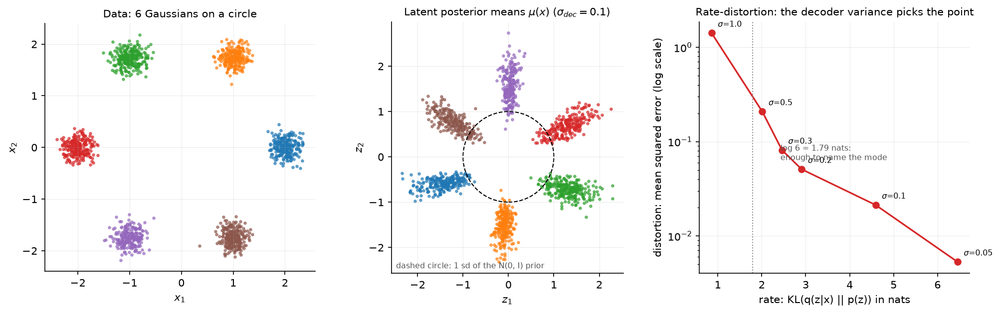

# Autoencoders and VAEs

> **Why this matters at staff level.** The VAE is the one generative model you will be asked to
> derive at a whiteboard, because the derivation tests Jensen's inequality, KL divergence,
> conditional independence and the reparameterisation trick in ten minutes. The production reason
> to know it is different: every latent diffusion model in service today generates inside a VAE's
> latent space, and every image or audio tokeniser feeding a multimodal LLM is a VQ-VAE variant.
> Strong signal is being able to derive the ELBO two ways, explain posterior collapse as a
> rate-distortion outcome rather than a bug, and say what the encoder of Stable Diffusion costs.

## TL;DR, the interview card

* Autoencoder: $x \to z \to \hat x$ with $\dim z < \dim x$ and a reconstruction loss. No density,
  no prior, no way to sample.
* VAE: add a prior $p(z)=\mathcal N(0,I)$ and an approximate posterior $q_\phi(z\mid x)$. Maximise
  $\log p(x) \geq \E_{q}[\log p_\theta(x\mid z)] - \KL(q_\phi(z\mid x)\,\Vert\, p(z))$.
* The gap in that bound is exactly $\KL(q_\phi(z\mid x)\,\Vert\,p_\theta(z\mid x))$, which is why
  a tighter posterior gives a tighter bound.
* Diagonal Gaussian KL in closed form:
  $\tfrac12 \sum_j (\mu_j^2 + \sigma_j^2 - \log \sigma_j^2 - 1)$. Memorise this.
* Reparameterise $z = \mu + \sigma \odot \varepsilon$, $\varepsilon \sim \mathcal N(0,I)$, so the
  gradient flows through $\mu$ and $\sigma$. The score-function alternative is unbiased but its
  variance is one to two orders of magnitude larger in practice.
* Posterior collapse ($\KL \to 0$, decoder ignores $z$) follows from the rate-distortion trade-off:
  if reconstruction is cheap relative to the KL, ignoring $z$ is optimal. The decoder variance
  $\sigma_{dec}$ and $\beta$ are the two knobs on that trade-off.
* VQ-VAE replaces the Gaussian bottleneck with a nearest-neighbour lookup in a codebook,
  gradients cross the argmin by the straight-through estimator $z_q = z_e + \mathrm{sg}[z_q - z_e]$,
  and a commitment loss with weight $0.25$ keeps the encoder near the codes.
* Production: the Stable Diffusion family generates in a VAE latent at $f=8$ downsampling,
  4 latent channels in SD 1.x and 16 in SD3. Image and audio tokenisers for multimodal LLMs are
  VQ-VAE descendants.

## 1. Intuition first

Take four points in $\R^3$ that happen to lie on a plane:

$$
X = \begin{bmatrix} 1 & 1 & 2 \\ 2 & 0 & 2 \\ 0 & 3 & 3 \\ -1 & 4 & 3\end{bmatrix},
\qquad x_3 = x_1 + x_2 .
$$

A linear autoencoder with a two-dimensional bottleneck can reconstruct $X$ with zero error: the
encoder keeps $(x_1, x_2)$ and the decoder adds them back. The bottleneck forced the network to
discover the constraint. With a nonlinear encoder and decoder the same thing happens on curved
manifolds, which is why autoencoder features were the first useful unsupervised representations.

Two properties are missing from that autoencoder. You cannot sample from it, because you do not
know which $z$ values decode to something plausible. And nothing stops the encoder from using
$z$ as an arbitrary lookup index, spreading codes so far apart that the space between them
decodes to noise.

The VAE fixes both by making the encoder output a distribution and paying a price when that
distribution drifts from a fixed prior. Sampling becomes: draw $z \sim \mathcal N(0,I)$, decode.

The middle panel of the figure below shows what that looks like after training on six Gaussian
blobs arranged on a circle. The encoder places each blob's posterior in its own region of the
latent plane, and the regions sit around the unit circle because the KL term pulls them toward
the prior.

{ width="900" }

The right panel is the part people miss. Sweeping the decoder standard deviation $\sigma_{dec}$
from 1.0 down to 0.05 traces a rate-distortion curve: the rate is the KL in nats, the distortion
is the reconstruction error. At $\sigma_{dec}=1$ the model spends under one nat on the latent,
which is less than the $\log 6 = 1.79$ nats needed to record which blob a point came from, so it
cannot reconstruct. That is posterior collapse, produced by nothing more exotic than the choice
of decoder variance.

## 2. The math

### 2.1 The model

A VAE is a latent variable model: $p_\theta(x) = \int p_\theta(x\mid z)\,p(z)\,dz$ with
$p(z) = \mathcal N(0, I)$, $z \in \R^{d_z}$, and a decoder $p_\theta(x \mid z)$ that is Gaussian
with mean $\mu_\theta(z)$ and fixed variance $\sigma_{dec}^2 I$ (Bernoulli for binary data). That
integral is intractable for a neural decoder, so we introduce an encoder
$q_\phi(z\mid x) = \mathcal N(\mu_\phi(x), \diag(\sigma^2_\phi(x)))$ and bound the likelihood.

### 2.2 The ELBO by Jensen

Write the marginal as an expectation under $q$ and apply Jensen's inequality to the concave $\log$:

$$
\log p_\theta(x) = \log \int p_\theta(x\mid z) p(z)\, dz
= \log \E_{q_\phi(z\mid x)}\!\left[\frac{p_\theta(x\mid z)\,p(z)}{q_\phi(z\mid x)}\right]
\geq \E_{q_\phi(z \mid x)}\!\left[\log \frac{p_\theta(x\mid z)\,p(z)}{q_\phi(z\mid x)}\right].
$$

Split the logarithm:

$$
\boxed{\;\log p_\theta(x) \;\geq\; \E_{q_\phi(z\mid x)}\big[\log p_\theta(x\mid z)\big]
\;-\; \KL\big(q_\phi(z\mid x)\,\Vert\,p(z)\big) \;=\; \mathcal L(\theta,\phi;x)\;}
$$

The first term rewards reconstruction. The second keeps the posterior close to the prior. The
importance-weight form $p/q$ is where $q$ enters, and it is valid for any $q$ with support
covering $p$, which is why you can pick any encoder family you like.

### 2.3 The ELBO by the posterior identity, which tells you the size of the gap

The same result drops out of a decomposition that also names the slack. Start from the
definition of the KL between the encoder and the true posterior:

$$
\KL\big(q_\phi(z\mid x)\,\Vert\,p_\theta(z \mid x)\big)
= \E_q\big[\log q_\phi(z\mid x) - \log p_\theta(z\mid x)\big]
= \E_q\Big[\log q_\phi(z\mid x) - \log \tfrac{p_\theta(x\mid z)p(z)}{p_\theta(x)}\Big].
$$

Since $\log p_\theta(x)$ does not depend on $z$, it comes out of the expectation:

$$
\KL\big(q_\phi \,\Vert\, p_\theta(z\mid x)\big) = -\mathcal L(\theta,\phi;x) + \log p_\theta(x),
$$

which rearranges to

$$
\boxed{\;\log p_\theta(x) = \mathcal L(\theta,\phi;x) + \KL\big(q_\phi(z\mid x)\,\Vert\,p_\theta(z\mid x)\big)\;}
$$

The bound is tight exactly when the encoder equals the true posterior. Maximising the ELBO in
$\phi$ does two jobs at once: it fits the model and it shrinks the approximation gap. This is the
version to derive in an interview, because it lets you answer the follow-up ("how loose is the
bound?") in one line.

### 2.4 The Gaussian KL in closed form

For $q = \mathcal N(\mu, \diag(\sigma^2))$ and $p = \mathcal N(0, I)$ in $\R^{d_z}$, both factorise
over dimensions, so work in one dimension and sum. Using
$\E_q[z] = \mu$ and $\E_q[z^2] = \mu^2 + \sigma^2$:

$$
\begin{aligned}
\KL(q\Vert p) &= \E_q\left[-\tfrac12 \log(2\pi\sigma^2) - \frac{(z-\mu)^2}{2\sigma^2}
+ \tfrac12\log(2\pi) + \frac{z^2}{2}\right] \\
&= -\tfrac12\log \sigma^2 - \tfrac12 + \tfrac12\left(\mu^2 + \sigma^2\right).
\end{aligned}
$$

Summing over dimensions:

$$
\boxed{\;\KL\big(\mathcal N(\mu, \diag(\sigma^2))\,\Vert\,\mathcal N(0,I)\big)
= \tfrac12 \sum_{j=1}^{d_z}\left(\mu_j^2 + \sigma_j^2 - \log \sigma_j^2 - 1\right)\;}
$$

Three checks worth doing out loud: it is zero at $\mu=0,\sigma=1$; it grows quadratically in $\mu$
and logarithmically as $\sigma \to 0$; and it is always non-negative because
$\sigma^2 - \log\sigma^2 - 1 \geq 0$ for $\sigma^2 > 0$. The test
`test_gaussian_kl_closed_form_matches_monte_carlo` checks it against 20,000 samples.

### 2.5 Reparameterisation, and why the naive estimator fails

The ELBO's first term is an expectation whose distribution depends on $\phi$. Differentiating
naively does not work, because $\nabla_\phi \E_{q_\phi}[f(z)] \neq \E_{q_\phi}[\nabla_\phi f(z)]$.
There are two standard fixes.

The score-function (REINFORCE) estimator writes

$$
\nabla_\phi \E_{q_\phi}[f(z)] = \E_{q_\phi}\big[f(z)\,\nabla_\phi \log q_\phi(z\mid x)\big],
$$

which is unbiased and works for discrete $z$, but the factor $f(z)$ multiplies the whole score,
so its variance scales with the magnitude of $f$ rather than with the sensitivity of $f$ to $z$.

Reparameterisation moves the randomness out of the parameters. Write
$z = g_\phi(\varepsilon, x) = \mu_\phi(x) + \sigma_\phi(x) \odot \varepsilon$ with
$\varepsilon \sim \mathcal N(0, I)$, a distribution free of $\phi$. Then

$$
\boxed{\;\nabla_\phi \E_{q_\phi(z\mid x)}[f(z)] = \E_{\varepsilon \sim \mathcal N(0,I)}\big[\nabla_\phi f(\mu_\phi + \sigma_\phi \odot \varepsilon)\big]\;}
$$

and the gradient flows through $f$'s Jacobian, so it carries information about how $f$ changes
with $z$. For a single sample the two estimators have very different variance: the pathwise one
sees $\partial f/\partial z$, the score-function one sees only $f$ times a noisy score. In
practice a single reparameterised sample per example per step is enough to train a VAE, which is
the whole reason the method is usable.

The trick needs $z$ to be a differentiable function of $\phi$ and $\varepsilon$. Discrete latents
break that, which is the problem VQ-VAE solves with a different tool in section 2.8.

### 2.6 What the objective is really trading, and posterior collapse

Average the ELBO over the data and regroup. Up to constants, training minimises

$$
\underbrace{\E_{x}\E_{q}\big[-\log p_\theta(x\mid z)\big]}_{\text{distortion } D}
\;+\;\beta\, \underbrace{\E_x\big[\KL(q_\phi(z\mid x)\Vert p(z))\big]}_{\text{rate } R},
$$

with $\beta=1$ for the plain ELBO. The rate is an upper bound on the mutual information between
$x$ and $z$ under the encoder, measured in nats. The distortion for a Gaussian decoder with fixed
$\sigma_{dec}$ is $\lVert x - \hat x\rVert^2 / (2\sigma_{dec}^2)$ plus a constant, so $\sigma_{dec}$
scales the distortion term against the rate exactly as $1/\beta$ would.

Now read off posterior collapse. If the decoder is powerful enough to model the data marginal
on its own (an autoregressive decoder on images or text is), or if $\sigma_{dec}$ is large
relative to the data scale, then paying $R$ nats buys less distortion reduction than it costs,
and the optimum is $q_\phi(z\mid x) = p(z)$ for every $x$. The KL goes to zero, the latent carries
nothing, and reconstructions become the conditional mean. The figure's right panel is this effect
measured: at $\sigma_{dec}=1$ the run settles below $\log 6$ nats and cannot even encode which
mode a point came from.

Fixes, in the order to mention them:

* Lower $\sigma_{dec}$ or use a learned per-pixel variance. This is the same knob as $\beta$.
* KL annealing: warm $\beta$ from 0 to 1 over the first few thousand steps so the encoder learns
  something before the prior starts pulling.
* Free bits: clamp the per-dimension KL at a floor $\lambda$ so the optimiser cannot drive a
  dimension to zero.
* Weaken the decoder, or drop out its access to context, so it cannot model the data alone.
* Use a discrete bottleneck (VQ-VAE), where the quantiser cannot express "I ignore the input".

$\beta$-VAE takes the same knob in the other direction: $\beta > 1$ buys a lower rate, which
encourages each latent dimension to carry an independent factor of variation at the cost of blurry
reconstructions. That trade is the entire content of the method.

### 2.7 The amortisation gap

The encoder is trained to output good posteriors for all $x$ at once, which is called amortised
inference. The total gap in the bound splits in two:

$$
\log p_\theta(x) - \mathcal L(\theta, \phi; x)
= \underbrace{\big[\log p_\theta(x) - \max_{q \in \mathcal Q}\mathcal L(q)\big]}_{\text{approximation gap}}
+ \underbrace{\big[\max_{q\in\mathcal Q} \mathcal L(q) - \mathcal L(q_\phi(\cdot\mid x))\big]}_{\text{amortisation gap}}.
$$

The approximation gap comes from the family $\mathcal Q$ (a diagonal Gaussian cannot represent a
correlated or multimodal posterior). The amortisation gap comes from the encoder network not
reaching the best member of that family for this particular $x$. You close the first with richer
posteriors (normalising flows on $z$, full covariance) and the second with more encoder capacity
or with test-time optimisation of $\mu, \sigma$ for a single example, which is what
iterative-amortised and "encoder fine-tuning at inference" tricks do.

### 2.8 VQ-VAE: a discrete bottleneck and the straight-through estimator

Replace the Gaussian latent with a codebook $e \in \R^{K \times D}$. The encoder produces
$z_e(x)$, and quantisation picks the nearest code:

$$
k = \argmin_j \lVert z_e(x) - e_j\rVert_2, \qquad z_q(x) = e_k .
$$

The argmin has zero gradient almost everywhere, so the decoder's gradient cannot reach the
encoder. The straight-through estimator defines the forward value as $z_q$ and the backward
Jacobian as the identity:

$$
\boxed{\;z_q^{\text{ST}} = z_e + \mathrm{sg}\big[z_q - z_e\big],\qquad
\frac{\partial z_q^{\text{ST}}}{\partial z_e} = I\;}
$$

where $\mathrm{sg}$ is stop-gradient. The forward pass is unchanged, and the backward pass pretends
quantisation was the identity. The estimator is biased, and the bias is small when $z_e$ is close
to its code, which is what the commitment term enforces. The full loss is

$$
L = \underbrace{\lVert x - D(z_q)\rVert^2}_{\text{reconstruction}}
+ \underbrace{\lVert \mathrm{sg}[z_e] - e_k \rVert^2}_{\text{codebook}}
+ \beta \underbrace{\lVert z_e - \mathrm{sg}[e_k] \rVert^2}_{\text{commitment}},
\qquad \beta = 0.25 .
$$

The codebook term moves codes toward the encoder outputs assigned to them (this is one step of
k-means, and many implementations replace it with an exponential moving average of the assigned
vectors instead). The commitment term moves encoder outputs toward their code, which keeps the
encoder from drifting away faster than the codebook can follow. Only the commitment term is
weighted, because the codebook term has no competing gradient.

There is no KL term and no prior over codes during stage one. You fit a prior afterwards, as an
autoregressive model over the discrete code grid (PixelCNN in the original paper, a Transformer in
VQ-GAN and in modern tokenisers). That two-stage structure is exactly how image tokens reach a
multimodal LLM.

Codebook collapse is the VQ failure mode to name: a few codes win every assignment and the rest
receive no gradient, so effective vocabulary shrinks. Track perplexity $\exp(H(\text{usage}))$,
which is 1 when one code is used and $K$ when usage is uniform. Standard fixes are EMA codebook
updates, re-initialising dead codes from encoder outputs in the current batch, and quantising in a
low-dimensional, L2-normalised space so distances are better conditioned.

## 3. Implementation

The VAE is four pieces: two encoder heads, a sampler, a decoder, and a loss.

```python
class VAE(nn.Module):
    """MLP VAE.  encode: (B, d_x) -> (mu, logvar) each (B, d_z);  decode: (B, d_z) -> (B, d_x)."""

    def __init__(self, d_x: int, d_z: int, d_hidden: int = 64) -> None:
        super().__init__()
        self.encoder_trunk = mlp(d_x, d_hidden, d_hidden)
        self.to_mu = nn.Linear(d_hidden, d_z)      # separate heads, never a fused 2*d_z projection
        self.to_logvar = nn.Linear(d_hidden, d_z)
        self.decoder = mlp(d_z, d_hidden, d_x)

    def encode(self, x: torch.Tensor) -> tuple[torch.Tensor, torch.Tensor]:
        h = self.encoder_trunk(x)                              # (B, d_hidden)
        mu = self.to_mu(h)                                     # (B, d_z)
        logvar = self.to_logvar(h)                             # (B, d_z)  log sigma²
        return mu, logvar

    def decode(self, z: torch.Tensor) -> torch.Tensor:
        x_hat = self.decoder(z)                                # (B, d_x)  = mean of p(x|z)
        return x_hat

    def forward(self, x: torch.Tensor) -> tuple[torch.Tensor, torch.Tensor, torch.Tensor]:
        mu, logvar = self.encode(x)                            # (B, d_z), (B, d_z)
        z = reparameterize(mu, logvar)                         # (B, d_z)
        x_hat = self.decode(z)                                 # (B, d_x)
        return x_hat, mu, logvar
```

The encoder predicts $\log \sigma^2$ rather than $\sigma$ for two reasons: the output is
unconstrained, so no positivity hack is needed, and $\log \sigma^2$ appears directly in the KL
formula. Predicting $\sigma$ and squaring it invites NaNs the first time the network outputs a
negative number.

```python
def reparameterize(mu: torch.Tensor, logvar: torch.Tensor) -> torch.Tensor:
    """``z = mu + sigma * eps``, ``eps ~ N(0, I)``: a sample of q(z|x) differentiable in mu, sigma."""
    sigma = torch.exp(0.5 * logvar)                            # (B, d_z)
    eps = torch.randn_like(mu)                                 # (B, d_z)
    z = mu + sigma * eps                                       # (B, d_z)
    return z


def gaussian_kl_closed_form(mu: torch.Tensor, logvar: torch.Tensor) -> torch.Tensor:
    """``KL( N(mu, diag(sigma²)) || N(0, I) ) = ½ Σ_j ( mu_j² + sigma_j² − log sigma_j² − 1 )``."""
    per_dim = 0.5 * (mu ** 2 + logvar.exp() - logvar - 1.0)   # (B, d_z)
    kl = per_dim.sum(dim=1)                                    # (B,)
    return kl
```

The KL sums over latent dimensions and stays per-example, so the caller decides how to reduce over
the batch. Summing over dimensions and averaging over the batch is the correct reduction; taking
`.mean()` over both silently divides the KL by $d_z$ and changes the rate-distortion point by a
factor you did not intend. This is the single most common VAE bug.

```python
def vae_loss(x, x_hat, mu, logvar, beta=1.0, sigma_dec=1.0):
    """Negative (beta-)ELBO per example, averaged over the batch."""
    d_x = x.shape[1]
    sq = ((x - x_hat) ** 2).sum(dim=1)                         # (B,)
    const = d_x * (math.log(sigma_dec) + 0.5 * math.log(2 * math.pi))
    recon = 0.5 * sq / sigma_dec ** 2 + const                  # (B,)  = −log p(x|z)
    kl = gaussian_kl_closed_form(mu, logvar)                   # (B,)
    loss = (recon + beta * kl).mean()
    return loss, recon.mean(), kl.mean()
```

Keeping the Gaussian constants makes the returned number an estimate of the negative ELBO in nats,
comparable across runs and checkable against `negative_elbo_estimate`, which builds the same
quantity out of an explicit log density. Dropping them is fine for optimisation and confusing for
monitoring.

The vector quantiser is where the interesting line lives.

```python
class VectorQuantizer(nn.Module):
    """Nearest-neighbour quantiser with codebook (K, D)."""

    def nearest_code(self, z_e: torch.Tensor) -> torch.Tensor:
        flat = z_e.reshape(-1, z_e.shape[-1])                          # (B*N, D)
        e = self.codebook.weight                                       # (K, D)
        # ||z − e||² = ||z||² − 2 z·e + ||e||²  (expanded so we never build a (B*N, K, D) tensor)
        d2 = (flat ** 2).sum(dim=1, keepdim=True) - 2.0 * flat @ e.t() + (e ** 2).sum(dim=1)[None, :]  # (B*N, K)
        indices = d2.argmin(dim=1)                                     # (B*N,)
        return indices.reshape(z_e.shape[0], z_e.shape[1])             # (B, N)

    def forward(self, z_e: torch.Tensor) -> tuple[torch.Tensor, torch.Tensor, torch.Tensor]:
        indices = self.nearest_code(z_e)                               # (B, N)
        z_q = self.codebook(indices)                                   # (B, N, D)
        codebook_loss = ((z_e.detach() - z_q) ** 2).mean()             # pulls e_k toward z_e
        commitment_loss = ((z_e - z_q.detach()) ** 2).mean()           # pulls z_e toward e_k
        vq_loss = codebook_loss + self.beta * commitment_loss
        z_q_st = z_e + (z_q - z_e).detach()                            # (B, N, D) straight-through
        return z_q_st, vq_loss, indices
```

Three details to be able to defend. The expanded distance avoids materialising a
$(B\!\cdot\!N, K, D)$ tensor; with $K=8192$ and $D=256$ that difference is gigabytes. The two loss
terms are the same squared distance with the `detach` on opposite sides, which is how you route
one gradient to the codebook and the other to the encoder. And `z_e + (z_q - z_e).detach()`
evaluates to `z_q` numerically while having derivative 1 with respect to `z_e`.

**How you would test it.** Set the codebook to known vectors and check the assignment by hand.
Then call `.backward()` on the sum of the quantised output and assert the encoder gradient is
exactly ones, which is the straight-through property stated as an executable claim. For the VAE,
check the closed-form KL against a Monte-Carlo estimate, check `reparameterize` reproduces the
right mean and standard deviation over many draws and that $\partial z/\partial\mu = 1$, and check
that training drives the negative ELBO down on synthetic data.

## Retype by hand

Close the book and write these from memory. They are small, and they are what gets asked.

| Symbol | File | Time | Checked by |
|---|---|---|---|
| `reparameterize` | `src/mlbook/generative/vae.py` | 3 min | `test_reparameterize_mean_and_std_and_gradient` |
| `gaussian_kl_closed_form` | `src/mlbook/generative/vae.py` | 4 min | `test_gaussian_kl_closed_form_known_values`, `test_gaussian_kl_closed_form_matches_monte_carlo` |
| `vae_loss` | `src/mlbook/generative/vae.py` | 8 min | `test_vae_loss_components`, `test_vae_negative_elbo_decreases_on_synthetic_data` |
| `VAE.encode` / `VAE.forward` | `src/mlbook/generative/vae.py` | 5 min | `test_vae_negative_elbo_decreases_on_synthetic_data` |
| `VectorQuantizer.nearest_code` | `src/mlbook/generative/vqvae.py` | 6 min | `test_vector_quantizer_nearest_code_and_straight_through` |
| `VectorQuantizer.forward` | `src/mlbook/generative/vqvae.py` | 9 min | `test_vector_quantizer_nearest_code_and_straight_through`, `test_vq_loss_pulls_codebook_and_encoder_correctly` |

Target: VAE loss plus reparameterisation in 15 minutes, the VQ quantiser in 15 minutes.

Read but do not retype: `Autoencoder`, `corrupt_gaussian`, `corrupt_mask`,
`gaussian_kl_monte_carlo`, `gaussian_log_density`, `codebook_perplexity`, `VQVAE`. They are
useful as instrumentation and they are not what an interviewer asks you to reproduce.

```bash
python -m pytest tests/test_generative_vae.py -q
python -m pytest tests/test_generative_vae.py -q -k "reparameterize or kl"   # just the VAE core
python -m pytest tests/test_generative_vae.py -q -k "quantizer or vq"         # just the VQ core
```

## 4. Systems view: cost, failure modes, trade-offs

**Cost of the encoder-decoder in a latent diffusion stack.** At $f=8$ downsampling, a
$512 \times 512 \times 3$ image becomes a $64 \times 64 \times 4$ latent. Element count drops from
786,432 to 16,384, a factor of 48. The diffusion U-Net or DiT then runs on 4,096 tokens at patch
size 1, instead of on pixels. Since attention is quadratic in token count, that compression is
what makes 512-pixel generation affordable. The VAE itself runs twice per image at inference
(decode only, unless you are doing image-to-image), against 20 to 50 forward passes of the
denoiser, so the VAE is a small fraction of inference cost and a large fraction of the quality
ceiling.

**What the VAE decides that the diffusion model cannot fix.** Fine text, faces at small scale, and
high-frequency textures are lost in the autoencoder before diffusion ever sees them. Checking a
generative system's ceiling starts with encoding and decoding a real image and looking at the
reconstruction. If the text is already mush there, no sampler change will help. This is the reason
SD3 moved to 16 latent channels: more channels means less compression and a higher reconstruction
ceiling, at the cost of a harder diffusion problem.

**Why production autoencoders are not trained on MSE alone.** MSE gives blurry reconstructions
because it is the negative log likelihood of a unimodal Gaussian, and the conditional distribution
of a patch given its neighbourhood is multimodal. Latent diffusion autoencoders add a perceptual
loss (LPIPS, a distance in the features of a pretrained network) and a patch-level adversarial
loss. The GAN term here is a texture prior, and its failure modes are the subject of
[chapter 2](02-gans.md).

**When to use what.**

| Situation | Choice | Why |
|---|---|---|
| You need features for a downstream task | Skip the VAE. Use SSL ([Part X](../part10-self-supervised/01-self-supervised-learning.md)) | DINOv2 or MAE features beat VAE latents for recognition by a wide margin |
| You need a compact continuous latent for diffusion | KL-regularised VAE with a small KL weight, plus LPIPS and adversarial losses | Smooth latents that a diffusion model can traverse |
| You need discrete tokens for an autoregressive model or an LLM | VQ-VAE or VQ-GAN | Integer tokens compose with a Transformer vocabulary |
| You need exact likelihoods | Normalising flow or autoregressive model | VAE gives a bound, not a likelihood |
| You need anomaly detection | VAE reconstruction error, with care | Reconstruction error is a weak anomaly score; high-likelihood out-of-distribution failures are documented |
| You need disentangled factors | $\beta$-VAE, knowing what you pay | Higher $\beta$ buys independence with blur |

**Failure modes, in the order you will meet them.** Posterior collapse (watch the KL, not just the
total loss). Blurry samples (the decoder's Gaussian assumption). Holes in the latent space, where
prior samples decode to nothing plausible, which shows up as a gap between reconstruction quality
and sample quality. Codebook collapse in the VQ variant (watch perplexity). And KL reduction bugs,
where averaging instead of summing over latent dimensions quietly changes $\beta$ by $d_z$.

## 5. In production

!!! production "Stability AI and CompVis: the autoencoder under Stable Diffusion"
    Latent diffusion was introduced to cut the cost of diffusion training and sampling by moving
    the process into the latent space of a pretrained autoencoder. The paper trains
    KL-regularised and VQ-regularised autoencoders with a perceptual loss and a patch-based
    adversarial loss, and studies downsampling factors, reporting that $f=4$ to $f=8$ balances
    reconstruction quality against the difficulty of the latent modelling problem. The released
    Stable Diffusion models use $f=8$ with 4 latent channels.
    [High-Resolution Image Synthesis with Latent Diffusion Models, arXiv:2112.10752](https://arxiv.org/abs/2112.10752)

!!! production "Stability AI: SD3 widens the latent"
    The Stable Diffusion 3 report describes moving to a 16-channel latent and studies its effect
    on reconstruction and on final sample quality, alongside the rectified-flow objective covered
    in [chapter 4](04-flow-matching.md) and the MMDiT architecture.
    [Scaling Rectified Flow Transformers for High-Resolution Image Synthesis, arXiv:2403.03206](https://arxiv.org/abs/2403.03206)
    and the [Stability AI research post](https://stability.ai/news-updates/stable-diffusion-3-research-paper).

!!! production "DeepMind: VQ-VAE, and why discrete latents exist"
    The original VQ-VAE paper introduces the codebook, the straight-through estimator and the
    commitment loss, and makes the argument that discrete latents sidestep posterior collapse
    with powerful autoregressive decoders. VQ-VAE-2 scales it to a hierarchy of latents with
    autoregressive priors and produces ImageNet samples competitive with the GANs of its day.
    [Neural Discrete Representation Learning, arXiv:1711.00937](https://arxiv.org/abs/1711.00937),
    [Generating Diverse High-Fidelity Images with VQ-VAE-2, arXiv:1906.00446](https://arxiv.org/abs/1906.00446)

!!! production "VQ-GAN: the tokeniser pattern that multimodal LLMs inherited"
    Taming Transformers adds a perceptual loss and a patch discriminator to VQ-VAE, which lets a
    small code grid carry a sharp image, then models the code grid with an autoregressive
    Transformer. The two-stage recipe (learn discrete visual tokens, then model them with a
    sequence model) is the ancestor of the image tokenisers used by multimodal models.
    [Taming Transformers for High-Resolution Image Synthesis, arXiv:2012.09841](https://arxiv.org/abs/2012.09841)

## 6. Interview questions and strong answers

!!! interview "Derive the ELBO, then tell me how loose it is"
    Start from $\log p(x) = \log \E_q[p(x\mid z)p(z)/q(z\mid x)]$ and apply Jensen to get the bound.
    Then show the identity $\log p(x) = \mathcal L + \KL(q(z\mid x)\Vert p(z\mid x))$, which names
    the slack: the bound is loose by exactly the KL between the encoder and the true posterior.
    That decomposition explains why training the encoder helps the bound even when the decoder is
    fixed.

    **Staff-level follow-up: split that gap further.** The approximation gap is what the posterior
    family cannot express (a diagonal Gaussian cannot represent correlated posteriors), the
    amortisation gap is what the encoder network fails to reach within that family. Richer
    posteriors close the first, per-example test-time optimisation closes the second.

!!! interview "Why do you need the reparameterisation trick, and what would you do for a discrete latent?"
    The ELBO's expectation is under a distribution whose parameters you are differentiating, so
    you cannot push the gradient inside. Reparameterisation rewrites the sample as a deterministic
    function of the parameters and parameter-free noise, giving a pathwise gradient that depends
    on $\partial f/\partial z$, which is far lower variance than the score-function estimator that
    only sees $f$ times the score.

    For discrete latents there is no such rewriting. Options: REINFORCE with a baseline (unbiased,
    high variance), Gumbel-softmax with a temperature (biased, low variance, anneals toward
    discrete), or a straight-through estimator with vector quantisation, which is what VQ-VAE does
    and what is used in practice for tokenisers.

!!! interview "Your VAE's KL is near zero and samples look like the dataset mean. Diagnose it."
    Posterior collapse. The encoder is ignoring the input because the rate is not paying for
    itself. First check whether the KL is summed over latent dimensions or averaged, since
    averaging divides the rate term by $d_z$ and can cause this on its own. Then look at the
    decoder: a fixed $\sigma_{dec}=1$ on data with a much smaller scale makes reconstruction cheap
    in nats, so collapse is the optimum, not a bug. Fixes in order of effort: lower $\sigma_{dec}$
    or learn it, anneal $\beta$ from 0, apply free bits to floor the per-dimension KL, weaken the
    decoder, or switch to a discrete bottleneck.

    **Staff-level follow-up: how do you tell collapse from a bad decoder?** Feed the decoder the
    encoder's mean rather than a sample. If reconstructions are still the dataset mean, the latent
    carries nothing (collapse). If they become sharp, the decoder is fine and the noise from a
    wide posterior is what is washing them out.

!!! interview "Why is there a GAN loss in the Stable Diffusion autoencoder?"
    MSE is the negative log likelihood of a unimodal Gaussian, and the true distribution over
    high-frequency detail given the surrounding context is multimodal, so the MSE optimum is the
    average of all plausible textures, which looks blurry. A patch discriminator supplies a loss
    that rewards any plausible texture rather than the mean one. The perceptual loss does related
    work in a pretrained feature space. The adversarial term is small and local by design, since
    the goal is texture, not global structure, and global structure is the diffusion model's job.

!!! interview "Why do image tokenisers for multimodal LLMs use VQ rather than a Gaussian latent?"
    An LLM consumes integer tokens from a finite vocabulary, so the interface has to be discrete.
    VQ gives that directly: each latent position becomes a code index that can be embedded in the
    model's vocabulary and predicted with a softmax. A continuous latent would need a separate
    regression head and could not share the language model's sampling machinery. The cost is
    quantisation error and codebook collapse, which you monitor with perplexity and mitigate with
    EMA updates and dead-code restarts.

!!! interview "You are choosing the downsampling factor for a latent diffusion model. How?"
    Two forces. Larger $f$ means fewer latent tokens, which is a quadratic saving in attention and
    a linear saving in every other layer, and it makes the diffusion model's job easier because
    the latent is smoother. Smaller $f$ means a higher reconstruction ceiling, since the
    autoencoder discards less. Fix the compute budget, then measure reconstruction quality of the
    autoencoder alone on your hardest content (small text, faces, fine texture) as a function of
    $f$ and channel count, and pick the most aggressive setting that still clears your quality
    bar. The published sweep in the latent diffusion paper puts the balance at $f=4$ to $f=8$ for
    natural images, and SD3's 16-channel latent is the same trade made on the channel axis.

## 7. Exercises

**★ 1. KL by hand.** Compute $\KL(\mathcal N(2, 4)\,\Vert\,\mathcal N(0,1))$ with the boxed formula,
then verify it numerically.

??? success "Solution"
    $\tfrac12(\mu^2 + \sigma^2 - \log\sigma^2 - 1) = \tfrac12(4 + 4 - \log 4 - 1) = \tfrac12(7 - 1.386) = 2.807$ nats.

    ```python
    import torch, math
    from mlbook.generative.vae import gaussian_kl_closed_form, gaussian_kl_monte_carlo
    mu = torch.tensor([[2.0]]); logvar = torch.tensor([[math.log(4.0)]])
    print(gaussian_kl_closed_form(mu, logvar), gaussian_kl_monte_carlo(mu, logvar, 100000))
    ```

**★ 2. The reduction bug.** Change `gaussian_kl_closed_form` to average over latent dimensions
instead of summing, retrain the VAE from `test_vae_negative_elbo_decreases_on_synthetic_data`
with $d_z = 8$, and describe what happens to the reconstruction and to the KL.

??? success "Solution"
    Averaging divides the rate by $d_z=8$, which is the same as setting $\beta = 1/8$. The
    reconstruction improves, the KL (as reported by the correct formula) rises, and samples from
    the prior get worse because the aggregate posterior no longer matches $\mathcal N(0,I)$. The
    lesson is that the reduction is part of the objective, not a formatting choice.

**★★ 3. Free bits.** Implement a free-bits variant: replace the KL with
$\sum_j \max(\lambda, \KL_j)$ for a per-dimension floor $\lambda$. Train on the toy mixture with
$\sigma_{dec}=1$, the setting that collapsed in the figure, and show that the latent is used.

??? success "Solution"
    ```python
    def free_bits_kl(mu, logvar, lam=0.5):
        per_dim = 0.5 * (mu ** 2 + logvar.exp() - logvar - 1.0)   # (B, d_z)
        return torch.clamp(per_dim.mean(dim=0), min=lam).sum()    # floor applied per dimension
    ```
    The clamp is applied to the batch-averaged per-dimension KL, so the optimiser gets no gradient
    to push a dimension below $\lambda$ but is free to use more. With $\lambda=0.5$ and $d_z=2$ the
    model is forced to carry at least 1 nat, enough to separate some modes, and reconstructions
    stop being the dataset mean.

**★★ 4. Codebook collapse, induced and cured.** Train the `VQVAE` with $K=64$ on the 4-mode
mixture and log `codebook_perplexity` every 50 steps. Then re-initialise any code unused for 100
steps to a random encoder output from the current batch, and compare the perplexity curves.

??? success "Solution"
    Without restarts, perplexity typically settles near the number of modes and most codes stay
    dead, because a code that never wins receives no gradient. With restarts, perplexity climbs
    and reconstruction error falls, since more codes means finer quantisation. The restart rule is
    three lines: track a usage counter, find codes with zero count over the window, and copy
    random rows of `z_e.detach()` into `codebook.weight` at those indices.

**★★★ 5. Close the amortisation gap at test time.** For a trained VAE, take one held-out $x$,
freeze the decoder, and optimise $\mu, \log\sigma^2$ directly for that example with Adam for 200
steps starting from the encoder's output. Report the ELBO before and after.

??? success "Solution"
    ```python
    mu, logvar = (t.detach().clone().requires_grad_(True) for t in model.encode(x))
    opt = torch.optim.Adam([mu, logvar], lr=1e-2)
    for _ in range(200):
        z = reparameterize(mu, logvar)                  # (1, d_z)
        loss, _, _ = vae_loss(x, model.decode(z), mu, logvar, sigma_dec=0.1)
        opt.zero_grad(); loss.backward(); opt.step()
    ```
    The ELBO improves. The improvement is the amortisation gap for that example, measured rather
    than argued about. On a small model trained to convergence it is usually small; on an
    undertrained or capacity-limited encoder it can be large, which tells you where to spend
    parameters.

**★★★ 6. Rate-distortion curve for your own data.** Reproduce the right panel of the figure with
`figures/part09_vae_latent.py` on two-moons instead of the mixture, and explain the shape
difference.

??? success "Solution"
    Two-moons is a continuous one-dimensional manifold plus noise, so distortion falls smoothly
    with rate: each extra nat buys resolution along the curve. The mixture has a discrete
    component, so the curve has a knee around $\log K$ nats, where the model first affords to name
    the mode. Curves with knees tell you there is a discrete factor in the data, which is an
    argument for a discrete bottleneck.

## References

* Kingma and Welling, *Auto-Encoding Variational Bayes*, ICLR 2014. [arXiv:1312.6114](https://arxiv.org/abs/1312.6114)
* van den Oord, Vinyals, Kavukcuoglu, *Neural Discrete Representation Learning* (VQ-VAE), NeurIPS 2017. [arXiv:1711.00937](https://arxiv.org/abs/1711.00937)
* Razavi, van den Oord, Vinyals, *Generating Diverse High-Fidelity Images with VQ-VAE-2*, NeurIPS 2019. [arXiv:1906.00446](https://arxiv.org/abs/1906.00446)
* Esser, Rombach, Ommer, *Taming Transformers for High-Resolution Image Synthesis* (VQ-GAN), CVPR 2021. [arXiv:2012.09841](https://arxiv.org/abs/2012.09841)
* Rombach, Blattmann, Lorenz, Esser, Ommer, *High-Resolution Image Synthesis with Latent Diffusion Models*, CVPR 2022. [arXiv:2112.10752](https://arxiv.org/abs/2112.10752)
* Esser et al., *Scaling Rectified Flow Transformers for High-Resolution Image Synthesis* (SD3), ICML 2024. [arXiv:2403.03206](https://arxiv.org/abs/2403.03206)
* Higgins et al., *beta-VAE: Learning Basic Visual Concepts with a Constrained Variational Framework*, ICLR 2017. (OpenReview; link not verified from this environment, search the title.)
