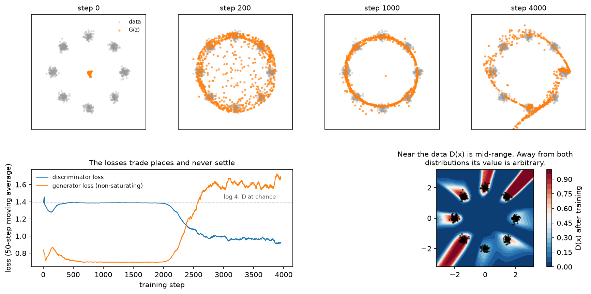

# GANs

> **Why this matters at staff level.** You are unlikely to train a GAN from scratch in 2026, and
> you are likely to be asked to derive the optimal discriminator and show that the objective
> reduces to a Jensen-Shannon divergence, because that derivation is a clean test of whether you
> can do variational calculus on a loss. The production reason to know GANs is narrower and real:
> the adversarial loss inside VQ-GAN and inside the Stable Diffusion autoencoder is what makes
> latent decoders produce sharp texture, and super-resolution and real-time avatar systems still
> ship GAN decoders because they generate in one forward pass.

## TL;DR, the interview card

* Objective: $\min_G \max_D\; \E_{x\sim p_{data}}[\log D(x)] + \E_{z\sim p_z}[\log(1 - D(G(z)))]$.
* For fixed $G$, the optimal discriminator is
  $D^*(x) = \dfrac{p_{data}(x)}{p_{data}(x) + p_g(x)}$, obtained pointwise.
* Substituting $D^*$ gives $2\,\mathrm{JSD}(p_{data}\Vert p_g) - \log 4$, so the global optimum is
  $p_g = p_{data}$ with value $-\log 4 \approx -1.386$.
* Non-saturating generator loss: minimise $-\E[\log D(G(z))]$ instead of $\E[\log(1-D(G(z)))]$.
  Same fixed point, non-vanishing gradient when $D$ is confident.
* Failure modes: mode collapse (generator maps many $z$ to one output), discriminator overpowering,
  oscillation. None of them show up in the loss curves, which is why you look at samples.
* WGAN replaces JSD with the Wasserstein-1 distance through Kantorovich-Rubinstein duality, which
  needs a 1-Lipschitz critic. Weight clipping enforces it badly, a gradient penalty enforces it
  better, spectral normalisation enforces it by construction.
* Evaluation: FID (Frechet distance between Inception feature Gaussians, lower is better) and
  Inception Score. Both are proxies with known pathologies. See
  [Part XIII, evaluation](../part13-retrieval-eval-reliability/02-evaluation.md).
* Where they live today: VQ-GAN and latent-diffusion autoencoder decoders, super-resolution,
  distillation targets for one-step image models.

## 1. Intuition first

Two networks, one game. The generator $G$ maps noise $z \sim \mathcal N(0, I)$ to samples. The
discriminator $D$ receives a point and outputs the probability that it came from the data rather
than from $G$. $D$ is trained to be right, $G$ is trained to make $D$ wrong.

Track four numbers on a 2-D toy problem and the dynamics become concrete: the discriminator's
loss, the generator's loss, what $D(x)$ looks like across the plane, and where the samples land.

{ width="900" }

The top row is the generator's samples at four points in training on eight Gaussians arranged on a
circle. At step 0 they are a blob near the origin. By step 200 they have spread toward the ring, by
step 1000 they sit on it, and by step 4000 they have concentrated on some modes and grown a stray
filament through the middle. That non-monotonicity is the behaviour to expect: this run does not
converge to a fixed point and settle, it keeps moving.

The bottom-left panel is what that looks like in the losses. For 2000 steps the discriminator sits
at $\log 4$, the value it would have if the two distributions matched and it could do no better
than guess. Then it finds a signal, its loss drops, and the generator's loss climbs in response.
Neither curve tells you whether the samples are good, which is why you look at samples.

The bottom-right panel shows $D(x)$ over the plane at the end of training. Where the data sits, $D$
is mid-range, so there is no easy win left there. Away from both distributions its value is
arbitrary: no gradient ever constrained it, which is the same observation that motivates the
gradient penalty in section 2.5.

## 2. The math

### 2.1 The optimal discriminator

Write the objective with both expectations as integrals over $x$. The generator induces a density
$p_g$, so

$$
V(G, D) = \int_x p_{data}(x) \log D(x)\,dx + \int_x p_g(x)\log\big(1 - D(x)\big)\,dx .
$$

For fixed $G$ we maximise over $D$. The integrand at each $x$ depends only on the scalar $D(x)$,
so maximise pointwise. With $a = p_{data}(x)$, $b = p_g(x)$ and $u = D(x)$, the function
$a\log u + b \log (1-u)$ has derivative $a/u - b/(1-u)$, which vanishes at $u = a/(a+b)$, and the
second derivative $-a/u^2 - b/(1-u)^2$ is negative, so it is the maximum:

$$
\boxed{\;D^*_G(x) = \frac{p_{data}(x)}{p_{data}(x) + p_g(x)}\;}
$$

Two readings. Where only data lives, $D^* = 1$. Where only generated samples live, $D^*=0$. Where
the densities match, $D^* = 1/2$. And the discriminator is estimating a density ratio, which is
why a trained discriminator can be repurposed as an importance weight.

### 2.2 The objective at the optimum is a Jensen-Shannon divergence

Substitute $D^*$ back:

$$
\begin{aligned}
V(G, D^*_G) &= \E_{p_{data}}\!\left[\log \frac{p_{data}}{p_{data}+p_g}\right]
+ \E_{p_g}\!\left[\log \frac{p_g}{p_{data}+p_g}\right] \\
&= \E_{p_{data}}\!\left[\log \frac{p_{data}}{\tfrac12(p_{data}+p_g)}\right]
+ \E_{p_g}\!\left[\log \frac{p_g}{\tfrac12 (p_{data}+p_g)}\right] - 2\log 2 ,
\end{aligned}
$$

where the last step multiplies and divides each fraction by $2$. With
$m = \tfrac12(p_{data} + p_g)$ the two expectations are KL divergences:

$$
\boxed{\;V(G, D^*_G) = \KL(p_{data}\Vert m) + \KL(p_g \Vert m) - \log 4 = 2\,\mathrm{JSD}(p_{data}\Vert p_g) - \log 4\;}
$$

JSD is non-negative and zero only when the distributions agree, so the global minimum over $G$ is
at $p_g = p_{data}$ with value $-\log 4$. Under the discriminator's loss convention used in the
code (a sum of two binary cross-entropies, which is $-V$), the chance-level value is $+\log 4
\approx 1.386$, the dashed line in the figure.

The assumptions matter. This argument treats $p_g$ as a free density and assumes $D$ reaches its
optimum at every step. In practice $D$ is a network trained for a few steps, $p_g$ is constrained
by the generator's architecture, and the alternating updates are not a well-behaved descent on any
single objective. The theory tells you where the fixed point is, not that you will get there.

### 2.3 The non-saturating loss

Early in training $G$ is bad, so $D(G(z)) \approx 0$. The minimax generator loss
$\E[\log(1 - D(G(z)))]$ then has a gradient that goes to zero, because $\log(1-u)$ is flat near
$u=0$. The generator receives almost no signal exactly when it needs the most.

The standard fix flips the target and keeps the sign: maximise $\E[\log D(G(z))]$, so the loss to
minimise is $-\E[\log D(G(z))]$. Near $u = 0$, $-\log u$ has slope $-1/u$, which is large. Both losses
share the same fixed point, and they differ in the gradient magnitude away from it. The test
`test_g_loss_non_saturating_has_gradient_when_d_is_confident` measures this: at a logit of $-10$
the saturating loss has gradient below $10^{-3}$ while the non-saturating one has gradient near 1.

### 2.4 Mode collapse, stated precisely

Nothing in the objective rewards covering the data. If $p_g$ concentrates on a subset of the modes
and the discriminator cannot exploit the missing mass fast enough, the generator is content.
Formally, the JSD does penalise missing modes, but the alternating game does not optimise the JSD;
it chases a moving discriminator, and a generator can rotate between modes faster than $D$ adapts.
Symptoms: samples from many different $z$ look identical, sample diversity metrics collapse while
FID looks acceptable, and the generator's loss oscillates on a short period.

Mitigations worth naming: minibatch discrimination (let $D$ see batch statistics, so an identical
batch is detectable), unrolled updates (differentiate through $k$ discriminator steps), two
time-scale updates (a higher learning rate for $D$ than for $G$), and switching the divergence
(Wasserstein).

### 2.5 Wasserstein GANs

JSD has a specific defect: when the supports of $p_{data}$ and $p_g$ are disjoint, which is the
generic situation for two low-dimensional manifolds in a high-dimensional space, the JSD is
constant at $\log 2$ and its gradient is zero. The generator gets no direction.

The Wasserstein-1 distance measures the cost of transporting one distribution onto the other:

$$
W(p, q) = \inf_{\gamma \in \Pi(p,q)} \E_{(x,y)\sim\gamma}\big[\lVert x - y\rVert\big] ,
$$

which stays finite and informative for disjoint supports, since it is sensitive to how far apart
the supports are, not only to whether they overlap. The infimum over couplings is intractable,
so use the Kantorovich-Rubinstein duality:

$$
\boxed{\;W(p, q) = \sup_{\lVert f \rVert_L \leq 1}\; \E_{x\sim p}[f(x)] - \E_{y \sim q}[f(y)]\;}
$$

The supremum runs over all 1-Lipschitz functions $f$. Parameterise $f$ by a network (called a
critic, because it outputs a real number and not a probability), maximise the difference of
means, and the generator minimises it. The critic's value is now an estimate of a distance, which
is why WGAN training curves are readable in a way that standard GAN curves are not.

Enforcing the Lipschitz constraint is where the implementations differ.

* **Weight clipping**, in the original WGAN: clamp every weight into $[-c, c]$ after each update.
  It bounds the Lipschitz constant crudely, pushes weights to the clipping boundary, and makes the
  critic's capacity depend on $c$ in a way that is hard to tune.
* **Gradient penalty** (WGAN-GP): add $\lambda\,\E_{\hat x}\big[(\lVert \nabla_{\hat x} f(\hat x)\rVert_2 - 1)^2\big]$
  where $\hat x$ is sampled on lines between real and fake points. A differentiable function is
  1-Lipschitz exactly when its gradient norm is at most 1 everywhere, and the optimal critic has
  unit gradient norm along the transport paths, which is why the penalty targets 1 instead of
  penalising only norms above 1. Note that batch normalisation in the critic breaks the
  per-example nature of this penalty; layer norm is the usual replacement.
* **Spectral normalisation**: divide every weight matrix by its largest singular value, estimated
  with one step of power iteration per forward pass. The resulting layer has Lipschitz constant 1,
  so a composition of them is 1-Lipschitz (for 1-Lipschitz activations). Cheap, stable, and the
  most common choice in later GAN work.

### 2.6 Conditioning and the architectures worth knowing

Conditional GANs feed a label or an embedding to both networks: $G(z, y)$ and $D(x, y)$. The
projection discriminator computes an inner product between the label embedding and a feature vector
and adds it to the unconditional score, which works better than concatenation for many classes.
Image-to-image models (pix2pix, CycleGAN) use the same machinery with a structured input instead of
noise.

StyleGAN is worth knowing as literacy: a learned constant input, a mapping network from $z$ to an
intermediate latent $w$, and per-layer modulation of convolution weights by $w$ (adaptive instance
normalisation in v1, weight demodulation in v2), plus per-pixel noise injection for stochastic
detail. The reason it comes up is the latent space: $w$ is far more disentangled than $z$, which
made GAN-based editing practical, and it is the reason "latent direction" editing papers all target
StyleGAN.

### 2.7 Where the adversarial loss actually lives now

In a VQ-GAN or a latent-diffusion autoencoder, the reconstruction objective is a sum of an $L_1$ or
$L_2$ term, a perceptual term, and a patch-level adversarial term. The discriminator here operates
on overlapping patches and returns a real-or-fake judgement per patch. Its job is texture: it
penalises the blur that a pixel-wise loss produces, without being asked to judge global structure.
The adversarial weight is small, and it is often ramped in after the reconstruction losses have
converged, since an adversarial loss applied from step zero destabilises the encoder.

## 3. Implementation

The whole game fits in a page. Discriminator outputs are logits, and the losses use
`binary_cross_entropy_with_logits` so that $\log(1 - \sigma(\ell)) = -\mathrm{softplus}(\ell)$ is
computed stably.

```python
def d_loss_standard(logit_real: torch.Tensor, logit_fake: torch.Tensor) -> torch.Tensor:
    """``−E[log D(x)] − E[log(1 − D(G(z)))]``: the discriminator *minimises* this."""
    loss_real = F.binary_cross_entropy_with_logits(logit_real, torch.ones_like(logit_real))
    loss_fake = F.binary_cross_entropy_with_logits(logit_fake, torch.zeros_like(logit_fake))
    return loss_real + loss_fake


def g_loss_saturating(logit_fake: torch.Tensor) -> torch.Tensor:
    """Minimax generator loss ``E[log(1 − D(G(z)))]``.  Its gradient vanishes when D is confident."""
    return -F.binary_cross_entropy_with_logits(logit_fake, torch.zeros_like(logit_fake))


def g_loss_non_saturating(logit_fake: torch.Tensor) -> torch.Tensor:
    """Non-saturating generator loss ``−E[log D(G(z))]`` (the one everyone actually trains with)."""
    return F.binary_cross_entropy_with_logits(logit_fake, torch.ones_like(logit_fake))
```

The non-saturating loss is the same cross-entropy as the discriminator's real term, applied to
fake samples with the label flipped to 1. That one-line implementation hides the fact that it is a
different objective from the minimax one, which is why the saturating version is kept here as a
separate function to compare gradients against.

```python
def gan_train_step(gen, disc, opt_g, opt_d, x_real, d_z):
    """One alternating update: D step on (real, detached fake), then G step (non-saturating)."""
    B = x_real.shape[0]
    # --- discriminator step -------------------------------------------------
    z = torch.randn(B, d_z)                                                   # (B, d_z)
    x_fake = gen(z).detach()                                                  # (B, d_x)  no grad into G
    d_loss = d_loss_standard(disc(x_real), disc(x_fake))
    opt_d.zero_grad()
    d_loss.backward()
    opt_d.step()
    # --- generator step -----------------------------------------------------
    z = torch.randn(B, d_z)                                                   # (B, d_z)
    g_loss = g_loss_non_saturating(disc(gen(z)))                              # grads flow through D into G
    opt_g.zero_grad()
    g_loss.backward()
    opt_g.step()
    return float(d_loss.detach()), float(g_loss.detach())
```

The `.detach()` in the discriminator step is the line people get wrong. Without it, the
discriminator's backward pass also accumulates gradients into the generator's parameters, and if
`opt_g` is stepped later without zeroing them, the generator receives a gradient that pushes it to
help the discriminator. Fresh noise is drawn for the generator step; reusing the discriminator's
batch is a common shortcut that correlates the two updates.

```python
def gradient_penalty(critic, x_real, x_fake):
    """WGAN-GP penalty ``E_{x̂}[(||∇_{x̂} f(x̂)||₂ − 1)²]`` on random interpolates x̂."""
    alpha = torch.rand(x_real.shape[0], 1)                                    # (B, 1)
    x_hat = alpha * x_real + (1.0 - alpha) * x_fake                           # (B, d_x)
    x_hat.requires_grad_(True)
    f = critic(x_hat)                                                         # (B,)
    grad = torch.autograd.grad(f.sum(), x_hat, create_graph=True)[0]          # (B, d_x)
    grad_norm = grad.norm(dim=1)                                              # (B,)
    return ((grad_norm - 1.0) ** 2).mean()
```

`create_graph=True` is required because the penalty is itself differentiated during the critic
update, which means a second-order gradient and roughly a 2x cost on the critic step. A different
$\alpha$ per example (shape `(B, 1)`, not a scalar) gives $B$ independent interpolation points.

```python
def spectral_norm_power_iteration(w, u, n_iter=1):
    """Largest singular value of ``w`` by power iteration (what ``nn.utils.spectral_norm`` does)."""
    for _ in range(n_iter):
        v = F.normalize(w.t() @ u, dim=0)                                     # (d_in,)
        u = F.normalize(w @ v, dim=0)                                         # (d_out,)
    sigma = u @ (w @ v)                                                       # scalar  = u^T W v
    return sigma, u
```

One iteration per forward pass is enough because $u$ persists across steps and the weights change
slowly, so the estimate tracks the true leading singular vector. The test checks it against
`torch.linalg.matrix_norm(w, ord=2)` after 100 iterations.

**How you would test it.** Assert the analytic values first: $D$ at chance gives exactly $\log 4$;
a linear critic with weight $[3, 0]$ has gradient norm 3 everywhere so the penalty is $(3-1)^2 = 4$;
power iteration matches the SVD. Then run the toy training loop and assert behavioural properties
instead of a specific loss value: all losses stay finite, the discriminator loss does not fall to
zero (which would mean the generator stopped working), and the samples land near the data manifold.

## Retype by hand

| Symbol | File | Time | Checked by |
|---|---|---|---|
| `d_loss_standard` | `src/mlbook/generative/gan.py` | 3 min | `test_d_loss_standard_at_chance_is_log4` |
| `g_loss_non_saturating` and `g_loss_saturating` | `src/mlbook/generative/gan.py` | 3 min | `test_g_loss_non_saturating_has_gradient_when_d_is_confident` |
| `gan_train_step` | `src/mlbook/generative/gan.py` | 8 min | `test_gan_train_step_losses_behave_sanely` |
| `gradient_penalty` | `src/mlbook/generative/gan.py` | 6 min | `test_wasserstein_losses_and_gradient_penalty` |

Target: the two losses plus the alternating step in 15 minutes. The gradient penalty is worth
typing once for the `create_graph=True` detail.

Read but do not retype: `Generator`, `Discriminator` (plain MLPs), `d_loss_wasserstein`,
`g_loss_wasserstein` (one line each), `spectral_norm_power_iteration` (know the algorithm, the
library version is what you would use).

```bash
python -m pytest tests/test_generative_gan.py -q
python -m pytest tests/test_generative_gan.py -q -k "loss"      # the analytic checks only
```

## 4. Systems view: cost, failure modes, trade-offs

**Inference cost is the GAN's remaining advantage.** One forward pass of $G$ produces a sample.
A diffusion model needs 20 to 50 forward passes of a larger network, or 1 to 4 after distillation.
For real-time video, super-resolution in a display pipeline, or on-device avatar generation, the
one-pass property still decides.

**Training cost and stability are the disadvantage.** Two networks, two optimisers, a game with no
single loss to monitor, and hyperparameters (learning-rate ratio, update ratio, penalty weights)
that interact. The practical consequence at staff level: if someone proposes a GAN for a new
generative product in 2026, ask what they will do when training diverges at week three of a
multi-week run, and whether a diffusion or flow model with distillation gets the same latency for
less risk.

**Evaluation is a proxy, and you should say so.** FID fits a Gaussian to Inception-v3 pool features
for real and generated sets and computes the Frechet distance. It is sensitive to sample count
(compare only at the same $N$), to the preprocessing pipeline, and to features from a network
trained on ImageNet classes that may have nothing to do with your domain. It rewards matching the
feature-space mean and covariance, so a model that memorises the training set scores well. The
Inception Score has a worse problem: it measures only the generated distribution and can be high
for a model that produces one perfect image per class. Precision and recall metrics split fidelity
from coverage, which is what you want when you suspect mode collapse. See
[Part XIII, evaluation](../part13-retrieval-eval-reliability/02-evaluation.md).

**When to use what.**

| Situation | Choice | Why |
|---|---|---|
| Sharp texture inside an autoencoder decoder | Patch discriminator, small weight, ramped in late | Local texture prior, no global structure burden |
| One-pass generation with a hard latency budget | GAN, or a distilled diffusion or flow model | Both are single-pass; the distilled model inherits a stable training run |
| Text-conditioned image or video generation | Diffusion or flow matching | Stable training, better mode coverage, easier conditioning |
| Super-resolution or restoration | GAN loss on top of a regression loss | The regression term fixes structure, the adversarial term fixes texture |
| You need a density or a likelihood | Not a GAN | There is no density to evaluate |
| Domain translation without paired data | CycleGAN-style, if diffusion-based translation does not fit the budget | Cycle consistency substitutes for pairs |

**Failure modes checklist.** Discriminator loss near zero (generator has stopped learning; lower
$D$'s learning rate or capacity). Generator loss exploding (the discriminator is winning too
hard). Samples identical across $z$ (mode collapse; check per-batch sample diversity, not FID).
Checkerboard artifacts (transposed convolution stride and kernel mismatch; use resize plus
convolution). Training that looks fine and then collapses at step $N$ (save checkpoints often and
keep the ones that look right, since there is no loss value that tells you which is best).

## 5. In production

!!! production "Goodfellow et al.: the original framework and the two-player game"
    The 2014 paper sets up the minimax objective, proves the optimal discriminator is the density
    ratio $p_{data}/(p_{data}+p_g)$, shows the objective becomes a Jensen-Shannon divergence, and
    already proposes the non-saturating loss as a practical fix for the vanishing gradient early
    in training.
    [Generative Adversarial Networks, arXiv:1406.2661](https://arxiv.org/abs/1406.2661)

!!! production "Wasserstein GAN and the Lipschitz constraint"
    WGAN replaces JSD with the Wasserstein-1 distance through Kantorovich-Rubinstein duality and
    uses weight clipping for the Lipschitz constraint. The follow-up paper diagnoses the pathology
    of clipping and replaces it with a gradient penalty, reporting stable training across a range
    of architectures with little tuning.
    [Wasserstein GAN, arXiv:1701.07875](https://arxiv.org/abs/1701.07875),
    [Improved Training of Wasserstein GANs, arXiv:1704.00028](https://arxiv.org/abs/1704.00028)

!!! production "Spectral normalisation: the stabiliser that stuck"
    Miyato et al. normalise each weight matrix by its spectral norm, estimated with one power
    iteration per step, giving a 1-Lipschitz discriminator at negligible cost. It is the default
    stabiliser in most later GAN work, including large class-conditional image models.
    [Spectral Normalization for Generative Adversarial Networks, arXiv:1802.05957](https://arxiv.org/abs/1802.05957)

!!! production "NVIDIA StyleGAN: the latent space that made GAN editing work"
    StyleGAN's mapping network and per-layer style modulation produce an intermediate latent space
    that is far more disentangled than the input noise, which is why a decade of face-editing work
    is built on it. The paper also introduced perceptual path length and linear separability as
    measures of that disentanglement.
    [A Style-Based Generator Architecture for GANs, arXiv:1812.04948](https://arxiv.org/abs/1812.04948)

!!! production "VQ-GAN: the adversarial loss that ships inside diffusion systems"
    Taming Transformers puts a patch discriminator and a perceptual loss on top of a VQ-VAE so that
    a small discrete code grid can reconstruct sharp images. The same recipe, with a KL bottleneck
    instead of VQ, is the autoencoder under latent diffusion, which is where most people running
    a Stable Diffusion pipeline are using a GAN without thinking of it as one.
    [Taming Transformers, arXiv:2012.09841](https://arxiv.org/abs/2012.09841),
    [Latent Diffusion, arXiv:2112.10752](https://arxiv.org/abs/2112.10752)

!!! production "FID and the two time-scale update rule"
    The TTUR paper introduced separate learning rates for generator and discriminator with a
    convergence argument, and introduced the Frechet Inception Distance, which became the default
    image-generation metric despite its known sensitivities.
    [GANs Trained by a Two Time-Scale Update Rule, arXiv:1706.08500](https://arxiv.org/abs/1706.08500)

## 6. Interview questions and strong answers

!!! interview "Derive the optimal discriminator and say what the generator is then minimising"
    Write $V(G,D)$ as a single integral over $x$, note the integrand depends on $D$ only through
    the scalar $D(x)$, and maximise pointwise: $a \log u + b\log(1-u)$ is maximised at
    $u = a/(a+b)$, giving $D^* = p_{data}/(p_{data}+p_g)$. Substituting and pulling out a factor of
    $\tfrac12$ inside each logarithm turns the two terms into KL divergences against the mixture
    $m = \tfrac12(p_{data}+p_g)$, so $V(G, D^*) = 2\,\mathrm{JSD}(p_{data}\Vert p_g) - \log 4$. The
    generator is minimising a Jensen-Shannon divergence, with global optimum $p_g = p_{data}$.

    **Staff-level follow-up: where does that argument break in practice?** It assumes $D$ is at its
    optimum at every generator step and that $p_g$ ranges over all densities. Real training does a
    few $D$ steps between $G$ steps, so the generator is descending an estimate of a divergence
    with respect to a lagging critic, and there is no single objective that the alternating updates
    jointly descend.

!!! interview "Why the non-saturating loss?"
    When the discriminator is confident that a sample is fake, $D(G(z))\to 0$, and
    $\log(1 - D(G(z)))$ is flat there, so the generator's gradient vanishes at the moment it most
    needs signal. Maximising $\log D(G(z))$ instead has gradient $\propto 1/D(G(z))$, which grows
    as the discriminator becomes confident. The fixed point is unchanged. The cost is that the
    generator loss is no longer a bound on any divergence, so the value tells you nothing.

!!! interview "You suspect mode collapse. How do you confirm it, and what do you do?"
    Confirm it with a diversity measure instead of FID: sample a large batch and measure pairwise
    feature distances, or compute precision and recall against the data distribution, where mode
    collapse shows as high precision with low recall. On a toy problem, count modes covered.
    Interventions in order of cost: raise the discriminator's capacity or learning rate so it can
    punish repetition, add minibatch statistics to the discriminator, switch to a Wasserstein
    objective with a gradient penalty, or unroll the discriminator steps. If the model still needs
    coverage guarantees, that is an argument for a likelihood-based or diffusion model instead.

!!! interview "What does the Lipschitz constraint in WGAN do, and how would you enforce it?"
    Kantorovich-Rubinstein duality expresses $W_1$ as a supremum over 1-Lipschitz functions, so the
    constraint is what makes the critic's output an estimate of a distance instead of an arbitrary
    score that can be scaled up without bound. Enforcement options: weight clipping (crude, wastes
    capacity), gradient penalty on interpolates (targets unit gradient norm, costs a second-order
    gradient, incompatible with batch norm in the critic), or spectral normalisation (divide each
    weight by its top singular value, one power iteration per step, cheap and stable). I would
    start with spectral normalisation and add a gradient penalty only if the critic looks
    under-constrained.

!!! interview "Is there any reason to use a GAN in 2026?"
    Two. Latency: generation is a single forward pass, which decides the design for real-time video,
    super-resolution in a display pipeline, and on-device work. And as a loss, since the patch
    discriminator inside an autoencoder is what produces sharp texture for latent diffusion. For a
    new text-to-image or text-to-video product I would use diffusion or flow matching for training
    stability and coverage, then distil for latency, which gets the one-pass property without the
    unstable multi-week training run.

!!! interview "Your FID improved from 12 to 9 but reviewers say the images look worse. What happened?"
    FID compares Gaussians fitted to Inception features, so it rewards matching feature mean and
    covariance and is blind to several things humans notice. Candidates: the new model memorises
    training images (great FID, no novelty), it improved on common content while regressing on the
    rare content reviewers were shown, sample count or preprocessing differed between the two
    evaluations, or the guidance scale was raised, which improves fidelity metrics while cutting
    diversity. Check by holding the evaluation pipeline fixed, computing precision and recall
    separately, running a nearest-neighbour check against the training set, and putting the two
    models in a side-by-side human preference test on the content you actually serve.

## 7. Exercises

**★ 1. The value at the optimum.** Verify numerically that a discriminator outputting logit 0
everywhere gives a loss of $\log 4$ under `d_loss_standard`, and explain why that is the number to
watch.

??? success "Solution"
    ```python
    import torch, math
    from mlbook.generative.gan import d_loss_standard
    z = torch.zeros(10)
    print(d_loss_standard(z, z), math.log(4))
    ```
    Logit 0 means $D = 0.5$ everywhere, which is what $D^*$ becomes when $p_g = p_{data}$. A
    discriminator loss well below $\log 4$ means it is still finding a signal that separates the
    two distributions.

**★ 2. Saturating versus non-saturating gradients.** Plot the magnitude of the generator gradient
with respect to the discriminator logit under both losses, for logits from $-10$ to $+10$.

??? success "Solution"
    The saturating loss $\log(1-\sigma(\ell))$ has derivative $-\sigma(\ell)$, which goes to 0 as
    $\ell \to -\infty$ (the regime where the generator is losing). The non-saturating loss
    $-\log\sigma(\ell)$ has derivative $\sigma(\ell) - 1$, which goes to $-1$ in that regime. Plot
    both and the crossover is obvious at $\ell \approx 0$, where they agree in magnitude.

**★★ 3. Induce mode collapse.** Take `test_gan_train_step_losses_behave_sanely`, cut the
discriminator's hidden width to 8 and its learning rate by 10, and train on eight modes. Count
modes covered by thresholding `distance_to_mixture_modes` per mode.

??? success "Solution"
    A weak, slow discriminator cannot punish the generator for ignoring modes, so coverage drops,
    typically to two or three modes, while both losses stay in a plausible range. That is the point
    of the exercise: the loss curves do not reveal it, a coverage count does.

**★★ 4. Wasserstein with a gradient penalty on the toy problem.** Replace the standard losses with
`d_loss_wasserstein` and `g_loss_wasserstein`, add `gradient_penalty` with $\lambda = 10$, run 5
critic steps per generator step, and compare mode coverage and the readability of the loss curve.

??? success "Solution"
    The critic's loss becomes an estimate of $-W_1$, so it decreases monotonically as the
    distributions approach each other, unlike the standard discriminator loss. Coverage is usually
    better with the same generator capacity. Remember to remove the sigmoid interpretation: the
    critic output is unbounded, and `gradient_penalty` takes the critic function, not the loss.

**★★★ 5. Spectral normalisation from scratch.** Wrap a `nn.Linear` in a module that divides its
weight by the power-iteration estimate of the spectral norm on every forward pass, persisting $u$
in a buffer. Verify the layer's Lipschitz constant empirically by measuring
$\lVert f(x) - f(y)\rVert / \lVert x - y\rVert$ over random pairs.

??? success "Solution"
    Keep `u` as a registered buffer so it survives `state_dict` round-trips, update it under
    `torch.no_grad()`, and divide the weight in the forward pass so the division is part of the
    graph. The empirical ratio should stay at or below 1 for a linear layer, with the maximum
    approached when $x - y$ aligns with the top right singular vector. Compare against
    `torch.nn.utils.parametrizations.spectral_norm`.

**★★★ 6. The discriminator as a density ratio.** Train the toy GAN to convergence, then use
$D^*(x)/(1 - D^*(x)) = p_{data}(x)/p_g(x)$ to importance-weight generated samples, and show that
the weighted sample mean of a test function is closer to the data's than the unweighted one.

??? success "Solution"
    With `w = torch.exp(disc(x_fake))` (since the logit is $\log \frac{D}{1-D}$), compare
    $\sum_i w_i f(x_i) / \sum_i w_i$ against $\frac1N\sum_i f(x_i)$ for something like
    $f(x)=\lVert x\rVert$. The weighting corrects part of the mismatch. This is the mechanism behind
    discriminator-guided rejection sampling, and it also shows why a well-trained discriminator is
    a reusable artifact instead of scaffolding to be thrown away.

## References

* Goodfellow et al., *Generative Adversarial Networks*, NeurIPS 2014. [arXiv:1406.2661](https://arxiv.org/abs/1406.2661)
* Arjovsky, Chintala, Bottou, *Wasserstein GAN*, ICML 2017. [arXiv:1701.07875](https://arxiv.org/abs/1701.07875)
* Gulrajani et al., *Improved Training of Wasserstein GANs*, NeurIPS 2017. [arXiv:1704.00028](https://arxiv.org/abs/1704.00028)
* Miyato et al., *Spectral Normalization for Generative Adversarial Networks*, ICLR 2018. [arXiv:1802.05957](https://arxiv.org/abs/1802.05957)
* Karras, Laine, Aila, *A Style-Based Generator Architecture for Generative Adversarial Networks*, CVPR 2019. [arXiv:1812.04948](https://arxiv.org/abs/1812.04948)
* Heusel et al., *GANs Trained by a Two Time-Scale Update Rule Converge to a Local Nash Equilibrium* (FID), NeurIPS 2017. [arXiv:1706.08500](https://arxiv.org/abs/1706.08500)
* Esser, Rombach, Ommer, *Taming Transformers for High-Resolution Image Synthesis*, CVPR 2021. [arXiv:2012.09841](https://arxiv.org/abs/2012.09841)
