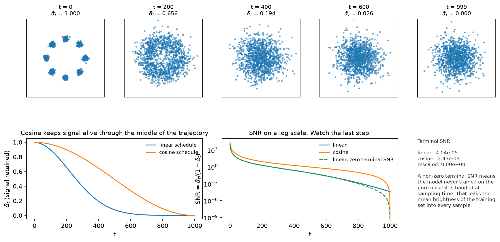
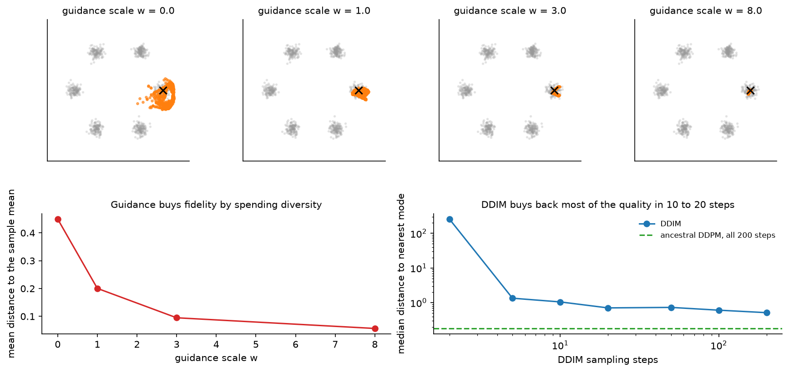

# Diffusion

> **Why this matters at staff level.** Diffusion is the default generative model for images, video,
> audio and, increasingly, robot policies. Interviews use it because the derivation chains together
> Gaussian algebra, a variational bound, a reparameterisation and a sampler, and because the
> production questions (how many steps, what guidance scale, latent or pixel space, what does a
> sample cost) are exactly the questions a staff engineer owns. Strong signal is deriving
> $q(x_t\mid x_0)$ and the simplified loss without notes, then explaining classifier-free guidance
> and the cost model for a serving system in the same breath.

## TL;DR, the interview card

* Forward: $q(x_t \mid x_{t-1}) = \mathcal N(\sqrt{1-\beta_t}\,x_{t-1},\, \beta_t I)$. Closed form
  $q(x_t\mid x_0) = \mathcal N(\sqrt{\bar\alpha_t}\, x_0,\, (1-\bar\alpha_t) I)$ with
  $\alpha_t = 1-\beta_t$, $\bar\alpha_t = \prod_{s\le t}\alpha_s$.
* Training: sample $t$, sample $\varepsilon$, form $x_t = \sqrt{\bar\alpha_t}x_0 + \sqrt{1-\bar\alpha_t}\varepsilon$,
  regress $\lVert \varepsilon - \varepsilon_\theta(x_t,t)\rVert^2$. That is the whole loop.
* Posterior: $q(x_{t-1}\mid x_t, x_0) = \mathcal N(\tilde\mu_t, \tilde\beta_t I)$ with
  $\tilde\mu_t = \frac{\sqrt{\bar\alpha_{t-1}}\beta_t}{1-\bar\alpha_t}x_0 + \frac{\sqrt{\alpha_t}(1-\bar\alpha_{t-1})}{1-\bar\alpha_t}x_t$
  and $\tilde\beta_t = \frac{1-\bar\alpha_{t-1}}{1-\bar\alpha_t}\beta_t$.
* Score link: $\nabla_{x_t}\log q(x_t\mid x_0) = -\varepsilon/\sqrt{1-\bar\alpha_t}$, so
  $\varepsilon_\theta \approx -\sqrt{1-\bar\alpha_t}\,\nabla \log p_t(x_t)$. Diffusion is denoising
  score matching with a schedule.
* DDIM: a non-Markovian family with the same training objective, deterministic at $\eta = 0$,
  samples on any subsequence of timesteps. 20 to 50 steps instead of 1000.
* $v = \sqrt{\bar\alpha}\,\varepsilon - \sqrt{1-\bar\alpha}\,x_0$. Better at high noise, and
  required if you use a zero terminal SNR schedule.
* Classifier-free guidance:
  $\tilde\varepsilon = (1+w)\varepsilon_\theta(x_t, y) - w\,\varepsilon_\theta(x_t,\varnothing)$.
  Costs two forward passes per step. Raising $w$ buys prompt adherence and spends diversity.
* Latent diffusion: run all of this in a VAE latent at $f = 8$, condition by cross-attention to
  text embeddings. This is Stable Diffusion, SDXL, and (with a Transformer backbone) DiT, SD3 and
  Movie Gen.

## 1. Intuition first

Take a data point and add a little Gaussian noise. Do it again. After a thousand repetitions the
point is indistinguishable from a sample of $\mathcal N(0, I)$. That direction is trivial. The
model learns the other direction: given a noisy point and the noise level, predict the noise that
was added. Chain those predictions from pure noise back to $t=0$ and you have a sample.

Two design choices make it work. First, every step is a small perturbation, so the reverse of each
step is close to Gaussian and a network with a simple output head can represent it. Second, the
forward process has a closed form that jumps straight from $x_0$ to any $x_t$, so training never
simulates the chain: pick a random $t$, corrupt once, predict.

{ width="900" }

The top row is the forward process on eight Gaussians, with the same noise draw at every panel so
the panels form one trajectory. At $t=200$ the ring survives as a hole in the middle, by $t=400$ it is one blob, and at
$t=999$ nothing of the structure is left.

The bottom-left panel plots $\bar\alpha_t$, the fraction of signal that survives, for the linear
and cosine schedules. The linear schedule destroys structure early, so a large part of the
trajectory is spent on data that is already noise. The cosine schedule spreads the destruction out.

The bottom-middle panel plots the signal-to-noise ratio $\bar\alpha_t/(1-\bar\alpha_t)$ on a log
scale, which is where the terminal behaviour shows. The linear schedule at $T=1000$ ends at an SNR
near $4\times 10^{-5}$: small, and not zero. The model therefore trains on inputs that always
retain a trace of the image mean, then at sampling time is handed pure noise, an input it never
saw. The rescaled schedule fixes that by construction.

## 2. The math

### 2.1 The forward process and its closed form

Fix a variance schedule $0 < \beta_1 < \dots < \beta_T < 1$ and define

$$
q(x_t \mid x_{t-1}) = \mathcal N\big(x_t;\ \sqrt{1-\beta_t}\,x_{t-1},\ \beta_t I\big).
$$

The scaling $\sqrt{1-\beta_t}$ on the mean is chosen so that variance is preserved: if
$\operatorname{Var}(x_{t-1}) = I$ then $\operatorname{Var}(x_t) = (1-\beta_t)I + \beta_t I = I$.
This is the "variance-preserving" convention.

With $\alpha_t = 1 - \beta_t$, write one step as $x_t = \sqrt{\alpha_t}\,x_{t-1} + \sqrt{\beta_t}\,\varepsilon_t$
and substitute the previous step:

$$
\begin{aligned}
x_t &= \sqrt{\alpha_t}\left(\sqrt{\alpha_{t-1}}x_{t-2} + \sqrt{1-\alpha_{t-1}}\,\varepsilon_{t-1}\right) + \sqrt{1-\alpha_t}\,\varepsilon_t \\
&= \sqrt{\alpha_t\alpha_{t-1}}\,x_{t-2} + \underbrace{\sqrt{\alpha_t(1-\alpha_{t-1})}\,\varepsilon_{t-1} + \sqrt{1-\alpha_t}\,\varepsilon_t}_{\text{sum of two independent Gaussians}} .
\end{aligned}
$$

Independent zero-mean Gaussians add in variance, so the bracket is a single Gaussian with variance
$\alpha_t(1-\alpha_{t-1}) + (1-\alpha_t) = 1 - \alpha_t\alpha_{t-1}$. Repeating the substitution
down to $x_0$ and writing $\bar\alpha_t = \prod_{s=1}^{t}\alpha_s$:

$$
\boxed{\;q(x_t \mid x_0) = \mathcal N\big(x_t;\ \sqrt{\bar\alpha_t}\,x_0,\ (1-\bar\alpha_t) I\big),
\qquad x_t = \sqrt{\bar\alpha_t}\,x_0 + \sqrt{1-\bar\alpha_t}\,\varepsilon,\ \ \varepsilon\sim\mathcal N(0,I)\;}
$$

Since $\bar\alpha_T \to 0$ for any schedule with $\sum_t \beta_t$ large enough,
$q(x_T\mid x_0)\to\mathcal N(0,I)$, independent of $x_0$. That is what lets sampling start from
noise. The test `test_q_sample_marginal_matches_closed_form` verifies the closed form against
31 composed single steps, mean and variance both.

### 2.2 The reverse process and the variational bound

The reverse of a small Gaussian step is approximately Gaussian, so parameterise

$$
p_\theta(x_{t-1}\mid x_t) = \mathcal N\big(x_{t-1};\ \mu_\theta(x_t, t),\ \Sigma_\theta(x_t,t)\big),
\qquad p(x_T) = \mathcal N(0, I).
$$

Apply the same variational argument as in [chapter 1](01-autoencoders-vae.md), now with
$x_{1:T}$ as the latent and the fixed forward process as the "encoder":

$$
-\log p_\theta(x_0) \le \E_q\left[-\log \frac{p_\theta(x_{0:T})}{q(x_{1:T}\mid x_0)}\right]
= \E_q\left[-\log p(x_T) - \sum_{t\ge 1}\log \frac{p_\theta(x_{t-1}\mid x_t)}{q(x_t \mid x_{t-1})}\right] .
$$

Now rewrite each forward term by conditioning on $x_0$, which is legal because the forward chain is
Markov, so $q(x_t\mid x_{t-1}) = q(x_t \mid x_{t-1}, x_0)$, and applying Bayes' rule:

$$
q(x_t\mid x_{t-1}, x_0) = \frac{q(x_{t-1}\mid x_t, x_0)\; q(x_t\mid x_0)}{q(x_{t-1}\mid x_0)} .
$$

Substituting for $t > 1$ makes the $q(x_t\mid x_0)/q(x_{t-1}\mid x_0)$ factors telescope, leaving

$$
\boxed{\;L = \E_q\Big[\underbrace{\KL\big(q(x_T\mid x_0)\,\Vert\,p(x_T)\big)}_{L_T,\ \text{no parameters}}
+ \sum_{t>1}\underbrace{\KL\big(q(x_{t-1}\mid x_t, x_0)\,\Vert\,p_\theta(x_{t-1}\mid x_t)\big)}_{L_{t-1}}
\underbrace{-\log p_\theta(x_0\mid x_1)}_{L_0}\Big]\;}
$$

Every middle term is a KL between two Gaussians, which has a closed form. No Monte-Carlo estimate
of a log-likelihood is needed anywhere. $L_T$ has no parameters when the forward process is fixed,
and it is near zero when $\bar\alpha_T \approx 0$.

### 2.3 The forward posterior

The target inside each $L_{t-1}$ is $q(x_{t-1}\mid x_t, x_0)$, a Gaussian we can compute. By Bayes,

$$
q(x_{t-1}\mid x_t, x_0) \;\propto\; q(x_t \mid x_{t-1})\,q(x_{t-1}\mid x_0),
$$

so the exponent is

$$
-\frac{\lVert x_t - \sqrt{\alpha_t}\,x_{t-1}\rVert^2}{2\beta_t}
-\frac{\lVert x_{t-1} - \sqrt{\bar\alpha_{t-1}}\,x_0\rVert^2}{2(1-\bar\alpha_{t-1})} .
$$

Collect the quadratic coefficient in $x_{t-1}$:

$$
\frac{\alpha_t}{\beta_t} + \frac{1}{1-\bar\alpha_{t-1}}
= \frac{\alpha_t(1-\bar\alpha_{t-1}) + \beta_t}{\beta_t(1-\bar\alpha_{t-1})}
= \frac{\alpha_t - \bar\alpha_t + 1 - \alpha_t}{\beta_t(1-\bar\alpha_{t-1})}
= \frac{1-\bar\alpha_t}{\beta_t(1-\bar\alpha_{t-1})},
$$

using $\alpha_t\bar\alpha_{t-1} = \bar\alpha_t$ and $\beta_t = 1-\alpha_t$. The variance is the
reciprocal, and the mean is the linear coefficient divided by the quadratic one:

$$
\boxed{\;\tilde\beta_t = \frac{1-\bar\alpha_{t-1}}{1-\bar\alpha_t}\beta_t, \qquad
\tilde\mu_t(x_t, x_0) = \frac{\sqrt{\bar\alpha_{t-1}}\,\beta_t}{1-\bar\alpha_t}\,x_0
+ \frac{\sqrt{\alpha_t}\,(1-\bar\alpha_{t-1})}{1-\bar\alpha_t}\,x_t\;}
$$

The mean is a convex-like blend of the clean image and the current noisy point, weighted by how
much signal each carries. The test `test_posterior_mean_variance_against_bayes_rule` checks both
against the one-dimensional Gaussian-product formula computed independently.

### 2.4 From the KL to the epsilon loss

Fix $\Sigma_\theta = \sigma_t^2 I$ (DDPM uses $\sigma_t^2 = \beta_t$ or $\tilde\beta_t$; Improved
DDPM learns an interpolation between them). Two Gaussians with the same isotropic covariance have

$$
L_{t-1} = \frac{1}{2\sigma_t^2}\big\lVert \tilde\mu_t(x_t,x_0) - \mu_\theta(x_t,t)\big\rVert^2 + \text{const}.
$$

Now use the forward closed form in reverse: $x_0 = (x_t - \sqrt{1-\bar\alpha_t}\,\varepsilon)/\sqrt{\bar\alpha_t}$.
Substituting into $\tilde\mu_t$ and simplifying gives

$$
\boxed{\;\tilde\mu_t = \frac{1}{\sqrt{\alpha_t}}\left(x_t - \frac{\beta_t}{\sqrt{1-\bar\alpha_t}}\,\varepsilon\right)\;}
$$

The network does not have to predict a mean. Given $x_t$, the only unknown in that expression is
$\varepsilon$. So parameterise the reverse mean in the same shape,

$$
\mu_\theta(x_t,t) = \frac{1}{\sqrt{\alpha_t}}\left(x_t - \frac{\beta_t}{\sqrt{1-\bar\alpha_t}}\,\varepsilon_\theta(x_t,t)\right),
$$

and the KL term becomes a weighted squared error on the noise:

$$
L_{t-1} = \frac{\beta_t^2}{2\sigma_t^2\,\alpha_t\,(1-\bar\alpha_t)}\big\lVert \varepsilon - \varepsilon_\theta(x_t, t)\big\rVert^2 .
$$

DDPM drops the weight and trains

$$
\boxed{\;L_{\text{simple}} = \E_{t \sim \mathcal U\{1..T\},\;x_0,\;\varepsilon}\Big[\big\lVert \varepsilon - \varepsilon_\theta\big(\sqrt{\bar\alpha_t}x_0 + \sqrt{1-\bar\alpha_t}\varepsilon,\ t\big)\big\rVert^2\Big]\;}
$$

The dropped weight is large at small $t$, where $1-\bar\alpha_t$ is small, so the uniform-weight
loss down-weights the low-noise steps relative to the true bound. That trade is deliberate: the
low-noise terms contribute most of the likelihood and least of the perceptual quality, and
sample quality improves when the network spends capacity on the harder, noisier steps. If you care
about likelihood rather than samples, put the weighting back, which is what the hybrid objective in
Improved DDPM does.

### 2.5 Sampling

Ancestral sampling is the reverse chain run one step at a time:

1. $x_T \sim \mathcal N(0, I)$.
2. For $t = T, \dots, 1$: predict $\hat\varepsilon = \varepsilon_\theta(x_t, t)$, form
   $\hat x_0 = (x_t - \sqrt{1-\bar\alpha_t}\hat\varepsilon)/\sqrt{\bar\alpha_t}$, compute
   $\tilde\mu_t(x_t, \hat x_0)$, and set
   $x_{t-1} = \tilde\mu_t + \sigma_t z$ with $z \sim \mathcal N(0,I)$, except $z = 0$ at $t=1$.
3. Return $x_0$.

One practical detail that the equations hide: at large $t$, $\bar\alpha_t$ is tiny, so
$\hat x_0 = (x_t - \sqrt{1-\bar\alpha_t}\hat\varepsilon)/\sqrt{\bar\alpha_t}$ divides by a number
near zero and amplifies any error in $\hat\varepsilon$. Image implementations clamp $\hat x_0$ to
$[-1,1]$ at every step; the samplers here take a `clip_x0` argument for the same reason. Skipping
that clamp is a common cause of sampler divergence at low step counts.

### 2.6 DDIM: the same model, fewer steps

DDPM's bound depends on the forward process only through the marginals $q(x_t\mid x_0)$. DDIM
exploits that: it defines a family of non-Markovian forward processes indexed by $\sigma$ that
share those marginals, so a model trained with $L_{\text{simple}}$ is already trained for all of
them. The reverse step becomes

$$
\boxed{\;x_{\tau_{i-1}} = \sqrt{\bar\alpha_{\tau_{i-1}}}\;\hat x_0
+ \sqrt{1-\bar\alpha_{\tau_{i-1}} - \sigma^2}\;\hat\varepsilon
+ \sigma z\;}
$$

with $\hat x_0$ the current clean-image estimate and $\hat\varepsilon$ the predicted noise. The
three terms are the predicted signal, a re-noising term that points back along the noise direction,
and fresh noise. Setting

$$
\sigma = \eta\,\sqrt{\frac{1-\bar\alpha_{\tau_{i-1}}}{1-\bar\alpha_{\tau_i}}}\sqrt{1 - \frac{\bar\alpha_{\tau_i}}{\bar\alpha_{\tau_{i-1}}}}
$$

recovers the ancestral sampler at $\eta = 1$ and gives a deterministic map at $\eta = 0$. Two
consequences of $\eta = 0$: the same initial noise always produces the same image, which makes
latent interpolation and image editing possible, and the trajectory is a discretisation of an ODE,
so you can take large steps. Sampling on a subsequence $\tau_1 < \dots < \tau_S$ of the $T$
timesteps costs $S$ network evaluations. The right panel of the guidance figure below shows the
quality curve: on the toy problem most of the quality is back by 10 to 20 steps.

### 2.7 Score matching, and the SDE view

The gradient of the log density of the forward marginal is available in closed form:

$$
\nabla_{x_t} \log q(x_t \mid x_0) = -\frac{x_t - \sqrt{\bar\alpha_t}x_0}{1-\bar\alpha_t}
= -\frac{\varepsilon}{\sqrt{1-\bar\alpha_t}} .
$$

Since the network is regressing $\varepsilon$ under this distribution, the trained model satisfies

$$
\boxed{\;\varepsilon_\theta(x_t,t) \approx -\sqrt{1-\bar\alpha_t}\;\nabla_{x_t}\log p_t(x_t)\;}
$$

so a diffusion model is a scaled score model, and the DDPM objective is denoising score matching
across noise levels. That connection is what links Ho's discrete chain to the earlier
noise-conditional score networks and to the continuous formulation.

In the continuous limit the forward process is an SDE. The variance-preserving (VP) SDE
$dx = -\tfrac12\beta(t)x\,dt + \sqrt{\beta(t)}\,dw$ is the limit of the DDPM chain; the
variance-exploding (VE) SDE $dx = \sqrt{d\sigma^2(t)/dt}\,dw$ is the limit of the score-matching
formulation with growing noise scales. Every such SDE has a reverse-time SDE that depends on the
data only through the score, and a deterministic probability-flow ODE with the same marginals:

$$
\frac{dx}{dt} = f(x,t) - \tfrac12 g(t)^2 \nabla_x \log p_t(x).
$$

Two things follow that matter in practice. Any ODE solver becomes a sampler, which is where
DPM-Solver and the other fast samplers come from. And the ODE gives exact likelihoods through the
instantaneous change of variables, which is the bridge to [chapter 4](04-flow-matching.md).

### 2.8 What the network predicts: epsilon, $x_0$, or $v$

Three parameterisations of the same model, related by the closed form.

* **$\varepsilon$-prediction.** Standard, works well at moderate noise. At very high noise
  $x_t \approx \varepsilon$, so predicting $\varepsilon$ approaches copying the input, and the
  implied $\hat x_0$ divides by $\sqrt{\bar\alpha_t}\approx 0$, so small errors explode.
* **$x_0$-prediction.** Well conditioned at high noise and badly conditioned at low noise, where
  $x_t \approx x_0$ and the model can win by copying its input while the implied $\hat\varepsilon$
  is wildly wrong.
* **$v$-prediction.** Define

$$
\boxed{\;v_t \;=\; \sqrt{\bar\alpha_t}\,\varepsilon \;-\; \sqrt{1-\bar\alpha_t}\,x_0\;}
$$

  Taking $\bar\alpha_t \to 1$ (no noise) gives $v \to \varepsilon$; taking $\bar\alpha_t\to 0$
  (pure noise) gives $v \to -x_0$. The target rotates smoothly from one regime to the other, so the
  network always predicts the component that is not already present in its input. Inverting, with
  $a=\sqrt{\bar\alpha_t}$ and $s=\sqrt{1-\bar\alpha_t}$ (so $a^2+s^2=1$):
  $x_0 = a\,x_t - s\,v$ and $\varepsilon = s\,x_t + a\,v$, which is a rotation by the angle whose
  cosine is $a$. The test `test_parameterisation_conversions_round_trip` checks these identities.

$v$-prediction matters for two concrete reasons. It is what makes progressive distillation stable
at very few steps, which is where it was introduced. And a zero-terminal-SNR schedule forces it: at
$\bar\alpha_T = 0$ the input carries no signal, so an $\varepsilon$-prediction model has no way to
produce $\hat x_0$, while a $v$-prediction model outputs $-x_0$ directly.

### 2.9 Schedules

The linear schedule ($\beta$ from $10^{-4}$ to $0.02$) is calibrated for $T=1000$. Reuse those
constants at $T=100$ and $\bar\alpha_T \approx 0.36$, which means the model never trains on pure
noise; `test_linear_schedule_needs_its_T_or_terminal_snr_is_not_zero` asserts exactly that.

The cosine schedule defines $\bar\alpha_t = \cos^2\!\big(\frac{t/T + s}{1+s}\cdot\frac\pi2\big)$
normalised so $\bar\alpha_0 = 1$, then reads off $\beta_t = 1 - \bar\alpha_t/\bar\alpha_{t-1}$,
clipped below 1. It destroys signal more slowly in the middle of the trajectory, which spends more
of the step budget in the range where the reverse step is hard.

Zero terminal SNR rescales $\sqrt{\bar\alpha}$ so the last value is exactly 0 while the first is
unchanged. Without it, a text-to-image model trained on data whose mean brightness is nonzero
leaks that mean into every sample, which is the documented reason Stable Diffusion 1.x struggles
to produce very dark or very bright images.

### 2.10 Guidance

**Classifier guidance.** To sample from $p(x\mid y)$, note
$\nabla_{x}\log p(x_t\mid y) = \nabla_x \log p(x_t) + \nabla_x\log p(y\mid x_t)$. Converting scores
to noise predictions with the identity from 2.7 gives

$$
\tilde\varepsilon = \varepsilon_\theta(x_t,t) - s\,\sqrt{1-\bar\alpha_t}\;\nabla_{x_t}\log p_\phi(y\mid x_t),
$$

where $p_\phi$ is a classifier trained on noisy inputs and $s$ is the guidance scale. It works, and
it requires training and serving a separate noise-aware classifier, and differentiating through it
at every sampling step.

**Classifier-free guidance.** Train one model to handle both cases by replacing the conditioning
with a null token $\varnothing$ for a fraction (typically 10 to 20 percent) of training examples.
Then use the implicit classifier

$$
\nabla_x\log p(y\mid x_t) = \nabla_x \log p(x_t\mid y) - \nabla_x\log p(x_t)
\;\;\Longrightarrow\;\;
\sqrt{1-\bar\alpha_t}\,\nabla_x\log p(y\mid x_t) = \varepsilon_\theta(x_t,\varnothing) - \varepsilon_\theta(x_t,y).
$$

Substituting into the classifier-guidance formula with scale $w$:

$$
\boxed{\;\tilde\varepsilon(x_t, y) = (1 + w)\,\varepsilon_\theta(x_t, y) \;-\; w\,\varepsilon_\theta(x_t, \varnothing)\;}
$$

At $w=0$ this is ordinary conditional sampling. Larger $w$ extrapolates away from the
unconditional prediction, sharpening the conditional distribution. Some papers write the same
formula with $s = 1+w$, so check which convention a number refers to before copying a guidance
scale between codebases.

{ width="900" }

The panels above are a conditional model on six modes, sampled with the label fixed to one mode.
As $w$ grows the samples concentrate: the mean distance to the sample mean falls from 0.45 at
$w=0$ to under 0.05 at $w=8$. On images the same effect reads as higher prompt adherence and
saturated, over-contrasted output, with diversity collapsing as $w$ grows. Typical production
values are 3 to 8 for text-to-image models.

The costs are concrete. Guidance doubles the work per step, because each step needs a conditional
and an unconditional forward pass (batched together, so it is one pass at twice the batch size).
Dropping guidance halves inference cost, which is why guidance distillation, folding the guided
prediction into a single network, is standard in production models.

### 2.11 Latent diffusion, conditioning, and architecture

Running diffusion on $512\times512\times3$ pixels wastes capacity on imperceptible detail and makes
attention impossible. Latent diffusion moves the process into a VAE latent
([chapter 1](01-autoencoders-vae.md)): encode once, diffuse in the $64\times64\times4$ latent,
decode once. The savings are the compression ratio in every layer, and quadratic in the attention
layers.

Conditioning on text works through cross-attention. The prompt is encoded once (CLIP text encoder,
T5, or both), giving a sequence of token embeddings $C \in \R^{L\times d_c}$. Each block of the
denoiser adds a cross-attention layer where queries come from the image latent and keys and values
come from $C$:

$$
Q = Z W_Q \in \R^{N\times d_k},\quad K = C W_K \in \R^{L \times d_k},\quad V = C W_V \in \R^{L\times d_v},
$$

which is the mathematics of [attention](../part05-sequence-transformers/03-attention-mathematics.md)
with two different sources. The timestep enters separately, as a sinusoidal embedding fed through
an MLP and added to the block's activations, or used to modulate normalisation parameters.

The backbone has moved from U-Net to Transformer. DiT replaces the U-Net with a Transformer over
latent patches and conditions through adaptive layer norm, and reports that FID improves
monotonically with the model's GFLOPs, which is the scaling argument that made Transformer
backbones the default for large image and video models.

Distillation is the last lever. Progressive distillation halves the number of sampling steps
repeatedly, each student learning to take one step where the teacher took two, down to single
digits. Consistency models train a network whose outputs are consistent along a trajectory so that
any point maps directly to the trajectory's endpoint, giving one-step or two-step sampling. Both
are worth knowing as literacy and as the answer to "how do I serve this at low latency".

## 3. Implementation

The schedule object precomputes everything the rest of the file indexes into.

```python
class NoiseSchedule:
    """Precomputed schedule constants.  All tensors are (T,)."""

    def __init__(self, betas: torch.Tensor) -> None:
        self.T = betas.shape[0]
        self.betas = betas                                                        # (T,)
        self.alphas = 1.0 - betas                                                 # (T,)
        self.alpha_bar = torch.cumprod(self.alphas, dim=0)                        # (T,)
        self.alpha_bar_prev = torch.cat([torch.ones(1), self.alpha_bar[:-1]])     # (T,)  ᾱ_{t−1}, ᾱ_{−1} := 1
        self.sqrt_alpha_bar = self.alpha_bar.sqrt()                               # (T,)
        self.sqrt_one_minus_alpha_bar = (1.0 - self.alpha_bar).sqrt()             # (T,)
        self.posterior_variance = (1.0 - self.alpha_bar_prev) * betas / (1.0 - self.alpha_bar)  # (T,)  β̃_t
```

Precomputing $\sqrt{\bar\alpha_t}$ and $\sqrt{1-\bar\alpha_t}$ rather than recomputing them per
batch is not an optimisation detail, it is what keeps the training step to two multiplications.
`alpha_bar_prev` is padded with 1 so that the $t=0$ posterior is well defined.

```python
def q_sample(sched, x0, t, eps):
    """``x_t = sqrt(ᾱ_t) x_0 + sqrt(1 − ᾱ_t) ε``."""
    a = gather(sched.sqrt_alpha_bar, t, x0.ndim)                                  # (B, 1)
    s = gather(sched.sqrt_one_minus_alpha_bar, t, x0.ndim)                        # (B, 1)
    return a * x0 + s * eps


def gather(values, t, ndim):
    """Pick ``values[t]`` and reshape to broadcast against a batch of ``ndim``-dim tensors."""
    out = values[t]                                                               # (B,)
    return out.reshape(-1, *([1] * (ndim - 1)))                                   # (B, 1, ...)
```

`gather` is the unglamorous function that makes everything else readable: schedule constants are
per-example scalars that must broadcast against $(B, C, H, W)$ or $(B, d)$, and getting this
reshape wrong produces a silent broadcast over the wrong axis.

```python
def posterior_mean_variance(sched, x_t, x0, t):
    """``q(x_{t−1} | x_t, x_0)`` mean μ̃_t and variance β̃_t."""
    ab = gather(sched.alpha_bar, t, x_t.ndim)                                     # (B, 1)
    ab_prev = gather(sched.alpha_bar_prev, t, x_t.ndim)                           # (B, 1)
    beta = gather(sched.betas, t, x_t.ndim)                                       # (B, 1)
    alpha = gather(sched.alphas, t, x_t.ndim)                                     # (B, 1)
    coef_x0 = ab_prev.sqrt() * beta / (1.0 - ab)                                  # (B, 1)
    coef_xt = alpha.sqrt() * (1.0 - ab_prev) / (1.0 - ab)                         # (B, 1)
    mean = coef_x0 * x0 + coef_xt * x_t                                           # (B, d)
    var = gather(sched.posterior_variance, t, x_t.ndim)                           # (B, 1)
    return mean, var
```

This is the boxed posterior, transcribed. Writing it in terms of $\hat x_0$ rather than folding
$\varepsilon$ in directly is what lets the same function serve the ancestral sampler, the DDIM
sampler and any clipping rule you want to apply to $\hat x_0$.

```python
def ddpm_loss(model, sched, x0, y=None, p_uncond=0.0):
    """Simplified DDPM objective with label dropout for classifier-free guidance."""
    B = x0.shape[0]
    t = torch.randint(0, sched.T, (B,))                                           # (B,)
    eps = torch.randn_like(x0)                                                    # (B, d)
    x_t = q_sample(sched, x0, t, eps)                                             # (B, d)
    if y is not None and p_uncond > 0.0:
        drop = torch.rand(B) < p_uncond                                           # (B,) bool
        y = torch.where(drop, torch.full_like(y, model.n_classes), y)             # (B,)
    eps_hat = model(x_t, t, y)                                                    # (B, d)
    return ((eps - eps_hat) ** 2).mean()
```

Six lines, and that is the entire training objective. One timestep per example per step (rather
than averaging over many $t$) is the standard estimator. The label dropout that enables
classifier-free guidance is two lines: pick a mask, replace the label with the null token index,
which is why `class_emb` is built with `n_classes + 1` entries.

```python
@torch.no_grad()
def sample_ancestral(model, sched, n, d, y=None, guidance_scale=0.0, clip_x0=None):
    """DDPM sampling: for t = T−1 … 0,  x_{t−1} = μ̃_t(x_t, x̂_0) + sqrt(β̃_t) z."""
    x = torch.randn(n, d)                                                         # (N, d)  x_T ~ N(0, I)
    for step in reversed(range(sched.T)):
        t = torch.full((n,), step, dtype=torch.long)                              # (N,)
        eps_hat = predict_eps_cfg(model, x, t, y, guidance_scale)                 # (N, d)
        x0_hat = eps_to_x0(sched, x, t, eps_hat)                                  # (N, d)
        if clip_x0 is not None:
            x0_hat = x0_hat.clamp(-clip_x0, clip_x0)                              # (N, d)
        mean, var = posterior_mean_variance(sched, x, x0_hat, t)                  # (N, d), (N, 1)
        noise = torch.randn_like(x) if step > 0 else torch.zeros_like(x)          # (N, d)  no noise at t = 0
        x = mean + var.sqrt() * noise                                             # (N, d)
    return x


def predict_eps_cfg(model, x_t, t, y, guidance_scale):
    """``ε̃ = (1 + w) ε_θ(x_t, y) − w ε_θ(x_t, ∅)``  (w = 0: plain conditional)."""
    if y is None or guidance_scale == 0.0:
        return model(x_t, t, y)                                                   # (B, d)
    eps_cond = model(x_t, t, y)                                                   # (B, d)
    eps_uncond = model(x_t, t, None)                                              # (B, d)
    return (1.0 + guidance_scale) * eps_cond - guidance_scale * eps_uncond        # (B, d)
```

The `noise = 0 at step 0` line is required: adding noise on the final step leaves visible grain in
the output. In a production implementation the two forward passes inside `predict_eps_cfg` are
concatenated into one batch of size $2N$ so the GPU sees a single kernel launch per layer.

The DDIM sampler is the boxed update transcribed, with `taus` selecting the subsequence:

```python
@torch.no_grad()
def sample_ddim(model, sched, n, d, n_steps, eta=0.0, y=None, guidance_scale=0.0,
                clip_x0=None, return_trajectory=False):
    taus = torch.linspace(0, sched.T - 1, n_steps).round().long()                 # (S,) increasing
    x = torch.randn(n, d)                                                         # (N, d)
    for i in reversed(range(n_steps)):
        t = taus[i].repeat(n)                                                     # (N,)
        ab = sched.alpha_bar[taus[i]]                                             # scalar
        ab_prev = sched.alpha_bar[taus[i - 1]] if i > 0 else torch.tensor(1.0)    # scalar
        eps_hat = predict_eps_cfg(model, x, t, y, guidance_scale)                 # (N, d)
        x0_hat = (x - (1 - ab).sqrt() * eps_hat) / ab.sqrt()                      # (N, d)
        if clip_x0 is not None:
            x0_hat = x0_hat.clamp(-clip_x0, clip_x0)                              # (N, d)
        sigma = eta * ((1 - ab_prev) / (1 - ab)).sqrt() * (1 - ab / ab_prev).sqrt()  # scalar
        dir_xt = (1 - ab_prev - sigma ** 2).clamp(min=0.0).sqrt() * eps_hat       # (N, d)
        noise = sigma * torch.randn_like(x) if i > 0 else torch.zeros_like(x)     # (N, d)
        x = ab_prev.sqrt() * x0_hat + dir_xt + noise                              # (N, d)
    return x
```

**How you would test it.** Three properties pin the implementation down without training anything.
The marginal of `q_sample` must match both the closed form and 31 composed single steps in mean and
variance. The parameterisation conversions must round-trip: $\varepsilon \to x_t \to \varepsilon$
and $v \to (\varepsilon, x_0)$. The posterior must match an independent Gaussian-product
computation. Then one behavioural test: train for a few hundred steps on the toy mixture and assert
that both samplers land near the data manifold and that guidance toward a specific mode moves at
least 70 percent of the samples to that mode.

## Retype by hand

This is the block to over-practise. It is the most likely whiteboard request in the whole part.

| Symbol | File | Time | Checked by |
|---|---|---|---|
| `linear_beta_schedule` and `NoiseSchedule.__init__` | `src/mlbook/generative/ddpm.py` | 6 min | `test_schedules_are_valid` |
| `q_sample` and `gather` | `src/mlbook/generative/ddpm.py` | 5 min | `test_q_sample_marginal_matches_closed_form` |
| `eps_to_x0`, `x0_eps_to_v`, `v_to_eps_x0` | `src/mlbook/generative/ddpm.py` | 6 min | `test_parameterisation_conversions_round_trip` |
| `posterior_mean_variance` | `src/mlbook/generative/ddpm.py` | 7 min | `test_posterior_mean_variance_against_bayes_rule` |
| `ddpm_loss` | `src/mlbook/generative/ddpm.py` | 5 min | `test_ddpm_loss_and_score_from_eps` |
| `sample_ancestral` | `src/mlbook/generative/ddpm.py` | 8 min | `test_samplers_produce_points_near_manifold` |
| `sample_ddim` | `src/mlbook/generative/ddpm.py` | 10 min | `test_samplers_produce_points_near_manifold` |
| `predict_eps_cfg` | `src/mlbook/generative/ddpm.py` | 3 min | `test_predict_eps_cfg_formula` |

Target: `q_sample` plus `ddpm_loss` plus `sample_ancestral` in 30 minutes, from the equations, with
no reference. Then DDIM and CFG in another 15.

Read but do not retype: `cosine_alpha_bar_schedule` (know the formula, the clipping is fiddly),
`enforce_zero_terminal_snr` (know what it does and why), `sinusoidal_embedding` (you should already
own this from [positional encodings](../part05-sequence-transformers/05-positional-encodings.md)),
`EpsMLP` (a stand-in for a U-Net or DiT), `score_from_eps` (one line, but know the identity).

```bash
python -m pytest tests/test_generative_ddpm.py -q
python -m pytest tests/test_generative_ddpm.py -q -k "q_sample or posterior or conversion"
```

## 4. Systems view: cost, failure modes, trade-offs

**The cost model.** A sample costs $S \times G \times F$ FLOPs, where $S$ is sampling steps, $G$ is
2 with classifier-free guidance and 1 without, and $F$ is one forward pass of the denoiser. Training
cost is one forward and backward per example per step, with no chain simulation. The asymmetry is
the point: diffusion training is cheap per step and stable, while inference is 20 to 50 times the
cost of a single-pass model. Every production lever attacks one of the three factors.

| Lever | Attacks | Typical effect | Cost |
|---|---|---|---|
| DDIM or a higher-order ODE solver | $S$ | 1000 steps to 20 to 50 | Small quality loss at very low $S$ |
| Progressive or consistency distillation | $S$ | Down to 1 to 4 steps | A distillation training run, some diversity loss |
| Guidance distillation | $G$ | 2 to 1 | A training run |
| Latent space instead of pixels | $F$ | 48x fewer elements at $f=8$ | VAE reconstruction becomes the quality ceiling |
| Smaller denoiser, or quantisation | $F$ | Linear | Quality, and see [quantization](../part06-llm-training/05-quantization.md) |
| Batching requests | Throughput per GPU | Large | Latency for the first request in a batch |
| Caching the text encoder output | Fixed overhead | Removes one encoder pass per request | Cache memory, invalidation on prompt change |

**Latency budgeting, worked.** Suppose a latent-diffusion denoiser costs 40 ms per forward pass at
batch size 1 on your GPU at $64\times64\times4$. With 30 steps and guidance, that is
$30 \times 2 \times 40 = 2.4$ s, plus roughly 60 ms for the VAE decode and 10 ms for the text
encoder. To reach a 500 ms budget you need a factor of 5: distil to 4 steps ($8\times$) and you are
at 320 ms plus overheads, or keep 30 steps and distil guidance ($2\times$) and you are still at
1.2 s. The arithmetic decides which project to fund.

**Memory.** Activation memory during training is dominated by the denoiser, and the attention layers
at the highest latent resolution dominate that. Inference is small in comparison, because no
activations are retained: peak memory is one batch of latents plus the model weights, then the VAE
decoder briefly needs the full-resolution tensor, which is often the actual peak.

**Failure modes.**

* Samples with a persistent grey cast or an inability to produce very dark or bright images:
  non-zero terminal SNR. Fix the schedule, retrain or fine-tune with $v$-prediction.
* Saturated, over-contrasted, low-diversity outputs: guidance scale too high. Lower it, or apply
  dynamic thresholding of $\hat x_0$.
* Divergence or artifacts at low step counts: missing $\hat x_0$ clipping, or a sampler that
  starts from the wrong timestep.
* Fine detail that no amount of sampling fixes: the autoencoder, not the diffusion model. Encode
  and decode a real image and look.
* Training loss that looks flat and uninformative: expected. The loss is an average over noise
  levels and barely moves once training is underway. Judge by samples and by FID on a fixed prompt
  set, and keep an exponential moving average of the weights, since EMA weights sample noticeably
  better than raw ones.

## 5. In production

!!! production "Ho, Jain and Abbeel: DDPM, the paper the whole field builds on"
    The 2020 paper derives the variational bound, shows the reverse-mean parameterisation that
    turns the KL into $\lVert\varepsilon - \varepsilon_\theta\rVert^2$, proposes the simplified
    uniform-weight objective, and connects the result to denoising score matching with Langevin
    dynamics. The reported CIFAR-10 FID of 3.17 is what first made diffusion competitive with GANs.
    [Denoising Diffusion Probabilistic Models, arXiv:2006.11239](https://arxiv.org/abs/2006.11239)

!!! production "DDIM and Improved DDPM: making sampling affordable"
    DDIM constructs non-Markovian forward processes with the same marginals, so a DDPM checkpoint
    can be sampled deterministically on a subsequence of timesteps, reporting 10x to 50x faster
    sampling in wall-clock terms. Improved DDPM contributes the cosine schedule and a learned
    interpolation for the reverse variance, reporting an order of magnitude fewer forward passes
    for comparable sample quality.
    [Denoising Diffusion Implicit Models, arXiv:2010.02502](https://arxiv.org/abs/2010.02502),
    [Improved DDPM, arXiv:2102.09672](https://arxiv.org/abs/2102.09672)

!!! production "OpenAI: classifier guidance, then classifier-free guidance"
    Dhariwal and Nichol introduced classifier guidance and reported diffusion models beating
    BigGAN-deep on ImageNet at several resolutions. Ho and Salimans then removed the classifier by
    training a single network with random label dropout and combining conditional and
    unconditional predictions, which is the formula every text-to-image system uses today.
    [Diffusion Models Beat GANs, arXiv:2105.05233](https://arxiv.org/abs/2105.05233),
    [Classifier-Free Diffusion Guidance, arXiv:2207.12598](https://arxiv.org/abs/2207.12598)

!!! production "Stability AI and CompVis: latent diffusion and Stable Diffusion"
    Latent diffusion moves the process into a pretrained autoencoder's latent space and conditions
    through cross-attention on text embeddings, which is what made training and serving a
    high-resolution text-to-image model affordable outside a frontier lab. The released weights
    turned this from a paper into an ecosystem.
    [High-Resolution Image Synthesis with Latent Diffusion Models, arXiv:2112.10752](https://arxiv.org/abs/2112.10752)

!!! production "Google and OpenAI: two conditioning strategies"
    Imagen encodes the prompt with a frozen large text-only language model (T5) and reports that
    scaling the text encoder helps more than scaling the diffusion model, with a cascade of
    super-resolution diffusion models to reach high resolution. DALL-E 2 instead generates a CLIP
    image embedding from the caption with a prior, then decodes it. DALL-E 3 changes the data
    rather than the model: it trains a captioner and re-captions the training set, reporting that
    highly descriptive synthetic captions improve prompt following.
    [Imagen, arXiv:2205.11487](https://arxiv.org/abs/2205.11487),
    [unCLIP / DALL-E 2, arXiv:2204.06125](https://arxiv.org/abs/2204.06125),
    [Improving Image Generation with Better Captions](https://cdn.openai.com/papers/dall-e-3.pdf)

!!! production "Transformer backbones: DiT, and the video models that followed"
    DiT replaces the U-Net with a Transformer over latent patches and reports FID improving
    monotonically as model GFLOPs increase, which is the scaling argument behind every large
    Transformer-backbone image and video model since. Meta's Movie Gen is a 30B-parameter
    Transformer trained with a flow-matching objective, handling joint video and audio generation,
    editing and personalisation.
    [Scalable Diffusion Models with Transformers, arXiv:2212.09748](https://arxiv.org/abs/2212.09748),
    [Movie Gen, arXiv:2410.13720](https://arxiv.org/abs/2410.13720)

!!! production "The zero-terminal-SNR bug, found in a shipped model"
    Lin et al. show that common schedules do not reach zero SNR at the final timestep and that some
    samplers do not start from the final timestep, so the model is handed an input at inference it
    never saw in training. They report this limits Stable Diffusion to images of medium brightness,
    and propose rescaling the schedule, training with $v$-prediction, and starting the sampler at
    the last timestep.
    [Common Diffusion Noise Schedules and Sample Steps are Flawed, arXiv:2305.08891](https://arxiv.org/abs/2305.08891)

## 6. Interview questions and strong answers

!!! interview "Derive q(x_t given x_0) and then the training loss"
    One forward step is $x_t = \sqrt{\alpha_t}x_{t-1} + \sqrt{1-\alpha_t}\varepsilon_t$. Substitute
    the previous step and use the fact that independent Gaussians add in variance:
    $\alpha_t(1-\alpha_{t-1}) + (1-\alpha_t) = 1 - \alpha_t\alpha_{t-1}$. By induction
    $x_t = \sqrt{\bar\alpha_t}x_0 + \sqrt{1-\bar\alpha_t}\varepsilon$. For the loss, write the
    variational bound, telescope using $q(x_t\mid x_{t-1}) = q(x_{t-1}\mid x_t,x_0)q(x_t\mid x_0)/q(x_{t-1}\mid x_0)$,
    and each middle term becomes a Gaussian KL. Substituting
    $x_0 = (x_t - \sqrt{1-\bar\alpha_t}\varepsilon)/\sqrt{\bar\alpha_t}$ into the posterior mean
    shows the only unknown is $\varepsilon$, so parameterising the reverse mean the same way turns
    the KL into $w_t\lVert\varepsilon - \varepsilon_\theta\rVert^2$, and DDPM sets $w_t = 1$.

    **Staff-level follow-up: what does setting the weight to 1 change?** The true weight
    $\beta_t^2/(2\sigma_t^2\alpha_t(1-\bar\alpha_t))$ is largest at small $t$. Uniform weighting
    therefore down-weights the low-noise steps, which carry most of the likelihood and least of the
    perceptual quality. You get better samples and worse likelihoods, which is the right trade for
    a generation product and the wrong one for density estimation.

!!! interview "Why does DDIM work with a model trained for DDPM?"
    The DDPM objective depends on the forward process only through the marginals
    $q(x_t\mid x_0)$, not through the joint. DDIM constructs a family of non-Markovian forward
    processes with the same marginals, so the same trained $\varepsilon_\theta$ is valid for all of
    them. Choosing $\eta = 0$ makes the reverse map deterministic, which turns sampling into
    integrating an ODE, and an ODE tolerates large steps. That gives 20 to 50 steps instead of
    1000, plus reproducibility from a fixed seed and meaningful latent interpolation.

!!! interview "Derive classifier-free guidance and explain the trade-off"
    Start from $\nabla_x \log p(x_t\mid y) = \nabla_x\log p(x_t) + \nabla_x \log p(y\mid x_t)$ and
    the identity $\varepsilon_\theta = -\sqrt{1-\bar\alpha_t}\nabla_x\log p_t$. Classifier guidance
    substitutes a trained classifier's gradient. Classifier-free guidance replaces it with the
    implicit classifier $\nabla\log p(y\mid x) = \nabla\log p(x\mid y) - \nabla\log p(x)$, which in
    noise terms is $\varepsilon_\theta(x,\varnothing) - \varepsilon_\theta(x,y)$, giving
    $\tilde\varepsilon = (1+w)\varepsilon_\theta(x,y) - w\varepsilon_\theta(x,\varnothing)$. You
    train one model with random conditioning dropout. The cost is two forward passes per step. The
    trade-off is fidelity against diversity: large $w$ sharpens the conditional and collapses
    variety, and on images it oversaturates, which is why dynamic thresholding exists.

!!! interview "When would you predict v instead of epsilon?"
    At high noise, $x_t$ is almost all noise, so $\varepsilon$-prediction degenerates toward copying
    the input while the implied $\hat x_0$ divides by $\sqrt{\bar\alpha_t}\approx 0$ and amplifies
    error. $v = \sqrt{\bar\alpha}\varepsilon - \sqrt{1-\bar\alpha}x_0$ interpolates: it equals
    $\varepsilon$ at zero noise and $-x_0$ at pure noise, so the target is always the part that is
    not already in the input. Two situations force it: few-step sampling after progressive
    distillation, where high-noise conditioning dominates, and any zero-terminal-SNR schedule, where
    at $\bar\alpha_T = 0$ an $\varepsilon$ model cannot produce $\hat x_0$ at all.

!!! interview "Your text-to-image service costs too much per image. Walk me through the levers."
    Write the cost as steps times guidance factor times cost per forward pass, then attack each.
    Steps: switch to DDIM or a higher-order solver (1000 to around 30 with little loss), then distil
    to 4 or fewer if the quality bar allows. Guidance: distil guidance into the model to remove the
    unconditional pass, halving cost. Per-pass cost: verify you are in a latent space and check the
    downsampling factor, consider a smaller denoiser or quantisation, and confirm attention is
    using a fused kernel. Then the systems levers: batch requests, cache text-encoder outputs for
    repeated prompts, and keep the VAE decoder off the critical path where possible. Measure after
    each change on a fixed prompt set with a fixed seed, because several of these trade quality for
    cost and the loss curve will not tell you.

!!! interview "How do you evaluate a diffusion model during training?"
    Not by the loss, which is an average over noise levels and is nearly flat after the first
    phase. Use a fixed set of prompts and seeds, sample at fixed settings every $N$ steps, and look.
    Track FID against a reference set for a coarse signal, knowing its pathologies
    ([Part XIII](../part13-retrieval-eval-reliability/02-evaluation.md)), and CLIP score for prompt
    adherence, knowing that guidance scale moves the two in opposite directions. For anything that
    ships, run a human preference test on the content distribution you actually serve. And sample
    from EMA weights, since raw weights look worse at the same step count.

!!! interview "You have a fixed compute budget. Bigger model or more sampling steps?"
    Sampling steps are an inference cost paid on every request; model size is paid at both training
    and inference. If quality at 30 steps is already close to quality at 200, the marginal step
    buys little and the budget belongs in the model or the data. If samples improve sharply with
    steps, the model is underfitting the hard high-noise region, and a better schedule,
    $v$-prediction or more training may be cheaper than either. Measure the quality curve against
    steps first (the right panel of the guidance figure is that curve for the toy model), then
    decide, because the answer is empirical and per-domain.

## 7. Exercises

**★ 1. Terminal SNR by hand.** For the linear schedule with $T=1000$, compute $\bar\alpha_T$ and
the terminal SNR. Repeat for $T=100$ with the same $\beta$ range and explain the difference.

??? success "Solution"
    $\log\bar\alpha_T = \sum_t\log(1-\beta_t)\approx -\sum_t\beta_t$. For $T=1000$ with $\beta$
    linear from $10^{-4}$ to $0.02$, $\sum\beta \approx 1000\times 0.01005 = 10.05$, so
    $\bar\alpha_T \approx e^{-10.05}\approx 4\times10^{-5}$ and SNR is about the same. For $T=100$,
    $\sum\beta\approx 1.005$, so $\bar\alpha_T\approx 0.37$ and the SNR is about 0.58: the model
    never sees pure noise. Check with `NoiseSchedule(linear_beta_schedule(T)).snr()[-1]`.

**★ 2. Verify the posterior.** Pick $t=7$ on a 20-step schedule and verify `posterior_mean_variance`
against the Gaussian-product formula in one dimension.

??? success "Solution"
    Precision adds: $1/\tilde\beta_t = 1/(1-\bar\alpha_{t-1}) + \alpha_t/\beta_t$, and the mean is
    the precision-weighted average
    $\tilde\mu = \tilde\beta_t(\sqrt{\bar\alpha_{t-1}}x_0/(1-\bar\alpha_{t-1}) + \sqrt{\alpha_t}x_t/\beta_t)$.
    This is exactly `test_posterior_mean_variance_against_bayes_rule`.

**★★ 3. The weighting you dropped.** Modify `ddpm_loss` to include the ELBO weight
$\beta_t^2/(2\sigma_t^2\alpha_t(1-\bar\alpha_t))$ with $\sigma_t^2=\beta_t$, train on the toy
mixture, and compare samples with the uniform-weight model.

??? success "Solution"
    The weighted loss concentrates on small $t$, so the model fits the low-noise steps well and the
    high-noise steps poorly. Samples drift off the manifold because the early (high-noise) part of
    the trajectory is where the global structure is decided. Measuring with
    `distance_to_mixture_modes` makes the difference visible in one number, and it explains why the
    simplified loss won.

**★★ 4. Guidance sweep.** Sweep the guidance scale over $\{0, 1, 2, 4, 8, 16\}$ on the conditional
toy model, and plot both the fraction of samples landing in the requested mode and the spread of
those samples.

??? success "Solution"
    Mode accuracy rises quickly and saturates; spread falls monotonically. The knee is where you
    want to operate. The same curve on images is the prompt-adherence against diversity trade-off,
    and it is why guidance scale is a product decision rather than a hyperparameter you tune once.

**★★ 5. DDIM determinism and interpolation.** With $\eta=0$, sample from two fixed noise vectors
$x_T^{(a)}$ and $x_T^{(b)}$, then sample from spherical interpolations between them, and show the
outputs vary smoothly. Then set $\eta=1$ and show the determinism is gone.

??? success "Solution"
    Use `slerp` rather than linear interpolation, because linear interpolation of two Gaussian
    vectors shrinks the norm toward the middle and takes you off the typical set of
    $\mathcal N(0,I)$. At $\eta=0$ the map from noise to sample is deterministic, so the
    interpolation traces a path in sample space. At $\eta=1$ each call injects fresh noise, so the
    same $x_T$ gives different samples.

**★★★ 6. A v-prediction model end to end.** Add a `v_loss` that regresses `x0_eps_to_v`, and a
sampler that converts $v$ to $\varepsilon$ with `v_to_eps_x0` before the existing update. Train
with a zero-terminal-SNR schedule and compare against the $\varepsilon$ model on the same schedule.

??? success "Solution"
    The $\varepsilon$ model fails at the first step: $\bar\alpha_T = 0$ makes $\hat x_0$ undefined
    (a division by zero), and any numerical guard produces garbage. The $v$ model predicts $-x_0$
    at that step by construction and proceeds normally. This exercise is the cleanest way to feel
    why the two changes in the zero-terminal-SNR paper come as a pair.

**★★★ 7. Second-order sampler.** Implement Heun's method on the probability-flow ODE for the toy
model (predictor step, evaluate the derivative at the predicted point, average the two
derivatives), and compare quality against DDIM at the same number of network evaluations.

??? success "Solution"
    Heun costs two evaluations per step, so compare at equal evaluations: 10 Heun steps against 20
    DDIM steps. The second-order method usually wins at moderate budgets and loses at very low ones,
    where the extra evaluation is better spent on another first-order step. This is the same
    accuracy-per-evaluation trade-off that makes DPM-Solver and friends worth their complexity.

## References

* Ho, Jain, Abbeel, *Denoising Diffusion Probabilistic Models*, NeurIPS 2020. [arXiv:2006.11239](https://arxiv.org/abs/2006.11239)
* Song, Meng, Ermon, *Denoising Diffusion Implicit Models*, ICLR 2021. [arXiv:2010.02502](https://arxiv.org/abs/2010.02502)
* Nichol, Dhariwal, *Improved Denoising Diffusion Probabilistic Models*, ICML 2021. [arXiv:2102.09672](https://arxiv.org/abs/2102.09672)
* Song et al., *Score-Based Generative Modeling through Stochastic Differential Equations*, ICLR 2021. [arXiv:2011.13456](https://arxiv.org/abs/2011.13456)
* Song, Ermon, *Generative Modeling by Estimating Gradients of the Data Distribution* (NCSN), NeurIPS 2019. [arXiv:1907.05600](https://arxiv.org/abs/1907.05600)
* Dhariwal, Nichol, *Diffusion Models Beat GANs on Image Synthesis*, NeurIPS 2021. [arXiv:2105.05233](https://arxiv.org/abs/2105.05233)
* Ho, Salimans, *Classifier-Free Diffusion Guidance*, 2022. [arXiv:2207.12598](https://arxiv.org/abs/2207.12598)
* Rombach et al., *High-Resolution Image Synthesis with Latent Diffusion Models*, CVPR 2022. [arXiv:2112.10752](https://arxiv.org/abs/2112.10752)
* Saharia et al., *Photorealistic Text-to-Image Diffusion Models with Deep Language Understanding* (Imagen), NeurIPS 2022. [arXiv:2205.11487](https://arxiv.org/abs/2205.11487)
* Ramesh et al., *Hierarchical Text-Conditional Image Generation with CLIP Latents* (DALL-E 2), 2022. [arXiv:2204.06125](https://arxiv.org/abs/2204.06125)
* Betker et al., *Improving Image Generation with Better Captions* (DALL-E 3), OpenAI, 2023. [PDF](https://cdn.openai.com/papers/dall-e-3.pdf)
* Salimans, Ho, *Progressive Distillation for Fast Sampling of Diffusion Models*, ICLR 2022. [arXiv:2202.00512](https://arxiv.org/abs/2202.00512)
* Song, Dhariwal, Chen, Sutskever, *Consistency Models*, ICML 2023. [arXiv:2303.01469](https://arxiv.org/abs/2303.01469)
* Lin et al., *Common Diffusion Noise Schedules and Sample Steps are Flawed*, WACV 2024. [arXiv:2305.08891](https://arxiv.org/abs/2305.08891)
* Peebles, Xie, *Scalable Diffusion Models with Transformers* (DiT), ICCV 2023. [arXiv:2212.09748](https://arxiv.org/abs/2212.09748)
* Polyak et al., *Movie Gen: A Cast of Media Foundation Models*, Meta, 2024. [arXiv:2410.13720](https://arxiv.org/abs/2410.13720)
