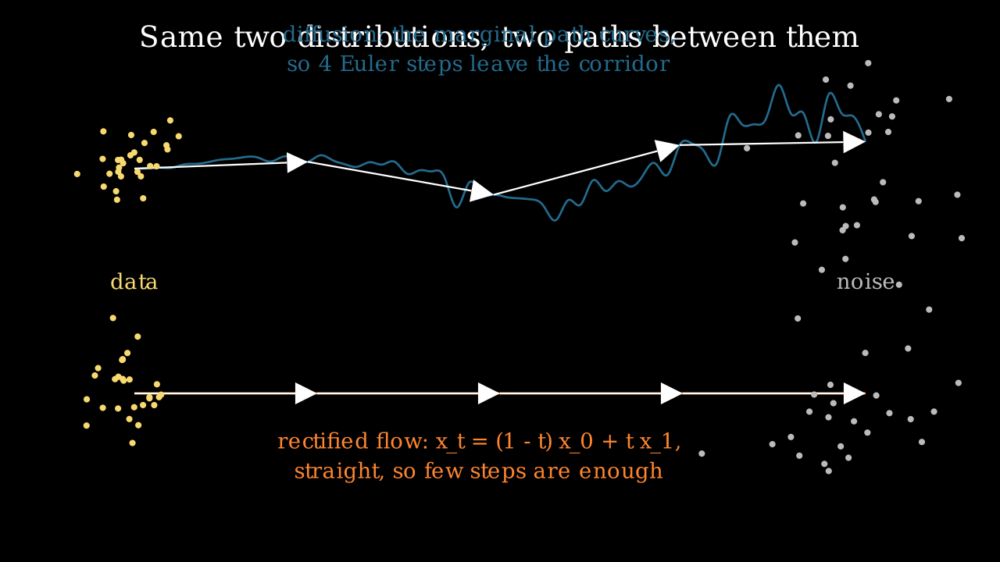

# Flow matching

> **Why this matters at staff level.** Flow matching is what SD3, Flux and Movie Gen train with, so
> "why did the field move from diffusion to flow matching" is now a standard question. The answer
> is short and derivable: both regress a target that turns noise into data, and the flow-matching
> target is a straight-line velocity, which is easier to integrate in few steps. Strong signal is
> deriving why regressing the conditional vector field gives the same gradient as regressing the
> intractable marginal one, and connecting that to the diffusion chapter rather than treating it as
> a separate technology.

## TL;DR, the interview card

* A continuous normalising flow is an ODE $\frac{dx}{dt} = v_\theta(x,t)$ that transports
  $p_0$ (noise) to $p_1$ (data). Densities follow the instantaneous change of variables
  $\frac{d}{dt}\log p_t(x(t)) = -\nabla\cdot v_\theta(x(t), t)$.
* Training a CNF by maximum likelihood requires simulating the ODE and its trace. Flow matching
  removes the simulation entirely.
* Flow matching regresses the marginal velocity $u_t(x)$. That field is intractable, so regress the
  conditional one $u_t(x \mid x_1)$ instead: the two objectives differ by a constant in $\theta$,
  so they have identical gradients.
* Rectified flow picks the straight path $x_t = (1-t)x_0 + t x_1$, whose conditional velocity is
  the constant $x_1 - x_0$. The loss is
  $\E_{t, x_0, x_1}\lVert v_\theta(x_t, t) - (x_1 - x_0)\rVert^2$.
* Sampling is Euler integration from $t=0$ to $t=1$. Straight paths tolerate few, large steps.
* Diffusion is the same framework with a different probability path: the Gaussian path
  $p_t(x\mid x_1) = \mathcal N(t x_1, (1-(1-\sigma_{\min})t)^2 I)$ recovers a diffusion-like model,
  and the probability-flow ODE of a diffusion model is a CNF.
* Production: SD3 and Flux use rectified flow; Movie Gen uses flow matching for joint video and
  audio. The reported wins are training stability and quality at low step counts.

## 1. Intuition first

Put the noise distribution on the left and the data distribution on the right. Diffusion connects
them with a stochastic process whose marginal path curves through the space. Flow matching lets you
pick the path, and the obvious choice is the straight line between a noise sample and a data sample.

{ width="820" }

Both rows carry the same two distributions at their ends. The top row is a diffusion trajectory:
the marginal path bends, so four large Euler steps (the white arrows) leave the corridor the true
trajectory occupies. The bottom row is a rectified flow: the path is a straight line, and four
steps land on it exactly.

The training signal follows from the choice of path. Take one noise sample $x_0$ and one data
sample $x_1$, pick a time $t\in[0,1]$, form the interpolant $x_t = (1-t)x_0 + t x_1$, and ask the
network for the velocity that moves along that line. The answer is the constant $x_1 - x_0$. That
is the entire training objective: sample a pair, interpolate, regress a difference.

The question that should bother you is why regressing toward a target defined by one arbitrary
pairing produces a model that transports the whole distribution. Section 2.3 answers it.

## 2. The math

### 2.1 Continuous normalising flows and the trace term

A time-dependent vector field $v_\theta: \R^d\times[0,1]\to\R^d$ defines a flow $\phi_t$ through

$$
\frac{d}{dt}\phi_t(x) = v_\theta(\phi_t(x), t), \qquad \phi_0(x) = x .
$$

Pushing $p_0$ through $\phi_t$ gives a path of densities $p_t$. The instantaneous change of
variables (the continuous-time analogue of the log-determinant term in a normalising flow) is

$$
\boxed{\;\frac{d}{dt}\log p_t\big(x(t)\big) = -\nabla\cdot v_\theta\big(x(t), t\big) = -\tr\!\left(\frac{\partial v_\theta}{\partial x}\right)\;}
$$

Integrating along a trajectory gives exact log-likelihoods, which is the appeal of CNFs. The cost is
the reason nobody trained them at scale: each training step needs an ODE solve, and each step of
that solve needs a trace of a Jacobian. The trace can be estimated with the Hutchinson identity
$\tr(A) = \E_{\varepsilon}[\varepsilon^\top A \varepsilon]$ for $\E[\varepsilon\varepsilon^\top]=I$,
which costs one vector-Jacobian product per probe instead of $d$ backward passes. Both estimators
are implemented in `flow_matching.py` and checked against each other and against an explicit
Jacobian.

### 2.2 Probability paths and the marginal vector field

Fix a **probability path**: a family of densities $p_t$ with $p_0$ a simple prior and $p_1$ the
data distribution. Say a vector field $u_t$ **generates** $p_t$ when transporting samples along
$u_t$ produces exactly those marginals, which is the continuity equation

$$
\frac{\partial p_t}{\partial t} + \nabla\cdot\big(p_t u_t\big) = 0 .
$$

The flow-matching objective is the regression you would write if you knew $u_t$:

$$
\mathcal L_{\text{FM}}(\theta) = \E_{t\sim\mathcal U[0,1],\; x \sim p_t}\Big[\big\lVert v_\theta(x,t) - u_t(x)\big\rVert^2\Big].
$$

Neither $p_t$ nor $u_t$ is available: both are marginals over the whole dataset.

### 2.3 Conditional flow matching, and why the gradients agree

Build the path as a mixture over data points. Choose a conditional path $p_t(x\mid x_1)$ for each
data sample (for example a Gaussian centred on a point moving from noise to $x_1$) with a known
conditional velocity $u_t(x\mid x_1)$, and define

$$
p_t(x) = \int p_t(x \mid x_1)\, q(x_1)\, dx_1 .
$$

The marginal velocity that generates this $p_t$ is the posterior-weighted average of the
conditional ones:

$$
u_t(x) = \int u_t(x\mid x_1)\,\frac{p_t(x\mid x_1) q(x_1)}{p_t(x)}\,dx_1 .
$$

Now compare two objectives. The intractable one, $\mathcal L_{\text{FM}}$ above, and the tractable
conditional one:

$$
\mathcal L_{\text{CFM}}(\theta) = \E_{t,\; x_1 \sim q,\; x\sim p_t(\cdot\mid x_1)}\Big[\big\lVert v_\theta(x,t) - u_t(x\mid x_1)\big\rVert^2\Big].
$$

Expand both squares. The $\lVert v_\theta\rVert^2$ terms are identical, because in both cases $x$
is drawn from $p_t$ (marginalising $x_1$ out of the CFM sampling procedure gives exactly $p_t$).
The target-norm terms do not involve $\theta$. So the two objectives differ only in the cross term,
and for that term

$$
\E_{t,x\sim p_t}\big[\langle v_\theta(x,t),\, u_t(x)\rangle\big]
= \E_{t,x\sim p_t}\Big[\Big\langle v_\theta(x,t),\, \int u_t(x\mid x_1)\tfrac{p_t(x\mid x_1)q(x_1)}{p_t(x)}dx_1\Big\rangle\Big]
= \E_{t,x_1,x\sim p_t(\cdot\mid x_1)}\big[\langle v_\theta(x,t),\, u_t(x\mid x_1)\rangle\big],
$$

where the last equality writes the posterior-weighted integral as a joint expectation over
$(x_1, x)$. The cross terms are equal, so

$$
\boxed{\;\nabla_\theta \mathcal L_{\text{FM}}(\theta) = \nabla_\theta \mathcal L_{\text{CFM}}(\theta)\;}
$$

The two losses differ by a constant in $\theta$ and share every gradient. Training on one
noise-data pair at a time, with a target that ignores the rest of the dataset, optimises the
objective defined by the marginal field. The network learns the conditional average of those
targets, and the conditional average is exactly $u_t(x)$.

This is the same structure as the DDPM argument. There, regressing the noise added to one example
yields a model of the score of the marginal, because the conditional expectation of $\varepsilon$
given $x_t$ is what least-squares regression converges to. Different path, same trick.

### 2.4 Rectified flow: the straight-line path

Take $x_0 \sim \mathcal N(0,I)$, $x_1 \sim q$, and the linear interpolant

$$
\boxed{\;x_t = (1-t)\,x_0 + t\,x_1, \qquad u_t(x_t \mid x_0, x_1) = \frac{d x_t}{dt} = x_1 - x_0\;}
$$

conditioning on the pair rather than on $x_1$ alone. The loss is

$$
\mathcal L(\theta) = \E_{t\sim\mathcal U[0,1],\;x_0\sim\mathcal N(0,I),\;x_1\sim q}\Big[\big\lVert v_\theta\big((1-t)x_0 + tx_1,\ t\big) - (x_1 - x_0)\big\rVert^2\Big].
$$

Three properties to be able to state. The individual trajectories are straight by construction,
while the learned marginal field is not, because $v_\theta$ learns the average of $x_1 - x_0$ over
all pairs that pass through a given $(x, t)$, and paths cross. Straightness in expectation still
buys a lot: an Euler step with a nearly constant velocity has small local error, which is why few
steps work. And the reflow procedure in the rectified-flow paper reduces the crossing: sample pairs
$(x_0, \text{ODE}(x_0))$ from the trained model, retrain on those pairs, and the coupling becomes
more nearly deterministic, straightening the field further.

There is no noise schedule, no $\bar\alpha$, no variance-preserving convention. The time variable
is $t\in[0,1]$ with $t=0$ at noise and $t=1$ at data, which is the opposite of the DDPM index
convention, a detail that causes real bugs when porting code.

### 2.5 The relationship to diffusion

Lipman's Gaussian path makes the correspondence explicit. Take

$$
p_t(x\mid x_1) = \mathcal N\big(x;\ \mu_t(x_1),\ \sigma_t(x_1)^2 I\big),
$$

for smooth $\mu_t, \sigma_t$ with $\mu_0 = 0, \sigma_0 = 1$ and $\mu_1 = x_1, \sigma_1 = \sigma_{\min}$.
Any such path has a conditional velocity in closed form:

$$
u_t(x \mid x_1) = \frac{\sigma_t'}{\sigma_t}\big(x - \mu_t\big) + \mu_t' .
$$

Two choices matter. The optimal-transport path $\mu_t = t x_1$, $\sigma_t = 1 - (1-\sigma_{\min})t$
gives $u_t(x\mid x_1) = \big(x_1 - (1-\sigma_{\min})x\big)/\big(1 - (1-\sigma_{\min})t\big)$, and in
terms of the pair $(x_0, x_1)$ it is $x_1 - (1-\sigma_{\min})x_0$, which is rectified flow when
$\sigma_{\min} = 0$. The test `test_gaussian_path_reduces_to_linear_when_sigma_min_zero` checks that
identity. The diffusion path instead takes $\mu_t = \sqrt{\bar\alpha_{1-t}}\,x_1$ and
$\sigma_t = \sqrt{1-\bar\alpha_{1-t}}$, which reproduces the VP diffusion marginals, and the
resulting velocity field is a reparameterisation of the score.

So diffusion and flow matching are two coordinates on one object.

| | Diffusion (DDPM) | Flow matching (rectified) |
|---|---|---|
| Path | $x_t = \sqrt{\bar\alpha_t}x_0 + \sqrt{1-\bar\alpha_t}\varepsilon$, curved in $t$ | $x_t = (1-t)x_0 + tx_1$, straight |
| Regression target | the noise $\varepsilon$ | the velocity $x_1 - x_0$ |
| Time convention | $t=0$ is data, integers $0..T-1$ | $t=0$ is noise, continuous $[0,1]$ |
| Sampling | ancestral (stochastic) or DDIM (ODE) | ODE integration, any solver |
| What the net predicts | score up to a scale | velocity |
| Extra machinery | schedule, terminal SNR, parameterisation choice | none of it |

Given a trained model of either kind, you can convert: the probability-flow ODE of a diffusion
model is a velocity field, and a flow model's velocity implies a score along the path. The right
panel of the earlier trajectory figure compares both on the same toy data at matched network
evaluations, and past four evaluations they are close. The differences at scale that the SD3 paper
reports come from training dynamics and from behaviour at very low step counts, not from a
difference in what the two objectives can represent.

### 2.6 Sampling

Euler integration with $S$ steps and $h = 1/S$:

$$
x \leftarrow x + h\, v_\theta(x, t),\qquad t \leftarrow t + h,
$$

starting from $x\sim\mathcal N(0,I)$ at $t=0$ and stopping at $t=1$. Every ODE solver applies:
midpoint and Heun cost two evaluations per step and have smaller local error, and adaptive solvers
exist but their variable cost is awkward to serve.

Guidance works exactly as in diffusion, because the conditional and unconditional velocity fields
combine the same way:

$$
\tilde v(x, t, y) = (1 + w)\,v_\theta(x,t,y) - w\,v_\theta(x, t, \varnothing),
$$

with the same conditioning-dropout training recipe and the same fidelity-against-diversity
trade-off.

One detail from the SD3 report worth carrying: the timestep distribution during training need not
be uniform. Sampling $t$ from a logit-normal distribution puts more training signal in the middle
of the trajectory, where the velocity field is hardest, and they report it improving results over
uniform sampling.

## 3. Implementation

The whole method is two functions.

```python
def linear_path(x0: torch.Tensor, x1: torch.Tensor, t: torch.Tensor) -> tuple[torch.Tensor, torch.Tensor]:
    """Rectified-flow interpolant and its conditional velocity.

    Args:
        x0 (noise), x1 (data): (B, d).  t: (B,) in [0, 1].
    Returns:
        x_t: (B, d) = (1 − t) x0 + t x1;   u_t: (B, d) = x1 − x0.
    """
    tt = t[:, None]                                                               # (B, 1)
    x_t = (1.0 - tt) * x0 + tt * x1                                               # (B, d)
    u_t = x1 - x0                                                                 # (B, d)
    return x_t, u_t


def cfm_loss(model: VelocityMLP, x1: torch.Tensor) -> torch.Tensor:
    """Conditional flow-matching loss with the linear path."""
    B = x1.shape[0]
    x0 = torch.randn_like(x1)                                                     # (B, d)
    t = torch.rand(B)                                                             # (B,)
    x_t, u_t = linear_path(x0, x1, t)                                             # (B, d), (B, d)
    v = model(x_t, t)                                                             # (B, d)
    return ((v - u_t) ** 2).mean()
```

Compare this against `ddpm_loss` in [chapter 3](03-diffusion.md): same shape, one fewer concept.
There is no schedule to index into, `t` is a float rather than an integer, and the target is a
difference rather than the sampled noise. The independent draw of $x_0$ per example is the
independent coupling; minibatch optimal-transport couplings (pair each $x_1$ with the nearest $x_0$
in the batch) reduce path crossing and are a cheap improvement worth knowing about.

```python
@torch.no_grad()
def sample_euler(model, n, d, n_steps, return_trajectory=False):
    """Integrate dx/dt = v_θ(x, t) from t = 0 (noise) to t = 1 (data) with fixed-step Euler."""
    x = torch.randn(n, d)                                                         # (N, d)
    traj = [x]
    dt = 1.0 / n_steps
    for i in range(n_steps):
        t = torch.full((n,), i * dt)                                              # (N,)
        x = x + dt * model(x, t)                                                  # (N, d)
        traj.append(x)
    return torch.stack(traj, dim=0) if return_trajectory else x                  # (S+1, N, d) or (N, d)
```

The loop runs forward in time, unlike every diffusion sampler, which runs backward. The velocity
network takes a continuous `t`, which here is scaled by 1000 before the sinusoidal embedding so the
same embedding code serves both chapters.

```python
def divergence_hutchinson(model, x, t, n_probes=1):
    """Hutchinson estimator ``E_ε[ε^T (∂v/∂x) ε]``, ε ~ Rademacher: one VJP per probe."""
    x = x.detach().requires_grad_(True)
    v = model(x, t)                                                               # (B, d)
    est = torch.zeros(x.shape[0])                                                 # (B,)
    for _ in range(n_probes):
        eps = torch.randint(0, 2, x.shape).float() * 2.0 - 1.0                    # (B, d) ±1
        vjp = torch.autograd.grad(v, x, grad_outputs=eps, retain_graph=True)[0]   # (B, d) = ε^T J
        est = est + (vjp * eps).sum(dim=1)                                        # (B,)
    return est / n_probes
```

The divergence is not needed for training (that is the point of flow matching) and it is needed for
likelihood evaluation, so it lives here with an exact version for small $d$ and this estimator for
large $d$. Rademacher probes have lower variance than Gaussian ones for this estimator.

**How you would test it.** Check the path endpoints ($x_t$ at $t=0$ is $x_0$, at $t=1$ is $x_1$)
and that the returned velocity is the finite-difference derivative of the path. Check the Gaussian
path reduces to the linear one at $\sigma_{\min}=0$. Check the Hutchinson estimator against the
exact trace and against `torch.autograd.functional.jacobian`. Then train briefly on the toy mixture
and assert the samples land near the data manifold with only 8 Euler steps, which is the property
the method exists for.

## Retype by hand

| Symbol | File | Time | Checked by |
|---|---|---|---|
| `linear_path` | `src/mlbook/generative/flow_matching.py` | 2 min | `test_linear_path_endpoints_and_velocity` |
| `cfm_loss` | `src/mlbook/generative/flow_matching.py` | 5 min | `test_cfm_loss_is_finite_scalar`, `test_flow_matching_learns_toy_distribution_with_few_euler_steps` |
| `sample_euler` | `src/mlbook/generative/flow_matching.py` | 5 min | `test_sample_euler_trajectory_shape`, `test_flow_matching_learns_toy_distribution_with_few_euler_steps` |
| `gaussian_path` | `src/mlbook/generative/flow_matching.py` | 4 min | `test_gaussian_path_reduces_to_linear_when_sigma_min_zero` |

Target: the path, the loss and the Euler sampler in 12 minutes. If you can write `ddpm_loss` from
[chapter 3](03-diffusion.md) and this loss back to back, you can answer most questions in this part.

Read but do not retype: `VelocityMLP` (a stand-in backbone), `sample_midpoint`,
`divergence_exact`, `divergence_hutchinson` (know what the trace is for and that Hutchinson
estimates it with one VJP per probe).

```bash
python -m pytest tests/test_generative_flow.py -q
```

## 4. Systems view: cost, failure modes, trade-offs

**What changes against diffusion, and what does not.** Training cost per step is the same: one
forward and backward pass on one corrupted example. Inference cost is the same formula, steps times
guidance factor times cost per forward pass. The claim is not that flow matching is cheaper per
step, it is that fewer steps suffice at a given quality, and that training is less sensitive to the
schedule choices that diffusion requires.

**What you stop having to tune.** No $\beta$ schedule, no terminal SNR check, no choice among
$\varepsilon$, $x_0$ and $v$ parameterisations, no reverse-variance choice. The remaining knobs are
the timestep sampling distribution during training (uniform or logit-normal), the coupling
(independent or minibatch optimal transport), and whether to run a reflow pass.

**When to use what.**

| Situation | Choice | Reason |
|---|---|---|
| New large text-to-image or text-to-video training run | Flow matching with a linear path | Fewer schedule decisions, good few-step behaviour, what SD3, Flux and Movie Gen use |
| Fine-tuning an existing diffusion checkpoint | Keep diffusion | The ecosystem (LoRAs, ControlNets, samplers) assumes the diffusion parameterisation |
| Very few steps (1 to 4) with a fixed quality bar | Distillation, from either kind of model | Both need distillation to be competitive at 1 step |
| Exact likelihoods needed | CNF with the trace term, or the probability-flow ODE | Flow matching training does not give likelihoods for free, the ODE at inference does |
| Discrete data | Neither directly | Both assume a continuous state space; discrete diffusion is a separate construction |

**Failure modes.** A model trained with the $t=0$ is noise convention and sampled with the diffusion
convention produces noise, and the bug is invisible in the loss. Integrating in the wrong direction
does the same. Too few Euler steps on a field with heavy path crossing gives blurred, averaged
samples, which looks like an undertrained model rather than an integration error, so test the step
count before blaming the weights. And guidance interacts with step count: a high guidance scale
makes the velocity field stiffer, so the step count that worked at $w=1$ may not work at $w=7$.

## 5. In production

!!! production "Stability AI: Stable Diffusion 3 is rectified flow at scale"
    The SD3 report trains with a rectified-flow objective and a new Transformer backbone (MMDiT)
    that keeps separate weights for text and image streams with attention across them. The paper
    compares flow-matching and diffusion formulations under matched conditions and reports the
    rectified-flow setup with a logit-normal timestep sampler as the best of the variants studied,
    then scales it and shows the trend holds.
    [Scaling Rectified Flow Transformers for High-Resolution Image Synthesis, arXiv:2403.03206](https://arxiv.org/abs/2403.03206),
    [Stability AI research post](https://stability.ai/news-updates/stable-diffusion-3-research-paper)

!!! production "Meta: Movie Gen trains joint video and audio with flow matching"
    Movie Gen is a 30B-parameter Transformer generating 1080p video with synchronised audio, plus
    instruction-based video editing and personalisation from a reference image. The system is
    trained with a flow-matching objective in a learned spatio-temporal latent space, which is the
    same stack as SD3 with a video autoencoder in place of the image one.
    [Movie Gen: A Cast of Media Foundation Models, arXiv:2410.13720](https://arxiv.org/abs/2410.13720)

!!! production "Black Forest Labs: Flux"
    The team that built the Stable Diffusion models released the FLUX.1 family, described in their
    posts as rectified-flow Transformers, in variants including a timestep-distilled model for
    few-step sampling. The release pattern (a guidance-distilled fast variant alongside the full
    model) is the production answer to the inference-cost arithmetic from
    [chapter 3](03-diffusion.md).
    [Black Forest Labs blog](https://bfl.ai/blog)

!!! production "The papers that defined the objective"
    Lipman et al. introduce flow matching with conditional probability paths and prove the gradient
    equivalence that makes it trainable, and show that diffusion paths are a special case while
    optimal-transport paths train faster and sample in fewer steps. Liu et al. arrive at the linear
    interpolation independently as rectified flow, with the reflow procedure that straightens the
    learned field.
    [Flow Matching for Generative Modeling, arXiv:2210.02747](https://arxiv.org/abs/2210.02747),
    [Flow Straight and Fast, arXiv:2209.03003](https://arxiv.org/abs/2209.03003)

## 6. Interview questions and strong answers

!!! interview "Why can you regress the conditional velocity when the objective is about the marginal one?"
    Expand both squared losses. The $\lVert v_\theta\rVert^2$ term is the same in both, because
    sampling $x_1$ then $x\sim p_t(\cdot\mid x_1)$ gives $x\sim p_t$. The target-norm terms do not
    depend on $\theta$. The cross terms are equal because the marginal velocity is defined as the
    posterior-weighted average of the conditional velocities, and writing that average as a joint
    expectation over $(x_1, x)$ converts one cross term into the other. So the two losses differ by
    a $\theta$-independent constant and have identical gradients. The network converges to the
    conditional expectation of the per-pair target, which is the marginal field.

    **Staff-level follow-up: what is the same argument in diffusion?** Regressing the specific
    noise added to a specific example converges to $\E[\varepsilon \mid x_t]$, which is the scaled
    score of the marginal. Both methods regress a per-example target and rely on least squares
    returning the conditional mean.

!!! interview "Why did SD3 and Flux move to flow matching?"
    Two reasons that are defensible without marketing. The training recipe has fewer decisions:
    no beta schedule, no terminal-SNR pathology, no choice among epsilon, x0 and v. And the linear
    path gives nearly straight trajectories, which an Euler solver integrates accurately in few
    steps, so quality at 10 to 20 steps is better than a diffusion model at the same budget. The
    SD3 paper backs this with a controlled comparison of formulations before scaling the winner.
    Note what did not change: the architecture, the text conditioning, the latent space and the
    guidance formula are all inherited from the diffusion stack.

!!! interview "Are flow matching and diffusion the same thing?"
    They are two paths in one framework. Pick the Gaussian probability path with
    $\mu_t = \sqrt{\bar\alpha}x_1$ and $\sigma_t = \sqrt{1-\bar\alpha}$ and flow matching reproduces
    the diffusion marginals, with a velocity field that is a reparameterisation of the score. Pick
    the linear path and you get rectified flow. Conversely, the probability-flow ODE of a trained
    diffusion model is a velocity field you can integrate with any solver. The differences that
    matter in practice are the training-time conditioning distribution, the curvature of the path,
    and the amount of schedule machinery you have to get right.

!!! interview "You have 4 network evaluations per sample. What do you do?"
    Four evaluations is distillation territory for either model family. With flow matching, first
    measure the quality curve against step count, because a well-trained rectified flow at 4 Euler
    steps is often usable where a diffusion model at 4 DDIM steps is not. Then consider reflow to
    straighten the field, then guidance distillation to stop spending two evaluations per step, and
    then step distillation. The order matters: guidance distillation alone doubles your effective
    step count for free.

!!! interview "Write the flow-matching training step on the whiteboard"
    Sample a data batch $x_1$, sample $x_0\sim\mathcal N(0,I)$ of the same shape, sample
    $t\sim\mathcal U[0,1]$ per example, form $x_t = (1-t)x_0 + tx_1$, and minimise
    $\lVert v_\theta(x_t,t) - (x_1-x_0)\rVert^2$. Four lines. Then be ready for the follow-up about
    the time convention: here $t=0$ is noise and $t=1$ is data, and sampling integrates forward,
    which is the reverse of the DDPM index convention.

!!! interview "What breaks if you use flow matching on discrete data?"
    The construction assumes a continuous state space with a differentiable path between noise and
    data, and an ODE that transports density. Text tokens have no such path. The options are to run
    the flow in a continuous embedding or latent space and quantise at the end (which is what image
    tokenisers do in reverse), or to use a discrete-state construction such as a continuous-time
    Markov chain with masking, which is a different derivation. Saying "I would embed and flow in
    latent space" is fine, provided you name the quantisation step as the place where it can fail.

## 7. Exercises

**★ 1. Velocity by finite differences.** Verify that `linear_path` returns the time derivative of
its own interpolant, by comparing $u_t$ against $(x_{t+\delta} - x_t)/\delta$.

??? success "Solution"
    This is `test_linear_path_endpoints_and_velocity`. The derivative of $(1-t)x_0 + tx_1$ is
    $x_1 - x_0$, independent of $t$, which is why the target has no time dependence even though the
    input does.

**★ 2. One Euler step from pure noise.** With a trained model, take a single Euler step from $t=0$
to $t=1$ and plot the result. Explain the shape of what you get.

??? success "Solution"
    One step gives $x_0 + v_\theta(x_0, 0)$, and $v_\theta(x_0, 0)$ is the average of $x_1 - x_0$
    over all data points that could pair with this $x_0$, so the output is approximately
    $\E[x_1]$ plus a correction: the samples cluster near the data mean. This is the
    one-step behaviour that reflow and distillation exist to fix.

**★★ 3. Step-count curve.** Reproduce the right panel of the trajectory figure: train the flow
model and a DDPM on the same data, and plot the median distance to the nearest mode against
network evaluations for both.

??? success "Solution"
    `figures/part09_flow_trajectories.py` does exactly this. On a 2-D toy problem both are close
    past four evaluations, and the flow model is better at one and two. Reporting the measurement you have is
    worth more in an interview than repeating a claim about a large margin, since the published
    gaps are measured on high-dimensional image data where path curvature matters more.

**★★ 4. Minibatch optimal-transport coupling.** Instead of pairing each $x_1$ with an independent
$x_0$, compute the pairing within the batch that minimises total squared distance (use
`scipy.optimize.linear_sum_assignment`) and train with that coupling. Compare 4-step sample quality.

??? success "Solution"
    ```python
    from scipy.optimize import linear_sum_assignment
    cost = torch.cdist(x0, x1) ** 2                # (B, B)
    row, col = linear_sum_assignment(cost.numpy())
    x0, x1 = x0[row], x1[col]                      # (B, d) each, now optimally paired
    ```
    Paths cross less, so the learned field is straighter and few-step sampling improves. The cost is
    an $O(B^3)$ assignment per batch, which is cheap relative to a large model's forward pass and
    prohibitive for very large batches.

**★★ 5. Guidance in a flow model.** Add a class embedding to `VelocityMLP` with a null token, train
with 15 percent conditioning dropout on the labelled mixture, and implement
$\tilde v = (1+w)v(x,t,y) - w\,v(x,t,\varnothing)$. Reproduce the fidelity-diversity curve from
[chapter 3](03-diffusion.md).

??? success "Solution"
    The implementation mirrors `EpsMLP` and `predict_eps_cfg` exactly, with velocity in place of
    noise. The curve looks the same, which is the point: guidance is a property of the conditional
    modelling setup, not of the diffusion parameterisation.

**★★★ 6. Exact likelihood by integrating the trace.** Using `divergence_hutchinson`, integrate
$\log p$ backward along the ODE from a data point to $t=0$ and report the log-likelihood of a
held-out batch. Compare against a Gaussian fitted to the same data.

??? success "Solution"
    Integrate the pair $(x, \ell)$ with $\dot x = -v_\theta(x, t)$ and
    $\dot \ell = +\nabla\cdot v_\theta(x,t)$ from $t=1$ to $t=0$, then
    $\log p_1(x_1) = \log \mathcal N(x_0; 0, I) - \int \nabla\cdot v\,dt$ with the sign convention
    checked on a case you can compute by hand (a linear velocity field with known divergence). On
    the 2-D mixture the flow should beat a single Gaussian by a wide margin, and the estimate will
    be noisy in the number of Hutchinson probes, which is why exact likelihood evaluation uses many
    probes or the exact trace in low dimensions.

**★★★ 7. Reflow.** Generate 20,000 pairs $(x_0, \text{ODE}(x_0))$ from your trained model, retrain a
fresh model on those pairs with the same loss, and measure straightness (the average deviation of
the trajectory from the straight line between its endpoints) before and after.

??? success "Solution"
    Straightness improves because the reflow coupling is deterministic: each $x_0$ has exactly one
    partner, so the conditional average that the network learns has no competing targets at a given
    $(x, t)$. One-step and two-step sample quality improve accordingly. The cost is a full sampling
    pass over a large set of noise vectors plus a second training run, and the second model inherits
    the first model's errors, which is the trade the rectified-flow paper documents.

## References

* Lipman, Chen, Ben-Hamu, Nickel, Le, *Flow Matching for Generative Modeling*, ICLR 2023. [arXiv:2210.02747](https://arxiv.org/abs/2210.02747)
* Liu, Gong, Liu, *Flow Straight and Fast: Learning to Generate and Transfer Data with Rectified Flow*, ICLR 2023. [arXiv:2209.03003](https://arxiv.org/abs/2209.03003)
* Esser et al., *Scaling Rectified Flow Transformers for High-Resolution Image Synthesis* (SD3), ICML 2024. [arXiv:2403.03206](https://arxiv.org/abs/2403.03206)
* Polyak et al., *Movie Gen: A Cast of Media Foundation Models*, Meta, 2024. [arXiv:2410.13720](https://arxiv.org/abs/2410.13720)
* Song et al., *Score-Based Generative Modeling through Stochastic Differential Equations* (the probability-flow ODE), ICLR 2021. [arXiv:2011.13456](https://arxiv.org/abs/2011.13456)
* Salimans, Ho, *Progressive Distillation for Fast Sampling of Diffusion Models*, ICLR 2022. [arXiv:2202.00512](https://arxiv.org/abs/2202.00512)
* Song, Dhariwal, Chen, Sutskever, *Consistency Models*, ICML 2023. [arXiv:2303.01469](https://arxiv.org/abs/2303.01469)
