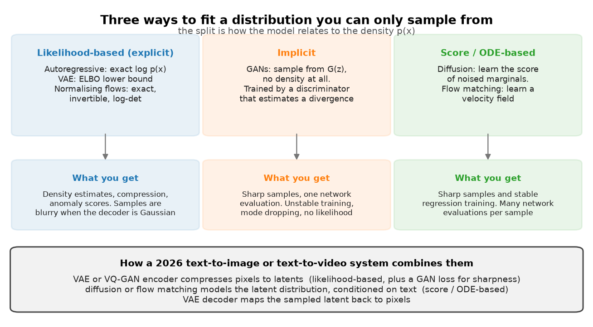

# Part IX: Generative models

Every model in this part answers the same question: given samples $x^{(1)}, \dots, x^{(N)}$ from
a distribution you cannot write down, produce new samples from it. The families differ in how
they relate to the density $p(x)$, and that single choice determines what you can compute, how
training behaves, and what a sample costs at inference.

{ width="820" }

The figure splits the field three ways. Likelihood-based models write down $p(x)$ or a bound on
it, so you get compression, anomaly scores and a loss you can compare across runs. Implicit
models define a sampler and nothing else, so you need a second network to say whether the
samples look right. Score-based models learn the gradient of the log density of noised versions
of the data, which turns generation into a regression problem plus an integrator.

A 2026 image or video system uses all three at once. A VAE or VQ-GAN compresses pixels into a
latent grid, trained with a reconstruction loss, a KL or codebook term, and a GAN loss for
sharpness. A diffusion or flow-matching Transformer models the latent distribution conditioned
on text. The VAE decoder maps the sampled latent back to pixels. Knowing which part of that
stack a question is about is half of answering it.

| Chapter | The idea you must own | The code you must be able to write |
|---|---|---|
| [1. Autoencoders and VAEs](01-autoencoders-vae.md) | The ELBO from two directions, the Gaussian KL in closed form, reparameterisation, posterior collapse as a rate-distortion outcome, VQ-VAE's straight-through estimator. | `vae_loss`, `reparameterize`, `gaussian_kl_closed_form`, `VectorQuantizer`. |
| [2. GANs](02-gans.md) | The optimal discriminator $D^*=p_{data}/(p_{data}+p_g)$, the objective as $2\,\mathrm{JSD}-\log 4$, why the non-saturating loss exists, what mode collapse looks like. | `d_loss_standard`, `g_loss_non_saturating`, `gradient_penalty`, one alternating training step. |
| [3. Diffusion](03-diffusion.md) | $q(x_t\mid x_0)$ in closed form, the ELBO collapsing to $\lVert \varepsilon - \varepsilon_\theta \rVert^2$, the posterior mean, DDIM, v-prediction, classifier-free guidance, latent diffusion. | `q_sample`, `ddpm_loss`, `posterior_mean_variance`, `sample_ancestral`, `sample_ddim`, `predict_eps_cfg`. |
| [4. Flow matching](04-flow-matching.md) | Conditional flow matching and why regressing the conditional velocity has the same gradient as the marginal one, rectified flow, the link to diffusion. | `linear_path`, `cfm_loss`, `sample_euler`. |

## Prerequisites

* [Probability](../part01-math/03-probability.md) for change of variables, Gaussian algebra and
  conditioning. Chapter 1 uses the Gaussian KL, chapter 3 uses the product of two Gaussians.
* [Information theory](../part01-math/05-information-theory.md) for KL divergence, Jensen's
  inequality and the rate-distortion framing that explains posterior collapse.
* [Backpropagation](../part03-neural-nets/02-backpropagation.md) for the straight-through
  estimator and for why a sampling step blocks gradients until you reparameterise it.
* [Attention mathematics](../part05-sequence-transformers/03-attention-mathematics.md) for the
  cross-attention conditioning in latent diffusion and for DiT.
* [CLIP and contrastive learning](../part08-multimodal/03-clip-contrastive.md) for the text
  encoder that conditions every text-to-image model here.
* [Evaluation](../part13-retrieval-eval-reliability/02-evaluation.md) for FID, Inception Score
  and their failure modes, which chapter 2 uses and chapter 3 relies on.

## If you have one day

1. Chapter 1, sections 2 and 3 (both ELBO derivations, the Gaussian KL, reparameterisation,
   the VQ straight-through trick), 2 hours. Retype `vae_loss` and `VectorQuantizer.forward`.
2. Chapter 3, sections 2 and 3 up to ancestral sampling, 3 hours. This is the highest-yield
   block in the part. Retype `q_sample`, `ddpm_loss`, `posterior_mean_variance`,
   `sample_ancestral`.
3. Chapter 3, sections on DDIM, v-prediction and classifier-free guidance, 1.5 hours. Derive
   the CFG formula on paper.
4. Chapter 4, sections 1 to 3, 1.5 hours. Retype `cfm_loss` and `sample_euler`.
5. Chapter 2, sections 2 and 4 (optimal discriminator, JSD, failure modes), 1 hour. Read only.

Chapter 2 is last on purpose. GANs are asked about as literacy and as the adversarial loss
inside a VQ-GAN tokeniser, not as something you are likely to train in 2026.

## Where this part is used later

* [Part X](../part10-self-supervised/index.md): denoising and masking as pretext tasks are the
  same corruption idea that chapter 1 introduces and chapter 3 industrialises.
* [Part XI, world models](../part11-perception-autonomy/07-world-models.md): driving world
  models are conditional video diffusion models.
* [Part XIII, evaluation](../part13-retrieval-eval-reliability/02-evaluation.md): FID, CLIP
  score and human preference evaluation for generative systems.
* [Part XIV, inference systems](../part14-systems/03-inference-systems.md): a 30-step sampler
  is 30 forward passes, which changes every serving decision.

## Code map

All Part IX code lives in `src/mlbook/generative/` and is tested by
`tests/test_generative_*.py` (`python -m pytest tests/test_generative_* -q`):

| Module | Contents |
|---|---|
| `toy_data.py` | 2-D mixtures and two-moons samplers shared by every chapter, plus a manifold-distance metric |
| `autoencoder.py` | MLP autoencoder, Gaussian and masking corruptions, the denoising objective |
| `vae.py` | `VAE`, `reparameterize`, closed-form and Monte-Carlo Gaussian KL, `vae_loss` with the decoder scale |
| `vqvae.py` | `VectorQuantizer` with straight-through gradients, commitment loss, codebook perplexity |
| `gan.py` | generator, discriminator, standard/non-saturating/Wasserstein losses, gradient penalty, spectral norm by power iteration |
| `ddpm.py` | schedules (linear, cosine, zero terminal SNR), `q_sample`, parameterisation conversions, posterior, `EpsMLP`, ancestral and DDIM samplers, CFG |
| `flow_matching.py` | `VelocityMLP`, linear and Gaussian probability paths, `cfm_loss`, Euler and midpoint samplers, exact and Hutchinson divergence |

## What interviewers actually ask

Four questions cover most of this part.

1. Derive the ELBO and explain each term. Then: what is the reparameterisation trick for, and
   what breaks without it.
2. Write the DDPM training loop on a whiteboard. Then: why does the simplified loss drop the
   weighting from the ELBO, and what does that weighting do.
3. Explain classifier-free guidance, including the formula, and what happens as the scale grows.
4. Your text-to-image service costs too much per image. List the levers. (Fewer steps via DDIM
   or a distilled model, a smaller latent grid, batching, caching the text encoder, a lower
   guidance scale so you can drop the unconditional pass.)
