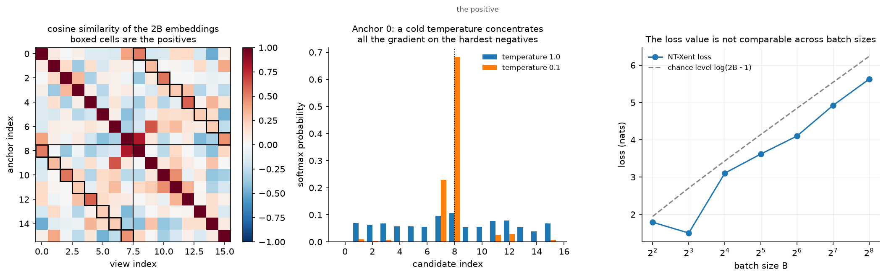
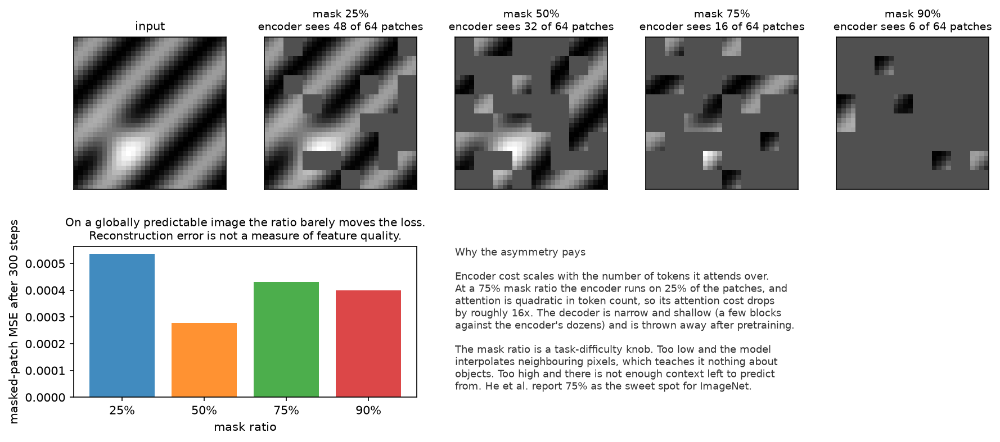

# Self-supervised learning

> **Why this matters at staff level.** Every strong perception backbone shipped since 2021 was
> pretrained without task labels, so the question "where did your features come from" now has an SSL
> answer. Interviews test three things: whether you can derive NT-Xent and explain the batch-size
> dependence, whether you can say why BYOL and SimSiam avoid collapse without negatives, and whether
> you know when SSL pretraining beats supervised pretraining and when it does not. Strong signal is
> connecting the objective to the deployment decision: frozen features plus a linear probe against
> full fine-tuning, and what each costs.

## TL;DR, the interview card

* Contrastive (SimCLR): two augmented views per image, NT-Xent over $2B$ embeddings,
  $\ell_i = -\log \frac{\exp(\mathrm{sim}(z_i, z_{p(i)})/\tau)}{\sum_{k\neq i}\exp(\mathrm{sim}(z_i,z_k)/\tau)}$.
  Negatives come from the batch, so batch size is a hyperparameter.
* MoCo decouples the negative count from the batch with a queue of past keys plus a momentum
  encoder, so the keys stay consistent as the encoder drifts.
* The projection head is discarded after pretraining. Features before the head transfer better,
  because the head is trained to be invariant to the augmentations, which destroys information the
  downstream task may need.
* Non-contrastive (BYOL, SimSiam): predict the target branch's embedding from the online branch.
  Collapse is avoided by the asymmetry of a predictor plus a stop-gradient, with an EMA target in
  BYOL. SimSiam shows the EMA is optional and the stop-gradient is not.
* Clustering (SwAV, DINO): predict one view's cluster assignment or teacher distribution from the
  other. Centering plus sharpening in DINO plays the role that negatives play in SimCLR.
* Masked modelling (MAE): mask 75 percent of patches, encode only the visible 25 percent, decode
  with a light decoder, compute loss on masked patches only. Cheap and scalable.
* DINOv2 combines DINO self-distillation with iBOT patch-level masking, plus curated data at scale,
  and produces frozen features strong enough for detection, segmentation and depth without
  fine-tuning.
* Next-token prediction is self-supervised learning. The same idea, on text, with the mask being
  the future.
* Evaluate with a linear probe (measures feature quality) and with fine-tuning (measures
  initialisation quality). They disagree often, and the disagreement is informative.

## 1. Intuition first

Supervised learning needs a human to say what an image contains. Self-supervision hides part of the
data and asks the model to recover it, which turns any unlabelled image into a training example.

The design question is what to hide. Hide the colour channels and the model learns colourisation,
which requires some object knowledge and a lot of texture knowledge. Hide the spatial arrangement
and the model learns jigsaw puzzles. Hide the rotation and the model must recognise object
orientation, which requires knowing what the object is. These early pretext tasks worked, in the
sense of beating random initialisation, and each has a shortcut the model can exploit: chromatic
aberration gives away patch positions, and a rotation classifier can key on the sky being at the top.

Two families took over. The first hides identity: take two crops of the same image and require
their embeddings to match while differing from other images' embeddings. The second hides content:
mask most of the image and reconstruct it.

{ width="900" }

The left panel is the object SimCLR's loss operates on: a $2B\times 2B$ matrix of cosine
similarities with the positives boxed. Each row is a softmax classification problem with $2B-1$
candidates and exactly one correct answer.

The middle panel shows what temperature does to one row. At $\tau=1$ the softmax is nearly flat, so
every negative contributes a little gradient. At $\tau=0.1$ nearly all the mass sits on the positive
and the single hardest negative, so the gradient concentrates on the pair the model currently
confuses. Cold temperatures make the loss a hard-negative miner.

The right panel is a warning about reading the loss value. Chance level is $\log(2B-1)$, so a run
with a larger batch has a larger loss at the same feature quality. Comparing NT-Xent values across
batch sizes says nothing.

## 2. The math

### 2.1 NT-Xent, derived

Take a batch of $B$ images. Apply a random augmentation twice per image to get $2B$ views, encode
them with $f$, project with $g$, and $L_2$-normalise to get $z_1,\dots,z_{2B}$ on the unit sphere.
For view $i$, let $p(i)$ be the index of the other view of the same image. With cosine similarity
$\mathrm{sim}(u,v) = u^\top v$ (already normalised) and temperature $\tau$:

$$
\boxed{\;\ell_i = -\log \frac{\exp\big(\mathrm{sim}(z_i, z_{p(i)})/\tau\big)}{\sum_{k=1}^{2B}\mathbf 1[k\neq i]\exp\big(\mathrm{sim}(z_i,z_k)/\tau\big)},
\qquad \mathcal L = \frac{1}{2B}\sum_{i=1}^{2B}\ell_i\;}
$$

Three details decide whether an implementation is right.

The denominator excludes $k=i$ and includes $k=p(i)$. Excluding the anchor is required: the
self-similarity is exactly $1/\tau$, larger than any other term, so leaving it in floors the loss at
roughly $\log 2$ and destroys the gradient. The test
`test_nt_xent_excludes_the_anchor_itself` asserts that the loss on perfectly aligned views falls
below 0.05 at a cold temperature, which is only possible with the exclusion.

The loss is a cross-entropy over $2B-1$ candidates, so an implementation is one masked matrix
multiply plus `F.cross_entropy` with the positive index as the label. At chance the value is
$\log(2B-1)$, which `test_nt_xent_random_chance_value` checks on near-orthogonal high-dimensional
embeddings.

The sum runs over all $2B$ anchors, so each pair contributes twice, once in each direction. This
symmetry matters when you compare against the asymmetric MoCo formulation.

Writing $s_{ik} = \mathrm{sim}(z_i,z_k)/\tau$ and $p_{ik} = \softmax_k(s_{ik})$, the gradient with
respect to the anchor's similarity row is

$$
\frac{\partial \ell_i}{\partial s_{ik}} = p_{ik} - \mathbf 1[k = p(i)],
$$

the same $p - y$ form as softmax cross-entropy anywhere else. The negatives with the largest
$p_{ik}$ receive the most gradient, so hard negatives dominate, and $\tau$ controls how
concentrated that dominance is.

### 2.2 Why batch size is a hyperparameter here

Every negative in the denominator comes from the same batch, so the number of negatives is $2B-2$.
Small batches give a small, easy classification problem, and the representation has no pressure to
separate anything beyond a handful of distractors. SimCLR's reported results improve with batch
size well past 1024, and large batches also need learning-rate scaling and a warmup to train stably
(LARS in the original work).

Two escapes exist. MoCo keeps a queue of the last $K$ key embeddings, so the negative count is
decoupled from the batch. Because the encoder changes between the time a key entered the queue and
the time it is used, the keys must come from a slowly-moving copy of the encoder:

$$
\boxed{\;\theta_k \leftarrow m\,\theta_k + (1-m)\,\theta_q,\qquad m \approx 0.999\;}
$$

That momentum is what keeps the queue's keys mutually consistent. The second escape is to drop
negatives entirely, which is section 2.3.

InfoNCE with a queue is what `info_nce_loss` implements: one positive logit, $Q$ negative logits,
cross-entropy with label 0. The mutual-information view (InfoNCE bounds $I(x; c)$ below by
$\log N - \mathcal L$) is derived in
[CLIP and contrastive learning](../part08-multimodal/03-clip-contrastive.md).

### 2.3 Augmentations are the prior

The contrastive objective says two views of the same image should match. Which views you generate
determines what the representation is invariant to, which is the actual design decision. SimCLR's
ablations found random cropping plus colour distortion to be the pair that matters most, and the
reason is instructive: without colour jitter, two crops of the same image share a colour histogram,
and matching histograms is an easier task than matching content, so the model learns that shortcut.

The general principle: your augmentation set encodes the invariances you want, and any property the
augmentation does not destroy can become a shortcut. For OCR this matters directly. Aggressive
colour jitter is fine, horizontal flips are not, because flipped text is a different thing. For
medical or satellite imagery the standard recipe is often wrong in the same way.

The projection head $g$ exists to absorb this. The contrastive loss forces $g(h)$ to be invariant to
the augmentations, including to colour and orientation information that a downstream task may need.
Keeping $h$ (before the head) and discarding $g$ gives features that retain more of that
information, which is why SimCLR reported a large gap between probing $h$ and probing $g(h)$.

### 2.4 Non-contrastive methods, and the collapse question

BYOL removes negatives. Two branches: an online network ($f_\theta$, projector $g_\theta$, predictor
$q_\theta$) and a target network ($f_\xi, g_\xi$) whose weights are an EMA of the online ones. For
two views $v, v'$:

$$
\mathcal L = \big\lVert \overline{q_\theta(g_\theta(f_\theta(v)))} - \overline{g_\xi(f_\xi(v'))}\big\rVert_2^2
= 2 - 2\cdot\frac{\langle q, z'\rangle}{\lVert q\rVert\,\lVert z'\rVert},
$$

with bars denoting $L_2$ normalisation, symmetrised over the two views, and a stop-gradient on the
target branch. The target is updated by
$\xi \leftarrow \tau\xi + (1-\tau)\theta$ with $\tau$ around 0.99 to 0.999.

Nothing in that loss prevents the trivial solution where both networks output a constant, and yet
it does not happen. The mechanism is the asymmetry:

* The **predictor** $q_\theta$ makes the two branches compute different functions. The online branch
  is asked to predict the target's output, and the optimal predictor given the online representation
  is the conditional expectation of the target embedding, so the online representation is rewarded
  for retaining information that makes that expectation predictable.
* The **stop-gradient** means the target never moves to make itself easier to predict. Remove it and
  the pair collapses immediately, which is the ablation SimSiam ran.
* The **EMA** makes the target a slow-moving version of the online network, which keeps the
  prediction target stable. SimSiam showed that replacing the EMA with a direct copy (that is,
  $\tau = 0$) still works, so the EMA is a stabiliser and the stop-gradient plus predictor is the
  load-bearing part.

The honest summary of the theory: analyses show that the predictor plus stop-gradient dynamics
resemble an alternating optimisation or an implicit expectation-maximisation step, and that the
predictor's alignment with the covariance of the representation prevents the variance from
collapsing. It works reliably in practice and the mechanism is still argued about.
`test_byol_representations_do_not_collapse_to_a_constant` checks the property that matters: after
training, per-dimension feature variance stays alive.

### 2.5 Clustering and self-distillation

SwAV predicts the cluster assignment of one view from the other, with assignments computed online
under an equal-partition constraint (solved with a few Sinkhorn iterations) that stops every image
being assigned to one cluster. Multi-crop, taking several low-resolution crops alongside the two
standard ones, came from this line and transfers to other methods.

DINO frames the same idea as self-distillation with no labels. A student network is trained to match
a teacher's output distribution over $K$ dimensions, where the teacher is an EMA of the student:

$$
\mathcal L = -\sum_k P_t^{(k)}\log P_s^{(k)},\qquad
P_t = \softmax\!\left(\frac{g_t(x) - c}{\tau_t}\right),\quad
P_s = \softmax\!\left(\frac{g_s(x')}{\tau_s}\right).
$$

Two operations prevent collapse. **Centering** subtracts an EMA $c$ of the teacher's outputs, which
stops one dimension dominating. **Sharpening** uses a teacher temperature $\tau_t < \tau_s$, which
stops the output becoming uniform. Centering alone collapses to uniform, sharpening alone collapses
to a single dimension, and the pair is stable. DINO also reported that self-supervised ViT features
contain explicit object segmentation information in their attention maps, which is what made people
take frozen SSL features seriously for dense tasks.

DINOv2 is the production version: DINO's image-level objective plus iBOT's masked patch-level
objective (predict the teacher's output for masked patches, an online tokeniser rather than a fixed
one like BEiT's), plus engineering for scale, plus a curated dataset of 142M images built by
retrieval-based filtering from a large uncurated pool. The curation is the part that engineers
underrate: the paper's argument is that self-supervised methods match supervised ones when trained
on enough curated data, and the curation pipeline is a large part of the contribution.

### 2.6 Masked modelling

MAE takes the BERT idea to images with one important change. The recipe:

1. Patchify the image into $N$ non-overlapping patches, add positional embeddings.
2. Sample a random subset to keep, typically 25 percent, and drop the rest.
3. Encode only the kept patches. The encoder never sees mask tokens.
4. Append learned mask tokens at the masked positions, add positional embeddings again, and run a
   shallow, narrow decoder.
5. Compute MSE on the masked patches only (optionally on per-patch normalised pixels).

The asymmetry is what makes it cheap. With a 75 percent mask ratio the encoder runs on a quarter of
the tokens, and attention is quadratic in token count, so the encoder's attention cost drops by
roughly $16\times$. The decoder is small (a few blocks against the encoder's dozens) and is thrown
away after pretraining.

{ width="900" }

The mask ratio is a task-difficulty knob. At 25 percent, most masked patches can be recovered by
interpolating neighbours, which teaches texture and nothing about objects. At 90 percent there is
too little context. He et al. report 75 percent as the balance for ImageNet, much higher than BERT's
15 percent for text, because image patches are far more redundant than word tokens.

Two consequences for practice. MAE features are strong after fine-tuning and weaker under a linear
probe than contrastive or DINO features, because the objective optimises reconstruction rather than
linear separability. And the recipe transfers across modalities with the patching changed: video
(tubelets, with even higher mask ratios because of temporal redundancy), audio spectrograms, and
point clouds.

BEiT predicts discrete visual tokens from a pretrained VQ tokeniser instead of pixels, which is
where the tokenisers in [Part IX, chapter 1](../part09-generative/01-autoencoders-vae.md) enter this
story. iBOT makes the tokeniser online, which is what DINOv2 inherits.

### 2.7 The LLM view, and JEPA

Next-token prediction is masked modelling with a causal mask: the hidden part is the future. An LLM
is a self-supervised model, which is why the phrase "self-supervised pretraining, then supervised
fine-tuning, then preference optimisation" describes both a vision backbone and a chat model. The
scaling behaviour in [Part VI](../part06-llm-training/02-scaling-laws.md) is the same phenomenon
studied on the text side.

JEPA takes a different position on what to predict. MAE reconstructs pixels, which forces capacity
into details that carry no semantics. I-JEPA predicts the *representations* of masked regions from a
context block, in latent space, with a target encoder. The argument is that predicting in
representation space discards unpredictable detail by construction. This is the same move as BYOL
(predict an embedding, not an input) applied to masked modelling, and it is the direction Meta's
vision research has pushed.

### 2.8 Evaluation: linear probe against fine-tuning

Two protocols, two different questions.

* **Linear probe.** Freeze the backbone, train a linear classifier on the features. Measures whether
  the information is present and linearly accessible. Cheap, reproducible, and the standard way SSL
  papers compare.
* **Fine-tuning.** Train everything on the downstream task. Measures the quality of the
  initialisation. More expensive, higher variance, and closer to what you will actually do.

They disagree, and the disagreement is informative. MAE probes worse and fine-tunes better than
contrastive methods; contrastive and DINO features probe better because their objectives explicitly
shape the embedding geometry. If your deployment freezes the backbone (many multi-task perception
stacks do, to share one encoder across heads), the probe number is the one that predicts your
outcome. If you fine-tune per task, it is not.

Two more protocols worth naming: $k$-NN classification on frozen features (no training at all, a
good smoke test), and attentive probing (a small attention head instead of a linear layer), which
has become common for masked models whose information is not linearly accessible.

## 3. Implementation

NT-Xent as a masked cross-entropy:

```python
def nt_xent_loss(z1: torch.Tensor, z2: torch.Tensor, temperature: float = 0.1) -> torch.Tensor:
    """NT-Xent over the 2B embeddings ``[z1; z2]``; ``z1[i]`` and ``z2[i]`` are the positive pair."""
    B = z1.shape[0]
    z = torch.cat([z1, z2], dim=0)                               # (2B, d_z)
    z = F.normalize(z, dim=1)                                    # (2B, d_z) unit vectors
    sim = z @ z.t() / temperature                                # (2B, 2B) cosine / τ
    self_mask = torch.eye(2 * B, dtype=torch.bool)               # (2B, 2B)
    sim = sim.masked_fill(self_mask, float("-inf"))              # (2B, 2B) exclude k = i from the softmax
    # positive of anchor i is i + B (first half) or i − B (second half)
    positives = torch.cat([torch.arange(B, 2 * B), torch.arange(0, B)])  # (2B,)
    loss = F.cross_entropy(sim, positives)
    return loss
```

Five lines of tensor work and the whole method is there. `masked_fill` with $-\infty$ before the
softmax is how you exclude the anchor without building an index gather. The `positives` vector is
the label for a standard cross-entropy, which is why no custom backward is needed. The module also
carries `nt_xent_loss_reference`, a double loop written straight from the formula, and the test
asserts the two agree to $10^{-5}$: that pairing of a vectorised implementation with a naive
reference is the cheapest correctness insurance there is.

BYOL is about the wiring, not the loss:

```python
class BYOL(nn.Module):
    def __init__(self, encoder, d_h, d_z=32, d_hidden=64, tau=0.99):
        super().__init__()
        self.online_encoder = encoder
        self.online_projector = nn.Sequential(nn.Linear(d_h, d_hidden), nn.ReLU(), nn.Linear(d_hidden, d_z))
        self.predictor = nn.Sequential(nn.Linear(d_z, d_hidden), nn.ReLU(), nn.Linear(d_hidden, d_z))
        self.target_encoder = copy.deepcopy(encoder)
        self.target_projector = copy.deepcopy(self.online_projector)
        for p in list(self.target_encoder.parameters()) + list(self.target_projector.parameters()):
            p.requires_grad_(False)
        self.tau = tau

    def forward(self, x1: torch.Tensor, x2: torch.Tensor) -> torch.Tensor:
        """Symmetrised BYOL loss for two views (B, d_in) each.  Returns a scalar."""
        p1 = self.online(x1)                                      # (B, d_z)
        p2 = self.online(x2)                                      # (B, d_z)
        z1 = self.target(x1).detach()                             # (B, d_z)  stop-gradient
        z2 = self.target(x2).detach()                             # (B, d_z)
        return byol_regression_loss(p1, z2) + byol_regression_loss(p2, z1)

    @torch.no_grad()
    def update_target(self) -> None:
        """ξ ← τ ξ + (1 − τ) θ for encoder and projector parameters."""
        ema_update(self.target_encoder, self.online_encoder, self.tau)
        ema_update(self.target_projector, self.online_projector, self.tau)
```

Three defences against collapse are visible in the code: `requires_grad_(False)` plus `@torch.no_grad`
plus `.detach()` on the target branch (belt and braces, and each guards a different failure), the
`predictor` that exists only on the online side, and the EMA update called after the optimiser step,
never before. Passing target parameters to the optimiser is the classic bug: it trains away the
asymmetry and the model collapses within a few hundred steps.

MAE's masking is bookkeeping, and the bookkeeping is the part worth typing:

```python
def random_masking(x: torch.Tensor, mask_ratio: float):
    """Keep a random subset of ``N_keep = round(N (1 − mask_ratio))`` tokens per example."""
    B, N, D = x.shape
    n_keep = int(round(N * (1.0 - mask_ratio)))
    noise = torch.rand(B, N)                                      # (B, N) one random key per token
    ids_shuffle = noise.argsort(dim=1)                            # (B, N) ascending noise = random perm
    ids_restore = ids_shuffle.argsort(dim=1)                      # (B, N) inverse permutation
    ids_keep = ids_shuffle[:, :n_keep]                            # (B, N_keep)
    x_visible = torch.gather(x, 1, ids_keep[:, :, None].expand(-1, -1, D))  # (B, N_keep, D)
    mask = torch.ones(B, N)                                       # (B, N)
    mask[:, :n_keep] = 0.0                                        # first n_keep of the *shuffled* order are kept
    mask = torch.gather(mask, 1, ids_restore)                     # (B, N) back in original token order
    return x_visible, mask, ids_restore
```

The argsort-of-argsort idiom gives a random permutation and its inverse in two operations, per
example, on the GPU, with no Python loop. `ids_restore` is what lets the decoder put the encoded
visible tokens and the mask tokens back in the original order after concatenating them. The
`mask[:, :n_keep] = 0` then `gather(mask, ids_restore)` sequence builds the mask in shuffled order
and maps it back, which is easier to get right than computing it directly.

```python
    def encode(self, img: torch.Tensor):
        tokens = self.patch_embed(patchify(img, self.patch))      # (B, N, d_enc)
        tokens = tokens + self.pos_enc                            # (B, N, d_enc)  position *before* masking
        x_vis, mask, ids_restore = random_masking(tokens, self.mask_ratio)  # (B, N_keep, d_enc), (B, N), (B, N)
        latent = self.encoder(x_vis)                              # (B, N_keep, d_enc)  ~25% of the tokens
        return latent, mask, ids_restore
```

Positional embeddings are added before masking, so each surviving token carries where it came from.
The encoder then runs on a shorter sequence, which is the whole efficiency argument.

```python
def masked_reconstruction_loss(pred, target, mask):
    """MSE averaged over *masked* patches only."""
    per_patch = ((pred - target) ** 2).mean(dim=2)                # (B, N)
    return (per_patch * mask).sum() / mask.sum().clamp(min=1.0)
```

Computing the loss on visible patches too turns part of the objective into an identity map, which is
free to satisfy and teaches nothing.

**How you would test it.** Pin the analytic values: NT-Xent against a loop written from the formula,
NT-Xent at chance equal to $\log(2B-1)$, the BYOL loss equal to 4 for opposite-direction vectors and
0 for parallel ones, and the EMA arithmetic ($0.9\cdot 0 + 0.1\cdot 1 = 0.1$, then $0.19$). Then the
structural properties: the target branch has no gradients after backward, patchify and unpatchify
round-trip, masks differ across examples in a batch, and the masked loss ignores visible patches.
Then one behavioural test per method, training briefly and asserting the loss falls and the features
do not collapse.

## Retype by hand

| Symbol | File | Time | Checked by |
|---|---|---|---|
| `nt_xent_loss` | `src/mlbook/ssl/simclr.py` | 10 min | `test_nt_xent_matches_the_loop_written_from_the_formula`, `test_nt_xent_random_chance_value`, `test_nt_xent_excludes_the_anchor_itself` |
| `info_nce_loss` | `src/mlbook/ssl/simclr.py` | 6 min | `test_info_nce_with_queue` |
| `byol_regression_loss` and `ema_update` | `src/mlbook/ssl/byol.py` | 6 min | `test_byol_regression_loss_endpoints`, `test_ema_update_arithmetic` |
| `BYOL.forward` and `BYOL.update_target` | `src/mlbook/ssl/byol.py` | 10 min | `test_target_branch_has_no_gradient_and_is_not_an_optimiser_parameter`, `test_byol_step_moves_target_toward_online_and_lowers_loss` |
| `random_masking` | `src/mlbook/ssl/mae.py` | 10 min | `test_random_masking_keeps_the_right_count_and_restores_order`, `test_random_masking_is_random_per_example` |
| `masked_reconstruction_loss` | `src/mlbook/ssl/mae.py` | 4 min | `test_masked_reconstruction_loss_ignores_visible_patches` |
| `patchify` and `unpatchify` | `src/mlbook/ssl/mae.py` | 8 min | `test_patchify_unpatchify_round_trip_and_layout`, `test_patchify_multichannel` |

Target: NT-Xent in 10 minutes, the BYOL step in 10, MAE masking in 10.

Read but do not retype: `ProjectionHead` (two linear layers), `nt_xent_loss_reference` (it exists to
check the real one), `cosine_similarity_matrix`, `MAE.decode` and the `MAE` constructor (know the
asymmetry, the Transformer plumbing is standard).

```bash
python -m pytest tests/test_ssl_simclr.py tests/test_ssl_byol.py tests/test_ssl_mae.py -q
python -m pytest tests/test_ssl_simclr.py -q -k "nt_xent"
python -m pytest tests/test_ssl_mae.py -q -k "masking or loss"
```

## 4. Systems view: cost, failure modes, trade-offs

**Pretraining cost is the entry fee.** SSL pretraining runs are measured in thousands of GPU-days
for the large backbones, which is why most teams consume a public checkpoint rather than producing
one. The decision that a staff engineer actually owns is whether to run *continued* pretraining on
in-domain unlabelled data, which is far cheaper than pretraining from scratch and is usually where
the gain is for a non-web domain.

**The cost differences between methods.** Contrastive methods need large batches, which means either
many accelerators or gradient accumulation tricks that do not work naively for NT-Xent (the
denominator needs all embeddings in one place, so you need a cross-device gather). MoCo's queue
sidesteps that, at the cost of a second encoder's memory. MAE is the cheapest per epoch because the
encoder sees a quarter of the tokens. DINOv2-style training is the most expensive, since it runs
multi-crop (several forward passes per image) plus a teacher.

**When SSL beats supervised pretraining.**

| Condition | Verdict | Reason |
|---|---|---|
| Downstream labels are scarce | SSL wins clearly | The backbone carries the knowledge, the head needs few labels |
| Unlabelled in-domain data is abundant, labelled data is not | SSL wins | You can pretrain on exactly your distribution |
| Dense tasks (detection, segmentation, depth) | SSL features are competitive or better | Supervised ImageNet classification pretraining throws away spatial detail |
| Downstream labels are plentiful and in-domain | Advantage shrinks toward zero | With enough labels, supervised training reaches the same place |
| Your domain looks nothing like the pretraining data | Public SSL checkpoints transfer poorly | Continue pretraining in domain, or pretrain from scratch |
| You need one backbone for many tasks | SSL, frozen | A frozen shared encoder with per-task heads is cheap to serve |

**Failure modes.**

* Collapse (all embeddings identical). Monitor per-dimension feature standard deviation and the rank
  of the embedding covariance, not the loss. A collapsed BYOL run has a nice-looking loss near 0.
* Shortcut learning through augmentations. If the model can match views using a low-level cue
  (colour histogram, JPEG artifacts, sensor noise, vignetting), it will. Test by evaluating on a
  probe task that requires semantics.
* An augmentation set that destroys the task signal. Flips for text, rotations for documents,
  colour jitter for anything where colour is the label.
* Evaluating only with a linear probe when you will fine-tune, or the reverse.
* Data curation that ignores duplicates. Near-duplicate images across the pretraining and evaluation
  sets inflate every number, and large uncurated web crawls are full of them.

## 5. In production

!!! production "Google: SimCLR, and the ablations that defined the recipe"
    SimCLR removed the memory bank and specialised architectures, and reported three findings that
    the field adopted: composition of augmentations matters (random crop plus colour distortion in
    particular), a learnable nonlinear projection head before the loss improves the representation
    that you keep, and contrastive learning benefits from larger batches and longer training more
    than supervised learning does.
    [A Simple Framework for Contrastive Learning of Visual Representations, arXiv:2002.05709](https://arxiv.org/abs/2002.05709)

!!! production "Meta: MoCo's queue and momentum encoder"
    MoCo frames contrastive learning as dictionary lookup and builds a large, consistent dictionary
    with a queue plus a momentum-updated key encoder, decoupling the negative count from the batch
    size. The paper reports that MoCo representations transfer to detection and segmentation tasks
    and can outperform supervised pretraining on several of them, which was the result that moved
    SSL from curiosity to default.
    [Momentum Contrast for Unsupervised Visual Representation Learning, arXiv:1911.05722](https://arxiv.org/abs/1911.05722)

!!! production "DeepMind and Meta: learning without negatives"
    BYOL trains an online network to predict a momentum target network's representation and reports
    74.3 percent top-1 on ImageNet under linear evaluation with a ResNet-50, without negative pairs.
    SimSiam then showed that neither negatives, nor large batches, nor the momentum encoder are
    required, and that the stop-gradient is what prevents collapse.
    [Bootstrap Your Own Latent, arXiv:2006.07733](https://arxiv.org/abs/2006.07733),
    [Exploring Simple Siamese Representation Learning, arXiv:2011.10566](https://arxiv.org/abs/2011.10566)

!!! production "Meta: SwAV, DINO, DINOv2, and the perception workhorse"
    SwAV contrasts cluster assignments instead of features and introduced multi-crop. DINO reframes
    it as self-distillation with centering and sharpening, and reports that self-supervised ViT
    attention maps contain explicit object boundaries. DINOv2 combines DINO with iBOT's masked
    patch objective and a curated 142M-image dataset, and reports frozen features that transfer to
    classification, segmentation, depth and retrieval without fine-tuning, which is why DINOv2 is
    the default frozen backbone in many perception stacks today. DINOv3 continues the line at
    larger scale.
    [SwAV, arXiv:2006.09882](https://arxiv.org/abs/2006.09882),
    [DINO, arXiv:2104.14294](https://arxiv.org/abs/2104.14294),
    [DINOv2, arXiv:2304.07193](https://arxiv.org/abs/2304.07193),
    [Meta AI blog on DINOv2](https://ai.meta.com/blog/dino-v2-computer-vision-self-supervised-learning/),
    [Meta AI blog on DINOv3](https://ai.meta.com/blog/dinov3-self-supervised-vision-model/)

!!! production "Meta: SEER, self-supervision on uncurated internet images"
    SEER trained a 1.3B-parameter RegNetY with SwAV on 1B random public images with no curation and
    no labels, reporting 84.2 percent top-1 on ImageNet and 77.9 percent using only 10 percent of
    ImageNet labels. The result argued that SSL can learn from arbitrary image streams, which is the
    premise behind pretraining on a product's own unlabelled data.
    [Self-supervised Pretraining of Visual Features in the Wild, arXiv:2103.01988](https://arxiv.org/abs/2103.01988)

!!! production "Meta: MAE and the asymmetric design"
    MAE masks 75 percent of patches, encodes only the visible ones, and reconstructs pixels with a
    lightweight decoder, reporting a 3x or more training speedup along with improved accuracy, and
    87.8 percent ImageNet top-1 for a ViT-Huge using ImageNet-1K data only. The asymmetry is the
    contribution: it is what makes masked pretraining affordable for vision.
    [Masked Autoencoders Are Scalable Vision Learners, arXiv:2111.06377](https://arxiv.org/abs/2111.06377),
    [BEiT, arXiv:2106.08254](https://arxiv.org/abs/2106.08254),
    [iBOT, arXiv:2111.07832](https://arxiv.org/abs/2111.07832)

!!! production "Meta: I-JEPA, predicting representations instead of pixels"
    I-JEPA predicts the representations of target blocks from a context block within the same
    image, with no hand-crafted augmentations, and reports strong downstream performance with a
    ViT-Huge trained on 16 A100s in under 72 hours. The argument is that predicting in latent space
    avoids spending capacity on unpredictable pixel detail.
    [Self-Supervised Learning from Images with a Joint-Embedding Predictive Architecture, arXiv:2301.08243](https://arxiv.org/abs/2301.08243)

## 6. Interview questions and strong answers

!!! interview "Derive NT-Xent and explain why batch size matters"
    For $2B$ views, anchor $i$ has one positive $p(i)$ and $2B-2$ negatives. The loss is the
    cross-entropy of a softmax over cosine similarities divided by $\tau$, with the anchor itself
    excluded from the denominator. Batch size matters because the negatives come from the batch:
    more negatives means a harder discrimination problem and more pressure on the representation.
    SimCLR's numbers keep improving past batch 1024 for this reason. Excluding the anchor is not
    cosmetic: its self-similarity is $1/\tau$, larger than everything else, so including it floors
    the loss and kills the gradient.

    **Staff-level follow-up: how would you get many negatives without a huge batch?** MoCo's queue
    of past keys, with a momentum encoder so the queued keys stay consistent with the current
    encoder. Alternatively a loss that does not need negatives at all (BYOL, DINO), or SigLIP's
    sigmoid formulation, which makes the loss decomposable across devices.

!!! interview "Why does BYOL not collapse?"
    The two branches are not symmetric. The online branch has an extra predictor, and the target
    branch is stop-gradiented and updated only by an EMA of the online weights. Collapse would
    require the target to move toward the trivial solution, and it cannot move on its own. The
    predictor means the online network is asked to predict the target's embedding, which rewards
    keeping information that makes that prediction possible. SimSiam isolated the ingredients: drop
    the stop-gradient and it collapses immediately, drop the EMA and it still works. So the
    stop-gradient plus predictor combination is load-bearing and the EMA is a stabiliser. Monitor
    per-dimension feature variance, because a collapsed run has a beautiful loss curve.

!!! interview "Why does MAE mask 75 percent when BERT masks 15 percent?"
    Redundancy. A missing word is often unrecoverable from context, so masking much of a sentence
    destroys the signal. Neighbouring image patches are highly correlated, so at a low mask ratio
    the task is solved by interpolation and teaches nothing semantic. A high ratio forces the model
    to use the global structure of the image. The ratio is a difficulty dial, and 75 percent is
    where He et al. found the balance for ImageNet. The second reason to like a high ratio is
    efficiency: the encoder only processes visible patches, so 75 percent masking cuts the
    encoder's attention cost by roughly 16x.

!!! interview "When would you not use a public SSL checkpoint?"
    When your images are far from the pretraining distribution, which for DINOv2 and CLIP means far
    from curated web photos. Document scans, medical imaging, thermal, radar, and overhead imagery
    all transfer worse than benchmarks suggest. The move then is continued self-supervised
    pretraining on your own unlabelled data starting from the public checkpoint, which is far
    cheaper than pretraining from scratch and usually recovers most of the gap. The second case is
    a licence or provenance constraint on the checkpoint's training data, which is a real blocker in
    regulated industries.

!!! interview "You have 500 labelled and 500,000 unlabelled images. Design the pipeline."
    Start with a public SSL backbone and a $k$-NN or linear probe to get a baseline in a day, since
    500 labels is too few to fine-tune a large backbone. In parallel, run continued SSL pretraining
    on the 500,000 in-domain images, since that is the asset nobody else has. Then use active
    learning to choose the next labelling batch (uncertainty plus diversity, see
    [chapter 3](03-weak-supervision-and-auto-labeling.md)) rather than labelling at random, and add
    a semi-supervised objective on the unlabelled pool once you have a few thousand labels
    ([chapter 2](02-semi-supervised.md)). Report the labelled-count against accuracy curve, because
    that curve is what tells the business how many labels to buy.

!!! interview "Linear probe or fine-tuning: which number do you trust?"
    Whichever matches your deployment. A linear probe measures whether the information is present
    and linearly accessible, which is what you care about if you freeze one shared backbone and
    attach per-task heads. Fine-tuning measures initialisation quality, which is what you care about
    if each task gets its own copy. They disagree systematically: masked models probe worse and
    fine-tune better than contrastive models, because the contrastive objective explicitly shapes
    the embedding geometry while reconstruction does not. Reporting only the one that flatters your
    method is the mistake to avoid.

!!! interview "How do you pick augmentations for a new domain?"
    List the transformations your deployment will actually see (lighting, sensor noise, scale,
    partial occlusion) and include those. Then list the transformations that change the label and
    exclude them: horizontal flips for text and for anything chiral, rotation for documents, colour
    jitter when colour carries the signal. Then check for shortcuts: if two crops of the same image
    share a cue the augmentation does not remove, the model will use it. SimCLR's finding that
    colour distortion is required alongside cropping is exactly this failure, since without it the
    colour histogram identifies the source image.

## 7. Exercises

**★ 1. Chance level.** Show that NT-Xent on random high-dimensional embeddings approaches
$\log(2B-1)$, and explain why this makes loss values incomparable across batch sizes.

??? success "Solution"
    In high dimensions random unit vectors are near-orthogonal, so all $2B-1$ logits are
    approximately equal and the softmax is uniform, giving $-\log\frac{1}{2B-1}$. Since the floor
    grows with $B$, a larger-batch run shows a larger loss at identical representation quality. Use
    a probe accuracy or a retrieval metric to compare runs.

**★ 2. The anchor-exclusion bug.** Remove the `masked_fill` line from `nt_xent_loss` and measure the
loss on two identical batches of views. Explain the floor you observe.

??? success "Solution"
    With the anchor included, its logit is $1/\tau$, the largest possible value, and the positive's
    logit equals it only when the views are identical. At best the softmax splits mass evenly
    between the two, so the loss floors near $\log 2 \approx 0.69$ and no gradient pushes the
    positive closer.

**★★ 3. Temperature sweep.** Train the small SimCLR setup at $\tau \in \{0.05, 0.1, 0.5, 1.0\}$ and
compare the resulting positive-negative similarity gap.

??? success "Solution"
    Cold temperatures concentrate gradient on the hardest negatives, producing a larger gap and a
    more uniformly spread embedding, with a risk of instability if a false negative (two different
    images of the same class) dominates. Warm temperatures give a softer, smoother objective and a
    smaller gap. The middle panel of the chapter figure is this effect measured on one anchor.

**★★ 4. Break BYOL, then fix it.** Pass the target network's parameters to the optimiser and train.
Then remove the predictor and train. Record what happens to per-dimension feature variance in both
cases.

??? success "Solution"
    With target parameters in the optimiser, the target moves to make itself easy to predict and the
    pair collapses: feature standard deviation goes to near zero within a few hundred steps while
    the loss goes to zero, which is the diagnostic. Removing the predictor collapses more slowly but
    in the same direction. The test `test_byol_representations_do_not_collapse_to_a_constant` is the
    positive control for both.

**★★ 5. Mask-ratio curve.** Train the tiny MAE at ratios $\{0.25, 0.5, 0.75, 0.9\}$ on structured
synthetic images and plot masked-patch MSE after a fixed number of steps.

??? success "Solution"
    `figures/part10_mae_masking.py` does this. The loss rises with the ratio, which is the task
    getting harder, and that alone does not tell you which ratio makes the best features. To
    evaluate features you need a downstream probe, which is the point: reconstruction loss is not a
    representation-quality metric.

**★★★ 6. A queue for the toy contrastive setup.** Implement MoCo's queue and momentum encoder on
top of the existing `info_nce_loss`: maintain a `(Q, d)` buffer of normalised keys, enqueue the
current batch's keys and dequeue the oldest, and update the key encoder with an EMA.

??? success "Solution"
    Keep the queue as a registered buffer and a pointer, write keys under `torch.no_grad()`, and
    detach before enqueuing. The failure to watch for is a momentum that is too low: with
    $m = 0.9$ the encoder changes fast enough that old keys are stale, the negatives become
    inconsistent, and training degrades. At $m = 0.999$ it is stable, which is the ablation from
    the MoCo paper worth reproducing.

**★★★ 7. Probe against fine-tune disagreement.** Pretrain two small encoders on the same data, one
with NT-Xent and one with the MAE objective, then evaluate both with a linear probe and with full
fine-tuning on a small labelled subset.

??? success "Solution"
    The expected pattern, reproducing the published one at tiny scale: the contrastive model probes
    better, the masked model closes or reverses the gap after fine-tuning. The lesson for a design
    review is that the evaluation protocol has to match the deployment, and a benchmark table
    without its protocol is not evidence.

## References

* Chen, Kornblith, Norouzi, Hinton, *A Simple Framework for Contrastive Learning of Visual Representations* (SimCLR), ICML 2020. [arXiv:2002.05709](https://arxiv.org/abs/2002.05709)
* He, Fan, Wu, Xie, Girshick, *Momentum Contrast for Unsupervised Visual Representation Learning* (MoCo), CVPR 2020. [arXiv:1911.05722](https://arxiv.org/abs/1911.05722)
* Grill et al., *Bootstrap Your Own Latent* (BYOL), NeurIPS 2020. [arXiv:2006.07733](https://arxiv.org/abs/2006.07733)
* Chen, He, *Exploring Simple Siamese Representation Learning* (SimSiam), CVPR 2021. [arXiv:2011.10566](https://arxiv.org/abs/2011.10566)
* Caron et al., *Unsupervised Learning of Visual Features by Contrasting Cluster Assignments* (SwAV), NeurIPS 2020. [arXiv:2006.09882](https://arxiv.org/abs/2006.09882)
* Caron et al., *Emerging Properties in Self-Supervised Vision Transformers* (DINO), ICCV 2021. [arXiv:2104.14294](https://arxiv.org/abs/2104.14294)
* Oquab et al., *DINOv2: Learning Robust Visual Features without Supervision*, TMLR 2024. [arXiv:2304.07193](https://arxiv.org/abs/2304.07193)
* Zhou et al., *iBOT: Image BERT Pre-Training with Online Tokenizer*, ICLR 2022. [arXiv:2111.07832](https://arxiv.org/abs/2111.07832)
* He et al., *Masked Autoencoders Are Scalable Vision Learners*, CVPR 2022. [arXiv:2111.06377](https://arxiv.org/abs/2111.06377)
* Bao, Dong, Piao, Wei, *BEiT: BERT Pre-Training of Image Transformers*, ICLR 2022. [arXiv:2106.08254](https://arxiv.org/abs/2106.08254)
* Goyal et al., *Self-supervised Pretraining of Visual Features in the Wild* (SEER), 2021. [arXiv:2103.01988](https://arxiv.org/abs/2103.01988)
* Assran et al., *Self-Supervised Learning from Images with a Joint-Embedding Predictive Architecture* (I-JEPA), CVPR 2023. [arXiv:2301.08243](https://arxiv.org/abs/2301.08243)
* Gidaris, Singh, Komodakis, *Unsupervised Representation Learning by Predicting Image Rotations*, ICLR 2018. [arXiv:1803.07728](https://arxiv.org/abs/1803.07728)
