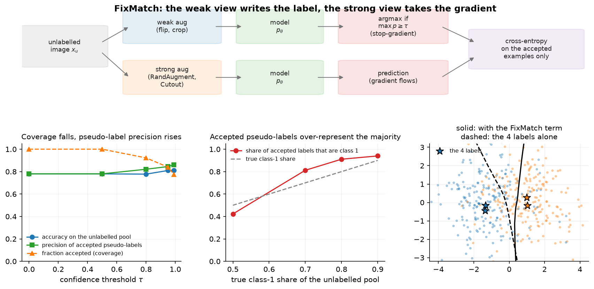

# Semi-supervised learning

> **Why this matters at staff level.** The realistic version of almost every perception problem is a
> small labelled set beside a large unlabelled one, and semi-supervised methods are the cheapest way
> to use the second. Interviews probe whether you know the mechanisms (pseudo-labelling, consistency
> regularisation, entropy minimisation), whether you can name the failure modes (confirmation bias,
> pseudo-label class imbalance) before being prompted, and whether you can say when adding
> unlabelled data makes a model worse. Strong signal is treating the confidence threshold as a
> precision-coverage decision rather than a hyperparameter to grid-search.

## TL;DR, the interview card

* Pseudo-labelling: predict on unlabelled data, keep predictions above a confidence threshold
  $\tau$, train on them as hard labels. Gradients never flow into the target.
* Consistency regularisation: the model's output should be stable under perturbations of the input
  or the model. Pi-model perturbs the input twice, Mean Teacher uses an EMA of the weights as the
  target.
* FixMatch: pseudo-label from the *weakly* augmented view, train the *strongly* augmented view
  toward it, with a threshold mask. Its unlabelled loss divides by the full unlabelled batch size,
  so the term ramps up naturally as confidence grows.
* Entropy minimisation pushes unlabelled predictions toward one-hot. It is the soft version of
  pseudo-labelling, and it encodes the cluster assumption: decision boundaries belong in
  low-density regions.
* Noisy Student: teacher labels 300M unlabelled images, a larger student trains on labelled plus
  pseudo-labelled data with noise (dropout, stochastic depth, RandAugment), then becomes the
  teacher. Reported 88.4 percent ImageNet top-1 and large robustness gains.
* Failure modes: confirmation bias (the model reinforces its own errors), class imbalance in
  accepted pseudo-labels, and distribution shift between the labelled and unlabelled pools.
* It helps most when labels are scarce, the unlabelled pool matches the labelled distribution, and
  the model is already better than chance. It hurts when the unlabelled pool contains classes you
  do not model, or when the threshold admits systematic errors.

## 1. Intuition first

You have 4 labelled points and 400 unlabelled ones drawn from two overlapping clusters. A
supervised model fits a boundary through the 4 points, and with 4 points that boundary is mostly
arbitrary.

The unlabelled points carry information even without labels: they show where the data lives. If you
believe that the decision boundary should not cut through a dense region (the cluster assumption),
the unlabelled points constrain the boundary far more than 4 labels do.

Every method in this chapter is a way of writing that assumption as a loss.

* Entropy minimisation says: be confident on unlabelled points. Confidence in a dense region pushes
  the boundary out of it.
* Pseudo-labelling says: take your confident predictions as truth and train on them. This is
  entropy minimisation with a hard target and a threshold.
* Consistency regularisation says: your prediction on an unlabelled point should not change when I
  perturb the input. In a dense region the perturbed point is still in the region, so the model's
  output must be locally constant, which again pushes the boundary out.

{ width="900" }

The top row is the FixMatch pipeline. The bottom-right panel is the payoff on the toy problem: the
dashed boundary comes from the 4 labels alone, the solid one from adding the FixMatch term on the
unlabelled pool, and the solid boundary sits in the low-density gap between the clusters.

The other two panels are the parts that get missed. Raising the threshold from 0 to 0.99 cuts
coverage (the share of unlabelled examples contributing any gradient) from 100 percent to about 77
percent while raising pseudo-label precision. And as the unlabelled pool becomes imbalanced, the
accepted pseudo-labels are more imbalanced than the pool, because the model is more confident on the
majority class, so thresholding amplifies the skew.

## 2. The math

### 2.1 Pseudo-labelling and self-training

For an unlabelled example $x_u$, form the prediction $p_\theta(\cdot\mid x_u)$, take

$$
\hat y_u = \argmax_k p_\theta(k \mid x_u), \qquad m_u = \mathbf 1\big[\max_k p_\theta(k\mid x_u) \geq \tau\big],
$$

and add the masked cross-entropy to the supervised loss:

$$
\boxed{\;\mathcal L = \underbrace{\frac{1}{B}\sum_{i=1}^{B} \mathrm{CE}\big(p_\theta(\cdot\mid x_i),\, y_i\big)}_{\text{labelled}}
\;+\;\lambda_u\, \underbrace{\frac{1}{\sum_u m_u}\sum_{u} m_u\,\mathrm{CE}\big(p_\theta(\cdot\mid x_u),\, \hat y_u\big)}_{\text{unlabelled}}\;}
$$

The target $\hat y_u$ is detached. Differentiating through the target as well produces a term that
pushes the model to make its own argmax easier to hit, which degenerates.

The connection to entropy minimisation is direct. With $\tau = 0$ and a soft target instead of the
argmax, the unlabelled term becomes $\E_u[H(p_\theta(\cdot\mid x_u))]$, the average entropy of
predictions on unlabelled data. Hard pseudo-labelling is a sharpened version of that, and the
threshold is what keeps the sharpening from being applied where the model has no idea.

**Confirmation bias**, stated precisely: the target is produced by the same parameters being
updated, so an error that is confident is reinforced rather than corrected. Nothing in the objective
can discover the error, because no external signal contradicts it. Three things push back: the
threshold (accept fewer, cleaner labels), noise on the student (an error confidently made on a clean
input may not survive strong augmentation), and a separate teacher (an EMA or a previous-generation
model, so the target does not chase the student's current mistakes).

### 2.2 Consistency regularisation

Write the model as $f_\theta$ and let $\eta$ denote a perturbation of the input and $\theta'$ a
perturbation of the parameters. The consistency loss is

$$
\mathcal L_{\text{cons}} = \E_{x_u}\Big[ d\big(f_{\theta'}(x_u + \eta'),\; f_\theta(x_u + \eta)\big)\Big],
$$

with $d$ usually the squared difference of softmax outputs or a KL. The variants differ in where the
target comes from.

* **Pi-model**: two stochastic forward passes of the same network (different augmentation and
  dropout), penalise the difference. The target is noisy, since it comes from a single forward pass.
* **Temporal ensembling**: the target is an EMA over past epochs' predictions for each example.
  Lower-variance target, at the cost of storing a prediction per example and updating it once per
  epoch, which does not scale to large datasets.
* **Mean Teacher**: the target comes from a network whose weights are an EMA of the student's,
  $\theta_{\text{teacher}} \leftarrow \alpha\theta_{\text{teacher}} + (1-\alpha)\theta_{\text{student}}$.
  The averaged weights give a better target than any single checkpoint, and it updates every step
  instead of every epoch. This is the same EMA-target structure as BYOL in
  [chapter 1](01-self-supervised-learning.md), used for a different purpose.

The choice of $d$ matters. Squared error on softmax outputs is bounded and treats all classes
symmetrically; a KL from the teacher is unbounded and can dominate the loss when the teacher is
confident and wrong. Most implementations use MSE for the unlabelled term and cross-entropy for the
labelled term for exactly this reason.

### 2.3 MixMatch and FixMatch

MixMatch combines several ideas: augment each unlabelled example $K$ times, average the predictions,
sharpen the average with a temperature, then MixUp the labelled and unlabelled batches together and
train with cross-entropy on the labelled part and squared error on the unlabelled part.

FixMatch strips that back to two ideas and gets comparable or better results. For each unlabelled
example, produce a weak augmentation (flip and shift) and a strong one (RandAugment or CTAugment
plus Cutout):

$$
q_u = p_\theta\big(\cdot \mid \alpha_{\text{weak}}(x_u)\big), \qquad
\hat y_u = \argmax q_u, \qquad m_u = \mathbf 1[\max q_u \geq \tau],
$$

$$
\boxed{\;\mathcal L_u = \frac{1}{\mu B}\sum_{u=1}^{\mu B} m_u\,\mathrm{CE}\big(p_\theta(\cdot\mid \alpha_{\text{strong}}(x_u)),\ \hat y_u\big)\;}
$$

with $\tau = 0.95$ and $\lambda_u = 1$ in the paper, and $\mu$ the ratio of unlabelled to labelled
batch size (7 in many of their experiments).

Two design decisions carry the method.

**Weak for the target, strong for the gradient.** The weak view gives the most reliable prediction
available, so it is the best label source. The strong view makes the prediction task hard, so
matching it teaches something. Reversing them produces targets from a heavily distorted input, which
is noise.

**The normaliser is $\mu B$, not $\sum_u m_u$.** The unlabelled loss is divided by the full
unlabelled batch size, so early in training, when few examples clear the threshold, the term is
small automatically, and it grows as the model becomes confident. That removes the need for the
ramp-up schedule on $\lambda_u$ that earlier methods required.
`test_fixmatch_divides_by_the_full_unlabeled_batch_not_the_accepted_count` pins this down: with one
confident example out of two, the loss is $\tfrac12 \mathrm{CE}$, not $\mathrm{CE}$.

### 2.4 The threshold is a precision-coverage decision

For a fixed model, raising $\tau$ raises the precision of accepted pseudo-labels and lowers
coverage. The quantity that matters is neither alone: it is the total amount of correct gradient
signal minus the damage done by incorrect signal. That optimum depends on how wrong the wrong labels
are. A label that is wrong but plausible (two visually similar classes) does less damage than one
that is wrong and confident for a systematic reason (a spurious cue).

Practical guidance that survives contact with real data:

* Measure precision at your threshold on a held-out labelled set before trusting it. This takes one
  evaluation pass and converts a hyperparameter into a measurement.
* Watch the class histogram of accepted labels. A model confident on the majority class accepts more
  of it, which is visible in the middle panel of the figure: at a true 90 percent majority share,
  the accepted share is higher still.
* Consider a per-class threshold, or a threshold on the margin between the top two classes rather
  than on the top probability, which is better behaved under class imbalance.
* If the model is calibrated ([Part XIII](../part13-retrieval-eval-reliability/03-uncertainty-reliability.md)),
  $\tau$ has a direct interpretation as expected precision. If it is not, $\tau$ means little, which
  is an argument for temperature scaling before thresholding.

### 2.5 Noisy Student: self-training at scale

Noisy Student is iterative self-training with three changes that matter.

1. Train a teacher on labelled data (ImageNet).
2. Use it to label a much larger unlabelled set (300M images), with soft or hard labels.
3. Train a **larger** student on labelled plus pseudo-labelled data, **with noise**: RandAugment on
   the input, dropout and stochastic depth in the model.
4. Make the student the new teacher and repeat.

The noise is the mechanism. A student trained without noise learns to mimic the teacher, and
mimicking a teacher cannot exceed it. A noisy student must produce the teacher's answer under
harder conditions, which forces a more robust function. The larger student gives capacity to exceed
the teacher rather than match it.

The reported results: 88.4 percent ImageNet top-1, 2.0 points above the previous best, which had
used 3.5B weakly-labelled Instagram images, plus large robustness improvements (ImageNet-A top-1
from 61.0 to 83.7, ImageNet-C mean corruption error from 45.7 to 28.3). The robustness gain is the
part to quote, because it is bigger than the accuracy gain and it is what a perception team cares
about.

### 2.6 When semi-supervised learning hurts

Three conditions to state before proposing it.

* **Distribution mismatch.** If the unlabelled pool contains classes absent from the labelled set,
  or a different mix, pseudo-labels force those examples into the classes you do model, and the
  model degrades. This is common in practice: the unlabelled pool is production traffic and the
  labelled set is a curated sample.
* **A model below a usable accuracy.** Self-training amplifies what the model already believes. At
  low accuracy that is mostly errors. A rough rule: the model should be well above chance and the
  accepted-label precision should be far above the current model accuracy before the term helps.
* **Class imbalance.** Thresholding is biased toward the majority class, so the imbalance grows with
  each round. Per-class thresholds, class-balanced sampling of accepted labels, or distribution
  alignment (rescaling predictions so accepted labels match a target prior) are the fixes.

The comparison against self-supervised pretraining is worth having ready. SSL makes better features
from unlabelled data without ever guessing a label. Semi-supervised methods make guesses about
labels. When both are available, pretraining first and then applying a semi-supervised objective is
usually better than either alone, and Noisy Student is evidence that self-training still adds value
on top of a strong supervised model.

## 3. Implementation

Pseudo-labelling is a mask and a cross-entropy:

```python
def confident_pseudo_labels(logits_u: torch.Tensor, threshold: float):
    """Hard pseudo-labels and a confidence mask."""
    probs = F.softmax(logits_u.detach(), dim=1)                   # (B_u, K)  targets carry no gradient
    conf, pseudo = probs.max(dim=1)                               # (B_u,), (B_u,)
    mask = (conf >= threshold).float()                            # (B_u,)
    return pseudo, mask


def pseudo_label_loss(logits_u: torch.Tensor, threshold: float):
    """Masked cross-entropy of the unlabelled batch against its own confident argmax."""
    pseudo, mask = confident_pseudo_labels(logits_u, threshold)   # (B_u,), (B_u,)
    ce = F.cross_entropy(logits_u, pseudo, reduction="none")      # (B_u,)
    loss = (ce * mask).sum() / mask.sum().clamp(min=1.0)
    return loss, mask.mean()
```

The `.detach()` inside `confident_pseudo_labels` is the line that makes this self-training rather
than a degenerate objective. `reduction="none"` then a masked mean is the standard pattern for any
per-example weighting; using `reduction="mean"` and multiplying afterwards silently averages over
the rejected examples too. The `clamp(min=1.0)` avoids a division by zero in the early steps when
nothing clears the threshold, which is a real crash in naive implementations.

Returning the accepted fraction alongside the loss is not decoration. That number is the first thing
to log: if it stays at zero the unlabelled term is doing nothing, and if it jumps to 1.0 immediately
the threshold is too low or the model is overconfident.

FixMatch is the same shape with two views and a different normaliser:

```python
def fixmatch_unlabeled_loss(logits_weak, logits_strong, threshold):
    """Consistency loss between weak-view pseudo-labels and strong-view predictions."""
    probs_weak = F.softmax(logits_weak.detach(), dim=1)           # (B_u, K)
    conf, pseudo = probs_weak.max(dim=1)                          # (B_u,), (B_u,)
    mask = (conf >= threshold).float()                            # (B_u,)
    ce = F.cross_entropy(logits_strong, pseudo, reduction="none")  # (B_u,)
    loss = (ce * mask).mean()                                     # FixMatch divides by B_u (μB in the paper)
    return loss, mask.mean()
```

The difference from `pseudo_label_loss` is one character of intent: `.mean()` over the full batch
instead of a sum divided by the accepted count. That is the automatic ramp-up described in 2.3.
`logits_weak` is detached and `logits_strong` is not, so the gradient flows only through the strong
view, which the test checks by asserting `logits_weak.grad is None` after a backward pass.

```python
def mean_teacher_consistency(logits_student, logits_teacher):
    """Mean Teacher / Π-model consistency: MSE between softmax outputs (teacher detached)."""
    p_s = F.softmax(logits_student, dim=1)                        # (B, K)
    p_t = F.softmax(logits_teacher.detach(), dim=1)               # (B, K)
    return ((p_s - p_t) ** 2).sum(dim=1).mean()
```

MSE on probabilities rather than KL on logits: bounded above by 2 for any pair of distributions, so
a confidently wrong teacher cannot dominate the gradient. Use `ema_update` from
`mlbook.ssl.byol` to maintain the teacher weights, which is the same function BYOL uses.

```python
def entropy_minimization_loss(logits_u: torch.Tensor) -> torch.Tensor:
    """``mean_u H(p_θ(·|x_u))`` — pushes predictions on unlabelled data toward one-hot."""
    log_p = F.log_softmax(logits_u, dim=1)                        # (B_u, K)
    return -(log_p.exp() * log_p).sum(dim=1).mean()
```

Computing `log_softmax` and exponentiating it, rather than computing `softmax` and taking its log,
keeps the whole thing numerically stable. The bounds are worth knowing for tests: $\log K$ for a
uniform prediction, 0 for a one-hot one.

**How you would test it.** Pin the analytic cases: a threshold that admits exactly one of three
examples, the FixMatch normaliser giving $\tfrac12\mathrm{CE}$ with one of two accepted, entropy of a
uniform prediction equal to $\log K$, Mean Teacher consistency equal to 2 for opposite one-hot
distributions. Check the gradient routing: pseudo-labels carry no gradient, the weak branch has no
gradient, the strong branch does. Then one end-to-end test on two overlapping clusters with two
labels, asserting that FixMatch beats supervised-only accuracy, which is the claim the method makes.

## Retype by hand

| Symbol | File | Time | Checked by |
|---|---|---|---|
| `confident_pseudo_labels` | `src/mlbook/ssl/pseudo_label.py` | 3 min | `test_confident_pseudo_labels_threshold_and_argmax`, `test_pseudo_labels_carry_no_gradient_into_the_target` |
| `pseudo_label_loss` | `src/mlbook/ssl/pseudo_label.py` | 5 min | `test_pseudo_label_loss_is_averaged_over_accepted_examples_only`, `test_pseudo_label_loss_is_zero_when_nothing_passes_the_threshold` |
| `fixmatch_unlabeled_loss` | `src/mlbook/ssl/fixmatch.py` | 6 min | `test_fixmatch_uses_weak_view_for_targets_and_strong_view_for_gradients`, `test_fixmatch_divides_by_the_full_unlabeled_batch_not_the_accepted_count` |
| `entropy_minimization_loss` | `src/mlbook/ssl/pseudo_label.py` | 3 min | `test_entropy_minimization_loss_endpoints` |
| `mean_teacher_consistency` | `src/mlbook/ssl/fixmatch.py` | 3 min | `test_mean_teacher_consistency_endpoints` |

Target: pseudo-labelling plus FixMatch in 12 minutes. These are short functions whose value is in
the details (detach, mask, normaliser), so type them until those details are automatic.

Read but do not retype: `semi_supervised_loss` and `fixmatch_loss` (they add the two terms),
`weak_augment` and `strong_augment` (stand-ins for RandAugment on real data),
`class_balance_of_pseudo_labels` (one `bincount`, but log it in every run).

```bash
python -m pytest tests/test_ssl_semisupervised.py -q
python -m pytest tests/test_ssl_semisupervised.py -q -k "fixmatch"
```

## 4. Systems view: cost, failure modes, trade-offs

**Cost.** FixMatch-style training does $1 + 2\mu$ forward passes per labelled example, where $\mu$
is the unlabelled-to-labelled ratio (the weak and strong views of each unlabelled example). At
$\mu = 7$ that is 15 forward passes per labelled example instead of 1, so a step costs roughly an
order of magnitude more than supervised training on the labelled set alone. Given that the labelled
set is small by assumption, the wall-clock cost is usually acceptable, and the comparison that
matters is against the cost of buying more labels.

Noisy-Student-style self-training has a different cost shape: an offline inference pass over the
unlabelled pool (embarrassingly parallel, no gradients, can run on cheap hardware) plus a full
training run per generation. The offline pass is a batch job you can schedule; the training run is
the expensive part.

**When to use what.**

| Situation | Choice | Why |
|---|---|---|
| Small labelled set, large in-domain unlabelled pool, single training run | FixMatch or a Mean Teacher variant | Strongest results per unit of engineering |
| Very large unlabelled pool, multiple training generations affordable | Noisy Student self-training | Offline labelling parallelises, noise plus a larger student exceeds the teacher |
| Unlabelled pool shifted from the labelled set | Neither, until you fix the mismatch | Pseudo-labels force out-of-distribution examples into known classes |
| You also have a pretrained SSL backbone | Pretrain first, then apply the semi-supervised term | The two are complementary, and pretraining lowers the confirmation-bias risk |
| Detection or segmentation, not classification | Teacher-student with pseudo-boxes and NMS-based filtering | The threshold applies per box and needs its own score calibration |
| Extreme class imbalance | Per-class thresholds or distribution alignment | A global threshold amplifies the majority |

**What to log, every run.** The accepted fraction over time, the class histogram of accepted
pseudo-labels against the labelled prior, pseudo-label precision measured on a held-out labelled
slice, and the supervised-only baseline trained on the same labelled set. Without that baseline you
cannot tell whether the unlabelled term helped, and it frequently does not.

**Failure modes.** Confirmation bias, visible as accepted-label precision falling over training
while the accepted fraction rises. Class collapse, visible in the histogram. A threshold that admits
nothing, visible as an unlabelled loss pinned at zero. Silent distribution mismatch, visible as
training accuracy improving while held-out accuracy degrades. And the calibration trap: a model that
is overconfident makes $\tau = 0.95$ meaningless, so calibrate before thresholding.

## 5. In production

!!! production "Google: FixMatch, the method that simplified the field"
    FixMatch combines consistency regularisation and pseudo-labelling with one rule: pseudo-label
    from the weakly augmented view, train on the strongly augmented one, keep only predictions above
    a threshold. The paper reports 94.93 percent on CIFAR-10 with 250 labels and 88.61 percent with
    40 labels, which is 4 labels per class, and its ablations show the weak/strong asymmetry and the
    threshold are what matter.
    [FixMatch, arXiv:2001.07685](https://arxiv.org/abs/2001.07685),
    [MixMatch, arXiv:1905.02249](https://arxiv.org/abs/1905.02249)

!!! production "Google: Noisy Student"
    A teacher EfficientNet labels 300M unlabelled images, then a larger student trains on labelled
    plus pseudo-labelled data with RandAugment, dropout and stochastic depth, and the process
    iterates. Reported results: 88.4 percent ImageNet top-1, 2.0 points above a model trained with
    3.5B weakly-labelled Instagram images, ImageNet-A top-1 from 61.0 to 83.7, and ImageNet-C mean
    corruption error from 45.7 to 28.3. The robustness improvements are larger than the accuracy
    improvement, which is the part to quote in a perception interview.
    [Self-training with Noisy Student improves ImageNet classification, arXiv:1911.04252](https://arxiv.org/abs/1911.04252)

!!! production "Mean Teacher: averaging weights, not predictions"
    Temporal ensembling averaged each example's predictions across epochs, which needs a stored
    prediction per example and one update per epoch. Mean Teacher averages the weights instead,
    giving a target that updates every step and scales to large datasets. Reported 4.35 percent
    error on SVHN with 250 labels, beating temporal ensembling trained with 1000.
    [Mean teachers are better role models, arXiv:1703.01780](https://arxiv.org/abs/1703.01780)

!!! production "Where this shows up in an AV or OCR stack"
    The teacher-student pattern is the online half of the data engine in
    [chapter 3](03-weak-supervision-and-auto-labeling.md): an offline model or an ensemble produces
    targets, the online model trains to match them under the constraints of the deployed system
    (single frame, latency budget, quantised weights). The framing is the same as self-training,
    with the teacher chosen for accuracy instead of being a copy of the student, which is precisely
    the change that limits confirmation bias.

## 6. Interview questions and strong answers

!!! interview "How does FixMatch differ from plain pseudo-labelling, and why does that matter?"
    Two changes. The target comes from a weakly augmented view while the gradient flows through a
    strongly augmented view, so the label is as reliable as the model can make it while the learning
    signal is hard. And the unlabelled loss is divided by the full unlabelled batch size rather
    than the accepted count, so the term is naturally small when few examples pass the threshold and
    grows as the model becomes confident, which removes the ramp-up schedule earlier methods needed.
    The result is a method with essentially two hyperparameters (the threshold and the unlabelled
    weight) that reaches strong results with 4 labels per class on CIFAR-10.

!!! interview "What is confirmation bias here and how do you fight it?"
    The pseudo-label comes from the same model being updated, so a confident error is trained on and
    reinforced, and nothing in the objective can contradict it. Three defences. Raise the threshold,
    which buys precision at the cost of coverage. Add noise to the student (strong augmentation,
    dropout, stochastic depth) so an error made on a clean input does not survive a hard one.
    Decouple the teacher: an EMA of the weights (Mean Teacher), a previous generation (Noisy
    Student), or a larger offline model. Then measure it: track pseudo-label precision on a held-out
    labelled slice over training. Precision falling while coverage rises is confirmation bias in
    progress.

!!! interview "You add 10M unlabelled images and accuracy drops. What happened?"
    Most likely the unlabelled pool does not match the labelled distribution. If it contains classes
    you do not model, every one of those images gets forced into a class you do, and the model
    learns to accept out-of-distribution inputs as confident in-distribution predictions. Check by
    looking at the class histogram of accepted pseudo-labels against your labelled prior, and by
    measuring accepted-label precision on a labelled sample drawn from the unlabelled pool, not from
    your original labelled set. Second candidate: class imbalance in the pool amplified by the
    threshold. Third: your model was not accurate enough for self-training to be net positive.
    Fixes: an out-of-distribution filter before pseudo-labelling, per-class thresholds, or
    distribution alignment.

!!! interview "Semi-supervised learning or self-supervised pretraining, if you can only do one?"
    Pretraining, in most cases. SSL extracts value from unlabelled data without guessing labels, so
    it has no confirmation-bias failure mode, and its benefit is reusable across every downstream
    task rather than tied to one label set. Semi-supervised methods are the better choice when you
    already have a strong backbone, when the unlabelled pool is exactly your deployment
    distribution, and when the task-specific gain is what you need now. In a real project I would do
    both in this order: pretrain or continue pretraining on the unlabelled data, fine-tune on
    labels, then add a FixMatch term on the same unlabelled pool and measure whether it beats the
    fine-tuned baseline.

!!! interview "How do you set the confidence threshold?"
    Not by grid search on validation accuracy alone. Measure the precision of accepted pseudo-labels
    at several thresholds using a held-out labelled set, which turns the choice into a
    precision-coverage curve you can reason about, and pick the point where precision is comfortably
    above your current model accuracy while coverage is still meaningful. Check calibration first,
    because on an overconfident model 0.95 does not mean 95 percent precision. Watch the class
    histogram of accepted labels, and switch to per-class thresholds if it is skewed relative to the
    labelled prior. Then verify against the supervised-only baseline.

!!! interview "How would you apply this to detection rather than classification?"
    The structure carries over and the details change. The teacher produces boxes on the weakly
    augmented image, you filter by score and by NMS, then train the student on the strongly
    augmented image against those boxes. Three new problems. The score threshold now controls both
    precision and the number of boxes, and a missed box becomes a false negative that is trained on
    as background, which is worse than a wrong class label. Box coordinates need consistency under
    geometric augmentation, so strong augmentations must be invertible or restricted to
    photometric ones. And the classification and localisation qualities are not equally reliable, so
    many implementations use the teacher's boxes for localisation and treat classification
    separately.

## 7. Exercises

**★ 1. The normaliser.** Verify by hand that `fixmatch_unlabeled_loss` with one confident and one
unconfident example returns half the cross-entropy, and explain the design reason.

??? success "Solution"
    `test_fixmatch_divides_by_the_full_unlabeled_batch_not_the_accepted_count` is the check. Dividing
    by the full batch makes the unlabelled term proportional to coverage, so the term is small when
    the model is unsure and grows as it becomes confident, which is a ramp-up schedule that needs no
    schedule.

**★ 2. Entropy bounds.** Show that `entropy_minimization_loss` equals $\log K$ for a uniform
prediction and approaches 0 for a peaked one, then explain the relationship to pseudo-labelling.

??? success "Solution"
    Uniform: $-\sum_k \frac1K \log\frac1K = \log K$. Peaked: one term at $-1\cdot\log 1 = 0$, the
    rest vanishing. Pseudo-labelling with a hard target is entropy minimisation with the target
    snapped to the argmax and a threshold gating which examples participate.

**★★ 3. Threshold sweep with precision measurement.** On the two-cluster problem, sweep $\tau$ and
plot accepted fraction, pseudo-label precision (using the hidden true labels) and final accuracy.

??? success "Solution"
    `figures/part10_fixmatch.py` produces this. Coverage falls monotonically and precision rises;
    accuracy is flat over a wide middle range, which is the useful finding. It means the threshold
    is not delicate on easy problems, and the precision-coverage curve is what tells you whether you
    are near an edge on a hard one.

**★★ 4. Induce confirmation bias.** Set $\tau = 0.5$ and give the labelled set a deliberately
unrepresentative sample (both labelled points from one side of each cluster). Track accepted-label
precision over training.

??? success "Solution"
    The initial boundary is wrong, low-threshold pseudo-labels lock the error in, and precision
    falls as coverage rises. Raising $\tau$ to 0.95 delays it; adding noise to the student (increase
    `strong_augment`'s sigma) reduces it further. This exercise is the fastest way to build the
    instinct that self-training amplifies whatever the model already believes.

**★★ 5. Class-imbalance amplification.** Reproduce the middle panel of the figure by varying the
majority share in the unlabelled pool, then implement per-class thresholds and show the accepted
distribution tracks the true one more closely.

??? success "Solution"
    A per-class threshold sets $\tau_k$ so that the accepted count per class is balanced, for example
    by taking the $q$-th percentile of confidences within each predicted class. The accepted
    histogram then tracks the pool's true distribution instead of exceeding it. This is the core of
    the distribution-alignment trick used in later semi-supervised methods.

**★★★ 6. Mean Teacher end to end.** Add an EMA teacher (reuse `ema_update` from
`mlbook.ssl.byol`), train with `mean_teacher_consistency` on the unlabelled pool, and compare
against FixMatch on the same data at the same compute.

??? success "Solution"
    Mean Teacher uses a soft target and no threshold, so every unlabelled example contributes,
    which is gentler early and less decisive later. On a clean toy problem the two end up close; on
    harder data FixMatch's hard targets plus strong augmentation usually win, which matches the
    published trend. The EMA decay is the sensitive hyperparameter: too fast and the target is the
    student (collapse toward self-confirmation), too slow and it is stale.

**★★★ 7. A Noisy Student generation.** Train a small model on 100 labels, pseudo-label 5000
unlabelled points, train a *larger* model on the union with stronger augmentation, and compare
against a same-size student and against a student trained without noise.

??? success "Solution"
    The larger, noisy student should beat the teacher; the same-size, noise-free student should
    approximately match it and not exceed it, because with no noise and no extra capacity the
    student's best strategy is to imitate. That contrast is the entire argument of the paper, and it
    reproduces on a toy problem.

## References

* Sohn et al., *FixMatch: Simplifying Semi-Supervised Learning with Consistency and Confidence*, NeurIPS 2020. [arXiv:2001.07685](https://arxiv.org/abs/2001.07685)
* Berthelot et al., *MixMatch: A Holistic Approach to Semi-Supervised Learning*, NeurIPS 2019. [arXiv:1905.02249](https://arxiv.org/abs/1905.02249)
* Tarvainen, Valpola, *Mean teachers are better role models*, NeurIPS 2017. [arXiv:1703.01780](https://arxiv.org/abs/1703.01780)
* Xie, Luong, Hovy, Le, *Self-training with Noisy Student improves ImageNet classification*, CVPR 2020. [arXiv:1911.04252](https://arxiv.org/abs/1911.04252)
* Lee, *Pseudo-Label: The Simple and Efficient Semi-Supervised Learning Method for Deep Neural Networks*, ICML Workshop on Challenges in Representation Learning, 2013. (Workshop paper, no arXiv identifier; search the title.)
* Grandvalet, Bengio, *Semi-supervised Learning by Entropy Minimization*, NeurIPS 2004. (Search the title; the proceedings version is the primary source.)
