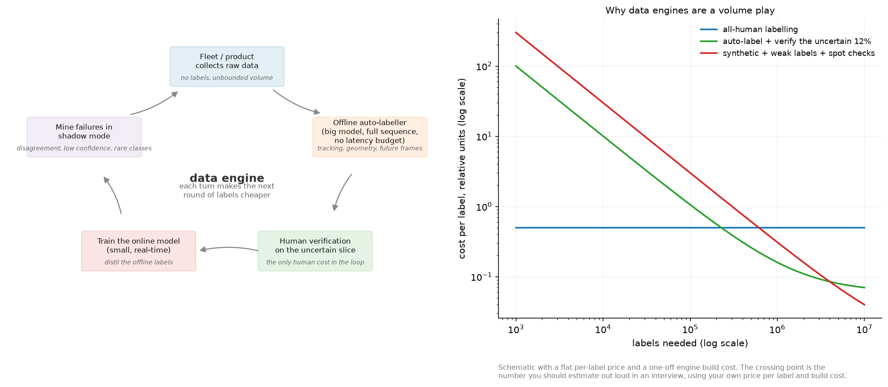

# Weak supervision and auto-labelling

> **Why this matters at staff level.** Labels are a budget line, and at staff level you own that
> line. This chapter is about manufacturing labels: from rules, from large offline models, from
> sensors and geometry, from other annotators, and from LLMs. The interview signal is whether you
> can estimate a cost per label, design a system that gets the label volume up without letting label
> noise destroy the model, and name what breaks. For anyone with OCR, detection or AV experience,
> this is the part of the book closest to what you already do, stated in a way that survives a
> design review.

## TL;DR, the interview card

* Weak supervision replaces hand labels with noisy sources: labelling functions, heuristics, distant
  supervision from a knowledge base, sensor or temporal consistency, a large offline model, or an
  LLM judge.
* Snorkel's contribution is the label model: given a label matrix $L \in \{-1, 0, \dots, K-1\}^{N\times M}$
  of $M$ labelling functions over $N$ examples, estimate each function's accuracy from their
  agreements and disagreements, with no ground truth, then emit probabilistic labels.
* Majority vote is the baseline. A generative label model beats it when the functions differ in
  accuracy, because it weights them.
* Train the end model on the *probabilistic* labels, not on the argmax, so the model sees the
  uncertainty and can generalise past the functions' coverage.
* Auto-labelling in AV and robotics: run big offline models with access to the whole sequence,
  future frames, multiple sensors and no latency budget, then distil into the online model. Waymo's
  3D Auto Labeling and Tesla's fleet auto-labelling are both this pattern.
* Data engines close the loop: model labels data, humans verify the uncertain slice, the model
  retrains, the improved model mines harder examples. SAM's engine built 1.1B masks this way.
* Active learning decides which examples a human should see: uncertainty (least confidence, margin,
  entropy), diversity (core-set), or both at once (BADGE).
* Measure label noise explicitly: gold-standard audits, inter-annotator agreement, and a held-out
  clean set that never touches the automated pipeline.

## 1. Intuition first

Suppose you need to detect handwritten dates in scanned forms and you have zero labelled boxes.
Several weak signals are available before any human looks at an image.

* A regular expression over OCR text, giving a region whenever it matches a date pattern.
* A layout rule: the box directly to the right of a field labelled "Date".
* A pretrained detector for text regions, thresholded high.
* Document metadata that says a date is present, without saying where.

None of these is a label. Each is right much more often than chance, each is wrong in its own way,
and they disagree. The insight behind data programming is that the disagreements are informative:
if two sources agree far more often than chance, both are probably accurate, and a source that
disagrees with everyone else is probably noisy. You can estimate accuracies from agreement patterns
without ever seeing a true label.

{ width="900" }

The left panel is the loop that these methods live inside. The right panel is why anybody builds
one: an automated pipeline has a high fixed cost and a low marginal cost, so it loses to human
labelling at low volume and wins past a crossover point. Estimating that crossover out loud, with
your own numbers, is what an interviewer is listening for.

## 2. The math

### 2.1 Labelling functions and the label matrix

A labelling function is a program $\lambda_j: \mathcal X \to \{-1, 0, \dots, K-1\}$, where $-1$ means
abstain. Running $M$ of them over $N$ unlabelled examples gives the label matrix $L$. Three
statistics describe it before any modelling:

* **Coverage** of function $j$: the fraction of examples where $\lambda_j \neq -1$.
* **Overlap**: the fraction where two functions both vote.
* **Conflict**: the fraction where they both vote and disagree.

The simplest combiner is majority vote, ignoring abstains and breaking ties uniformly. It is the
right baseline and it has a specific weakness: it weights a 55 percent-accurate function the same as
a 95 percent-accurate one, and if three weak functions are correlated they outvote one strong
independent one.

### 2.2 The generative label model

Model the unobserved true label $y$ and treat each function's vote as a noisy observation of it.
The conditional independence assumption (the core data-programming assumption) is that the votes are
independent given $y$:

$$
P(L_{i\cdot}, y_i) = P(y_i)\prod_{j=1}^{M} P(L_{ij}\mid y_i).
$$

Parameterise each function by an accuracy $a_j = P(\lambda_j = y \mid \lambda_j \neq -1)$, spreading
the remaining mass over the $K-1$ wrong classes, and let $\pi_k = P(y=k)$. The likelihood of the
observed matrix, with $y$ marginalised out, is

$$
P(L) = \prod_{i=1}^N \sum_{k=0}^{K-1}\pi_k \prod_{j:\,L_{ij}\neq -1} \Big[a_j\Big]^{\mathbf 1[L_{ij}=k]}\Big[\tfrac{1-a_j}{K-1}\Big]^{\mathbf 1[L_{ij}\neq k]} .
$$

Fit by expectation-maximisation, with $q_{ik} = P(y_i = k \mid L_{i\cdot})$ the responsibilities:

$$
\boxed{\;\text{E: } q_{ik} \propto \pi_k \prod_{j:\,L_{ij}\neq-1} P(L_{ij}\mid y=k),
\qquad
\text{M: } a_j = \frac{\sum_i \sum_k q_{ik}\mathbf 1[L_{ij}=k]}{\sum_i \mathbf 1[L_{ij}\neq -1]},\quad \pi_k = \frac1N\sum_i q_{ik}\;}
$$

This is the Dawid-Skene model for annotator agreement, with labelling functions in place of human
annotators. Snorkel's version handles correlated functions and scales the estimation differently,
and the structure is this.

Two properties to state in an interview. Accuracies are identifiable from agreements alone with
three or more conditionally independent functions, which is why the method needs no labels. And the
estimates are biased low for the best function when responsibilities are soft, because EM measures
agreement with $q$ rather than with $y$; the test asserts the ranking is recovered and that the magnitude
for the best function comes out below its true accuracy, which is the claim the method can support.

The assumption that fails in practice is conditional independence. Two labelling functions that
share a subroutine (both use the same OCR output, say) agree for reasons that have nothing to do
with $y$, and the model reads that agreement as accuracy. Detect it by inspecting the agreement
matrix for suspiciously high pairwise rates, and handle it by merging the functions, by modelling
the correlation explicitly, or by treating the pair as one source.

### 2.3 Why probabilistic labels beat hard labels

The label model emits $q_{ik}$, not a class. Train the end model with soft cross-entropy
$-\sum_k q_{ik}\log p_\theta(k\mid x_i)$. Two reasons.

The soft target carries the label model's uncertainty, so an example that three functions disagreed
about contributes a weaker gradient than one they all agreed on. Taking the argmax throws that away
and treats both as certain.

The end model generalises past the functions. The functions cover some fraction of examples and use
features you wrote down by hand; the model sees the raw input and learns features you did not. This
is the point of the two-stage design, and it is why "just use the labelling functions at inference"
is the wrong answer: the functions have limited coverage and no ability to generalise.

### 2.4 Learning with noisy labels

Once labels are manufactured, they are wrong some of the time, and a large network will memorise
that noise if you let it. Three families of defence, in the order to mention them.

* **Loss correction.** If you can estimate the class-conditional noise transition matrix
  $T_{ij} = P(\tilde y = j \mid y = i)$, then $p(\tilde y \mid x) = T^\top p(y \mid x)$, so training
  with the corrected forward model recovers the clean posterior. Estimate $T$ from a small clean set
  or from the model's own confident predictions.
* **Robust losses.** Mean absolute error is robust to symmetric noise and trains slowly;
  generalised cross-entropy interpolates between MAE and cross-entropy. Label smoothing helps
  mildly. Symmetric cross-entropy adds a reverse term.
* **Sample selection.** Small-loss examples are more likely to be clean early in training, because
  networks fit clean structure before memorising noise. Co-teaching trains two networks and has each
  select the small-loss examples for the other, so the errors the two networks make do not compound
  the way they would in self-selection.

The practical version for a production pipeline is usually simpler: hold out a small, carefully
labelled clean set that never touches the automated pipeline, use it to measure noise rate and to
validate, and use confident-learning-style filtering (drop examples where the model and the weak
label disagree strongly) before a final training run.

### 2.5 Active learning: spending the human budget

Given a model and an unlabelled pool, which examples should a human look at next?

**Uncertainty sampling.** Score each unlabelled example and take the top $b$.

$$
\text{least confidence: } 1 - \max_k p_k,\qquad
\text{margin: } -(p_{(1)} - p_{(2)}),\qquad
\text{entropy: } -\sum_k p_k \log p_k .
$$

They disagree in a way worth knowing. Margin prefers a tight two-way race; entropy prefers mass
spread over many classes. For a $K$-way problem where you care about the top-1 decision, margin is
usually the better choice; `test_entropy_and_margin_disagree_on_a_classic_case` constructs the
example where they rank two points in opposite orders.

**Diversity sampling.** Uncertainty alone fails in batch mode: the top $b$ uncertain examples are
often near-duplicates of each other, so you pay for $b$ labels and learn one thing. The core-set
view picks points so that every unlabelled point is close to some labelled point, approximated by
$k$-center greedy: repeatedly take the point farthest from the current labelled set.

**Both at once.** BADGE computes, for each unlabelled example, the gradient of the loss with respect
to the last linear layer using the model's own argmax as a pseudo-label. For logits $Wh$ that
gradient is

$$
\boxed{\;g_x = (p - e_{\hat y})\otimes h \in \R^{K \times d}\;}
$$

Its magnitude is large when $p$ is far from one-hot (uncertainty) and its direction depends on $h$
(diversity), so running k-means++ seeding on these embeddings selects a batch that is both uncertain
and spread out, with no hyperparameter balancing the two.

What none of these handle: a class that the model has never seen, and so is confidently wrong about.
Uncertainty methods will not surface it. That gap is what the mining strategies in the next section
exist for.

### 2.6 The auto-labelling pattern

The asymmetry that makes this work: the model that produces labels does not have to be the model you
deploy. An offline labeller can

* run at 100 times the online model's cost,
* use the entire sequence including future frames,
* use sensors the production system may not have at inference,
* ensemble several models and several augmentations,
* and apply geometry, tracking and physical consistency across time.

Waymo's offboard pipeline is the clearest published example. It detects objects in each frame of a
LiDAR sequence, associates them across the whole sequence with multi-object tracking, and then
refines each object with an object-centric model that sees all points belonging to that track across
all frames. A parked car observed from 40 viewpoints produces a far better box than any single frame
allows, and that box becomes the training label for the online detector.

The generic recipe, with the failure mode at each step:

1. **Collect** raw sequences from the fleet or the product. Failure: sampling bias toward common
   conditions, so the interesting data is never collected. Fix with triggers that upload on
   disagreement, low confidence, or an operator intervention.
2. **Auto-label** with the offline stack. Failure: the offline model's systematic errors become the
   online model's systematic errors, and no amount of data fixes them.
3. **Verify** the uncertain slice with humans. Failure: verifying a random slice instead of the
   uncertain one, which wastes most of the budget.
4. **Train** the online model on the result. Failure: training on labels the online model cannot
   possibly produce (a box on an object visible only in a future frame), which teaches it to
   hallucinate.
5. **Mine** failures in shadow mode: run the new model alongside production, log disagreements with
   the offline labeller, and feed those back to step 1.

Step 4 has a subtlety worth raising unprompted: the offline labeller's extra information is both the
source of its quality and a trap. Labels that depend on information the online model cannot observe
create an unlearnable target. The rule is to auto-label with everything available and then filter
labels down to what is observable within the online model's input.

### 2.7 Synthetic data and bootstrapping, for an OCR or detection pipeline

For text and documents, synthetic data is unusually effective, because the generative process is
known: you have the text, the fonts and the layout, so you can render an image whose labels are
exact by construction. A pipeline that gets a document model to usable quality with a small human
budget:

1. **Render synthetic pages.** Text from a domain corpus, real fonts, realistic backgrounds, then
   degradations that match your capture path: JPEG artifacts, blur, skew, perspective, moire,
   printer and scanner noise, ink bleed. Labels are exact.
2. **Weak-label real data.** Run an existing OCR engine, apply layout rules, use any structured
   metadata (a form's known field set, a database record the document was generated from), and
   combine with a label model. Coverage is partial and the labels are noisy.
3. **Train on synthetic plus weak-labelled real**, with the synthetic share decreasing over time.
4. **Human-verify the slice the model is least sure about**, which on OCR means low character
   confidence, unusual layouts, and disagreement between the model and the weak labels. Verification
   (accept or fix) is several times cheaper per item than labelling from scratch, which is the main
   lever on cost per label.
5. **Measure on a clean held-out set** that was labelled by humans from scratch, double-annotated,
   and never touched by any automated step.

The domain gap is the risk. A model trained on synthetic renders learns the renderer's quirks, and
the gap shows up as high synthetic accuracy with poor real accuracy. Diagnose it by evaluating on
real data at every checkpoint, and close it by making degradations match the real capture path
rather than by making them more severe.

### 2.8 LLMs and VLMs as labellers

A large model can act as a labelling function: classify, extract fields, judge whether an answer is
correct, or caption an image for retrieval. Treat it as one noisy source, and the machinery above
applies unchanged.

What changes in practice. The model's errors are correlated with the model you are training if both
share a backbone or a pretraining corpus, which breaks the independence assumption in the label
model in a way that is hard to detect. Prompt sensitivity means the "labelling function" changes
when someone edits a prompt, so version prompts like code. Position and verbosity biases in
LLM-as-judge setups are documented and need controls (randomise option order, control for length).
And self-preference (a model rating its own outputs higher) makes an LLM a poor judge of its own
family. The RLAIF pattern in
[Part VII, reward models](../part07-post-training/02-reward-models.md) is this idea applied to
preferences rather than to labels.

## 3. Implementation

Majority vote first, because it is the baseline every label model must beat:

```python
def majority_vote(L: np.ndarray, n_classes: int) -> np.ndarray:
    """Per-example vote histogram over non-abstaining LFs, normalised to probabilities.

    Args:
        L: (N, M) ints in {−1, 0, …, K−1}.
    Returns:
        probs: (N, K); uniform for examples where every LF abstains.
    """
    N, M = L.shape
    counts = np.zeros((N, n_classes))                             # (N, K)
    for k in range(n_classes):
        counts[:, k] = (L == k).sum(axis=1)                       # (N,)
    total = counts.sum(axis=1, keepdims=True)                     # (N, 1)
    probs = np.where(total > 0, counts / np.maximum(total, 1), 1.0 / n_classes)  # (N, K)
    return probs
```

Returning a uniform distribution when everything abstains keeps the output a valid distribution and
makes the downstream soft cross-entropy contribute nothing, which is the correct behaviour for an
example nobody has an opinion about.

The EM fit is the whole label model:

```python
    def fit(self, L: np.ndarray) -> "NaiveLabelModel":
        """EM from a majority-vote initialisation.  L: (N, M)."""
        N, M = L.shape
        q = majority_vote(L, self.K)                              # (N, K) initial responsibilities
        for _ in range(self.n_iter):
            # ---- M-step -------------------------------------------------------------
            self.prior = q.mean(axis=0)                           # (K,)
            correct = np.zeros(M)                                 # (M,) expected # correct votes
            for k in range(self.K):
                correct += ((L == k) * q[:, k][:, None]).sum(axis=0)  # (M,)
            voted = (L != -1).sum(axis=0)                         # (M,)
            self.accuracy = (correct + self.smoothing) / (voted + 2.0 * self.smoothing)  # (M,) Laplace-smoothed
            self.accuracy = np.clip(self.accuracy, 1e-3, 1 - 1e-3)
            # ---- E-step -------------------------------------------------------------
            log_post = np.log(self.prior)[None, :] + self._log_likelihood_matrix(L)  # (N, K)
            log_post -= log_post.max(axis=1, keepdims=True)       # (N, K) stabilise
            q = np.exp(log_post)
            q /= q.sum(axis=1, keepdims=True)                     # (N, K)
        return self
```

Four implementation details that decide whether this works. Initialising from majority vote rather
than randomly avoids the symmetric local optimum where the model learns the label permutation
backwards (every accuracy below 0.5), which is the classic EM failure on this model. Laplace
smoothing keeps a function that always abstains from producing a division by zero. Clipping
accuracies away from 0 and 1 keeps the log-likelihood finite. And the E-step works in log space with
a max subtraction, because a product over 20 labelling functions underflows in float64 quickly.

```python
    def _log_likelihood_matrix(self, L: np.ndarray) -> np.ndarray:
        """log P(L_i· | y_i = k) for every i, k, summing over LFs.  Returns (N, K)."""
        acc = self.accuracy                                       # (M,)
        wrong = (1.0 - acc) / max(self.K - 1, 1)                  # (M,) mass spread over the K−1 wrong classes
        log_lik = np.zeros((N, self.K))                           # (N, K)
        for k in range(self.K):
            votes_k = (L == k)                                    # (N, M) LF j voted class k
            votes_other = (L != k) & (L != -1)                    # (N, M) LF j voted a different class
            log_lik[:, k] = votes_k @ np.log(acc) + votes_other @ np.log(wrong)  # (N,)
        return log_lik
```

Abstentions contribute nothing to the likelihood, which encodes the modelling choice that a function
abstaining tells you nothing about $y$. If abstention is informative in your setting (a rule that
fires only on one class), model the propensity separately.

Active learning, the two acquisition functions worth typing:

```python
def k_center_greedy(features: np.ndarray, labeled_idx: np.ndarray, budget: int) -> np.ndarray:
    """Core-set selection: repeatedly pick the point farthest from the current labelled set."""
    N = features.shape[0]
    if labeled_idx.size == 0:
        min_dist = np.full(N, np.inf)                             # (N,)
    else:
        diff = features[:, None, :] - features[labeled_idx][None, :, :]  # (N, n_l, d)
        min_dist = np.linalg.norm(diff, axis=2).min(axis=1)       # (N,) distance to nearest labelled
    chosen: list[int] = []
    for _ in range(budget):
        i = int(np.argmax(min_dist))
        chosen.append(i)
        d_new = np.linalg.norm(features - features[i][None, :], axis=1)  # (N,)
        min_dist = np.minimum(min_dist, d_new)                    # (N,)
    return np.array(chosen)
```

The running `min_dist` update is what makes this $O(bN)$ rather than $O(bNn_l)$: after choosing a
point, every other point's distance to the labelled set can only decrease, and only through the new
point. The $(N, n_l, d)$ tensor in the initialisation is the part to replace with a chunked
computation on a real pool.

```python
def badge_gradient_embeddings(probs: np.ndarray, features: np.ndarray) -> np.ndarray:
    """Gradient of the CE loss w.r.t. the last linear layer, using the argmax as pseudo-label."""
    N, K = probs.shape
    y_hat = probs.argmax(axis=1)                                  # (N,)
    one_hot = np.eye(K)[y_hat]                                    # (N, K)
    delta = probs - one_hot                                       # (N, K)
    g = delta[:, :, None] * features[:, None, :]                  # (N, K, d)
    return g.reshape(N, -1)                                       # (N, K·d)
```

The embedding is $K\cdot d$ dimensional, which for a 1000-class model with 2048-dimensional features
is 2M dimensions per example, so real implementations project it or use only the top-class block.
The test checks the outer-product form against an explicit computation, which is the part people get
wrong when they reimplement it.

**How you would test it.** Generate a label matrix from known accuracies and coverages, then assert
the recoverable properties: majority vote beats the worst function, the label model beats majority
vote by a measurable margin, the learned accuracies rank the functions correctly without seeing
labels, and a deliberately random function is assigned an accuracy near 0.5 without destroying the
estimate. For active learning, build data where the right answer is known (four separated clusters,
so core-set must pick one point from each) and assert it.

## Retype by hand

| Symbol | File | Time | Checked by |
|---|---|---|---|
| `majority_vote` | `src/mlbook/ssl/label_model.py` | 5 min | `test_majority_vote_basic_cases`, `test_majority_vote_recovers_labels_better_than_the_worst_lf` |
| `NaiveLabelModel.fit` (E and M steps) | `src/mlbook/ssl/label_model.py` | 15 min | `test_label_model_beats_majority_vote_by_learning_lf_accuracies`, `test_label_model_downweights_a_random_labeling_function` |
| `least_confidence`, `margin_uncertainty`, `entropy_uncertainty` | `src/mlbook/ssl/active_learning.py` | 4 min | `test_uncertainty_scores_rank_a_known_ordering`, `test_entropy_and_margin_disagree_on_a_classic_case` |
| `k_center_greedy` | `src/mlbook/ssl/active_learning.py` | 8 min | `test_k_center_greedy_covers_separate_clusters` |
| `badge_gradient_embeddings` | `src/mlbook/ssl/active_learning.py` | 5 min | `test_badge_gradient_embedding_norm_grows_with_uncertainty` |

Target: majority vote plus the three uncertainty scores in 10 minutes, `k_center_greedy` in 8. The
EM loop is worth typing once for the log-space E-step and the majority-vote initialisation.

Read but do not retype: `NaiveLabelModel._log_likelihood_matrix` (know that abstentions drop out),
`lf_agreement_matrix` and `lf_coverage` (diagnostics you should always compute),
`kmeans_plus_plus_seeding` and `badge_select` (know that BADGE is k-means++ on gradient embeddings).

```bash
python -m pytest tests/test_ssl_weak_supervision.py tests/test_ssl_active_learning.py -q
python -m pytest tests/test_ssl_weak_supervision.py -q -k "label_model"
```

## 4. Systems view: cost, failure modes, trade-offs

### Cost per label, the arithmetic to do out loud

Let $c_h$ be the fully-loaded cost of one human label (vendor price plus your review time plus tool
amortisation), $c_v$ the cost of verifying a machine label (accept or fix, typically 3 to 10 times
cheaper than labelling from scratch), $f$ the fraction you send to verification, and $C$ the
one-time cost of building the automated pipeline, expressed in the same units. For $N$ labels:

$$
\text{all-human} = N c_h, \qquad \text{auto-label} = C + N f c_v .
$$

The crossover is at $N^* = C / (c_h - f c_v)$. With a pipeline that costs the equivalent of 100,000
human labels to build, verification at one fifth the price, and 20 percent of items verified, the
crossover is around 110,000 labels. Below that, buy labels. Above it, build the engine. The numbers
are yours to supply; the structure of the argument is what transfers.

Two second-order effects that change the answer. The engine improves the model, which lowers $f$
over time, so the slope keeps falling. And human labels have a quality ceiling: on ambiguous tasks
inter-annotator agreement can sit in the 70 to 90 percent range, so buying more of them past a point
adds noise instead of signal.

### When to use what

| Situation | Choice | Why |
|---|---|---|
| No labels, rules exist, text or tabular | Labelling functions plus a label model | Encoding domain knowledge as code is faster than labelling |
| No labels, images, generic objects | A pretrained model as the labeller, then verify | Zero-shot detectors and VLMs cover common categories |
| Sequential sensor data (AV, robotics) | Offline auto-labelling with tracking and geometry | Future frames and full sequences are free offline and unavailable online |
| Large unlabelled pool, small human budget | Active learning on top of whichever labeller you have | Spends the budget where it changes the model |
| Known generative process (documents, text rendering) | Synthetic data first, then weak labels on real data | Exact labels by construction, and cheap volume |
| Labels exist but are noisy | Loss correction or confident-learning filtering, plus a clean audit set | Measure the noise before fighting it |
| Subjective task (moderation, preference) | Multiple annotators plus a Dawid-Skene model | There is no single truth, so model annotator disagreement |

### Measuring label noise

You cannot manage noise you do not measure. Four instruments, in order of cost:

* A **gold set**: a few thousand examples labelled from scratch by your best annotators, double- or
  triple-annotated, adjudicated, and never used for training or touched by any automated pipeline.
  Every automated label source gets scored against it.
* **Inter-annotator agreement** on a sample (Cohen's or Fleiss' kappa for categories, IoU
  distributions for boxes), which is an upper bound on how well any model can score.
* **Disagreement mining**: examples where the model and the weak label conflict. This set is
  enriched in both label errors and model errors, and reading 100 of them is the highest-information
  hour available to you.
* **Audits over time**: sample newly produced labels weekly and score them, because auto-label
  quality drifts as the data and the model change.

### Failure modes

* **The engine teaches the model its own mistakes.** Auto-labels come from a model, so its
  systematic errors become the training target and get baked in. Break the loop with human
  verification of the uncertain slice, with a clean evaluation set that never touches the pipeline,
  and by making the offline labeller different in kind (bigger, multi-sensor, temporal) rather than
  a copy of the online one.
* **Correlated labelling functions.** The label model reads shared-source agreement as accuracy.
  Inspect the agreement matrix and merge or model the correlated pair.
* **Verification that rubber-stamps.** If the tool defaults to accept and the annotator is paid per
  item, verification measures nothing. Inject known-bad items and measure catch rate.
* **Drift between the labelling model and production.** The offline labeller is upgraded, labels
  change distribution, and the online model regresses in a way that looks like a training bug.
  Version the labeller and record which version produced every label.
* **Evaluation contamination.** Auto-labelled data leaking into the evaluation set makes every
  number agree with the labeller instead of with reality.

## 5. In production

!!! production "Stanford and Snorkel: data programming and the label model"
    Data programming introduced writing labelling functions as programs and modelling their outputs
    with a generative model whose parameters can be recovered without ground truth. Snorkel is the
    system built on it, reporting that users can train models without hand-labelling by writing
    functions that express heuristics with unknown accuracies and correlations, denoised by the
    label model.
    [Data Programming, arXiv:1605.07723](https://arxiv.org/abs/1605.07723),
    [Snorkel: Rapid Training Data Creation with Weak Supervision, arXiv:1711.10160](https://arxiv.org/abs/1711.10160),
    [Stanford AI Lab blog on weak supervision](https://ai.stanford.edu/blog/weak-supervision/),
    [Snorkel AI on applying weak supervision research](https://snorkel.ai/blog/applying-weak-supervision-research/)

!!! production "Waymo: offboard 3D auto labelling"
    Waymo's offboard pipeline, published as 3D Auto Labeling, detects objects in each frame of a
    LiDAR sequence, links them with multi-object tracking, and refines each track with an
    object-centric model that sees all points of that object across the sequence. The paper reports
    large gains over onboard detectors and over offboard baselines on the Waymo Open Dataset, and
    positions the output as training data for onboard models. The later MoDAR work extends the idea
    by using motion forecasting to propagate information across frames.
    [Offboard 3D Object Detection from Point Cloud Sequences, arXiv:2103.05073](https://arxiv.org/abs/2103.05073),
    [MoDAR, arXiv:2306.03206](https://arxiv.org/abs/2306.03206)

!!! production "Meta: the SAM data engine"
    Segment Anything was trained on SA-1B: 1.1B masks over 11M images, built by a data engine that
    alternates between using the current model to propose masks and using new annotations to improve
    the model. The engine ran in three stages, from annotator-assisted, through semi-automatic where
    the model proposed confident masks and annotators added the rest, to fully automatic. The
    lesson to take is that the final stage was possible only because the earlier stages made the
    model good enough.
    [Segment Anything, arXiv:2304.02643](https://arxiv.org/abs/2304.02643),
    [Meta AI blog](https://ai.meta.com/blog/segment-anything-foundation-model-image-segmentation/),
    [SA-1B dataset](https://ai.meta.com/datasets/segment-anything/)

!!! production "Tesla: auto-labelling from the fleet"
    Tesla's AI Day presentations describe an auto-labelling pipeline in which fleet clips are
    processed offline to produce labels that no human could produce at that volume, combining
    multi-camera reconstruction and temporal information across a clip, with humans correcting
    rather than creating labels. The presentations are the primary source and they are talks rather
    than papers, so treat specific numbers with care.
    [Tesla AI Day 2021 playlist](https://www.youtube.com/playlist?list=PLui171UFXwPiAJerrfT5FekjrYFzXhTCg),
    [Tesla AI Day 2022 playlist](https://www.youtube.com/playlist?list=PLGmeOS3SXui-5tWMaa1MQLs3IjhHXM8Ff),
    [Tesla AI](https://www.tesla.com/AI)

!!! production "Google: Noisy Student as a data engine with one source"
    Noisy Student is the simplest possible auto-labelling loop: one teacher, 300M unlabelled images,
    a noisy larger student, repeat. It is worth holding alongside the AV pipelines because it shows
    how much comes from the loop itself, with no sensors, no geometry and no human verification.
    [Self-training with Noisy Student, arXiv:1911.04252](https://arxiv.org/abs/1911.04252)

!!! production "Active learning: the two acquisition functions to know"
    The core-set formulation frames batch active learning as covering the unlabelled pool with
    labelled points and gives the $k$-center greedy algorithm. BADGE selects batches that are both
    uncertain and diverse by running k-means++ on gradient embeddings, with no hyperparameter
    trading the two off, and reports performing as well as or better than alternatives across
    settings.
    [Core-Set, arXiv:1708.00489](https://arxiv.org/abs/1708.00489),
    [BADGE, arXiv:1906.03671](https://arxiv.org/abs/1906.03671)

## 6. Interview questions and strong answers

!!! interview "Design an auto-labelling system for a camera fleet"
    Start with the asymmetry: the labeller runs offline with no latency budget, so it can be much
    larger than the online model, use the full clip including future frames, use all sensors, and
    ensemble. Pipeline: triggered upload from the fleet (on disagreement, low confidence, operator
    intervention, rare conditions) so the data is not just easy highway miles; offline detection plus
    tracking plus geometric and temporal consistency to produce labels; an uncertainty estimate per
    label; human verification of the uncertain slice, with a tool that defaults to reject rather
    than accept; training the online model on labels filtered to what it can observe from its own
    inputs; shadow-mode evaluation of the new model against the offline labeller to mine the next
    round. The things to name unprompted: a clean gold set that never touches the pipeline, labeller
    versioning recorded per label, and a measured cost per label at each stage.

    **Staff-level follow-up: how do you stop it teaching the model its own mistakes?** The offline
    labeller has to be different in kind, not just bigger: different information (future frames,
    extra sensors, geometry) means its errors are not the online model's errors. Then human
    verification on the uncertain slice, disagreement mining on the confident slice, and an
    evaluation set labelled from scratch by humans. If the loop's only teacher is the previous
    student, you are doing self-training, and you should treat it with the confirmation-bias
    machinery from [chapter 2](02-semi-supervised.md).

!!! interview "How does Snorkel estimate labelling-function accuracies without labels?"
    Through agreements. Model the votes as conditionally independent given the unobserved true
    label, with an accuracy parameter per function and a class prior. The observed agreement rate
    between two functions is a function of their accuracies, so with three or more functions the
    accuracies are identifiable, and EM recovers them: the E-step computes a posterior over the true
    label for each example, the M-step sets each accuracy to its expected agreement with that
    posterior. Then train the end model on the resulting probabilistic labels, not the argmax, so it
    inherits the uncertainty and can generalise beyond the functions' coverage.

    **Staff-level follow-up: when does that break?** Correlated functions. Two functions built on the
    same upstream signal agree for reasons unrelated to the label, and the model reads that as
    accuracy and overweights both. Detect it in the pairwise agreement matrix, then merge them,
    model the dependency, or drop one.

!!! interview "You have 1M unlabelled images and budget for 10,000 labels. How do you spend it?"
    Not at random, and not all at once. Label 1,000 at random first to get a baseline model and an
    unbiased estimate of class distribution and difficulty. Then run rounds: score the pool with
    an acquisition function that combines uncertainty and diversity (BADGE, or margin plus a
    core-set constraint), label 1,000 to 2,000, retrain, repeat. Reserve part of the budget, perhaps
    2,000, for a clean gold evaluation set that is double-annotated and never trained on, because
    without it none of the rest is measurable. And before spending anything, check whether weak
    labels or a pretrained model can cover the easy majority, since then the human budget goes
    entirely to the hard slice.

!!! interview "How do you measure label noise, and what do you do about it?"
    Measure with a gold set: a few thousand examples labelled from scratch, adjudicated between
    annotators, never touched by the pipeline. Score every label source against it to get a per-source
    noise rate, and compute inter-annotator agreement to know the ceiling. Then act. If noise is
    class-conditional and you can estimate the transition matrix, apply loss correction. If it is
    unstructured, use a robust loss or filter by disagreement between the model and the weak label.
    If the noise is concentrated in one source, fix or drop that source. And keep auditing, because
    auto-label quality drifts with the data and the labelling model.

!!! interview "What is your cost per label, and how would you halve it?"
    Compute it fully loaded: vendor price plus your team's review time plus tooling amortisation
    divided by accepted labels. Then the levers, in the order I would pull them. Convert creation
    into verification by pre-filling with a model, which is usually a 3x to 10x reduction per item.
    Reduce the verified fraction by sending only the uncertain slice. Reduce the number of labels
    needed by active learning, so each one is worth more. Use synthetic data where the generative
    process is known, which is free per unit after the renderer exists. And remove labels you do not
    need: ask what the model actually fails at, since a large fraction of labelling budgets is spent
    re-confirming things the model already gets right.

!!! interview "When would you use an LLM as a labeller, and what would you watch?"
    When the task is expressible in text or vision-language, the label space is moderate, and a
    human would be doing pattern matching rather than exercising specialist judgement. Treat it as
    one noisy labelling function among several, not as ground truth, and combine it with a label
    model. Watch four things. Correlation with the model you are training, which breaks
    independence and is hard to see. Prompt sensitivity, which means the labelling function changes
    silently when someone edits a prompt, so version prompts. Known judge biases (position,
    verbosity, self-preference) and the controls for them. And cost, since an LLM call per example
    over a large pool is not free and may exceed a cheap human pipeline.

## 7. Exercises

**★ 1. Coverage, overlap and conflict.** For the label matrix in
`test_lf_coverage_and_agreement`, compute coverage for each function and the pairwise agreement by
hand, then check against `lf_coverage` and `lf_agreement_matrix`.

??? success "Solution"
    Coverage counts non-abstentions per column divided by $N$. Agreement between $i$ and $j$ is
    computed only over rows where both vote, which is what makes it comparable across functions with
    different coverage. The diagonal is 1 by definition.

**★ 2. Majority vote failure case.** Construct a label matrix where majority vote is wrong on most
examples and the label model is right, then verify it.

??? success "Solution"
    Three correlated 60 percent-accurate functions and one 95 percent-accurate one. The three
    outvote the accurate one whenever they share an error, so majority vote follows them. The label
    model assigns the accurate function a much higher weight and follows it. Note the caveat: if the
    three are correlated, the naive model overestimates them too, which is why correlation detection
    matters.

**★★ 3. Break the independence assumption.** Duplicate one labelling function (an exact copy) in the
synthetic setup and observe what happens to the learned accuracies and to label quality.

??? success "Solution"
    The duplicated pair agrees perfectly, which the model reads as high accuracy for both, so their
    joint influence doubles. Accuracy of the resulting labels falls if the duplicated function is
    the weakest one. The fix in code is one line (deduplicate identical columns); the fix in a real
    system is to inspect the agreement matrix for near-1 off-diagonal entries.

**★★ 4. Active learning loop.** Build a 2-D two-moons problem with 2,000 unlabelled points, and
compare random sampling, margin sampling and BADGE over 10 rounds of 10 labels each, plotting
accuracy against labels used.

??? success "Solution"
    Random is the baseline that beginners omit and that frequently wins early, because uncertainty
    sampling on an untrained model selects noise. Margin overtakes it once the model is better than
    chance. BADGE is at least as good as margin and more robust at larger batch sizes, because the
    diversity term prevents the batch from collapsing onto one part of the boundary.

**★★ 5. Verification against creation.** Simulate a labelling budget: assume creating a label costs
5 units and verifying a machine label costs 1, with the machine correct 85 percent of the time and
verification catching 95 percent of errors. Compute the resulting label accuracy and cost for
budgets from 1,000 to 100,000 units, for both strategies.

??? success "Solution"
    Verification produces $5\times$ more labels per unit at an accuracy of
    $0.85 + 0.15\times0.95 = 0.9925$, against human labels at whatever your annotator accuracy is
    (often below 0.99 on hard tasks). The curve to plot is model accuracy against budget, which
    requires a label-count against accuracy curve for your task, and that is the missing measurement
    in most of these discussions.

**★★★ 6. A miniature auto-labelling loop.** Using the 2-D toy setup: train a weak model on 50
labels, use it to label 5,000 points, verify the 500 least confident with an oracle, retrain on the
union, and repeat for three rounds. Track model accuracy and label accuracy, and compare against
verifying 500 random points instead.

??? success "Solution"
    Verifying the uncertain slice improves label accuracy far more per verification than verifying
    random points, because random verification mostly confirms labels that were already right. The
    failure to watch for is that model accuracy can plateau while label accuracy keeps rising, which
    means the remaining errors are in a region the model cannot represent, and that is the point to
    change the model rather than buy more labels.

**★★★ 7. Noise-transition correction.** Take a clean toy classification problem, corrupt 30 percent
of labels with a known asymmetric transition matrix $T$, and compare: training on noisy labels,
training with forward correction $p(\tilde y\mid x) = T^\top p(y\mid x)$, and training on a filtered
subset where the model and the label agree.

??? success "Solution"
    The uncorrected model memorises the noise, visible as training accuracy exceeding the clean-label
    accuracy ceiling. Forward correction recovers most of the clean performance when $T$ is known
    exactly and degrades as the estimate of $T$ degrades. Filtering is the most robust to a bad $T$
    and throws away data, which is the trade. In production the estimate of $T$ comes from a small
    clean set, so measure how sensitive your result is to that estimate before relying on it.

## References

* Ratner, De Sa, Wu, Selsam, Ré, *Data Programming: Creating Large Training Sets, Quickly*, NeurIPS 2016. [arXiv:1605.07723](https://arxiv.org/abs/1605.07723)
* Ratner, Bach, Ehrenberg, Fries, Wu, Ré, *Snorkel: Rapid Training Data Creation with Weak Supervision*, VLDB 2018. [arXiv:1711.10160](https://arxiv.org/abs/1711.10160)
* Qi et al., *Offboard 3D Object Detection from Point Cloud Sequences* (3D Auto Labeling), CVPR 2021. [arXiv:2103.05073](https://arxiv.org/abs/2103.05073)
* Li et al., *MoDAR: Using Motion Forecasting for 3D Object Detection in Point Cloud Sequences*, CVPR 2023. [arXiv:2306.03206](https://arxiv.org/abs/2306.03206)
* Kirillov et al., *Segment Anything*, ICCV 2023. [arXiv:2304.02643](https://arxiv.org/abs/2304.02643)
* Xie, Luong, Hovy, Le, *Self-training with Noisy Student improves ImageNet classification*, CVPR 2020. [arXiv:1911.04252](https://arxiv.org/abs/1911.04252)
* Sener, Savarese, *Active Learning for Convolutional Neural Networks: A Core-Set Approach*, ICLR 2018. [arXiv:1708.00489](https://arxiv.org/abs/1708.00489)
* Ash, Zhang, Krishnamurthy, Langford, Agarwal, *Deep Batch Active Learning by Diverse, Uncertain Gradient Lower Bounds* (BADGE), ICLR 2020. [arXiv:1906.03671](https://arxiv.org/abs/1906.03671)
* Han et al., *Co-teaching: Robust Training of Deep Neural Networks with Extremely Noisy Labels*, NeurIPS 2018. [arXiv:1804.06872](https://arxiv.org/abs/1804.06872)
* Dawid, Skene, *Maximum Likelihood Estimation of Observer Error-Rates Using the EM Algorithm*, Applied Statistics, 1979. (The origin of the annotator model; search the title.)
