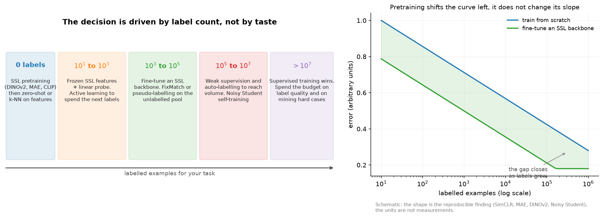

# Part X: Self-supervised, semi-supervised and weak supervision

Every chapter in this part answers one question: you have far more data than labels, so what do you
do. The three families differ in where the supervision comes from. Self-supervised learning invents
a task from the data itself. Semi-supervised learning uses a small labelled set to bootstrap
predictions on a large unlabelled one. Weak supervision manufactures noisy labels from rules,
models, sensors or other annotators, and then models the noise.

For a perception or OCR engineer this is the part that decides project economics. Labelling a
detection dataset costs real money per box; labelling a segmentation dataset costs more; labelling
video costs more again. Which of these three techniques you reach for is set almost entirely by how
many labels you have and how much unlabelled data sits next to them.

{ width="900" }

## The decision table

Read the row that matches your labelled count for the specific task you are shipping.

| Labelled examples | First choice | Second choice | What to avoid | Why |
|---|---|---|---|---|
| 0 | A pretrained SSL or vision-language backbone used zero-shot or with k-NN on frozen features | Cluster the features and hand-label cluster centroids | Training anything from scratch | DINOv2 and CLIP features transfer without any task labels |
| $10^1$ to $10^3$ | Frozen backbone plus a linear probe or a small head | Fine-tune the last block with heavy augmentation | Full fine-tuning | Too few labels to move a large backbone without overfitting |
| $10^3$ to $10^5$ | Fine-tune an SSL backbone, plus FixMatch-style semi-supervised training on the unlabelled pool | Pseudo-labelling with a high confidence threshold | Ignoring the unlabelled data | This is the regime where consistency methods show their largest gains |
| $10^5$ to $10^7$ | Weak supervision and auto-labelling to reach volume, then Noisy-Student-style self-training | Buy more human labels for the hard slice only | Paying for uniform human labelling | Cost per label dominates; automate the easy 80 percent |
| $> 10^7$ | Supervised training. Spend on label quality, on mining hard cases, and on the long tail | Self-training to exploit unlabelled data that is still larger | Adding more easy labels | The pretraining advantage shrinks as labels grow |

Two modifiers cut across the table. If your domain is far from web images (medical, satellite,
infrared, document scans at unusual resolutions), pretrained features transfer worse, which pushes
you one row up. And if unlabelled data in your exact domain is abundant and cheap (a camera fleet,
a document pipeline, a product's user traffic), continued self-supervised pretraining on that data
is usually the highest-return single project available.

| Chapter | The idea you must own | The code you must be able to write |
|---|---|---|
| [1. Self-supervised learning](01-self-supervised-learning.md) | NT-Xent and why batch size is a hyperparameter; why BYOL does not collapse; MAE's asymmetry and 75 percent masking; what DINOv2 changed. | `nt_xent_loss`, `info_nce_loss`, a BYOL step with EMA and stop-gradient, `random_masking` and a masked loss. |
| [2. Semi-supervised learning](02-semi-supervised.md) | Pseudo-labelling and its confirmation bias; consistency regularisation; FixMatch's weak/strong split; Noisy Student. | `confident_pseudo_labels`, `pseudo_label_loss`, `fixmatch_unlabeled_loss`, `mean_teacher_consistency`. |
| [3. Weak supervision and auto-labelling](03-weak-supervision-and-auto-labeling.md) | Labelling functions and a generative label model that estimates accuracies from agreements; the offline auto-labeller pattern; active learning; cost per label. | `majority_vote`, `NaiveLabelModel` (EM), `k_center_greedy`, `badge_select`. |

## Prerequisites

* [CLIP and contrastive learning](../part08-multimodal/03-clip-contrastive.md). InfoNCE is derived
  there; chapter 1 builds NT-Xent on top of it and does not repeat the mutual-information argument.
* [Vision Transformers](../part08-multimodal/01-vision-transformers.md) for patchification, which
  MAE's masking operates on.
* [Regularization](../part03-neural-nets/06-regularization.md) for augmentation as a prior, which is
  what every consistency method exploits.
* [Information theory](../part01-math/05-information-theory.md) for entropy minimisation and for
  reading the label model as an agreement-based estimator.
* [Probabilistic models and EM](../part02-classical/05-probabilistic-models-em.md). The Snorkel-style
  label model in chapter 3 is EM on a Dawid-Skene-shaped model.
* [Evaluation](../part13-retrieval-eval-reliability/02-evaluation.md) for linear probe against
  fine-tune protocols and for measuring label noise.

## If you have one day

1. Chapter 1, sections 2.1 to 2.4 (NT-Xent, MoCo's queue, why BYOL and SimSiam do not collapse),
   2 hours. Retype `nt_xent_loss` and the BYOL step.
2. Chapter 1, section 2.6 (MAE) and the DINOv2 case study, 1.5 hours. Retype `random_masking`.
3. Chapter 2, sections 2 and 3 (pseudo-labelling, consistency, FixMatch), 1.5 hours. Retype
   `fixmatch_unlabeled_loss`.
4. Chapter 3, sections 2 and 3 (labelling functions, the label model, the auto-labelling pattern),
   2 hours. Retype `majority_vote` and read the EM loop.
5. Chapter 3, section 6 (label budgets and cost per label), 30 minutes. This is what a hiring
   manager for a perception team asks about.

## Where this part is used later

* [Part XI, perception foundation models](../part11-perception-autonomy/01-perception-foundation-models.md):
  DINOv2-style backbones are the current default feature extractor for detection and segmentation.
* [Part XVII, autonomous-vehicle perception](../part17-ml-system-design/05-perception-system-av.md)
  and [OCR and document understanding](../part17-ml-system-design/09-ocr-document-understanding.md):
  the data-engine design from chapter 3 is the backbone of both system designs.
* [Part XVIII, Scale AI and data engines](../part18-company-deep-dives/scale-ai-data-engines.md):
  the industry around human-in-the-loop labelling.
* [Part VII, post-training](../part07-post-training/index.md): RLAIF and LLM-as-judge are weak
  supervision with a language model as the labelling function.

## Code map

All Part X code lives in `src/mlbook/ssl/` and is tested by `tests/test_ssl_*.py`
(`python -m pytest tests/test_ssl_* -q`):

| Module | Contents |
|---|---|
| `simclr.py` | `ProjectionHead`, `nt_xent_loss` (vectorised and a loop reference), `info_nce_loss` with a queue, similarity matrices |
| `byol.py` | `BYOL` with online and EMA target branches, predictor, `byol_regression_loss`, `ema_update`, one training step |
| `mae.py` | `patchify` and `unpatchify`, `random_masking` with restore indices, an asymmetric encoder-decoder `MAE`, masked reconstruction loss |
| `pseudo_label.py` | confidence thresholding, masked cross-entropy, entropy minimisation, pseudo-label class balance |
| `fixmatch.py` | weak and strong augmentation stand-ins, `fixmatch_unlabeled_loss`, the full objective, Mean Teacher consistency |
| `label_model.py` | `majority_vote`, `NaiveLabelModel` fitted by EM, labelling-function coverage and agreement statistics |
| `active_learning.py` | least confidence, margin, entropy, `k_center_greedy`, BADGE gradient embeddings and k-means++ seeding |

## What interviewers actually ask

* Derive NT-Xent and explain why SimCLR needs large batches while MoCo does not.
* Why does BYOL not collapse to a constant, given that there are no negatives.
* You have 500 labelled images and 500,000 unlabelled ones. Design the training pipeline.
* How would you build an auto-labelling system for a camera fleet, and how do you keep it from
  teaching the online model its own mistakes.
* What is your cost per label today, and what would you do to halve it.
