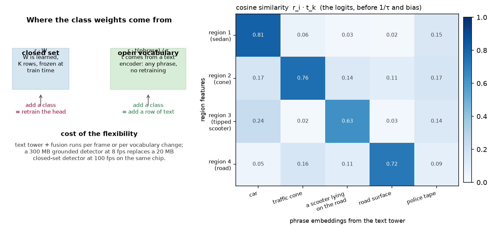

# Perception foundation models

> **Why this matters at staff level.** Between roughly 2021 and 2024 the perception field
> stopped building one network per task and started building one network you prompt. If you
> have shipped OCR or detection systems, interviewers will use this topic to find out
> whether you have tracked that change or are still reasoning about a fixed class list. The
> strong signal is a candidate who can explain the mechanism (a text embedding replacing a
> learned classifier row), quantify what it costs at inference, and say exactly when they
> would distil a 900M-parameter grounded detector into a 20M-parameter closed-set one.

## TL;DR, the interview card

* A closed-set head ends in `nn.Linear(d, K)`. An open-vocabulary head replaces those $K$
  learned rows with **text embeddings**, so the logit is $\;(r_i \cdot t_k)/\tau\;$ and
  adding a class means adding a row of text. GLIP, OWL-ViT, Grounding DINO and YOLO-World
  all share this shape.
* Training uses a **per-pair sigmoid** loss over (region, phrase), not a softmax over a
  fixed $K$, because the phrase set changes per image and a region can match several
  phrases at once ("car", "red car", "the car parked by the hydrant").
* **Detection as text**: Pix2Seq, PaliGemma and Florence-2 quantise box coordinates into
  location tokens and let a decoder emit `<loc0123><loc0045>... class`. One decoder then
  covers detection, grounding, captioning, OCR and segmentation by changing the prompt.
* **Promptable segmentation**: SAM turns a click or box into a mask. SAM 2 adds a memory
  bank over frames, which converts an image segmenter into a video object segmenter and
  gives you a class-free tracker for free.
* **Universal features**: DINOv2 gives frozen features that do depth, segmentation and
  retrieval with a linear head. Depth Anything gives metric-ish relative depth on almost
  any image. Both are the standard "free prior" in an AV stack now.
* Latency is the trade. A YOLO-class detector runs in single-digit milliseconds on an
  embedded chip; a grounded open-vocabulary detector with a text tower and cross-modal
  fusion is one to two orders of magnitude heavier. Production answer: run the foundation
  model **offline** in the data engine, distil into the closed-set model **online**.
* The perception-specific reason to care about open vocabulary is the **long tail**. You
  cannot enumerate every obstacle class, and a class you did not enumerate is invisible to
  a closed-set detector. Chapter 5 gives the other answer to the same problem: occupancy.

## 1. Intuition first

Take a detector you already understand. It produces $N$ region features
$r_i \in \mathbb{R}^{d}$, and a classification head $W \in \mathbb{R}^{d \times K}$ turns
each into $K$ logits. The head is the only place the class list appears. Everything else
(backbone, neck, box regression, NMS) is class-agnostic machinery.

Now write down what a row $w_k$ of $W$ actually is. It is a direction in feature space that
points at "car-ness". It was learned from the car examples in the training set. There is
nothing sacred about learning it from boxes: if you had some other way to produce a vector
that points at car-ness, you could substitute it.

CLIP gives you that other way. Its text tower maps the string `"car"` to an embedding
$t_{\text{car}} \in \mathbb{R}^{d_e}$ that lives in the same space as image embeddings.
Project your region features into that space, L2-normalise both sides, and the logit is a
cosine similarity:

$$
s_{ik} = \frac{r_i \cdot t_k}{\|r_i\| \, \|t_k\|}.
$$

{ width="820" }

The left panel is the substitution. The right panel is a similarity matrix for four regions
against five phrases. Look at row 3: a tipped-over scooter. It scores 0.63 against the
phrase "a scooter lying on the road" and only 0.24 against "car". A closed-set detector
trained on COCO classes would have scored it as a low-confidence bicycle or nothing at all,
and a planner that only sees boxes would have driven through it.

A tiny concrete example makes the mechanics obvious. Let $d_e = 3$ and take three
orthogonal phrase embeddings,

$$
t_{\text{car}} = (1,0,0), \quad t_{\text{cone}} = (0,1,0), \quad t_{\text{road}} = (0,0,1),
$$

and one region feature that projects to $r = (0.9, 0.1, 0.2)$ before normalisation. After
normalising, $\hat r \approx (0.97, 0.11, 0.22)$ and the three cosine scores are
$0.97, 0.11, 0.22$. With $\tau = 0.07$ the logits are $13.9, 1.5, 3.1$, so after a sigmoid
the region is confidently a car and confidently not a cone. Adding a fourth phrase means
appending a fourth row. No gradient step, no retraining, no change to the backbone.

## 2. The math

### 2.1 The open-vocabulary logit

Let $r_i \in \mathbb{R}^{d_r}$ be the $i$-th region feature and $t_k \in \mathbb{R}^{d_e}$
the embedding of the $k$-th phrase. A learned projection $P \in \mathbb{R}^{d_r \times d_e}$
maps regions into the joint space. Write $\hat u = u / \|u\|$. Then

$$
\boxed{\;\ell_{ik} = \frac{\widehat{r_i P} \cdot \hat t_k}{\tau} + b\;}
$$

with a learned temperature $\tau$ and a learned bias $b$. The temperature is stored as
$\log(1/\tau)$ and exponentiated, which keeps it positive and makes its gradient
well-scaled; CLIP does the same. The bias is initialised negative (around $-4$) so that
before training every phrase is "off", which matters because the positives are a tiny
fraction of the $N \times K$ pairs.

### 2.2 Why sigmoid and not softmax

A softmax over $K$ classes asserts that exactly one class is correct and that $K$ is fixed.
Both assumptions break. Different images carry different phrase sets during grounded
pretraining, and a region legitimately matches nested phrases. So the loss is a per-pair
binary problem. With $y_{ik} \in \{0,1\}$ and $p_{ik} = \sigma(\ell_{ik})$, GLIP-style
region-word alignment with focal weighting is

$$
L = \frac{1}{\max(1, \sum_{ik} y_{ik})} \sum_{i=1}^{N}\sum_{k=1}^{K}
\alpha_{ik} \, (1 - p^{t}_{ik})^{\gamma} \; \big[ -y_{ik}\log p_{ik} - (1-y_{ik})\log(1-p_{ik}) \big],
$$

where $p^t_{ik} = p_{ik} y_{ik} + (1-p_{ik})(1-y_{ik})$ is the probability assigned to the
true label and $\alpha_{ik} = \alpha y_{ik} + (1-\alpha)(1-y_{ik})$. The focal term
$(1-p^t)^\gamma$ with $\gamma = 2$ is doing the same job as in RetinaNet
([Part IV](../part04-vision/04-detection.md)): the $N \times K$ grid is overwhelmingly
negative, so easy negatives must stop dominating the gradient.

Normalising by the positive count rather than by $NK$ keeps the loss scale independent of
how many phrases the caller passed in, which matters because a caller can pass 3 phrases or
1,200 (the LVIS vocabulary).

### 2.3 Detection as a sequence

The other unification writes the output as text. Quantise each coordinate into one of
$n_{\text{bins}}$ location tokens. For an image of width $W$,

$$
\text{bin}(x) = \operatorname{round}\!\left(\frac{x}{W}\,(n_{\text{bins}} - 1)\right),
\qquad
\hat x = \frac{\text{bin}(x)}{n_{\text{bins}} - 1}\,W .
$$

The round-trip error per coordinate is bounded by half a bin:

$$
\boxed{\;|\hat x - x| \le \frac{W}{2(n_{\text{bins}}-1)}\;}
$$

With PaliGemma's $n_{\text{bins}} = 1024$ on a 1024-pixel image that is 0.5 pixels, which is
below the annotation noise of most datasets. With 256 bins on a 4K image it is 8 pixels,
which is not. When an interviewer asks "what breaks if you shrink the location vocabulary",
this inequality is the answer, together with the observation that small objects suffer
first because the error is absolute, not relative to object size.

A detection of $M$ objects becomes $5M + 1$ tokens: four location tokens and a class token
per object, then EOS. Pix2Seq showed this works at all; Florence-2 and PaliGemma showed the
same decoder then does captioning, grounding, referring segmentation and OCR by changing
the task prompt, because all of those are sequences too.

The cost is autoregressive decoding. A 100-object scene is 501 tokens of serial decoding,
which is why nobody runs detection-as-text in a 10 Hz vehicle loop. It runs in the
offline auto-labelling pipeline, where throughput matters and latency does not.

### 2.4 Promptable segmentation and video memory

SAM factors segmentation into a heavy image encoder run once and a light mask decoder run
per prompt. Given image embedding $F$ and prompt embedding $q$ (a point, a box, or a coarse
mask), the decoder produces $m$ candidate masks with confidence scores, trained with a
combination of focal and dice loss against the ambiguity-aware target: when a click is
ambiguous (a click on a person's shirt could mean shirt, person, or crowd) the model emits
all three and is scored on its best match.

SAM 2 adds a memory bank. Frame $t$ attends to features and mask predictions from a set of
previous frames, so the prompt only needs to be given once:

$$
\hat m_t = \text{Decoder}\big(F_t, \; \text{MemAttn}(F_t, \{(F_{t'}, \hat m_{t'})\}_{t' < t}), \; q\big).
$$

That is a tracker whose association is learned attention rather than IoU, and which needs
no class list at all. Chapter 4 contrasts it with SORT.

## 3. Implementation

Two pieces, both small enough to write in an interview. First the open-vocabulary head.

```python
class OpenVocabHead(nn.Module):
    """Region features · text embeddings → per-phrase logits.

    forward(region_feats (B, N, d_region), text_emb (K, d_embed)) → (B, N, K).
    """

    def __init__(self, d_region: int, d_embed: int, init_temperature: float = 0.07, bias_init: float = -4.0):
        super().__init__()
        self.proj = nn.Linear(d_region, d_embed)  # region → joint embedding space
        self.log_inv_temp = nn.Parameter(torch.tensor(float(torch.log(torch.tensor(1.0 / init_temperature)))))
        self.bias = nn.Parameter(torch.tensor(bias_init))

    def forward(self, region_feats: torch.Tensor, text_emb: torch.Tensor) -> torch.Tensor:
        r = F.normalize(self.proj(region_feats), dim=-1)   # (B, N, d_embed)
        t = F.normalize(text_emb, dim=-1)                  # (K, d_embed)
        sim = torch.matmul(r, t.t())                       # (B, N, K)  cosine similarity r_i · t_k
        return sim * self.log_inv_temp.exp() + self.bias   # (B, N, K)
```

Three details carry the weight. `F.normalize` on both sides is what makes the logit a
cosine rather than a dot product, so a region feature with large norm cannot win every
phrase. `log_inv_temp.exp()` keeps $1/\tau$ positive under unconstrained gradient descent.
The scalar `bias` shifts every logit, which sets the prior probability that a region is any
object at all; with `bias_init = -4.0` the initial sigmoid is about 0.018.

The loss is the focal binary cross-entropy from §2.2:

```python
def region_word_alignment_loss(logits, targets, alpha=0.25, gamma=2.0):
    p = torch.sigmoid(logits)                                              # (B, N, K)
    ce = F.binary_cross_entropy_with_logits(logits, targets, reduction="none")  # (B, N, K)
    p_t = p * targets + (1.0 - p) * (1.0 - targets)                        # (B, N, K) prob of the true label
    alpha_t = alpha * targets + (1.0 - alpha) * (1.0 - targets)            # (B, N, K)
    focal = alpha_t * (1.0 - p_t) ** gamma * ce                            # (B, N, K)
    return focal.sum() / targets.sum().clamp(min=1.0)
```

`targets` is `(B, N, K)` in $\{0,1\}$, and a background region is a row of zeros rather than
a separate background class. That is the structural difference from a softmax head, and it
is why the model can say "none of your phrases" without you reserving a slot for it.

Second, the box tokenizer. The encode direction orders coordinates
`y_min x_min y_max x_max class`, which is the Pix2Seq and PaliGemma convention:

```python
    def encode(self, boxes: np.ndarray, labels: np.ndarray) -> np.ndarray:
        """(N, 4), (N,) → (5·N + 1,) token ids, ordered ``y_min x_min y_max x_max class``, then EOS."""
        h, w = self.image_hw
        y0 = self._quantise(boxes[:, 1], h)          # (N,)
        x0 = self._quantise(boxes[:, 0], w)          # (N,)
        y1 = self._quantise(boxes[:, 3], h)          # (N,)
        x1 = self._quantise(boxes[:, 2], w)          # (N,)
        cls = labels.astype(np.int64) + self.n_bins  # (N,)
        seq = np.stack([y0, x0, y1, x1, cls], axis=1).reshape(-1)  # (5·N,)
        return np.concatenate([seq, np.array([self.eos], dtype=np.int64)])  # (5·N + 1,)
```

The decode direction has to survive a sampled sequence, which can be malformed. The
implementation keeps a quintuple only if its four coordinates are location tokens and its
fifth is a class token, the same validity filter a real decoder applies:

```python
        is_loc = (q[:, :4] >= 0) & (q[:, :4] < self.n_bins)   # (n, 4)
        is_cls = (q[:, 4] >= self.n_bins) & (q[:, 4] < self.eos)  # (n,)
        keep = is_loc.all(axis=1) & is_cls                     # (n,)
```

In production you would instead constrain decoding so malformed sequences cannot be
produced: mask the logits to location tokens at sequence positions $0,1,2,3 \bmod 5$ and to
class tokens at position $4 \bmod 5$. The filter is the fallback for when you do not control
the decoder.

??? example "Full implementations"
    ```python
    --8<-- "src/mlbook/perception/open_vocab.py"
    ```

    ```python
    --8<-- "src/mlbook/perception/box_tokenizer.py"
    ```

**How you would test it.** Three properties. (1) With an identity projection and orthogonal
one-hot phrase embeddings, the head must recover the phrase index by argmax, and adding a
fourth phrase with a matching region must classify correctly with no gradient step: that is
the open-vocabulary claim, tested directly. (2) Training on a small synthetic set must drive
the loss down and push background regions below threshold. (3) The tokenizer must round-trip
boxes within $W/(2(n_{\text{bins}}-1))$ and must drop a malformed quintuple.

## Retype by hand

These are the symbols worth reproducing from memory, in the order you should practise them.

| Symbol | File | Target time | Why |
|---|---|---|---|
| `OpenVocabHead.forward` | `src/mlbook/perception/open_vocab.py` | 8 minutes | The whole idea in five lines. Get the two normalisations and the temperature right. |
| `region_word_alignment_loss` | `src/mlbook/perception/open_vocab.py` | 12 minutes | Focal BCE over pairs, normalised by positives. A standard whiteboard ask. |
| `BoxTokenizer.encode` and `.decode` | `src/mlbook/perception/box_tokenizer.py` | 20 minutes | Quantisation, vocabulary layout, EOS handling, malformed-tail filter. |

Read but do not retype: `TinyTextEncoder` (a stand-in for a real text tower),
`BoxTokenizer.to_text` (formatting only), `zero_shot_classify` (two lines).

Check yourself with:

```bash
pytest tests/test_perception_open_vocab.py -q
pytest tests/test_perception_box_tokenizer.py -q
```

Target: 40 minutes for all three symbols with both test files green.

## 4. Systems view: cost, failure modes, trade-offs

An open-vocabulary detector costs you three things a closed-set detector does not.

**The text tower.** If the vocabulary is fixed at deployment you pay this once and cache the
embeddings, which is what YOLO-World's "prompt-then-detect" reparameterisation does: it
folds the cached text embeddings into the head so online inference has no text tower at all.
If the vocabulary changes per frame (a language-conditioned robot) you pay it every frame.

**Cross-modal fusion.** GLIP and Grounding DINO do not stop at a dot product at the end.
They fuse language into the visual features at several depths, which is where their accuracy
on referring expressions comes from and where most of their FLOPs go. A dot-product-only
model (ViLD, OWL-ViT in its simplest form) is cheaper and worse at phrases that require
composition ("the cone **behind** the truck").

**Calibration.** A closed-set softmax gives you a distribution to threshold. Per-pair
sigmoids give you $K$ independent probabilities whose scale depends on the phrase. The word
"car" and the phrase "a silver sedan viewed from behind" do not produce comparable logits,
so a single global threshold misfires. In production you calibrate per phrase on a held-out
set, or you rank rather than threshold.

| Situation | Use | Decision rule |
|---|---|---|
| Fixed class list, on-vehicle, 10 ms budget | Closed-set detector (YOLO, CenterPoint) | The class list has not changed in six months and will not change without a retrain anyway |
| Fixed class list, but you need the long tail as obstacles | Closed-set detector **plus** occupancy (chapter 5) | Unknown obstacles need geometry, not names |
| Vocabulary changes at runtime, latency is soft | YOLO-World or OWL-ViT with cached embeddings | Reparameterise the text embeddings into the head |
| Free-form phrases, referring expressions | Grounding DINO or a VLM | You need composition, so you need deep fusion |
| Auto-labelling a new class from 50 examples | Grounded model offline, then distil | The teacher never ships; it only writes labels |
| Mask for an arbitrary thing, no class | SAM / SAM 2 | Prompt is a click or a box, output is a mask |

The distillation decision deserves its own rule, because it is the most common production
pattern and a frequent interview question. Distil when: the class set has stabilised, the
teacher's recall on your held-out long-tail set exceeds your closed-set model's by a margin
you can measure, and you have the unlabelled data to run the teacher over. Do not distil
when the vocabulary is still moving weekly; you will be re-running the whole pipeline for
each change, and the teacher's own errors get baked in as labels. The teacher's failure
modes become the student's blind spots, and unlike human label noise they are systematic and
correlated, which is worse.

Failure modes worth naming out loud:

* **Phrase sensitivity.** "person" and "pedestrian" give different recall on the same
  images. Teams end up maintaining a prompt list as a versioned artefact, with the same
  review process as code.
* **Hallucinated grounding.** Ask a VLM to ground a phrase that has no referent and many
  models produce a box anyway. Always evaluate on negatives, not only on images that
  contain the thing.
* **Domain shift in the text tower.** CLIP-family text encoders were trained on web alt
  text. Domain jargon ("jersey barrier", "cat-eye reflector") sits in a poorly populated
  region of the embedding space, and similarity scores compress.
* **Small objects.** Location tokenisation and coarse feature maps both hurt small objects
  first, and in driving the safety-relevant objects at range are small.

## 5. In production

!!! production "Meta, SAM and SAM 2, promptable segmentation as a data engine"
    SAM was built alongside a data engine: annotators corrected model masks, the corrections
    retrained the model, and the loop produced SA-1B with over 1 billion masks on 11M
    images. SAM 2 extends the same idea to video with a streaming memory, reporting better
    video segmentation accuracy with 3x fewer interactions than prior approaches and image
    segmentation 6x faster than SAM. For an AV team the practical use is offline: prompt
    with an auto-labeller's coarse box, get an instance mask, and convert a box dataset into
    a mask dataset without new human passes.
    Sources: [Segment Anything (arXiv 2304.02643)](https://arxiv.org/abs/2304.02643),
    [SAM 2 (arXiv 2408.00714)](https://arxiv.org/abs/2408.00714).

!!! production "Microsoft, GLIP and Florence-2, two different unifications"
    GLIP unified detection and phrase grounding as one pretraining task, trained on 27M
    grounding examples (3M human-annotated, 24M web image-text pairs with self-training),
    and reported 49.8 AP on COCO and 26.9 AP on LVIS without training on them directly.
    Florence-2 went the sequence route: one prompt-conditioned encoder-decoder for
    captioning, detection, grounding and segmentation, trained on FLD-5B (5.4B annotations
    over 126M images) generated by an automated annotation loop. The pattern in both is that
    the model and the labelling pipeline were designed together.
    Sources: [GLIP (arXiv 2112.03857)](https://arxiv.org/abs/2112.03857),
    [Florence-2 (arXiv 2311.06242)](https://arxiv.org/abs/2311.06242).

!!! production "Tencent, YOLO-World, open vocabulary at detector speed"
    YOLO-World's contribution is the deployment story rather than the accuracy: a
    re-parameterisable vision-language path aggregation network lets you fold the text
    embeddings for a fixed vocabulary into the network weights after prompting, so online
    inference has no text tower. They report 35.4 AP on LVIS at 52.0 FPS on a V100. That is
    the shape of the answer when an interviewer asks how you would run open-vocabulary
    detection on a vehicle: fix the vocabulary at build time, pay the text cost offline.
    Source: [YOLO-World (arXiv 2401.17270)](https://arxiv.org/abs/2401.17270).

!!! production "Google, PaliGemma, detection as text in a 3B model"
    PaliGemma pairs a SigLIP-So400m vision encoder with Gemma-2B and emits detections and
    segmentations as token sequences, using 1024 location tokens. It was evaluated on nearly
    40 tasks including remote sensing and segmentation. For an OCR-heavy background this is
    the clearest demonstration that document parsing, detection and captioning are the same
    decoding problem with different prompts.
    Source: [PaliGemma (arXiv 2407.07726)](https://arxiv.org/abs/2407.07726).

!!! production "Meta, DINOv2 and Depth Anything, frozen priors"
    DINOv2 produces features that support depth, segmentation and retrieval with only a
    linear head on top, trained self-supervised on curated data
    ([arXiv 2304.07193](https://arxiv.org/abs/2304.07193)). Depth Anything scaled monocular
    depth by building a data engine over roughly 62M unlabelled images
    ([arXiv 2401.10891](https://arxiv.org/abs/2401.10891)). In an AV stack both show up as
    initialisation and as pseudo-label sources rather than as deployed models: a frozen
    DINOv2 backbone is a strong starting point for a BEV encoder, and Depth Anything's
    relative depth is a usable supervision signal where you have no LiDAR.

## 6. Interview questions and strong answers

!!! interview "Why does open-vocabulary detection use a sigmoid per (region, phrase) pair instead of a softmax over classes?"
    A softmax asserts a fixed, mutually exclusive class set. Grounded pretraining violates
    both parts: the phrase set differs per image, and phrases nest, so a region can be
    correctly labelled by "car", "red car" and "vehicle" at once. Per-pair sigmoids let the
    phrase set be an input rather than an architectural constant, and let a region match
    zero phrases, which is how background is represented without a background class.

    The cost is that the $N \times K$ grid is almost entirely negative, so you need focal
    weighting and normalisation by the positive count, otherwise the gradient is dominated
    by easy negatives and the loss scale depends on how many phrases the caller passed.

    **Staff-level follow-up: how do you threshold at deployment?** You do not use one global
    threshold. Logit scale varies by phrase because the text tower's embedding norms and
    neighbourhood densities vary. Either calibrate per phrase on a held-out set (fit a
    scalar shift per phrase, which is cheap and works), or avoid thresholds by ranking and
    taking top-k per image when downstream consumes a fixed budget of proposals.

!!! interview "You have a closed-set detector at 8 ms and a grounded open-vocabulary model at 400 ms. The product wants to add three new obstacle classes. What do you do?"
    Use the grounded model as a teacher, not as a deployed model. Concretely: mine
    unlabelled fleet data for frames the teacher scores highly on the three new phrases,
    have humans audit a sample to measure teacher precision on each class (this number
    decides whether the plan is viable at all), generate pseudo-labels over the mined set,
    add the three classes to the student's head and fine-tune. Keep a human-labelled
    evaluation set for the new classes that the teacher never touched, because measuring the
    student against teacher labels only tells you how well it copied.

    Say out loud what you give up: the student inherits the teacher's systematic errors,
    which are correlated across frames in a way human label noise is not. If the teacher
    consistently misses the new class under low sun angle, so will the student, and no
    amount of pseudo-label volume fixes it. So the audit is stratified by the conditions you
    care about, not uniform.

    **Staff-level follow-up: when would you keep the big model online instead?** When the
    vocabulary genuinely changes at runtime and cannot be fixed at build time (a
    teleoperation interface where an operator types what to look for), or when the task is
    not on the safety-critical path and can run at 2 Hz on a secondary compute budget.

!!! interview "Walk me through detection as sequence generation. What is the quantisation error, and where does it hurt first?"
    Each coordinate is mapped to one of $n_{\text{bins}}$ tokens, so the reconstruction error
    per coordinate is at most $W / (2(n_{\text{bins}}-1))$. With 1024 bins on a 1024-pixel
    image that is half a pixel; with 256 bins on a 4K image it is 8 pixels.

    It hurts small objects first, because the error is absolute while the IoU penalty is
    relative to box size. An 8-pixel error on a 400-pixel bus is invisible; on a 16-pixel
    traffic light at 80 m it destroys the IoU. So for long-range detection you either raise
    the bin count, predict in a normalised crop coordinate frame after a coarse localisation
    pass, or keep a continuous regression head for the box and use tokens only for the class
    and the coarse position.

    **Staff-level follow-up: why does nobody run this in a vehicle loop?** Decoding is
    serial: $5M+1$ tokens for $M$ objects, so a 60-object scene is 300-plus sequential
    decoder steps inside a 100 ms budget that also has to fit perception, prediction and
    planning. Set prediction (DETR-style) emits all objects in parallel and is the right
    shape for the online path; sequence decoding is the right shape for the offline path
    where you want one model to do ten tasks.

!!! interview "SAM 2 gives you class-free video object segmentation. Does that replace your tracker?"
    It replaces part of it. SAM 2's memory attention does the association that a tracker's
    Hungarian matching does, and it does it on appearance and shape rather than on IoU, so
    it handles deformation and partial occlusion well without you tuning a motion model.

    It does not replace three things a production tracker provides. First, birth and death
    logic: SAM 2 tracks what you prompted, so something has to decide what to prompt and
    when to stop. Second, the motion state: a planner needs velocity and acceleration with
    uncertainty, and a mask gives you neither directly. Third, the latency and determinism
    profile: a Kalman filter is microseconds and provably bounded, a memory-attention video
    model is neither.

    So the realistic architecture keeps a Kalman-filter tracker for the state estimate and
    uses a promptable video segmenter offline for label generation, or online in a
    non-safety-critical role such as a perception health check.

!!! interview "Your grounded detector scores 0.55 on the phrase 'pedestrian' and 0.38 on 'person' for the same crop. What is going on, and what do you do about it?"
    The text tower places the two strings at different points, and the region embedding is
    not equidistant from them. The training distribution decides this: if grounded
    pretraining saw "person" far more often in generic web captions and "pedestrian" mostly
    in driving datasets, the two embeddings carry different priors.

    Practically you do three things. Ensemble the prompt: embed a list of synonyms and
    average the normalised embeddings, which is the standard CLIP prompt-ensembling trick
    and usually recovers a point or two of AP. Version the prompt list as a code artefact
    with its own evaluation, because changing a string changes model behaviour with no code
    diff. And measure per-phrase calibration rather than assuming the scores are comparable.

    **Staff-level follow-up: how would you detect this regression in CI?** Keep a small
    fixed set of crops with known labels and assert on per-phrase score ranges, not only on
    aggregate AP. Aggregate AP hides a phrase that degraded, because the other 1,199 phrases
    carry the average.

!!! interview "Where does OCR fit in this picture?"
    OCR was unified in the same direction and earlier in some respects. Text detection is
    detection, text recognition is sequence decoding, and layout analysis is grounding, so a
    single prompt-conditioned encoder-decoder (Florence-2, PaliGemma, Donut-style document
    models) covers the whole pipeline: `<OCR>` gives you the text, `<OCR_WITH_REGION>` gives
    you text plus boxes, a question gives you document VQA.

    What carries over to driving is the engineering lesson rather than the architecture. OCR
    systems learned that a classical multi-stage pipeline with explicit intermediate
    representations (detect, rectify, recognise) is easier to debug and beats end-to-end at
    low data volume, and that end-to-end wins once you have enough data and a good enough
    decoder. The AV stack is at exactly that transition now, which is why chapter 6 spends
    time on UniAD and VAD.

## 7. Exercises

**★ Exercise 1.** With $n_{\text{bins}} = 256$ and a 1280-pixel-wide image, what is the
worst-case quantisation error in pixels? What IoU does that cost on a box that is 20 pixels
wide, in the worst case where both edges shift in opposite directions?

??? success "Solution"
    Error per coordinate is $1280 / (2 \times 255) = 2.51$ pixels. If $x_{\min}$ moves right
    by 2.51 and $x_{\max}$ moves left by 2.51, the predicted width is $20 - 5.02 = 14.98$
    against a true width of 20, and the intersection is 14.98. IoU in that dimension is
    $14.98/20 = 0.749$. Combined with an equal error in $y$ on a 20-pixel-tall box, IoU is
    about $0.749 \times 0.749 / (2 - 0.749 \times 0.749) \approx 0.39$, which fails a 0.5
    threshold. The same absolute error on a 200-pixel box leaves IoU above 0.95.

**★ Exercise 2.** The head initialises `bias = -4.0`. What is the initial predicted
probability for every pair, and why is that the right starting point for a focal loss?

??? success "Solution"
    $\sigma(-4) = 0.0180$. With roughly one positive per hundreds of pairs, starting near the
    base rate means the initial loss is dominated by the few positives rather than by
    thousands of confidently-wrong negatives. Starting at $\sigma(0) = 0.5$ would give every
    negative a large gradient in the first steps and can collapse the projection before the
    positives have any influence.

**★★ Exercise 3.** A colleague proposes replacing the per-pair sigmoid with a softmax over
the phrases plus one learned background logit, arguing it will calibrate better. Give two
concrete cases where this changes model behaviour for the worse, and one where they are
right.

??? success "Solution"
    Worse: (1) nested phrases. If the caller passes both "car" and "red car" and the region
    is a red car, softmax forces the model to split probability between two correct answers,
    so both may fall below threshold. (2) Variable phrase counts. Softmax over $K$ phrases
    means the same region's score for "car" depends on how many other phrases were passed,
    so a detection appears or disappears based on unrelated vocabulary entries.

    Right: when the vocabulary is fixed, mutually exclusive and complete at deployment, for
    example a closed taxonomy of traffic sign types where exactly one applies. Then softmax
    gives a proper distribution, calibrates with temperature scaling, and lets you threshold
    once.

**★★ Exercise 4 (coding).** Extend `BoxTokenizer` with a `decode_constrained` method that
takes a `(T, V)` array of logits and decodes greedily while masking invalid tokens at each
position (location tokens at positions $0..3 \bmod 5$, class tokens at position $4 \bmod 5$,
EOS allowed only at position $0 \bmod 5$). Verify that decoding random logits now always
produces a well-formed box list.

??? success "Solution"
    ```python
    import numpy as np
    from mlbook.perception.box_tokenizer import BoxTokenizer

    def decode_constrained(tok: BoxTokenizer, logits: np.ndarray):
        """logits (T, V) → (boxes (M, 4), labels (M,)) with a structurally valid sequence."""
        out = []
        for t in range(logits.shape[0]):
            mask = np.full(tok.vocab_size, -np.inf)          # (V,)
            pos = t % 5
            if pos < 4:
                mask[: tok.n_bins] = 0.0                      # location tokens only
                if pos == 0:
                    mask[tok.eos] = 0.0                       # a box may start or the sequence may end
            else:
                mask[tok.n_bins : tok.eos] = 0.0              # class tokens only
            token = int(np.argmax(logits[t] + mask))
            if token == tok.eos:
                break
            out.append(token)
        usable = len(out) - (len(out) % 5)
        return tok.decode(np.array(out[:usable] + [tok.eos]))

    tok = BoxTokenizer(n_bins=100, num_classes=4, image_hw=(200, 200))
    rng = np.random.default_rng(0)
    boxes, labels = decode_constrained(tok, rng.normal(size=(31, tok.vocab_size)))
    assert boxes.shape[1] == 4 and labels.min() >= 0 and labels.max() < 4
    assert (boxes[:, 2] >= 0).all() and (boxes[:, 0] <= 200).all()
    ```

    Constrained decoding makes the validity filter in `decode` unnecessary, which is why
    production systems do it in the decoder rather than as a post-process.

**★★★ Exercise 5.** You are given a frozen CLIP text tower and a detector whose region
features are 256-dimensional while CLIP's embedding is 512-dimensional. You train only the
projection $P \in \mathbb{R}^{256 \times 512}$ on base classes, then evaluate on novel
classes. Performance on base classes is strong and on novel classes is near chance. Give
three plausible causes and an experiment that distinguishes them.

??? success "Solution"
    Causes: (1) $P$ has overfitted to the base classes, effectively learning a $K_{base}$-way
    classifier that happens to be expressed through text embeddings, collapsing the output
    onto the span of the base text embeddings. (2) The region features themselves carry no
    information about novel classes because the backbone was trained only on base-class
    supervision and discarded the rest. (3) The novel class names sit in a sparse region of
    the text embedding space, so their embeddings are nearly collinear with each other and
    the cosine scores do not separate.

    Distinguishing experiment: compute the rank of $\{ \hat r_i P \}$ against the span of the
    base text embeddings, and separately compute the pairwise cosine similarity matrix of
    the novel class text embeddings alone. If projected regions lie almost entirely in the
    base span, it is cause 1 (fix: regularise $P$ towards orthogonality, or freeze more and
    train with a distillation loss against CLIP image embeddings, as ViLD does). If novel
    text embeddings have pairwise cosine above ~0.9 with each other, it is cause 3 (fix:
    prompt engineering or a richer phrase). If neither, probe the frozen backbone with a
    linear classifier on novel classes using ground-truth crops: if that also fails, it is
    cause 2.

## References

* Alexander Kirillov et al. "Segment Anything." ICCV 2023. [arXiv:2304.02643](https://arxiv.org/abs/2304.02643)
* Nikhila Ravi et al. "SAM 2: Segment Anything in Images and Videos." 2024. [arXiv:2408.00714](https://arxiv.org/abs/2408.00714)
* Liunian Harold Li et al. "Grounded Language-Image Pre-training." CVPR 2022. [arXiv:2112.03857](https://arxiv.org/abs/2112.03857)
* Shilong Liu et al. "Grounding DINO: Marrying DINO with Grounded Pre-Training for Open-Set Object Detection." ECCV 2024. [arXiv:2303.05499](https://arxiv.org/abs/2303.05499)
* Matthias Minderer et al. "Simple Open-Vocabulary Object Detection with Vision Transformers." ECCV 2022. [arXiv:2205.06230](https://arxiv.org/abs/2205.06230)
* Tianheng Cheng et al. "YOLO-World: Real-Time Open-Vocabulary Object Detection." CVPR 2024. [arXiv:2401.17270](https://arxiv.org/abs/2401.17270)
* Ting Chen et al. "Pix2seq: A Language Modeling Framework for Object Detection." ICLR 2022. [arXiv:2109.10852](https://arxiv.org/abs/2109.10852)
* Bin Xiao et al. "Florence-2: Advancing a Unified Representation for a Variety of Vision Tasks." CVPR 2024. [arXiv:2311.06242](https://arxiv.org/abs/2311.06242)
* Lucas Beyer et al. "PaliGemma: A versatile 3B VLM for transfer." 2024. [arXiv:2407.07726](https://arxiv.org/abs/2407.07726)
* Maxime Oquab et al. "DINOv2: Learning Robust Visual Features without Supervision." TMLR 2024. [arXiv:2304.07193](https://arxiv.org/abs/2304.07193)
* Lihe Yang et al. "Depth Anything: Unleashing the Power of Large-Scale Unlabeled Data." CVPR 2024. [arXiv:2401.10891](https://arxiv.org/abs/2401.10891)
