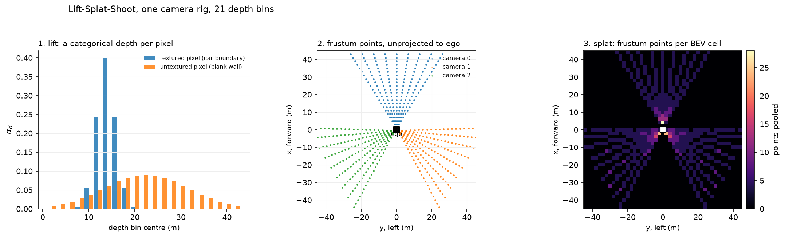
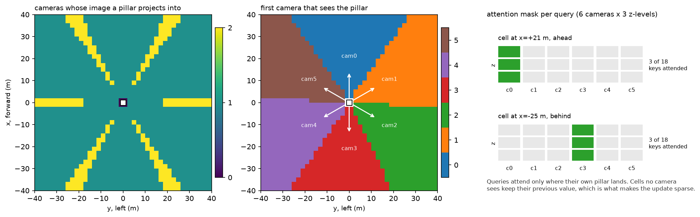

# Multi-camera and bird's-eye view

> **Why this matters at staff level.** Every camera-first autonomy company converged on the
> same answer between 2020 and 2022: stop reasoning per image, build one metric top-down
> representation and put every head on top of it. Interviewers use BEV to separate people
> who can recite "Lift-Splat-Shoot" from people who can derive the lift, place a frustum
> point in the ego frame with real intrinsics, and explain why BEVFormer inverts the
> direction of the projection. Expect this in the ML depth round and as a whiteboard coding
> exercise.

## TL;DR, the interview card

* A BEV representation is a tensor $B \in \mathbb{R}^{C \times X \times Y}$ over a metric
  grid in the ego frame. Its value is that fusion, tracking, prediction and planning all
  want the same top-down metric space, so building it once amortises across every head.
* **Lift-Splat-Shoot**: predict a categorical depth distribution $\alpha \in \Delta^{D}$ and
  a context $c \in \mathbb{R}^{C}$ per pixel, form the outer product $\alpha_d c$ over
  depth bins, unproject each $(u,v,d)$ into the ego frame, and sum-pool into BEV cells.
  Depth is never argmaxed, so the gradient reaches every bin.
* **BEVFormer** inverts it: a learnable grid of BEV queries projects its own reference
  pillars into the images and samples features there. LSS pushes image features out to
  where they might be; BEVFormer pulls image features in to where it is asking about.
* **PETR** does neither: it adds a 3D position embedding to image tokens so a plain DETR
  decoder can attend globally with geometry encoded in the keys.
* **Temporal BEV**: warp the previous BEV into the current ego frame with
  $T_{\text{curr} \leftarrow \text{prev}}$ and fuse. Static structure aligns, moving objects
  smear, and the network reads the smear as velocity.
* Depth is the weak link in camera-only BEV. BEVDepth showed that supervising the depth
  distribution with projected LiDAR (as a training signal only) is what makes the lift
  accurate, reaching 60.9% NDS on nuScenes test.
* Cost scales as $N_{\text{cam}} \cdot D \cdot H_f \cdot W_f$ frustum points for LSS and as
  $X \cdot Y \cdot N_z$ projections for BEV queries. The resolution and range trade is the
  main system-design lever: doubling range at fixed cell size quadruples the grid.

## 1. Intuition first

Start with the problem that makes per-image reasoning fail. Two cameras see the same car at
the seam of their fields of view: the front camera catches its left half, the front-right
camera catches its right half. Each image produces half a detection. No amount of
post-processing on two 2D boxes recovers one 3D box with a consistent heading, because the
information you need (metric depth, a common frame) was never in either box.

Now fix the representation. Lay a grid on the ground plane in the ego frame: $x$ forward,
$y$ left, cells of 0.5 m out to 50 m. Ask every camera to deposit what it knows into that
grid. The car at the seam deposits into the same cells from both views, and one head reads
one object.

The obstacle is that a camera does not know depth. A pixel constrains a ray, and nothing
more. Lift-Splat-Shoot's answer is to refuse to choose: predict a distribution over depths,
place a weighted copy of the pixel's feature at every depth along the ray, and let the sum
over many pixels and many cameras sort it out. Where two rays from different cameras agree
on a surface, their contributions pile up in the same cell. Where a ray is uncertain, its
mass is spread thin along its length and contributes little anywhere.

{ width="900" }

The left panel shows the mechanism at the level of a single pixel. A pixel on a car boundary
has texture to match, so its depth distribution is a tight spike at 14 m. A pixel on a blank
wall has nothing to match, so its distribution is a broad hump centred at 22 m. The
broad-hump pixel still contributes to the BEV, but it contributes 0.05 of its feature to
each of twenty cells instead of 0.9 to one, which is exactly the behaviour you want from an
uncertain observation. The middle panel is the actual frustum geometry for a three-camera
rig, and the right panel counts how many frustum points land in each BEV cell: dense near
the ego where the rays have not yet spread, sparse at range where the same number of rays
covers far more ground.

Here is the whole computation on numbers small enough to check by hand. Take one camera with
$f_x = f_y = 224$, principal point $(c_x, c_y) = (224, 128)$, mounted at the ego origin
looking along $+x$. Take a pixel at $(u, v) = (336, 128)$ and a depth bin $d = 20$ m. In the
camera frame (OpenCV convention, $x$ right, $y$ down, $z$ forward):

$$
x_{\text{cam}} = \frac{(336 - 224) \cdot 20}{224} = 10, \quad
y_{\text{cam}} = \frac{(128 - 128) \cdot 20}{224} = 0, \quad
z_{\text{cam}} = 20 .
$$

The camera looks along ego $+x$ with image-right along ego $-y$, so
$(x_{\text{cam}}, y_{\text{cam}}, z_{\text{cam}}) = (10, 0, 20)$ maps to ego
$(20, -10, 0)$: 20 m ahead and 10 m to the right. With a BEV extent of $[-50, 50]$ m in both
axes and 0.5 m cells, that is cell index
$\lfloor (20 + 50)/0.5 \rfloor = 140$ in $x$ and $\lfloor (-10 + 50)/0.5 \rfloor = 80$ in
$y$. If the network gave this pixel $\alpha_{d=20\text{m}} = 0.4$ and context $c$, then
$0.4 \, c$ is added to cell $(140, 80)$.

## 2. The math

### 2.1 Calibration: the two matrices

Intrinsics map camera-frame points to pixels:

$$
K = \begin{bmatrix} f_x & 0 & c_x \\ 0 & f_y & c_y \\ 0 & 0 & 1 \end{bmatrix},
\qquad
u = f_x \frac{x_{\text{cam}}}{z_{\text{cam}}} + c_x, \qquad
v = f_y \frac{y_{\text{cam}}}{z_{\text{cam}}} + c_y .
$$

Extrinsics map ego-frame points to the camera frame,
$p_{\text{cam}} = R\, p_{\text{ego}} + t$, written as a $4 \times 4$ homogeneous
$T_{\text{cam} \leftarrow \text{ego}}$. The inverse has a closed form you should be able to
write instantly:

$$
\boxed{\;T^{-1} = \begin{bmatrix} R^{\top} & -R^{\top} t \\ 0 & 1 \end{bmatrix}\;}
$$

Points are stored one per row, $P \in \mathbb{R}^{N \times 3}$, so the code writes
$P R^{\top} + t$ where the maths writes $Rp + t$. State that convention out loud in an
interview before you write any code; half of all BEV bugs are a transposed rotation.

**Field of view to focal length.** For a camera of width $W$ pixels with horizontal field of
view $\theta$:

$$
f_x = \frac{W/2}{\tan(\theta/2)} .
$$

A 448-pixel-wide crop at 70 degrees gives $f_x = 224/\tan(35°) = 320$. This conversion comes
up constantly when you are reasoning about what a rig can see.

**Range resolution.** One pixel of disparity at the image edge corresponds to a lateral
offset $\Delta y \approx z / f_x$ at depth $z$. At $z = 100$ m with $f_x = 1000$, one pixel
is 10 cm laterally, and the *depth* uncertainty from a monocular cue is far worse than that.
This asymmetry (good angular resolution, poor depth resolution) is the reason camera-only
BEV needs depth supervision and the reason radar and LiDAR stay in the stack.

### 2.2 Rolling shutter and time sync

A rolling-shutter camera exposes row $v$ at time

$$
t(v) = t_0 + t_{\text{readout}} \frac{v}{H - 1},
$$

so a 30 ms readout on a 1080-row sensor means the bottom of the image is 30 ms older than
the top. An object with ego-relative lateral speed $s$ is displaced by $s \cdot t(v)$
between the first row and row $v$. At 30 m/s of closing speed that is 0.9 m across the
frame, which is more than the width of the object you are trying to localise.

The correct handling is to carry a per-row timestamp into the projection, so the extrinsic
used for row $v$ is the ego pose at $t(v)$, not at $t_0$. Most public BEV implementations
ignore this and absorb the error into the learned depth head; production systems on
high-speed roads do not have that luxury. If asked what you would check first when a BEV
model localises well at low speed and poorly on the highway, rolling shutter and inter-sensor
time offset are the first two hypotheses.

### 2.3 Lift-Splat-Shoot, derived

Let the backbone produce features $F \in \mathbb{R}^{C_{in} \times H_f \times W_f}$ per
camera. Two $1 \times 1$ convolutions produce, per feature cell $(i,j)$:

$$
\alpha^{(i,j)} = \softmax(W_\alpha F^{(i,j)}) \in \Delta^{D}, \qquad
c^{(i,j)} = W_c F^{(i,j)} \in \mathbb{R}^{C}.
$$

**The lift.** The frustum feature at depth bin $d$ is the outer product

$$
\boxed{\;f^{(i,j)}_{d} = \alpha^{(i,j)}_{d} \cdot c^{(i,j)} \in \mathbb{R}^{C}\;}
$$

producing a tensor of shape $(D, C, H_f, W_f)$ per camera. The design choice here is worth
stating precisely: the context $c$ does not depend on $d$. The network decides *what* it is
looking at once, and *where it is* separately, and the lift multiplies them. That
factorisation is what keeps the parameter count at $C_{in}(D + C)$ instead of
$C_{in} \cdot D \cdot C$.

**The geometry.** Each frustum cell has pixel coordinates $(u_{j}, v_{i})$ at the centre of
the image patch it covers and a depth $d$. Unproject and transform:

$$
p_{\text{cam}} = \left( \frac{(u - c_x) d}{f_x},\; \frac{(v - c_y) d}{f_y},\; d \right),
\qquad
p_{\text{ego}} = R_{\text{ego} \leftarrow \text{cam}} \, p_{\text{cam}} + t_{\text{ego} \leftarrow \text{cam}} .
$$

**The splat.** With BEV extent $[x_{\min}, x_{\max}] \times [y_{\min}, y_{\max}]$ and
$X \times Y$ cells, cell indices are
$i_x = \lfloor (p_x - x_{\min}) X / (x_{\max} - x_{\min}) \rfloor$ and similarly for $i_y$.
The BEV feature is the sum over every frustum point that lands in the cell:

$$
\boxed{\;B[:, i_x, i_y] = \sum_{n, d, i, j} \mathbb{1}\!\left[\text{cell}(p^{n}_{dij}) = (i_x,i_y)\right] \; \alpha^{n(i,j)}_{d} \, c^{n(i,j)}\;}
$$

Sum-pooling (rather than max) keeps the operation linear in the features, so the gradient to
every contributing frustum point is 1, and a cell observed by two cameras accumulates both.
The original paper implements this with a cumulative-sum trick over sorted cell indices to
avoid a scatter; `index_add` is the readable equivalent.

**Why the distribution is never argmaxed.** If you took $\hat d = \argmax_d \alpha_d$ and
placed the feature only there, the map from $\alpha$ to $B$ would be piecewise constant and
$\partial B / \partial \alpha = 0$ almost everywhere. The depth head would receive no
gradient from the BEV loss and could only be trained with direct depth supervision. Keeping
the full distribution makes the lift differentiable in $\alpha$, which is what lets a
detection loss in BEV teach the network about depth.

### 2.4 Depth supervision (BEVDepth)

The gradient path above is real but weak: a detection loss has to explain, through pooling,
which of $D$ bins was wrong. BEVDepth's observation was that camera-only BEV detectors had
depth predictions barely better than trivial, and that adding explicit supervision fixes it.
Project LiDAR points into each image, find the nearest depth bin, and add a cross-entropy:

$$
L_{\text{depth}} = -\frac{1}{|\Omega|}\sum_{(i,j) \in \Omega} \log \alpha^{(i,j)}_{d^{*}(i,j)},
\qquad d^{*}(i,j) = \argmin_d |d - z_{\text{lidar}}(i,j)| ,
$$

where $\Omega$ is the set of feature cells with a LiDAR return. Pixels with no return are
ignored, which is most of them. The LiDAR is used at training time only; the deployed model
is camera-only. This is the standard answer to "how do you get a camera-only model to
predict metric depth", and the follow-up is that the training fleet needs LiDAR even when the
production fleet does not.

### 2.5 BEV queries with spatial cross-attention (BEVFormer)

Define $X \cdot Y$ learnable queries $Q \in \mathbb{R}^{XY \times d}$, one per BEV cell.
Give query $q$ a pillar of $N_z$ reference points at its cell centre,
$\{(x_q, y_q, z_k)\}_{k=1}^{N_z}$. Project each reference point into each camera with
$K^{(n)}$ and $T^{(n)}_{\text{cam} \leftarrow \text{ego}}$, keeping the hits:

$$
\mathcal{V}_q = \{ (n,k) : \text{point } (x_q,y_q,z_k) \text{ projects inside image } n \}.
$$

Sample image features bilinearly at those pixels to get $\{s_{q,(n,k)}\}$, then attend:

$$
\boxed{\;\hat q = q + W_O \sum_{(n,k) \in \mathcal{V}_q}
\frac{\exp\!\big( (W_Q q) \cdot (W_K s_{q,(n,k)}) / \sqrt{d} \big)}
{\sum_{(n',k') \in \mathcal{V}_q} \exp\!\big( (W_Q q) \cdot (W_K s_{q,(n',k')}) / \sqrt{d} \big)}
\; W_V s_{q,(n,k)} \;}
$$

Queries with $\mathcal{V}_q = \emptyset$ (no camera sees that pillar) pass through unchanged.

{ width="900" }

The left panel shows that with six 70-degree cameras, almost every BEV cell is covered by
exactly one camera, with thin overlap wedges at the seams. The middle panel shows which
camera owns each cell. The right panel shows the actual attention mask for two queries: each
attends to 3 of 18 possible keys. The sparsity is the point. A dense cross-attention from
$XY = 40000$ queries to all image tokens would be enormous; geometry prunes it to a handful
of keys per query before any learning happens.

Real BEVFormer uses **deformable attention**: instead of sampling exactly at the projected
pixel, it predicts a few learned offsets around it and samples there, with attention weights
produced directly from the query rather than from a query-key dot product. That makes each
query's cost $O(\text{n\_points})$ with no softmax over keys, and lets the model correct for
small calibration errors by learning where to actually look. The version implemented here
keeps the dot-product softmax so the attention weights are inspectable, and samples at the
projections themselves, which is the part carrying the geometry.

**LSS or BEVFormer.** LSS is a scatter: every pixel pushes to wherever its depth
distribution says, and cells receive whatever arrives. BEVFormer is a gather: every cell
pulls from wherever it projects to. The scatter needs a depth estimate and is sensitive to
it; the gather needs no depth at all, because the query already knows its own 3D position
and only has to decide how much to trust each view. The gather costs an attention per cell
regardless of whether anything is there, while the scatter costs nothing for empty space.

### 2.6 PETR, geometry in the position embedding

PETR removes the explicit projection from the forward pass. For image token $(i,j)$ of
camera $n$, take its frustum points at $D$ depths, transform them to ego coordinates,
normalise into the BEV extent and pass the concatenation through an MLP:

$$
\text{PE}^{(n)}_{ij} = \text{MLP}\Big( \big[\, \tilde p^{(n)}_{ij,1};\, \tilde p^{(n)}_{ij,2};\, \dots;\, \tilde p^{(n)}_{ij,D} \,\big] \Big) \in \mathbb{R}^{d},
\qquad \tilde p = \frac{p_{\text{ego}} - p_{\min}}{p_{\max} - p_{\min}} .
$$

Add that to the image token and run a standard DETR decoder with 3D object queries. Two
tokens from different cameras that look along the same ray region get similar embeddings, so
the decoder can associate across views without you writing any projection code in the
attention. The cost is that attention is now global (every query attends to every image
token) with no geometric sparsity, so it scales worse in the number of cameras and the
feature resolution, and it needs more data to learn what the projection would have given it
for free.

### 2.7 Temporal BEV

The previous frame's BEV lives in the previous ego frame. To use it now, resample it at where
the current cells were then. With $T_{\text{curr} \leftarrow \text{prev}}$ from ego odometry,

$$
p_{\text{prev}} = T_{\text{curr} \leftarrow \text{prev}}^{-1} \, p_{\text{curr}},
\qquad
\tilde B_{t-1}(p) = B_{t-1}\big( \pi(p_{\text{prev}}) \big),
$$

where $\pi$ maps metric coordinates to normalised grid coordinates and the sampling is
bilinear. Cells that map outside the previous extent read zeros.

For planar motion with translation $(\delta x, \delta y)$ expressed in the previous frame and
rotation $\delta \psi$, the transform is

$$
T_{\text{curr} \leftarrow \text{prev}} =
\begin{bmatrix} R(-\delta\psi) & -R(-\delta\psi)\,[\delta x, \delta y, 0]^{\top} \\ 0 & 1 \end{bmatrix}.
$$

Check the sign by a case you can verify mentally: if the ego drives 2 m forward and a
lamppost was 10 m ahead, it is now 8 m ahead. Substituting $\delta x = 2$ gives
$p_{\text{curr}} = p_{\text{prev}} - [2,0,0]$, which is 8. If your warp moves static
structure the wrong way, the network will still train and will still produce plausible
outputs; it will just have learned to undo your bug, and the model will break the moment
someone fixes the sign. Test the warp against a hand-computed case.

After alignment, a temporal attention mixes the two:

$$
\hat B_t[:, x, y] = B_t[:,x,y] + W_O \sum_{m \in \{t,\, t-1\}} a_m \, W_V B_m[:,x,y],
\qquad a = \softmax\big( (W_Q B_t) \cdot (W_K B_m) / \sqrt{C} \big).
$$

Static structure appears at the same cell in both inputs and reinforces. A moving object
appears at two different cells, and the displacement between them is its velocity in the ego
frame. A single-frame BEV model cannot estimate velocity at all from one exposure; the
temporal stack is where velocity comes from in a camera-only system.

## 3. Implementation

### 3.1 The camera rig

Everything starts with a camera that can project and unproject, and that is its own inverse:

```python
    def project(self, points_ego: np.ndarray) -> tuple[np.ndarray, np.ndarray, np.ndarray]:
        R = self.T_cam_from_ego[:3, :3]                      # (3, 3)
        t = self.T_cam_from_ego[:3, 3]                       # (3,)
        p_cam = points_ego @ R.T + t                         # (N, 3)
        depth = p_cam[:, 2]                                  # (N,)
        z_safe = np.where(depth > 1e-6, depth, 1e-6)         # (N,) avoid divide-by-zero behind camera
        u = self.K[0, 0] * p_cam[:, 0] / z_safe + self.K[0, 2]  # (N,)
        v = self.K[1, 1] * p_cam[:, 1] / z_safe + self.K[1, 2]  # (N,)
        pixels = np.stack([u, v], axis=1)                    # (N, 2)
        h, w = self.image_hw
        valid = (depth > 1e-6) & (u >= 0) & (u < w) & (v >= 0) & (v < h)  # (N,)
        return pixels, depth, valid
```

The `z_safe` clamp handles points behind the camera. Without it you get a division by a
tiny negative number, a pixel coordinate of $10^{9}$, and a silent NaN three layers later.
The `valid` mask is returned separately so that callers decide what to do with misses;
swallowing them inside the projection is how a rig bug becomes invisible.

### 3.2 The frustum and the lift

```python
def create_frustum(image_hw, feature_hw, depth_bins) -> torch.Tensor:
    h, w = image_hw
    hf, wf = feature_hw
    d = depth_bins.numel()
    us = (torch.arange(wf, dtype=torch.float32) + 0.5) * (w / wf)  # (Wf,) pixel u of each column
    vs = (torch.arange(hf, dtype=torch.float32) + 0.5) * (h / hf)  # (Hf,) pixel v of each row
    u_grid = us.view(1, 1, wf).expand(d, hf, wf)                   # (D, Hf, Wf)
    v_grid = vs.view(1, hf, 1).expand(d, hf, wf)                   # (D, Hf, Wf)
    d_grid = depth_bins.view(d, 1, 1).expand(d, hf, wf)            # (D, Hf, Wf)
    return torch.stack([u_grid, v_grid, d_grid], dim=-1)           # (D, Hf, Wf, 3)
```

The `+ 0.5` places each feature cell at the centre of the image patch it summarises. Getting
this wrong shifts the whole BEV by half a patch, which for a 16x downsampled feature map is 8
pixels, and at 40 m that is around a metre of lateral error. It is the most common silent bug
in a BEV implementation.

The forward pass is the outer product followed by the pooling:

```python
    def forward(self, feats, K, T_ego_from_cam):
        b, n, c_in, hf, wf = feats.shape
        flat = feats.reshape(b * n, c_in, hf, wf)                        # (B·N, C_in, Hf, Wf)
        depth_prob = torch.softmax(self.depth_head(flat), dim=1)         # (B·N, D, Hf, Wf)  α per pixel
        context = self.context_head(flat)                                # (B·N, C, Hf, Wf)
        lifted = depth_prob.unsqueeze(2) * context.unsqueeze(1)          # (B·N, D, C, Hf, Wf)  α_d · c
        lifted = lifted.permute(0, 1, 3, 4, 2).reshape(b, n, self.d, hf, wf, self.c_out)  # (B, N, D, Hf, Wf, C)
        points_ego = frustum_to_ego(self.frustum, K, T_ego_from_cam)     # (N, D, Hf, Wf, 3)
        bev = pillar_pool(lifted, points_ego, self.bev_extent, self.bev_hw)  # (B, C, X, Y)
        return bev, depth_prob.view(b, n, self.d, hf, wf)
```

`depth_prob.unsqueeze(2) * context.unsqueeze(1)` is the lift: broadcasting
$(B{\cdot}N, D, 1, H_f, W_f)$ against $(B{\cdot}N, 1, C, H_f, W_f)$ gives every (depth,
channel) pair. The memory here is the thing to watch. For 6 cameras, $D = 60$ bins, a
$32 \times 88$ feature map and $C = 64$ channels, the lifted tensor is
$6 \cdot 60 \cdot 32 \cdot 88 \cdot 64 \approx 65$M floats, or 260 MB in fp32 per batch
element, before any gradient storage. Production implementations fuse the lift and the pool
into one kernel so the lifted tensor is never materialised; BEVFusion's optimised BEV pooling
reports over 40x latency reduction on this step.

The pooling itself is a scatter-add over flattened cell indices:

```python
    ix = torch.floor((points_ego[..., 0] - x_min) / dx).long()   # (N, D, Hf, Wf)
    iy = torch.floor((points_ego[..., 1] - y_min) / dy).long()   # (N, D, Hf, Wf)
    inside = (ix >= 0) & (ix < nx) & (iy >= 0) & (iy < ny)       # (N, D, Hf, Wf)
    cell = (ix * ny + iy).view(1, -1).expand(b, -1)              # (B, N·D·Hf·Wf) flat cell index per point
    batch_offset = (torch.arange(b) * nx * ny).view(b, 1)        # (B, 1)
    flat_index = (cell + batch_offset)[:, inside.view(-1)].reshape(-1)   # (M,) kept points across batch
    flat_feats = features.reshape(b, -1, c)[:, inside.view(-1)].reshape(-1, c)  # (M, C)
    bev = torch.zeros(b * nx * ny, c, dtype=features.dtype, device=features.device)  # (B·X·Y, C)
    bev = bev.index_add(0, flat_index, flat_feats)               # (B·X·Y, C) sum-pool per cell
    return bev.view(b, nx, ny, c).permute(0, 3, 1, 2).contiguous()  # (B, C, X, Y)
```

The batch offset trick lets one `index_add` handle the whole batch: cell $(i_x, i_y)$ of
batch element $b$ gets flat index $b \cdot XY + i_x Y + i_y$. `index_add` is differentiable
and its gradient is a gather, so every frustum point that contributed to a cell receives that
cell's gradient.

### 3.3 The BEV query attention

```python
    def forward(self, queries, feats, ref_points, K, T_cam_from_ego):
        sampled, valid = self.sample_image_features(feats, ref_points, K, T_cam_from_ego)  # (B, Nq, S, C), (Nq, S)
        q = self.q_proj(queries)                                    # (B, Nq, d)
        k = self.k_proj(sampled)                                    # (B, Nq, S, d)
        v = self.v_proj(sampled)                                    # (B, Nq, S, d)
        scores = (k * q.unsqueeze(2)).sum(-1) * self.scale          # (B, Nq, S)  q_i · k_is / sqrt(d)
        scores = scores.masked_fill(~valid.unsqueeze(0), float("-inf"))  # (B, Nq, S)
        any_hit = valid.any(dim=1)                                  # (Nq,)
        attn = torch.softmax(scores, dim=-1)                        # (B, Nq, S)  NaN where no hits
        attn = torch.where(any_hit.view(1, -1, 1), attn, torch.zeros_like(attn))  # (B, Nq, S)
        out = (attn.unsqueeze(-1) * v).sum(2)                       # (B, Nq, d)
        delta = self.out_proj(out) * any_hit.view(1, -1, 1).to(out.dtype)  # (B, Nq, d) zero update for unseen pillars
        return queries + delta                                      # (B, Nq, d)
```

The `any_hit` handling is the subtle part. A query whose pillar projects into no camera has
all its scores set to $-\infty$, and `softmax` over an all-$-\infty$ row produces NaN. Zeroing
the attention after the softmax removes the NaN from the forward pass, but the output
projection still has a bias term, so the query would receive `out_proj.bias` as a spurious
update. Multiplying `delta` by the hit mask is what actually leaves unseen queries untouched,
and it also keeps NaN out of the backward pass. Interviewers who have built this will ask
about it.

### 3.4 Temporal warping

```python
def warp_bev(prev_bev, T_curr_from_prev, bev_extent) -> torch.Tensor:
    b, c, nx, ny = prev_bev.shape
    x_min, x_max, y_min, y_max = bev_extent
    centres = bev_cell_centres(bev_extent, (nx, ny)).to(prev_bev.device)  # (X, Y, 2)
    T_prev_from_curr = torch.linalg.inv(T_curr_from_prev)                 # (B, 4, 4)
    R = T_prev_from_curr[:, :2, :2]                                       # (B, 2, 2) planar rotation
    t = T_prev_from_curr[:, :2, 3]                                        # (B, 2)
    p_curr = centres.view(1, nx * ny, 2)                                  # (1, X·Y, 2)
    p_prev = torch.matmul(p_curr, R.transpose(1, 2)) + t.view(b, 1, 2)    # (B, X·Y, 2) where each cell was
    gx_norm = (p_prev[..., 1] - y_min) / (y_max - y_min) * 2.0 - 1.0      # (B, X·Y)  W axis ↔ y
    gy_norm = (p_prev[..., 0] - x_min) / (x_max - x_min) * 2.0 - 1.0      # (B, X·Y)  H axis ↔ x
    grid = torch.stack([gx_norm, gy_norm], dim=-1).view(b, nx, ny, 2)     # (B, X, Y, 2)
    return F.grid_sample(prev_bev, grid, mode="bilinear", padding_mode="zeros", align_corners=False)
```

Two conventions collide here and both are easy to get backwards. `grid_sample` expects the
last dimension ordered $(x_{\text{grid}}, y_{\text{grid}})$ where $x_{\text{grid}}$ indexes
the *width* (last) axis of the input. The BEV tensor is $(B, C, X, Y)$ with $X$ = forward, so
the width axis is $Y$ = left. The grid's first component therefore comes from the ego $y$
coordinate and the second from ego $x$. With `align_corners=False`, the normalised range
$[-1, 1]$ maps to the outer edges of the extent, which matches how the cell centres were
computed with a $+0.5$ offset.

??? example "Full implementations"
    ```python
    --8<-- "src/mlbook/perception/camera_rig.py"
    ```

    ```python
    --8<-- "src/mlbook/perception/lift_splat.py"
    ```

    ```python
    --8<-- "src/mlbook/perception/bev_query.py"
    ```

    ```python
    --8<-- "src/mlbook/perception/temporal_bev.py"
    ```

**How you would test it.** Synthetic rigs with known geometry make every one of these
testable without a dataset. Project and unproject must round-trip to $10^{-8}$. A point 10 m
in front of a camera must land exactly at the principal point. A point to the left must land
left of centre. `frustum_to_ego` must agree with the NumPy `Camera.unproject` for every
camera in the rig. `pillar_pool` must put a point at a hand-computed cell, must drop
out-of-range points, must sum duplicates, and must pass gradient. The warp must be the
identity for $T = I$, must shift a static cell by exactly one cell for 1 m of motion on a
1 m grid, and must rotate a left-side cell to the front for a 90-degree turn.

## Retype by hand

| Symbol | File | Target time | Why |
|---|---|---|---|
| `Camera.project` and `Camera.unproject` | `src/mlbook/perception/camera_rig.py` | 12 minutes | The projection is the foundation of everything else in this part. |
| `se3_inverse`, `ego_motion_transform` | `src/mlbook/perception/camera_rig.py` | 8 minutes | Two transforms whose signs are the most common source of BEV bugs. |
| `create_frustum` and `frustum_to_ego` | `src/mlbook/perception/lift_splat.py` | 15 minutes | Pixel centres, broadcasting over $N$ cameras, the row-vector transform. |
| `pillar_pool` | `src/mlbook/perception/lift_splat.py` | 15 minutes | The scatter-add, the batch offset, the validity mask. |
| `LiftSplat.forward` | `src/mlbook/perception/lift_splat.py` | 10 minutes | The outer product and the shape bookkeeping around it. |
| `warp_bev` | `src/mlbook/perception/temporal_bev.py` | 15 minutes | The `grid_sample` axis convention, worth burning in once. |
| `BEVQueryCrossAttention.forward` | `src/mlbook/perception/bev_query.py` | 15 minutes | Masked attention with the empty-pillar case handled. |

Read but do not retype: `make_surround_rig` and `camera_pose_from_yaw` (test scaffolding),
`PETRPositionEncoder` (understand the idea, the MLP is routine), `TemporalSelfAttention`
(the same attention shape as the query block).

Check yourself with:

```bash
pytest tests/test_perception_camera_rig.py -q
pytest tests/test_perception_lift_splat.py -q
pytest tests/test_perception_bev_query.py -q
pytest tests/test_perception_temporal_bev.py -q
```

Target: 90 minutes for all four files green from an empty editor. If you only have 30
minutes, do `create_frustum`, `frustum_to_ego` and `pillar_pool`, which is the LSS core and
the most likely whiteboard ask.

## 4. Systems view: cost, failure modes, trade-offs

**Where the compute goes.** For LSS the frustum tensor has
$N_{\text{cam}} \cdot D \cdot H_f \cdot W_f$ points, each carrying $C$ channels. With
$N = 6$, $D = 60$, $H_f \times W_f = 32 \times 88$, $C = 80$: 1.0M points and 81M values.
The pooling is memory-bound, not compute-bound, which is why fused kernels help so much. For
BEV queries the cost is $X \cdot Y \cdot N_z$ projections plus an attention per query; with
$200 \times 200$ cells and $N_z = 4$ that is 160k projections per frame, cheap, followed by
40k attention operations, which is the expensive part.

**The range and resolution trade.** A grid covering $\pm L$ metres at cell size $r$ has
$(2L/r)^2$ cells. Going from 50 m to 100 m of range at 0.5 m cells takes you from 40k to 160k
cells, and the BEV backbone's cost scales with that. The usual production answers are a
non-uniform grid (fine near the ego, coarse at range), a smaller $C$ at long range, or
separate near-field and far-field models. State the numbers when asked; a candidate who says
"it gets expensive" and a candidate who says "quadratic in range at fixed resolution, so 2x
range is 4x cells and I would switch to a non-uniform grid beyond 60 m" are graded
differently.

| Situation | Use | Decision rule |
|---|---|---|
| Camera-only, LiDAR available at training time | LSS with BEVDepth supervision | Explicit depth supervision is the single largest accuracy lever for camera-only BEV |
| Camera-only, no LiDAR anywhere | BEVFormer-style queries | No depth estimate needed in the forward pass, so nothing to supervise badly |
| Camera plus LiDAR at deployment | BEVFusion (both branches into one BEV) | The shared BEV is what makes the two modalities concatenable |
| Tight latency, fixed rig, mature stack | LSS with a fused pooling kernel | Predictable cost, no attention, easiest to quantise |
| Many cameras, irregular rig, research phase | PETR | No per-rig projection code in the model, geometry is data |
| Velocity needed from cameras alone | Any of the above plus temporal fusion | A single exposure carries no velocity information |

**Failure modes.**

*Calibration drift.* An extrinsic rotation error of $\epsilon$ radians moves a point at range
$z$ by $z \epsilon$. At 50 m, 0.5 degrees of drift is 0.44 m of lateral error, enough to put a
vehicle in the wrong lane. With six cameras and thin overlap, no second view contradicts the
drifted one. Detection is usually indirect: track consistency across the seam between two
cameras, or agreement between BEV output and a LiDAR or radar prior.

*Time sync.* A 20 ms offset between two cameras at 20 m/s of relative motion is 0.4 m of
disagreement at the seam. Symptoms look like duplicate detections at field-of-view
boundaries, which teams often misdiagnose as an NMS problem.

*Depth collapse.* A depth head trained only through the BEV loss frequently learns a nearly
uniform or a strongly peaked-at-one-bin distribution, both of which produce plausible BEV
features and bad geometry. Monitor the entropy of $\alpha$ per pixel during training; it
should be low on textured regions and high on sky and untextured road.

*Ego-motion error in the temporal warp.* Odometry drift smears static structure instead of
sharpening it, and the network compensates by weighting the current frame more, quietly
discarding the temporal benefit. Compare the model with and without the temporal branch on a
static-scene subset to catch this.

## 5. In production

!!! production "NVIDIA and University of Toronto, Lift-Splat-Shoot, the original lift"
    Philion and Fidler introduced the per-pixel depth distribution and the frustum-to-BEV
    splat, showing it beats baselines on BEV object and map segmentation, and that the
    resulting cost map supports planning by "shooting" template trajectories through it. The
    design constraint they targeted was a rig with an arbitrary number of cameras, which is
    why nothing in the method assumes a particular camera count or layout.
    Source: [Lift, Splat, Shoot (arXiv 2008.05711)](https://arxiv.org/abs/2008.05711).

!!! production "Shanghai AI Lab, BEVFormer, queries instead of a scatter"
    BEVFormer uses grid-shaped BEV queries with spatial cross-attention into the camera views
    and temporal self-attention into the previous BEV. The reason it mattered for the field
    is that it removed the dependency on an explicit depth prediction: the query knows where
    it is, so it only has to decide which views to trust. It became the standard backbone
    for downstream work including occupancy prediction and end-to-end planning.
    Source: [BEVFormer (arXiv 2203.17270)](https://arxiv.org/abs/2203.17270).

!!! production "MIT, BEVFusion, one BEV for camera and LiDAR"
    BEVFusion unifies camera and LiDAR features in a shared BEV space. Their engineering
    contribution was diagnosing the view transformation as the bottleneck and optimising BEV
    pooling for over 40x lower latency on that step. They report 1.3% higher mAP and NDS on
    nuScenes 3D detection and 13.6% higher mIoU on BEV map segmentation with 1.9x lower
    computation than the prior approach. The lesson to carry into an interview is that the
    BEV grid is what makes two modalities concatenable at all.
    Source: [BEVFusion (arXiv 2205.13542)](https://arxiv.org/abs/2205.13542).

!!! production "Megvii, BEVDepth, supervising the thing that was wrong"
    BEVDepth started from the observation that depth estimation in camera BEV detectors was
    inadequate given how much the method depends on it, and added explicit depth supervision
    from projected LiDAR, a camera-aware depth module and a depth refinement module, reaching
    60.9% NDS on the nuScenes test set. The pattern generalises: when a differentiable
    pipeline has an interpretable intermediate, supervising that intermediate usually beats
    hoping the end loss will shape it.
    Source: [BEVDepth (arXiv 2206.10092)](https://arxiv.org/abs/2206.10092).

!!! production "Tesla, the vector space transformer"
    Tesla's 2021 AI Day described a perception pipeline that rectifies video from eight
    cameras, extracts per-camera features, and fuses them into a shared 3D "vector space"
    with a transformer, then uses temporal information for motion and occlusion reasoning.
    The public talks present the motivation in the same terms as the research literature:
    per-camera detections cannot be stitched reliably at the seams, and the objects the
    planner consumes must live in one metric frame. The AI Day presentations are the primary
    source, and the later CVPR Workshop on Autonomous Driving keynotes go further into the
    occupancy work covered in chapter 5.
    Sources: [Tesla AI Day playlist](https://www.youtube.com/playlist?list=PL6adTRGCGV5MZEs8mCcrBNPEIHbXCBVJw),
    [Ashok Elluswamy, CVPR 2022 WAD keynote](https://www.youtube.com/watch?v=jPCV4GKX9Dw).

!!! production "Megvii, PETR, geometry as a position embedding"
    PETR encodes 3D coordinates into image features so that object queries can perceive 3D
    position without an explicit view transformation, reporting 50.4% NDS and 44.1% mAP on
    nuScenes. Its appeal in production is operational: adding or moving a camera changes the
    position embeddings, not the model code. A company shipping three vehicle platforms with
    different rigs pays the integration cost once instead of three times.
    Source: [PETR (arXiv 2203.05625)](https://arxiv.org/abs/2203.05625).

## 6. Interview questions and strong answers

!!! interview "Derive Lift-Splat-Shoot at the whiteboard. Why is the depth a distribution?"
    Per pixel the network predicts $\alpha \in \Delta^D$ over depth bins and a context
    $c \in \mathbb{R}^C$. The lift is the outer product $f_d = \alpha_d c$, giving a
    $(D, C)$ tensor per pixel. Each frustum cell $(u, v, d)$ unprojects through $K^{-1}$ to a
    camera-frame point and through $T_{\text{ego} \leftarrow \text{cam}}$ to the ego frame.
    The splat sums every frustum feature landing in a BEV cell.

    The distribution, instead of a point estimate, exists for two reasons. Differentiability:
    an argmax makes the map from $\alpha$ to $B$ piecewise constant, so the depth head gets
    zero gradient from any BEV loss. And calibrated uncertainty: an ambiguous pixel spreads
    its context thinly over many cells and contributes little to any of them, which is the
    behaviour you want, while a confident pixel concentrates its contribution.

    **Staff-level follow-up: what if two cameras disagree about a cell?** Sum-pooling adds
    both contributions, so disagreement shows up as a cell containing a superposition, and
    the BEV backbone has to resolve it. That is a weakness of the scatter formulation; the
    query formulation handles it explicitly because the query attends over both views and
    learns weights. In practice teams add a small BEV encoder after the pooling whose job is
    exactly this reconciliation.

!!! interview "Compare LSS and BEVFormer. When would you pick each?"
    Direction of the projection. LSS pushes image features out along rays into BEV, so it
    needs a depth estimate and is only as good as that estimate. BEVFormer pulls: each BEV
    query projects its own 3D pillar into the images and samples there, so no depth
    prediction appears anywhere in the forward pass.

    Pick LSS when you have LiDAR at training time (so you can supervise depth directly, which
    is what makes it accurate), when latency is tight and you want a predictable,
    attention-free, easily quantised pipeline, and when empty space should cost nothing. Pick
    BEVFormer when you have no depth supervision available, when you want the model to handle
    an irregular or changing rig, and when you can afford attention over every BEV cell
    whether or not anything is there.

    **Staff-level follow-up: what does deformable attention buy over what you implemented?**
    Three things: cost, because attention weights come directly from the query with no
    softmax over keys, so each query is $O(\text{n\_points})$; robustness, because learned
    offsets let the model look slightly away from the projected pixel and absorb small
    calibration errors; and receptive field, because the offsets can reach context the exact
    projection would miss, for example the top of a tall object whose pillar samples only its
    base.

!!! interview "Your BEV detector is accurate at 20 m and poor at 60 m. Diagnose it."
    Enumerate the candidates and say how to separate them.

    Geometry: depth error grows with range, and for a monocular cue the uncertainty grows
    roughly with $z^2/(f b)$ for an effective baseline $b$. Check the entropy of the predicted
    depth distribution as a function of range; if it is high at 60 m, the model knows it does
    not know, and the fix is depth supervision or more temporal context.

    Resolution: at 60 m, an object subtends few pixels in the feature map. If the feature
    stride is 16, a 1.8 m pedestrian at 60 m is under two feature cells. Test by evaluating at
    a higher input resolution; if the gap closes, it is sampling.

    Calibration: an extrinsic error produces an error that grows linearly with range and is
    systematic per camera. Test by plotting localisation bias by camera and by range; a
    consistent per-camera offset that grows linearly is calibration, and noise that grows
    quadratically is depth.

    Grid: if the BEV extent is 50 m, objects at 60 m have nowhere to land. Check the extent
    before anything else.

    **Staff-level follow-up: which would you fix first?** Whichever is cheapest to test.
    Grid extent and input resolution are configuration changes you can evaluate in an hour;
    calibration needs a rig session; depth supervision needs a training run. Order the
    hypotheses by cost of falsification, not by how interesting they are.

!!! interview "How does a camera-only BEV model estimate velocity?"
    Not from a single exposure, which contains no velocity information. It comes from the
    temporal stack. Warp the previous BEV into the current ego frame using ego odometry, then
    fuse. Static structure lands in the same cell in both tensors; a moving object lands in
    two different cells, and the offset between them over the known time step is its velocity
    in the ego frame.

    Two details decide whether this works. The warp must use accurate ego motion, because
    odometry error smears the static world and destroys the reference against which motion is
    measured. And the fusion must have enough capacity to represent "this feature moved from
    there to here"; a simple average destroys the displacement, which is why BEVFormer uses
    attention and BEVDet4D concatenates the aligned features instead of averaging.

    **Staff-level follow-up: how many frames do you keep?** More frames improve slow-moving
    objects and objects under occlusion, and cost memory linearly and latency roughly
    linearly. The usual shape is a recurrent single-slot memory (fuse the previous fused BEV,
    not the previous raw BEV) so the cost is constant while the effective horizon is long. The
    risk is that a recurrent memory can drift or latch, so teams add a decay or periodically
    reset.

!!! interview "You are asked to double the perception range from 50 m to 100 m. What breaks?"
    At fixed cell size, cells go from 40k to 160k, so the BEV backbone cost and memory
    quadruple, and if you are running LSS you also need more depth bins to cover the extra
    range at similar resolution, which scales the frustum tensor linearly.

    Accuracy degrades faster than cost grows. At 100 m a vehicle subtends a few pixels, depth
    uncertainty is much larger, and any calibration error is twice the metric error it was at
    50 m. Doubling the grid without changing the sensors mostly buys empty cells that the
    model fills with noise.

    The options I would present: a non-uniform grid (0.5 m out to 50 m, 1.0 m beyond, which
    holds cell count roughly constant); a separate long-range model on a narrow forward crop
    at higher input resolution, since at 100 m you only care about a narrow angular sector
    ahead; or a longer-focal-length forward camera, which is a hardware change but the only
    one that adds actual information. I would also ask what the range is for, because if it
    is for highway speed the answer is a narrow forward sector, not a 100 m disc.

!!! interview "Explain the rolling-shutter problem in a BEV context."
    Row $v$ of a rolling-shutter image is exposed at $t_0 + t_{\text{readout}} v/(H-1)$. With
    a 30 ms readout, the bottom of the frame is 30 ms older than the top. The projection
    assumes one ego pose per image, so an object with 30 m/s of relative motion is misplaced
    by up to 0.9 m depending on which rows it occupies, and a tall object gets sheared because
    its top and bottom were captured at different times.

    In BEV this shows up as range-dependent and speed-dependent localisation error, and as
    duplicate or inconsistent detections at camera seams where the same object appears at
    different rows in two cameras. The correct fix is per-row timestamps feeding per-row
    poses in the projection. The cheap mitigation is to synchronise the rigs so that
    corresponding rows across cameras are exposed simultaneously, and to model the residual
    as extra measurement noise in the tracker.

## 7. Exercises

**★ Exercise 1.** A camera has $f_x = 800$ and is mounted 1.5 m above the ground, looking
horizontally. A pixel is 100 rows below the principal point. Assuming flat ground, what is
the distance to the point it images?

??? success "Solution"
    For a horizontal optical axis, a ray through a pixel $v$ rows below the principal point
    descends with slope $v/f_y$. The ground is 1.5 m below, so
    $z = h f_y / v = 1.5 \times 800 / 100 = 12$ m. This is the flat-ground assumption that
    monocular height-based depth uses, and it fails on slopes and on anything not touching
    the ground, which is why it is a prior and not a measurement.

**★ Exercise 2.** An LSS model uses $D = 60$ depth bins spanning 2 m to 60 m uniformly. What
is the bin width, and what is the worst-case depth quantisation error? Why might uniform
spacing in depth be the wrong choice?

??? success "Solution"
    Bin width is $(60-2)/59 = 0.983$ m, so worst-case error is 0.49 m everywhere. Uniform
    spacing in depth is a poor match to how depth error behaves: the pixel displacement
    corresponding to a fixed depth change shrinks as $1/z^2$, so at 60 m the network cannot
    distinguish adjacent bins from image evidence, while at 3 m the bins are far coarser than
    what the image supports. Spacing bins uniformly in inverse depth (disparity) matches the
    image evidence better, which is the standard choice in stereo and what several BEV
    implementations adopt.

**★★ Exercise 3.** Show that if every pixel's depth distribution is uniform over $D$ bins,
the LSS BEV at a cell is proportional to the number of frustum points landing there, weighted
only by context. What does that tell you about a failure mode?

??? success "Solution"
    With $\alpha_d = 1/D$ for all $d$, the lifted feature is $c/D$ independent of $d$, so
    $B[:, i_x, i_y] = \frac{1}{D}\sum_{n,d,i,j} \mathbb{1}[\dots] c^{n(i,j)}$, which is the
    context-weighted count of frustum points in the cell. Since the frustum point density is
    a fixed function of geometry (dense near the camera, sparse at range), the BEV becomes a
    fixed geometric pattern modulated by image content, with no depth information at all.

    A model that collapses to uniform depth therefore still produces a structured,
    plausible-looking BEV, and can still reach moderate detection accuracy by learning that
    "the near-field pattern with car-like context means a car nearby". This is why you monitor
    the entropy of $\alpha$ rather than only the task loss.

**★★ Exercise 4 (coding).** Write a test that a 90-degree left turn of the ego moves a BEV
feature from the left of the grid to the front. Use `ego_motion_transform` and `warp_bev`.

??? success "Solution"
    ```python
    import numpy as np, torch
    from mlbook.perception.camera_rig import ego_motion_transform
    from mlbook.perception.temporal_bev import warp_bev

    EXTENT = (-8.0, 8.0, -8.0, 8.0)          # 16 cells of 1 m
    prev = torch.zeros(1, 1, 16, 16)
    prev[0, 0, 8, 12] = 1.0                   # x = 0.5, y = 4.5: on the ego's left
    T = torch.tensor(ego_motion_transform(0.0, 0.0, np.pi / 2), dtype=torch.float32).unsqueeze(0)
    out = warp_bev(prev, T, EXTENT)
    # After turning left 90 degrees, what was at y = +4.5 is now at x = +4.5.
    assert torch.isclose(out[0, 0, 12, 7], torch.tensor(1.0), atol=1e-4)
    ```

    The check that catches a sign error is that the feature must move to cell index 12 in the
    $x$ axis (4.5 m ahead) and 7 in the $y$ axis (about 0). If your transform has the rotation
    backwards, the feature lands at cell $(4, 8)$, which is 4.5 m *behind*, and every other
    test still passes.

**★★ Exercise 5.** Estimate the peak activation memory of the lifted tensor for
$N=6$ cameras, $D=80$ bins, feature map $48 \times 128$, $C=128$ channels, batch 4, in fp16.
Then propose two ways to cut it without changing the output.

??? success "Solution"
    Elements: $4 \times 6 \times 80 \times 48 \times 128 \times 128 = 1.51 \times 10^{9}$. At
    2 bytes each that is about 3.0 GB for the forward activation alone, and the backward pass
    needs it retained.

    Cuts that do not change the output: (1) fuse the lift and the pool into one kernel, so
    $\alpha_d c$ is computed and accumulated per frustum point without materialising the
    $(D, C)$ tensor; this is what BEVFusion's optimised pooling does. (2) Exploit that most
    frustum points fall outside the BEV extent: precompute the validity mask once per rig
    (it is fixed given calibration and grid) and only compute the lift for surviving points.
    For a 50 m grid and 80 bins reaching 60 m, a large fraction of points are outside or
    behind, often over half.

**★★★ Exercise 6.** You are given a rig where one camera's extrinsic yaw is wrong by 0.4
degrees. Design an offline procedure that detects and corrects it using only driving logs,
with no calibration target.

??? success "Solution"
    Use the overlap and the static world. Sketch of a procedure:

    1. Select logs with substantial static structure (parked cars, poles, building edges) and
       reliable ego odometry.
    2. For each pair of cameras with overlapping fields of view, detect and match features in
       the overlap region. A yaw error of $\epsilon$ produces a systematic disparity residual
       that grows with range and is constant in sign per camera pair.
    3. Alternatively, use temporal self-consistency for a single camera: a static point
       observed at times $t$ and $t+k$ must project to the same ego-frame location after
       applying the known ego motion. A yaw error produces a residual proportional to the
       rotation between the two views.
    4. Solve for the six extrinsic parameters per camera by minimising the sum of squared
       reprojection residuals over many frames, with the ego motion and the 3D points as
       either fixed (from LiDAR) or jointly optimised (bundle adjustment,
       [Part IV](../part04-vision/06-geometry.md)).
    5. Validate on held-out logs, and gate any update behind a check that the residual
       improved on data not used in the fit.

    The property that makes this work is that a calibration error is *systematic*: it produces
    the same residual pattern in every frame, while noise averages out. State that explicitly,
    because it is the reason thousands of imperfect frames beat one calibration target.

## References

* Jonah Philion and Sanja Fidler. "Lift, Splat, Shoot: Encoding Images From Arbitrary Camera Rigs by Implicitly Unprojecting to 3D." ECCV 2020. [arXiv:2008.05711](https://arxiv.org/abs/2008.05711)
* Zhiqi Li et al. "BEVFormer: Learning Bird's-Eye-View Representation from Multi-Camera Images via Spatiotemporal Transformers." ECCV 2022. [arXiv:2203.17270](https://arxiv.org/abs/2203.17270)
* Zhijian Liu et al. "BEVFusion: Multi-Task Multi-Sensor Fusion with Unified Bird's-Eye View Representation." ICRA 2023. [arXiv:2205.13542](https://arxiv.org/abs/2205.13542)
* Yinhao Li et al. "BEVDepth: Acquisition of Reliable Depth for Multi-view 3D Object Detection." AAAI 2023. [arXiv:2206.10092](https://arxiv.org/abs/2206.10092)
* Yingfei Liu et al. "PETR: Position Embedding Transformation for Multi-View 3D Object Detection." ECCV 2022. [arXiv:2203.05625](https://arxiv.org/abs/2203.05625)
* Holger Caesar et al. "nuScenes: A multimodal dataset for autonomous driving." CVPR 2020. [arXiv:1903.11027](https://arxiv.org/abs/1903.11027)
* Tesla. AI Day presentations. [YouTube playlist](https://www.youtube.com/playlist?list=PL6adTRGCGV5MZEs8mCcrBNPEIHbXCBVJw)
* Ashok Elluswamy. "Keynote, CVPR 2022 Workshop on Autonomous Driving." [YouTube](https://www.youtube.com/watch?v=jPCV4GKX9Dw)
