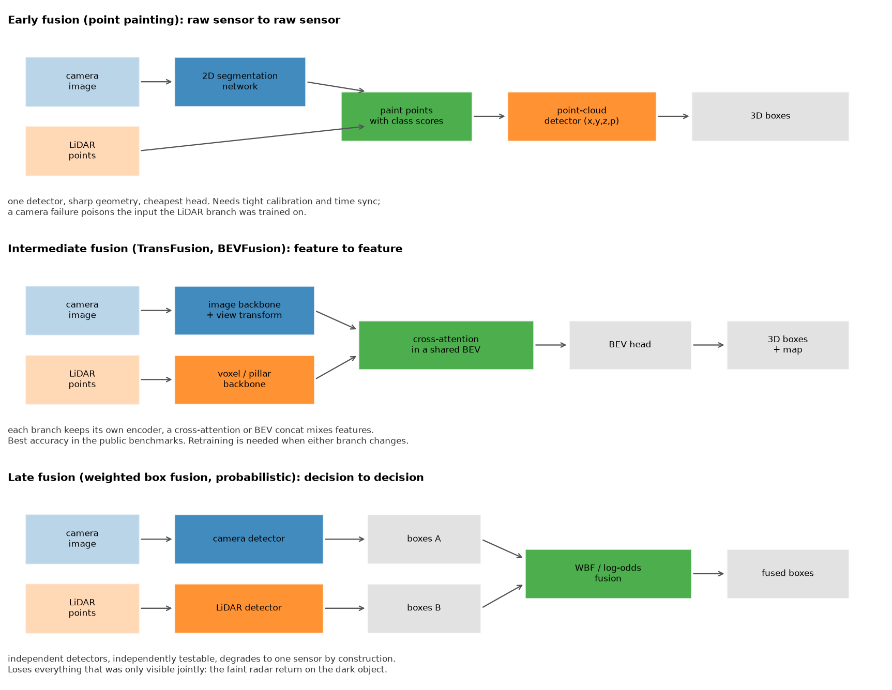

# Sensor fusion

> **Why this matters at staff level.** Fusion is where perception meets safety engineering.
> Junior answers describe three architectures and stop. Senior answers start from the failure
> case: what the system does when a camera is sun-blinded, when the LiDAR is in fog, when the
> radar returns a ghost off a manhole cover, and when an extrinsic has drifted by half a
> degree. Expect this in both the ML depth round and the system design round, and expect the
> interviewer to push until you commit to a design and name what it gives up.

## TL;DR, the interview card

* Three places to fuse. **Early** (raw to raw, point painting), **intermediate** (feature to
  feature, TransFusion and BEVFusion), **late** (decision to decision, weighted box fusion
  and log-odds). Accuracy usually ranks intermediate first; testability and graceful
  degradation rank late first.
* **PointPainting** projects LiDAR points into the camera's semantic segmentation and
  appends the class scores, so a point-cloud detector consumes $(x,y,z,p_1 \dots p_K)$. One
  network change, large gain, and a hard dependency on calibration and time sync.
* **Cross-attention fusion**: LiDAR BEV tokens are queries, camera tokens are keys and
  values. A key-padding mask implements sensor dropout, and with every camera key masked the
  block reduces to LiDAR-only by construction.
* **Log-odds fusion** for independent detections:
  $\operatorname{logit}(p) = \sum_i \operatorname{logit}(p_i) - (n-1)\operatorname{logit}(\pi)$.
  Two sensors at 0.7 with a 0.5 prior give 0.845; a sensor reporting the prior contributes
  nothing; 0.9 and 0.1 cancel exactly.
* **Radar** gives you radial velocity directly from the Doppler shift, works through fog and
  rain, and costs almost nothing. It gives you few points (hundreds per sweep against ~100k
  for LiDAR), poor azimuth resolution, no height on many automotive units, and returns off
  the ground and off metal that look like objects.
* **Latency alignment** is a separate problem from spatial alignment. Sensors run at
  different rates with different exposure times, so every measurement must be motion-
  compensated to a common timestamp before it is fused.
* The safety case wants **redundancy with independence**. Two sensors that fail on the same
  input (a camera and a camera-supervised depth model) provide less redundancy than their
  individual accuracies suggest.

## 1. Intuition first

Consider one scene: a dark-coloured van stopped in a lane at dusk, 70 m ahead, with rain.

The camera sees it as a low-contrast blob. Its detector is uncertain, and its depth estimate
at 70 m has metres of error. The LiDAR gets perhaps 20 returns on it at that range through
rain, enough to say "something is there" and give the range to within centimetres, but not
enough to classify it. The radar gets a strong return with a radial velocity of exactly 0 m/s
relative to the ground, which is both the most useful and the most dangerous fact in the
scene: most automotive radar pipelines historically filtered stationary returns aggressively
because the world is full of stationary metal (signs, bridges, manhole covers), and a
stationary vehicle looks the same as a bridge.

Each sensor has a piece. Fusion is deciding where in the pipeline those pieces meet.

{ width="860" }

Fuse **late** and each sensor makes its own call. The camera says "van, 0.4 confidence, 70 m
plus or minus 8 m", the LiDAR says "object, 0.6, 71.2 m", the radar says "something, 0 m/s".
A fusion rule combines them. Every branch is independently testable, and if the camera goes
dark the system loses one input without any other branch changing behaviour. What is lost is
the joint evidence: the LiDAR's 20 returns alone were below its detection threshold, and the
camera's blob alone was below its threshold, and no rule operating on the surviving
detections can recover the fact that they were the *same* 20 returns and the *same* blob.

Fuse **early** and the LiDAR detector sees points already carrying "vehicle" semantic scores
from the camera. The 20 returns are now 20 points labelled vehicle in a vehicle-shaped
arrangement, which clears the detector's threshold. The cost is that the two sensors are now
one system: a camera failure feeds the LiDAR branch inputs it never saw in training, and a
0.3-degree extrinsic error at 70 m paints the points with the semantics of whatever is
behind the van.

Fuse in the **middle** and each sensor keeps its own encoder, but the features mix before any
decision. That is where the accuracy numbers on public benchmarks come from, and it inherits
most of early fusion's coupling.

## 2. The math

### 2.1 Late fusion as evidence combination

Treat each sensor's detection probability as independent evidence for the hypothesis $H$
that an object exists at a location. By Bayes, with prior $\pi = P(H)$:

$$
\frac{P(H \mid e_1, \dots, e_n)}{P(\neg H \mid e_1, \dots, e_n)}
= \frac{P(H)}{P(\neg H)} \prod_{i=1}^{n} \frac{P(e_i \mid H)}{P(e_i \mid \neg H)} .
$$

Each sensor reports $p_i = P(H \mid e_i)$, so its likelihood ratio is
$\frac{p_i}{1 - p_i} \cdot \frac{1-\pi}{\pi}$. Substituting and taking logs:

$$
\boxed{\;\operatorname{logit} p_{\text{fused}} = \sum_{i=1}^{n} \operatorname{logit} p_i - (n-1)\operatorname{logit} \pi\;}
$$

Three sanity checks you should be able to do mentally. With $\pi = 0.5$ the correction term
vanishes and the rule is "add the logits". Two sensors at $p = 0.7$ give
$\operatorname{logit} = 0.847$ each, sum $1.695$, so $p_{\text{fused}} = 0.845$. A sensor at
$p = 0.5$ has zero logit and changes nothing, which is correct for an uninformative
observation. And $0.9$ with $0.1$ gives logits $+2.197$ and $-2.197$, summing to zero, so the
fused probability returns to the prior.

The independence assumption is the weak point and it is where the interview goes. Two cameras
on the same vehicle in the same fog are not independent. A camera detector and a
camera-supervised monocular depth model are close to fully dependent. When evidence is
correlated, this rule is overconfident, and the standard mitigations are to down-weight each
sensor's logit by a learned factor (equivalent to assuming partial dependence) or to
calibrate the fused score directly against held-out data.

### 2.2 Weighted box fusion

Log-odds handles existence. Geometry needs its own rule. Weighted Boxes Fusion clusters boxes
across models by IoU and averages coordinates weighted by confidence:

$$
b_{\text{fused}} = \frac{\sum_{m \in \mathcal{C}} s_m \, b_m}{\sum_{m \in \mathcal{C}} s_m},
\qquad
s_{\text{fused}} = \left( \frac{1}{|\mathcal{C}|}\sum_{m \in \mathcal{C}} s_m \right) \cdot \frac{\min(|\mathcal{C}|, M)}{M},
$$

where $\mathcal{C}$ is the cluster and $M$ is the number of models or sensors. The second
factor is the part worth explaining: a box found by one of three sensors has its score cut to
one third, because agreement is evidence and a single-sensor detection should not survive at
the same confidence as a triple-confirmed one.

The contrast with NMS matters. NMS *selects* one box and discards the rest, so it cannot
produce a box that no single model proposed, and a systematically biased model's box either
wins outright or is thrown away. WBF *averages*, so independent errors partially cancel. On a
cluster where the camera is biased 1 m long in range and the LiDAR is accurate, the weighted
average lands between them, which is worse than the LiDAR alone. That is the argument for
weighting by a per-sensor, per-attribute reliability rather than by raw confidence: use the
LiDAR's range and the camera's class.

### 2.3 Point painting

Project each LiDAR point into the image, look up the segmentation scores at the hit pixel,
and concatenate:

$$
\tilde p_i = \big[\, x_i,\; y_i,\; z_i,\; \sigma_1(u_i,v_i),\; \dots,\; \sigma_K(u_i,v_i) \,\big] \in \mathbb{R}^{3+K},
\qquad (u_i, v_i) = \pi\big(K, T_{\text{cam} \leftarrow \text{ego}}, p_i\big).
$$

The error analysis is short and worth carrying. A point at range $z$ with an extrinsic
angular error $\epsilon$ projects to a pixel displaced by $f \epsilon$ (independent of range,
since both the projection and the error scale the same way), but the *world* location that
pixel corresponds to is displaced by $z\epsilon$. So the painting is wrong whenever
$f\epsilon$ exceeds the pixel distance to a segmentation boundary. At $f = 1000$ and
$\epsilon = 0.3° = 0.0052$ rad, that is 5.2 pixels: fine in the middle of a large object,
wrong along every object boundary, and catastrophic for thin objects (poles, pedestrians at
range) whose entire width is a few pixels.

Time sync has the same character. With a 50 ms offset between the LiDAR sweep and the camera
exposure, a pedestrian walking at 1.5 m/s has moved 7.5 cm, and a vehicle at 15 m/s has moved
0.75 m, so the points on the vehicle get painted with whatever was behind it.

### 2.4 Cross-attention fusion

LiDAR BEV tokens $L \in \mathbb{R}^{N_q \times d}$ are queries, camera tokens
$C \in \mathbb{R}^{N_k \times d}$ are keys and values, with $H$ heads:

$$
\text{head}_h = \softmax\!\left( \frac{(L W^Q_h)(C W^K_h)^{\top}}{\sqrt{d_h}} + M \right) (C W^V_h),
\qquad
\hat L = L + \big[\text{head}_1; \dots; \text{head}_H\big] W^O,
$$

where $M_{ij} = -\infty$ for masked camera keys. This is soft association: rather than
assigning each LiDAR token to a fixed pixel through the calibration, the model learns which
camera tokens are relevant, which is TransFusion's argument for robustness to degraded image
conditions and to calibration error.

The degradation property is a design decision made explicit. With all camera keys masked the
softmax has no valid entries. Set the attention to zero and the context is zero, so
$\hat L = L + W^O \cdot 0 + b^O = L + b^O$: the LiDAR tokens pass through shifted only by the
output bias. A block that returns NaN, or that returns the unmasked average, would take the
whole stack down when one camera drops a frame.

### 2.5 Radar

An FMCW radar measures range from the beat frequency and radial velocity from the Doppler
shift:

$$
f_{\text{beat}} = \frac{2 R}{c}\,\frac{B}{T_{\text{chirp}}} + \frac{2 v_r}{\lambda},
\qquad
v_r = \frac{\lambda f_{\text{Doppler}}}{2},
$$

so velocity along the line of sight is a direct measurement, not a difference of positions.
That single property is why radar survives in every production stack: a tracker with a radar
measurement of $v_r$ converges on velocity in one frame instead of several.

The limitations follow from the physics and the aperture. Angular resolution is
approximately $\theta \approx \lambda / D$ for aperture $D$: at 77 GHz ($\lambda = 3.9$ mm)
with a 10 cm aperture, that is about 2.2 degrees, which at 100 m is 3.9 m of cross-range
uncertainty. Two vehicles side by side at 100 m merge into one return. Radial velocity is
also only the projection: a vehicle crossing perpendicular to the line of sight has
$v_r = 0$ and is indistinguishable from a stationary object on that measurement alone.

Learning on radar is hard for reasons worth naming precisely. The point clouds are sparse and
irregular, so convolutional inductive biases fit poorly. Returns are noisy in a
non-Gaussian way, with multipath ghosts that are stable across frames and therefore look like
real tracked objects. Different radar units and different signal-processing settings produce
different point statistics, so a model trained on one unit does not transfer. And public
datasets carry far less radar than camera or LiDAR data, with nuScenes' 5 radars being the
main large-scale source. The standard practical answer is to rasterise radar into a BEV
image with hit count, mean radial velocity and RCS channels, and let a BEV network consume it
alongside the other modalities.

## 3. Implementation

### 3.1 Late fusion

```python
def fuse_detection_probabilities(probs: np.ndarray, prior: float = 0.5) -> np.ndarray:
    """Independent-evidence fusion in log-odds."""
    eps = 1e-6
    p = np.clip(probs, eps, 1.0 - eps)          # (n, N)
    logit = np.log(p / (1.0 - p))               # (n, N)
    prior_logit = np.log(prior / (1.0 - prior))
    fused_logit = logit.sum(0) - (p.shape[0] - 1) * prior_logit  # (N,)
    return 1.0 / (1.0 + np.exp(-fused_logit))   # (N,)
```

The clip is load-bearing. A sensor that reports exactly 1.0 has infinite logit and makes the
fused probability 1.0 regardless of every other sensor, which is how one overconfident model
silently becomes the only model in the system. Clipping to $[10^{-6}, 1-10^{-6}]$ caps any
single sensor's contribution at about 13.8 logits.

Weighted box fusion clusters greedily in confidence order:

```python
    for idx in order:
        box, score = all_boxes[idx], all_scores[idx]
        if fused:
            ious = box_iou(box[None, :], np.stack(fused))[0]  # (F,)
            j = int(np.argmax(ious))
            if ious[j] >= iou_thr:
                clusters[j].append(int(idx))
                members = clusters[j]
                w = all_scores[members]                        # (m,)
                fused[j] = (all_boxes[members] * w[:, None]).sum(0) / w.sum()  # (4,) weighted mean
                continue
        clusters.append([int(idx)])
        fused.append(box.copy())
```

Each box is matched against the *current fused box* of each cluster, not against the original
seed, so the cluster centre moves as members join. Processing in descending confidence means
the highest-confidence box seeds each cluster and therefore dominates its early position.

### 3.2 Early fusion: point painting

```python
def point_painting(points_ego: np.ndarray, seg_scores: np.ndarray, camera: Camera) -> np.ndarray:
    k, h, w = seg_scores.shape
    pixels, _, valid = camera.project(points_ego)                  # (N, 2), (N,), (N,)
    painted = np.zeros((points_ego.shape[0], k))                   # (N, K)
    u = np.clip(pixels[valid, 0].astype(np.int64), 0, w - 1)       # (M,) nearest pixel column
    v = np.clip(pixels[valid, 1].astype(np.int64), 0, h - 1)       # (M,)
    painted[valid] = seg_scores[:, v, u].T                         # (M, K)
    return np.concatenate([points_ego, painted], axis=1)           # (N, 3 + K)
```

Points with no valid projection get a zero vector, which is a meaningful state: it says "no
camera evidence" and differs from "camera says background", which would be a one-hot on the
background class. Downstream networks should be able to tell those apart, so in production
you add an explicit validity channel instead of relying on the all-zeros pattern.

Nearest-neighbour lookup is used deliberately. Bilinear interpolation of class scores across
a segmentation boundary produces a blend of two classes at exactly the pixels where the
painting is most likely to be wrong, which manufactures confident-looking mixtures.

### 3.3 Intermediate fusion: cross-attention

```python
    def forward(self, lidar, camera, camera_mask=None):
        b, nq, d = lidar.shape
        nk = camera.shape[1]
        q = self.q_proj(lidar).view(b, nq, self.h, self.d_head).transpose(1, 2)    # (B, H, Nq, d_head)
        k = self.k_proj(camera).view(b, nk, self.h, self.d_head).transpose(1, 2)   # (B, H, Nk, d_head)
        v = self.v_proj(camera).view(b, nk, self.h, self.d_head).transpose(1, 2)   # (B, H, Nk, d_head)
        scores = torch.matmul(q, k.transpose(-1, -2)) / (self.d_head ** 0.5)       # (B, H, Nq, Nk)
        if camera_mask is not None:
            scores = scores.masked_fill(camera_mask.view(b, 1, 1, nk), float("-inf"))  # (B, H, Nq, Nk)
        attn = torch.softmax(scores, dim=-1)                                       # (B, H, Nq, Nk)
        attn = torch.nan_to_num(attn, nan=0.0)   # all keys masked → zero context, not NaN
        ctx = torch.matmul(attn, v)                                                # (B, H, Nq, d_head)
        ctx = ctx.transpose(1, 2).reshape(b, nq, d)                                # (B, Nq, d) concat heads
        return lidar + self.out_proj(ctx)                                          # (B, Nq, d) residual
```

Q, K and V are three separate `nn.Linear` calls so that the asymmetry is visible: the query
comes from LiDAR and the key and value from camera. The `nan_to_num` after the softmax is the
graceful-degradation guarantee from §2.4, and the test for it asserts that with every camera
key masked the output equals `lidar + out_proj.bias` exactly.

??? example "Full implementation"
    ```python
    --8<-- "src/mlbook/perception/fusion.py"
    ```

**How you would test it.** Fusion has unusually testable properties. WBF must merge two boxes
with known IoU into the confidence-weighted mean and must halve the score of a
single-sensor detection. Log-odds must reproduce the three hand-computable cases from §2.1.
Point painting must give a point projecting to the left half of the image the left half's
class and must leave a point behind the camera unpainted. Cross-attention fusion must match
`torch.nn.MultiheadAttention` exactly when given the same weights (which catches every
transpose and scaling error), and must degrade to the identity plus bias under a full mask.

## Retype by hand

| Symbol | File | Target time | Why |
|---|---|---|---|
| `fuse_detection_probabilities` | `src/mlbook/perception/fusion.py` | 8 minutes | Six lines, and the derivation behind them is a standard interview ask. |
| `weighted_boxes_fusion` | `src/mlbook/perception/fusion.py` | 20 minutes | Greedy clustering with a moving centre; the score penalty is easy to forget. |
| `point_painting` | `src/mlbook/perception/fusion.py` | 12 minutes | Projection, validity mask, nearest-pixel lookup. |
| `CrossAttentionFusion.forward` | `src/mlbook/perception/fusion.py` | 18 minutes | Multi-head attention with a key-padding mask and the all-masked case. |

Read but do not retype: `box_iou` (you already know it from detection),
`radar_points_to_bev` (a rasterisation loop, useful to read for the channel choice).

Check yourself with:

```bash
pytest tests/test_perception_fusion.py -q
```

Target: 55 minutes for all four symbols with the file green. The cross-attention test
compares against `torch.nn.MultiheadAttention`, so it will catch a wrong scale factor or a
transposed projection, which a shape-only test would not.

## 4. Systems view: cost, failure modes, trade-offs

| Situation | Use | Decision rule |
|---|---|---|
| Maximum accuracy on a benchmark, one team owns the whole stack | Intermediate (BEVFusion, TransFusion) | Joint features beat joint decisions when you can retrain everything together |
| Separate teams own camera and LiDAR, separate release cadences | Late | The interface is boxes, so each side ships independently |
| A safety case needs an argument about independent channels | Late, with independently-trained branches | You can state what happens when channel A fails without reasoning about channel B's activations |
| LiDAR detector exists and works, you want a cheap gain | Early (point painting) | One input-format change, no architecture change |
| Camera plus radar, no LiDAR (cost-constrained platform) | Intermediate in BEV | Radar is too sparse for late fusion to have anything to associate with |
| Sensors at different rates, tight latency | Late, with per-sensor motion compensation to a common timestamp | Asynchronous inputs are easier to handle at the decision level |

**Latency alignment.** Cameras at 30 Hz, LiDAR at 10 Hz with a 100 ms sweep, radar at 13 Hz,
IMU at 200 Hz. Fusing measurements taken at different instants as though they were
simultaneous introduces an error of $v \Delta t$. The standard handling has three parts.
First, timestamp everything at the sensor, not at arrival, with hardware sync where
available. Second, motion-compensate: for a LiDAR sweep, each point is captured at a known
time within the sweep, so transform each point into the pose at a common reference time using
IMU-integrated ego motion. Third, propagate to a common time in the tracker: the Kalman
filter's predict step (chapter 4) exists precisely to move a state estimate to the time of
the next measurement, so a late-arriving radar measurement at time $t_r$ is applied after
predicting to $t_r$, not to the current time.

**Sensor failure and degradation.** Failure is easy; degradation is the hard case. A camera
that returns black frames is detectable. A camera looking through a partially fogged lens
returns plausible images with reduced contrast, its detector returns fewer and lower-scoring
detections, and nothing in the system flags it. The mitigations that get mentioned in strong
answers:

* **Per-sensor health monitors** that are independent of the detectors: image sharpness and
  histogram statistics, LiDAR return rate against expected range distribution, radar noise
  floor. These detect degradation before the task metrics do.
* **Cross-sensor consistency as a monitor.** The rate at which LiDAR detections lack a camera
  detection within a gate is a strong degradation signal, and it also catches calibration
  drift.
* **Trained-in dropout.** Randomly masking a sensor during training is what makes the
  masked-attention path in §2.4 produce a useful output instead of an out-of-distribution
  one. A model that has never seen a masked camera at training time will not degrade
  gracefully at test time no matter what the architecture allows.
* **A fallback policy, not a fallback model.** When a sensor degrades, the correct response is
  usually to reduce operational speed and increase following distance, since no perception
  architecture recovers information the sensor did not collect.

**Redundancy and independence.** A safety argument of the form "two independent channels each
with failure probability $10^{-4}$ give $10^{-8}$" requires the independence to be real.
Camera and LiDAR fail independently in fog only to the extent that their physics differ, and
both degrade in heavy fog. Camera and radar are closer to independent in weather and
correlated in nothing much else, which is the argument for keeping radar even on
camera-and-LiDAR platforms. State the common-cause failures explicitly: power, compute,
time sync, the calibration database, and the shared software that reads all three.

**Calibration drift.** Extrinsics move: thermal cycling, vibration, a kerb strike, a
windscreen replacement. Online calibration monitoring compares the reprojection of tracked
static features across sensor pairs and raises an alarm on a systematic residual. Systems
that fuse early are the most exposed, because a drift silently corrupts the input features
with no downstream signal, while a late-fusion system sees its association rate drop, which is
observable.

## 5. In production

!!! production "nuTonomy and Motional, PointPainting, the cheapest useful fusion"
    PointPainting projects LiDAR points into an image-only semantic segmentation network's
    output and appends the class scores to each point, so any LiDAR-only detector can consume
    it unchanged. They report improvements across three different detectors (PointRCNN,
    VoxelNet, PointPillars) on KITTI and nuScenes. The design property that made it adoptable
    is that the interface between the two networks is the point-cloud format, so teams could
    add it without merging their codebases.
    Source: [PointPainting (arXiv 1911.10150)](https://arxiv.org/abs/1911.10150).

!!! production "HKUST and others, TransFusion, soft association for bad image conditions"
    TransFusion uses a transformer decoder whose first layer predicts initial boxes from
    LiDAR with a sparse set of object queries, and whose second layer fuses those queries with
    image features. The stated motivation is robustness: hard association through the
    calibration breaks under degraded image quality and sensor misalignment, while attention
    lets the model decide how much image evidence to use per object.
    Source: [TransFusion (arXiv 2203.11496)](https://arxiv.org/abs/2203.11496).

!!! production "MIT, BEVFusion, the shared space as the fusion mechanism"
    BEVFusion's argument is that projecting camera features into LiDAR points (as point
    painting does) discards camera semantics, because only the points get painted and the
    rest of the image is thrown away. Unifying both modalities in a shared BEV grid preserves
    geometry and semantics together, supports detection and map segmentation from the same
    trunk, and is where their 13.6% mIoU gain on BEV map segmentation comes from.
    Source: [BEVFusion (arXiv 2205.13542)](https://arxiv.org/abs/2205.13542).

!!! production "Aurora, testing fusion offline at scale"
    Aurora's public writing about its Virtual Testing Suite describes converting real on-road
    events into virtual tests, including perception tests, and running millions of off-road
    tests per day. They are explicit that sensor simulation has limits: dust, smog and exhaust
    are difficult to simulate accurately, so the perception system still needs real examples
    of them. For a fusion interview this is the answer to "how do you validate degradation
    handling": you replay real degraded logs, and you accept that synthetic degradation covers
    only the failure modes you thought to model.
    Sources: [Virtual Testing: The Invisible Accelerator](https://aurora.tech/newsroom/virtual-testing-the-invisible-accelerator),
    [Online to Offline](https://aurora.tech/newsroom/online-to-offline).

!!! production "Nuro, an ML-first perception and behaviour stack"
    Nuro describes ML-first detection, tracking and segmentation feeding its perception
    engine, with the Nuro Driver targeting multiple vehicle types and running on NVIDIA DRIVE
    hardware. Their public material also describes combining real-time perception with
    low-cost map priors and doing real-time sensor calibration, which is the operational side
    of the calibration-drift problem described above.
    Sources: [Nuro technology](https://www.nuro.ai/technology),
    [Unlocking Freeway Autonomy](https://www.nuro.ai/blog/unlocking-freeway-autonomy).

## 6. Interview questions and strong answers

!!! interview "Early, intermediate or late fusion. Pick one for a robotaxi and defend it."
    I would run intermediate fusion for the primary detection path and keep an independent
    late-fusion channel for the safety monitor. The primary path needs the accuracy that only
    joint features give, particularly for partially-observed objects where neither sensor
    alone clears its threshold. The monitor needs independence more than accuracy: a separate
    LiDAR-only detector whose output is combined with the primary path by a simple rule gives
    you something to state in a safety case, because you can characterise its failure
    behaviour without reasoning about the primary model's activations.

    What that costs: two models to train, serve and monitor, and a fusion rule between the
    primary and the monitor that has to be conservative enough to be useful and not so
    conservative that it brakes constantly. I would also need the primary path trained with
    sensor dropout so its degraded behaviour is in-distribution.

    **Staff-level follow-up: how do you set the threshold on the monitor?** From the required
    false-negative rate on the hazard class, propagated backwards. Pick the operating point on
    the monitor's own precision-recall curve that achieves the miss rate the safety case
    requires, then measure the resulting false-positive rate and check whether the comfort
    cost (unnecessary braking events per 1000 km) is acceptable. If it is not, the monitor
    needs to be better, not the threshold moved.

!!! interview "Derive the log-odds fusion rule and tell me when it is wrong."
    [Derivation as in §2.1.] The rule assumes conditional independence of the sensor
    observations given the hypothesis. It is wrong exactly when that fails.

    Concrete failures. Two cameras on the same vehicle in fog share the cause of their errors,
    so their agreement is not twice the evidence. A camera detector and a monocular depth
    model driven by the same camera are nearly fully dependent, so combining them can push a
    0.6 to a 0.9 with no new information. A camera detector and a LiDAR detector trained on
    the same auto-labelled dataset share label errors, so they agree on the same mistakes.

    Mitigations: down-weight each logit by a learned scalar, which is equivalent to assuming
    partial dependence and is fit on held-out data; or skip the analytic rule and learn the
    fusion directly, taking per-sensor scores and agreement features as input. The practical
    check is calibration: plot the fused probability against the empirical frequency, and if
    the curve bows above the diagonal the independence assumption is making you overconfident.

!!! interview "Point painting gives a big accuracy gain. What would make you refuse to ship it?"
    Three conditions. First, if calibration cannot be monitored online. Point painting turns
    a calibration error into a silent input corruption with no downstream symptom, unlike
    late fusion where drift shows up as a falling association rate. Without a monitor I have
    no way to know it has happened.

    Second, if the segmentation model and the LiDAR detector are owned by teams with
    independent release cadences. The painted channels are a learned interface: if the
    segmentation model's class distribution shifts after a retrain, the detector's input
    distribution shifts with no API change and no test failure. That needs joint versioning
    and a joint evaluation gate.

    Third, if the safety case depends on the LiDAR channel being independent of the camera.
    Painting destroys that independence by construction, and I would rather keep an unpainted
    LiDAR detector as the independent channel and use the painted one as the primary.

    **Staff-level follow-up: how would you keep most of the gain without the coupling?** Train
    the LiDAR detector with painting randomly dropped (a fraction of batches see zeroed
    semantic channels), so the same weights work with and without camera input. You lose a
    little peak accuracy and get a model whose camera-free behaviour is in-distribution.

!!! interview "Why is radar hard to learn on, and what would you do about it?"
    Four reasons. Sparsity: hundreds of points per sweep against roughly 100k for LiDAR, so
    per-point architectures have little to work with. Non-Gaussian noise: multipath ghosts are
    stable across frames, so they look like real objects to both a tracker and a learned
    model. Poor angular resolution: about 2 degrees at 77 GHz with a typical automotive
    aperture, which is 3.5 m of cross-range uncertainty at 100 m, so adjacent objects merge.
    And data: public radar datasets are much smaller than camera datasets, and radar output
    depends on the unit and its signal-processing configuration, so models do not transfer
    between hardware revisions.

    What I would do: rasterise into a BEV image with hit count, mean radial velocity and RCS
    channels, so a BEV convolutional or attention backbone can consume it alongside camera
    and LiDAR features in the same grid. Use radar primarily where it is strong, which is
    radial velocity as a measurement into the tracker rather than as a detection source. And
    keep the raw or low-level radar data (range-Doppler tensors before the vendor's detection
    logic) if the hardware allows it, because the vendor's thresholding throws away exactly
    the weak returns that a learned model could use.

    **Staff-level follow-up: what about stationary objects?** Radial velocity near zero
    relative to the ground is the signature of both a stopped vehicle and a bridge, and legacy
    radar pipelines filtered those aggressively to control false braking. The modern answer is
    to keep stationary returns and resolve the ambiguity with the other sensors and with
    elevation, if the unit measures it, rather than filtering at the radar level where you
    have the least context.

!!! interview "A camera is partially occluded by dirt. Nothing alarms. Walk me through detection and response."
    Detection has to be independent of the detector, because the detector's own confidence
    degrades smoothly and plausibly. Three monitors: image statistics (local contrast and
    high-frequency energy per image region, compared against a rolling baseline for that
    camera), cross-sensor association rate (the fraction of LiDAR detections in this camera's
    field of view that have a matching camera detection, compared against the other cameras
    as a control), and temporal stability (a dirt spot is fixed in image coordinates while the
    scene moves, so a per-pixel temporal variance map shows a persistent low-variance region).

    The third monitor is the most specific to this failure, and the second is the most
    general, because it also catches calibration drift and detector regressions.

    Response: degrade the operational envelope rather than trying to compensate in perception.
    Reduce speed, increase following distance, avoid manoeuvres that depend on that camera's
    field of view (an unprotected turn that needs the side camera), and route the vehicle to
    service. Compensating by trusting the other sensors more is acceptable only if the model
    was trained with that camera dropped, otherwise you are running out of distribution.

!!! interview "Your LiDAR arrives 80 ms after the camera frame it should be fused with. What do you do?"
    Do not fuse them as simultaneous. Two options depending on the architecture.

    If the tracker is the fusion point, use the Kalman predict step: the camera measurement is
    applied at its timestamp, the state is predicted forward to the LiDAR timestamp, and the
    LiDAR measurement is applied there. That is the natural handling for asynchronous sensors
    and one of the reasons a filter-based tracker survives in stacks that are otherwise
    end-to-end.

    If the fusion is in the network, motion-compensate the older measurement to the newer
    timestamp using IMU-integrated ego motion, which corrects the ego's own motion exactly and
    leaves other agents' motion as residual error (bounded by their relative speed times 80
    ms, so 1.2 m for a vehicle closing at 15 m/s). For that residual, either feed the time
    delta as an input feature so the model can learn the correction, or buffer and fuse at a
    fixed cadence keyed to the slowest sensor, paying latency for alignment.

    **Staff-level follow-up: what if the delay is variable?** Then it must be measured per
    frame and passed downstream, never assumed. A fixed-delay assumption with variable actual
    delay produces errors that correlate with system load, which means the perception quality
    degrades exactly when the compute is busiest.

## 7. Exercises

**★ Exercise 1.** Three sensors report 0.8, 0.6 and 0.3 for the same object, with a prior of
0.5. What is the fused probability? What if the prior is 0.1?

??? success "Solution"
    Logits: $\operatorname{logit}(0.8) = 1.386$, $\operatorname{logit}(0.6) = 0.405$,
    $\operatorname{logit}(0.3) = -0.847$. Sum is $0.944$. With $\pi = 0.5$ the correction is
    zero, so $p = \sigma(0.944) = 0.720$.

    With $\pi = 0.1$, $\operatorname{logit}(0.1) = -2.197$, and the correction subtracts
    $2 \times (-2.197) = -4.394$, so the fused logit is $0.944 + 4.394 = 5.338$ and
    $p = 0.995$. The low prior means each sensor's 0.8 represents far more evidence than it
    would under a 0.5 prior, and three such observations compound. Getting the prior wrong in
    this direction produces wildly overconfident fusion, which is why the prior should be
    measured (the base rate of objects per proposal) and not assumed.

**★ Exercise 2.** An extrinsic rotation error of 0.5 degrees. What is the painting error in
pixels at $f = 1200$, and what is the world displacement at 40 m?

??? success "Solution"
    $0.5° = 8.73 \times 10^{-3}$ rad. Pixel displacement is $f\epsilon = 10.5$ pixels,
    independent of range. World displacement at 40 m is $z\epsilon = 0.35$ m. The pixel figure
    tells you how likely you are to cross a segmentation boundary (very likely for a
    pedestrian, whose image width at 40 m may be 20 pixels), and the world figure tells you
    how far off the resulting object localisation is.

**★★ Exercise 3.** Show that weighted box fusion of two boxes with confidences $s_1 > s_2$
produces a box strictly between them, and give a case where that is worse than picking the
higher-confidence box.

??? success "Solution"
    $b = (s_1 b_1 + s_2 b_2)/(s_1 + s_2) = b_1 + \frac{s_2}{s_1+s_2}(b_2 - b_1)$, and since
    $0 < s_2/(s_1+s_2) < 1$ the result lies strictly between $b_1$ and $b_2$ on every
    coordinate.

    It is worse when one sensor is biased and the other is accurate on that coordinate. A
    camera's range estimate at 60 m may be biased 2 m long with confidence 0.9, while the
    LiDAR is accurate to 0.1 m with confidence 0.7. The fused range is
    $0.1 + \frac{0.7}{1.6}(-2.0 - 0.1)$ relative to truth, roughly 1.0 m long, which is ten
    times the LiDAR's own error. The fix is per-attribute weighting: take the range from the
    sensor with the lower range variance and the class from the sensor with the better
    classifier, instead of averaging everything by a single scalar confidence.

**★★ Exercise 4 (coding).** Extend `fuse_detection_probabilities` to accept per-sensor
reliability weights $w_i \in [0,1]$ that scale each logit, and verify that $w = 0$ makes a
sensor irrelevant and $w = 1$ recovers the original rule.

??? success "Solution"
    ```python
    import numpy as np
    from mlbook.perception.fusion import fuse_detection_probabilities

    def fuse_weighted(probs: np.ndarray, weights: np.ndarray, prior: float = 0.5) -> np.ndarray:
        """probs (n, N), weights (n,) → (N,). w_i scales sensor i's log-odds contribution."""
        eps = 1e-6
        p = np.clip(probs, eps, 1.0 - eps)                      # (n, N)
        logit = np.log(p / (1.0 - p))                           # (n, N)
        prior_logit = np.log(prior / (1.0 - prior))
        # An effective sensor count of sum(w) keeps the prior correction consistent.
        fused = (weights[:, None] * logit).sum(0) - (weights.sum() - 1.0) * prior_logit  # (N,)
        return 1.0 / (1.0 + np.exp(-fused))

    probs = np.array([[0.7, 0.9], [0.7, 0.2]])
    assert np.allclose(fuse_weighted(probs, np.ones(2)), fuse_detection_probabilities(probs))
    one_only = fuse_weighted(probs, np.array([1.0, 0.0]))
    assert np.allclose(one_only, probs[0])   # a zero-weight sensor contributes nothing
    ```

    The fractional weight is equivalent to assuming the sensor's evidence is partially
    redundant with the others. Fitting $w$ by maximum likelihood on held-out labelled data is
    a two-parameter logistic regression, and it is a much better use of a day than tuning
    thresholds.

**★★ Exercise 5.** Your cross-attention fusion block is trained with all sensors always
present. At test time you mask the camera. Predict what happens and design the training
change that fixes it.

??? success "Solution"
    The architecture returns `lidar + out_proj.bias`, which is a well-defined tensor, but the
    LiDAR branch's features were shaped during training on the assumption that the residual
    from camera context would arrive. The BEV head downstream has never seen the
    camera-context-free distribution, so its outputs are out of distribution: typically
    under-confident detections and systematic localisation bias, often worse than a
    LiDAR-only model trained from scratch.

    The fix is modality dropout during training: with some probability per batch (and per
    camera, not only all-or-nothing) mask the camera keys, so the model learns both regimes.
    Add a per-sample flag indicating which sensors are present if you want the model to adapt
    rather than average over the two regimes. Evaluate the degraded configuration as a
    first-class metric, not as an afterthought, because a model that scores well with all
    sensors and collapses with one missing is not deployable.

**★★★ Exercise 6.** Design the online calibration monitor referred to in §4. Specify the
signal, the statistic, the alarm threshold and what happens when it fires.

??? success "Solution"
    Signal: for each camera and LiDAR pair, take LiDAR points that fall on tracked static
    objects (poles, sign posts, building edges are ideal because they are thin and
    high-contrast), project them into the image with the current extrinsics, and measure the
    signed distance from the projected point to the nearest image edge of the same structure.

    Statistic: the mean signed residual per camera over a sliding window of several thousand
    projections, decomposed into the directions that correspond to yaw, pitch and roll errors.
    A calibration error produces a nonzero mean; noise produces a zero-mean distribution. Use
    the mean (not the variance) because that is what separates a systematic error from
    ordinary measurement noise.

    Threshold: set it in metric terms at the range you care about. If 0.3 m of lateral error
    at 50 m is the tolerance, that is $\epsilon = 6$ mrad, which at $f = 1200$ is 7.2 pixels
    of mean residual. Set the alarm below that with margin, and require persistence across
    several windows to avoid alarming on a single bad tracking segment.

    Response: three levels. Log and trend for small residuals (drift tracking over weeks).
    Apply an online correction for medium residuals if the estimator is well conditioned,
    with the correction bounded and logged. For large residuals, treat the camera as degraded,
    fall back to the operational envelope described in §4, and flag the vehicle for service.
    Never apply an unbounded automatic correction: a bug in the estimator then becomes a
    miscalibration, and you have removed the check that would have caught it.

## References

* Sourabh Vora et al. "PointPainting: Sequential Fusion for 3D Object Detection." CVPR 2020. [arXiv:1911.10150](https://arxiv.org/abs/1911.10150)
* Xuyang Bai et al. "TransFusion: Robust LiDAR-Camera Fusion for 3D Object Detection with Transformers." CVPR 2022. [arXiv:2203.11496](https://arxiv.org/abs/2203.11496)
* Zhijian Liu et al. "BEVFusion: Multi-Task Multi-Sensor Fusion with Unified Bird's-Eye View Representation." ICRA 2023. [arXiv:2205.13542](https://arxiv.org/abs/2205.13542)
* Holger Caesar et al. "nuScenes: A multimodal dataset for autonomous driving." CVPR 2020. [arXiv:1903.11027](https://arxiv.org/abs/1903.11027)
* Roman Solovyev, Weimin Wang and Tatiana Gabruseva. "Weighted Boxes Fusion: Ensembling boxes from different object detection models." Image and Vision Computing, 2021.
* Aurora. "Virtual Testing: The Invisible Accelerator." [aurora.tech](https://aurora.tech/newsroom/virtual-testing-the-invisible-accelerator)
* Aurora. "Online to Offline: Turning real-world experience into virtual tests." [aurora.tech](https://aurora.tech/newsroom/online-to-offline)
* Nuro. "Technology." [nuro.ai](https://www.nuro.ai/technology)
