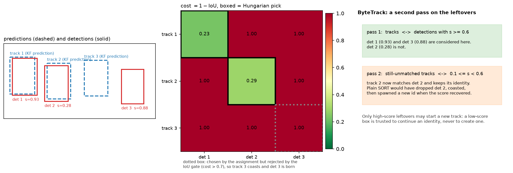
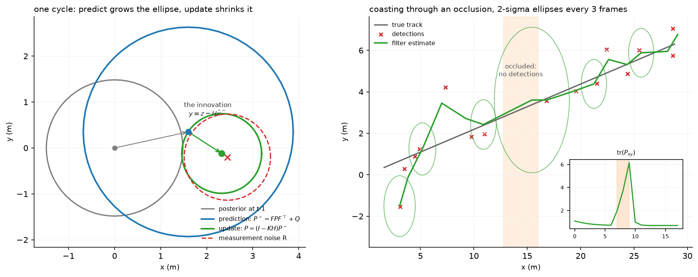

# Tracking

> **Why this matters at staff level.** Tracking is the most likely live-coding round in an
> autonomy interview, because SORT is small enough to write in 40 minutes and deep enough to
> separate people. It is also where a perception system's errors become visible to the
> planner: a detector that misses one frame is a blip, a tracker that swaps two identities
> sends a vehicle's velocity to the wrong object and the planner brakes for a ghost. Expect
> to derive the Kalman filter, implement Hungarian matching, and argue about metrics.

## TL;DR, the interview card

* A tracker turns per-frame detections into persistent identities with state. The loop is
  **predict, associate, update, manage births and deaths**, and every tracker in production
  is a variation on those four steps.
* **Kalman filter**: predict $\hat x^- = F\hat x$, $P^- = FPF^\top + Q$; update
  $S = HP^-H^\top + R$, $K = P^-H^\top S^{-1}$, $\hat x = \hat x^- + K(z - H\hat x^-)$,
  $P = (I - KH)P^-$. The gain $K$ is the ratio of prior uncertainty to total uncertainty in
  measurement space.
* **Hungarian matching** solves the minimum-cost assignment in $O(n^2 m)$ with dual
  potentials. Greedy matching is $O(nm\log nm)$ and can be arbitrarily worse; on a crossing
  pair it makes exactly the swap you were trying to avoid.
* **SORT**: Kalman per track with state $[c_x, c_y, s, r, \dot c_x, \dot c_y, \dot s]$, IoU
  cost, Hungarian assignment, an IoU gate, birth on unmatched detection, death after
  `max_age` misses. It reported 260 Hz on the tracking components alone.
* **DeepSORT** adds appearance embeddings with cosine distance, a Mahalanobis gate at the
  95% chi-squared quantile (9.4877 for 4 degrees of freedom), and a matching cascade that
  gives recently-seen tracks first pick.
* **ByteTrack** keeps the low-score detections for a second association pass against
  still-unmatched tracks. Occluded objects produce low-score boxes, and throwing them away is
  what breaks tracks.
* **Metrics**: MOTA is detection-dominated and can be negative; IDF1 measures identity
  consistency after a global assignment; HOTA is $\sqrt{\text{DetA} \cdot \text{AssA}}$ and
  separates detection quality from association quality, which is why it is now the default.

## 1. Intuition first

A detector gives you, at frame $t$, a set of boxes with no memory. The planner needs
something else: "the vehicle with id 7, which has been there for 3 seconds, is moving at 12
m/s and is about to enter my lane". Turning the first into the second requires answering two
questions every frame. Where should each existing track be now, and which of the new
detections is which track?

The first question is prediction under a motion model, and the answer carries uncertainty
that grows with time since the last observation. The second is assignment, and it needs a
cost that says how well each detection explains each prediction.

Take three tracks and three detections. Track 1 is a vehicle moving left to right, track 2 a
vehicle moving right to left, and they cross. At the crossing frame, the two predictions are
nearly coincident and the two detections are nearly coincident, so the IoU costs are almost
symmetric. Greedy matching picks the single best pair first, which under noise may be
(track 1, detection 2), and then the only remaining option is (track 2, detection 1): both
identities swap, and both vehicles now have their velocity reversed. The Hungarian algorithm
minimises the total cost over the whole matrix, so if the sum of the correct pairing is lower
by any margin it finds it. The motion model is what creates that margin: the prediction for
track 1 is displaced in its direction of travel, so it overlaps the correct detection more.

{ width="900" }

The left panel shows three predictions and three detections. Detection 3 is far from every
prediction; detection 2 is a low-score box from a partially occluded object. The middle panel
is the cost matrix with the Hungarian picks boxed: two are accepted and one is rejected by the
IoU gate, which is the mechanism by which a track coasts and a new track is born. The right
panel is ByteTrack's addition, which is entirely about detection 2.

## 2. The math

### 2.1 The Kalman filter, derived

Assume a linear-Gaussian model. State $x_t \in \mathbb{R}^n$, measurement
$z_t \in \mathbb{R}^m$:

$$
x_t = F x_{t-1} + w_t, \quad w_t \sim \mathcal{N}(0, Q), \qquad
z_t = H x_t + v_t, \quad v_t \sim \mathcal{N}(0, R),
$$

with $w$ and $v$ independent of each other and of the state. Suppose the posterior after
$t-1$ is $x_{t-1} \mid z_{1:t-1} \sim \mathcal{N}(\hat x, P)$.

**Predict.** A linear map of a Gaussian is Gaussian, with
$\E[Fx + w] = F\hat x$ and
$\operatorname{Cov}[Fx + w] = F P F^\top + Q$:

$$
\boxed{\;\hat x^- = F \hat x, \qquad P^- = F P F^\top + Q\;}
$$

**Update.** Consider the joint distribution of the state and the not-yet-seen measurement.
Both are linear functions of Gaussians, so they are jointly Gaussian:

$$
\begin{bmatrix} x_t \\ z_t \end{bmatrix} \;\Big|\; z_{1:t-1}
\;\sim\; \mathcal{N}\!\left(
\begin{bmatrix} \hat x^- \\ H\hat x^- \end{bmatrix},
\begin{bmatrix} P^- & P^- H^\top \\ H P^- & H P^- H^\top + R \end{bmatrix}
\right).
$$

The cross-covariance is $\operatorname{Cov}[x, Hx + v] = P^- H^\top$ because $v$ is
independent of $x$. Now apply the Gaussian conditioning identity
([Part I](../part01-math/03-probability.md)): for jointly Gaussian $(a, b)$,

$$
a \mid b \sim \mathcal{N}\big( \mu_a + \Sigma_{ab}\Sigma_{bb}^{-1}(b - \mu_b), \; \Sigma_{aa} - \Sigma_{ab}\Sigma_{bb}^{-1}\Sigma_{ba} \big).
$$

Substituting $a = x_t$, $b = z_t$ and writing $S = HP^-H^\top + R$ for the innovation
covariance and $K = P^-H^\top S^{-1}$ for the gain:

$$
\boxed{\;\hat x = \hat x^- + K(z - H\hat x^-), \qquad P = P^- - K H P^- = (I - KH)P^-\;}
$$

That is the whole derivation, and it is four lines once you have the conditioning identity.
An interviewer asking you to "derive the Kalman filter" is asking for exactly this.

**What the gain means.** In the scalar case with $F = H = 1$:
$K = P^- / (P^- + R)$. If the prediction is certain ($P^- \to 0$) then $K \to 0$ and the
measurement is ignored. If the measurement is certain ($R \to 0$) then $K \to 1$ and the
prediction is discarded. $K$ is the fraction of the innovation you believe.

**The Joseph form.** The implementation uses
$P = (I-KH)P^-(I-KH)^\top + KRK^\top$ instead of $(I-KH)P^-$. They are algebraically equal
at the optimal gain, but the Joseph form is a sum of two symmetric positive semi-definite
terms, so it stays symmetric and positive semi-definite under floating-point error and under
a suboptimal $K$. The short form can drift asymmetric and eventually indefinite, at which
point the filter diverges and nobody can explain why. Interviewers who have run a tracker in
production ask about this.

**Mahalanobis gating.** The innovation $y = z - H\hat x^-$ has covariance $S$ under the
model, so $y^\top S^{-1} y \sim \chi^2_m$. Gating at the 95th percentile of $\chi^2_4$ gives
the threshold 9.4877 that DeepSORT uses for a 4-dimensional box measurement. A measurement
outside the gate is rejected before the assignment sees it, which prevents a distant
detection from being matched merely because nothing closer was available.

{ width="880" }

The left panel is one cycle. The prediction inflates the covariance by $Q$, the update
shrinks it, and the posterior mean sits between the prediction and the measurement at a
position set by $K$. The right panel runs 18 frames with three missed detections in the
middle: the ellipses grow while the track coasts on its motion model, and the trace of the
position covariance in the inset spikes and then collapses when detections resume. That
growth is what makes the Mahalanobis gate widen during an occlusion, which is correct
behaviour: a track you have not seen for three frames should accept a measurement further
from its prediction.

**Extended and unscented, as literacy.** When $f$ or $h$ is nonlinear, the EKF linearises
with Jacobians, $F \to \partial f/\partial x$ evaluated at the current estimate, and is cheap
but biased when the nonlinearity is strong over the width of the covariance. The UKF instead
propagates $2n+1$ sigma points through the true nonlinearity and refits a Gaussian, costing
$2n+1$ function evaluations and capturing the mean and covariance to higher order with no
Jacobians. For a constant-turn-rate bicycle model of a vehicle, which is where AV trackers
actually go nonlinear, the UKF is usually worth its cost; for a constant-velocity box in
image space, the system is linear and neither is needed.

### 2.2 The Hungarian algorithm

Minimise $\sum_i C[i, \sigma(i)]$ over injective $\sigma$. The dual formulation maintains
potentials $u_i$ on rows and $v_j$ on columns with $u_i + v_j \le C_{ij}$, and an edge is
*tight* when equality holds. The algorithm grows an augmenting path through tight edges, and
when it stalls it raises the potentials by the minimum slack

$$
\delta = \min_{j \notin T} \big( C_{i_0 j} - u_{i_0} - v_j \big)
$$

over columns not yet in the tree, which makes at least one more edge tight while preserving
feasibility. Each of the $n$ rows costs one augmenting-path search of $O(nm)$, giving
$O(n^2 m)$ overall.

For tracking you need three properties of it. It is exact, so no tuning changes the answer.
It handles rectangular matrices, since tracks and detections rarely have the same count. And
it is fast enough at tracking scale: 100 tracks against 100 detections is a $100 \times 100$
matrix solved in well under a millisecond.

**Gating after assignment.** SORT runs the Hungarian on the full matrix and then discards
pairs whose cost exceeds a threshold. That ordering matters. Discarding first (by setting
gated entries to infinity) changes the optimisation problem, and with a rectangular matrix
the solver may be forced to pick a gated pair anyway. Assign first, then filter.

### 2.3 SORT

State per track, in the original parameterisation:

$$
x = [\, c_x,\; c_y,\; s,\; r,\; \dot c_x,\; \dot c_y,\; \dot s \,]^\top,
$$

with $s = wh$ the box area and $r = w/h$ the aspect ratio. Aspect ratio has no velocity
because a rigid object's aspect ratio is roughly constant while its scale changes with range.
The measurement is $z = [c_x, c_y, s, r]$, so $H = [I_4 \; | \; 0]$.

Area as a state rather than width and height is a deliberate choice: the projection of a
constant-size object at range $z$ has $w, h \propto 1/z$, so $s \propto 1/z^2$, and a
constant $\dot s$ is a reasonable local model for an object approaching at constant speed.
Tracking $w$ and $h$ separately would let them drift apart and produce boxes with impossible
aspect ratios.

Association cost is $1 - \text{IoU}$ between each track's predicted box and each detection.
IoU works because the prediction and the detection are within a frame of each other, so they
overlap when the association is correct. It fails when the object moves more than its own
size between frames (fast motion, low frame rate) or when the detector's box is much
different in scale, which is why DeepSORT adds appearance.

Birth and death: an unmatched detection creates a track, which is only emitted after
`min_hits` consecutive hits (suppressing detector flicker); a track unmatched for more than
`max_age` frames is deleted.

### 2.4 DeepSORT and ByteTrack

DeepSORT's cost is a cosine distance in an appearance embedding space, gated by motion:

$$
c_{ij} = \begin{cases}
1 - \hat e_i \cdot \hat d_j & \text{if } y_{ij}^\top S_i^{-1} y_{ij} \le 9.4877 \\
\infty & \text{otherwise},
\end{cases}
$$

where $\hat e_i$ is the track's appearance embedding (in practice a gallery of recent
embeddings, taking the minimum distance) and $\hat d_j$ the detection's. The embedding
network is trained offline on person re-identification, which is why DeepSORT transferred so
well to pedestrian tracking and less well to vehicles, where re-identification data is
scarcer and vehicles of the same model are genuinely near-identical.

The **matching cascade** orders the assignment by track age. For
$\text{age} = 0, 1, \dots, \text{max\_age}$, solve the assignment between tracks last seen
$\text{age}$ frames ago and the still-unmatched detections. The reason is a consequence of
the Kalman filter: a track that has coasted for several frames has a large $P$, so its
Mahalanobis distances to everything are small, so it wins matches it should not. Giving
recently-updated tracks first pick removes that advantage.

**ByteTrack** changes the detection side instead of the cost. Partition detections at a high
threshold. Pass 1 matches tracks to high-score detections. Pass 2 matches the tracks still
unmatched after pass 1 to the low-score detections. Only high-score leftovers may start a new
track.

The reasoning is a statement about detectors: when an object is occluded, its detection score
falls but usually does not vanish. A global score threshold throws away that box, the track
coasts, and if the occlusion lasts longer than `max_age` a new identity is born when the
object reappears. Keeping the low-score box costs nothing in false positives, because it is
only ever used to *continue* an existing track, never to create one, and the IoU gate still
applies. The paper reports IDF1 improvements of 1 to 10 points when applied to nine different
trackers.

### 2.5 Metrics

**MOTA** aggregates errors against the ground-truth count:

$$
\text{MOTA} = 1 - \frac{\text{FN} + \text{FP} + \text{IDSW}}{\text{GT}} .
$$

It can be negative (more errors than objects). Its defect is weighting: on a typical sequence
FN and FP are in the thousands while ID switches are in the tens, so MOTA is a detection
metric wearing a tracking metric's name. A tracker that improves association by 30% moves
MOTA by a fraction of a point.

**IDF1** does a global one-to-one assignment between ground-truth trajectories and predicted
trajectories that maximises the total matched duration, then reports

$$
\text{IDF1} = \frac{2\,\text{IDTP}}{2\,\text{IDTP} + \text{IDFP} + \text{IDFN}} .
$$

Because the assignment is over whole trajectories, a single switch in the middle of a long
track costs half of it, which makes IDF1 sensitive to association in a way MOTA is not.

**HOTA** separates the two axes explicitly. At an IoU threshold $\alpha$, with $\text{TP}$
matched detection pairs:

$$
\text{DetA}_\alpha = \frac{\text{TP}}{\text{TP} + \text{FN} + \text{FP}}, \qquad
\text{AssA}_\alpha = \frac{1}{\text{TP}} \sum_{c \in \text{TP}} \frac{\text{TPA}(c)}{\text{TPA}(c) + \text{FNA}(c) + \text{FPA}(c)},
$$

$$
\boxed{\;\text{HOTA}_\alpha = \sqrt{\text{DetA}_\alpha \cdot \text{AssA}_\alpha}\;}
$$

and the reported HOTA averages $\alpha$ over $0.05, 0.1, \dots, 0.95$. For each matched pair
$c$, $\text{TPA}(c)$ counts frames where the same ground-truth and predicted ids are matched
together, $\text{FNA}(c)$ counts frames where that ground-truth id is matched to a different
prediction or missed, and $\text{FPA}(c)$ counts frames where that predicted id is matched to
a different ground-truth. The geometric mean means a tracker cannot compensate for bad
association with good detection, which is exactly the failure MOTA permits.

## 3. Implementation

### 3.1 The filter

```python
    def predict(self) -> np.ndarray:
        """``x̂⁻ = F x̂``, ``P⁻ = F P Fᵀ + Q``."""
        self.x = self.F @ self.x                             # (n,)
        self.P = self.F @ self.P @ self.F.T + self.Q         # (n, n)
        return self.x

    def update(self, z: np.ndarray) -> np.ndarray:
        y, S = self.innovation(z)
        K = np.linalg.solve(S.T, (self.P @ self.H.T).T).T     # (n, m)   K = P Hᵀ S⁻¹
        self.x = self.x + K @ y                               # (n,)
        I_KH = np.eye(self.P.shape[0]) - K @ self.H           # (n, n)
        self.P = I_KH @ self.P @ I_KH.T + K @ self.R @ K.T    # (n, n)
        return self.x
```

`np.linalg.solve(S.T, (P @ H.T).T).T` computes $P H^\top S^{-1}$ without forming $S^{-1}$.
Solving $S^\top X^\top = (PH^\top)^\top$ gives $X = PH^\top S^{-1}$. Explicit inversion is
both slower and numerically worse, and for a near-singular $S$ (which happens when two
measurements carry almost the same information) the difference is the filter working or not.

The covariance update is the Joseph form from §2.1. The test asserts `P == P.T` exactly and
that all eigenvalues stay positive after 40 cycles.

### 3.2 Hungarian from scratch

```python
    for i in range(1, n + 1):
        p[0] = i                       # virtual column 0 holds the row we are inserting
        j0 = 0
        minv = np.full(m + 1, inf)     # (m+1,) min slack to each column along the current tree
        used = np.zeros(m + 1, dtype=bool)  # (m+1,) columns already in the tree
        while True:
            used[j0] = True
            i0 = p[j0]                 # the row at the tip of the path
            delta, j1 = inf, 0
            for j in range(1, m + 1):  # find the closest unvisited column by reduced cost
                if used[j]:
                    continue
                cur = cost[i0 - 1, j - 1] - u[i0] - v[j]   # slack of edge (i0, j)
                if cur < minv[j]:
                    minv[j], way[j] = cur, j0
                if minv[j] < delta:
                    delta, j1 = minv[j], j
            for j in range(m + 1):     # raise potentials so that the closest edge becomes tight
                if used[j]:
                    u[p[j]] += delta
                    v[j] -= delta
                else:
                    minv[j] -= delta
            j0 = j1
            if p[j0] == 0:             # reached a free column → augment along ``way``
                break
```

The arrays are 1-indexed with index 0 as a virtual column, which is the standard
presentation and avoids a pile of $\pm 1$ corrections in the augmenting step. `way[j]`
records the predecessor column so the final loop can walk the path backwards and flip the
matching along it. Rectangular input with more rows than columns is handled by transposing
and re-sorting, so the invariant $n \le m$ holds inside.

The test compares total assignment cost against `scipy.optimize.linear_sum_assignment` on
random matrices of several shapes. Comparing *cost* and not the assignment itself is
deliberate: ties admit multiple optimal assignments, and both implementations are correct.

### 3.3 SORT

```python
    def update(self, dets: np.ndarray) -> np.ndarray:
        """One frame.  ``dets`` (N, 5) as x1 y1 x2 y2 score (N may be 0)."""
        self.frame_count += 1
        preds = self._predict_all()                                   # (N_tracks, 4)
        cost = 1.0 - iou_matrix(preds, dets[:, :4]) if len(dets) and len(preds) else np.zeros((len(preds), len(dets)))
        matches, _, unmatched_d = associate(cost, 1.0 - self.iou_threshold)
        self._apply_matches(matches, dets)
        for di in unmatched_d:
            self._spawn(dets[di, :4])
        return self._emit()
```

Four lines for four steps. The `_predict_all` helper contains the one piece of SORT that
looks arbitrary:

```python
            if t.kf.x[6] + t.kf.x[2] <= 0:   # area would go negative → freeze area rate
                t.kf.x[6] = 0.0
```

A track that has coasted with a negative area rate eventually predicts a negative area, and
$w = \sqrt{s r}$ then takes the square root of a negative number. Clamping the rate instead of
the area keeps the state consistent with the model. Numerical guards like this one are the
difference between a tracker that runs for an hour and one that runs for a week.

ByteTrack subclasses it and overrides only the association:

```python
        m1, ut1, ud_high = associate(cost_h, 1.0 - self.iou_threshold)
        self._apply_matches(m1, high)
        if ut1.size and len(low):
            cost_l = 1.0 - iou_matrix(preds[ut1], low[:, :4])      # (|ut1|, N_l)
            m2, _, _ = associate(cost_l, 1.0 - self.iou_threshold)
            if m2.size:
                self._apply_matches(np.stack([ut1[m2[:, 0]], m2[:, 1]], axis=1), low)
        for di in ud_high:
            self._spawn(high[di, :4])
```

`preds[ut1]` re-indexes the predictions to the still-unmatched tracks, and
`ut1[m2[:, 0]]` maps the sub-problem's row indices back to global track indices. Index
bookkeeping across two passes is where this goes wrong when you write it under time pressure;
write the mapping down before you write the loop.

??? example "Full implementations"
    ```python
    --8<-- "src/mlbook/perception/kalman.py"
    ```

    ```python
    --8<-- "src/mlbook/perception/hungarian.py"
    ```

    ```python
    --8<-- "src/mlbook/perception/sort_tracker.py"
    ```

**How you would test it.** The filter against a hand-computed scalar case (with $F = H = 1$,
$Q = 0$, $R = 1$, $P_0 = 1$, the first gain is exactly 0.5 and the second is exactly 1/3),
then against a simulated constant-velocity track where the velocity must be recovered from
positions alone. Hungarian against scipy on random rectangular matrices. SORT on synthetic
smooth motion, asserting zero ID switches and exactly four distinct ids for four objects,
plus a missed-frame test asserting the id survives, plus a birth-and-death test. ByteTrack
against SORT on a sequence with two low-score frames, asserting ByteTrack keeps one id while
thresholded SORT produces two.

## Retype by hand

| Symbol | File | Target time | Why |
|---|---|---|---|
| `KalmanFilter.predict` and `.update` | `src/mlbook/perception/kalman.py` | 15 minutes | The highest-frequency whiteboard ask in this part. Include the Joseph form. |
| `constant_velocity_model` | `src/mlbook/perception/kalman.py` | 5 minutes | Building $F$ and $H$ from the model description, by hand, is half the question. |
| `hungarian` | `src/mlbook/perception/hungarian.py` | 30 minutes | Long but standard. Practise until the potential update is automatic. |
| `bbox_to_z`, `z_to_bbox`, `iou_matrix` | `src/mlbook/perception/sort_tracker.py` | 10 minutes | Small, and every SORT implementation needs them. |
| `associate` | `src/mlbook/perception/sort_tracker.py` | 8 minutes | Assign, then gate. The ordering is the point. |
| `SORT.update` and its helpers | `src/mlbook/perception/sort_tracker.py` | 25 minutes | The full loop with birth and death. |
| `ByteTrack.update` | `src/mlbook/perception/sort_tracker.py` | 12 minutes | Two-pass association and the index remapping. |

Read but do not retype: `matching_cascade` and `gated_appearance_cost` (understand the
argument, the code is routine), `mota`, `idf1`, `hota_alpha` (know the formulas, the
implementations are one-liners).

Check yourself with:

```bash
pytest tests/test_perception_kalman.py -q
pytest tests/test_perception_hungarian.py -q
pytest tests/test_perception_sort.py -q
```

Target: 105 minutes for all three files green. A realistic interview version is "write SORT,
you may assume a Kalman filter and a linear assignment solver exist", which is the 40-minute
subset: `bbox_to_z`, `z_to_bbox`, `iou_matrix`, `associate`, `SORT.update`.

## 4. Systems view: cost, failure modes, trade-offs

**Cost.** Per frame: $O(N_{\text{tracks}})$ filter predictions, each $O(n^3)$ for
$n \times n$ matrix products with $n = 7$ (negligible), one $O(N_t N_d)$ IoU matrix, and one
$O(N_t^2 N_d)$ assignment. For 100 tracks and 100 detections this is well under a
millisecond, which is why SORT's headline number was 260 Hz for the tracking components. The
detector dominates end-to-end latency by two orders of magnitude, so tracker cost is almost
never the constraint. DeepSORT changes that: an appearance embedding per detection is a
neural network forward pass per box, so 100 detections is 100 crops through a CNN.

| Situation | Use | Decision rule |
|---|---|---|
| Fast detector, high frame rate, rigid objects | SORT | IoU association is sufficient when motion per frame is small relative to object size |
| Crowded scenes, frequent occlusion, people | DeepSORT | Appearance resolves ambiguity that geometry cannot |
| Detector produces good low-score boxes under occlusion | ByteTrack | Nearly free, applies on top of any of the above |
| 3D boxes from LiDAR, AV stack | 3D Kalman (AB3DMOT-style) with 3D IoU or centre distance | State in metres, and a constant-velocity or constant-turn-rate model in the ego frame |
| End-to-end model, research or large data | MOTR-style track queries | No hand-tuned association, at the cost of a much harder training problem |
| Offline label generation | SAM 2 or an offline bidirectional tracker | You can use future frames, which changes the problem entirely |

**Failure modes.**

*ID switches under crossing.* The motion model is the defence. If two objects cross with
similar appearance and your model is constant-velocity with a large $Q$, the predictions
overlap too much to separate them. Reducing $Q$ sharpens the prediction and helps here while
hurting on manoeuvring objects, which is the tuning trade.

*Track fragmentation under occlusion.* Controlled by `max_age`. Larger values keep identities
across longer occlusions and also keep ghost tracks alive longer, which then steal
detections from newly born tracks. ByteTrack reduces the pressure on this parameter, since
partially occluded objects keep producing low-score boxes.

*Detector-tracker mismatch.* A tracker tuned for a detector at one operating point degrades
when the detector is retrained, because the score distribution and the box noise both change.
Trackers should be re-tuned whenever the detector is, and the tracker's parameters belong in
the same versioned artefact as the detector's weights.

*The birth latency and safety tension.* `min_hits` suppresses flicker at the cost of delaying
every new track by that many frames. For an object that appears suddenly at close range,
three frames at 10 Hz is 300 ms of latency before the planner sees it, which is metres. AV
stacks usually run a low-latency path that reacts to raw detections or to occupancy (chapter
5) in parallel with the tracked-object path, precisely so that confirmation latency does not
sit on the emergency-braking path.

**Learned and end-to-end tracking.** MOTR extends DETR with *track queries*: a query that
detected an object in frame $t$ is carried to frame $t+1$ and is responsible for that object
again, so association is implicit in query identity and there is no matching step at all.
Training needs tracklet-aware label assignment so that track queries and newborn-object
queries are supervised differently, and a loss computed over a clip instead of a frame.

What you gain is the removal of hand-tuned association logic and the ability to use
appearance, motion and context jointly. What you pay is a much harder optimisation problem
(the model must learn to keep an identity over hundreds of frames from a loss computed over a
handful), sensitivity to the training clip length, and the loss of the explicit uncertainty
that a Kalman filter hands the planner. Production AV stacks in 2024 and 2025 still mostly
run filter-based trackers on 3D detections, with learned components in the cost function
instead of in place of the whole tracker.

## 5. In production

!!! production "Queensland University of Technology, SORT, the baseline everyone still uses"
    Bewley and colleagues combined a Kalman filter and the Hungarian algorithm on IoU and
    reported accuracy comparable to state-of-the-art online trackers of the time, updating at
    260 Hz. Their stated finding is the one to carry into an interview: detection quality
    dominates tracking performance, and changing the detector improved tracking by up to
    18.9%. Before tuning `max_age`, improve the detector.
    Source: [SORT (arXiv 1602.00763)](https://arxiv.org/abs/1602.00763).

!!! production "University of Koblenz, DeepSORT, appearance to survive occlusion"
    DeepSORT adds a deep association metric learned offline on a large person
    re-identification dataset, so online tracking only needs nearest-neighbour queries in
    appearance space. The reported effect is tracking through longer occlusions with fewer
    identity switches. The design pattern (push the expensive learning offline, keep the
    online step a cheap lookup) is one you can reuse in many latency-constrained systems.
    Source: [DeepSORT (arXiv 1703.07402)](https://arxiv.org/abs/1703.07402).

!!! production "Huazhong University and ByteDance, ByteTrack, stop throwing boxes away"
    ByteTrack associates almost every detection box instead of only the high-scoring ones,
    using similarity with existing tracklets to recover true objects from low-score
    detections and reject background. Applied to nine different trackers it improved IDF1 by
    1 to 10 points. The reason it is worth knowing in an interview is that it is a pure
    algorithmic change with no extra model and no extra latency.
    Source: [ByteTrack (arXiv 2110.06864)](https://arxiv.org/abs/2110.06864).

!!! production "Carnegie Mellon, AB3DMOT, the 3D baseline"
    AB3DMOT combines a 3D Kalman filter with the Hungarian algorithm on 3D detections from
    LiDAR, runs at 207 FPS on KITTI, and proposes evaluation metrics for 3D MOT. It is the
    standard reference point when an AV interviewer asks what a 3D tracker looks like: the
    same four steps, with the state in metres in the ego frame and association by 3D IoU or
    centre distance instead of image IoU.
    Source: [AB3DMOT (arXiv 2008.08063)](https://arxiv.org/abs/2008.08063).

!!! production "RWTH Aachen and collaborators, HOTA, fixing the metric"
    HOTA explicitly balances detection, association and localisation in one number and
    decomposes into sub-metrics for each error type. It became the primary metric on
    MOTChallenge and KITTI because MOTA had been rewarding detection improvements and
    obscuring association ones. The evaluation code is public in TrackEval.
    Sources: [HOTA (arXiv 2009.07736)](https://arxiv.org/abs/2009.07736),
    [TrackEval](https://github.com/JonathonLuiten/TrackEval).

## 6. Interview questions and strong answers

!!! interview "Derive the Kalman update. What is the gain, intuitively?"
    [Derivation as in §2.1: joint Gaussian, then Gaussian conditioning.]

    The gain $K = P^-H^\top S^{-1}$ is the fraction of the innovation you act on. In the
    scalar case $K = P^-/(P^- + R)$, which is the prior variance over the total variance in
    measurement space. Certain prediction and noisy measurement gives $K$ near 0, so the
    measurement barely moves the estimate. Uncertain prediction and clean measurement gives
    $K$ near 1, so the estimate jumps to the measurement. Everything a Kalman filter does is
    that ratio, computed per dimension and coupled through the covariance.

    **Staff-level follow-up: why the Joseph form?** $(I-KH)P^-$ and
    $(I-KH)P^-(I-KH)^\top + KRK^\top$ agree at the optimal gain but not under floating-point
    error or a suboptimal gain. The Joseph form is a sum of two symmetric PSD terms, so it
    cannot lose symmetry or positive-definiteness; the short form can, and when $P$ goes
    indefinite the filter diverges in a way that is hard to trace back.

!!! interview "Why the Hungarian algorithm and not greedy matching?"
    Greedy takes the globally lowest cost pair, removes that row and column, and repeats. It
    is $O(nm \log nm)$ and optimal only when the cost matrix has no conflicts. The Hungarian
    algorithm minimises the total cost, which is the quantity you actually care about.

    The case that separates them is exactly the case a tracker must survive: two objects
    crossing. At the crossing frame, the four IoU values are nearly equal, and a small noise
    advantage on the wrong pair makes greedy pick it, after which the only remaining option is
    the other wrong pair. Both identities swap. The Hungarian solver compares the sum of both
    pairings and takes the lower one, so as long as the motion model gives the correct pairing
    any margin at all, it survives.

    **Staff-level follow-up: when would greedy be acceptable?** When the cost matrix is
    strongly diagonal (well-separated objects, high frame rate) and the per-frame budget is
    genuinely at risk, which at tracker scale it is not. A more common real reason to leave
    Hungarian is scale: a $10^4 \times 10^4$ assignment is expensive, and the fix there is
    spatial bucketing to make many small assignments, not a greedy approximation.

!!! interview "Implement SORT. What is each hyperparameter doing?"
    [Implementation as in §3.3.] Four parameters.

    `iou_threshold` (0.3 in the paper) gates matches after the assignment. Too low, and a
    track matches a detection that is not it, which produces an ID switch and a corrupted
    velocity. Too high, and the track fails to match its own detection during fast motion,
    coasts, and eventually dies.

    `max_age` sets how long a track coasts without detections. It is directly an occlusion
    budget: 1 frame at 10 Hz is 100 ms, 30 frames is 3 seconds. Longer keeps identities across
    occlusion and also keeps dead tracks alive to steal detections.

    `min_hits` suppresses detector flicker by delaying emission of new tracks. It is a latency
    cost on every new object, and in an AV context that latency must not be on the
    emergency-braking path.

    The process noise $Q$ and measurement noise $R$ set how much the filter trusts the motion
    model against the detections. SORT's choices give the area and aspect measurements 10x the
    noise of the centre, because box scale is the noisiest thing a detector produces, and give
    the unobserved velocities $P_0 = 10^4$ so the first few measurements dominate.

    **Staff-level follow-up: what changes for 3D?** State becomes position, velocity and yaw
    in metres and radians in the ego frame; association becomes 3D IoU or centre distance;
    $Q$ becomes physically interpretable (an acceleration noise in m/s^2), which is much
    easier to set than SORT's pixel-space values. And you can use the ego motion to
    compensate, so the motion model describes the object's motion in the world instead of its
    apparent motion in a moving frame.

!!! interview "Explain MOTA, IDF1 and HOTA. Which would you optimise?"
    MOTA is $1 - (\text{FN} + \text{FP} + \text{IDSW})/\text{GT}$. Since FN and FP are
    typically two orders of magnitude more numerous than ID switches, MOTA is mostly a
    detection metric. IDF1 does a global trajectory-level assignment and reports an F1 over
    matched identity frames, so it is sensitive to association: one switch in the middle of a
    long track costs about half of it. HOTA is $\sqrt{\text{DetA} \cdot \text{AssA}}$ averaged
    over IoU thresholds, and it separates the two axes by construction.

    I would report HOTA with its decomposition, because the decomposition is what tells you
    where to work. If DetA is low, work on the detector; if AssA is low, work on the
    association. The geometric mean also prevents the failure MOTA allows, which is shipping a
    tracker whose association got worse while detection got better and calling it an
    improvement.

    **Staff-level follow-up: what do these metrics miss for an AV?** All three treat every
    object equally, and an AV does not. A missed pedestrian in the ego lane at 20 m and a
    missed parked car 60 m off to the side are the same FN to MOTA. Production evaluation is
    stratified by distance, by whether the object is in the planned path, and by class, and
    the aggregate number is a health check rather than the objective.

!!! interview "Your tracker has 3% ID switches. Walk me through fixing it."
    Measure before changing anything. Break the switches down by cause: switches at crossings
    (two tracks exchanging), switches after occlusion (track died, new id born), and switches
    caused by detector instability (box jumping between two objects). Those three have
    different fixes and the distribution tells you which to work on.

    Crossings: improve the motion model so predictions separate. If the objects are vehicles,
    a constant-turn-rate model beats constant-velocity through a turn. Lower $Q$ so the
    prediction is sharper. If appearance is available and the objects are distinguishable, add
    it to the cost.

    Post-occlusion: raise `max_age` and check whether the reborn track is being created too
    eagerly, then add ByteTrack's second pass, which specifically targets the partially
    occluded case. Measure the occlusion duration distribution first, because if occlusions
    last 2 seconds and `max_age` is 3 frames, no cost function change will help.

    Detector instability: the tracker cannot fix a detector that alternates between two
    objects. Confirm by checking whether the detections themselves switch, and if so the work
    is in the detector or in NMS.

    **Staff-level follow-up: what if 3% is only in one class?** Then it is a data or a
    modelling issue specific to that class, not a tracker parameter. Pedestrians in crowds and
    identical parked vehicles in a row are the two usual culprits, and they need appearance
    and better geometry respectively.

!!! interview "What would make you replace a Kalman-filter tracker with an end-to-end one?"
    Three conditions together. First, association is the bottleneck and not detection, which I
    would establish from a HOTA decomposition showing AssA is what is holding the number down.
    Second, the failures are ones a hand-designed cost cannot express: identity over long
    occlusions using scene context, or association that depends on interaction between agents.
    Third, I have the data and the training infrastructure for clip-level supervision, which
    is much more expensive than frame-level.

    What I would lose: the explicit covariance. A planner consuming tracks wants velocity with
    uncertainty, and a Kalman filter hands it over directly while a track query does not. I
    would need a calibrated uncertainty head and would have to validate it, which is its own
    project. I would also lose the ability to reason about the tracker's behaviour
    analytically, which matters in a safety case.

    The realistic intermediate step is to keep the filter and learn the association cost:
    replace IoU with a learned affinity that sees appearance, motion and context, and keep
    the Hungarian assignment and the Kalman state. That captures most of the benefit and
    keeps every property the downstream system depends on.

## 7. Exercises

**★ Exercise 1.** A scalar Kalman filter has $F = H = 1$, $Q = 0$, $R = 1$, $x_0 = 0$,
$P_0 = 1$. Compute $K$ and $P$ for the first three updates. What sequence do you recognise?

??? success "Solution"
    Update 1: $S = 1 + 1 = 2$, $K = 1/2$, $P = (1 - 1/2)\cdot 1 = 1/2$.
    Update 2: $S = 1/2 + 1 = 3/2$, $K = (1/2)/(3/2) = 1/3$, $P = (1 - 1/3)(1/2) = 1/3$.
    Update 3: $K = (1/3)/(4/3) = 1/4$, $P = 1/4$.

    So $P_n = 1/(n+1)$ and $K_n = 1/(n+1)$: the filter is computing a running mean, and the
    posterior variance is the variance of the mean of $n$ observations. With $Q = 0$ and a
    static state, the Kalman filter and the sample mean are the same estimator, which is a
    useful sanity check on any implementation.

**★ Exercise 2.** Why does SORT track box area $s$ and aspect ratio $r$ instead of width and
height, and why does $r$ have no velocity?

??? success "Solution"
    For an object of fixed physical size at range $z$, the projected width and height both
    scale as $1/z$, so area scales as $1/z^2$ and the aspect ratio is constant. Parameterising
    by $(s, r)$ therefore puts all the range-induced variation in one coordinate, $s$, which a
    constant-$\dot s$ model can follow, and leaves $r$ as a near-constant property of the
    object.

    Tracking $w$ and $h$ with independent velocities lets them drift apart under noise,
    producing boxes whose aspect ratio slowly becomes impossible for the object class. Giving
    $r$ no velocity encodes the prior that a rigid object's aspect ratio does not
    systematically change, so measurement noise in $r$ is averaged instead of integrated.

**★★ Exercise 3.** Construct a $3 \times 3$ cost matrix where greedy matching gives a total
cost at least twice the optimum.

??? success "Solution"
    $$
    C = \begin{bmatrix} 1 & 2 & 100 \\ 2 & 100 & 100 \\ 100 & 100 & 100 \end{bmatrix}
    $$
    Greedy takes $C_{00} = 1$ first, then from the remaining $2\times2$ submatrix on rows
    $\{1,2\}$ and columns $\{1,2\}$ the smallest is 100, then 100: total 201. The optimum
    takes $C_{01} = 2$ and $C_{10} = 2$ and $C_{22} = 100$: total 104. The ratio is 1.93; push
    it further by enlarging the off-diagonal penalties. Verify with the implementation:

    ```python
    import numpy as np
    from mlbook.perception.hungarian import hungarian, assignment_cost
    C = np.array([[1., 2., 100.], [2., 100., 100.], [100., 100., 100.]])
    r, c = hungarian(C)
    assert assignment_cost(C, r, c) == 104.0
    ```

**★★ Exercise 4 (coding).** Add a `min_iou_for_birth` parameter to `SORT` that refuses to
create a new track from a detection that overlaps an existing track's prediction by more than
some IoU, and show it reduces duplicate tracks on a sequence where the detector emits two
boxes for one object.

??? success "Solution"
    ```python
    import numpy as np
    from mlbook.perception.sort_tracker import SORT, iou_matrix

    class SORTNoDuplicates(SORT):
        def __init__(self, max_birth_iou: float = 0.5, **kw):
            super().__init__(**kw)
            self.max_birth_iou = max_birth_iou

        def update(self, dets: np.ndarray) -> np.ndarray:
            self.frame_count += 1
            preds = self._predict_all()                                  # (N_tracks, 4)
            cost = 1.0 - iou_matrix(preds, dets[:, :4]) if len(dets) and len(preds) else np.zeros((len(preds), len(dets)))
            from mlbook.perception.sort_tracker import associate
            matches, _, unmatched_d = associate(cost, 1.0 - self.iou_threshold)
            self._apply_matches(matches, dets)
            for di in unmatched_d:
                # Refuse to spawn on top of an existing track: it is a duplicate detection.
                if len(preds) and iou_matrix(dets[di:di + 1, :4], preds).max() > self.max_birth_iou:
                    continue
                self._spawn(dets[di, :4])
            return self._emit()

    box = np.array([[0., 0., 40., 60., 0.9], [3., 2., 43., 62., 0.85]])  # a duplicate pair
    plain, guarded = SORT(max_age=2, min_hits=1), SORTNoDuplicates(max_age=2, min_hits=1)
    for _ in range(5):
        plain.update(box)
        guarded.update(box)
    assert len(plain.tracks) == 2 and len(guarded.tracks) == 1
    ```

    The guard is a common production addition, and it interacts with `iou_threshold`: a
    duplicate that is above `max_birth_iou` but below `1 - iou_threshold` in cost would
    otherwise become a permanent shadow track following the real one.

**★★ Exercise 5.** A tracker reports MOTA 0.78 and IDF1 0.61. Another reports MOTA 0.76 and
IDF1 0.74. Which would you ship for an AV and why? What extra measurement would settle it?

??? success "Solution"
    The second. The MOTA difference (0.02) is within the range that a small detection change
    produces, while the IDF1 difference (0.13) says the second tracker holds identities much
    better. For an AV, identity consistency is what makes velocity estimates usable: a switch
    gives the planner an object with a velocity belonging to a different object, which is
    worse than a missed detection that the planner treats as unknown space.

    The measurement that settles it: HOTA decomposed into DetA and AssA, which will show
    whether the first tracker's MOTA advantage is detection (likely) and quantify the
    association gap directly. Beyond that, stratify ID switches by whether the object is in
    the ego's planned path and within braking distance, because a switch on a parked car 60 m
    to the side is not the same event as a switch between two vehicles merging ahead.

**★★★ Exercise 6.** Design the association cost for a 3D AV tracker that fuses camera and
LiDAR. Specify the terms, how they are combined, and how you would fit the weights.

??? success "Solution"
    Terms, each on a comparable scale:

    1. **Motion**: squared Mahalanobis distance between the detection's centre and the track's
       predicted centre under the innovation covariance $S$, which is already normalised by
       uncertainty and therefore comparable across ranges and across tracks of different ages.
    2. **Shape**: a distance between box dimensions, for example
       $\sum |\log(d_{\text{det}}/d_{\text{track}})|$ over length, width and height, using logs
       so the term is scale-invariant.
    3. **Appearance**: cosine distance between an image crop embedding for the detection and
       the track's gallery, available only when the object is in a camera's field of view.
    4. **Class**: a penalty for a class mismatch, or the negative log probability of the
       track's class under the detection's class distribution, which handles the case where
       the detector is uncertain between car and truck.

    Combination: a weighted sum, with the motion term gated first at the $\chi^2$ threshold so
    impossible pairs never reach the assignment, and with the appearance term dropped (and its
    weight redistributed) when no camera sees the object. Keeping the gate separate from the
    cost is what keeps the Hungarian solver from being forced into an implausible pair.

    Fitting the weights: build a labelled association dataset from tracked ground truth,
    where each (track, detection) pair is a positive or a negative. Fit a logistic regression
    on the term values, which gives calibrated weights and a probability you can threshold,
    and check it against the hand-tuned baseline on HOTA's AssA specifically. Logistic
    regression rather than a deep model, because the terms are already the right features and
    you want the weights to be inspectable and stable across detector retrains.

## References

* Alex Bewley et al. "Simple Online and Realtime Tracking." ICIP 2016. [arXiv:1602.00763](https://arxiv.org/abs/1602.00763)
* Nicolai Wojke, Alex Bewley and Dietrich Paulus. "Simple Online and Realtime Tracking with a Deep Association Metric." ICIP 2017. [arXiv:1703.07402](https://arxiv.org/abs/1703.07402)
* Yifu Zhang et al. "ByteTrack: Multi-Object Tracking by Associating Every Detection Box." ECCV 2022. [arXiv:2110.06864](https://arxiv.org/abs/2110.06864)
* Fangao Zeng et al. "MOTR: End-to-End Multiple-Object Tracking with Transformer." ECCV 2022. [arXiv:2105.03247](https://arxiv.org/abs/2105.03247)
* Xinshuo Weng et al. "AB3DMOT: A Baseline for 3D Multi-Object Tracking and New Evaluation Metrics." IROS 2020. [arXiv:2008.08063](https://arxiv.org/abs/2008.08063)
* Jonathon Luiten et al. "HOTA: A Higher Order Metric for Evaluating Multi-Object Tracking." IJCV 2021. [arXiv:2009.07736](https://arxiv.org/abs/2009.07736)
* Jonathon Luiten and Arne Hoffhues. "TrackEval." [GitHub](https://github.com/JonathonLuiten/TrackEval)
