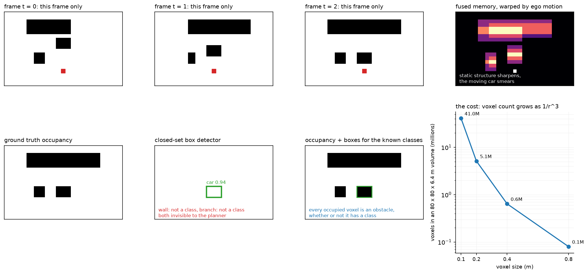

# Occupancy and temporal perception

> **Why this matters at staff level.** Occupancy is the field's answer to the question every
> AV interview eventually reaches: what does the car do about an obstacle whose class is not
> in your taxonomy? A candidate who answers "add the class" has not understood the problem. A
> candidate who can explain why a class-free geometric representation handles the long tail,
> quantify what it costs in voxels and memory, and describe how the belief is maintained
> across time while the ego moves, is answering at the level the role requires.

## TL;DR, the interview card

* Boxes assume the world is made of known, rigid, box-shaped, enumerable categories. A
  fallen branch, a mattress, a partially deployed airbag, a flooded dip and an articulated
  truck bending through a turn all violate one of those assumptions.
* **Occupancy** estimates $p(o_{xyz} \mid x_{1:t})$ over a voxel grid: is this volume
  occupied, and optionally by what class and moving how. An unoccupied class is still an
  obstacle, so the planner never needs the name.
* **The cost is cubic.** An $80 \times 80 \times 6.4$ m volume at 0.4 m voxels is 5.1M
  voxels; at 0.2 m it is 41M. Halving the voxel size multiplies memory and compute by 8.
* **Cheap 3D head**: FlashOcc-style channel-to-height reshapes a 2D conv's $K \cdot Z$
  output channels into $(K, Z)$ per BEV cell, giving a 3D output from 2D convolutions.
* **Temporal fusion**: the belief from $t-1$ lives in the previous ego frame, so warp it with
  $T_{\text{curr} \leftarrow \text{prev}}$ before fusing. Static structure accumulates, moving
  objects smear, and previously-observed-now-occluded space is remembered.
* **Supervision** comes from accumulated LiDAR with occlusion reasoning (Occ3D's pipeline:
  voxel densification, occlusion reasoning, image-guided refinement), or from differentiable
  rendering, where you supervise the depth a NeRF-style volume render produces instead of the
  voxels themselves.
* Occupancy and boxes coexist in every real stack. Boxes give identity, velocity and
  behaviour prediction for the classes you care about; occupancy gives "do not drive there"
  for everything else.

## 1. Intuition first

A box detector is a function from sensor data to a list of (class, position, extent,
heading). Every element of that output type carries an assumption. The class comes from a
fixed set. The extent is a cuboid. The heading assumes a rigid body with a canonical
orientation. The list assumes you can enumerate the obstacles.

Now consider the objects that break these. A mattress on the motorway has no class in your
taxonomy and no meaningful heading. A tree branch is not a cuboid, and a cuboid around it
either includes drivable space you would then avoid or excludes branch you would then hit. An
articulated bus mid-turn is two cuboids with a joint. A cloud of dust is occupied for a LiDAR
and drivable for a planner. A pothole is unoccupied and still something to avoid.

Occupancy sidesteps all of it by changing the output type. Instead of a list of objects,
produce a scalar field over space: for each voxel, the probability that it is occupied.
Optionally add a semantic label and a flow vector. A planner consumes the field directly,
because what a planner needs to know is whether a volume it wants to pass through is free.

{ width="920" }

The top row shows three frames of partial evidence (a wall is occluded on one side at $t=0$
and on the other at $t=1$) and the fused, ego-motion-warped memory on the right, where static
structure has sharpened and the moving vehicle has left a trail. The bottom row is the
comparison: the box detector fires on the vehicle it has a class for and leaves the wall and
the branch entirely unrepresented, so a planner consuming only boxes sees free space where
there is a wall. The rightmost panel is the cost, and it is the reason occupancy is a systems
problem and not only a modelling one.

Work a small example. A $6 \times 6$ BEV grid at 1 m, with 4 height levels. Suppose at time
$t$ the model believes cell $(3, 2)$ at height level 1 is occupied with probability 0.9, and
cell $(3, 3)$ is behind it and therefore unobserved, probability 0.5 (the prior). The ego
drives 1 m forward. At $t+1$ the belief about the world has not changed, but the *indexing*
has: what was at $x = 3.5$ m is now at $x = 2.5$ m, so the 0.9 must move to cell $(2, 2)$.
Fuse without warping and you have placed a wall one metre further away than it is.

## 2. The math

### 2.1 The estimation problem

The quantity is a posterior over the occupancy of each voxel given all observations:

$$
p(o_{xyz} = k \mid x_{1:t}), \qquad k \in \{\text{free}, c_1, \dots, c_{K-1}\}.
$$

Classical occupancy grid mapping assumes voxels are independent given the sensor model and
updates each in log-odds:

$$
\ell_t(v) = \ell_{t-1}(v) + \log \frac{p(z_t \mid o_v = 1)}{p(z_t \mid o_v = 0)} - \ell_0,
$$

which is the same rule as sensor fusion in the previous chapter, applied per voxel and per
measurement. This is exact for a known sensor model and independent voxels, and both
assumptions are wrong: LiDAR returns are correlated through surfaces, and neighbouring voxels
are strongly dependent because objects are contiguous.

Learned occupancy replaces the hand-written sensor model with a network that maps sensor
observations to voxel logits directly, and replaces the independence assumption with whatever
the network's receptive field captures. What it keeps from the classical formulation is the
recursive structure: a belief carried forward, updated by new evidence.

### 2.2 The channel-to-height head

A full 3D convolutional decoder over $X \times Y \times Z$ voxels is expensive. FlashOcc's
observation is that you can produce the 3D output from a 2D backbone. Let the BEV feature be
$B \in \mathbb{R}^{C \times X \times Y}$. Apply a $1 \times 1$ convolution to $K \cdot Z$
output channels and reshape:

$$
L = \text{Conv}_{1\times1}(B) \in \mathbb{R}^{(K Z) \times X \times Y}
\;\longrightarrow\;
L' \in \mathbb{R}^{K \times Z \times X \times Y}.
$$

Each BEV cell's channel vector is reinterpreted as $Z$ height slices of $K$ class logits. The
network never performs a 3D convolution, so the cost is that of a 2D network with a wide
final layer. What you give up is 3D spatial mixing: a voxel's prediction cannot directly
consult its vertical neighbours except through whatever the BEV features already encode.
For driving, where the vertical structure is simple (ground, object, free air), this trades
well; for a general 3D reconstruction task it would not.

### 2.3 The class-imbalance problem

The occupancy distribution is dominated by free space. In a typical driving scene, 90% or
more of the voxels within the grid are empty, and among occupied voxels the distribution over
classes is itself long-tailed (road surface and buildings dominate; pedestrians and cyclists
are a fraction of a percent).

Plain cross-entropy therefore has a trivial solution worth naming: predict free everywhere.
That achieves 90% voxel accuracy and zero utility. Two standard corrections:

$$
L = -\sum_{v} w_{k^*(v)} \log p_v(k^*(v)), \qquad w_k \propto \frac{1}{\sqrt{f_k}} \;\text{or}\; \frac{1}{f_k},
$$

with $f_k$ the class frequency, and a Lovasz-softmax or soft-IoU term that optimises the
overlap metric directly instead of per-voxel likelihood. Evaluation uses IoU rather than
accuracy for the same reason:

$$
\text{IoU}_{\text{binary}} = \frac{|\hat O \cap O|}{|\hat O \cup O|}, \qquad
\text{mIoU} = \frac{1}{K}\sum_{k} \frac{|\hat V_k \cap V_k|}{|\hat V_k \cup V_k|},
$$

where $\hat O$ is the set of predicted non-free voxels. Reporting both is standard: binary
IoU measures "did you find the obstacles", mIoU measures "did you name them", and a model can
be good at the first and poor at the second, which for a planner is an acceptable trade.

### 2.4 Visibility and what "free" means

A voxel can be free, occupied, or **unobserved**, and collapsing the third into the first is
a safety bug. A region behind a parked van has never been measured; predicting it free
because no LiDAR return came from it means a planner treats an occluded pedestrian's location
as drivable.

Occ3D's label pipeline handles this explicitly with three stages: voxel densification
(accumulate LiDAR across the sequence, using tracked object poses so dynamic objects
accumulate in their own frames), occlusion reasoning (ray-cast from each sensor pose to mark
which voxels were actually observed), and image-guided voxel refinement. The resulting labels
carry a visibility mask, and evaluation ignores unobserved voxels rather than scoring
predictions against labels that were themselves guesses.

In deployment the same three-state distinction drives behaviour. The planner's response to
occupied is "do not enter"; to unobserved it is "do not enter at a speed from which you could
not stop", which is how a competent human drives past a line of parked cars.

### 2.5 Temporal fusion by ego-motion warping

The belief at $t-1$ is expressed in the ego frame at $t-1$. Warp it into the current frame
before fusing, exactly as in chapter 2:

$$
\tilde B_{t-1}(p) = B_{t-1}\big(\pi(T_{\text{curr} \leftarrow \text{prev}}^{-1} p)\big),
$$

with bilinear sampling and zeros outside the extent. For planar motion every height slice
warps identically, so a 2D warp of the BEV feature suffices.

Then a gated update, which is a GRU without the reset gate:

$$
\boxed{\;h_t = (1 - g) \odot \tilde h_{t-1} + g \odot f(x_t), \qquad
g = \sigma\big(W [\tilde h_{t-1}; f(x_t)]\big)\;}
$$

The gate is what makes this work on a world containing both static and dynamic content. Where
the warped memory and the new evidence agree (static structure, correctly warped), the gate
can take any value and the output is the same, so the gradient is uninformative and the value
does not matter. Where they disagree (a moving object, or newly visible space), the gate
opens and the new evidence wins. Where there is no new evidence (now-occluded space), the
gate closes and the memory persists.

The fixed point is worth checking. With $g$ constant and evidence constant, $h$ converges to
$f(x)$ regardless of $g$, so the memory cannot latch on stale content indefinitely as long as
evidence keeps arriving. With no evidence, $h$ holds. Both are the behaviours you want.

**What temporal fusion buys, concretely.** Occlusion memory: a pedestrian who steps behind a
van remains in the belief. Evidence accumulation: a weak return at 60 m that is below
threshold in one frame clears it after four. Velocity: the displacement of a feature between
the warped memory and the current evidence is the object's motion in the ego frame. And
temporal consistency: a planner receiving a belief that flickers between occupied and free
produces jerky behaviour, and the memory smooths it.

**What it costs.** Memory latching: if the ego-motion estimate is wrong, static structure
smears and the model learns to distrust the memory, quietly removing the benefit. Error
propagation: a false positive enters the memory and persists for as long as the gate keeps it,
so a single bad frame can produce a phantom obstacle lasting seconds. Both are why production
systems bound the memory's influence, with a decay term or a maximum age.

### 2.6 Flow and future occupancy

Static occupancy tells the planner where it cannot go now. A planner reasoning about three
seconds ahead needs where it cannot go then. Two ways to provide it.

**Occupancy flow.** Predict, per voxel, a displacement $\Delta p_v$ over the horizon, so the
future occupancy is the current occupancy advected by the flow. This handles rigid and
non-rigid motion uniformly and needs no object identity, and it degrades gracefully because a
wrong flow on a static voxel is a small error.

**Direct future occupancy.** Predict $p(o_{xyz}^{t+\delta})$ for several $\delta$ as extra
output channels. Simple, and it blurs: since the future is multimodal (the vehicle may turn
left or right), a model trained with per-voxel cross-entropy predicts the *marginal*
occupancy, which is a smear covering both options. That smear is honest, and it is also
useless for a planner trying to find a gap, because the marginal occupies the space between
the modes that no actual future occupies. Chapter 6 treats this as the central problem of
prediction.

### 2.7 Rendering-based supervision, as literacy

Getting voxel labels requires LiDAR and a label pipeline. An alternative supervises in image
space and lets the 3D representation be implicit. Give each voxel a density $\sigma_v$ and
integrate along a camera ray, as in NeRF:

$$
T_i = \exp\left(-\sum_{j<i} \sigma_j \delta_j\right), \qquad
\hat d = \sum_i T_i \big(1 - e^{-\sigma_i \delta_i}\big) d_i ,
$$

where $T_i$ is the transmittance up to sample $i$ and $\delta_i$ the step length. Supervise
$\hat d$ against measured depth, or the rendered colour against the image. Because the render
is differentiable in $\sigma$, gradients reach the occupancy field without any voxel label,
which is the basis of self-supervised occupancy from images alone: render depth from one
camera's predicted field and supervise it with the photometric consistency of a neighbouring
view or a neighbouring time step.

3D Gaussian splatting replaces the voxel grid with anisotropic Gaussians and the ray
integral with a rasterisation of projected Gaussians, which is much faster to render and
represents surfaces more compactly. For perception the appeal is the same: a differentiable
renderer converts image-space supervision into 3D geometry supervision.

## 3. Implementation

The head reshapes channels into height:

```python
class OccupancyHead(nn.Module):
    """BEV features (B, C, X, Y) → voxel logits (B, K, Z, X, Y)."""

    def __init__(self, c_in: int, num_classes: int, num_z: int):
        super().__init__()
        self.k, self.z = num_classes, num_z
        self.conv = nn.Sequential(
            nn.Conv2d(c_in, c_in, kernel_size=3, padding=1), nn.ReLU(),
            nn.Conv2d(c_in, num_classes * num_z, kernel_size=1),
        )

    def forward(self, bev: torch.Tensor) -> torch.Tensor:
        b, _, nx, ny = bev.shape
        logits = self.conv(bev)                      # (B, K·Z, X, Y)
        return logits.view(b, self.k, self.z, nx, ny)  # (B, K, Z, X, Y) channel → height
```

The `view` ordering is the detail to get right. Channels are laid out class-major, so channel
$k Z + z$ becomes class $k$ at height $z$. Reversing it (height-major) still produces a
tensor of the correct shape and trains to a plausible loss, while silently permuting your
height slices; the model compensates by learning a permuted representation, and the bug
surfaces only when you visualise the output or compare against ground truth built the other
way. Assert on a hand-built case.

The temporal fusion is warp then gate:

```python
    def forward(self, curr, prev, T_curr_from_prev):
        if prev is None:
            return curr
        prev_aligned = warp_bev(prev, T_curr_from_prev, self.bev_extent)     # (B, C, X, Y)
        g = torch.sigmoid(self.gate(torch.cat([prev_aligned, curr], dim=1))) # (B, C, X, Y) in (0, 1)
        return (1.0 - g) * prev_aligned + g * curr                           # (B, C, X, Y)
```

Concatenating both inputs before the gate convolution is what lets the gate be
*disagreement-driven*: with only the current frame as input it could learn a spatial prior
("trust new evidence near the ego"), and with only the memory it could learn a decay, but
neither can express "these two disagree here". The output is a convex combination, so
activations cannot grow without bound across a long sequence. A recurrent module that runs
for the length of a drive would otherwise be one bad frame away from overflow.

The loss and metrics:

```python
def occupancy_loss(logits, target, class_weights=None, ignore_index=255):
    """Per-voxel cross-entropy. logits (B, K, Z, X, Y), target (B, Z, X, Y) long."""
    return F.cross_entropy(logits, target, weight=class_weights, ignore_index=ignore_index)


def occupancy_iou(logits, target, free_class=0):
    """(binary occupied-vs-free IoU, per-class IoU (K,))."""
    k = logits.shape[1]
    pred = logits.argmax(dim=1)                                  # (B, Z, X, Y)
    occ_p, occ_t = pred != free_class, target != free_class      # (B, Z, X, Y) each
    binary = (occ_p & occ_t).sum().float() / (occ_p | occ_t).sum().clamp(min=1).float()
    per_class = torch.zeros(k)                                   # (K,)
    for c in range(k):
        p_c, t_c = pred == c, target == c
        per_class[c] = (p_c & t_c).sum().float() / (p_c | t_c).sum().clamp(min=1).float()
    return float(binary), per_class
```

`ignore_index=255` is where visibility enters: label unobserved voxels 255 and they
contribute no gradient and no metric. Without it, the model is trained to predict something
definite about space nobody measured, and whatever it predicts there is a guess presented as
a belief.

`F.cross_entropy` accepts `(B, K, d1, d2, d3)` against `(B, d1, d2, d3)` directly, so no
flattening is needed; the class dimension must be dimension 1.

??? example "Full implementation"
    ```python
    --8<-- "src/mlbook/perception/occupancy.py"
    ```

**How you would test it.** Shapes and gradient flow for the head. For the fusion: the first
frame must pass through unchanged, the output must be bounded between the two inputs
elementwise (which verifies the convex combination), and with the gate forced closed a
memory feature must move by exactly the ego displacement, which is the test that catches a
warp sign error. For voxelization: a point at a known metric position must land in a
hand-computed voxel and the rest must be free. For the metrics: a perfect prediction must
give IoU 1.0 on every class.

## Retype by hand

| Symbol | File | Target time | Why |
|---|---|---|---|
| `OccupancyHead` | `src/mlbook/perception/occupancy.py` | 8 minutes | The channel-to-height trick, including the reshape ordering. |
| `TemporalOccupancyFusion.forward` | `src/mlbook/perception/occupancy.py` | 12 minutes | Warp then gate; the concatenation is the design decision. |
| `voxelize_points` | `src/mlbook/perception/occupancy.py` | 12 minutes | Metric-to-index arithmetic and the inside mask, easy to get off by one. |
| `occupancy_iou` | `src/mlbook/perception/occupancy.py` | 10 minutes | Binary and per-class IoU, the two numbers every occupancy paper reports. |

Read but do not retype: `occupancy_loss` (one call, but know why `ignore_index` is there),
and `warp_bev` from `temporal_bev.py`, which you already practised in chapter 2 and which
this chapter depends on.

Check yourself with:

```bash
pytest tests/test_perception_occupancy.py -q
```

Target: 40 minutes with the file green. If you did chapter 2's `warp_bev` drill, this chapter
adds about 25 minutes of new material.

## 4. Systems view: cost, failure modes, trade-offs

**The voxel budget.** Voxel count is $(2L/r)^2 \cdot (H/r)$ for range $L$, height $H$ and
voxel size $r$. Some reference points for an $80 \times 80 \times 6.4$ m volume:

| Voxel size | Voxels | Logits at $K=16$, fp16 | Comment |
|---|---|---|---|
| 0.8 m | 0.64M | 20 MB | Too coarse to represent a pedestrian |
| 0.4 m | 5.1M | 164 MB | The common research setting (Occ3D-nuScenes uses 0.4 m) |
| 0.2 m | 41M | 1.3 GB | Dense storage is already impractical on-vehicle |
| 0.1 m | 328M | 10.5 GB | Only feasible sparsely |

A pedestrian is about $0.6 \times 0.4 \times 1.7$ m, so at 0.4 m voxels they occupy roughly
$2 \times 1 \times 4 = 8$ voxels, which is enough to detect and not enough to shape precisely.
At 0.8 m they may occupy 1 to 2 voxels and are indistinguishable from a post.

**Sparsity is the way out.** Over 90% of voxels are free and most of the rest are on a thin
surface. Sparse convolution over occupied voxels only, octrees or coarse-to-fine refinement
(predict at 0.8 m, then refine only the non-free regions at 0.2 m) all exploit this. Occ3D's
CTF-Occ network uses the coarse-to-fine strategy explicitly. The engineering cost is that
sparse operations are harder to make fast and harder to quantise than dense ones, so teams
often prefer a dense grid at a resolution they can afford.

| Situation | Use | Decision rule |
|---|---|---|
| Long tail is the dominant safety concern | Occupancy as a primary output | A class-free representation is the only thing that covers unenumerable obstacles |
| You need velocity, identity and behaviour prediction | Boxes and tracks, plus occupancy | A voxel has no identity, so it cannot have a predicted trajectory |
| Tight compute, camera-only | Coarse occupancy (0.5 m) plus boxes | A coarse occupancy still catches the wall and the mattress |
| Rich LiDAR, ample compute | Fine semantic occupancy with flow | The label pipeline is the constraint, not the model |
| No LiDAR anywhere, even for training | Rendering-based self-supervision | Photometric and cross-view consistency substitute for voxel labels |

**Failure modes.**

*Free-space over-prediction.* The dominant class wins by default, and a model with a slightly
miscalibrated bias predicts thin structures (poles, railings, the leading edge of a kerb) as
free. Monitor recall on thin-structure voxels specifically, not aggregate IoU, because thin
structures are a tiny fraction of the voxel count and cannot move the aggregate.

*Unobserved treated as free.* Covered in §2.4. This is the failure that kills people, and it
is invisible in any metric computed only over observed voxels.

*Memory latch.* A false positive enters the temporal state and persists. Bound it: cap the
gate's minimum value so evidence always has some influence, or decay the memory explicitly.

*Ego-motion error.* Smeared static structure, and the learned response is to distrust the
memory. Diagnose by evaluating with and without the temporal branch on stationary-ego
segments, where the warp is the identity and any gap is pure fusion benefit.

*Resolution mismatch with the planner.* If the planner's collision checker uses a vehicle
footprint inflated by a safety margin smaller than the voxel size, the discretisation error
is inside the safety margin and the guarantee is void. Occupancy resolution and planner
inflation have to be chosen together.

## 5. In production

!!! production "Tesla, the occupancy network"
    Tesla's Autopilot team presented occupancy networks at the CVPR 2022 Workshop on
    Autonomous Driving as their approach to general obstacle detection and collision
    avoidance, framing it as the answer to obstacles that do not fit a fixed class taxonomy.
    The public talk describes predicting occupancy volumetrically around the vehicle from
    the multi-camera rig, with the output consumed for collision avoidance rather than being
    converted back into boxes. The 2023 keynote continues into the planning side.
    Sources: [Ashok Elluswamy, CVPR 2022 WAD keynote](https://www.youtube.com/watch?v=jPCV4GKX9Dw),
    [CVPR 2023 WAD keynote](https://www.youtube.com/watch?v=6x-Xb_uT7ts).

!!! production "Tsinghua MARS Lab and NVIDIA, Occ3D, the labels are the hard part"
    Occ3D's contribution is the label generation pipeline rather than the network: voxel
    densification, occlusion reasoning, and image-guided voxel refinement, producing dense
    visibility-aware labels on the Waymo Open Dataset and nuScenes. They also propose CTF-Occ,
    which aggregates 2D image features into 3D through cross-attention in a coarse-to-fine
    manner, addressing the memory problem directly. For an interview, the transferable point
    is that occupancy's bottleneck is supervision: you cannot label voxels by hand, so the
    quality of your accumulated-LiDAR pipeline sets the ceiling.
    Source: [Occ3D (arXiv 2304.14365)](https://arxiv.org/abs/2304.14365).

!!! production "FlashOcc, making the head cheap enough to deploy"
    FlashOcc replaces 3D convolutions with 2D convolutions plus a channel-to-height transform
    of BEV features, motivated explicitly by the memory and computation overhead of
    voxel-level representations blocking deployment. It is a plug-in replacement for the head
    of an existing BEV model, which is why it spread quickly. The lesson is that the
    representation (voxels) and the computation (3D convolutions) are separable choices, and
    most of the cost was in the second.
    Source: [FlashOcc (arXiv 2311.12058)](https://arxiv.org/abs/2311.12058).

!!! production "Shanghai AI Lab, BEVFormer as the temporal backbone"
    BEVFormer's temporal self-attention recurrently fuses history BEV information, and it
    became the standard trunk for occupancy work because the occupancy head needs exactly
    what it produces: a temporally fused, ego-aligned BEV feature. The architectural split
    that emerged (a temporal BEV trunk plus a cheap 3D head) is what most published occupancy
    systems now look like.
    Source: [BEVFormer (arXiv 2203.17270)](https://arxiv.org/abs/2203.17270).

## 6. Interview questions and strong answers

!!! interview "Why occupancy instead of boxes? Give me the argument and the cost."
    A box carries four assumptions: the class is in a fixed set, the shape is a cuboid, the
    object is rigid with a canonical heading, and the obstacles are enumerable. The long tail
    breaks each of them. A mattress has no class, a branch is not a cuboid, an articulated bus
    is not rigid, and you cannot enumerate road debris. Anything that fails those assumptions
    is either absent from the output or represented so badly that the planner cannot use it,
    and absent means the planner sees free space.

    Occupancy changes the output type to a scalar field over volume, so an obstacle needs no
    name to be avoided. The planner's question ("is this volume free") is answered directly.

    The cost is cubic in resolution: an 80 by 80 by 6.4 m volume is 5.1M voxels at 0.4 m and
    41M at 0.2 m, so memory and compute multiply by 8 for each halving. It also gives you
    nothing the tracker and the predictor need: a voxel has no identity, so it has no
    velocity history and no behaviour model. Every real stack runs both, with boxes for the
    classes that matter and occupancy for everything else.

    **Staff-level follow-up: how do you pick the voxel size?** From the smallest object you
    must represent and the planner's safety margin. A pedestrian at 0.4 m voxels is about 8
    voxels, enough to detect. The discretisation error is half a voxel, so the planner's
    footprint inflation must exceed that or the collision guarantee is void. Those two
    constraints bracket the choice, and then you check whether the compute budget allows it.

!!! interview "How do you supervise an occupancy network?"
    You cannot label voxels by hand, so the labels come from a pipeline. Accumulate LiDAR
    across a sequence to densify (a single sweep is far too sparse), which requires
    transforming each sweep by the ego pose and, for dynamic objects, by their own tracked
    poses so they accumulate in their own reference frames instead of smearing. Then ray-cast
    from each sensor pose to determine which voxels were actually observed, and mark
    everything else unobserved. Optionally refine with image guidance for the boundaries LiDAR
    resolves poorly. That is Occ3D's three-stage pipeline.

    Two properties matter. The labels must carry visibility, so unobserved voxels can be
    excluded from the loss instead of being trained as free. And dynamic objects need their
    own accumulation frames, otherwise a moving car becomes a long occupied tube.

    The alternative when you have no LiDAR is rendering-based supervision: give voxels a
    density, volume-render depth along camera rays, and supervise the rendered depth against
    photometric consistency across views or across time. The gradients reach the voxels
    through the render, so no voxel labels are needed at all.

    **Staff-level follow-up: what is the ceiling on that pipeline?** The accumulated LiDAR is
    itself a model output in part, since it depends on the ego poses from SLAM and the object
    tracks. Pose error blurs the accumulated cloud, and tracking error smears dynamic objects,
    so label quality degrades exactly in the situations (long sequences, crowded scenes) where
    you most want data. The label pipeline needs its own evaluation, and in practice teams hold
    out hand-verified scenes to measure it.

!!! interview "You are fusing occupancy across time while the ego moves. Walk me through it."
    The belief at $t-1$ is indexed in the ego frame at $t-1$. Compute
    $T_{\text{curr} \leftarrow \text{prev}}$ from odometry, invert it, map each current cell
    centre back to where it was in the previous frame, and bilinearly sample the previous
    belief there. Cells that map outside the previous extent read the prior, which is either
    zeros or an explicit unobserved state.

    Then fuse with a gate: $h_t = (1-g)\tilde h_{t-1} + g f(x_t)$ with
    $g = \sigma(W[\tilde h_{t-1}; f(x_t)])$. Both inputs go into the gate so it can respond to
    disagreement, which is what distinguishes a moving object from static structure.

    Three things this buys: occlusion memory (the pedestrian behind the van stays in the
    belief), evidence accumulation (a weak return clears threshold after several frames), and
    velocity (the displacement between the warped memory and the new evidence).

    **Staff-level follow-up: what if the odometry is wrong?** Static structure smears instead
    of sharpening, the gate learns to favour the current frame, and you lose the temporal
    benefit while still paying its cost. Detect it by comparing the model with and without the
    temporal branch on stationary-ego segments, where the warp is the identity, so any
    remaining gap is fusion quality and not warp quality.

!!! interview "A voxel is unobserved. What should the model output and what should the planner do?"
    The model should output a distinct unobserved state, not a free probability and not an
    occupied probability. Collapsing unobserved into free is the failure mode that puts a
    vehicle into space it never measured, and collapsing it into occupied makes the vehicle
    unable to move at all, since most of the world at any instant is unobserved.

    In training, unobserved voxels are excluded from the loss with an ignore index, so the
    model is never taught to make up a value there. At evaluation they are excluded from the
    metrics for the same reason.

    The planner's response to unobserved is a speed constraint, not a hard obstacle: travel no
    faster than a speed from which you could stop before reaching the unobserved region, given
    the reaction time and the braking profile. That is exactly what a careful human driver does
    passing a line of parked cars, and it turns occlusion from a perception failure into a
    planning constraint with an explicit, checkable rule.

    **Staff-level follow-up: how do you keep that from being paralysingly conservative?**
    Bound it by what could plausibly emerge. An unobserved region 0.3 m wide cannot contain a
    pedestrian; an unobserved region behind a kerb-side van can. Reasoning about the size and
    reachability of the occluded region, and about whether an agent there could reach your
    path within your time horizon, is what turns the rule from "crawl everywhere" into
    something drivable.

!!! interview "Predicting future occupancy directly gives a blurry result. Why, and what do you do?"
    Per-voxel cross-entropy against a single observed future trains the model to predict the
    marginal probability of occupancy, and the marginal of a multimodal distribution is a
    blur. If a vehicle ahead turns left in half the training situations and right in the other
    half, the minimiser puts 0.5 in both regions.

    The blur is a correct marginal and a useless plan input, because the planner needs a gap
    and the marginal fills the space between the modes with 0.5 while no single future
    occupies it.

    Three responses. Predict flow instead of future occupancy: advect the current occupancy by
    a per-voxel displacement, which keeps the representation sharp and handles non-rigid
    motion. Predict a small set of joint futures with a mixture and a winner-takes-all or
    anchored loss, which is chapter 6's machinery applied to a field instead of a trajectory.
    Or condition on the ego's own plan, which removes some of the multimodality when the other
    agents' behaviour depends on what the ego does.

    **Staff-level follow-up: is the blur ever the right answer?** For a risk-averse collision
    check, a marginal is defensible: it says "some future occupies this". It is wrong when the
    planner needs to find a feasible path, because the union of modes may have no gap even
    when every individual mode does.

!!! interview "How would you evaluate an occupancy model for a safety case?"
    Aggregate mIoU is a research metric and close to useless for this purpose. The evaluation
    has to be stratified by what the planner will do with the output.

    Stratify by region: voxels inside the ego's planned corridor and within braking distance
    are the ones that can cause a collision, and they are a tiny fraction of the grid. Report
    recall there separately.

    Stratify by object size: thin structures (poles, railings, cyclists) are a fraction of a
    percent of the occupied voxels and cannot move an aggregate metric, so measure them alone.

    Report false-free rate, not only IoU: the quantity that maps to a collision is "predicted
    free while actually occupied", and IoU mixes that with the opposite error, which maps to
    unnecessary braking. These have completely different costs and belong on separate axes.

    Evaluate visibility handling explicitly: measure how often the model predicts free in
    regions the labels mark unobserved, which is a direct measure of the failure mode in the
    previous question.

    And evaluate temporally: a belief that flickers produces jerky planning even when its
    per-frame IoU is fine, so measure the frame-to-frame consistency of the belief along a
    trajectory.

## 7. Exercises

**★ Exercise 1.** A grid covers $\pm 40$ m in $x$ and $y$ and $-1$ to $5.4$ m in $z$ at 0.4 m
voxels with 16 classes. How many voxels, and how much memory do the logits take in fp16?

??? success "Solution"
    $200 \times 200 \times 16 = 640{,}000$ voxels. Logits are $640{,}000 \times 16 = 10.24$M
    values, at 2 bytes each that is 20.5 MB. The argmaxed output is 640 KB as uint8. The gap
    between those two numbers is why inference pipelines argmax on device and never move the
    logits off it.

**★ Exercise 2.** 90% of voxels are free. A model predicts free everywhere. What is its voxel
accuracy, binary IoU and mIoU with 16 classes?

??? success "Solution"
    Accuracy 0.90. Binary occupied-versus-free IoU is
    $|\hat O \cap O| / |\hat O \cup O| = 0 / |O| = 0$, since $\hat O$ is empty. mIoU: the free
    class has IoU $0.9/1.0 = 0.9$ and the other 15 have 0, so mIoU $= 0.9/16 = 0.056$.

    Accuracy says the model is excellent and both IoU variants say it is worthless, which is
    why occupancy papers report IoU and never accuracy.

**★★ Exercise 3.** Show that the gated fusion $h_t = (1-g)\tilde h_{t-1} + g f(x_t)$ has
bounded activations for any sequence length, and give the condition under which the memory
can hold a stale value forever.

??? success "Solution"
    Since $g \in (0,1)$ elementwise, $h_t$ is a convex combination of $\tilde h_{t-1}$ and
    $f(x_t)$, so $\min(\tilde h_{t-1}, f(x_t)) \le h_t \le \max(\tilde h_{t-1}, f(x_t))$
    elementwise. By induction, $\|h_t\|_\infty \le \max(\|h_0\|_\infty, \max_{s \le t} \|f(x_s)\|_\infty)$:
    bounded by the largest evidence ever seen, independent of sequence length. Warping only
    resamples and cannot increase the maximum, so it preserves the bound.

    The memory holds forever when $g \to 0$ at that location, which happens when the gate
    learns that evidence there is uninformative. Occluded regions are exactly that case, which
    is the desired behaviour, and it is also the latch failure mode when the memory content is
    a false positive. The fix is to floor the gate at some $g_{\min} > 0$, which makes the
    memory decay towards the evidence with time constant $-1/\ln(1-g_{\min})$ frames.

**★★ Exercise 4 (coding).** Extend `TemporalOccupancyFusion` with an explicit decay so that
unobserved regions relax towards a prior rather than persisting indefinitely. Verify that a
feature with no new evidence halves in a known number of frames.

??? success "Solution"
    ```python
    import torch
    from mlbook.perception.occupancy import TemporalOccupancyFusion
    from mlbook.perception.temporal_bev import warp_bev

    class DecayingFusion(TemporalOccupancyFusion):
        def __init__(self, c, bev_extent, gate_floor: float = 0.05):
            super().__init__(c, bev_extent)
            self.gate_floor = gate_floor

        def forward(self, curr, prev, T_curr_from_prev):
            if prev is None:
                return curr
            prev_aligned = warp_bev(prev, T_curr_from_prev, self.bev_extent)   # (B, C, X, Y)
            g = torch.sigmoid(self.gate(torch.cat([prev_aligned, curr], dim=1)))  # (B, C, X, Y)
            g = self.gate_floor + (1.0 - self.gate_floor) * g                  # (B, C, X, Y) floored
            return (1.0 - g) * prev_aligned + g * curr

    f = DecayingFusion(1, (-8.0, 8.0, -8.0, 8.0), gate_floor=0.05)
    with torch.no_grad():                    # force the learned gate shut; only the floor acts
        f.gate.weight.zero_(); f.gate.bias.fill_(-20.0)
    h = torch.zeros(1, 1, 16, 16); h[0, 0, 8, 8] = 1.0
    I = torch.eye(4).unsqueeze(0)
    for _ in range(14):                      # 0.95^14 = 0.488
        h = f(torch.zeros(1, 1, 16, 16), h, I)
    assert abs(h[0, 0, 8, 8].item() - 0.5) < 0.02
    ```

    With a floor of 0.05 and zero evidence, the memory multiplies by 0.95 each frame, so the
    half-life is $\ln(0.5)/\ln(0.95) = 13.5$ frames, which at 10 Hz is 1.35 seconds. Choose
    the floor from how long an occluded object should be remembered, which is a behavioural
    decision, not a modelling one.

**★★ Exercise 5.** Your occupancy model has binary IoU 0.82 but the vehicle still fails to
stop for a low, wide obstacle (a kerb-height concrete block). Give three hypotheses and how
you would test each.

??? success "Solution"
    1. **Height quantisation.** With 0.4 m voxels and a grid starting at $z = -1$ m, a 0.3 m
       block occupies part of one voxel that also contains road surface, and the label for
       that voxel may be "road". Test by checking the ground-truth labels at the block's
       location: if the labels themselves say free or road, the problem is the label pipeline,
       not the model.
    2. **Ground-plane removal.** Many pipelines remove ground points before voxelisation to
       save memory, using a height threshold or a fitted plane. A 0.3 m obstacle sits inside
       the typical threshold. Test by disabling ground removal and checking whether the block
       appears.
    3. **Planner filtering.** The planner may ignore occupancy below a height threshold to
       avoid braking for kerbs and speed bumps. Test by inspecting what the planner received:
       if the occupancy output contains the block and the planner discarded it, the model is
       fine and the threshold is the bug.

    The general lesson is that aggregate IoU cannot detect a failure confined to a small,
    specific subset of voxels, and the subset that matters is exactly the one that is small.

**★★★ Exercise 6.** Design a self-supervised occupancy training scheme for a camera-only
platform with no LiDAR at all. Specify the losses and what prevents a degenerate solution.

??? success "Solution"
    Representation: predict a density $\sigma_v \ge 0$ per voxel from the multi-camera BEV
    trunk, plus optionally a colour or feature per voxel.

    Losses:

    1. **Cross-view photometric consistency.** Volume-render the depth along each ray of
       camera $A$ from the density field, warp camera $B$'s image into $A$ using that depth
       and the known extrinsics, and penalise the photometric difference (L1 plus SSIM). This
       is the multi-view stereo signal, and the known rig geometry makes it metric.
    2. **Temporal photometric consistency.** The same across time using ego motion, which adds
       a much larger effective baseline for distant structure where the rig's baseline is
       inadequate. Mask dynamic regions, since the static-world assumption fails on them; an
       auto-masking term that ignores pixels whose warped error exceeds the unwarped error is
       the standard trick from self-supervised depth.
    3. **Sparsity or entropy regularisation** on $\sigma$, which pushes the field towards
       being empty except at surfaces.
    4. **Free-space from rays.** Every ray that terminates at a rendered surface must be empty
       before it, which is a direct supervision signal on everything between the camera and the
       first surface.

    Degenerate solutions and their prevention: a density field that is uniformly zero renders
    a constant depth and fails the photometric loss, so loss 1 excludes it. A field that places
    a surface at the near plane for every ray reproduces the image exactly in the source view
    but fails cross-view consistency, which is why loss 1 must use a different camera and not
    a reconstruction of the same view. And a field that is dense everywhere satisfies free-space
    constraints poorly and is penalised by loss 3.

    The known part that makes this work at all is the rig calibration: with fixed, measured
    extrinsics the scale is metric, unlike monocular self-supervised depth, which is
    scale-ambiguous.

## References

* Xiaoyu Tian et al. "Occ3D: A Large-Scale 3D Occupancy Prediction Benchmark for Autonomous Driving." NeurIPS 2023 Datasets and Benchmarks. [arXiv:2304.14365](https://arxiv.org/abs/2304.14365)
* Zichen Yu et al. "FlashOcc: Fast and Memory-Efficient Occupancy Prediction via Channel-to-Height Plugin." 2023. [arXiv:2311.12058](https://arxiv.org/abs/2311.12058)
* Zhiqi Li et al. "BEVFormer: Learning Bird's-Eye-View Representation from Multi-Camera Images via Spatiotemporal Transformers." ECCV 2022. [arXiv:2203.17270](https://arxiv.org/abs/2203.17270)
* Ashok Elluswamy. "Keynote, CVPR 2022 Workshop on Autonomous Driving." [YouTube](https://www.youtube.com/watch?v=jPCV4GKX9Dw)
* Ashok Elluswamy. "Keynote, CVPR 2023 Workshop on Autonomous Driving." [YouTube](https://www.youtube.com/watch?v=6x-Xb_uT7ts)
* Holger Caesar et al. "nuScenes: A multimodal dataset for autonomous driving." CVPR 2020. [arXiv:1903.11027](https://arxiv.org/abs/1903.11027)
