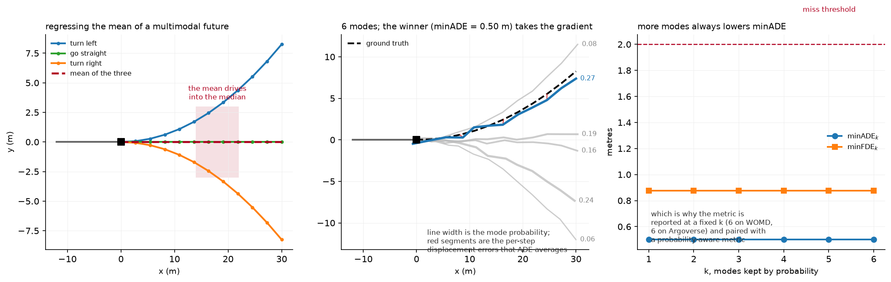

# Prediction and planning

> **Why this matters at staff level.** Prediction is where AV machine learning stops being
> supervised learning on a well-posed target. The ground truth is one sample from a
> distribution that was genuinely multimodal, the metric you can compute offline correlates
> imperfectly with driving quality, and the thing you are predicting reacts to what you do.
> Interviewers use this topic to find out whether you can reason about a learning problem
> whose target is a distribution, and whether you know why open-loop metrics mislead.

## TL;DR, the interview card

* The target is $p(\tau_{1:T} \mid \text{scene})$, and it is multimodal because a driver
  approaching a junction may turn or go straight. Regressing the mean of a multimodal
  distribution produces a trajectory nobody drives, straight through the median.
* **Mixture of trajectories**: predict $M$ modes with probabilities $\pi_m$, train with
  **winner-takes-all**: only the mode closest to the observed future gets regression
  gradient, plus a cross-entropy on $\pi$ towards that mode.
* **WTA collapses.** The winner is chosen by the model's own output, so whichever mode starts
  nearest keeps winning and is dragged to the mean of everything it wins, while the others
  get no gradient and die. On a symmetric ambiguous input this happens on most seeds.
* **Anchors fix it.** MultiPath and MTR assign the mode by a fixed anchor (a k-means
  prototype or a learned query pair) computed from the data, so two futures in different
  manoeuvres always train different modes.
* **Encoding**: VectorNet represents agents and map as polylines with a per-element MLP and
  a permutation-invariant pool, then models interaction with attention or a graph. Wayformer
  showed a plain attention encoder with early fusion of modalities is enough.
* **Metrics**: minADE$_k$, minFDE$_k$, miss rate at a threshold. All improve monotonically
  with $k$, so $k$ is fixed by the benchmark (6 on WOMD and Argoverse) and paired with a
  probability-aware metric, since min-over-modes ignores $\pi$ entirely.
* **Planning** consumes predictions: a behaviour decision, a trajectory optimisation or a
  scored set of candidates, then a controller. End-to-end (UniAD, VAD, Tesla FSD v12, Wayve)
  removes the interfaces and makes the planning loss reach perception.
* **Open-loop metrics mislead.** A policy scored on how closely it matches a logged human
  trajectory can be excellent open-loop and undriveable closed-loop, because errors compound
  and the world reacts. NAVSIM and Waymax exist to close that gap.

## 1. Intuition first

A vehicle approaches a T-junction. It will turn left or right, and the log contains exactly
one of those, sampled from a distribution whose other mode is equally real.

Train a regressor with mean squared error on that single sample, over thousands of similar
situations where roughly half turn each way. The minimiser of expected squared error is the
conditional mean, which drives straight into the wall opposite the junction. The model is
correct in the sense that it minimises its loss, and the output is useless.

{ width="900" }

The left panel shows it: three plausible futures and their mean, which enters a region no
actual future enters. The middle panel is the fix: predict several trajectories with
probabilities, and train only the one nearest the observed future, so the modes specialise
instead of averaging. The red segments are the per-step displacement errors that ADE averages,
and the line widths are mode probabilities. The right panel shows minADE as a function of how
many modes you keep, which decreases monotonically. That monotonicity is why $k$ must be
fixed by convention, and why a model can look better by producing more modes without being
better at anything.

Here is the loss on numbers. Two futures, left ending at $(6, +3)$ and right at $(6, -3)$,
equally likely. Three modes currently at $y$-endpoints $+0.2$, $0.0$, $-0.1$. For a left
example, mode 1 has the lowest ADE and receives gradient pulling it towards $+3$. For a right
example, mode 3 is nearest and is pulled towards $-3$. Mode 2 never wins and receives nothing.
After training, modes 1 and 3 cover the two manoeuvres, mode 2 is dead, and minADE over the
three is near zero. That is the intended behaviour.

The failure is what happens when mode 2 starts slightly ahead on the $x$ coordinate, which is
shared by both futures. Then mode 2 has the lowest ADE for *both* examples, wins both, and is
pulled towards the mean of $+3$ and $-3$, which is $0$. It stays the winner because it is
still closest to both, modes 1 and 3 never receive gradient, and the model has collapsed to
the regressor you were trying to avoid. The test in
`tests/test_perception_trajectory.py` reproduces this on a fixed seed, and a seed sweep finds
it on four of five.

## 2. The math

### 2.1 The mixture and the loss

Model the future as a mixture of deltas (MultiPath's formulation):

$$
p(\tau \mid s) = \sum_{m=1}^{M} \pi_m(s) \, \mathcal{N}\big(\tau ; \mu_m(s), \Sigma_m(s)\big),
$$

often with $\Sigma$ fixed or diagonal so that the regression reduces to a distance. The exact
maximum-likelihood objective is

$$
-\log p(\tau \mid s) = -\log \sum_m \pi_m \exp\big(-\tfrac{1}{2}\|\tau - \mu_m\|^2_{\Sigma_m}\big) + \text{const},
$$

which is an EM-style soft assignment: every mode receives gradient weighted by its posterior
responsibility. Soft assignment shares the mode-averaging problem in a milder form, because a
mode with moderate responsibility for both manoeuvres is pulled towards both.

**Winner-takes-all** hardens the assignment:

$$
m^{*} = \argmin_{m} \frac{1}{T}\sum_{t=1}^{T} \|\mu_m^{(t)} - \tau^{(t)}\|_2,
\qquad
\boxed{\;L = \text{Huber}(\mu_{m^{*}}, \tau) + \text{CE}(\pi, m^{*})\;}
$$

with no gradient through the $\argmin$. The classification term makes $\pi_m$ converge to the
frequency with which mode $m$ wins, which is the empirical probability of its manoeuvre.

### 2.2 Why WTA collapses, precisely

Consider a scene with two equally likely futures $\tau_A$ and $\tau_B$ and a deterministic
scene encoding (the input is identical for both). Mode $m$ wins example $A$ when
$d(\mu_m, \tau_A) < d(\mu_{m'}, \tau_A)$ for all $m' \ne m$.

If some mode $\mu_j$ has the lowest distance to *both* targets at initialisation, it wins both
and its gradient is

$$
\nabla_{\mu_j} \; \tfrac{1}{2}\big[ \|\mu_j - \tau_A\|^2 + \|\mu_j - \tau_B\|^2 \big] = 2\mu_j - (\tau_A + \tau_B),
$$

whose stationary point is $\mu_j = (\tau_A + \tau_B)/2$, the mean. Every other mode has zero
gradient, so it remains where it was initialised, and the winner remains the winner. The
system is at a stable fixed point of the training dynamics, and no amount of further training
escapes it.

Whether this happens is decided at initialisation, by whether any mode is nearest to both
targets. With a shared coordinate (both futures move forward in $x$) and random initialisation
of the head's output layer, that is common.

### 2.3 Anchors

Fix the assignment using something that does not depend on the model's current output. Cluster
the training futures into $M$ prototypes with k-means over flattened trajectories:

$$
\mathcal{A} = \{a_1, \dots, a_M\}, \qquad
a_m \in \mathbb{R}^{T \times 2},
$$

and assign by anchor distance instead of prediction distance:

$$
\boxed{\;m^{*} = \argmin_m \frac{1}{T}\sum_t \|a_m^{(t)} - \tau^{(t)}\|_2, \qquad
L = \text{Huber}(\mu_{m^{*}}, \tau) + \text{CE}(\pi, m^{*})\;}
$$

Since the anchors are constants, $m^*$ depends only on the data, so two futures in different
manoeuvres always train different modes and the feedback loop is broken. Each mode typically
predicts a residual from its anchor, $\mu_m = a_m + \Delta_m(s)$, which also means every mode
starts in a different part of trajectory space.

MultiPath uses static anchors from the training set. MTR replaces them with learnable motion
query pairs, one per mode, each responsible for a manoeuvre, arguing that this stabilises
training and improves multimodal prediction while keeping the same anti-collapse property.

**What anchors cost.** They constrain the output to the neighbourhood of the prototype set.
A manoeuvre with no nearby anchor (a U-turn, a swerve around debris) is predicted poorly
regardless of how much data you have, so the anchor set is a modelling decision with a
long-tail consequence. MotionLM avoids anchors entirely by discretising motion into tokens
and modelling the sequence autoregressively, so multimodality comes from sampling instead of
from a mixture.

### 2.4 Scene encoding

**Agent-centric versus scene-centric.** Agent-centric normalises the scene into each agent's
frame: translate so the agent's current position is the origin and rotate so its heading is
$+x$. Predictions are then invariant to where in the world the scene is, which is a strong
inductive bias and makes the model much more sample efficient. The cost is that encoding $N$
agents requires $N$ forward passes over the same map, so the cost is $O(N)$ in scene
encodings.

Scene-centric encodes once in a global frame and predicts all agents together, which is
$O(1)$ in scene encodings and required for *joint* prediction (consistent futures across
agents, where agent $A$ yielding and agent $B$ proceeding is one joint mode). It gives up the
translation and rotation invariance, so it needs either more data or explicit relative
position encodings.

The implementation here uses agent-centric normalisation:

$$
\tau^{\text{local}} = R(-\psi)\,(\tau^{\text{world}} - p_0), \qquad
\psi = \operatorname{atan2}(p_0^{(y)} - p_{-1}^{(y)}, \; p_0^{(x)} - p_{-1}^{(x)}),
$$

with $p_0$ the agent's current position and $\psi$ its heading from the last displacement.

**Polyline encoding (VectorNet).** Represent every map element (a lane centreline, a crosswalk
boundary) and every agent history as a polyline, a sequence of vectors. A per-element MLP
followed by max-pooling over the elements gives a permutation-invariant polyline embedding:

$$
h_P = \max_{i \in P} \text{MLP}(v_i),
$$

then a global interaction graph over polyline embeddings. VectorNet's argument against
rasterising the scene into a BEV image and running a ConvNet is efficiency: they report on
par or better performance while saving over 70% of model parameters with an order of
magnitude fewer FLOPs, because a lane is a line and rendering it into pixels wastes almost
all of them.

**Interaction.** Social attention lets each agent attend over the others:

$$
\hat h_i = h_i + \sum_{j \ne i} \softmax_j\!\left(\frac{(W_Q h_i) \cdot (W_K h_j)}{\sqrt{d}}\right) W_V h_j ,
$$

with masking for absent agents. Wayformer's finding is that a simple, homogeneous attention
encoder with early fusion of all modalities (agent history, map, traffic lights) reaches
leading results on WOMD and Argoverse, so the elaborate hand-designed interaction structures
of earlier work were not carrying their weight once the attention encoder was big enough.

### 2.5 Metrics

For $K$ predicted modes and one observed future:

$$
\text{minADE}_K = \min_{m \le K} \frac{1}{T}\sum_{t=1}^{T} \|\mu_m^{(t)} - \tau^{(t)}\|_2,
\qquad
\text{minFDE}_K = \min_{m \le K} \|\mu_m^{(T)} - \tau^{(T)}\|_2,
$$

$$
\text{MissRate}_K = \Pr\big[ \text{minFDE}_K > \delta \big], \quad \delta = 2\ \text{m typically}.
$$

Three properties to state in an interview. All three improve monotonically in $K$, so $K$ must
be fixed by convention. None of them uses $\pi$, so a model can put 0.99 probability on the
wrong mode and score perfectly as long as some mode was right. And they evaluate against one
sample from a distribution, so a model that perfectly captured the distribution still gets a
nonzero minADE from the sampling.

The corrections used in practice: report a probability-aware metric alongside (WOMD's mAP
computes average precision over predicted trajectories with their probabilities against
manoeuvre-bucketed ground truth), and report at multiple $K$ including $K=1$, which forces
the model to commit.

### 2.6 Planning

**The classical decomposition.** Behaviour planning picks a discrete decision (follow this
lane, change left, yield to that agent). Motion planning produces a trajectory realising it,
usually by optimising a cost

$$
J(\tau) = w_1 J_{\text{progress}} + w_2 J_{\text{comfort}} + w_3 J_{\text{collision}} + w_4 J_{\text{rules}}
$$

subject to kinematic feasibility, then a controller tracks it at 100 Hz. Collision cost is
where the predictions enter: integrate the predicted occupancy of other agents against the
ego's swept volume over the horizon.

**Learned planning and imitation.** Train a policy to reproduce human driving from logged
data. The failure mode is covariate shift: the policy sees its own states at test time, which
differ from the expert's states, and errors compound quadratically in the horizon. That
analysis and the DAgger family of fixes live in
[imitation learning](../part12-rl/05-imitation-learning.md), and everything there applies
directly here.

**Scoring instead of regressing.** Rather than regressing a single trajectory, generate many
candidates (from a sampler, a set of templates, or the prediction model itself) and learn to
score them. The advantages are that hard constraints can be applied by filtering candidates
before scoring, the scorer can be trained on cheap negatives (trajectories that collided in
simulation), and the output is inspectable. Hydra-MDP takes this further with multiple
teachers: human demonstrations *and* rule-based evaluators distil into a multi-head decoder
that learns how the environment's rules score trajectories, instead of applying those rules as
a non-differentiable post-process.

**End-to-end.** UniAD makes the modules differentiable query interfaces so that the planning
loss reaches perception, arguing that modules optimised for their own proxy metrics can be
individually good and jointly wrong. VAD replaces the dense rasterised scene representation
with a fully vectorised one, reporting a 29.0% lower average collision rate and 2.5x faster
inference for the base model, with a tiny variant up to 9.3x faster.

**Safety envelopes.** Whatever the planner is, production systems wrap it in a checkable
layer: a set of conditions (minimum following distance as a function of speed, a reachable-set
check against predicted agent motion, a fallback braking trajectory that is always feasible)
enforced outside the learned component. The reason is verification: a learned planner's
behaviour cannot be certified by inspection, and a bounded envelope can be. The envelope must
be loose enough not to dominate normal driving, since a system that constantly hits its
envelope is being driven by the envelope.

## 3. Implementation

### 3.1 Agent-centric normalisation

```python
def to_agent_frame(hist, others):
    origin = hist[:, -1]                                              # (B, 2)
    heading = hist[:, -1] - hist[:, -2]                               # (B, 2) last displacement
    ang = torch.atan2(heading[:, 1], heading[:, 0])                   # (B,)
    c, s = torch.cos(ang), torch.sin(ang)                             # (B,) each
    R = torch.stack([torch.stack([c, -s], -1), torch.stack([s, c], -1)], dim=1)  # (B, 2, 2) local → world
    R_inv = R.transpose(1, 2)                                         # (B, 2, 2) world → local
    hist_local = torch.matmul(hist - origin.unsqueeze(1), R_inv.transpose(1, 2))          # (B, T_h, 2)
    others_local = torch.matmul(others - origin.view(-1, 1, 1, 2), R_inv.transpose(1, 2).unsqueeze(1))  # (B, A, T_h, 2)
    return hist_local, others_local, R
```

`R` is returned so predictions can be mapped back to the world with
`xy_local @ R.T + origin`. Keeping the inverse transform explicit avoids the bug where
predictions are evaluated in the local frame and reported as though they were global.

Deriving the heading from the last displacement fails for a stationary agent, where the
displacement is zero and `atan2(0, 0)` returns 0. Production code uses the tracked heading
from the perception system and falls back to the displacement only when the agent has moved.

### 3.2 Polyline encoding and social attention

```python
class PolylineEncoder(nn.Module):
    """VectorNet-style subgraph: per-step MLP then max-pool over time. (B, A, T_h, 2) → (B, A, d)."""

    def forward(self, polylines: torch.Tensor) -> torch.Tensor:
        h = self.mlp(polylines)      # (B, A, T_h, d)
        return h.max(dim=2).values   # (B, A, d) order-invariant pooling over the steps
```

Max-pooling makes the embedding invariant to the order of the polyline's elements, which the
test verifies by permuting the time steps. For an agent history that invariance discards
ordering information you might want, so real implementations concatenate a positional feature
(the step index or the timestamp) to each vector before the MLP; the invariance then applies
to the *set of timestamped vectors*, which is the intended property.

```python
    def forward(self, target, others, valid=None):
        q = self.q_proj(target).unsqueeze(1)                  # (B, 1, d)
        k = self.k_proj(others)                               # (B, A, d)
        v = self.v_proj(others)                               # (B, A, d)
        scores = (q * k).sum(-1) * self.scale                 # (B, A)
        if valid is not None:
            scores = scores.masked_fill(~valid, float("-inf"))  # (B, A) absent agents
        attn = torch.softmax(scores, dim=-1)                  # (B, A)
        attn = torch.nan_to_num(attn, nan=0.0)
        return target + (attn.unsqueeze(-1) * v).sum(1)       # (B, d) residual
```

The `nan_to_num` handles a scene with no other agents, where every key is masked. The test
asserts that perturbing a masked agent leaves the output unchanged, which catches a mask
applied after the softmax instead of before.

### 3.3 The multimodal head and the two losses

```python
class MultimodalTrajectoryHead(nn.Module):
    def forward(self, h: torch.Tensor) -> tuple[torch.Tensor, torch.Tensor]:
        b = h.shape[0]
        traj = self.traj(h).view(b, self.m, self.t, 2)   # (B, M, T_f, 2) residual if anchored
        if self.anchors is not None:
            traj = traj + self.anchors.unsqueeze(0)      # (B, M, T_f, 2)
        return traj, self.mode(h)                        # (B, M, T_f, 2), (B, M)
```

Anchors are a registered buffer, not a parameter: they move with the model to a device and are
saved in the state dict, and they do not receive gradient. Learning them would reintroduce the
feedback loop the anchors exist to break.

```python
def winner_takes_all_loss(pred, logits, gt):
    with torch.no_grad():
        best = ade_per_mode(pred, gt).argmin(dim=1)                     # (B,)
    idx = best.view(-1, 1, 1, 1).expand(-1, 1, pred.shape[2], 2)        # (B, 1, T, 2)
    chosen = pred.gather(1, idx).squeeze(1)                             # (B, T, 2) winning mode
    reg = F.smooth_l1_loss(chosen, gt)
    cls = F.cross_entropy(logits, best)
    return reg + cls, best
```

`torch.no_grad()` around the argmin is the definition of the method: gradient must not flow
through the mode selection, only through the selected mode's coordinates. The `gather`
selects per example, so different examples in a batch train different modes, which is the
whole mechanism.

```python
def anchor_wta_loss(pred, logits, gt, anchors):
    best = anchor_assignment(gt, anchors)                        # (B,) no gradient: anchors are constants
    idx = best.view(-1, 1, 1, 1).expand(-1, 1, pred.shape[2], 2) # (B, 1, T_f, 2)
    chosen = pred.gather(1, idx).squeeze(1)                      # (B, T_f, 2)
    reg = F.smooth_l1_loss(chosen, gt)
    cls = F.cross_entropy(logits, best)
    return reg + cls, best
```

The only difference is where `best` comes from, and that one line is the difference between a
model that collapses and one that does not.

### 3.4 Metrics

```python
def min_ade(pred, gt, k=None, logits=None):
    ade = ade_per_mode(pred, gt)                 # (B, M)
    if k is not None and logits is not None:
        top = logits.topk(k, dim=1).indices      # (B, k)
        ade = ade.gather(1, top)                 # (B, k)
    return ade.min(dim=1).values.mean()
```

The optional top-$k$ by probability is what makes minADE$_k$ meaningful for $k < M$: without
it, taking the first $k$ modes by index would reward whatever arbitrary order the head
produces. Benchmarks specify the selection rule, and reporting minADE$_6$ from a 64-mode model
without the probability-based selection is a comparison error that reviewers catch.

??? example "Full implementation"
    ```python
    --8<-- "src/mlbook/perception/trajectory_prediction.py"
    ```

**How you would test it.** The agent-frame transform against a hand-computed case (an agent
driving north should have its history along local $-x$) and a round-trip back to world
coordinates. The polyline encoder for permutation invariance. Social attention for mask
correctness. WTA for selecting the right mode and, specifically, for giving *zero* gradient to
the losing modes, which is a one-line assertion that pins the whole method. And the two
training tests: plain WTA collapsing to a straight-ahead mode on a symmetric ambiguous input,
and the anchored version covering both manoeuvres with different modes.

## Retype by hand

| Symbol | File | Target time | Why |
|---|---|---|---|
| `winner_takes_all_loss` | `src/mlbook/perception/trajectory_prediction.py` | 12 minutes | The `no_grad` argmin and the `gather`; the most common coding ask in this chapter. |
| `ade_per_mode`, `fde_per_mode`, `min_ade`, `min_fde`, `miss_rate` | `src/mlbook/perception/trajectory_prediction.py` | 12 minutes | Five short functions you should be able to write without thinking. |
| `to_agent_frame` | `src/mlbook/perception/trajectory_prediction.py` | 15 minutes | Rotation conventions and the inverse transform, easy to get backwards. |
| `kmeans_trajectory_anchors` and `anchor_wta_loss` | `src/mlbook/perception/trajectory_prediction.py` | 18 minutes | The fix for collapse, and the reason to know it is the collapse test. |
| `SocialAttention.forward` | `src/mlbook/perception/trajectory_prediction.py` | 10 minutes | Masked attention over a variable agent set. |

Read but do not retype: `PolylineEncoder` (an MLP and a max), `MultimodalTrajectoryHead`
(two linear layers and a reshape), `TrajectoryPredictor` (wiring).

Check yourself with:

```bash
pytest tests/test_perception_trajectory.py -q
```

Target: 65 minutes with the file green. The two training tests take a few seconds each and
are the ones worth reading carefully, because they encode the collapse argument from §2.2 as
an executable claim.

## 4. Systems view: cost, failure modes, trade-offs

| Situation | Use | Decision rule |
|---|---|---|
| Marginal per-agent prediction, plenty of data | Anchor-free with enough modes, or MotionLM-style sampling | Anchors constrain the output set; if you can avoid needing them, do |
| Limited data, need stable training | Anchored mixture (MultiPath, MTR) | Anchors are the cheapest anti-collapse mechanism |
| Joint prediction (consistent multi-agent futures) | Scene-centric with joint modes, or autoregressive over agents | Marginal predictions can be jointly impossible: two agents both proceeding through the same gap |
| Dense urban with many agents, tight latency | Scene-centric, one encode for all agents | Agent-centric is $O(N)$ scene encodings |
| Planning consumes it directly | Fewer modes with calibrated probabilities | A planner cannot integrate over 64 uncalibrated modes in its budget |

**Cost.** Agent-centric with $N$ agents and a $d$-dimensional encoder is $N$ forward passes
over the map; at 64 agents that is the dominant cost in a dense scene. Scene-centric encodes
once and decodes $N$ times, which is much cheaper and requires the model to learn the
invariances that normalisation gave you for free.

**The evaluation problem.** Offline prediction metrics are computed against one logged future.
A model that captured the true distribution perfectly still has nonzero minADE, and a model
scoring better on minADE is not necessarily better for the planner: predicting a slightly
wrong trajectory for a vehicle two lanes away moves the metric as much as predicting a
catastrophically wrong one for the vehicle merging into your lane. Stratify by relevance to
the ego's plan, always.

**Open-loop and closed-loop planning evaluation.** This is the point interviewers press
hardest. Open-loop evaluation replays a logged scene and compares the planner's trajectory to
the human's. It is cheap, reproducible and misleading, for two reasons. Errors compound: a
small deviation at $t=1$ puts the ego in a state the log never visited, and the comparison
becomes meaningless, but open-loop evaluation resets to the logged state each step and never
sees it. And the world does not react: the logged agents follow their logged trajectories
regardless of what the ego does, so a planner can be rewarded for behaviour that would have
caused another agent to brake.

The specific pathology worth naming: an open-loop planner can score well by learning to copy
the ego's recent motion, since human trajectories are smooth and the immediate past is a
strong predictor of the immediate future. Such a policy has learned nothing about the scene
and fails immediately in closed loop.

Closed-loop evaluation runs the policy in a simulator with reactive agents, which measures
what you care about and costs orders of magnitude more compute, and introduces a
simulation-to-reality gap in the agents' behaviour. NAVSIM occupies a middle position with a
non-reactive simulator over large real datasets, arguing that its metrics align better with
closed-loop results than displacement errors do while remaining cheap. Waymax provides
accelerator-based closed-loop simulation initialised from real data with learned and
hard-coded behaviour models.

**Failure modes.**

*Mode collapse.* Covered at length. Detect it by checking the distribution of the winning mode
index over a validation set: a healthy model uses all modes, a collapsed one uses one or two.

*Overconfident probabilities.* The classification head is trained on hard winner labels, which
makes $\pi$ over-confident relative to the true manoeuvre frequencies. Calibrate on held-out
data before a planner integrates over the modes.

*Distribution shift from the perception stack.* Prediction models are usually trained on
ground-truth agent histories and deployed on tracked ones, which have noise, missing frames
and identity switches. A model trained on clean histories degrades on noisy ones in ways the
offline metric never shows. Train on tracker output, with its errors, not on ground truth.

*Feedback.* The predictions influence the plan, the plan influences the ego's behaviour, and
the ego's behaviour influences what the other agents do. Training on logs where the ego was
driven by a different policy (or a human) means the agent reactions in the data are reactions
to a policy you are no longer running.

## 5. In production

!!! production "Waymo, VectorNet, stop rendering the map into pixels"
    VectorNet represents lanes, crosswalks and agent histories as polylines of vectors,
    encodes each with a subgraph network and models interactions with a global graph, instead
    of rasterising everything into a BEV image for a ConvNet. They report on par or better
    performance while saving over 70% of model parameters with an order of magnitude reduction
    in FLOPs. The generalisable point is representation efficiency: a lane is a line, and
    rendering it into a 400 by 400 image spends almost all the computation on empty pixels.
    Sources: [VectorNet (arXiv 2005.04259)](https://arxiv.org/abs/2005.04259),
    [Waymo research page](https://waymo.com/research/vectornet-encoding-hd-maps-and-agent-dynamics-from-vectorized-representation/).

!!! production "Waymo, Wayformer, simplicity that scales"
    Wayformer is a family of attention architectures with a homogeneous scene encoder and
    decoder, studying early, late and hierarchical fusion of the input modalities and
    efficiency strategies such as factorised attention and latent query attention. Their
    finding was that early fusion, the simplest construction, is modality-agnostic and reaches
    leading results on both WOMD and Argoverse. The reusable lesson: before designing a
    structured interaction module, check whether a uniform attention encoder with all inputs
    fused early already does the job.
    Sources: [Wayformer (arXiv 2207.05844)](https://arxiv.org/abs/2207.05844),
    [Waymo research page](https://waymo.com/research/wayformer-motion-forecasting-via-simple-and-efficient-attention-networks/).

!!! production "Waymo, MotionLM, prediction as language modelling"
    MotionLM represents continuous trajectories as sequences of discrete motion tokens and
    trains a single autoregressive language-modelling objective over them, with no anchors and
    no latent variable optimisation. Because decoding is joint over agents, it produces joint
    distributions over interactive futures in one pass instead of combining marginal
    predictions with interaction heuristics. It ranked 1st on the WOMD interactive challenge.
    The connection to chapter 1's detection-as-text is direct: discretise the output, and a
    sequence model handles the multimodality by sampling.
    Sources: [MotionLM (arXiv 2309.16534)](https://arxiv.org/abs/2309.16534),
    [Waymo research page](https://waymo.com/research/motionlm/).

!!! production "Max Planck Institute, MTR, learnable queries instead of static anchors"
    MTR models prediction as joint optimisation of global intention localisation and local
    movement refinement, using a small set of learnable motion query pairs, each responsible
    for one mode. The paper's stated benefit is that this stabilises training and improves
    multimodal predictions compared to goal-candidate approaches, and it ranked 1st on both
    the marginal and joint WOMD leaderboards. Understanding why learnable queries still avoid
    collapse (each query is tied to a mode by construction, so assignment does not depend on
    the current prediction) is a good test of whether you have understood §2.2.
    Source: [MTR (arXiv 2209.13508)](https://arxiv.org/abs/2209.13508).

!!! production "OpenDriveLab, UniAD, planning-oriented end to end"
    UniAD puts perception, prediction and planning in one network with transformer decoders
    connected by query interfaces, optimised toward the planning objective. Its argument is
    that separately-optimised modules accumulate errors and coordinate poorly, and that the
    interfaces should be differentiable so the planning loss can shape perception. It won the
    CVPR 2023 best paper award and became the reference architecture for end-to-end driving
    research.
    Source: [UniAD (arXiv 2212.10156)](https://arxiv.org/abs/2212.10156).

!!! production "Horizon Robotics and HUST, VAD, vectorised end to end"
    VAD models the scene as a fully vectorised representation instead of a rasterised one,
    arguing that dense rasterisation is computationally intensive and loses instance-level
    structure. VAD-Base reduces the average collision rate by 29.0% and runs 2.5x faster;
    VAD-Tiny improves inference speed by up to 9.3x with comparable planning performance. For
    a systems interview this is the clearest demonstration that the representation choice
    dominates the latency budget in end-to-end driving.
    Source: [VAD (arXiv 2303.12077)](https://arxiv.org/abs/2303.12077).

!!! production "NVIDIA, Hydra-MDP, distilling rules into the planner"
    Hydra-MDP uses multiple teachers, both human demonstrations and rule-based evaluators,
    distilled into a student with a multi-head decoder producing trajectory candidates scored
    for different metrics. The stated motivation is to learn how the environment's rules
    affect planning end-to-end instead of applying those rules as a non-differentiable
    post-process. It placed 1st in the NAVSIM challenge. The transferable idea is that a
    rule-based system you already trust can be a teacher rather than a filter.
    Source: [Hydra-MDP (arXiv 2406.06978)](https://arxiv.org/abs/2406.06978).

!!! production "Wayve, LINGO, language as an interface to a driving model"
    Wayve's LINGO-1 is an open-loop driving commentator trained on image, language and action
    data collected from expert drivers commentating as they drive, able to answer questions
    about why it did what it did. LINGO-2 extends this to a model that drives and explains.
    The perception-and-planning relevance is interpretability: an end-to-end policy is hard to
    debug, and a natural-language channel gives an interface for asking it what it thinks it
    is doing, without constraining the internal representation.
    Sources: [LINGO-1](https://wayve.ai/thinking/lingo-natural-language-autonomous-driving/),
    [LINGO-2](https://wayve.ai/thinking/lingo-2-driving-with-language/).

!!! production "Waymo, EMMA, a multimodal model as the driving stack"
    EMMA is an end-to-end multimodal model for autonomous driving that reports leading motion
    planning performance on nuScenes, competitive results on WOMD, and competitive
    camera-primary 3D detection on WOD, with co-training across planner trajectories, object
    detection and road graph tasks improving all three. The co-training result is the
    interesting one: the auxiliary perception tasks help the planning task, which is the
    empirical version of UniAD's argument.
    Sources: [EMMA (arXiv 2410.23262)](https://arxiv.org/abs/2410.23262),
    [Waymo research page](https://waymo.com/research/emma/).

## 6. Interview questions and strong answers

!!! interview "Why is trajectory prediction multimodal, and what goes wrong if you ignore it?"
    The future is genuinely ambiguous given the past. A vehicle approaching a junction with no
    indicator may turn or continue, and both are consistent with everything you observed. The
    log records one sample from that distribution.

    Training a regressor with squared error on those samples converges to the conditional
    mean, which for a bimodal distribution is a trajectory in between the modes, and in the
    junction case that is straight into the opposite kerb. The model is minimising its loss
    correctly and producing an output that is physically impossible for the agent.

    The fix is to predict a set of trajectories with probabilities and to train only the one
    closest to the observed future, so the modes specialise. Adding a cross-entropy on the
    mode probabilities makes $\pi$ converge to the frequency of each manoeuvre.

    **Staff-level follow-up: how do you know your model is actually multimodal?** Look at the
    distribution of winning mode indices over a validation set. If one or two modes win
    everything, the model has collapsed regardless of what minADE says, because minADE takes a
    minimum and a single good mode can carry it on unambiguous examples.

!!! interview "Winner-takes-all sometimes collapses. Explain the mechanism and fix it."
    The winner is selected by the model's own predictions, so the selection and the update
    form a feedback loop. If at initialisation some mode is nearest to targets from *both*
    manoeuvres, it wins both, and its gradient is the sum of two pulls whose stationary point
    is their mean. The other modes receive exactly zero gradient, so they stay where they were
    initialised, so the winner keeps winning. It is a stable fixed point of the training
    dynamics, and more training does not escape it.

    Whether it happens is decided at initialisation. With futures that share a coordinate (all
    of them move forward), it is common; our test reproduces it on four of five seeds.

    The fix is to break the feedback: assign the mode using something independent of the
    current prediction. Anchors from k-means over training trajectories, as in MultiPath, or
    learnable motion queries each tied to a mode, as in MTR. The assignment then depends only
    on the data, so two futures in different manoeuvres always train different modes.

    **Staff-level follow-up: what do anchors cost?** They constrain the output to the
    neighbourhood of the prototypes. A manoeuvre with no nearby anchor, a U-turn or a swerve
    around debris, is predicted poorly no matter how much data you have, so the anchor set
    becomes a long-tail liability. MotionLM avoids the whole issue by discretising motion into
    tokens and sampling, which gets multimodality from the sampling process instead of from a
    fixed mixture.

!!! interview "minADE keeps improving as you add modes. Is your model getting better?"
    At capturing the distribution's support, yes; at being useful, not necessarily. minADE$_K$
    is a minimum over $K$, so it is monotonically non-increasing in $K$ by construction, and a
    model can improve it by producing more diverse guesses without improving its beliefs at
    all. It also ignores $\pi$ entirely, so a model can put 0.99 on the wrong mode and score
    perfectly.

    So $K$ is fixed by the benchmark (6 on WOMD and Argoverse) and paired with a
    probability-aware metric, which on WOMD is a mAP over predicted trajectories with their
    probabilities against manoeuvre-bucketed ground truth. I would also report $K=1$, which
    forces a commitment and is the number a planner consuming a single trajectory actually
    experiences.

    **Staff-level follow-up: what metric would you build for your own planner?** Something
    that weights errors by their effect on the plan. Predicting a vehicle two lanes away with
    a 2 m error and predicting the vehicle merging into your lane with a 2 m error are the same
    minADE and completely different events. I would stratify by whether the agent's predicted
    modes intersect the ego's planned corridor within the horizon, and report the metric on
    that subset as the primary number.

!!! interview "Agent-centric or scene-centric encoding?"
    Agent-centric normalises into each agent's frame, which gives translation and rotation
    invariance for free and makes the model much more sample efficient, at the cost of $O(N)$
    scene encodings. Scene-centric encodes once in a global frame and decodes all agents, which
    is $O(1)$ encodings and is required for joint prediction, but has to learn the invariances
    or get them from relative position encodings.

    I would pick agent-centric for a marginal-prediction model with a limited data budget, and
    scene-centric when latency in dense scenes matters (64 agents means 64 map encodings) or
    when the planner needs jointly consistent futures.

    **Staff-level follow-up: why does joint prediction need scene-centric?** Because a joint
    mode is a statement about several agents at once: "$A$ yields and $B$ proceeds" is one
    mode, "$A$ proceeds and $B$ yields" is another, and combining independent marginal
    predictions produces the physically impossible combination where both proceed through the
    same gap. Representing the joint requires a shared frame and a decoder that emits agents
    together, which is what MotionLM's joint autoregressive decoding does.

!!! interview "Your planner scores well open-loop and drives badly. What is happening?"
    Open-loop evaluation compares the planner's output to a logged human trajectory while
    resetting the ego to the logged state each step. Two things it cannot see.

    Compounding error: in closed loop, a small deviation puts the ego in a state the log never
    visited, and the policy's error there is larger, and it compounds. Open-loop evaluation
    resets, so it never leaves the expert's state distribution. That is the covariate shift
    analysis from imitation learning, and the standard fixes (DAgger, on-policy corrections)
    apply.

    No reaction: the logged agents replay their logged trajectories regardless of what the ego
    does, so a planner that cuts someone off is scored as though nobody minded.

    There is also a specific pathology: a planner can score well open-loop by extrapolating
    the ego's recent motion, since human trajectories are smooth. Such a policy has learned
    nothing about the scene and fails on the first situation requiring a decision. Check for it
    by evaluating a trivial constant-velocity baseline on the same open-loop metric; if it
    scores close to your model, the metric is measuring smoothness.

    What I would do: run closed-loop in a reactive simulator (Waymax) for the behavioural
    questions, use NAVSIM-style non-reactive simulation over large real data for cheaper
    aligned metrics, and keep open-loop only as a fast regression check.

!!! interview "How do predictions and planning interact, and what is the feedback problem?"
    The planner consumes predicted agent futures to compute collision costs, so prediction
    quality directly shapes the plan. The feedback problem is that the relationship runs both
    ways: what the ego does changes what the other agents do. A prediction made assuming the
    ego proceeds is different from one assuming the ego yields, and the plan computed from the
    first prediction may cause the second situation.

    Three ways teams handle it. Conditional prediction: predict the other agents conditioned on
    a candidate ego plan, and evaluate each candidate against its own conditioned predictions,
    which is correct and multiplies the prediction cost by the number of candidates. Joint
    prediction including the ego: model all agents including yourself, then select the ego's
    marginal from a jointly consistent mode. Or accept the approximation: predict marginally
    and add conservatism to the planner, which is what most deployed systems did for years and
    which produces the overly-timid merging behaviour that AVs are known for.

    **Staff-level follow-up: what does this do to your training data?** The agent reactions in
    the logs are reactions to whatever policy was driving at the time, a human or an earlier
    software version. Training a new policy on them means learning from reactions to a
    different actor, which is a form of off-policy learning with all the attendant issues.
    That is one of the arguments for closed-loop simulation with learned agent models, and for
    the world models in chapter 7.

## 7. Exercises

**★ Exercise 1.** Three futures end at $(50, 10)$, $(50, 0)$ and $(50, -10)$, equally likely.
What does an L2 regressor predict, and what is its expected FDE? What is minFDE$_3$ for a
perfect three-mode model?

??? success "Solution"
    The L2 minimiser is the mean, $(50, 0)$, with expected FDE
    $\frac{1}{3}(10 + 0 + 10) = 6.67$ m. A perfect three-mode model places one mode on each
    future, so minFDE$_3 = 0$. The regressor's prediction coincides with one real future here,
    which is an accident of the symmetric example; shift the futures to $+10, +2, -10$ and the
    mean is $0.67$, which matches none of them.

**★ Exercise 2.** minADE$_6$ is 0.8 m and minADE$_1$ is 3.1 m. What does the gap tell you?

??? success "Solution"
    The model covers the true future well with some mode (0.8 m) but ranks it poorly: the
    highest-probability mode is 3.1 m away on average. That separates two distinct problems.
    The trajectory decoder is fine; the mode classifier is not. Work on the classification
    head, the calibration of $\pi$, or the features that determine intent (indicator state,
    lane geometry, the agent's lateral position within the lane), and do not touch the
    regression.

    A planner consuming the top mode experiences 3.1 m, not 0.8 m, so this gap is what
    deployment will feel.

**★★ Exercise 3.** Prove that minADE$_K$ is non-increasing in $K$, and explain why that makes
cross-paper comparison at different $K$ meaningless.

??? success "Solution"
    Let $S_K$ be the set of the $K$ highest-probability modes. $S_K \subseteq S_{K+1}$, and the
    minimum of a function over a superset is no larger than over the subset, so
    $\text{minADE}_{K+1} = \min_{m \in S_{K+1}} \text{ADE}_m \le \min_{m \in S_K} \text{ADE}_m = \text{minADE}_K$.

    Since more modes cannot hurt, a model can lower minADE by emitting more trajectories
    regardless of whether its beliefs improved. Comparing a minADE$_6$ against a minADE$_{16}$
    therefore compares model quality against output budget. Benchmarks fix $K$ for exactly this
    reason, and any paper reporting at a non-standard $K$ is not comparable to the leaderboard.

**★★ Exercise 4 (coding).** Write a diagnostic that detects mode collapse on a validation set,
and run it on both the collapsed and the anchored model from the tests.

??? success "Solution"
    ```python
    import torch
    from mlbook.perception import trajectory_prediction as tp

    def mode_usage(pred: torch.Tensor, gt: torch.Tensor) -> torch.Tensor:
        """Fraction of examples each mode wins. (B, M, T, 2), (B, T, 2) → (M,)."""
        best = tp.ade_per_mode(pred, gt).argmin(dim=1)              # (B,)
        return torch.bincount(best, minlength=pred.shape[1]).float() / best.numel()

    def collapse_score(usage: torch.Tensor) -> float:
        """Normalised entropy of mode usage: 1.0 = all modes used equally, 0.0 = fully collapsed."""
        p = usage.clamp(min=1e-9)
        return float(-(p * p.log()).sum() / torch.log(torch.tensor(float(usage.numel()))))

    # A fully collapsed model uses one mode:
    assert abs(collapse_score(torch.tensor([1.0, 0.0, 0.0, 0.0]))) < 1e-6
    # A healthy four-mode model uses all of them:
    assert collapse_score(torch.tensor([0.3, 0.2, 0.25, 0.25])) > 0.95
    ```

    Report the normalised entropy alongside minADE in every training run. It costs nothing and
    it catches the failure that minADE hides, because on unambiguous examples a single mode is
    enough for a good minADE.

**★★ Exercise 5.** A planner integrates over 6 predicted modes and brakes if any mode with
probability above 0.1 intersects its corridor. The prediction model is over-confident. What
behaviour do you see, and how do you fix it?

??? success "Solution"
    Over-confidence means the top mode's probability is inflated and the tail modes' are
    deflated. Tail modes fall below 0.1 and are ignored, so the planner stops braking for
    low-probability but real manoeuvres: the vehicle that occasionally turns across your path
    without indicating. The failure is silent because it only manifests on the rare manoeuvre,
    which is exactly the case the threshold existed for.

    The fix is calibration, not a lower threshold. Fit a temperature on the mode logits against
    held-out data so that a mode with predicted probability $p$ wins with empirical frequency
    $p$, then check a reliability diagram. Lowering the threshold instead would also let
    genuinely negligible modes through and produce phantom braking, because the ranking is not
    the problem and the scale is.

    The reason the model is over-confident: the classification head is trained on hard winner
    labels (a one-hot on the argmin mode), which is a maximum-likelihood target for a
    deterministic assignment and produces over-confident probabilities exactly as hard labels
    do in classification. Label smoothing on the mode target or an explicit calibration step
    both address it.

**★★★ Exercise 6.** Design a closed-loop evaluation for a learned planner. Specify the
simulator's agent model, the metrics, and how you would detect that the simulator's agents are
too easy.

??? success "Solution"
    Agent model: a mixture. Log replay for agents far from the ego, since they are cheap and
    realistic and cannot be affected by the ego anyway. A reactive model (IDM plus a lane
    changer, or a learned policy trained on the same data) for agents within the ego's
    interaction radius. Log replay for the interactive agents too, as a separate configuration,
    since the difference between the two configurations measures how much the ego's behaviour
    depends on agent reactivity.

    Metrics, in three groups. Safety: collisions per 1000 km, minimum time-to-collision
    distribution, off-road events, and the rate of responsibility-assigned collisions (a
    collision caused by another agent's simulated aggression is not the planner's failure).
    Progress: route completion rate, average speed relative to the speed limit, time to
    complete standard manoeuvres. Comfort: acceleration and jerk distributions, plus the rate
    of unnecessary braking events, which is the metric that catches an over-conservative
    planner that scores perfectly on safety by never moving.

    Detecting agents that are too easy, which is the important part:

    1. **Benchmark a deliberately bad planner.** If a policy with known flaws (a constant-speed
       lane follower that ignores other agents) achieves a low collision rate, the agents are
       avoiding the ego and the simulation is not testing anything.
    2. **Compare metric distributions against real logs.** If simulated minimum time-to-collision
       is systematically larger than real-world logs from the same routes, the agents are too
       polite.
    3. **Measure agent reaction statistics.** How often do simulated agents brake, and by how
       much, compared to real logs? Agents that yield more readily than humans make every
       merge succeed.
    4. **Hold out scenario types.** Score on scenarios mined from real logs where a human
       driver had to take evasive action, and check that the simulated versions still require
       it.

    The general principle: a simulator you optimise against is a target you will overfit, so
    the evaluation of the simulator is as important as the evaluation of the policy.

## References

* Jiyang Gao et al. "VectorNet: Encoding HD Maps and Agent Dynamics from Vectorized Representation." CVPR 2020. [arXiv:2005.04259](https://arxiv.org/abs/2005.04259)
* Nigamaa Nayakanti et al. "Wayformer: Motion Forecasting via Simple and Efficient Attention Networks." ICRA 2023. [arXiv:2207.05844](https://arxiv.org/abs/2207.05844)
* Ari Seff et al. "MotionLM: Multi-Agent Motion Forecasting as Language Modeling." ICCV 2023. [arXiv:2309.16534](https://arxiv.org/abs/2309.16534)
* Shaoshuai Shi et al. "Motion Transformer with Global Intention Localization and Local Movement Refinement." NeurIPS 2022. [arXiv:2209.13508](https://arxiv.org/abs/2209.13508)
* Yihan Hu et al. "Planning-oriented Autonomous Driving." CVPR 2023. [arXiv:2212.10156](https://arxiv.org/abs/2212.10156)
* Bo Jiang et al. "VAD: Vectorized Scene Representation for Efficient Autonomous Driving." ICCV 2023. [arXiv:2303.12077](https://arxiv.org/abs/2303.12077)
* Zhenxin Li et al. "Hydra-MDP: End-to-end Multimodal Planning with Multi-target Hydra-Distillation." 2024. [arXiv:2406.06978](https://arxiv.org/abs/2406.06978)
* Daniel Dauner et al. "NAVSIM: Data-Driven Non-Reactive Autonomous Vehicle Simulation and Benchmarking." NeurIPS 2024. [arXiv:2406.15349](https://arxiv.org/abs/2406.15349)
* Jyh-Jing Hwang et al. "EMMA: End-to-End Multimodal Model for Autonomous Driving." 2024. [arXiv:2410.23262](https://arxiv.org/abs/2410.23262)
* Wayve. "LINGO-1: Exploring Natural Language for Autonomous Driving." [wayve.ai](https://wayve.ai/thinking/lingo-natural-language-autonomous-driving/)
