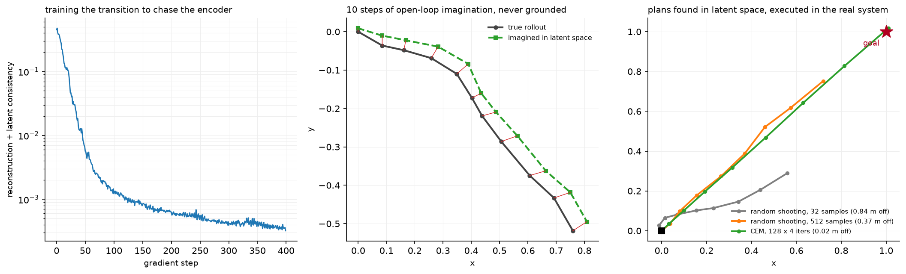

# World models

> **Why this matters at staff level.** A world model is a learned simulator: give it a state
> and an action, it gives you the next state. That single capability changes three things an
> autonomy company cares about, which are long-tail data synthesis, counterfactual
> evaluation, and planning without touching the real vehicle. Interviewers use this topic to
> see whether you can reason about a model whose output is evaluated by what it lets you do,
> not by a validation loss, and whether you know why a rollout that looks good for 2 seconds
> is not a simulator you can trust.

## TL;DR, the interview card

* Two formulations. **Latent dynamics**: $p(z_{t+1} \mid z_t, a_t)$ with an encoder and a
  decoder, so prediction happens in a compact space. **Observation-space**: $p(x_{t+1} \mid
  x_{\le t}, a_{\le t})$, which is video generation conditioned on actions.
* **RSSM** (PlaNet, Dreamer) splits the latent into a deterministic recurrent path, which
  carries information across many steps, and a stochastic path, which represents what the
  model cannot predict. Dropping either breaks it in a characteristic way.
* **Planning in latent space**: sample action sequences, roll them forward through the
  transition model, score the imagined trajectory, keep the best. Random shooting is the
  baseline; CEM refits a Gaussian to the elite set and needs far fewer samples.
* **Compounding error** is the central problem. Each step's error becomes the next step's
  input, so open-loop rollouts diverge. A model with excellent one-step accuracy can be
  useless at 20 steps, which is why you evaluate multi-step rollouts and train with
  multi-step objectives.
* **For autonomy**, world models buy synthesis of rare scenarios, counterfactual evaluation
  ("what if that vehicle had not yielded"), closed-loop evaluation with reactive agents, and
  policy training without a fleet. GAIA-1, Genie and Cosmos are the generative end; Waymax
  and NAVSIM are the engineering end.
* **The evaluation problem**: a world model's video can look convincing and be dynamically
  wrong. The metrics that matter are downstream (does a policy trained or evaluated in it
  transfer) rather than perceptual.

## 1. Intuition first

A perception system answers "what is around me now". A prediction system answers "what will
the other agents do". Neither answers "what would happen if I did this", and that question is
the one a planner is actually asking.

You can answer it with physics if you know the dynamics. For the ego's own motion, you do: a
bicycle model plus the control inputs gives you where the vehicle will be. For everything
else you do not, because the dynamics of "what the pedestrian does if I creep forward" are not
in any equation you can write down.

A world model learns them. Train a function that takes the current state and an action and
produces the next state, from logged sequences of states and actions. Once you have it, you
can roll it forward under hypothetical actions and see what happens, without a vehicle,
without risk, and much faster than real time.

The representation choice separates the two families. Predicting the next image means
generating pixels, which is expensive and spends most of its capacity on things that do not
affect the decision, such as the exact texture of the road. Predicting a next *latent*
compresses the state to what the model needs and makes rollouts cheap enough to do hundreds of
them inside a planning loop. The cost is that a latent trained by reconstruction can discard
what matters if it happens to occupy few pixels, and a small traffic light is few pixels.

{ width="900" }

The left panel is the training curve for the reconstruction plus latent-consistency objective
on a toy point mass. The middle panel is a 10-step imagined rollout compared against the truth,
with no grounding after the first frame: the red segments are the per-step divergence, which
grows because each step's error feeds the next. The right panel is planning: three planners
search for an action sequence that reaches a goal, entirely inside the model, and then their
plans are executed in the real system. CEM with 128 samples over 4 iterations beats random
shooting with 512, because it concentrates its samples where the good sequences are instead of
sampling uniformly from the whole action space.

Work the smallest case. A point mass with state $[x, y, v_x, v_y]$ and action
$a = [a_x, a_y]$, integrated with $v \mathrel{+}= a\,\delta t$ and $p \mathrel{+}= v\,\delta t$.
Encode the state to an 8-dimensional latent, predict $z_{t+1} = z_t + f(z_t, a_t)$, decode
back. Nothing about the encoder knows the physics, and after a few hundred gradient steps the
composition of encode, roll and decode reproduces a 5-step trajectory to within a few percent.
The residual form $z + f(\cdot)$ matters: predicting the delta rather than the absolute next
latent makes the identity function the default behaviour, which is correct for a system that
mostly continues doing what it was doing.

## 2. The math

### 2.1 What a world model is

Given a sequence of observations $x_{1:T}$ and actions $a_{1:T-1}$, a world model is a
distribution over futures conditioned on actions:

$$
p(x_{t+1:T} \mid x_{1:t}, a_{t:T-1}).
$$

The latent-variable factorisation introduces $z_t$ and assumes a Markov structure in the
latent:

$$
p(x_{1:T}, z_{1:T} \mid a_{1:T-1}) = \prod_{t} \underbrace{p(z_t \mid z_{t-1}, a_{t-1})}_{\text{transition}} \; \underbrace{p(x_t \mid z_t)}_{\text{decoder}} .
$$

Training maximises a variational lower bound with an approximate posterior
$q(z_t \mid z_{t-1}, a_{t-1}, x_t)$:

$$
\boxed{\;\mathcal{L} = \sum_t \Big[ \E_{q}\big[\log p(x_t \mid z_t)\big] - \KL\big( q(z_t \mid z_{t-1}, a_{t-1}, x_t) \,\|\, p(z_t \mid z_{t-1}, a_{t-1}) \big) \Big]\;}
$$

The first term says the latent must retain enough to reconstruct the observation; the second
says the transition model must predict what the posterior infers. The balance between them is
the whole design problem: weight reconstruction too heavily and the latent stores
unpredictable detail, weight the KL too heavily and the latent collapses to something the
transition can predict perfectly and the decoder cannot use.

### 2.2 RSSM

PlaNet's recurrent state-space model splits the latent into a deterministic part $h_t$ and a
stochastic part $s_t$:

$$
h_t = \text{GRU}(h_{t-1}, s_{t-1}, a_{t-1}), \qquad
p(s_t \mid h_t) = \mathcal{N}\big(\mu_\theta(h_t), \sigma_\theta(h_t)\big), \qquad
q(s_t \mid h_t, x_t) = \mathcal{N}\big(\mu_\phi(h_t, x_t), \sigma_\phi(h_t, x_t)\big),
$$

with the observation decoded from $(h_t, s_t)$.

The argument for both paths is a pair of failure modes. A purely stochastic latent must carry
all information through a sampled variable, so information is lost to the sampling noise at
every step and the model cannot remember anything reliably over a long horizon. A purely
deterministic latent cannot represent uncertainty, so when the future is genuinely ambiguous
it predicts the mean, which is the same blur as in chapter 6. The deterministic path carries
memory losslessly; the stochastic path carries what the model does not know.

PlaNet also introduced **latent overshooting**: rather than training only one-step predictions,
train the $d$-step prediction against the posterior at $t+d$ for several $d$. This attacks
compounding error at its source, which is that one-step training never exposes the model to
its own errors as inputs.

Dreamer extends this by learning an actor and a critic entirely inside the model's imagined
rollouts, with gradients flowing back through the learned dynamics, so policy improvement
needs no environment interaction at all. DreamerV3 reports a single configuration solving over
150 tasks, including collecting diamonds in Minecraft from scratch, which is the strongest
public evidence that model-based policy learning generalises across domains.
See [Part XII](../part12-rl/03-deep-rl-dqn.md) and
[Part XII](../part12-rl/04-policy-gradients-ppo.md) for the RL machinery those actors and
critics use.

### 2.3 Compounding error

Let the one-step model have error $\epsilon$ and Lipschitz constant $L$ in its input. Write
$\hat z_{t+1} = f(\hat z_t, a_t)$ and $z_{t+1} = f^{*}(z_t, a_t)$. Then

$$
\|\hat z_{t+1} - z_{t+1}\| \le \|f(\hat z_t, a_t) - f(z_t, a_t)\| + \|f(z_t,a_t) - f^{*}(z_t,a_t)\|
\le L \, \|\hat z_t - z_t\| + \epsilon,
$$

so by induction

$$
\boxed{\;\|\hat z_T - z_T\| \le \epsilon \, \frac{L^T - 1}{L - 1} \quad (L \ne 1), \qquad \|\hat z_T - z_T\| \le \epsilon T \quad (L = 1).\;}
$$

Error grows linearly when the dynamics are non-expansive and exponentially when $L > 1$. Since
real dynamics have $L > 1$ in some directions (any unstable mode, and driving has several),
the practical consequence is a horizon beyond which rollouts are unusable, and that horizon
moves only logarithmically with improvements in $\epsilon$. Cutting one-step error by 10x buys
you roughly $\ln 10 / \ln L$ extra steps, which for $L = 1.2$ is about 13 steps and for
$L = 2$ is about 3.

Three consequences to state in an interview. One-step validation loss is close to
uninformative about rollout quality. The fix is multi-step training (latent overshooting,
scheduled sampling, or training directly on $k$-step rollouts). And when you use the model for
planning, re-plan frequently with fresh observations, so the model is never asked to predict
further than its usable horizon.

### 2.4 Planning in a learned model

Given a differentiable or sampleable transition, planning is an optimisation over action
sequences:

$$
a_{t:t+H-1}^{*} = \argmin_{a_{t:t+H-1}} \; \E\left[ \sum_{k=0}^{H-1} c(\hat z_{t+k}, a_{t+k}) + c_{\text{terminal}}(\hat z_{t+H}) \right].
$$

**Random shooting** samples $S$ sequences uniformly and takes the best. It is trivial to
implement, parallelises perfectly, and needs a number of samples exponential in the horizon to
cover the space, so it is only viable for short horizons or low-dimensional actions.

**Cross-entropy method** maintains a Gaussian over action sequences, samples from it, keeps
the $E$ best (the elite set), refits the Gaussian to them, and repeats:

$$
\mu^{(i+1)} = \frac{1}{E}\sum_{e \in \text{elite}} a^{(e)}, \qquad
\sigma^{(i+1)} = \sqrt{\frac{1}{E}\sum_{e \in \text{elite}} (a^{(e)} - \mu^{(i+1)})^2}.
$$

CEM is a derivative-free optimiser that concentrates its sampling where good sequences have
been found, so it reaches a better optimum with far fewer total samples. Its failure mode is
premature convergence: if the elite set is all in one basin, $\sigma$ collapses and the search
stops exploring, which is why implementations floor $\sigma$ or mix in fresh samples.

**Model-predictive control** wraps either: plan $H$ steps, execute only the first action,
observe, re-plan. Executing one step and re-planning is what keeps compounding error bounded,
because the model is re-grounded in a real observation every step.

### 2.5 What changes for autonomy

**Long-tail synthesis.** The rare events that dominate AV risk are, by definition, rare in the
data. A world model conditioned on text or on a scenario specification can generate them: a
vehicle running a red light, a pedestrian emerging from between parked cars, an unusual weather
condition. The generated data is only as good as the model's dynamics, so it is used for
perception training (where a realistic image with a known label is what you need) more readily
than for planning training (where the *behaviour* has to be right).

**Counterfactuals.** Given a logged scene, re-simulate it with one thing changed. What if the
ego had accelerated instead of yielding? A log replay cannot answer that, because the other
agents' logged trajectories were reactions to what the ego did. A world model with
action-conditioned agents can.

**Closed-loop evaluation.** Chapter 6 argued that open-loop metrics mislead. Closed-loop needs
a simulator whose agents react, and a learned world model is one way to get agents whose
reactions came from data instead of from a hand-tuned car-following model.

**Policy training.** Dreamer-style learning inside the model, applied to driving. The promise
is enormous (no fleet needed) and the obstacle is the same as everywhere else: a policy trained
in a model exploits the model's errors, so it finds actions that are good in imagination and
bad in reality. The mitigations are ensembles with disagreement penalties, conservative value
estimation, and short imagination horizons with real-data grounding.

### 2.6 Generative video world models

The observation-space family predicts pixels. GAIA-1 casts world modelling as unsupervised
sequence modelling: map video, text and action inputs to discrete tokens and predict the next
token, which gives fine-grained control over ego behaviour and scene features and produces
realistic driving video. Wayve reports scaling it to 9 billion parameters.

Genie learns from unlabelled internet video with no action labels at all, using a latent action
model that infers what action must have occurred between consecutive frames, a video tokenizer
and an autoregressive dynamics model, so it can generate action-controllable environments from
an image or a text prompt. Cosmos packages the same idea as a platform for physical AI, with a
video curation pipeline, pre-trained world foundation models and video tokenizers, released
with open weights.

The common structure is worth extracting: tokenize the video, model the token sequence
autoregressively (or with diffusion), condition on actions or on inferred latent actions. The
same recipe LLM pretraining uses, applied to a different token stream.

## 3. Implementation

### 3.1 The model

```python
class LatentWorldModel(nn.Module):
    """encoder → latent, action-conditioned residual transition, decoder."""

    def next_latent(self, z: torch.Tensor, a: torch.Tensor) -> torch.Tensor:
        """``ẑ' = z + f([z; a])``: (N, latent), (N, action) → (N, latent)."""
        return z + self.transition(torch.cat([z, a], dim=-1))   # (N, latent)

    def rollout(self, z0: torch.Tensor, actions: torch.Tensor) -> torch.Tensor:
        """z0 (N, latent), actions (N, T, action) → imagined latents (N, T+1, latent)."""
        zs = [z0]
        z = z0
        for t in range(actions.shape[1]):
            z = self.next_latent(z, actions[:, t])              # (N, latent)
            zs.append(z)
        return torch.stack(zs, dim=1)                           # (N, T+1, latent)
```

The residual form is a design choice with a clear justification: the identity is the default,
so a randomly-initialised transition network predicts "nothing changes", which is much closer
to correct than a random latent and gives a sane starting point for optimisation. It also makes
the effective Lipschitz constant close to 1 at initialisation, which from §2.3 means errors
accumulate linearly instead of exponentially early in training.

The rollout is a Python loop over time and the latents are stacked, so the whole rollout is one
autograd graph. For a planning application you wrap it in `torch.no_grad()`, as the planners do;
for training a policy through it you do not, and the memory cost is linear in the horizon.

### 3.2 The loss

```python
def world_model_loss(model, obs, actions):
    """obs (N, T+1, obs_dim), actions (N, T, action_dim)."""
    n, t1, _ = obs.shape
    z = model.encode(obs)                                                          # (N, T+1, latent)
    recon = ((model.decode(z) - obs) ** 2).mean()
    z_pred = model.next_latent(z[:, :-1].reshape(-1, z.shape[-1]),
                              actions.reshape(-1, actions.shape[-1]))              # (N·T, latent)
    z_target = z[:, 1:].reshape(-1, z.shape[-1]).detach()                          # (N·T, latent)
    consistency = ((z_pred - z_target) ** 2).mean()
    return recon + consistency
```

The `.detach()` on the target is the part worth explaining. Without it, the consistency term can
be minimised by making the encoder output a constant, since then every prediction is
correct by construction and the term goes to zero. The reconstruction term opposes that, but the collapse
direction is much easier to find than the useful one, and models do find it. Detaching means the
consistency gradient reaches only the transition network: the transition chases the encoder, the
encoder is shaped by reconstruction alone, and collapse is no longer a descent direction for the
term that would have caused it.

This is the same asymmetry as a target network in Q-learning ([Part XII](../part12-rl/03-deep-rl-dqn.md))
and as the stop-gradient in BYOL-style self-supervised learning
([Part X](../part10-self-supervised/01-self-supervised-learning.md)). Recognising the pattern
across three fields is a good signal in an interview.

The model as written is deterministic, so it predicts the conditional mean of the next latent.
For the toy point mass that is correct, since the dynamics are deterministic. For driving it is
the chapter 6 blur problem again, and the fix is the stochastic path of an RSSM or a
discrete-token autoregressive formulation.

### 3.3 Planning

```python
def cem_plan(model, z0, cost_fn, horizon, action_dim, n_samples=256, n_elite=32, n_iters=5, action_scale=1.0):
    mean = torch.zeros(horizon, action_dim)                      # (T, a)
    std = torch.full((horizon, action_dim), action_scale)        # (T, a)
    with torch.no_grad():
        for _ in range(n_iters):
            actions = (mean + std * torch.randn(n_samples, horizon, action_dim)).clamp(-action_scale, action_scale)  # (S, T, a)
            zs = model.rollout(z0.expand(n_samples, -1), actions)  # (S, T+1, latent)
            cost = cost_fn(model.decode(zs))                      # (S,)
            elite = actions[cost.topk(n_elite, largest=False).indices]  # (E, T, a)
            mean, std = elite.mean(0), elite.std(0) + 1e-3        # (T, a) each
    return mean
```

`z0.expand(n_samples, -1)` broadcasts one starting latent to every sample without copying it,
so all $S$ rollouts run as one batched forward pass. That batching is what makes sampling-based
planning viable at all: 256 sequences over 8 steps is 8 batched matrix multiplies, not 2048
sequential ones.

The `+ 1e-3` on the standard deviation is the floor from §2.4. Without it, an elite set that
happens to be nearly identical collapses $\sigma$ to zero and every subsequent iteration
samples the same sequence, so the remaining iterations do nothing.

`clamp` enforces action limits inside the search, which is the correct place for them: a
planner that finds an infeasible optimum and then clips it at execution time is optimising a
different problem from the one it will act in.

??? example "Full implementation"
    ```python
    --8<-- "src/mlbook/perception/world_model.py"
    ```

**How you would test it.** The toy dynamics against hand-computed integration. Shapes for the
model. For the training: a 5-step imagined rollout must beat a "nothing moves" baseline by a
large factor, which is the test that a one-step-accurate but useless model would fail. For the
planners: execute the plan in the *real* environment (not in the model) and check it reaches
the goal, which is the only test that catches a model whose imagined rollouts are
self-consistent and wrong. And CEM with few samples must match or beat random shooting with
few samples, which verifies the refitting actually concentrates the search.

## Retype by hand

| Symbol | File | Target time | Why |
|---|---|---|---|
| `LatentWorldModel.next_latent` and `.rollout` | `src/mlbook/perception/world_model.py` | 10 minutes | The residual transition and the rollout loop; short and frequently asked. |
| `world_model_loss` | `src/mlbook/perception/world_model.py` | 12 minutes | The detached target is the one line that stops collapse. Be able to justify it. |
| `cem_plan` | `src/mlbook/perception/world_model.py` | 18 minutes | Sample, roll, score, refit. The elite selection and the std floor. |
| `random_shooting_plan` | `src/mlbook/perception/world_model.py` | 6 minutes | The baseline CEM is compared against. |

Read but do not retype: `PointMassDynamics` (test scaffolding), the encoder and decoder
constructors (plain MLPs).

Check yourself with:

```bash
pytest tests/test_perception_world_model.py -q
```

Target: 45 minutes with the file green. The planning test is the interesting one to read: it
executes the plan in the real environment rather than in the model, which is the difference
between testing a world model and testing its own self-consistency.

## 4. Systems view: cost, failure modes, trade-offs

| Situation | Use | Decision rule |
|---|---|---|
| Planning in a low-dimensional, well-understood system | Analytic model, no learning | If you can write the dynamics, write them; a learned model is strictly worse |
| Planning from pixels, limited interaction budget | Latent dynamics (RSSM, Dreamer) | Rollouts must be cheap enough to do hundreds inside the control loop |
| Generating training data for perception | Observation-space video model (GAIA, Cosmos) | You need pixels because the consumer is a perception model |
| Closed-loop policy evaluation with real scenarios | Data-driven simulator (Waymax, NAVSIM) | Real initial conditions matter more than generative realism |
| Counterfactual analysis of a logged incident | Action-conditioned model with reactive agents | Log replay cannot answer a counterfactual by construction |

**Cost.** A latent rollout is a few small matrix multiplies per step, so hundreds of parallel
rollouts over a 10-step horizon fit in a control loop. A video world model is orders of
magnitude more expensive: generating a few seconds of driving video takes far longer than a few
seconds, which puts it firmly in the offline data-generation and evaluation role rather than in
the vehicle.

**Failure modes.**

*Compounding error.* Quantified in §2.3. Mitigate with multi-step training objectives and with
frequent re-planning under fresh observations.

*Latent collapse.* The consistency term's trivial minimiser. Prevented by the stop-gradient; the
diagnostic is the variance of the latent across a batch, which goes to zero when it happens.

*Model exploitation.* A policy or planner optimised against a learned model finds the model's
errors. In a driving context that looks like a plan that drives through a region the model
believes is free because it never saw an obstacle there. The mitigations are an ensemble with a
disagreement penalty added to the cost (so the planner avoids states where the models disagree),
pessimistic value estimates, and limiting the planning horizon to where the model is trustworthy.

*Convincing video, wrong dynamics.* A generated clip can be perceptually excellent and violate
conservation of momentum, vehicle kinematics or traffic rules. Perceptual metrics (FVD and
similar) do not measure this at all. The evaluations that do are downstream: does a detector
trained on the generated data improve on real data, does a policy evaluated in the model rank
the same as in the real world.

*Distribution of scenarios.* A world model trained on fleet data generates what the fleet saw,
which is dominated by ordinary driving. Asking it for the rare event you most need is asking it
to extrapolate, and generative models extrapolate by interpolating between things they know.
Text-conditioning helps direct it, and it does not create knowledge that was not in the data.

**Closed-loop simulation as the practical end of this topic.** Waymax runs entirely on
accelerators with in-graph simulation for training, initialised from Waymo Open Motion Dataset
scenarios, with both learned and hard-coded behaviour models for the other agents. NAVSIM takes
the non-reactive middle path, arguing its metrics align better with closed-loop results than
displacement errors while remaining cheap enough to run at dataset scale; it supported a CVPR
2024 competition with 143 teams and 463 entries. Both are world models in the engineering sense
even though neither generates pixels, and for most autonomy teams they are where the value is
today.

## 5. In production

!!! production "Wayve, GAIA-1, a generative world model for driving"
    GAIA-1 casts world modelling as an unsupervised sequence problem: map video, text and
    action inputs to discrete tokens and predict the next token. It generates realistic driving
    video with fine-grained control over ego behaviour and scene features, and Wayve reports
    emergent properties including scene dynamics, contextual awareness and an understanding of
    geometry. Wayve subsequently scaled it to 9 billion parameters. The stated purpose is to
    generate the long-tail scenarios a fleet rarely encounters.
    Sources: [GAIA-1 (arXiv 2309.17080)](https://arxiv.org/abs/2309.17080),
    [Scaling GAIA-1](https://wayve.ai/thinking/scaling-gaia-1/).

!!! production "Google DeepMind, Genie, learning actions without action labels"
    Genie is trained on unlabelled internet video and still produces action-controllable
    environments, using a latent action model that infers the action between consecutive frames,
    a spatiotemporal video tokenizer and an autoregressive dynamics model, at 11B parameters. The
    part to carry into an autonomy interview is the absence of action labels: most driving video
    in the world has no recorded steering or throttle, so a method that learns controllable
    dynamics without them can use a far larger data pool than a fleet's own logs.
    Source: [Genie (arXiv 2402.15391)](https://arxiv.org/abs/2402.15391).

!!! production "NVIDIA, Cosmos, world models as a platform"
    Cosmos packages world foundation models for physical AI: a video curation pipeline that
    extracted about 100M clips from a 20M-hour collection, pre-trained world foundation models,
    post-training examples and video tokenizers, released open-weight under permissive licences.
    The framing is that physical AI needs a digital twin of itself (the policy) and a digital
    twin of the world (the world model), which is a clean way to state why an autonomy company
    invests in this at all.
    Sources: [Cosmos (arXiv 2501.03575)](https://arxiv.org/abs/2501.03575),
    [NVIDIA Cosmos](https://www.nvidia.com/en-us/ai/cosmos/).

!!! production "Waymo, Waymax, closed loop at accelerator speed"
    Waymax is a JAX simulator for multi-agent driving scenes initialised or replayed from the
    Waymo Open Motion Dataset, running entirely on TPUs and GPUs with in-graph simulation so it
    fits inside distributed training. It includes learned and hard-coded behaviour models for
    realistic interaction and benchmarks imitation and reinforcement learning algorithms, with
    ablations on design decisions. Two of their findings are worth remembering: route
    information is effective guidance for planning agents, and RL agents overfit against
    simulated agents, which is the model-exploitation failure mode in its natural habitat.
    Source: [Waymax](https://github.com/waymo-research/waymax).

!!! production "University of Tübingen and NVIDIA, NAVSIM, the middle path"
    NAVSIM combines large real datasets with a non-reactive simulator, so metrics can be
    computed open-loop while aligning better with closed-loop results than displacement errors
    do. Because the policy and the environment do not influence each other, it is cheap enough to
    run at dataset scale; the cost is that it cannot measure anything that depends on other
    agents reacting. It supported a CVPR 2024 competition with 143 teams and 463 entries.
    Source: [NAVSIM (arXiv 2406.15349)](https://arxiv.org/abs/2406.15349).

!!! production "Google, Dreamer, learning behaviours inside the model"
    DreamerV3 learns a world model and improves behaviour by imagining future scenarios inside
    it, with normalisation, balancing and transformation techniques that make a single
    configuration work across over 150 tasks. It was the first algorithm to collect diamonds in
    Minecraft from scratch without human data or curricula. For driving it is the reference for
    what model-based policy learning can do, and the gap between Minecraft and a public road is
    the open question.
    Sources: [DreamerV3 (arXiv 2301.04104)](https://arxiv.org/abs/2301.04104),
    [PlaNet (arXiv 1811.04551)](https://arxiv.org/abs/1811.04551).

## 6. Interview questions and strong answers

!!! interview "What is a world model and why would an AV company build one?"
    A model of $p(s_{t+1} \mid s_t, a_t)$, learned from logged sequences of states and actions,
    which lets you ask "what happens if I do this" without doing it.

    Four uses, in the order I would prioritise them for an AV company. Closed-loop evaluation:
    chapter 6's argument is that open-loop metrics mislead, and a reactive simulator is what
    fixes that. Counterfactual analysis: given a logged incident, re-simulate with one thing
    changed, which log replay cannot do because the logged agents' behaviour was a reaction to
    the logged ego. Long-tail synthesis: generate rare scenarios for training and testing.
    Policy learning inside the model, which is the highest-upside and least mature.

    What makes it hard is that the evaluation is downstream. A world model with low validation
    loss and realistic-looking video can have wrong dynamics, and the only tests that catch that
    ask whether it is useful: does a policy ranked highly in the model rank highly in reality.

    **Staff-level follow-up: pixels or latents?** Latents when the consumer is a planner, since
    rollouts need to be cheap enough to do hundreds of them per control step. Pixels when the
    consumer is a perception model that needs images to train on. They are different products
    with different evaluation criteria, and conflating them is a common mistake.

!!! interview "Derive the compounding error bound and say what it implies for training."
    With one-step error $\epsilon$ and Lipschitz constant $L$,
    $\|\hat z_{t+1} - z_{t+1}\| \le L\|\hat z_t - z_t\| + \epsilon$, so after $T$ steps the
    error is bounded by $\epsilon (L^T - 1)/(L-1)$, which is linear in $T$ when $L = 1$ and
    exponential when $L > 1$.

    Three implications. One-step validation loss tells you almost nothing about rollout quality,
    so the metric you report must be multi-step. Improving $\epsilon$ buys horizon only
    logarithmically: a 10x better one-step model extends the usable horizon by
    $\ln 10 / \ln L$ steps, which for $L = 1.5$ is about 6. And the training objective should be
    multi-step, because a model trained only on one-step transitions never sees its own errors
    as inputs, which is the same distribution-shift argument as behavioural cloning. PlaNet's
    latent overshooting is one implementation; scheduled sampling and direct $k$-step rollout
    losses are others.

    **Staff-level follow-up: how does this change how you use the model?** Re-plan every step
    with a fresh observation (model-predictive control), so the model is never asked to predict
    beyond the horizon where it is accurate. The planning horizon should be set from a measured
    rollout-error curve, not chosen by intuition.

!!! interview "Why does the latent world model loss detach the consistency target?"
    Without the detach, the consistency term $\|f(z_t, a_t) - \text{enc}(x_{t+1})\|^2$ has a
    trivial minimiser: make the encoder constant, so every prediction is correct and the term is
    zero. The reconstruction term opposes it, and in practice the collapse direction is much
    easier for the optimiser to find, so models do collapse.

    Detaching means the consistency gradient reaches only the transition network. The encoder is
    shaped by reconstruction alone, the transition chases whatever the encoder produces, and
    collapse stops being a descent direction for the term that caused it.

    The same asymmetry appears as target networks in Q-learning and as the stop-gradient in
    BYOL-style self-supervised learning. Whenever a loss compares a prediction to a
    representation that the same gradient could move, one side has to be frozen.

    **Staff-level follow-up: how would you detect collapse if it happened anyway?** Track the
    variance of the latent across a batch. Healthy training keeps it roughly constant; collapse
    drives it towards zero while the consistency loss drops sharply and the reconstruction loss
    rises. Watching only the total loss hides it, because the sum can decrease while the split
    between the terms goes wrong.

!!! interview "Random shooting or CEM for planning in a learned model?"
    Random shooting samples uniformly and takes the best of $S$ sequences. It is simple and
    parallel and needs samples exponential in the horizon and action dimension to cover the
    space, so it works for short horizons and small action spaces.

    CEM fits a Gaussian to the elite set and resamples, concentrating on the promising region, so
    it finds better plans with far fewer total samples. Our test shows 128 samples over 4 CEM
    iterations beating 512 random samples on a 2D action space and 8-step horizon, and the gap
    widens as the horizon grows.

    CEM's failure is premature convergence: an elite set in one basin collapses $\sigma$ and the
    search stops. The fixes are a floor on $\sigma$, mixing in fresh uniform samples, or
    restarting from several initial distributions.

    **Staff-level follow-up: why not gradients through the model?** You can, since the model is
    differentiable, and it works when the cost landscape is smooth. It fails on the landscapes
    planning actually has: non-differentiable costs (a collision indicator), local minima
    (going around an obstacle on the left or the right is two basins separated by a barrier),
    and exploding gradients through a long rollout. Sampling-based optimisers are robust to all
    three, which is why MPC implementations overwhelmingly use them.

!!! interview "You have a video world model that generates convincing driving footage. How do you know it is useful?"
    Perceptual quality is not the property you need. Three evaluations that actually measure
    usefulness.

    Dynamics correctness: extract trajectories from the generated video and check them against
    physical constraints (vehicle kinematics, acceleration limits) and behavioural statistics
    (following distances, speed distributions, gap acceptance) compared against real logs. A
    model that generates vehicles turning at impossible yaw rates looks fine frame by frame and
    is useless for anything behavioural.

    Downstream transfer for perception: train a detector on generated data plus real data and
    measure on a real held-out set. If the generated data does not improve over real data alone,
    it carries no information the real data lacked.

    Downstream transfer for policy: rank several policies inside the model and rank the same
    policies in the real world or in a trusted simulator, and measure rank correlation. That is
    the property you need if the model is going to be used for evaluation, and it is the
    hardest to establish.

    **Staff-level follow-up: what about the rare events you built it for?** Those are the hardest
    case, because you have little real data to validate against. The honest position is that the
    model interpolates between what it saw, so a generated rare event is a plausible combination
    of familiar elements, and whether that covers the real long tail is unproven. I would use
    generated rare events to *stress-test* (find failures cheaply) and validate any fix on real
    data, not to certify.

!!! interview "Would you train a driving policy inside a world model?"
    Not as the primary training signal today, and yes as a component.

    The obstacle is model exploitation. A policy optimised against a learned model finds the
    model's errors, and in driving that means plans that are excellent in imagination because
    the model failed to represent something. Waymax's own ablations report RL agents overfitting
    against simulated agents, which is this failure observed directly.

    What I would do: use the model for what it is reliable at. Short-horizon imagination with
    frequent real-data grounding, in the Dreamer style, where the rollouts are a few steps and
    the policy is regularised towards imitation of real driving. Use an ensemble of dynamics
    models and add a disagreement penalty to the cost, so the policy avoids the states where the
    models disagree, which are the ones where the data was thin. And validate everything in a
    data-initialised simulator (Waymax) and then on the road, since the model's ranking of
    policies is itself something that has to be checked.

    **Staff-level follow-up: what would change your mind?** A demonstrated rank correlation
    between in-model policy evaluation and real-world performance on the metrics that matter, on
    a held-out set of scenarios the model was not trained on. That is a measurable bar, and until
    something clears it, in-model training is a research programme and not a deployment path.

## 7. Exercises

**★ Exercise 1.** A model has one-step error 0.01 and Lipschitz constant 1.3. At what horizon
does the error exceed 1.0?

??? success "Solution"
    $\epsilon (L^T - 1)/(L-1) > 1$ gives $(1.3^T - 1)/0.3 > 100$, so $1.3^T > 31$, so
    $T > \ln 31 / \ln 1.3 = 13.1$. The usable horizon is about 13 steps, which at 10 Hz is 1.3
    seconds. Reducing $\epsilon$ to 0.001 gives $1.3^T > 301$, so $T > 21.8$: a 10x better model
    buys 8 more steps, or 0.8 seconds.

**★ Exercise 2.** Why does the transition predict $z + f(z, a)$ instead of $f(z, a)$?

??? success "Solution"
    The residual makes the identity the default, so a randomly-initialised network predicts
    "nothing changes", which is a far better starting point than a random latent for a system
    whose state usually changes slowly. It also puts the Lipschitz constant near 1 at
    initialisation (the Jacobian is $I + \partial f/\partial z$ with small $\partial f/\partial z$),
    which by exercise 1's arithmetic means errors accumulate linearly instead of exponentially in
    early training, when $f$ is worst. The same argument justifies residual connections generally.

**★★ Exercise 3.** The consistency loss is defined against the encoder's output, not against the
true next state. What does that buy, and what does it cost?

??? success "Solution"
    It buys applicability when the true state is not observed. In the toy environment the
    observation is the state, but for pixels there is no "true latent", only images, so
    consistency has to be defined in whatever latent the encoder produces. It also lets the
    latent be lower-dimensional than the observation, which is the point of a latent model.

    It costs a moving target: the encoder changes during training, so the transition is chasing a
    non-stationary objective, which slows convergence and can oscillate. The stop-gradient makes
    the target change more slowly from the transition's point of view but does not make it
    stationary. It also admits the collapse failure, which the stop-gradient prevents but which
    would not exist at all if the target were the true state.

**★★ Exercise 4 (coding).** Measure the rollout error as a function of horizon for the trained
model, and find the horizon at which it exceeds the "nothing moves" baseline.

??? success "Solution"
    ```python
    import numpy as np, torch
    from mlbook.perception.world_model import LatentWorldModel, PointMassDynamics, world_model_loss

    torch.manual_seed(0); np.random.seed(0)
    env = PointMassDynamics(dt=0.2)
    s0 = np.random.uniform(-1, 1, size=(512, 4))
    a_np = np.random.uniform(-1, 1, size=(512, 12, 2))
    obs = torch.tensor(env.rollout(s0, a_np), dtype=torch.float32)   # (512, 13, 4)
    act = torch.tensor(a_np, dtype=torch.float32)                    # (512, 12, 2)
    model = LatentWorldModel(4, 2, latent_dim=8, hidden=64)
    opt = torch.optim.Adam(model.parameters(), lr=5e-3)
    for _ in range(400):
        idx = torch.randint(0, 512, (128,))
        loss = world_model_loss(model, obs[idx, :6], act[idx, :5])   # trained on 5-step windows
        opt.zero_grad(); loss.backward(); opt.step()

    with torch.no_grad():
        imagined = model.decode(model.rollout(model.encode(obs[:, 0]), act))  # (512, 13, 4)
    for h in range(1, 13):
        err = (imagined[:, h] - obs[:, h]).norm(dim=-1).mean().item()
        base = (obs[:, 0] - obs[:, h]).norm(dim=-1).mean().item()   # "nothing moves"
        print(f"h={h:2d}  rollout={err:.3f}  baseline={base:.3f}  ratio={err / base:.2f}")
    ```

    The ratio grows with horizon, and the horizon where it crosses 1.0 is where the model stops
    being better than assuming nothing happens. Training on 5-step windows and evaluating to 12
    shows the extrapolation penalty directly; retrain with 12-step windows and the crossing moves
    out, which is the multi-step training argument from §2.3 as an experiment.

**★★ Exercise 5.** A planner using your world model consistently produces plans that drive
straight through a region the model believes is free. Diagnose and fix.

??? success "Solution"
    This is model exploitation. The planner is an optimiser searching over actions, so it finds
    the region of action space where the model's cost is lowest, and if the model is wrong
    anywhere the optimiser will locate it. The more capable the optimiser, the worse the problem,
    which is counter-intuitive and worth saying out loud.

    Diagnosis: check whether the states the plan visits are in-distribution for the model's
    training data. A simple density estimate on the latent, or the disagreement between an
    ensemble of transition models, both work. If the exploited region is out-of-distribution,
    the model is extrapolating and the planner found the extrapolation.

    Fixes, in order of how much they help: (1) train an ensemble and add a disagreement penalty
    to the planning cost, so states where the models disagree are expensive and the planner
    avoids exactly the regions where the model is unreliable; (2) shorten the planning horizon so
    the search cannot reach far-out-of-distribution states; (3) constrain the search to actions
    near a behavioural prior, which keeps the plan in the data's support; (4) add the exploited
    scenarios to the training data, which fixes that instance and not the mechanism.

**★★★ Exercise 6.** You are asked to build a world model that generates rare driving scenarios
for testing. Specify the architecture, the conditioning, the training data and the validation
plan, and state what you would refuse to claim about it.

??? success "Solution"
    Architecture: a tokenizer over multi-camera video plus an autoregressive or diffusion
    dynamics model over the token sequence, conditioned on ego actions and on text, following the
    GAIA and Cosmos recipe. The multi-camera requirement is what makes it usable for a real rig,
    and it is also what makes it expensive.

    Conditioning: three channels. Ego action sequence, so a scenario can be replayed under
    different ego behaviour. Text, for directing the scenario content. And an initial real frame
    or short clip, so generation starts from a real scene rather than from nothing, which
    anchors the appearance statistics and lets you generate variations of logged situations.

    Training data: fleet video with synchronised ego actions, plus whatever external driving
    video is available for diversity. Curate heavily; Cosmos's pipeline extracted about 100M
    clips from 20M hours, which indicates the ratio between raw footage and usable training data.

    Validation, in three tiers. Dynamics: extract trajectories from generated clips and compare
    kinematic and behavioural statistics against real logs. Perception transfer: train a detector
    with generated data added and measure on real held-out data. Rank correlation: evaluate
    several known-quality policies on generated scenarios and check the ranking matches a trusted
    reference.

    What I would refuse to claim: that passing a generated scenario implies safety on the real
    version of it. The model interpolates between what it saw, so a generated rare event is a
    plausible recombination of familiar elements, and the real long tail contains things that are
    not recombinations. The defensible claim is the negative one: a policy that fails a generated
    scenario has a real problem, and that makes the model a cheap failure-finder. Using it as
    evidence of safety would require establishing coverage, and there is no accepted method for
    establishing coverage of a distribution you cannot sample from.

## References

* Danijar Hafner et al. "Learning Latent Dynamics for Planning from Pixels." ICML 2019. [arXiv:1811.04551](https://arxiv.org/abs/1811.04551)
* Danijar Hafner et al. "Mastering Diverse Domains through World Models." 2023. [arXiv:2301.04104](https://arxiv.org/abs/2301.04104)
* Anthony Hu et al. "GAIA-1: A Generative World Model for Autonomous Driving." 2023. [arXiv:2309.17080](https://arxiv.org/abs/2309.17080)
* Jake Bruce et al. "Genie: Generative Interactive Environments." ICML 2024. [arXiv:2402.15391](https://arxiv.org/abs/2402.15391)
* NVIDIA. "Cosmos World Foundation Model Platform for Physical AI." 2025. [arXiv:2501.03575](https://arxiv.org/abs/2501.03575)
* Cole Gulino et al. "Waymax: An Accelerated, Data-Driven Simulator for Large-Scale Autonomous Driving Research." NeurIPS 2023. [GitHub](https://github.com/waymo-research/waymax)
* Daniel Dauner et al. "NAVSIM: Data-Driven Non-Reactive Autonomous Vehicle Simulation and Benchmarking." NeurIPS 2024. [arXiv:2406.15349](https://arxiv.org/abs/2406.15349)
* Wayve. "Scaling GAIA-1: 9-billion parameter generative world model for autonomous driving." [wayve.ai](https://wayve.ai/thinking/scaling-gaia-1/)
