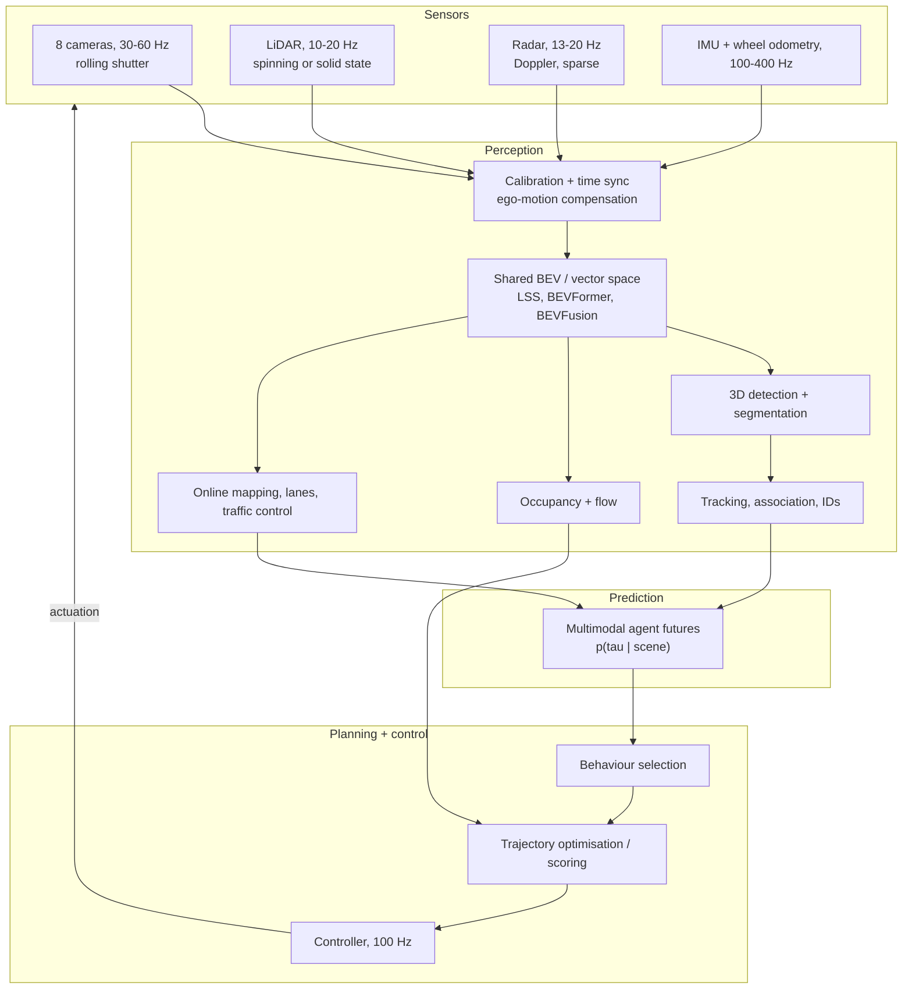
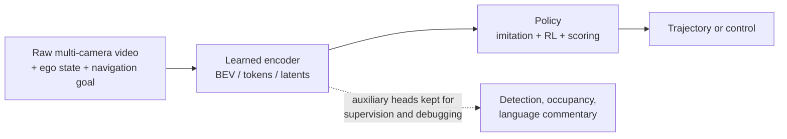
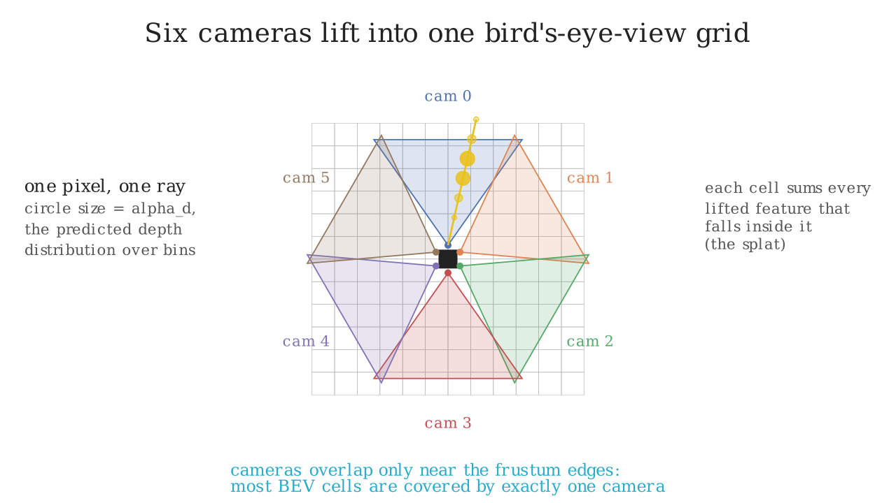

# Part XI. Perception and autonomy

This part is about the stack that turns photons into a steering command, and about the
research that is currently dissolving the boundaries inside that stack. If you interview
at Tesla, Waymo, Zoox, Nuro, Aurora, NVIDIA, Cruise, Wayve, Figure or a robotics lab, the
material here is the difference between an engineer who has trained detectors and an
engineer who can own a perception system.

The assumption throughout is that you already know object detection and segmentation
([Part IV](../part04-vision/04-detection.md), [Part IV](../part04-vision/05-segmentation.md))
and the Transformer ([Part V](../part05-sequence-transformers/04-transformer-architectures.md)).
Everything here goes past the single image: multiple calibrated cameras, time, other
sensors, other agents, and the future.

## The stack you are expected to be able to draw

The modular stack above has one property that keeps it alive in production: every arrow is
an interface you can log, replay, unit test and assign to a team. It has one property that
keeps people trying to replace it: every interface is lossy. A box with a class label
throws away the shape of the thing it boxed. A tracked object throws away the pixels that
would have told you the driver is looking at their phone. Errors compound left to right,
and the modules are optimised against proxy losses that nobody can prove correlate with
"the car drove well".

The end-to-end alternative removes the interfaces:

UniAD and VAD keep the modules but make them differentiable query interfaces so the
planning loss reaches perception. Tesla's FSD v12 and Wayve's models push further toward
video in, controls out. The dotted line matters: every credible end-to-end system keeps
auxiliary perception heads, because a policy you cannot interrogate is a policy you cannot
certify or debug.

## What each chapter covers

| Chapter | The question it answers | The thing you implement |
|---|---|---|
| [1. Perception foundation models](01-perception-foundation-models.md) | How did detection, segmentation, depth and OCR converge into prompted models? | Open-vocabulary head, box tokenizer |
| [2. Multi-camera and BEV](02-multi-camera-bev.md) | How do 6 to 8 images become one metric top-down representation? | Lift-Splat-Shoot, BEV query attention, temporal warping |
| [3. Sensor fusion](03-sensor-fusion.md) | Where should camera, LiDAR and radar meet, and what happens when one fails? | Point painting, weighted box fusion, cross-attention fusion |
| [4. Tracking](04-tracking.md) | How do detections become identities that survive occlusion? | Kalman filter, Hungarian, SORT, ByteTrack |
| [5. Occupancy and temporal perception](05-occupancy-temporal.md) | What do you do about obstacles that have no class? | Occupancy head with ego-motion-aligned memory |
| [6. Prediction and planning](06-prediction-planning.md) | How do you represent a future that is genuinely ambiguous? | Multimodal trajectory head, WTA and anchors, minADE |
| [7. World models](07-world-models.md) | Can you learn a simulator good enough to plan and evaluate inside? | Latent dynamics model, CEM planning |

{ width="680" }

The six camera frusta overlap only near their edges, so most of the BEV plane is covered by
exactly one camera. Any error in that camera's extrinsics moves objects in the shared frame
with no second view to contradict it, which is the geometric reason calibration drift shows
up as a perception problem instead of a calibration alarm.

## Prerequisites

Read these first if they are not already fluent:

* [Geometry and cameras](../part04-vision/06-geometry.md) for intrinsics, extrinsics and
  projection. Part XI re-derives the pinhole projection it needs in
  `src/mlbook/perception/camera_rig.py` so the modules stand alone, but the full treatment
  of distortion, epipolar geometry and bundle adjustment lives in Part IV.
* [3D perception](../part04-vision/07-3d-perception.md) for point clouds, voxels and
  PointPillars-style encoders.
* [Attention mathematics](../part05-sequence-transformers/03-attention-mathematics.md).
  Every BEV and fusion architecture here is attention with a geometric prior on the keys.
* [DETR and set prediction](../part08-multimodal/02-detr.md) for queries, bipartite
  matching and the Hungarian algorithm in its detection setting.
* [CLIP and contrastive learning](../part08-multimodal/03-clip-contrastive.md) for the text
  embeddings that open-vocabulary detection heads consume.
* [Probability](../part01-math/03-probability.md) for the Gaussian conditioning that the
  Kalman filter derivation leans on.

Chapter 6 links forward to [imitation learning](../part12-rl/05-imitation-learning.md) and
chapter 7 to [policy gradients](../part12-rl/04-policy-gradients-ppo.md); you can read Part
XI before Part XII and follow the links when you need them.

## A one-day ordering

If you have a single day before an autonomy interview, work in this order. The times
assume you code along rather than read passively.

1. **Tracking (chapter 4), 2 hours.** It is the most likely coding round in this part. Get
   to the point where you can write the Kalman predict and update from the model equations
   and the Hungarian assignment from the cost matrix, without notes.
2. **Multi-camera and BEV (chapter 2), 2 hours.** The most likely ML depth round. Derive
   Lift-Splat-Shoot on a whiteboard: frustum, depth distribution, outer product, pooling.
   Then be able to say why BEVFormer inverts the direction and what that buys.
3. **Prediction and planning (chapter 6), 1.5 hours.** Multimodality, the winner-takes-all
   loss and its failure mode, minADE and minFDE, open-loop versus closed-loop evaluation.
4. **Occupancy (chapter 5), 1 hour.** The long-tail argument, the memory cost, and how
   temporal fusion works when the ego is moving.
5. **Sensor fusion (chapter 3), 1 hour.** Early, intermediate and late, and the failure and
   degradation story that senior interviewers push on.
6. **Foundation models (chapter 1) and world models (chapter 7), 1 hour together.** These
   are your "where is the field going" answers. Skim the TL;DR cards and the production
   sections.
7. **The index of Part XVII's [AV perception system design](../part17-ml-system-design/05-perception-system-av.md), 30 minutes.**
   That chapter is the system design round; this part is the depth behind it.

Each chapter opens with a TL;DR interview card. On the morning of the interview, the cards
alone take about twenty minutes to reread.
