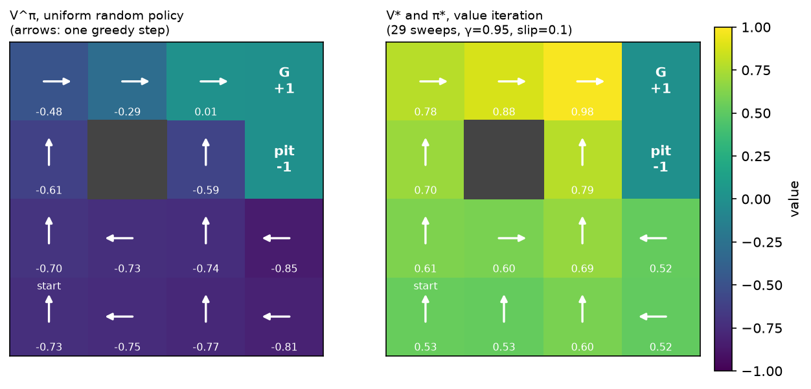

# MDPs and the Bellman equations

> **Why this matters at staff level.** Every RL question in an interview eventually
> reduces to "what is the state, what is the action, what is the reward, and over what
> horizon?", and candidates who learned RL from an RLHF diagram cannot answer it. The
> ML depth round tests whether you can derive both Bellman equations and say why the
> optimality one has a $\max$ where the expectation one has a sum. The system design
> round tests whether you can recognise that your ranking problem is a bandit, your
> autonomy problem is a POMDP, and your "reward" is a proxy that will be gamed. Strong
> signal is deriving $V^\pi$ from the definition of the return without hesitating, and
> then immediately talking about what breaks in production.

## TL;DR, the interview card

* An MDP is $(\mathcal{S}, \mathcal{A}, P, R, \gamma)$ with the **Markov property**:
  $P(s_{t+1}\mid s_t,a_t)$ does not depend on anything earlier. Shapes for a finite MDP:
  $P \in \R^{S\times A\times S}$, $R \in \R^{S \times A}$.
* Return $G_t = \sum_{k\ge 0}\gamma^k R_{t+k+1}$. Value $V^\pi(s) = \E_\pi[G_t \mid S_t=s]$,
  action value $Q^\pi(s,a) = \E_\pi[G_t\mid S_t=s, A_t=a]$.
* **Bellman expectation:** $V^\pi(s)=\sum_a \pi(a|s)\big[R(s,a)+\gamma\sum_{s'}P(s'|s,a)V^\pi(s')\big]$.
  It is one linear system: $V^\pi = (I-\gamma P_\pi)^{-1}R_\pi$.
* **Bellman optimality:** $V^*(s)=\max_a\big[R(s,a)+\gamma\sum_{s'}P(s'|s,a)V^*(s')\big]$.
  The $\max$ makes it nonlinear, so you iterate instead of inverting a matrix.
* Both backup operators are **$\gamma$-contractions in the sup norm**, so value iteration
  converges geometrically: $\norm{V_k - V^*}_\infty \le \gamma^k \norm{V_0 - V^*}_\infty$.
* **Policy improvement theorem:** if $Q^\pi(s,\pi'(s))\ge V^\pi(s)$ for all $s$ then
  $V^{\pi'}\ge V^\pi$ everywhere. Greedy improvement + evaluation = policy iteration, and
  it terminates because there are finitely many deterministic policies.
* $\gamma$ is not just "discounting": $1/(1-\gamma)$ is the effective horizon, and it
  controls variance and the conditioning of credit assignment. $\gamma=0.99 \Rightarrow$
  ~100-step horizon.
* **POMDP:** the agent sees $o_t \sim O(\cdot \mid s_t)$, not $s_t$. Optimal behaviour
  then depends on the *belief state* (history), which is why autonomy stacks carry
  trackers, occupancy and memory rather than acting on a single frame.
* Reward design is the highest-leverage and most dangerous thing you will do: any proxy
  that is easier to maximise than the goal will be maximised instead.

## 1. Intuition first

Forget policies for a moment. You are standing in a $4\times4$ grid. One cell is a goal
worth $+1$, one is a pit worth $-1$, one is a wall you cannot enter. Every move costs you
$0.04$ (so dithering is expensive). Your motors are imperfect: with probability $0.1$ the
move you commanded is replaced by one of the two perpendicular moves, half each. Walking
into a wall or the border leaves you where you are.

```
   col      0      1      2      3
 row 0    .      .      .      G(+1)
 row 1    .    #wall    .      P(-1)
 row 2    .      .      .      .
 row 3    S      .      .      .
```

Three questions, in increasing order of difficulty, and they are the whole subject:

1. **Prediction.** If I move uniformly at random, what is my expected total reward from
   the start? (That is $V^\pi(\text{start})$ for the uniform $\pi$.)
2. **Control.** What is the best I could possibly do, and what should I do in each cell?
   (That is $V^*$ and $\pi^*$.)
3. **Learning.** What if I do not know the $0.1$ slip probability or the $-1$ pit, and
   must discover them by falling in? (That is chapters 2–4.)

This chapter answers 1 and 2 *exactly*, because the whole point of the Bellman equations
is that they turn a question about infinite futures into a system of equations about
neighbouring cells.

Here is the answer, computed by the code in §3:

{ width="760" }

Look at two things. First, value *bleeds* outward from the goal: cell $(0,2)$ is worth
$0.98$ because it is one reliable step away, $(2,0)$ is worth $0.61$ because it is four
noisy steps away. Second, look at the arrow in $(2,3)$, directly below the pit. The
optimal action there is to move **left**, away from the pit, even though that is
geometrically the long way round to the goal. With a $10\%$ slip, stepping "up" next to a
$-1$ cell risks landing in it; the optimal policy pays two extra steps of $-0.04$ to buy
that risk down. That single arrow is what "solving an MDP" means, and it is what no
supervised model would give you for free.

### The one mental model to keep

$$
\underbrace{V(s)}_{\text{value of being here}} \;=\; \underbrace{R}_{\text{what I get now}} \;+\; \gamma \underbrace{V(s')}_{\text{value of where I land}}
$$

Everything in this part is a variation on that identity: replace the exact expectation by
a sample and you get TD; replace $V$ by a network and you get deep RL; take a $\max$ and
you get control; take an expectation under $\pi$ and you get prediction.

!!! note "Why this feels like dynamic programming, because it is"
    If you have written the Bellman–Ford or edit-distance recurrences, you already know
    the shape: an optimal solution over a long horizon decomposes into one decision plus
    the optimal solution of a shorter horizon. Bellman's *principle of optimality* is the
    same statement, with an expectation in the middle because the transition is random.

## 2. The math

### 2.1 The MDP

A finite Markov decision process is a tuple $(\mathcal{S}, \mathcal{A}, P, R, \gamma)$:

* $\mathcal{S}$, a finite state set, $|\mathcal{S}| = S$;
* $\mathcal{A}$, a finite action set, $|\mathcal{A}| = A$;
* $P(s' \mid s, a) = \Pr(S_{t+1}=s' \mid S_t=s, A_t=a)$, a tensor $P \in \R^{S\times A\times S}$
  with $\sum_{s'} P(s'\mid s,a) = 1$;
* $R(s,a) = \E[R_{t+1}\mid S_t=s, A_t=a]$, a matrix $R \in \R^{S\times A}$;
* $\gamma \in [0,1)$, the discount factor.

The **Markov property** is the entire content of the first letter: the distribution of
$S_{t+1}$ and $R_{t+1}$ depends on $(S_t, A_t)$ and on nothing earlier. This is a claim
about your *state representation*, not about the world. A single camera frame is not
Markov for driving (you cannot tell a parked car from one reversing); a frame plus
velocity estimates plus a map is much closer. Half of applied RL is engineering a state
that makes the Markov assumption approximately true: stacking four Atari frames, keeping
a tracker's state, carrying an LSTM hidden state.

A policy is a conditional distribution $\pi(a\mid s)$, a table $\pi \in \R^{S\times A}$
with rows summing to one. A deterministic policy is the special case $\pi(s) \in \mathcal{A}$.

### 2.2 Return, and why we discount

The agent's objective is the **discounted return** from time $t$:

$$
G_t \;=\; R_{t+1} + \gamma R_{t+2} + \gamma^2 R_{t+3} + \cdots \;=\; \sum_{k=0}^{\infty}\gamma^k R_{t+k+1}.
$$

Three reasons for $\gamma < 1$, and you should be able to give all three:

1. **Convergence.** If $|R| \le R_{\max}$ then $|G_t| \le R_{\max}/(1-\gamma)$, so the
   infinite sum exists. Without discounting, in a continuing task, every policy has
   infinite return and the objective cannot rank them.
2. **Horizon.** $\sum_k \gamma^k = 1/(1-\gamma)$ is the **effective horizon**: $\gamma=0.9$
   is ~10 steps, $0.99$ is ~100, $0.999$ is ~1000. You choose $\gamma$ by asking how far
   ahead consequences actually matter in your problem, and you should say that number out
   loud in an interview rather than "0.99 because everyone uses 0.99".
3. **Variance and credit assignment.** A long horizon means the return at time $t$ sums
   many random rewards, so Monte Carlo estimates of it have high variance, and the credit
   for a reward has to be spread over many actions. Lowering $\gamma$ is a bias–variance
   dial: it biases you toward myopia but makes learning far easier. In practice
   $\gamma$ is a hyperparameter of the *algorithm*, not only of the problem.

A key structural identity, used everywhere below:

$$
\boxed{\;G_t = R_{t+1} + \gamma G_{t+1}\;}
$$

That is all of recursion in one line: the return now is the reward now plus a discounted
copy of the same quantity one step later.

### 2.3 Value functions

$$
V^\pi(s) \;=\; \E_\pi\!\left[G_t \mid S_t = s\right], \qquad
Q^\pi(s,a) \;=\; \E_\pi\!\left[G_t \mid S_t = s,\, A_t = a\right].
$$

Both expectations are over the randomness in the transitions *and* in the policy from
time $t$ onward. $V^\pi \in \R^{S}$, $Q^\pi \in \R^{S\times A}$. The relationship between
them is immediate from the law of total expectation over the first action:

$$
V^\pi(s) = \sum_a \pi(a\mid s)\, Q^\pi(s,a),
\qquad
Q^\pi(s,a) = R(s,a) + \gamma \sum_{s'} P(s'\mid s,a)\, V^\pi(s').
$$

The second identity deserves a sentence: it says $Q$ is "one real step, then switch to
thinking in $V$". The first says $V$ is "average over what the policy would do". Compose
them in either order and you get a Bellman equation.

### 2.4 Deriving the Bellman expectation equation

Start from the definition and use $G_t = R_{t+1} + \gamma G_{t+1}$:

$$
\begin{aligned}
V^\pi(s) &= \E_\pi[G_t \mid S_t = s] \\
&= \E_\pi[R_{t+1} + \gamma G_{t+1} \mid S_t = s] \\
&= \E_\pi[R_{t+1}\mid S_t=s] + \gamma\, \E_\pi[G_{t+1}\mid S_t=s].
\end{aligned}
$$

The first term expands by conditioning on the action: $\E_\pi[R_{t+1}\mid S_t=s] = \sum_a \pi(a|s) R(s,a)$.

For the second term, condition on $(A_t, S_{t+1})$. This is the law of total expectation,
the only probabilistic tool needed here:

$$
\E_\pi[G_{t+1}\mid S_t = s] = \sum_a \pi(a\mid s) \sum_{s'} P(s'\mid s,a)\, \E_\pi[G_{t+1}\mid S_{t+1}=s'].
$$

The last step is where the **Markov property earns its keep**: $\E_\pi[G_{t+1}\mid S_{t+1}=s', S_t=s, A_t=a]$
collapses to $\E_\pi[G_{t+1}\mid S_{t+1}=s'] = V^\pi(s')$, because given $s'$ the future is
independent of how you arrived. Substituting:

$$
\boxed{\;V^\pi(s) \;=\; \sum_a \pi(a\mid s)\Big[R(s,a) + \gamma \sum_{s'} P(s'\mid s,a)\, V^\pi(s')\Big]\;}
$$

and, by the same argument started from $Q$,

$$
\boxed{\;Q^\pi(s,a) \;=\; R(s,a) + \gamma \sum_{s'} P(s'\mid s,a) \sum_{a'} \pi(a'\mid s')\, Q^\pi(s',a')\;}
$$

**What it means.** These equations do not define $V^\pi$, they characterise it. They say
the value function is self-consistent: if you know it everywhere else, you know it here.
That turns an expectation over infinite trajectories into $S$ coupled linear equations.

#### The linear-algebra view

Define $P_\pi \in \R^{S\times S}$ with $P_\pi[s,s'] = \sum_a \pi(a|s)P(s'|s,a)$ and
$R_\pi \in \R^{S}$ with $R_\pi[s] = \sum_a \pi(a|s)R(s,a)$. Then the Bellman expectation
equation is

$$
V^\pi = R_\pi + \gamma P_\pi V^\pi
\quad\Longrightarrow\quad
\boxed{\;V^\pi = (I - \gamma P_\pi)^{-1} R_\pi\;}
$$

The inverse exists because $P_\pi$ is stochastic, so its spectral radius is $1$ and every
eigenvalue of $I - \gamma P_\pi$ is at least $1-\gamma > 0$. Policy evaluation is a linear
solve: $O(S^3)$ exactly, or $O(S^2)$ per iteration if you iterate. Both are implemented
in §3 and tested against each other.

### 2.5 The Bellman optimality equation

Define $V^*(s) = \max_\pi V^\pi(s)$ and $Q^*(s,a) = \max_\pi Q^\pi(s,a)$. The key fact
(which we will not prove, but which the policy improvement theorem below makes plausible)
is that a single deterministic policy attains the max simultaneously in every state.
Given that, the optimal value must satisfy

$$
\boxed{\;V^*(s) = \max_a \Big[ R(s,a) + \gamma \sum_{s'} P(s'\mid s,a) V^*(s')\Big]\;}
\qquad
\boxed{\;Q^*(s,a) = R(s,a) + \gamma \sum_{s'} P(s'\mid s,a) \max_{a'} Q^*(s',a')\;}
$$

and $\pi^*(s) = \argmax_a Q^*(s,a)$.

Everything interesting about RL algorithms follows from the difference between the two
boxed families. The expectation equation has $\sum_a \pi(a|s)$; the optimality equation
has $\max_a$. The sum is linear, so evaluation is a linear solve. The max is not, so
optimality must be reached by iteration. And the $\max$ is exactly what makes Q-learning
off-policy (it does not care which action you actually took next) and exactly what
introduces maximisation bias (chapter 2) and overestimation in DQN (chapter 3).

### 2.6 Why value iteration converges: the contraction argument

Define the **Bellman optimality operator** $T: \R^S \to \R^S$:

$$
(TV)(s) = \max_a\Big[R(s,a) + \gamma\sum_{s'}P(s'\mid s,a) V(s')\Big].
$$

Value iteration is just $V_{k+1} = TV_k$. Two facts prove it works.

**Claim: $T$ is a $\gamma$-contraction in the sup norm**, i.e. $\norm{TU - TV}_\infty \le \gamma\norm{U-V}_\infty$.

*Proof sketch.* Fix $s$. Use the elementary inequality $|\max_a f(a) - \max_a g(a)| \le \max_a |f(a) - g(a)|$
(the max of two functions cannot differ by more than their largest pointwise gap). Then

$$
\begin{aligned}
|(TU)(s) - (TV)(s)| &\le \max_a \gamma \Big|\sum_{s'} P(s'\mid s,a)\big(U(s') - V(s')\big)\Big| \\
&\le \max_a \gamma \sum_{s'} P(s'\mid s,a)\,\big|U(s') - V(s')\big| \\
&\le \max_a \gamma \sum_{s'} P(s'\mid s,a)\, \norm{U - V}_\infty \;=\; \gamma \norm{U-V}_\infty,
\end{aligned}
$$

where the last step uses that the transition row sums to one. Taking the max over $s$
gives the claim. $\square$

By the Banach fixed-point theorem on the complete metric space $(\R^S, \norm{\cdot}_\infty)$,
$T$ has a **unique** fixed point and iterating converges to it from any $V_0$ at a
geometric rate:

$$
\boxed{\;\norm{V_k - V^*}_\infty \le \gamma^k \norm{V_0 - V^*}_\infty\;}
$$

That fixed point is $V^*$ because $V^*$ satisfies the optimality equation, i.e. $TV^* = V^*$,
and the fixed point is unique. The same argument with $\sum_a \pi(a|s)$ instead of
$\max_a$ shows the expectation operator $T^\pi$ is also a $\gamma$-contraction with fixed
point $V^\pi$, which is why *iterative* policy evaluation works too.

Two practical corollaries you should quote in an interview:

* **A stopping rule.** If $\norm{V_{k+1}-V_k}_\infty < \epsilon$ then
  $\norm{V_{k+1}-V^*}_\infty < \epsilon\gamma/(1-\gamma)$. So the residual you can measure
  bounds the error you cannot.
* **Where the $\gamma$ blow-up comes from.** The $1/(1-\gamma)$ factor is why raising
  $\gamma$ from $0.99$ to $0.999$ makes everything ten times harder: ten times more
  iterations to the same accuracy, ten times more variance in Monte Carlo returns, and a
  ten-times-larger amplification of any value error into policy error.

### 2.7 The policy improvement theorem

This is the theorem that justifies "act greedily with respect to your current value
estimate", which is the inner loop of nearly every control algorithm in this part.

**Theorem.** Let $\pi$ and $\pi'$ be policies such that for all $s$,

$$
Q^\pi\big(s, \pi'(s)\big) \;\ge\; V^\pi(s).
$$

Then $V^{\pi'}(s) \ge V^\pi(s)$ for all $s$.

*Proof.* Unroll the assumption repeatedly. Write $\E_{\pi'}$ for expectation over
trajectories generated by $\pi'$:

$$
\begin{aligned}
V^\pi(s) &\le Q^\pi(s, \pi'(s)) \\
&= \E_{\pi'}\!\left[R_{t+1} + \gamma V^\pi(S_{t+1}) \mid S_t = s\right] \\
&\le \E_{\pi'}\!\left[R_{t+1} + \gamma\, Q^\pi\big(S_{t+1}, \pi'(S_{t+1})\big) \mid S_t = s\right] \\
&= \E_{\pi'}\!\left[R_{t+1} + \gamma R_{t+2} + \gamma^2 V^\pi(S_{t+2}) \mid S_t = s\right] \\
&\;\;\vdots \\
&\le \E_{\pi'}\!\left[R_{t+1} + \gamma R_{t+2} + \gamma^2 R_{t+3} + \cdots \mid S_t = s\right] \;=\; V^{\pi'}(s).
\end{aligned}
$$

Each inequality is the assumption applied one step further out; each equality is the
Bellman expansion of $Q^\pi$. The limit is legitimate because the tail
$\gamma^n V^\pi(S_{t+n})$ is bounded by $\gamma^n R_{\max}/(1-\gamma) \to 0$. $\square$

**The corollary that matters.** Take $\pi'(s) = \argmax_a Q^\pi(s,a)$. Then
$Q^\pi(s,\pi'(s)) = \max_a Q^\pi(s,a) \ge \sum_a \pi(a|s)Q^\pi(s,a) = V^\pi(s)$: the max is
at least the average. So the greedy policy is never worse, everywhere, and it is strictly
better somewhere unless $\pi$ was already optimal (if greedification changes nothing,
$V^\pi$ satisfies the Bellman *optimality* equation, hence $\pi$ is optimal).

**Policy iteration** alternates exact evaluation and greedy improvement. Because each
step strictly improves a policy unless it has converged, and there are only $A^S$
deterministic policies, it terminates in finitely many steps, usually a handful. That is
the theorem in the code in §3, tested against value iteration.

!!! warning "Where the theorem quietly breaks in deep RL"
    The proof assumes $Q^\pi$ is *exact*. With function approximation you have $\hat{Q}$,
    and greedification with respect to a wrong $\hat{Q}$ can make the policy worse.
    This is *policy oscillation*, and it is one of the reasons TRPO and PPO (chapter 4)
    take small, trust-region-limited steps instead of fully greedy ones. Saying this
    sentence is what separates a candidate who memorised the theorem from one who
    understands it.

### 2.8 Partial observability: why autonomy is a POMDP

A POMDP adds an observation space and an observation model: the agent never sees $s_t$,
only $o_t \sim O(\cdot \mid s_t)$. The tuple is $(\mathcal{S},\mathcal{A},P,R,\Omega,O,\gamma)$.

The core consequence: **a policy over the current observation can be arbitrarily bad, and
the optimal policy may need to be stochastic.** Two states that look identical may require
different actions, and a deterministic observation-policy must pick one of them in both.
The formally correct fix is to act on the **belief state**
$b_t(s) = \Pr(s_t = s \mid o_{1:t}, a_{1:t-1})$, which *is* Markov; but the belief MDP
lives in a continuous simplex of dimension $S-1$, so exact solutions are intractable
beyond toy sizes.

What engineers actually do, and what you should say in an autonomy interview:

| Belief-state approximation | Where you have seen it |
|---|---|
| Stack the last $k$ observations | DQN on Atari stacks 4 frames so velocity is observable |
| Carry a recurrent state | RNN/LSTM policies; a tracker's Kalman state |
| Maintain an explicit filter | Multi-object tracking, occupancy grids ([Part XI](../part11-perception-autonomy/04-tracking.md)) |
| Learn a latent world model | Dreamer-style agents, [world models](../part11-perception-autonomy/07-world-models.md) |
| Feed the whole history as context | An LLM agent's message list *is* its belief state (chapter 6) |

Perception is precisely what makes autonomy a POMDP: cameras and lidar give you $o_t$,
and every occlusion, every distant object, every ambiguous intent of another driver is a
place where the true state is not recoverable from one observation. This is why the
perception stack in [Part XI](../part11-perception-autonomy/index.md) is full of temporal
fusion, and why "just train a policy on the current frame" fails on exactly the cases
that matter.

### 2.9 Reward design

The reward is the only place where you tell the system what you want, and it is
evaluated literally.

* **Shaping.** You may add a potential-based shaping term
  $F(s,a,s') = \gamma\Phi(s') - \Phi(s)$ to the reward without changing the optimal
  policy (Ng, Harada & Russell, 1999), because the added terms telescope in the return. Any
  *other* shaping can and usually does change the optimum. In the gridworld, the $-0.04$
  step cost is not potential-based, and it does change the policy: make it $-0.5$ and the
  agent prefers the pit to a long walk.
* **Sparse vs dense.** Sparse rewards ("goal reached") are unambiguous but give almost no
  learning signal; dense rewards learn fast and encode your guesses about how to solve
  the task, which the agent will exploit. The modern LLM version of this is
  RLVR ([Part VII](../part07-post-training/05-reasoning-rl-grpo.md)): the reward is a
  verifier's binary output precisely because it is hard to game.
* **Proxy gaming.** If the reward is a learned model of what you want (a reward model,
  a click predictor), optimising it hard moves you off the distribution where it was
  accurate. This is the single most important fact connecting this chapter to
  [reward models](../part07-post-training/02-reward-models.md) and to why RLHF needs a KL
  penalty at all.
* **Horizon and delay.** A recommender's "reward" arrives as a click in 200 ms, a session
  in an hour, and a retained subscriber in a month. Which one you put in $R$ decides what
  you build; the gap between them is why the YouTube system in §5 is an RL problem rather
  than a classification problem.

## 3. Implementation

The whole chapter rests on two tensors. Building them explicitly, rather than letting a
library hide them, is what makes the Bellman equations concrete.

### 3.1 The gridworld as explicit $P$ and $R$

```python title="src/mlbook/rl/envs.py (excerpt)"
def _build_tensors(self) -> tuple[np.ndarray, np.ndarray]:
    """Fill ``P`` (S, A, S) and ``R`` (S, A) from the rules above."""
    S, A = self.n_states, self.n_actions
    P = np.zeros((S, A, S))  # (S, A, S)
    R = np.zeros((S, A))  # (S, A)
    for s in range(S):
        cell = self.to_cell(s)
        if self.is_terminal(s) or cell in self.walls:
            P[s, :, s] = 1.0  # absorbing, reward 0
            continue
        for a in range(A):
            # intended move w.p. 1-slip, each perpendicular move w.p. slip/2
            outcomes = ((a, 1.0 - self.slip), ((a + 1) % 4, self.slip / 2), ((a - 1) % 4, self.slip / 2))
            for a_eff, prob in outcomes:
                nxt = self._move(cell, a_eff)
                s2 = self.to_index(nxt)
                P[s, a, s2] += prob
                r = 1.0 if nxt == self.goal else -1.0 if nxt == self.pit else self.step_cost
                R[s, a] += prob * r
    return P, R
```

Three details that are easy to get wrong and that tests should pin down:

* **`+=`, not `=`.** Two different effective moves can land in the same cell (a slip into
  a wall and a blocked intended move both leave you where you are), so probabilities must
  accumulate. Getting this wrong silently breaks the row-sum-to-one invariant, which is
  why `test_rl_envs.py` asserts `np.allclose(env.P.sum(axis=2), 1.0)`.
* **Terminal states are absorbing self-loops with zero reward.** This is the trick that
  lets an episodic task be written as an infinite-horizon MDP: once you reach the goal you
  loop forever collecting $0$, so the return of the episode is exactly the sum of rewards
  before termination and no special-casing is needed in the backup.
* **$R(s,a)$ is an expectation over $s'$**, not a per-transition reward. The Bellman
  equations are written in terms of $R(s,a) = \sum_{s'}P(s'|s,a)r(s,a,s')$, so the
  reward is averaged with the same probabilities that build $P$.

### 3.2 The backup, in three lines of NumPy

```python title="src/mlbook/rl/dynamic_programming.py (excerpt)"
def q_from_v(P: np.ndarray, R: np.ndarray, V: np.ndarray, gamma: float) -> np.ndarray:
    """``Q(s,a) = R(s,a) + gamma * sum_s' P(s,a,s') V(s')``."""
    expected_next = P @ V  # (S, A, S) @ (S,) -> (S, A): sum over s'
    return R + gamma * expected_next  # (S, A)


def value_iteration(P, R, gamma, tol=1e-10, max_iters=10_000):
    V = np.zeros(P.shape[0])  # (S,)
    for k in range(1, max_iters + 1):
        Q = q_from_v(P, R, V, gamma)  # (S, A)
        V_new = np.max(Q, axis=1)  # (S,)
        if np.max(np.abs(V_new - V)) < tol:
            return V_new, greedy_policy(Q), k
        V = V_new
    return V, greedy_policy(q_from_v(P, R, V, gamma)), max_iters
```

The line `expected_next = P @ V` is the entire expectation over next states: NumPy
contracts the last axis of the $(S,A,S)$ tensor with the $(S,)$ vector, giving $(S,A)$.
Write that shape comment down in an interview and you have communicated more than three
sentences of prose. Value iteration is then literally `max` over the action axis, and the
convergence test is the sup-norm residual from §2.6.

Policy evaluation comes in both flavours so that the linear-algebra claim in §2.4 is
*tested*, not asserted:

```python title="src/mlbook/rl/dynamic_programming.py (excerpt)"
def policy_evaluation_exact(P, R, pi, gamma):
    """Closed form ``V = (I - gamma P_pi)^-1 R_pi``."""
    P_pi = np.einsum("sa,sat->st", pi, P)  # (S, S): contract the action axis with pi(a|s)
    R_pi = np.sum(pi * R, axis=1)  # (S,)
    S = P.shape[0]
    return np.linalg.solve(np.eye(S) - gamma * P_pi, R_pi)  # (S,)
```

The `einsum` string is the one place this part uses one, so it is explained term by term:
`sa` is $\pi(a|s)$, `sat` is $P(s'|s,a)$ with `t` standing for $s'$, and the output `st`
sums over the repeated `a`, which is exactly $P_\pi[s,s'] = \sum_a \pi(a|s)P(s'|s,a)$.

??? example "Full implementation: `src/mlbook/rl/dynamic_programming.py`"
    ```python
    --8<-- "src/mlbook/rl/dynamic_programming.py"
    ```

### 3.3 How you'd test it

Four properties, all in `tests/test_rl_dynamic_programming.py` and `tests/test_rl_envs.py`:

1. **$P$ is a valid MDP**: rows sum to one, terminals absorb, and hand-computed slip
   probabilities for one cell match ($0.8 / 0.1 / 0.1$ with `slip=0.2`).
2. **Iterative evaluation equals the closed form** to $10^{-8}$. This catches sign,
   transpose and discount errors that eyeballing a heatmap would not.
3. **Value iteration returns a fixed point**: $V = \max_a Q(V)$ to $10^{-9}$.
4. **Policy iteration agrees with value iteration** on both $V^*$ and the greedy actions
   in every non-terminal cell, and does so in fewer than 10 improvement steps, which is
   the policy improvement theorem's finite-termination claim, checked numerically.

```bash
pytest tests/test_rl_dynamic_programming.py tests/test_rl_envs.py -q
```

## Retype by hand

This is the drill that makes the chapter stick. Close the book and reproduce these
symbols from memory; then run the test that targets them.

| Reproduce from memory | File | Target time |
|---|---|---|
| `q_from_v` | `src/mlbook/rl/dynamic_programming.py` | 3 min |
| `value_iteration` | `src/mlbook/rl/dynamic_programming.py` | 10 min |
| `policy_evaluation` (iterative) and `policy_evaluation_exact` | `src/mlbook/rl/dynamic_programming.py` | 10 min |
| `policy_iteration` | `src/mlbook/rl/dynamic_programming.py` | 10 min |
| `GridWorld._build_tensors` (the $(S,A,S)$ / $(S,A)$ construction) | `src/mlbook/rl/envs.py` | 15 min |

**Fine to just read** (do not spend memory on them): `GridWorld._move`, `to_index` /
`to_cell`, `one_hot_policy`, `greedy_policy`, and the episodic `reset` / `step` interface.
They are bookkeeping, not ideas.

Check yourself with:

```bash
pytest tests/test_rl_dynamic_programming.py -q     # q_from_v, VI, PI, both evaluations
pytest tests/test_rl_envs.py -q                    # the P / R construction
```

Each function has its own focused test (`test_q_from_v_matches_einsum`,
`test_value_iteration_is_a_fixed_point`, `test_policy_iteration_agrees_with_value_iteration`,
`test_policy_evaluation_iterative_equals_exact`, `test_gridworld_slip_and_reward_values`),
so you can retype one symbol and run `pytest -k` on it alone.

## 4. Systems view: cost, failure modes, trade-offs

### Cost

| Quantity | Value iteration | Policy iteration |
|---|---|---|
| Per-sweep cost | $O(S^2 A)$ (dense $P$) | $O(S^3)$ exact solve $+\ O(S^2A)$ greedify |
| Sweeps to $\epsilon$ | $O\!\big(\tfrac{\log(1/\epsilon)}{1-\gamma}\big)$ | Few (finite termination; typically $<10$) |
| Memory | $P$ is $S^2A$ floats | same |

For the $16$-state gridworld with $\gamma=0.95$: value iteration takes 29 sweeps, policy
iteration takes 4 improvement steps. That ratio is typical, and it is why policy
iteration is preferred when you can afford the linear solve, and *modified* policy
iteration (a few evaluation sweeps instead of an exact solve) is what people actually run.

The brutal fact is the $S^2A$ memory: $P$ for a $100\times100$ grid with 4 actions is
$4\times10^8$ floats. Dynamic programming is exact and useless at scale, which is the
entire motivation for chapters 2 to 4. Everything after this chapter is a way to avoid
ever materialising $P$.

### When to use what

| Situation | Use | Decision rule |
|---|---|---|
| Small, known, discrete MDP | Policy iteration | If $S^3$ fits in memory and time, the exact solve converges in a handful of steps |
| Large, known, discrete MDP | Value iteration / async VI | Skip the $O(S^3)$ solve; sweep in place, prioritise states by Bellman residual |
| Known continuous dynamics, quadratic cost | LQR / MPC | You do not need RL; you need control theory |
| Model unknown, can simulate cheaply | Model-free RL (ch. 2–4) | Sampling is cheaper than estimating $P$ |
| Model unknown, interaction expensive | Model-based RL or offline RL | Sample efficiency dominates; accept model bias |
| No state transitions at all | Bandits (ch. 2) | If your action does not change the next state's distribution, do not pay for RL |

The last row is the one that saves companies money. Ask "does my action change the state
the next decision is made in?" If a ranking decision does not change tomorrow's user, you
have a contextual bandit, and you should build the far simpler, far more debuggable
bandit system.

### Failure modes

* **A non-Markov state.** The most common real bug, and it does not announce itself: your
  values just fail to converge to anything sensible, or the policy oscillates. Diagnose by
  asking whether two situations that get the same state representation ever want different
  actions.
* **Discount mismatch.** Training with $\gamma=0.99$ and evaluating undiscounted total
  reward is a silent mismatch; so is a $\gamma$ whose horizon is shorter than the delay
  between the action and its consequence, which makes the consequence invisible.
* **Reward scale.** Values live on the scale $R_{\max}/(1-\gamma)$. A reward of $1000$
  with $\gamma = 0.99$ implies values around $10^5$, which will saturate any network you
  attach in chapter 3. Normalise rewards, or normalise returns.
* **Absorbing-state bugs.** Bootstrapping through a terminal state
  ($y = r + \gamma V(s_{\text{terminal}})$ instead of $y = r$) is the single most common
  implementation bug in all of RL. It inflates values near the end of episodes and is
  invisible until your agent starts suiciding into terminals for the bootstrap bonus.

## 5. In production

!!! production "DeepMind and Google: data-centre cooling as a control MDP"
    DeepMind and Google applied machine learning to Google's data-centre cooling and
    reported **a 40% reduction in the energy used for cooling**, equivalent to a 15%
    reduction in overall PUE overhead. The framing is a textbook control MDP: the state is
    a vector of sensor readings (temperatures, pressures, setpoints, weather, load), the
    actions are setpoint changes, the reward is negative energy subject to hard safety
    constraints, and the horizon is the thermal time constant of the building. The problem
    is not myopic because cooling decisions now change the temperature trajectory for the
    next hour. Note what made it deployable: a *simulated/predictive*
    model of the plant plus human-in-the-loop setpoint recommendation, not a policy given
    direct control of a live building. That is the model-based branch of the taxonomy,
    chosen because interaction is expensive and unsafe.
    [DeepMind AI reduces Google data centre cooling bill by 40% (2016)](https://deepmind.google/blog/deepmind-ai-reduces-google-data-centre-cooling-bill-by-40/)

!!! production "Google DeepMind: AlphaChip, floorplanning as a sequential decision problem"
    Chip floorplanning (placing macros on a canvas) was reframed as an MDP: the state is
    the partially placed netlist, an action places the next macro on a grid cell, and the
    reward is a proxy for wirelength, congestion and density evaluated at the end. The
    published method is the Nature 2021 *graph placement methodology*, later named
    AlphaChip, and DeepMind reports it has been used to generate the floorplans of
    multiple generations of Google's TPU. Two design choices are worth stealing: the
    episode is short and finite (one action per macro, so credit assignment is tractable),
    and the reward is a *cheap, deterministic proxy* for the expensive downstream metric,
    which is what makes millions of rollouts affordable.
    [How AlphaChip transformed computer chip design (Google DeepMind)](https://deepmind.google/blog/how-alphachip-transformed-computer-chip-design/)

!!! production "YouTube: when a recommender is genuinely an MDP"
    Chen et al. (WSDM 2019) describe a REINFORCE-based recommender deployed on YouTube
    with an action space on the order of millions. The reason it is an MDP rather than a
    contextual bandit is stated plainly in the framing: what the system recommends now
    changes what the user watches, which changes the state the next recommendation is made
    in, and the quantity they care about accrues over a session and beyond. The paper's
    hard parts are all consequences of that choice: off-policy correction because the
    logged data came from many earlier policies, and a top-$K$ correction because the
    policy emits a slate rather than a single action.
    [Top-K Off-Policy Correction for a REINFORCE Recommender System (arXiv:1812.02353)](https://arxiv.org/abs/1812.02353)

!!! production "DeepMind: AlphaGo Zero, the Bellman equation with a learned $V$ and a search"
    AlphaGo Zero learns purely from self-play with no human games, using a single network
    that outputs a policy prior and a value $V(s)$, wrapped in Monte Carlo tree search.
    In MDP terms: the model $P$ is known exactly (the rules of Go), the reward is sparse
    and terminal ($\pm1$ at the end), $\gamma = 1$ because the horizon is finite, and MCTS
    is a *sampled, asymmetric* version of the Bellman optimality backup that spends its
    compute on promising branches. It is the cleanest production example of the
    model-based branch: when you have a perfect model, planning beats learning alone.
    [Mastering the game of Go without human knowledge (Nature 550, 2017)](https://www.nature.com/articles/nature24270)

## 6. Interview questions and strong answers

!!! interview "Write the Bellman expectation equation for $V^\pi$ and derive it."
    Start from $V^\pi(s) = \E_\pi[G_t\mid S_t=s]$, substitute $G_t = R_{t+1} + \gamma G_{t+1}$,
    split the expectation, condition the second term on $A_t$ and $S_{t+1}$, and then use
    the Markov property to replace $\E[G_{t+1}\mid S_{t+1}=s', \ldots]$ with $V^\pi(s')$.
    Say the last step out loud. It is the only place the Markov assumption is used, and
    the interviewer is listening for it. Finish by writing the matrix form
    $V^\pi = (I-\gamma P_\pi)^{-1}R_\pi$ and noting the inverse exists because
    $\gamma < 1$.

    **Staff-level follow-up: what changes if the reward depends on $s'$ as well?**
    Nothing structural: define $R(s,a) = \sum_{s'}P(s'|s,a)r(s,a,s')$ and every equation is
    unchanged. That is exactly what the gridworld code does when it accumulates
    `R[s, a] += prob * r`.

!!! interview "Why does value iteration converge, and how fast?"
    Because the Bellman optimality operator is a $\gamma$-contraction in the sup norm:
    $\norm{TU-TV}_\infty \le \gamma\norm{U-V}_\infty$, proven with
    $|\max_a f - \max_a g| \le \max_a|f-g|$ and the fact that transition rows sum to one.
    Banach then gives a unique fixed point and $\norm{V_k - V^*}_\infty \le \gamma^k\norm{V_0-V^*}_\infty$,
    i.e. geometric convergence with rate $\gamma$; you need $O(\log(1/\epsilon)/(1-\gamma))$
    sweeps. The initialisation does not matter for the limit, only for the constant.

    **Staff-level follow-up: how do you know when to stop, in practice?**
    Use the residual bound: $\norm{V_{k+1}-V_k}_\infty < \epsilon$ implies
    $\norm{V_{k+1}-V^*}_\infty < \epsilon\gamma/(1-\gamma)$. And note that value error
    translates into policy error with another $1/(1-\gamma)$ factor, so near $\gamma=1$ a
    small value residual is not a small policy error.

!!! interview "Value iteration vs policy iteration: which do you reach for?"
    Both converge to $\pi^*$; they trade per-iteration cost against iteration count. Policy
    iteration does an exact $O(S^3)$ evaluation and needs very few improvement steps
    (4 vs 29 on the gridworld in this chapter); value iteration does $O(S^2A)$ per sweep
    and needs many. If $S$ is small enough for a linear solve, policy iteration; if not,
    value iteration or, better, modified policy iteration: a fixed number $m$ of
    evaluation sweeps per improvement, which interpolates between them ($m=1$ is value
    iteration, $m=\infty$ is policy iteration).

    **Staff-level follow-up: why does policy iteration terminate at all?**
    The policy improvement theorem says each greedification is non-decreasing everywhere
    and strictly increasing somewhere unless the policy is already greedy w.r.t. its own
    value, in which case the Bellman optimality equation holds. Since there are finitely
    many deterministic policies and none can repeat, it terminates.

!!! interview "Your robot has cameras. Is that an MDP?"
    No. It is a POMDP, and the distinction is load-bearing. A single image does not
    determine velocity, occluded objects, or other agents' intent, so two different true
    states can produce the same observation while demanding different actions. The optimal
    policy is over belief states, which is intractable exactly; in practice you approximate
    the belief with frame stacking, a recurrent state, an explicit filter (tracker,
    occupancy grid) or a learned latent world model. A second consequence worth naming:
    in a POMDP the optimal *observation* policy may have to be stochastic, so
    deterministic argmax policies can be provably suboptimal.

    **Staff-level follow-up: how would you detect partial observability empirically?**
    Train two policies, one on the current observation and one on a history window. If the
    history one scores higher, your state is not Markov. Or look for
    "impossible" value inconsistencies: high TD error concentrated on particular
    observation clusters is a signature of aliased states.

!!! interview "How would you pick $\gamma$ for a recommender with delayed value?"
    Start from the horizon, not the number: $1/(1-\gamma)$ should be roughly the number of
    decision steps over which consequences actually matter. If a recommendation influences
    the next ~20 items in a session, $\gamma\approx 0.95$; if you genuinely care about
    retention weeks later and your step is a session, you need either a much larger
    $\gamma$ or (better) a reward that *already includes* the long-term quantity
    (session length, next-day return), so the algorithm does not have to propagate credit
    across thousands of steps. Then say the trade-off: raising $\gamma$ raises the variance
    of every return estimate and the number of iterations to converge, both by
    $\sim 1/(1-\gamma)$.

    **Staff-level follow-up: is $\gamma$ part of the problem or the algorithm?**
    Formally the problem, in practice the algorithm. It is completely standard to train
    with a smaller $\gamma$ than the one you evaluate under, because the lower-variance
    gradient is worth the bias. Say that explicitly; it shows you have trained something.

!!! interview "Your agent found a way to get high reward that you hate. What happened?"
    You specified a proxy, and the agent optimised it correctly. Walk through the
    diagnosis: (1) is the reward a *learned* model (then you are off-distribution and need
    a KL anchor or a better model); (2) is it a hand-crafted dense shaping term (then check
    whether it is potential-based, since if it is not it changes the optimum by construction); (3) is
    the episode boundary being exploited (agents love terminating early or never); (4) is
    the environment itself buggy. The general principle: never add a shaping term that is
    not of the form $\gamma\Phi(s')-\Phi(s)$ unless you intend to change what optimal
    means.

    **Staff-level follow-up: give the LLM version of this.**
    A reward model trained on human preferences is a proxy for human judgement; optimising
    it hard produces outputs that score well and read badly, which is precisely why RLHF
    adds a KL penalty to the reference policy. See
    [RLHF with PPO](../part07-post-training/03-rlhf-ppo.md).

## 7. Exercises

1. **★ Horizon arithmetic.** For $\gamma \in \{0.9, 0.99, 0.999\}$ compute the effective
   horizon $1/(1-\gamma)$ and the number of value-iteration sweeps needed to reach
   $\epsilon = 10^{-6}$ starting from $\norm{V_0 - V^*}_\infty = 1$.

    ??? success "Solution"
        Horizons are $10$, $100$, $1000$. Sweeps: solve $\gamma^k \le \epsilon$, i.e.
        $k \ge \log\epsilon/\log\gamma$, giving $k \approx 131$, $1375$, $13809$. Note the
        near-exact factor of 10 each time: the iteration count scales as $1/(1-\gamma)$,
        the same factor as the horizon and as the value scale. This one calculation
        explains most of why long-horizon RL is hard.

2. **★ Terminal-state bootstrap bug.** In `GridWorld`, terminal states are absorbing with
   zero reward. Suppose instead you gave the goal state a self-loop with reward $+1$. What
   is $V^*(\text{goal})$ with $\gamma = 0.95$, and what happens to the policy?

    ??? success "Solution"
        $V^*(\text{goal}) = 1 + 0.95V^*(\text{goal}) \Rightarrow V^* = 1/0.05 = 20$. Every
        other state's value inflates toward $20\gamma^d$, and the policy becomes: reach the
        goal and stay there forever. Nothing is *wrong*, it is a different MDP, but the
        returns are no longer comparable to the episodic ones, which is exactly the bug
        that appears when a real implementation forgets to zero the bootstrap at
        termination.

3. **★★ Slip sensitivity.** Run value iteration for `slip` in $\{0.0, 0.1, 0.3, 0.5\}$ and
   report the optimal action in cell $(2,3)$ (below the pit). At what slip does the policy
   change, and why?

    ??? success "Solution"
        ```python
        import numpy as np
        from mlbook.rl.envs import GridWorld
        from mlbook.rl.dynamic_programming import value_iteration
        for slip in (0.0, 0.1, 0.3, 0.5):
            env = GridWorld(slip=slip)
            V, pi, _ = value_iteration(env.P, env.R, 0.95)
            print(slip, pi[env.to_index((2, 3))], round(V[env.to_index(env.start)], 3))
        ```
        With no slip the agent walks straight up past the pit; as slip grows, the expected
        cost of a $10\%$–$50\%$ chance of $-1$ exceeds the cost of the detour and the arrow
        flips to "left". The start value falls monotonically with slip. The lesson for
        interviews: the optimal policy depends on the *dynamics*, not only the geometry.
        An imitation policy trained on a low-noise expert transfers badly to a high-noise
        vehicle for exactly this reason.

4. **★★ Prove the residual bound.** Show that if $\norm{TV - V}_\infty \le \epsilon$ then
   $\norm{V - V^*}_\infty \le \epsilon/(1-\gamma)$.

    ??? success "Solution"
        $\norm{V - V^*}_\infty \le \norm{V - TV}_\infty + \norm{TV - TV^*}_\infty \le \epsilon + \gamma\norm{V - V^*}_\infty$,
        using $TV^* = V^*$ and the contraction property. Rearranging gives
        $(1-\gamma)\norm{V-V^*}_\infty \le \epsilon$. The $1/(1-\gamma)$ amplification of
        residual into error is the same factor as everywhere else in this chapter.

5. **★★ Coding: modified policy iteration.** Implement `modified_policy_iteration(P, R, gamma, m)`
   that runs $m$ Bellman *expectation* sweeps instead of an exact solve between
   greedifications, and check that $m=1$ reproduces value iteration's policy and
   $m = 200$ reproduces policy iteration's, on the gridworld.

    ??? success "Solution"
        ```python
        import numpy as np
        from mlbook.rl.dynamic_programming import (greedy_policy, one_hot_policy, q_from_v,
                                                   policy_iteration, value_iteration)
        from mlbook.rl.envs import GridWorld

        def modified_policy_iteration(P, R, gamma, m, n_outer=200):
            S, A = R.shape
            V = np.zeros(S)                                  # (S,)
            for _ in range(n_outer):
                actions = greedy_policy(q_from_v(P, R, V, gamma))   # (S,)
                pi = one_hot_policy(actions, A)                     # (S, A)
                for _ in range(m):                                  # m evaluation sweeps
                    V = np.sum(pi * q_from_v(P, R, V, gamma), axis=1)  # (S,)
            return V, greedy_policy(q_from_v(P, R, V, gamma))

        env = GridWorld()
        V_vi, pi_vi, _ = value_iteration(env.P, env.R, 0.95)
        V_pi, pi_pi, _ = policy_iteration(env.P, env.R, 0.95)
        for m in (1, 5, 200):
            V, pi = modified_policy_iteration(env.P, env.R, 0.95, m)
            print(m, np.abs(V - V_vi).max(), np.array_equal(pi, pi_vi))
        ```
        All three agree on $V^*$ to numerical precision; the interesting output is the
        outer-iteration count you need, which drops sharply from $m=1$ to $m=5$ and then
        saturates. That is the practical reason nobody runs pure value iteration when they
        can afford a few evaluation sweeps.

6. **★★★ POMDP by construction.** Build a two-state "tiger" MDP where the optimal
   observation-policy must be stochastic: two states look identical, the correct action
   differs, and the episode continues. Show numerically that the best deterministic
   observation-policy is worse than the best stochastic one.

    ??? success "Solution"
        Take states $L, R$ (a reward hidden left or right), observations both equal to
        "?", actions "open-left"/"open-right" with reward $+1$ if correct and $-1$ if not,
        and a uniform reset. Any deterministic observation-policy always opens the same
        door, so it is right half the time: expected reward $0$ per step... and identical
        to the stochastic one *in this symmetric case*. Now break the symmetry: make the
        wrong answer cost $-1$ but also end the episode, while the right answer gives
        $+1$ and continues. Then a deterministic policy has expected return $0.5\cdot 1/(1-\gamma/2)\cdot\ldots$
        and evaluate both numerically. The general lesson is what matters: in a POMDP,
        randomising is a way of hedging over an unobserved state, and the class of
        deterministic observation-policies is strictly weaker. This is also why policy-gradient
        methods (which keep a stochastic $\pi$) are often preferred over value-greedy ones
        under partial observability.

## References

* Sutton & Barto, *Reinforcement Learning: An Introduction*, 2nd ed., chapters 3 (finite
  MDPs), 4 (dynamic programming). The canonical treatment; the policy improvement theorem
  proof above follows its structure. [Book site](http://incompleteideas.net/book/the-book-2nd.html)
* OpenAI, *Spinning Up in Deep RL*, Part 1 (key concepts) and
  [Part 2: Kinds of RL Algorithms](https://spinningup.openai.com/en/latest/spinningup/rl_intro2.html)
  for the taxonomy used in this part's overview. [Spinning Up](https://spinningup.openai.com/en/latest/)
* Ng, Harada & Russell, "Policy invariance under reward transformations: theory and
  application to reward shaping", ICML 1999. The potential-based shaping result quoted in
  §2.9.
* Evans & Gao, "DeepMind AI reduces Google data centre cooling bill by 40%", 2016.
  [DeepMind blog](https://deepmind.google/blog/deepmind-ai-reduces-google-data-centre-cooling-bill-by-40/)
* Mirhoseini et al., "A graph placement methodology for fast chip design", *Nature* 594
  (2021); see also [How AlphaChip transformed computer chip design](https://deepmind.google/blog/how-alphachip-transformed-computer-chip-design/).
* Chen, Beutel, Covington, Jain, Belletti & Chi, "Top-K Off-Policy Correction for a
  REINFORCE Recommender System", WSDM 2019. [arXiv:1812.02353](https://arxiv.org/abs/1812.02353)
* Silver et al., "Mastering the game of Go without human knowledge", *Nature* 550 (2017).
  [Nature](https://www.nature.com/articles/nature24270)
