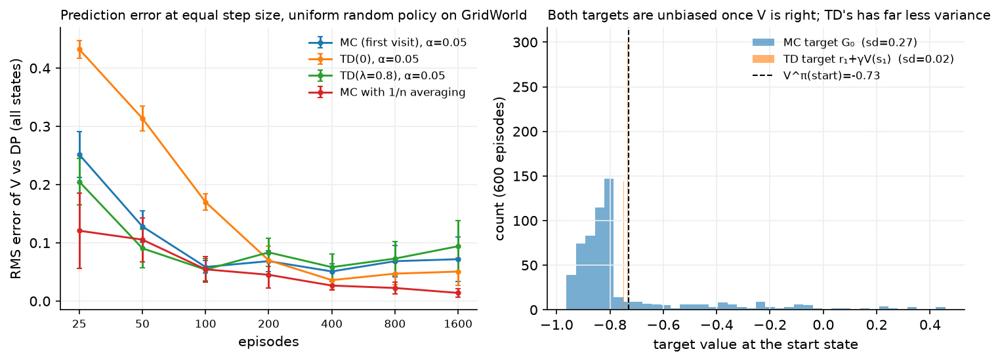
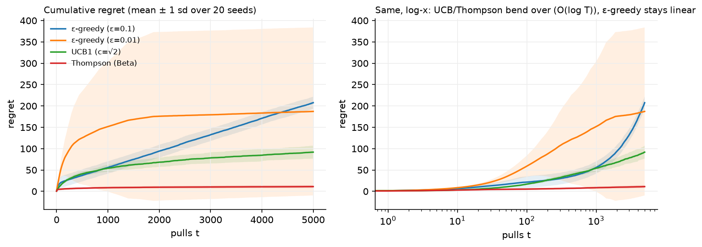

# Classical RL algorithms

> **Why this matters at staff level.** This is the chapter that decides whether you can
> answer RL questions outside a frontier lab. Bandits are the most widely deployed form of
> RL in industry, and interviewers at ranking and ads companies ask about them directly.
> The tabular algorithms (MC, TD, SARSA, Q-learning) are where the on-policy versus
> off-policy distinction becomes concrete, and every deep RL method in chapters 3 and 4 is
> one of them with a neural network bolted on. Strong signal: deriving the UCB bonus from
> Hoeffding instead of quoting it, and giving the variance argument for the bias/variance
> trade between TD and Monte Carlo.

## TL;DR, the interview card

* A bandit is a one-step MDP: no state transitions, so no Bellman backup, only
  exploration versus exploitation. Regret after $T$ pulls is $T\mu^* - \sum_t \mu_{a_t}$.
* $\varepsilon$-greedy has linear regret ($\varepsilon$ fraction of pulls are wasted
  forever). UCB and Thompson sampling have $O(\log T)$ regret.
* UCB bonus: Hoeffding gives $\Pr(\hat\mu_k - \mu_k \ge u) \le e^{-2n_k u^2}$; set the
  bound to $t^{-4}$ and solve to get $u = \sqrt{2\ln t / n_k}$. That square root is the
  whole algorithm.
* Thompson sampling: keep a $\mathrm{Beta}(\alpha_k,\beta_k)$ posterior per arm, sample
  one $\theta_k$ from each, pull the argmax. Arm $k$ is pulled with the posterior
  probability that it is best.
* Monte Carlo target $G_t$ is unbiased with variance that grows with the horizon. TD(0)
  target $r + \gamma V(s')$ is biased while $V$ is wrong, with variance from one
  transition. $n$-step and TD($\lambda$) interpolate.
* TD error: $\delta_t = r_{t+1} + \gamma V(s_{t+1}) - V(s_t)$. Every algorithm in this part
  is "move something in the direction of a $\delta$".
* SARSA target uses the action you actually took next ($r + \gamma Q(s',a')$), so it is
  on-policy and learns the value of your exploratory behaviour. Q-learning uses
  $\max_{a'}Q(s',a')$, so it is off-policy and learns $Q^*$ regardless of behaviour.
* Convergence (tabular) needs Robbins-Monro steps, $\sum_t \alpha_t = \infty$,
  $\sum_t \alpha_t^2 < \infty$, plus infinite visits to every state-action pair.
* $\E[\max_a \hat Q(a)] \ge \max_a \E[\hat Q(a)]$ by Jensen, so the max of noisy estimates
  is biased upward. Double Q-learning decouples selection from evaluation and removes it.

## 1. Intuition first

Two problems, in order of increasing difficulty.

**Problem one: four slot machines.** Machine payouts are Bernoulli with unknown means
$0.1, 0.5, 0.6, 0.9$. You get 5000 pulls. Every pull spent on a bad machine is money lost;
every pull spent on the best machine teaches you nothing new. You do not know which is
which. There is no state: pulling machine 3 does not change what happens next.

**Problem two: the gridworld from chapter 1, with the tensors taken away.** You can still
move, still see which cell you land in, still collect rewards. You do not have $P$ or $R$.
You cannot do a Bellman backup because the backup requires a sum over $s'$ weighted by
probabilities you do not know. All you have is experience: $s_0, a_0, r_1, s_1, a_1, r_2, \ldots$

Problem one is answered by bandit algorithms. Problem two has exactly two answers, and
every method in RL descends from one of them:

* **Wait and see.** Play the episode to the end, look at the actual return $G_t$, and move
  $V(s_t)$ toward it. That is Monte Carlo. The estimate is unbiased because $G_t$ really is
  a sample from the distribution whose mean is $V(s_t)$. It has high variance because it
  contains every random reward and transition between $t$ and the end.
* **Guess and correct.** Take one step, see $r_{t+1}$ and $s_{t+1}$, and move $V(s_t)$
  toward $r_{t+1} + \gamma V(s_{t+1})$, using your own current estimate for the rest. That is
  TD. It is biased while $V$ is wrong, and it has much lower variance because only one
  transition is random. Using your current estimate to update your current estimate is
  called **bootstrapping**, and it is the single most consequential idea in RL: it is
  what makes learning fast and it is what makes deep RL unstable (chapter 3).

{ width="820" }

The right-hand panel is the argument in one picture. Both targets are centred on
$V^\pi(\text{start})$, so neither is systematically wrong once $V$ is correct. The MC
target is spread over the whole range of possible episode outcomes; the TD target takes
one reward plus a number you already believe, so it clusters tightly. Lower variance is
why TD gets to a given accuracy in fewer episodes in the left panel.

## 2. The math

### 2.1 Bandits: the problem

$K$ arms, arm $k$ has unknown mean reward $\mu_k$. At each step $t$ you pick $a_t$ and see
$r_t$ with $\E[r_t] = \mu_{a_t}$. Write $\mu^* = \max_k \mu_k$ and $\Delta_k = \mu^* - \mu_k$
for the gap of arm $k$. The quantity to minimise is the **expected regret**

$$
\mathrm{Regret}(T) \;=\; T\mu^* - \E\Big[\sum_{t=1}^{T} \mu_{a_t}\Big] \;=\; \sum_k \Delta_k\, \E[n_k(T)],
$$

where $n_k(T)$ is the number of pulls of arm $k$. The second form is the useful one: regret
is the sum over arms of (how bad the arm is) times (how often you pulled it). An algorithm
is good if it pulls bad arms only $O(\log T)$ times.

$\varepsilon$-greedy pulls a uniformly random arm with probability $\varepsilon$ forever,
so $\E[n_k(T)] \ge \varepsilon T/K$ for every arm and regret grows linearly at rate
$\varepsilon \bar\Delta$. Decaying $\varepsilon_t \propto 1/t$ fixes the asymptotics, and is
what people usually mean when they say $\varepsilon$-greedy works fine.

### 2.2 Deriving UCB from Hoeffding

The principle is optimism in the face of uncertainty: score each arm by the highest value
its data cannot rule out, then act greedily on that score. To turn that into a formula you
need a confidence interval, and Hoeffding's inequality gives one.

**Hoeffding's inequality.** If $X_1,\ldots,X_n$ are independent with $X_i \in [0,1]$ and
$\hat\mu = \frac{1}{n}\sum_i X_i$, then for any $u > 0$

$$
\Pr\big(\hat\mu - \E[\hat\mu] \ge u\big) \le e^{-2nu^2},
\qquad
\Pr\big(\E[\hat\mu] - \hat\mu \ge u\big) \le e^{-2nu^2}.
$$

Apply it to arm $k$ after $n_k$ pulls with empirical mean $\hat\mu_k$. We want a bonus
$u_k$ such that $\mu_k \le \hat\mu_k + u_k$ with high probability. Set the failure
probability to $\delta$:

$$
e^{-2 n_k u_k^2} = \delta \quad\Longrightarrow\quad u_k = \sqrt{\frac{\ln(1/\delta)}{2 n_k}}.
$$

Now choose $\delta$. We need the bound to hold for all arms and all times, and we want the
total probability of ever being wrong to be small, so $\delta$ must shrink with $t$. Taking
$\delta = t^{-4}$ (the standard choice, which makes the union bound over $t$ and $k$
converge) gives

$$
u_k = \sqrt{\frac{4\ln t}{2 n_k}} = \sqrt{\frac{2\ln t}{n_k}},
$$

and the algorithm is

$$
\boxed{\;a_t = \argmax_k \left[\hat\mu_k + c\sqrt{\frac{\ln t}{n_k}}\right], \qquad c = \sqrt{2}\;}
$$

which is UCB1 (Auer, Cesa-Bianchi and Fischer, 2002). Read the two terms: $\hat\mu_k$ is
exploitation, the bonus is exploration, and the bonus shrinks as $1/\sqrt{n_k}$ (you become
confident) and grows as $\sqrt{\ln t}$ (arms you have ignored become worth rechecking as
time passes). No randomness is involved anywhere.

**Why this gives logarithmic regret, in one paragraph.** A suboptimal arm $k$ can only be
pulled when its upper bound exceeds the optimal arm's upper bound. If the confidence
intervals hold, that requires $\hat\mu_k + u_k \ge \mu^*$, which, since
$\hat\mu_k \approx \mu_k$, requires $2u_k \gtrsim \Delta_k$, i.e.
$n_k \lesssim 8\ln t/\Delta_k^2$. Summing over arms,

$$
\mathrm{Regret}(T) = O\!\left(\sum_{k:\Delta_k>0} \frac{\ln T}{\Delta_k}\right),
$$

so arms that are nearly as good as the best (small $\Delta_k$) get pulled a lot, which
costs little per pull. This matches the Lai-Robbins lower bound up to constants: no
algorithm can do better than $\Omega(\log T)$.

### 2.3 Thompson sampling with Beta posteriors

Thompson sampling is Bayesian and, in the Bernoulli case, two lines of code. Put a
$\mathrm{Beta}(1,1)$ prior (uniform on $[0,1]$) on each arm's success probability. Beta is
conjugate to Bernoulli (see [Part I, Probability](../part01-math/03-probability.md)), so
after $S_k$ successes and $F_k$ failures the posterior is

$$
p(\theta_k \mid \text{data}) = \mathrm{Beta}(1 + S_k,\; 1 + F_k),
\qquad
\E[\theta_k] = \frac{1+S_k}{2+S_k+F_k}.
$$

At each step, draw one sample $\tilde\theta_k \sim \mathrm{Beta}(1+S_k, 1+F_k)$ per arm and
pull $\argmax_k \tilde\theta_k$. The update after seeing $r \in \{0,1\}$ is
$\alpha_k \mathrel{+}= r$, $\beta_k \mathrel{+}= 1-r$.

The property worth stating in an interview is **probability matching**: arm $k$ is selected
with exactly the posterior probability that arm $k$ is optimal,

$$
\Pr(a_t = k) = \Pr\big(\theta_k = \max_j \theta_j \;\big|\; \text{data}\big).
$$

Posterior width is what drives exploration here, and there is no bonus constant to tune. A wide posterior
sometimes samples high and the arm gets tried; as data accumulates the posterior narrows
and sampling concentrates on the best arm. Thompson sampling also has $O(\log T)$ regret,
and in practice it usually beats UCB on Bernoulli problems, as the figure below shows.

{ width="820" }

The log-x panel is the one to read: UCB and Thompson curves bend over (the signature of
$\log T$), while both $\varepsilon$-greedy curves keep climbing at a constant rate. At
$T=5000$ with these gaps, Thompson's regret is roughly a tenth of $\varepsilon$-greedy's
at $\varepsilon = 0.1$.

### 2.4 Contextual bandits

Almost nothing in production is a plain bandit. You see a context $x_t \in \R^d$ (user
features, device, time of day) before choosing, and the reward depends on both:
$\E[r_t \mid x_t, a_t] = f(x_t, a_t)$. This is still a one-step problem (your choice does
not change the next context), but the estimation problem is now a regression per arm.

LinUCB (Li, Chu, Langford and Schapire, WWW 2010) assumes a linear reward
$f(x,k) = x^\top\theta_k$ and applies the same optimism principle to the ridge regression
confidence ellipsoid:

$$
A_k = I + \sum_{t: a_t = k} x_t x_t^\top \in \R^{d\times d},
\qquad
b_k = \sum_{t: a_t=k} r_t x_t \in \R^{d},
\qquad
\hat\theta_k = A_k^{-1}b_k,
$$

$$
\boxed{\;a_t = \argmax_k \left[x_t^\top\hat\theta_k + \alpha\sqrt{x_t^\top A_k^{-1} x_t}\right]\;}
$$

The bonus $\sqrt{x^\top A_k^{-1}x}$ is the standard deviation of the predicted reward along
the direction $x$: it is large when you have seen few contexts resembling $x$ for that arm.
The same structure appears with a neural network in place of the linear model, where the
usual approximations to the bonus are dropout, an ensemble, or a last-layer Bayesian head.

Three facts about contextual bandits in production that interviewers look for:

1. **Logged data is biased by the logging policy.** If your old policy rarely showed
   article 7, you have almost no data on it, and naive supervised training on logs will
   inherit that blind spot. The fix is to log propensities $\pi_{\text{old}}(a\mid x)$ at
   serving time and use inverse propensity weighting for evaluation.
2. **Offline evaluation is possible without a live test.** Replay logged events, and when
   the logged action matches the policy's action, count it. This is unbiased if the logging
   policy was stochastic and its propensities are known, and it is why bandit systems are
   deployed with forced randomisation.
3. **Delayed and partial feedback.** A click arrives in seconds, a "was this a good
   recommendation" signal in days. Most production systems use a short-horizon proxy
   reward and monitor the long-horizon metric separately.

### 2.5 From bandits to full RL: Monte Carlo

Back to the gridworld without $P$ and $R$. Monte Carlo evaluation estimates
$V^\pi(s) = \E_\pi[G_t \mid S_t = s]$ by the sample mean of observed returns:

$$
V(s) \leftarrow \text{average of } \{G_t : t \text{ a first visit to } s\}.
$$

Written incrementally, with $n(s)$ the visit count,

$$
V(s) \leftarrow V(s) + \frac{1}{n(s)}\big(G_t - V(s)\big),
$$

which is the running-mean form of every update in this chapter: `estimate += step * (target - estimate)`.

First-visit MC (average returns following the first visit to $s$ in each episode) is
unbiased with i.i.d. samples. Every-visit MC is biased for finite samples but consistent;
both converge. MC needs episodes to terminate, and it cannot update anything until the
episode ends, which rules it out for continuing tasks and for long-horizon control.

For **control**, average $Q(s,a)$ instead of $V(s)$ and act $\varepsilon$-greedily with
respect to it. You need the $\varepsilon$: with a deterministic greedy policy you
would never see the alternatives, so the estimates for unchosen actions never improve. This
is the **exploring starts** problem, and $\varepsilon$-soft policies are the standard fix.
The consequence, which the tests in §3 pin down, is that on-policy control converges to the
best $\varepsilon$-soft policy, not to $\pi^*$.

### 2.6 The TD error, and why it has lower variance

Start from the Bellman expectation equation in its sampled form. For a single transition
$(s_t, a_t, r_{t+1}, s_{t+1})$ the quantity

$$
\boxed{\;\delta_t \;=\; r_{t+1} + \gamma V(s_{t+1}) - V(s_t)\;}
$$

is the **TD error**: the difference between a one-step sample of the Bellman backup and
the current estimate. The TD(0) update is

$$
V(s_t) \leftarrow V(s_t) + \alpha\,\delta_t.
$$

Why this converges to $V^\pi$: take the expectation of the target under the true dynamics,

$$
\E\big[r_{t+1} + \gamma V^\pi(s_{t+1}) \mid s_t = s\big] = \sum_a \pi(a|s)\Big[R(s,a) + \gamma\sum_{s'}P(s'|s,a)V^\pi(s')\Big] = V^\pi(s),
$$

which is exactly the Bellman expectation equation. So $V^\pi$ is a fixed point of the
expected update, and TD(0) is a stochastic approximation (Robbins-Monro) scheme for finding
it. When $V \ne V^\pi$ the target is biased, because it contains the wrong $V(s_{t+1})$;
the bias vanishes as $V$ improves.

**The variance argument.** Write the MC return recursively:
$G_t = r_{t+1} + \gamma r_{t+2} + \gamma^2 r_{t+3} + \cdots$. Every one of those rewards is
random, and so is every transition that generated them. For the TD target only $r_{t+1}$
and $s_{t+1}$ are random; $V(s_{t+1})$ is a fixed number in the current table. If rewards
have variance $\sigma^2$ and are roughly independent along a trajectory,

$$
\mathrm{Var}[G_t] \approx \sigma^2 \sum_{k\ge 0}\gamma^{2k} = \frac{\sigma^2}{1-\gamma^2},
\qquad
\mathrm{Var}[r_{t+1} + \gamma V(s_{t+1})] \approx \sigma^2 + \gamma^2\mathrm{Var}[V(s_{t+1})].
$$

For $\gamma = 0.99$ the first is about 50 times the second's reward term. That ratio, not
any subtlety, is why TD learns faster in practice.

| | Monte Carlo | TD(0) |
|---|---|---|
| Target | $G_t$ (actual return) | $r_{t+1} + \gamma V(s_{t+1})$ |
| Bias | none | biased while $V \ne V^\pi$ |
| Variance | high, grows with horizon | low |
| Needs episodes to end | yes | no |
| Uses the Markov property | no | yes |
| Converges to | the sample-average solution | the maximum-likelihood MDP's solution |

The last row is worth memorising because it is a favourite follow-up. On a finite batch of
data, MC converges to the values that minimise squared error against the observed returns;
TD converges to the values of the MDP whose transition probabilities are the empirical
counts (the certainty-equivalence estimate). TD exploits the Markov structure, so it wins
when the environment is Markov and loses when it is not.

### 2.7 $n$-step returns and TD($\lambda$)

MC and TD(0) are the endpoints of a family. The $n$-step return bootstraps after $n$ real
rewards:

$$
G_t^{(n)} = r_{t+1} + \gamma r_{t+2} + \cdots + \gamma^{n-1}r_{t+n} + \gamma^n V(s_{t+n}).
$$

$n=1$ is TD(0); $n = \infty$ (or to the end of the episode) is MC. Intermediate $n$ is
usually better than either, and $n$ in the range 3 to 10 is a common default.

TD($\lambda$) averages all $n$-step returns with exponentially decaying weights, the
$\lambda$-return:

$$
G_t^\lambda = (1-\lambda)\sum_{n=1}^{\infty}\lambda^{n-1}G_t^{(n)}.
$$

The weights $(1-\lambda)\lambda^{n-1}$ sum to one, so $G^\lambda_t$ is a weighted average of
estimators. $\lambda = 0$ recovers TD(0), $\lambda = 1$ recovers MC. Computing it forwards
requires waiting for the episode to end, which defeats the point, so the standard
implementation is the **backward view** with eligibility traces:

$$
e_t(s) = \gamma\lambda e_{t-1}(s) + \mathbb{1}[s_t = s],
\qquad
V(s) \leftarrow V(s) + \alpha\,\delta_t\, e_t(s) \;\;\text{for all } s.
$$

The trace $e$ is a memory of how recently and how often each state was visited. When a
surprise $\delta_t$ arrives, every recently visited state is updated in proportion to its
trace, so credit flows backwards along the trajectory immediately instead of one step per
episode. The equivalence between the forward and backward views is exact for offline
updates and approximate for online ones.

Hold on to $G^\lambda_t$: generalised advantage estimation in
[chapter 4](04-policy-gradients-ppo.md) is the same exponential weighting applied to
advantages instead of returns, and $\lambda$ plays the same bias/variance role.

### 2.8 SARSA versus Q-learning

For control we learn $Q$ rather than $V$, because acting greedily on $Q$ needs no model
while acting greedily on $V$ requires $\sum_{s'}P(s'|s,a)V(s')$.

**SARSA** (state, action, reward, state, action) uses the action actually taken next:

$$
Q(s_t,a_t) \leftarrow Q(s_t,a_t) + \alpha\big[r_{t+1} + \gamma Q(s_{t+1},a_{t+1}) - Q(s_t,a_t)\big],
\qquad a_{t+1}\sim \pi_{\text{behaviour}}.
$$

**Q-learning** uses the greedy action, whatever you actually do:

$$
\boxed{\;Q(s_t,a_t) \leftarrow Q(s_t,a_t) + \alpha\big[r_{t+1} + \gamma \max_{a'} Q(s_{t+1},a') - Q(s_t,a_t)\big]\;}
$$

**Expected SARSA** averages over the behaviour policy instead of sampling it:
$r + \gamma\sum_{a'}\pi(a'|s')Q(s',a')$, which removes the variance due to sampling $a'$
at the cost of one extra sum.

The difference is one symbol and it changes everything:

| | SARSA | Q-learning |
|---|---|---|
| Target | $r + \gamma Q(s',a')$, $a'$ from behaviour | $r + \gamma\max_{a'}Q(s',a')$ |
| Policy learned | the behaviour policy (including its $\varepsilon$) | the greedy policy $\pi^*$ |
| Class | on-policy | off-policy |
| Can learn from a replay buffer or logs | no | yes |
| Behaviour near danger | conservative, accounts for exploration mistakes | optimistic, assumes it will act greedily |

The classic illustration is the cliff-walking task: Q-learning learns the optimal path
right along the cliff edge, while SARSA learns a safer path one row back, because SARSA's
target includes the $\varepsilon$ chance of stepping off. Both are correct. They are
evaluating different policies. If the deployed policy will keep exploring, SARSA's answer
is the one you want.

**Convergence conditions** (tabular, both algorithms): the Robbins-Monro conditions on the
step sizes,

$$
\sum_{t=1}^\infty \alpha_t = \infty, \qquad \sum_{t=1}^\infty \alpha_t^2 < \infty,
$$

plus every state-action pair visited infinitely often. The first condition says the steps
must be large enough in total to travel any distance; the second says they must shrink fast
enough to average out noise. $\alpha_t = 1/t$ satisfies both; a constant $\alpha$ satisfies
only the first, which is why constant-$\alpha$ methods track a moving target instead of
converging (usually what you want in a nonstationary problem). SARSA additionally needs the
policy to become greedy in the limit (GLIE, for example $\varepsilon_t = 1/t$) to converge
to $Q^*$ rather than to $Q^{\pi_\varepsilon}$.

### 2.9 Maximisation bias and Double Q-learning

The $\max$ in Q-learning has a statistical cost. Let $\hat Q(a)$ be unbiased estimates of
true values $Q(a)$, all equal to zero. Then by Jensen's inequality applied to the convex
$\max$ function,

$$
\E\big[\max_a \hat Q(a)\big] \;\ge\; \max_a \E\big[\hat Q(a)\big] = \max_a Q(a) = 0.
$$

The inequality is strict as soon as the estimates are noisy and not perfectly correlated.
Taking the max of noisy numbers selects whichever one happened to be over-estimated, so the
max is biased upward. In Q-learning this bias enters the target at every step and
propagates through the backups, producing systematically inflated values, and, worse,
a preference for actions whose values are *uncertain* instead of high.

**Double Q-learning** (van Hasselt, 2010) fixes it by decoupling the two roles the max plays
(selecting an action, and evaluating it) with two independent tables:

$$
a^* = \argmax_{a'} Q_A(s',a'),
\qquad
Q_A(s,a) \leftarrow Q_A(s,a) + \alpha\big[r + \gamma\,Q_B(s',a^*) - Q_A(s,a)\big],
$$

and symmetrically with $A$ and $B$ swapped, choosing which to update at random each step.
$Q_B(s', a^*)$ is an unbiased estimate of the value of $a^*$ because $Q_B$ was not used to
pick it. The demonstration in the code makes this quantitative: with ten actions whose true
values are all zero, estimated from five samples each, the single estimator averages about
$+0.69$ while the double estimator averages about $+0.003$.

This is the same bias that makes DQN over-estimate, and Double DQN
([chapter 3](03-deep-rl-dqn.md)) is precisely this trick with the online and target
networks playing the roles of $Q_A$ and $Q_B$.

## 3. Implementation

### 3.1 Bandits

The three solvers share a `select()` / `update(k, r)` interface, so `run_bandit` can drive
any of them and record regret.

```python title="src/mlbook/rl/bandits.py (excerpt)"
class UCB1:
    def select(self) -> int:
        self.t += 1
        if np.any(self.counts == 0):
            return int(np.argmin(self.counts))  # pull every arm once first
        means = self.sums / self.counts  # (K,)
        bonus = self.c * np.sqrt(np.log(self.t) / self.counts)  # (K,) confidence radius
        return int(np.argmax(means + bonus))


class ThompsonBeta:
    def select(self) -> int:
        samples = self.rng.beta(self.alpha, self.beta)  # (K,) one draw per posterior
        return int(np.argmax(samples))

    def update(self, k: int, r: float) -> None:
        self.alpha[k] += r
        self.beta[k] += 1.0 - r
```

Both are short enough to write in an interview. The details that matter: UCB must pull each
arm once before the bonus is defined (division by zero otherwise), and Thompson's update is
just two counters, which is why it survives at production scale where one Beta pair per
(arm, context-bucket) is cheap to store and update.

LinUCB needs one matrix inverse per arm per step in this naive form:

```python title="src/mlbook/rl/bandits.py (excerpt)"
def select(self, x: np.ndarray) -> int:
    A_inv = np.linalg.inv(self.A)  # (K, d, d)
    theta = np.einsum("kij,kj->ki", A_inv, self.b)  # (K, d): theta_k = A_k^-1 b_k
    mean = theta @ x  # (K,) predicted reward per arm
    width = np.sqrt(np.einsum("i,kij,j->k", x, A_inv, x))  # (K,) sqrt(x^T A_k^-1 x)
    return int(np.argmax(mean + self.alpha * width))
```

The `einsum` strings, term by term: `kij,kj->ki` contracts the last axis of each arm's
$d\times d$ inverse with that arm's $d$-vector, giving one $\hat\theta_k$ per arm;
`i,kij,j->k` is the quadratic form $x^\top A_k^{-1}x$ evaluated for every arm at once. In
production you would maintain $A_k^{-1}$ incrementally with the Sherman-Morrison update
instead of inverting, which turns $O(d^3)$ per step into $O(d^2)$.

### 3.2 Prediction: MC, TD(0), $n$-step, TD($\lambda$)

All four estimate $V^\pi$ on the gridworld from experience only. The shapes are trivial
(everything is $(S,)$ or $(S,A)$); what matters is where each one gets its target.

```python title="src/mlbook/rl/mc_td.py (excerpt)"
def td0_evaluation(env, pi, gamma, n_episodes, alpha, rng):
    """TD(0): ``V(s) <- V(s) + alpha [ r + gamma V(s') - V(s) ]``; returns (S,)."""
    V = np.zeros(env.n_states)  # (S,)
    for _ in range(n_episodes):
        env.reset(rng)
        done = False
        while not done:
            s = env.state
            a = sample_action(pi, s, rng)
            _, r, done = env.step(a, rng)
            s2 = env.state
            target = r + (0.0 if env.is_terminal(s2) else gamma * V[s2])
            V[s] += alpha * (target - V[s])  # TD error delta = target - V(s)
    return V


def td_lambda_evaluation(env, pi, gamma, lam, n_episodes, alpha, rng):
    V = np.zeros(env.n_states)  # (S,)
    for _ in range(n_episodes):
        e = np.zeros(env.n_states)  # (S,) eligibility trace
        env.reset(rng)
        done = False
        while not done:
            s = env.state
            a = sample_action(pi, s, rng)
            _, r, done = env.step(a, rng)
            s2 = env.state
            delta = r + (0.0 if env.is_terminal(s2) else gamma * V[s2]) - V[s]
            e = gamma * lam * e  # decay every state's credit
            e[s] += 1.0  # the state just visited earns full credit
            V += alpha * delta * e  # (S,) every recently visited state moves
    return V
```

The line `target = r + (0.0 if env.is_terminal(s2) else gamma * V[s2])` is the terminal
bootstrap guard from chapter 1's failure-mode list. Delete the guard and values near the
goal inflate by $\gamma V(\text{terminal})$ forever.

TD($\lambda$) differs from TD(0) by three lines, and the vectorised `V += alpha * delta * e`
updates all $S$ states at once. For a tabular problem this is cheap; with function
approximation the trace becomes a vector in parameter space and the same update is one
extra buffer the size of your parameters.

### 3.3 Control: SARSA, Q-learning, Double Q

```python title="src/mlbook/rl/q_learning.py (excerpt)"
def q_learning(env, gamma, n_episodes, alpha, eps, rng):
    Q = np.zeros((env.n_states, env.n_actions))  # (S, A)
    for _ in range(n_episodes):
        env.reset(rng)
        done = False
        while not done:
            s = env.state
            a = epsilon_greedy_action(Q, s, eps, rng)
            _, r, done = env.step(a, rng)
            s2 = env.state
            target = r + (0.0 if env.is_terminal(s2) else gamma * float(np.max(Q[s2])))
            Q[s, a] += alpha * (target - Q[s, a])
    return Q


def double_q_learning(env, gamma, n_episodes, alpha, eps, rng):
    QA = np.zeros((env.n_states, env.n_actions))  # (S, A)
    QB = np.zeros((env.n_states, env.n_actions))  # (S, A)
    for _ in range(n_episodes):
        env.reset(rng)
        done = False
        while not done:
            s = env.state
            a = epsilon_greedy_action(QA + QB, s, eps, rng)  # behave with the sum
            _, r, done = env.step(a, rng)
            s2 = env.state
            if rng.random() < 0.5:
                a_star = int(np.argmax(QA[s2]))  # choose with A ...
                target = r + (0.0 if env.is_terminal(s2) else gamma * QB[s2, a_star])  # ... evaluate with B
                QA[s, a] += alpha * (target - QA[s, a])
            else:
                a_star = int(np.argmax(QB[s2]))
                target = r + (0.0 if env.is_terminal(s2) else gamma * QA[s2, a_star])
                QB[s, a] += alpha * (target - QB[s, a])
    return 0.5 * (QA + QB)
```

Compare the SARSA loop in the same file: the only structural difference is that SARSA picks
$a_{t+1}$ *before* the update and carries it into the next iteration, because the action it
bootstraps from must be the action it will actually take. That carry is what makes it
on-policy, and writing it correctly (rather than sampling a fresh $a'$ that you then
discard) is the thing interviewers check.

`epsilon_greedy_action` breaks ties uniformly at random. With all-zero initialisation and
`argmax`, every tie would resolve to action 0 and the agent would spend its early episodes
walking into the same wall.

??? example "Full implementations"
    ```python
    --8<-- "src/mlbook/rl/bandits.py"
    ```

    ```python
    --8<-- "src/mlbook/rl/q_learning.py"
    ```

### 3.4 How you'd test it

The tests are the interesting part of this chapter, because "it learned something" is not a
test. The properties checked in `tests/test_rl_bandits.py`, `tests/test_rl_mc_td.py` and
`tests/test_rl_q_learning.py`:

* **Regret shape, not regret value.** $\varepsilon$-greedy's regret slope is checked
  against $\varepsilon \bar\Delta$ from §2.1; UCB's regret in the second half of the run is
  checked to be smaller than in the first (sublinearity); Thompson's total regret is
  bounded by a constant.
* **Posterior arithmetic.** After one success and one failure, $\mathrm{Beta}(2,2)$.
* **Prediction against ground truth.** Each of MC, TD(0), $n$-step and TD($\lambda$) is run
  for 1500 episodes and compared at the start state against `policy_evaluation` from
  chapter 1, which is exact. Comparing against an exact DP answer is what makes these real
  tests and not smoke tests.
* **Control against the optimal policy.** Q-learning and Double Q-learning must recover
  value iteration's greedy actions along the optimal path and reach within 0.05 of $V^*$ at
  the start. SARSA and Expected SARSA are held to a looser bound (0.12) and a shorter list
  of cells, because on-policy control with $\varepsilon = 0.1$ converges to the best
  $\varepsilon$-soft policy, which prefers the route away from the pit. The test encodes
  the theory rather than papering over the difference.
* **Maximisation bias.** `maximisation_bias_demo` asserts the single estimator's mean
  exceeds $+0.4$ and the double estimator's is within $0.1$ of zero.

```bash
pytest tests/test_rl_bandits.py tests/test_rl_mc_td.py tests/test_rl_q_learning.py -q
```

## Retype by hand

| Reproduce from memory | File | Target time |
|---|---|---|
| `UCB1.select` (including the first-pull guard) | `src/mlbook/rl/bandits.py` | 5 min |
| `ThompsonBeta.select` and `.update` | `src/mlbook/rl/bandits.py` | 5 min |
| `td0_evaluation` | `src/mlbook/rl/mc_td.py` | 8 min |
| `td_lambda_evaluation` (the trace update) | `src/mlbook/rl/mc_td.py` | 10 min |
| `mc_evaluation` (first-visit bookkeeping) | `src/mlbook/rl/mc_td.py` | 8 min |
| `q_learning` | `src/mlbook/rl/q_learning.py` | 10 min |
| `sarsa` (get the action carry right) | `src/mlbook/rl/q_learning.py` | 10 min |
| `double_q_learning` | `src/mlbook/rl/q_learning.py` | 10 min |

**Fine to just read**: `LinUCB` (know the formula, not the `einsum`), `run_bandit`,
`run_linear_contextual`, `generate_episode`, `epsilon_soft`, `expected_sarsa` (it is
`q_learning` with a dot product), `maximisation_bias_demo`.

```bash
pytest tests/test_rl_bandits.py -q          # UCB1, ThompsonBeta, LinUCB, epsilon-greedy
pytest tests/test_rl_mc_td.py -q            # MC, TD(0), n-step, TD(lambda), MC control
pytest tests/test_rl_q_learning.py -q       # SARSA, Q-learning, Expected SARSA, Double Q
```

Each symbol has its own test, so `pytest tests/test_rl_q_learning.py -k double -q` checks
one retyped function in about four seconds.

## 4. Systems view: cost, failure modes, trade-offs

### Cost and shape of the system

| Method | Update cost | Memory | Needs episodes to end | Parallelises by |
|---|---|---|---|---|
| $\varepsilon$-greedy / UCB | $O(K)$ | $2K$ counters | no | sharding arms |
| Thompson (Beta) | $O(K)$ | $2K$ counters | no | sharding arms |
| LinUCB | $O(Kd^2)$ with Sherman-Morrison | $Kd^2$ | no | sharding arms |
| MC | $O(T)$ per episode | $S$ or $SA$ | yes | independent episodes |
| TD(0) / SARSA / Q-learning | $O(1)$ per step | $SA$ | no | independent actors, shared table |
| TD($\lambda$) | $O(S)$ per step (dense trace) | $2S$ | no | as above |

The operational difference that matters in production: bandit updates are $O(K)$ counter
bumps, so a bandit can be updated online per event by a streaming job, while the tabular RL
methods need a state representation that is small enough to enumerate. When $S$ stops
fitting in a table, you are in chapter 3.

### When to use what

| Situation | Use | Decision rule |
|---|---|---|
| Choice does not affect future state, no features | Thompson sampling | Fewest knobs, strong empirical performance, trivial to serve |
| Choice does not affect future state, rich features | Contextual bandit (LinUCB or a neural bandit) | You need the model anyway; add the uncertainty bonus to it |
| You need deterministic, auditable exploration | UCB | No randomness, so decisions are reproducible from counts |
| Small state space, need $\pi^*$, can act badly while learning | Q-learning | Off-policy, learns the greedy policy from any behaviour |
| Small state space, the deployed policy will keep exploring | SARSA or Expected SARSA | It evaluates the policy you will actually run |
| Long episodes, non-Markov state | MC or large $n$ | Bootstrapping through an aliased state injects bias |
| Anything with $S$ too large to enumerate | Chapter 3 | Tabular methods need a visit count per state |

### Failure modes

* **Nonstationarity.** Bandit arm means drift (content ages, users change). Fixed counters
  average over all history and stop adapting. Fixes: discount old counts, use a sliding
  window, or add a floor to the exploration rate.
* **Delayed rewards in a bandit.** If the reward arrives minutes later, the update is stale
  and the arm is pulled many more times in the interim. Production systems track
  "in-flight" pulls, often by pessimistically assuming failure until the reward lands.
* **Constant $\alpha$ and the Robbins-Monro conditions.** A constant step size never
  converges, it tracks. That is deliberate for nonstationary problems and a bug if you
  expected convergence and are reading a noisy final number.
* **$\varepsilon$ too small too early.** With optimistic or zero initialisation and a small
  $\varepsilon$, a tabular agent can lock onto the first path it finds. Optimistic
  initialisation ($Q_0$ large) is a cheap alternative that forces early exploration without
  any randomness.
* **Off-policy without correction.** Training Q-learning on logs from a very different
  policy technically still converges in the tabular case (given coverage), but coverage is
  the catch: states the logging policy never visited have no data, and the $\max$ will
  happily extrapolate into them. This is the tabular preview of offline RL's distribution
  shift problem ([chapter 4](04-policy-gradients-ppo.md) §4).

## 5. In production

!!! production "Netflix: artwork personalization with contextual bandits"
    Netflix chooses which image to show for each title, per member. They describe using
    contextual bandits instead of a batch supervised model plus an A/B test, for a reason
    that is worth repeating in an interview: the batch loop (collect data, train, A/B test,
    decide) is slow and spends its exploration budget uniformly, while a bandit trades off
    exploration cost against exploitation benefit continuously and per member. The member
    is the context. Their training data comes from deliberately injected randomisation in
    the serving policy, which is what makes unbiased offline evaluation possible later.
    [Artwork Personalization at Netflix (Netflix TechBlog, 2017)](https://netflixtechblog.com/artwork-personalization-c589f074ad76)

!!! production "Spotify: BaRT, bandits for home-screen recommendations with explanations"
    Spotify's RecSys 2018 paper "Explore, Exploit, Explain" describes a bandit that chooses
    both the item and the explanation ("Because you listened to X") shown with it, framing
    the pair as the arm. The motivation for a bandit over a supervised ranker is
    feedback loop: a supervised model trained on logs only ever learns about content the
    previous model surfaced, and exploration is what breaks that loop. The system ranks
    both shelves and the cards inside them on the Spotify home screen.
    [Explore, Exploit, Explain (Spotify Research, RecSys 2018)](https://research.atspotify.com/publications/explore-exploit-explain-personalizing-explainable-recommendations-with-bandits)

!!! production "Yahoo: LinUCB for news article recommendation"
    The original LinUCB paper evaluated on Yahoo's front page news module, reporting a
    12.5% click lift over a context-free bandit. The paper is also the standard reference
    for unbiased offline evaluation by replaying logged events recorded under a randomised
    logging policy, which is the technique every bandit team ends up implementing. The
    modelling assumption (reward linear in the context features) is weaker than it sounds
    because the features come from an upstream model.
    [A Contextual-Bandit Approach to Personalized News Article Recommendation (arXiv:1003.0146)](https://arxiv.org/abs/1003.0146)

!!! production "YouTube: when a bandit is not enough"
    The contrast case for this chapter. Chen et al. use full RL (REINFORCE with off-policy
    correction) rather than a bandit, because on YouTube a recommendation changes what the
    user watches next, so the decision affects the state of the next decision. The cost of
    that choice is everything the paper spends its pages on: importance weights to correct
    for logged data from earlier policies, a top-$K$ correction because the system shows a
    slate, and variance control. Use this as the worked example of when to pay for RL
    instead of a bandit.
    [Top-K Off-Policy Correction for a REINFORCE Recommender System (arXiv:1812.02353)](https://arxiv.org/abs/1812.02353)

## 6. Interview questions and strong answers

!!! interview "Derive the UCB1 exploration bonus."
    Hoeffding: for an average of $n_k$ bounded samples,
    $\Pr(\hat\mu_k - \mu_k \ge u) \le e^{-2n_k u^2}$. Set that failure probability to
    $\delta$ and solve for $u$: $u = \sqrt{\ln(1/\delta)/(2n_k)}$. You need the bound to
    hold for every arm at every time, so $\delta$ has to shrink with $t$; the standard
    choice $\delta = t^{-4}$ gives $u = \sqrt{2\ln t/n_k}$ and makes the union bound over
    time converge. Then note what the formula does: the bonus falls as $1/\sqrt{n_k}$ and
    rises as $\sqrt{\ln t}$, so an arm you have not pulled in a long time becomes worth
    rechecking.

    **Staff-level follow-up: what if rewards are not bounded in $[0,1]$?**
    Hoeffding needs bounded (or sub-Gaussian) rewards. For unbounded rewards use a
    sub-Gaussian tail bound with the variance proxy, or UCB-V which estimates the variance
    empirically and shrinks the bonus for low-variance arms. If rewards are heavy-tailed,
    neither works and you need a robust mean estimator (median of means).

!!! interview "Thompson sampling or UCB for a production recommender?"
    Thompson, in most cases. It has comparable regret guarantees, usually better empirical
    performance on Bernoulli rewards, and two practical advantages: the exploration knob is
    the prior rather than a bonus constant that has to be tuned per surface, and it is
    batched in one line (sample one $\theta$ per arm per request). Its randomness is also a
    feature for a serving system, since identical requests do not all get the same answer,
    which keeps the logged data diverse. UCB wins when you need determinism for
    auditability or debugging, since its decisions are a pure function of the counters.

    **Staff-level follow-up: how do you handle delayed rewards?**
    Both algorithms assume the reward for a pull is available before the next pull. With
    delayed feedback you can update in batches (both degrade gracefully), or count
    in-flight pulls as pessimistic pseudo-failures so the same arm is not over-served while
    its rewards are in flight.

!!! interview "TD or Monte Carlo? Explain the bias/variance trade."
    MC uses the actual return, which is an unbiased sample of $V^\pi(s)$, but that sample
    contains every random reward and transition to the end of the episode, so its variance
    grows with the horizon (roughly $\sigma^2/(1-\gamma^2)$ for i.i.d. rewards). TD uses
    $r + \gamma V(s')$, in which only one transition is random, so the variance is roughly
    $\sigma^2$, but the target is biased whenever $V$ is wrong, since it contains your own
    estimate. In practice TD reaches a given accuracy in far fewer episodes, and it can
    learn online without waiting for termination. $n$-step and TD($\lambda$) interpolate,
    and the best $n$ is usually neither 1 nor infinity.

    **Staff-level follow-up: on a finite batch of data, what do they converge to?**
    Different answers. MC converges to the values minimising squared error against the
    observed returns; TD converges to the exact values of the empirical MDP (the
    certainty-equivalence estimate). So TD uses the Markov property and MC does not, which
    means TD wins on genuinely Markov problems and can be worse under partial
    observability.

!!! interview "SARSA versus Q-learning near a cliff."
    Q-learning's target is $r + \gamma\max_{a'}Q(s',a')$, which assumes the next action is
    greedy, so it learns the value of the optimal policy and its greedy path runs along the
    cliff edge. SARSA's target uses the action the behaviour policy will actually take, so
    the $\varepsilon$ probability of stepping off the cliff is inside the value, and it
    learns a path one row back. Neither is wrong: they estimate different things. If the
    policy you deploy still explores (or your actuators are noisy), SARSA's estimate is the
    one that matches deployment.

    **Staff-level follow-up: which one can learn from your production logs?**
    Q-learning, because it is off-policy: the target does not reference the action the
    logging policy took next. SARSA cannot, unless the logs came from the policy you are
    evaluating. That is exactly why DQN (and everything with a replay buffer) descends from
    Q-learning and not from SARSA.

!!! interview "Why does Q-learning over-estimate values?"
    Because $\E[\max_a \hat Q(a)] \ge \max_a \E[\hat Q(a)]$ by Jensen: the max is a convex
    function, so taking the max of noisy unbiased estimates gives a biased-high result. The
    max picks whichever action's noise happened to be positive, so the bias is largest when
    estimates are noisy and actions are numerous. The bias then propagates through the
    bootstrapped targets. Double Q-learning splits selection from evaluation across two
    independent estimators, so the estimate used for the value was not the one used to pick
    the action, which removes the bias.

    **Staff-level follow-up: is over-estimation always harmful?**
    No. A uniform over-estimate of all actions does not change the argmax, so the policy is
    unaffected. The damage comes from *non-uniform* over-estimation, which favours actions
    with high-variance estimates, typically the rarely tried ones. Early in training, that
    looks like optimism and can help exploration; late in training it is a bug.

!!! interview "Your ranking team wants to 'use RL'. What do you ask first?"
    Whether the action changes the state of the next decision. If showing an item now does
    not change tomorrow's user (or changes it only through effects you do not measure),
    this is a contextual bandit, and you should build the bandit: it is simpler, its
    offline evaluation is unbiased and well understood, and it is debuggable. Full RL is
    justified when there is measurable state evolution you care about, for example session
    continuation or long-term retention, and it costs you off-policy correction, credit
    assignment across the session, and much harder evaluation. Then ask about logging: if
    the serving policy is deterministic, you have no propensities and no way to evaluate
    offline, so step one is injecting randomisation regardless of which method you pick.

    **Staff-level follow-up: how would you evaluate the bandit offline?**
    Replay: iterate over logged events, and when the logged action matches the policy's
    chosen action, accumulate the reward with an inverse-propensity weight
    $1/\pi_{\text{log}}(a|x)$. This is unbiased given known propensities and full support.
    Watch the effective sample size, since a policy that disagrees with the log almost
    everywhere is evaluated on almost no data.

## 7. Exercises

1. **★ Regret arithmetic.** With arms at $0.1, 0.5, 0.6, 0.9$ and $\varepsilon = 0.1$,
   predict the regret slope of $\varepsilon$-greedy, then verify it.

    ??? success "Solution"
        Exploration pulls a uniform arm $10\%$ of the time, giving expected regret per step
        $\varepsilon \cdot \frac{1}{4}\sum_k \Delta_k = 0.1 \times \frac{0.8+0.4+0.3+0}{4} = 0.0375$,
        plus whatever the greedy part loses before it identifies the best arm. Over 5000
        steps that is about 190, which is what `run_bandit` produces. The test
        `test_epsilon_greedy_regret_grows_linearly` checks exactly this slope.

2. **★ Beta posterior by hand.** An arm has 3 successes and 7 failures under a
   $\mathrm{Beta}(1,1)$ prior. Give the posterior, its mean, and the probability that a
   Thompson draw exceeds 0.5.

    ??? success "Solution"
        Posterior $\mathrm{Beta}(4, 8)$, mean $4/12 = 0.333$. For the tail probability,
        `1 - scipy.stats.beta.cdf(0.5, 4, 8)` gives about 0.113. The point of the exercise:
        even a clearly-below-average arm still gets sampled above 0.5 about one time in
        nine, which is the exploration that a point estimate would never do.

3. **★★ TD($\lambda$) sweep.** For $\lambda \in \{0, 0.4, 0.8, 0.95, 1.0\}$ run
   `td_lambda_evaluation` on the gridworld for 300 episodes with $\alpha = 0.05$ and plot
   the RMS error against the exact `policy_evaluation`. Which $\lambda$ wins, and why is
   $\lambda = 1$ not the best even though it is unbiased?

    ??? success "Solution"
        ```python
        import numpy as np
        from mlbook.rl.envs import GridWorld
        from mlbook.rl.dynamic_programming import policy_evaluation
        from mlbook.rl.mc_td import td_lambda_evaluation
        env, pi, gamma = GridWorld(), np.full((16, 4), 0.25), 0.95
        V_true = policy_evaluation(env.P, env.R, pi, gamma)
        for lam in (0.0, 0.4, 0.8, 0.95, 1.0):
            errs = [np.sqrt(np.mean((td_lambda_evaluation(env, pi, gamma, lam, 300, 0.05,
                    np.random.default_rng(s)) - V_true) ** 2)) for s in range(5)]
            print(lam, round(float(np.mean(errs)), 4))
        ```
        An intermediate $\lambda$ (typically 0.8 to 0.95 here) gives the lowest error.
        $\lambda = 1$ is unbiased but every update carries the full return's variance, so
        with a fixed step size it is noisier; $\lambda = 0$ has the least variance but
        propagates information one step per update, so after 300 episodes the values far
        from the goal have barely moved.

4. **★★ Build the cliff.** Modify `GridWorld` (via its constructor arguments, not by
   editing the class) into a cliff-walking task: a row of pits along the bottom between the
   start and the goal. Train SARSA and Q-learning with $\varepsilon = 0.1$ and compare both
   the greedy policies and the average return *during* training.

    ??? success "Solution"
        Pass a goal in the bottom-right, and make the cells between start and goal pits by
        constructing several `GridWorld` instances is not enough (the class supports one
        pit), so the clean version subclasses it and overrides `is_terminal` and the reward
        in `_build_tensors`. The result reproduces the textbook finding: Q-learning's greedy
        policy hugs the cliff, SARSA's stays a row away, and SARSA's *online* return during
        training is higher because it falls off less often. Say both numbers when you
        report this: the greedy policy value (Q-learning wins) and the behaviour return
        (SARSA wins).

5. **★★ Quantify maximisation bias.** Run `maximisation_bias_demo` for
   `n_samples` in $\{1, 5, 20, 100\}$ and explain the trend.

    ??? success "Solution"
        ```python
        import numpy as np
        from mlbook.rl.q_learning import maximisation_bias_demo
        for n in (1, 5, 20, 100):
            print(n, maximisation_bias_demo(2000, n, np.random.default_rng(0)))
        ```
        The single-estimator bias scales as the standard error of each estimate, $1/\sqrt{n}$,
        times a factor that grows slowly with the number of actions (roughly
        $\sqrt{2\ln A}$ for Gaussian noise). The double estimator stays near zero
        throughout. The lesson for deep RL: the bias is worst exactly where your Q-network
        is least trained, which is early and on rare actions.

6. **★★★ Contextual bandit with a non-linear reward.** Generate contexts $x \in \R^4$ and
   rewards $r = \sin(x^\top\theta_k) + \text{noise}$. Run `LinUCB` and a Thompson-style
   neural bandit (a small MLP per arm plus dropout at inference for the uncertainty
   estimate) and compare regret.

    ??? success "Solution"
        LinUCB's regret grows roughly linearly once the linear model saturates, because its
        confidence intervals are correct for the *linear* model class but the model class is
        wrong, and no amount of data fixes a misspecified mean. The dropout-based neural
        bandit fits the mean and eventually wins, but its uncertainty estimate is not
        calibrated, so it explores erratically early. The staff-level observation this is
        designed to produce: bandit guarantees are conditional on model class realisability,
        and in production the usual failure is misspecification rather than insufficient
        exploration.

## References

* Sutton & Barto, *Reinforcement Learning: An Introduction*, 2nd ed., chapters 2 (bandits),
  5 (Monte Carlo), 6 (TD), 7 ($n$-step), 12 (eligibility traces).
  [Book site](http://incompleteideas.net/book/the-book-2nd.html)
* Auer, Cesa-Bianchi & Fischer, "Finite-time Analysis of the Multiarmed Bandit Problem",
  *Machine Learning* 47 (2002). The UCB1 algorithm and its $O(\log T)$ regret bound.
* Lai & Robbins, "Asymptotically efficient adaptive allocation rules", *Advances in Applied
  Mathematics* 6 (1985). The $\Omega(\log T)$ lower bound that UCB matches.
* Li, Chu, Langford & Schapire, "A Contextual-Bandit Approach to Personalized News Article
  Recommendation", WWW 2010. [arXiv:1003.0146](https://arxiv.org/abs/1003.0146)
* Netflix Technology Blog, "Artwork Personalization at Netflix", 2017.
  [netflixtechblog.com](https://netflixtechblog.com/artwork-personalization-c589f074ad76)
* McInerney et al., "Explore, Exploit, Explain: Personalizing Explainable Recommendations
  with Bandits", RecSys 2018.
  [Spotify Research](https://research.atspotify.com/publications/explore-exploit-explain-personalizing-explainable-recommendations-with-bandits)
* van Hasselt, "Double Q-learning", NIPS 2010. The tabular version of the estimator used by
  Double DQN; see [arXiv:1509.06461](https://arxiv.org/abs/1509.06461) for the deep version.
* Chen et al., "Top-K Off-Policy Correction for a REINFORCE Recommender System", WSDM 2019.
  [arXiv:1812.02353](https://arxiv.org/abs/1812.02353)
