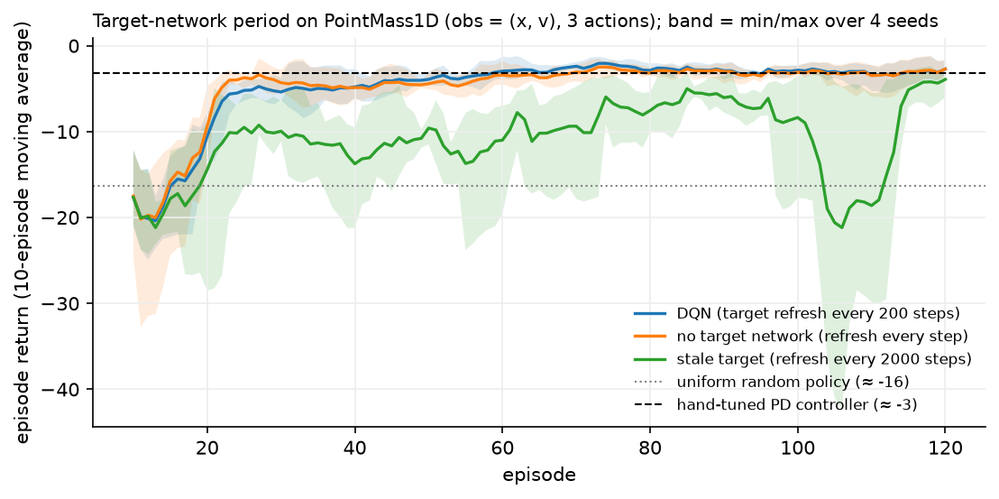

# Deep RL and DQN

> **Why this matters at staff level.** DQN is the bridge between the tabular algorithms
> everyone can derive and the deep methods everyone actually runs. Interviewers use it to
> test three things at once: can you write a loss function with the gradient stopped in the
> right place, can you explain why an algorithm that is provably convergent in a table
> diverges with a network, and do you know which of the dozen published improvements are
> worth their complexity. Strong signal is naming the deadly triad without prompting and
> then explaining replay and target networks as engineering responses to it.

## TL;DR, the interview card

* Function approximation replaces the table $Q \in \R^{S\times A}$ with
  $Q_\theta(s,\cdot): \R^{\text{obs}} \to \R^{A}$, so an update at one state changes the
  values at every state. Generalisation is the point, and interference is the price.
* The **deadly triad** is function approximation + bootstrapping + off-policy training.
  Any two are safe; all three can diverge, and tabular convergence proofs no longer apply.
* DQN loss: $L(\theta) = \E_{(s,a,r,s',d)\sim \mathcal{D}}\big[\ell_\text{Huber}\big(Q_\theta(s,a) - y\big)\big]$
  with $y = r + \gamma(1-d)\max_{a'}Q_{\theta^-}(s',a')$ and no gradient through $y$.
  This is a *semi-gradient* method.
* **Replay buffer**: uniform sampling from a large ring buffer breaks the temporal
  correlation of consecutive transitions and reuses each transition many times.
* **Target network** $\theta^-$: a stale copy refreshed every $C$ steps, which turns a
  moving target into a fixed regression target for $C$ steps.
* **Huber loss**: quadratic near zero, linear beyond $\delta$, so a single large TD error
  cannot produce a huge gradient step.
* **Double DQN**: select with the online net, evaluate with the target net,
  $y = r + \gamma Q_{\theta^-}(s', \argmax_{a'}Q_\theta(s',a'))$, which removes the
  maximisation bias of chapter 2.
* **Dueling**: $Q = V + (A - \text{mean}_a A)$. The mean subtraction makes the split
  identifiable, and the shared $V$ learns from every action taken in a state.
* **Prioritised replay**: sample with probability $\propto |\delta|^\alpha$, correct the
  resulting bias with importance weights $(1/(N p_i))^\beta$.
* **Rainbow** combines six extensions and its ablation shows prioritised replay and
  multi-step returns carry the most weight.
* **Distributional RL** (C51, QR-DQN) learns the distribution of the return instead of its
  mean, which is a better auxiliary learning signal even when you act on the mean.

## 1. Intuition first

The gridworld had 16 states, so $Q$ was a $16 \times 4$ table and each entry could be
learned independently. Now take a task with a continuous state: a point mass on a line with
position $x$ and velocity $v$, three actions (accelerate left, coast, accelerate right), and
a reward of $-(x^2 + 0.1v^2 + 0.01a^2)$ per step. There is no table, because there are
infinitely many $(x,v)$.

Replace the table with a two-layer MLP $Q_\theta$ that maps $(x,v)$ to three numbers. The
Q-learning update becomes a gradient step on a regression problem: the target is
$r + \gamma\max_{a'}Q_\theta(s',a')$ and the prediction is $Q_\theta(s,a)$.

Run exactly that, naively, and it usually does not work. Three things go wrong, and each
fix in DQN is a response to one of them.

**Consecutive samples are correlated.** In supervised learning you shuffle the dataset. In
RL, the data arrives as a trajectory: $(x, v)$ at step 41 looks almost exactly like step 40.
Training an MLP on a batch of near-identical points is training on a batch size of one, and
whatever the agent is doing right now dominates the gradient. The fix is a replay buffer:
store transitions in a big ring buffer and sample uniformly at random.

**The target moves.** The regression target $r + \gamma\max_{a'}Q_\theta(s',a')$ is computed
with the same parameters being updated. Every gradient step changes the target for the next
step, which is a feedback loop, and with a nonlinear function approximator the values can
run away. The fix is a target network: keep a frozen copy $\theta^-$, compute targets with
it, and refresh it every few hundred steps.

**The max over a noisy network is optimistic.** Chapter 2's maximisation bias, now amplified
because the network's errors are correlated across similar states. The fix is Double DQN.

{ width="760" }

The measured result on this task is worth reporting exactly, including the part that
disagrees with the story. Refreshing the target every 200 steps and refreshing it every step
(which is the same as having no target network) are indistinguishable here: both reach the
PD controller's return by episode 60, and over four seeds their final returns differ by less
than the seed spread. Only the very stale target at 2000 steps is clearly worse, and it is
unstable late in training. A two-dimensional state with a 64-unit MLP generalises so little
between $s$ and $s'$ that the feedback loop in §2.5 barely exists. The Nature DQN ablations
on Atari, where the network is a convolutional trunk over 84x84 pixels and neighbouring
frames are nearly identical, show large drops from removing the target network. Take the
mechanism seriously and the toy-scale evidence for it lightly.

## 2. The math

### 2.1 Function approximation changes the problem

Tabular Q-learning converges under the Robbins-Monro conditions because each
$Q(s,a)$ is a separate scalar being averaged. With $Q_\theta$, one gradient step at
$(s,a)$ changes $Q_\theta(\tilde s, \tilde a)$ for every other pair too. Nothing in the
tabular proof survives that.

Write the objective you would like to minimise, the mean squared Bellman error:

$$
\text{MSBE}(\theta) = \E_{s,a\sim\mu}\Big[\big(Q_\theta(s,a) - \underbrace{(R(s,a) + \gamma\E_{s'}[\max_{a'}Q_\theta(s',a')])}_{(\mathcal{T}Q_\theta)(s,a)}\big)^2\Big].
$$

Two problems with taking its true gradient. First, $\mathcal{T}Q_\theta$ depends on
$\theta$, so the true gradient has a term $-2\gamma\E[\ldots\nabla_\theta \max_{a'}Q_\theta(s',a')]$;
including it gives the *residual gradient* method, which is convergent and slow, and which
almost nobody uses. Second, the squared expectation over $s'$ inside needs two independent
samples of $s'$ to be estimated without bias (the double-sampling problem).

What DQN does instead is treat the target as a constant:

$$
\boxed{\;\nabla_\theta L = \E\Big[\big(Q_\theta(s,a) - y\big)\,\nabla_\theta Q_\theta(s,a)\Big],\qquad y = r + \gamma(1-d)\max_{a'}Q_{\theta^-}(s',a')\;}
$$

This is a **semi-gradient** method: it is not the gradient of any fixed objective, because
$y$ changes as $\theta$ changes. It is instead a stochastic fixed-point iteration for the
Bellman operator, implemented with gradient steps. Say that sentence in an interview; it
explains simultaneously why DQN works (it is approximating a contraction) and why it can
diverge (a contraction in the sup norm plus a projection onto a function class in the
$L_2$ norm need not be a contraction in either).

### 2.2 The deadly triad

Sutton and Barto name three ingredients whose combination can diverge:

| Ingredient | What it buys | Why it hurts |
|---|---|---|
| **Function approximation** | Generalisation to unseen states | An update at $s$ perturbs $Q$ at states you were not training on |
| **Bootstrapping** | Low variance, learns online | Errors in $Q(s')$ propagate into the target for $Q(s)$ |
| **Off-policy training** | Reuse of old and other-policy data | The distribution you train on differs from the one the policy visits |

Any two are fine. Monte Carlo with function approximation (no bootstrapping) is stable
supervised learning. On-policy TD with linear function approximation (no off-policy) is
convergent. Tabular off-policy bootstrapping (no approximation) is Q-learning, which
converges. All three together can produce unbounded values, and Baird's counterexample
shows it happens with a *linear* approximator on a tiny MDP, so it is not a deep learning
artefact.

DQN has all three ingredients. Its stability comes from engineering, not theory. van Hasselt
et al. studied the triad empirically in DQN-style agents and found divergence is much rarer
than the theory allows, and that the choices which help most are the ones that reduce
bootstrap error: longer multi-step returns, and target networks.

### 2.3 Deriving the DQN loss

Start from tabular Q-learning and ask what "move $Q(s,a)$ toward the target" means when
$Q$ is parameterised. The tabular update

$$
Q(s,a) \leftarrow Q(s,a) + \alpha\big[y - Q(s,a)\big]
$$

is exactly a gradient step on $\tfrac{1}{2}(Q(s,a) - y)^2$ with respect to the single
scalar $Q(s,a)$, with $y$ held fixed. Generalise by replacing the scalar with $Q_\theta(s,a)$
and differentiating with respect to $\theta$:

$$
L(\theta) = \tfrac{1}{2}\E_{\mathcal{D}}\big[(Q_\theta(s,a) - y)^2\big],
\qquad
\nabla_\theta L = \E_{\mathcal{D}}\big[(Q_\theta(s,a) - y)\nabla_\theta Q_\theta(s,a)\big].
$$

Now make three modifications, each with a reason.

**Targets from a frozen network.** Set $y = r + \gamma(1-d)\max_{a'}Q_{\theta^-}(s',a')$
with $\theta^-$ a periodic copy of $\theta$. Between refreshes, the regression problem is
stationary: you are fitting $Q_\theta$ to a fixed set of numbers, which is ordinary
supervised learning with all its stability. Every $C$ steps you set $\theta^- \leftarrow \theta$
and the targets jump. Small $C$ means the targets chase the predictions (unstable); large
$C$ means you are fitting stale values (slow). Typical Atari settings are $C = 10^4$ steps.

**The $(1-d)$ factor.** At a terminal transition there is no next state, so the target is
$r$ alone. Omitting this factor makes terminal states bootstrap from whatever
$Q_{\theta^-}$ returns for a meaningless next observation, which inflates values near the
end of episodes.

**Huber instead of squared error.** The Huber loss with threshold $\delta$,

$$
\ell_\delta(u) = \begin{cases}\tfrac{1}{2}u^2 & |u| \le \delta\\ \delta(|u| - \tfrac{1}{2}\delta) & |u| > \delta\end{cases}
\qquad
\ell'_\delta(u) = \begin{cases}u & |u|\le\delta\\ \delta\,\mathrm{sign}(u) & |u| > \delta\end{cases}
$$

has a gradient bounded by $\delta$. Early in training, TD errors of size 10 or 100 are
routine (rewards are unfamiliar, the network is random), and a squared loss turns those
into gradients 10 to 100 times larger than typical, which blows up the parameters. The
Huber loss caps the per-sample gradient at $\delta$ and behaves like squared error once
errors are small. PyTorch's `smooth_l1_loss` is Huber with $\delta = 1$.

The full algorithm:

```text
initialise theta, theta- = theta, empty replay buffer D
for each environment step:
    a = eps-greedy(Q_theta(s, .)),  eps annealed 1.0 -> 0.05
    take a, observe r, s', d;  store (s,a,r,s',d) in D
    every train_every steps:
        sample a minibatch from D uniformly
        y = r + gamma (1-d) max_a' Q_theta-(s', a')      # no gradient
        take a gradient step on Huber(Q_theta(s,a) - y)
    every C steps:  theta- <- theta
```

### 2.4 Why replay decorrelates, quantitatively

Consecutive transitions from a trajectory are strongly dependent: $s_{t+1}$ is one
dynamics step from $s_t$. A gradient estimate from a batch of $B$ consecutive samples has
an effective sample size far below $B$, because for correlated samples with average
pairwise correlation $\rho$,

$$
\mathrm{Var}\Big[\frac{1}{B}\sum_i g_i\Big] \approx \frac{\sigma^2}{B}\big(1 + (B-1)\rho\big),
$$

which for $\rho$ near 1 is $\sigma^2$, the variance of a single sample. Uniform sampling
from a buffer of $N \gg B$ transitions collected over many episodes drives $\rho$ toward
zero, restoring the $\sigma^2/B$ scaling.

Replay does a second thing that matters as much: **sample reuse**. With a buffer of $10^6$
and a batch of 32 sampled every 4 environment steps, each transition is used about 8 times
on average. For any task where environment steps are more expensive than gradient steps
(robotics, anything with a physics simulator, anything with real users), this is where the
sample efficiency comes from.

The cost of replay: the buffer contains data from old policies, so the training
distribution lags the current policy. That is the "off-policy" leg of the triad, deliberately
accepted.

### 2.5 Why target networks stabilise

Consider the self-referential update without a target network. The target for $Q(s,a)$
contains $Q(s',a')$, and if $s'$ resembles $s$ (which it does, since they are one step
apart, and the network generalises), then raising $Q(s,a)$ raises its own target. The
update has positive feedback with a loop gain related to $\gamma$ times the degree to which
the network cannot distinguish $s$ from $s'$.

A one-dimensional caricature: suppose the network is so coarse that $Q(s) = Q(s') = q$.
Then the semi-gradient update is

$$
q \leftarrow q + \alpha\big(r + \gamma q - q\big) = (1 - \alpha(1-\gamma))q + \alpha r,
$$

which is stable (it contracts toward $r/(1-\gamma)$) only because the same $q$ appears on
both sides with the right signs. Make the approximator slightly richer, so that raising $q$
at $s$ raises the target at $s'$ by a factor $k > 1$ through shared features, and the
recursion becomes $q \leftarrow (1 + \alpha(\gamma k - 1))q + \alpha r$, which diverges when
$\gamma k > 1$. A frozen $\theta^-$ removes the loop entirely for $C$ steps: the target is a
constant, and constants cannot chase you.

The same idea appears as Polyak averaging, $\theta^- \leftarrow \tau\theta + (1-\tau)\theta^-$
with $\tau \approx 0.005$, which is what DDPG, TD3 and SAC use. Hard periodic copies and
soft averaging trade abruptness against lag.

### 2.6 Double DQN

The DQN target $\max_{a'}Q_{\theta^-}(s',a')$ uses one network to both select and evaluate
the best next action, which is the biased single estimator from chapter 2. Double DQN
splits the roles across the two networks it already has:

$$
\boxed{\;y^{\text{Double}} = r + \gamma(1-d)\,Q_{\theta^-}\big(s',\;\argmax_{a'}Q_{\theta}(s',a')\big)\;}
$$

The online network picks the action, the target network scores it. The two networks are
correlated (one is a stale copy of the other), so the decoupling is imperfect and the bias
is reduced instead of eliminated. It costs one extra forward pass through the online
network on $s'$ and is three lines of code, which is why it is a default rather than an
option.

### 2.7 Dueling architectures

Split the head into a scalar state value and a per-action advantage:

$$
Q_\theta(s,a) = V_\eta(s) + \Big(A_\psi(s,a) - \frac{1}{|\mathcal{A}|}\sum_{a'}A_\psi(s,a')\Big).
$$

Without the mean subtraction the decomposition is unidentifiable: adding a constant to $V$
and subtracting it from every $A$ leaves $Q$ unchanged, so the two streams can drift
apart without affecting the loss. Subtracting the mean forces $\sum_a A = 0$ and pins them
down. (The paper also discusses subtracting the max, which pins $A(s,a^*) = 0$; the mean
version is more stable in practice.)

The benefit is a learning-efficiency one. In states where the action barely matters (most
states in most games), the network only has to get $V$ right, and $V$ receives a gradient
from every transition in that state regardless of which action was taken. In a standard
architecture, only the taken action's output gets a gradient.

### 2.8 Prioritised experience replay

Uniform sampling wastes capacity on transitions the network already predicts perfectly.
Sample instead with probability

$$
p_i \propto |\delta_i|^\alpha + \epsilon,
$$

where $\delta_i$ is the last TD error computed for transition $i$ and $\alpha$ controls how
sharply priority is applied ($\alpha = 0$ is uniform). Non-uniform sampling changes the
distribution the expectation is taken over, so the gradient is biased; correct it with
importance weights

$$
w_i = \Big(\frac{1}{N\,p_i}\Big)^{\beta},
$$

normalised by $\max_i w_i$ for stability, with $\beta$ annealed from about 0.4 to 1 over
training. The annealing is deliberate: early on the bias is tolerable and the speedup is
worth it, while by the end you want the unbiased gradient.

Implementation detail that turns up in interviews: sampling proportional to priority in
$O(\log N)$ needs a sum-tree (a segment tree over the priorities), and each sampled
transition's priority must be updated after its TD error is recomputed. New transitions are
inserted with maximum priority so that everything is seen at least once.

### 2.9 Rainbow and distributional RL, for literacy

**Rainbow** (Hessel et al., AAAI 2018) combines six extensions into one agent: Double
Q-learning, prioritised replay, dueling networks, multi-step returns, distributional RL
(C51) and noisy networks for exploration. The part to remember is the ablation: removing
prioritised replay and removing multi-step returns hurt the most across the Atari suite,
while removing dueling or double hurt least. The methodological lesson is the one to state
in an interview, which is that each component was published with its own baseline and
Rainbow is the experiment that measures them against each other under one budget.

**Distributional RL** (Bellemare, Dabney and Munos, ICML 2017) replaces the scalar
$Q(s,a)$ with a distribution $Z(s,a)$ over returns, satisfying a distributional Bellman
equation

$$
Z(s,a) \;\stackrel{D}{=}\; R(s,a) + \gamma Z(S', A').
$$

C51 represents $Z$ as a categorical distribution over 51 fixed atoms and minimises the
cross-entropy to the projected Bellman target; QR-DQN represents it by quantiles and
minimises a quantile Huber loss. Policies still act on the mean, so the gains come from the
representation being a richer learning signal (predicting a whole distribution is a
stronger auxiliary task) and from the loss being better conditioned. Distributional value
functions also matter when you care about risk, since you can act on a quantile instead of
the mean.

**Noisy networks** replace $\varepsilon$-greedy with learned parametric noise on the
weights, so exploration is state-dependent and annealed by the optimiser instead of by a
hand-set schedule.

## 3. Implementation

### 3.1 The networks

```python title="src/mlbook/rl/dqn.py (excerpt)"
class QNetwork(nn.Module):
    """MLP ``obs (B, obs_dim) -> Q-values (B, A)``."""

    def __init__(self, obs_dim: int, n_actions: int, hidden: int = 64) -> None:
        super().__init__()
        self.fc1 = nn.Linear(obs_dim, hidden)
        self.fc2 = nn.Linear(hidden, hidden)
        self.out = nn.Linear(hidden, n_actions)

    def forward(self, obs: torch.Tensor) -> torch.Tensor:
        h = torch.relu(self.fc1(obs))  # (B, hidden)
        h = torch.relu(self.fc2(h))  # (B, hidden)
        return self.out(h)  # (B, A)


class DuelingQNetwork(nn.Module):
    def forward(self, obs: torch.Tensor) -> torch.Tensor:
        h = torch.relu(self.trunk(obs))  # (B, hidden)
        v = self.value(h)  # (B, 1)
        adv = self.advantage(h)  # (B, A)
        return v + adv - adv.mean(dim=1, keepdim=True)  # (B, A)
```

One forward pass produces all $A$ action values, which is what makes the $\max_{a'}$ in the
target a single tensor operation instead of $A$ forward passes. The dueling head's
broadcast `v + adv - adv.mean(...)` adds a $(B,1)$ to a $(B,A)$, and the test asserts the
resulting row means equal $V$, which is the identifiability property from §2.7.

### 3.2 The loss

```python title="src/mlbook/rl/dqn.py (excerpt)"
def dqn_loss(q_net, target_net, batch, gamma, double=False):
    obs, actions, rewards, next_obs, dones = batch
    q_all = q_net(obs)  # (B, A)
    q_sa = q_all.gather(1, actions.unsqueeze(1)).squeeze(1)  # (B,) Q(s, a) for the taken action
    with torch.no_grad():  # the target is a constant
        q_next_target = target_net(next_obs)  # (B, A)
        if double:
            a_star = q_net(next_obs).argmax(dim=1, keepdim=True)  # (B, 1) selected by online net
            q_next = q_next_target.gather(1, a_star).squeeze(1)  # (B,) evaluated by target net
        else:
            q_next = q_next_target.max(dim=1).values  # (B,)
        y = rewards + gamma * (1.0 - dones) * q_next  # (B,) bootstrapped target
    return nn.functional.smooth_l1_loss(q_sa, y)  # Huber, delta = 1
```

Every line of §2.3 appears here. `gather(1, actions.unsqueeze(1))` selects one column per
row, turning the $(B,A)$ output into the $(B,)$ vector of values for the actions actually
taken. The `torch.no_grad()` block is the semi-gradient: without it, autograd would
differentiate through the target and you would get a residual-gradient method with
completely different dynamics. `tests/test_rl_dqn.py` checks this directly by asserting the
target network has no gradients after a backward pass.

The `(1.0 - dones)` term is the terminal guard. In this implementation `dones` is 1.0 when
the episode ended, including when it ended by hitting the time limit, which is a subtle bug
in general: a time-limit truncation is not a terminal state, and bootstrapping should
continue through it. `PointMass1D` has a fixed horizon and a reward that does not depend on
remaining time, so the distinction does not change the learned policy here; on a task with
a real terminal state you separate `terminated` from `truncated` and only zero the bootstrap
for the former.

### 3.3 The replay buffer

```python title="src/mlbook/rl/dqn.py (excerpt)"
class ReplayBuffer:
    def __init__(self, capacity: int, obs_dim: int) -> None:
        self.capacity, self.size, self.ptr = capacity, 0, 0
        self.obs = np.zeros((capacity, obs_dim), dtype=np.float32)  # (N, obs_dim)
        self.actions = np.zeros(capacity, dtype=np.int64)  # (N,)
        self.rewards = np.zeros(capacity, dtype=np.float32)  # (N,)
        self.next_obs = np.zeros((capacity, obs_dim), dtype=np.float32)  # (N, obs_dim)
        self.dones = np.zeros(capacity, dtype=np.float32)  # (N,)

    def sample(self, batch_size: int, rng) -> tuple[torch.Tensor, ...]:
        idx = rng.integers(0, self.size, size=batch_size)  # (B,) uniform indices
        return (torch.from_numpy(self.obs[idx]), ...)
```

Preallocated NumPy arrays with a write pointer, not a list of tuples. At Atari scale the
distinction is the difference between 7 GB and 70 GB: a list of $10^6$ Python tuples of
NumPy arrays carries per-object overhead and cannot be sliced, while contiguous arrays are
indexed by a fancy-index in one operation. Production implementations go further and store
$84\times84$ uint8 frames with frame-stacking done at sample time, so the same frame is
stored once instead of four times.

### 3.4 Training loop and the epsilon schedule

```python title="src/mlbook/rl/dqn.py (excerpt)"
def epsilon_schedule(step, eps_start, eps_end, decay_steps):
    frac = min(1.0, step / max(1, decay_steps))
    return eps_start + frac * (eps_end - eps_start)
```

Linear annealing from 1.0 to 0.05 over `eps_decay_steps` environment steps, then constant.
The residual 0.05 is deliberate: it keeps the buffer supplied with off-policy data and
prevents the agent from locking into a single trajectory. The warmup (`cfg.warmup`) fills
the buffer before the first gradient step, so the first batches are not 32 copies of the
same state.

??? example "Full implementation: `src/mlbook/rl/dqn.py`"
    ```python
    --8<-- "src/mlbook/rl/dqn.py"
    ```

### 3.5 How you'd test it

Testing deep RL is mostly testing the pieces, because the end-to-end behaviour is
stochastic. `tests/test_rl_dqn.py` does both:

* **Loss against a hand-computed target.** Build two small networks, a batch with known
  rewards and done flags, compute $y$ by hand in the test, and assert `dqn_loss` matches
  for both the vanilla and Double variants. This catches the gather, the discount, the
  done handling and the Double selection/evaluation swap.
* **No gradient through the target.** After `loss.backward()`, every target-network
  parameter must have `grad is None` and every online parameter must not.
* **Buffer wrap-around.** Add 6 transitions to a capacity-4 buffer, then assert
  `size == 4`, `ptr == 2`, that the two oldest are gone, and that sampled `next_obs`
  still corresponds to the sampled `obs`.
* **Dueling identifiability.** Row means of $Q$ equal $V$.
* **Schedule endpoints.** $\varepsilon$ at step 0, midway and past the end.
* **End-to-end return threshold.** Train for 80 episodes (about 2 seconds on one CPU
  thread) and require the greedy policy to average above $-6$ over 20 evaluation episodes,
  where a uniform random policy scores about $-16$ and a hand-tuned PD controller about
  $-3$. The assertion has margin, because a test that requires a specific return is a test
  that will flake.

```bash
pytest tests/test_rl_dqn.py -q
```

A note on CPU threads that cost an hour to find while writing this chapter: on a
four-core container, `torch.set_num_threads(1)` makes these tiny updates about 150 times
faster than the default four threads. For $64\times64$ matrices the thread synchronisation
dominates the arithmetic. The test file sets it explicitly, and so should any small-model
benchmark you run.

## Retype by hand

| Reproduce from memory | File | Target time |
|---|---|---|
| `dqn_loss` (both variants, with the no-grad block) | `src/mlbook/rl/dqn.py` | 12 min |
| `ReplayBuffer` (`add` and `sample`) | `src/mlbook/rl/dqn.py` | 10 min |
| `QNetwork` | `src/mlbook/rl/dqn.py` | 3 min |
| `DuelingQNetwork.forward` | `src/mlbook/rl/dqn.py` | 4 min |
| `epsilon_schedule` | `src/mlbook/rl/dqn.py` | 2 min |
| `train_dqn` (the loop structure: act, store, sample, step, refresh) | `src/mlbook/rl/dqn.py` | 15 min |

**Fine to just read**: `DQNConfig` (know the typical values, not the dataclass),
`greedy_action`, and the `PointMass1D` dynamics.

```bash
pytest tests/test_rl_dqn.py -q                      # every symbol above
pytest tests/test_rl_dqn.py -k loss -q              # just dqn_loss, about 1 s
pytest tests/test_rl_dqn.py -k buffer -q            # just the replay buffer
```

If you can write `dqn_loss` correctly from memory, including the `torch.no_grad()` and the
`(1 - dones)`, you can answer most DQN interview questions by reading your own code back.

## 4. Systems view: cost, failure modes, trade-offs

### Where the time and memory go

For Atari-scale DQN (84x84x4 uint8 observations, ~1.7M parameter conv net, $10^6$ buffer):

| Resource | Amount | Note |
|---|---|---|
| Replay buffer | ~7 GB | $10^6 \times 84\times84$ uint8 with shared frame stacking |
| Forward passes per gradient step | 3 batches | online $Q(s)$, target $Q(s')$, plus online $Q(s')$ for Double |
| Environment steps per gradient step | 4 | the standard Atari train frequency |
| Target refresh | every $10^4$ steps | one parameter copy |
| Wall-clock split | environment-bound early, GPU-bound later | emulator stepping is single-threaded |

The dominant design decision is the **replay ratio** (gradient steps per environment step).
Raising it improves sample efficiency and eventually causes overfitting to the buffer and
value divergence. Sample-efficient variants push this ratio hard and add regularisation to
compensate.

### When to use what

| Situation | Use | Decision rule |
|---|---|---|
| Discrete actions, simulator is cheap | DQN family | The $\max_a$ is a tensor op over a small $A$ |
| Discrete actions, need every drop of sample efficiency | Rainbow-style stack | Add prioritised replay and multi-step returns first |
| Continuous actions | DDPG, TD3, SAC ([chapter 4](04-policy-gradients-ppo.md)) | You cannot take $\max_a$ over a continuous space |
| Huge or combinatorial action space | Policy gradient | Even representing $Q(s,\cdot)$ is intractable |
| Stochastic optimal policy required (partial observability, games) | Policy gradient | Greedy-on-$Q$ policies are deterministic |
| Fixed dataset, no interaction | Offline RL (CQL, IQL) | The $\max$ extrapolates into unsupported actions |

### Failure modes

* **Value divergence.** Q-values growing without bound, usually within a few thousand
  steps. Check the target network is actually frozen (a common bug is copying a reference
  instead of the state dict), then lower the learning rate, then check reward scale.
* **Reward scale.** Values live on the scale $R_{\max}/(1-\gamma)$. Atari DQN clips rewards
  to $[-1,1]$ for exactly this reason, and pays for it: the agent can no longer tell a
  10-point pellet from a 100-point ghost. Distributional and adaptive-normalisation methods
  (PopArt) exist to avoid clipping.
* **The replay buffer as a distribution shift.** Old transitions come from a much worse
  policy. With a very large buffer and a fast-improving policy, most of your gradient comes
  from behaviour you have outgrown.
* **Catastrophic interference.** The network overwrites what it learned about one region
  while training on another. Symptom: performance on early levels collapses as later levels
  are reached.
* **Time-limit truncation treated as termination.** Bootstrapping is zeroed at a step that
  is not actually terminal, which teaches the agent that the world ends at step 1000.
* **Evaluating with the training $\varepsilon$.** Report greedy-policy returns, and say
  which you are reporting.

## 5. In production

!!! production "DeepMind: DQN on Atari, the paper that made deep RL credible"
    The 2015 Nature paper trained a single architecture and a single hyperparameter setting
    across 49 Atari games, from raw pixels, reaching human-comparable scores on a majority.
    The ablations in that paper are the source of the engineering folklore in this chapter:
    removing experience replay or the target network causes large drops on most games. The
    agent's state is four stacked frames, which is the frame-stacking answer to partial
    observability from [chapter 1](01-mdp-bellman.md), since a single frame does not reveal
    velocity.
    [Human-level control through deep reinforcement learning (Nature 518, 2015)](https://www.nature.com/articles/nature14236)
    and the earlier workshop paper [arXiv:1312.5602](https://arxiv.org/abs/1312.5602)

!!! production "DeepMind: Rainbow, and the value of an honest ablation"
    Rainbow combined six independently published DQN improvements and measured each one's
    contribution by removing it from the full agent. Prioritised replay and multi-step
    returns were the components whose removal hurt most; dueling and double were the
    smallest contributors in that setting. For an engineer, the transferable content is the
    experimental design: when six teams each report a gain against their own baseline, the
    only way to know what to adopt is to build the union and ablate it under a single
    budget.
    [Rainbow: Combining Improvements in Deep Reinforcement Learning (arXiv:1710.02298)](https://arxiv.org/abs/1710.02298)

!!! production "DeepMind: the deadly triad, measured rather than feared"
    van Hasselt et al. instrumented DQN-style agents to ask how often the triad actually
    produces divergence. They found unbounded values are rare in practice and that the
    factors which reduce bootstrap error (multi-step returns, target networks,
    longer-horizon corrections) are what keep values bounded. Use this paper when an
    interviewer asks whether the theory matters: the honest position is that the
    counterexamples are real, the divergence is rare with the standard mitigations, and no
    convergence guarantee exists for the algorithm as deployed.
    [Deep Reinforcement Learning and the Deadly Triad (arXiv:1812.02648)](https://arxiv.org/abs/1812.02648)

!!! production "OpenAI: Dota 2, where DQN's assumptions break"
    OpenAI Five used a policy-gradient method (PPO), and the reasons are a good checklist
    for when the DQN family stops applying. The action space is large and structured
    (target, ability, position), the environment is partially observed, the policy must be
    stochastic in a competitive game, and the system runs thousands of parallel rollout
    workers where on-policy data is abundant. Every one of those points to policy
    optimisation instead of Q-learning.
    [OpenAI Five (OpenAI)](https://openai.com/index/openai-five/) and
    [Dota 2 with Large Scale Deep Reinforcement Learning](https://cdn.openai.com/dota-2.pdf)

## 6. Interview questions and strong answers

!!! interview "Write the DQN loss and explain every term."
    $L(\theta) = \E_{(s,a,r,s',d)\sim\mathcal{D}}\big[\ell_\text{Huber}(Q_\theta(s,a) - y)\big]$
    with $y = r + \gamma(1-d)\max_{a'}Q_{\theta^-}(s',a')$. $\mathcal{D}$ is the replay
    buffer, sampled uniformly, which decorrelates consecutive transitions and reuses each
    one several times. $\theta^-$ is the target network, a copy of $\theta$ refreshed every
    $C$ steps, which makes the regression target stationary between refreshes. The
    $(1-d)$ zeroes the bootstrap at terminal states. Huber caps the gradient magnitude at
    $\delta$ so a single large TD error cannot blow up the parameters. No gradient flows
    through $y$, which makes this a semi-gradient method: it is not the gradient of any
    fixed loss.

    **Staff-level follow-up: why not differentiate through the target?**
    That gives the residual gradient method. It is convergent, and it optimises the wrong
    thing: the Bellman residual under the sampling distribution, whose minimiser differs
    from $Q^*$ when the function class cannot represent $Q^*$ exactly. It also needs two
    independent samples of $s'$ per state for an unbiased gradient (the double-sampling
    problem), which you cannot get from a single logged transition.

!!! interview "What is the deadly triad and which leg would you give up?"
    Function approximation, bootstrapping and off-policy training. Together they can
    diverge, and Baird's counterexample shows this with a linear approximator, so it is not
    about depth. Which leg to give up depends on what the task pays for: giving up
    bootstrapping (Monte Carlo returns) costs variance and is sometimes the right call in
    short-horizon problems; giving up off-policy (on-policy actor-critic, PPO) costs sample
    efficiency and is what most large-scale systems actually do; giving up function
    approximation is not available at any interesting scale. In DQN we keep all three and
    manage the consequences with target networks, multi-step returns and Huber losses.

    **Staff-level follow-up: how would you detect an incipient divergence?**
    Log the mean and max of $Q$ over a fixed set of held-out states every few thousand
    steps. Healthy training has $Q$ rising and then flattening near the true return scale;
    divergence looks like exponential growth. Also log the TD error distribution, since the
    Huber loss will hide the magnitude of bad targets from the loss curve.

!!! interview "Why does a target network help? Be concrete."
    Without it, the regression target is computed from the parameters being updated, so
    raising $Q_\theta(s,a)$ also raises the target for nearby states, and the network cannot
    distinguish $s$ from $s'$ well enough for this to be harmless. That is positive feedback
    whose gain grows with $\gamma$ and with how much the approximator generalises between
    $s$ and $s'$. Freezing a copy for $C$ steps removes the loop: you are doing ordinary
    supervised regression onto fixed numbers, and the target only moves when you copy.
    Small $C$ approaches the unstable case; large $C$ fits stale values and slows learning.

    **Staff-level follow-up: hard copy or Polyak averaging?**
    Both implement the same idea with a different lag profile. Hard copies every $C$ steps
    give a fully stationary target with a discontinuity at the refresh; Polyak
    ($\tau \approx 0.005$) gives a continuously moving but heavily smoothed target, with an
    effective lag of about $1/\tau$ steps. Continuous-control methods (DDPG, TD3, SAC) use
    Polyak because their actors are more sensitive to target jumps.

!!! interview "You have prioritised replay, dueling, double and n-step available. Order them."
    Follow the Rainbow ablation rather than intuition: multi-step returns and prioritised
    replay contributed most in that study, with dueling and double contributing least. I
    would add multi-step returns first (it directly reduces bootstrap error, which is the
    leg of the triad that hurts), prioritised replay second (largest sample-efficiency win,
    at the cost of a sum-tree and importance weights), Double third (three lines, no
    downside), dueling last. Then I would re-measure on my own task, because the ablation
    ranking is for Atari and the relative value of these depends on reward sparsity and how
    much the action matters per state.

    **Staff-level follow-up: what is the cost of prioritised replay you will actually feel?**
    Engineering, not FLOPs: a sum-tree for $O(\log N)$ sampling, priority updates after
    every batch, a $\beta$ annealing schedule, and a new failure mode where a handful of
    high-error transitions are sampled repeatedly and the network overfits them.

!!! interview "Your DQN agent's Q-values keep rising and its score stays flat. Diagnose."
    Rising $Q$ with flat return is the signature of over-estimation plus a target the
    policy cannot realise. Checks in order: (1) confirm the target network is actually
    frozen and being refreshed by a state-dict copy; (2) look at the reward scale and
    whether $\gamma/(1-\gamma)$ times max reward matches the $Q$ magnitude; (3) switch to
    Double DQN and see whether the growth slows, which confirms maximisation bias;
    (4) check terminal handling, since bootstrapping through terminals inflates values
    without improving behaviour; (5) plot $Q$ against the empirical return on evaluation
    episodes, which directly measures the over-estimation.

    **Staff-level follow-up: could this be correct behaviour?**
    Yes, temporarily. Early in training $Q$ should rise as the agent discovers reward, and
    optimism can help exploration. The problem is the divergence between $Q$ and the
    measured return, which is why the comparison plot rather than the $Q$ curve alone is
    the diagnostic.

!!! interview "When would you not use DQN at all?"
    Continuous or very large action spaces (no tractable $\max_a$), tasks needing a
    stochastic optimal policy, and settings where you have a fixed dataset and no
    interaction. For continuous control, DDPG, TD3 or SAC. For large structured action
    spaces or partial observability, policy gradients. For fixed datasets, offline RL with
    an explicit pessimism mechanism, since the $\max$ in Q-learning will happily evaluate
    actions the dataset never contains and the network's extrapolation there is arbitrary.
    I would also skip DQN when a bandit formulation suffices, which covers most ranking
    problems.

    **Staff-level follow-up: what makes offline RL different from just running DQN on logs?**
    Coverage. Online, a bad over-estimate gets corrected when the policy tries the action
    and sees the real reward. Offline, nothing corrects it, so the error compounds through
    the bootstrap. CQL adds a penalty that pushes down Q-values for out-of-distribution
    actions; IQL avoids evaluating unseen actions at all by using expectile regression on
    the dataset's own actions.

## 7. Exercises

1. **★ Huber gradients.** Compute the gradient of the Huber loss at $u = 0.5$, $u = 1$ and
   $u = 50$ with $\delta = 1$, and compare to squared error.

    ??? success "Solution"
        Huber: $0.5$, $1$, $1$. Squared error ($\tfrac12 u^2$): $0.5$, $1$, $50$. The
        50-fold difference in the last case, multiplied by the learning rate, is what takes
        the parameters somewhere useless in one step. The crossover at $|u| = \delta$ is
        why $\delta$ should sit near the scale of a typical TD error, which is why reward
        clipping and $\delta = 1$ go together in the Atari setup.

2. **★ Terminal bootstrap.** Remove the `(1.0 - dones)` factor from `dqn_loss` and predict
   what happens to the learned values on `PointMass1D` before you run it.

    ??? success "Solution"
        `PointMass1D` ends by time limit at a state that is otherwise ordinary, so
        bootstrapping through it is arguably the *correct* behaviour and the effect is
        small. Construct the opposite case by giving the environment a real terminal state
        with a large negative reward: without the guard, the agent learns that the terminal
        is worth $r + \gamma V(\cdot)$, so a terminal with a small penalty followed by a
        high-value bootstrap becomes attractive and the agent terminates on purpose. That
        asymmetry is the bug people actually hit.

3. **★★ Target network sweep.** Run `train_dqn` with `target_update_every` in
   $\{1, 20, 200, 2000\}$, three seeds each, and plot the learning curves.

    ??? success "Solution"
        ```python
        import numpy as np, torch
        torch.set_num_threads(1)
        from mlbook.rl.dqn import DQNConfig, train_dqn
        from mlbook.rl.envs import PointMass1D
        for C in (1, 20, 200, 2000):
            finals = []
            for seed in range(3):
                _, returns = train_dqn(PointMass1D(), 100, DQNConfig(target_update_every=C), seed=seed)
                finals.append(np.mean(returns[-20:]))
            print(C, round(float(np.mean(finals)), 2), round(float(np.std(finals)), 2))
        ```
        Measured over four seeds with 100 episodes each: $C = 1$ gives $-3.04 \pm 0.48$,
        $C = 20$ gives $-2.99 \pm 0.48$, $C = 200$ gives $-2.88 \pm 0.27$ and $C = 2000$
        gives $-7.20 \pm 3.22$ (mean return over the last 20 episodes). The first three are
        within noise of each other, so on this task the target network buys stability rather
        than final performance, and only the badly stale setting hurts. Report the spread,
        because a single seed at $C=1$ can look better than $C=200$. The useful $C$ scales
        with run length, which is why Atari uses $C = 10^4$ over $10^7$ steps.

4. **★★ Measure the over-estimation.** Train DQN and Double DQN, then compare the predicted
   $Q(s_0, a_0)$ against the actual discounted return obtained from $s_0$ over 50
   evaluation episodes.

    ??? success "Solution"
        ```python
        import numpy as np, torch
        torch.set_num_threads(1)
        from mlbook.rl.dqn import DQNConfig, train_dqn, greedy_action
        from mlbook.rl.envs import PointMass1D, run_episode
        env, rng = PointMass1D(), np.random.default_rng(0)
        for double in (False, True):
            q, _ = train_dqn(PointMass1D(), 120, DQNConfig(double=double), seed=0)
            preds, rets = [], []
            for _ in range(50):
                obs = env.reset(rng)
                with torch.no_grad():
                    preds.append(float(q(torch.from_numpy(obs).unsqueeze(0)).max()))
                rets.append(run_episode(env, lambda o: greedy_action(q, o), rng, gamma=0.98))
            print(double, round(np.mean(preds), 2), round(np.mean(rets), 2))
        ```
        The gap between predicted and realised return is the over-estimation, and it should
        be smaller for Double DQN. Report both numbers; the absolute values depend on seed
        and episode count, and a single run is not evidence.

5. **★★★ Implement prioritised replay.** Add a `PrioritisedReplayBuffer` with a sum-tree,
   proportional sampling, importance weights with $\beta$ annealing, and priority updates
   after each batch. Compare sample efficiency against uniform replay on `PointMass1D`.

    ??? success "Solution"
        The sum-tree is an array of size $2N$ where leaves hold priorities and internal
        nodes hold sums; sampling draws $u \sim U(0, \text{total})$ and descends. Multiply
        the per-sample Huber loss by $w_i$ before averaging (use `reduction="none"`), and
        write back $|\delta_i|$ after each step. On a task this small the gain is modest,
        since uniform sampling already covers a 20k buffer well; the exercise is worth doing
        because the failure modes appear immediately if you forget to normalise weights by
        $\max_i w_i$ (the loss scale drifts) or to insert new transitions at maximum
        priority (recent experience is never sampled).

6. **★★★ Dueling on a task where it should help.** Construct a variant of `PointMass1D`
   with nine actions, seven of which are near-duplicates, and compare dueling against a
   standard head at equal parameter count.

    ??? success "Solution"
        With many near-equivalent actions, the advantage stream has little to learn and the
        value stream gets a gradient from every transition, so dueling should converge
        faster per environment step. Hold total parameters fixed by shrinking the hidden
        width of the dueling trunk, otherwise you are measuring capacity. If the gap does
        not appear, that is a real result worth reporting: the Rainbow ablation also found
        dueling among the smaller contributors, and the effect depends on how much the
        action choice matters per state.

## References

* Mnih et al., "Playing Atari with Deep Reinforcement Learning", NIPS Deep Learning
  Workshop 2013. [arXiv:1312.5602](https://arxiv.org/abs/1312.5602)
* Mnih et al., "Human-level control through deep reinforcement learning", *Nature* 518
  (2015). [Nature](https://www.nature.com/articles/nature14236)
* van Hasselt, Guez & Silver, "Deep Reinforcement Learning with Double Q-learning", AAAI
  2016. [arXiv:1509.06461](https://arxiv.org/abs/1509.06461)
* Wang et al., "Dueling Network Architectures for Deep Reinforcement Learning", ICML 2016.
  [arXiv:1511.06581](https://arxiv.org/abs/1511.06581)
* Schaul, Quan, Antonoglou & Silver, "Prioritized Experience Replay", ICLR 2016.
  [arXiv:1511.05952](https://arxiv.org/abs/1511.05952)
* Hessel et al., "Rainbow: Combining Improvements in Deep Reinforcement Learning", AAAI
  2018. [arXiv:1710.02298](https://arxiv.org/abs/1710.02298)
* Bellemare, Dabney & Munos, "A Distributional Perspective on Reinforcement Learning", ICML
  2017. [arXiv:1707.06887](https://arxiv.org/abs/1707.06887)
* van Hasselt et al., "Deep Reinforcement Learning and the Deadly Triad", 2018.
  [arXiv:1812.02648](https://arxiv.org/abs/1812.02648)
* Sutton & Barto, 2nd ed., chapter 11 for the triad and Baird's counterexample.
  [Book site](http://incompleteideas.net/book/the-book-2nd.html)
