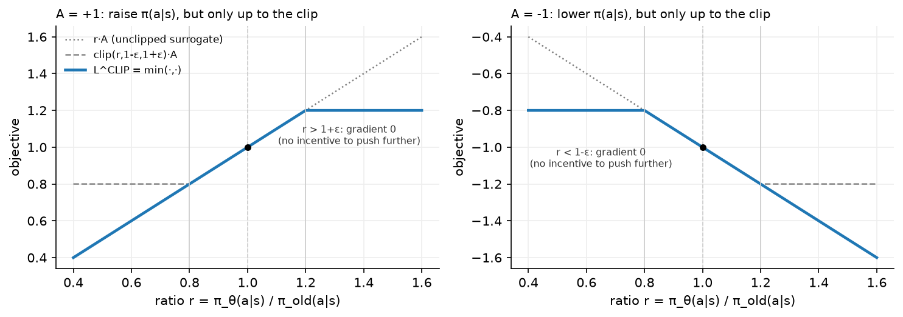
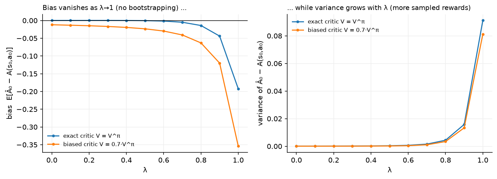

# Policy gradients, GAE and PPO

> **Why this matters at staff level.** PPO is the algorithm behind OpenAI Five, most
> continuous-control robotics results, and RLHF. Candidates who can only recite the clipped
> objective get found out by one follow-up: what does the gradient do when the ratio is
> outside the clip range, and why is that safe? This chapter derives everything from the
> log-derivative trick so that the clip, the value head, the advantage, the entropy bonus
> and the KL early-stop each have a reason. It also ends with the mapping from this
> notation to the RLHF notation in [Part VII](../part07-post-training/03-rlhf-ppo.md), so
> the LLM version costs you no new derivations.

## TL;DR, the interview card

* Score function estimator: $\nabla_\theta \E_{\tau\sim\pi_\theta}[R(\tau)] = \E[\nabla_\theta \log \pi_\theta(\tau) R(\tau)]$,
  which needs only samples and the ability to differentiate $\log\pi_\theta$.
* REINFORCE: $\nabla_\theta J = \E\big[\sum_t \nabla_\theta\log\pi_\theta(a_t|s_t)\,G_t\big]$
  with $G_t$ the reward-to-go. Rewards before $t$ do not belong in the gradient at $t$.
* Any baseline $b(s_t)$ subtracts without bias because
  $\E_{a\sim\pi}[\nabla_\theta\log\pi_\theta(a|s)] = \nabla_\theta\sum_a \pi_\theta(a|s) = \nabla_\theta 1 = 0$.
  The variance-minimising baseline is close to $V^\pi(s)$.
* Advantage $A^\pi(s,a) = Q^\pi(s,a) - V^\pi(s)$. Actor-critic uses a learned $V_\phi$ so
  the advantage is estimated from a one-step TD error $\delta_t$ instead of a full return.
* GAE: $\hat A_t^{\text{GAE}(\gamma,\lambda)} = \sum_{l\ge0}(\gamma\lambda)^l\delta_{t+l}$, the
  exponentially weighted average of all $n$-step advantages. $\lambda = 0$ is the one-step
  TD advantage (low variance, biased), $\lambda = 1$ is Monte Carlo (unbiased, high
  variance).
* PPO ratio $r_t(\theta) = \pi_\theta(a_t|s_t)/\pi_{\text{old}}(a_t|s_t)$; objective
  $L^{\text{CLIP}} = \E[\min(r_t\hat A_t, \mathrm{clip}(r_t,1-\epsilon,1+\epsilon)\hat A_t)]$.
* The $\min$ makes $L^{\text{CLIP}}$ a lower bound on the unclipped surrogate. Gradient is
  zero when $r_t$ has moved past the clip in the direction the advantage wants, and normal
  otherwise. Moving *back* toward $\pi_{\text{old}}$ is always allowed.
* Full loss: $L = -L^{\text{CLIP}} + c_v\,(V_\phi - R_t)^2 - c_e\,H[\pi_\theta]$, with
  advantage normalisation per batch, several epochs of minibatch SGD per rollout, and KL
  early-stopping as a safety net.
* Continuous control off-policy alternatives: DDPG (deterministic actor + critic), TD3
  (twin critics, delayed actor, target policy smoothing), SAC (stochastic actor, entropy in
  the objective, twin critics).

## 1. Intuition first

Q-learning answers "how good is this action?" and then acts greedily. Policy gradients skip
the middle step: parameterise $\pi_\theta(a|s)$ and push its parameters in whatever direction
increases expected return.

The mechanical question is how to differentiate an expectation whose *sampling
distribution* depends on $\theta$. You cannot push the gradient inside, because moving
$\theta$ moves which trajectories you see. The log-derivative trick handles it, and the
resulting rule is one sentence: **increase the log-probability of actions that led to
better-than-expected outcomes, in proportion to how much better**.

Three refinements turn that sentence into PPO, and each one removes a specific problem:

1. **Credit only the future.** An action at time $t$ cannot have caused reward at time
   $t-1$, so multiply $\nabla\log\pi(a_t|s_t)$ by the reward-to-go $G_t$ instead of the
   whole-episode return. This drops a term whose expectation is zero and whose variance is
   not.
2. **Compare against a baseline.** "Better than expected" needs an expectation. Subtract
   $V(s_t)$ and multiply by the advantage instead of the raw return. Zero bias, large
   variance reduction.
3. **Do not take a big step.** The gradient is valid only near $\pi_\theta$; take too large
   a step and the data you collected no longer describes the policy you now have. TRPO
   enforces this with a KL constraint, PPO with a clip.

{ width="820" }

Read the left panel. The advantage is positive, so you want to raise $\pi_\theta(a|s)$,
which means moving $r$ to the right. The objective rises until $r = 1+\epsilon$ and then
flattens: past that point there is no further gain, so no gradient, so no incentive to keep
pushing. Left of $1$, the objective still slopes, so if the policy has drifted too far down
it can come back. The right panel is the mirror image for a negative advantage.

## 2. The math

### 2.1 The objective and the score function estimator

A trajectory $\tau = (s_0,a_0,r_1,s_1,\ldots)$ has probability

$$
p_\theta(\tau) = \rho_0(s_0)\prod_{t\ge0}\pi_\theta(a_t|s_t)\,P(s_{t+1}|s_t,a_t),
$$

and the objective is $J(\theta) = \E_{\tau\sim p_\theta}[R(\tau)]$ with
$R(\tau) = \sum_t \gamma^t r_{t+1}$.

Differentiate, using the identity $\nabla_\theta p_\theta = p_\theta \nabla_\theta \log p_\theta$
(the log-derivative trick, also called the score function or REINFORCE trick):

$$
\begin{aligned}
\nabla_\theta J(\theta) &= \nabla_\theta \int p_\theta(\tau) R(\tau)\,d\tau\\
&= \int \nabla_\theta p_\theta(\tau)\, R(\tau)\,d\tau\\
&= \int p_\theta(\tau)\,\nabla_\theta \log p_\theta(\tau)\, R(\tau)\,d\tau\\
&= \E_{\tau\sim p_\theta}\big[\nabla_\theta \log p_\theta(\tau)\,R(\tau)\big].
\end{aligned}
$$

Now expand $\log p_\theta(\tau)$:

$$
\log p_\theta(\tau) = \log\rho_0(s_0) + \sum_t \log\pi_\theta(a_t|s_t) + \sum_t \log P(s_{t+1}|s_t,a_t).
$$

Neither $\rho_0$ nor $P$ depends on $\theta$, so both vanish under $\nabla_\theta$. The
dynamics disappear from the gradient, which is what makes this a model-free method:

$$
\boxed{\;\nabla_\theta J(\theta) = \E_{\tau\sim\pi_\theta}\Big[\Big(\sum_{t\ge0}\nabla_\theta \log\pi_\theta(a_t|s_t)\Big) R(\tau)\Big]\;}
$$

The estimator is unbiased and requires only that you can sample trajectories and evaluate
$\nabla_\theta\log\pi_\theta$. The price is variance: a single trajectory's return can be
far from its mean, and the estimator multiplies that noise by the score.

### 2.2 Reward-to-go

The form above multiplies every action's score by the whole return, including rewards
collected *before* the action. Those cannot be affected by it. Formally, for $t' < t$,

$$
\E\big[\nabla_\theta\log\pi_\theta(a_t|s_t)\, r_{t'+1}\big] = 0,
$$

because conditioned on everything up to $s_t$, the reward $r_{t'+1}$ is a constant and
$\E_{a_t\sim\pi_\theta}[\nabla_\theta\log\pi_\theta(a_t|s_t)] = 0$ (proved in §2.3). Dropping
those terms leaves the expectation unchanged and removes their variance:

$$
\boxed{\;\nabla_\theta J(\theta) = \E\Big[\sum_{t\ge0}\nabla_\theta\log\pi_\theta(a_t|s_t)\,G_t\Big],\qquad G_t = \sum_{k\ge0}\gamma^k r_{t+k+1}\;}
$$

This is REINFORCE (Williams, 1992).

### 2.3 Baselines: the proof that they are free

Claim: for any function $b$ that does not depend on the action,

$$
\E_{a\sim\pi_\theta(\cdot|s)}\big[\nabla_\theta \log\pi_\theta(a|s)\,b(s)\big] = 0.
$$

Proof, in three lines:

$$
\E_{a\sim\pi_\theta}\big[\nabla_\theta\log\pi_\theta(a|s)\big]
= \sum_a \pi_\theta(a|s)\frac{\nabla_\theta\pi_\theta(a|s)}{\pi_\theta(a|s)}
= \nabla_\theta \sum_a \pi_\theta(a|s)
= \nabla_\theta 1 = 0,
$$

and $b(s)$ pulls out of the expectation over $a$. The interchange of $\nabla_\theta$ and
$\sum_a$ is valid for finite action sets, and for continuous actions under standard
regularity conditions on $\pi_\theta$. The same proof is checked numerically in
`tests/test_rl_reinforce.py` by summing $\pi(a|s)\nabla_\theta\log\pi(a|s)$ over all four
actions of a small network and asserting the result is zero to $10^{-6}$.

So the estimator

$$
\nabla_\theta J = \E\Big[\sum_t \nabla_\theta\log\pi_\theta(a_t|s_t)\big(G_t - b(s_t)\big)\Big]
$$

is unbiased for any state-dependent $b$. Variance is a different story: writing
$g_t = \nabla_\theta\log\pi_\theta(a_t|s_t)$, the per-term variance is minimised at

$$
b^*(s) = \frac{\E[\,\norm{g_t}^2 G_t \mid s\,]}{\E[\,\norm{g_t}^2\mid s\,]},
$$

a norm-weighted average of the return. Everyone uses $b(s) = V^\pi(s)$ instead, which is
close, has an obvious interpretation, and is learnable by regression. With $b = V^\pi$ the
weight becomes $G_t - V^\pi(s_t)$, an estimate of the advantage $A^\pi(s_t,a_t)$.

The intuition for why this helps: in a task where all returns are between $+100$ and
$+102$, the raw REINFORCE weight is around $+101$ for every action, so every action's
log-probability is pushed up hard and the useful signal (the $\pm1$ differences) is buried
in the noise of the sampling. Subtracting $V \approx 101$ leaves exactly the differences.

!!! warning "A baseline that depends on the action is not a baseline"
    The proof requires $b$ to be independent of $a$ given $s$. Subtracting something like
    $Q_\phi(s,a)$ introduces bias, and bias in the policy gradient is the kind of bug that
    shows up as a policy that quietly converges to the wrong thing. Action-dependent
    baselines can be made unbiased with extra correction terms, and the empirical evidence
    that they help is weak.

### 2.4 Actor-critic

With $b = V_\phi$ learned by a critic, and the return replaced by a bootstrapped estimate,
you get the family of actor-critic methods. The one-step version uses

$$
\hat A_t = \delta_t = r_{t+1} + \gamma V_\phi(s_{t+1}) - V_\phi(s_t),
$$

which is the TD error from [chapter 2](02-classical-rl.md). Note what $\delta_t$ is an
estimate of:

$$
\E\big[\delta_t \mid s_t,a_t\big] = R(s_t,a_t) + \gamma\E[V^\pi(s_{t+1})] - V^\pi(s_t) = Q^\pi(s_t,a_t) - V^\pi(s_t) = A^\pi(s_t,a_t)
$$

when $V_\phi = V^\pi$. So the TD error is an unbiased estimate of the advantage given a
correct critic, and a biased one otherwise. Two losses, optimised together:

$$
L_{\text{actor}} = -\frac{1}{T}\sum_t \log\pi_\theta(a_t|s_t)\,\overline{\delta_t},
\qquad
L_{\text{critic}} = \frac{1}{T}\sum_t \delta_t^2,
$$

where the bar denotes a stopped gradient. The critic loss is a semi-gradient again: the
target $r + \gamma V_\phi(s')$ is treated as constant, exactly as in DQN.

The bias/variance position of one-step actor-critic is the opposite of REINFORCE. REINFORCE
is unbiased with the variance of a full return; one-step actor-critic has the variance of a
single transition and the bias of the critic. GAE is the dial between them.

### 2.5 Deriving GAE

Define the $n$-step advantage estimator, formed by taking $n$ real rewards and then
bootstrapping:

$$
\hat A_t^{(n)} = \underbrace{r_{t+1} + \gamma r_{t+2} + \cdots + \gamma^{n-1}r_{t+n} + \gamma^n V(s_{t+n})}_{n\text{-step return}} - V(s_t).
$$

Each of these is a valid advantage estimate with a different bias/variance profile:
$\hat A^{(1)} = \delta_t$ has the most bias and least variance, and
$\hat A^{(\infty)} = G_t - V(s_t)$ has no bias (given any $V$, since the bootstrap term
vanishes) and the most variance.

Now write $\hat A^{(n)}$ in terms of TD errors. Telescoping:

$$
\begin{aligned}
\hat A^{(1)}_t &= \delta_t\\
\hat A^{(2)}_t &= r_{t+1} + \gamma r_{t+2} + \gamma^2 V(s_{t+2}) - V(s_t) = \delta_t + \gamma\delta_{t+1}\\
\hat A^{(n)}_t &= \sum_{l=0}^{n-1}\gamma^l \delta_{t+l}.
\end{aligned}
$$

Check the second line by substituting $\delta_t = r_{t+1} + \gamma V(s_{t+1}) - V(s_t)$ and
$\gamma\delta_{t+1} = \gamma r_{t+2} + \gamma^2 V(s_{t+2}) - \gamma V(s_{t+1})$: the
$\gamma V(s_{t+1})$ terms cancel. Every $n$-step advantage is a discounted sum of TD errors,
and longer horizons just add more terms.

GAE takes the exponentially weighted average of all of them, with weight
$(1-\lambda)\lambda^{n-1}$ on $\hat A^{(n)}$:

$$
\begin{aligned}
\hat A^{\text{GAE}(\gamma,\lambda)}_t &= (1-\lambda)\sum_{n=1}^{\infty}\lambda^{n-1}\hat A^{(n)}_t\\
&= (1-\lambda)\Big[\delta_t + \lambda(\delta_t + \gamma\delta_{t+1}) + \lambda^2(\delta_t + \gamma\delta_{t+1} + \gamma^2\delta_{t+2}) + \cdots\Big]\\
&= (1-\lambda)\Big[\delta_t(1 + \lambda + \lambda^2 + \cdots) + \gamma\delta_{t+1}(\lambda + \lambda^2 + \cdots) + \cdots\Big]\\
&= (1-\lambda)\Big[\delta_t\frac{1}{1-\lambda} + \gamma\delta_{t+1}\frac{\lambda}{1-\lambda} + \gamma^2\delta_{t+2}\frac{\lambda^2}{1-\lambda} + \cdots\Big],
\end{aligned}
$$

giving

$$
\boxed{\;\hat A^{\text{GAE}(\gamma,\lambda)}_t = \sum_{l=0}^{\infty}(\gamma\lambda)^l\,\delta_{t+l}\;}
$$

The third line is where the work happens: collect the coefficient of each $\delta_{t+l}$
across all the $n$-step terms that contain it, which is a geometric series in $\lambda$.

Two sanity checks that are worth doing out loud in an interview. $\lambda = 0$ gives
$\hat A_t = \delta_t$, the one-step actor-critic advantage. $\lambda = 1$ gives
$\sum_l \gamma^l \delta_{t+l}$, which telescopes to $G_t - V(s_t)$, the Monte Carlo
advantage. So $\lambda$ interpolates exactly as $\lambda$ in TD($\lambda$) does, and for
the same reason.

The recursive form used in code follows immediately:

$$
\hat A_t = \delta_t + \gamma\lambda\,\hat A_{t+1},
$$

computed backwards along the trajectory, with $\hat A_{T} = 0$ past the end of an episode.

{ width="820" }

The figure measures both panels against the true advantage $Q^\pi(s_0,a_0) - V^\pi(s_0)$
computed by dynamic programming. With an exact critic, bias is zero for every $\lambda$ and
only variance moves. With a biased critic ($0.7V^\pi$), the bias shrinks toward zero as
$\lambda \to 1$, because bootstrapping is what lets the critic's error in, and variance
climbs. Typical settings are $\lambda \in [0.9, 0.97]$, which sit where the two curves
cross over.

### 2.6 Why you cannot just take a big step: TRPO in one page

Policy gradient gives you a direction. It does not tell you how far to go, and the usual
answer (a learning rate) is bad here for a reason specific to RL: the data was sampled from
$\pi_{\text{old}}$, and once $\pi_\theta$ moves far from it, the sampled advantages no
longer describe the new policy's behaviour. A too-large step can collapse the policy into a
degenerate one from which the gradient cannot recover, because the actions needed to escape
are no longer sampled.

TRPO starts from a surrogate objective. Define

$$
L_{\pi_{\text{old}}}(\pi_\theta) = \E_{s\sim d^{\pi_{\text{old}}},\,a\sim\pi_{\text{old}}}\Big[\frac{\pi_\theta(a|s)}{\pi_{\text{old}}(a|s)}A^{\pi_{\text{old}}}(s,a)\Big],
$$

which is an importance-sampled estimate of the improvement, computable from
$\pi_{\text{old}}$'s data. There is a bound of the form

$$
J(\pi_\theta) \ge L_{\pi_{\text{old}}}(\pi_\theta) - C\cdot \max_s \KL\big(\pi_{\text{old}}(\cdot|s)\,\|\,\pi_\theta(\cdot|s)\big),
$$

so improving the surrogate while keeping the KL small guarantees improvement of the true
objective. Using the penalty coefficient $C$ from the theory gives steps that are far too
small, so TRPO instead solves a constrained problem,

$$
\max_\theta L_{\pi_{\text{old}}}(\pi_\theta)
\quad\text{subject to}\quad
\bar{\KL}(\pi_{\text{old}}\,\|\,\pi_\theta) \le \delta,
$$

by linearising the objective, taking a quadratic approximation of the KL (whose Hessian is
the Fisher information matrix $F$), and stepping along the **natural gradient** direction
$F^{-1}\nabla_\theta L$ with a step size set by the constraint, followed by a backtracking
line search to guarantee improvement. $F^{-1}g$ is computed by conjugate gradient with
Hessian-vector products, so $F$ is never formed.

The natural gradient's appeal is that it measures distance in distribution space rather
than parameter space: a fixed step in KL means the same change in behaviour regardless of
how the policy is parameterised. Its cost is the conjugate gradient solve inside every
update, plus the line search, plus a second-order code path.

PPO is the observation that you can get most of the benefit with a first-order method by
building the constraint into the objective itself.

### 2.7 PPO's clipped objective

Let $r_t(\theta) = \dfrac{\pi_\theta(a_t|s_t)}{\pi_{\text{old}}(a_t|s_t)}$, so
$r_t(\theta_{\text{old}}) = 1$. The clipped surrogate is

$$
\boxed{\;L^{\text{CLIP}}(\theta) = \E_t\Big[\min\big(r_t(\theta)\hat A_t,\;\mathrm{clip}(r_t(\theta), 1-\epsilon, 1+\epsilon)\hat A_t\big)\Big]\;}
$$

with $\epsilon$ typically 0.1 or 0.2.

**Why the $\min$ makes this a pessimistic bound.** The unclipped term $r_t\hat A_t$ is the
importance-sampled surrogate from TRPO. The clipped term equals it inside
$[1-\epsilon,1+\epsilon]$ and is constant outside. Taking the minimum of the two means the
objective never exceeds the unclipped surrogate, so $L^{\text{CLIP}} \le L^{\text{IS}}$
pointwise, which is what "pessimistic lower bound" means here. Optimising a lower bound on
the improvement cannot promise the improvement, and it does remove the incentive to exploit
large ratios where the estimate is least trustworthy.

**What the gradient does, region by region.** Take a single sample and differentiate with
respect to $\log\pi_\theta(a_t|s_t)$, noting $\partial r_t/\partial \log\pi_\theta = r_t$:

| Case | $r_t$ | Which branch the $\min$ picks | $\partial L^{\text{CLIP}}/\partial\log\pi_\theta$ |
|---|---|---|---|
| $\hat A_t > 0$ | $r_t < 1-\epsilon$ | unclipped ($r_t\hat A_t$ is smaller) | $r_t\hat A_t > 0$: push probability up |
| $\hat A_t > 0$ | $1-\epsilon \le r_t \le 1+\epsilon$ | both equal | $r_t \hat A_t > 0$: push up |
| $\hat A_t > 0$ | $r_t > 1+\epsilon$ | clipped (constant) | $0$: stop pushing |
| $\hat A_t < 0$ | $r_t > 1+\epsilon$ | unclipped (more negative) | $r_t\hat A_t < 0$: push probability down |
| $\hat A_t < 0$ | $1-\epsilon \le r_t \le 1+\epsilon$ | both equal | $r_t\hat A_t < 0$: push down |
| $\hat A_t < 0$ | $r_t < 1-\epsilon$ | clipped (constant) | $0$: stop pushing |

Read the pattern: the gradient vanishes only when the ratio has already moved past the clip
boundary **in the direction the advantage wants**. If the ratio has moved the wrong way
(for instance $r_t < 1-\epsilon$ with a positive advantage, meaning a good action's
probability has fallen), the gradient is live and pulls it back. That asymmetry is why the
$\min$ is there and why plain clipping without the $\min$ would be wrong: clipping alone
would also kill the gradient for ratios that have drifted the wrong way, leaving the policy
stuck.

The exact gradient values are pinned down in `tests/test_rl_ppo.py`. With $\epsilon = 0.2$,
$\hat A = 2$ and $r = 1$, the gradient of the loss with respect to $\log\pi$ is $-2$ (the
loss is the negative objective); at $r = 1.5$ it is exactly $0$; at $r = 0.5$ it is $-1.0$,
which is $-r\hat A$.

**What the clip does not do.** It does not bound the KL divergence between $\pi_\theta$ and
$\pi_{\text{old}}$. A ratio can stay inside $[1-\epsilon,1+\epsilon]$ for the sampled
actions while the policy changes a lot on actions that were not sampled, and successive
minibatch epochs can compound small moves. This is why implementations also track an
approximate KL and stop early. Say this when asked whether PPO "enforces a trust region":
the clip is a heuristic that usually keeps updates small, with no guarantee.

### 2.8 The rest of the PPO loss

$$
L(\theta,\phi) = \underbrace{-L^{\text{CLIP}}(\theta)}_{\text{policy}} + \underbrace{c_v\,\E_t\big[(V_\phi(s_t) - R_t)^2\big]}_{\text{value}} - \underbrace{c_e\,\E_t\big[H[\pi_\theta(\cdot|s_t)]\big]}_{\text{entropy bonus}}
$$

* **Value target** $R_t = \hat A_t + V_{\text{old}}(s_t)$, the GAE return. Using the GAE
  return instead of the raw Monte Carlo return keeps the value target consistent with the
  advantage estimate. $c_v$ is usually 0.5 (or 1.0 when the networks are separate).
* **Entropy bonus** with $c_e$ around 0.01 (0 for many continuous-control tasks). It keeps
  the policy from collapsing to a deterministic one early, which would end exploration. In
  RLHF it is usually dropped, since the KL penalty to the reference policy plays a similar
  role.
* **Advantage normalisation**: subtract the batch mean and divide by the batch standard
  deviation before computing the loss. This makes the effective step size independent of
  the reward scale. It introduces a small bias (the normalisation constants are computed
  from the same batch) that is universally accepted.
* **Multiple epochs of minibatch SGD** over one rollout, typically 4 to 10 epochs with
  minibatches of 64 to 4096. This is where PPO's sample efficiency over vanilla policy
  gradient comes from, and it is only safe because the clip limits how far $\pi_\theta$ can
  drift from the $\pi_{\text{old}}$ that generated the data. At the first minibatch of the
  first epoch, every $r_t = 1$ exactly, which is a useful debugging check.
* **KL early stopping**: compute an approximate $\KL(\pi_{\text{old}}\|\pi_\theta)$ after
  each epoch and break out if it exceeds a target (0.01 to 0.05). The estimator used in
  practice is $\E[e^{\log r} - 1 - \log r]$, which is non-negative and lower-variance than
  $\E[-\log r]$.
* **Gradient clipping** by global norm (0.5 is standard).

### 2.9 The 37 implementation details, for literacy

Huang et al. catalogued 37 details that separate a working PPO from a paper-faithful one
that does not reproduce. The ones worth knowing by name:

| Detail | Why it exists |
|---|---|
| Vectorised environments with $N$ parallel copies | Decorrelates the on-policy batch, since one long trajectory is highly correlated |
| Observation normalisation with a running mean and variance | Networks train poorly on unnormalised inputs, and the input scale drifts during training |
| Reward scaling by a running estimate of the return's standard deviation | Keeps the value targets in a learnable range |
| Orthogonal initialisation, policy head scaled by 0.01 | Starts the policy near-uniform, so early logits do not saturate |
| Adam epsilon $10^{-5}$ | The PyTorch default of $10^{-8}$ interacts badly with small gradients here |
| Learning-rate annealing to zero | Late large steps undo late fine-tuning |
| Value-function loss clipping | Mirrors the policy clip; the paper's ablations find it has little effect |
| Separate or shared network trunk | Sharing saves compute and couples the two loss scales |
| Bootstrapping on time-limit truncation | A truncated episode is not a terminal state |
| Advantage normalisation at the minibatch level | See §2.8 |

The general lesson worth stating: published RL results depend on implementation choices
that are not in the algorithm box, and reproducing a number requires reproducing the
codebase. This is also why "PPO" in one library and "PPO" in another can differ by a wide
margin on the same task.

### 2.10 Off-policy continuous control: DDPG, TD3, SAC

DQN cannot be applied to continuous actions because $\max_{a'}Q(s',a')$ has no closed form.
The deterministic policy gradient family replaces the max with a learned actor.

**DDPG** learns a deterministic actor $\mu_\theta(s)$ and a critic $Q_\phi(s,a)$, with the
actor trained by gradient ascent through the critic:

$$
\nabla_\theta J \approx \E_s\big[\nabla_a Q_\phi(s,a)\big|_{a=\mu_\theta(s)}\,\nabla_\theta\mu_\theta(s)\big],
$$

target networks updated by Polyak averaging, exploration by adding noise to the action.
It is sample-efficient and notoriously brittle.

**TD3** adds three fixes to DDPG's failure modes: twin critics with
$\min(Q_{\phi_1}, Q_{\phi_2})$ in the target (which counteracts over-estimation by being
deliberately pessimistic), delayed actor updates (one actor update per two critic updates,
so the actor chases a more settled critic), and target policy smoothing (noise added to the
target action, so the critic cannot exploit a narrow peak).

**SAC** optimises the maximum-entropy objective

$$
J(\pi) = \E\Big[\sum_t \gamma^t\big(r_{t+1} + \alpha\,H[\pi(\cdot|s_t)]\big)\Big],
$$

with a stochastic actor, twin critics, and a temperature $\alpha$ that is usually tuned
automatically against a target entropy. The entropy term is inside the value function, so
the soft value is
$V(s) = \E_{a\sim\pi}[Q(s,a) - \alpha\log\pi(a|s)]$. Adding entropy to the objective keeps
exploration alive throughout training and makes the policy robust to model error, since it
prefers regions where several actions are acceptable. SAC is the default for continuous
control today: off-policy (so it reuses data), stochastic (so it explores), and not very
sensitive to hyperparameters.

| | DDPG | TD3 | SAC | PPO |
|---|---|---|---|---|
| Policy | deterministic | deterministic | stochastic | stochastic |
| On/off-policy | off | off | off | on |
| Critics | 1 | 2 (min) | 2 (min) | 1 (state value) |
| Exploration | action noise | action noise | entropy term | entropy bonus, stochastic policy |
| Sample efficiency | high | high | high | low |
| Robustness to hyperparameters | low | medium | high | high |
| Parallelises to thousands of workers | awkward | awkward | awkward | naturally |

The last row is why PPO dominates large-scale settings despite being the least
sample-efficient: when you can generate cheap parallel rollouts, throughput beats sample
efficiency, and PPO's on-policy data pipeline is simple to shard.

### 2.11 Offline RL, in one paragraph

Offline (batch) RL learns from a fixed dataset with no interaction. The failure mode is
distribution shift: the learned policy proposes actions the dataset does not contain, the
critic has no data there, and the bootstrapped $\max$ or actor-maximisation exploits the
critic's extrapolation error. Two standard responses. **CQL** adds a penalty to the critic
loss that pushes down Q-values for out-of-distribution actions while pushing up values for
dataset actions, so the learned $Q$ lower-bounds the true value. **IQL** avoids querying
unseen actions at all: it fits an expectile regression to the dataset's own Q-values to
approximate a max over *in-support* actions, then extracts a policy by advantage-weighted
regression. Both connect directly to imitation learning
([chapter 5](05-imitation-learning.md)): when the dataset is expert data and you apply
enough pessimism, offline RL degrades gracefully toward behavioural cloning.

## 3. Implementation

Four algorithms, built in order, each reusing the previous one's parts.

### 3.1 REINFORCE

```python title="src/mlbook/rl/reinforce.py (excerpt)"
def rewards_to_go(rewards: np.ndarray, gamma: float) -> np.ndarray:
    """``G_t = sum_{k>=0} gamma^k r_{t+k+1}``; (T,) -> (T,)."""
    G = np.zeros(len(rewards), dtype=np.float32)  # (T,)
    running = 0.0
    for t in reversed(range(len(rewards))):
        running = rewards[t] + gamma * running
        G[t] = running
    return G


def reinforce_loss(logp, returns, baseline=None):
    """``-(1/T) sum_t logp_t * (G_t - b_t)``; minimising it ascends ``J``."""
    weights = returns if baseline is None else returns - baseline  # (T,)
    return -(logp * weights.detach()).mean()
```

The loss is the negative of the objective because optimisers minimise. The `.detach()` on
the weights is the line to get right: $G_t$ and $b(s_t)$ are numbers, not functions of
$\theta$ for gradient purposes. Autograd differentiating through the return would be
meaningless (it came from the environment) and differentiating through a learned baseline
would inject the bias §2.3 warns about.

The backward pass of `-(logp * weights).mean()` produces exactly
$-\frac{1}{T}\sum_t \nabla_\theta\log\pi_\theta(a_t|s_t)\,w_t$, which is the estimator from
§2.2. This is the general trick for implementing score-function estimators: write a
"surrogate loss" whose gradient is the estimator you derived, not whose value means
anything.

### 3.2 Actor-critic

```python title="src/mlbook/rl/actor_critic.py (excerpt)"
def actor_critic_losses(actor, critic, obs, actions, rewards, next_obs, dones, gamma):
    v = critic(obs)  # (T,)
    with torch.no_grad():
        v_next = critic(next_obs)  # (T,)
        target = rewards + gamma * (1.0 - dones) * v_next  # (T,) TD target
    delta = target - v  # (T,) TD error; gradient flows into v only
    logp = Categorical(logits=actor(obs)).log_prob(actions)  # (T,)
    actor_loss = -(logp * delta.detach()).mean()
    critic_loss = (delta**2).mean()
    return actor_loss, critic_loss
```

`delta` is used twice with different gradient treatment: detached in the actor loss (it is
a weight), attached in the critic loss (it is a residual). Writing this in one expression
and reusing it is both efficient and a place where a missing `.detach()` silently changes
the algorithm, so the test checks the critic's bias gradient equals $-2\bar\delta$, which
is the semi-gradient value.

### 3.3 GAE

```python title="src/mlbook/rl/gae.py (excerpt)"
def compute_gae(rewards, values, dones, last_value, gamma, lam):
    """Backward recursion ``A_t = delta_t + gamma lambda (1 - d_t) A_{t+1}``."""
    T = rewards.shape[0]
    adv = np.zeros(T, dtype=np.float64)  # (T,)
    next_adv, next_value = 0.0, last_value
    for t in reversed(range(T)):
        nonterminal = 1.0 - dones[t]
        delta = rewards[t] + gamma * nonterminal * next_value - values[t]  # TD error
        next_adv = delta + gamma * lam * nonterminal * next_adv
        adv[t] = next_adv
        next_value = values[t]
    return adv, adv + values
```

Nine lines for the boxed equation in §2.5. Three details:

* The loop runs backwards, because $\hat A_t$ depends on $\hat A_{t+1}$.
* `nonterminal` appears twice: once to zero the bootstrap $V(s_{t+1})$ at an episode end,
  and once to stop the advantage recursion from carrying credit across the episode
  boundary. Forgetting the second one is a real bug that leaks advantage from one episode
  into the previous one, and it only shows up as slightly worse performance.
* `last_value` bootstraps a rollout that was cut mid-episode, which is what makes
  fixed-length rollouts possible at all.

The returned `adv + values` is the value target $R_t = \hat A_t + V(s_t)$ from §2.8.

### 3.4 PPO

```python title="src/mlbook/rl/ppo.py (excerpt)"
def ppo_clip_loss(logp_new, logp_old, adv, clip_eps):
    """``-E[min(r A, clip(r, 1-eps, 1+eps) A)]`` with ``r = exp(logp_new - logp_old)``."""
    ratio = torch.exp(logp_new - logp_old)  # (B,) importance ratio, = 1 at the first epoch
    unclipped = ratio * adv  # (B,)
    clipped = torch.clamp(ratio, 1.0 - clip_eps, 1.0 + clip_eps) * adv  # (B,)
    return -torch.min(unclipped, clipped).mean()
```

The ratio is computed as `exp(logp_new - logp_old)` instead of dividing probabilities, for
numerical reasons: log-probabilities of long action sequences underflow, and the difference
is well-conditioned.

The update loop, with the pieces from §2.8:

```python title="src/mlbook/rl/ppo.py (excerpt)"
def ppo_update(actor, critic, opt, buf, last_value, cfg):
    adv_np, ret_np = compute_gae(buf.rewards, buf.values, buf.dones, last_value, cfg.gamma, cfg.lam)
    obs = torch.from_numpy(buf.obs)  # (N, obs_dim)
    actions = torch.from_numpy(buf.actions)  # (N,)
    logp_old = torch.from_numpy(buf.logp)  # (N,)
    adv = torch.from_numpy(adv_np).float()  # (N,)
    returns = torch.from_numpy(ret_np).float()  # (N,)
    if cfg.normalise_adv:
        adv = (adv - adv.mean()) / (adv.std() + 1e-8)
    N = obs.shape[0]
    for epoch in range(cfg.n_epochs):
        perm = torch.randperm(N)  # (N,) fresh shuffle every epoch
        for start in range(0, N, cfg.minibatch_size):
            idx = perm[start : start + cfg.minibatch_size]  # (B,)
            dist = Categorical(logits=actor(obs[idx]))
            logp_new = dist.log_prob(actions[idx])  # (B,)
            policy_loss = ppo_clip_loss(logp_new, logp_old[idx], adv[idx], cfg.clip_eps)
            value_loss = ppo_value_loss(critic(obs[idx]), returns[idx])
            entropy = dist.entropy().mean()
            loss = policy_loss + cfg.value_coef * value_loss - cfg.entropy_coef * entropy
            opt.zero_grad()
            loss.backward()
            nn.utils.clip_grad_norm_(list(actor.parameters()) + list(critic.parameters()), cfg.max_grad_norm)
            opt.step()
            with torch.no_grad():
                log_ratio = logp_new - logp_old[idx]  # (B,)
                stats["approx_kl"] = float((torch.exp(log_ratio) - 1.0 - log_ratio).mean())  # k3 estimator
        if cfg.target_kl is not None and stats["approx_kl"] > cfg.target_kl:
            break  # KL early stopping
```

The structure to memorise: collect a fixed-length rollout with $\pi_{\text{old}}$, compute
advantages once for the whole batch, then loop epochs, shuffle, and take minibatch steps.
`logp_old` is stored during collection and never recomputed, which is what makes
$\pi_{\text{old}}$ well defined. The `k3` KL estimator $\E[e^{x} - 1 - x]$ with
$x = \log r$ is non-negative sample-wise and has lower variance than $-\E[\log r]$.

Rollout collection stores $\log\pi_{\text{old}}(a_t|s_t)$ and $V_{\text{old}}(s_t)$ at
acting time:

```python title="src/mlbook/rl/ppo.py (excerpt)"
a, logp = sample_action(actor, obs, rng)  # a ~ pi_old, logp = log pi_old(a|s)
with torch.no_grad():
    v = float(critic(torch.from_numpy(obs).unsqueeze(0)).item())  # V_old(s)
next_obs, r, done = env.step(a, rng)
buf.add(obs, a, logp, r, v, done)
```

??? example "Full implementations"
    ```python
    --8<-- "src/mlbook/rl/gae.py"
    ```

    ```python
    --8<-- "src/mlbook/rl/ppo.py"
    ```

### 3.5 How you'd test it

The GAE tests are the most valuable in this part, because GAE is easy to write in a way
that is subtly wrong and still trains.

* **$\lambda = 0$ equals the one-step advantage**, checked against an independent
  `n_step_advantage` implementation.
* **$\lambda = 1$ equals $G_t - V(s_t)$**, with $G$ computed directly.
* **GAE equals the $\lambda$-weighted mixture of $n$-step advantages**, computed
  explicitly with the per-$t$ truncation weights. This is the boxed derivation in §2.5,
  tested numerically.
* **Episode boundaries and truncation**: a four-step buffer with a `done` in the middle,
  hand-computed expected advantages, asserting the recursion resets at the boundary and
  bootstraps from `last_value` at the truncated end.

For PPO, the clip gradients are checked at five points (inside the clip, outside in each
direction, for both advantage signs), which is the table in §2.7 turned into assertions.
`test_ppo_clip_loss_is_pessimistic_bound` checks $L^{\text{CLIP}} \ge$ the unclipped
surrogate on random inputs. The end-to-end test trains on the gridworld for 10 iterations
(about two seconds) and requires the mean return over the last 20 episodes to beat the
first 10 by a margin.

```bash
pytest tests/test_rl_gae.py tests/test_rl_ppo.py -q
pytest tests/test_rl_reinforce.py tests/test_rl_actor_critic.py -q
```

## Retype by hand

| Reproduce from memory | File | Target time |
|---|---|---|
| `rewards_to_go` | `src/mlbook/rl/reinforce.py` | 3 min |
| `reinforce_loss` (with the detach) | `src/mlbook/rl/reinforce.py` | 4 min |
| `actor_critic_losses` | `src/mlbook/rl/actor_critic.py` | 10 min |
| `compute_gae` | `src/mlbook/rl/gae.py` | 10 min |
| `ppo_clip_loss` | `src/mlbook/rl/ppo.py` | 5 min |
| `ppo_update` (epochs, shuffle, minibatch, normalise, KL stop) | `src/mlbook/rl/ppo.py` | 25 min |
| `RolloutBuffer` and `collect_rollout` | `src/mlbook/rl/ppo.py` | 12 min |

**Fine to just read**: `PolicyNetwork`, `Actor`, `Critic` (three-line MLPs),
`sample_action`, `train_ppo`, `PPOConfig`, `n_step_advantage` (it exists to test
`compute_gae`).

```bash
pytest tests/test_rl_reinforce.py -q        # rewards_to_go, reinforce_loss, baseline identity
pytest tests/test_rl_actor_critic.py -q     # actor_critic_losses
pytest tests/test_rl_gae.py -q              # compute_gae, under 1 s
pytest tests/test_rl_ppo.py -q              # ppo_clip_loss, ppo_update, RolloutBuffer
pytest tests/test_rl_ppo.py -k clip -q      # just the clip gradient table
```

The 25 minutes for `ppo_update` is the single highest-value drill in this part. If you can
write it from memory with the advantage normalisation, the epoch loop and the KL check in
the right places, you can answer RLHF implementation questions without preparing separately.

## 4. Systems view: cost, failure modes, trade-offs

### The shape of a PPO system

One PPO iteration is: collect $N$ steps across $E$ parallel environments, compute GAE, then
$K$ epochs of minibatch SGD over those $N$ samples. The knobs and their effects:

| Knob | Typical | Effect of increasing |
|---|---|---|
| $N$ (rollout length x envs) | $2048$ to $10^6$ | Lower gradient variance, more staleness within the batch |
| $K$ (epochs) | 3 to 10 | More reuse per sample, more drift from $\pi_{\text{old}}$, more clipping |
| minibatch size | 64 to 4096 | Fewer, better-conditioned steps per epoch |
| $\epsilon$ (clip) | 0.1 to 0.3 | Larger policy steps per iteration, more risk of collapse |
| $\lambda$ | 0.9 to 0.97 | Less critic bias, more advantage variance |
| $\gamma$ | 0.99 | Longer effective horizon, more variance, slower credit assignment |

The distributed pattern is straightforward compared to off-policy methods: rollout workers
run the current policy and ship $(s,a,\log\pi_{\text{old}},r,V,\text{done})$ to a learner,
the learner performs the update and broadcasts new weights. There is a synchronisation
barrier per iteration, and workers idle while the learner updates. Systems that care about
this overlap collection and learning, which makes the data slightly off-policy, and the
clip absorbs a small amount of that.

Memory for RLHF-scale PPO is dominated by the four models held at once (policy, value,
reference and reward), which is one of the main arguments for DPO and GRPO in
[Part VII](../part07-post-training/04-dpo-and-friends.md).

### When to use what

| Situation | Use | Decision rule |
|---|---|---|
| Cheap parallel simulation, discrete or continuous actions | PPO | Throughput beats sample efficiency; PPO is robust and shards well |
| Expensive real-world interaction, continuous actions | SAC | Off-policy reuse plus entropy-driven exploration |
| Deterministic actions and a tight compute budget | TD3 | Cheaper than SAC, needs more tuning |
| Fixed dataset, no interaction | IQL or CQL | Pessimism about unseen actions is mandatory |
| Very large discrete action space (millions of items) | REINFORCE with off-policy correction | Even storing $Q(s,\cdot)$ is infeasible; see the YouTube case study |
| LLM fine-tuning from a reward model | PPO or GRPO | See [Part VII](../part07-post-training/03-rlhf-ppo.md) and the mapping table below |

### Failure modes

* **Entropy collapse.** The policy becomes deterministic early, exploration stops, and
  returns plateau. Watch the entropy curve; if it falls fast in the first few iterations,
  raise the entropy coefficient or lower the learning rate.
* **Value loss dominating.** With a shared trunk and an unscaled value loss, the value
  gradient can swamp the policy gradient. Symptom: good value predictions, a policy that
  barely moves. Tune $c_v$, or use separate networks.
* **Advantage normalisation hiding a broken critic.** Normalising makes any advantage
  vector look reasonable. Log the raw explained variance of the critic,
  $1 - \mathrm{Var}[R - V]/\mathrm{Var}[R]$; below about 0.3 means the critic is not
  helping and your advantages are mostly noise.
* **Clip fraction at the extremes.** A clip fraction near zero means the updates are tiny
  (raise the learning rate or epochs); consistently above about 0.3 means the policy is
  fighting the clip every step (lower the learning rate, epochs, or $\epsilon$).
* **Reward scale drift.** Unbounded rewards make value targets drift, which destabilises
  the critic. Use running reward normalisation.
* **Stale $\log\pi_{\text{old}}$.** Recomputing the old log-probabilities from the current
  network instead of storing them at collection time makes every ratio 1, which silently
  turns PPO into vanilla policy gradient with extra steps.

## 5. In production

!!! production "OpenAI: OpenAI Five, PPO at a scale nobody had tried"
    OpenAI Five trained with PPO on Dota 2, playing the equivalent of 180 years of games
    per day against itself and consuming, by the published figure, 770 petaflop/s-days over
    ten months before defeating the world champions. The design points that made PPO the
    right choice: a huge structured action space, partial observability (each hero sees a
    fraction of the map), a required stochastic policy in a competitive game, and cheap
    parallel simulation. They also reported *surgery*, changing the model and environment
    mid-run without restarting, which is a practical consequence of on-policy training with
    a robust objective.
    [OpenAI Five](https://openai.com/index/openai-five/),
    [OpenAI Five defeats Dota 2 world champions](https://openai.com/index/openai-five-defeats-dota-2-world-champions/),
    [Dota 2 with Large Scale Deep Reinforcement Learning](https://cdn.openai.com/dota-2.pdf)

!!! production "OpenAI: Rubik's cube, PPO plus domain randomisation for sim-to-real"
    A robot hand trained entirely in simulation solved a Rubik's cube in the physical world
    roughly 60% of the time (20% for a maximally difficult scramble), using PPO with
    Automatic Domain Randomisation, which grows the distribution of simulated physics
    parameters as the policy improves. The RL framing to take away: the policy is trained
    on a *distribution* of MDPs instead of one, so the entropy and stochasticity of the
    policy become tools for robustness. Reported success rates come from the blog post and
    paper, and they are the kind of number worth quoting exactly rather than rounding up.
    [Solving Rubik's Cube with a robot hand (OpenAI)](https://openai.com/index/solving-rubiks-cube/),
    [arXiv:1910.07113](https://arxiv.org/abs/1910.07113)

!!! production "YouTube: REINFORCE at a million actions with off-policy correction"
    Chen et al. deployed a REINFORCE-based recommender with an action space of millions of
    videos, and the paper is a catalogue of what policy gradients cost in production. The
    data is logged from a mixture of earlier policies, so they apply an importance-weight
    correction with a learned behaviour policy estimate; the system recommends a slate, so
    they derive a top-$K$ correction to the gradient; and the variance of the importance
    weights is controlled by clipping. Live experiments on YouTube showed gains over the
    previous system.
    [Top-K Off-Policy Correction for a REINFORCE Recommender System (arXiv:1812.02353)](https://arxiv.org/abs/1812.02353)

!!! production "Huang et al.: the 37 details, and why your PPO does not match the paper"
    An ICLR blog-track post that reproduces PPO's published results by enumerating the
    implementation choices, then verifies them with matched experiments across Atari,
    MuJoCo and continuous-control tasks. Treat it as the reference for how much of a
    published RL result lives outside the algorithm description. It is also the most useful
    single link to hand a colleague who is debugging a PPO implementation.
    [The 37 Implementation Details of Proximal Policy Optimization (ICLR Blog Track, 2022)](https://iclr-blog-track.github.io/2022/03/25/ppo-implementation-details/)

### Then revisit PPO from the RLHF perspective

Everything above transfers to language-model fine-tuning with one substitution table. When
[Part VII](../part07-post-training/03-rlhf-ppo.md) writes the RLHF objective, these are the
same symbols you have been deriving:

| This chapter (environments) | RLHF for language models | Note |
|---|---|---|
| State $s_t$ | Prompt plus the tokens generated so far | The state grows by one token per step; the "environment" is the concatenation |
| Action $a_t$ | The next token | Action space is the vocabulary, $\|\mathcal{V}\| \approx 10^5$ |
| Policy $\pi_\theta(a_t \mid s_t)$ | The LM's next-token distribution | The policy *is* the model; no separate actor network |
| Transition $P(s_{t+1}\mid s_t,a_t)$ | Deterministic append | No environment stochasticity at all, which removes one variance source |
| Reward $r_t$ | Zero for every token except the last | The reward model scores the complete response |
| Terminal state | EOS token or the length limit | Truncation handling matters, as in §2.8 |
| $\gamma$ | Usually 1 | Sequences are short and the reward is terminal, so discounting adds little |
| $\lambda$ (GAE) | 0.95 typically | Same bias/variance dial, same recursion |
| Value function $V_\phi(s_t)$ | A scalar head on the transformer, per token position | Predicts the eventual sequence reward from a prefix |
| Advantage $\hat A_t$ | GAE over token positions | With a terminal-only reward, this spreads the final score over tokens |
| $\pi_{\text{old}}$ | The policy at the start of the current PPO iteration | Log-probs stored at generation time, exactly as in `collect_rollout` |
| Reference policy $\pi_{\text{ref}}$ | The frozen SFT model | New in RLHF; has no analogue in this chapter |
| KL penalty $-\beta\KL(\pi_\theta\|\pi_{\text{ref}})$ | Added to the reward per token | Stops the policy drifting off-distribution and gaming the reward model |
| Clip $\epsilon$ | 0.2 | Same objective, same gradient behaviour |
| Entropy bonus | Usually dropped | The KL penalty already restrains collapse |

Two differences change the engineering rather than the math. The reward comes from a
*learned* model, so optimising it hard moves you off the distribution where that model was
accurate, which is what the KL penalty to $\pi_{\text{ref}}$ exists to prevent
([reward models](../part07-post-training/02-reward-models.md)). And the environment is
deterministic, so all the variance in the gradient comes from sampling tokens, which is
what makes group-relative methods like GRPO viable: with several samples per prompt, you
can use the group's mean reward as the baseline and drop the value network entirely
([Reasoning RL, RLVR and GRPO](../part07-post-training/05-reasoning-rl-grpo.md)).

## 6. Interview questions and strong answers

!!! interview "Derive the policy gradient."
    $J(\theta) = \E_{\tau\sim p_\theta}[R(\tau)]$. Push the gradient inside the integral,
    multiply and divide by $p_\theta$ to get
    $\nabla p_\theta = p_\theta\nabla\log p_\theta$, and you have
    $\nabla J = \E[\nabla\log p_\theta(\tau)R(\tau)]$. Expand $\log p_\theta(\tau)$ into the
    initial-state term, the sum of $\log\pi_\theta$, and the sum of $\log P$; the first and
    third do not depend on $\theta$ and drop out, which is why you never need the dynamics.
    Then two refinements: replace $R(\tau)$ with the reward-to-go $G_t$ (the earlier rewards
    contribute zero in expectation) and subtract a state-dependent baseline (also zero in
    expectation), giving $\E[\sum_t\nabla\log\pi_\theta(a_t|s_t)(G_t - V(s_t))]$.

    **Staff-level follow-up: why can we not just backpropagate through the environment?**
    Because $P$ is unknown and generally not differentiable. If you *do* have a
    differentiable simulator, you can use the reparameterisation (pathwise) gradient, which
    has much lower variance. That is what makes differentiable physics attractive and why
    the score function estimator is the fallback when the environment is a black box.

!!! interview "Prove that a baseline does not bias the gradient, then say which baseline you use."
    $\E_{a\sim\pi}[\nabla_\theta\log\pi_\theta(a|s)b(s)] = b(s)\sum_a \pi_\theta(a|s)\frac{\nabla\pi_\theta(a|s)}{\pi_\theta(a|s)} = b(s)\nabla_\theta\sum_a\pi_\theta(a|s) = b(s)\nabla_\theta 1 = 0$.
    The requirement is that $b$ does not depend on $a$. The variance-minimising choice is a
    norm-weighted average of returns, but everyone uses $V^\pi(s)$: it is close to optimal,
    it is learnable by regression, and it makes the weight the advantage, which has a clean
    interpretation as how much better this action was than the policy's average.

    **Staff-level follow-up: in GRPO the baseline is the mean reward of a group of samples for the same prompt. Is that valid?**
    Yes, with a caveat. The group mean depends on the state (the prompt) and not on the
    particular action sequence being weighted, so it satisfies the condition. It is
    computed from the same samples it is used on, which introduces a small correlation and
    hence a small bias, of the same kind and size as batch advantage normalisation in PPO.

!!! interview "Derive GAE and explain what $\lambda$ controls."
    Start from the $n$-step advantage
    $\hat A^{(n)}_t = \sum_{l=0}^{n-1}\gamma^l\delta_{t+l}$, which you get by telescoping
    the $n$-step return against $V(s_t)$. Then take the exponentially weighted average with
    weight $(1-\lambda)\lambda^{n-1}$ on the $n$-step estimator and collect the coefficient
    of each $\delta_{t+l}$: it is a geometric series in $\lambda$, and the result is
    $\hat A_t = \sum_l (\gamma\lambda)^l\delta_{t+l}$, computed backwards as
    $\hat A_t = \delta_t + \gamma\lambda\hat A_{t+1}$. $\lambda = 0$ is the one-step TD
    advantage, maximum critic bias and minimum variance; $\lambda = 1$ is Monte Carlo, no
    critic bias and maximum variance. $\gamma$ and $\lambda$ both discount, and they are
    not interchangeable: $\gamma$ defines the objective, $\lambda$ only affects the
    estimator.

    **Staff-level follow-up: what happens at an episode boundary?**
    The recursion must reset: $\hat A_{t+1}$ contributes nothing across a terminal, and the
    bootstrap $V(s_{t+1})$ is zeroed. Both are the same `(1 - done)` factor applied in two
    places in the recursion, and dropping the second one leaks advantage backwards across
    episodes.

!!! interview "Write PPO's clipped objective and describe its gradient."
    $L^{\text{CLIP}} = \E[\min(r_t\hat A_t, \mathrm{clip}(r_t,1-\epsilon,1+\epsilon)\hat A_t)]$
    with $r_t = \pi_\theta(a_t|s_t)/\pi_{\text{old}}(a_t|s_t)$. For a positive advantage,
    the objective rises with $r_t$ until $1+\epsilon$ and is flat after, so the gradient is
    $r_t\hat A_t$ below the boundary and zero above. For a negative advantage the picture
    mirrors: gradient is live until $r_t$ falls to $1-\epsilon$, zero below. The important
    asymmetry is that the gradient is never zeroed when the ratio has moved in the
    *wrong* direction, so a probability that has drifted too far can always come back. The
    $\min$ is what produces that asymmetry, and it makes $L^{\text{CLIP}}$ a lower bound on
    the importance-sampled surrogate.

    **Staff-level follow-up: does the clip bound the KL?**
    No. It bounds the per-sample ratio on the actions that were sampled, and it says
    nothing about unsampled actions or the accumulation across minibatch epochs. That is
    why implementations track an approximate KL and stop early, and why PPO is a heuristic
    approximation to TRPO's constraint rather than an implementation of it.

!!! interview "Why can PPO do several epochs on the same data when REINFORCE cannot?"
    Because the ratio makes the objective valid for a policy that differs from the one that
    collected the data: $L^{\text{CLIP}}$ is an importance-weighted estimate of the
    improvement over $\pi_{\text{old}}$, and the clip stops that estimate from being trusted
    where the weight is far from 1. REINFORCE's estimator assumes the data came from the
    current $\pi_\theta$, so after one gradient step it is stale and the second step is
    biased with no correction. The practical consequence is a big sample-efficiency
    difference, at the cost of $K$ times as many gradient steps per rollout.

    **Staff-level follow-up: what goes wrong if you set $K = 50$?**
    The policy drifts far from $\pi_{\text{old}}$, most samples end up in the clipped region
    with zero gradient, and the remaining unclipped ones are exactly those whose importance
    weights are least reliable. You see the clip fraction rise toward 1 and the approximate
    KL blow past its target, which is what the early-stopping check exists to catch.

!!! interview "PPO or SAC for a real robot arm?"
    SAC, in most cases. Real-robot interaction is the expensive resource, and SAC is
    off-policy so it reuses every transition many times from a replay buffer, while PPO
    throws its data away after a few epochs. SAC's entropy term also keeps exploration
    alive without a hand-tuned schedule, and its twin critics mitigate over-estimation. I
    would pick PPO if the plan is to train in simulation with thousands of parallel
    environments and transfer, since then samples are cheap and PPO's simpler, more robust
    pipeline wins. That is the same reasoning behind the sim-to-real work with domain
    randomisation.

    **Staff-level follow-up: what does the entropy term change about the optimal policy?**
    It changes the objective, so the optimum is different: SAC's optimal policy is a
    Boltzmann distribution over Q-values with temperature $\alpha$, not the greedy policy.
    As $\alpha \to 0$ it approaches standard RL. This is a feature when you want robustness
    and multi-modal behaviour, and it is a bias if you evaluate on undiscounted reward
    alone, so $\alpha$ is tuned against a target entropy instead of being fixed.

!!! interview "Map PPO onto RLHF."
    The state is the prompt plus the tokens generated so far, the action is the next token,
    the policy is the language model itself, and the transition is a deterministic append,
    so there is no environment stochasticity. The reward is zero for every token except the
    last, where the reward model scores the full response, and a per-token KL penalty to
    the frozen SFT reference policy is subtracted. The value head is a scalar head on the
    transformer predicting the eventual score from a prefix, GAE runs over token positions
    with $\gamma = 1$ and $\lambda \approx 0.95$, and the clipped objective is unchanged.
    The parts that are genuinely new are the learned reward model and the reference-policy
    KL, both of which exist because the reward is a proxy that degrades off-distribution.

    **Staff-level follow-up: why do GRPO and friends drop the value network?**
    Because the reward is terminal and the environment is deterministic, you can sample
    $G$ responses per prompt and use the group's mean reward as the baseline, which is a
    valid state-dependent baseline. That removes a model the size of the policy from
    memory, which at RLHF scale is a large fraction of the cost.

## 7. Exercises

1. **★ Check the baseline identity numerically.** For a 3-action softmax policy with
   arbitrary logits, compute $\sum_a \pi(a)\nabla_\theta\log\pi(a)$ and confirm it is zero.

    ??? success "Solution"
        For a softmax with logits $z$, $\nabla_z \log\pi(a) = e_a - \pi$, so
        $\sum_a \pi(a)(e_a - \pi) = \pi - \pi = 0$. The numerical version is
        `test_baseline_term_has_zero_expected_gradient` in `tests/test_rl_reinforce.py`,
        which does it through autograd over a network's parameters rather than by hand.

2. **★ GAE by hand.** With $\gamma = 0.5$, $\lambda = 0.5$, rewards $[1,1,1,1]$, values
   $[0.5,0.5,0.5,0.5]$, `dones = [0,1,0,0]` and `last_value = 2.0`, compute all four
   advantages.

    ??? success "Solution"
        $\delta = [1 + 0.25 - 0.5,\; 1 - 0.5,\; 1 + 0.25 - 0.5,\; 1 + 1 - 0.5] = [0.75, 0.5, 0.75, 1.5]$.
        Backwards with factor $\gamma\lambda = 0.25$, resetting at the `done`:
        $\hat A_3 = 1.5$, $\hat A_2 = 0.75 + 0.25(1.5) = 1.125$, $\hat A_1 = 0.5$ (reset),
        $\hat A_0 = 0.75 + 0.25(0.5) = 0.875$. This is
        `test_gae_bootstraps_truncated_segment_and_resets_at_done`.

3. **★★ Clip fraction as a diagnostic.** Instrument `ppo_update` to record the clip
   fraction per epoch, then run with `n_epochs` in $\{1, 4, 16\}$ on the gridworld and
   report how it evolves.

    ??? success "Solution"
        The clip fraction is zero in the first minibatch of the first epoch (every ratio is
        exactly 1) and grows with each epoch as $\pi_\theta$ moves away from
        $\pi_{\text{old}}$. With 16 epochs it typically exceeds 0.3 by the later epochs,
        which is the signal that the extra epochs are buying little: most samples
        contribute no gradient, and the KL early-stop (if enabled) will trigger first. Use
        this to set `n_epochs` empirically rather than copying a default.

4. **★★ Ablate the baseline.** Run `train_reinforce` with `use_baseline=True` and `False`
   over five seeds on the gridworld and compare both the mean final return and the variance
   of the gradient norm across episodes.

    ??? success "Solution"
        ```python
        import numpy as np, torch
        torch.set_num_threads(1)
        from mlbook.rl.envs import GridWorld
        from mlbook.rl.reinforce import train_reinforce
        for use_baseline in (False, True):
            finals = [np.mean(train_reinforce(GridWorld(), 300, gamma=0.95, seed=s,
                      use_baseline=use_baseline)[1][-30:]) for s in range(5)]
            print(use_baseline, round(float(np.mean(finals)), 3), round(float(np.std(finals)), 3))
        ```
        On this gridworld the returns are already small and centred, so the baseline's
        effect is modest. Shift every reward by $+100$ (add a constant to `step_cost`, goal
        and pit) and rerun: without a baseline the learning degrades sharply, with one it
        is nearly unchanged. That contrast is the cleanest demonstration of what the
        baseline does.

5. **★★ Implement the KL-penalty variant of PPO.** Replace the clip with
   $L = \E[r_t\hat A_t] - \beta\KL(\pi_{\text{old}}\|\pi_\theta)$ and an adaptive $\beta$
   (double it when the measured KL exceeds $1.5\times$ target, halve it when below
   $\text{target}/1.5$). Compare against the clipped version.

    ??? success "Solution"
        The adaptive-KL variant is in the original PPO paper and usually performs slightly
        worse than the clip on standard benchmarks while adding a coefficient to tune. It
        is still worth implementing because RLHF uses exactly this structure for the
        reference-policy penalty, so the code is the bridge to Part VII. Watch for the
        common bug: the KL in the penalty is between $\pi_{\text{old}}$ and $\pi_\theta$
        (a trust region), while RLHF's is between $\pi_\theta$ and $\pi_{\text{ref}}$
        (an anchor); they serve different purposes and both can be present.

6. **★★★ Advantage estimator bake-off.** On the gridworld with a deliberately corrupted
   critic ($V \leftarrow 0.5V^\pi + \text{noise}$), measure the bias and variance of
   $\hat A_0$ for $\lambda \in \{0, 0.5, 0.9, 1\}$ against the exact advantage from dynamic
   programming, and pick the $\lambda$ minimising mean squared error.

    ??? success "Solution"
        `figures/part12_gae_lambda.py` is the reference implementation of this measurement;
        adapt it by changing the `critics` dictionary. With a critic corrupted by a
        multiplicative factor, bias falls monotonically in $\lambda$ and variance rises,
        so the MSE-minimising $\lambda$ sits in the interior and moves toward 1 as the
        critic gets worse. The transferable conclusion: the right $\lambda$ depends on how
        good your critic is, so a task with a hard-to-fit value function wants a higher
        $\lambda$.

## References

* Williams, "Simple statistical gradient-following algorithms for connectionist
  reinforcement learning", *Machine Learning* 8 (1992). The REINFORCE estimator.
* Sutton, McAllester, Singh & Mansour, "Policy Gradient Methods for Reinforcement Learning
  with Function Approximation", NIPS 1999. The policy gradient theorem.
* Schulman, Levine, Moritz, Jordan & Abbeel, "Trust Region Policy Optimization", ICML 2015.
  [arXiv:1502.05477](https://arxiv.org/abs/1502.05477)
* Schulman, Moritz, Levine, Jordan & Abbeel, "High-Dimensional Continuous Control Using
  Generalized Advantage Estimation", ICLR 2016. [arXiv:1506.02438](https://arxiv.org/abs/1506.02438)
* Schulman, Wolski, Dhariwal, Radford & Klimov, "Proximal Policy Optimization Algorithms",
  2017. [arXiv:1707.06347](https://arxiv.org/abs/1707.06347)
* Huang, Dossa, Raffin, Kanervisto & Wang, "The 37 Implementation Details of Proximal Policy
  Optimization", ICLR Blog Track, 2022.
  [iclr-blog-track.github.io](https://iclr-blog-track.github.io/2022/03/25/ppo-implementation-details/)
* Lillicrap et al., "Continuous control with deep reinforcement learning" (DDPG), ICLR 2016.
  [arXiv:1509.02971](https://arxiv.org/abs/1509.02971)
* Fujimoto, van Hoof & Meger, "Addressing Function Approximation Error in Actor-Critic
  Methods" (TD3), ICML 2018. [arXiv:1802.09477](https://arxiv.org/abs/1802.09477)
* Haarnoja, Zhou, Abbeel & Levine, "Soft Actor-Critic", ICML 2018.
  [arXiv:1801.01290](https://arxiv.org/abs/1801.01290); applications and automatic
  temperature tuning in [arXiv:1812.05905](https://arxiv.org/abs/1812.05905)
* Kumar, Zhou, Tucker & Levine, "Conservative Q-Learning for Offline Reinforcement
  Learning", NeurIPS 2020. [arXiv:2006.04779](https://arxiv.org/abs/2006.04779)
* Kostrikov, Nair & Levine, "Offline Reinforcement Learning with Implicit Q-Learning", ICLR
  2022. [arXiv:2110.06169](https://arxiv.org/abs/2110.06169)
* OpenAI, *Spinning Up*,
  [Part 3: Intro to Policy Optimization](https://spinningup.openai.com/en/latest/spinningup/rl_intro3.html)
  and the [algorithm docs](https://spinningup.openai.com/en/latest/user/algorithms.html)
* OpenAI, "Solving Rubik's Cube with a robot hand", 2019.
  [openai.com](https://openai.com/index/solving-rubiks-cube/),
  [arXiv:1910.07113](https://arxiv.org/abs/1910.07113)
