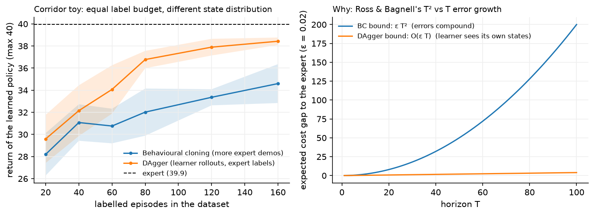

# Imitation learning

> **Why this matters at staff level.** Most deployed "policies" are not trained with RL at
> all. They are trained by supervised learning on expert demonstrations: autonomy planners
> on human driving logs, manipulation policies on teleoperated episodes, and every LLM's
> SFT stage. The interview question that separates levels is why that works at training
> time and fails at deployment time, and the answer is a distribution-shift argument you
> should be able to derive. Strong signal is naming the $O(T^2)$ compounding-error bound,
> explaining DAgger in one sentence, and connecting both to why RLHF exists.

## TL;DR, the interview card

* Behavioural cloning is supervised learning on $(s,a)$ pairs:
  $\max_\theta \sum_i \log\pi_\theta(a_i|s_i)$, the same cross-entropy loss as
  classification. No reward, no Bellman equation, no environment interaction.
* The i.i.d. assumption is violated at test time: the learner's own errors change the state
  distribution it sees, so training error under $d^{\pi^*}$ says little about test error
  under $d^{\pi_\theta}$.
* Compounding error: if the learner's per-step error under the expert distribution is
  $\epsilon$ and costs are in $[0,1]$, the expected cost gap over a horizon $T$ is bounded
  by $O(\epsilon T^2)$, and that rate is tight (Ross and Bagnell).
* DAgger fixes the distribution, not the loss: roll out the learner, ask the expert what it
  would have done in the states the *learner* visited, aggregate, retrain. No-regret online
  learning gives $O(\epsilon T)$.
* DAgger's cost is an interactive expert. When the expert is a human driver, that is
  expensive or impossible, so production systems approximate it: synthesise perturbed
  states (ChauffeurNet), label offline from replay, or use a privileged planner as the
  expert.
* Inverse RL recovers a reward instead of a policy. MaxEnt IRL assumes trajectories are
  distributed as $p(\tau)\propto \exp(\sum_t r_\psi(s_t,a_t))$ and matches feature
  expectations. GAIL skips the reward and matches occupancy measures with a discriminator.
* Offline RL beats BC when the data is mixed-quality, because it can prefer the good
  actions in the dataset. BC can only average what it is shown.
* SFT is behavioural cloning on $(\text{prompt}, \text{response})$ pairs, with the same
  compounding-error problem (exposure bias), and RLHF is the on-policy correction.

## 1. Intuition first

You have 20 episodes of an expert keeping a car in a lane, gusts and all. Train a
classifier from observation to action on those 800 $(s,a)$ pairs. Validation accuracy is
high. Deploy it and it leaves the lane after 23 steps on average, where the expert lasts 34
out of the 40-step episode.

Nothing is wrong with the classifier. The problem is what it was never shown. The expert
is good, so the expert is almost always near the lane centre, so the training set contains
almost no examples of "you are 0.6 m off centre with 0.2 m/s of lateral velocity, what
now?". The first time the learner makes a small error, it lands slightly outside the
training distribution, where its predictions are worse, which produces a larger error, and
so on. The errors compound because the learner's own actions determine its future inputs.

This feedback is the single structural difference between imitation learning and
classification, and it is worth stating precisely: in supervised learning, the data
distribution is fixed and the model has no influence on it; in imitation learning, the
model *is* the sampling process.

{ width="820" }

The left panel holds the label budget equal. At every point on the x-axis, BC and DAgger
have paid for the same number of expert-labelled episodes. BC spends them on more expert
trajectories, which are all near the lane centre; DAgger spends them on labelling states the
learner actually reached. The expert scores about 37 out of a maximum 40, BC plateaus near
23 no matter how much expert data it gets, and DAgger reaches about 34.

## 2. The math

### 2.1 Behavioural cloning

Given expert demonstrations $\mathcal{D} = \{(s_i, a_i)\}_{i=1}^{N}$ sampled from the
expert's state distribution $d^{\pi^*}$, behavioural cloning solves

$$
\boxed{\;\hat\theta = \argmax_\theta \sum_{i=1}^{N}\log\pi_\theta(a_i\mid s_i)\;}
$$

For discrete actions this is cross-entropy; for continuous actions it is usually a Gaussian
log-likelihood (equivalently squared error with a fixed variance) or a more expressive
density such as a mixture, a diffusion model or a discretised distribution.

The whole of supervised learning applies: train/validation splits, regularisation,
augmentation, and the usual capacity trade-offs from
[Part II](../part02-classical/index.md). What does not apply is the i.i.d. assumption
connecting training loss to deployment performance.

### 2.2 The compounding error bound

Set up the comparison properly. Let $C(s,a) \in [0,1]$ be a per-step cost (say, 1 if the
action differs from the expert's, or 1 if the car is off the road). Write

$$
J(\pi) = \E\Big[\sum_{t=1}^{T}C(s_t,a_t)\Big]
$$

for the expected $T$-step cost under $\pi$'s own state distribution. Suppose training gives
a policy whose error *under the expert's distribution* is small:

$$
\E_{s\sim d^{\pi^*}}\big[\mathbb{1}[\pi_\theta(s)\ne\pi^*(s)]\big] \;\le\; \epsilon .
$$

**Claim.** $J(\pi_\theta) \le J(\pi^*) + T^2\epsilon$, and there are MDPs where this is
tight up to constants.

*Argument.* Consider the trajectory step by step. At step 1 the state comes from the same
distribution the expert induces, so the learner errs with probability at most $\epsilon$.
If it does not err, the state at step 2 is still distributed as the expert's, and the
argument repeats. The probability of surviving $t$ steps without a mistake is at least
$(1-\epsilon)^t$.

Once a mistake occurs, nothing bounds what happens next. The learner is now in a state the
expert never visits, the training guarantee says nothing there, and in the worst case the
policy pays the maximum cost $1$ at every remaining step, so a single mistake at step $t$
costs up to $T - t$ extra.

Summing: the expected number of first-mistake events over the horizon is at most
$T\epsilon$, and each costs up to $T$, so

$$
J(\pi_\theta) - J(\pi^*) \;\le\; \sum_{t=1}^{T}\epsilon\,(T-t) \;\le\; \epsilon T^2 .
$$

*Tightness.* Ross and Bagnell construct an MDP where the bound is achieved: a chain in
which one wrong action moves you to an absorbing "off the road" region with cost 1 per
step, and the expert never demonstrates recovery. So the $T^2$ is not an artefact of a
loose proof.

The practical reading of $T^2$: doubling the episode length quadruples the expected cost
gap, so a policy that is fine on 100-step episodes can be unusable on 1000-step episodes
with the same per-step accuracy. Conversely, driving $\epsilon$ down by more data has
diminishing value compared to fixing the distribution.

!!! note "Where the error actually comes from"
    $\epsilon$ is not only model capacity. In the corridor environment in this chapter, the
    expert acts on the true state while the learner sees a noisy observation, so even a
    perfect fit to the data has irreducible error. That is the realistic case: in autonomy
    the human expert saw the world directly and your policy sees a perception stack's
    output, and in LLM SFT the human wrote with intent the model cannot observe.

### 2.3 DAgger

Dataset Aggregation (Ross, Gordon and Bagnell, AISTATS 2011) changes which states get
labelled:

```text
D <- expert demonstrations
pi_1 <- train(D)
for i = 1, 2, ..., N:
    beta_i <- mixing weight (beta_1 = 1, decaying; beta_i = p^i is standard)
    roll out pi_mix = beta_i * expert + (1 - beta_i) * pi_i, collecting visited states
    label every visited state with the EXPERT's action
    D <- D union {(s, pi*(s))}
    pi_{i+1} <- train(D)
return the best pi_i on validation
```

The key property is that the aggregated dataset's state distribution converges to the
learner's own, so the training loss finally measures the thing that matters at test time.

**Why the bound improves.** DAgger is an instance of online learning: at iteration $i$ the
"loss function" is $\ell_i(\pi) = \E_{s\sim d^{\pi_i}}[\mathbb{1}[\pi(s)\ne\pi^*(s)]]$, and
training on the aggregate is Follow-The-Leader. If the learner is *no-regret* (its average
loss approaches the best fixed policy's average loss in hindsight), then after $N$
iterations there is a policy in the sequence with

$$
\E_{s\sim d^{\pi_i}}\big[\mathbb{1}[\pi_i(s)\ne\pi^*(s)]\big] \le \epsilon_N + O(1/N),
$$

where $\epsilon_N$ is the best achievable error on the aggregated distribution. Because the
error is now measured under the learner's own distribution, a mistake at step $t$ no longer
implies the guarantee is void afterwards: the policy has been trained on the states that
follow its own mistakes. The resulting bound is

$$
\boxed{\;J(\pi) \le J(\pi^*) + O(\epsilon T)\;}
$$

linear in $T$ instead of quadratic.

**The cost.** DAgger needs an expert you can query at arbitrary states, including states a
human expert would never produce and might not know how to label ("you are about to hit
the kerb sideways at 30 km/h, what is the correct steering angle?"). This is why DAgger is
standard in simulation and rare in its pure form on real vehicles. The production
substitutes:

| Substitute for an interactive expert | Used by |
|---|---|
| Synthesise perturbations of expert trajectories and label with a corrective target | ChauffeurNet |
| Use a privileged planner with full state as the expert for a vision-only student | Common in AV and sim-to-real |
| Replay logged human interventions as corrective labels | Fleet-based driving programmes |
| Have a human relabel selected learner rollouts offline | Data-engine loops ([Part X](../part10-self-supervised/03-weak-supervision-and-auto-labeling.md)) |

### 2.4 Inverse RL and GAIL

Behavioural cloning copies actions. Inverse RL asks what the expert was *optimising*, then
plans with it. The payoff is transfer: a reward function generalises to new dynamics, a
policy does not.

The problem is ill-posed, since many rewards explain the same behaviour (a constant reward
explains everything). Maximum entropy IRL (Ziebart et al., AAAI 2008) resolves this by
choosing the distribution over trajectories with the highest entropy subject to matching
the expert's expected features:

$$
p_\psi(\tau) = \frac{1}{Z(\psi)}\exp\Big(\sum_t r_\psi(s_t,a_t)\Big),
\qquad
Z(\psi) = \sum_{\tau}\exp\Big(\sum_t r_\psi(s_t,a_t)\Big),
$$

and maximising the log-likelihood of the expert's trajectories. The gradient has the shape
of every maximum-entropy model,

$$
\nabla_\psi \mathcal{L} = \underbrace{\E_{\tau\sim\text{expert}}\Big[\sum_t \nabla_\psi r_\psi\Big]}_{\text{observed features}} - \underbrace{\E_{\tau\sim p_\psi}\Big[\sum_t \nabla_\psi r_\psi\Big]}_{\text{model's expected features}},
$$

so each step requires computing the current reward's own trajectory distribution, which
means solving the forward RL problem (or approximating it) in the inner loop. That nested
structure is what makes IRL expensive.

**GAIL** (Ho and Ermon, NIPS 2016) skips the reward. Train a discriminator $D_w(s,a)$ to
separate expert from learner state-action pairs, and train the policy with RL using
$-\log D_w(s,a)$ as the reward. At the optimum the policy's occupancy measure matches the
expert's. The structure is a GAN ([Part IX](../part09-generative/02-gans.md)) where the
generator is a policy and sampling means rolling out in the environment. GAIL needs
environment interaction (unlike BC) and no expert queries (unlike DAgger), which places it
at a different point on the cost curve.

### 2.5 Offline RL versus behavioural cloning

Both learn from a fixed dataset with no interaction. The difference is what they can do
with imperfect data.

| | Behavioural cloning | Offline RL (CQL, IQL) |
|---|---|---|
| Needs rewards | no | yes |
| Data quality assumption | near-expert | any, including mixed and failed episodes |
| Can exceed the demonstrator | no | yes, by stitching good segments together |
| Main failure mode | distribution shift at deployment | value over-estimation on unsupported actions |
| Complexity | a supervised training run | a critic, a pessimism mechanism, and careful tuning |

The rule to state in an interview: if the data is expert-quality and plentiful, BC is the
right answer and everything else is unnecessary machinery. If the data is a mixture of good
and bad episodes and you have a reward, offline RL can do better, because it can prefer the
good actions rather than averaging over all of them. Empirically, well-tuned BC on the
top-fraction of episodes (filtered BC) is a strong baseline that offline RL papers report
against.

### 2.6 SFT is behavioural cloning

The mapping is exact, which is why this chapter sits under RL rather than under supervised
learning:

| Imitation learning | LLM supervised fine-tuning |
|---|---|
| State $s_t$ | Prompt plus tokens generated so far |
| Expert action $a^*_t$ | The next token in the human-written response |
| $\max_\theta\sum\log\pi_\theta(a^*|s)$ | Token-level cross-entropy on the response |
| Expert state distribution $d^{\pi^*}$ | Prefixes of human-written text |
| Learner state distribution $d^{\pi_\theta}$ | Prefixes the model generates at inference |
| Compounding error | Exposure bias: one off-distribution token degrades the rest |
| DAgger | Generate with the model, have humans correct, retrain |
| The RL fix | RLHF, which optimises on the model's own samples |

Teacher forcing during SFT is exactly BC's training condition: every prefix comes from the
expert. At inference the model consumes its own tokens, which is the learner's
distribution. RLHF's structural contribution is that it trains on sequences the *model*
generates, scored by a reward model, which is the on-policy correction that BC lacks. The
KL penalty to the SFT policy then plays the role of keeping the corrected policy near the
demonstrations it started from. When
[Part VII](../part07-post-training/01-sft.md) says RLHF corrects the distribution shift left
by SFT, this is the argument it is pointing at.

## 3. Implementation

### 3.1 The environment, and why it is built this way

`CorridorEnv` in `src/mlbook/rl/envs.py` is designed so that BC fails for the right
reasons:

* **Momentum.** The state is $(y, v)$ and actions change acceleration. Recovering from an
  offset requires braking against velocity, which the expert (who is never far off centre)
  never demonstrates.
* **A privileged expert.** `expert_action` reads the true state and applies a PD law
  $u = -(k_p y + k_d v)$. The learner sees $(y,v)$ plus Gaussian noise, so even a perfect
  fit has irreducible error, which is $\epsilon > 0$ in §2.2.
* **Rare, large gusts.** An impulse to $v$ with probability 0.02 per step. The expert
  corrects one within a step or two, so its trajectories contain almost no off-centre
  states. Make gusts frequent instead and the expert's own data starts covering the
  recovery states, which is the fastest way to make this demonstration stop working.

```python title="src/mlbook/rl/envs.py (excerpt)"
def expert_action(self, obs: np.ndarray | None = None) -> int:
    """PD controller on the TRUE state: ``u = -(kp y + kd v)``, thresholded to three actions."""
    u = -(self.kp * self.y + self.kd * self.v)
    if abs(u) <= self.deadband:
        return 1
    return 2 if u > 0 else 0
```

### 3.2 Behavioural cloning

Two learners, for two purposes. The MLP shows that BC is ordinary classification:

```python title="src/mlbook/rl/behavioral_cloning.py (excerpt)"
def fit_bc_mlp(policy, obs, actions, n_epochs=200, lr=1e-2) -> float:
    """``L = -(1/N) sum_i log softmax(f(s_i))[a_i]``: BC is a classification problem."""
    x = torch.from_numpy(obs.astype(np.float32))  # (N, obs_dim)
    y = torch.from_numpy(actions)  # (N,)
    opt = torch.optim.Adam(policy.parameters(), lr=lr)
    for _ in range(n_epochs):
        loss = nn.functional.cross_entropy(policy(x), y)
        opt.zero_grad()
        loss.backward()
        opt.step()
    return float(loss.detach())
```

There is no RL machinery in that function. It is the same code you would write to classify
images, which is the point.

The tabular learner makes the covariate-shift failure visible without confounding it with
network generalisation:

```python title="src/mlbook/rl/behavioral_cloning.py (excerpt)"
class TabularPolicy:
    def _bin(self, obs: np.ndarray) -> tuple[int, ...]:
        return tuple(int(np.floor(float(x) / self.bin_width)) for x in obs)

    def act(self, obs: np.ndarray) -> int:
        b = self._bin(obs)
        if b not in self.counts:
            return int(np.argmax(self.prior))  # never seen: fall back to the marginal mode
        return int(np.argmax(self.counts[b]))
```

A bin the training set never covered returns the most common expert action overall, which
on this task is "do nothing". That is the honest behaviour of a model with no information:
predict the marginal. A neural network would instead extrapolate, and whether its
extrapolation helps or hurts is unpredictable, which is why the tabular version is the
cleaner demonstration.

### 3.3 DAgger

```python title="src/mlbook/rl/dagger.py (excerpt)"
def rollout_and_relabel(env, learner, expert_fn, n_episodes, rng, beta=0.0):
    """Act with ``learner`` (expert w.p. ``beta``); return obs, EXPERT actions, mean return."""
    obs_l, act_l, returns = [], [], []
    for _ in range(n_episodes):
        obs, done, total = env.reset(rng), False, 0.0
        while not done:
            a_expert = expert_fn(obs)
            a = a_expert if rng.random() < beta else learner.act(obs)
            obs_l.append(obs)
            act_l.append(a_expert)  # label = what the expert WOULD do here
            obs, r, done = env.step(a, rng)
            total += r
        returns.append(total)
    return np.stack(obs_l), np.asarray(act_l, dtype=np.int64), float(np.mean(returns))


def dagger(env, expert_fn, make_learner, n_iterations, episodes_per_iter, rng, beta0=0.5):
    obs, actions = collect_expert_data(env, expert_fn, episodes_per_iter, rng)  # (N, obs_dim), (N,)
    history: list[float] = []
    for i in range(n_iterations):
        learner = make_learner()
        learner.fit(obs, actions)
        beta = beta0**i
        new_obs, new_actions, mean_return = rollout_and_relabel(env, learner, expert_fn, episodes_per_iter, rng, beta)
        obs = np.concatenate([obs, new_obs], axis=0)  # (N + N_new, obs_dim)
        actions = np.concatenate([actions, new_actions], axis=0)  # (N + N_new,)
        history.append(mean_return)
    learner = make_learner()
    learner.fit(obs, actions)
    return learner, history
```

Two lines carry the whole idea. `a = a_expert if rng.random() < beta else learner.act(obs)`
decides **who drives**, and `act_l.append(a_expert)` decides **who labels**. Swapping either
one breaks the algorithm: label with the learner's action and you are training on your own
mistakes, let the expert drive with $\beta = 1$ forever and you are doing plain BC with more
data.

The learner is rebuilt from scratch each iteration (`make_learner()`), because DAgger's
guarantee is about training on the aggregate dataset, not about fine-tuning from the
previous iterate. With a neural network, warm-starting is usual in practice and drifts from
the theory.

??? example "Full implementations"
    ```python
    --8<-- "src/mlbook/rl/behavioral_cloning.py"
    ```

    ```python
    --8<-- "src/mlbook/rl/dagger.py"
    ```

### 3.4 How you'd test it

`tests/test_rl_dagger.py` asserts the qualitative result the theory predicts, with margins
wide enough not to flake:

```python
expert_ret = _mean_return(env, env.expert_action, rng)            # 40.0
bc_ret     = _mean_return(env, bc.act, rng)                       # 28.5
dagger_ret = _mean_return(env, learner.act, rng)                  # 38.1
assert expert_ret > 38
assert bc_ret < expert_ret - 8
assert dagger_ret > bc_ret + 6 and dagger_ret > expert_ret - 4
```

`tests/test_rl_behavioral_cloning.py` separately checks that BC itself is correct, by
cloning the gridworld's value-iteration policy from a complete dataset of $(s, \pi^*(s))$
pairs and requiring an exact match on every non-terminal state. That separation matters: one
test says the BC implementation works, the other says BC as a *method* fails under
distribution shift. Conflating them would make it impossible to tell a bug from the
phenomenon.

`rollout_and_relabel` gets its own test with a learner that always steers left, asserting
that the recorded labels are mostly "steer right", which is the relabelling property stated
directly.

```bash
pytest tests/test_rl_behavioral_cloning.py tests/test_rl_dagger.py -q
```

## Retype by hand

| Reproduce from memory | File | Target time |
|---|---|---|
| `fit_bc_mlp` (the cross-entropy loop) | `src/mlbook/rl/behavioral_cloning.py` | 5 min |
| `collect_expert_data` | `src/mlbook/rl/behavioral_cloning.py` | 5 min |
| `rollout_and_relabel` (who drives, who labels) | `src/mlbook/rl/dagger.py` | 8 min |
| `dagger` (the aggregation loop and the beta schedule) | `src/mlbook/rl/dagger.py` | 12 min |
| `TabularPolicy.fit` and `.act` | `src/mlbook/rl/behavioral_cloning.py` | 6 min |

**Fine to just read**: `MLPPolicy` (a two-layer MLP), `make_tabular_learner`, and
`CorridorEnv`'s dynamics, though you should be able to explain why each of its three design
choices (momentum, privileged expert, observation noise) is there.

```bash
pytest tests/test_rl_behavioral_cloning.py -q   # BC on a clean problem: it works
pytest tests/test_rl_dagger.py -q               # BC under shift: it fails; DAgger recovers
pytest tests/test_rl_dagger.py -k relabel -q    # just rollout_and_relabel
```

## 4. Systems view: cost, failure modes, trade-offs

### What each method costs

| Method | Needs a reward | Needs environment interaction | Needs expert queries | Typical cost driver |
|---|---|---|---|---|
| Behavioural cloning | no | no | no | Collecting demonstrations once |
| Filtered BC | yes (to filter) | no | no | Same, plus a quality signal |
| DAgger | no | yes | yes, at arbitrary states | Expert availability |
| Offline RL | yes | no | no | Tuning and the pessimism mechanism |
| GAIL | no | yes | no | RL training loop plus a discriminator |
| IRL (MaxEnt) | no | yes | no | Solving forward RL in the inner loop |

### When to use what

| Situation | Use | Decision rule |
|---|---|---|
| Plentiful expert data, short horizon, states you can cover | Behavioural cloning | The $T^2$ term is small when $T$ is small and coverage is good |
| A simulator and a scripted or privileged expert | DAgger | The expert is queryable for free, so take the linear bound |
| Human expert, no interactive queries possible | BC plus synthetic perturbations | ChauffeurNet's approach: manufacture the off-distribution states |
| Mixed-quality logged data with rewards | Offline RL, or filtered BC as the baseline | BC averages the data, offline RL can prefer its best parts |
| You need to transfer to different dynamics | IRL | A reward transfers, a policy does not |
| Expert data plus a cheap simulator, no expert queries | GAIL | Occupancy matching without querying the expert |

### Failure modes

* **Causal confusion.** The learner latches onto a feature that correlates with the expert's
  action but does not cause it. The classic case is a brake indicator in the observation:
  the model learns "brake light on implies brake", which is perfectly predictive in the
  demonstrations and catastrophic when the model itself controls the light. More data makes
  this worse, not better, because it sharpens the spurious correlation.
* **Multimodality averaged away.** When the expert sometimes goes left and sometimes right
  around an obstacle, a unimodal Gaussian or squared-error policy predicts the mean, which
  goes straight into the obstacle. Fixes: mixture densities, discretised action bins,
  diffusion policies, or action chunking.
* **Compounding error at long horizons.** The $T^2$ term. Symptom: performance that is fine
  for the first seconds and degrades with episode length.
* **Expert-observation mismatch.** The expert acts on information the learner does not have
  (a human's peripheral vision, a privileged simulator state). The learner cannot do better
  than the information gap allows, and its errors are systematic rather than random.
* **Distribution shift between demonstrations and deployment.** The demonstrations were
  collected in daylight, in one city, with one sensor configuration. This is ordinary
  dataset shift, and it stacks on top of the policy-induced shift.

## 5. In production

!!! production "Waymo: ChauffeurNet, or what 30 million examples of pure imitation do not buy"
    The ChauffeurNet paper states the result plainly: standard behavioural cloning is
    insufficient for driving even with 30 million expert examples and even with a perception
    system and a controller doing the low-level work. Their response is to synthesise the
    states BC never sees, by perturbing expert trajectories into near-collisions and
    off-road excursions and training the model to recover, plus auxiliary losses that
    penalise collisions and off-road driving directly. Read it as DAgger's problem statement
    with an offline substitute for the interactive expert.
    [ChauffeurNet: Learning to Drive by Imitating the Best and Synthesizing the Worst (arXiv:1812.03079)](https://arxiv.org/abs/1812.03079),
    [Waymo blog: Learning to Drive: Beyond Pure Imitation](https://waymo.com/blog/2018/12/learning-to-drive-beyond-pure-imitation_26/)

!!! production "Google DeepMind: RT-1, RT-2 and Open X-Embodiment, imitation at fleet scale"
    RT-1 is behavioural cloning with a transformer: images plus a language instruction in,
    discretised arm and base actions out, trained on a large teleoperated demonstration set
    at 35M parameters and 3 Hz control. RT-2 keeps the imitation objective and initialises
    from a vision-language model, so web knowledge transfers into the policy and the robot
    can follow instructions about objects it never manipulated in training. Open
    X-Embodiment pools data from 22 robot types across 21 institutions and trains RT-X
    models on the union, reporting positive transfer across platforms. All three are
    supervised learning on $(s,a)$ pairs; the RL content is in what fails (compounding
    error, multimodality) and how the field works around it.
    [RT-1 (arXiv:2212.06817)](https://arxiv.org/abs/2212.06817),
    [RT-2 (arXiv:2307.15818)](https://arxiv.org/abs/2307.15818),
    [Open X-Embodiment (arXiv:2310.08864)](https://arxiv.org/abs/2310.08864)

!!! production "ACT and Diffusion Policy: fixing multimodality instead of collecting more data"
    Both papers attack the "averaged away" failure mode from §4. ACT (Action Chunking with
    Transformers) predicts a *chunk* of future actions at once and executes them with
    temporal ensembling, which removes the per-step independence that makes jittery,
    averaged behaviour; it was demonstrated on fine bimanual tasks with low-cost hardware.
    Diffusion Policy represents the action distribution as a conditional denoising diffusion
    process, which handles multi-modal action distributions directly and trains stably in
    high-dimensional action spaces. Neither adds a reward or an environment loop, so both
    are still behavioural cloning with a better density model.
    [ACT (arXiv:2304.13705)](https://arxiv.org/abs/2304.13705),
    [Diffusion Policy (arXiv:2303.04137)](https://arxiv.org/abs/2303.04137)

!!! production "Figure: Helix, a vision-language-action model for humanoid control"
    Figure describes Helix as a VLA model controlling the full upper body (wrists, fingers,
    torso, head) with a two-system design: a multimodal transformer that consumes vision and
    language, and a fast motor policy that outputs action vectors at high rate. Figure
    reports training on the order of a few hundred hours of data. Treat the published claims
    as the company's own; what is checkable and useful is the architecture pattern, which is
    the same slow-semantic, fast-control split that appears across recent humanoid work.
    [Helix: A Vision-Language-Action Model for Generalist Humanoid Control (Figure)](https://www.figure.ai/news/helix)

!!! production "Tesla Optimus: what is and is not documented"
    Optimus has been demonstrated performing manipulation tasks learned from human
    demonstration video, and Tesla has described using data from human operators. There is
    no peer-reviewed or detailed technical publication comparable to the RT-X or ChauffeurNet
    papers, so the specific losses, architectures and data scales are not publicly
    verifiable. Say that when asked about it in an interview rather than repeating
    presentation claims as engineering facts; naming the evidence gap is a stronger signal
    than confident recall.

## 6. Interview questions and strong answers

!!! interview "Why does behavioural cloning fail, and how badly?"
    It fails because the i.i.d. assumption connecting training loss to test performance is
    violated: the policy's own errors change the distribution of states it sees, so a low
    error under the expert's state distribution does not bound the error under the
    learner's. Quantitatively, with per-step error $\epsilon$ under the expert distribution
    and costs in $[0,1]$, the expected cost gap over a horizon $T$ is $O(\epsilon T^2)$, and
    that rate is tight. The $T^2$ is what makes it a structural problem: you can push
    $\epsilon$ down with more data, but the horizon term multiplies whatever is left.

    **Staff-level follow-up: derive the $T^2$.**
    At most $T\epsilon$ first-mistake events over the horizon; a mistake at step $t$ puts
    you off the training distribution where no guarantee holds, costing up to $T-t$ in the
    worst case; summing $\epsilon(T-t)$ over $t$ gives $O(\epsilon T^2)$.

!!! interview "How does DAgger fix it, and what does it cost?"
    DAgger changes the state distribution instead of the loss. Roll out the current learner,
    collect the states it actually visits, ask the expert what it would do in each of those
    states, aggregate into the dataset, retrain. After enough iterations the training
    distribution is the learner's own, so the training error finally bounds test performance
    and the cost gap is $O(\epsilon T)$. The cost is an expert you can query at arbitrary
    states, which is easy for a scripted or privileged expert in simulation and hard for a
    human, since the states in question are exactly the ones a good human never enters.

    **Staff-level follow-up: what is $\beta$ for?**
    It mixes the expert into the rollout policy, with $\beta_1 = 1$ (pure expert, so the
    first iteration is ordinary BC) decaying geometrically. Early on the learner is bad
    enough that its rollouts are useless and possibly unsafe, so the expert drives; as the
    learner improves, the mixture shifts toward it. The labels always come from the expert
    regardless of who drives.

!!! interview "Your AV planner is trained by imitation and drifts out of lane on long drives. What do you do?"
    Diagnose first: check whether the failure is compounding error (degrades with episode
    length, which the $T^2$ argument predicts) or a coverage gap (fails in specific
    conditions). For compounding error, the fixes in order of cost: synthesise perturbed
    states around expert trajectories with corrective labels, which is ChauffeurNet's
    approach and needs no interactive expert; add auxiliary losses that penalise the bad
    outcome directly (off-road, collision) so the model has a signal even off-distribution;
    mine real interventions from the fleet as corrective labels; and if there is a
    simulator with a privileged planner, run DAgger against it. I would also check for
    causal confusion by ablating suspicious input features, and for multimodality being
    averaged away by looking at whether failures cluster at decision points.

    **Staff-level follow-up: would you switch to RL?**
    Not as the first move. RL needs a reward function that captures comfort, safety and
    progress, and specifying that is the hard part; a badly specified reward gives you a
    policy that games it. The usual production shape is imitation for the bulk of behaviour
    with RL or search used narrowly where a reward is well defined, plus a rules-based
    safety layer.

!!! interview "SFT versus RLHF, in imitation-learning terms."
    SFT is behavioural cloning: cross-entropy on human-written responses, with teacher
    forcing, so every training prefix comes from the expert. At inference the model consumes
    its own tokens, which is a different distribution, and errors compound along the
    sequence (the LLM name for this is exposure bias). RLHF trains on sequences the model
    itself generates, scored by a reward model, which is the on-policy correction BC lacks,
    and the KL penalty to the SFT policy keeps it near the demonstrated behaviour. The
    parallel to DAgger is close: both fix the distribution rather than the loss. The
    difference is that DAgger gets ground-truth labels from an expert, while RLHF gets a
    scalar from a learned reward model, which is why reward gaming is an RLHF problem and
    not a DAgger problem.

    **Staff-level follow-up: is DPO closer to BC or to RLHF?**
    Closer to BC in its mechanics, since it is a supervised loss on a fixed preference
    dataset with no sampling from the current policy, and closer to RLHF in its objective,
    since it optimises the same KL-regularised reward objective in closed form. That places
    it with the same off-policy caveat: it cannot correct errors on states the dataset does
    not contain. See [DPO and its relatives](../part07-post-training/04-dpo-and-friends.md).

!!! interview "When would you do inverse RL instead of imitation?"
    When you need the behaviour to transfer to different dynamics or a different embodiment.
    A policy is tied to the dynamics it was trained under; a reward function describes the
    intent, so you can re-plan with it on a new robot or a modified vehicle. The cost is
    that IRL is ill-posed (many rewards explain the same behaviour), MaxEnt IRL resolves
    that with a maximum entropy assumption, and the gradient requires solving the forward RL
    problem in the inner loop. GAIL is the practical middle ground when you only care about
    matching behaviour in the same environment: it matches occupancy measures with a
    discriminator and never represents a reward explicitly.

    **Staff-level follow-up: what does MaxEnt actually assume about the expert?**
    That the expert is *noisily* optimal, with trajectory probability proportional to
    $\exp(\text{return})$, so better trajectories are exponentially more likely without
    being certain. That assumption is what makes the likelihood well defined and gives the
    feature-matching gradient; it also means IRL degrades gracefully when the expert is
    imperfect, which BC does not.

!!! interview "You have 10,000 logged episodes of mixed quality with rewards. BC or offline RL?"
    Start with filtered BC as a baseline: keep the top fraction by return and clone those.
    It is one training run, it has no failure modes beyond the ones in this chapter, and
    offline RL papers routinely report it as competitive. Move to offline RL (IQL first,
    since it never evaluates unseen actions) when the good behaviour is spread thinly across
    mediocre episodes, so that no single episode is worth cloning but good *segments* can be
    stitched. Whatever I run, I evaluate on held-out episodes with an off-policy estimator
    and, if at all possible, a small live test, because offline metrics for offline RL are
    notoriously unreliable.

    **Staff-level follow-up: what breaks in offline RL that does not break online?**
    Over-estimation has no corrective feedback. Online, a wrongly optimistic Q-value gets
    tested and corrected; offline, nothing tests it, so the error compounds through the
    bootstrap and the policy is driven toward exactly the actions where the critic is least
    reliable. CQL suppresses those values explicitly, IQL avoids querying them at all.

## 7. Exercises

1. **★ Horizon scaling.** With $\epsilon = 0.01$, compute the BC bound $\epsilon T^2$ and
   the DAgger bound $\epsilon T$ for $T \in \{10, 100, 1000\}$, and say at what $T$ the BC
   bound becomes vacuous given costs in $[0,1]$.

    ??? success "Solution"
        BC: 1, 100, 10000. DAgger: 0.1, 1, 10. The maximum possible cost is $T$, so the BC
        bound is vacuous once $\epsilon T^2 > T$, i.e. $T > 1/\epsilon = 100$. That is the
        crisp statement of when pure BC stops having any guarantee at all, and it explains
        why imitation works for short-horizon manipulation primitives and struggles for
        long-horizon driving.

2. **★ Who labels, who drives.** Modify `rollout_and_relabel` to store the learner's action
   as the label instead of the expert's, rerun `tests/test_rl_dagger.py`, and explain the
   result.

    ??? success "Solution"
        The aggregated dataset now reinforces whatever the learner already does, so the
        iteration is a fixed-point loop around the initial BC policy and the return stops
        improving (it can drift down). This is the one-line difference between DAgger and
        self-training, and it is worth having felt it once.

3. **★★ Sweep the observation noise.** Run the BC-versus-DAgger comparison for
   `obs_noise` in $\{0, 0.03, 0.06, 0.12\}$ and plot both returns (the default is 0.06).

    ??? success "Solution"
        ```python
        import numpy as np
        from mlbook.rl.envs import CorridorEnv, run_episode
        from mlbook.rl.behavioral_cloning import TabularPolicy, collect_expert_data
        from mlbook.rl.dagger import dagger, make_tabular_learner
        for noise in (0.0, 0.03, 0.06, 0.12):
            rng = np.random.default_rng(0)
            env = CorridorEnv(obs_noise=noise)
            obs, acts = collect_expert_data(env, env.expert_action, 20, rng)
            bc = TabularPolicy(3, 0.05, rng); bc.fit(obs, acts)
            learner, _ = dagger(env, env.expert_action, make_tabular_learner(3, 0.05, rng), 8, 20, rng)
            f = lambda p: np.mean([run_episode(env, p, rng) for _ in range(100)])
            print(noise, round(f(env.expert_action), 1), round(f(bc.act), 1), round(f(learner.act), 1))
        ```
        At zero noise the expert is deterministic and its trajectories cover few bins, so BC
        is brittle in a different way (unseen bins rather than mislabelled ones). As noise
        grows, $\epsilon$ grows and the BC-DAgger gap widens, then both degrade because the
        task itself becomes harder. The non-monotonicity at the low end is worth explaining
        in your write-up.

4. **★★ Multimodality.** Build a two-corridor variant where the expert goes left or right
   around an obstacle with equal probability. Train a squared-error continuous-action BC
   policy and show it drives into the obstacle. Then fix it with a discretised action space.

    ??? success "Solution"
        The squared-error optimum is the conditional mean of the expert's action, which for
        a symmetric bimodal distribution is exactly the middle, i.e. straight into the
        obstacle. Discretising the action space and training with cross-entropy lets the
        policy represent a bimodal distribution and sample one mode. This is the smallest
        demonstration of why ACT, Diffusion Policy and discretised-action VLAs exist, and it
        is worth being able to sketch in 30 seconds on a whiteboard.

5. **★★ DAgger with a budget.** Fix the total number of expert labels and compare three
   allocations: all in the initial BC set, split evenly across 8 DAgger iterations, and
   front-loaded (half initial, the rest across 4 iterations).

    ??? success "Solution"
        Even splitting usually wins on this task; all-initial is plain BC. The
        interesting comparison is front-loading, which behaves like BC early and DAgger
        later: it is close to even splitting, because the first iterations' rollouts are
        driven mostly by the expert anyway (via $\beta$). The transferable point is that
        DAgger's advantage comes from *where* the labels are spent, not how many there are.

6. **★★★ Implement GAIL on the corridor.** Train a discriminator on
   (expert vs learner) $(s,a)$ pairs, use $-\log D(s,a)$ as the reward, and optimise the
   policy with the PPO implementation from [chapter 4](04-policy-gradients-ppo.md).
   Compare sample efficiency against BC and DAgger.

    ??? success "Solution"
        Reuse `train_ppo` with a wrapper environment whose `step` returns the discriminator
        reward instead of the true reward, and alternate: collect a rollout, update the
        discriminator for a few steps on expert-versus-learner batches, then run a PPO
        update. Expect GAIL to need far more environment steps than DAgger needs expert
        labels, since it has no privileged information, and to be sensitive to the
        discriminator's learning rate (an over-strong discriminator gives an uninformative
        reward, the same failure as in GAN training,
        [Part IX](../part09-generative/02-gans.md)). The result to report is the trade:
        GAIL buys you freedom from expert queries with environment interaction.

## References

* Ross, Gordon & Bagnell, "A Reduction of Imitation Learning and Structured Prediction to
  No-Regret Online Learning" (DAgger), AISTATS 2011.
  [arXiv:1011.0686](https://arxiv.org/abs/1011.0686)
* Ross & Bagnell, "Efficient Reductions for Imitation Learning", AISTATS 2010. The
  $O(\epsilon T^2)$ bound and its tightness.
* Ziebart, Maas, Bagnell & Dey, "Maximum Entropy Inverse Reinforcement Learning", AAAI 2008.
  [CMU Robotics Institute PDF](https://www.ri.cmu.edu/pub_files/2008/7/AAAI2008-bziebart.pdf)
* Ho & Ermon, "Generative Adversarial Imitation Learning", NIPS 2016.
  [arXiv:1606.03476](https://arxiv.org/abs/1606.03476)
* Bansal, Krizhevsky & Ogale, "ChauffeurNet: Learning to Drive by Imitating the Best and
  Synthesizing the Worst", 2018. [arXiv:1812.03079](https://arxiv.org/abs/1812.03079);
  [Waymo blog](https://waymo.com/blog/2018/12/learning-to-drive-beyond-pure-imitation_26/)
* Brohan et al., "RT-1: Robotics Transformer for Real-World Control at Scale", 2022.
  [arXiv:2212.06817](https://arxiv.org/abs/2212.06817)
* Brohan et al., "RT-2: Vision-Language-Action Models Transfer Web Knowledge to Robotic
  Control", 2023. [arXiv:2307.15818](https://arxiv.org/abs/2307.15818)
* Open X-Embodiment Collaboration, "Open X-Embodiment: Robotic Learning Datasets and RT-X
  Models", ICRA 2024. [arXiv:2310.08864](https://arxiv.org/abs/2310.08864)
* Zhao, Kumar, Levine & Finn, "Learning Fine-Grained Bimanual Manipulation with Low-Cost
  Hardware" (ACT), RSS 2023. [arXiv:2304.13705](https://arxiv.org/abs/2304.13705)
* Chi et al., "Diffusion Policy: Visuomotor Policy Learning via Action Diffusion", RSS 2023.
  [arXiv:2303.04137](https://arxiv.org/abs/2303.04137)
* Figure, "Helix: A Vision-Language-Action Model for Generalist Humanoid Control", 2025.
  [figure.ai](https://www.figure.ai/news/helix)
* Kumar et al., "Conservative Q-Learning for Offline Reinforcement Learning", NeurIPS 2020.
  [arXiv:2006.04779](https://arxiv.org/abs/2006.04779); Kostrikov et al., "Offline
  Reinforcement Learning with Implicit Q-Learning", ICLR 2022.
  [arXiv:2110.06169](https://arxiv.org/abs/2110.06169)
