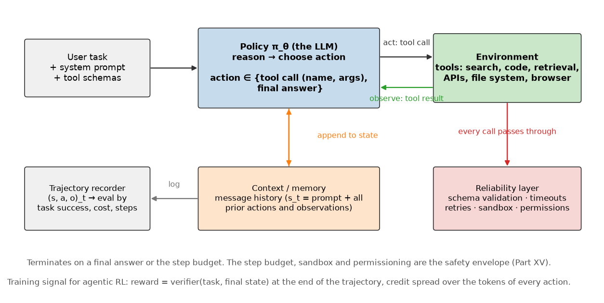

# Agents and tool use

> **Why this matters at staff level.** Agent questions are now standard in LLM interviews,
> and most candidates answer them as prompt engineering. The RL framing is what gets you
> past the first follow-up: an agent is a policy acting in a partially observed environment,
> its context is a belief state, its tools are the action space, and task success is a
> terminal reward. That framing tells you immediately why long agent runs fail, why
> evaluation has to be outcome-based, and what agentic RL is actually training. Strong
> signal is designing the loop, the failure handling and the evaluation together rather
> than treating reliability as an afterthought.

## TL;DR, the interview card

* The loop is Observation, Reason, Action, Observation. State $s_t$ is the full message
  history, action $a_t$ is a tool call or a final answer, the transition is "run the tool
  and append the result", and reward arrives at the end.
* This is a POMDP: the agent never sees the environment's true state, only the tool outputs
  it has requested. The context window is its belief state, and context is finite, which
  bounds how much belief it can carry.
* ReAct interleaves reasoning traces with actions, so the model's plan conditions on real
  observations instead of being fixed up front.
* Function calling is the action interface: each tool is a name, a description and a JSON
  schema; the model emits a structured call; the runtime validates, executes and returns a
  result message.
* Tool errors come back as observations. A well-built loop feeds the error text back
  so the policy can recover, and a step budget guarantees termination.
* Evaluation is outcome-based: did the task succeed, at what cost, in how many steps. Path
  metrics are diagnostics, not the objective. Cross-link
  [Part XIII evaluation](../part13-retrieval-eval-reliability/02-evaluation.md).
* Agentic RL trains on whole trajectories with a verifier as the reward (tests pass,
  answer matches), which is RLVR applied to tool use. Credit assignment over tokens inside
  actions is the hard part.
* Multi-agent systems trade context isolation against coordination overhead. Shared state
  needs a schema; unconstrained chat between agents is where token budgets go to die.
* Reliability is the design: timeouts, retries with backoff, idempotency, sandboxing, and
  an explicit permission boundary for anything irreversible. Cross-link
  [Part XV safety](../part15-interpretability-safety/02-safety-failure-modes.md).

## 1. Intuition first

A question that needs two lookups and one arithmetic step: "what is the combined population
of X and Y?". A model without tools guesses. A model with tools does this:

```text
user:      total population of x and y?
assistant: {"tool": "lookup", "args": {"key": "population_of_x"}}
tool:      1200
assistant: {"tool": "lookup", "args": {"key": "population_of_y"}}
tool:      3400
assistant: {"tool": "calculator", "args": {"expression": "1200 + 3400"}}
tool:      4600
assistant: 4600
```

Four decisions, each conditioned on everything before it. That transcript is a trajectory
in an MDP, and every element of chapter 1 has a counterpart:

| MDP element | Agent counterpart |
|---|---|
| State $s_t$ | The message list: task, system prompt, tool schemas, and all prior actions and observations |
| Action $a_t$ | A tool call (name plus arguments) or a final answer |
| Transition $P(s_{t+1}\mid s_t,a_t)$ | Execute the tool, append the result to the message list |
| Reward | Usually terminal: did the task succeed |
| Terminal state | A final answer, or the step budget |
| Discount $\gamma$ | Usually 1, sometimes a per-step cost to discourage wandering |
| Policy $\pi_\theta(a_t\mid s_t)$ | The LLM, decoding a structured call |

{ width="840" }

The transition is stochastic in the way that matters operationally: the same search query
returns different results tomorrow, an API times out, a file has changed. That is a
non-stationary environment, and it is why agent evaluations drift and why reproducible
agent benchmarks pin their environments.

## 2. The math (and the parts that are not math)

### 2.1 The agent as a POMDP

The environment's true state (the contents of the database, the state of the repository,
the web) is never visible. The agent sees observations it requested. Applying
[chapter 1](01-mdp-bellman.md) §2.8 directly: the optimal policy is a function of the belief
state, and the message history is an approximation of it.

Three consequences that are worth stating as design constraints, not as observations:

**Context length bounds belief.** When the history exceeds the window, something must be
dropped or summarised, and the agent's belief becomes lossy in a way it cannot detect. Every
memory mechanism (summarisation, retrieval over past steps, an external scratchpad) is a
belief-state compression scheme, with the same trade-off as a Kalman filter's covariance:
what you drop you cannot recover.

**Information-gathering actions have value even with no immediate reward.** In a POMDP, an
action that only reduces uncertainty (a search, a file read, running the test suite) can be
optimal, because it changes the belief and therefore the quality of later decisions. A
policy trained only on final answers has to discover this on its own, which is one reason
tool-use ability improves sharply with RL on trajectories, more than with SFT on final
answers alone.

**Irreversibility changes the problem.** Deleting a file or sending an email removes states
from reachability. In MDP terms, the action's consequence is not recoverable by any
subsequent policy, so the value of an exploratory mistake is unbounded below. This is the
formal reason permissioning is an architectural concern instead of a product feature.

### 2.2 The loop

```text
history <- [system prompt with tool schemas, user task]
for step in 1..max_steps:
    action <- policy(history)                 # reason
    if action is a final answer: return it
    observation, ok <- registry.call(action)  # act (validated, sandboxed, retried)
    history <- history + [action, observation] # observe
return "step budget exhausted"
```

Every production agent is this loop plus engineering. The parts that vary: how `history` is
compressed, whether the policy is asked to plan before acting, whether multiple actions are
issued in parallel, and what the reliability layer does around `registry.call`.

### 2.3 ReAct and the role of the reasoning trace

ReAct (Yao et al., ICLR 2023) interleaves free-text reasoning with actions:

```text
Thought: I need the population of X first.
Action: lookup(key="population_of_x")
Observation: 1200
Thought: Now Y.
Action: lookup(key="population_of_y")
...
```

The reasoning token blocks do two things. They give the policy compute before committing to
an action, which the fixed-depth forward pass would otherwise not have. And they get
appended to the history, so later steps condition on the earlier plan, which keeps a
long trajectory coherent. Compared with planning everything up front, the interleaving lets
the plan condition on real observations, so a failed lookup can change the strategy instead
of derailing a fixed script.

In MDP terms, the reasoning trace is part of the action (tokens emitted by the policy) that
also becomes part of the next state. Tokens that affect the future state without touching
the environment behave like internal memory writes.

### 2.4 Function calling as the action interface

A tool declaration is a name, a description and a parameter schema. The description is not
documentation; it is the only thing the policy has to decide when the tool applies, so it is
part of the policy's input and worth as much iteration as a prompt.

```json
{
  "name": "lookup",
  "description": "Look up a fact by key. Use for population and area figures.",
  "parameters": {
    "type": "object",
    "properties": {"key": {"type": "string", "description": "Fact key, e.g. population_of_x"}},
    "required": ["key"]
  }
}
```

Both major provider APIs follow this shape: you pass tool definitions with a JSON schema,
the model returns a structured call, you execute it and return the result as a message
([Anthropic tool use](https://docs.anthropic.com/en/docs/build-with-claude/tool-use),
[OpenAI function calling](https://developers.openai.com/api/docs/guides/function-calling)).
Constrained decoding or schema-guided generation makes the emitted arguments parse by
construction, which removes a whole class of runtime failure
([OpenAI structured outputs](https://developers.openai.com/api/docs/guides/structured-outputs)).

Practical points that come up in interviews:

* **Too many tools degrade selection.** Every schema consumes context and adds a plausible
  wrong choice. Beyond a few dozen, retrieve a relevant subset per task instead of
  presenting all of them.
* **Overlapping tools are worse than missing ones.** If two tools could plausibly answer the
  same request, the policy will sometimes pick the wrong one, and the failure is silent.
* **Argument validation belongs in the runtime.** Schema validation catches the structural
  errors; semantic validation (does this file path exist, is this SQL read-only) is your
  code's responsibility and its error messages are what the policy learns to recover from.

### 2.5 Memory and state

The message history is the working state. Everything else is an engineering answer to its
finiteness:

| Mechanism | What it stores | Failure it introduces |
|---|---|---|
| Full history | Everything | Cost and latency grow with steps; context overflow |
| Rolling window | The last $k$ steps | Silently forgets the task's early constraints |
| Summarisation | A compressed narrative | Summaries lose the detail that mattered, unrecoverably |
| Scratchpad file | Whatever the agent writes | The agent must remember to write and re-read it |
| Vector memory | Embedded past steps, retrieved on demand | Retrieval misses; see [Part XIII](../part13-retrieval-eval-reliability/01-retrieval-and-rag.md) |
| Structured state object | Task-specific fields the runtime maintains | Requires knowing the task's schema in advance |

The structured state object is underrated. When the task has a known shape (a form to fill,
a repository to modify, an itinerary), maintaining an explicit state object outside the
context and rendering it into the prompt each step gives a compact, lossless belief state,
and it makes the agent's progress inspectable by a human.

### 2.6 Planning, decomposition and reflection

Three patterns, with the RL analogue for each:

* **Decomposition.** Split the task into subtasks and address them in sequence. This is
  hierarchical RL with hand-specified options: the top-level policy chooses subtasks, a
  low-level policy executes them. The benefit is credit assignment over a shorter horizon
  per subtask; the cost is that a bad decomposition is unrecoverable.
* **Reflection.** After a failure, ask the model to critique its own trajectory and retry
  with the critique in context. This is a search over trajectories with a learned heuristic,
  and it works only when the agent can tell that it failed, so it depends on the environment
  providing feedback such as a failing test or an error message, and not on introspection.
* **Search over actions.** Sample several candidate actions, score them with a value model
  or a verifier, and expand the promising ones. This is MCTS with a learned policy prior,
  the same structure as AlphaGo Zero from [chapter 1](01-mdp-bellman.md), and the same cost:
  you pay compute per node. See
  [test-time compute](../part07-post-training/06-test-time-compute.md).

### 2.7 Evaluation

The reward is task success, so the evaluation is task success. Path-based metrics (did it
call the right tool, was the trajectory efficient) are diagnostics.

| Metric | What it tells you |
|---|---|
| Task success rate | The only number that matters to a user; needs a programmatic verifier |
| Cost per task | Tokens plus tool calls plus wall-clock; the usual reason an agent is not shipped |
| Steps to success | Efficiency, and a proxy for how well the policy plans |
| Failure taxonomy | Where to spend engineering: wrong tool, malformed args, wrong plan, tool failure, step budget |
| Recovery rate after a tool error | Whether the loop's error surfacing is working |

Two properties make an agent benchmark trustworthy: a **programmatic verifier** (run the
tests, compare to a reference answer) rather than a model judge, and a **pinned
environment**, since a live API makes yesterday's result unreproducible. SWE-bench is the
canonical example of the first, with tasks drawn from real GitHub issues and success defined
by the repository's own test suite passing.

Variance is the practical trap. Agent success rates on a few hundred tasks have wide
confidence intervals, and a 2-point difference between two configurations is usually noise.
Run multiple seeds, report intervals, and be specific about the harness, since the scaffold
around the model changes results as much as the model does
([Part XIII](../part13-retrieval-eval-reliability/02-evaluation.md)).

### 2.8 Agentic RL

Training on tool-use trajectories rather than on single responses. The setup maps onto
[chapter 4](04-policy-gradients-ppo.md) with no new theory:

* **Trajectory**: the full sequence of reasoning tokens, tool calls and observations.
* **Reward**: a verifier's output at the end (tests pass, answer matches, task state
  reached), possibly minus a cost per step or per token.
* **Policy gradient**: the same REINFORCE or PPO estimator, with log-probabilities summed
  over the tokens the *policy* emitted. Observation tokens came from the environment, so
  they are masked out of the loss; including them trains the model to predict tool outputs,
  which is not the objective.
* **Baseline**: a value head, or the group-relative mean over several rollouts of the same
  task, which is what GRPO does
  ([Part VII](../part07-post-training/05-reasoning-rl-grpo.md)).

The hard parts are specific to the setting. Rollouts are slow and heterogeneous (one task
takes 3 tool calls, another 40), so the batch is ragged and the infrastructure has to handle
long-tail latency. Environments must be sandboxed and resettable, because training will
execute arbitrary generated code thousands of times. Rewards are sparse and terminal, so
credit assignment spans thousands of tokens. And reward hacking is immediate and creative:
given tests as the reward, a policy will find the shortcut of editing the tests, which is
why verifiers are held out and read-only.

## 3. Implementation

The point of this implementation is that the loop is testable without a model. Substituting
a deterministic scripted policy for the LLM makes every property of the loop (dispatch,
validation, retries, budget, recording) checkable in milliseconds, which is how you should
build the real thing too.

### 3.1 Tools and the registry

```python title="src/mlbook/rl/agent_loop.py (excerpt)"
@dataclass
class Tool:
    name: str
    description: str
    parameters: dict  # JSON-schema style {"arg": "type"}
    run: Callable[..., str]


class ToolRegistry:
    def call(self, name: str, args: dict, max_attempts: int = 2) -> tuple[str, bool]:
        """Return ``(observation, ok)``; errors are *observations*, never exceptions."""
        if name not in self.tools:
            return f"error: unknown tool '{name}'", False
        tool = self.tools[name]
        missing = [p for p in tool.parameters if p not in args]
        if missing:
            return f"error: missing arguments {missing} for '{name}'", False
        last_error = ""
        for _ in range(max_attempts):
            try:
                return str(tool.run(**args)), True
            except Exception as exc:  # noqa: BLE001 - tool failures are data for the policy
                last_error = f"error: {type(exc).__name__}: {exc}"
        return last_error, False
```

`call` never raises. A missing argument, an unknown tool name and a tool that throws all
come back as an observation string plus an `ok` flag. That design decision is the difference
between an agent that recovers and one that crashes: the policy's next decision is
conditioned on the error text, so a good error message ("file not found: /tmp/x.csv, did you
mean /tmp/data.csv?") is part of the environment's reward-shaping.

The retry is inside the registry, so a transient failure does not consume a policy step. A
deterministic failure retries once and then returns, so a broken tool cannot spin.

### 3.2 The loop and the trajectory recorder

```python title="src/mlbook/rl/agent_loop.py (excerpt)"
def run_agent(task, policy, registry, max_steps=8) -> Trajectory:
    """The loop. ``history`` is the list of ``{"role", "content"}`` messages the policy sees."""
    traj = Trajectory(task=task)
    history: list[dict] = [{"role": "user", "content": task}]
    for _ in range(max_steps):
        action = policy(history)  # reason
        if action.final is not None:
            traj.final_answer = action.final
            traj.terminated_by = "final"
            traj.steps.append(Step(action, "", True))
            return traj
        observation, ok = registry.call(action.tool or "", action.args)  # act
        traj.steps.append(Step(action, observation, ok))
        history.append({"role": "assistant", "content": json.dumps({"tool": action.tool, "args": action.args})})
        history.append({"role": "tool", "content": observation})  # observe
    traj.terminated_by = "max_steps"
    return traj
```

The `for _ in range(max_steps)` is the termination guarantee. Without it, a policy that
keeps calling a tool loops until something else stops it, and "something else" in production
means a bill. `terminated_by` records which exit happened, which is the first field you
group by when analysing failures.

`Trajectory` is the evaluation unit:

```python title="src/mlbook/rl/agent_loop.py (excerpt)"
@dataclass
class Trajectory:
    task: str
    steps: list[Step] = field(default_factory=list)
    final_answer: str | None = None
    terminated_by: str = "running"  # "final" | "max_steps"

    @property
    def n_tool_calls(self) -> int:
        return sum(1 for s in self.steps if s.action.tool is not None)

    def to_json(self) -> str: ...


def task_success(traj: Trajectory, expected: str) -> bool:
    """Outcome-based evaluation: did the final answer match, regardless of the path?"""
    return traj.terminated_by == "final" and traj.final_answer is not None and traj.final_answer.strip() == expected
```

Recording the trajectory is what makes everything downstream possible: offline evaluation,
failure taxonomies, regression suites of past failures, and training data for agentic RL.
Design the record before the agent, since retrofitting it means re-running everything.

### 3.3 The sandboxed tool

```python title="src/mlbook/rl/agent_loop.py (excerpt)"
_SAFE_CHARS = set("0123456789+-*/(). ")


def calculator(expression: str) -> str:
    """Arithmetic on a whitelisted character set (a stand-in for a sandboxed code tool)."""
    if not set(expression) <= _SAFE_CHARS:
        raise ValueError("expression contains non-arithmetic characters")
    return str(eval(expression, {"__builtins__": {}}, {}))
```

An allowlist of characters, checked before evaluation, with builtins removed. This is a
teaching-scale version of the real requirement: a code tool runs in a container with no
network, a read-only filesystem except for a scratch directory, a memory limit and a wall
clock. The test asserts that `__import__('os')` is rejected and comes back as an
observation, so the policy sees a refusal instead of the runtime seeing a compromise.

### 3.4 The scripted policy

```python title="src/mlbook/rl/agent_loop.py (excerpt)"
def scripted_policy(script: list[Action]):
    """A deterministic 'LLM': returns the scripted actions in order, then a fallback final answer."""
    state = {"i": 0}

    def policy(history: list[dict]) -> Action:
        i = state["i"]
        state["i"] = i + 1
        if i < len(script):
            return script[i]
        last_obs = history[-1]["content"] if history and history[-1]["role"] == "tool" else ""
        return Action(final=last_obs)

    return policy
```

Swapping this for a real model means writing a `policy(history) -> Action` that formats the
history into an API call and parses the structured response. Nothing else in the loop
changes, which is the property to aim for: the loop, the registry and the recorder are
model-agnostic, and the only model-specific code is serialisation.

??? example "Full implementation: `src/mlbook/rl/agent_loop.py`"
    ```python
    --8<-- "src/mlbook/rl/agent_loop.py"
    ```

### 3.5 How you'd test it

`tests/test_rl_agent_loop.py` covers the loop's contract, with no model involved:

* **Dispatch and validation.** A correct call returns `("14", True)`; a missing argument, an
  unknown tool and a tool that raises all return `ok=False` with an informative string.
* **Sandbox.** `__import__('os')` is rejected as a `ValueError` and surfaced as an
  observation.
* **Retry.** A tool that fails once and then succeeds is called twice and returns success,
  asserted by a counter inside the tool.
* **Multi-step task.** The four-action script from §1 produces a trajectory with three tool
  calls, the expected observations in order, `terminated_by == "final"`, and
  `task_success(traj, "4600")` true while `task_success(traj, "4601")` is false.
* **Step budget.** A script that loops forever terminates at `max_steps` with
  `final_answer is None` and `task_success` false.
* **Serialisation.** `to_json` round-trips the tool names, arguments, observations and the
  final answer, which is what an offline evaluation pipeline consumes.

```bash
pytest tests/test_rl_agent_loop.py -q
```

Tests like these run in milliseconds and catch the bugs that are expensive to find with a
live model in the loop. When an agent misbehaves in production, the question "is it the
policy or the harness?" is answerable only if the harness has its own test suite.

## Retype by hand

| Reproduce from memory | File | Target time |
|---|---|---|
| `run_agent` (the loop, including the budget and history append order) | `src/mlbook/rl/agent_loop.py` | 12 min |
| `ToolRegistry.call` (validation, retry, errors as observations) | `src/mlbook/rl/agent_loop.py` | 10 min |
| `Trajectory` and `task_success` | `src/mlbook/rl/agent_loop.py` | 8 min |
| `calculator` (the allowlist guard) | `src/mlbook/rl/agent_loop.py` | 3 min |

**Fine to just read**: `Tool`, `Action`, `Step` (dataclasses), `scripted_policy`,
`make_lookup`, `default_tools`.

```bash
pytest tests/test_rl_agent_loop.py -q              # all of the above, under a second
pytest tests/test_rl_agent_loop.py -k registry -q  # just validation and retries
pytest tests/test_rl_agent_loop.py -k budget -q    # just the step budget
```

This is the shortest drill in the part and the one most likely to appear as a live coding
question, usually phrased as "implement a minimal agent loop with two tools".

## 4. Systems view: cost, failure modes, trade-offs

### Cost

The context grows with every step, so the cost of an $n$-step agent run is quadratic in $n$
without caching: step $k$ processes roughly $k$ steps of history, and
$\sum_{k=1}^{n} k = O(n^2)$ tokens. Three mitigations:

* **Prompt caching** on the stable prefix (system prompt, tool schemas, early history) turns
  most of the repeated prefix into a cache hit.
* **Observation truncation.** Tool outputs are the bulk of the tokens. Truncate long outputs
  with a marker and a way to fetch more, instead of pasting a 200 KB file into context.
* **Summarise and restart** at a threshold, accepting the belief loss from §2.5.

Latency is dominated by serial round trips: each step is a model call plus a tool call, and
a 20-step task at 3 seconds per step is a minute of wall clock. Parallel tool calls (issuing
several independent calls in one action) is the main structural fix.

### When to use what

| Situation | Use | Decision rule |
|---|---|---|
| Single well-specified transformation | One model call, no loop | An agent loop adds cost and failure modes for nothing |
| Known fixed sequence of steps | A pipeline with model calls at each stage | Deterministic control flow is cheaper and debuggable |
| The path depends on intermediate results | Agent loop with tools | The branching is the reason to pay for a loop |
| Long task, clear subtasks, context pressure | Sub-agents with isolated contexts | Each sub-agent gets a clean window; the parent gets a summary |
| Tasks needing verification | Agent plus a programmatic verifier and a retry budget | Verifiable output is what makes retrying worthwhile |

The first row is the one people get wrong. An agent loop is justified by *branching*: if the
sequence of steps is known ahead of time, write the pipeline.

### Multi-agent systems

Multiple agents are mainly a context-management device: each sub-agent gets its own window
and its own tool subset, and the parent sees only summaries. The costs are real:

* **Communication overhead.** Every message between agents is tokens, and unconstrained
  chat between agents grows without bound. Constrain it to a schema.
* **Coordination.** Two agents editing the same file need a lock or an ownership model. The
  distributed-systems failure modes apply, and the agents will not discover them for you.
* **Error propagation.** A sub-agent's confident wrong summary is indistinguishable from a
  correct one to the parent, which is the compounding-error problem from
  [chapter 5](05-imitation-learning.md) with summaries as the errors.
* **Adversarial and untrusted agents.** If any agent processes untrusted input (a web page,
  a user document), treat its output as untrusted for every downstream agent. Prompt
  injection through a tool result is the standard attack, and the standard mitigation is to
  keep the privilege boundary outside the model: a tool that can act destructively requires
  an authorisation the model cannot mint.
  ([Part XV](../part15-interpretability-safety/02-safety-failure-modes.md))

### Failure modes and the reliability layer

| Failure | Mitigation |
|---|---|
| Loops (the same call repeatedly) | Step budget, plus detecting repeated identical calls and injecting a nudge |
| Malformed tool arguments | Schema-constrained decoding; validate and return the error as an observation |
| Tool timeout or transient failure | Timeout per call, bounded retries with backoff, and the error surfaced to the policy |
| Non-idempotent retries | Idempotency keys on anything that writes; never blind-retry a payment or an email |
| Context overflow mid-task | Summarise on a threshold, or maintain a structured state object |
| Destructive action taken in error | Permission boundary: allowlist tools, require confirmation for irreversible actions, sandbox everything else |
| Prompt injection via tool output | Treat tool output as untrusted data; keep authority in the runtime, not in the model's judgement |
| Silent wrong answers | A verifier where one exists; otherwise abstention thresholds and human review paths |

The pattern across that table: the model is not the safety mechanism. Every guarantee is
enforced by code around the model, which is the same architectural principle as the
sandbox around a code interpreter.

## 5. In production

!!! production "ReAct: interleaving reasoning and acting"
    Yao et al. showed that prompting a model to emit reasoning traces and actions in an
    alternating pattern outperforms acting without reasoning and reasoning without acting,
    across question answering with a Wikipedia API and interactive decision-making
    benchmarks. The mechanism the paper highlights is that reasoning conditioned on real
    observations can correct itself, while a plan generated up front cannot. ReAct is now the
    default template that most agent frameworks implement.
    [ReAct: Synergizing Reasoning and Acting in Language Models (arXiv:2210.03629)](https://arxiv.org/abs/2210.03629)

!!! production "Anthropic and OpenAI: tool use as a first-class API surface"
    Both providers expose the same abstraction: declare tools with JSON schemas, receive
    structured calls, execute them, return results as messages. Anthropic's documentation
    also describes server-side tools (web search, code execution in a sandboxed container,
    file editing, computer use), which is the productised version of the reliability layer
    in §4: the sandbox and the timeout are the provider's responsibility instead of yours.
    OpenAI's structured outputs guide covers schema adherence, which removes parse failures
    as a category.
    [Anthropic tool use](https://docs.anthropic.com/en/docs/build-with-claude/tool-use),
    [OpenAI function calling](https://developers.openai.com/api/docs/guides/function-calling),
    [OpenAI structured outputs](https://developers.openai.com/api/docs/guides/structured-outputs)

!!! production "SWE-bench: outcome-based evaluation with a programmatic verifier"
    2,294 tasks built from real GitHub issues and their pull requests across 12 Python
    repositories. The agent is given a repository and an issue, and success is defined by the
    repository's own tests passing after its patch is applied. Two properties make it the
    reference design for agent evaluation: the verifier is programmatic, so there is no
    judge model to game, and the tasks require coordinated edits across files, so the
    benchmark measures the loop rather than single-shot generation. The later
    human-validated subset exists because some original tasks were unsolvable or
    underspecified, which is itself a lesson about agent benchmark construction.
    [SWE-bench (arXiv:2310.06770)](https://arxiv.org/abs/2310.06770),
    [SWE-bench Verified](https://www.swebench.com/verified.html)

!!! production "OpenAI Five: the multi-agent case with a real reward"
    Five independent policies with no explicit communication channel, coordinating through
    the shared environment state and a team reward, trained with PPO. It is the useful
    contrast to LLM multi-agent systems: coordination emerged from a shared objective and
    shared observations rather than from agents talking to each other, and the reward was a
    real scalar rather than a summary passed between agents. When designing an LLM
    multi-agent system, ask what plays the role of that shared objective; if the answer is
    "nothing", the agents are a context-management device and should be described as one.
    [OpenAI Five](https://openai.com/index/openai-five/)

## 6. Interview questions and strong answers

!!! interview "Frame an LLM agent as an RL problem."
    State is the message history: task, system prompt, tool schemas, and every prior action
    and observation. Action is a structured tool call or a final answer. The transition
    executes the tool and appends the result, which is stochastic because the world changes
    between calls. Reward is typically terminal and binary from a verifier, sometimes with a
    per-step cost. It is a POMDP, since the agent sees only what it has asked for, and the
    context window is a finite belief state. That framing is what tells you where the hard
    parts are: credit assignment over thousands of tokens with one terminal reward, belief
    compression when the context fills, and the fact that information-gathering actions have
    value even though they earn no immediate reward.

    **Staff-level follow-up: what does the POMDP view predict about failures?**
    That failures concentrate where belief is lost or wrong: after a summarisation step,
    after a truncated tool output, and in long runs where early constraints have fallen out
    of the window. It also predicts that an agent with no way to re-read what it did will
    repeat itself, which is why a scratchpad or a structured state object helps more than a
    bigger window.

!!! interview "Design the tool-calling loop for a production agent."
    The loop is: format history, get a structured action, validate against the schema,
    execute in a sandbox with a timeout, append the result as an observation, repeat until a
    final answer or a step budget. The things I would insist on: tool errors returned as
    observations instead of raised, so the policy can recover; bounded retries inside the
    runtime for transient failures, so they do not consume policy steps; idempotency keys on
    anything that writes; a step budget that guarantees termination; and a trajectory record
    of every action and observation written before anything else, because evaluation,
    debugging and any future RL training all consume it. For tool design, few tools with
    non-overlapping descriptions, and descriptions written as prompts, since that text is the
    only thing telling the policy when the tool applies.

    **Staff-level follow-up: where do you put the permission boundary?**
    Outside the model. Tools are allowlisted per agent, destructive operations require a
    token the model cannot produce, and anything irreversible either goes through a human
    confirmation or is restricted to a sandbox that can be discarded. The model's judgement
    is an input to that system, never the enforcement mechanism, because tool outputs can
    carry injected instructions.

!!! interview "How do you evaluate an agent?"
    Outcome first: task success measured by a programmatic verifier on a pinned environment.
    Then cost per task (tokens, tool calls, wall clock) and steps to success, because an
    agent that succeeds at ten times the cost is often not shippable. Then a failure
    taxonomy, since that is what tells you where to spend engineering: wrong tool selection,
    malformed arguments, wrong plan, tool failure, budget exhaustion, and confidently wrong
    answers. I would avoid model-judged success where a verifier is possible, and I would
    report confidence intervals over multiple seeds, because agent success rates on a few
    hundred tasks have wide intervals and a small gap between configurations is usually
    noise.

    **Staff-level follow-up: your benchmark score improved by 3 points. Do you ship?**
    Not on that alone. I would check whether the interval excludes zero across seeds, whether
    the change was in the model or the scaffold (a harness change can move results as much as
    a model change), and whether the gain concentrates in one task category. I would also
    check cost, since many scaffold changes buy accuracy with more steps, and look at
    regressions on previously passing tasks, which an aggregate score hides.

!!! interview "When is a multi-agent system the right answer?"
    When context isolation is the actual constraint: a long task with separable subtasks
    where each sub-agent needs a different tool set and a clean window, and the parent only
    needs a summary. It buys parallelism and focus. It costs communication tokens,
    coordination bugs when two agents touch the same resource, and error propagation through
    summaries, which is the compounding-error problem where each summary is a lossy label. I
    would not use multiple agents to simulate roles ("a critic agent and a writer agent")
    without evidence that it beats one agent with the same instructions, because that design
    usually buys tokens and not accuracy.

    **Staff-level follow-up: how do agents coordinate without talking?**
    Through shared environment state, which is what OpenAI Five did: five policies, one team
    reward, coordination emerging from shared observations. For LLM agents the analogue is a
    shared structured artefact (a task file, a ticket, a repository) that each agent reads
    and writes, with the schema enforced by the runtime. It is cheaper than message passing
    and easier to debug, because the state is inspectable.

!!! interview "What is agentic RL actually training?"
    A policy over tool-use trajectories, with reward from a verifier at the end. Mechanically
    it is the same PPO or GRPO from [chapter 4](04-policy-gradients-ppo.md): sample
    trajectories from the current policy, score them, compute advantages, take clipped
    policy-gradient steps. Three things are specific to the agent setting. The loss masks
    observation tokens, since those came from the environment and training on them teaches
    the model to predict tool outputs. The rollouts are ragged and slow, so the training
    infrastructure looks like a distributed job scheduler with sandboxes. And reward hacking
    is immediate: if tests are the reward, the policy will edit the tests, so verifiers are
    held out and read-only.

    **Staff-level follow-up: why does this improve tool use more than SFT on good trajectories?**
    SFT on trajectories is behavioural cloning, so it inherits the compounding-error problem
    from [chapter 5](05-imitation-learning.md): the model is trained on expert prefixes and
    tested on its own. RL trains on the model's own trajectories, including its recoveries
    from its own errors, which is exactly the distribution SFT never covers. The information
    -gathering point from §2.1 also applies: a policy trained only to imitate final answers
    has no signal that an exploratory tool call was worth its cost.

!!! interview "An agent occasionally deletes files it should not. How do you fix it?"
    Not with a better prompt. The fix is architectural: move deletion behind a permission
    boundary the model cannot cross on its own. Concretely, run the agent against a
    sandboxed copy or a filesystem with soft deletes and a retention window; require an
    explicit confirmation step for destructive operations, issued by the runtime with human
    approval rather than by the model; scope the tool to an allowlisted directory; and log
    every call with enough detail to reverse it. Then add a regression test to the harness
    with the trajectory that produced the deletion, so a future model or prompt change is
    checked against it. I would also examine whether a tool output contained instructions,
    since injection through tool results is a common cause.

    **Staff-level follow-up: how do you decide what needs confirmation?**
    Reversibility and blast radius. Reversible, small-blast-radius actions run freely;
    irreversible or wide-blast-radius ones need either a human or a compensating mechanism
    (soft delete, transaction, dry run with a diff shown). That is a product decision with a
    technical implementation, and writing it down as a policy table is what makes it
    auditable.

## 7. Exercises

1. **★ Trace an MDP.** Take the four-step transcript in §1 and write out $(s_t, a_t, r_t)$
   for each step explicitly, including what the state contains at $t = 3$.

    ??? success "Solution"
        $s_0$ is the system prompt plus tool schemas plus the user task. $a_0$ is
        `lookup(population_of_x)`, $r_0 = 0$. $s_1 = s_0 + [a_0, \text{"1200"}]$, and so on.
        At $t=3$ the state contains the task and six messages (three assistant actions and
        three tool observations), and the action is the final answer `"4600"`, which is the
        only step with a non-zero reward. Writing this out makes the quadratic context growth
        from §4 obvious.

2. **★ Break the loop.** Remove the `max_steps` bound from `run_agent` and run the looping
   test. Then restore it and add a repeated-call detector that injects a nudge observation
   after three identical calls.

    ??? success "Solution"
        Without the bound the test hangs, which is the point. A reasonable detector keeps a
        counter keyed by `(tool, json.dumps(args, sort_keys=True))` and, on the third
        identical call, returns an observation such as
        `"error: repeated identical call; try a different approach"` instead of executing.
        Note that this changes the environment rather than the policy, which is the general
        pattern for fixing agent behaviour.

3. **★★ Add a stateful tool.** Add a `notes` tool with `write(key, value)` and
   `read(key)` backed by a dict, and a task that requires storing an intermediate result and
   retrieving it after several other calls. Test that the trajectory succeeds.

    ??? success "Solution"
        Add two `Tool` entries sharing a closure over a dict, then script a policy that
        writes, does unrelated work, and reads. The exercise is small and the lesson is not:
        an external scratchpad is a belief-state mechanism that survives context truncation,
        and it makes the agent's memory inspectable by a human, which a summarisation
        approach does not.

4. **★★ Failure taxonomy.** Generate 50 trajectories with a scripted policy that fails in
   five different ways (unknown tool, missing argument, sandbox rejection, budget exhaustion,
   wrong final answer), then write a classifier over `Trajectory` objects that assigns each
   to a category and prints the distribution.

    ??? success "Solution"
        Classify by inspecting `terminated_by`, the `ok` flags and the observation prefixes:
        `max_steps` implies budget exhaustion, any step with `ok=False` and
        `"unknown tool"` gives one category, and so on. This is the smallest version of the
        dashboard every agent team ends up building, and having written it once makes the
        evaluation question in §6 concrete rather than abstract.

5. **★★ Cost model.** Instrument `run_agent` to count tokens (approximate: characters over
   four) per step, then plot the cumulative token count against the step index for a 15-step
   task with and without truncating observations to 200 characters.

    ??? success "Solution"
        The untruncated curve is quadratic, the truncated one is closer to linear with a
        slope set by the action size. Compare the totals at step 15 and convert to a cost
        with a per-token price to get a number that a product decision can use. The point to
        take away for interviews: agent cost is dominated by re-processing history, so the
        first optimisation is prompt caching and the second is observation size.

6. **★★★ Agentic RL on the toy loop.** Replace the scripted policy with a small tabular
   policy over a discretised state (last tool called, whether each fact is known), give a
   terminal reward of 1 for the correct answer minus 0.05 per step, and train it with
   REINFORCE from [chapter 4](04-policy-gradients-ppo.md).

    ??? success "Solution"
        Use `rewards_to_go` and `reinforce_loss` with a policy over the small action set
        (`lookup(x)`, `lookup(y)`, `calculator(sum)`, `final`). The policy learns to do the
        two lookups before the calculation and to answer immediately after, because the step
        penalty makes every redundant call cost 0.05. Two properties of real agentic RL show
        up even here: the reward is terminal so early learning is slow, and the step penalty
        is what prevents an otherwise-optimal policy from making free exploratory calls.
        Increasing the penalty to 0.2 makes the policy skip a lookup and guess, which is a
        small, reproducible instance of reward misspecification.

## References

* Yao et al., "ReAct: Synergizing Reasoning and Acting in Language Models", ICLR 2023.
  [arXiv:2210.03629](https://arxiv.org/abs/2210.03629)
* Jimenez et al., "SWE-bench: Can Language Models Resolve Real-World GitHub Issues?", ICLR
  2024. [arXiv:2310.06770](https://arxiv.org/abs/2310.06770);
  [SWE-bench Verified](https://www.swebench.com/verified.html)
* Anthropic, "Tool use with Claude".
  [docs.anthropic.com](https://docs.anthropic.com/en/docs/build-with-claude/tool-use)
* OpenAI, "Function calling" and "Structured model outputs".
  [function calling](https://developers.openai.com/api/docs/guides/function-calling),
  [structured outputs](https://developers.openai.com/api/docs/guides/structured-outputs)
* OpenAI, "OpenAI Five" and "Dota 2 with Large Scale Deep Reinforcement Learning".
  [openai.com](https://openai.com/index/openai-five/),
  [paper PDF](https://cdn.openai.com/dota-2.pdf)
* Sutton & Barto, 2nd ed., chapter 17.4 on temporal abstraction and options, for the
  hierarchical view of task decomposition.
  [Book site](http://incompleteideas.net/book/the-book-2nd.html)
