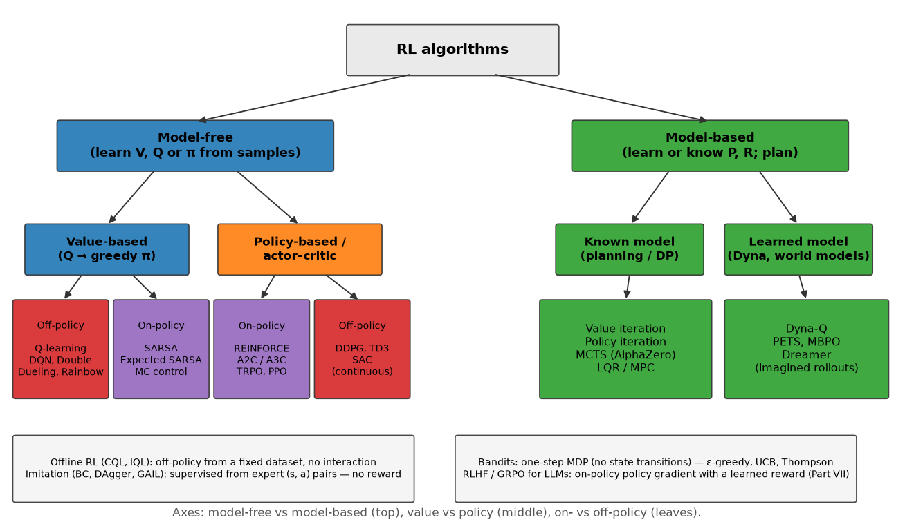
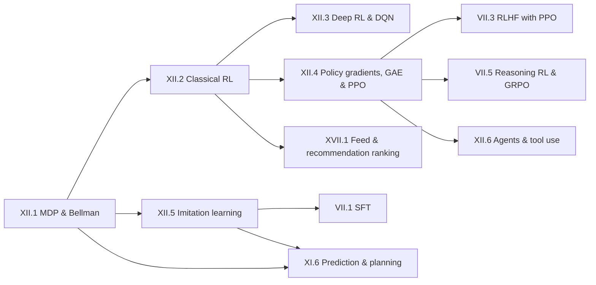

# Part XII — Reinforcement Learning

> **Why this part exists.** Most engineers meet RL backwards: they meet it as "the thing
> after SFT" in an RLHF diagram, learn the PPO clip formula as an incantation, and then
> cannot answer why there is a value head at all, or what the advantage is an advantage
> *over*. This part builds RL the way it is actually built — MDP, return, Bellman,
> dynamic programming, sampling, function approximation, policy gradients — so that when
> you reach [RLHF with PPO](../part07-post-training/03-rlhf-ppo.md),
> [DPO](../part07-post-training/04-dpo-and-friends.md) and
> [GRPO](../part07-post-training/05-reasoning-rl-grpo.md) in Part VII, every symbol is
> one you have already derived and coded.

The target: the Bellman equation should feel as natural to you as cross-entropy. You
should be able to write value iteration in ten minutes, explain why a target network
exists in one sentence, derive REINFORCE from the log-derivative trick at a whiteboard,
and say exactly what PPO's `min` is protecting you from.

## The map

{ width="820" }

Read the figure top-down as three independent questions an interviewer is really asking
when they ask "which algorithm would you use?":

1. **Do you have a model of the environment?** If you know $P(s'\mid s,a)$ and $R(s,a)$
   — a simulator you can query, a game's rules, a chip floorplan scorer — you can
   *plan*: value iteration, policy iteration, MCTS, MPC. If you only have samples, you
   are model-free. Model-based is far more sample-efficient and far more sensitive to
   model error; the classic failure is a policy that exploits a bug in your simulator.
2. **Do you learn a value function or a policy?** Value-based methods learn $Q$ and act
   greedily; they need a $\max_a$, so they want discrete actions, and they are naturally
   off-policy (they can learn from anyone's data, including a replay buffer). Policy-based
   methods parameterise $\pi_\theta$ directly; they handle continuous and huge action
   spaces and stochastic optimal policies, at the cost of being on-policy and
   sample-hungry. Actor–critic is the useful middle: a policy to act, a value function to
   cut the variance of its gradient.
3. **On- or off-policy?** On-policy means the data must come from the policy you are
   updating (REINFORCE, A2C, TRPO, PPO). Off-policy means it need not (Q-learning, DQN,
   DDPG/TD3/SAC, offline RL). This single axis decides your systems design: off-policy
   methods get replay buffers and can reuse logs; on-policy methods get rollout workers
   and throw data away after a few epochs.

Two whole families hang off the edges of the tree and matter enormously in production:
**bandits** (a one-step MDP — no state transitions — which is what most recommender and
ads "RL" actually is) and **imitation learning** (supervised learning from expert actions,
which is what most autonomy planners and every LLM SFT stage actually are).

## Chapters

| # | Chapter | What you will be able to do |
|---|---|---|
| 1 | [MDPs & Bellman equations](01-mdp-bellman.md) | Define an MDP, derive both Bellman equations, prove the policy improvement theorem, explain why value iteration converges, and say why perception makes autonomy a POMDP. |
| 2 | [Classical RL algorithms](02-classical-rl.md) | Derive UCB from Hoeffding, implement value/policy iteration, MC, TD(0), $n$-step, SARSA vs Q-learning, and explain maximisation bias. |
| 3 | [Deep RL & DQN](03-deep-rl-dqn.md) | Derive the DQN loss, explain replay and target networks as fixes for the deadly triad, and place Double/Dueling/PER/Rainbow/distributional RL. |
| 4 | [Policy gradients, GAE & PPO](04-policy-gradients-ppo.md) | Derive REINFORCE and the baseline identity, build GAE as exponentially weighted $n$-step advantages, and derive PPO's clipped objective *and its gradient*. |
| 5 | [Imitation learning](05-imitation-learning.md) | Explain BC's $O(T^2)$ compounding error, implement DAgger, and connect SFT-is-BC to why RLHF exists. |
| 6 | [Agents & tool use](06-agents-tool-use.md) | Frame an LLM agent as an MDP, build the observe–reason–act loop, and reason about evaluation, multi-agent systems and reliability. |

## Prerequisites

You do not need Parts IV–XI to read this part. You do need:

* **Probability** — expectation, conditional expectation, variance, the law of total
  expectation, and Beta/Bernoulli conjugacy for Thompson sampling:
  [Part I, Probability](../part01-math/03-probability.md).
* **Optimization** — SGD, Adam, gradient clipping, learning-rate schedules:
  [Part I, Optimization](../part01-math/06-optimization.md).
* **Neural nets and autograd** — MLPs, backprop, and what `.detach()` does:
  [Part III](../part03-neural-nets/index.md). Chapters 3–6 use PyTorch; chapters 1–2 are
  pure NumPy and need nothing but linear algebra.
* **Information theory** — KL divergence and entropy, for the entropy bonus, KL
  early-stopping and MaxEnt IRL: [Part I, Information theory](../part01-math/05-information-theory.md).

Everything else is built here. The environments are implemented from scratch in
`src/mlbook/rl/envs.py` (no `gym`), so every number in this part is reproducible with
`numpy`, `torch` and 30 seconds of CPU.

## Where this part is used elsewhere



Part VII assumes chapter 4. When it writes $\hat{A}_t$, the ratio $r_t(\theta)$, the
clipped objective and the KL penalty, it is pointing at derivations that live here.
Part XI's planner chapter assumes chapter 5. Part XVII's ranking chapter assumes the
bandit material in chapter 2.

## The "one day" ordering

If you have a single day before an RL-heavy interview, read in this order and skip
everything else. The times are for reading plus re-deriving on paper, not for writing
code.

| Slot | Read | Why it is on the critical path |
|---|---|---|
| 60 min | Ch. 1 §1–§2 through the Bellman optimality equation | Everything else is an approximation to this. Interviewers start here to calibrate you. |
| 30 min | Ch. 1 §2 policy improvement theorem + contraction sketch | The "why does this converge" question, asked at staff level. |
| 45 min | Ch. 2 §2 bandits (UCB derivation, Thompson) | The single most likely *production* RL question outside a lab. |
| 30 min | Ch. 2 §2 TD error, bias/variance vs MC; SARSA vs Q-learning | The most common whiteboard question in the classical block. |
| 45 min | Ch. 3 §2 DQN loss, replay, target network, deadly triad | The "deep RL is unstable, why?" question. |
| 90 min | Ch. 4 §2 all of it: REINFORCE → baseline → GAE → PPO clip | This is the chapter that pays for RLHF, GRPO and every agent question. |
| 30 min | Ch. 4 §5 the RLHF mapping table | Lets you answer LLM-RL questions without re-deriving anything. |
| 30 min | Ch. 5 §2 the $O(T^2)$ argument + DAgger | Autonomy interviews and "why not just SFT?" |
| 20 min | Every chapter's *TL;DR — the interview card* | Last pass, on the train. |

Then, if you have an evening: type `value_iteration`, `q_learning`, `compute_gae` and
`ppo_clip_loss` from memory and run the tests. Each chapter's **Retype by hand** section
tells you exactly which symbols to reproduce and what to run.

## Running the code

```bash
pip install -e .
pytest tests/test_rl_ -q          # all of Part XII's implementations
python figures/part12_gridworld_values.py   # regenerate any figure
```

All modules live under `src/mlbook/rl/`: `envs.py`, `bandits.py`,
`dynamic_programming.py`, `mc_td.py`, `q_learning.py`, `dqn.py`, `reinforce.py`,
`actor_critic.py`, `gae.py`, `ppo.py`, `behavioral_cloning.py`, `dagger.py`,
`agent_loop.py`.
