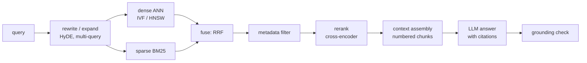
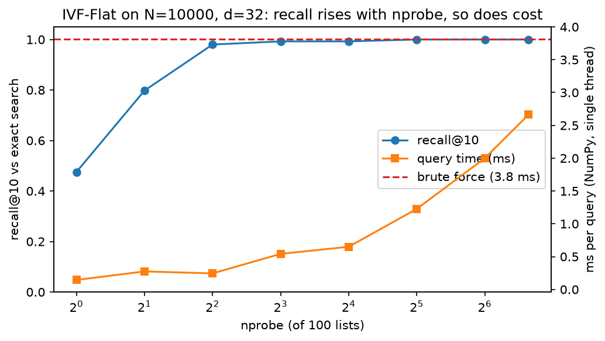
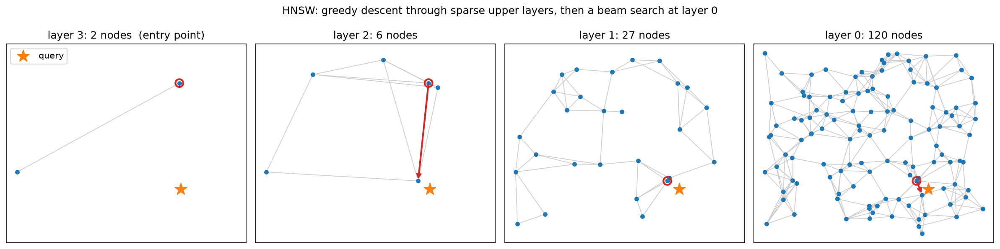
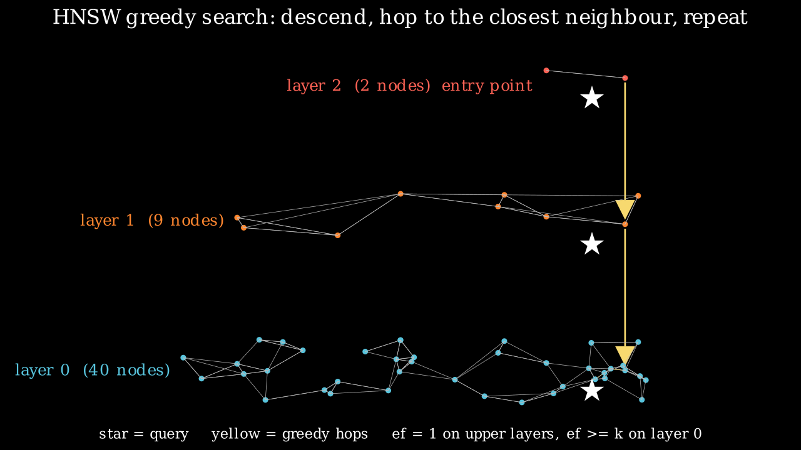
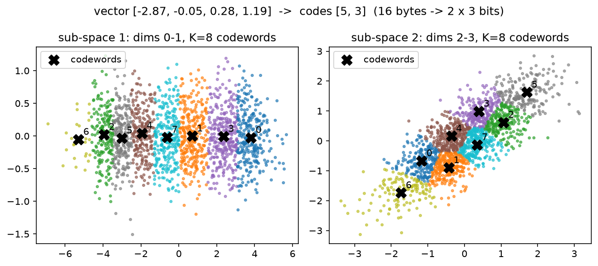

# Retrieval & RAG

> **Why this matters at staff level.** Retrieval is the one ML system almost every
> company runs at scale: search, recommendations, ads, visual search, and now every
> LLM product that has to know something the model was not trained on. In ML depth
> rounds you will be asked to derive BM25 or the MIPS-to-nearest-neighbour reduction and
> to explain *why* HNSW beats IVF at high recall; in system-design rounds you will be
> asked to size an index, choose a filter strategy, and say how you would know the RAG
> system is any good. Strong signal is naming the recall / latency / memory trade-off with
> numbers, committing to an index type, and describing the evaluation before the model.

## TL;DR: the interview card

* For unit vectors, $\norm{q-x}^2 = 2 - 2\cos(q,x)$: cosine, dot product and Euclidean
  give the **same ranking**. They differ only when norms carry information (popularity,
  confidence). MIPS reduces to NN by appending $\sqrt{M^2-\norm{x}^2}$ to each corpus
  vector and $0$ to the query.
* Bi-encoder: embed once, score with a dot product, $O(N d)$ per query and ANN-able.
  Cross-encoder: one Transformer pass per (query, doc) pair, far more accurate, only
  affordable on the top-$k$ (reranking). Train bi-encoders with InfoNCE, in-batch
  negatives, hard negatives, and log-Q correction when sampling is non-uniform.
* BM25: $\sum_t \mathrm{IDF}(t)\,\frac{f(k_1+1)}{f + k_1(1-b+b\,|D|/\mathrm{avgdl})}$.
  Saturating TF ($k_1$) plus length normalisation ($b$). Still the strongest zero-shot
  lexical baseline; hybrid (BM25 + dense) fused with RRF beats either alone.
* IVF: k-means coarse quantiser, scan `nprobe` of `n_list` lists; cost
  $\approx d\,(n_{\text{list}} + n_{\text{probe}} N / n_{\text{list}})$, minimised at
  $n_{\text{list}} \approx \sqrt{n_{\text{probe}} N}$. HNSW: layered proximity graph,
  greedy descent then beam search; $O(\log N)$ hops, parameters `M` (degree) and `ef`
  (beam). PQ: $M$ sub-quantisers with $K$ codewords each store a vector in
  $M \log_2 K$ bits (128-float, 512 B $\to$ 8 B for $M=8, K=256$) and score with
  $M$ table look-ups (asymmetric distance).
* Recall@k vs latency vs memory: flat (exact, $N d$ floats), IVF-Flat (fast, exact
  memory), HNSW (best latency at high recall, +$M$ ints per vector, slow builds),
  IVF-PQ (100× less memory, lower recall), GPU flat/IVF for batch throughput.
* Filtering: pre-filter (exact, cheap when the filter is selective), post-filter (cheap,
  can return fewer than $k$), in-filter / predicate-aware graph traversal (what the
  vector DBs actually do at medium selectivity).
* RAG = query rewrite → hybrid retrieval → rerank → context assembly with citations →
  generation → grounding check. Evaluate retrieval (recall@k, MRR) **separately** from
  generation (faithfulness, answer relevance) and from product success.
* Long context does not replace retrieval: cost is linear in context per query, recall
  degrades with position ("lost in the middle"), and you still need citations.
* Production: Facebook Search EBR (KDD 2020), YouTube two-tower with sampling-bias
  correction (RecSys 2019), Faiss (Meta), ScaNN (Google), Anthropic's contextual
  retrieval.

## 1. Intuition first

Take four documents and a query, all embedded into $\R^3$ and L2-normalised:

| id | text | embedding |
|---|---|---|
| 0 | "cats purr" | $(0.9, 0.4, 0.2)/\norm{\cdot}$ |
| 1 | "dogs bark" | $(0.8, -0.5, 0.3)/\norm{\cdot}$ |
| 2 | "index funds" | $(-0.2, 0.3, 0.9)/\norm{\cdot}$ |
| 3 | "kittens meow" | $(0.85, 0.5, 0.1)/\norm{\cdot}$ |

The query "do cats meow" embeds to $q = (0.9, 0.45, 0.15)/\norm{\cdot}$. Retrieval is a
single matrix–vector product $s = Xq \in \R^4$ followed by an argsort: documents 3 and 0
score near $1$, document 2 near $0$. This is all "dense retrieval" is. Three things make
it hard in practice:

1. **$N$ is large.** $N = 10^9$ vectors of $d = 128$ floats is 512 GB; scanning it per
   query is $1.3\times10^{11}$ FLOPs. You need an *index* that touches a small fraction of
   the corpus (IVF, HNSW) and a *compression* that fits it in RAM (PQ).
2. **The embedding is only as good as its training.** "do cats meow" and "kittens meow"
   share no tokens; a lexical method would miss it, a good embedder will not. The
   reverse failure exists too: an exact product code "XR-2201-B" is trivial for BM25 and
   terrible for most embedders. Hybrid retrieval exists because both failure modes are
   real.
3. **Retrieval is not the product.** A RAG assistant is judged on whether the *answer* is
   correct and grounded. Retrieval recall is necessary, not sufficient.

The pipeline you will build in §3 is the one you will draw on the whiteboard:



Each arrow is a place where recall is lost, and §4 tells you how to measure each one.

## 2. The math

### 2.1 Similarities and when they differ

For $q, x \in \R^d$:

$$
\norm{q-x}^2 = \norm{q}^2 + \norm{x}^2 - 2\,q^\top x,\qquad
\cos(q,x) = \frac{q^\top x}{\norm{q}\norm{x}}.
$$

If every corpus vector and the query are L2-normalised, $\norm{q}=\norm{x}=1$ and

$$
\boxed{\;\norm{q-x}^2 = 2 - 2\cos(q,x) = 2 - 2\,q^\top x\;}
$$

so the three orderings coincide and you should pick whichever your index computes
fastest (dot product). They diverge when norms differ. Two cases matter in production:

* **Norm carries signal you want.** In two-tower recommenders the item norm often grows
  with popularity; ranking by dot product then bakes in a popularity prior. That is
  sometimes what you want (retrieval stage) and sometimes not (diversity). Decide, do not
  discover.
* **Norm is noise.** Embeddings from a model trained with a cosine objective but stored
  un-normalised will rank by length. Normalise at index time and at query time.

**MIPS to NN.** Maximum inner product search is not a metric problem: $q^\top x$ can be
made large by scaling $x$. The reduction (Bachrach et al. 2014; Shrivastava & Li 2014)
lifts every corpus vector to a sphere. With $M = \max_i \norm{x_i}$,

$$
x' = \big[x,\ \sqrt{M^2 - \norm{x}^2}\big] \in \R^{d+1},\qquad q' = [q,\ 0],
$$

so $\norm{x'} = M$ for every $x$ and

$$
\norm{q'-x'}^2 = \norm{q}^2 + M^2 - 2\,q^\top x
\quad\Rightarrow\quad
\boxed{\;\argmin_x \norm{q'-x'} = \argmax_x q^\top x\;}
$$

because $\norm{q}^2 + M^2$ is constant over the corpus. Any L2 index now solves MIPS.
This is exactly what Faiss's `IndexFlatIP`-on-L2-hardware paths and older ANN libraries do
internally.

### 2.2 Bi-encoders, cross-encoders, and how embeddings are trained

A **bi-encoder** maps query and document independently, $e_q = f_\theta(q)$,
$e_d = g_\phi(d)$, and scores with $s(q,d) = e_q^\top e_d$. The corpus is embedded once;
serving cost is one query encode plus an ANN lookup. A **cross-encoder** feeds
`[CLS] q [SEP] d` through one Transformer and reads a scalar: full token-level
interaction, so it is much more accurate, but it costs a forward pass *per document* and
cannot be indexed. The production pattern is therefore bi-encoder for the top-1000,
cross-encoder for the top-50, and the interview question is always "why not cross-encode
everything?" (answer: $N$ forward passes per query; at $N=10^7$ that is minutes per query).

**Contrastive training (InfoNCE).** With a batch of $B$ (query, positive) pairs, treat the
other $B-1$ positives as negatives:

$$
\mathcal L = -\frac1B \sum_{i=1}^{B} \log
\frac{\exp\!\big(s(q_i, d_i)/\tau\big)}{\sum_{j=1}^{B} \exp\!\big(s(q_i, d_j)/\tau\big)}.
$$

This is a $B$-way softmax cross-entropy whose gradient with respect to the logits is
$p - y$ (see [softmax regression](../part02-classical/02-logistic-softmax-regression.md)):
each negative is pushed away in proportion to how confusable it already is. In-batch
negatives are free (one $B\times B$ matrix product), but they are *random* and therefore
mostly easy. Two corrections make the difference between a demo and a production
retriever:

* **Hard negatives.** Add, per query, documents that BM25 or the previous model ranked
  highly but that are not relevant. Facebook's EBR paper (Huang et al. 2020) reports that
  the *hardest* negatives hurt (many are false negatives or too-close-to-call), and that
  negatives sampled from the middle of the ranked list, blended with easy random
  negatives, worked best.
* **Sampling-bias (log-Q) correction.** When the batch is drawn from a stream, popular
  items appear as negatives far more often than uniformly. Yi et al. (RecSys 2019) correct
  the logit: $s(q_i,d_j) \leftarrow s(q_i,d_j) - \log \hat p_j$, where $\hat p_j$ is the
  estimated sampling probability of item $j$. Subtracting $\log \hat p_j$ inside the softmax
  is the importance-weighting that makes the in-batch estimator unbiased for the full
  softmax over the catalogue.

**Matryoshka embeddings** (Kusupati et al. 2022) train the same loss on nested prefixes
of the vector, $\mathcal L = \sum_{m \in \{64, 128, \dots, d\}} \mathcal L(e[:m])$, so a
truncated $64$-dim prefix is a usable coarse embedding. Serving use: shortlist with the
prefix (cheap ANN), rerank with the full vector.

### 2.3 BM25: derive it, do not memorise it

Start from the **binary independence model**: rank documents by
$\log \frac{P(D \mid R)}{P(D \mid \bar R)}$ with term presence independent given
relevance. With $p_t = P(t \in D \mid R)$ and $u_t = P(t \in D \mid \bar R)$, the
document-independent parts drop out and the score is a sum over query terms present in
$D$ of the Robertson–Spärck Jones weight

$$
w_t = \log \frac{p_t (1-u_t)}{u_t (1-p_t)}.
$$

With no relevance information take $p_t = 0.5$ and $u_t \approx n_t / N$ (the term's
document frequency over the corpus). Adding the usual $0.5$ smoothing gives

$$
\boxed{\;\mathrm{IDF}(t) = \log \frac{N - n_t + 0.5}{n_t + 0.5}\;}
$$

(Lucene adds $+1$ inside the log so it can never go negative for terms in more than half
the documents; our implementation does the same.)

**Term-frequency saturation.** The BIM ignores how *often* $t$ occurs. The 2-Poisson
model (a term is drawn from one Poisson if the document is "about" it, another if not)
yields a weight that rises with $f$ and saturates. Robertson replaced the intractable
exact form with the simplest function with those properties,

$$
\frac{f\,(k_1+1)}{f + k_1},
$$

which is $0$ at $f=0$, $1$ at $f=1$, and tends to $k_1 + 1$ as $f\to\infty$. $k_1$ sets
how fast: $k_1 = 0$ is binary presence, $k_1 \to \infty$ is raw TF.

**Length normalisation.** A long document has more occurrences by chance. Replace $k_1$
by $k_1\,(1 - b + b\,|D|/\mathrm{avgdl})$: at $b=1$ the TF is fully normalised by relative
length, at $b=0$ not at all. Putting the pieces together:

$$
\boxed{\;\mathrm{BM25}(q, D) = \sum_{t \in q} \mathrm{IDF}(t)\,
\frac{f(t,D)\,(k_1+1)}{f(t,D) + k_1\big(1 - b + b\,\tfrac{|D|}{\mathrm{avgdl}}\big)}\;}
\qquad (k_1 \approx 1.2\text{–}2,\ b \approx 0.75).
$$

It means: a document scores for each query term it contains, more for rare terms,
with diminishing returns in repetition, discounted if the document is long. **SPLADE**
(Formal et al. 2021) keeps this inverted-index shape but learns the term weights: a BERT
MLM head produces a sparse vocabulary-sized vector per document with a log-saturation
$\log(1 + \mathrm{ReLU}(\cdot))$ and an L1/FLOPS regulariser, so "expansion" terms the
document never contains can get weight. You serve it with the same posting lists as BM25.

### 2.4 Approximate nearest neighbours: three cost models

**IVF (inverted file).** Run k-means with $n_{\text{list}}$ centroids (the *coarse
quantiser*), assign each vector to its nearest centroid, and at query time scan only the
$n_{\text{probe}}$ lists whose centroids are closest. If lists are balanced, distance
computations per query are

$$
C_{\text{IVF}} \approx d\Big(n_{\text{list}} + n_{\text{probe}}\,\frac{N}{n_{\text{list}}}\Big),
\qquad
\frac{\partial C}{\partial n_{\text{list}}} = 0 \Rightarrow
\boxed{\;n_{\text{list}}^\star = \sqrt{n_{\text{probe}}\,N}\;}
$$

For $N = 10^6$ and $n_{\text{probe}} = 8$ that is $n_{\text{list}} \approx 2{,}800$; Faiss's
guidance of $4\sqrt N$ to $16\sqrt N$ lists is this formula with a typical probe count
folded in. Recall is lost when the true neighbour sits in a list you did not probe, which
happens most for queries near a Voronoi boundary: that is why recall rises quickly then
plateaus with $n_{\text{probe}}$ (see the figure in §3).

**HNSW.** Build a graph where each node links to $M$ near neighbours; a greedy walk
("move to the neighbour closest to $q$") converges to a local optimum in few hops if the
graph has long-range links. HNSW gets those links from *layers*: node $i$ is inserted up
to level

$$
\ell_i = \big\lfloor -\ln U_i \cdot m_L \big\rfloor,\quad U_i \sim \mathrm{Unif}(0,1),\quad m_L = \tfrac{1}{\ln M},
$$

so $P(\ell_i \ge \ell) = e^{-\ell/m_L} = M^{-\ell}$: layer $\ell$ holds about $N M^{-\ell}$
nodes and there are $\approx \log_M N$ layers. Search starts at the top layer's single
entry point, walks greedily with beam width $1$ down to layer 1, then at layer 0 runs a
beam search with $ef \ge k$ candidates. Each hop costs $M$ distance computations and
the number of hops is $O(\log N)$ under the small-world assumption, so

$$
C_{\text{HNSW}} \approx d \cdot \big(M \log_M N + ef \cdot M\big).
$$

`M` trades memory ($M$ int32 neighbours per node on layer 0, $2M$ in many
implementations) and build time for recall; `ef` (search) trades latency for recall at
query time with no rebuild, which is why it is the knob you expose to callers. The
pruning heuristic in the paper (keep a candidate only if it is closer to the new node
than to any already-kept neighbour) is what preserves long-range links; our
implementation uses the simpler "keep the $M$ closest" which is adequate for
a few thousand points and shows the same scaling.

**PQ (product quantisation).** Split $x \in \R^d$ into $M$ sub-vectors of $d/M$ dims and
quantise each with its own $K$-word codebook $C_m \in \R^{K \times d/M}$. Storage per vector
becomes

$$
\boxed{\;M \log_2 K \text{ bits}\quad(\text{vs } 32 d\text{ bits for float32})\;}
$$

For $d = 128$, $M = 8$, $K = 256$: $8 \times 8 = 64$ bits $= 8$ bytes against $512$ bytes,
a $64\times$ reduction, while the effective number of centroids is $K^M = 256^8 \approx
1.8\times10^{19}$ for only $M K \, d/M = K d$ stored floats. **Asymmetric distance
computation (ADC)** keeps the query exact: precompute $T[m, j] = \norm{q_m - C_m[j]}^2$,
an $M\times K$ table ($8\times256$ floats, in L1 cache), then

$$
\widehat{\norm{q - x}^2} = \sum_{m=1}^{M} T\big[m,\ \mathrm{code}_m(x)\big],
$$

$M$ look-ups and adds per vector instead of $d$ multiply-adds. The estimate is unbiased
up to the quantisation error of $x$ alone (symmetric DC quantises $q$ too and doubles the
error). **IVF-PQ** combines both: quantise the *residual* $x - c_{\text{list}}$, which has
lower variance than $x$ and therefore smaller distortion per bit.

**OPQ and anisotropic quantisation (literacy).** PQ assumes sub-spaces are roughly
independent and equally important; correlated dimensions waste codewords (the PQ figure
in §3 shows a correlated sub-space where several codewords line up along one diagonal).
OPQ (Ge et al. 2013) learns an orthogonal rotation $R$ before splitting so that variance is
balanced across sub-spaces. ScaNN's **anisotropic** loss (Guo et al. 2020) observes that for
MIPS what matters is the error *parallel* to the query direction, not the total error, and
weights the quantisation loss to penalise parallel error more; that is the reason ScaNN's
recall-vs-throughput curve beats plain PQ at the same bit budget.

### 2.5 Reciprocal rank fusion

Sparse and dense scores live on different scales (BM25 is unbounded, cosine is in
$[-1,1]$), so adding them requires calibration. Rank fusion sidesteps it:

$$
\boxed{\;\mathrm{RRF}(d) = \sum_{r \in \text{rankers}} \frac{1}{k + \mathrm{rank}_r(d)}\;},\qquad k \approx 60.
$$

$k$ damps the contribution of top ranks so that a document ranked first by one system
and absent from the other does not automatically win. Cormack, Clarke and Buettcher
(SIGIR 2009) found it competitive with learned fusion; in practice it is the default in
every vector DB's "hybrid" mode because it needs no tuning per corpus.

### 2.6 What "good" means for RAG

Retrieval and generation must be scored separately, because they fail separately:

| Stage | Metric | Definition |
|---|---|---|
| retrieval | recall@k | fraction of gold passages present in the top-$k$ |
| retrieval | MRR / NDCG@k | position-aware; see [Evaluation §2.3](02-evaluation.md#23-ranking-metrics-ndcg-mrr-map) |
| context | context precision | fraction of retrieved chunks that are relevant (RAGAS) |
| generation | faithfulness | fraction of answer claims supported by the context (NLI or LLM judge) |
| generation | answer relevance | does the answer address the question (judge) |
| generation | citation precision | fraction of cited chunks that support the cited claim |
| product | task success / deflection / thumbs-up | what the business measures |

RAGAS (Es et al. 2023) formalised faithfulness as: decompose the answer into atomic
statements, ask a judge whether each is entailed by the context, report the supported
fraction. Everything in [Evaluation §2.7](02-evaluation.md#27-llm-evaluation)
about validating judges applies.

## 3. Implementation

All code lives in `src/mlbook/retrieval/`. The pieces below are the ones you should be
able to write on a whiteboard; the full files are collapsed at the end of the section.

### 3.1 Similarities and the MIPS reduction

```python
def squared_euclidean(Q: np.ndarray, X: np.ndarray) -> np.ndarray:
    q2 = np.sum(Q * Q, axis=1, keepdims=True)  # (Nq, 1)
    x2 = np.sum(X * X, axis=1)[None, :]  # (1, N)
    d2 = q2 + x2 - 2.0 * (Q @ X.T)  # (Nq, N)
    return np.maximum(d2, 0.0)  # (Nq, N)


def mips_to_nn_corpus(X: np.ndarray) -> np.ndarray:
    norms2 = np.sum(X * X, axis=1)  # (N,)
    M2 = float(np.max(norms2))
    extra = np.sqrt(np.maximum(M2 - norms2, 0.0))[:, None]  # (N, 1)
    return np.concatenate([X, extra], axis=1)  # (N, d + 1)
```

The expansion form of the squared distance is what every index actually computes: one
GEMM plus two norm vectors, never an explicit $(N_q, N, d)$ difference tensor. The
`np.maximum(…, 0)` absorbs the rounding that makes a self-distance come out at $-10^{-13}$.

### 3.2 BM25

```python
def term_score(self, tf: float, doc_len: float) -> float:
    denom = tf + self.k1 * (1.0 - self.b + self.b * doc_len / self.avgdl)
    return tf * (self.k1 + 1.0) / denom

def score(self, query: str) -> np.ndarray:
    scores = np.zeros(self.n_docs)  # (N,)
    for term in tokenize(query):
        idf = self.idf.get(term)
        if idf is None:
            continue
        for i, tf in enumerate(self.doc_tfs):
            f = tf.get(term, 0)
            if f:
                scores[i] += idf * self.term_score(f, self.doc_lens[i])
    return scores
```

The loop over all documents is the toy version; a real engine iterates the *posting
list* of each term (only documents containing it), which is why sparse retrieval is fast
for rare terms and slow for stop words. The IDF is precomputed in `fit` exactly as boxed
in §2.3.

### 3.3 IVF

```python
def search(self, q: np.ndarray, k: int, nprobe: int = 1):
    q2 = q[None, :]  # (1, d)
    cd2 = squared_euclidean(q2, self.centroids)[0]  # (n_list,)
    probe = np.argsort(cd2)[:nprobe]  # (nprobe,)
    cand = np.concatenate([self.lists[j] for j in probe])  # (n_cand,)
    d2 = squared_euclidean(q2, self.X[cand])[0]  # (n_cand,)
    k = min(k, cand.size)
    order = np.argsort(d2)[:k]  # (k,)
    return cand[order], d2[order]
```

Two scans: `n_list` centroid distances, then `n_cand ≈ nprobe · N / n_list` exact
distances. The k-means that builds the centroids uses k-means++ seeding
(`kmeans_pp_init`) because a bad seed produces empty or giant lists and the cost model
above assumes balance.

{ width="640" }

*Recall@10 (blue) climbs steeply and saturates while query time (orange) keeps rising
linearly with `nprobe`; at `nprobe = n_list` you pay more than brute force because of
the extra centroid scan. Pick the knee.*

### 3.4 HNSW beam search

```python
def _search_layer(self, q, entry, ef, layer):
    d0 = self._dist(q, entry)
    visited = {entry}
    candidates = [(d0, entry)]  # min-heap on distance
    results = [(-d0, entry)]  # max-heap (negated) of the current best ef
    while candidates:
        d_c, c = heapq.heappop(candidates)
        if d_c > -results[0][0]:
            break  # nothing closer left to expand
        for nb in self.graph[layer].get(c, ()):
            if nb in visited:
                continue
            visited.add(nb)
            d_nb = self._dist(q, nb)
            if d_nb < -results[0][0] or len(results) < ef:
                heapq.heappush(candidates, (d_nb, nb))
                heapq.heappush(results, (-d_nb, nb))
                if len(results) > ef:
                    heapq.heappop(results)
    return sorted((-d, i) for d, i in results)
```

This is the whole algorithm: a best-first expansion bounded by a fixed-size result
heap. `ef = 1` makes it the greedy walk used on upper layers; `ef ≥ k` at layer 0 makes it
a beam search whose recall grows with `ef`. Insertion (`add`) runs the same routine to find
the `M` neighbours to link to on every layer the new node lives in.

{ width="760" }

*Layer counts fall geometrically (120 → 27 → 6 → 2 with `M = 4`); the red arrows are the
greedy hops. Upper layers move the search across the space in one or two hops; layer 0
finishes it locally.*

{ width="640" }

### 3.5 PQ with asymmetric distances

```python
def distance_table(self, q: np.ndarray) -> np.ndarray:
    table = np.zeros((self.M, self.K))  # (M, K)
    for m in range(self.M):
        q_sub = q[m * self.d_sub : (m + 1) * self.d_sub][None, :]  # (1, d_sub)
        table[m] = squared_euclidean(q_sub, self.codebooks[m])[0]  # (K,)
    return table

def asymmetric_distances(self, q: np.ndarray, codes: np.ndarray) -> np.ndarray:
    table = self.distance_table(q)  # (M, K)
    rows = np.arange(self.M)[None, :]  # (1, M)
    return table[rows, codes].sum(axis=1)  # (N,)
```

`table[rows, codes]` gathers, for every stored vector, the $M$ entries selected by its
codes, that single fancy-index line is the "$M$ look-ups per vector" from §2.4. The test
checks that the ADC distance equals the exact distance to the *reconstructed* vector,
which is the identity that makes ADC correct.

{ width="640" }

*Two sub-spaces of a 4-dim vector with $K = 8$ codewords each; the vector in the title
becomes the pair of codes $(5, 3)$. The right-hand sub-space is correlated, so codewords
line up along a diagonal and waste resolution, the case OPQ's rotation fixes.*

### 3.6 RRF and the RAG pipeline

```python
def reciprocal_rank_fusion(rankings, k=60):
    fused: dict[int, float] = {}
    for ranking in rankings:
        for rank, doc_id in enumerate(ranking, start=1):
            fused[doc_id] = fused.get(doc_id, 0.0) + 1.0 / (k + rank)
    return sorted(fused.items(), key=lambda kv: (-kv[1], kv[0]))
```

```python
def retrieve(self, query, k=5, k_candidates=20, metadata_filter=None, nprobe=2):
    dense_ids = self._dense(query, k_candidates, nprobe)            # list of k_candidates ids
    sparse_ids, _ = self.bm25.topk(query, k_candidates)              # (k_candidates,)
    fused = reciprocal_rank_fusion([dense_ids, sparse_ids.tolist()], k=self.rrf_k)
    cands = [self.chunks[i] for i, _ in fused]
    if metadata_filter is not None:
        cands = [c for c in cands if metadata_filter(c.metadata)]   # post-filter
    scores = self.reranker(query, cands)  # (n_cand,)
    order = np.argsort(-scores, kind="stable")[:k]  # (k,)
    return [cands[i] for i in order]
```

`RAGPipeline.index` chunks each document (structural by default: blank-line
paragraphs, which is what OCR block output looks like), embeds the chunks with the
hashing embedder (a deterministic stand-in for a neural encoder), fits BM25, and
optionally builds an IVF index. `answer` composes a prompt with numbered context blocks
and calls a deterministic *extractive* generator that returns the best-matching sentence
with a `[i]` citation, so the whole pipeline, including citation precision and a lexical
faithfulness score, is testable offline in milliseconds.

**How you'd test it.** `tests/test_retrieval_similarity.py` checks the MIPS reduction
recovers the argmax inner product on vectors with varied norms. `test_retrieval_bm25.py`
checks the IDF formula and a hand-computed document score. `test_retrieval_ivf.py`
checks that `nprobe = n_list` equals brute force and recall is monotone in `nprobe`.
`test_retrieval_hnsw.py` checks degree caps, geometric layer sizes and recall@10 ≥ 0.9
at `ef = 100`. `test_retrieval_pq.py` checks ADC equals the distance to the
reconstruction. `test_retrieval_hybrid.py` checks RRF against hand-computed values.
`test_retrieval_rag.py` runs the pipeline end to end with and without IVF and with a
metadata filter.

??? example "Full implementation: `src/mlbook/retrieval/similarity.py`"
    ```python
    --8<-- "src/mlbook/retrieval/similarity.py"
    ```

??? example "Full implementation: `src/mlbook/retrieval/bm25.py`"
    ```python
    --8<-- "src/mlbook/retrieval/bm25.py"
    ```

??? example "Full implementation: `src/mlbook/retrieval/ivf.py`"
    ```python
    --8<-- "src/mlbook/retrieval/ivf.py"
    ```

??? example "Full implementation: `src/mlbook/retrieval/hnsw.py`"
    ```python
    --8<-- "src/mlbook/retrieval/hnsw.py"
    ```

??? example "Full implementation: `src/mlbook/retrieval/pq.py`"
    ```python
    --8<-- "src/mlbook/retrieval/pq.py"
    ```

??? example "Full implementation: `src/mlbook/retrieval/hybrid.py`, `toy_embedder.py`, `rag.py`"
    ```python
    --8<-- "src/mlbook/retrieval/hybrid.py"
    ```
    ```python
    --8<-- "src/mlbook/retrieval/toy_embedder.py"
    ```
    ```python
    --8<-- "src/mlbook/retrieval/rag.py"
    ```

## Retype by hand

Reproduce these from memory, then run the named test. The pipeline glue is worth reading
but not memorising.

| Symbol | File | Target time | Test |
|---|---|---|---|
| `squared_euclidean`, `mips_to_nn_corpus`, `mips_to_nn_query`, `brute_force_topk` | `src/mlbook/retrieval/similarity.py` | 10 min | `pytest tests/test_retrieval_similarity.py -q` |
| `BM25.fit`, `BM25.term_score`, `BM25.score` | `src/mlbook/retrieval/bm25.py` | 15 min | `pytest tests/test_retrieval_bm25.py -q` |
| `kmeans_pp_init`, `kmeans`, `IVFIndex.train/add/search` | `src/mlbook/retrieval/ivf.py` | 20 min | `pytest tests/test_retrieval_ivf.py -q` |
| `HNSW._search_layer`, `HNSW.add`, `HNSW.search` | `src/mlbook/retrieval/hnsw.py` | 30 min | `pytest tests/test_retrieval_hnsw.py -q` |
| `ProductQuantizer.train/encode/decode/distance_table/asymmetric_distances` | `src/mlbook/retrieval/pq.py` | 20 min | `pytest tests/test_retrieval_pq.py -q` |
| `reciprocal_rank_fusion` | `src/mlbook/retrieval/hybrid.py` | 5 min | `pytest tests/test_retrieval_hybrid.py -q` |

Read, do not retype: `HashNGramEmbedder`, the chunkers, `overlap_reranker`,
`extractive_generator`, `compose_prompt`, `RAGPipeline` and the RAG metrics in `rag.py`
(`pytest tests/test_retrieval_rag.py -q` checks them).

## 4. Systems view: cost, failure modes, trade-offs

### 4.1 The index selection table

For $N = 10^8$, $d = 768$ float32 (a typical text-embedding corpus); numbers are the
structural formulas from §2.4, not benchmark claims.

| Index | Memory | Query cost | Recall | Build | Use when |
|---|---|---|---|---|---|
| Flat (exact) | $4Nd$ = 307 GB | $Nd$ | 1.0 | none | $N \lesssim 10^6$, or GPU batch scoring |
| IVF-Flat | $4Nd$ + centroids | $d(n_{\text{list}} + n_{\text{probe}} N/n_{\text{list}})$ | 0.9–0.99 (tune `nprobe`) | one k-means | RAM is fine, need updates, want a tunable knob |
| HNSW | $4Nd + 4 N \cdot 2M$ (≈ +6 GB at $M=32$) | $d\,(M\log N + ef\,M)$ | 0.95–0.999 at low latency | slow, sequential inserts, hard to shard | latency-critical, $N$ fits in RAM per shard |
| IVF-PQ | $N M$ bytes (800 MB at $M=8$… 7.7 GB at $M=96$) + codebooks | as IVF, ADC per candidate | 0.6–0.9 unless re-ranked | k-means × ($1 + M$) | $N$ too large for RAM; re-rank top-$k'$ with exact vectors |
| HNSW over PQ / DiskANN | codes in RAM, full vectors on SSD | graph hops + SSD reads | 0.95+ | slow | billion-scale on one machine |
| GPU flat / IVF | $4Nd$ in HBM | GEMM-bound | 1.0 / tunable | fast | high query throughput, batched queries |

**Decision rule.** Start with HNSW if the shard fits in RAM and p99 latency matters;
IVF-Flat if you need frequent inserts/deletes and a simple recall knob; IVF-PQ with
exact re-ranking of the top few hundred when memory is the binding constraint; flat on
GPU when queries arrive in large batches (recommendation candidate generation, offline
dedup). Say the recall target *first* (recall@100 ≥ 0.95 against exact search is a
common bar for a candidate generator), then pick the cheapest index that meets it.

### 4.2 Filtering

Every product query has predicates: `tenant_id = 42`, `date > 2024`, `language = 'de'`.

* **Pre-filter**: compute the allowed id set, then search only those. Exact, and cheap
  when the filter is selective enough that a brute-force scan over the survivors is fine
  (say $<10^5$ ids). For a graph index it *breaks* traversal: if 1 % of nodes pass, most
  neighbours are forbidden and the greedy walk gets stuck.
* **Post-filter**: search top-$k'$ with $k' \gg k$, then drop non-matching. Cheap, but
  with a 1 % filter you need $k' \approx 100k$ to expect $k$ survivors, and you can still
  return fewer than $k$.
* **In-filter / predicate-aware traversal**: evaluate the predicate during graph
  expansion and keep expanding through non-matching nodes without returning them (ACORN,
  SIGMOD 2024, is the published version of this idea; Filtered-DiskANN builds label-aware
  graphs). Weaviate's documentation describes pre-filtering with an allow-list combined
  with HNSW traversal and a fallback to flat search when the filter is very selective;
  Milvus and Pinecone document metadata filtering integrated into the ANN search rather
  than applied afterwards. The point for an interview: the right strategy depends on
  filter selectivity, and a production system switches strategy by selectivity.

### 4.3 Sharding, replication, updates

Shard by id range or hash when one machine's RAM is the limit; every query fans out to all
shards and merges top-$k$ (scatter–gather), so tail latency is the *max* over shards.
Shard by tenant or partition key when queries are always filtered on it: no fan-out, and
filtering becomes free. Replicate for QPS and availability. HNSW inserts are cheap but
deletes are tombstones until a rebuild; IVF supports both with a list append or removal,
but drifts when the
distribution changes (retrain centroids periodically). Embedding model upgrades require a
full re-index, plan blue/green indexes.

### 4.4 GPU ANN

A flat index on GPU is a GEMM followed by a k-selection; Faiss's GPU implementation
(Johnson, Douze & Jégou 2017) is built around an efficient in-register k-select and IVF
lists laid out for coalesced scans. Graph indexes on GPU (CAGRA in NVIDIA cuVS) build
the graph with GPU-friendly batched neighbour refinement. Use GPUs when queries are
batched (thousands at a time) or when you need to rebuild large indexes often; a single
interactive query is usually served faster from a CPU HNSW shard in RAM.

### 4.5 Chunking, especially for documents and OCR output

* **Fixed windows** (tokens or characters) with 10–20 % overlap: robust, dumb, splits
  tables and sentences. Overlap trades index size for not losing facts at boundaries.
* **Structural**: split on headings, paragraphs, table rows, OCR layout blocks. Best
  when the source has structure (PDFs, forms, invoices). For OCR output, keep the block's
  page, bounding box and reading order as metadata: citations then point at a region of a
  page, which is what a reviewer needs to verify the answer.
* **Semantic**: split where embedding similarity between adjacent sentences drops.
  Costs an embedding pass at index time; helps on long prose.
* **Contextual**: prepend a short LLM-written summary of where the chunk sits in the
  document before embedding it (Anthropic's contextual retrieval, §5). Fixes the
  "this chunk says *the company's revenue grew 3 %* but never names the company" failure.
* **Parent–child**: index small chunks for precision, return their parent section for
  context.

### 4.6 Query-side techniques

* **Query rewriting** (LLM rewrites a conversational turn into a standalone query).
* **HyDE** (Gao et al. 2022): generate a hypothetical answer and embed *that*; the
  answer's embedding is closer to answer passages than the question's is.
* **Multi-query**: several paraphrases, union the results, fuse with RRF.
* **Contextual compression**: after retrieval, extract only the sentences relevant to
  the query before they enter the prompt; cuts tokens and reduces distraction.
* **Iterative / agentic retrieval**: the model decides whether to retrieve again with a
  refined query (Self-RAG, ReAct-style tool loops). Costs latency; wins on multi-hop.
* **GraphRAG** (Edge et al. 2024): extract an entity graph, summarise communities, answer
  "global" questions ("what are the main themes?") from community summaries that flat
  chunk retrieval cannot answer.

### 4.7 Long context vs RAG

A 1M-token context does not remove retrieval; it changes where the cost lands:

| | RAG | Long context |
|---|---|---|
| per-query cost | embed query + ANN + $k$ chunks (thousands of tokens) | the whole document set every query (prefill is $O(T)$ FLOPs, KV memory $O(T)$) |
| freshness | re-index a chunk | re-send everything |
| attribution | chunk-level citations for free | must be asked for; harder to verify |
| recall | bounded by retrieval quality | degrades with position ("Lost in the Middle", Liu et al. 2023) and with distractors |
| best for | large, changing corpora; auditability | small corpora that fit; reasoning across many parts of one document |

Production systems combine them: retrieve a generous top-$k$, then let a long-context
model reason over it. Cache what you can, embedding of repeated queries, KV cache of a
shared prefix (system prompt + stable context), and full responses for exact-duplicate
queries.

### 4.8 Failure modes checklist

* Recall lost at the ANN layer (measure recall@k against exact search, not against gold).
* Chunk boundaries splitting the fact (measure with "needle" passages).
* Reranker over-trusted: it can only reorder what retrieval found.
* Stale index after a document update (freshness SLO).
* Metadata filter applied post-hoc returning fewer than $k$.
* Model answers from parametric memory when context is missing (check refusal rate on
  unanswerable queries).
* Judge-based faithfulness scores drifting with judge model version.

## 5. In production

!!! production "Meta: embedding-based retrieval in Facebook Search (Huang et al., KDD 2020)"
    **Problem.** Keyword retrieval could not capture personalised or fuzzy intent in
    social search ("photos of my cousin's wedding"). **Built.** A unified two-tower
    embedding model (query tower with searcher context and social graph features,
    document tower), trained with a triplet loss; hard negatives mined both online
    (in-batch) and offline (from the previous model's ranked lists), with the finding that
    mid-ranked rather than hardest negatives, blended with easy negatives, worked best.
    Served by adding an approximate-NN operator to the existing inverted-index engine so
    that embedding retrieval could be *combined with* term matching and filters in one
    query, with coarse quantisation plus PQ tuned for recall/latency and later stages
    retrained to consume embedding features. **Why.** Embedding retrieval alone lost the
    precision of exact term constraints; hybrid inside one engine kept both. Paper:
    "Embedding-based Retrieval in Facebook Search", arXiv:2006.11632.

!!! production "Google / YouTube: two-tower retrieval with sampling-bias correction (Yi et al., RecSys 2019)"
    **Problem.** Training a softmax over hundreds of millions of items is impossible;
    in-batch negatives from a streaming pipeline over-sample popular items. **Built.** A
    two-tower model trained with in-batch softmax where each logit is corrected by
    $-\log \hat p_j$, with $\hat p_j$ estimated online from the gap between successive
    appearances of item $j$ in the stream (a streaming frequency estimator). Retrieval is
    a dot product over item embeddings with an ANN index. **Why.** The correction makes
    the cheap in-batch estimator approximate the full softmax and stopped popular items
    from being pushed away as false negatives. Paper: "Sampling-Bias-Corrected Neural
    Modeling for Large Corpus Item Recommendations", RecSys 2019.

!!! production "Meta: Faiss (Johnson, Douze & Jégou 2017; Douze et al. 2024)"
    **Problem.** Billion-scale similarity search for images and embeddings with
    predictable memory. **Built.** A library organised around the trade-off of IVF
    coarse quantisers, PQ/OPQ compression and HNSW/flat exact options, with a GPU
    implementation whose k-selection runs in registers so IVF scans are memory-bandwidth
    bound rather than sort bound. The 2024 paper describes the design principles: every
    index is a point in the (recall, latency, memory, build time) space and the library
    exposes the knobs explicitly. **Why.** No single index wins; a library that makes the
    trade-off explicit lets each product pick its point. Papers: "Billion-scale
    similarity search with GPUs", arXiv:1702.08734; "The Faiss library", arXiv:2401.08281.

!!! production "Google: ScaNN (Guo et al., ICML 2020)"
    **Problem.** Serve MIPS at scale with quantised vectors without the recall loss that
    plain PQ incurs. **Built.** Anisotropic vector quantisation: the codebook training
    loss penalises the component of quantisation error parallel to the data point (which
    changes inner products with likely queries) more than the orthogonal component, plus
    a partitioning stage and a re-scoring stage. **Why.** For MIPS, minimising *total*
    reconstruction error is the wrong objective; minimising the error that affects the
    ranking gives better recall at the same bits. Paper: "Accelerating Large-Scale
    Inference with Anisotropic Vector Quantization", arXiv:1908.10396; Google AI blog post
    "Announcing ScaNN: Efficient Vector Similarity Search" (July 2020).

!!! production "Anthropic: contextual retrieval (September 2024)"
    **Problem.** Chunks lose their context when embedded in isolation ("revenue grew
    3 %", whose revenue, which quarter?). **Built.** For each chunk, an LLM (with prompt
    caching to make it affordable) writes a short chunk-specific context using the whole
    document; the context is prepended before computing *both* the embedding and the
    BM25 representation. Results are fused, and a reranker is applied on the top
    candidates. **Reported.** The post reports that contextual embeddings plus contextual
    BM25 reduced the top-20-chunk retrieval failure rate by 49 % relative to the baseline,
    and 67 % when combined with reranking. **Why.** Hybrid retrieval and reranking are
    complementary to better chunk representations; each addresses a different loss of
    recall. Post: "Introducing Contextual Retrieval", anthropic.com news, 2024.

## 6. Interview questions and strong answers

!!! interview "Q1. Cosine or dot product for my index?"
    **Answer.** If both sides are L2-normalised they are the same ranking and dot product
    is cheaper, so normalise at index and query time and use IP. Keep raw dot product
    only when the norm carries a signal you want (popularity in a two-tower recommender)
    and you have checked that the ranking with and without normalisation differs in a
    way the product wants. Euclidean is equivalent on the sphere and is what most
    quantisers assume, so IVF-PQ pipelines often convert IP to L2 via the
    $\sqrt{M^2 - \norm{x}^2}$ augmentation.
    **Staff follow-up.** "Your two-tower model's item norms grew during training and
    retrieval became popularity-dominated. What do you do?" Diagnose (plot norm vs
    popularity), then either normalise both towers and add an explicit popularity feature
    to the ranker where you can control it, or add a norm-penalty / temperature to the
    contrastive loss. Do not fix it by post-filtering popular items.

!!! interview "Q2. Why does HNSW beat IVF at recall 0.99, and when would you still pick IVF?"
    **Answer.** IVF's recall loss comes from neighbours sitting in unprobed cells; the
    last few percent of recall require probing a large fraction of lists, so cost grows
    linearly toward brute force. HNSW's search cost grows roughly with $ef \cdot M$ and
    $\log N$; pushing recall from 0.95 to 0.99 is a modest increase in `ef`. Pick IVF
    when: memory must be compressed (IVF-PQ), you need cheap inserts *and* deletes, the
    index is on GPU, or you want a single interpretable knob for an SLA. Also when the
    build time of HNSW (sequential inserts, hours at $10^8$) does not fit your re-index
    cadence.
    **Staff follow-up.** "How do you shard HNSW to $10^9$?" Shard by hash into RAM-sized
    pieces, fan out, merge; or partition with a coarse k-means first (IVF over HNSW
    shards) so each query touches a few shards; or move to a disk-resident graph
    (DiskANN-style) with PQ codes in RAM.

!!! interview "Q3. Derive BM25's IDF and explain $k_1$ and $b$."
    **Answer.** From the binary independence model, the log-odds of relevance
    contributed by a present term is $\log \frac{p(1-u)}{u(1-p)}$; with no relevance
    feedback, $p = 1/2$ and $u = n_t/N$ gives $\log\frac{N - n_t + 0.5}{n_t + 0.5}$ after
    smoothing. $k_1$ controls TF saturation: the factor $\frac{f(k_1+1)}{f+k_1}$ is 1 at
    $f=1$ and tends to $k_1+1$; small $k_1$ means presence matters, not repetition. $b$
    scales $k_1$ by $|D|/\mathrm{avgdl}$: $b = 1$ fully discounts long documents, $b=0$
    ignores length.
    **Staff follow-up.** "Your OCR corpus has documents of wildly different lengths and
    OCR noise. What changes?" Lower $b$ hurts short-document precision, so keep $b$ but
    chunk documents to comparable lengths; add character n-gram or fuzzy matching for
    OCR errors; consider SPLADE-style learned expansions to bridge misspellings.

!!! interview "Q4. Design retrieval for a RAG assistant over 50 M enterprise documents with per-tenant access control."
    **Answer.** Requirements first: tenants must never see each other's documents
    (hard constraint), p95 < 500 ms end to end, freshness within minutes, citations
    required. Partition the index by tenant so access control is a partition key, not a
    filter; large tenants get their own HNSW shards, small ones share an IVF index with
    a pre-filter on tenant id. Structural chunking with page/bbox metadata, contextual
    prefix for chunks, hybrid BM25 + dense fused with RRF, cross-encoder reranking of the
    top 50, top 8 into the prompt with numbered citations. Streaming ingest updates BM25
    and the dense index; nightly rebuilds compact tombstones. Evaluate retrieval recall@k
    on a labelled set per tenant tier, faithfulness with a validated judge, and product
    metrics online.
    **Staff follow-up.** "A tenant has 200 documents and another has 20 M. Same index?"
    No: the small one is cheaper to brute-force under a pre-filter; the large one needs
    its own graph shard. The abstraction is "a router that chooses the strategy by
    partition size", and you say that out loud.

!!! interview "Q5. How do you evaluate a RAG system and what do you do when faithfulness drops?"
    **Answer.** Three separate dashboards: retrieval (recall@k, MRR against gold
    passages; ANN recall against exact search), generation (faithfulness and answer
    relevance from a judge validated against human labels; citation precision), product
    (task success, escalation rate). When faithfulness drops, first check retrieval
    recall on the same queries; most "hallucinations" are missing context. If retrieval
    is fine, check context assembly (truncation, ordering; put the best chunk first and
    last), then the prompt (instruction to abstain), then the model version. Add
    unanswerable queries to the eval so you measure abstention.
    **Staff follow-up.** "Your judge is GPT-class and your generator is GPT-class." Then
    self-preference bias is a risk; validate judge agreement with humans on a stratified
    sample and re-validate on every judge upgrade.

!!! interview "Q6. Product quantisation: derive the memory saving and the ADC cost."
    **Answer.** As in §2.4: $M \log_2 K$ bits per vector; $d=128$, $M=8$, $K=256$ gives
    8 bytes vs 512 bytes, $64\times$. ADC precomputes an $M\times K$ table of sub-distances
    once per query ($K d$ multiply-adds) and then scores each vector with $M$ table
    look-ups; for $N$ candidates that is $NM$ adds instead of $Nd$ multiply-adds.
    The error is the quantisation error of $x$ only; SDC adds the query's.
    **Staff follow-up.** "Recall at 8 bytes is too low." Increase $M$ (16 or 32 bytes),
    quantise IVF residuals instead of raw vectors, apply OPQ rotation, and re-rank the
    top 100 candidates with the exact vectors kept on SSD.

!!! interview "Q7. When is long context better than RAG?"
    **Answer.** When the corpus is small enough to fit and changes rarely, when the
    question needs reasoning across many parts of the same document (retrieval would
    fragment it), or when you cannot build a good retriever for the domain. RAG wins on
    cost per query at scale (you pay for $k$ chunks, not the corpus), on freshness, and
    on attribution. Cite the position-sensitivity result (Liu et al. 2023): recall in the
    middle of long contexts is worse, so "just stuff it all in" has its own recall loss.
    **Staff follow-up.** "Costs?" Prefill is linear in context per query; a 200k-token
    context per query is two orders of magnitude more compute than retrieving 2k tokens.
    Prefix caching helps only if the context is shared across queries.

## 7. Exercises

**★ Exercise 1.** Show that for unit vectors, ranking by cosine, dot product and
Euclidean distance coincide, and give a 2-vector counterexample when norms differ.

??? success "Solution"
    $\norm{q-x}^2 = 2 - 2q^\top x$ is a decreasing function of $q^\top x = \cos$ on the
    sphere. Counterexample: $q = (1, 0)$, $x_1 = (0.5, 0)$, $x_2 = (2, 2)$. Cosine prefers
    $x_1$ (1.0 vs 0.71), dot product prefers $x_2$ (2 vs 0.5), Euclidean prefers $x_1$
    (0.5 vs 2.24).

**★★ Exercise 2 (coding).** Using `IVFIndex`, plot recall@10 against `nprobe` for
`n_list` in {16, 64, 256} on 20 000 random Gaussian vectors in 32 dims. Explain the
ordering of the curves.

??? success "Solution"
    ```python
    import numpy as np
    from mlbook.retrieval.ivf import IVFIndex
    from mlbook.retrieval.similarity import brute_force_topk
    rng = np.random.default_rng(0)
    X = rng.normal(size=(20000, 32)); Q = rng.normal(size=(50, 32))
    truth, _ = brute_force_topk(Q, X, 10, "l2")
    for n_list in (16, 64, 256):
        idx = IVFIndex(n_list, n_iters=10).train(X).add(X)
        rec = []
        for nprobe in (1, 2, 4, 8, 16):
            hits = sum(len(set(idx.search(Q[i], 10, nprobe)[0]) & set(truth[i])) for i in range(50))
            rec.append(hits / 500)
        print(n_list, np.round(rec, 3))
    ```
    At fixed `nprobe`, fewer lists means each probe covers a larger fraction of the
    corpus, so recall is higher but each query scans more vectors. The fair comparison is
    recall at equal *fraction scanned* ($n_{\text{probe}} / n_{\text{list}}$): there, more
    lists win slightly because finer cells track the neighbourhood better, until the
    centroid scan itself dominates.

**★★ Exercise 3.** A corpus of $10^9$ vectors in 96 dims must fit in 64 GB of RAM with
recall@10 ≥ 0.9 against exact search. Propose an index and justify each choice.

??? success "Solution"
    Float32 would need 384 GB, so compression is mandatory. IVF-PQ with $M = 32$ bytes
    per vector costs 32 GB for codes plus ~4 bytes per id (4 GB) and fits; $M=16$ (16 GB)
    likely misses the recall bar without re-ranking. Use $n_{\text{list}} \approx
    \sqrt{n_{\text{probe}} N} \approx 10^5$ with `nprobe` ~ 64 and OPQ before PQ. Keep
    exact vectors on SSD and re-rank the top 200 ADC candidates to recover recall (SSD
    reads: 200 × 384 B per query). Verify recall@10 on a held-out query set against a
    brute-force ground truth computed offline on GPU.

**★★★ Exercise 4 (coding).** Implement the HNSW neighbour-selection heuristic from the
paper (keep candidate $c$ only if $d(c, \text{new}) < d(c, s)$ for every already-selected
$s$) in place of "$M$ closest" in `HNSW._connect`, and measure recall@10 at `ef = 32` on
2 000 points in 16 dims before and after.

??? success "Solution"
    ```python
    def select_heuristic(self, new, candidates, M):
        chosen = []
        for c in sorted(candidates, key=lambda j: self._dist(self.vectors[new], j)):
            if all(self._dist(self.vectors[c], s) > self._dist(self.vectors[new], c) for s in chosen):
                chosen.append(c)
            if len(chosen) == M:
                break
        return chosen
    ```
    The heuristic keeps "diverse" neighbours (it refuses a candidate that is closer to an
    already-chosen neighbour than to the new node), which preserves long-range edges and
    typically raises recall at a fixed `ef` on clustered data; on uniform random data the
    difference is small. Report both numbers.

**★★★ Exercise 5.** Your RAG system's retrieval recall@5 is 0.92 but faithfulness is
0.70. List, in order, the experiments you would run to locate the loss, with the metric
each one moves.

??? success "Solution"
    (1) Recall@5 on the *failing* queries only. If it is far below 0.92 the average
    hides a slice. (2) Oracle-context experiment: feed the gold passage directly; if
    faithfulness stays at 0.70 the problem is generation, not retrieval. (3) Context
    ordering/truncation: put the top chunk first and check the prompt token budget.
    (4) Abstention: fraction of answers on unanswerable queries that should have refused.
    (5) Judge validity: agreement with human labels on 200 samples; a miscalibrated judge
    can manufacture a faithfulness "drop". (6) Reranker ablation: remove it and see
    whether faithfulness moves (it should not if retrieval recall is the binding
    constraint).

## References

URLs are omitted in this build because they could not be verified; search the exact
title.

* Bachrach et al., "Speeding up the Xbox recommender system using a Euclidean
  transformation for inner-product spaces", RecSys 2014.
* Shrivastava & Li, "Asymmetric LSH (ALSH) for Sublinear Time Maximum Inner Product
  Search (MIPS)", NeurIPS 2014, arXiv:1405.5869.
* Robertson & Zaragoza, "The Probabilistic Relevance Framework: BM25 and Beyond",
  Foundations and Trends in IR, 2009.
* Formal, Piwowarski & Clinchant, "SPLADE: Sparse Lexical and Expansion Model for
  First Stage Ranking", SIGIR 2021, arXiv:2107.05720.
* Karpukhin et al., "Dense Passage Retrieval for Open-Domain Question Answering",
  EMNLP 2020, arXiv:2004.04906.
* Khattab & Zaharia, "ColBERT: Efficient and Effective Passage Search via Contextualized
  Late Interaction over BERT", SIGIR 2020, arXiv:2004.12832.
* Kusupati et al., "Matryoshka Representation Learning", NeurIPS 2022, arXiv:2205.13147.
* Jégou, Douze & Schmid, "Product Quantization for Nearest Neighbor Search", IEEE TPAMI 2011.
* Ge, He, Ke & Sun, "Optimized Product Quantization", CVPR 2013.
* Malkov & Yashunin, "Efficient and robust approximate nearest neighbor search using
  Hierarchical Navigable Small World graphs", IEEE TPAMI 2018, arXiv:1603.09320.
* Johnson, Douze & Jégou, "Billion-scale similarity search with GPUs", arXiv:1702.08734.
* Douze et al., "The Faiss library", 2024, arXiv:2401.08281.
* Guo et al., "Accelerating Large-Scale Inference with Anisotropic Vector Quantization",
  ICML 2020, arXiv:1908.10396; Google AI Blog, "Announcing ScaNN", 2020.
* Subramanya et al., "DiskANN: Fast Accurate Billion-point Nearest Neighbor Search on a
  Single Node", NeurIPS 2019.
* Gollapudi et al., "Filtered-DiskANN: Graph Algorithms for Approximate Nearest Neighbor
  Search with Filters", WWW 2023.
* Patel et al., "ACORN: Performant and Predicate-Agnostic Search Over Vector Embeddings
  and Structured Data", SIGMOD 2024, arXiv:2403.04871.
* Ootomo et al., "CAGRA: Highly Parallel Graph Construction and Approximate Nearest
  Neighbor Search for GPUs", arXiv:2308.15136.
* Cormack, Clarke & Buettcher, "Reciprocal Rank Fusion outperforms Condorcet and
  individual Rank Learning Methods", SIGIR 2009.
* Huang et al., "Embedding-based Retrieval in Facebook Search", KDD 2020, arXiv:2006.11632.
* Yi et al., "Sampling-Bias-Corrected Neural Modeling for Large Corpus Item
  Recommendations", RecSys 2019.
* Lewis et al., "Retrieval-Augmented Generation for Knowledge-Intensive NLP Tasks",
  NeurIPS 2020, arXiv:2005.11401.
* Gao et al., "Precise Zero-Shot Dense Retrieval without Relevance Labels" (HyDE),
  arXiv:2212.10496.
* Asai et al., "Self-RAG: Learning to Retrieve, Generate, and Critique through
  Self-Reflection", arXiv:2310.11511.
* Edge et al., "From Local to Global: A Graph RAG Approach to Query-Focused
  Summarization", arXiv:2404.16130.
* Liu et al., "Lost in the Middle: How Language Models Use Long Contexts", TACL 2024,
  arXiv:2307.03172.
* Es et al., "RAGAS: Automated Evaluation of Retrieval Augmented Generation",
  arXiv:2309.15217.
* Anthropic, "Introducing Contextual Retrieval", 2024 (anthropic.com news).
* Weaviate, Milvus and Pinecone documentation pages on filtered vector search (titles:
  "Filtered search" / "Metadata filtering"), consulted for the pre-/post-/in-filter
  descriptions in §4.2.
