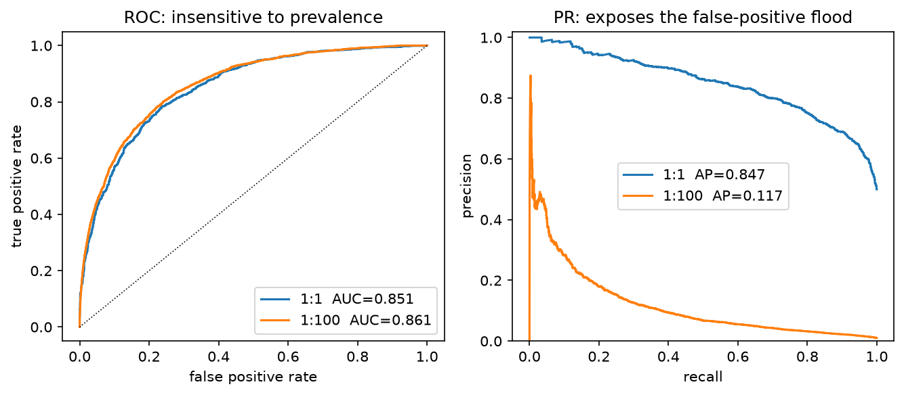
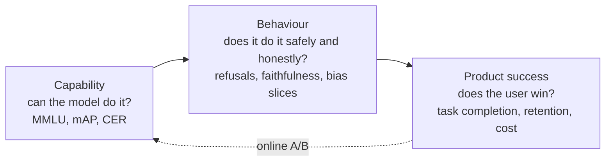
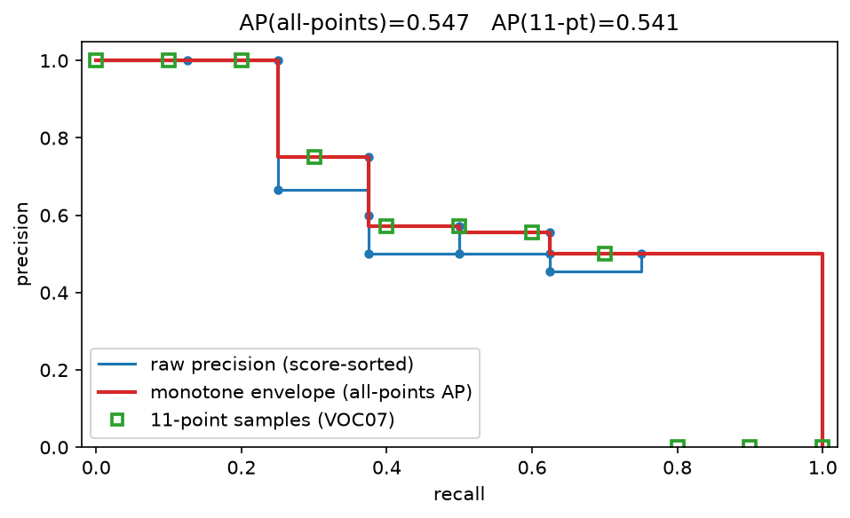

# Evaluation

> **Why this matters at staff level.** Evaluation is the highest-leverage and most
> under-prepared topic in staff ML interviews. Anyone can quote "precision and recall";
> the signal is in knowing *why* PR-AUC and not ROC-AUC under 1:1000 imbalance, how COCO
> interpolates AP, why pass@1 estimated as "did the first sample pass" is biased, how to
> tell whether a 1.2-point benchmark delta is real, and how to validate an LLM judge
> against humans. Every system-design round ends with "how would you know it works?", 
> this chapter is that answer.

## TL;DR: the interview card

* ROC-AUC $= P(s^+ > s^-) + \tfrac12 P(s^+ = s^-)$: a **rank statistic**, invariant to
  class prevalence. That invariance is the bug under heavy imbalance, PR-AUC moves when
  your false positives flood the positives, ROC-AUC barely does. Baseline PR-AUC is the
  positive rate $\pi$; baseline ROC-AUC is always 0.5.
* Choose the threshold from costs, not from 0.5: for a calibrated $p$, predict positive
  iff $p \ge \frac{c_{\text{FP}}}{c_{\text{FP}} + c_{\text{FN}}}$.
* Micro-average pools TP/FP/FN (dominated by frequent classes; equals accuracy in
  single-label multiclass); macro averages per-class scores (every class counts equally;
  the one to report when the tail matters).
* NDCG: gain $2^{r}-1$, discount $1/\log_2(i+1)$, normalised by the ideal ordering.
  MRR cares only about the first hit; MAP averages precision at every hit.
* Detection AP: greedy score-sorted matching at an IoU threshold (a second match to the
  same GT is a false positive), then area under the precision envelope. VOC07 samples 11
  recall points, VOC2010+/COCO use the monotone envelope; COCO mAP averages over
  IoU $\in \{0.50, 0.55, \dots, 0.95\}$ and over classes.
* OCR: CER/WER are edit distance over characters/words normalised by reference length, 
  they can exceed 1. End-to-end spotting requires box IoU **and** exact transcription.
* FID is the Fréchet distance between two Gaussians fitted to features:
  $\norm{\mu_1-\mu_2}^2 + \tr(\Sigma_1 + \Sigma_2 - 2(\Sigma_1\Sigma_2)^{1/2})$; it is
  biased by sample size, so only compare FIDs computed with the same $N$ and feature
  extractor.
* Unbiased pass@k $= 1 - \binom{n-c}{k}\big/\binom{n}{k}$ from $n$ samples with $c$
  correct; estimating pass@k by drawing exactly $k$ samples is high-variance, not wrong.
* LLM-as-judge has position, length, and self-preference bias. Validate it like a
  classifier: agreement and Cohen's $\kappa$ against humans, swap-consistency, on a
  stratified sample, re-validated on every judge version.
* Every benchmark number needs an interval. Use the **paired** bootstrap over questions
  (and cluster by document/task when questions share a source); report the CI of the
  *difference*, not two overlapping CIs.
* Agents: task success is necessary but coarse. Add action correctness, state
  correctness, tool-selection precision, recovery rate, plus latency and cost per task.

## 1. Intuition first

A fraud model scores 10 transactions. Three are fraudulent (label 1):

| rank | 1 | 2 | 3 | 4 | 5 | 6 | 7 | 8 | 9 | 10 |
|---|---|---|---|---|---|---|---|---|---|---|
| score | .95 | .90 | .80 | .70 | .60 | .50 | .40 | .30 | .20 | .10 |
| label | 1 | 0 | 1 | 0 | 0 | 0 | 1 | 0 | 0 | 0 |

Read the metrics straight off the table.

* **Precision@3** $= 2/3$: of the three you would act on, two were fraud.
* **Recall@3** $= 2/3$: of the three frauds, you caught two.
* **AP** $= \frac{1}{3}\big(\underbrace{1/1}_{\text{hit at 1}} + \underbrace{2/3}_{\text{hit at 3}} + \underbrace{3/7}_{\text{hit at 7}}\big) = 0.70$.
* **ROC-AUC**: count pairs. Positive at rank 1 beats 7 negatives, rank 3 beats 6, rank 7
  beats 3. $(7+6+3)/(3\cdot 7) = 16/21 = 0.762$.
* **MRR** $= 1/1 = 1$ (first item is relevant).
* **NDCG@3** with binary gains: $\text{DCG} = 1/\log_2 2 + 0 + 1/\log_2 4 = 1.5$; ideal is
  $1 + 1/\log_2 3 + 1/\log_2 4 = 2.13$; NDCG $= 0.70$.

Now duplicate every *negative* 100 times (same scores). Nothing about the model changed.
ROC-AUC is unchanged at 0.762, it only compares positives to negatives pairwise. But
precision@3 is still $2/3$ only if the duplicated negatives score below rank 3; in a real
1:1000 problem those extra negatives spread across the score range and precision
collapses. That asymmetry is the whole argument of §2.2 and the reason fraud, moderation,
rare-defect and retrieval teams report PR curves.

{ width="760" }

*Same scorer, two prevalences (1:1 and 1:100). The ROC curves and their AUCs are nearly
identical; the PR curve collapses because at a fixed recall you now admit 100× more false
positives per true positive. Look at what changed and what did not.*

Three classes of metric run through this chapter, and confusing them is the most common
interview failure:



## 2. The math

### 2.1 Confusion matrix, F1, and averaging

With TP, FP, FN, TN: $P = \frac{TP}{TP+FP}$, $R = \frac{TP}{TP+FN}$, and

$$
F_\beta = (1+\beta^2)\,\frac{PR}{\beta^2 P + R},\qquad F_1 = \frac{2PR}{P+R},
$$

the harmonic mean at $\beta=1$. The harmonic mean is the right average because precision
and recall are both *rates with different denominators*: it is dominated by the smaller
one, so a model with $P=1, R=0.01$ scores $F_1 = 0.02$, not $0.5$. $\beta > 1$ weights
recall (screening: missing a defect is expensive), $\beta < 1$ weights precision
(auto-blocking content: a false block is expensive).

For $K$ classes:

$$
P_{\text{micro}} = \frac{\sum_k TP_k}{\sum_k (TP_k + FP_k)},\qquad
P_{\text{macro}} = \frac1K \sum_k \frac{TP_k}{TP_k + FP_k}.
$$

In single-label multiclass every error is simultaneously one FP and one FN, so
$P_{\text{micro}} = R_{\text{micro}} = F_{1,\text{micro}} = \text{accuracy}$, quoting
"micro-F1" there is quoting accuracy. Macro treats a class with 20 examples the same as
one with 2 million, which is what you want when the tail is the product (rare traffic
signs, rare fraud typologies). **Weighted** macro (weight by support) is a compromise
that mostly reverts to micro. Multi-label problems are $K$ independent binary problems,
so micro/macro both make sense and *sample-average* F1 (per-example, then averaged) is a
third option that matches "how good is a typical prediction".

### 2.2 ROC-AUC is a rank statistic; PR-AUC is prevalence-aware

**Claim.** $\text{AUC} = P(S^+ > S^-) + \tfrac12 P(S^+ = S^-)$ where $S^+$ and $S^-$ are
scores of a random positive and a random negative.

*Derivation.* With threshold $t$, $\text{TPR}(t) = P(S^+ \ge t)$ and
$\text{FPR}(t) = P(S^- \ge t)$. Parametrising the ROC curve by $t$ from $+\infty$ down,

$$
\text{AUC} = \int_0^1 \text{TPR}\,d\,\text{FPR}
= \int_{-\infty}^{\infty} P(S^+ \ge t)\, f_{S^-}(t)\,dt
= \E_{S^-}\big[P(S^+ \ge S^-)\big] = P(S^+ > S^-)
$$

for continuous scores (ties contribute the $\tfrac12$ term, which is exactly what the
trapezoid rule draws through a tied block). This is the Mann–Whitney $U$ statistic
divided by $n^+ n^-$, which the test in §3 checks against `scipy.stats.mannwhitneyu`.

$$
\boxed{\;\text{AUC} = \frac{U}{n^+ n^-} = P(S^+ > S^-) + \tfrac12 P(S^+ = S^-)\;}
$$

**Why it is prevalence-invariant.** Both TPR and FPR are conditioned on the true class,
so duplicating negatives leaves the distribution $f_{S^-}$ unchanged and the AUC with it.
A classifier with AUC 0.99 on a 1:10 000 problem can still be useless: at TPR 0.9 you
might sit at FPR 0.01, which is $0.01 \times 10^4 = 100$ false positives per true
positive, i.e. precision below 1 %.

**Precision is prevalence-aware.** Write $\pi = P(y=1)$. Then

$$
P(t) = \frac{\pi\,\text{TPR}(t)}{\pi\,\text{TPR}(t) + (1-\pi)\,\text{FPR}(t)}
= \frac{1}{1 + \frac{1-\pi}{\pi}\cdot\frac{\text{FPR}(t)}{\text{TPR}(t)}}.
$$

The likelihood-ratio term is scaled by the **prior odds** $\frac{1-\pi}{\pi}$. At
$\pi = 10^{-3}$ you need $\text{FPR}/\text{TPR} < 10^{-3}$ merely to reach precision 0.5.
A random classifier has $\text{AP} = \pi$, so PR curves must always be reported with
$\pi$ next to them, an AP of 0.3 is excellent at $\pi = 0.001$ and terrible at $\pi = 0.5$.

$$
\boxed{\;\text{PR-AUC baseline} = \pi,\qquad \text{ROC-AUC baseline} = 0.5\;}
$$

**Decision rule.** Use ROC-AUC when classes are roughly balanced or when you care about
ranking quality independent of the operating prior (e.g. comparing model versions that
will be re-thresholded anyway). Use PR-AUC (or precision at fixed recall, or recall at
fixed precision, better still) when positives are rare and the cost of a false positive
is borne per-instance. Note also that AP is *not* the area under the interpolated curve:
our implementation uses the step-wise sum $\sum_t (R_t - R_{t-1})P_t$, which is the
standard definition and avoids the optimistic bias of linear interpolation between PR
points.

### 2.3 Ranking metrics: NDCG, MRR, MAP

**Where the discount comes from.** Postulate that a user scans the list top-down and
examines position $i$ with probability decaying in $i$; the expected utility is
$\sum_i g(r_i)\,d(i)$ for gain $g$ and discount $d$. Järvelin and Kekäläinen (2002) chose
$d(i) = 1/\log_b(i+1)$ because it decays slowly (positions 9 and 10 still differ, unlike
$1/i$ which is brutal) and is smooth; $b=2$ is convention. Burges' exponential gain
$g(r) = 2^r - 1$ makes a grade-3 document worth $7$ and a grade-1 worth $1$, so highly
relevant items dominate, appropriate when graded relevance is real.

$$
\text{DCG@}k = \sum_{i=1}^{k} \frac{2^{r_i}-1}{\log_2(i+1)},\qquad
\boxed{\;\text{NDCG@}k = \frac{\text{DCG@}k}{\text{IDCG@}k}\;}
$$

where IDCG is DCG of the ideal (relevance-sorted) permutation. Normalising per query is
what makes queries with different numbers of relevant documents averageable; it also
means NDCG cannot tell you that a query has no good results at all (it is 0/0 → defined
as 0 in our implementation). NDCG is *not* decomposable per document, so bootstrapping
it requires resampling queries.

**MRR** $= \frac1{|Q|}\sum_q \frac{1}{\text{rank of first relevant}}$: right when there is
exactly one right answer (navigational search, QA retrieval), useless when there are many.
**MAP** averages AP over queries and rewards getting *all* relevant items high. **Hit
rate@k** is the blunt instrument for recommendation candidate generation.

**Offline–online gap.** Offline ranking metrics are computed on logged interactions,
which were produced by the *current* policy: items the current system never showed have
no labels, so a new model that surfaces them is penalised (position and presentation
bias). Fixes: inverse-propensity weighting of logged clicks, randomised exploration
buckets, and (the honest one) interleaving or an A/B test (§4.5).

### 2.4 Detection: IoU, matching, and the AP interpolations

$$
\text{IoU}(A,B) = \frac{|A \cap B|}{|A \cup B|} = \frac{\text{inter}}{\text{area}(A) + \text{area}(B) - \text{inter}}.
$$

For one class, sort detections by score descending and walk the list. A detection is a
**true positive** iff it matches a ground-truth box of the same class in the same image
with $\text{IoU} \ge \tau$ *that has not already been matched*; otherwise it is a false
positive. Greedy-by-score (not globally optimal matching) is the COCO/VOC convention, and
it is what makes duplicate detections cost you: a second box on the same object is a FP,
which is why non-maximum suppression matters for mAP.

After the walk, with cumulative counts,
$P_i = \frac{\text{TP}_{1:i}}{i}$ and $R_i = \frac{\text{TP}_{1:i}}{N_{\text{GT}}}$.
Precision is not monotone in $i$ (a FP dips it, the next TP lifts it), which creates the
saw-tooth. The three integration conventions:

**VOC 2007, 11-point:**

$$
\text{AP} = \frac{1}{11}\sum_{r \in \{0, 0.1, \dots, 1\}} \max_{i:\,R_i \ge r} P_i .
$$

**VOC 2010+ / "all-point" / area:** define the envelope
$P_{\text{env}}(r) = \max_{i: R_i \ge r} P_i$ (a right-to-left running maximum) and

$$
\boxed{\;\text{AP} = \sum_{i}\big(R_i - R_{i-1}\big)\,P_{\text{env}}(R_i)\;}
$$

i.e. the exact area under the monotone envelope, the limit of the 11-point rule as the
number of sample points goes to infinity, and never smaller than it in general.

**COCO, 101-point:** sample $r \in \{0, 0.01, \dots, 1\}$ on the envelope. With 101 points
it is within a rounding error of all-point, and it is what `pycocotools` reports.

$$
\text{mAP}@[.5{:}.95] = \frac{1}{10}\sum_{\tau \in \{0.50,\dots,0.95\}} \frac{1}{K}\sum_{k} \text{AP}_k(\tau).
$$

*What it means:* averaging over IoU thresholds rewards localisation quality, not just
detection. A model that finds every object with sloppy boxes scores well at
mAP@0.5 and poorly at mAP@0.75, and that gap is the first diagnostic to look at.

{ width="640" }

*Blue: the raw saw-tooth precision as you walk down the score-sorted detections. Red: the
monotone envelope whose area is all-point AP. Green squares: the 11 VOC-2007 sample
points; with few detections the two numbers differ visibly.*

**mAP pitfalls to name in an interview.**

* AP is computed **per class then averaged**: a class with 3 instances counts as much as
  one with 30 000, so mAP on a long-tail dataset is dominated by tail noise.
* COCO's per-size APs (small: area $< 32^2$, medium, large) exist because small-object AP
  is usually 2–3× worse and is hidden inside the average.
* `maxDets=100` caps detections per image; a model that emits 1000 boxes is truncated.
* Confidence calibration does **not** affect AP (it is rank-based) but *does* affect the
  deployed system, which runs at a fixed threshold. Always report the operating point
  too: precision/recall at the score threshold you will ship.
* Ignore regions / crowd boxes: COCO's `iscrowd` annotations are excluded from matching;
  forgetting them inflates FPs.

**Segmentation.** mIoU is IoU averaged over classes on pooled pixels:
$\text{IoU}_k = \frac{TP_k}{TP_k+FP_k+FN_k}$. Panoptic Quality factorises recognition and
segmentation quality,

$$
\text{PQ} = \underbrace{\frac{\sum_{(p,g)\in TP}\text{IoU}(p,g)}{|TP|}}_{\text{SQ}}\times
\underbrace{\frac{|TP|}{|TP| + \frac12|FP| + \frac12|FN|}}_{\text{RQ}},
$$

where matching uses IoU $> 0.5$ (unique at that threshold, which is why 0.5 was chosen).
The factorisation is the point: PQ tells you whether you are missing objects (RQ) or
outlining them badly (SQ).

### 2.5 OCR and text: edit distance, CER, WER

Levenshtein distance by dynamic programming, with $D[i,j]$ the distance between the
first $i$ reference and first $j$ hypothesis symbols:

$$
D[i,j] = \min\begin{cases} D[i-1,j] + 1 & \text{deletion}\\ D[i,j-1] + 1 & \text{insertion}\\ D[i-1,j-1] + \mathbb 1[r_i \ne h_j] & \text{substitution/match}\end{cases}
$$

with $D[i,0]=i$, $D[0,j]=j$. Cost $O(nm)$ time, $O(\min(n,m))$ space if you only need the
number. Then

$$
\boxed{\;\text{CER} = \frac{S + D + I}{N_{\text{ref chars}}},\qquad \text{WER} = \frac{S+D+I}{N_{\text{ref words}}}\;}
$$

Both are unbounded above (insertions can exceed the reference length), a model that
emits garbage can score CER 3.0. Report the operation breakdown (S/D/I) because it is
diagnostic: many deletions means the detector is missing text regions; many substitutions
means the recogniser is weak; many insertions means hallucinated or duplicated text.
Normalisation (case, punctuation, Unicode NFKC, digit forms) is a decision you must state:
CER on raw text and CER after normalisation can differ by several points, and papers
rarely say which they used.

**End-to-end text spotting** (detection + recognition) needs both: a prediction is
correct iff its box matches a GT box at IoU $\ge 0.5$ *and* the transcription matches
(usually case-insensitive, sometimes with a lexicon). Reporting detection F1 and
recognition accuracy separately hides the compounding: 0.9 detection × 0.9 recognition is
0.81 end-to-end, and the errors are correlated (badly cropped boxes recognise worse).

### 2.6 Generative metrics: FID, IS, CLIPScore

**Fréchet distance between Gaussians.** For $\mathcal N(\mu_1,\Sigma_1)$ and
$\mathcal N(\mu_2,\Sigma_2)$, the 2-Wasserstein distance has the closed form

$$
\boxed{\;W_2^2 = \norm{\mu_1-\mu_2}^2 + \tr\Big(\Sigma_1 + \Sigma_2 - 2\big(\Sigma_1^{1/2}\Sigma_2\Sigma_1^{1/2}\big)^{1/2}\Big)\;}
$$

*Sketch.* $W_2^2 = \min_{\text{couplings}} \E\norm{X-Y}^2 = \norm{\mu_1-\mu_2}^2 + \min \E\norm{\tilde X - \tilde Y}^2$
for centred variables; expanding, $\E\norm{\tilde X-\tilde Y}^2 = \tr\Sigma_1 + \tr\Sigma_2 - 2\tr\,\mathrm{Cov}(\tilde X,\tilde Y)$,
and the maximum achievable cross-covariance trace over joint Gaussians is
$\tr\big((\Sigma_1^{1/2}\Sigma_2\Sigma_1^{1/2})^{1/2}\big)$, attained by the linear map
$\tilde Y = \Sigma_1^{-1/2}(\Sigma_1^{1/2}\Sigma_2\Sigma_1^{1/2})^{1/2}\Sigma_1^{-1/2}\tilde X$.
Note $\tr((\Sigma_1\Sigma_2)^{1/2}) = \tr((\Sigma_1^{1/2}\Sigma_2\Sigma_1^{1/2})^{1/2})$,
and the right-hand form is symmetric PSD, so it is computable with `eigh` alone, which is
how the implementation avoids `scipy.linalg.sqrtm` on a non-symmetric product.

FID applies this to Inception-v3 pool3 features (2048-dim) of real and generated images.
Properties to state: it is a *biased* estimator, the covariance estimate improves with
$N$, so FID falls as you add samples; 50 000 samples is the convention precisely so
numbers are comparable. It is sensitive to the feature extractor (a different Inception
checkpoint or resize filter shifts it), and it conflates fidelity with diversity: a model
that memorises the training set scores superbly. Precision/recall for generative models
(Kynkäänniemi et al. 2019) splits those two.

**Inception Score** $= \exp\big(\E_x \KL(p(y|x)\,\|\,p(y))\big)$ rewards confident
per-image predictions and a uniform marginal. Bounded above by the number of classes,
blind to the real data distribution entirely (it never looks at real images), and gamed
by a model that emits one perfect image per ImageNet class. Report it only for
comparability with old work.

**CLIPScore** $= w\max(\cos(v_{\text{img}}, t_{\text{text}}), 0)$ with $w = 2.5$ measures
prompt adherence, not quality; it inherits every bias of the CLIP checkpoint and can be
gamed by writing text into the image. **LPIPS** (literacy) is a *perceptual* distance
between a pair of images: distances between deep features, linearly calibrated on human
2AFC judgments, use it for reconstruction/restoration tasks where you have a reference,
never for unconditional generation. For anything that ships, human evaluation with a
fixed rubric and inter-rater agreement remains the ground truth.

### 2.7 LLM evaluation

**Separate three questions.** *Capability*: can the model do the task (MMLU, GPQA, SWE-bench,
HumanEval)? *Behaviour*: does it behave acceptably (refusal correctness, sycophancy,
jailbreak resistance, faithfulness to context)? *Product success*: does the user's task
complete (deflection, edit distance to accepted output, retention, cost per resolved
ticket)? Candidates who collapse these into "we ran MMLU" lose the round.

**Exact match and its normalisation.** EM after SQuAD-style normalisation (lower-case,
strip punctuation and articles, collapse whitespace) is brittle but *unambiguous* and
cheap, good for factoid QA, useless for free-form answers. Unit-test evaluation (run the
generated code against hidden tests) is the gold standard where it applies because it is
objective and hard to game, which is why HumanEval, MBPP and SWE-bench are built that way.

**pass@k, unbiased.** Generate $n \ge k$ samples per problem, count $c$ correct. The
quantity of interest is the probability that a random size-$k$ subset contains at least
one correct sample:

$$
\text{pass@}k = 1 - P(\text{all } k \text{ wrong}) = 1 - \frac{\binom{n-c}{k}}{\binom{n}{k}}
$$

*Derivation.* Choosing $k$ of $n$ samples uniformly, the number of ways to choose only
from the $n-c$ incorrect ones is $\binom{n-c}{k}$ out of $\binom{n}{k}$ total. Taking the
expectation over problems gives an unbiased estimate of the pass@k you would see by
actually drawing $k$ samples. Computing it as written overflows and cancels badly, so use
the telescoping product

$$
\frac{\binom{n-c}{k}}{\binom{n}{k}} = \prod_{i=n-c+1}^{n}\frac{i-k}{i}
\;\Longrightarrow\;
\boxed{\;\text{pass@}k = 1 - \prod_{i=n-c+1}^{n}\Big(1 - \frac{k}{i}\Big)\;}
$$

with the convention pass@k $= 1$ when $n - c < k$. Sanity checks: $k=1$ gives $c/n$;
$c=0$ gives 0; $c = n$ gives 1. Estimating pass@10 by drawing exactly 10 samples is
unbiased too but has much higher variance, the point of the estimator is to reuse $n=100$
samples for every $k$.

**Pairwise preference and Bradley–Terry.** Model $P(i \succ j) = \frac{p_i}{p_i+p_j}$
with strengths $p_i = e^{\theta_i}$, so $P(i \succ j) = \sigma(\theta_i - \theta_j)$, 
logistic regression on the difference of latent abilities. The log-likelihood
$\sum_{ij} w_{ij}\log\frac{p_i}{p_i+p_j}$ is concave in $\theta$ and maximised by the
Zermelo/MM iteration

$$
p_i \leftarrow \frac{W_i}{\sum_{j \ne i} \frac{n_{ij}}{p_i + p_j}},
$$

with $W_i$ total wins and $n_{ij}$ games played, renormalised each sweep. **Elo** is the
online, non-stationary approximation of the same model: expected score
$E_a = \frac{1}{1+10^{(r_b-r_a)/400}}$ and update $r_a \leftarrow r_a + K(s_a - E_a)$. Elo
depends on the order games arrive and on $K$; Bradley–Terry fitted on the whole history
does not, which is why LMSYS's Chatbot Arena moved to a BT ("Elo-scale") estimate with
bootstrap confidence intervals. Interview-grade caveats: arena rankings measure *human
preference under that prompt distribution* (short, chatty, English-heavy), are sensitive
to style and length, and intransitivity is possible when models have different strengths.

**LLM-as-judge: the three biases and how to kill them.**

| Bias | Symptom | Mitigation |
|---|---|---|
| Position | The response shown first (or second) wins too often | Evaluate both orders; count only swap-consistent verdicts, or average the two probabilities |
| Length / verbosity | Longer answers win regardless of content | Control for length (report win rate vs length bucket), length-debias via regression, or cap length in the prompt |
| Self-preference | A judge prefers text from its own family | Use a different judge family, or an ensemble of judges, and measure the effect explicitly |

Also: style-over-substance (confident formatting beats correct content), a bias toward
the first-listed rubric item, and sensitivity to the prompt template. Judges are
*classifiers*: validate them on a stratified human-labelled sample, report raw agreement
**and** Cohen's $\kappa = \frac{p_o - p_e}{1 - p_e}$ (which discounts agreement by chance;
with 90 % of examples in one class, 90 % agreement is $\kappa \approx 0$), and re-validate
whenever the judge model, prompt, or task distribution changes. If human–human agreement
is 0.8, a judge at 0.78 is at the ceiling and you should stop tuning it.

**Contamination and saturation.** Benchmarks leak into pretraining corpora; a model that
scores 95 % may have memorised the test set. Detection heuristics: n-gram overlap between
test items and training data, the canary-string convention, performance gaps between the
public test set and a freshly written private one, and order sensitivity (a memorising
model answers verbatim-continuation prompts far better than paraphrases). Saturation is
the other end: once frontier models cluster at 88–92 %, the remaining headroom is mostly
label noise and the benchmark stops discriminating. The staff-level response is to hold
out a private eval, rotate items, and report the human-expert ceiling alongside the score.

**Calibration of LLMs.** Verbalised confidence ("I'm 90 % sure") and token log-probs are
both miscalibrated, in different directions, and RLHF tends to make models *more*
confident. Measure with ECE on a multiple-choice set (see
[Uncertainty §2.3](03-uncertainty-reliability.md#23-calibration-ece-and-its-binning-pitfalls))
and consider temperature scaling of the choice logits. Selective prediction, abstain
below a confidence threshold, report the risk–coverage curve, is usually what the product
needs, not a better point estimate.

**Robustness and adversarial evaluation.** Paraphrase invariance, distractor sentences,
option-order shuffling in MCQ (a model that drops 10 points when you permute A/B/C/D was
pattern-matching), prompt-injection suites for tool-using systems, and jailbreak batteries.
Report the *worst* slice, not the mean, when the failure is a safety failure.

### 2.8 Error bars: bootstrapping benchmark deltas

You ran two models on $n$ questions and model A scored 71.4 % against model B's 70.1 %.
Is that real? With $n = 500$ the standard error of a single proportion is
$\sqrt{0.7\cdot0.3/500} \approx 2.0$ points, so *each* number has a $\pm 4$-point 95 %
interval, but the comparison is much tighter than that, because the models saw the
**same** questions. Let $d_i = a_i - b_i \in \{-1,0,1\}$ be the per-question difference.
Then

$$
\text{Var}(\bar a - \bar b) = \frac{\text{Var}(d)}{n} = \frac{\text{Var}(a) + \text{Var}(b) - 2\,\text{Cov}(a,b)}{n},
$$

and the covariance is large (both models get easy questions right), so the paired variance
is far smaller. Anthropic's "Adding Error Bars to Evals" argues for exactly this: run the
paired analysis and report the CI of the difference rather than two marginal intervals.

**Paired bootstrap.** Resample question indices with replacement $B$ times *using the same
indices for both models*, compute $\bar d^{(b)}$, and take the 2.5/97.5 percentiles. The
two-sided p-value is $2\min\big(\frac{1}{B}\#\{\bar d^{(b)} \le 0\}, \frac{1}{B}\#\{\bar d^{(b)} \ge 0\}\big)$.

**Clustering.** If your 500 questions come from 50 documents (or 50 task templates),
questions within a document are correlated and the effective sample size is closer to 50.
Resample *clusters*, not questions; the implementation's `clustered_standard_error`
computes the cluster-robust SE

$$
\widehat{\text{SE}}^2 = \frac{1}{n^2}\,\frac{C}{C-1}\sum_{c}\Big(\sum_{i \in c}(x_i - \bar x)\Big)^2,
$$

which inflates the naive SE by roughly $\sqrt{1 + (m-1)\rho}$ (the design effect) for
clusters of size $m$ and intra-cluster correlation $\rho$.

**Two more sources of variance interviewers like.** (a) *Sampling variance of the model*:
run each question $k$ times at $T>0$ and average, or evaluate at $T=0$ and say so.
(b) *Multiple comparisons*: if you test 20 benchmarks, one will look significant at
$\alpha=0.05$ by chance, pre-register the primary metric or correct (Bonferroni/BH).

### 2.9 Agent evaluation

A trajectory is $\tau = (s_0, a_1, s_1, \dots, a_T, s_T)$. Scoring only the final state
(task success) is cheap and objective but tells you nothing about *why* a run failed, and
rewards lucky recoveries equally with clean execution. A staff-level agent eval reports:

| Level | Metric | How it is computed |
|---|---|---|
| Outcome | task success | programmatic check on the final state (tests pass, DB row correct) |
| Outcome | pass@k / pass^k | success over $k$ attempts; pass^k (all $k$ succeed) measures *reliability*, and drops fast |
| Step | action correctness | fraction of actions matching a reference or satisfying a rule |
| Step | tool selection precision/recall | right tool chosen, right arguments |
| Step | state correctness | intermediate state matches an expected invariant |
| Recovery | recovery rate | fraction of runs that reach success after a detected error |
| Efficiency | steps, wall-clock latency, tokens, $ per solved task | logged per run |
| Safety | irreversible-action rate, guardrail violations | rule checks on the action log |

Benchmarks to name: **SWE-bench** (resolve real GitHub issues; graded by the repository's
own tests, objective, but sensitive to environment setup and to solutions leaking in
issue comments, which SWE-bench Verified addressed by human-filtering the instances),
**WebArena** (self-hosted websites with programmatic success checks, so the environment is
reproducible), **$\tau$-bench** (tool-agent-user interaction in retail/airline domains
with a simulated user and database-state checks; it popularised pass^k for reliability).
Trajectory-level rubrics (an LLM judge scoring a rubric over the whole trace) are useful
where programmatic checks do not exist, and inherit every judge caveat from §2.7.

## 3. Implementation

`src/mlbook/evaluation/` holds one module per family plus a harness. NumPy throughout;
no sklearn, so every metric is derivable from the code.

### 3.1 ROC, PR, and AUC as a rank statistic

```python
def roc_auc(y_true: np.ndarray, scores: np.ndarray) -> float:
    pos = scores[y_true == 1]  # (P,)
    neg = scores[y_true == 0]  # (Q,)
    diff = pos[:, None] - neg[None, :]  # (P, Q) all positive-negative score pairs
    return float(((diff > 0).sum() + 0.5 * (diff == 0).sum()) / (len(pos) * len(neg)))


def pr_curve(y_true: np.ndarray, scores: np.ndarray) -> tuple[np.ndarray, np.ndarray]:
    order = np.argsort(-scores, kind="stable")
    y = y_true[order].astype(float)  # (N,)
    s = scores[order]  # (N,)
    tps = np.cumsum(y)  # (N,) true positives in the top-i
    n_pred = np.arange(1, len(y) + 1)  # (N,)
    distinct = np.flatnonzero(np.r_[np.diff(s) != 0, True])  # (T,) last index per score
    precision = tps[distinct] / n_pred[distinct]  # (T,)
    recall = tps[distinct] / max(y.sum(), 1)  # (T,)
    return precision, recall
```

The $O(PQ)$ pair count is the *definition*, not the fast path (sorting gives $O(N\log N)$),
but it is what makes the identity with Mann–Whitney inspectable, and the test checks both
against `np.trapezoid` on the ROC curve and against `scipy.stats.mannwhitneyu`. The
`distinct` trick handles ties: all examples sharing a score must move across the threshold
together, otherwise you invent a precision the model cannot deliver.

`average_precision` then sums $(R_t - R_{t-1})P_t$, step-wise, no interpolation.
`best_threshold_for_cost` sweeps every distinct score and returns the cost minimiser,
which the test checks against the Bayes rule $p^\star = c_{FP}/(c_{FP}+c_{FN})$.

### 3.2 NDCG

```python
def dcg_at_k(ranked_rels: np.ndarray, k: int) -> float:
    r = np.asarray(ranked_rels, dtype=float)[:k]  # (k',)
    gains = 2.0**r - 1.0  # (k',)
    discounts = np.log2(np.arange(2, len(r) + 2))  # (k',)  log2(i+1), i starting at 1
    return float(np.sum(gains / discounts))


def ndcg_at_k(ranked_rels: np.ndarray, k: int) -> float:
    ideal = np.sort(np.asarray(ranked_rels, dtype=float))[::-1]  # (N,)
    idcg = dcg_at_k(ideal, k)
    return dcg_at_k(ranked_rels, k) / idcg if idcg > 0 else 0.0
```

`np.arange(2, len(r)+2)` is the $\log_2(i+1)$ discount written without an off-by-one:
position $i=1$ gets $\log_2 2 = 1$. The ideal ranking is computed from the *same* array,
so NDCG@k of an already-sorted list is exactly 1, the first test.

### 3.3 Detection AP

```python
def match_detections(dets, gts, cls, iou_thr):
    d = sorted([x for x in dets if x.cls == cls], key=lambda x: -x.score)
    g = [x for x in gts if x.cls == cls]
    used = np.zeros(len(g), dtype=bool)  # (G,) a GT can be matched once
    tp = np.zeros(len(d))  # (D,)
    fp = np.zeros(len(d))  # (D,)
    for i, det in enumerate(d):
        cand = gt_by_img.get(det.image_id, [])
        G = np.stack([g[j].box for j in cand])  # (n_img_gt, 4)
        ious = iou_matrix(det.box[None, :], G)[0]  # (n_img_gt,)
        best = int(np.argmax(ious))
        if ious[best] >= iou_thr and not used[cand[best]]:
            tp[i] = 1
            used[cand[best]] = True
        else:
            fp[i] = 1
    return tp, fp, len(g)


def ap_all_points(precision: np.ndarray, recall: np.ndarray) -> float:
    mrec = np.r_[0.0, recall, 1.0]  # (D+2,)
    mpre = np.r_[0.0, precision, 0.0]  # (D+2,)
    for i in range(len(mpre) - 2, -1, -1):
        mpre[i] = max(mpre[i], mpre[i + 1])  # right-to-left running max = envelope
    idx = np.flatnonzero(mrec[1:] != mrec[:-1]) + 1  # positions where recall increases
    return float(np.sum((mrec[idx] - mrec[idx - 1]) * mpre[idx]))
```

Three details carry the correctness: detections are sorted by score globally (not per
image), `used` enforces one-to-one matching so duplicates are FPs, and the envelope is a
suffix maximum. `ap_voc07` and `ap_coco101` sample that same envelope at 11 and 101 recall
points. `mean_average_precision` loops thresholds and classes, skipping classes with no
ground truth (NaN rather than 0, which would silently drag mAP down).

**How you'd test it.** `tests/test_evaluation_detection_map.py` builds a four-detection,
three-GT case by hand: one TP, one duplicate (FP), one miss (FP), one TP. The expected
TP/FP vectors, the precision/recall arrays, and all three AP conventions are written out
by hand in the test, $\text{AP}_{\text{all}} = \frac13 + \frac13\cdot\frac12 = 0.5$ and
$\text{AP}_{11} = (4\cdot 1 + 3\cdot 0.5)/11$, so a regression in the matching logic is
caught immediately.

### 3.4 CER/WER with an operation breakdown

```python
def edit_distance(ref: list, hyp: list) -> tuple[int, int, int, int]:
    n, m = len(ref), len(hyp)
    D = np.zeros((n + 1, m + 1), dtype=int)  # (n+1, m+1)
    D[:, 0] = np.arange(n + 1)
    D[0, :] = np.arange(m + 1)
    for i in range(1, n + 1):
        for j in range(1, m + 1):
            sub = D[i - 1, j - 1] + (ref[i - 1] != hyp[j - 1])
            D[i, j] = min(D[i - 1, j] + 1, D[i, j - 1] + 1, sub)
    ...  # backtrace counts S, D, I
```

The backtrace re-derives which of the three transitions was taken at each cell, which is
how you report substitutions/deletions/insertions separately. `cer`/`wer` divide by the
reference length in characters/words. `text_spotting_f1` requires IoU $\ge$ 0.5 *and* a
case-insensitive transcription match, with one-to-one GT consumption.

### 3.5 FID via `eigh` only

```python
def _psd_sqrt(S: np.ndarray) -> np.ndarray:
    w, V = np.linalg.eigh(S)  # (d,), (d, d)
    w = np.clip(w, 0.0, None)  # kill tiny negative eigenvalues from rounding
    return (V * np.sqrt(w)[None, :]) @ V.T  # (d, d)


def frechet_distance(mu1, S1, mu2, S2) -> float:
    diff = mu1 - mu2  # (d,)
    r1 = _psd_sqrt(S1)  # (d, d)
    inner = r1 @ S2 @ r1  # (d, d) symmetric PSD, so eigh applies again
    return float(diff @ diff + np.trace(S1) + np.trace(S2) - 2.0 * np.trace(_psd_sqrt(inner)))
```

$\Sigma_1\Sigma_2$ is *not* symmetric, so the naive route needs `scipy.linalg.sqrtm` and
returns complex values with a rounding-sized imaginary part. Using the similarity-invariant
form $\tr\big((\Sigma_1^{1/2}\Sigma_2\Sigma_1^{1/2})^{1/2}\big)$ keeps everything symmetric
PSD. The test checks agreement with the `scipy.linalg.sqrtm` reference to `rtol=1e-6`.

### 3.6 pass@k and Bradley–Terry

```python
def pass_at_k(n: int, c: int, k: int) -> float:
    if n - c < k:
        return 1.0
    # C(n-c,k)/C(n,k) = prod_{i=n-c+1..n} (i-k)/i
    return float(1.0 - np.prod(1.0 - k / np.arange(n - c + 1, n + 1)))
```

Three lines, no factorials, no overflow at $n = 200$. The test checks it against
`scipy.special.comb` for five $(n,c,k)$ triples and against $c/n$ at $k=1$.
`bradley_terry` runs the MM iteration with geometric-mean normalisation and returns
log-strengths; the test generates synthetic pairwise wins from known abilities and checks
the fitted differences match to 0.25 nats.

### 3.7 The harness

```python
def paired_bootstrap_test(a, b, n_boot=2000, alpha=0.05, seed=0) -> dict[str, float]:
    rng = np.random.default_rng(seed)
    d = a - b  # (N,) per-example paired differences
    idx = rng.integers(0, len(d), size=(n_boot, len(d)))  # (B, N) shared indices
    boots = d[idx].mean(axis=1)  # (B,)
    lo, hi = np.percentile(boots, [100 * alpha / 2, 100 * (1 - alpha / 2)])
    observed = float(d.mean())
    frac_opposite = float(np.mean(boots <= 0.0)) if observed > 0 else float(np.mean(boots >= 0.0))
    return {"diff": observed, "ci_lo": float(lo), "ci_hi": float(hi), "p_value": min(1.0, 2.0 * frac_opposite)}
```

The `(B, N)` index matrix is the whole trick: the same resampled indices are applied to
both systems, so the correlation between them is preserved and the CI narrows to the true
paired width. `EvalSuite.run` takes aligned predictions/references and a list of metric
names from a `MetricRegistry`, computes per-example scores, bootstraps each, and returns
an `EvalReport` that renders a markdown table with CIs.
`bootstrap_corpus_metric` handles non-decomposable metrics (ROC-AUC, AP) by resampling
examples and recomputing, skipping resamples that lose a class.

**How you'd test it.** `test_evaluation_harness.py` checks the CI width against the
normal approximation $3.92\,\text{SE}$, that the paired test finds a planted 15 % lift and
reports $p \ge 0.99$ for a system compared against itself, and that clustered SE exceeds
the i.i.d. SE by more than 2× on data with strong cluster effects.

??? example "Full implementation: `src/mlbook/evaluation/classification_metrics.py`"
    ```python
    --8<-- "src/mlbook/evaluation/classification_metrics.py"
    ```

??? example "Full implementation: `src/mlbook/evaluation/ranking_metrics.py`"
    ```python
    --8<-- "src/mlbook/evaluation/ranking_metrics.py"
    ```

??? example "Full implementation: `src/mlbook/evaluation/detection_map.py`"
    ```python
    --8<-- "src/mlbook/evaluation/detection_map.py"
    ```

??? example "Full implementation: `src/mlbook/evaluation/text_metrics.py`"
    ```python
    --8<-- "src/mlbook/evaluation/text_metrics.py"
    ```

??? example "Full implementation: `src/mlbook/evaluation/generative_metrics.py`"
    ```python
    --8<-- "src/mlbook/evaluation/generative_metrics.py"
    ```

??? example "Full implementation: `src/mlbook/evaluation/llm_metrics.py`"
    ```python
    --8<-- "src/mlbook/evaluation/llm_metrics.py"
    ```

??? example "Full implementation: `src/mlbook/evaluation/harness.py`"
    ```python
    --8<-- "src/mlbook/evaluation/harness.py"
    ```

## Retype by hand

Close the book and write these from memory; each has a focused test.

| Symbol | File | Target time | Test |
|---|---|---|---|
| `roc_auc`, `roc_curve`, `pr_curve`, `average_precision`, `best_threshold_for_cost` | `src/mlbook/evaluation/classification_metrics.py` | 20 min | `pytest tests/test_evaluation_classification_metrics.py -q` |
| `dcg_at_k`, `ndcg_at_k`, `average_precision_ranking`, `reciprocal_rank` | `src/mlbook/evaluation/ranking_metrics.py` | 10 min | `pytest tests/test_evaluation_ranking_metrics.py -q` |
| `iou_matrix`, `match_detections`, `precision_recall_from_matches`, `ap_all_points`, `ap_voc07`, `mean_average_precision` | `src/mlbook/evaluation/detection_map.py` | 25 min | `pytest tests/test_evaluation_detection_map.py -q` |
| `edit_distance`, `cer`, `wer` | `src/mlbook/evaluation/text_metrics.py` | 15 min | `pytest tests/test_evaluation_text_metrics.py -q` |
| `pass_at_k` | `src/mlbook/evaluation/llm_metrics.py` | 10 min | `pytest tests/test_evaluation_llm_metrics.py -q` |
| `bootstrap_ci`, `paired_bootstrap_test` | `src/mlbook/evaluation/harness.py` | 15 min | `pytest tests/test_evaluation_harness.py -q` |

Read, do not retype: `frechet_distance` and `_psd_sqrt` (know the formula and *why*
`eigh` suffices), `bradley_terry`, `text_spotting_f1`, `EvalSuite`, `MetricRegistry`.
Run `pytest tests/test_evaluation_generative_metrics.py -q` to see the FID identity hold.

## 4. Systems view: cost, failure modes, trade-offs

### 4.1 Which metric, when

| Situation | Report | Why not the obvious one |
|---|---|---|
| Balanced binary, model selection | ROC-AUC + accuracy at the chosen threshold |: |
| Rare positives (fraud, defects, moderation) | PR-AUC, precision at fixed recall, recall at fixed precision, with $\pi$ stated | ROC-AUC hides the false-positive flood |
| Cost-asymmetric decision | Expected cost at the tuned threshold; risk–coverage curve | A single F1 hides the operating point |
| Multiclass, long tail | Macro-F1 + per-class table | Micro-F1 = accuracy = the head classes |
| Retrieval / ranking | Recall@k for candidate generation, NDCG@k / MRR for ranking | Accuracy is undefined; AUC ignores position |
| Detection | mAP@[.5:.95] + per-size AP + P/R at the shipping threshold | mAP@0.5 alone hides localisation quality |
| Segmentation | mIoU per class; PQ when instances matter | Pixel accuracy is dominated by background |
| OCR | CER and WER with the S/D/I breakdown, plus end-to-end F1 | Word accuracy hides which stage is broken |
| Generation (images) | FID at fixed $N$ + human eval + precision/recall | FID conflates fidelity and diversity |
| LLM capability | Task-specific: unit tests > exact match > judge | Judges drift; EM is brittle on free-form |
| LLM product | Online A/B on the product metric with guardrails | Offline benchmarks do not predict retention |
| Agents | Task success + pass^k + step metrics + cost | Success alone hides unreliability |

### 4.2 Cost of evaluation

Evaluation is a system with its own budget. Rough shapes, not benchmark numbers:
running a 5 000-item benchmark at 1 000 output tokens each is 5 M output tokens per
model version; a judge pass doubles it; swapping order for position-bias control doubles
it again; $k=10$ samples for pass@k multiplies by 10. That is why teams run a fast smoke
eval (hundreds of items) on every commit, the full suite nightly, and human eval on a
sampled subset weekly. Cache judge verdicts keyed by (judge version, prompt, response
pair), they are deterministic enough at $T=0$ to reuse and it saves most of the bill.

### 4.3 Slicing beats averages

An average hides everything that matters. Define slices *before* looking at results:
by input property (lighting, language, document type, small objects), by user segment
(new vs returning, region), by difficulty (rare class, long context), and by provenance
(annotator batch, data source). Report the worst slice next to the mean, and set a
guardrail that no slice regresses more than $x$ % even if the mean improves. This is the
mechanism that catches "the new OCR model is 2 points better overall and 15 points worse
on receipts".

### 4.4 Building an eval set that survives

* **Held-out and private.** Public benchmarks leak; keep a private set that never leaves
  your infrastructure and rotate items.
* **Stratified.** Match the production distribution, then over-sample rare-but-critical
  slices and re-weight when reporting.
* **Labelled well.** Measure inter-annotator agreement; your metric ceiling is that
  agreement. Adjudicate disagreements rather than averaging them away.
* **Versioned and immutable.** An eval set that changes silently makes every historical
  number meaningless. Version it like code; when you fix a label, report both numbers.
* **With unanswerables.** Include items the model should refuse or say "unknown" to,
  otherwise you cannot measure over-confidence.

### 4.5 The online bridge: A/B tests, guardrails, interleaving

Offline metrics are a filter; online metrics are the decision. Three things to say:

**A/B tests.** Randomise at the unit that matches the interference structure (user, not
request, when the model personalises; cluster/region when there are network effects).
Fix the primary metric and the minimum detectable effect in advance, compute the sample
size from $n \approx \frac{2(z_{\alpha/2}+z_\beta)^2\sigma^2}{\Delta^2}$, and run for
whole numbers of weeks to absorb weekly seasonality. Report guardrails (latency p99,
error rate, revenue, safety-flag rate) alongside the primary metric; a win that costs
50 ms of p99 may not ship. Beware peeking (use sequential tests or fixed horizons),
novelty effects (the first week over-states engagement), and the primary-metric
surrogate trap (clicks up, satisfaction down).

**Interleaving** is the ranking-specific trick: instead of showing user group A ranking 1
and group B ranking 2, show *every* user a single list formed by interleaving both
rankings (team-draft or balanced interleaving) and attribute each click to the ranker that
contributed the item. Because the comparison is within-user, it removes between-user
variance and is dramatically more sensitive, Netflix reported using interleaving as a
fast first-stage filter on personalisation algorithms before committing to full A/B tests,
with the A/B test remaining the arbiter of the member-level metric. Costs: it only works
for ranking, the interleaving policy can introduce its own bias, and it measures relative
preference, not absolute engagement.

### 4.6 Failure modes checklist

* Threshold chosen at 0.5 by default and never revisited.
* Metric computed on a filtered subset (only confident predictions) and compared to a
  number computed on everything.
* Test set contaminated by training data, or by the same documents chunked differently.
* Judge upgraded without re-validation; scores jump and are read as model improvement.
* Improvement inside the noise: no CI, no paired analysis, $n=200$.
* Mean improves, a critical slice regresses.
* Offline win, online loss: the offline label distribution came from the old policy.
* Calibration ignored because the metric was rank-based.

## 5. In production

!!! production "Anthropic: adding error bars to evals (2024)"
    **Problem.** Model evaluations are reported as point estimates, and teams routinely
    treat one-point differences as real. **Built.** A statistical recommendation set for
    eval reporting: treat questions as draws from a super-population, report standard
    errors, use the **paired** difference when comparing two models on the same questions
    (which removes the shared question-difficulty variance and shrinks the interval),
    cluster the standard error when questions are derived from the same source document,
    and reduce variance by resampling per-question responses. **Why.** Without intervals,
    eval-driven development optimises noise. Paper: Evan Miller,
    ["Adding Error Bars to Evals: A Statistical Approach to Language Model
    Evaluations"](https://arxiv.org/abs/2411.00640), Anthropic, 2024, arXiv:2411.00640.

!!! production "LMSYS: Chatbot Arena (2024)"
    **Problem.** Static benchmarks saturate and do not measure open-ended human
    preference. **Built.** A crowdsourced platform where users compare two anonymous
    models side by side and vote; ratings are fitted with a Bradley–Terry model
    (reported on the Elo scale) with bootstrap confidence intervals, plus sampling
    strategies to allocate comparisons to the pairs that most reduce uncertainty.
    **Trade-off named in the paper.** It measures preference on the arena's prompt
    distribution, is affected by style and verbosity, and requires enormous vote volume
    for tight intervals on new models. Paper: ["Chatbot Arena: An Open Platform for
    Evaluating LLMs by Human Preference"](https://arxiv.org/abs/2403.04132),
    arXiv:2403.04132; the judge-bias analysis is in ["Judging LLM-as-a-Judge with MT-Bench
    and Chatbot Arena"](https://arxiv.org/abs/2306.05685), NeurIPS 2023, arXiv:2306.05685.

!!! production "Stanford CRFM: HELM (2022)"
    **Problem.** Benchmarks reported one number on one scenario, so "which model is best"
    was unanswerable and coverage of harms was accidental. **Built.** A *matrix*
    evaluation: scenarios × metrics, where every scenario is measured on accuracy,
    calibration, robustness, fairness, bias, toxicity and efficiency, with standardised
    prompting and full transparency of raw predictions. **Why.** Multi-metric reporting
    makes trade-offs visible (a model can win accuracy and lose calibration) and prevents
    cherry-picking. Paper: ["Holistic Evaluation of Language
    Models"](https://arxiv.org/abs/2211.09110), TMLR 2023, arXiv:2211.09110.

!!! production "OpenAI: Codex and the pass@k estimator (2021)"
    **Problem.** Functional-correctness evaluation of generated code is stochastic;
    reporting "did the single sample pass" wastes information and under-states capability
    for sampling-based use. **Built.** HumanEval, a hand-written benchmark with hidden
    unit tests, plus the unbiased pass@k estimator computed from $n \gg k$ samples per
    problem, and the explicit note that the naive $1-(1-\hat p)^k$ plug-in is biased.
    **Why.** Unit tests are objective and hard to game; the estimator makes pass@1 and
    pass@100 comparable from one sampling run. Paper: ["Evaluating Large Language Models
    Trained on Code"](https://arxiv.org/abs/2107.03374), 2021, arXiv:2107.03374.

!!! production "Netflix: interleaving for personalisation (2017)"
    **Problem.** A/B tests on personalisation algorithms need large populations and long
    run times, so the number of ideas a team can test per quarter is the bottleneck.
    **Built.** A two-stage experimentation process: interleaving (each member sees a
    single list blended from two rankers, clicks attributed to the contributing ranker)
    as a high-sensitivity first stage to rank candidate algorithms with far fewer
    members, then a conventional A/B test on the survivors to measure the real member
    metric. **Trade-off.** Interleaving measures relative ranker preference, not
    long-term member satisfaction, so it filters rather than decides. Post:
    ["Innovating Faster on Personalization Algorithms at Netflix Using
    Interleaving"](https://netflixtechblog.com/using-interleaving-in-online-experiments-to-accelerate-algorithm-innovation-at-netflix-a04ee392ec55),
    Netflix Technology Blog, November 2017.

!!! production "Google: Rules of Machine Learning"
    **Problem.** Teams optimise the metric that is easy to compute rather than the one
    the product needs. **Built.** A set of engineering rules, several of which are
    evaluation rules: measure before you model (Rule 2: instrument and log first), keep
    the first objective simple and observable, do not confuse the *modelling* objective
    with the *business* objective, and expect the metric you optimise to be gamed by the
    system around it. **Why.** Most evaluation failures are organisational, not
    statistical. Document: Martin Zinkevich, ["Rules of Machine Learning: Best Practices
    for ML Engineering"](https://developers.google.com/machine-learning/guides/rules-of-ml),
    Google for Developers.

!!! production "Princeton / Stanford: SWE-bench and SWE-bench Verified"
    **Problem.** Coding benchmarks were short, synthetic functions; real software work is
    repository-scale. **Built.** SWE-bench takes real GitHub issues and their merged pull
    requests, and grades a model's patch by running the repository's own tests (FAIL→PASS
    and PASS→PASS sets). **What broke.** Some instances were unsolvable from the issue
    text alone, some tests were flaky, and some solutions leaked into issue comments; the
    subsequent human-validated subset (SWE-bench Verified, built with OpenAI) filtered
    these. **What to take from it.** The benchmark's construction is part of the result, and
    an interviewer will expect you to know how SWE-bench Verified differs from the original.
    Paper: ["SWE-bench: Can Language Models Resolve Real-World GitHub
    Issues?"](https://arxiv.org/abs/2310.06770), ICLR 2024, arXiv:2310.06770; the verified
    subset is described in OpenAI's post
    ["Introducing SWE-bench Verified"](https://openai.com/index/introducing-swe-bench-verified/),
    August 2024.

## 6. Interview questions and strong answers

!!! interview "Q1. Your fraud model has ROC-AUC 0.98 and the business says it is unusable. Explain."
    **Answer.** ROC-AUC is $P(\text{score}^+ > \text{score}^-)$, a ranking statistic that
    conditions on the true class and is therefore blind to prevalence. At $\pi = 10^{-3}$,
    an FPR of 1 % at TPR 0.9 means 10 false positives for every true positive, so precision
    is about 8 %. I would re-report the PR curve with $\pi$ stated, pick the operating
    point from the cost ratio ($p^\star = c_{FP}/(c_{FP}+c_{FN})$ for a calibrated model),
    and report precision at the recall the ops team can actually staff.
    **Staff follow-up.** "The reviewers can handle 500 cases a day." Then the metric is
    precision@500 (or recall at the score threshold that yields 500 alerts/day), and the
    model selection criterion changes: a model with lower AUC but better precision in the
    top 500 wins. That is a *capacity-constrained* ranking problem, not a classification
    problem.

!!! interview "Q2. Derive COCO's AP and explain what mAP@[.5:.95] adds over mAP@0.5."
    **Answer.** Sort detections by score across the dataset; greedily match each to an
    unmatched GT of the same class in the same image with IoU $\ge \tau$; TP/FP accumulate
    into a precision–recall curve; take the area under the right-to-left maximum envelope
    (sampled at 101 recall points in COCO). Averaging over $\tau \in \{0.5,\dots,0.95\}$
    turns AP into a measure of *localisation* as well as detection: a model with sloppy
    boxes scores well at 0.5 and collapses at 0.75. I would always report the AP@0.5 vs
    AP@0.75 gap and the small/medium/large breakdown, since small-object AP is typically
    the binding constraint in perception systems.
    **Staff follow-up.** "Your mAP improved but production complaints went up." Likely
    causes: mAP is rank-based and threshold-free while production runs at a fixed
    threshold (check P/R at that threshold and the score calibration); or the gain came
    from head classes while a rare, safety-critical class regressed (per-class table); or
    duplicate suppression changed (NMS IoU) in a way that helps AP but produces visible
    double boxes.

!!! interview "Q3. Write the unbiased pass@k estimator and say why the naive one is wrong."
    **Answer.** $\text{pass@}k = 1 - \binom{n-c}{k}/\binom{n}{k}$, computed as
    $1 - \prod_{i=n-c+1}^{n}(1 - k/i)$ for numerical stability. It is the probability that
    a uniformly random $k$-subset of the $n$ drawn samples contains at least one correct
    sample. The naive plug-in $1 - (1-\hat p)^k$ with $\hat p = c/n$ is biased because
    $\hat p$ is itself random and the function is convex in $\hat p$; by Jensen it
    systematically misestimates, and it also ignores that sampling is without replacement
    from the $n$ you have. Sanity checks: $k=1$ gives $c/n$, $c=0$ gives 0.
    **Staff follow-up.** "What does pass@k *not* tell you?" Reliability. For an agent that
    must be right every time, pass^k (all $k$ attempts succeed) is the relevant statistic
    and it drops much faster; pass@k flatters systems that are lucky once in ten tries,
    which is exactly the wrong thing to optimise for an autonomous workflow.

!!! interview "Q4. You want to use an LLM as a judge. How do you know it is any good?"
    **Answer.** Treat it as a classifier and validate it. Collect a stratified human-labelled
    sample (including hard and near-tie cases), compute raw agreement *and* Cohen's
    $\kappa$, and compare against human–human agreement, which is your ceiling. Measure
    the known biases explicitly: swap the presentation order and report swap-consistency;
    regress the verdict on response length to quantify verbosity bias; check whether the
    judge prefers its own family. Mitigate with two-order evaluation, a reference answer
    in the prompt, chain-of-thought before the verdict, and an ensemble of judges from
    different families. Re-validate on every judge or prompt change, and version the judge
    like a model.
    **Staff follow-up.** "Agreement is 0.72 and human–human is 0.74." Then the judge is at
    the ceiling and further prompt tuning is overfitting to your sample. Spend the effort
    on reducing *label* ambiguity (sharper rubric, adjudication) instead, and report the
    metric with the ceiling next to it so nobody reads 0.72 as poor.

!!! interview "Q5. Model A scores 71.4 and model B 70.1 on a 500-question benchmark. Ship A?"
    **Answer.** Not without an interval. The per-model SE is about 2 points, but the right
    analysis is paired: compute per-question differences $d_i$ and bootstrap $\bar d$ using
    the same resampled indices for both models. The covariance between models is high, so
    the paired CI is much narrower than the two marginal CIs suggest, overlapping marginal
    CIs do **not** imply no difference. If the questions come from 50 source documents,
    cluster the bootstrap by document, which will widen the interval. Then check slices and
    guardrails, and if the decision is a product decision, run an online test.
    **Staff follow-up.** "The CI for the difference is $[-0.2, +2.8]$. What now?" The
    benchmark cannot resolve it: either collect more items (variance scales as $1/n$, so
    resolving a 1.3-point difference needs roughly 4× the data if the current half-width
    is 1.5), reduce response sampling noise by averaging $k$ samples per question, or pick
    on a different axis, cost, latency, calibration, worst-slice performance.

!!! interview "Q6. Design the evaluation for an OCR + document-understanding product."
    **Answer.** Three layers. *Component*: detection (precision/recall at IoU 0.5 on text
    regions), recognition (CER/WER with the S/D/I breakdown, normalisation rules stated),
    end-to-end spotting F1 (IoU + exact transcription). *Task*: field-level extraction
    accuracy per field type with a per-field table, since an invoice total matters more
    than a footer; add a "field present but unreadable" class so abstention is measurable.
    *Product*: fraction of documents accepted without human correction, average human edit
    time, cost per document. Slice by document type, scan quality, language and font;
    report the worst slice. Add a calibration/risk–coverage curve so the system can route
    low-confidence documents to humans, and measure the accuracy at each coverage level.
    **Staff follow-up.** "What is your metric ceiling?" Inter-annotator agreement on the
    labels. If two annotators transcribe a smudged receipt differently 5 % of the time,
    CER below about 0.05 on that slice is measuring noise, and I would say so rather than
    chase it.

!!! interview "Q7. What is the difference between micro and macro F1, and which do you report?"
    **Answer.** Micro pools TP/FP/FN across classes, so it weights by support and, in
    single-label multiclass, equals accuracy. Macro averages per-class F1, so every class
    counts equally regardless of frequency. I report both and, more importantly, the
    per-class table: if the product depends on a rare class (a rare traffic sign, a rare
    fraud typology), macro is the headline and micro is the sanity check. In multi-label
    settings I add sample-averaged F1, because that is closest to "how good is a typical
    prediction" from the user's point of view.
    **Staff follow-up.** "Macro-F1 is dominated by two classes with 8 examples each."
    Then macro is measuring label noise. Either report macro over classes with sufficient
    support and list the rare classes separately with their counts and CIs, or collect
    more data for those classes. Never let a 8-example class drive a launch decision
    silently.

!!! interview "Q8. Your offline NDCG improved 3 % but the online A/B was flat. Why?"
    **Answer.** Most likely the offline set is built from logged interactions produced by
    the *current* ranker, so it is biased toward items the current system shows;
    a new ranker that surfaces different items gets no credit (missing labels) and is
    penalised for position bias. Other candidates: the offline relevance labels are a
    proxy for a different objective than the online metric; the gain is concentrated in a
    segment with little traffic; latency added by the new model cancelled the relevance
    gain; or the effect is real but below the A/B test's detectable effect. Fixes: IPS-weighted
    offline evaluation, a randomised exploration bucket to collect unbiased labels, and
    interleaving as a high-sensitivity first-stage online test before the full A/B.
    **Staff follow-up.** "How would you detect the position-bias explanation specifically?"
    Compare the two rankers on the subset of items *both* would show (where labels exist
    for both) versus the full set; if the gain disappears on the common subset, the
    offline gain was coming from unlabelled items.

## 7. Exercises

**★ Exercise 1.** A model scores 100 negatives and 5 positives. Its ROC-AUC is 0.95.
Give the tightest statement you can make about precision at recall 0.8, and explain why
you cannot pin it down exactly.

??? success "Solution"
    Recall 0.8 means 4 of the 5 positives are above the threshold. AUC 0.95 says the
    average positive beats 95 % of negatives, but AUC is an *average* over pairs and does
    not fix the FPR at any particular threshold. The extremes: if the 4 positives are the
    top 4 scores, precision is 1.0; if AUC 0.95 is achieved with one positive ranked last
    and the rest mid-pack, the threshold that captures 4 positives could admit ~20
    negatives, giving precision $4/24 \approx 0.17$. You need the actual curve; this is
    the reason to report PR (or precision at fixed recall) directly under imbalance.

**★★ Exercise 2 (coding).** Verify on synthetic data that ROC-AUC is invariant to negative
duplication while AP is not.

??? success "Solution"
    ```python
    import numpy as np
    from mlbook.evaluation.classification_metrics import roc_auc, average_precision
    rng = np.random.default_rng(0)
    s_pos, s_neg = rng.normal(1.5, 1, 200), rng.normal(0, 1, 200)
    for rep in (1, 10, 100):
        y = np.r_[np.ones(200), np.zeros(200 * rep)]
        s = np.r_[s_pos, np.tile(s_neg, rep)]
        print(rep, round(roc_auc(y, s), 4), round(average_precision(y, s), 4))
    ```
    ROC-AUC stays within sampling noise of its 1:1 value (duplicating negatives does not
    change the distribution $f_{S^-}$); AP falls roughly like $\pi$ because precision at
    every recall level is divided by the extra false positives.

**★★ Exercise 3 (coding).** Hand-compute AP for this detection case, then confirm with
`mlbook.evaluation.detection_map`: one image, two GT boxes; detections (score, outcome)
= (0.9, TP), (0.8, FP), (0.7, TP).

??? success "Solution"
    Cumulative TP = 1, 1, 2; precision = 1, 0.5, 0.667; recall = 0.5, 0.5, 1.0.
    The envelope is $\max$ from the right: 1.0 for $r \le 0.5$, 0.667 for $0.5 < r \le 1$.
    All-point AP $= 0.5\cdot 1 + 0.5 \cdot 0.667 = 0.833$. VOC07: recall points
    $\{0,\dots,0.5\}$ take precision 1 (6 points), $\{0.6,\dots,1.0\}$ take 0.667 (5
    points), giving $(6 + 5\cdot 0.667)/11 = 0.848$, note the 11-point rule is *higher*
    here because coarse sampling lands favourably. Build the `Detection`/`GroundTruth`
    objects and call `ap_all_points`/`ap_voc07` on the output of
    `precision_recall_from_matches` to confirm.

**★★ Exercise 4.** Two OCR systems: A has CER 0.04 with (S,D,I) = (300, 50, 20); B has
CER 0.04 with (S,D,I) = (50, 320, 0). Same reference length. Which would you ship, and
what would you measure next?

??? success "Solution"
    Same CER, very different failure modes. B deletes: it is dropping whole regions (a
    detection problem, missed lines, cropped columns), which is catastrophic for field
    extraction because an absent field cannot be corrected by a reviewer who does not know
    it is missing. A substitutes: characters are wrong but present, so a downstream
    validator (checksum, field format, dictionary) can flag them and a human can fix them
    quickly. I would ship A, and measure next: field-level recall (is the field present at
    all), end-to-end spotting F1, and per-region CER split by detection IoU to confirm B's
    deletions come from the detector rather than the recogniser.

**★★★ Exercise 5 (coding).** Implement a paired *permutation* test for benchmark deltas
and compare it with `paired_bootstrap_test` on the same data.

??? success "Solution"
    ```python
    import numpy as np
    from mlbook.evaluation.harness import paired_bootstrap_test

    def paired_permutation_test(a, b, n_perm=5000, seed=0):
        rng = np.random.default_rng(seed)
        d = a - b                                   # (N,)
        observed = d.mean()
        signs = rng.choice([-1.0, 1.0], size=(n_perm, len(d)))  # (P, N)
        null = (signs * d).mean(axis=1)             # (P,) exchangeable-sign null
        return float(np.mean(np.abs(null) >= abs(observed)))

    rng = np.random.default_rng(0)
    base = rng.binomial(1, 0.6, 400).astype(float)
    better = base.copy(); better[rng.random(400) < 0.08] = 1.0
    print(paired_permutation_test(better, base), paired_bootstrap_test(better, base))
    ```
    The permutation test assumes exchangeability of the sign of $d_i$ under the null and
    gives an exact p-value; the bootstrap gives a CI for the effect size as well. Report
    the bootstrap CI (effect size is what a decision needs) and use the permutation p-value
    as a cross-check; the two should agree closely when $n$ is a few hundred.

**★★★ Exercise 6.** You are asked to evaluate a coding agent. Write the eval plan: the
metrics, the sample size for a 5-point detectable difference, and three ways the plan
could mislead you.

??? success "Solution"
    *Metrics.* Primary: task success (repository tests pass) on a held-out instance set.
    Secondary: pass^3 (reliability), tool-selection precision, mean steps, wall-clock
    latency, tokens and $ per solved task, irreversible-action rate (force pushes, deleted
    files). Report per-repository slices.
    *Sample size.* For a paired binary comparison with success around 0.4 and a 5-point
    target, the paired SD of $d_i$ is roughly $\sqrt{2p(1-p)(1-\rho)}$; with $\rho \approx 0.5$
    that is $\approx 0.49$, so $n \approx (1.96+0.84)^2(0.49)^2/0.05^2 \approx 750$
    instances, or fewer if you reduce sampling noise by averaging $k$ runs per instance.
    Say the number *and* the assumption.
    *Three ways it misleads.* (1) Contamination: the fix may be in the model's training
    data (check the repository's commit date against the training cutoff, and test on
    freshly created instances). (2) Environment leakage: the agent may read the test files
    and special-case them; sandbox and check the diff. (3) Success without reliability:
    a 40 % pass@1 agent that succeeds on a different 40 % each run is useless in a
    workflow, which is what pass^k exposes.

## References

* Järvelin & Kekäläinen, ["Cumulated gain-based evaluation of IR techniques"](https://dl.acm.org/doi/10.1145/582415.582418), ACM TOIS, 2002.
* Manning, Raghavan & Schütze, [*Introduction to Information Retrieval*](https://nlp.stanford.edu/IR-book/), CUP 2008 (ch. 8, evaluation).
* Davis & Goadrich, ["The Relationship Between Precision-Recall and ROC Curves"](https://dl.acm.org/doi/10.1145/1143844.1143874), ICML 2006.
* Saito & Rehmsmeier, ["The Precision-Recall Plot Is More Informative than the ROC Plot When Evaluating Binary Classifiers on Imbalanced Datasets"](https://journals.plos.org/plosone/article?id=10.1371/journal.pone.0118432), PLOS ONE, 2015.
* Everingham et al., ["The PASCAL Visual Object Classes (VOC) Challenge"](https://link.springer.com/article/10.1007/s11263-009-0275-4), IJCV 2010 (11-point and all-point AP).
* Lin et al., ["Microsoft COCO: Common Objects in Context"](https://arxiv.org/abs/1405.0312), ECCV 2014, arXiv:1405.0312.
* Kirillov et al., ["Panoptic Segmentation"](https://arxiv.org/abs/1801.00868), CVPR 2019, arXiv:1801.00868 (PQ = SQ × RQ).
* Karatzas et al., ["ICDAR 2015 competition on Robust Reading"](https://ieeexplore.ieee.org/document/7333942/), ICDAR 2015 (end-to-end text spotting protocol).
* Heusel et al., ["GANs Trained by a Two Time-Scale Update Rule Converge to a Local Nash Equilibrium"](https://arxiv.org/abs/1706.08500), NeurIPS 2017, arXiv:1706.08500 (FID).
* Dowson & Landau, ["The Fréchet distance between multivariate normal distributions"](https://www.sciencedirect.com/science/article/pii/0047259X8290077X), Journal of Multivariate Analysis, 1982.
* Salimans et al., ["Improved Techniques for Training GANs"](https://arxiv.org/abs/1606.03498), NeurIPS 2016, arXiv:1606.03498 (Inception Score).
* Kynkäänniemi et al., ["Improved Precision and Recall Metric for Assessing Generative Models"](https://arxiv.org/abs/1904.06991), NeurIPS 2019, arXiv:1904.06991.
* Zhang et al., ["The Unreasonable Effectiveness of Deep Features as a Perceptual Metric"](https://arxiv.org/abs/1801.03924) (LPIPS), CVPR 2018, arXiv:1801.03924.
* Hessel et al., ["CLIPScore: A Reference-free Evaluation Metric for Image Captioning"](https://arxiv.org/abs/2104.08718), EMNLP 2021, arXiv:2104.08718.
* Chen et al., ["Evaluating Large Language Models Trained on Code"](https://arxiv.org/abs/2107.03374), 2021, arXiv:2107.03374 (HumanEval, pass@k).
* Liang et al., ["Holistic Evaluation of Language Models"](https://arxiv.org/abs/2211.09110) (HELM), TMLR 2023, arXiv:2211.09110.
* Zheng et al., ["Judging LLM-as-a-Judge with MT-Bench and Chatbot Arena"](https://arxiv.org/abs/2306.05685), NeurIPS 2023, arXiv:2306.05685.
* Chiang et al., ["Chatbot Arena: An Open Platform for Evaluating LLMs by Human Preference"](https://arxiv.org/abs/2403.04132), 2024, arXiv:2403.04132.
* Bradley & Terry, ["Rank Analysis of Incomplete Block Designs: I. The Method of Paired Comparisons"](https://www.jstor.org/stable/2334029), Biometrika, 1952; Hunter, ["MM algorithms for generalized Bradley-Terry models"](https://projecteuclid.org/journals/annals-of-statistics/volume-32/issue-1/MM-algorithms-for-generalized-Bradley-Terry-models/10.1214/aos/1079120141.full), Annals of Statistics, 2004.
* Miller, ["Adding Error Bars to Evals: A Statistical Approach to Language Model Evaluations"](https://arxiv.org/abs/2411.00640), Anthropic, 2024, arXiv:2411.00640.
* Efron & Tibshirani, *An Introduction to the Bootstrap*, Chapman & Hall, 1993.
* Jimenez et al., ["SWE-bench: Can Language Models Resolve Real-World GitHub Issues?"](https://arxiv.org/abs/2310.06770), ICLR 2024, arXiv:2310.06770; OpenAI, ["Introducing SWE-bench Verified"](https://openai.com/index/introducing-swe-bench-verified/), 2024.
* Zhou et al., ["WebArena: A Realistic Web Environment for Building Autonomous Agents"](https://arxiv.org/abs/2307.13854), ICLR 2024, arXiv:2307.13854.
* Yao et al., ["τ-bench: A Benchmark for Tool-Agent-User Interaction in Real-World Domains"](https://arxiv.org/abs/2406.12045), 2024, arXiv:2406.12045.
* Netflix Technology Blog, ["Innovating Faster on Personalization Algorithms at Netflix Using Interleaving"](https://netflixtechblog.com/using-interleaving-in-online-experiments-to-accelerate-algorithm-innovation-at-netflix-a04ee392ec55), 2017.
* Chapelle, Joachims, Radlinski & Yue, ["Large-scale validation and analysis of interleaved search evaluation"](https://dl.acm.org/doi/10.1145/2094072.2094078), ACM TOIS, 2012.
* Kohavi, Tang & Xu, *Trustworthy Online Controlled Experiments*, CUP 2020; companion site [experimentguide.com](https://experimentguide.com/).
* Zinkevich, ["Rules of Machine Learning: Best Practices for ML Engineering"](https://developers.google.com/machine-learning/guides/rules-of-ml), Google for Developers.
