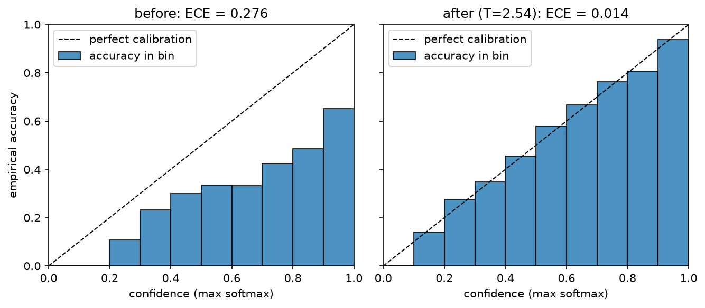
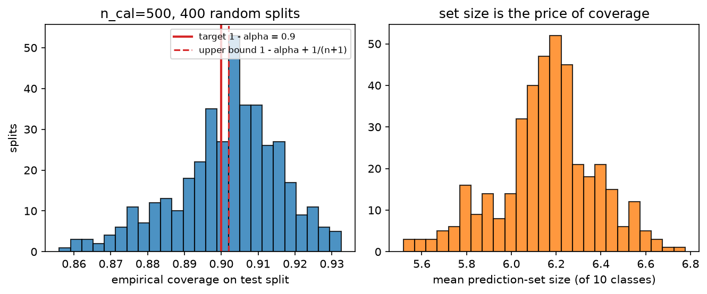
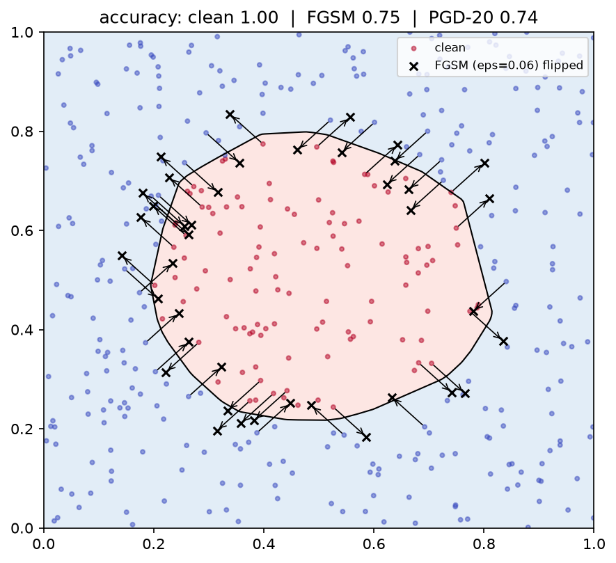

# Uncertainty & reliability

> **Why this matters at staff level.** Every shipped model meets inputs its training set
> never contained, and the question that decides whether the system is safe is not "how
> accurate is it?" but "does it know when it is wrong?". Autonomy, fintech and medical
> interviewers probe this directly, aleatoric vs epistemic, why softmax confidence is not
> uncertainty, what guarantee conformal prediction actually gives, and ML-systems rounds
> probe the production half: drift detection, shadow mode, canaries, uncertainty gating
> and fallback. Strong signal is deriving the heteroscedastic loss and the conformal
> coverage bound, then naming the operational mechanism that consumes the uncertainty.

## TL;DR: the interview card

* **Aleatoric** uncertainty is noise in the data (irreducible with more data; reducible
  with better sensors/features). **Epistemic** is uncertainty about the model (reducible
  with more data). Predicting $\mu$ and $\log\sigma^2$ and minimising
  $\frac12\log\sigma^2 + \frac{(y-\mu)^2}{2\sigma^2}$ learns aleatoric noise and gives
  free loss attenuation on noisy examples.
* With $M$ stochastic members: total $= H[\bar p]$, aleatoric $= \frac1M\sum_m H[p_m]$,
  epistemic $=$ mutual information $\text{MI} = H[\bar p] - \frac1M\sum_m H[p_m] \ge 0$
  (BALD). Members that disagree confidently → high MI; members that agree but are unsure
  → high aleatoric, zero MI.
* Softmax confidence is not uncertainty: it is a normalised score with no notion of "far
  from the data", it is systematically over-confident in modern networks, and a ReLU
  network's confidence goes to 1 far away from the data.
* $\text{ECE} = \sum_b \frac{|B_b|}{N}\,\big|\text{acc}(B_b) - \text{conf}(B_b)\big|$.
  It is biased by binning (equal-width bins are mostly empty at low confidence), it is
  not a proper scoring rule, and a perfectly useless-but-calibrated model scores 0.
  Report reliability diagrams, ECE **and** Brier / NLL.
* Temperature scaling fits one scalar $T$ on validation NLL: $\softmax(z/T)$. It never
  changes the argmax, so accuracy is unchanged, and it usually removes most of the ECE.
* Deep ensembles beat MC dropout in practice because independent inits explore different
  loss-basins; MC dropout is an approximate variational posterior with a fixed, cheap
  approximating family.
* **Split conformal:** with exchangeable data, score $s(x,y)$, calibration scores
  $s_1..s_n$ and $\hat q$ the $\lceil (n+1)(1-\alpha)\rceil$-th smallest,
  $C(x) = \{y : s(x,y) \le \hat q\}$ satisfies
  $1-\alpha \le P(Y \in C(X)) \le 1-\alpha+\frac{1}{n+1}$, distribution-free, finite-sample,
  marginal (not conditional) coverage.
* OOD scores, larger = more in-distribution: max-softmax (weak), energy
  $T\log\sum_k e^{z_k/T}$ (uses logit magnitude, which softmax throws away), Mahalanobis
  on penultimate features (uses the feature geometry).
* Shift taxonomy: covariate shift $p(x)$ changes, $p(y|x)$ fixed (fix: importance
  weighting); label shift $p(y)$ changes, $p(x|y)$ fixed (fix: prior correction);
  concept drift $p(y|x)$ changes (fix: retrain, no reweighting can save you).
* FGSM: $x + \epsilon\,\text{sign}(\nabla_x L)$. PGD: iterate with step $\alpha$ and
  project onto the $\epsilon$-ball. Adversarial training solves
  $\min_\theta \E \max_{\delta} L$, costs $k{+}1$ passes per step, and trades clean
  accuracy for robust accuracy.

## 1. Intuition first

Three pictures, one sentence each; if you can draw them you can answer most of this
chapter.

**A coin and a die.** A fair coin has irreducible aleatoric uncertainty: even with
infinite data, $H = \log 2$. A die you have never rolled has epistemic uncertainty: you
do not know its bias, and 1000 rolls fix that. A model trained on 10 million images of
daylight roads and shown a snowstorm has epistemic uncertainty; a model asked to classify
a genuinely ambiguous 50/50 blur has aleatoric uncertainty. The *action* differs: epistemic
→ collect data, abstain, hand over to a human; aleatoric → improve the sensor, or accept
the error rate and design the system around it.

**Three ensemble members on one input.**

| case | $p_1$ | $p_2$ | $p_3$ | $\bar p$ | $H[\bar p]$ | $\overline{H[p_m]}$ | MI |
|---|---|---|---|---|---|---|---|
| confident agreement | (.99,.01) | (.98,.02) | (.99,.01) | (.99,.01) | 0.06 | 0.06 | ≈0 |
| uncertain agreement | (.5,.5) | (.5,.5) | (.5,.5) | (.5,.5) | 0.69 | 0.69 | 0 |
| confident disagreement | (1,0) | (0,1) | (1,0) | (.67,.33) | 0.64 | 0 | **0.64** |

Row 2 and row 3 have similar *total* entropy and completely different meanings. Only the
decomposition tells them apart, and only row 3 says "this input is unlike my training
data, do not act on it". (Entropies in nats.)

**A network's confidence far from the data.** Take a 2-layer ReLU classifier trained on a
disc. Walk away from the data in any direction: the logits grow linearly (ReLU nets are
piecewise linear, so far away the largest logit dominates), and the softmax saturates to
1.0. The model is *maximally confident* in regions it has never seen. This is not a bug
you can prompt away. It is the geometry of the function class, and it is why OOD
detection needs something other than the softmax.

{ width="760" }

*Left: an over-confident model, every bar sits below the diagonal, meaning accuracy is
lower than confidence. Right: after fitting a single temperature on a validation split,
the bars snap to the diagonal and ECE drops by an order of magnitude. Accuracy is
identical in both panels: only the confidences moved.*

## 2. The math

### 2.1 Aleatoric vs epistemic, and the heteroscedastic regression loss

Write the predictive distribution with a posterior over weights:

$$
p(y \mid x, \mathcal D) = \int \underbrace{p(y \mid x, \theta)}_{\text{aleatoric}}\,\underbrace{p(\theta \mid \mathcal D)}_{\text{epistemic}}\,d\theta .
$$

The inner term is noise the model cannot remove at fixed $\theta$; the spread of
$p(\theta\mid\mathcal D)$ is what more data shrinks.

**Heteroscedastic Gaussian likelihood.** Let the network output two heads,
$\mu_\theta(x)$ and $s_\theta(x) = \log\sigma^2_\theta(x)$ (predict the *log* variance so
positivity is free and the scale is stable). For one observation,

$$
p(y\mid x) = \frac{1}{\sqrt{2\pi\sigma^2}}\exp\!\Big(-\frac{(y-\mu)^2}{2\sigma^2}\Big)
\;\Longrightarrow\;
-\log p = \frac12\log(2\pi) + \frac12\log\sigma^2 + \frac{(y-\mu)^2}{2\sigma^2}.
$$

Dropping the constant gives the loss you must be able to write instantly:

$$
\boxed{\;\mathcal L(\theta) = \frac{1}{N}\sum_{i=1}^{N}\Big[\tfrac12 s_i + \frac{(y_i-\mu_i)^2}{2e^{s_i}}\Big],\qquad s_i = \log\sigma_i^2\;}
$$

*What it means.* Two gradients tell the story. With respect to $\mu$:

$$
\frac{\partial \mathcal L_i}{\partial \mu_i} = -\frac{y_i - \mu_i}{e^{s_i}},
$$

so squared error on example $i$ is **attenuated** by $1/\sigma_i^2$, the network can
"explain away" a hard example by raising its predicted variance instead of distorting
$\mu$ to fit it. That is exactly what you want with label noise, and exactly what makes
naive MSE fragile. With respect to $s$:

$$
\frac{\partial \mathcal L_i}{\partial s_i} = \frac12 - \frac{(y_i-\mu_i)^2}{2e^{s_i}} = 0
\quad\Longrightarrow\quad
\boxed{\;e^{s_i} = \sigma_i^2 = (y_i - \mu_i)^2\;}
$$

the optimum sets the predicted variance to the squared residual, so $\sigma^2$ *is* the
model's estimate of the local noise. The $\frac12\log\sigma^2$ term is the regulariser
that stops the model from declaring infinite variance everywhere (which would zero the
second term). This is the "learned loss attenuation" of Kendall & Gal (2017), and the
implementation's test checks the gradient $\partial\mathcal L/\partial s = -1.5$ at
$\mu=0, y=2, s=0$ against autograd.

For classification the aleatoric term is already in the softmax: $H[p(y|x,\theta)]$.
Epistemic uncertainty needs several $\theta$.

### 2.2 Predictive entropy, mutual information (BALD)

With $M$ members $\theta_1..\theta_M$ (ensemble or MC dropout samples), $p_m = p(y|x,\theta_m)$
and $\bar p = \frac1M\sum_m p_m$:

$$
\underbrace{H[\bar p]}_{\text{total}} = \underbrace{\frac1M\sum_m H[p_m]}_{\text{expected / aleatoric}} + \underbrace{\Big(H[\bar p] - \frac1M\sum_m H[p_m]\Big)}_{\text{mutual information / epistemic}}
$$

The last term is $I(y;\theta \mid x)$, the mutual information between the label and the
parameters. It is non-negative by concavity of entropy (Jensen:
$H[\E_\theta p] \ge \E_\theta H[p]$), and it is zero exactly when all members agree.
Interpretation: *how much would observing this label teach me about the parameters?*, 
which is why BALD (Houlsby et al. 2011) uses it as the acquisition function in active
learning: label the points whose labels are most informative about $\theta$.

$$
\boxed{\;I(y;\theta\mid x) = H\big[\tfrac1M\textstyle\sum_m p_m\big] - \tfrac1M\textstyle\sum_m H[p_m] \;\ge\; 0\;}
$$

Numerically, clip at 0: floating-point can give $-10^{-16}$ and a downstream log will
complain.

### 2.3 Calibration: ECE and its binning pitfalls

A model is **calibrated** if, among all predictions made with confidence $c$, a fraction
$c$ are correct:

$$
P\big(\hat y = y \;\big|\; \hat p = c\big) = c \quad \forall c \in [0,1].
$$

This is *top-label* calibration; the stronger *multiclass* (classwise) version asks the
same of every class probability, and the strongest asks it of the full vector. Say which
one you mean.

The quantity is a conditional expectation on a continuous variable, so you cannot estimate
it without smoothing. Binning confidences into $B$ bins $B_1..B_B$:

$$
\boxed{\;\text{ECE} = \sum_{b=1}^{B} \frac{|B_b|}{N}\,\Big|\underbrace{\tfrac{1}{|B_b|}\textstyle\sum_{i\in B_b}\mathbb 1[\hat y_i = y_i]}_{\text{acc}(B_b)} - \underbrace{\tfrac{1}{|B_b|}\textstyle\sum_{i\in B_b}\hat p_i}_{\text{conf}(B_b)}\Big|\;}
$$

and MCE replaces the weighted sum with a max. **Five pitfalls to name:**

1. **Binning bias.** ECE is a biased, inconsistent estimator: with few bins, errors inside
   a bin cancel and ECE is under-estimated; with many bins, each bin is noisy and ECE is
   over-estimated. The estimate has no fixed relationship to the true calibration error,
   so ECE values across papers with different $B$ are not comparable.
2. **Equal-width bins are mostly empty.** A modern classifier puts 90 % of its mass above
   confidence 0.9; fifteen equal-width bins leave the first ten nearly empty and the
   headline number is computed from two bins. **Adaptive (equal-mass) binning** fixes the
   count, which is why the implementation provides `adaptive_ece`.
3. **Not a proper scoring rule.** ECE can be gamed: a model that always predicts the base
   rate is perfectly calibrated and completely uninformative (ECE 0, accuracy = majority
   class). Always pair ECE with a proper score, Brier
   $\frac1N\sum(\hat p_i - y_i)^2$ or NLL, which decomposes (Murphy) into
   *calibration* + *refinement*: you want good calibration **and** high refinement.
4. **Top-label only.** Standard ECE looks at the max probability. A model can have ECE 0
   at the top label and be badly wrong about the runner-up, which is what matters if you
   are building a prediction *set*.
5. **Sample size.** ECE has a positive bias that shrinks as $1/\sqrt{N}$ per bin; with
   $N = 1000$ and $B = 15$, a "0.02 ECE" is within noise of 0. Bootstrap it
   (`harness.ece_with_ci` does).

**Temperature scaling** (Guo et al. 2017). Fix the trained network; learn one scalar
$T > 0$ on a held-out validation set by minimising NLL of $\softmax(z/T)$:

$$
T^\star = \argmin_T \; -\sum_{i} \log \softmax(z_i/T)_{y_i}.
$$

Because $\softmax(z/T)$ is monotone in $z$ for $T>0$, **the argmax and therefore accuracy
are unchanged**; only the sharpness moves. $T > 1$ softens (fixes over-confidence, the
usual direction), $T<1$ sharpens. It is the simplest member of a family, Platt scaling
(logistic on the logit), vector/matrix scaling (per-class $a_k z_k + b_k$, more parameters,
more overfitting), isotonic regression (non-parametric, needs more validation data), and
histogram binning. Temperature scaling wins in practice because one parameter cannot
overfit a validation set of a few thousand points, and because the dominant miscalibration
of a modern network really is a single global sharpness factor.

**Why modern networks are over-confident.** Training minimises NLL long after
classification error plateaus, so the optimiser keeps pushing logit margins apart on
already-correct training points; capacity, lack of label smoothing, and weight decay
schedules all push the same way. The model does not become more *accurate*, only more
*confident*. This is also why label smoothing, mixup and focal loss improve calibration
as a side effect.

### 2.4 Ensembles and MC dropout

**Deep ensembles** (Lakshminarayanan et al. 2017): train $M$ copies from independent
random initialisations (and independent data shuffling), average the predictive
distributions. Why they work, in the order an interviewer wants to hear it:

1. Different inits land in **different loss basins** with genuinely different functions
   off the data manifold, they disagree where there was no data, which is exactly where
   you want disagreement. (Random-seed diversity dominates; bagging the data is not
   needed and usually hurts because each member sees less data.)
2. Averaging probabilities is a **mixture**, not a product: it can only increase entropy
   ($H[\bar p]\ge\overline{H[p_m]}$), so the ensemble is never more confident than its
   average member.
3. Proper scoring rules decompose: the ensemble's NLL is bounded by the average member's
   NLL minus the diversity term (Jensen again), so diversity is free accuracy *and* free
   calibration.

Cost is the honest part of the answer: $M\times$ training and $M\times$ inference. In
production you get most of the benefit from $M=5$; cheaper approximations are snapshot
ensembles (cyclic LR, save minima), BatchEnsemble / rank-1 factors, multi-head networks,
and averaging predictions across test-time data augmentations.

**MC dropout** (Gal & Ghahramani 2016): keep dropout on at test time and average $M$
stochastic passes. The derivation sketch: dropout training with weight decay minimises

$$
\mathcal L = -\frac{1}{N}\sum_i \log p(y_i|x_i,\widehat W_i) + \lambda\sum_l \norm{W_l}^2,
$$

which is the Monte-Carlo estimate of the negative ELBO of a variational distribution
$q(W)$ that is a **mixture of two Gaussians per weight row**, one centred at 0 (dropped)
and one at the learned weight, with vanishing variances. Minimising the dropout objective
is therefore approximate variational inference, and sampling dropout masks at test time
samples $q(W)$, giving

$$
p(y|x) \approx \frac1M\sum_{m=1}^{M} p\big(y \mid x, \widehat W^{(m)}\big).
$$

Caveats to state: the approximating family is fixed and very restrictive (its "posterior"
does not concentrate with more data in the way a real posterior does), the uncertainty is
sensitive to the dropout rate (which was tuned for regularisation, not for uncertainty) 
and it only reflects uncertainty in the layers that have dropout. It is cheap and better
than nothing; deep ensembles are the stronger baseline and are what most production
systems use when they can afford them.

### 2.5 Split conformal prediction: derive the guarantee

The result that makes conformal worth knowing: **finite-sample, distribution-free
coverage** under exchangeability alone, no assumption about the model, the data
distribution, or calibration.

**Setup.** A *conformity score* $s(x,y) \in \R$, large = the pair fits badly. For
classification, $s(x,y) = 1 - \hat p_y(x)$; for regression, $s(x,y) = |y - \hat\mu(x)|$.
Hold out $n$ calibration points *not used to fit the model*, compute
$s_i = s(x_i,y_i)$, and let

$$
\hat q = \text{the } \lceil (n+1)(1-\alpha)\rceil\text{-th smallest of } s_1..s_n,
\qquad C(x) = \{y : s(x,y) \le \hat q\}.
$$

**Theorem.** If $(x_1,y_1),\dots,(x_n,y_n),(x_{n+1},y_{n+1})$ are exchangeable, then

$$
\boxed{\;1-\alpha \;\le\; P\big(y_{n+1} \in C(x_{n+1})\big) \;\le\; 1-\alpha+\frac{1}{n+1}\;}
$$

*Proof.* Note $y_{n+1} \in C(x_{n+1}) \iff s_{n+1} \le \hat q$. Exchangeability of the
$n+1$ pairs implies exchangeability of the scores $s_1..s_{n+1}$, so the **rank** of
$s_{n+1}$ among all $n+1$ scores is uniform on $\{1,\dots,n+1\}$ (assume continuous scores
so ties have probability 0; otherwise break ties at random). Let
$k = \lceil (n+1)(1-\alpha)\rceil$. Then $s_{n+1} \le \hat q$, where $\hat q$ is the
$k$-th smallest of the *other* $n$ scores, holds exactly when
$\text{rank}(s_{n+1}) \le k$, so

$$
P(s_{n+1} \le \hat q) = \frac{k}{n+1} = \frac{\lceil (n+1)(1-\alpha)\rceil}{n+1} \ge 1-\alpha,
$$

and since $\lceil z\rceil < z+1$, the same quantity is $< (1-\alpha) + \frac{1}{n+1}$.
$\square$

Read the three consequences out loud in an interview:

* **The guarantee is marginal, not conditional.** $P(y \in C(x))$ averages over $x$.
  Coverage can be 99 % on easy inputs and 70 % on a hard subgroup while the average is
  90 %. Fixes: Mondrian/group-conditional conformal (calibrate per group, which restores
  the guarantee within each group at the cost of $n$ per group) and adaptive scores.
* **The model quality shows up in the set *size*, not the coverage.** A useless model
  still gets 90 % coverage, by returning nearly all classes. So report average set size
  (or interval width) next to coverage; that is the metric that improves when the model
  improves.
* **$\hat q$ can be $+\infty$.** If $\lceil (n+1)(1-\alpha)\rceil > n$, i.e.
  $n < \frac{1}{\alpha} - 1$, no finite quantile achieves the level: you need at least
  $n \ge \frac{1}{\alpha}-1$ calibration points (e.g. $n \ge 19$ for $\alpha = 0.05$,
  and hundreds for a tight, low-variance $\hat q$).

**Better scores.** For classification, $1 - \hat p_y$ produces small sets but poor
conditional coverage; **APS** (adaptive prediction sets) uses the cumulative sorted
probability mass until the true label is included, and **RAPS** adds a regularisation term
that penalises long tails, trading a little size for much better conditional behaviour.
For regression, **conformalised quantile regression** (CQR) uses a quantile model's
$[\hat q_{\alpha/2}, \hat q_{1-\alpha/2}]$ and conformalises the residual, giving
*adaptive-width* intervals instead of the constant-width $\hat\mu \pm \hat q$.

**Exchangeability is the assumption that breaks.** Time series, feedback loops and any
distribution shift violate it; the remedies are weighted conformal (importance weights for
covariate shift) and adaptive conformal inference (update $\alpha$ online to track
realised coverage).

{ width="760" }

*Left: empirical coverage over 400 random calibration/test splits, centred on the nominal
$1-\alpha = 0.9$ with the finite-sample spread; the dashed line is the upper bound
$1-\alpha+1/(n+1)$. Right: average prediction-set size, the number that actually improves
when the model gets better.*

### 2.6 OOD detection

**Why softmax confidence fails.** Softmax is shift-invariant:
$\softmax(z) = \softmax(z + c\mathbf 1)$, so the *magnitude* of the logits, the thing
that carries "how strongly does any class fire", is discarded. A far-OOD input with
logits $(0.1, 0.0)$ and a confident in-distribution input with logits $(10, 0)$ can both
map to high confidence after training pushes margins apart; worse, for ReLU networks,
Hein et al. (2019) proved that scaling any input far enough gives arbitrarily high
confidence. Confidence is a *relative* score among the known classes, and "none of the
above" is not one of them.

**Energy score** (Liu et al. 2020). Define the free energy of the logit vector
$E(x) = -T\log\sum_k e^{z_k/T}$ and score $-E(x) = T\log\sum_k e^{z_k/T}$ (larger = more
in-distribution). The link to the softmax:

$$
\log \softmax(z)_{\hat y} = \frac{z_{\hat y}}{T} - \log\sum_k e^{z_k/T}
\;\Longrightarrow\;
-E(x) = \frac{z_{\hat y}}{T} - \log\softmax(z)_{\hat y}
$$

so the energy is the max-logit *plus* the log-softmax: it keeps exactly the magnitude
information the softmax throws away. Under an energy-based reading of the classifier,
$-E(x)$ is (up to a constant) the log of the unnormalised joint density
$\sum_k e^{z_k} \propto p(x)$, so it is an estimate of the *density*, which is what OOD
detection wants.

**Mahalanobis** (Lee et al. 2018). Fit class-conditional Gaussians to penultimate features
$f(x) \in \R^d$ with a shared covariance,

$$
\hat\mu_k = \frac{1}{N_k}\sum_{i: y_i=k} f(x_i),\qquad
\hat\Sigma = \frac1N \sum_k \sum_{i:y_i=k}(f(x_i)-\hat\mu_k)(f(x_i)-\hat\mu_k)^\top,
$$

and score $-\min_k (f(x)-\hat\mu_k)^\top \hat\Sigma^{-1}(f(x)-\hat\mu_k)$. This is the log
density of the closest class-conditional Gaussian up to constants, i.e. a generative
model bolted onto a discriminative network. It detects *feature-space* outliers that the
logits smooth over, and it is the method of choice when you can afford one pass over the
training set at deployment time. Practical notes: regularise $\hat\Sigma$ (the
implementation adds $\lambda I$), use the penultimate layer or an ensemble of layers, and
re-fit whenever the backbone changes.

**Evaluating OOD detection** is a binary detection problem, so it inherits everything in
[Evaluation §2.2](02-evaluation.md#22-roc-auc-is-a-rank-statistic-pr-auc-is-prevalence-aware):
report AUROC, plus FPR@95%TPR (the fraction of OOD inputs admitted when you keep 95 % of
in-distribution traffic), which is the number the ops team cares about. Beware "near-OOD
vs far-OOD": every method looks great separating CIFAR-10 from noise and much worse
separating CIFAR-10 from CIFAR-100.

### 2.7 Distribution shift: three kinds, and what to do about each

Let training have joint $p_{\text{tr}}(x,y)$ and deployment $p_{\text{te}}(x,y)$.

| Shift | What changes | What is fixed | Detect with | Fix with |
|---|---|---|---|---|
| **Covariate** | $p(x)$ | $p(y\mid x)$ | KS / MMD / C2ST on inputs or features | importance weights $w(x) = \frac{p_{\text{te}}(x)}{p_{\text{tr}}(x)}$ in the loss |
| **Label (prior)** | $p(y)$ | $p(x\mid y)$ | shift in predicted-label distribution (BBSE/EM) | re-weight the prior: $p'(y|x) \propto p(y|x)\frac{p_{\text{te}}(y)}{p_{\text{tr}}(y)}$ |
| **Concept** | $p(y\mid x)$ | possibly $p(x)$ | performance drop with labels; delayed feedback | retrain / continual learning: reweighting cannot help |

**Importance weighting, derived.** For covariate shift, the target risk is

$$
R_{\text{te}} = \E_{p_{\text{te}}(x)p(y|x)}[\ell] = \int p_{\text{te}}(x)p(y|x)\ell\,dx\,dy
= \int p_{\text{tr}}(x)\,\frac{p_{\text{te}}(x)}{p_{\text{tr}}(x)}\,p(y|x)\,\ell\,dx\,dy
= \E_{p_{\text{tr}}}\big[w(x)\,\ell\big],
$$

so training on source data weighted by $w(x)$ is unbiased for the target risk, *provided*
$p(y|x)$ really is unchanged and $w$ has finite variance (it explodes when the supports
barely overlap; clip the weights and report the effective sample size
$(\sum w)^2/\sum w^2$).

**Estimating $w$ without densities.** Train a classifier to separate source from target;
if $\hat d(x) \approx P(\text{target}\mid x)$ then by Bayes

$$
\frac{p_{\text{te}}(x)}{p_{\text{tr}}(x)} = \frac{P(\text{target}\mid x)}{P(\text{source}\mid x)}\cdot\frac{P(\text{source})}{P(\text{target})}
= \frac{\hat d(x)}{1-\hat d(x)}\cdot\frac{n_{\text{tr}}}{n_{\text{te}}},
$$

which is exactly what `drift.importance_weights` computes. The same classifier is the
**classifier two-sample test** (C2ST): if held-out accuracy is significantly above 0.5,
the two samples come from different distributions, and a one-sided binomial test on
$n_{\text{test}}$ gives the p-value. It is more powerful than per-feature tests in high
dimensions because it can find *multivariate* differences that no marginal reveals.

**Two-sample tests.** The KS statistic $\sup_x|F_a(x)-F_b(x)|$ with the asymptotic
$P(K>\lambda) = 2\sum_{j\ge1}(-1)^{j-1}e^{-2j^2\lambda^2}$, $\lambda = D\sqrt{\frac{nm}{n+m}}$,
is the univariate workhorse (our test checks it against `scipy.stats.ks_2samp`). It is
per-feature, so with 500 features you must correct for multiplicity (Bonferroni or BH) or
you will alarm daily. **PSI** (population stability index) is the industry's rule-of-thumb
cousin: $\sum_b (c_b - r_b)\log\frac{c_b}{r_b}$, a symmetrised KL over quantile bins, with
the folklore thresholds 0.1 (investigate) and 0.25 (act). **MMD** with a kernel is the
principled multivariate option. For images/text, run the test on *embeddings*, not raw
pixels or tokens.

### 2.8 Adversarial examples

**FGSM** (Goodfellow et al. 2015). Linearise the loss around $x$:
$L(x+\delta) \approx L(x) + \nabla_x L^\top \delta$. Maximise subject to
$\norm{\delta}_\infty \le \epsilon$. The maximiser of a linear function over the
$\ell_\infty$ ball puts every coordinate at its extreme with the sign of the gradient:

$$
\boxed{\;\delta^\star = \epsilon\,\text{sign}\big(\nabla_x L(f_\theta(x), y)\big),\qquad x_{\text{adv}} = \text{clip}\big(x + \delta^\star\big)\;}
$$

with $\nabla_x L^\top\delta^\star = \epsilon\norm{\nabla_x L}_1$, the increase grows with
the **$\ell_1$ norm of the gradient**, i.e. with dimension. That is the "adversarial
examples are a consequence of linearity in high dimensions" argument: a tiny per-pixel
change, summed over $d$ pixels, is a large change in the logit.

**PGD** (Madry et al. 2018) drops the linear approximation and does projected gradient
ascent inside the ball:

$$
x^{t+1} = \Pi_{B_\epsilon(x)}\Big(x^t + \alpha\,\text{sign}\big(\nabla_x L(f_\theta(x^t),y)\big)\Big),
\qquad x^0 = x + \mathcal U(-\epsilon,\epsilon),
$$

where $\Pi$ is the elementwise clip to $[x-\epsilon, x+\epsilon]$ (and then to the valid
pixel range). The random start matters: it avoids the degenerate single-point evaluation
that gradient masking can exploit, and repeating with several restarts is the standard
strength knob. PGD with enough steps is the canonical "strongest first-order attack", and
a defence that survives FGSM but not PGD is a defence that merely obfuscated gradients.

**Adversarial training** solves the saddle-point problem

$$
\min_\theta\; \E_{(x,y)}\Big[\max_{\norm{\delta}_\infty \le \epsilon} L\big(f_\theta(x+\delta), y\big)\Big].
$$

Inner max by PGD-$k$, outer min by SGD on the adversarial batch. Cost: $k{+}1$ forward/backward
passes per step, so roughly $8$–$10\times$ standard training at $k=7$.

**The robustness–accuracy trade-off** is real, not an artefact: Tsipras et al. (2019)
construct a distribution where the most accurate classifier and the most robust classifier
are provably different, because robustness forces the model to discard weakly-correlated
but genuinely predictive features. Empirically, robust CIFAR-10 models give up single-digit
to low-double-digit clean accuracy. State this as a *design decision*: for a perception
stack, the relevant threat model is usually physical (stickers, printed patches,
projections, adversarial road markings) rather than $\ell_\infty$-bounded digital noise,
so $\ell_\infty$ adversarial training may be the wrong spend, input diversity, sensor
redundancy and anomaly detection buy more. Physical-world attacks to know: Eykholt et al.
(2018) "Robust Physical-World Attacks" (stickers on stop signs fooling a classifier across
viewpoints), Brown et al. (2017) adversarial patches (a printable patch that dominates the
prediction regardless of scene), and Athalye et al. (2018) synthesised 3D-printed objects
misclassified across transformations.

{ width="640" }

*A 2-D classifier trained to separate a disc from its surroundings. Arrows show the
$\epsilon = 0.06$ FGSM step; every crossed point flipped class. Note that the flipped
points are precisely those near the boundary, and that PGD flips slightly more with the
same $\epsilon$ budget.*

## 3. Implementation

`src/mlbook/reliability/`, NumPy for the statistics, PyTorch where gradients are needed.

### 3.1 ECE and temperature scaling

```python
def expected_calibration_error(probs, labels, n_bins=15):
    conf = probs.max(axis=1)  # (N,)
    pred = probs.argmax(axis=1)  # (N,)
    correct = (pred == labels).astype(float)  # (N,)
    edges = np.linspace(0.0, 1.0, n_bins + 1)  # (B+1,)
    idx = np.clip(np.digitize(conf, edges[1:-1]), 0, n_bins - 1)  # (N,) bin of each example
    ece, mce = 0.0, 0.0
    for b in range(n_bins):
        m = idx == b
        if m.sum() == 0:
            continue
        gap = abs(correct[m].mean() - conf[m].mean())
        ece += m.sum() / len(conf) * gap
        mce = max(mce, gap)
    return float(ece), float(mce), {...}
```

`np.digitize(conf, edges[1:-1])` uses the *interior* edges so that confidence exactly 1.0
lands in the last bin rather than out of range, the off-by-one that silently drops your
most confident predictions. The returned `bins` dict feeds the reliability diagram.

```python
class TemperatureScaling(nn.Module):
    def __init__(self):
        super().__init__()
        self.log_t = nn.Parameter(torch.zeros(1))  # (1,) log T, so T = 1 at init and T > 0 always

    def forward(self, logits: torch.Tensor) -> torch.Tensor:
        return logits / self.log_t.exp()  # (N, K)

    def fit(self, logits, labels, max_iter=100):
        logits = logits.detach()
        opt = torch.optim.LBFGS([self.log_t], lr=0.1, max_iter=max_iter, line_search_fn="strong_wolfe")

        def closure():
            opt.zero_grad()
            loss = nn.functional.cross_entropy(self.forward(logits), labels)  # scalar
            loss.backward()
            return loss

        opt.step(closure)
        return self
```

Parametrising $T = e^{\tau}$ keeps $T$ positive without a constraint, and LBFGS with a
strong-Wolfe line search converges in one `step` call on this 1-D problem. **Fit on
validation logits, never on train or test.**

**How you'd test it.** `tests/test_reliability_calibration.py` builds logits from a known
distribution, multiplies them by 3 to manufacture over-confidence, and checks the fitted
temperature recovers $3.0 \pm 0.3$, that NLL decreases, that ECE decreases, and that
`argmax` is bit-identical before and after (the accuracy-invariance claim).

### 3.2 Entropy, mutual information, ensembles, MC dropout

```python
def predictive_entropy(P: np.ndarray) -> np.ndarray:
    return entropy(P.mean(axis=0))  # (N,)  P is (M, N, K)

def expected_entropy(P: np.ndarray) -> np.ndarray:
    return entropy(P).mean(axis=0)  # (N,)

def mutual_information(P: np.ndarray) -> np.ndarray:
    return np.clip(predictive_entropy(P) - expected_entropy(P), 0.0, None)  # (N,)
```

The `(M, N, K)` convention (members, examples, classes) is worth fixing in your head:
`mean(axis=0)` is "average the members", `entropy(...)` reduces the last axis.

```python
def enable_mc_dropout(model: nn.Module) -> None:
    model.eval()
    for m in model.modules():
        if isinstance(m, nn.Dropout):
            m.train()
```

This is the line people get wrong: `model.train()` would also put BatchNorm into batch-statistics
mode, which changes predictions for a reason that has nothing to do with uncertainty. Only
`Dropout` goes back to train mode.

### 3.3 Split conformal

```python
def conformal_quantile(scores: np.ndarray, alpha: float) -> float:
    n = len(scores)
    k = int(np.ceil((n + 1) * (1.0 - alpha)))  # rank of the score we need
    if k > n:
        return float(np.inf)  # not enough calibration points for this alpha
    return float(np.sort(scores)[k - 1])  # k-th smallest score


class SplitConformalClassifier:
    def calibrate(self, probs_cal, y_cal):
        scores = 1.0 - probs_cal[np.arange(len(y_cal)), y_cal]  # (n,) conformity of the true label
        self.q_hat = conformal_quantile(scores, self.alpha)
        return self

    def predict_sets(self, probs):
        return (1.0 - probs) <= self.q_hat  # (N, K) boolean membership
```

The $\lceil (n+1)(1-\alpha)\rceil$-th **order statistic**, not `np.quantile`, the $+1$ is
the whole finite-sample correction and using a plain empirical quantile silently loses the
guarantee. Returning $\infty$ (i.e. "predict everything") when $n$ is too small is the
honest behaviour.

**How you'd test it.** `tests/test_reliability_conformal.py` checks the quantile against
hand-computed ranks, then runs the classifier at $\alpha \in \{0.05, 0.2\}$ on 4 000 test
points and asserts empirical coverage lands in $[1-\alpha-0.03,\; 1-\alpha+0.04]$, and does
the same for the regressor with heavy-tailed ($t_3$) noise, the point being that the
guarantee does not care about the noise distribution.

### 3.4 OOD scores

```python
def energy_score(logits: np.ndarray, T: float = 1.0) -> np.ndarray:
    return T * _logsumexp(logits / T, axis=1)  # (N,) larger = more in-distribution


class MahalanobisDetector:
    def fit(self, F: np.ndarray, y: np.ndarray):
        K = int(y.max()) + 1
        self.means = np.stack([F[y == k].mean(axis=0) for k in range(K)])  # (K, d)
        centred = F - self.means[y]  # (N, d) subtract each point's own class mean
        cov = centred.T @ centred / len(F) + self.reg * np.eye(F.shape[1])  # (d, d) shared covariance
        self.prec = np.linalg.inv(cov)  # (d, d)
        return self

    def score(self, F: np.ndarray) -> np.ndarray:
        diff = F[:, None, :] - self.means[None, :, :]  # (N, K, d)
        m2 = np.einsum("nkd,de,nke->nk", diff, self.prec, diff)  # (N, K)
        return -m2.min(axis=1)  # (N,)
```

The `einsum` string, term by term: `n` indexes examples, `k` classes, `d` and `e` the two
feature axes of the precision matrix; `nkd,de,nke->nk` contracts
$\text{diff}^\top \Sigma^{-1}\text{diff}$ for each (example, class) pair, leaving `(N, K)`.
Every score in this module is oriented *larger = more in-distribution*, so they can be fed
directly to `roc_auc` with in-distribution as the positive class, which is exactly what
the test does, asserting AUROC > 0.99 on well-separated blobs.

### 3.5 FGSM / PGD

```python
def input_gradient(model, x, y):
    x = x.clone().detach().requires_grad_(True)  # (N, ...) leaf with grad
    loss = nn.functional.cross_entropy(model(x), y)  # scalar
    (grad,) = torch.autograd.grad(loss, x)  # (N, ...) dL/dx
    return grad


def pgd(model, x, y, eps, alpha, n_steps, clip=(0.0, 1.0), random_start=True):
    x_adv = x.clone().detach()  # (N, ...)
    if random_start:
        x_adv = x_adv + torch.empty_like(x_adv).uniform_(-eps, eps)  # (N, ...)
    for _ in range(n_steps):
        grad = input_gradient(model, x_adv, y)  # (N, ...)
        x_adv = x_adv + alpha * grad.sign()  # (N, ...) ascent step
        x_adv = torch.max(torch.min(x_adv, x + eps), x - eps)  # project onto the L-inf ball
        if clip is not None:
            x_adv = x_adv.clamp(*clip)
    return x_adv.detach()
```

`torch.autograd.grad(loss, x)` differentiates with respect to the *input*, leaving
parameter gradients untouched, the thing to say out loud when an interviewer asks how an
attack differs from a training step. The projection is two elementwise clips: first onto
the $\epsilon$-ball, then onto the valid input range (order matters; clipping to $[0,1]$
last guarantees a valid image).

**How you'd test it.** `tests/test_reliability_adversarial.py` checks `input_gradient`
against a central finite difference, that FGSM respects the $\epsilon$ bound and raises
the loss, that PGD is at least as strong as FGSM at the same $\epsilon$, and that
adversarial training lowers the PGD loss on a fixed evaluation attack.

### 3.6 Drift

```python
def ks_statistic(a: np.ndarray, b: np.ndarray) -> float:
    a, b = np.sort(a), np.sort(b)
    grid = np.concatenate([a, b])  # (n+m,) every observed value is a candidate sup point
    Fa = np.searchsorted(a, grid, side="right") / len(a)  # (n+m,) empirical CDF of a
    Fb = np.searchsorted(b, grid, side="right") / len(b)  # (n+m,)
    return float(np.max(np.abs(Fa - Fb)))


def classifier_two_sample_test(X_ref, X_cur, test_frac=0.5, seed=0):
    X = np.concatenate([X_ref, X_cur])  # (N, d)
    y = np.concatenate([np.zeros(len(X_ref)), np.ones(len(X_cur))])  # (N,)
    X = (X - X.mean(0)) / (X.std(0) + 1e-8)  # (N, d) standardise
    ...  # split, fit logistic regression, held-out accuracy
    z = (acc - 0.5) / np.sqrt(0.25 / n_test)  # binomial z under H0: acc = 0.5
    return {"accuracy": acc, "z": float(z), "p_value": ...}
```

The sup of $|F_a - F_b|$ is attained at one of the observed points, so evaluating both
CDFs on the pooled sorted grid is exact, not an approximation. The tests check the
statistic and the asymptotic p-value against `scipy.stats.ks_2samp`, and check that the
C2ST separates a mean-shifted sample ($p < 0.01$) while staying near chance on an
identically distributed one.

??? example "Full implementation: `src/mlbook/reliability/calibration.py`"
    ```python
    --8<-- "src/mlbook/reliability/calibration.py"
    ```

??? example "Full implementation: `src/mlbook/reliability/uncertainty.py`"
    ```python
    --8<-- "src/mlbook/reliability/uncertainty.py"
    ```

??? example "Full implementation: `src/mlbook/reliability/conformal.py`"
    ```python
    --8<-- "src/mlbook/reliability/conformal.py"
    ```

??? example "Full implementation: `src/mlbook/reliability/ood.py`"
    ```python
    --8<-- "src/mlbook/reliability/ood.py"
    ```

??? example "Full implementation: `src/mlbook/reliability/adversarial.py`"
    ```python
    --8<-- "src/mlbook/reliability/adversarial.py"
    ```

??? example "Full implementation: `src/mlbook/reliability/drift.py`"
    ```python
    --8<-- "src/mlbook/reliability/drift.py"
    ```

## Retype by hand

| Symbol | File | Target time | Test |
|---|---|---|---|
| `expected_calibration_error`, `adaptive_ece`, `TemperatureScaling` (incl. `fit`) | `src/mlbook/reliability/calibration.py` | 15 min | `pytest tests/test_reliability_calibration.py -q` |
| `heteroscedastic_gaussian_nll`, `entropy`, `predictive_entropy`, `expected_entropy`, `mutual_information`, `enable_mc_dropout` | `src/mlbook/reliability/uncertainty.py` | 15 min | `pytest tests/test_reliability_uncertainty.py -q` |
| `conformal_quantile`, `SplitConformalClassifier`, `SplitConformalRegressor` | `src/mlbook/reliability/conformal.py` | 15 min | `pytest tests/test_reliability_conformal.py -q` |
| `max_softmax_score`, `energy_score`, `MahalanobisDetector` | `src/mlbook/reliability/ood.py` | 15 min | `pytest tests/test_reliability_ood.py -q` |
| `input_gradient`, `fgsm`, `pgd` | `src/mlbook/reliability/adversarial.py` | 15 min | `pytest tests/test_reliability_adversarial.py -q` |
| `ks_statistic`, `classifier_two_sample_test` | `src/mlbook/reliability/drift.py` | 15 min | `pytest tests/test_reliability_drift.py -q` |

Read, do not retype: `ks_pvalue` (know the series exists), `population_stability_index`,
`importance_weights`, `_fit_logreg`, `adversarial_training_step`, `mc_dropout_predict`,
`ensemble_predict` (know the `(M, N, K)` convention cold).

## 4. Systems view: cost, failure modes, trade-offs

### 4.1 Which uncertainty method

| Method | Extra train cost | Extra inference cost | Gives you | Use when |
|---|---|---|---|---|
| Temperature scaling | one scalar on a val set | none | calibrated confidence | **always**: it is free; do this first |
| Heteroscedastic head | one extra output | none | per-input aleatoric $\sigma^2$ | regression with input-dependent noise (depth, ETA, pose) |
| Deep ensemble ($M$=5) | $5\times$ | $5\times$ | epistemic + aleatoric, best quality | accuracy and uncertainty both matter and you can pay |
| MC dropout ($M$=20) | none (if already using dropout) | $20\times$ | rough epistemic | cheap retrofit, non-critical decisions |
| Conformal | none (needs a held-out split) | negligible | **guaranteed** marginal coverage | you must promise a coverage level to a regulator or a downstream planner |
| Energy / Mahalanobis OOD | none / one pass over train | negligible / small | "is this input like training data" | input gating, data-collection triggers |
| Bayesian NN (VI/HMC) | $\gg$ | $\gg$ | principled posterior | research; rarely in production |

**Decision rule.** Temperature-scale everything. Add conformal when you need a guarantee.
Add an ensemble when epistemic uncertainty drives an action (abstain, escalate, collect).
Add an OOD score when the failure mode is "input unlike anything seen", which is a
*different* question from "the model is unsure between two classes".

### 4.2 Turning uncertainty into a decision

Uncertainty that nothing consumes is a dashboard, not a safety mechanism. The four
patterns:

1. **Selective prediction / gating.** Abstain when confidence $< \tau$ (or when the
   conformal set size $> 1$, or the MI $> \tau$); route to a human, a slower model, or a
   conservative default. Report the **risk–coverage curve**: accuracy on the covered
   fraction versus that fraction. The right $\tau$ comes from the cost of an error against
   the cost of an escalation, exactly as in
   [Evaluation §2.1](02-evaluation.md#21-confusion-matrix-f1-and-averaging).
2. **Fallback.** A degraded but safe behaviour: in perception, drop to a
   shorter-horizon plan or a lower speed; in a product, return the retrieval snippets
   instead of a generated answer.
3. **Redundancy.** Independent sensors or models whose failures are uncorrelated, with a
   fusion rule that notices disagreement (see
   [sensor fusion](../part11-perception-autonomy/03-sensor-fusion.md)). The
   *uncorrelated* part is what earns the cost; two models trained on the same data with
   the same augmentations fail together.
4. **Escalation and logging.** High-uncertainty inputs are the highest-value training
   data you will ever collect; wire the gate to an active-learning queue (MI is the BALD
   acquisition function, so the same number does both jobs).

### 4.3 Monitoring in production

Without labels you can still monitor a lot. Layer them by latency of signal:

| Signal | Latency | Catches |
|---|---|---|
| Input schema/range checks, null rates | seconds | broken upstream pipelines (the most common "model degradation") |
| Feature drift (KS/PSI per feature, C2ST on embeddings) | minutes–hours | covariate shift |
| Prediction distribution drift, mean confidence, abstention rate | minutes | label shift, silent model swaps |
| Proxy/business metrics (CTR, override rate, escalation rate) | hours–days | concept drift |
| Delayed labels (chargebacks, human review) | days–weeks | the truth |

**Deployment mechanics.** *Shadow mode*: run the new model on live traffic, serve the old
one, compare distributions and disagreements. It catches integration bugs and drift with
zero user risk and gives no outcome data. *Canary*: serve 1 % of traffic, watch guardrails
(latency p99, error rate, safety-flag rate), ramp on a schedule with automatic rollback.
*A/B*: the decision (see [Evaluation §4.5](02-evaluation.md#45-the-online-bridge-ab-tests-guardrails-interleaving)).
Alert on **rates of change** and on slice-level drift, not just global means; a global mean
hides a broken camera on 2 % of the fleet. And set alert thresholds from historical
variance (how often would this have fired last quarter?) or the on-call will mute them.

### 4.4 Safety-critical perception

For an autonomy stack, the relevant statement is not "the model is 99.9 % accurate" but
"the system has a defined behaviour for every uncertainty state". The ingredients:

* **Uncertainty gating with a defined fallback**: unknown object or high epistemic
  uncertainty → treat as an obstacle with conservative dynamics rather than ignoring it.
  The "free space is unknown unless proven free" framing (occupancy/OOD-aware) is what
  makes an unrecognised object safe instead of invisible.
* **Redundancy with diversity**: camera + lidar + radar fail in different weather;
  independent model families fail on different inputs. Waymo's public safety-framework
  materials describe a layered approach with redundant sensing and independent fallback
  behaviours; Tesla's published talks describe the opposite bet (vision-only with fleet-scale
  data and a large data engine). Name both as *engineering positions with different
  failure profiles*, not as one being right.
* **Operational design domain (ODD)**: define where the system is allowed to operate,
  detect leaving it (OOD on the *scene*, not just the object), and degrade.
* **Triggers and data engine**: log uncertainty-triggered snippets, mine them, label them,
  retrain. That loop is what converts field failures into training data.
* **Validation**: scenario-based testing plus corruption benchmarks plus per-slice metrics
  plus a residual-risk argument. A single mAP number is not a safety case.

### 4.5 Robustness testing you can actually run

* **Corruption benchmarks.** ImageNet-C/-P apply 15 corruption types at 5 severities
  (noise, blur, weather, digital) and report mean corruption error normalised to a
  baseline model. The point is that the corruptions are *not* seen in training, 
  training on them turns the benchmark into a training set and voids the measurement.
* **Natural distribution shift.** ImageNet-R (renditions), ObjectNet (unusual poses and
  backgrounds), ImageNet-A (naturally adversarial). These are harder and more honest than
  synthetic noise.
* **Metamorphic / invariance tests.** The prediction should not change under
  transformations that preserve the label (paraphrase, crop, brightness); assert it.
* **Slice-based evaluation.** Pre-declare slices; fail the build if any critical slice
  regresses. This is the single highest-value reliability practice for most teams.
* **Stress and chaos.** Truncated inputs, empty inputs, duplicated frames, out-of-order
  timestamps, a dead sensor. Most production incidents are these, not adversarial noise.

### 4.6 Failure modes checklist

* Temperature fitted on the test set (leakage) or on the training set (no effect).
* Conformal calibrated on data the model trained on → coverage far below nominal.
* Conformal coverage reported globally while a subgroup is badly under-covered.
* MC dropout with BatchNorm accidentally in train mode.
* Ensemble members that share an initialisation or a data order → no diversity.
* OOD detector evaluated only against far-OOD noise, deployed against near-OOD.
* Drift alarms on 500 features with no multiplicity correction → alert fatigue.
* Importance weights with effective sample size of 12 out of 100 000.
* An uncertainty signal that no code path consumes.

## 5. In production

!!! production "DeepMind / Google Brain: Deep Ensembles (Lakshminarayanan et al., NeurIPS 2017)"
    **Problem.** Bayesian neural networks gave better uncertainty than softmax but were
    hard to implement, slow, and sensitive to approximations, so they were not used in
    production. **Built.** A non-Bayesian baseline: train $M$ networks from random
    initialisations with a proper scoring rule (NLL, optionally with adversarial training
    as smoothing) and average the predictive distributions. **Result.** Better calibration
    and much better behaviour under distribution shift than MC dropout, with an
    embarrassingly parallel implementation. **Why it won.** The diversity that matters
    comes from different loss basins, which random initialisation provides for free.
    Paper: ["Simple and Scalable Predictive Uncertainty Estimation using Deep
    Ensembles"](https://arxiv.org/abs/1612.01474), NeurIPS 2017, arXiv:1612.01474. The
    follow-up empirical study, ["Can You Trust Your Model's Uncertainty? Evaluating
    Predictive Uncertainty Under Dataset Shift"](https://arxiv.org/abs/1906.02530)
    (NeurIPS 2019, [arXiv:1906.02530](https://arxiv.org/abs/1906.02530)), is the one to cite for *shifted* data: every method
    degrades, ensembles degrade least.

!!! production "Cornell / Berkeley: the conformal prediction tutorial (Angelopoulos & Bates)"
    **Problem.** Practitioners needed distribution-free uncertainty for already-trained
    black-box models without retraining or Bayesian machinery. **Built/explained.** Split
    conformal: a calibration set, a conformity score, one quantile, and a set-valued
    prediction with a finite-sample marginal coverage guarantee, plus the practical
    scores (APS, RAPS for classification, CQR for regression) and the honest caveats
    (marginal not conditional; exchangeability breaks under shift). **Why it matters
    operationally.** It converts "the model is 90 % confident" into "this set contains the
    truth 90 % of the time", which is a statement you can put in a contract. Paper:
    ["A Gentle Introduction to Conformal Prediction and Distribution-Free Uncertainty
    Quantification"](https://arxiv.org/abs/2107.07511), 2021, arXiv:2107.07511.

!!! production "Berkeley: ImageNet-C and the OOD baselines (Hendrycks et al.)"
    **Problem.** Robustness and OOD claims were evaluated ad hoc, so progress was not
    measurable. **Built.** (a) A baseline and benchmark for OOD detection using maximum
    softmax probability with AUROC/AUPR protocols. The paper establishes that softmax is a
    non-trivial baseline and that it is far from sufficient. (b) ImageNet-C/-P: fixed
    corruption and perturbation suites at controlled severities with a normalised metric,
    explicitly not to be trained on. **Why.** Shared benchmarks turned "our model is
    robust" into a number others can reproduce. Papers: ["A Baseline for Detecting
    Misclassified and Out-of-Distribution Examples in Neural
    Networks"](https://arxiv.org/abs/1610.02136), ICLR 2017, arXiv:1610.02136; and
    ["Benchmarking Neural Network Robustness to Common Corruptions and
    Perturbations"](https://arxiv.org/abs/1903.12261), ICLR 2019, arXiv:1903.12261.

!!! production "Uber: Michelangelo and model monitoring"
    **Problem.** Hundreds of models across teams, with the dominant failure mode being
    *data* problems (broken upstream pipelines, changed feature semantics) rather than
    modelling errors. **Built.** A platform with a shared feature store so training and
    serving compute features identically (killing training–serving skew by construction),
    model versioning, shadow deployment, and monitoring that logs a sample of predictions
    with their features and compares live feature distributions to training distributions,
    alerting on drift. **Why.** Centralising the boring parts made per-model reliability a
    platform property instead of a per-team heroic. Sources: Uber Engineering blog posts
    ["Meet Michelangelo: Uber's Machine Learning
    Platform"](https://eng.uber.com/michelangelo-machine-learning-platform/) (2017) and
    ["Scaling Machine Learning at Uber with
    Michelangelo"](https://www.uber.com/blog/scaling-michelangelo/) (2018).

!!! production "Waymo and Tesla: two published positions on perception reliability"
    **Waymo** publishes a safety framework built on layered redundancy: multiple
    complementary sensing modalities, redundant compute and vehicle systems, a defined
    operational design domain, fallback ("minimal risk condition") behaviours, and
    scenario-based validation supported by simulation at a scale far beyond road miles;
    they also publish methodology papers and the
    [Waymo Open Dataset](https://arxiv.org/abs/1912.04838) (Sun et al., CVPR 2020,
    [arXiv:1912.04838](https://arxiv.org/abs/1912.04838)) so external researchers can reproduce perception results; the
    framework itself is described in
    ["Sharing our safety framework for fully autonomous
    operations"](https://waymo.com/blog/2020/10/sharing-our-safety-framework/) and on the
    [Waymo safety pages](https://waymo.com/safety/). **Tesla** has publicly described the
    opposite architectural bet in its AI Day talks: vision-only perception with a
    fleet-scale data engine, where uncertain or anomalous events on customer vehicles
    trigger clip upload, auto-labelling, and retraining. **What to take into an
    interview.** Both are defensible; they differ in where the redundancy lives (sensors
    and system architecture vs data volume and iteration speed), and therefore in their
    failure profiles. Attribute each claim to the company's own published material and say
    when you are inferring.

## 6. Interview questions and strong answers

!!! interview "Q1. Your classifier outputs 0.99 for an input from a class it was never trained on. Why, and what do you do?"
    **Answer.** Softmax is shift-invariant, so it discards logit magnitude and only reports
    a *relative* score among the known classes; "none of the above" is not in the output
    space. For ReLU networks the logits grow linearly far from the data, so confidence
    provably approaches 1 in the far field (Hein et al. 2019). Fixes in order of cost:
    energy score (free, uses the magnitude the softmax threw away), Mahalanobis on
    penultimate features (one pass over training data, catches feature-space outliers), a
    deep ensemble (mutual information is high exactly where members disagree), and an
    explicit background/unknown class if you can collect the data. Then wire the score to
    a gate with a measured FPR@95%TPR.
    **Staff follow-up.** "How do you set the threshold without OOD data?" Choose it from
    the in-distribution score distribution (say the 5th percentile on validation, which keeps
    95 % of in-distribution throughput), then measure the realised abstention rate in
    shadow mode. You are budgeting the cost of abstention, which you know, rather than the
    OOD rate, which you do not.

!!! interview "Q2. Derive the heteroscedastic regression loss and say what it buys you."
    **Answer.** Assume $y \sim \mathcal N(\mu_\theta(x), \sigma^2_\theta(x))$; the negative
    log-likelihood is $\frac12\log\sigma^2 + \frac{(y-\mu)^2}{2\sigma^2}$ plus a constant.
    Predict $s = \log\sigma^2$ for positivity and stability. The gradient with respect to
    $\mu$ is $-(y-\mu)/\sigma^2$, so high-noise examples are down-weighted automatically, 
    learned loss attenuation. Setting the $s$-gradient to zero gives $\sigma^2 = (y-\mu)^2$,
    so the head learns the local noise; the $\frac12\log\sigma^2$ term prevents the trivial
    solution of infinite variance. It buys robustness to label noise and a per-input
    aleatoric estimate. It gives you no epistemic uncertainty, which needs multiple models.
    **Staff follow-up.** "It collapses in training, $\sigma^2$ explodes and $\mu$ stops
    learning." Standard fix: warm up with plain MSE for a few epochs, or predict $s$ with a
    clamped range, or use the $\beta$-NLL variant that multiplies the loss by
    $\text{stopgrad}(\sigma^{2\beta})$ to restore gradient scale. The failure is that the
    fastest way to reduce the loss early is to raise variance rather than fit the mean.

!!! interview "Q3. State and prove the split-conformal coverage guarantee."
    **Answer.** As in §2.5: with exchangeable calibration and test points, the rank of the
    test score among the $n+1$ scores is uniform, so taking $\hat q$ as the
    $\lceil(n+1)(1-\alpha)\rceil$-th smallest calibration score gives
    $P(s_{n+1}\le\hat q) = \lceil(n+1)(1-\alpha)\rceil/(n+1) \in [1-\alpha, 1-\alpha+\frac1{n+1})$.
    No assumption on the model or the data distribution. Three caveats: the coverage is
    marginal, not conditional; the model's quality shows up as set *size*, not coverage;
    and you need $n \gtrsim 1/\alpha$ calibration points for the quantile to exist at all.
    **Staff follow-up.** "Deployment data drifts. Does the guarantee survive?" No, 
    exchangeability breaks. Options: weighted conformal with importance weights if the
    shift is covariate-only and the weights are estimable, adaptive conformal inference
    that updates $\alpha$ online from realised coverage, or periodic recalibration with a
    fresh calibration set and a monitor on realised coverage, which is the practical
    answer.

!!! interview "Q4. Deep ensembles or MC dropout for a production perception stack?"
    **Answer.** Ensembles give better uncertainty, especially under shift, because
    independent initialisations produce functionally different models that disagree off the
    data manifold; MC dropout samples a very restrictive variational family and its
    uncertainty is sensitive to a dropout rate that was tuned for regularisation. The
    counter-argument is cost: $M\times$ training and $M\times$ inference is often impossible
    on an embedded budget. In that case I would use one model with temperature scaling plus
    an OOD score for gating, and get diversity cheaply where I can: test-time
    augmentation, multi-head or BatchEnsemble-style rank-1 factors, or a snapshot ensemble
    from a cyclic schedule. I would validate the choice by measuring calibration and
    AUROC under the shifts I actually expect, not on clean data.
    **Staff follow-up.** "How many members?" Empirically most of the gain arrives by
    $M = 5$ with diminishing returns after; I would measure NLL and ECE under shift as a
    function of $M$ on my own data and pick the knee, and I would check the members are
    actually diverse (pairwise disagreement rate) rather than assuming it.

!!! interview "Q5. ECE dropped from 0.08 to 0.01 after temperature scaling. Is the model better?"
    **Answer.** It is better *calibrated* and no more accurate. Temperature scaling is
    monotone, so the argmax and every rank-based metric (accuracy, AUC, mAP) are unchanged
    by construction. And ECE alone is a weak claim: it is binning-dependent, biased, and
    not a proper scoring rule, so a model that always predicts the base rate scores 0. I
    would report ECE with the binning scheme and a bootstrap CI, an equal-mass (adaptive)
    ECE as a robustness check, a reliability diagram, and a proper score (Brier or NLL)
    which decomposes into calibration plus refinement. The improvement is real and valuable
    (it makes downstream thresholding and expected-cost decisions correct) but it is a
    different axis from capability.
    **Staff follow-up.** "The model is calibrated on validation and miscalibrated in
    production." Distribution shift: temperature was fitted on a distribution that no
    longer holds. Monitor realised calibration on delayed labels, refit $T$ on a rolling
    recent window, and consider conformal instead, since it gives a guarantee you can
    recalibrate on a schedule.

!!! interview "Q6. How would you detect that a deployed model has degraded, before labels arrive?"
    **Answer.** Layer the signals by how fast they arrive. First, input validation: schema,
    ranges, null rates, cardinality. Most "model degradation" turns out to be a broken
    upstream pipeline. Second, covariate drift: KS or PSI per feature with a multiplicity
    correction, plus a classifier two-sample test on embeddings, which catches multivariate
    shifts no marginal shows. Third, output drift: the predicted-label distribution, mean
    confidence, and abstention rate; a label-shift estimator (BBSE) can turn output drift
    into an estimate of the new prior. Fourth, proxy metrics: override rate, escalation
    rate, user-visible errors. Finally delayed labels for the truth. Alert on rates of
    change and per-slice, thresholded from historical variance so the on-call trusts them.
    **Staff follow-up.** "Drift detected on 40 of 500 features. Now what?" First check for
    a common cause (a single upstream job, a schema change, a new client version) rather
    than 40 independent stories. Then ask whether the drifted features matter: weight by
    feature importance and check whether the *prediction* distribution moved at all. Drift
    without performance impact is noise; the action is to tune the alarm, not the model.

!!! interview "Q7. Your perception model is 99.9 % accurate. Is it safe to ship?"
    **Answer.** The question is unanswerable as posed, and saying so is the answer. 99.9 %
    over what distribution, at what frame rate, and with what failure *modes*? At 30 fps
    that is dozens of errors per minute, and what matters is whether errors are independent
    and recoverable (a missed frame that tracking bridges) or correlated and catastrophic
    (a class of objects invisible in a specific lighting condition). I would want per-slice
    metrics, the behaviour of the system under uncertainty (does it gate, fall back, or act
    confidently?), redundancy analysis (do the failures of the redundant channels
    correlate?), the ODD definition and OOD detection at the *scene* level, and a
    scenario-based validation argument with residual risk quantified. A single aggregate
    accuracy is not a safety case.
    **Staff follow-up.** "What would change your mind?" Evidence that the errors are
    independent across time and sensors, a measured and monitored fallback rate, and
    validation on a held-out set that includes the rare conditions. I would also want a
    shadow-mode deployment showing the disagreement rate with the incumbent system and what those
    disagreements look like on inspection.

!!! interview "Q8. Is adversarial training worth it for a production vision system?"
    **Answer.** Usually not for the $\ell_\infty$ threat model, and knowing why is the
    point. It costs $k{+}1$ passes per step (roughly $8$–$10\times$ training) and gives up
    clean accuracy, and the trade-off is fundamental, not an artefact (Tsipras et al.
    2019): robustness discards weakly-predictive features that genuinely carry signal. The
    realistic threat for a perception stack is physical (printed patches, stickers,
    projections, unusual but natural conditions), which an $\ell_\infty$ ball does not
    model. I would spend the budget on data diversity, augmentation, corruption
    robustness (ImageNet-C-style), sensor redundancy and OOD gating. Adversarial training
    becomes worth it when there is a real adversary with digital input access, content
    moderation, fraud, malware, watermark evasion.
    **Staff follow-up.** "How would you evaluate robustness if not with PGD?" Corruption
    benchmarks at controlled severities, natural distribution-shift sets, metamorphic
    invariance tests, physical-world captures of the specific attack you fear, and
    worst-slice reporting. And if I do use PGD, I would report it with restarts and enough
    steps, since a defence that beats FGSM but not PGD has only masked gradients.

## 7. Exercises

**★ Exercise 1.** Three ensemble members output, for one input, $(0.7,0.3)$, $(0.6,0.4)$,
$(0.65,0.35)$. For another input they output $(1,0)$, $(0,1)$, $(1,0)$. Compute total
entropy, expected entropy and mutual information for both (nats), and say which input you
would escalate.

??? success "Solution"
    Input A: $\bar p = (0.65, 0.35)$, $H[\bar p] = -0.65\ln 0.65 - 0.35\ln 0.35 = 0.647$.
    Member entropies: $0.611, 0.673, 0.647$; mean $= 0.644$. MI $= 0.003 \approx 0$.
    Input B: $\bar p = (0.667, 0.333)$, $H[\bar p] = 0.637$; each member has $H = 0$, so
    mean $= 0$ and MI $= 0.637$. Escalate B: the members disagree *confidently*, which is
    epistemic uncertainty, so the model is out of its depth. A is aleatoric: all members
    agree the input is genuinely ambiguous, and escalating it will not help unless a human
    has more information than the sensor.

**★★ Exercise 2 (coding).** Verify the conformal coverage guarantee empirically at
$\alpha = 0.1$ for calibration-set sizes $n \in \{20, 100, 1000\}$, and show the coverage
variance shrinks with $n$ while the mean stays at $1-\alpha$.

??? success "Solution"
    ```python
    import numpy as np
    from mlbook.reliability.conformal import SplitConformalClassifier, empirical_coverage_sets

    rng = np.random.default_rng(0)
    K, alpha = 10, 0.1
    def sample(n):
        y = rng.integers(0, K, n)
        z = rng.normal(size=(n, K)); z[np.arange(n), y] += 1.0
        p = np.exp(z); p /= p.sum(1, keepdims=True)
        return p, y
    for n_cal in (20, 100, 1000):
        cov = []
        for _ in range(300):
            pc, yc = sample(n_cal); pt, yt = sample(2000)
            c = SplitConformalClassifier(alpha).calibrate(pc, yc)
            cov.append(empirical_coverage_sets(c.predict_sets(pt), yt))
        print(n_cal, round(np.mean(cov), 3), round(np.std(cov), 3))
    ```
    The mean sits at or just above 0.9 for every $n$ (the guarantee is finite-sample, not
    asymptotic), while the standard deviation falls roughly like $1/\sqrt{n_{\text{cal}}}$:
    small calibration sets give the right coverage *on average over calibration draws*, but
    any single deployment can be off. That is the argument for $n$ in the thousands.

**★★ Exercise 3 (coding).** Show that ECE depends on the binning scheme: compute
`expected_calibration_error` with $B \in \{5, 15, 50\}$ and `adaptive_ece` with $B=15$ on
the same predictions, and explain the ordering.

??? success "Solution"
    ```python
    import numpy as np, torch
    from mlbook.reliability.calibration import expected_calibration_error, adaptive_ece
    torch.manual_seed(0)
    z = torch.randn(4000, 10) * 1.5
    y = torch.distributions.Categorical(logits=z).sample()
    p = torch.softmax(z * 2.0, 1).numpy()  # over-confident
    for B in (5, 15, 50):
        print(B, round(expected_calibration_error(p, y.numpy(), B)[0], 4))
    print("adaptive", round(adaptive_ece(p, y.numpy(), 15), 4))
    ```
    ECE generally rises with $B$: with few bins, over- and under-confidence inside a wide
    bin cancel; with many bins each estimate is noisy and $|{\cdot}|$ turns noise into
    positive bias. Equal-mass (adaptive) binning puts the same number of points in every
    bin, so no bin is estimated from three examples and the high-confidence region (where
    almost all the mass lives) is resolved properly. Always report $B$ and the scheme.

**★★ Exercise 4.** Your model's training set is 60 % daytime; production traffic is 30 %
daytime. Labels are unavailable. Classify the shift, propose a correction, and state when
the correction would make things worse.

??? success "Solution"
    If $p(y \mid x)$ is genuinely unchanged (a pedestrian looks like a pedestrian given
    the pixels, day or night) then this is covariate shift, and importance weighting with
    $w(x) = p_{\text{te}}(x)/p_{\text{tr}}(x)$ (estimated by a day/night domain classifier,
    $\hat d/(1-\hat d)\cdot n_{\text{tr}}/n_{\text{te}}$) gives an unbiased estimate of the
    target risk. It makes things worse when (a) the supports barely overlap, so weights
    explode and the effective sample size $(\sum w)^2/\sum w^2$ collapses. Check it, and
    clip; (b) the shift is actually *concept* drift, because night images have different
    label semantics (motion blur, headlight glare change what is recoverable), in which
    case no reweighting of source data recovers the target function and you must collect
    and label night data; or (c) the model is already saturated on the reweighted subset,
    so all you have done is throw away 70 % of your data.

**★★★ Exercise 5 (coding).** Implement a temperature-scaled *conformal* classifier:
calibrate the temperature on one split and the conformal quantile on another, and show
that temperature scaling changes the set *sizes* but not the coverage.

??? success "Solution"
    ```python
    import numpy as np, torch
    from mlbook.reliability.calibration import TemperatureScaling
    from mlbook.reliability.conformal import SplitConformalClassifier, empirical_coverage_sets

    torch.manual_seed(0)
    z = torch.randn(9000, 10) * 1.5
    y = torch.distributions.Categorical(logits=z).sample()
    z = z * 2.5                                   # over-confident logits
    a, b, c = slice(0, 3000), slice(3000, 6000), slice(6000, 9000)
    ts = TemperatureScaling().fit(z[a], y[a])
    for name, logits in (("raw", z), ("scaled", ts(z).detach())):
        p = torch.softmax(logits, 1).numpy()
        cp = SplitConformalClassifier(0.1).calibrate(p[b], y[b].numpy())
        sets = cp.predict_sets(p[c])
        print(name, round(empirical_coverage_sets(sets, y[c].numpy()), 3), round(sets.sum(1).mean(), 2))
    ```
    Coverage is ~0.9 in both cases. That is the guarantee, and it does not care whether
    the underlying probabilities are calibrated. Set sizes differ, because the conformity
    score $1-\hat p_y$ orders examples differently once the softmax is re-sharpened; a
    better-calibrated score generally yields smaller (more efficient) sets and better
    *conditional* coverage. Lesson: calibration buys efficiency, conformal buys the
    guarantee, and they compose.

**★★★ Exercise 6.** Design the reliability layer for an OCR-based document pipeline that
must never silently return a wrong invoice total. Specify the signals, the thresholds, and
the fallback.

??? success "Solution"
    *Signals.* Per-field character-level confidence from the recogniser, temperature-scaled
    on a validation split; a conformal prediction set over candidate field values at
    $\alpha = 0.01$ for the total field specifically (the guarantee is per-field and
    marginal, so calibrate separately for totals); an OOD score on the page embedding to
    catch document types outside the ODD; and a structural check (line items sum to the
    total, currency and date formats parse, checksum where available).
    *Thresholds.* Route to human review when the conformal set has more than one value, or
    when the structural check fails, or when the OOD score falls below its validation 1st
    percentile. Choose the operating point from cost: the cost of a wrong total (financial
    plus trust) against the cost of a review, which sets the target review rate, then
    verify the realised review rate in shadow mode before enabling automation.
    *Fallback.* Never guess: return "needs review" with the extracted candidates and the
    cropped image region as evidence. Log every escalation as training data.
    *Monitoring.* Track review rate, post-review correction rate (the proxy for silent
    errors), per-vendor and per-template slices, and realised conformal coverage on the
    reviewed subset, a labelled sample you get for free that will tell you when
    exchangeability has broken.

## References

* Kendall & Gal, ["What Uncertainties Do We Need in Bayesian Deep Learning for Computer Vision?"](https://arxiv.org/abs/1703.04977), NeurIPS 2017, [arXiv:1703.04977](https://arxiv.org/abs/1703.04977).
* Nix & Weigend, ["Estimating the mean and variance of the target probability distribution"](https://ieeexplore.ieee.org/document/374138/), ICNN 1994 (the original heteroscedastic NLL head).
* Seitzer et al., ["On the Pitfalls of Heteroscedastic Uncertainty Estimation with Probabilistic Neural Networks"](https://arxiv.org/abs/2203.09168) ($\beta$-NLL), ICLR 2022, [arXiv:2203.09168](https://arxiv.org/abs/2203.09168).
* Houlsby et al., ["Bayesian Active Learning for Classification and Preference Learning"](https://arxiv.org/abs/1112.5745) (BALD), 2011, [arXiv:1112.5745](https://arxiv.org/abs/1112.5745).
* Gal & Ghahramani, ["Dropout as a Bayesian Approximation: Representing Model Uncertainty in Deep Learning"](https://arxiv.org/abs/1506.02142), ICML 2016, [arXiv:1506.02142](https://arxiv.org/abs/1506.02142).
* Lakshminarayanan, Pritzel & Blundell, ["Simple and Scalable Predictive Uncertainty Estimation using Deep Ensembles"](https://arxiv.org/abs/1612.01474), NeurIPS 2017, [arXiv:1612.01474](https://arxiv.org/abs/1612.01474).
* Ovadia et al., ["Can You Trust Your Model's Uncertainty? Evaluating Predictive Uncertainty Under Dataset Shift"](https://arxiv.org/abs/1906.02530), NeurIPS 2019, [arXiv:1906.02530](https://arxiv.org/abs/1906.02530).
* Fort, Hu & Lakshminarayanan, ["Deep Ensembles: A Loss Landscape Perspective"](https://arxiv.org/abs/1912.02757), 2019, [arXiv:1912.02757](https://arxiv.org/abs/1912.02757).
* Guo et al., ["On Calibration of Modern Neural Networks"](https://arxiv.org/abs/1706.04599), ICML 2017, [arXiv:1706.04599](https://arxiv.org/abs/1706.04599).
* Naeini, Cooper & Hauskrecht, ["Obtaining Well Calibrated Probabilities Using Bayesian Binning"](https://ojs.aaai.org/index.php/AAAI/article/view/9602), AAAI 2015 (ECE).
* Nixon et al., ["Measuring Calibration in Deep Learning"](https://arxiv.org/abs/1904.01685), CVPR Workshops 2019, [arXiv:1904.01685](https://arxiv.org/abs/1904.01685) (adaptive binning, ECE pitfalls).
* Kumar, Liang & Ma, ["Verified Uncertainty Calibration"](https://arxiv.org/abs/1909.10155), NeurIPS 2019, [arXiv:1909.10155](https://arxiv.org/abs/1909.10155).
* Brier, ["Verification of forecasts expressed in terms of probability"](https://journals.ametsoc.org/view/journals/mwre/78/1/1520-0493_1950_078_0001_vofeit_2_0_co_2.xml), Monthly Weather Review, 1950.
* Vovk, Gammerman & Shafer, *Algorithmic Learning in a Random World*, Springer 2005.
* Angelopoulos & Bates, ["A Gentle Introduction to Conformal Prediction and Distribution-Free Uncertainty Quantification"](https://arxiv.org/abs/2107.07511), 2021, [arXiv:2107.07511](https://arxiv.org/abs/2107.07511).
* Romano, Sesia & Candès, ["Classification with Valid and Adaptive Coverage"](https://arxiv.org/abs/2006.02544) (APS), NeurIPS 2020, [arXiv:2006.02544](https://arxiv.org/abs/2006.02544).
* Angelopoulos et al., ["Uncertainty Sets for Image Classifiers using Conformal Prediction"](https://arxiv.org/abs/2009.14193) (RAPS), ICLR 2021, [arXiv:2009.14193](https://arxiv.org/abs/2009.14193).
* Romano, Patterson & Candès, ["Conformalized Quantile Regression"](https://arxiv.org/abs/1905.03222), NeurIPS 2019, [arXiv:1905.03222](https://arxiv.org/abs/1905.03222).
* Tibshirani et al., ["Conformal Prediction Under Covariate Shift"](https://arxiv.org/abs/1904.06019), NeurIPS 2019, [arXiv:1904.06019](https://arxiv.org/abs/1904.06019).
* Hendrycks & Gimpel, ["A Baseline for Detecting Misclassified and Out-of-Distribution Examples in Neural Networks"](https://arxiv.org/abs/1610.02136), ICLR 2017, [arXiv:1610.02136](https://arxiv.org/abs/1610.02136).
* Liu et al., ["Energy-based Out-of-distribution Detection"](https://arxiv.org/abs/2010.03759), NeurIPS 2020, [arXiv:2010.03759](https://arxiv.org/abs/2010.03759).
* Lee et al., ["A Simple Unified Framework for Detecting Out-of-Distribution Samples and Adversarial Attacks"](https://arxiv.org/abs/1807.03888), NeurIPS 2018, [arXiv:1807.03888](https://arxiv.org/abs/1807.03888).
* Hein, Andriushchenko & Bitterwolf, ["Why ReLU networks yield high-confidence predictions far away from the training data and how to mitigate the problem"](https://arxiv.org/abs/1812.05720), CVPR 2019, [arXiv:1812.05720](https://arxiv.org/abs/1812.05720).
* Hendrycks & Dietterich, ["Benchmarking Neural Network Robustness to Common Corruptions and Perturbations"](https://arxiv.org/abs/1903.12261), ICLR 2019, [arXiv:1903.12261](https://arxiv.org/abs/1903.12261).
* Shimodaira, ["Improving predictive inference under covariate shift by weighting the log-likelihood function"](https://www.sciencedirect.com/science/article/abs/pii/S0378375800001154), JSPI, 2000.
* Lipton, Wang & Smola, ["Detecting and Correcting for Label Shift with Black Box Predictors"](https://arxiv.org/abs/1802.03916) (BBSE), ICML 2018, [arXiv:1802.03916](https://arxiv.org/abs/1802.03916).
* Lopez-Paz & Oquab, ["Revisiting Classifier Two-Sample Tests"](https://arxiv.org/abs/1610.06545), ICLR 2017, [arXiv:1610.06545](https://arxiv.org/abs/1610.06545).
* Gretton et al., ["A Kernel Two-Sample Test"](https://www.jmlr.org/papers/volume13/gretton12a/gretton12a.pdf), JMLR 2012.
* Rabanser, Günnemann & Lipton, ["Failing Loudly: An Empirical Study of Methods for Detecting Dataset Shift"](https://arxiv.org/abs/1810.11953), NeurIPS 2019, [arXiv:1810.11953](https://arxiv.org/abs/1810.11953).
* Goodfellow, Shlens & Szegedy, ["Explaining and Harnessing Adversarial Examples"](https://arxiv.org/abs/1412.6572), ICLR 2015, [arXiv:1412.6572](https://arxiv.org/abs/1412.6572).
* Madry et al., ["Towards Deep Learning Models Resistant to Adversarial Attacks"](https://arxiv.org/abs/1706.06083), ICLR 2018, [arXiv:1706.06083](https://arxiv.org/abs/1706.06083).
* Tsipras et al., ["Robustness May Be at Odds with Accuracy"](https://arxiv.org/abs/1805.12152), ICLR 2019, [arXiv:1805.12152](https://arxiv.org/abs/1805.12152).
* Athalye et al., ["Obfuscated Gradients Give a False Sense of Security: Circumventing Defenses to Adversarial Examples"](https://arxiv.org/abs/1802.00420), ICML 2018, [arXiv:1802.00420](https://arxiv.org/abs/1802.00420); and ["Synthesizing Robust Adversarial Examples"](https://arxiv.org/abs/1707.07397), ICML 2018, [arXiv:1707.07397](https://arxiv.org/abs/1707.07397).
* Eykholt et al., ["Robust Physical-World Attacks on Deep Learning Visual Classification"](https://arxiv.org/abs/1707.08945), CVPR 2018, [arXiv:1707.08945](https://arxiv.org/abs/1707.08945).
* Brown et al., ["Adversarial Patch"](https://arxiv.org/abs/1712.09665), 2017, [arXiv:1712.09665](https://arxiv.org/abs/1712.09665).
* Sculley et al., ["Hidden Technical Debt in Machine Learning Systems"](https://papers.nips.cc/paper/5656-hidden-technical-debt-in-machine-learning-systems), NeurIPS 2015.
* Breck et al., ["The ML Test Score: A Rubric for ML Production Readiness and Technical Debt Reduction"](https://research.google/pubs/the-ml-test-score-a-rubric-for-ml-production-readiness-and-technical-debt-reduction/), IEEE Big Data 2017.
* Uber Engineering Blog, ["Meet Michelangelo: Uber's Machine Learning Platform"](https://eng.uber.com/michelangelo-machine-learning-platform/), 2017, and ["Scaling Machine Learning at Uber with Michelangelo"](https://www.uber.com/blog/scaling-michelangelo/), 2018.
* Waymo, ["Sharing our safety framework for fully autonomous operations"](https://waymo.com/blog/2020/10/sharing-our-safety-framework/), 2020, and the [Waymo safety pages](https://waymo.com/safety/); Sun et al., ["Scalability in Perception for Autonomous Driving: Waymo Open Dataset"](https://arxiv.org/abs/1912.04838), CVPR 2020, [arXiv:1912.04838](https://arxiv.org/abs/1912.04838).
* Tesla, AI Day 2021 and 2022 presentations (data engine, auto-labelling, vision-only perception).
