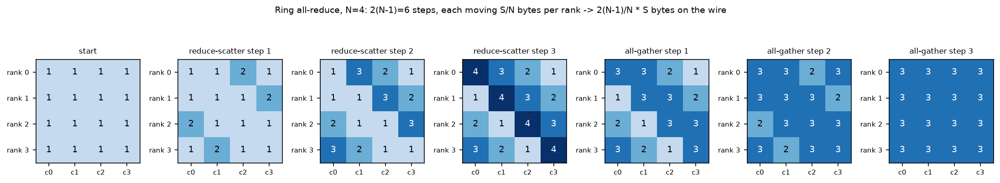
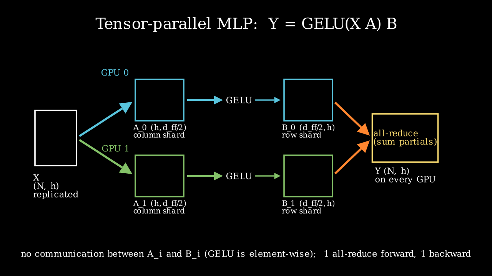
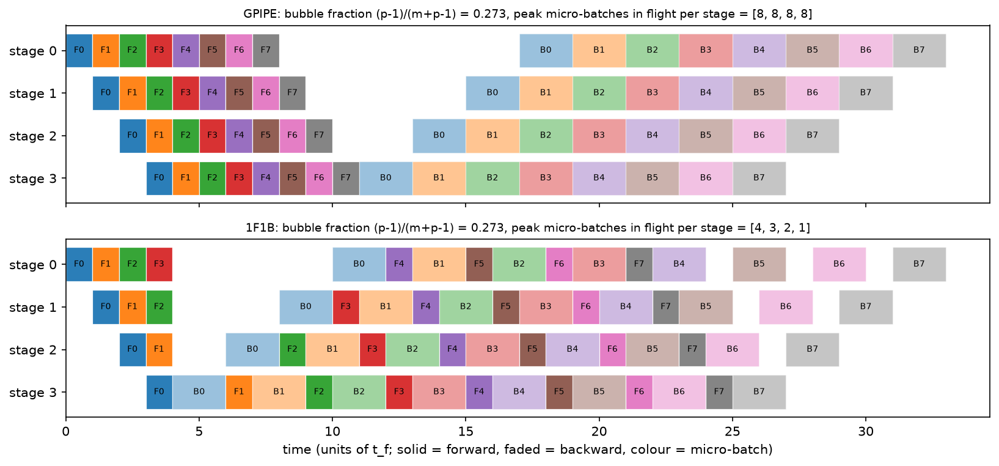

# Distributed training

> **Why this matters at staff level.** "Estimate the memory to train a 70B model with Adam in
> mixed precision" and "how would you shard this model across 8 GPUs" are the two most common
> systems questions in frontier-lab and autonomy loops, and they are graded on whether you
> *derive* the numbers (16 bytes per parameter, $2(N-1)/N$ bytes on the wire, $(p-1)/(m+p-1)$
> bubble) rather than recite them. Strong signal is a candidate who turns the question into a
> memory budget, a bandwidth hierarchy and a decision procedure, then names who runs it that way
> in production.

## TL;DR — the interview card

- **Training state per parameter (Adam, bf16 mixed precision):** $2 + 2 + 4 + 4 + 4 = 16$ bytes
  (bf16 weight, bf16 grad, fp32 master, Adam $m$, Adam $v$). 7B → 108 GB, 70B → 1.13 TB,
  405B → 6.5 TB of state before a single activation.
- **Activations per layer (Korthikanti et al. 2022):** $sbh\,(34 + 5as/h)$ bytes, where the
  $5as^2b$ term is the materialised attention scores. Tensor parallel $t$ + sequence parallel
  divides everything by $t$; selective recompute or FlashAttention deletes the $5as/h$ term;
  full recompute leaves $2sbh$.
- **Ring all-reduce:** reduce-scatter then all-gather, $2(N-1)$ steps of $S/N$ bytes, so
  $2\frac{N-1}{N}S \to 2S$ bytes per rank on the wire, independent of $N$.
- **Data parallel (DDP):** replicate the model, split the batch, all-reduce the gradients,
  overlapped with backward in buckets. Communication per step $\approx 2 \cdot 2P$ bytes.
- **ZeRO-1/2/3 (FSDP = ZeRO-3):** shard optimizer states / + gradients / + parameters across
  the $N$ data-parallel ranks; per-GPU state $16P/N$ at stage 3, at $1.5\times$ DDP's traffic.
- **Tensor parallel (Megatron):** column-shard the first matrix, row-shard the second; GELU
  and per-head attention are shard-local, so a Transformer block needs exactly **two
  all-reduces forward, two backward**. Keep it inside the NVLink domain.
- **Pipeline parallel:** $p$ stages, $m$ micro-batches, bubble fraction
  $\frac{p-1}{m+p-1}$; 1F1B keeps the same bubble but bounds in-flight activations to $p$;
  interleaving with $v$ chunks divides the bubble by $v$.
- **Context / sequence parallel:** ring attention passes K/V blocks around a ring; Ulysses
  all-to-alls heads ↔ sequence. Needed when $s$ is so long that one layer's activations do not fit.
- **Expert parallel:** MoE experts on different ranks, tokens routed by all-to-all.
- **Composition rule:** TP within the node (NVLink, ~hundreds of GB/s), PP and DP across nodes
  (InfiniBand, tens of GB/s per port); minimise model-parallel degree that fits, then spend the
  rest on data parallelism. Llama 3 405B: TP 8 × CP × PP 16 × DP on 16k H100s.

## 1. Intuition first

Take a two-layer MLP, $Y = \text{GELU}(XA)B$ with $X \in \R^{4 \times 2}$ (a 4-token
micro-batch, width 2), $A \in \R^{2 \times 4}$, $B \in \R^{4 \times 2}$, and four GPUs. There
are exactly three things you can split, and every distributed-training system is a
composition of them:

1. **Split the tokens (data parallel).** GPU $i$ gets row $i$ of $X$ and a full copy of $A, B$.
   Each computes its own gradient from one token; the gradients are averaged. Nothing about
   the maths changes; you pay one all-reduce of $\nabla A, \nabla B$ per step.
2. **Split the matrices (tensor parallel).** GPU $i$ gets column $i$ of $A$ (shape $2 \times 1$)
   and row $i$ of $B$ (shape $1 \times 2$). $XA_i$ is one column of the hidden activation, GELU
   acts element-wise so no GPU needs another GPU's column, and $\text{GELU}(XA_i)B_i$ is a
   partial sum of the output: one all-reduce recovers $Y$. Two matmuls, one collective.
3. **Split the layers (pipeline parallel).** GPUs 0–1 hold $A$, GPUs 2–3 hold $B$; token
   activations flow forward through the stages and gradients flow back. The first stage is idle
   while it waits for the last stage to finish, unless you feed it several micro-batches.

Everything else in this chapter is bookkeeping on those three moves: *what* gets replicated,
*what* gets sharded, and *how many bytes* cross which link.

{ width="900" }

*The figure shows a ring all-reduce of a tensor split into four chunks. Read left to right: in
three reduce-scatter steps each rank ends up owning one fully reduced chunk (the dark diagonal),
and in three all-gather steps that chunk is copied around the ring. Each step moves $S/4$ bytes
per rank.*

{ width="720" }

*Megatron's MLP: column shards of $A$ feed row shards of $B$ with no communication in between;
the only collective is the all-reduce of the partial outputs.*

## 2. The math

### 2.1 Memory accounting: the 16 bytes per parameter

Mixed-precision training with Adam keeps, per parameter, a bf16 copy of the weight for the
forward and backward matmuls, a bf16 gradient, an fp32 *master* copy of the weight so that
small updates are not rounded away (bf16 has 8 bits of mantissa, so a step of relative size
$< 2^{-8}$ would vanish), and the two fp32 Adam moments:

$$
\boxed{\;\text{bytes/param} = \underbrace{2}_{w_{\text{bf16}}} + \underbrace{2}_{g_{\text{bf16}}} + \underbrace{4}_{w_{\text{fp32}}} + \underbrace{4}_{m} + \underbrace{4}_{v} = 16\;}
$$

Frameworks that keep fp32 gradients (Megatron's default with distributed optimizer) make it 18;
plain SGD without momentum in bf16 with a master copy is 8; 8-bit Adam moments bring it to 10.
The formula tells you the persistent state $M_\text{state} = 16P$: 7B parameters is 108 GB, so
**a 7B model does not fit on one 80 GB GPU for training even before activations**, and 70B is
1.13 TB, so you need at least 15 GPUs of pure state before any parallelism efficiency question.

### 2.2 Activation memory per layer

Activations are the tensors saved in the forward pass for the backward pass. Korthikanti et
al. (2022) count them for one Transformer layer with sequence length $s$, micro-batch $b$,
hidden size $h$, $a$ heads, 16-bit storage, GELU MLP with $d_{ff} = 4h$. Walk the layer:

* **Attention block.** Input to $Q, K, V$ projections: $2sbh$. $Q$ and $K$ for the score
  matmul: $4sbh$. Softmax output $(a, s, s)$ per sequence: $2as^2b$. Dropout mask on the
  scores: $as^2b$ (one byte). $V$ and the softmax output again for the $PV$ matmul:
  $2sbh + 2as^2b$. Input to the output projection: $2sbh$. Attention dropout mask: $sbh$.
  Total $11sbh + 5as^2b$.
* **MLP block.** Input to the up-projection $2sbh$; GELU input $8sbh$; down-projection input
  $8sbh$; dropout mask $sbh$. Total $19sbh$.
* **Two LayerNorms**, each storing its input: $4sbh$.

$$
\boxed{\;A_\text{layer} = sbh\left(34 + 5\frac{as}{h}\right)\ \text{bytes}\;}
$$

Three facts fall out. First, the $5as^2b$ term is *quadratic in sequence length*; at
$s = h$ it already equals $5a \cdot sbh$, which for $a = 32$ is five times the rest. Second,
FlashAttention never materialises the $(a,s,s)$ tensor, and *selective recomputation* recomputes
exactly that part in backward, so both reduce the layer to $34sbh$. Third, tensor parallelism
with degree $t$ only divides the parts that live inside the sharded matmuls: without sequence
parallelism the LayerNorm inputs and dropout masks stay replicated, giving
$sbh(10 + 24/t + 5as/(ht))$; with sequence parallelism (shard the LN and dropout along $s$
and turn the all-reduce into a reduce-scatter + all-gather pair) everything divides:
$sbh(34/t + 5as/(ht))$. Full recomputation keeps only the layer input, $2sbh$, and pays a
second forward pass.

**Worked examples** (from `memory_calc.py`, micro-batch 1):

| Model | $P$ | State $16P$ | $A_\text{layer}$ no recompute | selective / Flash | full recompute | $L$ layers |
|---|---|---|---|---|---|---|
| Llama-2-7B, $s=4096$ | 6.74B | 108 GB | 3.03 GB | 0.53 GB | 0.031 GB | 32 |
| Llama-3-70B, $s=8192$ | 70.6B | 1.13 TB | 22.1 GB | 2.13 GB | 0.125 GB | 80 |
| Llama-3-405B, $s=8192$ | 405.9B | 6.5 TB | 44.3 GB | 4.25 GB | 0.25 GB | 126 |

Without recomputation the 7B model at $s = 4096$ stores $32 \times 3.03 = 97$ GB of activations
per micro-batch of one sequence. That is why nobody trains without FlashAttention or selective
recompute: the activations, not the parameters, are the first thing that does not fit.

### 2.3 Collectives and the ring all-reduce

An all-reduce of $S$ bytes over $N$ ranks must at least deliver every rank's contribution to
every other rank. The ring algorithm splits the tensor into $N$ chunks and runs two phases
(figure above):

* **Reduce-scatter.** $N-1$ steps. In step $k$, rank $r$ sends chunk $(r-k) \bmod N$ to rank
  $r+1$, which adds it to its own copy. After $N-1$ steps rank $r$ holds the fully reduced chunk
  $(r+1) \bmod N$. Bytes sent per rank: $(N-1)\,S/N$.
* **All-gather.** $N-1$ more steps forwarding the finished chunks around the ring. Another
  $(N-1)\,S/N$ bytes per rank.

$$
\boxed{\;\text{bytes per rank} = 2\,\frac{N-1}{N}\,S \xrightarrow{N \to \infty} 2S,\qquad
T_\text{all-reduce} = 2(N-1)\,\alpha + 2\frac{N-1}{N}\frac{S}{\beta}\;}
$$

with per-message latency $\alpha$ and per-link bandwidth $\beta$. The bandwidth term is
bandwidth-optimal (every rank must receive at least $(N-1)/N \cdot S$ bytes of other ranks' data
and send its reduced chunk out again); the latency term grows linearly with $N$, which is why
NCCL switches to tree algorithms for small messages and large $N$. Reduce-scatter, all-gather,
all-to-all and a chunked broadcast each cost $\frac{N-1}{N}S$; the sum of the first two is an
all-reduce, and that identity is the whole idea of ZeRO.

For a 7B model's bf16 gradients ($S = 13.5$ GB) across 8 GPUs, the bandwidth term is
$2 \cdot \frac{7}{8} \cdot 13.5\,\text{GB} / 450\,\text{GB/s} \approx 52$ ms on NVLink and
about 470 ms over a single 400 Gb/s InfiniBand port — the first number hides behind a backward
pass, the second does not.

### 2.4 Data parallelism and DDP mechanics

Each rank computes the gradient of the *mean* loss on its shard of the batch. Because the
global loss is the mean over $N$ equal shards, $\nabla L = \frac{1}{N}\sum_r \nabla L_r$, so an
all-reduce with `SUM` followed by division by $N$ (or `AVG`) yields the exact full-batch
gradient. PyTorch's `DistributedDataParallel` registers autograd hooks so that as soon as the
gradients of a *bucket* of parameters (25 MB by default, allocated in reverse registration
order so that the last layers' gradients, which are ready first, go first) are complete, its
all-reduce is launched on a side stream. Communication therefore overlaps with the remaining
backward computation; only the first bucket's all-reduce is exposed. The optimizer step then
runs identically on every rank, so weights stay bit-identical without any broadcast.

Per step each rank sends $2\frac{N-1}{N} \cdot 2P$ bytes; memory is the full $16P$ on
every rank, which is the limitation ZeRO removes.

### 2.5 ZeRO stages and FSDP

The observation: in DDP every rank holds the full $16P$ but only *needs* the optimizer state of
the parameters it will update if we agree that rank $r$ updates shard $r$. Rajbhandari et al.
(2020) shard progressively:

| Stage | Sharded across $N$ | Per-GPU state | Communication per step (per rank) |
|---|---|---|---|
| 0 (DDP) | nothing | $16P$ | all-reduce grads: $2\frac{N-1}{N}\cdot 2P$ |
| 1 | optimizer states (12 B/param) | $4P + 12P/N$ | reduce-scatter grads + all-gather updated weights: $\frac{N-1}{N}(2P + 2P)$ — same as DDP |
| 2 | + gradients | $2P + 14P/N$ | same as stage 1 (gradients are reduce-scattered anyway) |
| 3 (FSDP) | + parameters | $16P/N$ | all-gather params in forward, all-gather again in backward, reduce-scatter grads: $\frac{N-1}{N}(2P + 2P + 2P)$ = **1.5× DDP** |

$$
\boxed{\;M_\text{ZeRO-3} = \frac{16P}{N} + \text{activations},\qquad V_\text{ZeRO-3} = 1.5\,V_\text{DDP}\;}
$$

Stage 3 is the only stage whose memory scales all the way down with $N$, and its price is that
every layer's parameters are gathered twice per step (FSDP can keep them between forward and
backward at the cost of memory). With 7B on 8 GPUs: DDP needs 108 GB per GPU (does not fit);
ZeRO-1 needs $4 \cdot 6.74 + 12 \cdot 6.74/8 = 37$ GB; ZeRO-3 needs 13.5 GB; each plus
17 GB of activations at $s = 4096$ with selective recompute. PyTorch FSDP (Zhao et al. 2023)
implements stage 3 with the parameters flattened per "FSDP unit" (usually one Transformer
block), so that the all-gather for block $l+1$ is prefetched during the compute of block $l$.

### 2.6 Tensor parallelism: why exactly two all-reduces per block

Row-major, $Y = XW$ with $X \in \R^{N \times d_{in}}$ (rows are tokens). Shoeybi et al. (2019):

* **Column-parallel.** $W = [W_1 \mid \dots \mid W_t]$ along $d_{out}$. Rank $i$ computes
  $Y_i = XW_i \in \R^{N \times d_{out}/t}$. Forward: no communication (X is replicated).
  Backward: $\nabla X = \sum_i \nabla Y_i W_i^\top$, an all-reduce.
* **Row-parallel.** $W = [W_1; \dots; W_t]$ along $d_{in}$, input already sharded along
  $d_{in}$. Rank $i$ computes the partial $X_iW_i \in \R^{N \times d_{out}}$. Forward: all-reduce
  the partial sums. Backward: $\nabla X_i = \nabla Y W_i^\top$ needs no communication.

Megatron calls these conjugate operators $f$ (identity forward, all-reduce backward) and $g$
(all-reduce forward, identity backward). Chain a column-parallel $A$ into a row-parallel $B$:

$$
\text{GELU}(XA)B = \sum_{i=1}^{t} \text{GELU}(XA_i)\,B_i
$$

because GELU is element-wise, so $\text{GELU}([XA_1 \mid \dots \mid XA_t]) = [\text{GELU}(XA_1) \mid \dots]$
and the row-parallel matmul consumes each rank's own column block. One all-reduce forward (after
$B$), one backward (before $A$). Attention is the same pattern: split $W_Q, W_K, W_V$ by head
(column-parallel), compute each rank's heads locally — softmax is per head, so no cross-rank
dependency — then the output projection $W_O$ is row-parallel over the concatenated heads.

$$
\boxed{\;\text{per Transformer block: 2 all-reduces forward (attention out-proj, MLP down-proj), 2 backward, each on an } (s, b, h) \text{ tensor}\;}
$$

That is $4 \cdot 2\frac{t-1}{t} \cdot 2sbh$ bytes per layer per micro-batch on the critical
path of every layer, which is why TP lives on NVLink. **Sequence parallelism** (Korthikanti et
al. 2022) replaces the all-reduce with a reduce-scatter along $s$ before the LayerNorm/dropout
region and an all-gather after it; the traffic is identical (reduce-scatter + all-gather = an
all-reduce), but the LN inputs and dropout masks are now sharded $t$ ways too.

### 2.7 Pipeline parallelism: the bubble

$p$ stages, $m$ micro-batches per global batch, forward $t_f$ and backward $t_b$ per micro-batch
per stage. The last stage cannot start until the first micro-batch has traversed $p-1$ stages,
and the first stage cannot finish its backward until the last stage's backward has come back;
those ramps are idle time on every stage:

$$
\boxed{\;\text{bubble fraction} = \frac{(p-1)(t_f + t_b)}{(m + p - 1)(t_f + t_b)} = \frac{p-1}{m+p-1}\;}
$$

GPipe (Huang et al. 2019) runs all $m$ forwards then all $m$ backwards and must hold $m$
micro-batches of activations on every stage. **1F1B** (PipeDream-Flush; Narayanan et al. 2021)
has stage $i$ do $p-1-i$ warm-up forwards and then alternate one forward with one backward; the
bubble is identical but stage $i$ holds at most $p - i$ micro-batches. **Interleaved 1F1B**
assigns $v$ non-contiguous chunks of layers to each stage so a micro-batch visits each GPU $v$
times with $1/v$ of the work each visit: bubble $/v$, point-to-point traffic $\times v$.
**Zero-bubble** schedules (Qi et al. 2023) split the backward into activation-gradient and
weight-gradient halves and delay the weight half to fill the ramp-down, reaching near-zero
bubble at the cost of a more complex schedule and some extra memory.

{ width="900" }

*Both schedules finish at the same time ($(m+p-1)(t_f + t_b)$ with $m=8$, $p=4$), so the
bubble fraction is $3/11 = 0.273$ for both; the difference is that 1F1B's first stage holds four
micro-batches of activations while GPipe's holds eight.*

### 2.8 Sequence/context parallelism and expert parallelism

When $s$ is long enough that one layer's $34sbh/t$ does not fit, or the $(a,s,s)$ score block
does not, you shard the *sequence* across ranks. **Ring attention** (Liu et al. 2023) keeps
$Q$ blocks resident and rotates $K, V$ blocks around a ring, accumulating the online-softmax
partials of FlashAttention; communication of one $K,V$ block overlaps with the compute of the
current block, so it is free while the block compute time exceeds the transfer time. **DeepSpeed
Ulysses** (Jacobs et al. 2023) instead all-to-alls from sequence-sharded to head-sharded before
attention and back after; each rank then computes full attention for $a/t$ heads. Ulysses has
$t \le a$ (well, $\le$ KV heads with GQA) and lower traffic; ring attention scales to any degree.
Llama 3 used ring-style context parallelism with an all-gather of K/V for its 128K-context stage.

Mixture-of-experts layers add **expert parallelism**: experts live on different ranks and each
token is sent to its routed expert with an all-to-all (and back with another). Its cost is
$\frac{N-1}{N} \cdot$ (tokens × hidden × bytes) twice per MoE layer, and its failure mode is load
imbalance: a hot expert's rank becomes the straggler.

### 2.9 Composition and the decision procedure

The bandwidth hierarchy decides where each parallelism goes (datasheet figures; verify against
your hardware): NVLink 4 on H100 gives 900 GB/s aggregate per GPU within a node; a 400 Gb/s
InfiniBand NDR port gives 50 GB/s; PCIe 5.0 x16 about 64 GB/s per direction. That is an order
of magnitude between intra-node and inter-node.

1. **TP within the node**, degree $t \le$ NVLink domain size (8) and $t \mid a$. Its
   all-reduces sit on every layer's critical path.
2. **PP across nodes.** Point-to-point activations of size $2sbh$ per micro-batch per stage
   boundary are small and pipelined; make $m \gg p$ to keep the bubble below ~5–10 %.
3. **DP (with ZeRO-1 or FSDP) across the remaining ranks.** Its gradient traffic overlaps with
   backward; its volume is $\propto P/(tp)$ per rank.
4. **Choose the smallest $t \cdot p$ that fits the memory budget with headroom** (activations
   with selective recompute, micro-batch 1), because every model-parallel rank is one fewer
   data-parallel rank and PP adds bubble. `choose_parallelism` in `parallelism.py` implements
   exactly this search.
5. **Add CP** only when $s$ forces it; **EP** only for MoE.

## 3. Implementation

### 3.1 Training-memory calculator

```python
def training_memory_per_gpu(cfg, plan, seq_len, micro_batch, recompute="none",
                            sequence_parallel=False, flash_attention=True, ...):
    params = count_params(cfg)["total"]
    params_per_gpu = params / (plan.tp * plan.pp)                 # scalar: model parallel split
    bpp = bytes_per_param_training(weight_dtype, grad_dtype, True, optimizer)  # {'weights': 2, 'grads': 2, ...}
    shard_w = plan.dp if plan.zero_stage >= 3 else 1
    shard_g = plan.dp if plan.zero_stage >= 2 else 1
    shard_o = plan.dp if plan.zero_stage >= 1 else 1
    weights = params_per_gpu * bpp["weights"] / shard_w          # bytes
    grads = params_per_gpu * bpp["grads"] / shard_g              # bytes
    optim = params_per_gpu * (bpp["master"] + bpp["optimizer_moments"]) / shard_o  # bytes

    per_layer = activation_bytes_per_layer(seq_len, micro_batch, cfg.d_model, cfg.n_heads,
                                           plan.tp, sequence_parallel, recompute, flash_attention) / plan.cp
    layers_per_stage = cfg.n_layers / plan.pp
    in_flight = plan.pp                                          # 1F1B first stage holds pp micro-batches
    activations = per_layer * layers_per_stage * in_flight
    return MemoryBreakdown(weights, grads, optim, activations)
```

The function is the derivation in §2.1–2.5 made executable. Parameters are divided by the
model-parallel degree first, then each of the three state categories is divided by `dp` only if
its ZeRO stage says so. Activations use the Korthikanti formula with the TP/SP/recompute
variant selected by flags, and the pipeline term multiplies by `pp` because the first 1F1B
stage holds `pp` micro-batches in flight; the net effect is that pipeline parallelism reduces
parameter memory but not first-stage activation memory, which surprises people.

`count_params` reproduces the published sizes to three digits (6.74B, 8.03B, 70.6B, 405.9B),
which is the first thing the test checks; if the parameter count is wrong every downstream
number is.

### 3.2 Tensor-parallel Linear pair with explicit shards

```python
def tensor_parallel_mlp(X, A, B, tp):
    A_shards = column_shards(A, tp)                       # tp x (h, d_ff / tp)
    B_shards = row_shards(B, tp)                          # tp x (d_ff / tp, h)
    hidden_shards = [F.gelu(H_i) for H_i in column_parallel_forward(X, A_shards)]  # tp x (N, d_ff / tp)
    return row_parallel_forward(hidden_shards, B_shards)  # (N, h)

def row_parallel_forward(X_shards, W_shards):
    partials = [X_i @ W_i for X_i, W_i in zip(X_shards, W_shards)]  # each (N, d_out)
    return simulated_all_reduce(partials)                 # (N, d_out): the one collective
```

One process holds all `tp` shards as a Python list, so "rank $i$" is just index $i$ and the
all-reduce is a sum over the list. The test asserts `tensor_parallel_mlp(X, A, B, t)` equals
`F.gelu(X @ A) @ B` for $t \in \{1, 2, 4, 8\}$ to $10^{-4}$, and the same for the head-parallel
attention in `tensor_parallel_attention`, which shards $W_Q, W_K, W_V$ by columns (heads) and
$W_O$ by rows. If you understand why `hidden_shards` never needs its neighbours, you understand
Megatron.

### 3.3 A runnable two-process DDP example (CPU, gloo)

```python
def _worker(rank, world_size, init_file, out_dir):
    dist.init_process_group("gloo", init_method=f"file://{init_file}", rank=rank, world_size=world_size)
    X, y = make_data()                                   # (N, 8), (N, 1)   identical on every rank
    n_local = X.shape[0] // world_size
    X_r = X[rank * n_local:(rank + 1) * n_local]         # (N / world, 8)   this rank's shard
    y_r = y[rank * n_local:(rank + 1) * n_local]         # (N / world, 1)
    model = make_model()                                 # same seed -> identical weights
    nn.functional.mse_loss(model(X_r), y_r).backward()   # local gradients
    manual_all_reduce_grads(model, world_size)           # p.grad <- mean over ranks
    ...
    ddp = nn.parallel.DistributedDataParallel(make_model())
    nn.functional.mse_loss(ddp(X_r), y_r).backward()     # bucketed all-reduce via hooks
```

`run_ddp_demo` spawns two CPU processes with `torch.multiprocessing.spawn`, has each compute
gradients on its half of a 64-example batch, all-reduces them by hand and again through
`DistributedDataParallel`, and compares to the single-process full-batch gradient. The three
numbers it returns are all $\sim 3 \cdot 10^{-8}$ (fp32 summation order) and ranks agree exactly.
The test skips if process spawning is unavailable in the sandbox.

### 3.4 Bubble-fraction calculator and schedule simulator

`bubble_fraction(p, m, v)` is the boxed formula; `simulate_schedule("1f1b", p, m, t_f, t_b)`
list-schedules the ops with their dependencies (F$_j$ on stage $i$ needs F$_j$ on stage $i-1$;
B$_j$ needs B$_j$ on stage $i+1$) and returns start/end times, from which the figure above and
`peak_in_flight` are computed. The test checks the simulated makespan equals $(m+p-1)(t_f+t_b)$
for both schedules and that in-flight counts are $[m,\dots,m]$ for GPipe and $[p, p-1, \dots, 1]$
for 1F1B.

??? example "Full implementation — `src/mlbook/systems/memory_calc.py`"
    ```python
    --8<-- "src/mlbook/systems/memory_calc.py"
    ```

??? example "Full implementation — `src/mlbook/systems/tensor_parallel_toy.py`"
    ```python
    --8<-- "src/mlbook/systems/tensor_parallel_toy.py"
    ```

??? example "Full implementation — `src/mlbook/systems/ddp_example.py`"
    ```python
    --8<-- "src/mlbook/systems/ddp_example.py"
    ```

??? example "Full implementation — `src/mlbook/systems/pipeline_calc.py` and `parallelism.py`"
    ```python
    --8<-- "src/mlbook/systems/pipeline_calc.py"
    ```
    ```python
    --8<-- "src/mlbook/systems/parallelism.py"
    ```

**How you'd test it.** Parameter counts against model cards; the 16-byte identity for
(bf16, bf16, Adam); the Korthikanti formula for each flag combination against the paper's
closed forms; ZeRO stages against $16P/N$; TP outputs against the unsharded matmul; DDP
gradients against the single-process gradient; pipeline makespan against $(m+p-1)(t_f+t_b)$.

## Retype by hand

| Symbol | File | Retype from memory? | Target time |
|---|---|---|---|
| `bytes_per_param_training`, `activation_bytes_per_layer`, `training_memory_per_gpu` | `src/mlbook/systems/memory_calc.py` | **Yes** — the training-memory calculator | 15 minutes |
| `column_shards`, `row_shards`, `column_parallel_forward`, `row_parallel_forward`, `tensor_parallel_mlp` | `src/mlbook/systems/tensor_parallel_toy.py` | **Yes** — the column/row tensor-parallel Linear pair | 20 minutes |
| `ring_bytes_on_wire`, `dp_step_comm_bytes` | `src/mlbook/systems/parallelism.py` | **Yes** — ring all-reduce and ZeRO traffic | 10 minutes |
| `bubble_fraction`, `peak_in_flight` | `src/mlbook/systems/pipeline_calc.py` | **Yes** | 5 minutes |
| `manual_all_reduce_grads`, `_worker` | `src/mlbook/systems/ddp_example.py` | **Yes** — the manual all-reduce and the rank slicing | 10 minutes |
| `count_params`, `tensor_parallel_attention`, `simulate_schedule`, `choose_parallelism` | same files | Read and understand | — |

Checks: `pytest tests/test_systems_memory_calc.py tests/test_systems_tensor_parallel.py tests/test_systems_parallelism.py tests/test_systems_pipeline.py tests/test_systems_ddp.py -q`.

## 4. Systems view: cost, failure modes, trade-offs

| Situation | Use | Why | Do not |
|---|---|---|---|
| Model + state fits on one GPU with activations | DDP | zero memory overhead, comm overlaps backward | shard needlessly (ZeRO-3 costs 1.5× traffic) |
| State does not fit, model fits, fast intra-node links | ZeRO-1 / ZeRO-2 | same traffic as DDP, $12P/N$ saved | ZeRO-3 across slow inter-node links at small batch |
| Model does not fit one GPU, ≤ 8 GPUs per node | TP inside node (+ SP) | bubble-free, but all-reduce on every layer | TP across InfiniBand |
| Model does not fit one node | TP × PP, then DP | PP traffic is tiny and overlappable | small $m$ (bubble $\frac{p-1}{m+p-1}$) |
| Very large $N$, medium model | FSDP with hybrid sharding (shard inside node, replicate across) | bounds the all-gather group to the NVLink domain | global ZeRO-3 with 1000s of ranks and latency-bound collectives |
| $s \ge 32$K | + context parallel | per-layer activations $\propto s$ do not fit | pretending recompute solves a $5as^2b$ term at 128K |
| MoE | + expert parallel | experts are the parameters | ignoring load imbalance |

**Failure modes you should name.** Stragglers: a single slow GPU (thermal throttling, a bad
HBM page, a busy host) stalls every collective, since all-reduce is synchronous; Llama 3's
report attributes a large share of interruptions to GPU and HBM faults, and the fleet's
throughput is the *minimum* over ranks. NCCL timeouts and deadlocks when ranks disagree on
collective order (a rank that skips a step, an uneven number of micro-batches per rank).
Memory fragmentation in the caching allocator producing OOMs at a stable "used" number.
Pipeline load imbalance when the embedding/LM-head stages are heavier than the middle stages.
Reduced determinism: ring reduction order differs from single-GPU summation, so losses differ
in the last bits between world sizes.

**Cost model to carry in your head.** Step time $\approx \max(\text{compute}, \text{exposed comm}) + \text{bubble}$;
compute per rank $= 6P \cdot \text{tokens per rank} / (\text{MFU} \cdot \text{peak})$; DDP comm
$\approx 4P/\beta$ per step, so the compute-to-comm ratio grows with tokens per rank per step —
larger micro-batches and gradient accumulation hide communication, which is the systems reason
global batch sizes are large.

## 5. In production

!!! production "NVIDIA — Megatron-LM (2019–2021)"
    Problem: train multi-billion-parameter Transformers when no single GPU holds them.
    Built: intra-layer tensor parallelism with the column/row split and the two all-reduces per
    block (Shoeybi et al. 2019), then the 3D composition with interleaved 1F1B pipelines
    (Narayanan et al. 2021), then sequence parallelism and selective recompute (Korthikanti et
    al. 2022). Rejected: pure pipeline parallelism (bubble) and pure ZeRO (all-gather traffic at
    trillion scale). Reported 52 % MFU on 1T parameters across 3072 A100s in the 2021 paper.

!!! production "Microsoft — ZeRO / DeepSpeed (2020)"
    Problem: DDP wastes $16P$ per GPU of redundant state. Built: ZeRO stages 1–3, which shard
    optimizer state, gradients and parameters across the data-parallel group and re-gather on
    demand. Trade-off accepted: ZeRO-3's 1.5× communication for linear memory scaling, plus
    ZeRO-Offload/-Infinity to CPU and NVMe when even that is not enough. Rejected: model
    parallelism as the only route, because it requires model-code changes.

!!! production "Meta / PyTorch — Fully Sharded Data Parallel (2023)"
    Problem: bring ZeRO-3 into PyTorch natively with overlap and composability. Built: FSDP
    with per-unit flat parameters, prefetching of the next unit's all-gather during compute,
    hybrid sharding (shard within a node, replicate across nodes) and mixed-precision policies.
    Trade-off: memory for wrapping granularity and the extra all-gather in backward.

!!! production "Meta — Llama 3 405B infrastructure (2024)"
    Trained on 16K H100s with 4D parallelism: TP 8 inside the NVLink domain, pipeline
    parallelism across nodes, context parallelism for the long-context stage, and FSDP-style
    data parallelism sharding the training state. The paper reports 38–43 % BF16 MFU and a
    detailed interruption log (see the training-systems chapter) dominated by hardware faults.
    The choice of *pipeline* before more data parallelism was driven by inter-node bandwidth.

!!! production "Google — PaLM on TPU v4 pods with Pathways (2022)"
    Two 3072-chip TPU v4 pods with data parallelism across pods and 12-way model parallelism ×
    256-way data parallelism within a pod, relying on the pod's ICI fabric rather than
    pipelining ("no pipeline parallelism"). The TPU's 2D/3D torus and systolic arrays make
    large TP degrees cheaper than on GPU clusters; reported 46 % MFU.

!!! production "Meta — OPT-175B (2022)"
    Trained with FSDP plus Megatron tensor parallelism on 992 A100s; the public chronicles
    document dozens of restarts for hardware failures and loss instabilities, and are the best
    available description of what "keeping a run alive" actually involves.

## 6. Interview questions and strong answers

!!! interview "Estimate the memory to train a 70B model with Adam in mixed precision."
    Start with state: $16 \times 70.6\text{B} = 1.13$ TB. That alone is 15 H100s, so the
    question is really "how do I spread it". With TP 8 and ZeRO-1 across DP 8 (64 GPUs):
    weights + grads $= 4 \times 70.6/8 = 35$ GB per GPU, optimizer $12 \times 70.6/64 = 13$ GB,
    activations at $s = 8192$, micro-batch 1, selective recompute, SP: $34 \cdot 8192 \cdot 8192 \cdot 80 / 8 = 21$ GB;
    total $\approx 70$ GB, which fits an 80 GB GPU with little headroom. To create headroom:
    FSDP full sharding instead of ZeRO-1 (weights + grads drop to 4 GB, total $\approx 38$ GB),
    or PP 2. **Staff follow-up:** "what changes at 128K context?" — the $34sbh$ term is now
    16× larger per layer and exceeds the GPU by itself; you need context parallelism (Llama 3
    used CP for exactly this stage) rather than more recompute.

!!! interview "Derive the bandwidth cost of ring all-reduce and explain when it stops being the right algorithm."
    Reduce-scatter and all-gather, each $N-1$ steps of $S/N$ bytes, so $2\frac{N-1}{N}S$ bytes
    per rank, bandwidth-optimal and independent of $N$ in the limit. The latency term
    $2(N-1)\alpha$ is linear in $N$: for small tensors and large $N$ it dominates and a tree
    (logarithmic depth) or a hierarchical intra-node-then-inter-node scheme wins; NCCL picks by
    message size. **Follow-up:** "how does DDP hide it?" — buckets of ~25 MB all-reduced from
    the last layer backwards during the remaining backward compute; only the final bucket is
    exposed, so the exposed time is roughly one bucket's transfer plus the optimizer step.

!!! interview "Why does a Megatron Transformer block need only two all-reduces in the forward pass?"
    Because each block is two "column-then-row" pairs. The first matrix of the MLP is sharded
    by output columns and GELU is element-wise, so the second matrix, sharded by input rows,
    consumes each rank's own columns; the only cross-rank operation is summing the partial
    outputs. Attention is the same with heads as the columns: softmax is per head. Backward has
    the mirror-image two. **Follow-up:** "why then add sequence parallelism?" — the LayerNorm
    and dropout regions were replicated $t$ times; SP shards them along $s$ by replacing the
    all-reduce with reduce-scatter + all-gather at zero extra traffic.

!!! interview "Pipeline parallelism: derive the bubble and tell me how 1F1B and interleaving change it."
    With $p$ stages and $m$ micro-batches the ramps cost $(p-1)$ stage-times out of $(m+p-1)$,
    so bubble $= \frac{p-1}{m+p-1}$. 1F1B does not change it; it bounds the activations in
    flight to $p$ per stage instead of $m$, which is what makes large $m$ affordable.
    Interleaving with $v$ chunks per stage makes each stage-time $1/v$ as long, so the bubble
    becomes $\frac{p-1}{vm+p-1}$ at $v\times$ the point-to-point messages. **Follow-up:** "why
    not $p = 64$?" — every stage boundary is a synchronisation point and the first/last stages
    carry the embedding and LM head, so imbalance grows with $p$; and you must find $m \gg p$
    micro-batches, which pushes global batch size up.

!!! interview "ZeRO-3 vs DDP: what is the exact communication ratio and when is it worth it?"
    DDP: one all-reduce of gradients, $2\frac{N-1}{N} \cdot 2P$. ZeRO-3: all-gather parameters
    in forward, again in backward, reduce-scatter gradients, $3\frac{N-1}{N} \cdot 2P$, i.e.
    1.5×, all of it overlappable with layer prefetching. Worth it whenever $16P$ does not fit
    and tensor parallelism would cross the NVLink domain; not worth it when the model fits with
    ZeRO-1 (same traffic as DDP, $12P/N$ saved). **Follow-up:** "why does FSDP offer hybrid
    sharding?" — with thousands of ranks the all-gather group's latency term and the smallest
    shard size make global sharding inefficient; sharding within a node and replicating across
    nodes keeps the gather on NVLink and the cross-node traffic a plain gradient all-reduce.

!!! interview "How would you shard a 405B dense model across 16K GPUs?"
    TP 8 inside each node (heads divide by 8, NVLink); PP 16 across nodes (126 layers → ~8 per
    stage; small activations cross InfiniBand); that is 128-way model parallelism, leaving
    DP 128 with FSDP-sharded state; per-GPU state $16 \times 405.9/(128 \cdot 128) \approx 0.4$ GB
    with ZeRO-3 or $\approx 12$ GB with ZeRO-1, activations $\approx 67$ GB at $s = 8192$ with
    selective recompute and 16 micro-batches in flight (the first stage). This is Llama 3's
    published layout. **Follow-up:** "what dominates step time?" — pipeline bubble at the
    chosen $m$, then exposed communication when tokens-per-rank is small.

## 7. Exercises

1. ★ Compute the per-GPU memory for Llama-3-8B on 8 GPUs with ZeRO-2, $s = 8192$, micro-batch 2,
   FlashAttention, no recompute. Does it fit in 80 GB?

    ??? success "Solution"
        State: $16 \times 8.03 = 128$ GB total; ZeRO-2 per GPU $= 2P + 14P/8 = 16 + 14 = 30$ GB.
        Activations: $34 \cdot 8192 \cdot 2 \cdot 4096 \cdot 32 = 73$ GB. Total 103 GB: no. Either
        micro-batch 1 (66 GB total) or ZeRO-3 (16 GB state + 73 GB, still no), so drop the
        micro-batch. `training_memory_per_gpu(LLAMA3_8B, ParallelPlan(dp=8, zero_stage=2), 8192, 2)` agrees.

2. ★ A 7B model's bf16 gradient all-reduce over 8 ranks on a 450 GB/s link: how long, and what
   fraction of a step whose compute takes 1.2 s if nothing overlaps?

    ??? success "Solution"
        $2 \cdot \frac{7}{8} \cdot 13.5$ GB / 450 GB/s $= 52$ ms, 4 % of the step; with
        bucketed overlap the exposed part is one bucket, well under 1 %.

3. ★★ Extend `tensor_parallel_mlp` to a SwiGLU MLP, $Y = (\text{SiLU}(XA) \odot XG)B$, with
   $A$ and $G$ both column-sharded. Show it still needs exactly one all-reduce and write a test.

    ??? success "Solution"
        Shard $A$ and $G$ identically by columns; SiLU and the Hadamard product are element-wise
        on matching column blocks, so `(F.silu(X @ A_i) * (X @ G_i)) @ B_i` are partial sums
        and `simulated_all_reduce` finishes it. Test against `(F.silu(X @ A) * (X @ G)) @ B`.

4. ★★ Run `simulate_schedule` for $p = 8$ and $m \in \{8, 16, 32, 64\}$ and plot the bubble
   fraction against $\frac{p-1}{m+p-1}$. Then set $t_b = 3t_f$ and confirm the fraction does not
   change. Explain why.

    ??? success "Solution"
        The bubble is $(p-1)$ *forward* ramp-up slots and $(p-1)$ *backward* ramp-down slots,
        each of the same duration as the corresponding busy slots, so the ratio depends only on
        counts, not on $t_f/t_b$. The simulator reproduces $7/14, 7/22, 7/38, 7/70$.

5. ★★★ Modify `ddp_example.py` so that rank 0 receives 48 examples and rank 1 receives 16 and
   show that a plain `AVG` all-reduce no longer equals the full-batch gradient. Fix it with a
   weighted reduction and test both.

    ??? success "Solution"
        Each rank's loss is the mean over its own shard, so the average of the two gradients
        weights the small shard 3× too much. Multiply each rank's gradient by $n_r/N$ before a
        `SUM` all-reduce (or scale the local loss by $n_r/N$ and use `SUM`). The corrected
        result matches `full_batch_gradients()` to $10^{-7}$.

## References

Links are omitted where they could not be verified from this environment; search the exact
title.

* Shoeybi, M. et al. *Megatron-LM: Training Multi-Billion Parameter Language Models Using
  Model Parallelism.* 2019. arXiv:1909.08053.
* Narayanan, D. et al. *Efficient Large-Scale Language Model Training on GPU Clusters Using
  Megatron-LM.* SC 2021. arXiv:2104.04473.
* Korthikanti, V. et al. *Reducing Activation Recomputation in Large Transformer Models.*
  MLSys 2023. arXiv:2205.05198.
* Rajbhandari, S. et al. *ZeRO: Memory Optimizations Toward Training Trillion Parameter
  Models.* SC 2020. arXiv:1910.02054.
* Zhao, Y. et al. *PyTorch FSDP: Experiences on Scaling Fully Sharded Data Parallel.* VLDB
  2023. arXiv:2304.11277.
* Li, S. et al. *PyTorch Distributed: Experiences on Accelerating Data Parallel Training.*
  VLDB 2020. arXiv:2006.15704.
* Huang, Y. et al. *GPipe: Efficient Training of Giant Neural Networks using Pipeline
  Parallelism.* NeurIPS 2019. arXiv:1811.06965.
* Qi, P. et al. *Zero Bubble Pipeline Parallelism.* ICLR 2024. arXiv:2401.10241.
* Liu, H., Zaharia, M., Abbeel, P. *Ring Attention with Blockwise Transformers for
  Near-Infinite Context.* 2023. arXiv:2310.01889.
* Jacobs, S. A. et al. *DeepSpeed Ulysses: System Optimizations for Enabling Training of
  Extreme Long Sequence Transformer Models.* 2023. arXiv:2309.14509.
* Grattafiori, A. et al. (Llama Team, Meta). *The Llama 3 Herd of Models.* 2024.
  arXiv:2407.21783 — §3.3 "Infrastructure, Scaling, and Efficiency".
* Chowdhery, A. et al. *PaLM: Scaling Language Modeling with Pathways.* 2022. arXiv:2204.02311.
* Zhang, S. et al. *OPT: Open Pre-trained Transformer Language Models.* 2022. arXiv:2205.01068,
  and the OPT-175B training chronicles in the `metaseq` GitHub repository.
* Sergeev, A., Del Balso, M. *Horovod: fast and easy distributed deep learning in TensorFlow.*
  2018. arXiv:1802.05799 (ring all-reduce for deep learning; the derivation follows Patarasuk &
  Yuan, *Bandwidth optimal all-reduce algorithms for clusters of workstations*, JPDC 2009).
