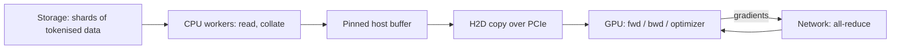

# Training systems

> **Why this matters at staff level.** Getting a run to *start* is a week of work; keeping it
> alive, fast and reproducible for two months is the job. Interviewers probe this with "your MFU
> is 18 %, what do you look at first?", "how often do you checkpoint?", "the loss spiked at step
> 84k — what do you do?". Strong signal is a candidate who reasons with an explicit budget
> (compute, memory, failure rate) instead of listing tools, and who knows that most "algorithmic"
> speedups are memory-bandwidth wins.

## TL;DR — the interview card

- **MFU** $= \dfrac{\text{tokens/s} \times (6N + 12Lhs)}{\text{GPUs} \times \text{peak FLOP/s}}$.
  Quote MFU, not HFU: HFU counts recomputation, so it rewards doing extra work. 35–50 % BF16 MFU
  is a good large-scale number; Llama 3 405B reported 38–43 %.
- **Gradient accumulation** over $k$ micro-batches with the loss scaled by $1/k$ is *exactly*
  equal to one large batch — except for any layer that mixes examples (BatchNorm).
- **Mixed precision:** fp16 needs dynamic loss scaling (its exponent range underflows gradients);
  bf16 has fp32's exponent range and needs none. Both keep an fp32 master weight. fp8 (E4M3
  forward / E5M2 backward) needs per-tensor scaling and is used selectively.
- **Activation checkpointing:** full recompute costs +33 % step FLOPs to cut activations to
  $2sbh$/layer; *selective* recompute of just the attention scores costs ~5 % and removes the
  $5as^2b$ term. Prefer selective (or FlashAttention, which gets it for free).
- **Checkpoint cadence:** with MTBF $T$ and checkpoint cost $C$, expected wasted time per
  interval $I$ is $\approx C + I/2$; optimal $I \approx \sqrt{2CT}$ (Young/Daly).
- **The input pipeline is a system.** Tokenise and pack offline, shard by rank, stream, prefetch
  with `num_workers` and pinned memory. A stalled loader shows up as low MFU with idle SMs.
- **Fault tolerance at scale is the default state**: Llama 3's 54-day 405B run logged 466
  interruptions, 419 of them unexpected, ~78 % traced to hardware (GPU/HBM the largest share).
- **Loss spikes:** lower LR / skip batches / rewind to a checkpoint; architectural mitigations
  are z-loss, QK-norm, careful init and embedding-norm choices.
- **Determinism is a cost, not a default:** deterministic kernels, fixed data order, saved RNG
  state; you pay throughput for it, so reserve it for debugging.

## 1. Intuition first

Think of a training step as a five-stage assembly line, each stage able to starve the next:



A concrete tiny example. Suppose one step processes 2M tokens and the GPU math takes 400 ms.
Those 2M tokens as `int32` ids are 8 MB — nothing. But if your loader hands out *untokenised*
text and tokenises in the training process, you are doing ~2M BPE merges per step on a handful
of CPU cores, which takes seconds. The GPU idles at 10 % MFU and the profiler shows a gap
before every step. The fix is not a faster GPU kernel; it is to tokenise once, offline, into
packed fixed-length sequences. **Most low-MFU incidents are not on the GPU.**

Second intuition: the same step has a memory budget you already derived in the
[distributed-training chapter](01-distributed-training.md) — $16P$ of state plus activations.
Training systems is the set of knobs that trade one resource for another:

| Knob | Buys | Costs |
|---|---|---|
| Gradient accumulation | larger effective batch, hidden comms | wall-clock per step |
| Activation checkpointing | activation memory | recompute FLOPs |
| Mixed precision | memory + 2× tensor-core throughput | numerics care |
| Sharding (ZeRO/FSDP) | state memory | communication volume |
| Checkpoint frequency | less lost work per failure | write bandwidth and pauses |

## 2. The math

### 2.1 MFU and the $6ND$ identity

For a dense Transformer the forward pass costs $2$ FLOPs per parameter per token (one multiply,
one add per weight element) plus the attention score/context matmuls, and the backward pass
costs twice the forward (gradients w.r.t. inputs *and* w.r.t. weights):

$$
F_\text{train/token} = 3\big(2N_\text{matmul} + 4Lhs\big) = 6N + 12Lhs
$$

so total training compute is the familiar $C \approx 6ND$ for $D$ tokens when $12Lhs \ll 6N$.
(For Llama-2-7B at $s = 4096$ the attention term adds 14 %: $46.1 \times 10^9$ vs $40.4 \times 10^9$
FLOPs/token, which matters once you quote MFU to two digits.) Then

$$
\boxed{\;\text{MFU} = \frac{\text{tokens/s} \cdot (6N + 12Lhs)}{G \cdot F_\text{peak}},\qquad
\text{HFU} = \text{MFU} \cdot \frac{\text{FLOPs actually executed}}{\text{FLOPs required}}\;}
$$

With full activation recomputation the hardware executes $8N$ instead of $6N$ per token, so
HFU $= \tfrac{4}{3}$ MFU. A team that "improved utilisation from 40 % to 53 %" by turning on full
recompute improved nothing; MFU is the honest metric because it is invariant to how much extra
work you chose to do.

**Planning arithmetic.** Inverting MFU gives wall-clock:
$T_\text{days} = 6ND / (G \cdot F_\text{peak} \cdot \text{MFU} \cdot 86400)$. At 40 % MFU on
H100s (989 TFLOP/s dense BF16): 8B on 15T tokens with 1024 GPUs ≈ 21 days; 70B on 15T with
4096 GPUs ≈ 45 days; 405B on 15.6T with 16384 GPUs ≈ 68 days. These are the numbers to produce
when an interviewer asks "how long and how many GPUs?".

### 2.2 Gradient accumulation is exact

Let the batch $B$ be partitioned into $k$ micro-batches $M_1..M_k$ of equal size $b$, with a
mean-reduced per-example loss $\ell_i$:

$$
L = \frac{1}{B}\sum_{i \in B} \ell_i = \frac{1}{k}\sum_{j=1}^{k}\underbrace{\frac{1}{b}\sum_{i \in M_j}\ell_i}_{L_j}
\;\Longrightarrow\;
\nabla L = \frac{1}{k}\sum_{j=1}^{k}\nabla L_j
$$

$$
\boxed{\;\text{accumulate } \nabla(L_j/k) \text{ over } k \text{ micro-batches} \equiv \text{one step on the full batch}\;}
$$

**The two caveats.** (i) Any layer whose forward depends on the *composition* of the
micro-batch breaks the identity: BatchNorm normalises by micro-batch statistics, so
$\ell_i$ is no longer a function of example $i$ alone. LayerNorm/RMSNorm are per-example and are
safe — one reason Transformers are friendlier to large-scale training than BN-based CNNs.
(ii) Under fp16 loss scaling, scale the loss by $S/k$ and unscale once before clipping and the
optimizer step; if you unscale per micro-batch you lose the protection. Gradient clipping must
be applied to the *accumulated* gradient, after all micro-batches, or you have changed the
objective.

### 2.3 Mixed precision

| Format | Exponent / mantissa bits | Dynamic range | Needs loss scaling? |
|---|---|---|---|
| fp32 | 8 / 23 | $\sim10^{\pm38}$ | no |
| fp16 | 5 / 10 | $\sim6\times10^{-5}$ to $6.5\times10^{4}$ | **yes** |
| bf16 | 8 / 7 | same as fp32 | no |
| fp8 E4M3 | 4 / 3 | $\sim\pm448$ | per-tensor scales |
| fp8 E5M2 | 5 / 2 | $\sim\pm5.7\times10^{4}$ | per-tensor scales |

Small gradients are the problem: activations' gradients in a deep network routinely sit at
$10^{-7}$–$10^{-9}$, below fp16's smallest normal $6\times10^{-5}$, so they flush to zero.
**Dynamic loss scaling** multiplies the loss by $S$ (so every gradient is scaled by $S$ by
linearity), unscales before the optimizer step, and adapts $S$: double it every $N$ successful
steps, halve it and *skip the step* whenever an inf/NaN appears. bf16 trades mantissa bits for
exponent bits and removes the whole mechanism, which is why every large run since ~2021 uses
bf16. The fp32 **master weight** is not optional in either case: with a bf16 weight of magnitude
1, an update of $10^{-4}$ is below the 8-bit mantissa's resolution ($2^{-8} \approx 4\times10^{-3}$
relative) and would be rounded away entirely — the model would silently stop learning.

fp8 literacy: forward activations/weights in E4M3, gradients in E5M2 (they need range more than
precision), with per-tensor scaling factors updated from recent amax history; typically applied
to the big matmuls only, with norms, softmax and the optimizer left in higher precision.

### 2.4 Activation checkpointing: the trade-off curve

With $L$ layers, $A$ activation bytes kept per layer, $I = 2sbh$ bytes for a layer's input and
$F$ forward FLOPs per layer (a training step is $3F$ per layer):

| Strategy | Memory | Extra FLOPs | Extra as fraction of step |
|---|---|---|---|
| none | $LA$ | 0 | 0 |
| selective (attention scores only) | $L \cdot 34sbh$ | attention-core only | $\approx 5\%$ at $s=4096, h=4096$ |
| $\sqrt{L}$ segments (Chen et al. 2016) | $\sqrt{L}\,I + \sqrt{L}A$ | $LF$ | 33 % |
| full | $LI + A$ | $LF$ | 33 % |

$$
\boxed{\;\text{memory}(\text{segments } c) = c\,I + \frac{L}{c}A \;\Rightarrow\; c^\star = \sqrt{LA/I}\;}
$$

For Llama-2-7B at $s = 4096$, micro-batch 1: none 97 GB, selective 17 GB (+4.8 % FLOPs),
$\sqrt{L}$ 18.4 GB (+33 %), full 4.0 GB (+33 %). Selective dominates $\sqrt{L}$ here — same
memory, one seventh of the extra compute — which is precisely Korthikanti et al.'s point.
Full recompute is for when you need the last 4 GB, e.g. to raise micro-batch size enough to
hide communication.

### 2.5 Checkpointing cadence vs MTBF

Let $I$ be the interval between checkpoints, $C$ the time to write one, $T$ the mean time
between failures. Per interval you spend $C$ writing, and on failure you lose on average $I/2$
of recomputation. The fraction of time wasted is approximately

$$
\text{waste}(I) \approx \frac{C}{I} + \frac{I}{2T}
\;\Longrightarrow\;
\boxed{\;I^\star = \sqrt{2CT}\;}
$$

(the classic Young/Daly first-order result). With $C = 30$ s and $T = 3$ h, $I^\star \approx 13$ min.
As a cluster grows, $T$ falls roughly linearly in node count, so $I^\star$ falls as $\sqrt{T}$:
big clusters checkpoint *more* often, and this is why **sharded, asynchronous checkpointing**
matters — each rank writes only its own shard (making $C$ nearly independent of model size),
and the write is overlapped with subsequent compute by first copying state to host memory.

Resumability has a second half that people forget: **the data order**. A resumed run must
continue from the same position in the same shuffled stream, or it re-trains on seen data and
skips unseen data. Persist the sampler state (epoch seed + global step + per-rank shard
offsets) inside the checkpoint.

### 2.6 Fault tolerance and stragglers

A synchronous data-parallel step is a barrier: step time is the **maximum** over ranks, so one
rank at 80 % speed slows the whole job by 25 %. Detection is by per-rank step-time histograms
and by timing the collectives (a straggler shows as *everyone else* waiting in all-reduce).
Causes: thermal throttling, a degraded NVLink/IB link falling back to a lower rate, ECC errors
being corrected, an unlucky NUMA placement, or a slow data shard.

Elastic training (`torchrun` with a rendezvous backend) lets the world size change: on failure
the remaining ranks re-form the process group and resume from the last checkpoint, with the
global batch size preserved by adjusting gradient accumulation. The alternative used at frontier
scale is a pool of hot spares and a fast restart path, because changing world size changes
numerics and throughput.

## 3. Implementation

### 3.1 MFU calculator

```python
def mfu(tokens_per_second, cfg, seq_len, peak_flops, n_gpus=1):
    achieved = tokens_per_second * flops_per_token(cfg, seq_len, "train", recompute=False)  # FLOP/s
    return achieved / (peak_flops * n_gpus)

def hfu(tokens_per_second, cfg, seq_len, peak_flops, n_gpus=1, recompute=True):
    achieved = tokens_per_second * flops_per_token(cfg, seq_len, "train", recompute=recompute)
    return achieved / (peak_flops * n_gpus)

def training_days(n_params, tokens, peak_flops, n_gpus, target_mfu):
    seconds = 6.0 * n_params * tokens / (peak_flops * n_gpus * target_mfu)
    return seconds / 86400.0
```

`flops_per_token` in `flops.py` counts $2 \times$ matmul parameters (attention projections, MLP,
and the LM head — the input embedding is a gather, not a matmul) plus $4Lhs$ for the score and
context matmuls, then multiplies by 3 for training (4 with recompute). The test pins
`hfu / mfu == 4/3` and that `mfu_from_six_nd` matches the definition, so you cannot accidentally
"improve" MFU by turning on recomputation.

### 3.2 Gradient-accumulation equivalence demo

```python
def accumulated_grads(model, loss_fn, X, y, k):
    model.zero_grad()
    for X_j, y_j in zip(torch.chunk(X, k), torch.chunk(y, k)):   # X_j: (B/k, d)
        (loss_fn(model(X_j), y_j) / k).backward()                # grads accumulate in p.grad
    return [p.grad.detach().clone() for p in model.parameters()]
```

The whole lesson is the `/ k`. The paired tests assert `max_abs_diff < 1e-6` against the
full-batch gradient when the model uses LayerNorm, and `> 1e-4` when the identical model uses
BatchNorm1d — the caveat made executable, so you can show an interviewer the failure rather
than assert it.

### 3.3 Selective-checkpointing calculator

```python
def checkpoint_plans(s, b, h, a, L):
    A = activation_bytes_per_layer(s, b, h, a)                       # bytes/layer, nothing saved
    I = 2.0 * s * b * h                                              # bytes/layer input only
    A_sel = activation_bytes_per_layer(s, b, h, a, recompute="selective")
    c = math.ceil(math.sqrt(L))                                      # sqrt(L) segments
    frac_attn = attention_core_fraction(s, h)                        # share of layer FLOPs in QK^T + PV
    return [CheckpointPlan("none", L * A, 0.0),
            CheckpointPlan("selective", L * A_sel, frac_attn / 3.0), # recompute in 1 of the 3 F-equivalents
            CheckpointPlan("sqrt", c * I + math.ceil(L / c) * A, 1.0 / 3.0),
            CheckpointPlan("full", L * I + A, 1.0 / 3.0)]
```

`attention_core_fraction` is the ratio $4sh / (8h^2 + 4hd_{ff} + 4sh)$ — the share of a layer's
forward FLOPs spent in the two $s$-dependent matmuls — and it grows with sequence length, which
is the honest statement of when selective recompute stops being nearly free.

??? example "Full implementation — `src/mlbook/systems/mfu.py`"
    ```python
    --8<-- "src/mlbook/systems/mfu.py"
    ```

??? example "Full implementation — `src/mlbook/systems/grad_accumulation.py`"
    ```python
    --8<-- "src/mlbook/systems/grad_accumulation.py"
    ```

??? example "Full implementation — `src/mlbook/systems/activation_checkpointing_calc.py`"
    ```python
    --8<-- "src/mlbook/systems/activation_checkpointing_calc.py"
    ```

**How you'd test it.** MFU against the hand-computed $6ND$ ratio and the $4/3$ HFU identity;
gradient accumulation against the full-batch gradient (and its BatchNorm violation); checkpoint
plans against the memory ordering none > selective > $\sqrt L$ > full and the exact
$LI + A$ formula for full recompute.

## Retype by hand

| Symbol | File | Retype from memory? | Target time |
|---|---|---|---|
| `mfu`, `hfu`, `training_days` | `src/mlbook/systems/mfu.py` | **Yes** — the MFU calculator | 10 minutes |
| `flops_per_token`, `matmul_params` | `src/mlbook/systems/flops.py` | **Yes** — FLOPs/token for a Transformer | 10 minutes |
| `accumulated_grads`, `full_batch_grads` | `src/mlbook/systems/grad_accumulation.py` | **Yes** — the equivalence demo | 10 minutes |
| `checkpoint_plans`, `attention_core_fraction` | `src/mlbook/systems/activation_checkpointing_calc.py` | **Yes** | 15 minutes |
| `make_mlp`, `training_flops`, `six_nd` | same files | Read and understand | — |

Checks: `pytest tests/test_systems_mfu.py tests/test_systems_flops.py tests/test_systems_grad_accumulation.py tests/test_systems_activation_checkpointing.py -q`.

## 4. Systems view: cost, failure modes, trade-offs

**Diagnosing low MFU — the order to look.**

1. **Is the GPU busy at all?** `nvidia-smi` utilisation near 100 % but low MFU means slow
   kernels; utilisation gaps mean starvation (input pipeline, host-side Python, synchronous
   logging, `.item()` calls forcing syncs).
2. **Is it communication?** Profile with the torch profiler and look at NCCL kernel time not
   overlapped with compute. Fix by bucketing, prefetching (FSDP), larger micro-batches, or
   moving the collective onto a faster link.
3. **Is it the bubble?** Pipeline idle time is $\frac{p-1}{m+p-1}$ — raise $m$ or interleave.
4. **Is it kernel efficiency?** Shapes not multiples of 8/64 (see the
   [hardware chapter](04-hardware-memory-roofline.md)), unfused elementwise chains, attention
   without FlashAttention, layer norms dominating.
5. **Is it recompute?** Compare HFU with MFU: a large gap means you are paying for memory.

| When | Do | Not |
|---|---|---|
| Loader starves the GPU | tokenise/pack offline, more workers, `pin_memory=True`, `prefetch_factor`, `persistent_workers` | tokenising in the training loop |
| Effective batch too small for stability | gradient accumulation | raising LR to compensate |
| OOM at the target micro-batch | selective recompute first, then full | dropping sequence length silently |
| fp16 NaNs | move to bf16, or fix the loss scaler; check for softmax/logit overflow | clipping harder and hoping |
| Cluster > 1000 GPUs | sharded async checkpoints every $\sqrt{2CT}$, hot spares, per-rank step-time monitoring | a single-rank `torch.save` of the full state |
| Debugging a numerical bug | deterministic kernels + fixed data order, single GPU | chasing it at full scale |

**Loss spikes.** Symptoms: loss jumps by ≫ the usual noise, often with a gradient-norm spike
one step earlier. Immediate mitigations in order of increasing cost: skip the offending batches
(they are often duplicated or degenerate data), lower the LR temporarily, rewind to the last
checkpoint and skip a window of data with a different seed. Architectural mitigations that
reduce their frequency: **z-loss** (a small penalty $\lambda \log^2 Z$ on the softmax normaliser,
keeping logits from drifting), **QK-norm** (normalising Q and K before the dot product, bounding
attention logits), careful embedding initialisation and scaling, and avoiding fp16 in the
attention softmax. PaLM's report describes spikes that were *not* reproducible when restarting
from an earlier checkpoint with different data ordering, which is strong evidence that specific
data batches interacting with model state trigger them rather than "bad data" alone.

**Reproducibility.** Sources of nondeterminism: atomics in backward kernels (scatter-add,
some conv/pool backward paths), cuBLAS workspace-dependent reduction order, non-deterministic
all-reduce ordering, dataloader worker interleaving, and CUDA graph capture reuse.
`torch.use_deterministic_algorithms(True)` plus fixed seeds, `DataLoader(generator=...)` and
`worker_init_fn`, and saving RNG state in the checkpoint get you bitwise reruns at a throughput
cost. At scale the realistic goal is *statistical* reproducibility plus a complete logbook.

**The logbook culture.** Frontier runs keep a chronological, human-written record: every
restart, hyperparameter change, hardware swap and anomaly, with timestamps and step numbers. It
is what lets someone answer "why is the LR 1.7e-4 at step 220k?" three months later. OPT-175B's
public chronicles are the canonical example; the practice, not the tool, is what interviewers
are probing when they ask how you would run a two-month job.

## 5. In production

!!! production "Meta — Llama 3 405B: 54 days, 16K H100s, 466 interruptions"
    The Llama 3 paper's infrastructure section reports a 54-day pre-training snapshot with 466
    job interruptions: 47 planned, 419 unexpected, with roughly 78 % of the unexpected ones
    attributed to confirmed or suspected hardware issues (GPU failures including HBM the largest
    category), and only three that required significant manual intervention thanks to automated
    detection and recovery. They also describe reducing checkpoint and recovery cost and tuning
    collectives for their fabric. This is the single best public data point for "how often do
    things break at scale" — quote the shape of it, not invented numbers.
    *Source: Grattafiori et al., "The Llama 3 Herd of Models", 2024, arXiv:2407.21783, §3.3.*

!!! production "Meta — OPT-175B training chronicles (2022)"
    The `metaseq` repository publishes the daily logbook of the 175B run: hardware failures and
    node swaps, loss divergences, LR changes, restarts from checkpoints, and the reasoning at
    the time. It is the most detailed public account of the *operational* reality of a large run
    and the reason "keep a logbook" is standard advice.
    *Source: Zhang et al., "OPT: Open Pre-trained Transformer Language Models", arXiv:2205.01068,
    plus the chronicles directory in the metaseq GitHub repository.*

!!! production "Google — PaLM: loss spikes and the mitigation that worked"
    PaLM's report documents ~20 loss spikes during training. Restarting from a checkpoint ~100
    steps before the spike and skipping 200–500 data batches avoided the spike, while replaying
    the same batches did not reproduce it — evidence that the spike arose from a specific
    interaction of model state and batch, not from corrupt data alone.
    *Source: Chowdhery et al., "PaLM: Scaling Language Modeling with Pathways", arXiv:2204.02311.*

!!! production "NVIDIA — selective activation recomputation in Megatron-LM"
    Rather than recomputing whole layers, Megatron recomputes only the attention
    score/softmax/dropout region, which dominates activation memory at long sequence length but
    is a small share of FLOPs. Reported results cut activation memory ~5× while adding only a
    few percent of compute, versus ~33 % for full recomputation.
    *Source: Korthikanti et al., "Reducing Activation Recomputation in Large Transformer Models",
    MLSys 2023, arXiv:2205.05198.*

!!! production "Microsoft — DeepSpeed/ZeRO checkpointing and offload"
    DeepSpeed popularised sharded (per-rank) checkpoints so that write time and file size scale
    with $1/N$, plus optimizer-state offload to CPU/NVMe for memory-bound runs. The engineering
    point for an interview: the checkpoint's cost is what sets the optimal cadence
    $\sqrt{2CT}$, so shrinking $C$ is as valuable as extending $T$.
    *Source: Rajbhandari et al., "ZeRO", SC 2020, arXiv:1910.02054, and the DeepSpeed documentation.*

## 6. Interview questions and strong answers

!!! interview "Your 70B run is at 18 % MFU. Walk me through your diagnosis."
    First I compute what 18 % means in tokens/s so I know the gap in absolute terms. Then I
    check whether the GPUs are idle or merely slow: a profiler trace with gaps between steps
    points at the input pipeline or host-side synchronisation (`.item()`, logging, metric
    computation); continuous kernel activity with low MFU points at kernel efficiency. Next I
    look at exposed NCCL time — if the gradient all-reduce or FSDP all-gather is not overlapped,
    I increase micro-batch size or enable prefetch. Then the pipeline bubble: $\frac{p-1}{m+p-1}$
    with the actual $p$ and $m$ tells me if 20 % of the time is structural. Finally I compare
    HFU to MFU: if HFU is 24 % and MFU 18 %, a third of my compute is recomputation and I should
    move from full to selective checkpointing. **Staff follow-up:** "what if everything looks
    balanced but one rank is 15 % slower?" — that is a straggler; step time is the max over
    ranks, so I'd histogram per-rank step times, check clocks/thermals and link rates, and
    drain that node.

!!! interview "Is gradient accumulation with 8 micro-batches the same as one batch 8× larger?"
    Mathematically yes, provided the loss is mean-reduced and you scale each micro-batch loss by
    $1/8$: $\nabla L = \frac{1}{k}\sum_j \nabla L_j$. Practically there are three caveats: any
    batch-coupled layer (BatchNorm) breaks it; gradient clipping and loss unscaling must happen
    once on the accumulated gradient, not per micro-batch; and dropout/RNG draws differ, so runs
    are not bitwise identical. It is *slower* than a real large batch because you pay the fixed
    per-kernel overhead $k$ times, but it hides communication better, since the all-reduce only
    fires on the last micro-batch (`no_sync` on the others). **Follow-up:** "so why not always
    accumulate instead of data-parallelism?" — accumulation adds no parallel compute; it only
    trades time for memory.

!!! interview "Explain fp16 loss scaling. Why doesn't bf16 need it?"
    fp16 has 5 exponent bits, so its smallest normal is ~$6\times10^{-5}$; activation gradients
    in deep nets routinely fall below that and flush to zero, silently killing learning in early
    layers. Multiplying the loss by $S$ scales all gradients by $S$ (chain rule), moving them
    into range; you unscale before clipping and the step, and adapt $S$ by doubling on success
    and halving with a skipped step on inf/NaN. bf16 keeps fp32's 8 exponent bits, so the range
    problem disappears; you lose mantissa precision instead, which matters for accumulation —
    hence fp32 accumulate in tensor cores and an fp32 master weight. **Follow-up:** "why is the
    master weight fp32 even in bf16?" — bf16 has 8 mantissa bits, so updates smaller than ~$2^{-8}$
    relative to the weight round away; over many steps the model would stop moving.

!!! interview "How often would you checkpoint a 405B run on 16K GPUs?"
    I'd set $I^\star = \sqrt{2CT}$. $T$: with thousands of GPUs, mean time between unexpected
    interruptions is on the order of a couple of hours (Llama 3 logged 419 unexpected
    interruptions in 54 days, so roughly one every three hours). $C$: with sharded, asynchronous
    checkpointing each rank writes its own shard and the GPU→host copy is overlapped, so $C$ is
    tens of seconds. That gives $I^\star$ of roughly 10–20 minutes. I'd also make sure the
    checkpoint includes the sampler/data-order state and the RNG state, or a resume silently
    re-trains on seen data. **Follow-up:** "what if checkpoint writes stall the job?" — write to
    a host buffer synchronously (fast) and flush to storage asynchronously, stagger ranks to
    avoid a storage thundering herd, and keep only the last $k$ plus periodic milestones.

!!! interview "The loss spikes at step 84k. What do you do, in order?"
    First: confirm it's real and not a logging artifact, and look at the gradient norm in the
    preceding steps and at which ranks diverged. Immediate action is to rewind to the last good
    checkpoint — continuing on a diverged model wastes the run. Then restart with the data
    window shifted (skip a few hundred batches / change the shuffle seed) rather than replaying
    the same batches, which is what PaLM reported works. If spikes recur I lower the peak LR
    or extend warmup, and check for the usual structural culprits: unbounded attention logits
    (add QK-norm), a drifting softmax normaliser (add z-loss), fp16 anywhere in the softmax, or
    a bad shard of data. **Follow-up:** "how do you tell a data problem from an optimisation
    problem?" — if the spike reproduces on the same batches from an earlier checkpoint it's the
    data; if it does not, it's an optimisation/state interaction.

!!! interview "Why is the input pipeline so often the bottleneck, and how do you prove it is?"
    Because the GPU's throughput has grown far faster than per-core CPU throughput and PCIe
    bandwidth, and because tokenisation, decoding and augmentation are CPU-bound and easy to
    accidentally put in the hot path. Proof: run the training loop on a synthetic tensor of the
    right shape — if MFU jumps, it is the loader. Secondary evidence: gaps before each step in
    the profiler, worker processes pegged at 100 % CPU, or a host-to-device copy that is not on
    a pinned buffer (unpinned copies are staged through an extra host copy and cannot overlap).
    **Follow-up:** "how do you shard data across 1024 ranks without collisions?" — pre-shard
    into files, assign shards by rank with a deterministic function of (epoch seed, rank), and
    keep the per-rank offset in the checkpoint so resumes are exact.

## 7. Exercises

1. ★ A 7B model trains at 12,000 tokens/s/GPU at $s = 4096$ on H100s. What is MFU?

    ??? success "Solution"
        $46.08\times10^9$ FLOPs/token $\times\,12{,}000 = 5.53\times10^{14}$ FLOP/s, divided by
        $9.89\times10^{14}$ = **56 %**. (Using $6N$ only would say 49 % — state which convention
        you used.) `mfu(12000, LLAMA2_7B, 4096, 989e12)` returns 0.559.

2. ★ With $C = 40$ s and an observed MTBF of 2.5 h, what checkpoint interval minimises waste, and
   what fraction of time is lost?

    ??? success "Solution"
        $I^\star=\sqrt{2\cdot40\cdot9000}\approx 849$ s ≈ 14 min; waste $=C/I + I/(2T) = 0.047 + 0.047 \approx 9.4\%$.
        Halving $C$ by sharding the checkpoint cuts waste to ~6.7 %.

3. ★★ Using `checkpoint_plans`, find the sequence length at which selective recomputation's
   extra FLOP fraction exceeds 10 % for $h = 4096$. Explain the trend.

    ??? success "Solution"
        `attention_core_fraction(s, 4096)/3 > 0.10` requires the attention core to exceed 30 % of
        layer FLOPs; with $8h^2 + 4h\cdot4h = 24h^2$ of projection+MLP FLOPs versus $4sh$, that is
        $4sh > 0.43\cdot 24h^2$, i.e. $s \gtrsim 2.6h \approx 10{,}600$. The attention core grows
        linearly in $s$ while the rest is constant per token, so long-context training makes
        recomputation progressively less free — the argument for FlashAttention, which avoids the
        recompute entirely by never materialising the scores.

4. ★★ Modify `grad_accumulation.py` to simulate fp16 loss scaling: scale by $S = 1024$, accumulate,
   unscale, and compare against the unscaled accumulation in float16. Show that without scaling
   some gradients are exactly zero.

    ??? success "Solution"
        Cast the model and inputs to `torch.float16`, run `(loss * S / k).backward()`, then divide
        `p.grad` by `S`. Without the scale, count `(p.grad == 0).sum()` on the first layer: a
        nontrivial number of entries underflow to zero, and the two runs disagree by far more than
        fp16 round-off. Adding the scale restores agreement with an fp32 reference to ~$10^{-3}$.

5. ★★★ Write a straggler simulator: $N$ ranks, per-step time drawn from a lognormal with one rank
   scaled by $1+\delta$, and compute the throughput loss as a function of $\delta$ and $N$ for a
   synchronous all-reduce step. At what $\delta$ does dropping the slow rank (and re-sharding) win?

    ??? success "Solution"
        Step time is $\max_r t_r$, so expected throughput is $1/\E[\max_r t_r]$. With $N-1$ healthy
        ranks the job also loses $1/N$ of its compute, so dropping wins when
        $\E[\max_{N} t] / \E[\max_{N-1} t] > N/(N-1)$. For large $N$ the max is dominated by the
        straggler, so dropping wins for roughly $\delta > 1/(N-1)$ — with 1024 ranks, a rank only
        0.1 % slow is already worth investigating, which is why per-rank step-time monitoring is
        standard.

## References

Links are omitted where they could not be verified from this environment; search the exact
title and venue.

* Korthikanti, V. et al. *Reducing Activation Recomputation in Large Transformer Models.*
  MLSys 2023. arXiv:2205.05198.
* Chen, T. et al. *Training Deep Nets with Sublinear Memory Cost.* 2016. arXiv:1604.06174.
* Micikevicius, P. et al. *Mixed Precision Training.* ICLR 2018. arXiv:1710.03740.
* Micikevicius, P. et al. *FP8 Formats for Deep Learning.* 2022. arXiv:2209.05433.
* Chowdhery, A. et al. *PaLM: Scaling Language Modeling with Pathways.* 2022. arXiv:2204.02311
  (loss spikes, §5.1; MFU definition, §4).
* Grattafiori, A. et al. *The Llama 3 Herd of Models.* 2024. arXiv:2407.21783 (§3.3
  infrastructure, reliability and interruption statistics).
* Zhang, S. et al. *OPT: Open Pre-trained Transformer Language Models.* 2022. arXiv:2205.01068,
  and the OPT-175B training chronicles in the `metaseq` repository.
* Rajbhandari, S. et al. *ZeRO: Memory Optimizations Toward Training Trillion Parameter Models.*
  SC 2020. arXiv:1910.02054.
* Daly, J. T. *A higher order estimate of the optimum checkpoint interval for restart dumps.*
  Future Generation Computer Systems, 2006 (the $\sqrt{2CT}$ result; Young, J. W., CACM 1974).
* Shoeybi, M. et al. *Megatron-LM.* 2019. arXiv:1909.08053.
