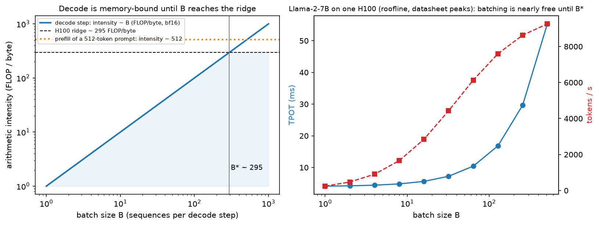
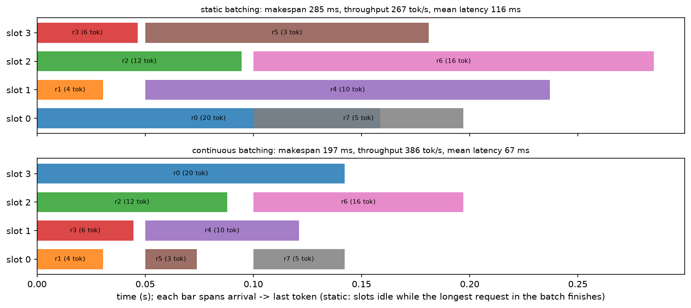
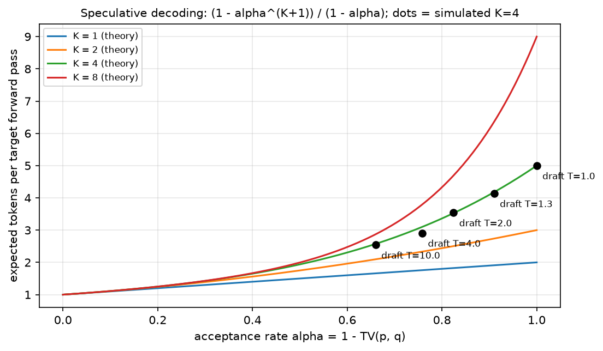

# Inference systems

> **Why this matters at staff level.** Inference is where ML meets the P&L: the same model at
> the same quality can differ 10× in cost per token depending on batching, KV-cache management
> and scheduling. Interviews test this with "TTFT vs TPOT, which do you optimise and why?",
> "why is decode memory-bandwidth-bound?" And "size a fleet for 50 QPS at a 200 ms TTFT SLO".
> Strong signal is deriving arithmetic intensity, naming the batch size where decode flips to
> compute-bound, and treating serving as a queueing problem with SLOs rather than a model problem.

## TL;DR: the interview card

- **Prefill** processes all $S$ prompt tokens in parallel: $2PS$ FLOPs against $\sim wP$ bytes of
  weights, intensity $\approx 2S/w$ → **compute-bound** beyond a few hundred tokens.
- **Decode** produces one token per sequence per step: $2PB$ FLOPs against $wP + B\,T\,k$ bytes,
  intensity $\approx 2B/w$ → **memory-bandwidth-bound at small batch**.
- **Ridge batch:** decode becomes compute-bound at $B^\star = \frac{F_\text{peak}}{BW}\cdot\frac{w}{2}$.
  H100 (989 TFLOP/s, 3.35 TB/s): $B^\star \approx 295$ in bf16, $\approx 148$ in int8. A100: $\approx 156$.
- **Metrics:** TTFT (prefill), TPOT/ITL (per-token decode), end-to-end $= \text{TTFT} + (G-1)\cdot\text{TPOT}$,
  throughput (tokens/s), **goodput** (requests/s meeting their SLO), cost/1M tokens.
- **KV cache** per token $= 2 \cdot L \cdot n_{kv} \cdot d_\text{head} \cdot w$ bytes: 512 KB/token for
  Llama-2-7B (MHA), 128 KB for Llama-3-8B and 320 KB for 70B (GQA). It, not weights, limits batch size.
- **Continuous batching** (iteration-level scheduling) evicts finished sequences and admits waiting
  ones every step; on variable-length workloads it is a 2–4× throughput win over static batching.
- **Speculative decoding:** draft $K$ tokens with a cheap model, verify in one target pass, accept
  $x$ with probability $\min(1, p(x)/q(x))$ and on rejection resample from
 $\max(0, p-q)$ normalised, the output distribution is **exactly** $p$. Expected tokens per target
  call $= \frac{1-\alpha^{K+1}}{1-\alpha}$ with $\alpha = 1 - \mathrm{TV}(p,q)$.
- **Disaggregation:** prefill and decode have opposite bottlenecks, so run them on separate pools
  (DistServe, Splitwise) and ship the KV cache between them.
- **Chunked prefill** breaks long prompts into pieces merged into decode batches, trading a little
  TTFT for much steadier TPOT.

## 1. Intuition first

Generating 100 tokens from a 500-token prompt is **two different programs wearing one API**.

Take Llama-2-7B in bf16: 13.5 GB of weights, and one H100 with 3.35 TB/s of HBM bandwidth and
989 TFLOP/s of dense BF16 compute.

* **Prefill.** You have 500 tokens at once. The projections are $(500 \times 4096) \times (4096 \times 4096)$
  matmuls: 500 rows of work per weight element read. Arithmetic intensity $\approx 2\cdot500/2 = 500$
  FLOP/byte, far above the H100's ridge of ~295. The GPU is doing what it was built for.
* **Decode.** You have *one* token. The same matmul is now $(1 \times 4096) \times (4096 \times 4096)$:
  a matrix-vector product. You read 13.5 GB of weights to do $1.35\times10^{10}$ FLOPs, an
  intensity of 1 FLOP/byte. At best that step takes $13.5\,\text{GB} / 3.35\,\text{TB/s} = 4.0$ ms, and the
  tensor cores are idle 99.7 % of the time.

The consequence organises the whole chapter: **the only way to make decode efficient is to
amortise the weight read across many sequences**, i.e. batch. Each additional sequence in the
batch is nearly free until you hit $B^\star \approx 295$. That is why the entire serving stack
(continuous batching, paged KV, disaggregation) exists to keep the batch full.

The second half of the intuition is what stops you from batching: the **KV cache**. Llama-2-7B
stores 512 KB per token, so a batch of 64 sequences with 4096-token contexts is
$64 \times 4096 \times 512\,\text{KB} = 128$ GB, more than the GPU. GQA (Llama-3-70B: 320 KB/token)
and paged allocation exist to buy back batch size.

{ width="900" }

*Left: decode's intensity equals the batch size (in bf16), so it crosses the H100 ridge at
$B^\star \approx 295$, while a 512-token prefill sits far to the right, compute-bound. Right: the
consequence. TPOT is nearly flat up to $B^\star$ while throughput grows almost linearly, which
is why batching is the highest-leverage serving decision.*

## 2. The math

### 2.1 Arithmetic intensity of prefill and decode

Let $P$ be parameters, $w$ bytes per weight, $B$ the batch, $S$ the prompt length, $T$ the
current context length, and $k$ the KV bytes per token per sequence.

**Prefill** (batch $B$, $S$ tokens each): FLOPs $= 2PBS$ (plus the attention term); bytes moved
$\ge wP$ (weights, read once) $+\,BSk$ (KV written).

$$
I_\text{prefill} = \frac{2PBS}{wP + BSk} \approx \frac{2BS}{w}\quad(\text{for } BSk \ll wP)
$$

**Decode** (one step): FLOPs $= 2PB$; bytes $= wP + BTk$ (weights plus the whole KV cache, every step).

$$
\boxed{\;I_\text{decode} \approx \frac{2PB}{wP + BTk} \xrightarrow{\;BTk \ll wP\;} \frac{2B}{w}\;}
$$

Setting $I_\text{decode}$ equal to the machine's ridge point $F_\text{peak}/BW$ gives the batch
size at which decode stops being memory-bound:

$$
\boxed{\;B^\star = \frac{F_\text{peak}}{BW}\cdot\frac{w}{2}\;}
$$

H100 SXM: $\frac{989\times10^{12}}{3.35\times10^{12}} = 295$ FLOP/byte, so $B^\star = 295\cdot\frac{2}{2} \approx 295$
sequences in bf16. A100 80 GB: ridge 156, $B^\star \approx 156$. Quantising weights to int8 *halves*
$B^\star$ (to ~148 on H100) because you read half as many bytes. Quantisation's main serving
benefit is bandwidth, not FLOPs. Note also what the KV term does: once $BTk$ is comparable to
$wP$, further batching stops helping, because the extra sequences bring their own bytes. For
7B with $T=4096$: $wP = 13.5$ GB and $BTk = B \cdot 2$ GB, so by $B = 7$ the KV traffic already
matches the weights, and the effective ridge batch is much lower than 295 in practice. This is
the quantitative argument for GQA, KV quantisation and shorter effective context.

**Time per step** under the roofline is $\max(\text{FLOPs}/F, \text{bytes}/BW)$, which is what
`estimate_latency` computes.

### 2.2 The serving metrics, and how they compose

$$
\text{TTFT} = T_\text{queue} + T_\text{prefill},\qquad
\text{TPOT (ITL)} = \text{time per output token},\qquad
E2E = \text{TTFT} + (G-1)\,\text{TPOT}
$$

$$
\text{throughput} = \frac{B}{\text{TPOT}}\ \text{tokens/s},\qquad
\text{cost per 1M tokens} = \frac{\$/\text{GPU-hour} \times \text{GPUs}}{3600 \times \text{tokens/s}} \times 10^6
$$

**Goodput**, not throughput, is the number to optimise in a product: requests/second that meet
*both* the TTFT and TPOT SLOs. Throughput and latency trade off through batch size, a larger
batch raises tokens/s and raises TPOT, so a serving system without an SLO target is
underspecified. The canonical tension:

| You care about | You choose | Because |
|---|---|---|
| Interactive chat (TTFT ≤ 300 ms, TPOT ≤ 40 ms) | moderate batch, chunked prefill, priority to prefill | a user reads at ~5–10 tokens/s; TPOT below that is invisible |
| Batch/offline (summarisation, evals) | max batch, no TTFT target | only cost/token matters |
| Agents / tool loops | low TPOT *and* low TTFT per hop | latency multiplies by the number of hops |

### 2.3 Continuous batching

Static batching runs a batch to completion: with generation lengths $G_1..G_B$ the batch occupies
all $B$ slots for $\max_i G_i$ steps, so the wasted slot-steps are $\sum_i (\max_j G_j - G_i)$.
For a geometric length distribution with mean $\bar G$, $\E[\max]$ grows like $\bar G \ln B$, so
utilisation falls as $\bar G / (\bar G \ln B) = 1/\ln B$, **worse with bigger batches**, the
opposite of what you want.

Continuous (iteration-level) batching re-decides membership every forward pass: finished
sequences leave, queued ones join immediately. Utilisation becomes limited only by arrivals and
memory, not by length variance. The simulator in `continuous_batching_sim.py` reproduces the
effect. The workload below is 300 Poisson arrivals at 30 req/s with mean generation 64 tokens.

| max batch | static tokens/s | continuous tokens/s | speed-up | mean latency (static → continuous) |
|---|---|---|---|---|
| 8 | 333 | 1197 | **3.6×** | 21.5 s → 2.3 s |
| 16 | 374 | 1254 | **3.4×** | 18.1 s → 2.0 s |
| 32 | 380 | 1306 | **3.4×** | 16.9 s → 1.7 s |

{ width="900" }

*The same eight requests under both schedulers. In the static timeline the short requests' slots
sit idle until the 20-token request finishes; continuous batching refills each slot the moment
it frees, cutting makespan and mean latency.*

### 2.4 Speculative decoding: the acceptance rule

Decode is memory-bound, so one target forward pass can verify several tokens for almost the same
cost as producing one. Let $p$ be the target distribution and $q$ the draft's, at some position.
Draft $x \sim q$; accept with probability $\min\!\left(1, \frac{p(x)}{q(x)}\right)$; if rejected,
sample from the **residual**

$$
r(x') = \frac{\max\big(0,\, p(x') - q(x')\big)}{\sum_{x}\max\big(0,\, p(x) - q(x)\big)}
$$

**Claim: the emitted token is distributed exactly as $p$.** Let $\alpha = \sum_x \min(p(x), q(x))$
be the acceptance probability. Then

$$
\Pr[\text{output} = x] = \underbrace{q(x)\min\!\left(1, \tfrac{p(x)}{q(x)}\right)}_{\text{accepted}} + \underbrace{(1-\alpha)\,r(x)}_{\text{rejected, resampled}}
= \min\big(p(x), q(x)\big) + \max\big(0, p(x)-q(x)\big) = p(x)
$$

using $1 - \alpha = 1 - \sum_x \min(p,q) = \sum_x \max(0, p-q)$, which cancels the residual's
normaliser.

$$
\boxed{\;\text{accept } x\sim q \text{ w.p. } \min\!\left(1,\tfrac{p(x)}{q(x)}\right),\ \text{else sample } \propto \max(0,p-q)\;\Rightarrow\;\text{output} \sim p\ \text{exactly}\;}
$$

Note also $\alpha = \sum_x\min(p,q) = 1 - \mathrm{TV}(p,q)$: **acceptance is one minus the total
variation distance**, so the draft's job is distributional agreement, not accuracy.

**Throughput.** With $K$ drafted tokens and i.i.d. acceptance $\alpha$, the number accepted before
the first rejection is geometric, and a bonus token comes free from the target's distribution at
the position after the last accepted one:

$$
\boxed{\;\E[\text{tokens per target call}] = \frac{1 - \alpha^{K+1}}{1-\alpha}\;}
$$

If the draft costs a fraction $c$ of a target call, the speed-up is $\frac{1-\alpha^{K+1}}{(1-\alpha)(1+Kc)}$.
At $\alpha = 0.8$, $K = 5$, $c = 0.1$: $2.5\times$. At $\alpha = 0.6$, $K = 5$, $c = 0.2$: $1.2\times$. A weak draft
with a large $K$ can be barely worth it. The simulator matches the theory closely:

| draft temperature | $\alpha$ | theory ($K{=}4$) | measured |
|---|---|---|---|
| 1.2 | 0.941 | 4.44 | 4.46 |
| 1.5 | 0.889 | 4.01 | 3.98 |
| 2.0 | 0.829 | 3.56 | 3.54 |
| 4.0 | 0.721 | 2.89 | 2.93 |

{ width="720" }

*Expected tokens per target forward pass as a function of the acceptance rate, for several draft
lengths; the black dots are the measured rates from the toy bigram implementation at $K = 4$.*

### 2.5 Capacity planning

Given a target load $\lambda$ requests/s with mean prompt $S$ and generation $G$:

1. Demand in output tokens/s $= \lambda G$.
2. Find the largest batch meeting the TPOT SLO: increase $B$ until
   $\text{TPOT}(B) > \text{SLO}$ or the KV cache no longer fits.
3. Replica capacity $= B / \text{TPOT}(B)$ tokens/s.
4. Replicas $= \lceil \lambda G / \text{capacity} \rceil$, then add headroom for burstiness
   (queueing delay explodes as utilisation → 1) and for the TTFT SLO under queueing.

Worked example from `replicas_for_slo` (Llama-2-7B, one H100, 512-token prompts, 256-token
generations, TPOT SLO 30 ms): the memory limit is 179 concurrent sequences; the SLO allows
batch 169, giving 5,647 tokens/s per replica. At $\lambda = 20$ req/s the demand is
$20 \times 256 = 5{,}120$ tokens/s, so **one replica** suffices at ~91 % utilisation, which is
exactly the point at which you should provision a second one for queueing headroom.

## 3. Implementation

### 3.1 Latency/throughput estimator

```python
def estimate_latency(cfg, gpu, batch, prompt_len, gen_len, weight_dtype="bf16",
                     kv_dtype="bf16", n_gpus=1, efficiency=0.7):
    P = count_params(cfg)["total"]                       # scalar: parameter count
    w = BYTES_PER_DTYPE[weight_dtype]                    # bytes per weight
    flops = gpu.peak_flops * n_gpus * efficiency         # achievable FLOP/s
    bw = gpu.hbm_bandwidth * n_gpus * efficiency         # achievable bytes/s
    kv_tok = kv_cache_bytes_per_token(cfg, kv_dtype)     # bytes per token of KV

    prefill_flops = 2.0 * P * prompt_len * batch         # 2 FLOPs per param per token
    prefill_bytes = w * P + batch * prompt_len * kv_tok  # weights once + KV written
    ttft = max(prefill_flops / flops, prefill_bytes / bw)   # roofline: whichever binds

    mid_ctx = prompt_len + gen_len / 2.0                 # average context during generation
    step_flops = 2.0 * P * batch                         # one token per sequence
    step_bytes = w * P + batch * mid_ctx * kv_tok        # weights + the whole KV, every step
    tpot = max(step_flops / flops, step_bytes / bw)
    ...
```

The function is the §2.1 derivation with a single `efficiency` knob standing in for the gap
between datasheet peaks and real kernels. The structure is what matters in an interview: two
terms per phase, take the max, and notice that the decode term has the KV cache *inside* the
bytes, which is why TPOT degrades as the conversation grows.

### 3.2 Speculative sampling

```python
def speculative_step(prev, P, Q, k, rng):
    draft, cur = [], prev
    for _ in range(k):                                   # draft phase: k cheap sequential samples
        cur = int(rng.choice(Q.shape[1], p=Q[cur]))
        draft.append(cur)
    contexts = [prev] + draft[:-1]                       # the token preceding each drafted token
    out = []
    for x, ctx in zip(draft, contexts):                  # verify phase: ONE parallel target call
        p_row, q_row = P[ctx], Q[ctx]                    # (V,), (V,)
        if rng.random() < min(1.0, p_row[x] / q_row[x]):
            out.append(x)
        else:
            out.append(int(rng.choice(P.shape[1], p=residual_distribution(p_row, q_row))))
            return out                                   # discard everything after a rejection
    out.append(int(rng.choice(P.shape[1], p=P[draft[-1]])))  # bonus token, free from the target
    return out
```

Toy bigram models stand in for the two networks so the *rule* is the whole content. Two details
carry the correctness: everything after a rejection must be discarded (its context is now wrong),
and the bonus token after $K$ acceptances comes from the target's own distribution at position
$K+1$, which the verification pass already computed.

**Testing a sampler is the interesting part.** The tests check the *distribution*, not a value:
20,000 runs of `speculative_step` and the empirical marginal of the first emitted token must be
within total variation 0.02 of $P[\text{prev}]$, and the empirical *conditional* of the second
token given the first must match $P$ row-wise. That is how you demonstrate "preserves the target
distribution" rather than assert it.

### 3.3 Continuous-batching simulator

```python
def simulate_continuous(requests, max_batch, cost=CostModel()):
    pending, running, t = sorted(requests, key=lambda r: r.arrival), [], 0.0
    while pending or running:
        admitted = []
        while pending and pending[0].arrival <= t and len(running) < max_batch:
            admitted.append(pending.pop(0))              # fill freed slots every iteration
        running += [(r, 0) for r in admitted]
        t += (cost.t_fixed
              + cost.c_prefill * sum(r.prompt_len for r in admitted)   # merged prefill
              + cost.c_decode * (len(running) - len(admitted)))        # decode the rest
        still = []
        for r, n in running:
            n += 1
            if n >= r.gen_len:
                done.append(...)                         # sequence leaves the batch immediately
            else:
                still.append((r, n))
        running = still
```

`simulate_static` is the same loop with the batch frozen until every member finishes. The tests
assert both conserve tokens and complete all requests, that continuous beats static by > 1.5× on
variable lengths, and (the sanity check that catches an unfair comparison) that the two agree
exactly when all requests are identical in length and arrive together.

??? example "Full implementation: `src/mlbook/systems/inference_metrics.py`"
    ```python
    --8<-- "src/mlbook/systems/inference_metrics.py"
    ```

??? example "Full implementation: `src/mlbook/systems/speculative_decoding.py`"
    ```python
    --8<-- "src/mlbook/systems/speculative_decoding.py"
    ```

??? example "Full implementation: `src/mlbook/systems/continuous_batching_sim.py`"
    ```python
    --8<-- "src/mlbook/systems/continuous_batching_sim.py"
    ```

**How you'd test it.** Intensity formulas against hand arithmetic; $B^\star$ against the ridge
point and its halving under int8; TPOT growing sublinearly in batch (memory-bound regime);
speculative sampling against the target distribution empirically (marginal and conditional);
static vs continuous equal on identical requests and 1.5×+ apart on variable ones.

## Retype by hand

| Symbol | File | Retype from memory? | Target time |
|---|---|---|---|
| `acceptance_rate`, `residual_distribution`, `speculative_step` | `src/mlbook/systems/speculative_decoding.py` | **Yes**: the speculative sampling acceptance rule | 15 minutes |
| `prefill_intensity`, `decode_intensity`, `decode_ridge_batch` | `src/mlbook/systems/inference_metrics.py` | **Yes** | 5 minutes |
| `estimate_latency` | `src/mlbook/systems/inference_metrics.py` | **Yes**: the latency/throughput estimator | 15 minutes |
| `simulate_continuous` | `src/mlbook/systems/continuous_batching_sim.py` | **Yes**: the scheduler loop | 15 minutes |
| `expected_tokens_per_call`, `max_batch_for_memory`, `replicas_for_slo`, `simulate_static`, `make_toy_models` | same files | Read and understand |: |

Checks: `pytest tests/test_systems_inference_metrics.py tests/test_systems_speculative_decoding.py tests/test_systems_continuous_batching.py -q`.

## 4. Systems view: cost, failure modes, trade-offs

**The serving stack, and what each layer buys.**

| Technique | Buys | Costs / limits | Where it lives |
|---|---|---|---|
| Continuous batching | 2–4× throughput on variable lengths | scheduler complexity; TPOT varies with batch | vLLM, TGI, TensorRT-LLM |
| [PagedAttention](../part06-llm-training/04-efficient-attention-kv-cache.md) | near-zero KV fragmentation → bigger batch | indirection in the attention kernel | vLLM |
| [Prefix/prompt caching](../part06-llm-training/04-efficient-attention-kv-cache.md) | skips prefill for shared prefixes | cache memory; invalidation | vLLM, SGLang (RadixAttention) |
| Chunked prefill | steadier TPOT, better mixing | slightly worse TTFT for long prompts | vLLM, TensorRT-LLM |
| Speculative decoding | 1.5–3× lower TPOT at small batch | extra memory for the draft; *no* gain when already compute-bound | most engines |
| [Quantisation](../part06-llm-training/05-quantization.md) (W8A8, W4A16) | halves/quarters weight bytes → lower TPOT, bigger batch | accuracy risk; calibration | all engines |
| KV quantisation (fp8/int8) | more sequences per GPU | small quality loss at long context | vLLM, TensorRT-LLM |
| KV offload to host/NVMe | very long contexts, more concurrency | PCIe bandwidth becomes the bottleneck | research + some engines |
| Disaggregated prefill/decode | each phase on its hardware; isolates TTFT from TPOT | KV transfer over the network | DistServe, Splitwise |
| Multi-LoRA serving | many fine-tunes on one base model | per-adapter kernels; routing | S-LoRA, vLLM |
| Semantic cache | skips the model entirely on near-duplicates | staleness, false hits; needs a similarity threshold + eval | application layer |

**Failure modes.** *KV-cache OOM under load*: admission control must reject or preempt rather than
crash; vLLM preempts by swapping or recomputing a sequence's KV. *Head-of-line blocking*: one
32K-token prefill stalls every decode in the batch, the reason chunked prefill exists.
*TPOT drift*: as sessions lengthen, $BTk$ grows and TPOT degrades, so an SLO measured at session
start is not the SLO at turn 20. *Throughput collapse at high utilisation*: queueing delay
diverges as $\rho \to 1$; plan for 60–80 % utilisation. *Speculative decoding backfiring*: at
large batch the system is already compute-bound, and the draft's extra FLOPs slow it down, so
production systems disable speculation above a batch threshold. *Quantisation quality regressions*
that appear only on long-tail inputs; always evaluate on your own eval set, not the paper's.

**Cost model to carry.** Cost per 1M tokens $= \frac{\text{GPU \$/h} \times G}{3600 \times \text{tokens/s}}\times10^6$.
Because tokens/s in the memory-bound regime is roughly $B \cdot BW/(wP)$, cost per token falls
almost linearly with batch until $B^\star$ or the KV limit, so **every technique that raises
achievable batch is a cost reduction**, and that is the single sentence that ties this chapter
together.

## 5. In production

!!! production "UC Berkeley / vLLM: PagedAttention (2023)"
    Problem: KV-cache memory was fragmented and over-reserved (naive allocation reserves the max
    sequence length per request), capping batch size and wasting most of the cache. Built:
    PagedAttention, which stores KV in fixed-size blocks with a page table, plus continuous
    batching and copy-on-write sharing for beams and shared prefixes. Rejected: contiguous
    per-sequence KV buffers. Reported 2–4× throughput improvements over prior systems at the
    same latency.
    *Source: Kwon et al., "Efficient Memory Management for Large Language Model Serving with
    PagedAttention", SOSP 2023, [arXiv:2309.06180](https://arxiv.org/abs/2309.06180); the project's own
    [launch post](https://vllm.ai/blog/2023-06-20-vllm), June 2023.*

!!! production "Seoul National University / FriendliAI: Orca: iteration-level scheduling (2022)"
    Problem: request-level batching wastes slots because sequences finish at different times.
    Built: iteration-level scheduling (what everyone now calls continuous batching) plus
    selective batching for the operators that cannot be batched across different sequence
    lengths. This is the paper to cite for *why* continuous batching works, not just that it does.
    *Source: Yu et al., ["Orca: A Distributed Serving System for Transformer-Based Generative
    Models", OSDI 2022](https://www.usenix.org/conference/osdi22/presentation/yu).*

!!! production "Google: speculative decoding (2023)"
    Problem: decode latency is bounded by memory bandwidth, not compute, so the accelerator is
    idle. Built: draft-then-verify with the modified rejection-sampling rule proven to preserve
    the target distribution exactly, reporting 2–3× wall-clock speed-ups on T5 and similar
    models without any quality change. DeepMind's concurrent paper gives the same rule.
    *Sources: Leviathan, Kalman & Matias, "Fast Inference from Transformers via Speculative
    Decoding", ICML 2023, [arXiv:2211.17192](https://arxiv.org/abs/2211.17192); Chen et al., "Accelerating Large Language Model
    Decoding with Speculative Sampling", 2023, [arXiv:2302.01318](https://arxiv.org/abs/2302.01318).*

!!! production "Peking University / UCSD: DistServe, and Microsoft: Splitwise (2024)"
    Problem: prefill and decode have opposite bottlenecks and interfere when colocated, a long
    prefill spikes every colocated request's TPOT. Built: disaggregated serving, running prefill
    and decode on separate GPU pools with the KV cache transferred between them, each pool
    independently scaled and parallelised. Reported large gains in goodput under tight
    TTFT/TPOT SLOs. Splitwise additionally exploits the phases' different power/hardware profiles.
    *Sources: Zhong et al., "DistServe: Disaggregating Prefill and Decoding for Goodput-optimized
    Large Language Model Serving", OSDI 2024, [arXiv:2401.09670](https://arxiv.org/abs/2401.09670); Patel et al., "Splitwise:
    Efficient Generative LLM Inference Using Phase Splitting", ISCA 2024, [arXiv:2311.18677](https://arxiv.org/abs/2311.18677).*

!!! production "Stanford / LMSYS: SGLang and RadixAttention (2024)"
    Problem: agentic and structured workloads re-send large shared prefixes (system prompts,
    few-shot blocks, tool schemas) and constrain outputs to grammars. Built: RadixAttention, a
    radix-tree KV cache that shares prefixes automatically across requests, plus a frontend
    language and a fast constrained-decoding path for JSON/grammar outputs.
    *Source: Zheng et al., "SGLang: Efficient Execution of Structured Language Model Programs",
    NeurIPS 2024, [arXiv:2312.07104](https://arxiv.org/abs/2312.07104).*

!!! production "NVIDIA: TensorRT-LLM"
    Problem: squeeze the last factor out of a fixed GPU. Built: fused kernels, in-flight
    (continuous) batching, paged KV, FP8 and INT4 weight-only quantisation paths, chunked
    prefill, speculative decoding and multi-LoRA, exposed through a compiled engine per model
    and parallel configuration. The trade-off relative to vLLM is flexibility (an engine must be
    rebuilt per shape/parallelism) for peak performance on NVIDIA hardware.
    *Source: NVIDIA [TensorRT-LLM documentation](https://nvidia.github.io/TensorRT-LLM/) and
    [GitHub repository](https://github.com/NVIDIA/TensorRT-LLM).*

## 6. Interview questions and strong answers

!!! interview "Why is decode memory-bandwidth-bound, and at what batch size does that stop being true?"
    A decode step reads every weight once and does 2 FLOPs per weight per *sequence*, so
    arithmetic intensity is $2B/w$, 1 FLOP/byte at batch 1 in bf16. The GPU's ridge point is
    $F_\text{peak}/BW$: 295 FLOP/byte on an H100. Setting them equal gives
    $B^\star = \text{ridge}\cdot w/2 \approx 295$ sequences. Below that, time per step is
    $wP/BW$ (fixed, independent of batch) which is why batching is nearly free and why the
    whole serving stack is built to keep the batch full. **Staff follow-up:** "does int8
    quantisation double throughput?" It halves the bytes so it roughly halves the memory-bound
    step time *and* halves $B^\star$ to ~148, but it does not help once you are compute-bound,
    and the KV cache (not the weights) may already dominate the bytes at long context.

!!! interview "TTFT vs TPOT: which do you optimise, and how do they trade off?"
    It depends on the product. TTFT is prefill plus queueing and is what the user perceives as
    "did it hear me"; TPOT is the streaming rate and stops mattering below reading speed
    (~10 tokens/s, i.e. 100 ms). For chat I'd target TTFT ≤ 300 ms and TPOT ≤ 40 ms and maximise
    goodput subject to both. They trade off through batching and scheduling: bigger batches raise
    TPOT; prioritising prefill improves TTFT but stalls decodes (head-of-line blocking), which
    chunked prefill fixes by slicing the prompt into pieces merged into decode iterations. If
    they genuinely conflict at scale, disaggregate: separate prefill and decode pools, sized
    independently. **Follow-up:** "what do you report to the business?" Goodput and cost per
    million tokens, not peak throughput.

!!! interview "Derive the speculative-decoding acceptance rule and prove it preserves the target distribution."
    Sample $x \sim q$, accept with probability $\min(1, p(x)/q(x))$; on rejection sample from
    $\max(0, p-q)$ normalised. Then $\Pr[\text{out}=x] = q(x)\min(1, p(x)/q(x)) + (1-\alpha)r(x)
    = \min(p(x),q(x)) + \max(0,p(x)-q(x)) = p(x)$, where $\alpha=\sum\min(p,q)$ is exactly the
    normaliser of the residual. So the output is exactly the target's distribution. The scheme is
    lossless, unlike distillation or early exit. Expected tokens per target call is
    $\frac{1-\alpha^{K+1}}{1-\alpha}$, and $\alpha = 1-\mathrm{TV}(p,q)$. **Follow-up:** "when
    does it stop helping?" When you are compute-bound (large batch), because the verification
    pass is no longer free; and when $\alpha$ is low, since a $K$ of 5 with $\alpha=0.6$ and a
    draft costing 20 % yields only ~1.2×.

!!! interview "Size a fleet: 50 req/s, 1K-token prompts, 256-token outputs, Llama-3-70B, TTFT ≤ 1 s, TPOT ≤ 30 ms."
    First the per-replica shape: 70B in bf16 is 141 GB, so a replica is at least 2 H100s for
    weights; I'd use 8-way tensor parallelism per replica for latency, giving ~8 ms TPOT at
    batch 32 and ~1.7 s TTFT for 2K prompts at that batch in my roofline estimate, TTFT is the
    binding constraint, so I'd use chunked prefill and cap the batch, or disaggregate prefill.
    Demand is $50 \times 256 = 12{,}800$ output tokens/s. At batch 128 a replica delivers roughly
    10K tokens/s but TPOT rises to ~12 ms (still inside SLO), so ~2 replicas of 8 GPUs plus
    headroom, call it 3 replicas / 24 GPUs for 60–70 % utilisation. Then I'd validate against a
    real benchmark, because the roofline ignores kernel efficiency and scheduling. **Follow-up:**
    "how does prefix caching change this?" If the 1K-token prompts share a long system prefix,
    prefill cost per request collapses and TTFT stops binding, which can halve the fleet.

!!! interview "Your P99 TTFT blew up but mean TTFT is fine. What happened?"
    Almost certainly head-of-line blocking or queueing at high utilisation. A few very long
    prompts monopolise prefill iterations, so short requests behind them wait, mean is fine,
    tail is not. Fixes: chunked prefill so a long prompt yields the GPU every chunk; a scheduler
    that bounds the prefill tokens per iteration; separate queues or priorities by prompt length;
    and at the fleet level, drop utilisation or shard by request class. The other candidate is
    KV-cache pressure causing preemption/recompute of running sequences, which shows up as
    sporadic latency spikes correlated with cache occupancy. **Follow-up:** "how would you tell
    the two apart?" Correlate tail events with (a) the largest prompt in the batch and (b) the
    cache eviction/preemption counter; they are separate metrics and only one will move.

!!! interview "When would you *not* use continuous batching?"
    When every request has identical length and arrives together, offline batch scoring, for
    example, the schedulers coincide and static batching is simpler with no scheduler overhead
    (my simulator asserts this equivalence as a test). Also when the model is so small that the
    per-iteration scheduling overhead is comparable to the forward pass, or when strict ordering
    or reproducibility per batch is required. **Follow-up:** "what is the cost of continuous
    batching?", TPOT becomes load-dependent (a user's stream slows when the batch grows), which
    you must either accept, bound with admission control, or hide with a per-request rate limit.

## 7. Exercises

1. ★ Compute the KV cache for 200 concurrent Llama-3-70B sessions at 8K context in bf16. Does it
   fit on a node of 8×80 GB alongside the weights?

    ??? success "Solution"
        320 KB/token $\times$ 8192 $\times$ 200 = 500 GB. Weights are 141 GB, total 641 GB against
        640 GB of HBM: no, with zero headroom for activations. Options: fp8 KV (250 GB), fewer
        sessions, or shorter context. `max_batch_for_memory(LLAMA3_70B, H100_SXM, 8192, n_gpus=8)`
        gives the exact limit.

2. ★ At what batch does decode become compute-bound on an A100 in bf16, and how does that change
   with int8 weights?

    ??? success "Solution"
        Ridge $= 312/2.0 = 156$ FLOP/byte, so $B^\star = 156 \cdot 2/2 = 156$ sequences; with int8
        weights $w=1$ so $B^\star = 78$. Half the bytes means you reach the compute roof at half
        the batch, but you also got there twice as fast.

3. ★★ Using `speculative_decoding.py`, measure the empirical acceptance rate and tokens/call for
   draft temperatures 1.1 to 5.0, and check both against $\alpha = 1-\mathrm{TV}(p,q)$ and
   $\frac{1-\alpha^{K+1}}{1-\alpha}$. Then find the $K$ that maximises speed-up when the draft
   costs 15 % of a target call.

    ??? success "Solution"
        Maximise $f(K) = \frac{1-\alpha^{K+1}}{(1-\alpha)(1+0.15K)}$ numerically. For $\alpha=0.9$
        the optimum is around $K = 5$–$7$; for $\alpha = 0.7$ it drops to $K \approx 3$; for
        $\alpha \le 0.5$ speculation barely pays at $c=0.15$. The measured tokens/call in the
        table above match the theory to within ~1 %.

4. ★★ Extend `continuous_batching_sim.py` with a `max_prefill_tokens_per_iteration` cap
   (chunked prefill) and show that P99 TTFT improves while mean throughput is roughly unchanged.

    ??? success "Solution"
        Admit prompts in slices: track remaining prompt tokens per request and charge
        `c_prefill * min(remaining, cap)` per iteration, only moving a request into the decoding
        set when its prefill completes. With a cap of ~512 tokens, long prompts no longer occupy a
        whole iteration, so short requests' first tokens arrive sooner; total work is unchanged,
        so throughput moves little.

5. ★★★ Build a goodput curve: for batch sizes 1–256, compute (TTFT, TPOT, tokens/s) with
   `estimate_latency`, then compute the fraction of requests meeting a 500 ms TTFT / 30 ms TPOT
   SLO under Poisson arrivals using the simulator, and find the batch cap maximising goodput.

    ??? success "Solution"
        Goodput is non-monotone: it rises with batch while TPOT stays under SLO, then collapses
        once TPOT crosses it (every request fails, not just the marginal one). The optimum sits
        just below the batch where `estimate_latency(...).tpot_s` crosses 30 ms, which for
        Llama-2-7B on one H100 is ~169, matching `replicas_for_slo`. The lesson to state: SLO
        systems have a cliff, so you provision *below* the knee, not at it.

## References

* Kwon, W. et al. *Efficient Memory Management for Large Language Model Serving with
  PagedAttention.* SOSP 2023. [arXiv:2309.06180](https://arxiv.org/abs/2309.06180). vLLM project blog,
  [*Easy, fast, and cheap LLM serving with PagedAttention*](https://vllm.ai/blog/2023-06-20-vllm), June 2023.
* Yu, G.-I. et al. [*Orca: A Distributed Serving System for Transformer-Based Generative Models.*](https://www.usenix.org/conference/osdi22/presentation/yu)
  OSDI 2022.
* Leviathan, Y., Kalman, M., Matias, Y. *Fast Inference from Transformers via Speculative
  Decoding.* ICML 2023. [arXiv:2211.17192](https://arxiv.org/abs/2211.17192).
* Chen, C. et al. *Accelerating Large Language Model Decoding with Speculative Sampling.* 2023.
  [arXiv:2302.01318](https://arxiv.org/abs/2302.01318).
* Zhong, Y. et al. *DistServe: Disaggregating Prefill and Decoding for Goodput-optimized Large
  Language Model Serving.* OSDI 2024. [arXiv:2401.09670](https://arxiv.org/abs/2401.09670).
* Patel, P. et al. *Splitwise: Efficient Generative LLM Inference Using Phase Splitting.*
  ISCA 2024. [arXiv:2311.18677](https://arxiv.org/abs/2311.18677).
* Zheng, L. et al. *SGLang: Efficient Execution of Structured Language Model Programs.*
  NeurIPS 2024. [arXiv:2312.07104](https://arxiv.org/abs/2312.07104).
* Agrawal, A. et al. *Taming Throughput-Latency Tradeoff in LLM Inference with Sarathi-Serve.*
  OSDI 2024. [arXiv:2403.02310](https://arxiv.org/abs/2403.02310) (chunked prefill).
* Sheng, Y. et al. *S-LoRA: Serving Thousands of Concurrent LoRA Adapters.* 2023. [arXiv:2311.03285](https://arxiv.org/abs/2311.03285).
* Pope, R. et al. *Efficiently Scaling Transformer Inference.* MLSys 2023. [arXiv:2211.05102](https://arxiv.org/abs/2211.05102)
  (the arithmetic-intensity analysis of prefill vs decode on TPUs).
* NVIDIA. *TensorRT-LLM* [documentation](https://nvidia.github.io/TensorRT-LLM/) and
  [repository](https://github.com/NVIDIA/TensorRT-LLM).
* NVIDIA. [H100 datasheet](https://resources.nvidia.com/en-us-gpu-resources/h100-datasheet-24306),
  [H100 architecture whitepaper](https://resources.nvidia.com/en-us-hopper-architecture/nvidia-h100-tensor-c) and
  [A100 80 GB datasheet](https://www.nvidia.com/content/dam/en-zz/Solutions/Data-Center/a100/pdf/a100-80gb-datasheet-update-a4-nvidia-1485612-r12-web.pdf)
  (the 989 TFLOP/s dense BF16 and 3.35 TB/s HBM3 figures behind the $B^\star$ arithmetic).
