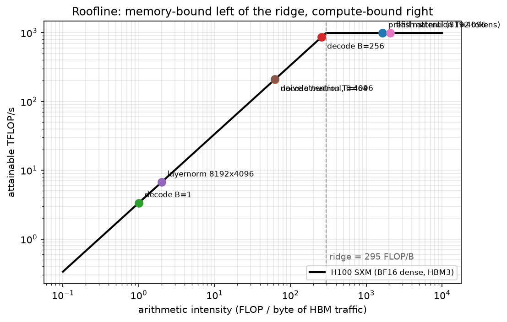

# Hardware, memory & roofline

> **Why this matters at staff level.** "Explain the roofline" is a standard question, and the
> follow-ups ("where does attention sit?", "why does batch 1 decode waste your GPU?", "why does
> padding a dimension to 64 speed it up?") separate people who have read about GPUs from people
> who have profiled them. This chapter is the physical substrate under the other three: every
> memory, parallelism and serving decision in Part XIV reduces to bytes moved versus FLOPs done.

## TL;DR: the interview card

- **Roofline:** attainable $= \min(F_\text{peak},\; I \cdot BW)$ where $I$ = FLOPs / bytes moved.
  The **ridge point** $I^\star = F_\text{peak}/BW$ divides memory-bound (left) from compute-bound (right).
- **H100 SXM:** 989 TFLOP/s dense BF16 (tensor cores), 3.35 TB/s HBM3, 80 GB → ridge ≈ **295 FLOP/byte**.
  **A100 80 GB:** 312 TFLOP/s BF16, ~2.0 TB/s HBM2e → ridge ≈ **156**.
- **Memory hierarchy** (per GPU, orders of magnitude): registers ~10s TB/s → SMEM/L1 ~10 TB/s →
  L2 (tens of MB) ~several TB/s → HBM (80 GB) 2–3.4 TB/s → NVLink ~450 GB/s/direction →
  PCIe 5.0 x16 ~64 GB/s → InfiniBand NDR 50 GB/s/port. **Each step down is ~an order of magnitude.**
- **Kernel intensities:** big matmul $10^3$; FlashAttention ~$10^3$; naive attention ~60 (it
  writes and re-reads the $T\times T$ matrix); LayerNorm ~2; **decode step = batch size**.
- **FLOPs accounting:** forward $\approx 2N$ per token $+\,4Lhs$ for attention; training $3\times$ that.
- **Bytes/param:** fp32 4, bf16/fp16 2, fp8 1, int4 0.5. Training state with Adam = 16 B/param.
- **Fusion** is the main lever left of the ridge: fusing $n$ elementwise ops turns $n$ HBM
  round-trips into one. FlashAttention is fusion + tiling + online softmax.
- **Tensor cores want shapes that are multiples of 8 (fp16/bf16) and ideally 64/128** on the
  GEMM's M/N/K; odd vocab sizes and head dims leave 20–50 % on the table.
- **CUDA graphs** remove per-kernel launch overhead (~5–10 µs each), which dominates small-batch
  decode where each layer's kernels take microseconds.

## 1. Intuition first

Every kernel is a deal between two resources: the machine can do $F_\text{peak}$ FLOPs per second
and move $BW$ bytes per second. A kernel that does $\Phi$ FLOPs while moving $M$ bytes cannot
finish faster than

$$
t \ge \max\left(\frac{\Phi}{F_\text{peak}},\ \frac{M}{BW}\right)
$$

Which term wins depends only on the ratio $I = \Phi / M$, the **arithmetic intensity**. Take three
kernels on one H100, all on bf16 data:

| Kernel | FLOPs | HBM bytes | $I$ | Bound by |
|---|---|---|---|---|
| $y = x + 1$ on $10^9$ elements | $10^9$ | $4\times10^9$ (read + write) | 0.25 | memory, by 1000× |
| $(8192\times4096) @ (4096\times4096)$ | $2.7\times10^{11}$ | $1.7\times10^8$ | 1638 | compute |
| decode step, 7B, batch 1 | $1.4\times10^{10}$ | $1.4\times10^{10}$ | 1.0 | memory, by 295× |

The elementwise kernel and the batch-1 decode are *the same kind of problem*: they read a lot and
compute little. No amount of tensor-core capability helps; the only fixes are to move fewer bytes
(fusion, quantisation, keeping data in SRAM) or to do more work per byte (batching). That single
observation explains FlashAttention, kernel fusion, quantisation for serving, and why batch-1
LLM inference "wastes" a $30{,}000 GPU.

A useful mental image: the GPU is a factory with an enormous assembly line (tensor cores) fed by
a single narrow loading dock (HBM). The ridge point is the ratio at which the dock can just keep
the line busy. Everything in this chapter is either "how big is the line", "how wide is the dock",
or "how do I avoid going through the dock at all".

{ width="800" }

*The H100 roofline with real LLM kernels placed on it. Prefill matmuls and FlashAttention sit on
the flat (compute-bound) roof; LayerNorm, naive attention and batch-1 decode sit on the slanted
(memory-bound) part. Note that naive and Flash attention do identical FLOPs, the only difference
is bytes moved, which moves the kernel 30× to the right.*

## 2. The math

### 2.1 The roofline model and the ridge point

Williams, Waterman and Patterson (2009) proposed plotting attainable performance against
arithmetic intensity on log-log axes:

$$
\boxed{\;P(I) = \min\big(F_\text{peak},\; I \cdot BW\big),\qquad I^\star = \frac{F_\text{peak}}{BW}\;}
$$

For $I < I^\star$ the kernel rides the diagonal $I\cdot BW$ and its performance is set entirely by
bandwidth; for $I > I^\star$ it is flat at $F_\text{peak}$. Two consequences interviewers look for:

1. **Optimising FLOPs in a memory-bound kernel does nothing.** Halving the arithmetic of a
   LayerNorm changes $I$ from 2 to 1 and the runtime not at all.
2. **Moving right is the goal.** You move right by increasing reuse (batching, tiling, fusion),
   never by adding FLOPs.

The ridge is a property of the machine, and it has been getting *worse* for decades: compute has
grown faster than bandwidth, so $I^\star$ has climbed (V100 ~139, A100 ~156, H100 ~295 in bf16).
More and more kernels fall to the left of it over time. This is the "memory wall", and it is why
so much recent ML systems work is really data-movement work.

### 2.2 Computing intensity for the kernels that matter

**Matmul $(M,K)\times(K,N)$**, 2 bytes per element, everything read once from HBM:

$$
I = \frac{2MNK}{2(MK + KN + MN)}
$$

With $M=N=K=n$ this is $n/3$: intensity grows linearly with the matrix size, which is why big
matmuls are the easiest thing to make fast. With $M = 1$ (a matrix-vector product, i.e. batch-1
decode) it collapses to $\approx 1$ regardless of $K, N$. **The shape, not the operation, decides.**

**Attention**, single head, sequence $T$, head dim $d$. FLOPs are $\approx 4T^2d$ for the two
matmuls. Naive implementations write the $T\times T$ score matrix to HBM, read it back for
softmax, write the probabilities, and read them for $PV$:

$$
I_\text{naive} = \frac{4T^2d + 5T^2}{2(3Td + 4T^2 + Td)} \xrightarrow{T \gg d} \approx \frac{4T^2d}{8T^2} = \frac{d}{2}
$$

That limit is about 60 FLOP/byte at $d=128$, far below the ridge. FlashAttention never
materialises the score matrix: it tiles $Q, K, V$ into SRAM-sized blocks and keeps a running softmax, so HBM traffic is
just $Q, K, V, O$:

$$
I_\text{flash} \approx \frac{4T^2d}{2 \cdot 4Td} = \frac{T}{2}
$$

At $T = 4096, d = 128$ the computed values are $I_\text{naive} = 62.7$ and $I_\text{flash} = 2068$:
**33× more intensity for identical arithmetic**, which is why the same FLOPs take 41 µs vs 8.8 µs
on the H100 roofline. The derivation, the online-softmax recurrence and the IO-complexity bound
are in [efficient attention & KV cache](../part06-llm-training/04-efficient-attention-kv-cache.md);
the point here is only where it sits on the roofline and why.

**Decode step** of a $P$-parameter model at batch $B$: $2PB$ FLOPs, $wP$ bytes of weights, so
$I = 2B/w = B$ in bf16. *The arithmetic intensity of LLM decoding is the batch size.* That one
sentence answers half the inference-systems questions in the
[previous chapter](03-inference-systems.md).

**LayerNorm/RMSNorm** on $n$ elements: ~8 FLOPs per element, 2 accesses (read $x$, write $y$) at
2 bytes → $I = 8n/(4n) = 2$. Norms are pure bandwidth, which is why they get fused into their
neighbours.

### 2.3 FLOPs and bytes accounting

$$
\boxed{\;F_\text{fwd/token} \approx 2N + 4Lhs,\qquad F_\text{train/token} \approx 6N + 12Lhs\;}
$$

The $2N$ is one multiply and one add per weight element; $4Lhs$ covers $QK^\top$ and $PV$
(each $2sh$ per token per layer). Causal masking halves the useful work but the convention
(PaLM, Megatron) counts the full term. Say which convention you are using when you quote MFU.

$$
\begin{array}{lcccc}
\textbf{dtype} & \text{fp32} & \text{bf16/fp16} & \text{fp8} & \text{int4}\\
\textbf{bytes/param} & 4 & 2 & 1 & 0.5
\end{array}
$$

Multiply by the count to get weights; add [16 B/param of training state](01-distributed-training.md)
for training, or $2Ln_{kv}d_\text{head}w$ bytes per token of KV for serving.

### 2.4 The memory hierarchy, and why locality is everything

| Level | Size (H100 class) | Bandwidth (order) | Latency (order) |
|---|---|---|---|
| Registers | 256 KB per SM | ~10s TB/s | ~1 cycle |
| Shared memory / L1 | ~228 KB per SM | ~10 TB/s aggregate | ~20–30 cycles |
| L2 | ~50 MB | several TB/s | ~200 cycles |
| HBM3 | 80 GB | 3.35 TB/s | ~400–600 cycles |
| NVLink 4 (to peer GPU) |: | ~450 GB/s per direction (900 GB/s aggregate) | ~µs |
| PCIe 5.0 x16 (to host) |: | ~64 GB/s per direction | ~µs |
| InfiniBand NDR (to another node) |: | 50 GB/s per 400 Gb/s port | ~µs+ |

Two engineering rules follow. **(1)** A tile that fits in SRAM can be reused many times at ~10
TB/s instead of 3.35 TB/s; every fast matmul and FlashAttention kernel is organised around this.
**(2)** Host↔device transfers are ~50× slower than HBM, so they must be (a) rare, (b) on
**pinned** (page-locked) memory, which lets the DMA engine copy without staging through a
pageable bounce buffer and lets the copy overlap compute on a separate stream, and (c) issued
asynchronously. An unpinned `.to("cuda")` in the training loop is a synchronous stall.

### 2.5 GPU and TPU architecture, briefly but concretely

A GPU is an array of **streaming multiprocessors** (H100 SXM: 132 SMs). Each SM has warp
schedulers issuing instructions for **warps** of 32 threads in lockstep, a register file, shared
memory, CUDA cores (scalar FP32/INT) and **tensor cores** (fixed-function matrix-multiply-accumulate
units operating on small tiles, e.g. 16×8×16 for bf16). Nearly all of the advertised TFLOP/s is
tensor-core throughput: CUDA-core FP32 on an H100 is ~67 TFLOP/s, about 1/15 of the BF16 tensor
number. **If your kernel is not hitting tensor cores, you are working with 7 % of the machine.**

Consequences for shapes: tensor cores consume fixed tiles, and the library (cuBLAS/CUTLASS)
decomposes a GEMM into tiles of typically 64–256 per dimension across SMs. So:

* Dimensions that are **multiples of 8** are required to use the fp16/bf16 tensor-core path at
  all in cuBLAS; multiples of **64 or 128** avoid partial tiles and ragged tails.
* A vocabulary of 50,257 is the standard example. Padding it to 50,304 (a multiple of 128) is a
  measurable speed-up for the LM-head GEMM at zero quality cost.
* **Wave quantisation**: if the tiles do not evenly fill the SMs, the last "wave" runs at partial
  occupancy. A GEMM producing 133 tiles on 132 SMs takes as long as 264 tiles.

A **TPU** replaces many small SMs with a large **systolic array** (a 128×128-ish MXU): data flows
through a fixed grid of MACs, so weights and activations are reused spatially and the design is
extremely efficient *when the matrices fill the array*. The practical consequence is the same rule
with sharper teeth: shapes should be multiples of the MXU dimension (128) and of the batch tiling
(8), or you pad and waste. TPU pods connect chips with a dedicated ICI torus fabric rather than
PCIe/IB, which is why Google's large runs can use high model-parallel degrees without pipelining
(see PaLM in the [distributed-training chapter](01-distributed-training.md)).

### 2.6 Fusion, Triton and CUDA graphs

**Fusion.** A chain like `x -> layernorm -> gelu -> dropout -> add` executed as four kernels reads
and writes HBM four times; fused into one kernel it reads once and writes once. For memory-bound
ops the speed-up is close to the number of fused round-trips saved. This is why `torch.compile`
and hand-written kernels win on the "small" ops even though they contain no clever mathematics.

**What a tiled matmul kernel looks like (in prose).** In Triton you write a program that computes
one output tile: each program instance is given a tile index, from which it computes row and
column offsets. It allocates an accumulator tile in registers (say 128×128 in fp32), then loops
over the K dimension in chunks (say 64): each iteration loads a 128×64 block of $A$ and a 64×128
block of $B$ into shared memory with masked loads (so the edges of a non-multiple-of-tile matrix
are handled), issues a tensor-core `dot` into the accumulator, and advances the pointers. After
the loop it casts the accumulator to the output dtype and stores the tile with masking. The
performance ideas are: keep the accumulator in registers (never touch HBM inside the K loop),
stage through shared memory so each loaded element is used by 128 multiply-accumulates, and
choose the tile shape so the loop is deep enough to hide the load latency. Everything else
(autotuning `BLOCK_M/N/K` and `num_stages`, swizzling the tile order for L2 reuse) is tuning.
That mental model is what "Triton literacy" means in an interview; you do not need to recite the
syntax.

**CUDA graphs.** Each kernel launch costs a few microseconds of CPU-side work. A 32-layer model's
decode step is hundreds of tiny kernels, each running for a few microseconds, so launch overhead
can *exceed* the GPU work. A CUDA graph records the whole step once and replays it as a single
submission, removing per-launch overhead and CPU jitter. The constraints are the point: shapes
and pointers must be static, which is exactly why serving engines pad to a set of fixed batch
sizes and pre-allocate KV blocks.

## 3. Implementation

### 3.1 Roofline calculator and plot

```python
@dataclass(frozen=True)
class Machine:
    name: str
    peak_flops: float
    bandwidth: float

    @property
    def ridge_point(self) -> float:
        return self.peak_flops / self.bandwidth          # FLOP per byte

    def attainable(self, intensity: float) -> float:
        return min(self.peak_flops, intensity * self.bandwidth)

def matmul_kernel(M, N, K, bytes_per_elem=2.0, name=None):
    flops = 2.0 * M * N * K                              # multiply-accumulate per output element
    moved = bytes_per_elem * (M * K + K * N + M * N)     # A, B read once; C written once
    return Kernel(name or f"matmul {M}x{K}x{N}", flops, moved)

def naive_attention_kernel(T, d, bytes_per_elem=2.0):
    flops = 2.0 * T * T * d * 2 + 5.0 * T * T            # QK^T and PV, plus softmax elementwise
    moved = bytes_per_elem * (3 * T * d + 4 * T * T + T * d)  # Q,K,V in; S out+in, P out+in; O out
    return Kernel(f"naive attention T={T}", flops, moved)

def flash_attention_kernel(T, d, bytes_per_elem=2.0):
    flops = 2.0 * T * T * d * 2 + 5.0 * T * T            # identical arithmetic
    moved = bytes_per_elem * (4 * T * d)                 # the (T, T) tensor never leaves SRAM
    return Kernel(f"flash attention T={T}", flops, moved)
```

Every kernel constructor encodes one honest byte count. That is the entire content of a roofline
analysis, and getting the byte count right is the part people fumble. `plot_roofline` draws
$\min(F_\text{peak}, I\cdot BW)$ on log-log axes and places each kernel at
$(I, \text{attainable}(I))$; the test writes it to a temp file and checks a non-trivial PNG comes out.

`time_lower_bound(kernel, machine)` returns $\max(\Phi/F, M/BW)$. Compare that against a
profiler trace. If your measured time is 3× the lower bound, you have an occupancy, launch-overhead
or shape problem; if it is at the bound, only a different algorithm will help.

### 3.2 FLOPs/token calculator

```python
def matmul_params(cfg):
    p = count_params(cfg)
    unembed = cfg.vocab * cfg.d_model                    # the LM head is a matmul even if tied
    return p["attention"] + p["mlp"] + unembed           # embedding lookup is a gather, not a matmul

def flops_per_token(cfg, seq_len, mode="train", recompute=False):
    fwd = 2.0 * matmul_params(cfg) + attention_flops_per_token_forward(cfg, seq_len)  # 2N + 4Lhs
    if mode == "forward":
        return fwd
    return (4.0 if recompute else 3.0) * fwd             # bwd = 2x fwd; +1 fwd if recomputing
```

The subtlety worth stating out loud in an interview: the input embedding is a lookup, so it
contributes parameters but no FLOPs, while the LM head is a full GEMM against the vocabulary.
For small models with large vocabularies (Llama-3-8B: 128k vocab × 4096) the head is a
significant share of both.

??? example "Full implementation: `src/mlbook/systems/roofline.py`"
    ```python
    --8<-- "src/mlbook/systems/roofline.py"
    ```

??? example "Full implementation: `src/mlbook/systems/flops.py`"
    ```python
    --8<-- "src/mlbook/systems/flops.py"
    ```

**How you'd test it.** Ridge point against $F/BW$; matmul intensity growing with $M$ and collapsing
at $M=1$; decode-step intensity exactly equal to the batch size; Flash vs naive attention having
identical FLOPs and >10× fewer bytes; `time_lower_bound` equal to the memory term for LayerNorm;
`flops_per_token` equal to $6N_\text{matmul} + 12Lhs$ and within 10 % of $6ND$ at short context.

## Retype by hand

| Symbol | File | Retype from memory? | Target time |
|---|---|---|---|
| `Machine.ridge_point`, `Machine.attainable`, `time_lower_bound` | `src/mlbook/systems/roofline.py` | **Yes**: the roofline calculator | 10 minutes |
| `matmul_kernel`, `decode_step_kernel`, `naive_attention_kernel`, `flash_attention_kernel` | `src/mlbook/systems/roofline.py` | **Yes**: the byte counts are the point | 15 minutes |
| `flops_per_token`, `matmul_params`, `attention_flops_per_token_forward` | `src/mlbook/systems/flops.py` | **Yes**: FLOPs/token for a Transformer | 10 minutes |
| `plot_roofline`, `layernorm_kernel`, `six_nd` | same files | Read and understand |: |

Checks: `pytest tests/test_systems_roofline.py tests/test_systems_flops.py -q`.

## 4. Systems view: cost, failure modes, trade-offs

**A diagnostic procedure for "this kernel is slow".**

1. Compute $I$ by hand and compare with the machine's ridge. This tells you which roof you are
   under and therefore which optimisations are even *possible*.
2. Compute `time_lower_bound` and compare with the measured time. A large gap means you are not
   even reaching the roof: check occupancy, tile/wave quantisation, launch overhead and
   synchronisation.
3. If memory-bound: fuse, quantise, tile into SRAM, increase reuse (batch), or change the
   algorithm (FlashAttention).
4. If compute-bound: check you are on tensor cores (dtype and shape multiples), check for
   partial waves, consider lower precision.

| Symptom | Likely cause | Fix |
|---|---|---|
| Tensor-core utilisation ~0, high HBM traffic | memory-bound elementwise chain | fuse (`torch.compile`, custom kernel) |
| Big GEMM at 40 % of peak | K too small, or M/N not multiples of 64/128 | pad shapes; pick better tile sizes |
| Decode step much slower than $wP/BW$ | kernel launch overhead, Python in the loop | CUDA graphs, fewer/fused kernels |
| Throughput drops at one specific batch size | wave quantisation (a partial last wave) | choose batch/tile so tiles ≈ multiple of SM count |
| Host→device copy dominates | pageable memory, synchronous copies | pinned buffers, async copies on a side stream |
| Attention dominates at long context | $O(T^2)$ traffic in naive attention | FlashAttention; then it is $O(T^2)$ compute only |
| Multi-GPU step slow, kernels fine | collective on the wrong link | keep TP on NVLink; check topology with the vendor tools |

**The memory wall as a trend.** Compute per dollar has historically grown much faster than
bandwidth per dollar, so $I^\star$ rises with each generation. A model architecture that was
compute-bound two generations ago can be bandwidth-bound today with no code change. Practical
implications: (i) arithmetic-reducing tricks (sparsity, low-rank) often fail to deliver wall-clock
wins because they do not reduce bytes; (ii) techniques that reduce bytes (quantisation, GQA/MQA,
KV compression, fusion) keep paying off; (iii) the value of on-package memory bandwidth (HBM
generations) is often the real story behind a new accelerator's speed-up on inference.

**Where cost actually goes.** For training, $\text{GPU-hours} = 6ND/(F_\text{peak}\cdot\text{MFU})$,
so hardware choice and MFU are multiplicative; for serving, cost per token is
$\propto wP/(B \cdot BW)$ in the memory-bound regime, i.e. **bandwidth and bytes-per-weight are
the cost drivers**, not FLOPs. That asymmetry (training pays for FLOPs, serving pays for
bandwidth) is a genuinely staff-level observation and a good thing to say out loud.

## 5. In production

!!! production "Berkeley: the Roofline model (2009)"
    Williams, Waterman and Patterson introduced the roofline as a "visually intuitive performance
    model" so that kernel authors could see, in one plot, whether to optimise memory traffic or
    arithmetic. It became the standard first slide of every performance review because it turns a
    vague "is this fast?" into a specific "which roof are we under, and how far below it?".
    *Source: Williams, S., Waterman, A., Patterson, D., ["Roofline: An Insightful Visual
    Performance Model for Multicore Architectures", CACM 52(4), 2009](https://dl.acm.org/doi/10.1145/1498765.1498785).*

!!! production "Stanford: FlashAttention: an IO-aware algorithm (2022–2023)"
    Problem: attention was memory-bound because the $T\times T$ score matrix round-tripped through
    HBM. Built: tiling plus online softmax so the score tile lives in SRAM, making HBM traffic
    linear in $T$ for the same FLOPs; FlashAttention-2 improved work partitioning and reduced
    non-matmul FLOPs. The framing (count HBM accesses, not FLOPs) is the transferable lesson,
    and it is the same lesson the roofline teaches.
    *Sources: Dao et al., "FlashAttention: Fast and Memory-Efficient Exact Attention with
    IO-Awareness", NeurIPS 2022, [arXiv:2205.14135](https://arxiv.org/abs/2205.14135); Dao, "FlashAttention-2", 2023, [arXiv:2307.08691](https://arxiv.org/abs/2307.08691).*

!!! production "Google: TPU v4 and the case for a dedicated fabric (2023)"
    Google's TPU v4 paper describes optically reconfigurable interconnect (OCS) between chips in
    a pod, which lets the topology be reshaped per job, and reports performance/Watt advantages
    over contemporary GPU systems for their workloads. The architectural thesis is the systolic
    array plus a purpose-built fabric: maximise reuse inside the MXU, and do not make the network
    a general-purpose PCIe tree.
    *Source: Jouppi et al., "TPU v4: An Optically Reconfigurable Supercomputer for Machine
    Learning with Hardware Support for Embeddings", ISCA 2023, [arXiv:2304.01433](https://arxiv.org/abs/2304.01433); and Jouppi et
    al., "In-Datacenter Performance Analysis of a Tensor Processing Unit", ISCA 2017,
    [arXiv:1704.04760](https://arxiv.org/abs/1704.04760) for the original systolic-array analysis, which is itself a roofline study.*

!!! production "OpenAI: Triton (2021)"
    Problem: writing CUDA for every fused kernel is expensive, but PyTorch's op-by-op execution
    leaves memory-bound performance on the table. Built: Triton, a Python-embedded language where
    you write a *tile* program and the compiler handles vectorisation, shared-memory staging and
    scheduling. It is now the backend for many `torch.compile`-generated kernels, i.e. the
    fusion argument in §2.6, industrialised.
    *Source: Tillet, Kung & Cox, ["Triton: an intermediate language and compiler for tiled neural
    network computations", MAPL 2019](https://dl.acm.org/doi/10.1145/3315508.3329973), and the
    [Triton documentation](https://triton-lang.org/main/index.html).*

!!! production "NVIDIA: Hopper (H100), and why the ridge moved"
    H100 SXM's published dense BF16 tensor-core throughput (989 TFLOP/s with the sparsity feature
    off) against 3.35 TB/s of HBM3 puts its ridge at ~295 FLOP/byte, versus ~156 for the A100.
    The same model, unchanged, is therefore *more* likely to be memory-bound on newer hardware,
    which is the quantitative reason FlashAttention, quantisation and GQA became mandatory rather
    than optional in the H100 generation.
    *Source: the [NVIDIA H100 datasheet](https://resources.nvidia.com/en-us-tensor-core/nvidia-tensor-core-gpu-datasheet),
    which prints 1,979 TFLOP/s BF16 with sparsity, and the
    [A100 80 GB datasheet](https://www.nvidia.com/content/dam/en-zz/Solutions/Data-Center/a100/pdf/a100-80gb-datasheet-update-nvidia-us-1521051-r2-web.pdf).*

## 6. Interview questions and strong answers

!!! interview "Explain the roofline model and place attention, matmul, LayerNorm and LLM decode on it."
    Attainable performance is $\min(F_\text{peak}, I\cdot BW)$ with $I$ = FLOPs per byte moved;
    the ridge $F_\text{peak}/BW$ is ~295 FLOP/byte on an H100. A large prefill GEMM has $I$ in the
    thousands: compute-bound, on the flat roof. FlashAttention is also compute-bound because it
    keeps the $T\times T$ tile in SRAM ($I \approx T/2 \approx 2000$ at $T$=4096), whereas *naive*
    attention writes and re-reads that matrix and lands at $I \approx d/2 \approx 60$: same FLOPs,
    30× less intensity. LayerNorm is $I\approx2$: pure bandwidth. LLM decode has $I$ equal to the
    batch size, so batch-1 decode sits at $I=1$, 295× left of the ridge. **Staff follow-up:**
    "what does the roofline *not* tell you?" It is an upper bound assuming perfect overlap and
    full occupancy; it ignores launch overhead, cache effects between the extremes, tail waves and
    synchronisation, so a kernel can be far below the roof for reasons the model does not express.

!!! interview "Why does padding the vocabulary from 50,257 to 50,304 make training faster?"
    The LM-head GEMM's N dimension is the vocabulary. Tensor cores consume fixed tiles and cuBLAS
    decomposes the GEMM into tiles of 64–128; 50,257 is not a multiple of 8, so it can fall off the
    fast tensor-core path entirely, and even if not, the final tile is ragged and the last wave of
    thread blocks runs at partial occupancy. Padding to 50,304 = 128 × 393 makes every tile full.
    The extra logits are masked out or never selected, so quality is unchanged. **Follow-up:**
    "where else does this bite?" Head dimension and $d_{ff}$ not multiples of 64, odd batch sizes
    in serving (hence padding to bucketed batch sizes for CUDA graphs), and sequence lengths that
    produce partial tiles in attention.

!!! interview "You have a fused kernel idea that removes 30 % of the FLOPs from a LayerNorm. Worth it?"
    No, LayerNorm sits at $I \approx 2$, roughly 150× left of the H100 ridge, so its runtime is
    $M/BW$ and is unchanged by removing arithmetic. What *would* help is removing memory traffic:
    fuse the norm with the preceding residual add and the following projection so the tensor is
    read once instead of three times, or keep it in registers. This is the general rule: left of
    the ridge, optimise bytes; right of the ridge, optimise FLOPs. **Follow-up:** "how would you
    verify before writing the kernel?" Compute $I$ and `time_lower_bound`, then measure the
    current kernel; if it is already at the bandwidth bound the only win available is fusion.

!!! interview "Walk me through the memory hierarchy and where host↔device transfers fit."
    Registers (~10s of TB/s) → shared memory/L1 (~10 TB/s) → L2 (tens of MB, several TB/s) → HBM
    (80 GB, 3.35 TB/s) → NVLink to a peer GPU (~450 GB/s per direction) → PCIe to the host
    (~64 GB/s) → InfiniBand to another node (50 GB/s per 400 Gb/s port). Roughly an order of
    magnitude per step. Host transfers must be rare, pinned and asynchronous: pinned memory lets
    the DMA engine transfer without a bounce buffer and lets the copy overlap compute on a separate
    stream; a pageable synchronous copy in the training loop is a hard stall that shows up as a gap
    in the profiler. **Follow-up:** "when would you deliberately go to host memory?", KV-cache
    offload for very long contexts or high concurrency, optimizer-state offload (ZeRO-Offload) when
    memory-bound rather than bandwidth-bound; in both cases you are trading a 50× slower link for
    capacity, so it only wins when the alternative is not running at all.

!!! interview "How do you compute the FLOPs of a training step, and what do people get wrong?"
    $6N + 12Lhs$ per token: $2N$ forward (one multiply + one add per weight), $\times 3$ for
    forward+backward, plus $4Lhs$ forward for $QK^\top$ and $PV$. The common errors: counting the
    input embedding as FLOPs (it is a gather), forgetting the LM head (a real GEMM, and large when
    the vocabulary is 128k), forgetting the attention term entirely (14 % for 7B at $s$=4096,
    much more at long context), and conflating MFU with HFU by counting recomputed forwards.
    **Follow-up:** "what about MoE?" Use *active* parameters per token for FLOPs but *total*
    parameters for memory; that divergence is the entire economic argument for MoE.

!!! interview "What do CUDA graphs buy, and what do they cost?"
    Each kernel launch is a few microseconds of CPU work; a decode step is hundreds of small
    kernels that each run for microseconds, so launch overhead and CPU jitter can dominate. A CUDA
    graph records the step's whole kernel DAG once and replays it with a single submission. The
    cost is rigidity: shapes, pointers and control flow must be static, so serving engines pad to
    a fixed set of batch sizes and pre-allocate KV blocks, and any dynamic shape forces a re-capture.
    **Follow-up:** "is it worth it for training?" Much less, because training steps have large
    kernels where launch overhead is a rounding error; it is a small-batch inference optimisation.

## 7. Exercises

1. ★ Compute the arithmetic intensity and roofline time on an H100 for a $(1 \times 4096) \times (4096 \times 4096)$
   bf16 matmul, and for the same with $M = 512$.

    ??? success "Solution"
        $M=1$: FLOPs $3.36\times10^7$, bytes $2(4096 + 4096^2 + 4096) = 33.6$ MB, $I \approx 1.0$,
        time $= 33.6\text{MB}/3.35\text{TB/s} = 10\,\mu$s, memory-bound.
        $M=512$: FLOPs $1.7\times10^{10}$, bytes $\approx 42$ MB, $I \approx 410$, compute-bound,
        time $= 1.7\times10^{10}/9.89\times10^{14} = 17\,\mu$s. **512× the work for 1.7× the time.**

2. ★ A kernel achieves 120 TFLOP/s on an H100 at $I = 40$. Is it well optimised?

    ??? success "Solution"
        At $I=40$ the roof is $40 \times 3.35\times10^{12} = 134$ TFLOP/s (memory-bound side). It is
        at 90 % of its attainable roof, so it is well optimised *for its intensity*, the remaining
        win is algorithmic (raise $I$), not micro-optimisation.

3. ★★ Using `roofline.py`, find the sequence length at which naive attention's intensity drops
   below LayerNorm's, at $d = 128$. Then confirm FlashAttention's never does.

    ??? success "Solution"
        $I_\text{naive} \to \frac{4T^2d}{2(4T^2 + 4Td)}$, which decreases toward $d/2 = 64$ as $T$
        grows and stays there, so it never falls below LayerNorm's 2, but it is already ~60 at
        $T=4096$, i.e. 5× left of the ridge, which is enough to make it the bottleneck.
        $I_\text{flash} = T/2$ *increases* with $T$. The lesson: naive attention's intensity is
        capped by the head dimension; Flash's grows with sequence length.

4. ★★ Compute the FLOPs and the training time for Llama-3-8B on 15T tokens at 40 % MFU on 1024
   H100s, then recompute assuming full activation recomputation and explain which number you would
   put in a capacity plan.

    ??? success "Solution"
        $6ND = 6 \times 8.03\times10^9 \times 1.5\times10^{13} = 7.2\times10^{23}$ FLOPs;
        $/(1024 \times 9.89\times10^{14} \times 0.4) = 1.78\times10^6$ s ≈ **20.6 days**. With full
        recompute the hardware executes 4/3 as much, so if MFU stays 40 % the wall-clock is the
        same 20.6 days but HFU is 53 %; if instead the *hardware* is saturated at 40 % HFU, the
        wall-clock becomes 27.5 days. Put the MFU-based number in the plan and state the
        recomputation assumption explicitly, this ambiguity is exactly why MFU is the standard.

5. ★★★ Extend `roofline.py` with a `Machine` for a hypothetical accelerator with 2× the H100's
   compute and the same bandwidth. Recompute the ridge, and determine which of the seven kernels
   in `figures/part14_roofline.py` change side. What does this predict about the next hardware
   generation?

    ??? success "Solution"
        Ridge doubles to ~590 FLOP/byte. The decode-B=256 kernel ($I$=256), the decode matmul at
        B=64 ($I$=62) and naive attention ($I$=63) stay memory-bound; the prefill GEMM ($I$=1638)
        and FlashAttention ($I$=2068) stay compute-bound but now achieve 2×. Prediction: doubling
        FLOPs with flat bandwidth only helps the already-compute-bound kernels, so serving
        throughput at small batch does not improve at all, which is why real generations ship
        HBM upgrades alongside compute, and why bandwidth-reducing techniques (quantisation, GQA)
        keep their value across generations.

## References

* Williams, S., Waterman, A., Patterson, D. [*Roofline: An Insightful Visual Performance Model for
  Multicore Architectures.*](https://dl.acm.org/doi/10.1145/1498765.1498785) Communications of the ACM 52(4), 2009.
* Dao, T. et al. *FlashAttention: Fast and Memory-Efficient Exact Attention with IO-Awareness.*
  NeurIPS 2022. [arXiv:2205.14135](https://arxiv.org/abs/2205.14135).
* Dao, T. *FlashAttention-2: Faster Attention with Better Parallelism and Work Partitioning.*
  2023. [arXiv:2307.08691](https://arxiv.org/abs/2307.08691).
* Jouppi, N. et al. *In-Datacenter Performance Analysis of a Tensor Processing Unit.* ISCA 2017.
  [arXiv:1704.04760](https://arxiv.org/abs/1704.04760).
* Jouppi, N. et al. *TPU v4: An Optically Reconfigurable Supercomputer for Machine Learning with
  Hardware Support for Embeddings.* ISCA 2023. [arXiv:2304.01433](https://arxiv.org/abs/2304.01433).
* Tillet, P., Kung, H. T., Cox, D. [*Triton: An Intermediate Language and Compiler for Tiled Neural
  Network Computations.*](https://dl.acm.org/doi/10.1145/3315508.3329973) MAPL 2019, and the
  [Triton documentation](https://triton-lang.org/main/index.html).
* Pope, R. et al. *Efficiently Scaling Transformer Inference.* MLSys 2023. [arXiv:2211.05102](https://arxiv.org/abs/2211.05102).
* NVIDIA. [*NVIDIA H100 Tensor Core GPU Architecture*](https://resources.nvidia.com/en-us-hopper-architecture/nvidia-h100-tensor-c)
  whitepaper, the [H100 datasheet](https://resources.nvidia.com/en-us-tensor-core/nvidia-tensor-core-gpu-datasheet) and the
  [A100 80 GB datasheet](https://www.nvidia.com/content/dam/en-zz/Solutions/Data-Center/a100/pdf/a100-80gb-datasheet-update-nvidia-us-1521051-r2-web.pdf)
  (peak BF16 throughput, HBM bandwidth, NVLink and PCIe figures).
* Chowdhery, A. et al. *PaLM: Scaling Language Modeling with Pathways.* 2022. [arXiv:2204.02311](https://arxiv.org/abs/2204.02311)
  (the model-FLOPs-utilisation definition used throughout Part XIV).
