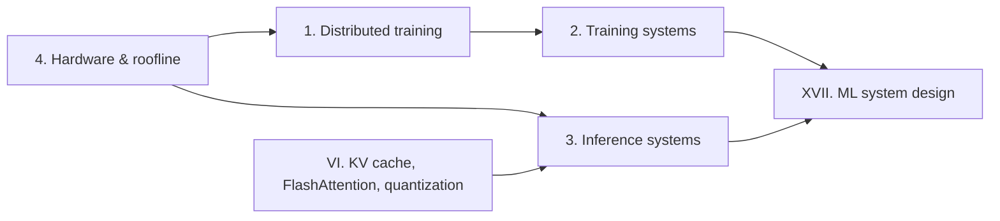

# Part XIV — Systems

> **Why this matters at staff level.** Every frontier-lab and autonomy interview loop now has a
> round where the interviewer hands you a model, a fleet of accelerators and a latency target and
> asks you to make the numbers work. Systems is where a senior perception or platform engineer's
> background becomes an unfair advantage: you already think in bytes, bandwidths and queues. This
> part turns that instinct into the specific derivations (16 bytes per parameter, $2(N-1)/N$,
> $(p-1)/(m+p-1)$, the ridge point) that interviewers listen for.

## What is in this part

| Chapter | The question it answers | Signature derivations and code |
|---|---|---|
| [Distributed training](01-distributed-training.md) | How do you fit and train a 7B / 70B / 405B model on many GPUs? | 16 B/param, Korthikanti activation formula, ring all-reduce, Megatron TP with two all-reduces per block, pipeline bubble, ZeRO-1/2/3 vs FSDP, 3D/4D composition; `memory_calc.py`, `tensor_parallel_toy.py`, `ddp_example.py`, `pipeline_calc.py` |
| [Training systems](02-training-systems.md) | What keeps a month-long run alive and fast? | Input pipelines, gradient accumulation, mixed precision, activation checkpointing, checkpoint cadence vs MTBF, MFU from $6ND$, loss spikes; `mfu.py`, `grad_accumulation.py`, `activation_checkpointing_calc.py` |
| [Inference systems](03-inference-systems.md) | How do you serve a model within an SLO at the lowest cost per token? | Prefill vs decode arithmetic intensity, TTFT/TPOT, continuous batching, speculative decoding acceptance rule, capacity planning; `inference_metrics.py`, `speculative_decoding.py`, `continuous_batching_sim.py` |
| [Hardware, memory & roofline](04-hardware-memory-roofline.md) | Why is this kernel slow, and what would make it fast? | Roofline and ridge point, GPU/TPU architecture, memory hierarchy, FLOPs accounting, tensor-core shape rules; `roofline.py`, `flops.py` |

## Prerequisites

* [Attention mathematics](../part05-sequence-transformers/03-attention-mathematics.md) and
  [Transformer architectures](../part05-sequence-transformers/04-transformer-architectures.md):
  you need the shapes $(B, T, d)$, $(H, T, d_\text{head})$ and the four matmuls per block in your fingers.
* [Efficient attention & KV cache](../part06-llm-training/04-efficient-attention-kv-cache.md)
  (FlashAttention, paged KV cache) and [Quantization](../part06-llm-training/05-quantization.md).
  This part links to those chapters rather than repeating them.
* [Scaling laws](../part06-llm-training/02-scaling-laws.md) for $C \approx 6ND$.
* Comfort with back-of-envelope arithmetic in GB, TB/s and TFLOP/s.

## If you have one day

1. **Morning (3 h).** Chapter 1, sections 1–3: derive 16 bytes/param and the activation formula,
   then run `pytest tests/test_systems_memory_calc.py tests/test_systems_tensor_parallel.py -q`
   and re-implement `training_memory_per_gpu` and `tensor_parallel_mlp` from memory.
2. **Early afternoon (2 h).** Chapter 4, sections 1–2 (roofline) then Chapter 3, sections 1–2
   (prefill vs decode). Be able to say why decode at batch 1 is memory-bound and where the
   batch-size ridge sits on an H100.
3. **Late afternoon (2 h).** Chapter 3 section 2.3 (speculative decoding acceptance rule) and
   Chapter 2 section 2 (MFU from $6ND$, gradient accumulation, checkpoint cadence).
4. **Evening (1 h).** The TL;DR cards of all four chapters and the interview questions in
   Chapter 1 §6 and Chapter 3 §6, answered aloud.

## How the four chapters connect

Read the roofline chapter first if you have never placed a kernel on a roofline: the other
three chapters use "memory-bound" and "compute-bound" as everyday words.
