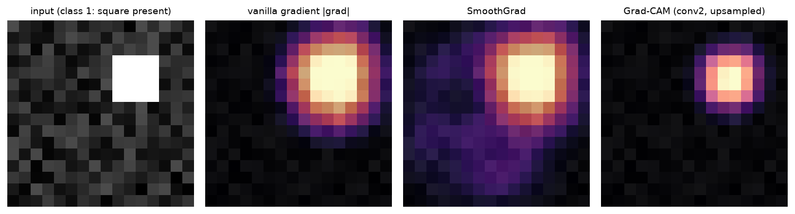
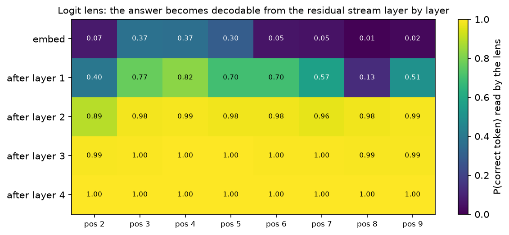
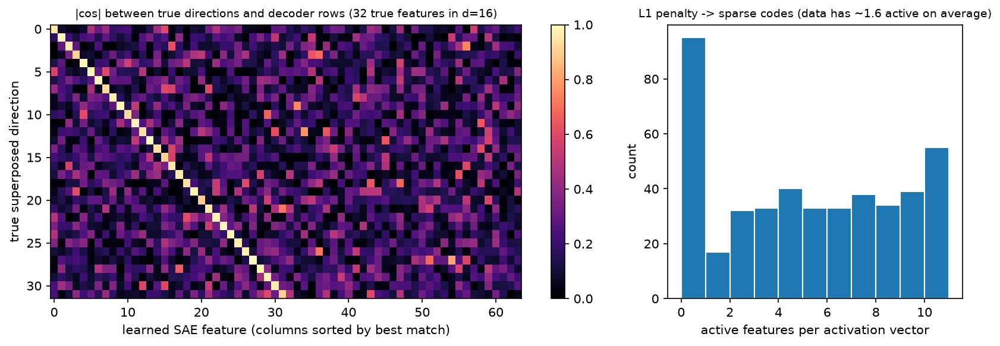

# Interpretability

> **Why this matters at staff level.** Interpretability shows up in interviews as a debugging
> question: a detector misses pedestrians in one intersection, a classifier's accuracy drops on a
> new camera, an LLM gives a confidently wrong answer. The strong answer names a specific method,
> says what it can and cannot establish, and gives the experiment that would settle the question.
> Correlational tools (saliency, attention maps) suggest hypotheses; causal tools (patching,
> ablation) test them. Knowing which is which is the signal.

## TL;DR: the interview card

- **Vanilla saliency** is $\partial f_c / \partial x$. It is noisy because the gradient is local
  and the model is piecewise linear. **SmoothGrad** averages it over $n$ Gaussian-perturbed copies.
- **Integrated gradients** satisfies **completeness**:
  $\sum_i \text{IG}_i(x) = f(x) - f(x')$, proved by the fundamental theorem of calculus along the
  straight path from baseline $x'$ to $x$. The baseline choice is part of the method, not a detail.
- **Grad-CAM** weights the last conv feature maps by their globally average-pooled gradients,
  $\alpha_k = \frac{1}{HW}\sum_{ij}\partial y_c/\partial A_{kij}$, then takes
  $\text{ReLU}(\sum_k \alpha_k A_k)$ and upsamples.
- **Attention weights are not explanations.** Attention can be altered substantially without
  changing predictions (Jain & Wallace), and the debate that followed (Wiegreffe & Pinter) settled
  on: attention is one component of a computation, so treat it as a hypothesis generator.
- **Probing** trains a classifier on frozen activations. High probe accuracy shows information is
  *present and linearly decodable*, not that the model *uses* it. Control tasks separate the two.
- **Logit lens** reads the residual stream at each layer through the final norm and unembedding,
  giving the model's intermediate guess at every depth.
- **Activation patching** copies one activation from a clean run into a corrupted run and measures
  recovery. This is a causal intervention, and it localises behaviour to (layer, position).
- **Sparse autoencoders** learn an overcomplete dictionary with an L1 penalty,
  $L = \|x - \hat x\|^2 + \lambda\|f\|_1$, to decompose superposed activations into
  sparsely-active features. Anthropic scaled this to Claude 3 Sonnet in "Scaling Monosemanticity".
- **Induction heads** are the canonical discovered circuit: a previous-token head feeding a head
  that attends to what followed the current token last time, implementing `[A][B] ... [A] -> [B]`.

## 1. Intuition first

Take a linear model, $f(x) = w^\top x + b$ with $x \in \R^3$, $w = (2, -1, 0.5)$, and an input
$x = (1, 3, 4)$. Ask which input caused the output.

There are three defensible answers and they disagree:

* **Gradient**: $\partial f/\partial x = (2, -1, 0.5)$. Feature 1 has the largest sensitivity.
  This tells you what happens if you wiggle an input, and nothing about what the input contributed.
* **Gradient times input**: $(2, -3, 2)$. Feature 2 contributes most in magnitude, negatively.
* **Contribution relative to a baseline** $x' = (0,0,0)$: $w \odot (x - x') = (2, -3, 2)$, and
  these sum to $f(x) - f(x') = 1$, so the attribution accounts for the whole change in output.

For a linear model the last two coincide, and the third is integrated gradients. For a nonlinear
model they separate, and the disagreement is the whole subject. A saturated ReLU unit has zero
gradient at $x$ yet may be the reason the output is large, so a pure-gradient method assigns it
nothing. That failure motivates path methods.

The second idea to hold on to is the difference between *reading* and *intervening*. If you read
an attention map and see that a head attends from "it" to "the dog", you have a correlation. If
you copy that head's output from a run where the sentence says "the dog" into a run where it says
"the car", and the model's prediction flips accordingly, you have shown the head carries that
information. Attribution answers "what is associated with the output"; patching answers "what
changes the output".

Third: modern models put more features into a layer than it has dimensions, a phenomenon called
superposition. With $d = 16$ dimensions and 32 underlying features that are each rarely active,
a network can encode all 32 as near-orthogonal directions and tolerate the interference. Reading
a single neuron then gives you a mixture of unrelated concepts (polysemanticity). Sparse
autoencoders exist to undo that mixing.

## 2. The math

### 2.1 Saliency and SmoothGrad

For class score $f_c$ (pre-softmax, because the softmax couples classes and makes the gradient
depend on competitors):

$$
S_\text{vanilla}(x) = \frac{\partial f_c}{\partial x}, \qquad
S_\text{smooth}(x) = \frac{1}{n}\sum_{i=1}^{n} \frac{\partial f_c}{\partial x}\bigg|_{x + \epsilon_i},\quad \epsilon_i \sim \mathcal N(0, \sigma^2 I)
$$

SmoothGrad works because a ReLU network is piecewise linear: the gradient is constant inside a
linear region and jumps at boundaries, so it fluctuates rapidly as a function of $x$. Averaging
over a neighbourhood of width $\sigma$ estimates a locally smoothed sensitivity. The usual
reporting choice, $\sigma / (x_\max - x_\min) \in [0.1, 0.2]$ and $n \approx 50$, comes from the
original paper.

To visualise, collapse channels with $\max_c |\nabla_{x}|$ and normalise to $[0,1]$.

### 2.2 Integrated gradients and the completeness axiom

Sundararajan, Taly and Yan (2017) asked which axioms an attribution method should satisfy and
showed that path methods are forced by them. Define the straight-line path
$\gamma(t) = x' + t(x - x')$ for $t \in [0,1]$ and

$$
\boxed{\;\text{IG}_i(x) = (x_i - x'_i)\int_0^1 \frac{\partial f\big(x' + t(x-x')\big)}{\partial x_i}\,dt\;}
$$

**Completeness.** Sum over coordinates and apply the chain rule to $g(t) = f(\gamma(t))$:

$$
\sum_i \text{IG}_i(x) = \int_0^1 \sum_i \frac{\partial f(\gamma(t))}{\partial x_i}\,(x_i - x'_i)\,dt
= \int_0^1 \frac{d}{dt}f(\gamma(t))\,dt = f(x) - f(x')
$$

$$
\boxed{\;\sum_i \text{IG}_i(x) = f(x) - f(x')\;}
$$

The attributions account for exactly the change in output between baseline and input. Two other
axioms come free from the path formulation: **sensitivity** (if $x$ and $x'$ differ in one feature
and the outputs differ, that feature gets nonzero attribution, which plain gradients violate at
saturation) and **implementation invariance** (two networks computing the same function get the
same attributions, which methods that inspect internal structure violate).

In practice you approximate the integral with $m$ Riemann steps. Using the midpoint rule,
$t_k = (k - \tfrac12)/m$, the completeness gap falls roughly as $m^{-2}$: the implementation here
gives gaps of $6.0\times10^{-4}$, $3.2\times10^{-5}$, $1.9\times10^{-6}$ and $1.0\times10^{-7}$ at
$m = 4, 16, 64, 256$ on a small tanh network. Report the gap; a large one means too few steps or a
badly chosen baseline.

**The baseline is a modelling choice.** A black image encodes "absence of signal" for natural
images but assigns zero attribution to genuinely black pixels. Alternatives: a blurred version of
the input, the dataset mean, Gaussian noise, or an average over several baselines. State which one
you used, because the attribution is defined relative to it.

### 2.3 Grad-CAM

Let $A \in \R^{K \times H' \times W'}$ be the last convolutional feature maps and $y_c$ the class
score. Grad-CAM (Selvaraju et al. 2017) defines

$$
\alpha_k = \frac{1}{H'W'}\sum_{i,j}\frac{\partial y_c}{\partial A_{k,i,j}}, \qquad
\boxed{\;L^c_\text{Grad-CAM} = \text{ReLU}\!\left(\sum_k \alpha_k A_k\right)\;}
$$

The derivation that makes this more than a heuristic: for an architecture ending in global average
pooling followed by a linear layer, $y_c = \sum_k w_{ck}\,\frac{1}{H'W'}\sum_{ij}A_{kij}$, so
$\partial y_c/\partial A_{kij} = w_{ck}/(H'W')$ and therefore $\alpha_k \propto w_{ck}$. Grad-CAM
reduces to class activation mapping (CAM) for that architecture, and generalises it to any
architecture by using the pooled gradient in place of the weight.

The ReLU keeps only evidence *for* class $c$: negative contributions belong to other classes. The
map has the spatial resolution of the chosen layer (7×7 for a standard ResNet on 224×224 inputs),
which is why Grad-CAM localises objects but not edges, and why people combine it with a
pixel-space method (guided backprop) when they want detail.

### 2.4 Attention maps, and what they do not show

A tempting reading of $\alpha_{ij} = \softmax(q_i^\top k_j/\sqrt{d_k})_j$ is that token $j$
explains the output at position $i$. Jain and Wallace (2019) showed that for several
classification models you can find alternative attention distributions that produce nearly the
same prediction, and that attention weights correlate poorly with gradient-based importance.
Wiegreffe and Pinter (2019) replied that the claim depends on what "explanation" is asked to mean,
and that adversarial attention distributions found by direct optimisation do not show attention is
uninformative about the model as trained.

The working position for an engineer: attention says where information could flow, not what the
model did with it. Three concrete failure modes. Attention is one of several paths (the residual
stream carries information past attention entirely). Softmax forces mass to sum to one, so heads
with nothing to do dump mass on a "sink" token such as the first position. Value vectors can be
near zero, in which case a large weight moves nothing. Test the hypothesis by ablating or patching
the head.

### 2.5 Probing classifiers

Freeze the model, take activations $h \in \R^d$ at some layer, train a small classifier
$g_\theta(h)$ to predict a property (part of speech, object colour, whether the agent is in a
corridor). Accuracy above a control tells you the property is linearly decodable there.

Two controls make a probe a real experiment. A **control task** (Hewitt & Liang 2019) assigns the
same inputs random labels of the same distribution; a powerful probe learns that too, so report
selectivity, the accuracy gap between the real task and the control. A **random-features control**
probes an untrained network of the same shape, which often does better than people expect.

A probe establishes availability. It does not establish use: the model can encode a property in
its activations and never read it. Pair the probe with an intervention (patch or ablate the
direction and check the output changes) before claiming the model relies on it.

### 2.6 The logit lens

Write a pre-norm decoder's forward pass as a residual stream:

$$
h_0 = E[\text{tokens}] + P, \qquad h_{l+1} = h_l + \text{Attn}_l(\text{LN}(h_l)) + \text{MLP}_l(\text{LN}(h_l))
$$

Every block *adds* to $h$, so $h_l$ lives in the same space at every depth and can be decoded with
the model's own final norm and unembedding:

$$
\boxed{\;\text{logits}_l = \text{LN}_f(h_l)\,W_U\;}
$$

This gives the model's intermediate prediction after each layer. On the copy task used here
(predict the token two positions back), the probability of the correct token read from the lens
goes $0.02 \to 0.51 \to 0.99 \to 0.99 \to 1.00$ across embedding and four layers: the computation
finishes early and later layers refine.

The caveat is that $W_U$ was trained to read $h_L$, not $h_l$. Intermediate representations may be
in a different basis, which is why later variants (tuned lens) learn an affine map per layer
before unembedding. A flat or nonsense lens trajectory can mean the model computes late, or that
the lens is mis-calibrated for that layer.

### 2.7 Activation patching and causal tracing

Take a **clean** input and a **corrupted** input that differ in the fact you care about. Run both.
Then run the corrupted input again, but overwrite activation $(l, t)$ with the value it had in the
clean run, and measure

$$
\boxed{\;\text{recovery}(l,t) = \frac{m(\text{patched}) - m(\text{corrupt})}{m(\text{clean}) - m(\text{corrupt})}\;}
$$

with $m$ a scalar behaviour metric, usually the logit difference between the correct answer and a
distractor at the final position. A recovery near 1 means the information needed to restore the
clean behaviour was in that single activation; near 0 means it was not.

Two sanity checks anchor the map. Patching $h_L$ at the final position always gives recovery 1,
because that *is* the clean run's final state. Patching positions the corruption never touched
gives 0. Everything in between is signal: in the small model here, patching the embedding at the
corrupted position gives 1.00, and at the middle layer the recovery splits between the corrupted
position (0.58) and the final position (0.47), showing the information has begun moving forward.

Meng et al. (2022) used this design (noising the subject tokens, then restoring individual hidden
states) to localise factual associations to mid-layer MLPs at the subject's last token, then built
a weight edit (ROME) on that localisation. The general lesson: patching gives a necessary-and-
sufficient-style claim about a specific activation for a specific behaviour, on a specific input
distribution. It does not generalise beyond the prompts you tested.

### 2.8 Superposition and sparse autoencoders

If a layer of width $d$ represents $F \gg d$ features that are individually rare, it can store them
as $F$ near-orthogonal directions with small interference. Individual neurons then respond to
unrelated concepts. To recover the features, learn an overcomplete dictionary with a sparsity
penalty:

$$
f(x) = \text{ReLU}\big((x - b_\text{dec})W_\text{enc} + b_\text{enc}\big) \in \R^F, \qquad
\hat x = f(x)W_\text{dec} + b_\text{dec}
$$

$$
\boxed{\;L = \underbrace{\|x - \hat x\|_2^2}_{\text{reconstruction}} + \lambda\underbrace{\|f(x)\|_1}_{\text{sparsity}}, \quad \|W_\text{dec},_k\|_2 = 1\;}
$$

Three design points carry the method. The decoder rows are constrained to unit norm, otherwise the
model shrinks $f$ and grows $W_\text{dec}$ to reduce the L1 term without becoming sparser. The
encoder subtracts $b_\text{dec}$ so the dictionary is centred. $\lambda$ sets the point on the
reconstruction-sparsity frontier, and it is the hyperparameter that matters: in the toy setup here
(16 dimensions, 32 true features, 5 % active), $\lambda = 0.02$ recovers features at mean cosine
0.66, while $\lambda = 0.2$ reaches 0.93 with a worse reconstruction loss.

Evaluation of an SAE is unsettled. Reconstruction error and L0 (average number of active features)
are the standard pair, plus the fraction of "dead" features that never fire, plus downstream loss
when the reconstruction is spliced back into the model. In a toy setting you can do better,
because the ground-truth directions are known: measure the best cosine between each true direction
and any learned decoder row.

## 3. Implementation

### 3.1 Integrated gradients

```python
def integrated_gradients(model, x, baseline, target, steps=64):
    alphas = (torch.arange(steps, dtype=x.dtype) + 0.5) / steps        # (m,) midpoint rule
    delta = x - baseline                                               # same shape as x
    path = baseline.unsqueeze(0) + alphas.view(-1, *([1] * x.dim())) * delta.unsqueeze(0)  # (m, *x.shape)
    path = path.detach().requires_grad_(True)
    scores = model(path)[:, target].sum()                              # scalar, summed over path points
    (grads,) = torch.autograd.grad(scores, path)                       # (m, *x.shape)
    return delta * grads.mean(dim=0)                                   # same shape as x
```

The whole path is one batch, so the $m$ gradient evaluations happen in a single backward pass.
Summing the scores before differentiating is safe because path point $k$'s score depends only on
path point $k$, so the gradient of the sum is the stack of individual gradients.

The test checks the property, not a value: for a linear model IG must equal $w_c \odot (x - x')$
exactly, and on a nonlinear network the completeness gap must shrink with more steps and reach
$10^{-3}$ or better at 256 steps.

### 3.2 Grad-CAM

```python
def grad_cam(model, x, target):
    A = model.features(x.unsqueeze(0))                     # (1, K, H', W') last conv maps
    A.retain_grad()
    score = model.head(A)[0, target]                       # scalar class logit
    (dA,) = torch.autograd.grad(score, A)                  # (1, K, H', W')
    alpha = dA.mean(dim=(2, 3), keepdim=True)              # (1, K, 1, 1) pooled gradients
    cam = F.relu((alpha * A).sum(dim=1, keepdim=True))     # (1, 1, H', W')
    cam = F.interpolate(cam, size=x.shape[-2:], mode="bilinear", align_corners=False)  # (1, 1, H, W)
    cam = cam[0, 0].detach()                               # (H, W)
    return cam / (cam.max() + 1e-12)
```

Splitting `TinyCNN` into `features` and `head` avoids hooks and makes the derivation visible:
`head` is exactly global-average-pool then linear, so you can check by hand that
$\alpha_k = w_{ck}/(H'W')$ for this model.

Testing a visualisation needs a model whose answer you know, so the test hand-sets the weights to
build a detector (conv channel 0 copies the input, `fc` reads channel 0 into class 1), places a
bright blob in the top-right of an 8×8 image, and asserts the CAM exceeds 0.9 inside the blob and
falls below 0.1 in the opposite corner.

{ width="900" }

*A tiny CNN trained to detect a bright square. Vanilla gradients are scattered over the whole
image, SmoothGrad concentrates them, and Grad-CAM produces a coarse blob at the square's location.
The resolution difference between the pixel-space methods and Grad-CAM is the method's main
limitation.*

### 3.3 Logit lens

```python
def residuals(self, tokens):
    B, T = tokens.shape
    h = self.embed(tokens) + self.pos(torch.arange(T))     # (B, T, d)
    hs = [h]
    for block in self.blocks:
        h = block(h)                                       # (B, T, d) each block adds to the stream
        hs.append(h)
    return hs

def logit_lens(model, tokens):
    with torch.no_grad():
        return torch.stack([model.unembed(model.ln_f(h)) for h in model.residuals(tokens)])  # (L+1, B, T, V)
```

`TinyResidualLM` is a pre-norm decoder with single-head attention written out as three separate
projections, so the residual stream is explicit. The test asserts `logit_lens(...)[-1]` equals
`model(tokens)`, which is the consistency check that the lens is reading the same pathway the
model uses, and then that a trained model's lens trajectory rises with depth and ends above 0.5.

{ width="800" }

*Probability of the correct token read from the residual stream after each layer, for each
position. The model solves the copy task by layer 2 at most positions; positions near the start
lack the context to solve it at all.*

### 3.4 Activation patching

```python
def forward_with_patch(model, tokens, layer, position, replacement):
    T = tokens.shape[1]
    h = model.embed(tokens) + model.pos(torch.arange(T))   # (1, T, d)
    if layer == 0:
        h = _patch(h, position, replacement)
    for l, block in enumerate(model.blocks, start=1):
        h = block(h)                                       # (1, T, d)
        if l == layer:
            h = _patch(h, position, replacement)           # overwrite one (position, d) vector
    return model.unembed(model.ln_f(h))                    # (1, T, V)
```

Re-running the forward pass with an explicit patch is clearer than registering hooks and is fast
enough at this size: `patching_map` runs $(L+1)\times T$ forward passes to fill the grid. For a
real model you would use hooks and batch the patches.

The test encodes the two anchors from §2.7: patching $h_L$ at the last position gives recovery
1.0, and patching a clean activation into the clean run changes nothing.

### 3.5 Sparse autoencoder

```python
class SparseAutoencoder(nn.Module):
    def __init__(self, d, n_features):
        super().__init__()
        self.W_dec = nn.Parameter(torch.randn(n_features, d))          # (F, d)
        self.b_dec = nn.Parameter(torch.zeros(d))                      # (d,)
        self.normalize_decoder()
        # Tied initialisation W_enc = W_dec^T: each feature starts by detecting its own direction.
        self.W_enc = nn.Parameter(self.W_dec.data.T.clone())           # (d, F)
        self.b_enc = nn.Parameter(torch.zeros(n_features))             # (F,)

    def encode(self, x):
        return F.relu((x - self.b_dec) @ self.W_enc + self.b_enc)      # (B, F)

    def decode(self, f):
        return f @ self.W_dec + self.b_dec                             # (B, d)

def sae_loss(x, x_hat, f, l1_coeff):
    recon = ((x - x_hat) ** 2).sum(dim=1).mean()                       # scalar
    sparsity = f.abs().sum(dim=1).mean()                               # scalar
    return recon + l1_coeff * sparsity
```

`train_sae` re-normalises the decoder after every optimizer step, which is the cheap way to
enforce the unit-norm constraint (the alternative is to project the gradient onto the tangent
space of the sphere).

Writing this test taught me something worth repeating. The first version seeded the data generator
and the model with the same value, so `torch.randn(32, 16)` for the true directions and the first
32 rows of `torch.randn(64, 16)` for the decoder drew identical numbers, and feature recovery was
1.0 before any training. The test now uses a different seed for the data and asserts
`before < 0.8`, so the collision cannot come back silently. Random 16-dimensional directions have
a best-of-64 cosine around 0.59, which is the number the assertion is calibrated against.

{ width="900" }

*Left: absolute cosine between each of the 32 true directions and the 64 learned decoder rows,
columns sorted so the best match is on the diagonal. Right: the number of features active per
input, showing the L1 penalty produced a sparse code.*

??? example "Full implementation: `src/mlbook/interp/integrated_gradients.py`"
    ```python
    --8<-- "src/mlbook/interp/integrated_gradients.py"
    ```

??? example "Full implementation: `src/mlbook/interp/saliency.py` and `gradcam.py`"
    ```python
    --8<-- "src/mlbook/interp/saliency.py"
    ```
    ```python
    --8<-- "src/mlbook/interp/gradcam.py"
    ```

??? example "Full implementation: `src/mlbook/interp/logit_lens.py` and `activation_patching.py`"
    ```python
    --8<-- "src/mlbook/interp/logit_lens.py"
    ```
    ```python
    --8<-- "src/mlbook/interp/activation_patching.py"
    ```

??? example "Full implementation: `src/mlbook/interp/sparse_autoencoder.py`"
    ```python
    --8<-- "src/mlbook/interp/sparse_autoencoder.py"
    ```

**How you'd test it.** Attribution methods against closed forms on linear models (IG equals
$w \odot (x - x')$, vanilla saliency equals $w_c$); completeness gap shrinking with steps;
Grad-CAM localisation on a hand-built detector; logit lens final layer equal to the model output;
patching recovery equal to 1 at the two anchors; SAE recovery against known ground-truth
directions with a pre-training baseline assertion.

## Retype by hand

| Symbol | File | Retype from memory? | Target time |
|---|---|---|---|
| `integrated_gradients`, `completeness_gap` | `src/mlbook/interp/integrated_gradients.py` | **Yes**, integrated gradients | 10 minutes |
| `grad_cam` | `src/mlbook/interp/gradcam.py` | **Yes**, Grad-CAM including the pooled gradient | 10 minutes |
| `vanilla_gradient`, `smoothgrad`, `saliency_map` | `src/mlbook/interp/saliency.py` | **Yes** | 5 minutes |
| `SparseAutoencoder.encode/decode`, `sae_loss` | `src/mlbook/interp/sparse_autoencoder.py` | **Yes**, the SAE objective and the unit-norm constraint | 15 minutes |
| `logit_lens`, `TinyResidualLM.residuals` | `src/mlbook/interp/logit_lens.py` | **Yes**, the residual-stream loop and the lens | 10 minutes |
| `forward_with_patch`, `patching_map` | `src/mlbook/interp/activation_patching.py` | **Yes**, the recovery metric | 15 minutes |
| `TinyCNN`, `Block`, `CausalSelfAttention`, `make_superposition_data`, `train_sae`, `feature_recovery` | same files | Read and understand | |

Checks: `pytest tests/test_interp_integrated_gradients.py tests/test_interp_gradcam.py tests/test_interp_saliency.py tests/test_interp_sae.py tests/test_interp_logit_lens.py tests/test_interp_activation_patching.py -q`.

## 4. Systems view: cost, failure modes, trade-offs

| Method | Cost | Establishes | Breaks when |
|---|---|---|---|
| Vanilla saliency | 1 backward pass | local sensitivity | saturation, piecewise-linear noise |
| SmoothGrad | $n$ backward passes (32 to 50) | smoothed sensitivity | $\sigma$ mis-set for the input scale |
| Integrated gradients | $m$ forward+backward (32 to 300) | contribution relative to a baseline | baseline is unrepresentative |
| Grad-CAM | 1 forward + 1 backward | coarse spatial evidence for a class | resolution too low; non-conv architectures |
| Probing | training a small classifier | information is linearly decodable | no control task, so probe capacity confounds |
| Logit lens | $L$ unembeddings, no training | intermediate predictions | basis mismatch at early layers |
| Activation patching | $O(L \cdot T)$ forward passes | causal role of an activation | conclusions limited to the tested prompts |
| Sparse autoencoders | a training run per layer, plus large activation datasets | a sparse feature decomposition | $\lambda$ mis-set, dead features, no ground truth to check against |

**The sanity checks that should be reflexive.** Adebayo et al. (2018) showed that several popular
saliency maps look essentially unchanged when you randomise the model's weights, or randomise the
training labels, which means those maps were partly reflecting the input's edges rather than the
model. Run both randomisation tests on any attribution method before you trust it in a report.
This is the single most useful negative result in the field for a practitioner.

**What interpretability buys in production.**

* *Debugging perception models.* A detector that fails on one intersection: Grad-CAM over the
  failing frames shows whether the model keys on the object or on background context. Follow with
  an intervention (paste the object onto other backgrounds) to confirm.
* *Shortcut and bias audits.* Probes and attributions locate reliance on a spurious attribute;
  the audit then needs a counterfactual test set, because attribution alone does not quantify
  the effect on decisions.
* *Data quality.* Attribution concentrated on a watermark, a border artefact, or a sensor
  timestamp is usually a dataset problem, not a model problem.
* *Model cards and documentation.* Model cards (Mitchell et al. 2019) ask for intended use,
  evaluation by subgroup, and known limitations. Interpretability supplies the evidence for the
  limitations section.
* *Feature steering and monitoring.* Once SAE features are labelled, activating or suppressing one
  gives a behavioural test, and monitoring a safety-relevant feature gives a runtime signal.

**Costs to state honestly.** SAEs require a training run per layer on a large activation dump,
which for a frontier model is a serious compute commitment. Patching scales as layers times
positions per prompt. Attribution methods produce a picture, and pictures invite over-reading,
which is why the strongest production use pairs every attribution with an intervention that would
falsify it.

## 5. In production

!!! production "Anthropic: Towards Monosemanticity (2023)"
    Problem: individual neurons in a transformer respond to unrelated concepts, so neuron-level
    interpretation fails. Built: a sparse autoencoder on the MLP activations of a one-layer
    transformer, producing thousands of features that are far more monosemantic than neurons,
    with evidence from feature activations, causal effects on outputs, and the ability to steer
    behaviour by activating features. Rejected: neuron-level analysis, on the grounds that
    superposition makes it the wrong unit.
    *Source: Bricken et al., "Towards Monosemanticity: Decomposing Language Models With Dictionary
    Learning", Transformer Circuits Thread, 2023.*

!!! production "Anthropic: Scaling Monosemanticity (2024)"
    Problem: does dictionary learning work on a production model. Built: SAEs on Claude 3 Sonnet's
    middle-layer residual stream, extracting millions of features including abstract and
    multilingual ones, and multimodal features that fire on both text and images. They showed
    causal influence by clamping features and observing behaviour change, including safety-relevant
    features. The paper is the reference for "interpretability at production scale" and for the
    honest limitations section (feature completeness, cost, evaluation).
    *Source: Templeton et al., "Scaling Monosemanticity: Extracting Interpretable Features from
    Claude 3 Sonnet", Transformer Circuits Thread, 2024.*

!!! production "Anthropic: induction heads and in-context learning (2022)"
    Problem: where does in-context learning come from. Built: a circuit-level account of induction
    heads, pairs of attention heads that implement "find the previous occurrence of the current
    token and copy what followed it", together with evidence that their formation coincides with a
    visible bump in the training loss curve and with the onset of in-context learning. This is the
    strongest existing example of a discovered mechanism tied to a capability.
    *Sources: Elhage et al., "A Mathematical Framework for Transformer Circuits", 2021;
    Olsson et al., "In-context Learning and Induction Heads", 2022, arXiv:2209.11895.*

!!! production "Google: model cards, and interpretability as documentation"
    Problem: models were shipped without a standard statement of intended use and evaluated
    performance across groups. Built: model cards, a short structured document covering intended
    use, out-of-scope use, disaggregated evaluation, and ethical considerations, now a common
    requirement in regulated deployments. Interpretability results are what populate the
    limitations and failure-mode sections.
    *Source: Mitchell et al., "Model Cards for Model Reporting", FAT* 2019, arXiv:1810.03993.*

!!! production "Google Brain: sanity checks for saliency maps (2018)"
    Problem: saliency methods were being adopted without validation. Built: two randomisation
    tests (randomise model weights layer by layer; randomise training labels) and showed several
    widely used methods produce nearly unchanged maps under both, meaning they act partly as edge
    detectors independent of the learned function. The practical consequence is that these two
    tests are now the minimum bar before publishing an attribution result.
    *Source: Adebayo et al., "Sanity Checks for Saliency Maps", NeurIPS 2018, arXiv:1810.03292.*

## 6. Interview questions and strong answers

!!! interview "Derive the completeness axiom for integrated gradients and say why it matters."
    Define $g(t) = f(x' + t(x-x'))$. Then $g'(t) = \sum_i \partial_i f(\gamma(t))\,(x_i - x'_i)$,
    and $\int_0^1 g'(t)dt = g(1) - g(0) = f(x) - f(x')$. The left side is exactly
    $\sum_i \text{IG}_i(x)$, so the attributions sum to the change in output between baseline and
    input. Completeness makes attributions comparable and auditable: you can say "these five
    pixels account for 80 % of the logit difference from a black image" and the remaining 20 % is
    accounted for elsewhere, instead of reporting an unnormalised heatmap. It also gives
    you a diagnostic, since the residual gap measures the Riemann approximation error.
    **Staff follow-up:** "what does completeness *not* buy you?" It says nothing about whether the
    baseline is meaningful. With a black baseline, genuinely black pixels get zero attribution by
    construction, so a model that relies on dark regions will look like it relies on nothing there.

!!! interview "Is attention an explanation?"
    Treat attention as a hypothesis, then test it causally. Jain and Wallace showed that for
    several classification models you can construct different attention distributions that leave
    predictions nearly unchanged, and that attention correlates poorly with gradient-based
    importance; Wiegreffe and Pinter argued the conclusion depends on the definition of
    explanation and that adversarially constructed distributions do not describe the trained model.
    Mechanistically there are clear reasons for the gap: the residual stream routes information
    around attention, softmax forces the weights to sum to one so idle heads park mass on a sink
    token, and a large weight on a near-zero value vector moves nothing. The experiment that
    settles a specific claim is ablating or patching the head and measuring the behaviour change.
    **Follow-up:** "so what do you do with attention maps?" Use them to generate candidates for
    patching, and to communicate with non-specialists once a causal test supports the story.

!!! interview "A pedestrian detector fails at one intersection. How do you use interpretability to debug it?"
    First separate data from model: collect the failing frames and check whether similar frames
    exist in training. Then run Grad-CAM on the failures and on nearby successes; if the successes
    key on the pedestrian and the failures key on a background region, that is a hypothesis about
    a spurious cue. Test it with interventions rather than more heatmaps: paste the pedestrians
    onto other backgrounds, and paste that background behind pedestrians elsewhere. If the failure
    follows the background, the model learned a shortcut and the fix is data (targeted collection,
    augmentation) rather than architecture. Run the two sanity checks (weight randomisation, label
    randomisation) on the attribution method before trusting the picture at all.
    **Follow-up:** "how do you turn this into a regression test?" Freeze the counterfactual set as
    a slice in the evaluation suite and track it per release, so the shortcut cannot silently
    return.

!!! interview "What is superposition and what do sparse autoencoders do about it?"
    A layer of width $d$ can represent many more than $d$ features when each feature is rarely
    active, by placing them along near-orthogonal directions and tolerating interference. The cost
    is that a single neuron responds to unrelated concepts, so neuron-level interpretation fails.
    An SAE learns an overcomplete dictionary with an L1 penalty,
    $L = \|x - \hat x\|^2 + \lambda\|f\|_1$ with unit-norm decoder rows, so the code is sparse and
    each learned direction can be a single concept. Anthropic scaled this from a one-layer model
    to Claude 3 Sonnet, extracting millions of features and demonstrating causal effect by clamping
    them. **Follow-up:** "how do you know the features are real and not artefacts of the L1?" In a
    toy setting compare against known ground-truth directions; on a real model the available
    evidence is reconstruction error at a given L0, downstream loss when splicing the
    reconstruction back in, dead-feature fraction, and above all the causal test of clamping a
    feature and observing the predicted behaviour change.

!!! interview "Explain activation patching, and what a recovery of 0.6 at (layer 8, position 4) means."
    Run a clean and a corrupted prompt that differ in one fact, then re-run the corrupted prompt
    with the clean value of one activation and measure
    $(m_\text{patched} - m_\text{corrupt})/(m_\text{clean} - m_\text{corrupt})$ where $m$ is the
    logit difference between the right answer and a distractor. A recovery of 0.6 says that
    activation carries a majority of the information needed to restore clean behaviour, but not
    all of it, so the computation is distributed across several sites or the patch site is
    upstream of a split. Next steps: patch pairs of sites to check for redundancy, patch
    attention-head outputs rather than the whole residual to localise further, and repeat over many
    prompt pairs since the claim holds only on the distribution tested.
    **Follow-up:** "what are your controls?" Patching $h_L$ at the final position must give exactly
    1, patching untouched positions must give 0, and patching clean-into-clean must change nothing.

!!! interview "You have a probe that reads 'distance to the lead vehicle' from a planner's hidden state at 92 % accuracy. What have you shown?"
    That the quantity is present and linearly decodable at that layer, nothing more. Two controls
    are needed before even that claim is safe: a control task with random labels of the same
    distribution, to show the probe is not just memorising, and a probe on an untrained network of
    the same architecture, which is often surprisingly strong. To show the model *uses* the
    quantity, intervene: ablate the direction the probe found, or patch it from a scenario with a
    different lead distance, and check whether the planner's output changes in the predicted
    direction. **Follow-up:** "how would this feed a safety case?" As supporting evidence only. The
    safety argument needs behavioural evidence on a scenario suite; the probe explains a mechanism
    and helps target which scenarios to test.

## 7. Exercises

1. ★ Show that for a linear model $f(x) = w^\top x + b$ with baseline $x' = 0$, integrated
   gradients equals $w \odot x$, and verify completeness by hand.

    ??? success "Solution"
        The gradient is constant, $\partial f/\partial x_i = w_i$, so the integral evaluates to
        $w_i$ and $\text{IG}_i = (x_i - 0)w_i$. Summing gives $w^\top x = f(x) - f(0)$ since
        $f(0) = b$. The test `test_integrated_gradients_linear_model_is_w_times_delta` checks this
        to $10^{-6}$.

2. ★ A ReLU unit is saturated at zero for input $x$, yet removing it changes the output. Which
   attribution methods assign it zero, and which do not?

    ??? success "Solution"
        Vanilla gradients and gradient times input assign zero, because the local derivative is
        zero. Integrated gradients does not, because along the path from a baseline the unit is
        active for part of the interval, which is exactly the sensitivity axiom the path
        formulation was designed to satisfy.

3. ★★ Run the two sanity checks from Adebayo et al. on the `TinyCNN` in
   `figures/part15_gradcam.py`: re-randomise the weights and re-plot the saliency and Grad-CAM
   maps. Which method degrades and which does not?

    ??? success "Solution"
        Grad-CAM depends on the learned feature maps and the class weights, so its map collapses to
        noise under weight randomisation. Pixel-space gradient magnitude retains visible structure
        from the input's edges even with random weights, which is the effect the paper reports.
        Report both maps side by side; the comparison is the result.

4. ★★ Sweep the SAE's $\lambda$ over $\{0.02, 0.05, 0.1, 0.2, 0.3\}$ and plot mean feature recovery
   against reconstruction loss. Where is the knee, and what does the L0 do?

    ??? success "Solution"
        Recovery rises with $\lambda$ (0.66 at 0.02, 0.93 at 0.2, 0.96 at 0.3 in this setup) while
        reconstruction loss rises too (0.07 to 0.49), and the mean number of active features falls
        toward the true 5 % sparsity. The knee sits near $\lambda = 0.2$. Plotting recovery against
        loss traces the frontier that, on a real model, you can only see from one side.

5. ★★★ Build a two-token patching experiment on `TinyResidualLM` where the corruption is at
   position 2 and the answer depends on it, then patch *attention outputs* rather than residuals
   by modifying `forward_with_patch`. Which is more localising, and why?

    ??? success "Solution"
        Add a hook point inside `Block.forward` between the attention and MLP sublayers and patch
        `self.attn(self.ln1(h))` directly. Patching attention outputs is more localising because
        the residual stream accumulates every previous contribution, so a residual patch restores
        everything computed up to that layer, while an attention-output patch restores only that
        sublayer's contribution. The trade-off is that per-sublayer patching needs more runs and
        can miss effects that only appear in combination.

## References

Links are omitted where they could not be verified from this environment; search the exact title
and venue.

* Simonyan, K., Vedaldi, A., Zisserman, A. *Deep Inside Convolutional Networks: Visualising Image
  Classification Models and Saliency Maps.* ICLR workshop 2014. arXiv:1312.6034.
* Smilkov, D. et al. *SmoothGrad: removing noise by adding noise.* 2017. arXiv:1706.03825.
* Sundararajan, M., Taly, A., Yan, Q. *Axiomatic Attribution for Deep Networks.* ICML 2017.
  arXiv:1703.01365.
* Selvaraju, R. R. et al. *Grad-CAM: Visual Explanations from Deep Networks via Gradient-based
  Localization.* ICCV 2017. arXiv:1610.02391.
* Zhou, B. et al. *Learning Deep Features for Discriminative Localization.* CVPR 2016.
  arXiv:1512.04150 (CAM, the special case Grad-CAM generalises).
* Adebayo, J. et al. *Sanity Checks for Saliency Maps.* NeurIPS 2018. arXiv:1810.03292.
* Jain, S., Wallace, B. C. *Attention is not Explanation.* NAACL 2019. arXiv:1902.10186.
* Wiegreffe, S., Pinter, Y. *Attention is not not Explanation.* EMNLP 2019. arXiv:1908.04626.
* Hewitt, J., Liang, P. *Designing and Interpreting Probes with Control Tasks.* EMNLP 2019.
  arXiv:1909.03368.
* Meng, K. et al. *Locating and Editing Factual Associations in GPT.* NeurIPS 2022.
  arXiv:2202.05262.
* Vig, J. et al. *Investigating Gender Bias in Language Models Using Causal Mediation Analysis.*
  NeurIPS 2020.
* Elhage, N. et al. *A Mathematical Framework for Transformer Circuits.* Transformer Circuits
  Thread, 2021.
* Olsson, C. et al. *In-context Learning and Induction Heads.* Transformer Circuits Thread, 2022.
  arXiv:2209.11895.
* Bricken, T. et al. *Towards Monosemanticity: Decomposing Language Models With Dictionary
  Learning.* Transformer Circuits Thread, 2023.
* Templeton, A. et al. *Scaling Monosemanticity: Extracting Interpretable Features from Claude 3
  Sonnet.* Transformer Circuits Thread, 2024.
* Elhage, N. et al. *Toy Models of Superposition.* Transformer Circuits Thread, 2022.
  arXiv:2209.10652.
* nostalgebraist. *interpreting GPT: the logit lens.* LessWrong, 2020.
* Mitchell, M. et al. *Model Cards for Model Reporting.* FAT* 2019. arXiv:1810.03993.
