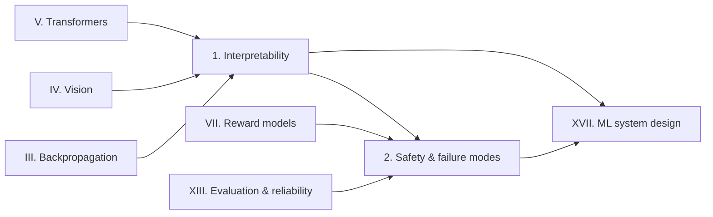

# Part XV: Interpretability & Safety

> **Why this matters at staff level.** Two questions come up in almost every senior loop once the
> modelling discussion ends: "how would you debug this model's behaviour?" and "how does this fail,
> and what stops the failure from reaching a user?". Both are answered with technique, not
> sentiment. This part gives you the attribution methods, the causal-intervention tools, and the
> attack and defence taxonomy, each with an implementation you can write at a whiteboard.

## What is in this part

| Chapter | The question it answers | Signature derivations and code |
|---|---|---|
| [Interpretability](01-interpretability.md) | Why did the model produce this output, and which part of it is responsible? | Saliency and SmoothGrad, integrated gradients and the completeness axiom, Grad-CAM, probing, logit lens, activation patching, sparse autoencoders; `saliency.py`, `integrated_gradients.py`, `gradcam.py`, `logit_lens.py`, `activation_patching.py`, `sparse_autoencoder.py` |
| [Safety & failure modes](02-safety-failure-modes.md) | How does this system get broken, and what do you build to stop it? | Distribution shift, hallucination, prompt injection as a confused deputy, jailbreaks, data poisoning and backdoors, membership inference, adversarial examples, agent permissioning, safety cases; `backdoor_demo.py`, `membership_inference.py` |

## Prerequisites

* [Backpropagation](../part03-neural-nets/02-backpropagation.md): every attribution method in
  Chapter 1 is an application of the chain rule, and integrated gradients is a path integral of it.
* [CNN architectures](../part04-vision/03-cnn-architectures.md) for Grad-CAM, and
  [attention mathematics](../part05-sequence-transformers/03-attention-mathematics.md) for the
  residual-stream view used by the logit lens and activation patching.
* [Adversarial robustness](../part13-retrieval-eval-reliability/03-uncertainty-reliability.md)
  and [evaluation](../part13-retrieval-eval-reliability/02-evaluation.md): Chapter 2 links to
  those chapters instead of restating their results.
* [Reward models](../part07-post-training/02-reward-models.md) for the reward-hacking discussion.

## If you have one day

1. **Morning (2.5 h).** Chapter 1 sections 1 to 3. Derive completeness for integrated gradients
   and Grad-CAM's pooled-gradient weighting, then run
   `pytest tests/test_interp_integrated_gradients.py tests/test_interp_gradcam.py -q` and
   rewrite both from memory.
2. **Midday (2 h).** Chapter 1 sections 2.5 to 3.5: logit lens, activation patching, sparse
   autoencoders. The patching recovery metric and the SAE objective are the two things to be
   able to write down cold.
3. **Afternoon (2.5 h).** Chapter 2 sections 1 and 2: the failure taxonomy, prompt injection as a
   confused-deputy problem, backdoors in perception, membership inference.
4. **Evening (1 h).** Chapter 2 section 4 (agent permissioning and the lethal trifecta) and both
   chapters' interview questions, answered aloud.

## How this part connects to the rest

Interpretability supplies the evidence that a safety argument needs. A claim like "the perception
stack does not key on the sign's background" is only as good as the attribution or intervention
experiment behind it, which is why Chapter 2's defences keep pointing back at Chapter 1's tools.
