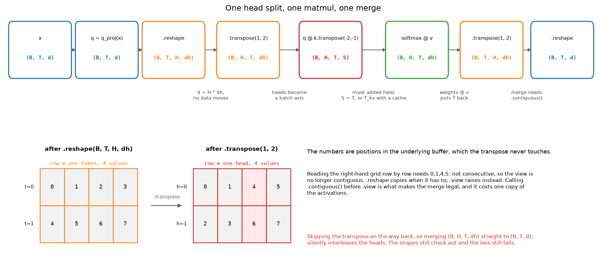

# NumPy ↔ PyTorch cheat sheet

> **Why this matters at staff level.** In a coding round you are typing in one of
> these two APIs while someone watches. Stalling for eight seconds on whether it is
> `keepdims` or `keepdim`, or reaching for `view` on a transposed tensor and having
> to recover from the exception, costs more signal than it should. Fluency here is
> cheap to buy and expensive to fake.

## TL;DR: the interview card

* NumPy defaults to float64, PyTorch to float32. A NumPy reference and a Torch implementation will disagree at about 1e-7 for that reason alone.
* `torch.tensor(x)` copies. `torch.as_tensor(x)` and `torch.from_numpy(x)` share memory with the NumPy array, so a later in-place write is visible in both.
* `keepdims` in NumPy, `keepdim` in PyTorch. Getting it wrong turns a broadcast into a silently wrong shape.
* `view` requires a contiguous tensor and raises otherwise. `reshape` copies when it has to. After `transpose`, use `reshape` or call `.contiguous()` first.
* `numpy.repeat` repeats elements, `numpy.tile` tiles the array. `Tensor.repeat` is `tile`; `torch.repeat_interleave` is `repeat`. The names are crossed.
* `expand` and `broadcast_to` allocate nothing and only work on size-1 axes. `repeat` and `tile` allocate.
* `np.take_along_axis` is `torch.gather`. NumPy broadcasts the index array, Torch does not, and Torch wants int64.
* `a[idx] += v` does not accumulate duplicate indices in either library. Use `np.add.at` or `Tensor.index_add_`.
* `F.pad` takes its padding last axis first, in pairs. `np.pad` takes it first axis first, as tuples.
* Subtract the max before every exponential. Use `log_softmax` plus `nll_loss`, or `cross_entropy` on raw logits, never `log(softmax(x))`.

## 1. The five defaults that bite

Before any table, five behaviours that cause most cross-library bugs.

**Dtype.** `np.zeros(3)` is float64. `torch.zeros(3)` is float32. When you write a
NumPy reference for a Torch module, the comparison tolerance has to be about 1e-6
absolute, and `torch.testing.assert_close` already defaults to that for float32.
Casting the NumPy side with `astype(np.float32)` makes the comparison honest.

**Copy semantics.** `torch.tensor(arr)` always copies and warns if you hand it a
tensor. `torch.as_tensor(arr)` and `torch.from_numpy(arr)` alias the same buffer
when the dtype and device allow it. Going back, `t.numpy()` also aliases, which is
why it refuses on a tensor that requires grad or lives on a GPU.

**Integer division.** `a / b` on integer tensors gives float in both libraries.
Floor division is `//` in both, and `torch.div(a, b, rounding_mode="floor")` is the
explicit form. Negative numerators round toward negative infinity in both, so
`-7 // 2 == -4`, which bites when you compute grid indices from coordinates that
can go negative.

**Axis keyword.** NumPy reductions take `axis` and default it to `None`, meaning
"flatten everything". PyTorch takes `dim` and most reductions require it if you do
not want a full reduction. `np.cumsum(a)` on a 2-D array silently flattens;
`torch.cumsum` makes you say the dim.

**Views.** Both libraries hand out views freely. NumPy's basic slicing is a view,
fancy indexing is a copy. Torch is the same. A write through a view is visible
through the original, and a great many "my gradient is wrong" bugs are a write
through a view inside a `no_grad` block.

## 2. Creation

| Task | NumPy | PyTorch | Gotcha |
|---|---|---|---|
| Zeros, ones | `np.zeros((2,3))` | `torch.zeros(2, 3)` | Torch takes varargs or a tuple; NumPy needs the tuple. |
| Same shape as | `np.zeros_like(a)` | `torch.zeros_like(t)` | `_like` also copies dtype and device, which is the point of using it. |
| Range | `np.arange(5)` | `torch.arange(5)` | `torch.arange(5.0)` gives float32; `torch.arange(5)` gives int64. |
| Linear spacing | `np.linspace(0, 1, 11)` | `torch.linspace(0, 1, 11)` | Both include the endpoint. |
| Identity | `np.eye(4)` | `torch.eye(4)` | |
| From a list | `np.array([1, 2])` | `torch.tensor([1, 2])` | Both infer int64 from Python ints. |
| From a NumPy array | | `torch.from_numpy(a)` | Shares memory. Read-only NumPy arrays raise. |
| Uninitialised | `np.empty((2,3))` | `torch.empty(2, 3)` | Contains whatever was in the page. Only for buffers you fill immediately. |
| Full | `np.full((2,3), 7.0)` | `torch.full((2,3), 7.0)` | Torch infers the dtype from the fill value. |
| Triangular mask | `np.tril(np.ones((T,T)))` | `torch.tril(torch.ones(T, T))` | Build it as bool, not float, so the mask logic stays boolean. |

## 3. dtype and device

| Task | NumPy | PyTorch | Gotcha |
|---|---|---|---|
| Cast | `a.astype(np.float32)` | `t.float()` or `t.to(torch.float32)` | `t.float()` is float32, not "whatever float". |
| Check | `a.dtype` | `t.dtype` | `np.float32` and `torch.float32` are different objects. |
| Move to GPU | | `t.to("cuda")` or `t.cuda()` | `.to()` is a no-op when already there, so it is safe to call twice. |
| Back to NumPy | | `t.detach().cpu().numpy()` | All three calls are load-bearing. Skipping `detach` raises. |
| Smallest value | `np.finfo(np.float16).min` | `torch.finfo(torch.float16).min` | Use this for mask values, not a hard-coded `-1e9`. |
| Promote | `np.result_type(a, b)` | `torch.promote_types(x, y)` | Torch will not promote int64 and float32 the way NumPy does in every case. |

The mask-value row is worth dwelling on. `-1e9` in float16 overflows to `-inf`, and
a row of all `-inf` gives `NaN` out of softmax. `torch.finfo(scores.dtype).min`
picks the right constant for whatever precision the model is running in, which is
the one line that makes a from-scratch attention block survive a switch to mixed
precision.

## 4. Indexing

| Task | NumPy | PyTorch | Gotcha |
|---|---|---|---|
| Basic slice | `a[1:3, :, ::2]` | `t[1:3, :, ::2]` | Both are views. Negative steps work in NumPy and raise in Torch. |
| Ellipsis | `a[..., 0]` | `t[..., 0]` | The safest way to index the last axis of an unknown rank. |
| New axis | `a[:, None]` | `t[:, None]` | `None` and `np.newaxis` are the same object. Torch also has `unsqueeze(1)`. |
| Integer array | `a[[0, 2, 2]]` | `t[[0, 2, 2]]` | Copy, not a view, in both. Duplicates are allowed. |
| Two index arrays | `a[rows, cols]` | `t[rows, cols]` | Both broadcast the index arrays against each other, then the result has the broadcast shape. |
| Boolean mask | `a[a > 0]` | `t[t > 0]` | Flattens to 1-D. The output shape is data-dependent, so it is not traceable. |
| Where a mask is true | `np.nonzero(m)` | `torch.nonzero(m, as_tuple=True)` | Torch defaults to a single `(n, ndim)` tensor; the tuple form matches NumPy. |
| Assign through a mask | `a[m] = 0` | `t[t > 0] = 0` | In-place, so it breaks autograd on a leaf tensor. `torch.where` is the functional form. |
| Pick one column per row | `a[np.arange(B), idx]` | `t[torch.arange(B), idx]` | The canonical "gather one element per row" idiom. Both index arrays must be the same length. |

The row that comes up in every second interview is the last one. Given `logits`
of shape `(B, V)` and `targets` of shape `(B,)`, the log-probability of each
target is `log_probs[torch.arange(B), targets]`. Writing `log_probs[:, targets]`
instead gives `(B, B)` and the mistake survives until the loss looks odd.

## 5. gather, scatter and take_along_axis

These four are one idea: move data around using an index tensor of the same rank.

| Task | NumPy | PyTorch | Gotcha |
|---|---|---|---|
| Gather along an axis | `np.take_along_axis(a, idx, axis=-1)` | `torch.gather(t, -1, idx)` | NumPy broadcasts `idx` against `a`; Torch requires every non-gathered dim to match exactly, and `idx` must be int64. |
| Gather whole slices | `np.take(a, idx, axis=0)` | `torch.index_select(t, 0, idx)` | `index_select` needs a 1-D index; `a[idx]` is the shorter form of the same thing. |
| Write along an axis | `np.put_along_axis(a, idx, v, axis=-1)` | `t.scatter_(-1, idx, v)` | Both overwrite. Duplicate indices leave whichever write lands last. |
| Accumulate at indices | `np.add.at(a, idx, v)` | `t.index_add_(0, idx, v)` or `t.scatter_add_(dim, idx, v)` | `a[idx] += v` does **not** accumulate duplicates in either library. It reads, adds, writes once. |

The accumulate row is the classic silent bug. Building a histogram with
`counts[labels] += 1` undercounts every repeated label, and the result looks
plausible. `np.add.at` and `index_add_` are the unbuffered versions that do the
right thing, and they are slower for exactly that reason.

Two shapes worth memorising, because both appear in the canon:

```python
# Per-token log-probability of the realised token. Canon #31, #54, #55.
logp = F.log_softmax(logits, dim=-1)                  # (B, T, V)
token_logp = logp.gather(-1, ids[:, :, None])[:, :, 0]  # (B, T)

# Top-k expert routing. Canon #37.
scores = router(x)                                    # (B, T, E)
top_val, top_idx = scores.topk(k, dim=-1)             # (B, T, k) each
gate = torch.softmax(top_val, dim=-1)                 # (B, T, k)
```

In the first, the `[:, :, None]` makes the index the same rank as the source, and
the trailing `[:, :, 0]` removes the axis `gather` kept. Both steps are mandatory,
and forgetting the second gives `(B, T, 1)` that then broadcasts wrongly into the
loss.

## 6. Reductions

| Task | NumPy | PyTorch | Gotcha |
|---|---|---|---|
| Sum over an axis | `a.sum(axis=1)` | `t.sum(dim=1)` | `axis` works in Torch too as an alias; `dim` does not work in NumPy. |
| Keep the axis | `a.sum(axis=1, keepdims=True)` | `t.sum(dim=1, keepdim=True)` | Singular in Torch, plural in NumPy. |
| Mean of a bool | `m.mean()` | `m.float().mean()` | Torch refuses to take the mean of a bool tensor. NumPy promotes silently. |
| Several axes | `a.sum(axis=(1, 2))` | `t.sum(dim=(1, 2))` | Both accept tuples. |
| Variance | `a.var(axis=0, ddof=0)` | `t.var(dim=0, unbiased=False)` | NumPy defaults to the biased estimator, Torch to the unbiased one. This is the single most common normalization-test mismatch. |
| Norm | `np.linalg.norm(a, axis=-1)` | `t.norm(dim=-1)` or `torch.linalg.norm` | `torch.norm` is deprecated in favour of `torch.linalg.*`. |
| Any / all | `m.any(axis=0)` | `m.any(dim=0)` | |
| Count true | `m.sum()` | `m.sum()` | Both give an integer type. |
| Masked mean | `(x * m).sum() / m.sum()` | same | There is no `nanmean` that knows about your padding. Write the two-line form and keep the denominator visible. |

The variance row costs people a test. `torch.nn.LayerNorm` normalises with the
biased variance (`unbiased=False`), so a NumPy reference written with the default
`ddof=0` matches and one written with `ddof=1` does not, by a factor of `n/(n-1)`.
On a width of 4 that is a 15% difference and the test fails loudly. On a width of
512 it is 0.2% and the test fails only under a tight tolerance, which is worse.

## 7. argmax, topk and sort

| Task | NumPy | PyTorch | Gotcha |
|---|---|---|---|
| Argmax | `a.argmax(axis=-1)` | `t.argmax(dim=-1)` | Ties go to the first index in NumPy; Torch does not guarantee which. |
| Max value and index | `a.max(-1)`, `a.argmax(-1)` | `t.max(dim=-1)` returns both | Torch's `max` with a `dim` returns a named tuple `(values, indices)`; without a `dim` it returns a scalar. |
| Top k | `np.argpartition(a, -k)[-k:]` | `t.topk(k, dim=-1)` | `argpartition` does not sort the k it selects. `topk` returns them sorted unless you pass `sorted=False`. |
| Sort | `np.sort(a, axis=-1)` | `torch.sort(t, dim=-1)` | Torch returns `(values, indices)`; NumPy has a separate `argsort`. |
| Descending | `np.sort(a)[::-1]` | `torch.sort(t, descending=True)` | The NumPy negative-step trick produces a non-contiguous view that Torch will not accept via `from_numpy`. |
| Rank of each element | `np.argsort(np.argsort(a))` | same with `torch.argsort` | Double argsort is the rank. It comes up in ranking metrics (canon #59). |

NMS (canon #19) is built on `argsort` descending plus a boolean keep mask, and
top-p sampling (canon #32) is built on `sort` descending plus `cumsum` plus a
threshold. Both are three lines once the sort is right.

## 8. Joining and splitting

| Task | NumPy | PyTorch | Gotcha |
|---|---|---|---|
| Join on an existing axis | `np.concatenate([a, b], axis=0)` | `torch.cat([a, b], dim=0)` | Torch also spells it `concat` and `concatenate`. `torch.stack` is the other one. |
| Join on a new axis | `np.stack([a, b], axis=0)` | `torch.stack([a, b], dim=0)` | `stack` adds an axis, `cat` does not. Mixing them up is the most common shape error in a batching helper. |
| Split into n pieces | `np.split(a, 3, axis=0)` | `torch.chunk(t, 3, dim=0)` | `np.split` raises on an uneven division; `np.array_split` allows it; `torch.chunk` allows it and makes the last piece short. |
| Split by size | `np.split(a, [2, 5])` | `torch.split(t, 2, dim=0)` | NumPy takes cut *positions*, Torch takes chunk *sizes*. They look the same and mean opposite things. |
| Repeat a batch | `np.repeat(a, n, axis=0)` | `t.repeat_interleave(n, dim=0)` | Both give `[a0, a0, a1, a1]` for n=2. |
| Tile a batch | `np.tile(a, (n, 1))` | `t.repeat(n, 1)` | Both give `[a0, a1, a0, a1]`. |

The repeat/tile confusion deserves its own line because the naming is genuinely
crossed between the libraries: `numpy.repeat` repeats each *element*, and the
PyTorch method with that name, `Tensor.repeat`, tiles the whole *tensor*. When you
sample a group of `G` responses per prompt (canon #56), prompt-major order comes
from `repeat_interleave`, and getting `repeat` instead silently pairs every reward
with the wrong prompt while every shape stays valid.

## 9. reshape, view, permute, transpose, movedim

| Task | NumPy | PyTorch | Gotcha |
|---|---|---|---|
| Change shape | `a.reshape(B, -1)` | `t.reshape(B, -1)` | Copies when the tensor is not contiguous; otherwise a view. |
| Change shape, no copy allowed | | `t.view(B, -1)` | Raises on a non-contiguous tensor. Use it when you want that error. |
| Swap two axes | `a.swapaxes(1, 2)` | `t.transpose(1, 2)` | NumPy's `transpose` with no args reverses *all* axes; Torch's needs exactly two. |
| Permute all axes | `a.transpose(0, 2, 1, 3)` | `t.permute(0, 2, 1, 3)` | Same semantics, different name. |
| Move one axis | `np.moveaxis(a, 1, -1)` | `t.movedim(1, -1)` | The clearest of the four when you only need one axis moved. |
| The `.T` attribute | `a.T` reverses every axis | `t.T` is for 2-D; `t.mT` for the last two | `a.T` on `(B, T, d)` gives `(d, T, B)`, which is almost never what you meant. |
| Drop or add a size-1 axis | `a.squeeze(1)`, `a[:, None]` | `t.squeeze(1)`, `t.unsqueeze(1)` | Always pass the axis to `squeeze`. The no-argument form removes *every* size-1 axis, so a batch of 1 loses its batch dim. |
| Flatten a range | `a.reshape(B, -1)` | `t.flatten(1, 2)` | `flatten(start, end)` is the readable version of merging exactly two axes. |
| Make it contiguous | `np.ascontiguousarray(a)` | `t.contiguous()` | One copy. Check with `t.is_contiguous()`. |

{ width="880" }

The bottom panel is the whole contiguity story in one picture. `transpose` changes
the strides and not the buffer, so reading the transposed tensor in row-major order
would need elements 0, 1, 4, 5, which are not consecutive. `view` refuses.
`reshape` notices and copies. `contiguous()` does the copy explicitly so the
following `view` succeeds, and that copy is a real cost in an attention block: one
full pass over the activations, per layer, per step.

The five-line head split, which you should be able to type without pausing:

```python
B, T, d = x.shape                                              # (B, T, d)
q = self.q_proj(x)                                             # (B, T, d)
q = q.reshape(B, T, self.n_heads, self.d_head)                 # (B, T, H, dh)
q = q.transpose(1, 2)                                          # (B, H, T, dh)
# ... attention ...
out = ctx.transpose(1, 2).reshape(B, T, d)                     # (B, T, d)
```

The merge on the last line is `reshape`, not `view`, precisely because the
`transpose` in front of it left a non-contiguous tensor.

## 10. expand, repeat, tile, broadcast_to

| Task | NumPy | PyTorch | Allocates? |
|---|---|---|---|
| Broadcast a size-1 axis | `np.broadcast_to(a, (B, T, d))` | `t.expand(B, T, d)` | No. Stride 0 on the expanded axes. |
| Broadcast with `-1` | | `t.expand(-1, T, -1)` | No. `-1` means "leave this axis alone". |
| Materialise copies | `np.repeat(a, n, axis)` / `np.tile(a, reps)` | `t.repeat_interleave` / `t.repeat` | Yes. |
| Broadcast two arrays | `np.broadcast_arrays(a, b)` | `torch.broadcast_tensors(a, b)` | No. |
| Check the result shape | `np.broadcast_shapes(s1, s2)` | `torch.broadcast_shapes(s1, s2)` | No. Useful in a test. |

`expand` only works on axes of size 1. It returns a view whose stride on those axes
is zero, so every "copy" is the same memory. Writing into an expanded tensor writes
to all of them at once, which is why `expand(...).contiguous()` appears before any
in-place op. When memory is the constraint (a `(B, H, T, T)` mask, say), expanding
a `(1, 1, T, T)` mask costs nothing and repeating it costs `B * H` times as much.

## 11. matmul, einsum, tensordot, bmm

| Task | NumPy | PyTorch | Gotcha |
|---|---|---|---|
| Matrix product | `a @ b` | `x @ y` | Both broadcast the leading batch axes. |
| Batched, exactly 3-D | `a @ b` | `torch.bmm(x, y)` | `bmm` refuses to broadcast and refuses anything other than 3-D. `matmul` does both. |
| Vector dot | `np.dot(u, v)` | `torch.dot(u, v)` | `torch.dot` is 1-D only; `np.dot` is overloaded on rank and does four different things. |
| Outer product | `np.outer(u, v)` | `torch.outer(u, v)` | Or `u[:, None] * v[None, :]`, which generalises. |
| Contract chosen axes | `np.tensordot(a, b, axes=([2], [1]))` | `torch.tensordot(a, b, dims=([2], [1]))` | The keyword differs. Useful when neither operand is shaped like a matrix. |
| Named contraction | `np.einsum("bthd,bshd->bhts", q, k)` | `torch.einsum("bthd,bshd->bhts", q, k)` | Identical strings. Torch's is slower than a plain matmul for the common cases. |

STYLE.md asks for an explained string whenever `einsum` appears, so here is the
attention one term by term. `"bthd,bshd->bhts"`: `b` batch, `t` query position,
`s` key position, `h` head, `d` head dimension. `d` appears in both inputs and not
in the output, so it is summed over. `b` and `h` appear in both inputs and in the
output, so they are batched. `t` comes from the first operand and `s` from the
second, so the output is the full query-by-key score matrix per head.

In an interview, write the explicit `transpose` and `@` version. It is what the
reference implementations in this book do, it is what the interviewer can read at a
glance, and `einsum` buys nothing when the contraction is a plain matmul. Keep
`einsum` for the cases where the alternative is three reshapes, such as a
tensor-parallel linear or a bilinear interaction layer.

## 12. Padding, one-hot, where, clip, cumsum, unique

| Task | NumPy | PyTorch | Gotcha |
|---|---|---|---|
| Pad | `np.pad(a, ((0,0), (1,1)), constant_values=0)` | `F.pad(t, (1, 1, 0, 0))` | **NumPy takes a pair per axis, first axis first. Torch takes a flat list, last axis first.** `F.pad(t, (1, 1))` pads only the last axis. |
| One-hot | `np.eye(K)[labels]` | `F.one_hot(labels, K)` | Torch returns int64; cast before using it in a float loss. |
| Select | `np.where(m, a, b)` | `torch.where(m, a, b)` | Broadcasts all three. The functional alternative to masked assignment, so it survives autograd. |
| Clip | `np.clip(a, lo, hi)` | `torch.clamp(t, min=lo, max=hi)` | Gradient is zero outside the range in both. PPO's clip relies on that. |
| Cumulative sum | `np.cumsum(a, axis=-1)` | `torch.cumsum(t, dim=-1)` | NumPy's `axis` defaults to `None` and flattens. Always pass it. |
| Cumulative max | `np.maximum.accumulate(a, axis)` | `torch.cummax(t, dim)` | Torch returns `(values, indices)`. |
| Unique | `np.unique(a, return_counts=True)` | `torch.unique(t, return_counts=True)` | Both sort by default. `torch.unique_consecutive` does not sort and is what you want for run-length work. |
| Bincount | `np.bincount(labels, minlength=K)` | `torch.bincount(labels, minlength=K)` | int64 input only, and the output length is `max(labels) + 1` unless you pass `minlength`. |
| Searchsorted | `np.searchsorted(bins, v)` | `torch.searchsorted(bins, v)` | The fast path for bucketing depth into bins (lift-splat) and for top-p sampling. |

The padding row causes real incidents. To pad a `(B, C, H, W)` image by one pixel
on every spatial side, NumPy wants `np.pad(a, ((0,0), (0,0), (1,1), (1,1)))` and
Torch wants `F.pad(t, (1, 1, 1, 1))`. To pad only the height, Torch wants
`F.pad(t, (0, 0, 1, 1))`, with the leading zero pair for the width that comes
after it in the tensor and first in the argument list.

## 13. Randomness and seeds

| Task | NumPy | PyTorch | Gotcha |
|---|---|---|---|
| Seed | `rng = np.random.default_rng(0)` | `torch.manual_seed(0)` | The NumPy legacy `np.random.seed(0)` is global state; `default_rng` is the modern, local form. |
| Local generator | `rng.normal(size=(2, 3))` | `g = torch.Generator().manual_seed(0)` | Torch ops take `generator=g`. A local generator is what makes a test reproducible without touching global state. |
| Normal | `rng.standard_normal((2, 3))` | `torch.randn(2, 3)` | |
| Uniform | `rng.random((2, 3))` | `torch.rand(2, 3)` | |
| Integers | `rng.integers(0, 10, size=5)` | `torch.randint(0, 10, (5,))` | NumPy's high is exclusive; so is Torch's. |
| Choice without replacement | `rng.choice(n, k, replace=False)` | `torch.randperm(n)[:k]` | Torch has no direct `choice`. |
| Categorical sample | `rng.choice(V, p=probs)` | `torch.multinomial(probs, 1)` | `multinomial` takes probabilities, not logits, and normalises rows for you. |
| Shuffle | `rng.permutation(n)` | `torch.randperm(n)` | |

Seeding both libraries in a test does not make a NumPy reference and a Torch
implementation produce the same random numbers. They are different generators. When
a test needs identical inputs on both sides, generate once in NumPy and convert.

## 14. In-place operations

| Task | NumPy | PyTorch | Gotcha |
|---|---|---|---|
| In-place add | `a += b` | `t += b` or `t.add_(b)` | Torch's trailing underscore marks every in-place method. |
| In-place clamp | `np.clip(a, lo, hi, out=a)` | `t.clamp_(lo, hi)` | |
| Fill under a mask | `a[m] = 0` | `t.masked_fill_(m, 0)` | The functional `masked_fill` returns a new tensor and keeps autograd happy. |
| Zero | `a[:] = 0` | `t.zero_()` | |
| Copy into | `a[:] = b` | `t.copy_(b)` | `copy_` broadcasts and casts; plain assignment in Torch does not cast. |

An in-place op on a tensor that autograd needs for the backward pass raises
`RuntimeError: one of the variables needed for gradient computation has been
modified by an inplace operation`. The usual culprits are `x += residual` instead
of `x = x + residual`, and a `relu_()` on an activation the next layer's backward
needs. In a from-scratch block, prefer the out-of-place form everywhere and only
reach for in-place when you have measured the memory.

## 15. The autograd column, which has no NumPy entry

| What it does | Call | When you need it |
|---|---|---|
| Track gradients | `t.requires_grad_(True)` | Only on leaves. Intermediate tensors inherit it. |
| Compute gradients | `loss.backward()` | Accumulates into `.grad`. Call `opt.zero_grad(set_to_none=True)` first, every step. |
| Gradients without a graph walk | `torch.autograd.grad(loss, params)` | Returns them instead of accumulating. What you want inside a meta-gradient or a penalty term. |
| Stop the graph | `x.detach()` | The reference policy's log-probabilities in DPO, the target network's Q values in DQN. |
| Stop the graph for a block | `with torch.no_grad():` | Evaluation, and the sampling half of any RL loop. |
| Inference-only | `with torch.inference_mode():` | Stricter and faster than `no_grad`; the tensors it produces cannot later be used in autograd. |
| Keep a non-leaf gradient | `h.retain_grad()` | Debugging which layer's gradient exploded. |
| Inspect a gradient mid-graph | `h.register_hook(print)` | The cheapest way to find where a `NaN` first appears. |
| Numeric gradient check | `torch.autograd.gradcheck(f, inputs)` | Needs float64 inputs. This is how the canon's hand-written backwards are tested. |
| Clip gradients | `torch.nn.utils.clip_grad_norm_(params, 1.0)` | Returns the pre-clip norm, which is worth logging. |
| Scalar out | `loss.item()` | Forces a sync on GPU. Do it once per step, not per tensor. |

`gradcheck` deserves a mention beyond the table. It compares your analytic backward
against central differences and it is the fastest way to be sure a hand-written
backward is right, which is what canon items #11, #13 and #14 are about. It needs
`float64` and `requires_grad=True` inputs, and it is slow enough that you run it on
a `(3, 4)` input and not a real batch.

## 16. Numerically stable patterns

Four patterns cover almost every stability question an interviewer asks.

### Log-sum-exp

Exponentiating a logit of 800 overflows float32 at around 88. Subtract the max
first; it cancels exactly.

$$
\log \sum_i e^{x_i} = m + \log \sum_i e^{x_i - m}, \qquad m = \max_i x_i
$$

=== "NumPy"

    ```python
    def logsumexp(x, axis=-1):
        m = x.max(axis=axis, keepdims=True)          # (..., 1)
        return (m + np.log(np.exp(x - m).sum(axis=axis, keepdims=True))).squeeze(axis)
    ```

=== "PyTorch"

    ```python
    def logsumexp(x, dim=-1):
        m = x.max(dim=dim, keepdim=True).values      # (..., 1)
        return (m + (x - m).exp().sum(dim=dim, keepdim=True).log()).squeeze(dim)
    ```

Torch ships `torch.logsumexp`; write the three-line version when asked, then say
you would call the built-in in production because it fuses the pass.

### Softmax and log-softmax

=== "NumPy"

    ```python
    def softmax(x, axis=-1):
        z = x - x.max(axis=axis, keepdims=True)      # (..., K)
        e = np.exp(z)                                # (..., K)
        return e / e.sum(axis=axis, keepdims=True)   # (..., K)

    def log_softmax(x, axis=-1):
        z = x - x.max(axis=axis, keepdims=True)      # (..., K)
        return z - np.log(np.exp(z).sum(axis=axis, keepdims=True))
    ```

=== "PyTorch"

    ```python
    probs = torch.softmax(x, dim=-1)                 # (..., K)
    logp = torch.log_softmax(x, dim=-1)              # (..., K)
    ```

`log_softmax` is not `log(softmax(x))`. Going through the probabilities loses
precision for small ones and gives `-inf` for any that underflow to zero, and that
`-inf` becomes `NaN` the moment it is multiplied by a zero mask. The subtraction
form above never forms the small probability at all.

### Cross-entropy from logits

| What you want | Call | Never write |
|---|---|---|
| Multi-class CE | `F.cross_entropy(logits, targets)` | `-(torch.log(softmax(logits))[range(B), targets]).mean()` |
| CE from log-probs you already have | `F.nll_loss(logp, targets)` | |
| Binary CE | `F.binary_cross_entropy_with_logits(z, y)` | `F.binary_cross_entropy(torch.sigmoid(z), y)` |
| `-log σ(x)` | `F.softplus(-x)` or `-F.logsigmoid(x)` | `-torch.log(torch.sigmoid(x))` |

`F.cross_entropy` wants `(N, C)` logits with `(N,)` int64 targets, so a sequence
model flattens first: `F.cross_entropy(logits.reshape(-1, V), ids.reshape(-1))`.
It also takes `ignore_index=-100`, which is how assistant-only SFT masking is
usually written, and `reduction="none"` when you want to weight the per-token
losses yourself.

The `logsigmoid` row matters for the canon. The Bradley-Terry loss (#54) is
`-F.logsigmoid(r_w - r_l)` and the DPO loss (#55) is
`-F.logsigmoid(beta * margin)`. Writing either through an explicit `sigmoid`
gives `inf` as soon as the margin passes about 30, which happens within a few
hundred steps of a working DPO run.

### Epsilon placement

| Pattern | Write | Not |
|---|---|---|
| Normalization | `x / torch.sqrt(var + eps)` | `x / (torch.sqrt(var) + eps)` |
| Cosine similarity | `F.cosine_similarity(a, b, eps=1e-8)` | `a @ b / (a.norm() * b.norm())` |
| Log of a probability | `torch.log(p.clamp_min(eps))` | `torch.log(p)` |
| Group-normalised advantage | `(r - mean) / (std + eps)` | `(r - mean) / std` |
| Division by a count | `total / count.clamp_min(1)` | `total / count` |

Inside the square root, epsilon bounds the derivative: `d/dvar sqrt(var + eps)` is
at most `1/(2 sqrt(eps))`. Outside it, the derivative still goes to infinity as the
variance goes to zero, so a constant feature map produces an enormous gradient on
the first step. Both forms look the same in the forward pass on real data, which is
why this shows up as a training instability rather than a unit-test failure.

The advantage row is the exception that proves the pattern. In GRPO the epsilon
goes outside on purpose, because a group where every sample got the same reward has
`std = 0` and the numerator is also zero, so `0 / (0 + eps)` gives the zero
advantage you want and `0 / 0` gives `NaN`.

## 17. What to reach for when you blank

Five recoveries, in the order to try them.

**Say the shape out loud, then write the comment, then the line.** When the API is
gone, the shape usually is not. `# (B, H, T, d_head)` written on an empty line is
enough to recover which of `permute` and `transpose` you needed.

**Fall back to the ugly form.** `t[torch.arange(B), idx]` instead of `gather`.
An explicit Python loop over the batch instead of a broadcast. A working ugly
implementation plus "this loop is O(B) Python calls and I would vectorise it with
`gather` given another minute" reads better than a clean one you cannot finish.
Interviewers grade the recovery.

**Check a shape by running it.** `print(x.shape)` after each line, on a batch of 2,
with `T = 3` and `d = 4`. Tiny numbers make a wrong shape obvious. Candidates who
write forty lines before running anything find their bug at minute 40.

**Use the other library's name.** If `movedim` will not come, `permute` will, and
`permute` can express anything `movedim` can. If `repeat_interleave` will not come,
`t[:, None].expand(...).reshape(...)` does the same job and shows you understand
what the op is for.

**State the invariant you would test.** "Softmax rows sum to one", "the causal mask
means position 3 cannot see position 4, so I will flip token 4 and assert the first
three logits are unchanged", "IoU of a box with itself is 1". Naming the test
recovers the implementation surprisingly often, because the invariant tells you
which axis the reduction runs over.

## Retype by hand

Three from this chapter, twenty minutes total. No reference.

- [ ] `logsumexp`, `softmax` and `log_softmax` in NumPy with `keepdims`, and the same three in PyTorch.
- [ ] The head split and merge: `(B, T, d)` to `(B, H, T, dh)` and back, using `reshape` and `transpose` in the right order, plus one sentence on why the merge cannot use `view`.
- [ ] Per-token log-probability of a realised sequence: `(B, T, V)` logits plus `(B, T)` ids to `(B, T)` log-probs, with `gather`.

Check yourself with `pytest tests/test_math_tensor_ops.py tests/test_transformer_multihead.py`.

## References

* PyTorch, "torch.Tensor.view" and "Tensor Views", official documentation. The stride discussion there is the shortest correct account of contiguity.
* NumPy, "Broadcasting" and "Indexing on ndarrays", NumPy user guide.
* PyTorch, "Autograd mechanics", official documentation, on in-place operations and the version counter.
* Justin Johnson, "PyTorch tutorial" (CS231n / EECS 498), for the NumPy-to-Torch translation that this chapter's structure follows.
