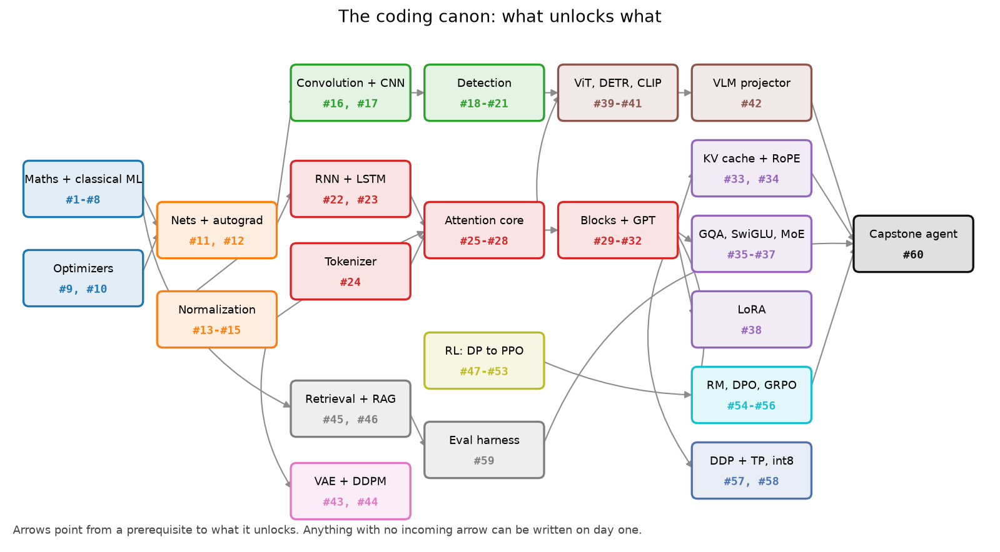
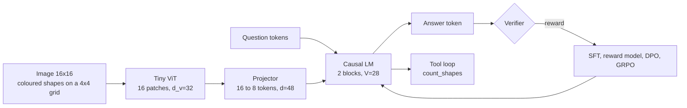
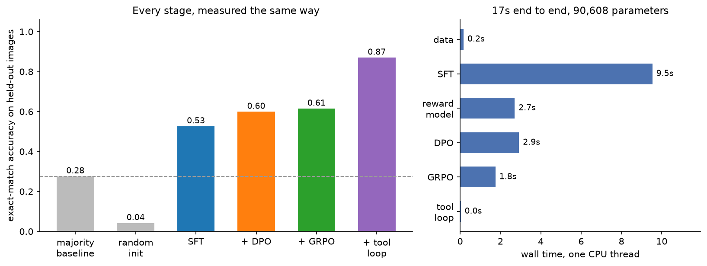

# Part XVI: The coding canon

> **Why this matters at staff level.** The coding round is the one part of the loop
> where preparation converts directly into signal. An interviewer who asks for
> multi-head attention with a causal mask is watching whether you write the shapes
> down before the code, whether you reach for the right API without stalling, and
> whether you can say what you would test. Sixty implementations, written from a
> blank file until they are boring, is what buys you that.

## TL;DR: the interview card

* Sixty implementations, numbered the same way as the [study plan](../preface/study-plan.md). Every one has a module in `src/mlbook/` and a test in `tests/`.
* The first fifty-nine come to about 22 hours of typing. The capstone (#60) adds three.
* Write from a blank file, run the reference test against your file, then delete it. Reading the module does not count.
* The five that come up most often in real loops: attention with a mask, IoU plus NMS, backprop through one layer by hand, k-means, and the DPO loss.
* Shape comment on every line that creates or reshapes a tensor. Say the shape aloud before you type it.
* `make drill ITEM=transformer/multihead` gives you a signature-only stub; `make check ITEM=transformer/multihead` runs the reference test against it.
* Sixty is not a syllabus you finish once. It is a rotation you keep turning over, five items a week, for as long as you are interviewing.

## 1. Why these sixty

Three filters produced this list.

The first is **frequency**. Anything that has been asked in a 45-minute coding
round at an autonomy company, a consumer-ranking company or a frontier lab in the
last few years is here: attention, NMS, k-means, BPE, a KV cache, a LoRA wrapper,
the PPO clip, the DPO loss. If a topic has never been asked to be typed, it is not
in the canon no matter how important it is to understand.

The second is **compression**. Each item stands in for a family. Writing
[scaled dot-product attention](#2-the-canon) once gives you cross-attention, causal
attention, GQA and the KV cache for a few extra minutes each, because they are the
same three matmuls with different shapes. Writing the im2col convolution gives you
the FLOP count, the backward pass and the receptive-field argument, because they
all live in the same index arithmetic. The list is short because the items were
chosen to overlap.

The third is **testability**. Every item has a reference the test can compare
against: a closed-form answer, a finite-difference gradient, a `torch.nn.functional`
op, or a property that has to hold (a probability sums to one, a permutation of the
input permutes the output, an advantage has zero mean within its group). An item
whose correctness you cannot check in ten seconds is an item you cannot practise.

{ width="880" }

The graph shows which items unlock which. Anything with no incoming arrow can be
written on day one. The four chains that matter are the vision chain along the top
(convolution, detection, ViT, projector), the sequence chain through the middle
(attention, blocks, GPT, then the LLM variants), the RL chain along the bottom into
post-training, and the retrieval chain into evaluation. They converge on #60.

## 2. The canon

The **level** column is the depth contract from
[asymmetric depth](../preface/how-to-use.md#4-asymmetric-depth-the-four-target-levels),
applied to the topic the item implements. Level A items you should be able to write
with no reference at all. Level B items you may write with the chapter open the
first two times and closed after that. Nothing in the canon is below B, because
typing an implementation is itself a Level B activity.

The **from memory** column is a target for a second or third attempt, not a first
one. First attempts run about double. If your second attempt is still double the
target, the item is not the problem: go back and re-derive the maths in the chapter
that teaches it.

Run any row's test with the command in its column. The sandbox equivalent, which
runs the same test against *your* file instead of the package's, is
`make check ITEM=<module path without .py>`.

| # | Item | Level | Module in `src/mlbook/` | Test command | From memory | Taught in |
|---|---|---|---|---|---|---|
| 1 | Linear regression (normal equations + GD) | A | `classical/linear_regression.py` | `pytest tests/test_classical_linear.py` | 15 min | [II, Linear regression](../part02-classical/01-linear-regression.md) |
| 2 | Logistic regression | A | `classical/logistic_regression.py` | `pytest tests/test_classical_logistic.py` | 20 min | [II, Logistic & softmax](../part02-classical/02-logistic-softmax-regression.md) |
| 3 | Softmax regression | A | `classical/softmax_regression.py` | `pytest tests/test_classical_logistic.py` | 20 min | [II, Logistic & softmax](../part02-classical/02-logistic-softmax-regression.md) |
| 4 | KNN with vectorised distances | B | `classical/knn.py` | `pytest tests/test_classical_knn_kmeans.py` | 15 min | [II, KNN & K-means](../part02-classical/04-knn-kmeans.md) |
| 5 | K-means | B | `classical/kmeans.py` | `pytest tests/test_classical_knn_kmeans.py` | 20 min | [II, KNN & K-means](../part02-classical/04-knn-kmeans.md) |
| 6 | Decision tree (CART, Gini) | B | `classical/decision_tree.py` | `pytest tests/test_classical_trees.py` | 35 min | [II, Trees & ensembles](../part02-classical/03-trees-and-ensembles.md) |
| 7 | PCA | A | `classical/pca.py` | `pytest tests/test_classical_pca.py` | 15 min | [II, Dimensionality reduction](../part02-classical/06-dimensionality-reduction.md) |
| 8 | GMM with EM | B | `classical/gmm.py` | `pytest tests/test_classical_prob_em.py` | 35 min | [II, Probabilistic models & EM](../part02-classical/05-probabilistic-models-em.md) |
| 9 | SGD with momentum | A | `optim/optimizers.py` | `pytest tests/test_optim_optimizers.py` | 10 min | [I, Math](../part01-math/index.md) |
| 10 | Adam and AdamW | A | `optim/optimizers.py` | `pytest tests/test_optim_optimizers.py` | 15 min | [I, Math](../part01-math/index.md) |
| 11 | MLP forward and backward in NumPy | A | `nn/mlp.py` | `pytest tests/test_nn_mlp.py` | 30 min | [III, MLPs & activations](../part03-neural-nets/01-mlp-and-activations.md) |
| 12 | Autograd engine | A | `nn/autograd.py` | `pytest tests/test_nn_autograd.py` | 45 min | [III, Autograd engine](../part03-neural-nets/03-autograd-engine.md) |
| 13 | BatchNorm forward and backward | A | `nn/normalization.py` | `pytest tests/test_nn_normalization.py` | 25 min | [III, Neural nets](../part03-neural-nets/index.md) |
| 14 | LayerNorm forward and backward | A | `nn/normalization.py` | `pytest tests/test_nn_normalization.py` | 20 min | [III, Neural nets](../part03-neural-nets/index.md) |
| 15 | RMSNorm | A | `nn/normalization_torch.py` | `pytest tests/test_nn_normalization.py` | 10 min | [III, Neural nets](../part03-neural-nets/index.md) |
| 16 | Convolution via im2col | A | `vision/conv.py` | `pytest tests/test_vision_conv.py` | 30 min | [IV, Convolutions](../part04-vision/02-convolutions.md) |
| 17 | Tiny CNN trained end to end | A | `vision/tiny_cnn.py` | `pytest tests/test_vision_models.py` | 20 min | [IV, CNN architectures](../part04-vision/03-cnn-architectures.md) |
| 18 | IoU and box conversions | B | `detection/boxes.py` | `pytest tests/test_detection_boxes.py` | 10 min | [IV, Vision](../part04-vision/index.md) |
| 19 | NMS | B | `detection/nms.py` | `pytest tests/test_detection_nms.py` | 15 min | [IV, Vision](../part04-vision/index.md) |
| 20 | Anchor generation and matching | B | `detection/anchors.py` | `pytest tests/test_detection_anchors.py` | 25 min | [IV, Vision](../part04-vision/index.md) |
| 21 | Focal loss | B | `detection/focal_loss.py` | `pytest tests/test_detection_losses.py` | 10 min | [IV, Vision](../part04-vision/index.md) |
| 22 | RNN cell with BPTT | B | `sequence/rnn.py` | `pytest tests/test_sequence_rnn.py` | 20 min | [V, Sequences & Transformers](../part05-sequence-transformers/index.md) |
| 23 | LSTM cell with BPTT | B | `sequence/lstm.py` | `pytest tests/test_sequence_lstm.py` | 30 min | [V, Sequences & Transformers](../part05-sequence-transformers/index.md) |
| 24 | BPE tokenizer (train and encode) | A | `transformer/tokenizer_bpe.py` | `pytest tests/test_transformer_tokenizers.py` | 30 min | [V, Sequences & Transformers](../part05-sequence-transformers/index.md) |
| 25 | Scaled dot-product attention | A | `transformer/attention.py` | `pytest tests/test_transformer_attention.py` | 10 min | [V, Sequences & Transformers](../part05-sequence-transformers/index.md) |
| 26 | Multi-head attention | A | `transformer/multihead.py` | `pytest tests/test_transformer_multihead.py` | 20 min | [V, Sequences & Transformers](../part05-sequence-transformers/index.md) |
| 27 | Causal and padding masks | A | `transformer/masks.py` | `pytest tests/test_transformer_masks.py` | 10 min | [V, Sequences & Transformers](../part05-sequence-transformers/index.md) |
| 28 | Cross-attention | A | `transformer/multihead.py` | `pytest tests/test_transformer_multihead.py` | 15 min | [V, Sequences & Transformers](../part05-sequence-transformers/index.md) |
| 29 | Transformer encoder block | A | `transformer/blocks.py` | `pytest tests/test_transformer_blocks.py` | 20 min | [V, Sequences & Transformers](../part05-sequence-transformers/index.md) |
| 30 | Transformer decoder block | A | `transformer/blocks.py` | `pytest tests/test_transformer_blocks.py` | 20 min | [V, Sequences & Transformers](../part05-sequence-transformers/index.md) |
| 31 | Tiny GPT end to end | A | `transformer/gpt.py` | `pytest tests/test_transformer_gpt.py` | 45 min | [V, Sequences & Transformers](../part05-sequence-transformers/index.md) |
| 32 | Generation: greedy, temperature, top-k, top-p | A | `transformer/generation.py` | `pytest tests/test_transformer_gpt.py` | 20 min | [V, Sequences & Transformers](../part05-sequence-transformers/index.md) |
| 33 | KV cache | B | `transformer/kv_cache.py` | `pytest tests/test_transformer_multihead.py` | 20 min | [VI, Efficient attention & KV cache](../part06-llm-training/04-efficient-attention-kv-cache.md) |
| 34 | RoPE | A | `transformer/positional.py` | `pytest tests/test_transformer_positional.py` | 25 min | [V, Sequences & Transformers](../part05-sequence-transformers/index.md) |
| 35 | Grouped-query attention | B | `llm/gqa.py` | `pytest tests/test_llm_gqa.py` | 15 min | [VI, Large-model architecture](../part06-llm-training/03-large-model-architecture.md) |
| 36 | SwiGLU feed-forward | B | `transformer/ffn.py` | `pytest tests/test_transformer_blocks.py` | 10 min | [VI, Large-model architecture](../part06-llm-training/03-large-model-architecture.md) |
| 37 | Tiny MoE with a top-k router | B | `llm/moe.py` | `pytest tests/test_llm_moe.py` | 30 min | [VI, Large-model architecture](../part06-llm-training/03-large-model-architecture.md) |
| 38 | LoRA wrapper | A | `finetune/lora.py` | `pytest tests/test_finetune_lora.py` | 15 min | [VI, Fine-tuning & LoRA](../part06-llm-training/06-fine-tuning-lora.md) |
| 39 | Tiny ViT | A | `multimodal/vit.py` | `pytest tests/test_multimodal_vit.py` | 30 min | [VIII, Vision Transformers](../part08-multimodal/01-vision-transformers.md) |
| 40 | Hungarian matching + DETR set loss | B | `multimodal/hungarian.py`, `multimodal/detr_loss.py` | `pytest tests/test_multimodal_detr.py` | 35 min | [VIII, DETR](../part08-multimodal/02-detr.md) |
| 41 | CLIP-style contrastive training | A | `multimodal/clip.py` | `pytest tests/test_multimodal_clip.py` | 20 min | [VIII, CLIP](../part08-multimodal/03-clip-contrastive.md) |
| 42 | VLM projector | B | `multimodal/projectors.py` | `pytest tests/test_multimodal_projectors.py` | 15 min | [VIII, Multimodal](../part08-multimodal/index.md) |
| 43 | VAE with the reparameterisation trick | B | `generative/vae.py` | `pytest tests/test_generative_vae.py` | 25 min | Part IX, Autoencoders & VAEs |
| 44 | DDPM training and sampling | B | `generative/ddpm.py` | `pytest tests/test_generative_ddpm.py` | 35 min | Part IX, Diffusion |
| 45 | ANN retrieval: IVF, HNSW, PQ | B | `retrieval/ivf.py`, `retrieval/hnsw.py`, `retrieval/pq.py` | `pytest tests/test_retrieval_ivf.py tests/test_retrieval_hnsw.py tests/test_retrieval_pq.py` | 40 min | [XIII, Retrieval & RAG](../part13-retrieval-eval-reliability/01-retrieval-and-rag.md) |
| 46 | RAG pipeline | B | `retrieval/rag.py` | `pytest tests/test_retrieval_rag.py` | 25 min | [XIII, Retrieval & RAG](../part13-retrieval-eval-reliability/01-retrieval-and-rag.md) |
| 47 | Value iteration and policy iteration | A | `rl/dynamic_programming.py` | `pytest tests/test_rl_dynamic_programming.py` | 15 min | Part XII, MDPs & Bellman |
| 48 | Q-learning on a gridworld | A | `rl/q_learning.py` | `pytest tests/test_rl_q_learning.py` | 20 min | Part XII, Classical RL |
| 49 | DQN with replay and a target net | B | `rl/dqn.py` | `pytest tests/test_rl_dqn.py` | 35 min | Part XII, Deep RL & DQN |
| 50 | REINFORCE with a baseline | A | `rl/reinforce.py` | `pytest tests/test_rl_reinforce.py` | 20 min | Part XII, Policy gradients |
| 51 | Actor-critic | A | `rl/actor_critic.py` | `pytest tests/test_rl_actor_critic.py` | 25 min | Part XII, Policy gradients |
| 52 | GAE | A | `rl/gae.py` | `pytest tests/test_rl_gae.py` | 15 min | Part XII, Policy gradients |
| 53 | PPO update step | A | `rl/ppo.py` | `pytest tests/test_rl_ppo.py` | 30 min | Part XII, Policy gradients |
| 54 | Reward model with a pairwise head | A | `posttrain/reward_model.py` | `pytest tests/test_posttrain_reward_model.py` | 20 min | [VII, Reward models](../part07-post-training/02-reward-models.md) |
| 55 | DPO loss | A | `posttrain/dpo.py` | `pytest tests/test_posttrain_dpo.py` | 15 min | [VII, DPO and its relatives](../part07-post-training/04-dpo-and-friends.md) |
| 56 | Simplified GRPO / RLVR | B | `posttrain/grpo.py` | `pytest tests/test_posttrain_grpo.py` | 25 min | [VII, Post-training](../part07-post-training/index.md) |
| 57 | DDP by hand + a tensor-parallel linear | B | `systems/ddp_example.py`, `systems/tensor_parallel_toy.py` | `pytest tests/test_systems_ddp.py tests/test_systems_tensor_parallel.py` | 35 min | [XIV, Distributed training](../part14-systems/01-distributed-training.md) |
| 58 | int8 weight-only quantized matmul | B | `quant/qlinear.py` | `pytest tests/test_quant_qlinear.py` | 20 min | [VI, Quantization](../part06-llm-training/05-quantization.md) |
| 59 | Evaluation harness with bootstrap CIs | A | `evaluation/harness.py` | `pytest tests/test_evaluation_harness.py` | 40 min | [XIII, Retrieval, eval & reliability](../part13-retrieval-eval-reliability/index.md) |
| 60 | Tiny end-to-end multimodal agent | B | `capstone/pipeline.py` | `pytest tests/test_capstone_pipeline.py tests/test_capstone_components.py` | 3 h | [§6 below](#6-canon-60-the-capstone) |

!!! warning "The time targets are for a second attempt"
    A first attempt at #12 (autograd) or #31 (tiny GPT) from a genuinely blank
    file takes most people 90 minutes and involves at least one silent shape bug.
    That is the normal shape of the curve. What you are training is the second
    and third attempt, because a 45-minute interview gives you one pass with no
    debugger and someone talking to you.

## 3. The order to learn them in

The study plan sequences all sixty across 36 weeks. If you are working through the
canon on its own, the dependency order is shorter to state.

**Block 1, foundations (#1 to #12).** Linear regression, logistic, softmax, KNN,
k-means, tree, PCA, GMM, then SGD and Adam, then the MLP and the autograd engine.
Everything after this assumes you can write a training loop and check a gradient by
finite differences without thinking about it.

**Block 2, the layers (#13 to #21).** Normalization, then convolution and a small
CNN, then the four detection items. IoU before NMS before anchors, because each one
consumes the last.

**Block 3, attention (#22 to #34).** RNN and LSTM first, so that the Transformer
answers a question you have felt. Then the tokenizer, then attention in this exact
order: single-head, multi-head, masks, cross-attention, blocks, GPT, generation.
Add the KV cache and RoPE last, when the model they attach to already works.

**Block 4, the LLM variants (#35 to #38).** GQA, SwiGLU, MoE and LoRA are each a
small edit to something you have already written. They are cheap here and expensive
if you attempt them before #31.

**Block 5, multimodal and generative (#39 to #44).** ViT reuses your attention
block with a patch embedding in front. DETR reuses your boxes. CLIP reuses your
softmax cross-entropy on a similarity matrix. VAE and DDPM stand apart; do them
when the generative chapters come up.

**Block 6, retrieval and RL (#45 to #53).** Retrieval and the evaluation harness
pair naturally. RL runs in its own order (dynamic programming, Q-learning, DQN,
REINFORCE, actor-critic, GAE, PPO) and every step there is a prerequisite for the
next.

**Block 7, post-training and systems (#54 to #59).** Reward model, DPO, GRPO on
top of your GPT from #31. DDP and the int8 matmul are independent of everything
else and can be slotted anywhere.

**Block 8, the capstone (#60).** Only after #31, #39, #42, #54, #55, #56 and #59.

## 4. If you have 90 minutes a day

Ninety minutes is enough for one item plus its review, five days a week. The
structure below is what fits in the time without rushing.

| Minutes | What you do | Why it is in the schedule |
|---|---|---|
| 0 to 10 | Re-derive yesterday's item on paper. Shapes and the one equation, no code. | Spaced repetition on the maths is what keeps the code from becoming muscle memory with no model behind it. |
| 10 to 20 | Read today's item's section 2 and section 3 in its chapter. Close the book. | Reading is the cheap part. Ten minutes is the whole budget for it. |
| 20 to 65 | `make drill ITEM=...`, write the implementation from the stub, run `make check`. | The 45-minute block is the interview. Use a timer and stop when it rings whether or not you are done. |
| 65 to 80 | Read the reference module and diff it against what you wrote. Write down the differences. | The diff is the lesson. Most of it will be shape handling and edge cases, which is exactly what the interviewer probes. |
| 80 to 90 | Explain the item aloud as though someone asked. Two minutes of setup, five of walkthrough. | The explanation is graded in the room. Practising it silently does not transfer. |

Five items a week is twelve weeks for the canon. Interleave rather than block: do
one item from a block you know well and one from a block you do not, so retrieval
stays hard. Once through, restart at #1. The second pass takes about a third of the
time and is where the items become automatic.

A shorter version, for the week before an interview: the
[week-before checklist](../preface/study-plan.md#the-week-before-checklist) names
eleven items and about four hours total.

## 5. The sandbox workflow

The repository ships signature-only stubs of every module, described in
[how to use this book](../preface/how-to-use.md#8-the-practice-sandbox-what-to-retype-by-hand).
The loop is four commands.

```bash
make stubs                              # generate or refresh every stub in practice/
make drill ITEM=transformer/multihead   # print the file to edit and the tests to pass
#   ... write practice/transformer/multihead.py from memory, timer running ...
make check ITEM=transformer/multihead   # MLBOOK_IMPL=practice pytest tests -k multihead
make reset ITEM=transformer/multihead   # wipe your attempt, restore the clean stub
```

`MLBOOK_IMPL=practice` redirects every `mlbook.<area>.<module>` import to
`practice/<area>/<module>.py` when that file exists and to the reference when it
does not. One module at a time is therefore practisable without breaking the rest
of the package: your `practice/transformer/multihead.py` gets imported by the real
`transformer/blocks.py`, so if your attention is subtly wrong, the block test fails
too and tells you where.

Three habits make the sandbox work.

**Delete your attempt after it passes.** `make reset` exists for this. A file you
can peek at is a file you will peek at, and the item is not learned until you can
produce it twice on different days.

**Run the check before you think you are done.** The failure message is free
information about which shape is wrong. Interviewers watch for candidates who write
sixty lines before running anything.

**Keep a miss log.** One line per item per attempt: what you got wrong. After three
passes the log has maybe fifteen recurring entries (transposing K, forgetting
`keepdims`, the `-inf` padding row, the off-by-one in the label shift), and those
fifteen are your actual study list.

## 6. Canon #60: the capstone

Items #1 to #59 are pieces. #60 is the assembly: a vision encoder, a projector, a
causal LM, the three post-training stages, and an agent loop that can call a tool.
It lives in `src/mlbook/capstone/` and is self-contained, importing nothing from
the rest of `mlbook`, so it reads front to back.



The task is a board of coloured squares and circles, one per cell, with questions
like "how many red squares" and "what colour is the largest shape". Answers are
computed from the scene graph that drew the image, which is what makes the reward
*verifiable*: no annotator, no judge model, no possibility of the policy learning
to please a proxy.

{ width="860" }

The left panel is the reason the capstone is worth three hours. Each stage moves a
number you measured the same way, and the largest single jump comes from the agent
loop rather than from any of the training stages. The right panel is the cost:
under twenty seconds for the whole pipeline on one CPU thread, which is what makes
it possible to change one thing and rerun.

```python
from mlbook.capstone.pipeline import run_pipeline, format_report

report = run_pipeline()
print(format_report(report))
```

Five things in it are worth more interview attention than the rest.

**The splice and the off-by-one.** `TinyVLM.build_inputs` concatenates `N_q` visual
tokens in front of `T` text tokens, prepends `N_q` ones to the attention mask, and
builds `position_ids` as `arange(N_q + T)`. Because `logits[:, i]` predicts token
`i + 1`, the logit that scores text token `t` sits at index `N_q + t - 1`. The
slice `logits[:, N_q - 1 : N_q - 1 + T]` undoes both offsets at once. Getting this
wrong shifts the loss by one token, and the model still trains, just to the wrong
thing.

**The mask value.** `causal_padding_bias` fills disallowed positions with `-1e9`
rather than `-inf`. A right-padded batch has query rows whose every key is masked,
and `softmax` of an all-`-inf` row returns `NaN`, which then propagates through the
whole backward pass. Under fp16 anything below about `-6.5e4` overflows to `-inf`
anyway, which is why production code uses `torch.finfo(dtype).min`.

**On-policy negatives.** `make_preference_pairs(examples, policy=model)` samples a
response from the SFT policy and keeps it as the rejected answer when the verifier
scores it zero, falling back to a random wrong token where the policy was already
right. That is rejection sampling, the recipe Llama 2 used to build preference
sets. Random negatives cost about 6 points of accuracy against on-policy ones in
this pipeline, because the gradient lands on mistakes the model was never going to
make.

**Degenerate groups.** With a binary verifier, a GRPO group whose samples all
scored the same has zero advantage everywhere, so it contributes no gradient while
costing a full generation and two forward passes. After SFT on this task, 59% of
groups at `G = 4` are all-right or all-wrong. `run_grpo` therefore draws four times
as many prompts as it needs and keeps the groups that survive
`informative_groups`, which is DAPO's dynamic sampling.

**Sampling temperature against decode temperature.** GRPO maximises the expected
reward of a *sample*, so the temperature you sample the group at is part of the
objective. Sampling at 1.0 and evaluating greedily optimises a distribution you
never serve: over five seeds the mean accuracy change was -0.004 at temperature 1.0
and +0.019 at 0.7.

??? example "The whole pipeline, `src/mlbook/capstone/pipeline.py`"
    ```python
    --8<-- "src/mlbook/capstone/pipeline.py"
    ```

??? example "Splicing the modalities, `src/mlbook/capstone/multimodal_model.py`"
    ```python
    --8<-- "src/mlbook/capstone/multimodal_model.py"
    ```

??? example "DPO and GRPO, `src/mlbook/capstone/preference_stage.py`"
    ```python
    --8<-- "src/mlbook/capstone/preference_stage.py"
    ```

??? example "The agent loop, `src/mlbook/capstone/tool_loop.py`"
    ```python
    --8<-- "src/mlbook/capstone/tool_loop.py"
    ```

!!! interview "Interview question"
    **"Your post-training stage did not improve the eval metric. How do you tell a
    bug from a task that is already saturated?"**

    Separate the objective from the metric first. GRPO optimises the expected
    verifier reward of a sample at the sampling temperature; the eval number here
    was greedy exact match. Those come apart: raising the correct token from 0.30
    to 0.45 raises expected sampled reward and leaves the argmax alone. So the
    first check is whether the training-time reward moved. If it did and the eval
    did not, the objective is working and the metric is measuring something else.

    If the reward did not move either, look at the advantages before the gradients.
    Print the fraction of groups with zero reward variance. On this task it was
    59% at `G = 4`, which means well over half the compute produced an exactly zero
    gradient. That is a sampling problem, not an optimizer problem, and the fixes
    are a larger group, a temperature that produces diversity, or dynamic sampling.

    **Staff-level follow-up.** How would you tell reward hacking from genuine
    improvement in a run where the reward rises and the eval falls? Hold out a
    second verifier the policy was never trained against, and watch the KL to the
    reference. A policy that has found a hole in the reward moves far in KL while
    the held-out verifier stays flat.

## 7. Grading your own attempt

Five axes, each worth a plain yes or no. A strong interview attempt scores four or
five; three is a hire signal with reservations; two is a no.

| Axis | What a yes looks like |
|---|---|
| **Correctness** | The reference test passes, including its edge cases (empty input, a single box, a batch of one). |
| **Shapes** | Every tensor line carries a shape comment, and the comments are right. You said the shape aloud before you typed the line. |
| **Numerics** | You subtracted the max before the exponential, used a finite mask value, put the epsilon inside the square root, and can say what breaks otherwise. |
| **API fluency** | No stalling on which of `view`, `reshape`, `permute` or `movedim` to use, and no silent `transpose` where you wanted `swapaxes`. |
| **Explanation** | You narrated the plan before writing, named the trade-off when you chose one, and told the interviewer what you would test. |

The [timed drills](03-timed-drills.md) chapter turns this table into a rubric with
a script for the narration and a section on what to do when you stall.

## The three chapters

1. [NumPy ↔ PyTorch cheat sheet](01-numpy-torch-cheatsheet.md): the two APIs side by side, one row per operation, with the gotcha that makes the row worth having. Plus the numerically stable patterns and what to reach for when you blank.
2. [Shape and broadcasting drills](02-shape-drills.md): thirty problems of the form "given these shapes, produce that shape", with the answer annotated line by line and the trap each one teaches.
3. [Timed coding drills](03-timed-drills.md): twenty-two drills at three time tiers, with hints at three escalating levels, a rubric, a narration script, and three 60-minute mock sessions.
