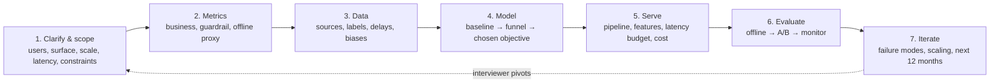
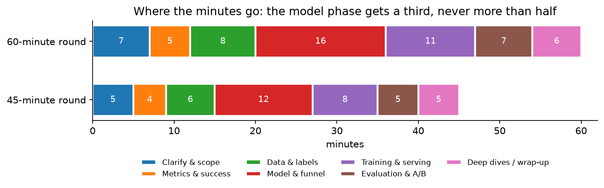
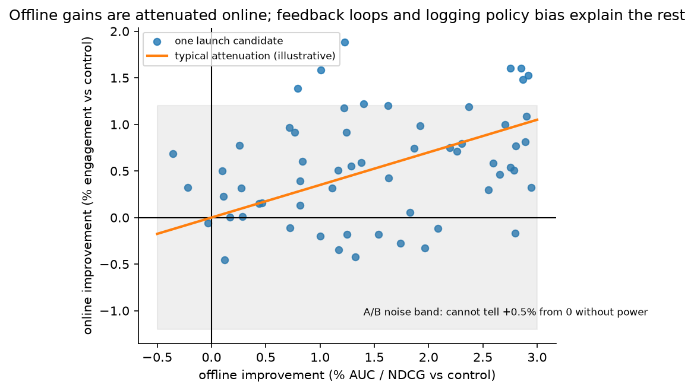

# The framework: how to run an ML system design round

> **Why this matters at staff level.** Every company on your list runs an ML system
> design round, and at staff level it is weighted more heavily than coding. The
> interviewer grades *process*: did you scope before designing, did you pick metrics
> before models, did you name the alternative for every decision, did you know the
> numbers, and did you predict how the system fails. Strong signal looks like a
> candidate who drives the conversation, commits to decisions with evidence, and can
> change any of them when the interviewer moves the constraints.

## TL;DR: the whiteboard in 60 seconds

- **Order is fixed: clarify → metrics → data → model → serve → evaluate → iterate.**
  Model choice comes fourth, not first. Candidates who start with "I'd use a
  transformer" fail the round in the first minute.
- **Every decision is a journal entry**: *I choose X over Y because Z; the cost is W;
  I would flip to Y if C.* Say it that way, every time.
- **Metrics before models.** One north-star business metric, two or three
  guardrails, one offline proxy per stage, and an explicit statement of how the
  proxy can disagree with the north star.
- **Labels are the design.** Where do they come from, how late, how biased (position,
  survivorship, selection by the current policy), and what feedback loop do they close.
- **Funnels, not monoliths.** Retrieval → pre-ranking → ranking → re-ranking, each
  with a candidate count, a latency budget and a cost per item. Draw it.
- **Numbers or it did not happen.** QPS, storage per day, embedding memory, GPU
  throughput, cost per 1k inferences: produce them from first principles in under a
  minute each (§5).
- **Offline gains are attenuated online.** Know why (feedback loops, logging-policy
  bias, metric mismatch, noise) and how you would tell (interleaving, holdouts,
  calibration checks).
- **Failure modes are part of the design**, not an afterthought: traffic spikes,
  feature-store staleness, training–serving skew, silent label drift, adversarial
  users.
- **Bring your own production evidence** (§7). A staff candidate says "when we shipped
  X, the thing that bit us was Y" and then generalises it.
- **Time-box** (§2): a third of the round on modelling, never more than half.

## 1. The method, phase by phase

### 1.1 Clarify and scope (the first 5–7 minutes)

The prompt is deliberately vague ("design the feed", "detect fraud"). Your first job
is to turn it into a problem statement you could hand to a team. Ask, in roughly this
order:

1. **Who is the user and what is the surface?** Home feed vs notifications vs search
   results page; consumer vs enterprise; mobile vs desktop. The surface fixes the
   latency budget and the available features.
2. **What business outcome does the company want?** Engagement, revenue, retention,
   safety, cost reduction. Ask which one wins when they conflict.
3. **Scale numbers**: DAU/MAU, requests per second (average and peak), corpus size,
   growth rate. If the interviewer will not give them, *state your assumptions out
   loud* and design to them.
4. **Latency and availability**: p50/p99 budget for the whole request, and what
   happens on timeout (fallback ranking, cached results, rules).
5. **Freshness**: how quickly must a new item / new user / new fraud pattern be
   reflected? Seconds, minutes, or next day changes the entire architecture.
6. **Constraints**: privacy (can you use this signal?), regulation (explainability for
   credit decisions), platform (on-device compute), existing systems (a feature store,
   an ANN service, a labelling team).
7. **What already exists?** "Are we replacing a rules system, a v1 model, or starting
   from nothing?" The answer decides whether your baseline is a heuristic or the
   incumbent.

Then restate the problem in two sentences and confirm. "So: rank ~10k retrieved
posts per request for 500M DAU at ~50k peak QPS within 200 ms p99, maximising
long-term engagement with integrity guardrails, with new posts visible within a
minute. I'll assume a feature store and an ANN service exist." Write the numbers on
the board; you will use them.

### 1.2 Metrics (4–5 minutes)

Three layers, and you must name all three:

| Layer | What it is | Example (feed) | Example (fraud) |
|---|---|---|---|
| **North star (online, business)** | The metric the A/B test is judged on | Daily active users, time spent, sessions/user | Fraud loss in basis points of volume, net of false-decline revenue loss |
| **Guardrails (online)** | Metrics that must not regress | Reports/hides, integrity prevalence, creator diversity, latency, crash rate | False-positive rate on good users, manual-review volume, p99 latency |
| **Offline proxy (per stage)** | What you optimise during development | Recall@k for retrieval; AUC / logloss / NDCG for ranking; calibration | AUPRC, recall at FPR = 0.1 %, calibration on the score band used for decisions |

Then say how the proxy can lie: AUC is invariant to calibration, which an auction or
a threshold policy needs; NDCG on logged clicks inherits position bias; a retrieval
recall computed against *logged* positives rewards imitating the old system. This
is the single most reliable place to show staff-level judgment early in the round.
Details for each domain live in the chapters; the general theory is in
[Part XIII evaluation](../part13-retrieval-eval-reliability/02-evaluation.md).

### 1.3 Data and labels (6–8 minutes)

Interviewers know that most production ML failures are data failures. Cover:

- **Sources**: event logs (impressions, clicks, dwell, purchases), content
  (text/image/video), entity tables (user, item, seller), context (device, time,
  location), third-party signals.
- **Label generation**: implicit (click, watch ≥ 30 s) vs explicit (rating, report)
  vs adjudicated (fraud chargeback, human review). State the **delay** (clicks:
  seconds; conversions: days; chargebacks: up to months) and what you do while
  waiting (see the [ads chapter](03-ads-ctr-prediction.md) for delayed feedback).
- **Biases**: *position bias* (shown higher → clicked more), *selection bias* (you
  only observe outcomes for items the current policy showed), *survivorship*
  (declined transactions never get a fraud label), *feedback loops* (the model
  trains on its own outputs). Name the bias, name the correction (propensity
  weighting, randomised exploration slots, holdout traffic, counterfactual
  evaluation).
- **Features**: static, aggregated (counts over windows), sequential (last N
  actions), cross features, embeddings. Say which are computed offline (batch), which
  near-real-time (streaming) and which at request time.
- **Freshness and consistency**: the same feature definition must be used in training
  and serving; log the served features rather than recomputing them (Google's *Rules
  of Machine Learning*, rule 29: save the features used at serving time and pipe them
  to the training log).
- **Privacy**: retention windows, consent, on-device vs server, regional storage.

### 1.4 Model (12–16 minutes)

Always in this order, and say so: **baseline → candidates → chosen design → objective
math → how the pieces combine.**

- **Baseline**: a heuristic or a linear/GBDT model on a handful of features. It is
  your fallback, your A/B control and your sanity check. Google's *Rules of Machine
  Learning* (Zinkevich, 2017) opens with "don't be afraid to launch a product without
  machine learning" and advises starting with a simple, interpretable model; quoting
  that in the room is fine and shows you know why.
- **Candidates**: two or three architectures with the trade-off for each in one
  sentence. "GBDT on dense features: fast, robust, no sequence modelling. Two-tower:
  scales retrieval to a billion items, but the towers cannot interact. Cross-attention
  ranker: best accuracy, only affordable on a few hundred candidates."
- **The funnel**: candidate counts, models and latency per stage.
- **The objective, written down**: the loss, what the network outputs, and how the
  outputs become a decision (a score formula, a threshold from a cost matrix, an
  auction). If there are several heads, say how they are combined and who owns the
  weights.
- **Cold start, exploration, calibration**: three words the interviewer is waiting
  for. Give each one sentence.

Resist the pull to spend the whole round here; the figure below shows the budget.

{ width="720" }

*Modelling gets the largest single block but only about a third of the round; serving
and evaluation together get as much again. Candidates who spend 30 of 45 minutes on
the model routinely run out of time before the interviewer's real questions.*

### 1.5 Training and serving (8–11 minutes)

Draw the pipeline: data lake → feature computation (batch + streaming) → training
(cadence, hardware, how long) → validation gates → registry → deployment (shadow →
canary → full) → serving (feature fetch, model inference, caching) → logging that
closes the loop. For each stage give a latency and a cost. Cover:

- **Online/offline consistency** and point-in-time correctness
  ([platform chapter](12-ml-platform-feature-store-monitoring.md)).
- **Training cadence** (daily batch, hourly incremental, online learning) and *why*
  that cadence: it follows from the freshness requirement, not from habit.
- **Serving hardware**: CPU for GBDT and small MLPs, GPU for large rankers and
  transformers, accelerators or on-device for edge. Batch requests to fill the GPU.
- **Caching**: user embeddings, item embeddings, retrieval results for
  low-personalisation surfaces, LLM prefix caches.
- **Degradation**: what you serve when the feature store is slow, when the model
  server is down, when the GPU pool is saturated.

The systems substrate is in [Part XIV](../part14-systems/index.md): distributed
training, inference systems, and the roofline model you need for the throughput
numbers.

### 1.6 Evaluation and experimentation (5–7 minutes)

Offline: the right metric per stage, the right split (time-based, not random, for
anything with drift), and the known pitfalls. Online: A/B with a pre-registered
north-star and guardrails, enough power, and a long-term holdout for anything that
changes user behaviour. Add monitoring (input distributions, prediction
distributions, calibration, latency, label arrival) and the retraining trigger.
Say explicitly how you would diagnose "better offline, flat online". The
[follow-ups](#10-staff-level-follow-ups) below give the model answer.

{ width="600" }

*Offline gains are attenuated online and sit inside a noise band; most "winning"
offline candidates are indistinguishable from zero without adequate power. Expect the
interviewer to ask why.*

### 1.7 Iterate: failure modes, scaling, the next twelve months

Finish with the three things that go wrong first, how you would detect each, and
what changes at 10× scale or when the product moves from batch to real-time. The
chapter-specific versions are in each chapter's §11.

## 2. Time allocation

| Phase | 45-minute round | 60-minute round | If you are running late, cut… |
|---|---|---|---|
| Clarify & scope | 5 | 7 | nothing; this is the highest-signal phase |
| Metrics | 4 | 5 | the third guardrail |
| Data & labels | 6 | 8 | feature details, never label delay or bias |
| Model & funnel | 12 | 16 | the second candidate architecture |
| Training & serving | 8 | 11 | hardware details; keep the latency budget |
| Evaluation & A/B | 5 | 7 | monitoring details; keep the offline/online mismatch |
| Deep dives / wrap-up | 5 | 6 | this is the interviewer's time; do not steal it |

Two rules. First, *announce the plan* ("I'll spend a few minutes scoping, then
metrics, data, the model, serving and evaluation; stop me any time"). Interviewers
relax when they can see the shape of the next 40 minutes. Second, *check the clock at
the model phase*: if you are past the halfway mark and have not drawn the funnel,
draw it now and skip the second candidate.

## 3. The decision journal

The habit that most separates staff answers from senior ones is the form in which
decisions are stated. Every non-trivial choice is spoken as four clauses:

> **Decision.** I'll use a two-tower model for retrieval.
> **Alternative.** The alternative is item-to-item collaborative filtering from
> co-engagement.
> **Trade-off.** Two-tower generalises to new items through content features and
> scales through ANN, but the towers cannot model query–item interaction, so I rely
> on the ranker for that.
> **Flip condition.** If the corpus were small (≤ 100k items) and stable, I would skip
> the learned retriever and rank everything with the cross-feature model directly.

The interviewer's private rubric almost always has a line like "names alternatives
and trade-offs unprompted". Each chapter's §8 is a table of these journal entries,
and each "How to say it in the interview" box is one entry spoken in full with the
company evidence attached.

## 4. Clarifying questions that sound like a staff engineer

Weak clarifying questions ask for permission ("can I assume we have a feature
store?"). Strong ones expose a design consequence:

- "Is the north star short-term engagement or retention? If retention, I'll need a
  long-term holdout, because clickbait wins the short-term test."
- "How quickly must a new item be recommendable? If under a minute, the item tower
  must run at ingestion and the ANN index must support streaming inserts."
- "Are decisions reversible? A declined payment is reversible with a retry; a banned
  account is not, so the second needs a human in the loop."
- "Do we have exploration traffic today? Without it, I cannot debias position or
  evaluate counterfactually, so I'd carve out 1 % randomised slots."
- "What is the cost of a false positive versus a false negative, in money? That sets
  the threshold, not F1."
- "Is there a regulatory need to explain individual decisions? If so, GBDT with
  monotonic constraints stays in the design even if a DNN wins offline."
- "What is the p99 budget for the model call alone, after network and feature fetch?"

## 5. Back-of-envelope calculations to memorise

You must produce these on demand, in under a minute each, and they must be
dimensionally correct. Practise until the arithmetic is boring.

**Traffic.** A day is 86,400 s ≈ $10^5$ s. Requests per second =
(DAU × sessions/day × requests/session) / $10^5$. Example: 100M DAU × 8 sessions ×
5 requests = 4 × $10^9$ per day ≈ 40k QPS average; peak is 2–5× average, so design
for ~150k QPS. Each ranking request scores ~500 candidates, so the ranker sees
~75M items/s at peak.

**Storage.** Events/day × bytes/event. 4 × $10^9$ impressions/day × 1 KB (features
logged at serving) = 4 TB/day, ≈ 1.5 PB/year before compression; a 30-day training
window is ~120 TB. Compression (columnar, ~5×) and sampling negatives (10×) bring
that into the tens of terabytes.

**Embedding memory.** $N \times d \times$ bytes. 1B items × 128 dims × 4 bytes
(fp32) = 512 GB; fp16 halves it; 8-bit or product quantisation gets to 16–64 GB,
which is when it fits on one large host or a handful of shards. Sparse feature
tables in ads/recsys are the other way round: $10^{10}$ hashed ids × 64 dims × 2
bytes = 1.3 TB, which is why those tables are sharded across parameter servers or
GPUs (see the [ads chapter](03-ads-ctr-prediction.md)).

**GPU throughput for a ranker.** A model with $P$ parameters costs ≈ $2P$ FLOPs per
scored item in the forward pass. A 100M-parameter ranker: $2 \times 10^8$ FLOPs/item.
An A100 delivers ~312 TFLOP/s dense bf16 on paper; at a realistic 30 % utilisation
that is ~$10^{14}$ FLOP/s, so ~$5 \times 10^5$ items/s per GPU. Scoring 75M items/s at
peak needs ~150 GPUs for the ranker alone, plus headroom, plus the pre-ranker on
10× more items with a 100× cheaper model. The
[roofline chapter](../part14-systems/04-hardware-memory-roofline.md) derives where
the 30 % comes from.

**LLM serving.** Decode is memory-bandwidth-bound at low batch: a 7B model in fp16 is
14 GB of weights, and each generated token must read them once, so on a GPU with
~3 TB/s of HBM bandwidth the floor is ~5 ms/token at batch 1; batching amortises
the weight reads. Prefill is compute-bound: $2P$ FLOPs per prompt token, so a 4k-token
prompt on a 7B model is ~$6 \times 10^{13}$ FLOPs, ~0.2–0.4 s on one GPU at realistic
utilisation. Time-to-first-token is dominated by prefill; that is why the RAG chapter
budgets retrieval and rewriting to be small next to it. See
[inference systems](../part14-systems/03-inference-systems.md).

**Cost per 1k inferences.** (GPU $/hour ÷ 3600) ÷ throughput × 1000. At a nominal
$2/hour and $5 \times 10^5$ items/s, one thousand ranker inferences cost ~$10^{-6}$
dollars, ranking is cheap per item and expensive only in aggregate. For an LLM
answer of 500 output tokens at ~1,000 tokens/s per GPU (batched), each answer holds
the GPU for ~0.5 GPU-seconds, ≈ $0.0003, so ~$0.30 per 1k answers before retrieval,
guardrails and retries; a frontier-size model is 10–50× that. This arithmetic is what
justifies model routing in the [LLM chapter](08-llm-product-rag-assistant.md).

**Latency ladder.** L1 cache ~1 ns; main memory ~100 ns; SSD read ~100 µs; same-region
network round trip ~0.5–1 ms; cross-region ~50–150 ms; a feature-store lookup of a few
hundred keys from an in-memory store ~1–5 ms; a GBDT with 500 trees on 100
candidates ~1–2 ms on CPU; a 100M-parameter DNN on 500 candidates, batched on a GPU,
~5–15 ms. A 200 ms p99 budget therefore holds roughly: 20 ms network, 20 ms
retrieval, 30 ms feature fetch, 60 ms ranking, 20 ms re-ranking and assembly, and the
rest as headroom for tail latency.

**A/B power.** To detect a relative lift $\delta$ on a metric with coefficient of
variation $c$ at 80 % power and 5 % significance you need roughly
$n \approx 16\,c^2/\delta^2$ users per arm. A 1 % lift on a metric with $c = 3$ needs
~1.4M users per arm; that is why small products cannot detect small wins, and why
variance reduction ([notifications chapter](11-notifications-uplift-experimentation.md))
matters.

## 6. Common anti-patterns (and the sentence that fixes each)

| Anti-pattern | Why it fails | The fix |
|---|---|---|
| Starting with the model | Signals you design from the solution backwards | "Before the model, let me pin down who the user is and what we're optimising." |
| One metric, no guardrails | Every real system has a metric that the north star would trade away | Name two guardrails and who owns them. |
| "We'll collect labels" | Labels are delayed, biased and expensive; hand-waving them is the most common senior-level failure | State delay, bias and the correction for each label source. |
| A single giant model | No latency story, no cost story, no fallback | Draw the funnel with counts and budgets. |
| No numbers | The interviewer cannot tell whether you have built one | Do the §5 arithmetic out loud. |
| Offline metric = success | Ignores feedback loops and policy bias | "The A/B test is the arbiter; offline metrics are for triage." |
| No failure modes | Staff engineers are hired to anticipate them | Give three, with detection and mitigation. |
| Over-fitting to the reference architecture | Interviewers pivot constraints on purpose | Practise the flip conditions in each chapter's §8 table. |
| Ignoring the incumbent | Most rounds are "replace a rules system", not greenfield | Ask what exists; make it your baseline and your fallback. |
| Reciting a paper as if it were your design | Interviewers can tell | Use the paper as *evidence for* your decision, not as the decision. |

Sculley et al., "Hidden Technical Debt in Machine Learning Systems" (NeurIPS 2015)
is the canonical catalogue of what goes wrong after launch, entanglement ("changing
anything changes everything"), undeclared consumers, feedback loops, pipeline jungles,
configuration debt. Mentioning one of its named debts when discussing failure modes is
a cheap, credible signal.

## 7. Bringing your own production experience as evidence

The best evidence in a design round is something you shipped. The trick is to
*generalise* it so it sounds like judgment rather than anecdote. A perception /
OCR / ML-platform background maps onto every chapter:

| Your experience | Where it is evidence | How to phrase it |
|---|---|---|
| Detection models with per-class AP by range, hard-negative mining | Any funnel: the pre-ranker is a "cheap detector", ranking is "hard-negative mining at scale" | "In detection we learned that mining negatives from what the previous model got wrong mattered more than architecture; the same holds for retrieval negatives here." |
| OCR pipelines with confidence-thresholded human review | Fraud, moderation, document extraction, LLM guardrails | "We set the auto-accept threshold from the cost of a wrong field, not from F1, and monitored the review rate as a drift signal." |
| Data engines: triggers, auto-labelling, active learning | Feed cold start, moderation adversarial drift, AV perception | "Fleet triggers gave us the long tail; I'd use the same idea to mine the model's disagreements with reviewers here." |
| Edge deployment, quantisation, latency budgets | Any serving section; on-device OCR; AV | "We had 30 ms on a mobile NPU; int8 and a distilled backbone got us there with 0.4 points of accuracy: I'd budget the same way." |
| Feature/label pipelines with training–serving skew bugs | Platform, ads, fraud | "The skew we shipped came from a timezone difference between batch and stream; that is why I log served features." |
| Shadow mode and regression suites before OTA | Any evaluation section | "We required parity on a scenario bank before any OTA; I'd run the new ranker in shadow for a week and compare score distributions." |

Two rules: never disclose confidential numbers, and never let the story run more than
30 seconds before returning to the design.

## 8. The rubric

Grade yourself, or have a partner grade you, on these six lines. "Strong" on all six
is a staff-level round.

| Dimension | Weak | Adequate | Strong |
|---|---|---|---|
| **Scoping** | Jumps to a model | Asks a few questions | Restates the problem with numbers, surface, constraints, and what exists |
| **Metrics** | One metric | North star + offline proxy | Three layers, plus how the proxy can lie and how you would detect it |
| **Data & labels** | "We'll collect labels" | Names sources and delay | Names bias mechanisms and their corrections; freshness and consistency plan |
| **Model** | One architecture, no objective | Funnel with losses | Baseline → alternatives → chosen with the objective written and the combination rule stated |
| **Serving** | No latency story | Pipeline drawn | Per-stage latency and cost, caching, degradation, training cadence with a reason |
| **Evaluation** | Offline metric | Offline + A/B | Offline pitfalls, guardrails, power, long-term holdout, monitoring, retraining trigger |

Two further lines are graded implicitly: *communication* (did you announce the plan
and drive) and *evidence* (did you cite a real system or your own experience for
the important decisions).

## 9. A worked mini-mock: "design duplicate-listing detection for a marketplace"

The chapters that follow are full designs. Here is the method applied in miniature
to a prompt small enough to fit in four minutes, framed the way the rest of this
part frames every case study: the interviewer's prompt, then the candidate's
walkthrough in the interview's order.

**Interviewer.** "Sellers on our marketplace re-post the same item under new
listings to game freshness. Design a system to detect duplicate listings."

**Candidate, clarify.** "Is the goal to remove duplicates, or to merge them for
ranking? Removing is irreversible, so I'd want a review step; merging is reversible.
What is the daily listing volume and how fast must a duplicate be caught, before it
is ever shown, or within an hour? Do we already have listing-image embeddings?"
Assume 5M new listings/day (≈ 60/s), catch within 10 minutes, images and text
available, a review team exists.

**Candidate, metrics.** North star: fraction of duplicate impressions served
(measured by audit sampling); guardrails: false-merge rate on distinct listings,
reviewer volume, seller appeal rate; offline: precision/recall of pairwise duplicate
classification on an adjudicated set, and recall of the candidate-generation stage.

**Candidate, data.** Labels from three sources: seller-confirmed re-posts (clean,
biased toward honest sellers), reviewer decisions (expensive, ~thousands/day),
and weak labels from near-identical images and text (noisy, plentiful). Positional
bias is irrelevant here, but *selection bias* is not: reviewers only see what the
current detector flags, so I would add random audits of unflagged listings to
estimate recall.

**Candidate, model.** Two stages: candidate generation by ANN over image embeddings
and a text/hash blocking key (seller id + normalised title), then a pairwise
classifier (GBDT on similarity features, or a small cross-encoder on image pairs and
text) that outputs a calibrated duplicate probability. Threshold high → auto-merge,
middle band → review queue, low → pass.

**Candidate, serve.** Streaming: at listing creation, compute embeddings (GPU, ~10
ms), query ANN (~5 ms) for the top-50 neighbours within the same seller and globally,
score pairs (~5 ms), write a decision. Fallback if the embedding service is down:
hash-only blocking. Retrain weekly; refresh the index continuously.

**Candidate, evaluate.** Offline PR curve on the adjudicated set, with the review
threshold chosen from reviewer capacity; online A/B on duplicate-impression rate with
seller-appeal rate as guardrail; monitor the flag rate, since a sudden change means
either a new attack or a broken embedding.

!!! tip "How to say it in the interview: the two-stage decision"
    "I'd split this into candidate generation and pairwise verification rather than
    train one classifier over all listing pairs, because the pair space is quadratic
    and I can't afford a cross-encoder on it; the same funnel logic that Facebook
    described for embedding-based retrieval in search ('Embedding-based Retrieval
    in Facebook Search', KDD 2020) applies: a cheap approximate stage for recall,
    an expensive stage for precision. The alternative is a single hash-based
    detector, which is cheaper and explainable but misses re-crops and re-worded
    titles. The trade-off is an ANN service to run and an embedding model to keep
    fresh. I'd flip back to hashing only if the volume were tiny or if legal review
    required a deterministic rule."

## 10. Staff-level follow-ups

!!! interview "Your model is 2 % better offline but flat online. Why, and what do you do?"
    Four mechanisms, in the order I would check them. (1) **Metric mismatch**: the
    offline metric (AUC on logged clicks) is not the online metric (sessions per
    user); a model can reorder clicks better while not changing what users do. Check
    whether the offline gain is concentrated in positions users never see. (2)
    **Logging-policy bias**: offline data was collected under the old policy, so
    items the new model would surface have no labels; offline evaluation therefore
    rewards agreement with the old model. Check with exploration traffic or an
    inverse-propensity estimate. (3) **Training–serving skew**: a feature computed
    differently online (timezone, window boundaries, missing-value defaults) throws
    away the gain. Compare the served feature log with the training features on the
    same requests. (4) **Insufficient power or a real null**: compute the minimum
    detectable effect; a 0.3 % online lift can be the honest translation of a 2 %
    offline gain and invisible at your sample size. If all four check out, the gain
    was real but small; decide on cost.

!!! interview "How do you handle a 5× traffic spike?"
    Design for graceful degradation rather than for 5× capacity. Load-shed by
    stage: shrink retrieval fan-out (fewer sources, smaller k), replace the ranker
    with the pre-ranker for a fraction of requests, serve cached results for
    low-personalisation surfaces, and drop optional re-ranking. Each step is a
    feature flag with a measured quality cost. Auto-scaling handles the slow ramp,
    not the spike; a GPU pool takes minutes to grow. The unacceptable failure is
    timing out and showing nothing; the acceptable one is a slightly worse feed.

!!! interview "How do you debias position?"
    Model clicks as examination × relevance: $P(\text{click} \mid d, k) = P(E = 1
    \mid k)\,P(R = 1 \mid d)$. Estimate the examination propensity $P(E=1 \mid k)$
    with randomised swaps (or intervention harvesting from the natural variation
    between rankers), then train with inverse-propensity-weighted loss, or feed
    position as a feature during training and fix it to a constant at serving. The
    trade-off: IPS is unbiased but high-variance at low positions; the position
    feature is low-variance but assumes the examination effect is separable.
    Details in the [search chapter](02-search-ranking.md).

!!! interview "The interviewer says: now the labels arrive a week late."
    Then I have three populations at training time: labelled positives, labelled
    negatives, and unlabelled recent examples. Options: (a) wait a week (freshness
    loss); (b) train on older data and use a fast-moving signal (clicks) as a proxy
    label for the recent window, calibrated to the slow label; (c) model the delay
    explicitly, treating unlabelled recent examples as negatives weighted by the
    probability the label has not arrived yet. I'd choose (b) for ranking and (c)
    for anything where calibration matters, such as conversions in ads; the
    [ads chapter](03-ads-ctr-prediction.md) works through (c).

!!! interview "Why a funnel? Why not one model?"
    Cost and latency. A cross-feature ranker at $10^8$ FLOPs/item over $10^9$ items
    is $10^{17}$ FLOPs per request; the funnel reduces that by scoring the corpus
    with a $10^2$-FLOP dot product and the survivors with progressively heavier
    models. The price is that each stage's recall bounds the next: a great ranker
    cannot recover a good item the retriever never surfaced. So I measure recall of
    the funnel *against the final ranker's preferences*, and I train the pre-ranker
    to imitate the ranker on the candidate distribution, not on the whole corpus.

!!! interview "What breaks first at 10× scale?"
    Not the model. In order: the feature store's tail latency (fan-out per request
    grows with candidates), the embedding table memory (sharding and hashing
    collisions), the training data volume (moving from daily full retrains to
    incremental), and the experimentation platform (more teams, more overlapping
    tests, interference). I would say which one, why, and the concrete mitigation
    for each, then note that model quality often *improves* at scale because the
    data does.

!!! interview "How do you convince me you would not ship something harmful?"
    Guardrails that are measured, not promised: integrity prevalence and report
    rates as A/B guardrails with veto power; a long-term holdout to catch
    engagement-at-the-expense-of-retention; a kill switch and a rollback path;
    monitoring on the score distribution so a broken feature is caught in minutes.
    Then a review of who the system can hurt (creators, sellers, minorities in the
    data) and the metric that would show it.

!!! interview "You have 30 seconds. What is the one thing that matters most in this design?"
    Have an answer per chapter. Feed: the value model that combines heads and the
    long-term holdout that checks it. Search: the relevance–engagement tension and
    NDCG on human labels as the tie-breaker. Ads: calibration, because the auction
    consumes probabilities, not ranks. Fraud: the cost matrix and label censoring.
    Perception: the data engine, because the long tail is where the failures are.
    LLM assistant: the evaluation set and its judge validation. Platform:
    point-in-time correctness.

## 11. Scaling & evolution (the questions behind the questions)

Interviewers use scale pivots to see whether your design has principled joints.
Prepare four evolutions and run them for each chapter:

1. **1M → 100M → 1B users.** Sharding of embeddings and feature stores; moving from
   full daily retraining to incremental or online updates; the retrieval index moving
   from a single replica to partitioned ANN with routing; A/B testing needing
   variance reduction and interference control.
2. **Batch → real-time.** Streaming feature computation, sub-minute item freshness,
   online learning with its stability risks, and the monitoring that catches a bad
   update within minutes.
3. **Single model → LLM-augmented.** Where an LLM adds value (content understanding,
   query rewriting, synthetic labels, judge-based evaluation) and where it does not
   (the hot path at 100k QPS). Foundation-model embeddings as features; distillation
   of LLM labels into the small models that actually serve.
4. **Product → platform.** When three teams build the same funnel, the feature store,
   the registry, the experimentation platform and the monitoring become the design
   ([platform chapter](12-ml-platform-feature-store-monitoring.md)).

## References

- Zinkevich, M. "Rules of Machine Learning: Best Practices for ML Engineering." Google Developers guide (2017).
- Sculley, D. et al. "Hidden Technical Debt in Machine Learning Systems." NeurIPS 2015.
- Breck, E. et al. "The ML Test Score: A Rubric for ML Production Readiness and Technical Debt Reduction." IEEE Big Data 2017.
- Covington, P., Adams, J., Sargin, E. "Deep Neural Networks for YouTube Recommendations." RecSys 2016 (offline metrics used for triage, live A/B as the final arbiter).
- Huang, J.-T. et al. "Embedding-based Retrieval in Facebook Search." KDD 2020 ([arXiv:2006.11632](https://arxiv.org/abs/2006.11632)).
- Joachims, T., Swaminathan, A., Schnabel, T. "Unbiased Learning-to-Rank with Biased Feedback." WSDM 2017 ([arXiv:1608.04468](https://arxiv.org/abs/1608.04468)).
- Hello Interview, "ML System Design" interview guides (the structure this part extends).
- Book cross-references: [Part XIII evaluation](../part13-retrieval-eval-reliability/02-evaluation.md), [Part XIV inference systems](../part14-systems/03-inference-systems.md), [Part XIV roofline](../part14-systems/04-hardware-memory-roofline.md).
