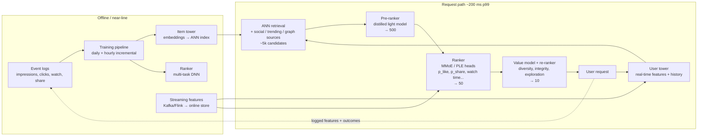
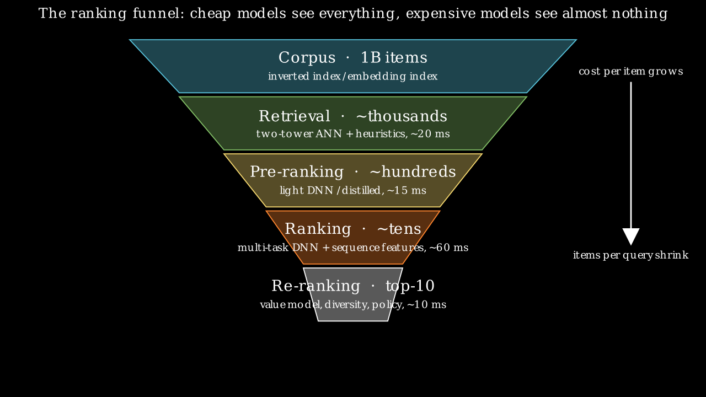
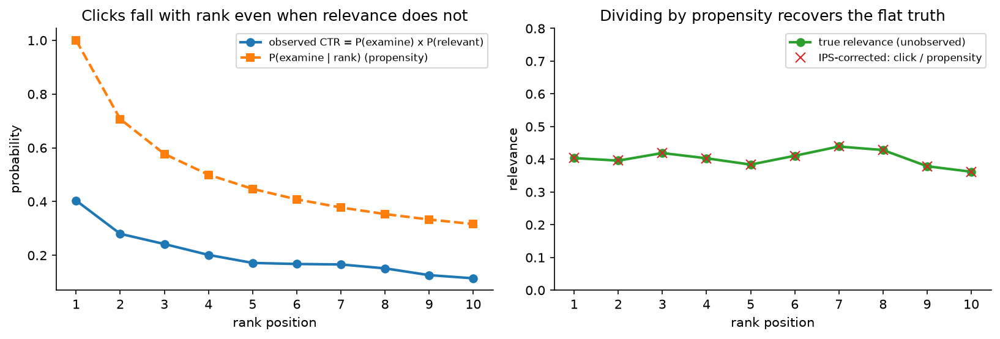
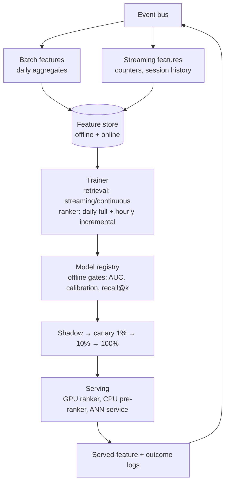
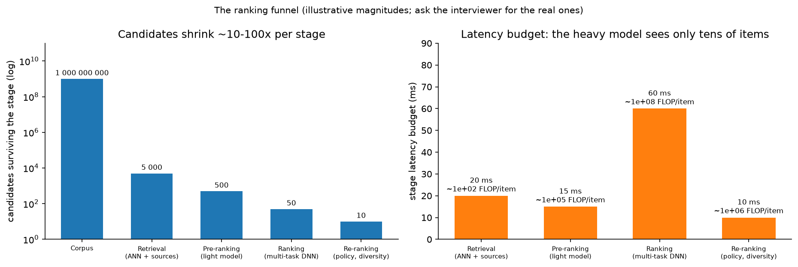

# Feed & recommendation ranking

> **Why this matters / who asks it.** "Design the home feed" is the most common ML
> system design prompt at Meta (Feed, Reels, Instagram Explore), TikTok/ByteDance
> (For You), YouTube (home and watch-next), Pinterest (home feed), LinkedIn (feed),
> Netflix and Spotify (home rows). The business problem is the same everywhere: from a
> corpus of $10^8$–$10^{10}$ items, pick the ten to show *this* user in the next 200 ms
> so that they come back tomorrow, without the system eating its own tail (clickbait,
> filter bubbles, creator starvation). The interviewer is checking that you can build
> the funnel, write down the objectives, combine them into one score, and say how the
> logged data lies to you.

## TL;DR: the whiteboard in 60 seconds

- **Funnel**: multi-source retrieval (thousands) → pre-ranker (hundreds) → multi-task
  ranker (tens) → value model + re-ranker (ten). Each stage has a count, a model
  cost and a latency slice.
- **Retrieval**: a two-tower model trained with in-batch sampled softmax and the
  **logQ correction** ($s_{ij} - \log q_j$), item embeddings in an ANN index, the user
  tower run at request time so it can see the last few minutes of behaviour.
- **Ranking**: one network, many heads ($p(\text{like})$, $p(\text{share})$,
  $\mathbb{E}[\text{watch time}]$, $p(\text{hide})$…) sharing a trunk through MMoE or
  PLE; sequence modelling over the user's history (DIN-style target attention,
  SIM-style search over long histories).
- **Value model**: heads are combined into one score, $v = \sum_t w_t\, \hat p_t$
  (or a product of powers); the weights are owned by product, tuned by A/B, and
  guarded by long-term holdouts. This is where "engagement vs well-being" lives.
- **Position bias**: a shallow tower takes position (and device) during training and
  is switched off at serving; alternatives are IPS weighting and randomised slots.
- **Freshness**: item-age features (YouTube's "example age"), streaming item
  embeddings, and minute-level model updates where the corpus turns over fast.
- **Exploration**: a small slice of traffic (or a bandit over slots) so new items and
  new users get labels; without it the logs only describe the incumbent policy.
- **Creator side**: exposure constraints and diversity in the re-ranker; a
  two-sided marketplace dies if the supply side starves.
- **Evaluation**: recall@k for retrieval, AUC/logloss per head and calibration for
  ranking, then A/B on the north star (sessions, DAU, time spent) with integrity and
  diversity guardrails and a long-term holdout.
- **Evidence**: YouTube (Covington 2016; Yi 2019; Zhao 2019), Facebook Feed and
  Instagram Explore (Meta Engineering 2021, 2023), ByteDance Monolith (2022),
  Pinterest PinSage (2018) and PinnerFormer (2022), Meta HSTU (2024).

{ width="720" }

*The funnel: cheap models see everything, expensive models see almost nothing. Every
decision in this chapter is about which stage a signal or a model belongs in.*

## 1. Requirements & scoping

**Functional.** Given a user and a context (surface, device, time), return an ordered
list of $K$ items from a corpus, with support for multiple item types (posts, videos,
ads slots handled by [chapter 3](03-ads-ctr-prediction.md)), pagination, and
per-request exclusions (already seen, blocked authors, policy-removed).

**Non-functional, ask for or assume these numbers.**

| Quantity | Ask | A defensible assumption if not given |
|---|---|---|
| DAU / peak QPS | "How many feed loads per day? Peak-to-average?" | 500M DAU × 10 loads = $5 \times 10^9$/day ≈ 60k QPS avg, 200k peak |
| Corpus | "How many candidate items are eligible per user? Total?" | $10^9$ items total; $10^7$–$10^8$ eligible per user after connections/language filters |
| Latency | "End-to-end p99 for the first page?" | 200 ms p99; model stages get ~120 ms of it |
| Freshness | "How fast must a new post be recommendable? A new user usable?" | Post: < 1 min; user: first session (cold start via context) |
| Availability | "What do we show if the ranker is down?" | Chronological or cached feed, never an error |
| Cost | "GPU budget for ranking?" | It is a cost centre; you will be asked to justify the ranker's size |

**Success metrics.**

- *North star (online)*: sessions per user per day, DAU/MAU, time spent; some teams
  use a survey-derived "worth your time" score (Meta's Feed post describes surveys
  used to calibrate rankings toward what people find valuable).
- *Guardrails*: report/hide rates, integrity prevalence (see [moderation](07-content-moderation.md)),
  creator diversity (share of impressions to the long tail of creators), p99 latency,
  ad load and revenue when ads are interleaved.
- *Offline proxies*: recall@k of retrieval against ranker-approved items; per-head
  AUC/logloss; NDCG on the final list; calibration (expected vs observed rates per
  head); coverage and novelty.

**Questions a staff engineer asks the interviewer.**

1. "Is the north star short-term engagement or retention? If retention, I need a
   long-term holdout, because the short-term test rewards clickbait."
2. "Is this a single-column infinite feed or a grid? A grid has weaker position
   effects and needs set-level diversity."
3. "How social is it, connected graph (friends), follow graph (creators), or
   unconnected (Explore/For You)? Unconnected feeds lean on content understanding
   and exploration; connected feeds have a natural candidate set."
4. "Do we have a real-time feature pipeline, or is everything daily?"
5. "What fraction of traffic can I spend on exploration?"

## 2. Data

**Sources.** Impression logs (which items were shown at which position, with the
features served at that moment), interaction logs (click, like, comment, share,
save, follow, hide, report, watch time, scroll-past dwell), item content (text,
images, video, audio, creator, upload time), user profile (declared interests,
demographics where permitted), social graph, and context (device, network, hour,
session position).

**Labels and their delays.** Every interaction type is a label for one head. Delays:
clicks and watch time within seconds; likes/comments minutes; follows and returns
days. A label of the form "did the user return tomorrow" cannot be attributed to a
single impression, which is why long-term outcomes are measured in A/B tests rather
than learned per item.

**Biases you must name.**

- *Position bias*: items at the top get examined more. Handled in §3.5.
- *Selection (logging-policy) bias*: you only have labels for items the old policy
  showed. The fix is exploration traffic and counterfactual estimators; without it,
  offline evaluation rewards imitation of the incumbent.
- *Survivorship*: an item removed by integrity never gets impressions; a creator who
  left never gets labels. The data is a biased sample of the world.
- *Feedback loops*: the model trains on outcomes it caused. Popular items become more
  popular; a bug that hides a category erases that category's training data within
  days. Sculley et al. (NeurIPS 2015) call these "hidden feedback loops"; the
  mitigation is holdout traffic that is not ranked by the model and monitoring of
  category coverage.
- *Implicit-negative ambiguity*: an impression without a click is weak evidence of
  dislike (the user may not have looked). Dwell-time thresholds and "scrolled past
  slowly" signals reduce the noise.

**Features.** Static (item category, creator, language, user profile), aggregated
(item CTR over 1h/1d/7d, creator quality scores, user activity counts), sequential
(the user's last $N$ engaged items with timestamps and action types), cross
(user-category affinity), embeddings (from the retrieval model, from content
encoders, from the graph). The sequential features are the ones that separate a
2024 ranker from a 2016 one.

**Freshness and consistency.** Real-time counters and the user's in-session history
must be available at request time within seconds of the event, which forces a
streaming pipeline (event bus → stream processor → online store) alongside the batch
pipeline. Log the served features (YouTube's paper and Google's *Rules of ML* both
stress training on what was served) so that training and serving see the same
values.

**Privacy.** Retention windows on raw event logs; aggregate rather than raw history
for long windows; no sensitive-attribute features without a policy reason; deletion
propagating to trained embeddings on a schedule.

## 3. Modelling

### 3.1 Baseline

Chronological, or "most popular in your network in the last 24 h", or a logistic
regression on a few dozen hand-built features. It is the control arm, the fallback,
and the sanity check that the pipeline works before any deep model is trained. In a
greenfield interview, say you would ship it first.

### 3.2 Retrieval: the two-tower model and its objective

*Why two towers.* The corpus is $10^9$ items and you have ~20 ms. Any model that
needs user and item together at scoring time is out. If the score factorises,
$s(u,i) = f_\theta(u)^\top g_\phi(i)$ with $f, g$ producing $d$-dimensional vectors,
then item vectors can be precomputed and indexed, and retrieval becomes approximate
nearest-neighbour search (see [retrieval & RAG](../part13-retrieval-eval-reliability/01-retrieval-and-rag.md)
for the index families).

*The objective.* Treat retrieval as extreme multiclass classification over the corpus
(Covington et al., RecSys 2016): the probability that user $u$ engages with item $i$
is a softmax over all items:

$$
P(i \mid u) = \frac{\exp(s(u,i))}{\sum_{j \in \mathcal{C}} \exp(s(u,j))}, \qquad
\mathcal{L} = -\sum_{(u,i)} \log P(i \mid u).
$$

The denominator over $|\mathcal{C}| = 10^9$ items is unaffordable, so it is estimated
from a sample. The cheapest sample is the *other items in the batch* (in-batch
negatives): for a batch of $B$ positive pairs, item $j$'s positive of another user
serves as a negative for this user. The estimate is biased because in-batch items are
drawn from the *engagement* distribution, so popular items appear as negatives far
more often than uniform sampling would produce, and the model learns to suppress
them.

*The logQ correction (Yi et al., RecSys 2019).* The full denominator is an
expectation under any proposal $q$:

$$
\sum_{j \in \mathcal{C}} e^{s_j} \;=\; \mathbb{E}_{j \sim q}\!\left[\frac{e^{s_j}}{q_j}\right]
\;=\; \mathbb{E}_{j \sim q}\!\left[e^{\,s_j - \log q_j}\right],
$$

so if you sample negatives with probability $q_j$ (the item's frequency in the
training stream) and use the *corrected logit* $s_j^c = s_j - \log q_j$ in the sampled
softmax, the gradient is an unbiased estimate of the full softmax gradient:

$$
\boxed{\;\mathcal{L}_{\text{batch}} = -\sum_{i \in B} \log
\frac{e^{\,s_{ii} - \log q_i}}{\sum_{j \in B} e^{\,s_{ij} - \log q_j}}\;}
$$

*What it means*: subtracting $\log q_j$ gives popular items back the probability
mass that over-sampling took away. Yi et al. estimate $q_j$ online from the average
gap between consecutive appearances of item $j$ in the stream, which is what makes
the correction work in a streaming trainer where the item distribution shifts.

*Practical details you should mention.* $L_2$-normalise both towers and scale by a
temperature (a plain dot product makes the loss chase norm); add a few *hard
negatives* mined from the ANN neighbourhood once the model is decent (with a
curriculum, as PinSage does); watch for *false negatives* (items the user would have
liked); train the user tower on rich, real-time features and the item tower on
content plus id embeddings so that brand-new items get a usable vector from content
alone (cold start).

*Multiple retrievers.* Production feeds union several sources: two-tower ANN,
follow-graph fan-out (recent posts from accounts you follow), co-engagement
item-to-item lists, trending, graph-neighbourhood (PinSage-style), and an
exploration source. Each contributes a labelled candidate set; the pre-ranker
sorts the union.

### 3.3 Pre-ranking

Thousands of candidates, ~15 ms. A small model, typically a distilled version of
the ranker: a two-tower or a small MLP over a dozen dense features and the retrieval
score, trained to imitate the ranker's ordering on the retrieval distribution
(knowledge distillation on the *candidate* distribution, not on impressions,
because impressions only cover what the old pre-ranker let through). Meta's
Instagram Explore post (Meta Engineering, August 2023) describes exactly this: a
lightweight first-stage ranker trained to approximate the heavier second-stage
model, so that the expensive model runs on far fewer candidates.

### 3.4 Ranking: multi-task, sequence-aware

The ranker sees a few hundred candidates with full user–item cross features and
outputs one prediction per interaction type. Three design questions:

**(a) How do the heads share capacity?** *Shared-bottom* (one trunk, $T$ heads) is
simple but suffers negative transfer when tasks conflict (like vs hide). *MMoE* (Ma
et al., KDD 2018) replaces the trunk with $E$ experts and gives each task its own
softmax gate over experts:

$$
h_t(x) = \sum_{e=1}^{E} g_{t,e}(x)\, f_e(x), \qquad g_t(x) = \softmax(W_t x),
\qquad \hat p_t = \sigma(\text{tower}_t(h_t(x))).
$$

*PLE* (Tang et al., RecSys 2020) goes further with task-specific *and* shared experts
in layered extraction, which its authors introduced to fix the "seesaw" pattern where
improving one task degrades another. YouTube's watch-next ranker (Zhao et al.,
RecSys 2019) uses MMoE to separate *engagement* tasks (clicks, watch time) from
*satisfaction* tasks (likes, survey responses).

**(b) What is the loss per head?** Binary cross-entropy for click-like events;
for watch time either a regression on $\log(1+t)$ or Covington's *weighted logistic
regression*: positives are weighted by watch time $T_i$, negatives by 1, and the
learned odds approximate expected watch time. Derivation: with $k$ positives of
total watch time $\sum T_i$ among $N$ impressions, the odds are
$\frac{\sum_i T_i}{N - k}$; when $k \ll N$ this is $\approx \mathbb{E}[T]\,(1 + P(\text{click}))
\approx \mathbb{E}[T]$, so $e^{\text{logit}}$ is served as the watch-time estimate.
The combined loss is $\mathcal{L} = \sum_t \lambda_t \mathcal{L}_t$, with $\lambda_t$
tuned so that no head dominates the shared parameters (uncertainty weighting or
gradient normalisation are the alternatives; in practice teams tune $\lambda_t$ by
A/B).

**(c) How does the user's history enter?** Pooling the last $N$ item embeddings loses
which parts of the history matter *for this candidate*. DIN (Zhou et al., KDD 2018)
introduced *target attention*: attend over the history with the candidate as the
query, so a candidate about running attends to past running purchases. DIEN adds a
GRU with an interest-evolution layer. For histories of $10^4$–$10^5$ events, SIM (Pi
et al., CIKM 2020) runs a *general search unit* first (hard search by category, or
soft search by embedding similarity) to pull the ~100 most relevant past events, then
target attention over those; Kuaishou's TWIN (KDD 2023) makes both stages use the
same attention so the pre-selection agrees with the fine stage. Pinterest's
PinnerFormer (KDD 2022) instead trains a transformer over the pin-action sequence to
produce a *daily* user embedding, with a "dense all-action" loss that predicts actions
over the next 28 days so the embedding stays useful even when it is a day old; the
paper reports this closed most of the gap between real-time and batch-computed user
representations, which lets the expensive sequence model run offline.

The staff-level answer: real-time short history (last 50 events, target attention, at
request time) *plus* a batch long-history embedding (PinnerFormer-style, daily),
because the first captures intent and the second captures taste, and only the first
needs to be cheap.

### 3.5 Position bias

The click label conflates examination with relevance. The two production patterns:

1. **Position as a training-only feature** with a *shallow tower* (Zhao et al., 2019):
   $\text{logit} = f(x) + g(\text{position}, \text{device})$ during training; at
   serving the position input is set to "missing", so $f(x)$ is a position-free
   relevance estimate. Simple, low variance; assumes examination and relevance are
   additive in logit space. Dropout on the position feature stops $f$ from relying on
   $g$.
2. **Inverse-propensity weighting** (Joachims et al., WSDM 2017): estimate
   $P(E=1 \mid k)$ from randomised swaps, weight each click by $1/P(E=1 \mid k)$.
   Unbiased under the examination hypothesis; high variance at low positions; needs
   an intervention or intervention harvesting.

{ width="720" }

*Left: observed CTR falls with rank even when true relevance is flat. Right: dividing
clicks by the examination propensity recovers the flat truth; the variance grows at
low positions, which is the cost of IPS.*

The [search chapter](02-search-ranking.md) derives the click model; here the point is
that position debiasing is a stage in the design, not a footnote.

### 3.6 The value model: combining heads into one score

The ranker outputs $\hat p_{\text{like}}, \hat p_{\text{comment}}, \hat p_{\text{share}},
\hat{\mathbb{E}}[\text{watch}], \hat p_{\text{hide}}, \hat p_{\text{report}}, \ldots$.
The list needs one number per item. The standard form is a weighted sum

$$
v(u,i) = \sum_t w_t\, \hat p_t(u,i) \;-\; \sum_{t \in \text{negative}} w_t\, \hat p_t(u,i),
$$

sometimes a product of powers $\prod_t \hat p_t^{\,w_t}$ (which behaves like a
geometric mean and punishes items that are terrible on any one head). Meta's Feed
post (Meta Engineering, January 2021) describes predicting the probability of
several actions and combining them into a single relevance score using weights;
the weights encode product policy (a comment is worth more than a like; a hide is
worth a large negative). Three facts to state:

- The weights are **not learned end to end**; they are set by product and tuned by
  A/B on the north star, because the north star (retention) is not attributable to a
  single impression.
- The heads must be **calibrated** for the weighted sum to mean anything: a
  probability of 0.2 from the share head has to mean 20 %, or the weights are
  silently rescaled. Monitor calibration per head per segment.
- The value model is where **integrity and well-being** enter: a large negative
  weight on predicted hide/report, and per-user surveys (Meta reports using them)
  to recalibrate toward "worth your time".

### 3.7 Re-ranking

Set-level policies over the top ~50: diversity (no more than $m$ items per creator or
topic; a determinantal or greedy MMR step), integrity filters, freshness slots,
exploration slots, ad interleaving, business rules. Keep the re-ranker cheap and
inspectable; it is the layer product managers will change most often.

### 3.8 Cold start and exploration

- *New items*: content-only item tower (text/image encoders, see [CLIP](../part08-multimodal/03-clip-contrastive.md))
  plus a small forced-exposure budget so they collect labels; ByteDance's public
  description of TikTok's recommendation says signals like completing a video are
  weighted heavily, which is why the first impressions of a new video matter.
- *New users*: onboarding choices, context (country, language, device), and a
  popularity prior; move to personalised retrieval after a handful of events.
- *Exploration*: a fixed slice of slots chosen by a bandit (Thompson sampling over
  candidates with uncertain scores) or by uniform randomisation; both create the
  propensities needed for counterfactual evaluation. Netflix's artwork
  personalisation (Netflix Tech Blog, December 2017) is the canonical
  contextual-bandit deployment in a recommendation product.

### 3.9 Creator-side fairness

A two-sided feed must keep the supply side alive. Exposure constraints (each creator
tier gets a minimum share of impressions), fairness-of-exposure objectives (Singh &
Joachims, KDD 2018) and "new creator" boosts in the re-ranker; monitor the Gini of
impressions across creators as a guardrail.

## 4. Training & serving

**Cadence.** The ranker retrains daily from the last 30–60 days with hourly
incremental updates; the retrieval towers can be trained continuously on the event
stream because their objective is a stream of (user, item) pairs. ByteDance's
Monolith paper (Liu et al., 2022) argues for *online training* with
minute-level parameter synchronisation from the training parameter servers to the
serving ones, and reports that this beats batch updates because user interest and the
item corpus shift within hours; the cost is a system that must tolerate a bad update
quickly (they also describe collisionless hash-table embeddings with expiry so that
the table does not grow without bound).

**Feature store.** Point-in-time-correct offline features for training and a
low-latency online store; the same transformation code for both. Details in the
[platform chapter](12-ml-platform-feature-store-monitoring.md).

**Latency budget (200 ms p99, illustrative).**

| Stage | Items | Model | Budget | Hardware |
|---|---|---|---|---|
| Feature fetch (user) | 1 | key-value store | 10 ms | in-memory store |
| Retrieval (all sources, parallel) | → 5k | two-tower ANN + lists | 20 ms | ANN service (CPU/GPU) |
| Feature fetch (items) | 5k | batched lookups | 20 ms | in-memory store |
| Pre-ranker | 5k → 500 | small MLP / distilled | 15 ms | CPU or shared GPU |
| Ranker | 500 → 50 | multi-task DNN, sequence attention | 60 ms | GPU, batched |
| Value model + re-rank | 50 → 10 | arithmetic + rules | 10 ms | CPU |
| Assembly + network | | | 40 ms | |
| Headroom | | | 25 ms | |

{ width="760" }

*The right-hand panel is the argument for the funnel: the heavy model gets the most
time but sees the fewest items. Ask the interviewer for the real budget and redo the
table.*

**Caching.** Item embeddings and item features are cached hot; user embeddings can be
cached for seconds (they change with every event); whole-feed caching works for
low-personalisation surfaces (trending) and as the degraded-mode fallback.

**Hardware and cost.** From the framework's arithmetic: 200k peak QPS × 500 candidates
= $10^8$ ranker items/s; at $5 \times 10^5$ items/s per GPU that is ~200 GPUs for the
ranker at peak, before replicas. The pre-ranker on 10× the items with a 1000× cheaper
model is CPU work. The embedding tables (billions of ids × 64 dims) do not fit on one
device and are sharded across parameter servers or GPUs; see the
[ads chapter](03-ads-ctr-prediction.md) for the memory arithmetic and DLRM-style
sharding.

**Degradation.** Feature store slow → serve with default features; ranker timeout →
pre-ranker order; ANN down → follow-graph and trending sources only; everything
down → cached last feed or chronological.

## 5. Evaluation & experimentation

**Offline.**

- *Retrieval*: recall@k, but measure it against what the *ranker* would have chosen
  from the full candidate set on exploration traffic, not against logged clicks;
  logged clicks only exist for what the old retriever surfaced.
- *Ranking*: AUC and logloss per head, NDCG of the final list, and **calibration
  per head** (expected vs observed rate in score deciles, per surface and segment).
  Time-based splits only; a random split leaks tomorrow's popularity into today's
  training set.
- *Counterfactual estimates*: IPS or doubly-robust estimators of the new policy's
  value using the exploration slice's propensities, which turns offline evaluation
  from "agreement with the old system" into an estimate of the online outcome.

**Online.**

- A/B on the north star with pre-registered guardrails; interleaving (mixing two
  rankers' lists and attributing engagements) for quick, sensitive comparisons of
  ranking quality; **long-term holdouts** (a small population kept on the old system
  for months) to detect engagement gains that cost retention.
- Power: with sessions/user as the metric and a coefficient of variation near 2–3,
  a 0.5 % lift needs millions of users per arm (framework §5); use CUPED and
  stratification ([experimentation chapter](11-notifications-uplift-experimentation.md)).

**Monitoring and retraining triggers.** Prediction distributions per head, calibration
drift, feature null rates, retrieval source mix, creator-impression Gini, and the
integrity prevalence estimate. Retrain on schedule; roll back on a calibration or
null-rate alarm; treat a sudden change in the retrieval source mix as an incident.

## 6. Trade-offs & alternatives

| Decision | Chosen | Alternative | When you'd flip |
|---|---|---|---|
| Retrieval model | Two-tower + ANN with logQ correction | Item-to-item co-engagement lists | Small, stable corpus; or as an *additional* source for strong collaborative signal |
| Negatives | In-batch + mined hard negatives | Uniform random negatives | Early training (hard negatives too early collapse the model) |
| Pre-ranker | Distilled from ranker on candidate distribution | Reuse retrieval score | When the ranker is small enough to score everything |
| Multi-task sharing | MMoE / PLE | Shared-bottom | Tasks are highly correlated and small in number |
| Watch-time objective | Weighted LR (odds ≈ E[T]) | Regression on log time | You need the full distribution (e.g. quantiles) |
| Position handling | Shallow position tower | IPS weighting | You have clean randomisation and few positions |
| History modelling | Real-time short + batch long (PinnerFormer-style) | Fully real-time long sequence | Latency budget allows it (rare) or SIM-style retrieval keeps it cheap |
| Score combination | Weighted sum of calibrated heads | Learned combiner on long-term reward | You can attribute long-term outcomes to impressions (usually you cannot) |
| Training cadence | Daily + hourly incremental | Fully online (Monolith) | Corpus turns over in hours (short video) and you can tolerate rollback risk |
| Exploration | Fixed slots with bandit | None | Never none; reduce the slice if the product is mature |

**Failure modes and how you would catch them.**

- *Feedback loop collapse* (a category disappears): monitor category coverage on the
  holdout population; the holdout is the detector.
- *Calibration drift after a feature change*: per-head reliability monitoring; the
  value model amplifies miscalibration.
- *Clickbait winning*: hide/report guardrails, the long-term holdout, and a survey
  head.
- *Training–serving skew*: compare served-feature logs against training features
  on sampled requests daily.
- *ANN recall silently dropping after an index rebuild*: recall@k against brute
  force on a sample, every rebuild.
- *Traffic spike*: staged load-shedding (smaller k, pre-ranker-only, cached).

## 7. How real companies did it: as mock interviews

Each case is framed as an interview: the company's business prompt, then the walk
in the interview's order, then the script you would use to justify the decision the
case proves.

### 7.1 YouTube: "recommend from a billion-video corpus"

**Interviewer prompt.** "Users watch billions of hours a day. Given a user's watch
and search history, recommend videos from a corpus of hundreds of millions on the
home page, with strict latency, and make new uploads discoverable quickly."

**Walkthrough.** *Clarify*: home surface, hundreds of candidates scored per request,
freshness of new uploads matters. *Metrics*: watch time, not clicks (clicks reward
clickbait). *Data*: watch histories including off-site embeds, search tokens,
demographics; "example age" as a feature. *Model*: candidate generation as extreme
multiclass classification with sampled softmax, user vector from averaged
embeddings of watches and searches; ranking by weighted logistic regression whose
odds estimate expected watch time. *Serve*: nearest-neighbour lookup for candidates;
the ranking network scores hundreds. *Evaluate*: offline precision/recall/ranking
loss for triage, live A/B for the decision.

**What the source says.** Covington, Adams & Sargin, "Deep Neural Networks for
YouTube Recommendations" (RecSys 2016) describes the two-stage design, the sampled
softmax candidate generator served via nearest-neighbour search, the "example age"
feature that removed the model's bias toward stale content, the choice to predict a
*held-out next watch* rather than a random held-out watch (to avoid leaking future
information), and watch-time-weighted logistic regression for ranking.

!!! tip "How to say it in the interview: retrieval as classification"
    "For retrieval I'd train a two-tower model with a sampled softmax objective and
    serve it through approximate nearest neighbour search. The alternative is
    item-to-item collaborative filtering from co-watch counts, which is simpler and
    works well for popular items but has no way to embed a brand-new video or a
    rarely watched one. The trade-off is that a factorised score can't model
    user–item interactions, so I lean on the ranker for that. YouTube reported in
    'Deep Neural Networks for YouTube Recommendations' (RecSys 2016) that framing
    candidate generation as extreme multiclass classification with sampled softmax,
    and serving it as nearest-neighbour lookup, let them recommend from a corpus of
    millions within their latency budget. Adding an 'example age' feature
    fixed the model's bias toward old videos, which is why I'd add item age as a
    feature to the towers. I'd flip to co-engagement lists only as an extra
    candidate source, never as the only one."

### 7.2 Facebook Feed: "rank posts for two billion people"

**Interviewer prompt.** "A user opens Facebook. There are thousands of eligible posts
from friends, groups and pages. Rank them so that the feed is worth the user's time,
and make it possible for product to adjust what 'worth' means."

**Walkthrough.** *Clarify*: connected graph, so the inventory is bounded per user;
integrity constraints; multiple post types. *Metrics*: engagement actions plus
survey-based "worth your time"; integrity guardrails. *Data*: per-action labels
(like, comment, share, hide…), survey responses. *Model*: a lightweight model to cut
inventory to a few hundred, then multi-task neural nets predicting each action, then
a value model that combines them with product-owned weights. *Serve*: predictions
computed per post per user in the request path. *Evaluate*: A/B on engagement and
survey metrics.

**What the source says.** Meta Engineering, "How machine learning powers Facebook's
News Feed ranking algorithm" (January 2021) describes the inventory → lightweight
model → neural-network ranking pipeline, the prediction of multiple action
probabilities, their combination into a single score, and the use of surveys to
tune ranking toward posts people say are worth their time.

!!! tip "How to say it in the interview: the value model"
    "I would not train one head for 'engagement'; I'd predict each action separately
    and combine the calibrated probabilities with product-owned weights in a value
    model. The alternative is a single learned objective, which is cleaner but makes
    it impossible for product to say 'a comment is worth more than a like' or 'a
    hide is worth minus fifty likes' without retraining, and it can't incorporate
    survey signals that don't exist per impression. The trade-off is that the heads
    must be calibrated and the weights must be re-tuned by A/B whenever the mix
    changes. Meta described this design in 'How machine learning powers Facebook's
    News Feed ranking algorithm' (2021): action predictions combined into a
    relevance score, with surveys used to steer the weights toward what people find
    valuable. I'd add a long-term holdout, because the weights that win a two-week
    test are not always the ones that keep people a year."

### 7.3 Instagram Explore: "an unconnected feed at scale"

**Interviewer prompt.** "Explore shows content from accounts the user does not
follow. Candidates come from the whole corpus. Build the ranking system and keep the
cost manageable as the heavy model gets heavier."

**Walkthrough.** *Clarify*: unconnected, so retrieval must be learned; grid layout.
*Metrics*: engagement with integrity and diversity guardrails. *Data*: user
interaction history, item content. *Model*: two-tower retrieval; a first-stage
lightweight ranker that approximates the second-stage model; a multi-task
multi-label second-stage ranker; a final re-ranking pass for diversity and rules.
*Serve*: the first-stage ranker keeps the second stage's candidate count small.
*Evaluate*: A/B.

**What the source says.** Meta Engineering, "Scaling the Instagram Explore
recommendations system" (August 2023) describes the multi-stage funnel (retrieval,
first-stage ranking, second-stage ranking, final re-ranking), two-tower retrieval, and
a first-stage ranker trained to approximate the second-stage model's output so the
expensive model runs on fewer candidates.

!!! tip "How to say it in the interview: the pre-ranker"
    "Between retrieval and the heavy ranker I'd put a pre-ranker distilled from the
    ranker, trained on the retrieval candidate distribution rather than on
    impressions. The alternative is to reuse the retrieval score for the cut, which
    costs nothing but throws away cross features and makes the funnel's recall depend
    on the weakest model. The trade-off is another model to train, monitor and keep
    consistent with its teacher. Instagram described this in 'Scaling the Instagram
    Explore recommendations system' (2023): a lightweight first-stage ranker that
    approximates the second-stage model so the second stage only sees a small set.
    I'd revisit if the ranker became cheap enough to score everything the retriever
    returns."

### 7.4 ByteDance / TikTok: "the corpus turns over in hours"

**Interviewer prompt.** "Short videos go viral in hours and die in a day. A model
trained last night is stale by lunch. Design training so the recommender keeps up."

**Walkthrough.** *Clarify*: how quickly must feedback affect ranking, minutes.
*Metrics*: engagement with a rollback SLA. *Data*: an unbounded stream of new ids.
*Model*: sparse embedding tables that can grow (hash without collisions, expire
stale ids) and a dense model. *Serve*: separate training and serving parameter
servers; sparse parameters synchronised at minute granularity, dense parameters
daily. *Evaluate*: online A/B of online vs batch training.

**What the source says.** Liu et al., "Monolith: Real Time Recommendation System
With Collisionless Embedding Table" (2022, [arXiv:2209.07663](https://arxiv.org/abs/2209.07663)) describes cuckoo-hash
collisionless embedding tables with expiry, online training with frequent
synchronisation of sparse parameters to serving, and reports online training
outperforming batch training in their experiments.

!!! tip "How to say it in the interview: training cadence"
    "I'd choose daily retraining with hourly incremental updates for the ranker by
    default, and move to minute-level online training only if the interviewer tells
    me the corpus turns over within hours. The alternative (full online learning)
    is what ByteDance built in Monolith (2022), where sparse embeddings are
    synchronised from training to serving at minute granularity and they report
    that it beats batch training; the trade-off they accept is a system that must
    detect and roll back a bad update fast, and a collisionless embedding table
    with expiry so the parameters don't grow forever. For a slower product, the
    risk isn't worth it, so I'd keep batch and spend the effort on real-time
    features instead, which give most of the freshness benefit with none of the
    training instability."

### 7.5 Pinterest: "graph and sequence, and what to compute offline"

**Interviewer prompt.** "Pins live on boards; users save pins to boards. Use that
graph and each user's action sequence to recommend pins, at billions of nodes."

**Walkthrough.** *Clarify*: item graph is huge, user histories are long. *Metrics*:
engagement (saves, clicks). *Data*: pin–board bipartite graph, action sequences.
*Model*: PinSage graph convolutions with random-walk importance pooling produce pin
embeddings; PinnerFormer transformer over action sequences produces user embeddings
with a loss that predicts actions over the next 28 days. *Serve*: pin embeddings
precomputed; user embeddings refreshed daily in batch rather than at request time.
*Evaluate*: offline retrieval metrics and A/B.

**What the sources say.** Ying et al., "Graph Convolutional Neural Networks for
Web-Scale Recommender Systems" (KDD 2018, [arXiv:1806.01973](https://arxiv.org/abs/1806.01973)) describes PinSage:
random-walk-based neighbourhood sampling with importance pooling, a
producer–consumer minibatch pipeline, a hard-negative curriculum, and deployment on
a graph of billions of nodes and edges with reported engagement gains. Pancha et
al., "PinnerFormer: Sequence Modeling for User Representation at Pinterest" (KDD
2022, [arXiv:2205.04507](https://arxiv.org/abs/2205.04507)) describes the transformer user model, the dense all-action
loss over a 28-day horizon, and that this closed most of the gap between real-time and
daily-batch user embeddings.

!!! tip "How to say it in the interview: long history offline, short history online"
    "For the user's history I'd run a transformer over the long action sequence in
    batch, once a day, and keep only the last few dozen events real-time in the
    request path. The alternative is a fully real-time sequence model, which is
    fresher but puts a transformer over thousands of events on the hot path for
    every request. The trade-off is a day of staleness in the long-term
    representation. Pinterest's PinnerFormer paper (KDD 2022) is the evidence that
    this is acceptable: by training with a dense all-action loss that predicts the
    next 28 days of actions rather than the next action, they report that a daily
    batch embedding recovers most of the value of a real-time one. I'd flip to
    SIM-style online search over the long history if the product were intent-heavy,
    like e-commerce, where the last hour dominates."

### 7.6 Meta: "make the ranker a sequence model"

**Interviewer prompt.** "Our ranking models have plateaued despite more features.
Propose the next architecture and how you'd know it is worth its compute."

**Walkthrough.** *Clarify*: budget for compute growth; serving latency constraints.
*Model*: reformulate ranking and retrieval as sequential transduction over the
user's action stream (a "generative recommender"), with an efficient attention
variant designed for long, heterogeneous action sequences. *Evaluate*: offline
scaling behaviour with compute, then online A/B.

**What the source says.** Zhai et al., "Actions Speak Louder than Words: Trillion-
Parameter Sequential Transducers for Generative Recommendations" (ICML 2024,
[arXiv:2402.17152](https://arxiv.org/abs/2402.17152)) introduces HSTU, reports scaling behaviour with compute, and
reports online metric gains from deployment on Meta surfaces.

!!! tip "How to say it in the interview: when to bet on the sequence model"
    "If the interviewer asks what comes after MMoE over hand-built features, my
    answer is a sequence model over the raw action stream, because Meta reported in
    'Actions Speak Louder than Words' (ICML 2024) that a transducer over user
    actions scaled with compute in a way feature-engineered DLRM-style models did
    not, and produced online gains. The alternative is to keep adding features to
    the existing ranker; cheaper, but the paper's point is that it saturates. The
    trade-off is serving cost and a rewrite of the feature pipeline, so I'd stage it:
    first as the long-history user encoder feeding the existing ranker, then as the
    ranker itself once the offline scaling curve justifies the GPUs."

## 8. Staff-level follow-ups

!!! interview "Your ranker is 2 % better on AUC offline but sessions are flat online. Why?"
    Check, in order. (1) *Where* the AUC came from: if the gain is in reordering
    items below position 20, users never see it; compute AUC restricted to the top
    slots. (2) *Policy bias*: the offline set was logged under the old ranker; the
    new ranker's preferred items have few labels, so offline evaluation rewards
    agreement with the old one; use the exploration slice and an IPS estimate. (3)
    *Calibration*: a better-discriminating head that is miscalibrated makes the
    value model worse; check reliability per head. (4) *Skew*: a feature computed
    differently in serving; diff served-feature logs with training features. (5)
    *Power*: a 2 % AUC gain typically translates to a sub-1 % online lift; compute
    the minimum detectable effect before calling it flat.

!!! interview "How do you handle a 5× spike at a live event?"
    Pre-warm caches of trending and event-related candidates; shed load by stage
    (reduce retrieval k, pre-ranker-only for a fraction, cached feeds for
    low-activity users); increase batch size on GPUs to trade latency for
    throughput; keep the p99 within budget by dropping the re-ranker's optional
    passes. The metric I watch during the spike is the fraction of requests served in
    degraded mode, not the error rate, because degraded mode should never error.

!!! interview "Why the logQ correction? Show me the maths."
    In-batch negatives are sampled proportional to item frequency $q_j$, so the
    sampled softmax over-penalises popular items. The full denominator
    $\sum_j e^{s_j}$ equals $\mathbb{E}_{j \sim q}[e^{s_j}/q_j]$, so using
    $s_j - \log q_j$ as the logit for sampled items makes the estimate unbiased. In
    practice $q_j$ is estimated online from the gaps between an item's appearances
    in the stream (Yi et al., RecSys 2019). Without it, retrieval under-serves the
    head; with it and no exploration, it may over-serve the head, so I still cap
    popularity in the re-ranker.

!!! interview "How do you combine p(like), p(share) and watch time into one score, and who sets the weights?"
    A weighted sum of *calibrated* heads, with negative weights on hide/report; the
    weights are set by product and tuned by A/B on the north star because
    retention cannot be attributed to a single impression, so it cannot be a
    training label. I'd propose the initial weights from the relative long-term
    value of each action estimated with a holdout ("users who share come back
    X times more"), then iterate. I'd check that no head's miscalibration is
    silently rescaling the others.

!!! interview "A new item has no history. How does it get recommended?"
    Content-based item tower (text/image encoders) gives it a vector immediately;
    a small forced-exposure budget (or a bandit on the exploration slots) gives it
    labels; its early engagement rate, corrected for the audience it was shown to,
    becomes a feature. Cap the exposure so a flood of new items cannot degrade the
    feed; measure time-to-first-thousand-impressions as a creator-side metric.

!!! interview "How do you stop the feed from collapsing into one topic per user?"
    Three layers: diversity constraints in the re-ranker (per-topic and per-creator
    caps, MMR-style penalties), an exploration slice that samples outside the
    user's estimated interests, and a metric (topic entropy per user over a week)
    used as an A/B guardrail. The feedback loop is real: without the guardrail, a
    ranker that maximises short-term engagement will narrow the distribution and
    the logs will confirm that narrowing was right.

!!! interview "Real-time features vs online model training: which first?"
    Real-time features first. They give most of the freshness benefit (the ranker
    sees what you did a minute ago) with a stateless model that can be rolled back
    by pointing serving at the previous checkpoint. Online training is worth it
    when the *item* side moves faster than daily retraining can follow (short video, news); ByteDance's Monolith paper is
    the evidence that the gain is real in that regime, and its parameter
    synchronisation design is the price.

!!! interview "How would you evaluate a new retrieval source offline?"
    Not by recall against logged clicks. The logs only contain what old sources
    surfaced. Instead: (a) recall against the *ranker's* top choices over the union
    of all sources on exploration traffic; (b) the marginal contribution: how many
    final-list items come only from the new source; (c) an online A/B where the new
    source is added to the union, measuring final-list engagement and the source's
    share of impressions.

!!! interview "Where does the interviewer's 'engagement vs well-being' question land in your design?"
    In four places: the label set (surveys and hide/report as first-class heads), the
    value model (large negative weights, product-owned), the guardrails (prevalence,
    report rate, topic entropy), and the long-term holdout. I'd say explicitly that
    a system without a holdout cannot claim to optimise well-being, because the only
    metric that measures it, retention, is unobservable in a two-week test.

!!! interview "What breaks first at 10× scale?"
    The feature fan-out: 10× QPS × 5k candidates × dozens of features per candidate is
    the first thing that saturates the online store; the fixes are item-feature
    caching close to the ranker, fewer candidates from retrieval, and packing item
    features into the ANN payload. Second is the embedding table memory, which moves
    to sharded parameter servers or multi-GPU model parallelism. Third is the
    experimentation platform: hundreds of concurrent tests need layered
    assignment and variance reduction.

## 9. Scaling & evolution

- **1M users.** One retrieval source (follow graph plus popularity), a GBDT ranker on
  dense features, daily retraining, no GPUs, simple A/B. Spend effort on logging
  served features and on the exploration slice; these are what make the next stage
  possible.
- **100M users.** Two-tower retrieval with ANN, a multi-task DNN ranker on GPU,
  real-time features via a streaming pipeline, a pre-ranker once the ranker cannot
  score the retrieval set, a value model with product-owned weights, long-term
  holdouts.
- **1B users.** Sharded embedding tables, incremental or online training for the
  sparse parameters, long-history user models computed in batch, hard-negative
  mining pipelines, counterfactual evaluation infrastructure, and a platform team
  ([chapter 12](12-ml-platform-feature-store-monitoring.md)).
- **Batch → real-time.** Streaming features first; then streaming item embeddings so
  a new item is retrievable within a minute; online training last.
- **Single model → LLM-augmented.** LLMs and foundation-model encoders enter as
  *content understanding* (item embeddings, topic labels, quality scores computed
  offline), *synthetic labels* for rare heads, *judges* for quality audits, and
  *user-interest summaries* as features; they do not enter the hot path at 200k QPS.
  The ranker itself becomes a sequence model (HSTU-style) as the compute budget
  allows.

## References

- Covington, P., Adams, J., Sargin, E. "Deep Neural Networks for YouTube Recommendations." RecSys 2016.
- Yi, X. et al. "Sampling-Bias-Corrected Neural Modeling for Large Corpus Item Recommendations." RecSys 2019.
- Zhao, Z. et al. "Recommending What Video to Watch Next: A Multitask Ranking System." RecSys 2019.
- Ma, J. et al. "Modeling Task Relationships in Multi-task Learning with Multi-gate Mixture-of-Experts." KDD 2018.
- Tang, H. et al. "Progressive Layered Extraction (PLE): A Novel Multi-Task Learning (MTL) Model for Personalized Recommendations." RecSys 2020.
- Zhou, G. et al. "Deep Interest Network for Click-Through Rate Prediction." KDD 2018 ([arXiv:1706.06978](https://arxiv.org/abs/1706.06978)); "Deep Interest Evolution Network." AAAI 2019 ([arXiv:1809.03672](https://arxiv.org/abs/1809.03672)).
- Pi, Q. et al. "Search-based User Interest Modeling with Lifelong Sequential Behavior Data for Click-Through Rate Prediction." CIKM 2020 ([arXiv:2006.05639](https://arxiv.org/abs/2006.05639)).
- Chang, J. et al. "TWIN: TWo-stage Interest Network for Lifelong User Behavior Modeling in CTR Prediction at Kuaishou." KDD 2023 ([arXiv:2302.02352](https://arxiv.org/abs/2302.02352)).
- Meta Engineering. "How machine learning powers Facebook's News Feed ranking algorithm." January 2021.
- Meta Engineering. "Scaling the Instagram Explore recommendations system." August 2023.
- Liu, Z. et al. "Monolith: Real Time Recommendation System With Collisionless Embedding Table." 2022 ([arXiv:2209.07663](https://arxiv.org/abs/2209.07663)).
- Ying, R. et al. "Graph Convolutional Neural Networks for Web-Scale Recommender Systems." KDD 2018 ([arXiv:1806.01973](https://arxiv.org/abs/1806.01973)).
- Pancha, N. et al. "PinnerFormer: Sequence Modeling for User Representation at Pinterest." KDD 2022 ([arXiv:2205.04507](https://arxiv.org/abs/2205.04507)).
- Zhai, J. et al. "Actions Speak Louder than Words: Trillion-Parameter Sequential Transducers for Generative Recommendations." ICML 2024 ([arXiv:2402.17152](https://arxiv.org/abs/2402.17152)).
- Joachims, T., Swaminathan, A., Schnabel, T. "Unbiased Learning-to-Rank with Biased Feedback." WSDM 2017.
- Singh, A., Joachims, T. "Fairness of Exposure in Rankings." KDD 2018.
- Netflix Technology Blog. "Artwork Personalization at Netflix." December 2017.
- TikTok Newsroom. "How TikTok recommends videos #ForYou." June 2020.
- Sculley, D. et al. "Hidden Technical Debt in Machine Learning Systems." NeurIPS 2015.
