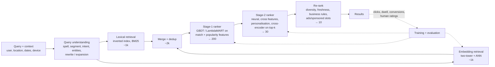
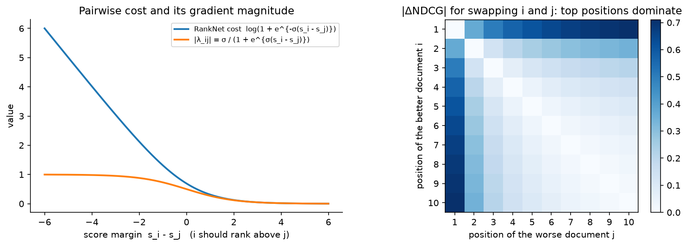

# Search ranking

> **Why this matters / who asks it.** Search is the oldest ML system design prompt
> and still one of the most discriminating. Google asks it for web and YouTube search,
> Airbnb for listing search ("rank homes for a query with dates and guests"), Amazon
> for product search, LinkedIn for people/job search, Etsy and Pinterest for their
> marketplaces. The business problem is: given a short, ambiguous query, return the
> ten results that satisfy the intent, where "satisfy" is measured by human relevance
> judgments *and* by what people click, book or buy, and the two disagree. The
> interviewer is checking whether you can separate query understanding, retrieval and
> ranking; whether you know learning-to-rank losses and NDCG; and whether you can put
> a BERT-class model in the funnel without blowing the latency budget.

## TL;DR: the whiteboard in 60 seconds

- **Three problems, not one**: query understanding (what did they mean), retrieval
  (find every candidate that could satisfy it, cheaply), ranking (order the survivors
  by expected satisfaction).
- **Hybrid retrieval**: the inverted index for exact matches and rare tokens, an
  embedding index for semantic matches; merge and dedup. Neither alone is enough.
- **Learning to rank**: pointwise (regression/classification per document) is
  simplest; pairwise (RankNet) learns from preferences; listwise (LambdaRank/LambdaMART)
  optimises NDCG directly by weighting each pair by $|\Delta\text{NDCG}|$. GBDT
  LambdaMART is still the strongest tabular baseline; neural rankers win when they
  can use text, images and long histories.
- **Relevance vs engagement**: human-rated relevance is the guardrail and the
  tie-breaker; engagement (click, book, buy) is the training signal and the north
  star; when they conflict, the design has to say which wins and where.
- **Position bias** must be modelled (examination × relevance) before any click
  label is trusted.
- **Cross-encoders (BERT on query–document pairs)** are the accuracy ceiling and are
  affordable only on the top few dozen; late-interaction (ColBERT) and distillation
  are how you stretch them.
- **Personalisation** is a feature set in the stage-2 ranker, gated by query intent:
  a navigational query should not be personalised.
- **Freshness** is a query property (some queries want the newest) and a document
  feature. The ranker learns how much weight each one gets.
- **Evaluation**: NDCG on human-judged sets, offline click metrics with propensity
  correction, then interleaving and A/B on conversions with relevance guardrails.
- **Evidence**: Airbnb (KDD 2019, KDD 2020, CIKM 2023), Facebook EBR (KDD 2020),
  Amazon semantic product search (KDD 2019), LinkedIn DeText (CIKM 2020) and talent
  search (SIGIR 2018), Etsy unified embeddings (2023), Google BERT in Search (2019).

## 1. Requirements & scoping

**Functional.** Text query (possibly with structured constraints: dates, location,
price range, filters), optional context (user history, location, device), returning
a ranked page of results with facets, spelling suggestions and possibly sponsored
results. Support pagination, filters, and zero-result handling.

**Non-functional, ask for or assume.**

| Quantity | Ask | Defensible assumption |
|---|---|---|
| QPS | "Queries per second at peak?" | 10k–100k for a large marketplace; web search is far higher |
| Corpus | "How many documents/listings? How often do they change?" | $10^7$ listings (Airbnb-scale) to $10^{10}$ pages (web) |
| Latency | "p99 for the results page?" | 300 ms p99; ranking gets ~100 ms |
| Freshness | "How fast must a new listing/product be searchable?" | Minutes for marketplaces; seconds for news |
| Constraints | "Hard filters (availability, geography, policy)?" | Applied at retrieval, never after ranking |
| Labels | "Do we have human relevance judgments? Conversions?" | Both; judgments are sparse and expensive |

**Success metrics.**

- *North star*: conversion (booking, purchase, application) per search session;
  for web search, long-click rate or session success; for enterprise search, task
  completion.
- *Guardrails*: human-rated relevance (NDCG on judged queries, run offline every
  release and online with side-by-side raters), zero-result rate, query
  abandonment, latency, revenue where sponsored results exist.
- *Offline proxies*: NDCG@10 on judged sets; propensity-weighted NDCG on click logs;
  recall@k of retrieval against judged relevant documents; per-stage agreement with
  the final ranker.

**Questions a staff engineer asks.**

1. "What is the unit of success, a click, a booking, a stay that gets a five-star
   review? Longer-horizon labels are cleaner but sparser."
2. "Are there hard constraints (availability, jurisdiction) that must be applied at
   retrieval?" A ranker cannot recover a document the index filtered out.
3. "How much of the corpus is textual vs structured? Do we have images?" That
   decides whether a cross-encoder or a GBDT is the stage-2 model.
4. "How head-heavy is the query distribution?" The top queries can be cached and
   hand-tuned; the tail needs generalisation and embedding retrieval.
5. "Do we have rater budget? How many judged queries per week?"

## 2. Data

**Sources.** Query logs with session context; impression logs (which documents at
which position); interaction logs (click, dwell, add-to-cart, booking, return to
results = "pogo-sticking"); document content and structured attributes; human
relevance judgments on a stratified query sample; historical query→document
co-occurrence.

**Labels and their delays.** Clicks: immediate, plentiful, position-biased, and
noisy (a click followed by an immediate return is negative evidence). Conversions:
delayed by hours to days, sparse, and confounded by price and availability. Human
judgments: unbiased with respect to presentation, expensive, and blind to
personalisation and price sensitivity. A production ranker uses all three: clicks
and conversions as training labels with propensity correction, human judgments as
the evaluation guardrail and for training a *relevance head* that the engagement
ranker cannot drift away from.

**Biases.** Position bias (the click model below). *Selection bias*: only retrieved
documents are ever labelled, so retrieval improvements are invisible in logged
data until the ranker retrains on them (Facebook's EBR paper describes retraining
the later stages on the new candidates for exactly this reason). *Presentation bias*:
thumbnails, prices and badges change click rates independently of relevance.
*Popularity bias*: a document that has been ranked high accumulates clicks that make
it rank higher.

**Features by stage.** *Query*: length, language, intent class (navigational,
informational, transactional, local), entities, predicted category, freshness
intent. *Document*: static quality (reviews, completeness, authority), popularity
counters over windows, freshness, price, availability. *Query–document match*: BM25
per field, exact/partial title match, embedding cosine, learned cross-encoder score
on the top-k, historical query–document CTR (a very strong and very biased feature).
*User–document*: personal history matches (previously viewed sellers, price band),
location distance. Stage-1 gets the cheap ones. Stage-2 gets everything it can
afford in its budget.

**Freshness and privacy.** Documents and popularity counters must reach the index
and the feature store within minutes; query logs are personal data with retention
limits; personalisation features must be omitted for logged-out or opted-out users
and the model must be trained with them missing.

## 3. Modelling

### 3.1 Baseline

BM25 over an inverted index, with a hand-tuned linear combination of BM25, static
quality and popularity. It is fast, explainable, and remains the retrieval backbone
under every neural system in production. State it, then improve it.

### 3.2 Query understanding

A pipeline of small models run before retrieval, with a strict latency budget
(~10–20 ms total): spelling correction (noisy-channel or seq2seq on query logs),
segmentation and entity recognition ("red nike shoes size 10" → colour, brand,
category, size), intent classification (product vs help vs navigational; fresh vs
evergreen), query rewriting or expansion (synonyms mined from co-click data, or a
small generative model for the tail), and constraint extraction (dates, locations).
Each output becomes a retrieval clause or a ranker feature. The design point to
state: query understanding runs *once per query* and is cheap, so it can afford a
transformer where the per-document stages cannot.

### 3.3 Retrieval: lexical + embedding

*Lexical*: inverted index with BM25 or a learned sparse variant; supports exact
tokens, rare identifiers, structured filters and boolean constraints natively.
Weakness: vocabulary mismatch ("sofa" vs "couch").

*Embedding-based retrieval (EBR)*: a two-tower model maps the query (with user and
context features) and the document to a shared space; ANN returns the nearest.
Strength: semantic match and personalisation at retrieval time. Weakness: poor at
exact matches and rare tokens, and it returns *something* for every query, including
nonsense.

*Training EBR.* Triplet or sampled-softmax loss on (query, clicked document,
negative). The choice of negatives is the whole game: Facebook's EBR paper (Huang et
al., KDD 2020) reports that using non-clicked impressions as negatives performed far
worse than random negatives, because impressed-but-not-clicked documents are already
relevant enough to have been retrieved; they then add *hard negatives* mined from the
ANN neighbourhood, blended with random ones. The [feed chapter](01-recommendation-feed-ranking.md#32-retrieval-the-two-tower-model-and-its-objective)
derives the sampled softmax and the logQ correction; they apply unchanged.

*Hybrid merge.* Union the two candidate sets, dedup, and pass to stage 1 with a
feature saying which source(s) produced each candidate. Facebook integrated the
embedding lookup into the inverted-index engine so that boolean constraints and
ANN could be applied in one query; that is the ideal, and the interview version is
"two services, merged in the orchestrator".

### 3.4 Learning to rank: from pointwise to LambdaMART

Let a query $q$ have candidate documents with feature vectors $x_i \in \R^d$ and
relevance labels $y_i$ (graded, e.g. 0–4 from raters, or derived from clicks and
conversions). The model produces scores $s_i = f(x_i)$.

**Pointwise** treats each $(x_i, y_i)$ independently: regression on $y_i$ or
classification of click. Simple, uses every label, but ignores that only the order
*within a query* matters and that queries have different label scales.

**Pairwise (RankNet, Burges et al., ICML 2005).** For each pair $(i, j)$ with
$y_i > y_j$ in the same query, model $P(i \succ j) = \sigma(\sigma_0 (s_i - s_j))$ and
minimise cross-entropy against the label $P_{ij} = 1$:

$$
C_{ij} = \log\!\left(1 + e^{-\sigma_0 (s_i - s_j)}\right), \qquad
\frac{\partial C_{ij}}{\partial s_i} = -\frac{\sigma_0}{1 + e^{\sigma_0 (s_i - s_j)}} \equiv \lambda_{ij},
\quad \frac{\partial C_{ij}}{\partial s_j} = -\lambda_{ij}.
$$

Each document's gradient is the sum over its pairs:
$\lambda_i = \sum_{j : i \succ j} \lambda_{ij} - \sum_{j : j \succ i} \lambda_{ji}$.
*Meaning*: every mis-ordered pair pushes the better document up and the worse one
down by an amount that shrinks as the margin grows.

**The problem RankNet has.** It counts every mis-ordered pair equally, but swapping
positions 1 and 2 matters far more to a user than swapping 9 and 10. The metric
that encodes this is NDCG:

$$
\text{DCG@}k = \sum_{r=1}^{k} \frac{2^{y_{(r)}} - 1}{\log_2(r + 1)}, \qquad
\text{NDCG@}k = \frac{\text{DCG@}k}{\text{IDCG@}k},
$$

where $y_{(r)}$ is the label of the document at rank $r$ and IDCG is the DCG of the
ideal ordering. NDCG is piecewise constant in the scores (it changes only when two
documents swap), so it has no useful gradient.

**LambdaRank (Burges et al., NeurIPS 2006).** Keep RankNet's gradient but scale each
pair's $\lambda_{ij}$ by how much the metric would change if $i$ and $j$ swapped:

$$
\boxed{\;\lambda_{ij} = -\frac{\sigma_0}{1 + e^{\sigma_0 (s_i - s_j)}}\;\bigl|\Delta \text{NDCG}_{ij}\bigr|\;}
$$

where $|\Delta\text{NDCG}_{ij}| = \frac{|2^{y_i} - 2^{y_j}|\,\bigl|\frac{1}{\log_2(1+r_i)} - \frac{1}{\log_2(1+r_j)}\bigr|}{\text{IDCG}}$
for current ranks $r_i, r_j$. This is not the gradient of any closed-form loss, but
Burges's report (Microsoft Research technical report MSR-TR-2010-82, "From RankNet to
LambdaRank to LambdaMART: An Overview") shows empirically that following these
"lambdas" optimises NDCG, and that is the sketch you give at the whiteboard.
*Meaning*: the model works hardest on mis-ordered pairs near the top of the list.

{ width="760" }

*Left: the pairwise cost and the magnitude of its gradient, pairs already ordered
with a large margin contribute almost nothing. Right: the |ΔNDCG| multiplier for
swapping two documents; only swaps involving the top few positions carry weight,
which is what makes LambdaRank optimise the top of the list.*

**LambdaMART** plugs the lambdas into gradient-boosted trees: each boosting round
fits a regression tree to the $\lambda_i$ (as pseudo-residuals) and sets leaf values
with a Newton step using $\partial \lambda_i / \partial s_i$. It is the default stage-1
ranker at most companies because it handles heterogeneous dense features, missing
values and monotonic constraints, trains in minutes, and serves in microseconds on
CPU. Neural rankers replace it in stage 2 when text, image or long-sequence inputs
matter; Airbnb's journey (below) is the canonical account of that transition.

**Listwise alternatives** (ListNet, softmax cross-entropy over the list,
ApproxNDCG) optimise a smooth surrogate of the list metric; softmax listwise loss is
common in neural rankers because it batches naturally per query.

### 3.5 Neural stage-2 rankers and cross-encoders

Stage 2 sees ~200 candidates with full features. Options, in increasing cost:

1. **Feed-forward on dense + embedding features** (Airbnb's first NN): the
   query–document cosine from the two-tower is a feature among many. Cheap.
2. **Late interaction (ColBERT, Khattab & Zaharia, SIGIR 2020).** Encode query and
   document into per-token vectors; score = $\sum_{q\text{-tokens}} \max_{d\text{-tokens}}$
   similarity. Document token vectors are precomputed; the query side is one BERT
   pass per query. Near cross-encoder accuracy at a fraction of the cost, at the
   price of storing per-token document vectors.
3. **Cross-encoder (BERT over "[CLS] query [SEP] document")**, following Nogueira &
   Cho's passage re-ranking (2019). Highest accuracy; one transformer pass *per
   document*, so it is affordable only on the top 20–50 and often only for the
   textual part of the score. Distil it into (1) or (2) for the rest.

Google announced BERT in web search ranking in "Understanding searches better than
ever before" (Google blog, October 2019), describing it as applied to a subset of
queries where language understanding mattered; LinkedIn's DeText (CIKM 2020,
arXiv:2008.02460) describes a BERT-based ranking framework for their search products
with attention to serving cost. The interview line: *cross-encoders at the top of the
funnel, distilled everywhere else*.

### 3.6 Relevance vs engagement

A ranker trained purely on bookings learns that cheap listings with photos of pools
book well; a ranker trained purely on rater relevance ignores price sensitivity and
what people actually choose. Production resolutions:

- Train on engagement; evaluate on both; block a launch that lowers rater NDCG by
  more than a threshold.
- Multi-task: an engagement head and a relevance head (trained on judgments) share a
  trunk; the final score is a weighted combination with the relevance head as a
  floor.
- Use judgments to *clean* click labels (drop clicks on documents raters call
  irrelevant) rather than as a competing objective.

### 3.7 Position bias and the click model

The position-based model: $P(\text{click} \mid d, k) = P(E = 1 \mid k)\,P(R = 1 \mid d)$.
Estimate $P(E=1 \mid k)$ with randomisation (swap the top two results for 1 % of
traffic; the ratio of CTRs at positions 1 and 2 for the same documents is the
examination ratio) or with the regression-EM approach Google described for personal
search (Wang et al., WSDM 2018), which estimates propensities from logs without
explicit randomisation by alternating between fitting the relevance model and the
propensity model. Then either weight clicks by inverse propensity (Joachims et al.,
WSDM 2017) or use the position-as-feature trick with dropout (Airbnb, KDD 2020):
position is an input during training, randomly dropped so the model does not lean
on it, and set to a constant at inference. The
[feed chapter's figure](01-recommendation-feed-ranking.md#35-position-bias) shows
the correction, and the maths is identical.

### 3.8 Personalisation and freshness

Personalise in stage 2, gated by intent: navigational and exact-match queries get
no personalisation; broad queries get user-history features (viewed categories,
price band, past sellers, location). Freshness: a query-level "fresh intent"
classifier (trained on how quickly click distributions shift for a query) and
document-age features; the ranker learns when age matters. Both are features, not
rules, so that A/B tests decide their weight.

### 3.9 Diversity and the whole list

A top-10 of ten near-identical listings loses bookings even if each is individually
relevant. Airbnb's "Learning To Rank Diversely At Airbnb" (CIKM 2023, arXiv:2210.07774)
reports moving from scoring listings independently to a formulation that accounts
for the other listings in the result set, with online booking gains. A cheaper
version of the same idea is a greedy re-ranker with a similarity penalty (MMR) or
per-attribute caps.

## 4. Training & serving

**Pipeline.** Query and impression logs → propensity estimation → label construction
(graded labels from clicks/dwell/conversions; judged sets kept separate) → feature
join at query time (point-in-time correct; document popularity features must be
the values *at the time of the query*) → stage-1 LambdaMART trained daily; stage-2
neural ranker trained daily or weekly on GPU; EBR towers trained weekly and the
document index rebuilt on that cadence with streaming inserts for new documents →
offline gates (judged NDCG, propensity-weighted NDCG, per-segment checks) → shadow →
canary → A/B.

**Latency budget (300 ms p99, illustrative).**

| Stage | Budget | Notes |
|---|---|---|
| Query understanding | 15 ms | small transformers, cached for head queries |
| Lexical + embedding retrieval (parallel) | 40 ms | inverted index shards; ANN service |
| Merge, filters, stage-1 feature fetch | 20 ms | document features from an in-memory store |
| Stage-1 LambdaMART (2k → 200) | 10 ms | CPU, microseconds per document |
| Stage-2 neural ranker (200 → 30) | 40 ms | GPU batch; document-side embeddings precomputed |
| Cross-encoder on top-30 (optional) | 40 ms | GPU; skip on timeout |
| Re-rank, snippets, assembly | 30 ms | |
| Network + headroom | 105 ms | |

**Caching.** Head queries (a large fraction of traffic) get cached retrieval and
even cached rankings when personalisation is off; document-side embeddings and
per-token vectors are precomputed; query-understanding outputs are cached by query
string.

**Cost.** Retrieval is CPU and memory (index size); stage-2 is the GPU bill. At 20k
QPS × 200 candidates × a 50M-parameter ranker, the ranker needs $4 \times 10^{6}$
items/s ≈ ~10 GPUs at $5 \times 10^5$ items/s each; the cross-encoder at 30 documents
× ~$10^{10}$ FLOPs each is another $6 \times 10^{15}$ FLOP/s, i.e. ~60 GPUs, which
is why it is optional and gated.

**Degradation.** Cross-encoder timeout → stage-2 order; stage-2 timeout → stage-1
order; ANN down → lexical only; everything down → cached results for head queries,
BM25 for the rest.

## 5. Evaluation & experimentation

**Offline.**

- NDCG@10 on human-judged queries, stratified by query segment (head/torso/tail,
  intent class, market). Watch for rater disagreement; use graded labels and
  measure inter-rater agreement.
- Propensity-weighted NDCG/MRR on click logs (unbiased under the click model; noisy
    at low positions, so clip the weights).
- Retrieval recall@k against judged relevant documents and against the final
  ranker's top choices on the union of sources.
- Per-segment regressions: a global NDCG gain that comes with a loss on a market or
  a language is a blocked launch.
- *Pitfalls*: evaluating a new retriever on logs (its new candidates have no labels);
  random splits (leak popularity); optimising NDCG@10 while the product shows 20.

**Online.**

- **Interleaving** (team-draft): mix two rankers' lists and attribute clicks to the
  ranker that contributed each document; 10–100× more sensitive than A/B for
  ranking-quality differences, but it cannot measure conversions or long-term
  effects, so it is a screening tool.
- **A/B** on conversion per session with relevance (rater side-by-side),
  zero-result rate, latency and revenue as guardrails.
- **Long-term holdouts** for personalisation and freshness changes, which shift
  behaviour over weeks.

**Monitoring.** Query distribution shift (new products, seasons), zero-result and
abandonment rates, click-position distribution (a change indicates a position-bias
shift or a UI change), feature null rates, and rater NDCG on a weekly sample.
Retrain on schedule; rebuild the EBR index on a cadence set by how fast the corpus
changes; treat a drop in retrieval recall vs brute force after a rebuild as an
incident.

## 6. Trade-offs & alternatives

| Decision | Chosen | Alternative | When you'd flip |
|---|---|---|---|
| Retrieval | Hybrid lexical + EBR | Lexical only | Small corpus with structured attributes and short queries; or a regulated domain where every match must be explainable |
| EBR negatives | Random + ANN-mined hard negatives | Non-clicked impressions | Never as the main negative source (Facebook's EBR paper reports it performs far worse) |
| Stage-1 model | LambdaMART on dense features | Neural | When the features are mostly text/image and a two-tower score covers the dense part |
| Loss | LambdaRank/LambdaMART (listwise-weighted pairwise) | Pointwise logistic | You need calibrated probabilities (ads, or a downstream cost model) |
| Stage-2 | Neural with cross features + distilled cross-encoder | Full cross-encoder on all candidates | Enterprise search with low QPS and high value per query |
| Position bias | Position feature with dropout | IPS weighting | You have clean randomisation and a small number of positions |
| Relevance vs engagement | Engagement labels, relevance guardrail + head | Relevance-only training | Domains where clicks are unavailable or adversarial (medical, legal) |
| Personalisation | Stage-2 features gated by intent | Personalised retrieval | Marketplace with strong taste effects (fashion, home decor) |
| Diversity | List-aware re-ranker | Independent scoring | Result sets naturally diverse (people search by name) |

**Failure modes.**

- *Vocabulary drift* (new product names): tail recall drops; detect via zero-result
  rate by query novelty; fix with EBR retraining and query rewriting.
- *Popularity feedback loop*: historical query–document CTR dominates; cap its
  weight, decay it, add exploration.
- *Cross-encoder timeouts under load*: the fallback must be silent and measured.
- *Index rebuild recall drop*: recall vs brute force on a sample per rebuild.
- *Personalisation on navigational queries*: intent gate plus a metric of
  "expected result missing" on navigational queries.

## 7. How real companies did it: as mock interviews

### 7.1 Airbnb: "rank listings for a query with dates and guests"

**Interviewer prompt.** "A guest searches for a city and dates. We have millions of
listings. Rank them so the guest books, and the host accepts. We currently use a
GBDT."

**Walkthrough.** *Clarify*: two-sided (host acceptance matters), hard availability
filters at retrieval, bookings as the label, price is a first-class feature.
*Metrics*: bookings per search; NDCG of the booked listing offline. *Data*: search
logs with impressions, clicks, bookings; the booked listing versus the others on the
page forms the pairs. *Model*: start with a small NN reproducing the GBDT, then a
deeper NN with a pairwise (LambdaRank-style) loss on booked vs unbooked listings;
position as a feature with dropout to debias; a list-aware loss for diversity later.
*Serve*: retrieval by filters and location, ranking on the survivors, per-request
scoring. *Evaluate*: offline NDCG of the booked listing, online A/B on bookings.

**What the sources say.** Haldar et al., "Applying Deep Learning to Airbnb Search"
(KDD 2019, arXiv:1810.09591) describes the move from GBDT to neural networks: a
simple single-hidden-layer NN that matched the GBDT first, then a pairwise
LambdaRank-style NN trained on booked-vs-unbooked pairs, then a deep NN; and,
importantly, what failed, listing-id embeddings that overfit, a multi-task model
on long views that did not improve bookings, plus lessons on feature
normalisation and distribution smoothness. Haldar et al., "Improving Deep Learning
for Airbnb Search" (KDD 2020, arXiv:2002.05515) covers cold-start handling for new
listings and position bias handled with a position feature and dropout. Abdool et
al., "Learning To Rank Diversely At Airbnb" (CIKM 2023, arXiv:2210.07774) reports
gains from ranking that accounts for the other listings in the result set.

!!! tip "How to say it in the interview: GBDT to neural, in stages"
    "I'd keep the GBDT as the baseline and the stage-1 ranker, and introduce a
    neural stage-2 ranker only after a simple NN reproduces the GBDT's offline
    metric, because Airbnb reported in 'Applying Deep Learning to Airbnb Search'
    (KDD 2019) that their first successes came from a small network and a pairwise
    booking loss. The same paper lists what failed: listing-id embeddings
    overfit, and a multi-task long-view model did not move bookings. The
    alternative is to jump straight to a deep model with id embeddings; the
    trade-off is that with sparse bookings per listing the embeddings memorise, so
    I'd start with content features and add ids only for listings with enough
    data. For position bias I'd use the position-as-feature-with-dropout approach
    from their KDD 2020 paper rather than IPS, because it needs no randomisation
    infrastructure and the position effect on a results page is close to
    separable; I'd flip to IPS if we already logged randomised swaps."

### 7.2 Facebook Search: "add semantic retrieval without breaking exact match"

**Interviewer prompt.** "People search Facebook for friends, groups and events with
short, ambiguous queries. Our inverted index misses semantic matches. Add
embedding-based retrieval and make it pay off end to end."

**Walkthrough.** *Clarify*: social context (searcher's location, friends) is as
important as text; boolean constraints must remain. *Metrics*: recall of relevant
results, then end-to-end engagement. *Data*: click logs; the choice of negatives.
*Model*: a unified two-tower embedding with text, location and social features;
triplet loss; random negatives plus mined hard negatives. *Serve*: ANN integrated
into the inverted-index engine so constraints and nearest-neighbour search compose;
quantised embeddings. *Evaluate*: recall@k offline; online A/B; and retraining the
downstream rankers so they learn to use the new candidates.

**What the source says.** Huang et al., "Embedding-based Retrieval in Facebook
Search" (KDD 2020, arXiv:2006.11632) describes the unified embedding model, the
finding that non-click impressions as negatives performed much worse than random
negatives, hard negative mining (online in-batch and offline ANN-based), hybrid
retrieval inside their inverted-index system, embedding quantisation, and
"later-stage optimisation", retraining ranking stages so that the new retrieval
candidates are ranked well.

!!! tip "How to say it in the interview: negatives and the funnel handshake"
    "For the embedding retriever I'd train with random negatives plus ANN-mined hard
    negatives, and I would not use impressed-but-unclicked documents as negatives,
    because Facebook reported in 'Embedding-based Retrieval in Facebook Search'
    (KDD 2020) that doing so hurt badly. Those documents were already good enough
    to be retrieved, so they teach the retriever to reject relevant items. The
    alternative, impression negatives, is tempting because it matches the serving
    distribution, but it matches the *ranker's* problem, not the retriever's. The
    second decision from the same paper: after adding a retrieval source I'd retrain
    the rankers on the new candidate distribution, because otherwise the ranker has
    never seen the semantic matches and the A/B is flat even though recall rose. The
    cost is a coupled release; the alternative (shipping retrieval alone) is how
    good retrievers get written off."

### 7.3 Amazon: "product search that understands the query"

**Interviewer prompt.** "Customers type short queries; products have titles,
attributes and behaviour. Lexical matching misses synonyms and paraphrases. Build a
semantic matching model for product search."

**Walkthrough.** *Clarify*: purchases are the label; impressions without purchase
are negatives; extreme head/tail query skew. *Metrics*: recall of purchased
products at retrieval; downstream conversion. *Model*: a shared embedding for
queries and products trained on purchase pairs with a hinge-style loss that treats
different negative types differently. *Serve*: ANN over product embeddings, merged
with lexical. *Evaluate*: offline recall, online A/B.

**What the source says.** Nigam et al., "Semantic Product Search" (KDD 2019,
arXiv:1907.00937) describes a neural model for matching queries and products in
Amazon's product search, trained on behavioural data with purchases as positives and
a loss that distinguishes impressed-not-purchased from random negatives, and
reports improved recall over lexical matching.

!!! tip "How to say it in the interview: behavioural labels for retrieval"
    "For a marketplace I'd train the semantic retriever on purchases, not clicks,
    because Amazon's 'Semantic Product Search' (KDD 2019) trained on purchase pairs
    and reports that this produced a retriever that complements lexical matching
    on paraphrases and synonyms. The alternative, clicks, gives ten times the data
    but more noise from position and thumbnails. The trade-off is sparsity on the
    tail, which I'd address with content features on the product tower so
    unpurchased products still get sensible vectors."

### 7.4 LinkedIn: "search where the text is the product"

**Interviewer prompt.** "People, jobs and help-centre search have long text on both
sides. Use a BERT-class model without breaking latency, and keep the search fair
across groups."

**Walkthrough.** *Clarify*: QPS and latency; whether document encodings can be
precomputed. *Model*: a text-ranking framework with a BERT encoder for queries and
documents where document-side representations can be precomputed, plus the classic
dense features; a fairness-aware re-ranker for people search. *Serve*: precompute
document embeddings; cache query embeddings. *Evaluate*: offline NDCG, online A/B,
plus fairness metrics.

**What the sources say.** Guo et al., "DeText: A Deep Text Ranking Framework with
BERT" (CIKM 2020, arXiv:2008.02460) describes an open-sourced framework used in
LinkedIn search products with BERT-based text ranking and attention to online
serving. Geyik, Ambler & Kenthapadi, "Fairness-Aware Ranking in Search &
Recommendation Systems with Application to LinkedIn Talent Search" (KDD 2019,
arXiv:1905.01989) describes a re-ranking approach that enforces representation
constraints in recruiter search results, deployed at LinkedIn.

!!! tip "How to say it in the interview: BERT within the budget"
    "I'd use a BERT-class model where both sides are text, but as a two-tower or
    late-interaction model with document embeddings precomputed, and reserve a full
    cross-encoder for the top few dozen results. LinkedIn's DeText (CIKM 2020) is
    the evidence that BERT-based ranking can be served in production search when
    the document side is precomputed. The alternative is a cross-encoder over every
    retrieved document. That is the accuracy ceiling, and it costs a transformer
    pass per document per query. For people search I'd add a fairness-aware re-ranker,
    because LinkedIn reported in their KDD 2019 paper that representation
    constraints could be enforced in re-ranking without hurting business metrics."

### 7.5 Etsy: "one embedding for retrieval, personalised"

**Interviewer prompt.** "Etsy's inventory is long-tail and hand-made; queries are
vague ('cottagecore gift'). Build personalised embedding retrieval."

**Walkthrough.** *Clarify*: personalisation at retrieval, not only ranking. *Model*:
a two-tower with a product tower over text, images and attributes and a query tower
that includes user features; hard negatives; ANN. *Serve*: ANN over product
embeddings, hybrid with lexical. *Evaluate*: offline recall, online conversion A/B.

**What the source says.** Jha et al., "Unified Embedding Based Personalized
Retrieval in Etsy Search" (2023, arXiv:2306.11424) describes a unified two-tower
model with multimodal product representations and personalised query
representations, and reports online improvements in Etsy search.

!!! tip "How to say it in the interview: where personalisation enters"
    "For a taste-driven marketplace I'd personalise at retrieval, putting user
    features into the query tower, because Etsy reported in 'Unified Embedding
    Based Personalized Retrieval in Etsy Search' (2023) that a personalised unified
    embedding improved online results. If personalisation only lives in the
    ranker, the candidates the user would love were never retrieved. The
    alternative, personalisation only in stage 2, is safer for navigational intent,
    so I'd gate it by intent class. The trade-off is that per-user query embeddings
    cannot be cached across users."

## 8. Staff-level follow-ups

!!! interview "Your new ranker wins on rater NDCG but loses on bookings. Ship it?"
    Not as is. Rater relevance ignores price, availability nuances and host
    acceptance; bookings are the business. But a booking loss with a relevance gain
    often means the engagement model was exploiting presentation (thumbnails,
    badges) that raters ignore. I'd segment the loss: if it is concentrated in
    price-sensitive segments, add price-aware features and a relevance floor; if it
    is everywhere, the relevance labels are not aligned with what users want and the
    rater guidelines need revising. Ship the combination that holds rater NDCG
    within tolerance and recovers bookings, then a long-term holdout to see whether
    relevance pays off in repeat usage.

!!! interview "Derive LambdaRank from RankNet in two minutes."
    RankNet: $P(i \succ j) = \sigma(s_i - s_j)$, cross-entropy cost
    $\log(1 + e^{-(s_i - s_j)})$, gradient magnitude $\lambda_{ij} = 1/(1 + e^{s_i - s_j})$.
    Each document's lambda is the sum over pairs it wins minus pairs it loses. NDCG
    is piecewise constant in scores, so instead of differentiating it, LambdaRank
    scales each pair's lambda by $|\Delta\text{NDCG}_{ij}|$ from swapping the two.
    That concentrates the gradient on mis-ordered pairs near the top, and Burges's
    overview shows empirically that it optimises NDCG. LambdaMART uses those lambdas
    as pseudo-residuals for boosted trees with a Newton step on the leaves.

!!! interview "How do you evaluate a new retrieval source when the logs have no labels for its candidates?"
    Three ways. Judged sets: measure recall of rater-relevant documents (unbiased
    but small). Ranker-as-judge: run the final ranker over the union of old and new
    candidates on a sample and measure what fraction of the top-10 came from the new
    source. Online: A/B the union, and retrain the ranker on the new candidate
    distribution first, as Facebook's EBR paper recommends. Otherwise the ranker
    has never seen semantic matches and buries them.

!!! interview "The interviewer says: make it work for a query language you have no labels for."
    Multilingual encoders in the towers and the cross-encoder (trained on the
    labelled languages, zero-shot to the new one), machine-translated training
    pairs as weak labels, lexical retrieval as a floor since BM25 needs no labels,
    and a small judged set in the new language as the guardrail. Monitor
    zero-result and abandonment rates per language, because they are the first
    signal of a broken tokenizer or encoder.

!!! interview "How would you handle a 5× QPS spike from a viral event?"
    Head queries dominate spikes, so cached retrieval and cached rankings for
    non-personalised traffic absorb most of it. Then stage-based shedding: skip the
    cross-encoder, cut stage-2 to top-100, lexical-only retrieval for the tail. The
    ANN service and the GPU rankers are the scarce resources; the inverted index
    shards scale horizontally and are cheap to over-provision.

!!! interview "Why not one model for retrieval and ranking?"
    Retrieval needs a factorised score to index; ranking needs cross features and
    interaction. A cross-encoder has no index to build. A two-tower score cannot
    represent "this user, this listing, these dates". The stages also have different
    label distributions: the retriever sees random negatives, the ranker sees
    impressed negatives, and Facebook's EBR paper shows that mixing them up hurts.
    Where the corpus is small (thousands of documents), I would collapse to one
    ranker over everything.

!!! interview "How do you personalise without breaking navigational queries?"
    Intent classification gates the personalisation features (set to missing for
    navigational intent), the ranker is trained with those features randomly
    masked so it handles their absence, and a guardrail metric ("expected result
    present in top-3 for navigational queries") blocks launches. Airbnb's and
    Etsy's papers both put personalisation in the model as features rather than as
    rules, which is what lets the A/B test decide its weight per segment.

!!! interview "Where does freshness live?"
    In two learned places: a query-level fresh-intent feature (estimated from how
    fast a query's click distribution shifts over time) and document-age features,
    so the ranker learns their interaction. Not in a rule, because "boost new
    documents" helps news queries and hurts evergreen ones. Plus the index: new
    documents must be searchable within the freshness SLA, which means streaming
    inserts into both the inverted index and the ANN index.

!!! interview "What breaks first at 10× scale?"
    Index memory and rebuild time for the ANN index (shard by document range,
    incremental updates), stage-2 GPU capacity (tighten the stage-1 cut), and rater
    budget (the judged set does not scale with QPS, so use active sampling of
    queries where rankers disagree). The lexical index scales horizontally and is
    rarely the bottleneck.

## 9. Scaling & evolution

- **Small corpus, low QPS** (an internal or enterprise search): BM25 plus a
  cross-encoder on the top-50; no two-tower needed; human judgments as the main
  training signal.
- **Marketplace scale** ($10^7$ documents, $10^4$ QPS): hybrid retrieval,
  LambdaMART stage 1, neural stage 2 with personalisation, interleaving for fast
  iteration, judged sets per market.
- **Web scale**: sharded inverted indexes with tiered retrieval, learned sparse
  retrieval, distilled cross-encoders on a subset of queries, and query
  understanding as its own large system.
- **Batch → real-time**: streaming index updates for both lexical and ANN, then
  real-time popularity counters with decay, then session-level personalisation
  features.
- **LLM-augmented**: query rewriting and expansion for the tail (offline-cached for
  head queries), synthetic relevance labels validated against raters, LLM judges
  for side-by-side evaluation, generative snippets and answers over retrieved
  results (which is the [RAG chapter](08-llm-product-rag-assistant.md)). The LLM
  does not score every document at web QPS; distillation carries its judgment into
  the rankers.

## References

- Haldar, M. et al. "Applying Deep Learning to Airbnb Search." KDD 2019 (arXiv:1810.09591).
- Haldar, M. et al. "Improving Deep Learning for Airbnb Search." KDD 2020 (arXiv:2002.05515).
- Abdool, M. et al. "Learning To Rank Diversely At Airbnb." CIKM 2023 (arXiv:2210.07774).
- Huang, J.-T. et al. "Embedding-based Retrieval in Facebook Search." KDD 2020 (arXiv:2006.11632).
- Nigam, P. et al. "Semantic Product Search." KDD 2019 (arXiv:1907.00937).
- Guo, W. et al. "DeText: A Deep Text Ranking Framework with BERT." CIKM 2020 (arXiv:2008.02460).
- Geyik, S. C., Ambler, S., Kenthapadi, K. "Fairness-Aware Ranking in Search & Recommendation Systems with Application to LinkedIn Talent Search." KDD 2019 (arXiv:1905.01989).
- Jha, R. et al. "Unified Embedding Based Personalized Retrieval in Etsy Search." 2023 (arXiv:2306.11424).
- Google (Nayak, P.). "Understanding searches better than ever before." The Keyword blog, October 2019.
- Burges, C. J. C. et al. "Learning to Rank using Gradient Descent." ICML 2005.
- Burges, C. J. C., Ragno, R., Le, Q. V. "Learning to Rank with Nonsmooth Cost Functions." NeurIPS 2006.
- Burges, C. J. C. "From RankNet to LambdaRank to LambdaMART: An Overview." Microsoft Research Technical Report MSR-TR-2010-82, 2010.
- Järvelin, K., Kekäläinen, J. "Cumulated Gain-Based Evaluation of IR Techniques." ACM TOIS 2002.
- Joachims, T., Swaminathan, A., Schnabel, T. "Unbiased Learning-to-Rank with Biased Feedback." WSDM 2017 (arXiv:1608.04468).
- Wang, X. et al. "Position Bias Estimation for Unbiased Learning to Rank in Personal Search." WSDM 2018.
- Nogueira, R., Cho, K. "Passage Re-ranking with BERT." 2019 (arXiv:1901.04085).
- Khattab, O., Zaharia, M. "ColBERT: Efficient and Effective Passage Search via Contextualized Late Interaction over BERT." SIGIR 2020 (arXiv:2004.12832).
- Book cross-references: [retrieval & RAG](../part13-retrieval-eval-reliability/01-retrieval-and-rag.md), [evaluation](../part13-retrieval-eval-reliability/02-evaluation.md).
