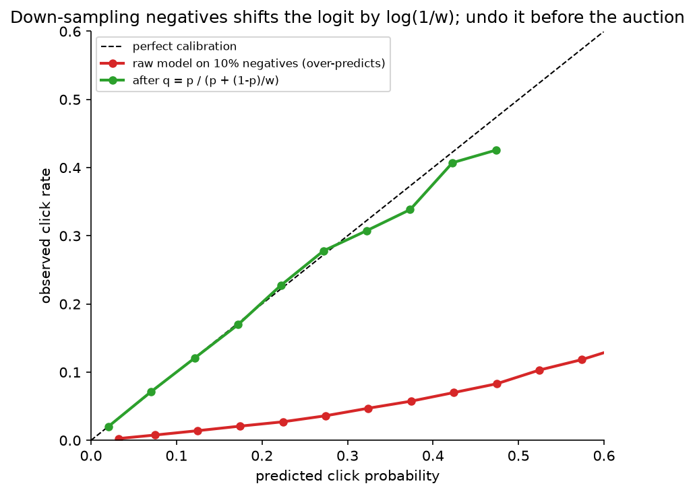

# Ads CTR / conversion prediction

> **Why this matters / who asks it.** Ads pay for Google, Meta, Pinterest, Snap,
> TikTok, Amazon's retail media and a long tail of others, and "predict the
> probability that this user clicks (or converts on) this ad" is the ML system that
> sets prices in the auction. That makes it different from every other ranking
> problem in this part: the output is consumed as a *probability*, by an auction that
> compares advertisers, so calibration is a correctness requirement rather than a
> nicety; conversion labels arrive days late; the feature space is billions of sparse
> ids; and the model is retrained continuously because advertiser behaviour changes
> by the hour. The interviewer is checking that you know why calibration matters,
> how to handle delayed and down-sampled labels without breaking it, how to build
> feature crosses and sparse embeddings at scale, and how the model plugs into
> bidding and pacing.

## TL;DR: the whiteboard in 60 seconds

```mermaid
flowchart LR
  REQ[Ad request<br/>user, context, slot] --> TG[Targeting + retrieval<br/>eligible ads by audience, budget, policy<br/>~thousands]
  TG --> PRE[Pre-ranking<br/>light pCTR / two-tower<br/>→ hundreds]
  PRE --> RK[Ranking model<br/>pCTR, pCVR, pInstall…<br/>sparse embeddings + crosses + DNN]
  RK --> CAL[Calibration layer<br/>per-segment isotonic / Platt]
  CAL --> AUC[Auction<br/>eCPM = bid × pCTR (× pCVR)<br/>+ user-value terms; pacing]
  AUC --> SHOW[Winning ads shown]
  SHOW -.->|impression, click, delayed conversion| LOG[Logs + online joiner]
  LOG --> TRN[Continuous training<br/>online / hourly, delayed-feedback handling,<br/>negative down-sampling + correction]
  TRN --> RK
  LOG --> MON[Monitoring<br/>calibration, NE, revenue, advertiser ROI]
```

- **The auction consumes probabilities**: $\text{eCPM} = \text{bid} \times \hat p_{\text{CTR}}
  \times 1000$ (CPC), or $\text{bid} \times \hat p_{\text{CTR}} \times \hat p_{\text{CVR}}$
  for conversion-optimised bidding. Over-prediction by 10 % for one advertiser
  segment moves money; AUC does not see it.
- **Calibration is a system**: a dedicated post-hoc layer (isotonic/Platt per
  segment), monitored per segment as $\sum \hat p / \sum y$, with the negative
  down-sampling correction $q = p / (p + (1-p)/w)$ applied *before* the auction.
- **Delayed feedback**: conversions arrive over days; treat unlabelled recent
  examples with a survival model of the delay (Chapelle 2014) or with fake-negative
  + importance-weight correction (Twitter, 2019), never as plain negatives.
- **Model family**: sparse id embeddings (hashed, sharded, compressed) + dense
  features + explicit feature crosses (FM → Wide & Deep → DeepFM → DCN/DCN-v2 →
  DLRM's dot-product interactions) + an MLP; multi-task heads for click, conversion
  types and quality.
- **Online / continuous training** because the distribution moves hourly: FTRL for
  linear models (Google), online data joiner and frequent retraining (Facebook),
  hourly-to-minute incremental training for DNNs.
- **Sample selection bias in CVR**: conversion is only observed after a click; train
  CVR over the entire impression space via CTR × CVR (ESMM) or accept the bias and
  calibrate.
- **Memory arithmetic**: $10^{10}$ ids × 64 dims × 4 B = 2.5 TB of embeddings; hashing,
  compositional embeddings and model-parallel sharding make it fit.
- **Budget pacing and bidding** sit next to the model; know that a pacing controller
  spreads spend over the day and that the model's calibration errors show up as
  advertiser ROI errors.
- **Evaluation**: logloss and *normalised entropy*, AUC as a secondary, calibration
  per segment, then online A/B on revenue, advertiser value and user guardrails.
- **Evidence**: Google "Ad Click Prediction: a View from the Trenches" (KDD 2013),
  Facebook "Practical Lessons from Predicting Clicks on Ads" (ADKDD 2014), Meta
  DLRM (2019), Criteo delayed feedback (KDD 2014), Twitter delayed feedback
  (RecSys 2019), Alibaba ESMM (SIGIR 2018), Google DCN-v2 (WWW 2021), LinkedIn
  budget pacing (KDD 2014).

## 1. Requirements & scoping

**Functional.** For each ad opportunity (a slot on a page or feed position), score
every eligible ad with the probabilities the auction needs (click, and for
conversion-optimised campaigns each conversion type), return them with the bid and
pacing signals to the auction, and log everything needed to train and to bill.

**Non-functional, ask for or assume.**

| Quantity | Ask | Defensible assumption |
|---|---|---|
| Requests | "Ad requests per second at peak? Ads scored per request?" | 100k requests/s peak × 500 ads scored = $5 \times 10^7$ scores/s |
| Latency | "Budget for the model call inside the auction?" | 30–50 ms for retrieval + ranking; the page's total is 200 ms |
| Features | "How many sparse ids? Cardinality?" | $10^9$–$10^{10}$ distinct ids across user, ad, advertiser, context |
| Freshness | "How fast must a new ad or a budget change be reflected?" | Ad: minutes; budget/pacing: seconds; model: hourly |
| Labels | "Click attribution window? Conversion window?" | Clicks: minutes; conversions: 1–7 days (some up to 28) |
| Constraints | "Policy filters, frequency caps, brand safety?" | Applied at targeting/retrieval and re-ranking |

**Success metrics.**

- *North star*: revenue *and* advertiser value (conversions delivered per dollar,
  cost per acquisition). An ads system that raises short-term revenue by
  over-charging advertisers loses them.
- *Guardrails*: user-side (ad load, hide/report rate, session length), advertiser
  ROI by segment, calibration ratio per segment, latency, budget-pacing error.
- *Offline proxies*: logloss and normalised entropy (NE), AUC, calibration
  (reliability diagrams, $\sum \hat p / \sum y$ per segment), and *simulated auction*
  metrics (replay the auction with new scores, measure revenue and winner churn).

**Questions a staff engineer asks.**

1. "Which bidding products do we support, CPM, CPC, oCPM/CPA? That decides which
   heads I need and which must be calibrated."
2. "Is the auction second-price / VCG? Then over-prediction changes who wins and
   what they pay; I'll need per-advertiser calibration monitoring."
3. "What is the conversion attribution window and how are conversions reported,
   pixel, server-to-server, app SDK? Each has a different delay distribution."
4. "How is the id space growing? Do we have an embedding-table memory budget?"
5. "What is our exploration policy for new ads? Without it, new ads never get
   labels and the auction never learns their value."

## 2. Data

**Sources.** Impression logs joined with the features served; click logs; conversion
events from advertiser pixels, server-to-server postbacks and app SDKs; advertiser
metadata (campaign, creative, category, bid, budget, targeting); user features
(history of engagements with ads and organic content, declared and inferred
interests where policy allows); context (surface, position, device, time, app).

**The online joiner.** Impressions and clicks arrive on different streams; the
training example is created when a click arrives within the window or when the
window expires without one. Facebook's 2014 paper describes such an online joiner
feeding continuous training, and the failure mode to name: if the joiner's window
is too short, real clicks become negatives and the model's calibration drifts
downward.

**Labels and their delays.**

- *Click*: seconds to minutes; attribution windows of a few minutes handle late
  arrivals.
- *Conversion*: hours to days (purchases), longer for high-consideration goods;
  reported through pixels and postbacks that are themselves delayed and lossy. A
  conversion window of 7 days means a training example is not fully labelled for a
  week; a model trained hourly must decide what to do with the last week of
  examples.
- *Quality/negative labels*: hides, reports, "not interested", landing-page bounce.

**Biases.**

- *Selection bias in CVR*: conversions are observed only for clicked impressions,
  which are a biased sample; a CVR model trained on clicks and applied to all
  impressions is miscalibrated on the unclicked majority.
- *Position and format bias*: the same ad in position 1 vs 5 or as video vs static.
- *Auction feedback loop*: the model's scores decide which ads get impressions, so
  labels concentrate on ads the model already likes; new ads and new advertisers
  starve without exploration (a small forced budget, or an uncertainty bonus).
- *Survivorship*: paused or rejected ads disappear from the logs.
- *Negative down-sampling* (deliberate): negatives are kept at a rate $w$ to shrink
  the training set; this is a bias you introduce and must correct (§3.5).

**Features.** Sparse ids (user, ad, creative, advertiser, campaign, page, app, query,
placement) as embeddings; dense counters (user's ad CTR over windows, ad's CTR over
windows, advertiser-level rates), each with time decay; categorical context; user
sequence features (recent engaged ads and organic items, with target attention as in
[the feed chapter](01-recommendation-feed-ranking.md#34-ranking-multi-task-sequence-aware));
creative content embeddings (image/text/video encoders); cross features, learned
rather than enumerated.

**Freshness.** Counters near-real-time; the ad's own early CTR is one of the most
predictive features and must be available within minutes of its first impressions
(with a Bayesian prior so that one click over three impressions is not a 33 % CTR).

**Privacy.** Ads are the most regulated ML system in most companies: consent-gated
features, restricted categories (housing, credit, employment) with separate rules,
attribution that is increasingly aggregated or on-device (platform privacy changes
shift the label pipeline itself), retention limits.

## 3. Modelling

### 3.1 Baseline: logistic regression on hashed crosses

Hash every sparse feature and every hand-chosen pair into a $2^{28}$-dimensional
space (Weinberger et al., ICML 2009), train logistic regression with FTRL-Proximal
online (McMahan et al., KDD 2013), calibrate with isotonic regression. It is fast,
online, cheap to serve, easy to debug, and it was Google's production system in
2013. Its limit is that crosses must be enumerated by hand and generalise poorly to
unseen combinations.

### 3.2 Feature crosses: the lineage you should be able to draw

The problem: CTR depends on interactions (this user × this advertiser category ×
this placement) that a linear model over ids cannot represent unless the cross is
enumerated, and enumerating crosses of $10^9$-cardinality ids is hopeless.

**Factorization machines** (Rendle, ICDM 2010) give every feature an embedding
$v_i \in \R^k$ and model pairwise interactions as dot products:

$$
\hat y(x) = w_0 + \sum_i w_i x_i + \sum_{i < j} \langle v_i, v_j \rangle x_i x_j,
$$

so a never-seen pair $(i, j)$ still gets a score from $v_i$ and $v_j$, which were
each learned from other pairs. Cost is $O(kn)$ via the identity
$\sum_{i<j}\langle v_i, v_j\rangle x_i x_j = \tfrac12 \sum_f \bigl[(\sum_i v_{if} x_i)^2 - \sum_i v_{if}^2 x_i^2\bigr]$.

**Wide & Deep** (Cheng et al., 2016, arXiv:1606.07792, Google Play): a wide linear
part over hand-crossed ids (memorisation) plus a deep MLP over embeddings
(generalisation), trained jointly. **DeepFM** (Guo et al., IJCAI 2017,
arXiv:1703.04247) replaces the hand-crossed wide part with an FM over the same
embeddings the deep part uses, so no manual crosses remain.

**Deep & Cross Network** (Wang et al., ADKDD 2017, arXiv:1708.05123) learns bounded-
degree polynomial crosses explicitly with a cross layer,
$x_{l+1} = x_0\, (w_l^\top x_l) + b_l + x_l$; **DCN-v2** (Wang et al., WWW 2021,
arXiv:2008.13535) makes the cross full-rank, $x_{l+1} = x_0 \odot (W_l x_l + b_l) + x_l$,
with a low-rank mixture-of-experts variant for cost, and reports production
deployment at Google with gains over the original DCN.

**DLRM** (Naumov et al., 2019, arXiv:1906.00091, Meta): embedding tables for sparse
ids, a bottom MLP for dense features, pairwise **dot-product interactions** between
all embedding vectors and the dense projection, then a top MLP. DLRM's contribution
is as much systems as modelling: the embedding tables are *model-parallel* across
devices (each device holds a shard of the tables) while the MLPs are *data-parallel*,
with an all-to-all exchange in between, which is the standard shape of a large
recommendation model today.

For the interview: draw "sparse ids → embeddings; dense → MLP; explicit crosses
(FM/DCN/dot-product); concatenate; MLP; multi-task heads", and justify the cross
mechanism you pick by serving cost (dot-product interactions and DCN-v2 are cheap;
attention-based crosses are not).

### 3.3 Multi-task heads and the CVR selection-bias problem

The auction needs $\hat p_{\text{CTR}}$ and, for conversion-optimised campaigns,
$\hat p_{\text{CVR}} = P(\text{conv} \mid \text{click})$ per conversion type. Train
them as heads on a shared trunk (MMoE/PLE as in the feed chapter) with the
click-through and conversion labels.

The subtlety: CVR labels exist only for clicked impressions, and at serving time the
model must score *every* impression. **ESMM** (Ma et al., SIGIR 2018, arXiv:1804.07931,
Alibaba) trains on the entire impression space by modelling
$P(\text{click}, \text{conv} \mid x) = P(\text{click} \mid x)\, P(\text{conv} \mid \text{click}, x)$
with two heads whose product is trained against the "click-and-convert" label over
all impressions, so the CVR head is never fitted on the biased clicked subset alone.
The alternative is to train CVR on clicks only and accept that its calibration on
unclicked impressions is unknown; that is tolerable when the auction only uses CVR
for impressions the CTR head already thinks will be clicked, and intolerable when
CVR feeds bidding directly.

### 3.4 Calibration: why and how

**Why it is a correctness requirement.** In a second-price or VCG-style auction with
CPC bids, the ranking score for an ad is $\text{bid}_a \times \hat p_a$ and the price
paid depends on the next-highest score. If $\hat p$ is 20 % too high for video
creatives and correct for static ones, video ads win auctions they should lose and
pay more than they should; advertisers with video creatives see their cost per click
rise and leave. AUC is invariant to any monotone transform of the scores and is blind
to all of this. Google's 2013 paper devotes a section to a calibration layer; the
Facebook 2014 paper reports calibration alongside NE as a primary metric.

**How.**

1. *Loss*: logloss already rewards calibration in expectation, but only on the
   training distribution; sampling and regularisation break it.
2. *Post-hoc layer*: Platt scaling (a logistic fit on the logit) or isotonic
   regression (monotone piecewise-constant), fitted on a recent held-out window,
   **per segment** (surface × format × advertiser vertical) because miscalibration
   is rarely uniform. Google's paper used isotonic regression or Poisson regression
   for this layer.
3. *The down-sampling correction* (§3.5), applied before the post-hoc layer.
4. *Monitoring*: calibration ratio $\sum_i \hat p_i / \sum_i y_i$ per segment per hour,
   reliability diagrams, and expected calibration error; alert on drift, because a
   broken feature usually shows up as a calibration shift before it shows up in AUC.

### 3.5 Negative down-sampling and its correction

Ads data is ~99 % negatives. Keeping every negative multiplies training cost for
little information, so negatives are kept at rate $w$ (say 0.1) and positives at
rate 1. The learned model then estimates the wrong probability. If the true odds
are $\frac{p}{1-p}$, the down-sampled data has odds $\frac{p}{(1-p)w}$, so the model
learns $p'$ with $\frac{p'}{1-p'} = \frac{p}{(1-p)\,w}$. Solving for $p$:

$$
\boxed{\;p = \frac{p'}{p' + (1 - p')/w}\;}
$$

which is a shift of the logit by $-\log(1/w)$: $\operatorname{logit}(p) =
\operatorname{logit}(p') + \log w$. Facebook's 2014 paper gives exactly this
re-calibration formula; the figure shows the effect.

{ width="560" }

*A model trained on 10 % of the negatives over-predicts click probability by a
factor that grows with the score; applying $p = p' / (p' + (1-p')/w)$ restores
calibration. Interviewers ask for this formula; derive it from the odds.*

An alternative to the formula is importance weighting each negative by $1/w$ in the
loss, which keeps the model calibrated in expectation but increases gradient
variance; most teams do the cheap post-hoc shift.

### 3.6 Delayed feedback for conversions

A conversion label for an impression at time $t$ may arrive any time in the
following $W$ days. Training hourly on the last day's data with "no conversion yet"
= negative systematically under-predicts CVR, and the under-prediction is worst for
the freshest data, which is precisely what continuous training emphasises.

**Survival-model approach** (Chapelle, KDD 2014, Criteo). Model two things:
whether the click will ever convert, $p(x) = P(C = 1 \mid x)$, and the delay $D$
until conversion, e.g. exponential with rate $\lambda(x)$. At elapsed time $e$ since
the click, the likelihood of what has been *observed* is

$$
P(\text{conv observed} \mid x, e) = p(x)\,\bigl(1 - e^{-\lambda(x) e}\bigr), \qquad
P(\text{no conv yet} \mid x, e) = 1 - p(x) + p(x)\, e^{-\lambda(x) e}.
$$

Maximising this likelihood jointly over $p$ and $\lambda$ lets a recent unlabelled
example contribute "probably not converted *yet*" rather than "negative". Serve
$p(x)$. *Meaning*: the model learns the delay distribution and discounts recent
negatives accordingly.

**Fake-negative approach** (Ktena et al., RecSys 2019, Twitter). For continuous
training, ingest every example immediately as a negative; when a conversion arrives,
ingest a positive for the same example; correct the resulting bias with importance
weights derived from the model's own predictions (or with a positive-unlabelled
loss). Cheaper to run in a streaming trainer, and the paper reports it working for
Twitter's conversion models.

**Which to choose.** The survival model when you can afford to hold examples and
you need calibrated CVR for bidding; the fake-negative scheme when the trainer is
fully streaming and freshness dominates. In both cases, validate calibration against
*fully matured* labels from weeks ago, because that is the only unbiased check.

### 3.7 Sparse embeddings at scale

**Memory.** $10^{10}$ ids × 64 dims × 4 B = 2.56 TB in fp32; fp16 halves it; that
still does not fit on one host. Options, in the order to mention them:

- *Hashing* ids into a fixed table ($2^{30}$ rows) with collisions; the collisions
  are noise the model tolerates, and the table size is a knob.
- *Compositional embeddings* (Shi et al., KDD 2020, arXiv:1909.02107, Facebook):
  quotient–remainder trick, two small tables indexed by $\lfloor id / m \rfloor$ and
  $id \bmod m$, combined by element-wise product, giving unique vectors with
  $O(\sqrt{N})$ memory.
- *Mixed dimensions*: popular ids get 64 dims, rare ids 8.
- *Sharding* across devices (DLRM's model parallelism) with an all-to-all.
- *Expiry* of ids not seen for $k$ days (Monolith-style collisionless tables with
  eviction, in the feed chapter).
- *Quantisation* of the tables to int8 for serving.

**Bandwidth.** Serving a 500-ad request touches thousands of embedding rows; the
lookup, not the MLP, dominates; keep the hot tables in accelerator or host memory
close to the model and batch lookups.

### 3.8 Online learning

Advertiser behaviour, creatives, budgets and user interest drift within a day, and
the Facebook paper reports that data freshness measurably matters: retraining daily
versus weekly gave a visible NE improvement, and they moved the linear part to
online learning. Google's FTRL-Proximal is the reference online learner for sparse
logistic regression, with per-coordinate learning rates and $L_1$ sparsity. For DNNs
today: the sparse embedding tables update online (they change fastest), the dense
MLPs update hourly or daily from checkpoints, and every update passes an
automatic calibration and NE gate before it reaches serving.

### 3.9 The auction, bidding and pacing (what you must know as literacy)

- *Score*: $\text{eCPM}_a = \text{bid}_a \times \hat p_{\text{CTR},a}$ for CPC; for
  conversion-optimised bidding $\text{bid}_a \times \hat p_{\text{CTR},a} \times
  \hat p_{\text{CVR},a}$ where the bid is a target cost per action; platforms add
  user-value terms (predicted negative feedback) to the score. Meta's public
  auction documentation describes the auction as ranking by a "total value" that
  combines the bid, estimated action rates and ad quality.
- *Pricing*: generalized second price (Edelman, Ostrovsky & Schwarz, AER 2007) or
  VCG; either way, a calibration error moves prices.
- *Pacing*: an advertiser's daily budget must be spent smoothly; a feedback
  controller adjusts the bid multiplier or the participation probability through
  the day toward a target spend curve (Agarwal et al., "Budget pacing for targeted
  online advertisements at LinkedIn", KDD 2014; Xu et al., "Smart Pacing for
  Effective Online Ad Campaign Optimization", KDD 2015). The model's miscalibration
  appears here as spend that ends too early or too late.

## 4. Training & serving

**Pipeline.** Impression stream + click stream + conversion stream → online joiner
(with attribution windows) → negative down-sampling → feature logging at serve time
(the features used in the auction are the training features; never recompute) →
continuous trainer (sparse online, dense hourly) → calibration fit on the latest
matured window → gates (NE, AUC, calibration per segment, simulated-auction revenue
within tolerance) → shadow → canary by traffic slice → full.

**Serving.** Two-stage within the ads stack: targeting/retrieval (audience
eligibility, budget availability, policy) yields thousands of ads; a light pre-ranker
(two-tower or small MLP) cuts to hundreds; the full model scores those in one
batched GPU (or large-CPU) call; the calibration layer is a lookup; the auction runs
on the calibrated scores. Budget: ~5 ms retrieval, ~5 ms pre-rank, ~20 ms full model,
~2 ms calibration + auction, inside a 50 ms slot.

**Hardware and cost.** $5 \times 10^7$ scores/s at peak with a 50M-parameter dense
part is $5 \times 10^{15}$ FLOP/s ≈ 50 GPUs at 30 % utilisation, plus the embedding
lookup infrastructure, plus replicas. The pre-ranker cuts the full-model volume by
10×; that is where the money is saved.

**Degradation.** Model timeout → pre-ranker scores through the same calibration
(fit separately); calibration service down → last known table; feature store slow →
missing-feature defaults with a monitored rate; anything worse → the auction runs on
historical eCPM per ad.

## 5. Evaluation & experimentation

**Offline.**

- *Logloss and normalised entropy*: NE is logloss divided by the entropy of the
  background CTR, so it is comparable across surfaces with different base rates
  (He et al., 2014). Lower is better; a 0.1 % NE change is meaningful at scale.
- *AUC*: secondary, because it ignores calibration; useful for ranking-only
  changes.
- *Calibration*: $\sum \hat p / \sum y$ per segment and reliability diagrams on the
  latest *matured* window (conversions must be given their full attribution
  window).
- *Auction replay*: re-run logged auctions with the new scores; report revenue,
  winner-change rate and per-advertiser cost shifts. A model that changes 30 % of
  auction winners is a large product change regardless of NE.
- *Pitfalls*: evaluating CVR on recent data (labels immature); random splits (leak
  advertiser-level drift); computing calibration on down-sampled data without the
  correction.

**Online.**

- A/B on revenue *and* advertiser outcomes (conversions per dollar, CPA vs target)
  with user guardrails (ad load, hides, session length). Ads A/B tests have an
  interference problem: budgets are shared across arms, so a treatment that spends
  an advertiser's budget faster starves the control; use budget-split designs or
  advertiser-level randomisation for pacing changes.
- Long-term holdouts for anything that affects advertiser learning phases.

**Monitoring and retraining triggers.** Calibration ratio per segment per hour (the
primary alarm), NE on matured data, feature null and distribution drift, score
distribution shift, join rates (impressions with matched features), conversion
arrival curves (a change means a pixel broke, not that users changed), pacing error.
Retrain continuously; roll back automatically on a calibration breach.

## 6. Trade-offs & alternatives

| Decision | Chosen | Alternative | When you'd flip |
|---|---|---|---|
| Model family | Embeddings + explicit crosses (DCN-v2 / dot-product) + MLP, multi-task | GBDT + LR (Facebook 2014) | Small feature space, CPU-only serving, need for interpretability; still a fine pre-ranker |
| Crosses | Learned (FM/DCN/dot-product) | Hand-enumerated hashed crosses | Very low latency linear serving; as the "wide" part alongside deep |
| Negatives | Down-sample + logit correction | Keep all negatives | Training cost is not a constraint (rare) |
| Delayed conversions | Survival model (Chapelle) | Fake negatives + importance weights (Twitter) | Fully streaming trainer where holding examples is impossible |
| CVR training space | Entire-space (ESMM) | Clicked-only | CVR is not used for bidding on unclicked impressions |
| Calibration | Post-hoc per segment, monitored | Trust logloss | Never; the auction needs it |
| Training | Continuous (sparse online, dense hourly) | Daily batch | Advertiser mix is stable and freshness experiments show no gain |
| Embedding memory | Hashing + compositional + sharding | One giant table | It fits (small id space) |
| Exploration | Small forced budget + uncertainty bonus for new ads | None | Never none; tune the budget by measured cold-start revenue |

**Failure modes.**

- *A pixel or SDK breaks*: conversion arrival curve collapses; CVR trains toward
  zero; pacing overspends. Detect on the arrival curve, not on the model.
- *Calibration drift after a UI change*: format-level calibration ratio alarms;
  refit the layer before retraining the model.
- *Joiner window too short*: real clicks become negatives; detected as a slow
  downward calibration drift on clicks.
- *Embedding table saturation*: collision rate rises, rare-id quality drops;
  monitor per-bucket occupancy.
- *Auction interference in A/B*: treatment spends control's budget; use
  budget-aware designs.

## 7. How real companies did it: as mock interviews

### 7.1 Google: "predict clicks for sponsored search, online, at scale"

**Interviewer prompt.** "Billions of ad impressions a day, billions of sparse
features, a model that must update as advertisers change bids and creatives, and
memory that must not grow with the feature space. Design it."

**Walkthrough.** *Clarify*: a linear model is acceptable if it is online and
calibrated; memory is the binding constraint. *Metrics*: logloss, AUC, calibration.
*Data*: streamed impressions with hashed features. *Model*: logistic regression on
hashed features trained online with FTRL-Proximal (per-coordinate learning rates,
$L_1$ regularisation for sparsity), memory reduced with probabilistic feature
inclusion and fewer bits per weight, and a separate calibration layer. *Serve*: the
sparse weight vector; per-prediction confidence estimates. *Evaluate*: online
metrics on the stream, with careful attention to calibration.

**What the source says.** McMahan et al., "Ad Click Prediction: a View from the
Trenches" (KDD 2013) describes FTRL-Proximal, per-coordinate learning rates, memory
savings (probabilistic feature inclusion, reduced-precision weights, sharing across
similar models), a calibration layer, confidence estimates, and a list of things that
did *not* help in their setting.

!!! tip "How to say it in the interview: the calibration layer"
    "I'd put an explicit calibration layer between the model and the auction and
    monitor it per segment, rather than trusting logloss to keep the probabilities
    honest, because Google reported in 'Ad Click Prediction: a View from the
    Trenches' (KDD 2013) that systematic miscalibration arises from training
    choices and that they added a dedicated calibration stage; the auction
    consumes probabilities, so a 10 % over-prediction on one format silently
    reprices that format. The alternative is to rely on the loss; the trade-off of
    a separate layer is one more thing to refit when the model changes, so I'd
    refit it automatically on the latest matured window with every model push."

### 7.2 Facebook: "GBDT features, LR on top, and freshness"

**Interviewer prompt.** "Our click model is a logistic regression on hand-built
features. Improve it without exploding serving cost, and tell me how often to
retrain."

**Walkthrough.** *Clarify*: CPU serving, hourly-level freshness desired. *Metrics*:
normalised entropy and calibration. *Data*: an online joiner producing training
examples from impression and click streams; negatives down-sampled. *Model*: boosted
trees as a feature transformer (each leaf becomes a binary feature) feeding a
logistic regression; the LR trained online. *Serve*: cheap. *Evaluate*: NE, with
experiments on retraining frequency and on which features (historical vs
contextual) carry the signal.

**What the source says.** He et al., "Practical Lessons from Predicting Clicks on
Ads at Facebook" (ADKDD 2014) reports the GBDT-features-plus-LR hybrid, the
importance of data freshness (a measurable NE gain from daily versus weekly
retraining), online learning for the LR, the online joiner, negative down-sampling
with the re-calibration formula $q = p/(p + (1-p)/w)$, and that historical
(behavioural) features dominated contextual ones.

!!! tip "How to say it in the interview: down-sampling and freshness"
    "I'd down-sample negatives to about a tenth and correct the output with
    $p = p'/(p' + (1-p')/w)$, which Facebook published in 'Practical Lessons from
    Predicting Clicks on Ads at Facebook' (2014); the alternative is training on
    everything, which costs ten times the compute for negligible information. On
    cadence, the same paper showed a measurable normalised-entropy gain from daily
    over weekly retraining, and they moved the linear part online, so I'd design
    for at least hourly refresh of the sparse parameters from the start rather than
    retrofitting it. The trade-off is an online joiner whose attribution window
    becomes a correctness parameter: too short and clicks become negatives."

### 7.3 Meta: "the model does not fit on one GPU"

**Interviewer prompt.** "Our ranking model has terabytes of embedding tables and a
modest MLP. Design the model and its training system."

**Walkthrough.** *Clarify*: number of sparse features, table sizes, GPU memory.
*Model*: embeddings for sparse ids, bottom MLP for dense, pairwise dot-product
interactions, top MLP. *Training*: model parallelism for the tables (each GPU holds a
shard), data parallelism for the MLPs, all-to-all between them. *Serve*: tables on
host memory or sharded across accelerators. *Evaluate*: accuracy on public
benchmarks and throughput.

**What the source says.** Naumov et al., "Deep Learning Recommendation Model for
Personalization and Recommendation Systems" (2019, arXiv:1906.00091) describes
DLRM's architecture and its hybrid model-parallel (embeddings) / data-parallel (MLP)
training with all-to-all communication. Shi et al., "Compositional Embeddings Using
Complementary Partitions for Memory-Efficient Recommendation Systems" (KDD 2020,
arXiv:1909.02107) describes the quotient-remainder trick for shrinking tables.

!!! tip "How to say it in the interview: embedding memory"
    "For the id features I'd budget the embedding memory first: ten billion ids at
    64 dimensions is a couple of terabytes, so it will not live on one device. I'd
    shard the tables model-parallel and keep the dense network data-parallel, which
    is the DLRM design Meta published in 2019, and reduce the tables with hashing
    and the quotient-remainder compositional embeddings from their KDD 2020 paper.
    The alternative is one hashed table that fits; the trade-off is collision noise
    on the rare ids that carry the most advertiser-specific signal. I'd flip back to
    a single hashed table only for a pre-ranker, where the accuracy loss is
    acceptable."

### 7.4 Criteo and Twitter: "conversions arrive a week late"

**Interviewer prompt.** "We bid on conversions. Conversions are attributed up to
seven days after the click. Our model retrains hourly and keeps under-predicting on
fresh data. Fix it."

**Walkthrough.** *Clarify*: the delay distribution, whether the trainer can hold
examples. *Model*: either a joint model of conversion probability and delay
(exponential hazard) trained on the observed-so-far likelihood, or a streaming
scheme that ingests fake negatives and corrects with importance weights. *Evaluate*:
calibration against matured labels.

**What the sources say.** Chapelle, "Modeling Delayed Feedback in Display
Advertising" (KDD 2014) introduces the survival-style model with an exponential
delay and shows it improves over treating unmatured examples as negatives on Criteo
data. Ktena et al., "Addressing Delayed Feedback for Continuous Training with
Neural Networks in CTR prediction" (RecSys 2019) compares loss functions for
continuous training under delayed feedback at Twitter, including fake-negative
schemes with importance weighting.

!!! tip "How to say it in the interview: delayed feedback"
    "I would not treat 'no conversion yet' as a negative. If the trainer can hold
    examples, I'd fit conversion probability and conversion delay jointly, as
    Chapelle did in 'Modeling Delayed Feedback in Display Advertising' (KDD 2014),
    so that a two-hour-old click contributes 'probably not converted yet' rather
    than 'no'. If the trainer is fully streaming, I'd use the fake-negative scheme
    with importance weighting that Twitter evaluated in their RecSys 2019 paper.
    The alternative (waiting a week for labels) costs freshness, which the
    Facebook paper shows is worth real NE. The trade-off is that both corrections
    depend on a delay model that itself drifts, so I'd validate calibration only
    on matured labels from weeks ago."

### 7.5 Alibaba: "CVR is trained on clicks but served on impressions"

**Interviewer prompt.** "Our conversion model is trained on clicked impressions and
scores every impression. It is miscalibrated on the ones that would not be clicked.
Redesign the training."

**Walkthrough.** *Model*: two heads, CTR and CVR, trained on the entire impression
space through the product $P(\text{click}) \cdot P(\text{conv} \mid \text{click})$
against the click-and-convert label; shared embeddings. *Evaluate*: CVR AUC on the
full space.

**What the source says.** Ma et al., "Entire Space Multi-Task Model: An Effective
Approach for Estimating Post-Click Conversion Rate" (SIGIR 2018, arXiv:1804.07931)
introduces ESMM to address sample selection bias and data sparsity in CVR
estimation, with results on Taobao data.

!!! tip "How to say it in the interview: the CVR training space"
    "For the conversion head I'd train over the entire impression space via the
    product of the click and post-click-conversion heads, which is the ESMM design
    Alibaba published at SIGIR 2018 to fix the selection bias of training CVR only
    on clicks. The alternative (clicked-only training) is simpler and fine when
    the auction only needs CVR for likely-clicked ads; the trade-off of ESMM is
    that the CVR head is learned indirectly, so I'd still check its calibration on
    clicked impressions directly."

### 7.6 LinkedIn: "spend the budget evenly"

**Interviewer prompt.** "Advertisers give us a daily budget. Our system spends it in
the first two hours, on the cheapest impressions. Fix it, and tell me how this
interacts with the click model."

**Walkthrough.** *Model*: a pacing controller that adjusts each campaign's
participation rate or bid multiplier toward a target spend curve derived from
forecast traffic; the click model's calibration errors surface as pacing errors.
*Evaluate*: spend smoothness, advertiser outcomes, revenue.

**What the source says.** Agarwal et al., "Budget pacing for targeted online
advertisements at LinkedIn" (KDD 2014) describes a pacing system that controls
participation in auctions to spread spend across the day and reports improved
advertiser and platform outcomes.

!!! tip "How to say it in the interview: pacing literacy"
    "I'd make sure the interviewer knows I see the model as one input to a control
    loop: LinkedIn's KDD 2014 pacing paper controls each campaign's auction
    participation toward a target spend curve, which means a miscalibrated pCTR
    shows up as a pacing error before anyone looks at a reliability diagram. So my
    monitoring would include pacing error per campaign segment as a model-health
    signal. The alternative is to treat pacing as someone else's system; the cost of
    that is debugging calibration two teams away from where it hurts."

## 8. Staff-level follow-ups

!!! interview "Your new model has +0.3 % AUC and −0.2 % NE offline but revenue is flat online. Why?"
    Ranking quality improved but the auction did not change much: check the
    winner-change rate in auction replay. If winners changed and revenue is flat,
    look at calibration per segment: a better ranker that is 5 % under-calibrated
    lowers every eCPM and the second price with it. If calibration is fine, check
    pacing: if campaigns were already budget-constrained, a better model shifts
    *which* impressions they buy, not how much they spend, and the gain appears as
    advertiser ROI, not platform revenue. That is still a win; measure it on the
    advertiser side.

!!! interview "Derive the down-sampling correction."
    Down-sampling negatives at rate $w$ multiplies the observed odds by $1/w$; the
    model learns $p'$ with $p'/(1-p') = \frac{p}{1-p}\cdot\frac1w$. Solve:
    $p = \frac{p'}{p' + (1-p')/w}$, equivalently subtract $\log(1/w)$ from the logit.
    Then note that it only holds if the down-sampling is independent of $x$; if you
    down-sample negatives differently per surface, the correction is per surface.

!!! interview "How do you handle a new ad with no history?"
    Content embeddings of the creative and the advertiser's history give a prior;
    an exploration budget (or an upper-confidence bonus on the score) buys the
    first few thousand impressions; a Bayesian smoothed early CTR (a Beta prior at
    the advertiser or category rate) becomes a feature within minutes. Cap the
    exploration spend and measure cold-start revenue per dollar so the budget is a
    tuned number, not a guess.

!!! interview "5× traffic spike during a shopping event: what happens?"
    Ads systems are unusual in that the spike is *also* the highest-value traffic,
    so shedding must be careful. Pre-ranker-only scoring for low-value slots, a
    smaller candidate set from targeting, cached scores for repeat (user, ad)
    pairs within minutes, and pacing controllers that anticipate the traffic
    forecast so budgets are not exhausted in the first hour. The model service is
    provisioned for the forecast peak because it directly gates revenue.

!!! interview "Why multi-task rather than one model per head?"
    Shared embeddings for the sparse ids (which dominate parameters and memory),
    transfer from the dense click signal to the sparse conversion signals, one
    serving call instead of several, and consistent calibration monitoring. The
    risk is negative transfer between click and conversion heads, handled with
    MMoE/PLE gates. I'd keep a separate model only for heads with a different
    input space (e.g. brand-safety classifiers on the creative).

!!! interview "How would you evaluate calibration when conversions take a week?"
    Only on matured windows: score the examples from two weeks ago with the *model
    version that was serving then* (from the served-feature log), attribute
    conversions with the full window, and compute the calibration ratio per
    segment. For the current model, the survival model's predicted delay
    distribution gives an expected-so-far conversion count to compare against
    observed-so-far, which catches gross breaks early.

!!! interview "What is the interference problem in ads A/B tests?"
    Budgets and auctions are shared across arms. If the treatment model bids more
    accurately for a campaign, it may spend the campaign's budget in the treatment
    arm and starve the control, making the control look worse than it is; and both
    arms compete in the same auctions, so prices in one arm depend on the other. Use
    budget-split experiments (each arm gets a share of the budget), advertiser-level
    randomisation for pacing changes, or synthetic-auction replay for pricing
    changes, and be explicit about which effects the design can and cannot measure.

!!! interview "What breaks first at 10× scale?"
    Embedding tables (memory and lookup bandwidth), then the online joiner (state
    for open attribution windows grows with traffic), then the calibration
    layer's segment count: too many segments and too few labels per segment, which
    forces a hierarchical or learned calibrator. The dense network scales by adding
    replicas.

## 9. Scaling & evolution

- **Startup ad network**: hashed-feature logistic regression with FTRL, daily
  isotonic calibration, no embeddings; auction replay for evaluation; one engineer
  can run it.
- **Mid-scale**: GBDT features + LR or a small DNN with hashed embeddings, an online
  joiner, hourly retraining, per-segment calibration, a pre-ranker.
- **Hyperscale**: DLRM-shaped multi-task models with sharded tables, continuous
  training of sparse parameters, survival-model CVR, budget-aware experimentation,
  dedicated calibration and pacing services.
- **Batch → real-time**: the online joiner and streaming counters come first;
  online sparse updates second; the fake-negative scheme for conversions when the
  trainer becomes fully streaming.
- **LLM-augmented**: creative understanding (image/text/video embeddings from
  foundation models) as features; LLM-generated creative variants that the model
  then scores; advertiser-intent understanding for targeting; none of it in the
  50 ms path. It runs at ad-creation time and its outputs are cached as features.

## References

- McMahan, H. B. et al. "Ad Click Prediction: a View from the Trenches." KDD 2013.
- He, X. et al. "Practical Lessons from Predicting Clicks on Ads at Facebook." ADKDD 2014.
- Naumov, M. et al. "Deep Learning Recommendation Model for Personalization and Recommendation Systems." 2019 (arXiv:1906.00091).
- Shi, H.-J. M. et al. "Compositional Embeddings Using Complementary Partitions for Memory-Efficient Recommendation Systems." KDD 2020 (arXiv:1909.02107).
- Cheng, H.-T. et al. "Wide & Deep Learning for Recommender Systems." DLRS 2016 (arXiv:1606.07792).
- Guo, H. et al. "DeepFM: A Factorization-Machine based Neural Network for CTR Prediction." IJCAI 2017 (arXiv:1703.04247).
- Wang, R. et al. "Deep & Cross Network for Ad Click Predictions." ADKDD 2017 (arXiv:1708.05123).
- Wang, R. et al. "DCN V2: Improved Deep & Cross Network and Practical Lessons for Web-scale Learning to Rank Systems." WWW 2021 (arXiv:2008.13535).
- Rendle, S. "Factorization Machines." ICDM 2010.
- Weinberger, K. et al. "Feature Hashing for Large Scale Multitask Learning." ICML 2009.
- Chapelle, O. "Modeling Delayed Feedback in Display Advertising." KDD 2014.
- Ktena, S. I. et al. "Addressing Delayed Feedback for Continuous Training with Neural Networks in CTR prediction." RecSys 2019.
- Ma, X. et al. "Entire Space Multi-Task Model: An Effective Approach for Estimating Post-Click Conversion Rate." SIGIR 2018 (arXiv:1804.07931).
- Agarwal, D. et al. "Budget pacing for targeted online advertisements at LinkedIn." KDD 2014.
- Xu, J. et al. "Smart Pacing for Effective Online Ad Campaign Optimization." KDD 2015.
- Edelman, B., Ostrovsky, M., Schwarz, M. "Internet Advertising and the Generalized Second-Price Auction." American Economic Review 2007.
- Meta Business Help Center. "About ad auctions" (the "total value" description of the auction).
- Book cross-references: [feed ranking (multi-task, sequence features)](01-recommendation-feed-ranking.md), [uncertainty & reliability (calibration)](../part13-retrieval-eval-reliability/03-uncertainty-reliability.md).
