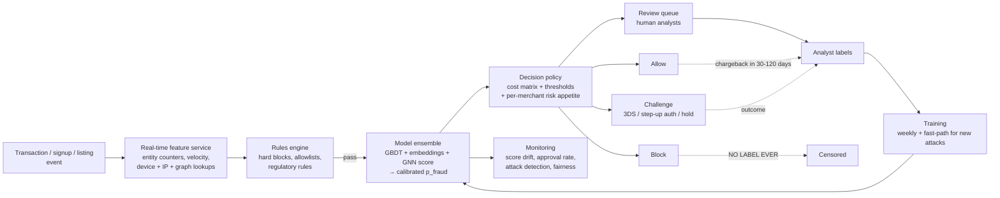
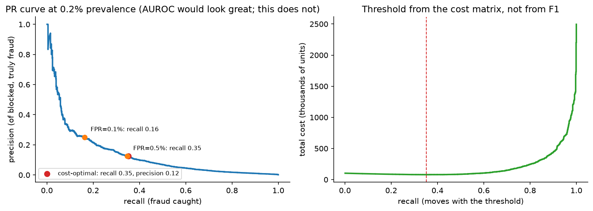

# Fraud & anomaly detection

> **Why this matters / who asks it.** Stripe, PayPal, Block, Coinbase, Adyen, Uber,
> Airbnb, Grab, Booking and every bank run a fraud system, and they all ask this
> question because it is the one ML problem where a false positive is a real customer
> whose card was declined and a false negative is money leaving the building. The
> business problem is a cost-minimisation problem under adversarial drift: at 0.1 %
> prevalence, block too little and you eat chargebacks; block too much and you lose
> more revenue in false declines than you saved. The interviewer is checking that you
> reach for a cost matrix instead of F1, that you know what happens to the labels of
> the transactions you blocked, that you can compute graph features in real time, and
> that you know why the rules engine never goes away.

## TL;DR: the whiteboard in 60 seconds



- **Three decisions, not two**: allow / challenge / review / block. The middle
  options are what make a high-recall system survivable, because a challenge costs
  friction, not revenue.
- **The threshold comes from a cost matrix**, not from F1: minimise
  $\mathbb{E}[\text{cost}] = c_{FN}\,\text{FN} + c_{FP}\,\text{FP} + c_{\text{review}}\,R$,
  where $c_{FN}$ is the chargeback plus fee plus fine exposure and $c_{FP}$ is the
  lost margin plus the lifetime-value damage of declining a good customer.
- **Extreme imbalance** (0.05–1 % positives): AUPRC and recall at a fixed low FPR,
  never accuracy, rarely AUROC.
- **Labels are censored**: blocked transactions never produce a chargeback, so the
  model never learns it was wrong. Fix with a small random allow-through
  ("bleed-through") population, challenge outcomes, and analyst review.
- **Labels are late**: chargebacks arrive 30–120 days later. Train on matured
  windows; use fast proxies (analyst decisions, issuer declines, refund requests)
  for the recent window.
- **Adversaries adapt**: the distribution shifts *because* you deployed. Retrain
  frequently, keep an unsupervised layer for novel patterns, and measure
  time-to-detect for new attack clusters.
- **Graph features carry the signal**: shared device, card, IP, address, bank
  account; entity resolution and GNN embeddings catch rings that per-transaction
  features cannot.
- **Rules + ML, always**: rules for known-bad and for regulatory must-blocks (fast,
  auditable, instantly deployable); ML for the grey zone.
- **Explainability is a requirement** where adverse-action notices or model-risk
  governance apply: reason codes per decision, monotonic constraints, model
  documentation.
- **Evidence**: Stripe Radar (Stripe engineering posts and docs), PayPal
  (graph/deep-learning talks and papers), Uber (Michelangelo and risk-platform
  posts), Airbnb (trust/graph posts), Grab (GraphQL-era fraud posts), Amazon
  (Fraud Detector docs), and the academic canon (Dal Pozzolo et al., Chen &
  Guestrin, Liu et al. isolation forest).

## 1. Requirements & scoping

**Functional.** Score each risk event (card payment, account signup, login, payout,
listing creation, promo redemption) in the authorisation path, return a decision
(allow / challenge / review / block) with reason codes, and support per-merchant or
per-market risk policies. Support analyst review with case context, and support
instant rule deployment during an attack.

**Non-functional, ask for or assume.**

| Quantity | Ask | Defensible assumption |
|---|---|---|
| Volume | "Transactions per second, peak?" | 5k/s average, 25k/s peak (a payments processor at scale) |
| Latency | "Budget inside the authorisation path?" | 100 ms p99 total; model ~20 ms, features ~40 ms |
| Prevalence | "Fraud rate in basis points of volume and of count?" | 10 bps of volume, ~0.1 % of transactions |
| Label delay | "Chargeback window?" | 60–120 days; analyst labels in hours |
| Review capacity | "Analyst headcount and cases per analyst-hour?" | 200 analysts × 20 cases/h = 4k cases/h ≈ 0.02 % of volume |
| Constraints | "Regulated decisions? Adverse-action notices? Model risk governance?" | Yes for lending-adjacent; reason codes required |
| Availability | "What do we do if the model is down: fail open or closed?" | Fail open with tightened rules; a payments outage costs more than the fraud |

**Success metrics.**

- *North star*: net fraud cost in basis points = (fraud losses + review cost +
  false-decline revenue loss) / total volume. Say this out loud; candidates who
  optimise recall alone fail here.
- *Guardrails*: authorisation/approval rate (the merchant-visible number), false
  decline rate on known-good customers, review queue backlog and SLA, latency,
  disparate impact across protected or proxy segments, appeal overturn rate.
- *Offline proxies*: AUPRC, recall at FPR = 0.1 % and 0.5 %, precision at the
  review-capacity operating point, calibration in the decision band, and
  *value-weighted* recall (fraud dollars caught, not transactions caught).

**Questions a staff engineer asks.**

1. "Whose money is at risk, ours, the merchant's, or the issuer's? That decides the
   cost matrix and therefore the threshold."
2. "What is the cost of a false decline in this vertical? For a $3 coffee it is
   noise; for a $3,000 booking it is a lost customer."
3. "Do we have a challenge mechanism (3DS, OTP, ID check)? If yes, I can run at much
   higher recall for far less revenue damage."
4. "Can I hold out a random sample of transactions we would have blocked? Without it
   I cannot estimate recall or retrain honestly."
5. "Are decisions subject to adverse-action or model-risk rules? That constrains the
   model family and requires reason codes."
6. "How fast must a new attack pattern be blocked, hours or days? That decides
   whether I need a rules fast path and an unsupervised layer."

## 2. Data

**Sources.** Transaction records (amount, currency, merchant, MCC, card BIN,
timestamps), identity (account age, KYC status, verified email/phone), device
fingerprint and browser signals, IP and geolocation, network (card–account–device–IP
graph), behavioural/biometric (typing cadence, session navigation), issuer response
codes, historical disputes, merchant-level context, and third-party signals
(consortium lists, sanctions).

**Labels.**

| Label source | Latency | Quality | Bias |
|---|---|---|---|
| Chargeback / dispute | 30–120 days | High precision for "fraud" reason codes | Only for allowed transactions; merchant-dependent reporting |
| Analyst review decision | Hours | Good, but analyst-dependent | Only for queued cases; queue is selected by the model |
| Customer report ("I didn't do this") | Days | High precision | Under-reports small amounts |
| Issuer decline / soft decline | Seconds | Weak proxy | Confounded with credit limits |
| Bleed-through (deliberately allowed high-risk) | Chargeback window | The only unbiased signal in the risky region | Costs real money; keep tiny |

**The censoring problem, stated properly.** Let $A$ be the allow decision. You observe
the fraud label $Y$ only when $A = 1$. Training on $\{(x, Y) : A = 1\}$ estimates
$P(Y = 1 \mid x, A = 1)$, not $P(Y=1 \mid x)$, and the gap is largest exactly where
the model is confident, the region you care about. Three mitigations, and you should
name all three: (a) a small randomised bleed-through population in the block region
with a strict dollar cap, which restores propensities for inverse-propensity
estimation; (b) challenge outcomes as a partial label (a failed step-up is strong
evidence of fraud); (c) reject inference, model the missing labels with a
selection-corrected likelihood, treating blocked transactions as unlabelled in a
positive-unlabelled framework. The cleanest interview answer: "the block decision is
a treatment; without randomisation in the treated region I have no counterfactual, so
I would buy one with a capped bleed-through budget."

**Adversarial drift.** Unlike a feed, the data-generating process responds to your
model. Attack patterns have a signature lifecycle: probe (small amounts, many cards),
scale (once a hole is found), and decay (once blocked). Two consequences: models
degrade in days, not months, and a *stationary* backtest overstates performance.
Backtest forward in time only, and report performance as a function of weeks since
training.

**Features.** Per-event (amount, z-scored by merchant and by customer history; hour;
mismatch flags between billing/shipping/IP country), velocity counters (attempts per
card / device / IP / email over 1 min, 1 h, 24 h, 7 d, these are the workhorses),
aggregates (customer's historical decline rate, merchant's fraud rate), graph
features (§3.4), embeddings (merchant, device, BIN; text of the shipping address),
and sequence features (the customer's last $N$ events, with an attention pooling over
them).

**Freshness.** Velocity counters must reflect events from *milliseconds* ago, a
card-testing attack fires hundreds of attempts per minute, and a counter that is a
minute stale is useless. This is the strongest real-time feature requirement in this
part; it forces a streaming aggregation layer with read-your-writes semantics inside
the authorisation path.

**Privacy and regulation.** PCI scope for card data (tokenise; never train on PANs),
GDPR/CCPA deletion, and the fairness constraint that the model must not use
protected attributes or close proxies; where the decision is credit-adjacent, adverse
action requires reason codes.

## 3. Modelling

### 3.1 Baseline

A rules engine: velocity limits, country mismatch, BIN blocklists, amount thresholds.
It is also the permanent fast path, during an attack, a rule ships in minutes while
a model ships in days. State that the ML system's job is the grey zone the rules
cannot express, and that every model launch is measured *against rules plus the
previous model*.

### 3.2 Supervised core: GBDT first

Gradient-boosted trees (XGBoost/LightGBM) on a few hundred engineered features is
still the strongest default: it handles missing values natively (a missing device
fingerprint is itself a signal), is robust to unscaled and skewed features, trains in
minutes so you can retrain often, supports **monotonic constraints** (risk must not
decrease as velocity increases, valuable both for robustness and for regulators),
and yields per-feature attributions (SHAP) that become reason codes.

The loss is weighted binary cross-entropy:

$$
\mathcal{L} = -\sum_i \Bigl[ v_i\, y_i \log \hat p_i + (1 - y_i)\log(1 - \hat p_i)\Bigr],
$$

where $v_i$ weights positives by the *dollar amount at risk*, so the model spends
capacity where the money is. Say why this beats class-balancing by resampling:
resampling distorts calibration (and you need calibration for the cost policy),
whereas value weighting changes what "important" means without changing the base
rate arithmetic you can correct analytically.

**Imbalance handling.** Down-sample negatives with the same $p = p'/(p' + (1-p')/w)$
correction derived in the [ads chapter](03-ads-ctr-prediction.md#35-negative-down-sampling-and-its-correction);
do not over-sample positives with SMOTE in a high-dimensional adversarial setting
(synthetic positives interpolate between distinct attack modes and create regions no
attacker occupies).

### 3.3 Deep models and sequences

Where they earn their place: (a) **entity embeddings** for high-cardinality ids
(merchant, BIN, device model, email domain) learned jointly with the task, which
generalise to rarely seen values better than target encoding; (b) **sequence models**
over the customer's event history (a transaction is suspicious relative to *this*
customer's pattern, which a per-event model cannot see); (c) **text and address
models** for shipping-address and name anomalies. The standard production shape is a
hybrid: a DNN produces embeddings and a sequence score, which enter the GBDT as
features, so the GBDT retains its robustness and interpretability while the DNN
supplies representations.

### 3.4 Graph features and GNNs

Fraud is organised. One stolen-card ring shares devices, IPs, addresses and payout
accounts. Build an entity graph whose nodes are accounts, cards, devices, IPs,
emails, addresses and payout destinations, and whose edges are "used together".
Three levels of sophistication, and you should offer them as a ladder:

1. **Hand-built graph features**: degree of the device node, number of distinct cards
   on this device in 24 h, fraction of the connected component already labelled
   fraudulent, age of the oldest account in the component. Cheap, explainable, and
   they capture most of the value. The engineering problem is computing them in
   under ~20 ms, which means a graph store with pre-materialised neighbourhood
   aggregates instead of an online traversal.
2. **Community detection / connected components** run in batch to label rings, with
   the ring label fed back as a feature and as a bulk-action target.
3. **GNNs** (GraphSAGE-style inductive aggregation over the $k$-hop neighbourhood)
   producing node embeddings, trained with the fraud label. They capture "my
   neighbours' neighbours look bad" patterns without hand-specification. Costs:
   neighbourhood sampling latency, a graph that changes every second, and label
   leakage through edges added *after* the event (a strict point-in-time graph
   snapshot is required, which is the single most common bug in graph-fraud
   pipelines).

For the interview: propose (1) for the online path and (3) computed in near-line mode
with embeddings cached per entity, refreshed every few minutes. That keeps the
authorisation path fast and still captures ring structure.

### 3.5 Unsupervised anomaly detection: when it is worth it

Supervised models only find fraud that resembles labelled fraud. Novel attacks have
no labels for days. An unsupervised layer buys time:

- **Isolation Forest** (Liu, Ting & Zhou, ICDM 2008): isolates points with random
  splits; anomalies need fewer splits. Cheap, no assumptions, works on mixed
  tabular data.
- **Autoencoder reconstruction error**: train on presumed-good traffic; large
  reconstruction error signals "unlike normal". Sensitive to the definition of
  "normal" and prone to flagging rare-but-legitimate behaviour.
- **Clustering on velocity space**: card-testing attacks appear as tight clusters in
  (merchant, amount, time) space. This is often the most effective novelty detector
  in payments, because attacks are *bursty and repetitive*, not merely rare.

The honest framing: unsupervised detectors have terrible precision at the operating
points a blocking system needs; their job is to **route to analysts and to trigger
rules**, not to block. Say that explicitly. Proposing an autoencoder as the primary
detector is a common interview trap.

### 3.6 The decision policy

The model outputs a calibrated $\hat p$. The policy converts it to an action by
expected cost. With actions allow / challenge / review / block and an amount $a$:

$$
\begin{aligned}
\mathbb{E}[\text{cost} \mid \text{allow}] &= \hat p \,(a + f_{\text{chargeback}}),\\
\mathbb{E}[\text{cost} \mid \text{challenge}] &= \hat p\,(1 - r_{\text{stop}})(a + f) + c_{\text{friction}}\,(1 - \hat p),\\
\mathbb{E}[\text{cost} \mid \text{review}] &= c_{\text{review}} + \hat p\,\varepsilon_{\text{miss}}\,(a+f) + (1-\hat p)\,\varepsilon_{\text{fp}}\, m,\\
\mathbb{E}[\text{cost} \mid \text{block}] &= (1 - \hat p)\, (m + \ell_{\text{LTV}}),
\end{aligned}
$$

where $m$ is the lost margin, $\ell_{\text{LTV}}$ the customer-lifetime damage of a
wrong decline, $r_{\text{stop}}$ the fraction of fraud the challenge stops, and
$\varepsilon$ the analysts' error rates. Choose the argmin. Two consequences worth
stating: the block threshold is **amount-dependent** (high-value transactions block
at lower $\hat p$ only if $a \gg m$; for thin-margin high-value goods it is the
opposite), and the review threshold is set by *capacity*, so it moves daily.

{ width="760" }

*Left: at 0.2 % prevalence the PR curve is brutal, 35 % recall buys only ~12 %
precision, while AUROC on the same scores would look excellent. Right: total cost as
a function of the threshold under a 100:5 miss-to-false-decline cost ratio; the
minimum, not F1, is the operating point. Redo this with the interviewer's real cost
numbers.*

### 3.7 Calibration and drift

The policy consumes probabilities, so calibration matters as much as in ads.
Calibrate per segment (region, payment method, merchant category) with isotonic
regression on a **matured** window, and monitor $\sum \hat p / \sum y$ per segment.
Under adversarial drift, calibration decays fastest, a rising fraud rate that the
model has not learned shows up first as under-prediction in one segment.

### 3.8 Explainability

Per-decision reason codes from SHAP values (top-3 contributing feature groups,
mapped to human-readable reasons), monotonic constraints so that direction of effect
is defensible, a model card and performance-by-segment documentation for model risk
governance, and an appeals path whose overturn rate is a monitored metric. Note the
tension: a GNN embedding is powerful and nearly impossible to explain to a regulator,
which is one reason it often sits in the review-routing path rather than the
auto-block path.

## 4. Training & serving

```mermaid
flowchart TB
  S[Event streams<br/>transactions, logins, devices] --> AGG[Streaming aggregator<br/>velocity counters, sliding windows]
  AGG --> ON[(Online store<br/>sub-ms reads)]
  S --> DL[(Data lake)]
  DL --> PIT[Point-in-time feature builder<br/>+ graph snapshot at event time]
  PIT --> TRN[Trainer<br/>GBDT weekly, embeddings weekly,<br/>fast-path daily on new attacks]
  LBLS[Labels: chargebacks (matured),<br/>analyst decisions, challenges] --> PIT
  TRN --> GATE[Gates: AUPRC, recall@FPR,<br/>calibration, segment fairness,<br/>latency, reason-code sanity]
  GATE --> SHADOW[Shadow on live traffic]
  SHADOW --> CAN[Canary by merchant slice]
  CAN --> SRV[Serving: rules → model → policy]
  ON --> SRV
  SRV --> LOGS[Served-feature logs + decisions]
  LOGS --> DL
```

**Cadence.** Weekly full retrains on a 6–12-month window (with recency weighting), a
daily fast path that adds the last week of analyst-labelled attack data, and a rules
path measured in minutes. Explain the asymmetry: model retraining cannot outrun an
attacker, so the architecture must have a faster lever than retraining.

**Latency budget (100 ms p99 inside authorisation).**

| Stage | Budget | Notes |
|---|---|---|
| Rules pre-filter | 3 ms | in-process, compiled rules |
| Feature fetch (counters, entity aggregates, cached graph embeddings) | 40 ms | parallel fan-out; timeouts return defaults with a monitored rate |
| Model scoring (GBDT ensemble + DNN score) | 15 ms | CPU; trees are microseconds, the DNN dominates |
| Calibration + policy | 2 ms | lookup + arithmetic |
| Logging, decision return | 10 ms | fire-and-forget logging |
| Headroom / network | 30 ms | |

**Fail-open vs fail-closed.** State the choice and its justification: payments
generally **fail open with tightened rules**, because a global decline outage is a
larger business event than a few hours of elevated fraud; account-takeover and payout
flows often **fail closed**, because the loss is unrecoverable. This is a decision an
interviewer expects you to make explicitly, with the cost argument attached.

**Cost.** 25k TPS × ~15 ms of CPU = ~375 cores for scoring, plus the streaming
aggregation layer (usually the larger bill) and the graph store. Analyst review is
frequently the dominant *total* cost, which is why the review threshold is a
first-class design parameter.

## 5. Evaluation & experimentation

**Offline.**

- Time-forward backtests only: train on $[t_0, t_1]$, test on $[t_1, t_1 + \Delta]$,
  and report metric decay across $\Delta$ = 1, 2, 4, 8 weeks. A random split in fraud
  is a different problem, and a much easier one.
- AUPRC, recall at fixed low FPR, precision at the capacity point, dollar-weighted
  recall, and calibration in the decision band.
- **Counterfactual policy evaluation** on the bleed-through population: estimate the
  new policy's expected cost with inverse-propensity or doubly-robust estimators,
  since a straight offline comparison cannot tell you what the transactions you
  blocked would have done.
- *Pitfalls*: label leakage through features computed after the event (the graph
  snapshot bug); evaluating on chargebacks that have not matured (recent months look
  artificially clean); measuring recall on the biased allowed population and calling
  it recall.

**Online.**

- A/B at the *entity* level (customer or merchant, never transaction) to avoid
  contamination from velocity features shared across arms. The interference is
  real: a treatment that blocks the first attempt changes the
  features of the control's second attempt.
- Guardrails: approval rate, false-decline complaints, review backlog, and the
  dollar-cost metric. Ramp slowly by merchant vertical; fraud effects are
  heavy-tailed, so a two-week test can be dominated by one ring.
- Champion/challenger in shadow for weeks before any traffic, because the loss
  distribution is fat-tailed and the shadow comparison of *score distributions* is
  often more informative than the short A/B.

**Monitoring and retraining triggers.** Score-distribution drift (PSI per segment),
approval and block rates per merchant, calibration ratio, feature null/timeout rates,
review queue age, new-cluster detection (a burst of similar events), and
time-to-detect for injected red-team patterns. Retrain on a schedule; trigger the
fast path on a cluster alarm; roll back on approval-rate breach.

## 6. Trade-offs & alternatives

| Decision | Chosen | Alternative | When you'd flip |
|---|---|---|---|
| Core model | GBDT with value-weighted loss | Deep net end-to-end | Sequence/text/graph signal dominates and you have the labels; keep GBDT as the ensemble member |
| Imbalance | Value-weighted loss + negative down-sampling with correction | SMOTE / over-sampling | Small data, non-adversarial domain |
| Novel attacks | Unsupervised layer routes to analysts + rules fast path | Rely on retraining | Never; retraining is too slow to be the only lever |
| Graph | Hand features online + GNN embeddings near-line | Online GNN traversal | Latency budget is generous (batch payouts, not card auth) |
| Threshold | Cost matrix argmin, amount-aware | Fixed F1-optimal threshold | Never for money decisions; fixed thresholds only for triage |
| Blocked-label problem | Capped random bleed-through | Reject inference only | Regulation or loss size forbids deliberate allow-through; then rely on challenges |
| Decision set | allow / challenge / review / block | Binary allow/block | No step-up mechanism exists; then invest in building one |
| Failure mode | Fail open with tightened rules (payments) | Fail closed | Irreversible loss flows (payouts, withdrawals) |
| Explainability | Monotonic GBDT + SHAP reason codes | Best-accuracy black box | Unregulated internal abuse detection |
| Experiment unit | Customer/merchant | Transaction | Never transaction; velocity features leak across arms |

**Failure modes.**

- *Feedback-loop blindness*: the model blocks a pattern, the pattern disappears from
  training data, the next model forgets it and the attack returns. Detect with
  retained historical attack sets in the evaluation suite (a "regression bank" of
  past attacks, exactly like an AV scenario bank).
- *Velocity counter lag* during a spike: counters fall behind, card testing walks
  through. Detect with counter-freshness SLIs, not model metrics.
- *A merchant onboarding shifts the distribution*: a new large merchant with unusual
  patterns looks like an attack. Segment monitoring and merchant-level calibration.
- *Analyst label drift*: a new team labels differently; model chases the labeller.
  Regular inter-analyst agreement audits and golden cases.
- *Fairness*: proxies for protected attributes (postcode, device price tier) drive
  declines. Measure decline rates by segment; constrain or remove features.

## 7. How real companies did it: as mock interviews

### 7.1 Stripe: "score every payment for every merchant"

**Interviewer prompt.** "We process payments for millions of businesses. Each has its
own customers and its own idea of acceptable risk, and most are too small to have any
fraud data of their own. Build a system that scores every charge in the
authorisation path and lets each business tune its own risk appetite."

**Walkthrough.** *Clarify*: the network effect is the asset, signals from the whole
network apply to a new merchant with zero history; the decision must be sub-100 ms
inside authorisation; merchants need control and explanations. *Metrics*: fraud
basis points and false-positive rate, reported to merchants. *Data*: card and device
signals seen across the network, plus per-merchant history; chargeback labels with
their delay. *Model*: a large supervised model over hundreds of network-wide and
merchant-level signals, refreshed frequently, with per-merchant thresholds and rule
overrides layered on top. *Serve*: in the charge path, with a rules engine and
allow/block lists. *Evaluate*: precision/recall at merchant-facing operating points,
plus merchant-visible metrics.

**What the sources say.** Stripe's Radar documentation and engineering posts
describe Radar as trained on signals from the businesses across the Stripe network
(so a card seen at one business informs risk at another), scoring every charge with a
risk score in the payment path, with configurable rules, allow/block lists and
review queues layered on the ML score; Stripe's engineering blog has also described
moving Radar's models to deep-learning architectures and the evaluation practices
around them.

!!! tip "How to say it in the interview: network signals beat per-merchant models"
    "I would train one network-wide model rather than a model per merchant, and give
    merchants control through thresholds and rules instead of separate models. Stripe describes Radar exactly this way: signals from across the network
    of businesses feed a single risk model, so a card that just committed fraud at
    another business is already risky at yours, which is the only way a brand-new
    merchant with no history gets protection on day one. The alternative is a model
    per large merchant. That fits merchant-specific patterns better, and I would add
    it as a second model for the largest accounts, but it cannot see the network and
    it starves on data for the long tail. The trade-off is that one global model
    must be calibrated per segment, because a marketplace's normal looks like a
    subscription business's fraud, so I'd fit per-vertical calibration and let
    merchants set their own operating point on the calibrated score."

### 7.2 PayPal: "the fraud is a ring, not a transaction"

**Interviewer prompt.** "Our per-transaction model catches individual bad payments
but keeps missing coordinated rings that each look normal in isolation. What do you
change?"

**Walkthrough.** *Clarify*: the entity graph available (accounts, cards, devices,
IPs, bank accounts); how fast the graph changes; whether decisions can be bulk
actions on a ring. *Metrics*: dollar-weighted recall on ring-attributed losses and
time-to-detect a new ring. *Data*: the graph with strict point-in-time snapshots.
*Model*: graph features first (component size, labelled-fraud share in the
neighbourhood, device-sharing degree), then inductive GNN embeddings near-line;
feed both into the supervised model, and use community detection for bulk action.
*Serve*: cached per-entity embeddings and neighbourhood aggregates, refreshed every
few minutes. *Evaluate*: ring-level detection, not only transaction-level.

**What the sources say.** PayPal's public engineering talks and papers on risk have
described graph-based and deep-learning approaches to fraud, including graph
databases and graph learning for linking entities across accounts, devices and
funding instruments, as a complement to per-transaction models; PayPal researchers
have also published on large-scale graph learning for financial-crime detection
(see, for example, their work on graph neural networks for transaction risk in
industry venues).

!!! tip "How to say it in the interview: graph features before GNNs"
    "I'd add graph signal in two steps rather than going straight to a GNN. Step one
    is hand-built neighbourhood aggregates: how many distinct cards on this device
    in 24 hours, what share of this connected component is already labelled fraud.
    Those are cheap, explainable, and they capture most of the ring signal. step two is
    inductive GNN embeddings computed near-line and cached per entity. The reason
    the GNN goes near-line rather than in the auth path is the 40 ms feature budget:
    a two-hop neighbourhood sample over a graph that changes every second will not
    fit. PayPal and other payment networks have published on graph learning for
    exactly this problem: linking accounts, devices and funding instruments to
    catch coordinated rings that look normal per transaction. The trade-off I'd flag
    is the point-in-time trap: if the graph snapshot includes edges created after the
    event, the model trains on the future and the backtest looks spectacular. I'd
    build the graph snapshot into the feature store, so the training job never has
    to reconstruct it."

### 7.3 Uber: "risk across payments, accounts and promotions"

**Interviewer prompt.** "We have fraud in three places: stolen cards on rides, fake
accounts farming promotions, and collusion between riders and drivers. Design a
platform that serves all three without building three systems."

**Walkthrough.** *Clarify*: shared entity space (user, device, payment instrument,
trip), different latencies (payment auth vs post-trip review), different cost
matrices. *Metrics*: per-vertical cost metrics on a shared dashboard. *Data*: one
event stream, one feature platform, one graph. *Model*: shared features and
embeddings, per-vertical heads and thresholds; a rules engine shared across all.
*Serve*: the same real-time feature platform that serves the rest of the company's
ML. *Evaluate*: per-vertical, with a shared experimentation framework.

**What the sources say.** Uber's engineering blog describes Michelangelo, their
end-to-end ML platform, as serving real-time predictive use cases across the company
including fraud detection, with a shared feature store (Palette) providing consistent
offline and online features and low-latency online serving; Uber has also published
on real-time streaming aggregation for such features.

!!! tip "How to say it in the interview: one platform, many heads"
    "I'd build one risk platform with shared entity features and a graph, then
    per-vertical models and policies on top, rather than three vertical stacks.
    Uber's Michelangelo posts describe this shape: one feature platform with
    consistent offline and online definitions serving many real-time use cases,
    fraud among them. The entities overlap here. A
    device that farms promo codes today is the device that runs a stolen card
    tomorrow, and separate stacks would never join those. The alternative is
    independent systems per vertical, which ships faster for the first vertical and
    then duplicates the hardest component three times, namely real-time velocity
    counters with point-in-time correctness. The trade-off is coupling: a shared
    feature pipeline failure hits all three verticals, so I'd want per-vertical
    graceful degradation and separate on-call ownership of the policies."

### 7.4 Airbnb: "the loss is trust, not just money"

**Interviewer prompt.** "Fake listings and stolen-card bookings damage guest trust
more than they cost us in chargebacks. We can't just block aggressively, a wrongly
blocked host loses their income. Design the system and the review process."

**Walkthrough.** *Clarify*: irreversible actions (removing a host) require humans;
the cost of a false positive is reputational and legal, not only margin. *Metrics*:
trust incidents per million bookings alongside financial loss; appeal overturn rate
as a first-class metric. *Data*: listing content (images, text), host and guest
history, payment signals, messaging behaviour. *Model*: multimodal risk scoring
(image and text anomalies for fake listings, payment and graph signals for card
fraud), feeding a review queue with rich case context instead of auto-blocking.
*Serve*: mostly near-line, listings can be scored at creation, bookings at
authorisation. *Evaluate*: precision at the review capacity, plus overturn rate.

**What the sources say.** Airbnb's engineering blog has described their trust and
safety infrastructure, including a rules/decision framework for risk decisions and
the use of ML models within it, and their work on fraud detection using graph-based
approaches to link related accounts and listings. Their posts emphasise combining
model scores with a configurable decision layer and human review for high-impact,
irreversible actions.

!!! tip "How to say it in the interview: irreversibility decides autonomy"
    "My rule is that reversibility decides whether a model may act alone. A declined
    payment is reversible (the customer retries or uses another card) so the model
    can block at the cost-optimal threshold. Removing a host's listing is not
    reversible in any meaningful sense, because the income and the trust are gone
    before the appeal is heard, so that action needs a human in the loop and the
    model's job is to rank the review queue. Airbnb's trust-and-safety engineering
    posts describe exactly this split: a decision framework where model scores feed
    configurable rules and high-impact actions route to review. The trade-off is
    latency and cost (review capacity becomes the binding constraint on recall) so
    I'd measure precision at the capacity point and treat appeal overturn rate as a
    launch guardrail, because a rising overturn rate means the model is buying
    recall with other people's livelihoods."

### 7.5 Amazon: "we have no data scientists and three weeks"

**Interviewer prompt.** "A mid-size retailer wants fraud detection but has no ML
team. What does a managed solution have to get right, and what would you still build
yourself?"

**Walkthrough.** *Clarify*: data available (historical orders with fraud outcomes),
volume, latency. *Model*: a managed service that combines the customer's labelled
history with signals learned from the provider's wider data, produces a calibrated
score and reason codes, and exposes rules. *Serve*: a hosted real-time endpoint.
*Evaluate*: AUC/AUPRC on a held-out time-forward split, then a shadow period.

**What the sources say.** Amazon Fraud Detector's documentation describes a managed
service that trains models on the customer's historical fraud data combined with
patterns learned from Amazon's own fraud-detection experience, producing scores with
explanations and supporting rules, for use cases such as new-account fraud and
online payment fraud.

!!! tip "How to say it in the interview: build vs buy, honestly"
    "If the company has no ML team and no labelled history, a managed detector is
    the right first move: Amazon Fraud Detector's docs describe combining the
    customer's own fraud labels with patterns learned from Amazon's experience,
    which is the transfer-learning argument for buying rather than building at the
    start. What I would still build myself on day one is the *decision layer* and
    the *label pipeline*: the cost matrix, the review queue, the bleed-through
    sample and the chargeback join. Those encode business economics no vendor knows, and because they are what makes a later in-house model possible.
    The flip condition is volume and specificity: once fraud losses exceed roughly
    the cost of a small team and the patterns are domain-specific, an in-house model
    on your own feature platform wins, and the vendor score becomes one feature."

### 7.6 The academic anchor: "why the usual metrics mislead"

**Interviewer prompt.** "Your model reports 0.98 AUROC. Should I be happy?"

**Walkthrough.** *Clarify*: prevalence. At 0.1 % positives, 0.98 AUROC is compatible
with terrible precision at any usable threshold; the informative curve is
precision–recall and the informative number is precision at the FPR the business can
afford. *Data*: the label delay means recent performance is unmeasurable. *Evaluate*:
report AUPRC, recall at FPR = 0.1 %, and the cost curve.

**What the sources say.** Dal Pozzolo et al., "Credit Card Fraud Detection: A
Realistic Modeling and a Novel Learning Strategy" (IEEE TNNLS 2018) formalises the
verification-latency and concept-drift problems in card fraud, only a small fraction
of transactions are checked by investigators, and most labels arrive days later, and
proposes learning strategies that account for both; Saito & Rehmsmeier
("The Precision-Recall Plot Is More Informative than the ROC Plot When Evaluating
Binary Classifiers on Imbalanced Datasets", PLoS ONE 2015) is the standard citation
for why PR curves, not ROC, belong in imbalanced evaluation.

!!! tip "How to say it in the interview: the metric argument"
    "I'd refuse to report AUROC as the headline. At 0.1 % prevalence, ROC is
    dominated by the vast negative class, and Saito and Rehmsmeier's 2015 PLoS ONE
    paper is the standard reference for preferring precision–recall on imbalanced
    data. What I'd report instead is recall at the false-positive rate the approval
    team can tolerate, dollar-weighted recall, and the total cost curve. I'd also
    report metric decay over weeks since training, because Dal Pozzolo and
    colleagues showed in their 2018 TNNLS work on card fraud that verification
    latency and concept drift dominate realistic performance. The model that wins a
    static backtest is often not the one that survives a month in production."

## 8. Staff-level follow-ups

!!! interview "Your model blocks a transaction. How do you ever find out it was wrong?"
    Usually you don't, and that is the central design problem. Four sources of
    signal: (1) customer complaints and retries, which are a biased but real
    indicator of false declines; (2) challenge outcomes, since a passed step-up is a
    label; (3) a deliberately randomised
    bleed-through population with a hard dollar cap, which is the only unbiased
    estimate of what the block region contains and which also gives you the
    propensities for counterfactual policy evaluation; (4) analyst adjudication on
    a sample of blocks. I'd spend the bleed-through budget as an *explicit line item*
    (typically a tiny fraction of volume with a per-transaction amount cap) and I
    would argue for it the way you argue for exploration traffic in ranking: without it,
    the system's recall is unmeasurable and it degrades silently.

!!! interview "How do you set the threshold?"
    From the cost matrix, per segment, and it is amount-aware. Write
    $\mathbb{E}[\text{cost}\mid\text{block}] = (1-\hat p)(m + \ell_{\text{LTV}})$ versus
    $\mathbb{E}[\text{cost}\mid\text{allow}] = \hat p (a + f)$ and solve for the
    indifference point: block when $\hat p > \frac{m + \ell_{\text{LTV}}}{a + f + m + \ell_{\text{LTV}}}$.
    That immediately shows the threshold falls as the amount at risk rises and rises
    as the lost-customer cost rises. Then the review threshold is set by capacity
    (rank by expected saved cost per review-minute, cut at the queue's throughput)
    and the challenge threshold by the challenge's stop rate and friction cost. The
    number I never use is the F1-optimal threshold, because F1 assumes false
    positives and false negatives cost the same, which in payments is off by one to
    two orders of magnitude.

!!! interview "Fraud spikes 5× overnight. Walk me through the first hour."
    Triage: is it a real attack, a data break, or a label artefact? Check the
    velocity-counter freshness SLI and the feature null rate first, a stale counter
    looks exactly like an attack. If real, cluster the recent events (merchant,
    amount, BIN, device, IP) to find the signature; ship a targeted rule within
    minutes (rules are the fast lever, the model is not), and set it to *challenge*
    rather than block if the signature is broad, to limit collateral damage. Raise
    the review threshold to absorb what the rule does not catch, and warn the
    analyst team. Then queue a fast-path retrain on the newly labelled cluster and
    schedule the rule for review in a week, because temporary rules that never expire
    are how rules engines become unmaintainable.

!!! interview "Precision is 30 % at the operating point. The business says that's unacceptable. What do you say?"
    That 30 % precision at 0.1 % prevalence means the model is 300× better than
    random, and that precision is the wrong frame for the conversation, the right
    frame is the cost curve. If we block at this point, we save $X$ in fraud and lose
    $Y$ in false declines; if $X > Y$ the decision is correct even at 30 % precision.
    If the business objects to the *experience* of wrong declines rather than the
    money, the answer is not a higher threshold but a different action: route that
    band to a challenge, which converts a hard decline into a few seconds of friction
    and typically recovers most of the good customers.

!!! interview "How do you prevent label leakage in graph features?"
    By snapshotting the graph at event time and refusing to compute any aggregate
    over edges with a timestamp later than the event. Practically: store edges with
    validity intervals, make the feature builder take an as-of timestamp, and add a
    test that shuffles the event times and verifies the metric collapses to chance.
    The symptom of getting it wrong is a backtest that looks far too good on
    ring-heavy segments and a model that fails immediately in production, because
    online you only have the past.

!!! interview "The interviewer says: you must explain every declined transaction to a regulator."
    Then the auto-decline path gets constrained: a monotonic-constraint GBDT or a
    scorecard-style model, SHAP-derived reason codes mapped to a fixed, reviewed
    vocabulary, documented performance by segment, and a model card with the
    validation evidence. The unconstrained models, GNN embeddings, sequence
    encoders. Those move to the *review-routing* path, where the action is "a human looks
    at this", which is not an adverse action. I'd also add a monitored appeals
    channel with overturn rate as a model-quality metric, because regulators look at
    outcomes, not architectures.

!!! interview "How do you A/B test a fraud model without contaminating the arms?"
    Randomise at the customer or merchant level, never the transaction, because
    velocity features and the attacker's own behaviour couple transactions: if the
    control allows an attempt that the treatment would have blocked, the treatment's
    counters for the next attempt change. Even then, the attacker adapts to the
    *union* of both policies, so a long test measures a blended world. My preferred
    design is a long shadow period comparing score distributions and simulated
    decisions, followed by a short, well-powered customer-level ramp with the
    dollar-cost metric and approval rate as the read-outs, ramped by merchant
    vertical because losses are fat-tailed.

!!! interview "What do you do about the fact that your training data no longer contains the attacks you blocked?"
    Keep a regression bank: a curated, versioned set of historical attack episodes
    with their features frozen, and evaluate every candidate model against it in
    addition to the recent holdout. That is the same practice AV teams use with
    scenario banks (see the [perception chapter](05-perception-system-av.md)). Plus a
    bleed-through sample so some of each blocked pattern stays in the data, and
    recency-weighted training so old attacks fade rather than vanish. Without the
    bank, each retrain quietly forgets what it learned, and the attack returns on a
    six-month cycle.

!!! interview "Would you use an autoencoder as the primary detector?"
    No. Unsupervised anomaly scores have poor precision at the operating points a
    blocking decision requires, because most anomalies are legitimate rare behaviour
    , a first international purchase, a new device, a large gift order. I'd use
    isolation forests or clustering on velocity space as a *novelty router*: it
    raises cases to analysts and triggers rule investigation, which is how new attack
    signatures get labelled quickly. Once labelled, the supervised model absorbs
    them. The exception is a domain with genuinely no labels at all, a brand-new
    product. There, an unsupervised layer plus analyst review is how you bootstrap
    the labelled set.

!!! interview "What breaks first at 10× volume?"
    The streaming aggregation layer: velocity counters over many entity keys with
    sub-second freshness is the hardest scaling problem in this system, and counter
    lag is indistinguishable from an attack in the metrics. Second is review
    capacity, which does not scale linearly with headcount; the answer is better
    ranking of the queue and bulk actions on rings rather than case-by-case review.
    Third is the graph store. The model serving itself is embarrassingly parallel and
    is rarely the constraint.

!!! interview "Where would an LLM help here?"
    Three places, none of them in the auth path: summarising a case for an analyst
    (entity history, linked accounts, prior decisions) to cut review time; reading
    unstructured evidence, chat logs, dispute narratives, KYC documents (which is
    the [OCR chapter](09-ocr-document-understanding.md)) into structured features;
    and generating candidate rules or hypotheses from a cluster of new fraud for a
    human to approve. I would not put an LLM in a 100 ms authorisation decision, and
    I would be careful about prompt injection from attacker-controlled text fields
    feeding an analyst-facing summary.

## 9. Scaling & evolution

- **Startup (1M transactions/year).** Rules plus a logistic regression or small GBDT
  on velocity counters; manual review of everything above a threshold; the important
  investments are the label pipeline (join chargebacks back to transactions) and the
  decision logging, because without them you cannot build anything later.
- **Mid-scale.** A real GBDT with a few hundred features, a streaming aggregation
  layer, per-segment calibration, a review-queue ranker, time-forward backtesting,
  and a bleed-through sample. Entity graph features (hand-built) land here.
- **Large scale.** Multi-vertical platform with shared features and per-vertical
  heads, GNN embeddings near-line, counterfactual policy evaluation, automated
  rule-suggestion from clusters, a regression bank of historical attacks, and
  fairness/explainability tooling as a first-class subsystem.
- **Batch → real-time.** The order that matters: real-time counters first (they are
  most of the signal), then near-line graph embeddings, then fast-path retraining.
  Fully online learning is rarely worth the instability here, because an attacker who
  discovers you learn online can poison you, a consideration that does not arise in
  the feed.
- **Single model → LLM-augmented.** Analyst copilots and document understanding
  first; LLM-generated rule hypotheses second; foundation-model embeddings of
  merchant text and listing content as features third. The blocking decision itself
  stays with a calibrated, explainable, fast model, because the cost of a wrong
  decision is measured in money and regulators.

## References

- Stripe. "Radar" product documentation and Stripe engineering blog posts on Radar's machine learning (network-wide signals, risk scores in the payment path, rules and review queues).
- Dal Pozzolo, A. et al. "Credit Card Fraud Detection: A Realistic Modeling and a Novel Learning Strategy." IEEE Transactions on Neural Networks and Learning Systems, 2018.
- Saito, T., Rehmsmeier, M. "The Precision-Recall Plot Is More Informative than the ROC Plot When Evaluating Binary Classifiers on Imbalanced Datasets." PLoS ONE, 2015.
- Liu, F. T., Ting, K. M., Zhou, Z.-H. "Isolation Forest." ICDM 2008.
- Chen, T., Guestrin, C. "XGBoost: A Scalable Tree Boosting System." KDD 2016 (arXiv:1603.02754).
- Hamilton, W. L., Ying, R., Leskovec, J. "Inductive Representation Learning on Large Graphs" (GraphSAGE). NeurIPS 2017 (arXiv:1706.02216).
- Uber Engineering. "Meet Michelangelo: Uber's Machine Learning Platform" and subsequent posts on real-time features and risk use cases.
- Airbnb Engineering. Trust-and-safety posts on their risk decision framework and graph-based fraud detection.
- Amazon Web Services. "Amazon Fraud Detector" developer documentation.
- Lundberg, S., Lee, S.-I. "A Unified Approach to Interpreting Model Predictions" (SHAP). NeurIPS 2017 (arXiv:1705.07874).
- Book cross-references: [ads calibration and down-sampling](03-ads-ctr-prediction.md), [uncertainty & reliability](../part13-retrieval-eval-reliability/03-uncertainty-reliability.md), [ML platform & point-in-time features](12-ml-platform-feature-store-monitoring.md).
