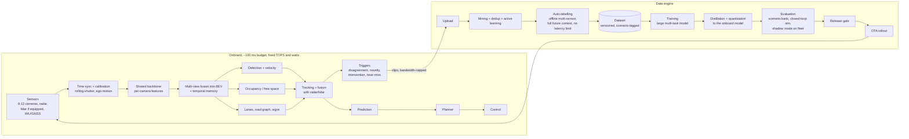
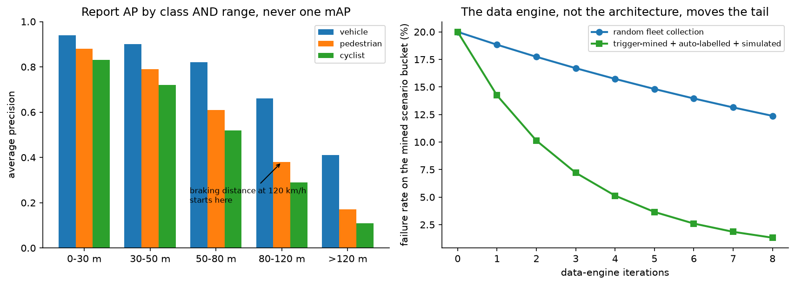
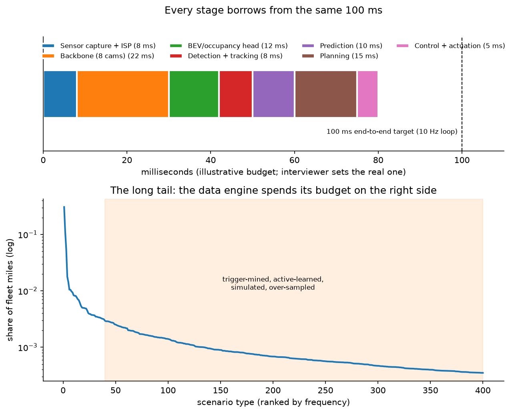

# Autonomous-vehicle perception

> **Why this matters / who asks it.** Tesla, Waymo, Zoox, Nuro, Aurora, Wayve,
> Motional, NVIDIA DRIVE and every robotics company with a camera ask a version of
> "design the perception system." The business problem is to produce, at 10 Hz on a
> fixed power budget in a moving vehicle, a representation of the world that a planner
> can act on safely, and to keep improving it on a fleet that generates more data in a
> day than you can ever label. Detecting objects is a part of that, not the whole of it. That reframing is most of the
> signal: the candidate who designs a detector fails; the candidate who designs a
> *data engine plus an onboard stack plus an evaluation regime that can justify a
> release* passes. This chapter is the deepest in the part, and it leans on
> [Part XI](../part11-perception-autonomy/index.md) for the model internals, BEV,
> fusion, tracking, occupancy, which it links rather than repeats.

## TL;DR: the whiteboard in 60 seconds

- **Design the loop, not the model.** The fleet, the triggers, auto-labelling,
  mining, training, simulation, shadow mode and OTA form a cycle; the model is one
  box in it.
- **One backbone, many heads.** Per-camera features → a shared BEV/occupancy
  representation with temporal memory → detection, free space, lanes, signs,
  traffic controls. Multi-task because compute is fixed and tasks share geometry.
- **Fuse in a common space, not at the output.** Late (track-level) fusion is
  simple and robust to sensor failure; mid-level BEV fusion is more accurate
  because it can associate weak evidence across sensors before any thresholding.
- **Latency is a safety parameter.** At 30 m/s, every 10 ms of pipeline latency is
  0.3 m of position error; the budget is the design, and end-to-end
  sensor-to-actuation latency, not model FLOPs, is what you commit to.
- **Auto-labelling is the only affordable labelling.** Offline, you have the full
  future of the clip, all sensors, unlimited compute, and human review only for
  the residual, which is how a fleet's worth of data becomes training data.
- **Triggers make the long tail tractable.** Shadow-mode disagreement, model
  uncertainty, rare-class detections, driver interventions and near-misses decide
  what the (bandwidth-limited) fleet uploads.
- **Evaluate per class per range per condition**, plus closed-loop simulation, plus
  a versioned scenario bank that every release must pass. A single mAP number is a
  red flag in this interview.
- **Shadow mode is the bridge**: run the candidate model on the vehicle without
  acting, compare its outputs to the shipped model and to auto-labels, and gate the
  release on the disagreement analysis.
- **Distillation and quantisation** move a large offline teacher into the onboard
  student under the TOPS and thermal budget; the teacher never ships.
- **Evidence**: Tesla AI Day presentations (HydraNets, BEV transformer, occupancy
  networks, the data engine, auto-labelling), Waymo research (Scalable Waymo Open
  Dataset, StreetHover/PointPillars-lineage detection work, simulation and
  Waymax), NVIDIA DRIVE technical posts, and the academic lineage, LSS, BEVFormer,
  BEVFusion, PointPillars, Occupancy Networks.

## 1. Requirements & scoping

**Functional.** Produce, every cycle: a set of tracked dynamic objects with class,
3D extent, position, velocity and acceleration plus uncertainty; a static-world
representation (drivable free space or occupancy, with occlusion state); the road
graph (lanes, boundaries, crossings); traffic-control state (lights, signs, cones,
temporary markings); and per-output confidence the planner can reason about. Handle
sensor degradation and report it.

**Non-functional, ask for or assume.**

| Quantity | Ask | Defensible assumption |
|---|---|---|
| ODD | "What operational design domain: highway, urban, weather, geographies?" | Urban + highway, temperate, day and night; fog/snow explicitly out of ODD at v1 |
| Sensor suite | "Cameras only, or camera+radar+lidar? Fixed or evolving?" | 8 cameras at 1920×1080, 30 fps, 360° radar, optional lidar |
| Cycle rate & latency | "Planner cycle rate and the sensor-to-actuation budget?" | 10 Hz planner; ≤ 100 ms sensor-to-control p99, with a hard worst case |
| Compute | "Onboard TOPS, memory bandwidth, power/thermal budget?" | ~100–500 INT8 TOPS, ~50–100 W for the inference SoC, no active cooling headroom |
| Range | "Detection range required per class?" | 150 m+ vehicles, 80 m+ pedestrians; derived from braking distance at the ODD's top speed |
| Fleet | "How many vehicles, how many miles/day, upload bandwidth per vehicle?" | 10k vehicles × 100 km/day; a few GB/vehicle/day of upload |
| Labelling | "Human labelling budget? Auto-labelling infrastructure?" | Humans for audit and residual only; auto-label the rest |
| Release | "What is the release gate and who owns it? Regulatory constraints?" | A safety case: scenario bank + sim + shadow metrics, signed off by a safety team |

**Success metrics.** This is the part candidates get wrong, so be explicit about the
three levels:

- *System-level safety (what the business cares about)*: interventions or
  disengagements per 1,000 km, contact events per million km, near-miss rate,
  and (in simulation) collision rate and rule-violation rate over the scenario
  bank. These are the only metrics that mean anything to a safety case, and they are
  *closed-loop*: they depend on planning, not perception alone.
- *Perception guardrails (what gates a release)*: per-class AP by range bucket and by
  condition (night, rain, backlit); false-negative rate on vulnerable road users at
  the ranges that matter; track fragmentation and ID switches; velocity error;
  occupancy IoU and, crucially, false-free-space rate (declaring occupied space free
  is the failure that kills); latency p99.9; and detection stability (flicker) which
  the planner feels as jerk.
- *Offline proxies (what the model team iterates on)*: the same detection and
  occupancy metrics on the versioned test sets, plus disagreement rate against the
  auto-labeller on shadow data.

State the asymmetry loudly: **a false negative on a pedestrian at 40 m and a false
positive on a plastic bag are not comparable errors**, so the metric suite must be
per-class, per-range, and asymmetric, and phantom braking (a false positive that
causes hard braking) is itself a safety event, so you cannot bias everything
toward recall.

**Questions a staff engineer asks.**

1. "What is the downstream consumer's contract? Does the planner want boxes, or
   occupancy, or both, and with what uncertainty representation? I'd rather design
   to the planner's interface than to a benchmark."
2. "Is lidar in the production vehicle, or only on a data-collection subset? If
   it is only on a data fleet, it becomes an auto-labelling sensor rather than a
   runtime sensor, which changes the whole design."
3. "What is the intervention data rate? Interventions are my highest-value labels."
4. "What is the worst-case latency I must guarantee, not the average? A safety case
   is written against the worst case."
5. "Can the model fail gracefully, is there a fallback stack (radar-only,
   comfort-brake-to-stop) the system can degrade to?"
6. "How do we currently decide a model is safe to ship, and how long does that
   take? The release cadence constrains how aggressive the architecture can be."

## 2. Data

**Sources.** Raw sensor streams (camera at full resolution before ISP tone mapping
where possible, radar detections or raw cubes, lidar point clouds on equipped
vehicles), vehicle state (wheel odometry, IMU, steering, pedals), GNSS and map
priors where used, the outputs of the shipped stack (for shadow comparison), driver
interventions and disengagement events, and simulation.

**The labelling problem, stated as an economics problem.** A fleet of 10k vehicles
at 100 km/day at 30 fps × 8 cameras produces on the order of $10^{11}$ frames per
year. Human 3D labelling runs at minutes per frame. There is no budget, at any
company, that closes that gap. Therefore:

**Auto-labelling** is the primary labelling mechanism, and its key insight is that
the *offline* problem is far easier than the online one:

- You have the **entire future** of the clip, so an object briefly occluded at
  $t$ can be labelled from its trajectory at $t \pm 5\,\text{s}$. Offline tracking
  runs bidirectionally.
- You have **all sensors**, including ones not on the production vehicle (a lidar-
  equipped data-collection subset labels camera-only production data).
- You have **unlimited compute and latency**: a teacher ensemble that takes ten
  seconds per frame is fine offline.
- You can **aggregate across vehicles and passes**: many vehicles driving the same
  intersection reconstruct the static world far better than any single pass, which
  is how road geometry and permanent signage get labelled.

Humans then do three things: audit a sample to measure auto-label quality, label the
residual cases the auto-labeller flags as uncertain, and adjudicate the definition
of ambiguous categories (is a person on a scooter a pedestrian or a cyclist?). Tesla
described this pipeline at AI Day 2021 and 2022, offline auto-labelling that
reconstructs both the static world and object trajectories from fleet clips, with
humans reviewing rather than drawing, and the same pattern, with different
sensors, is standard across the industry.

**Label biases you must name.**

- *Trigger-selection bias*: the fleet only uploads what the triggers ask for, so the
  dataset is a biased sample of the world. That is deliberate, but you have to
  remember it when computing anything that claims to be a rate. Keep a small **uniformly random
  upload stream** alongside the triggered one, purely so you can estimate true
  prevalence and calibrate the triggered data's weighting.
- *Teacher bias*: the auto-labeller's systematic errors (say, under-detecting
  low-contrast pedestrians at night) become the student's errors and are invisible
  to a test set produced by the same teacher. Mitigation: a **human-labelled golden
  set** that is never auto-labelled, sampled independently of the triggers.
- *Survivorship*: data from disengagements shows what the driver did *after*
  taking over; the counterfactual (what would the stack have done) is unobserved
  and must come from simulation.
- *Geography and fleet composition*: the fleet drives where customers live; the ODD
  claim must match the data distribution, and per-region metrics catch the gap.

**Triggers (the highest-leverage system in the whole design).** Bandwidth is the
binding constraint, so the vehicle must decide *onboard* what is worth uploading:

| Trigger family | Example | What it buys |
|---|---|---|
| Shadow disagreement | Candidate model and shipped model differ on a track | The exact cases where the new model changes behaviour |
| Teacher–student disagreement | Onboard student differs from a small onboard "critic" or from the radar | Cheap proxy for label error |
| Uncertainty / novelty | High predictive entropy, low max-softmax, out-of-distribution feature statistics | Unknown unknowns |
| Rare class or rare attribute | Emergency vehicles, road debris, unusual vehicle types, hand signals | The long tail by construction |
| Behavioural | Driver intervention, hard brake, ABS/ESC activation, near-miss by TTC | Safety-relevant events with an implicit label |
| Geometric/temporal inconsistency | Track flicker, implausible velocity, occupancy contradiction over time | Self-supervised error detection |
| Targeted campaign | "Upload anything with a school bus with its stop sign extended" | Directed data collection for a known gap |

The last row is the operationally important one: engineers must be able to deploy a
new trigger to the fleet in days and get a curated dataset back. Tesla's AI Day
description of the data engine is essentially this, define the failure mode, query
the fleet for it, label, retrain, verify, and it is the answer to "how do you fix a
specific rare failure?"

{ width="780" }

*Left: AP collapses with range and collapses fastest for the smallest, most
safety-critical classes, which is why a single mAP number hides exactly the failures
that matter. Right (illustrative): random fleet collection barely moves a mined
long-tail bucket, while triggered collection plus auto-labelling plus targeted
simulation does; the data engine, not the architecture, is what closes the tail.*

**Freshness and versioning.** Datasets are versioned artefacts with scenario tags;
every model records the dataset version it trained on; every regression is traceable
to a dataset diff. Versioning is the only way to answer "why did
this get worse" three releases later.

**Privacy.** Faces and licence plates blurred at or near the source; geofenced
retention rules; driver-identifiable data handled under a separate policy; regional
data-residency constraints that can determine where training clusters are located.

## 3. Modelling

### 3.1 Baseline

Per-camera 2D detection with a standard detector, monocular depth or a flat-ground
assumption to lift boxes to 3D, per-camera tracking, and hand-written fusion across
cameras in the vehicle frame. It works, and it is what everyone shipped first. Its
failure modes are the argument for everything that follows: objects spanning two
cameras get two identities, depth from a single camera is ill-conditioned, and the
hand-written fusion has no way to combine weak evidence.

### 3.2 From per-camera to BEV: the central architectural decision

The problem with per-camera outputs is that the consumer (the planner) lives in a
3D vehicle-centric world, and every per-camera decision is made without the other
cameras' evidence. The fix is to fuse *features*, not outputs, in a shared
bird's-eye-view space.

Two families, and you should be able to contrast them (the mechanics are in
[multi-camera & BEV](../part11-perception-autonomy/02-multi-camera-bev.md)):

**Forward projection ("lift-splat").** Each camera predicts a depth distribution per
pixel, features are "lifted" into a frustum point cloud weighted by that
distribution, and "splatted" into BEV grid cells (Philion & Fidler, "Lift, Splat,
Shoot", ECCV 2020). Intuitive and cheap; accuracy is bounded by the depth
distribution's quality.

**Backward projection (query-based attention).** Define queries on the BEV grid (or
for objects) and let each query attend to the image features it projects into, using
the known camera geometry to restrict attention (BEVFormer, Li et al., ECCV 2022,
[arXiv:2203.17270](https://arxiv.org/abs/2203.17270), which adds temporal self-attention over previous BEV features).
No explicit depth estimate is needed (the network learns where to look) and
temporal fusion falls out naturally. More expensive; needs careful positional
encoding of the camera geometry.

Both require **accurate calibration and time synchronisation**. Say this
explicitly: extrinsics drift with temperature and vibration, rolling-shutter cameras
capture different rows at different times while the vehicle moves, and a 5 ms sync
error at 30 m/s is 15 cm of misalignment that the network cannot fix. Online
calibration monitoring (detecting reprojection drift against static structure) is a
production subsystem, not a one-time factory step.

The multi-task structure on top, one backbone, a shared BEV representation, and
many heads (Tesla's "HydraNets" framing from AI Day 2021), is driven by compute:
you cannot afford one network per task, and the tasks share geometry, so sharing
the trunk is both cheaper and better. The cost is training complexity: tasks have
different data volumes and loss scales, heads interfere, and a change to the trunk
requires re-validating every head. The standard mitigations are per-task loss
weighting, freezing the trunk while iterating a head, and per-head regression tests.

### 3.3 Occupancy: the answer to "what about things that aren't in your class list"

A box detector can only report objects it has a class for. The world contains
debris, fallen cargo, animals, overhanging structures and articulated things that
no taxonomy covers, and the planner mostly needs to know **what space is not
drivable**, which is a geometric question rather than a semantic one.

Occupancy prediction outputs a voxel grid (or a continuous occupancy field) with
occupied/free/unobserved per voxel, optionally with semantics and with **occupancy
flow** (per-voxel velocity) so the planner can reason about moving unlabelled mass.
Tesla presented occupancy networks at AI Day 2022 as exactly this: a general
geometric representation that does not require the object to be a known class, run
at high rate with a lower-resolution semantic head. The academic lineage runs
through Occupancy Networks (Mescheder et al., CVPR 2019) for the representation and
a large body of camera-based occupancy work since.

The design point to state: **detection and occupancy are complementary, not
alternatives.** Boxes give the planner trackable, predictable agents with identity
and intent; occupancy gives it a safety floor that does not depend on the taxonomy.
Ship both, and make the planner's contract explicit about which it trusts for what.
The critical metric is the **false-free rate**, voxels declared free that are
occupied, because that is the error that leads to driving into something, and it
must be evaluated separately from IoU, which averages over the easy empty voxels.

### 3.4 Temporal modelling

A single frame cannot give velocity, cannot see through momentary occlusion, and
cannot disambiguate a stopped car from a parked one. Options, in increasing power
and cost:

- **Ego-motion-compensated feature memory**: warp the previous BEV feature map into
  the current frame using measured ego-motion and fuse (concatenate or attend). Cheap,
  and it is what most production BEV stacks do.
- **Recurrent or attention-based video modules** over a window of several seconds,
  which give explicit motion features and let the network remember objects through
  occlusion. Tesla's AI Day presentations describe a video module with spatial and
  temporal queueing so that the network can remember, for example, a sign it has
  passed or a car that is momentarily occluded.
- **Full spatio-temporal transformers**, which is where the research is going, at
  a compute cost that has to be earned.

The systems consequence: temporal models carry **state**, and state means the
inference engine is no longer a pure function. You have to handle initialisation,
recovery after a dropped frame, and the fact that a bug can persist across frames.
Your validation must include state-corruption scenarios.

### 3.5 Sensor fusion

See [sensor fusion](../part11-perception-autonomy/03-sensor-fusion.md) for the
estimation theory; the design decisions here are:

| Fusion level | What it is | Pro | Con | Use when |
|---|---|---|---|---|
| Late / track-level | Each sensor produces tracks; a fusion filter associates them | Modular, degrades gracefully, easy to attribute failures, each sensor testable alone | Cannot combine sub-threshold evidence; association errors | Safety-critical redundancy; heterogeneous teams; early programmes |
| Mid / feature-level (BEV) | Camera and lidar/radar features fused in the shared BEV grid (BEVFusion, Liu et al., ICRA 2023, [arXiv:2205.13542](https://arxiv.org/abs/2205.13542)) | Best accuracy; combines weak evidence; one model | A sensor dropout changes the input distribution; harder to attribute failures | Mature stack with the training data to cover dropout cases |
| Early / raw | Raw pixels and points into one network | Maximum information | Brittle to calibration and sensor changes; huge data cost | Rarely in production |

The nuance interviewers probe: **radar is not a worse lidar**. Radar measures radial
velocity directly (Doppler) at long range and through weather, with poor angular
resolution and heavy multipath. Its job in the stack is velocity and long-range
presence, and a common production pattern is camera for classification and lateral
position, radar for range rate, fused at track level with sensor-specific
uncertainty models. And an essential design requirement: the stack must define its
behaviour **when a sensor degrades**, a mud-covered camera, radar blindness in
heavy spray, which means degradation detection is itself a perception task, with
its own head and its own metrics.

### 3.6 Tracking and the interface to prediction

Detection gives you per-frame evidence; the planner needs consistent identities with
velocity and uncertainty. The classical answer, Kalman or IMM filters with
Hungarian/greedy association on Mahalanobis or IoU distance, remains the production
default because it is inspectable, cheap, and has well-understood failure modes;
learned association (appearance embeddings, transformers over tracks) improves
crowded scenes at the cost of explainability. See
[tracking](../part11-perception-autonomy/04-tracking.md).

What matters for the system design:

- **Track quality is a planner-facing metric.** ID switches cause the prediction
  module to lose an agent's history; fragmentation causes phantom appearances;
  both show up as jerky planning long before they show up in AP.
- **Uncertainty must be propagated**, not thresholded away. The planner's behaviour
  should differ for a confidently-tracked vehicle and a flickering, low-confidence
  detection; if perception collapses everything to a box list, the planner cannot
  be appropriately conservative.
- **The perception/prediction boundary is negotiable.** End-to-end designs push
  detection, tracking and prediction into one network
  ([prediction & planning](../part11-perception-autonomy/06-prediction-planning.md));
  the trade-off is accuracy and consistency versus testability and the ability to
  attribute a failure to a component. For an interview: modular with learned
  components inside each module is the defensible default, and you should name the
  end-to-end alternative and the condition under which you would move (a mature
  closed-loop evaluation capability that can validate a system you cannot unit-test).

### 3.7 Making it fit: distillation, quantisation, and the compute budget

The onboard model is constrained by TOPS, memory bandwidth, and thermals, and by the
fact that the SoC is fixed for the life of the vehicle while your models keep
growing. Techniques, in the order you would apply them:

1. **Architecture for the target**: the operator set the accelerator supports
   efficiently is a hard constraint. An architecture that is 20 % better on a GPU
   benchmark but uses an unsupported attention pattern is worthless.
2. **Distillation** from the large offline teacher (or the auto-labeller ensemble)
   into the onboard student, using soft targets and intermediate features. The
   teacher is also the auto-labeller, so the data engine already produces it.
3. **Quantisation** to INT8 (or lower) with quantisation-aware training; the
   accuracy delta must be measured per class per range, not in aggregate, because
   quantisation hurts small distant objects first.
4. **Pruning and operator fusion**, then kernel-level tuning for the target.
5. **Scheduling**: not every head needs to run every cycle. Traffic-light state at
   30 Hz, sign classification at 5 Hz, and a semantic occupancy refresh at a lower
   rate than the geometric one; this multi-rate scheduling is often where the last
   30 % of the budget comes from.

Quantify it: at 8 cameras × 1920×1080 × 30 fps, the raw pixel rate is ~0.5 GPix/s. A
backbone at ~200 GFLOP per full multi-camera frame at 30 Hz is ~6 TFLOP/s of dense
compute, feasible in INT8 on a modern automotive SoC, and completely infeasible if
you let the model double without a budget conversation. That arithmetic is what makes
the "distil and quantise" answer credible rather than reflexive.

## 4. Training & serving

**Training.** A large multi-task model trained on the versioned dataset, typically
with: a pretrained backbone (self-supervised on unlabelled fleet video is a natural
fit, see [self-supervised learning](../part10-self-supervised/01-self-supervised-learning.md)),
per-task loss weights, heavy augmentation (photometric, weather synthesis, camera
dropout, calibration jitter, the last two teach the model to survive real
degradation), and class/range-balanced sampling so distant pedestrians are not
drowned by near cars. Multi-node data-parallel training with the usual systems
concerns ([distributed training](../part14-systems/01-distributed-training.md));
the bottleneck is usually the data pipeline, not the GPUs, because the samples are
multi-camera video clips.

**Cadence.** Continuous training with weekly or biweekly release candidates; the
release gate, not the training, is the slow step. Keep the *teacher* (auto-labeller)
on its own, slower cadence, because changing the teacher changes the labels and
therefore invalidates comparisons, a versioning discipline worth stating.

**Onboard serving and the latency budget.**

{ width="720" }

*Top: an illustrative 100 ms sensor-to-actuation budget, every stage borrows from
the same envelope, and perception's share is what you negotiate. Bottom: the scenario
frequency distribution; almost all miles are in the head, almost all risk is in the
shaded tail, and the data engine's job is to spend the collection budget there.*

| Stage | Budget | Notes |
|---|---|---|
| Capture + ISP + sync | 8 ms | rolling shutter and exposure control matter; HDR merging costs time |
| Backbone (all cameras) | 22 ms | the dominant cost; batched across cameras |
| BEV fusion + temporal | 12 ms | attention or splat; state carried across frames |
| Heads (detection, occupancy, lanes, signs) | 12 ms | multi-rate scheduled |
| Tracking + sensor fusion | 8 ms | CPU or DSP |
| Prediction | 10 ms | |
| Planning | 15 ms | |
| Control + actuation | 5 ms | |
| **Total** | **~92 ms** | commit to the **p99.9**, not the mean; a 300 ms tail is a safety event |

Say what happens on overrun: the system must have a defined behaviour, reuse the
previous cycle's output with dead-reckoned ego-motion, drop optional heads, and
escalate to a degraded mode if it persists. A perception stack without a defined
overrun behaviour is not a safety-grade design.

**Redundancy and fallback.** A separate, simpler, independently-developed path
(radar-and-simple-vision emergency braking, for instance) that can bring the
vehicle to a safe stop if the main stack fails, with clearly defined arbitration.
This is standard practice in safety engineering and it is a strong signal to
mention.

## 5. Evaluation & experimentation

This section is what separates AV perception from every other chapter in this part:
you cannot A/B test a safety-critical system on live traffic the way you A/B test a
feed. The evaluation stack has four layers.

**(a) Open-loop offline metrics.** Per-class AP by range bucket, by time of day, by
weather, by scenario tag; velocity and dimension errors; occupancy IoU *and*
false-free rate; track continuity metrics. Evaluated on (i) a human-labelled golden
set, (ii) the auto-labelled test set (larger, but with teacher bias), (iii) a
**scenario bank** of curated hard cases that grows with every failure found. The
scenario bank is the regression suite: every release must not regress on any case in
it, and a new failure in the field becomes a new bank entry, permanently. Open-loop
metrics answer "is the perception better", not "is the system safer".

**(b) Closed-loop simulation.** Replay the recorded sensor data through the new stack
and let the planner act, with other agents responding (log-replay with reactive
agents, or fully synthetic scenarios). Metrics: collision rate, rule violations,
comfort, and progress. This is the only offline method that can capture the fact that
a perception change alters the vehicle's trajectory, which alters what it sees.
Waymo has published in this area, including the Waymax simulator for closed-loop
planning research, and their broader simulation work; the limitation everybody has
is **sensor realism**, resimulating camera images for a trajectory the vehicle never
drove is an open problem, which is why log-replay with a perception-output-level
interface, and neural rendering approaches, are both used.

**(c) Shadow mode on the fleet.** Run the candidate model onboard without acting,
log its outputs alongside the shipped model's, and analyse the disagreements, this
gives you real-world coverage at fleet scale with no risk, and it is also the
highest-value trigger for data collection. What it cannot tell you is the closed-loop
consequence, because the candidate never drove.

**(d) Structured on-road testing** with safety drivers on a defined route mix,
then a staged rollout: internal fleet → employee fleet → small customer cohort →
wide release, with per-stage metrics and a rollback path. OTA deployment is what
makes staged rollout possible, and it is also what makes a bad release a fleet-wide
event, which is why the gate is heavy.

**The release gate.** Write it as a checklist because that is how it exists in
reality: no regression on the scenario bank; closed-loop sim collision and violation
rates within tolerance; shadow-mode disagreement analysed with every material
disagreement categorised; latency p99.9 within budget on the target SoC at
temperature; per-class per-range metrics within tolerance on the golden set;
degradation behaviours tested; rollback verified.

**Monitoring in production.** Onboard: detection-rate and occupancy statistics per
region (a sudden shift means a sensor or a calibration problem), latency
distributions, degradation-detector rates, disagreement with radar, watchdog resets.
Offline: intervention rate by scenario tag, near-miss rate, and the customer-visible
metrics. Retraining triggers: a new scenario cluster appearing in the interventions,
a region's metrics drifting after a rollout, or a new ODD.

## 6. Trade-offs & alternatives

| Decision | Chosen | Alternative | When you'd flip |
|---|---|---|---|
| Sensor suite | Camera-centric with radar; lidar on the data fleet | Lidar in every production vehicle | Robotaxi economics (the sensor cost is amortised over service revenue, and you want redundancy for a driverless safety case) rather than consumer-vehicle BOM |
| Representation | Shared BEV/occupancy, multi-task heads | Per-camera 2D + geometric fusion | Very constrained compute, single-camera products, or an early programme where modularity beats accuracy |
| BEV construction | Query/attention-based (BEVFormer-style) | Lift-splat forward projection | Tight compute budget or when a reliable depth sensor makes explicit lifting accurate and cheap |
| Fusion level | Mid-level BEV fusion for accuracy + late fusion for redundancy | Late fusion only | Safety case requires independently-validatable sensor paths; then keep fusion late and accept the accuracy cost |
| Class taxonomy | Detection + class-agnostic occupancy | Detection only | Never for open-world driving; occupancy-only when the planner is purely geometric (some low-speed robots) |
| Temporal | Ego-motion-warped feature memory | Single frame | Single frame only for a redundant fallback path where statelessness is a safety property |
| Tracking | Classical filters + learned association features | Fully end-to-end tracking | Mature closed-loop validation exists and crowded-scene performance dominates |
| Labelling | Auto-label + human audit/residual | Human labelling | Small data, novel sensor, or bootstrapping the first teacher |
| Model size | Large teacher offline, distilled student onboard | Ship the big model | Never on a fixed SoC; the teacher is the auto-labeller |
| Evaluation | Scenario bank + closed-loop sim + shadow | On-road A/B | You cannot A/B a safety-critical change on the public; staged rollout is the closest analogue |
| Architecture | Modular with learned components | End-to-end driving | When closed-loop evaluation is strong enough to validate a system you cannot unit-test; the trade-off is interpretability and the ability to attribute a crash |

**Failure modes and detection.**

- *Calibration drift*: reprojection error against static structure, monitored
  onboard; symptoms are double-detections at camera boundaries and range bias.
- *Teacher bias baked into the student*: caught only by the independent human golden
  set; this is why that set must never be auto-labelled.
- *Distribution shift after an ODD expansion*: per-region metrics and a novelty
  trigger; the mitigation is a targeted collection campaign before, not after, the
  expansion.
- *Phantom braking*: a false positive with a behavioural consequence. Track it as a
  headline metric, mine every instance, and note that it is the reason you cannot
  tune everything toward recall.
- *Temporal state corruption*: a bug that persists across frames; test with injected
  dropped frames and corrupted state.
- *Occlusion-induced false-free*: the occupancy head marking unobserved space as
  free; must be a separate output state (occupied/free/**unknown**) and a separate
  metric.
- *Fleet-wide regression from an OTA*: staged rollout, automatic metric monitoring
  per stage, and a tested rollback. The fact that this is possible is why the release
  gate is so heavy.

## 7. How real companies did it: as mock interviews

### 7.1 Tesla: "vision only, a fleet, and a fixed computer"

**Interviewer prompt.** "We have a million vehicles with eight cameras and a fixed
onboard computer, no lidar, and more data than anyone could label. Design the
perception stack and, more importantly, the process that keeps improving it."

**Walkthrough.** *Clarify*: camera-only at runtime; compute is fixed; the fleet is
the asset; the release gate is a staged OTA. *Metrics*: intervention rate and
per-class per-range detection; phantom-braking rate as a guardrail. *Data*: fleet
triggers decide uploads; auto-labelling reconstructs the world offline with full
future context and multi-pass aggregation; humans audit. *Model*: shared backbone
per camera → fusion into a vector/BEV space with a transformer → a video module for
temporal memory → many heads (HydraNets); later, an occupancy network for
class-agnostic geometry. *Serve*: distilled and quantised onto the vehicle computer,
multi-rate head scheduling. *Evaluate*: shadow mode on the fleet, a growing bank of
mined cases, staged OTA.

**What the sources say.** Tesla's AI Day 2021 and AI Day 2022 presentations describe:
the multi-camera fusion into a shared representation with a transformer-based
mapping from image space to a vector space; the video/temporal module for memory; the
HydraNet multi-task structure with a shared backbone and many heads; occupancy
networks as a general, class-agnostic geometric output; the auto-labelling pipeline
that reconstructs static structure and object trajectories offline from fleet clips
using full future context and multi-vehicle aggregation; and the data-engine loop of
trigger → collect → label → retrain → verify via shadow mode.

!!! tip "How to say it in the interview: design the data engine first"
    "Before I design a network I'd design the loop that feeds it, because on a fleet
    this size labelling is the binding constraint, not modelling. Tesla described
    this at AI Day: fleet triggers select clips, an offline auto-labeller
    reconstructs the scene using the full future of the clip and aggregation across
    multiple passes and vehicles, humans audit rather than draw, and the retrained
    model is verified in shadow mode on the fleet before an OTA. The alternative is
    to buy human labels for a sampled stream, which is what everyone does at the
    start and which stops scaling at exactly the point the long tail starts to
    matter, random sampling almost never contains the rare event you need. The
    trade-off I'd flag is teacher bias: the auto-labeller's systematic errors become
    the student's, and they're invisible if your test set came from the same
    teacher, so I'd fund a human-labelled golden set sampled independently of the
    triggers as the only unbiased measurement. I'd flip toward human labelling for a
    brand-new sensor or ODD where no teacher exists yet."

!!! tip "How to say it in the interview: BEV fusion over per-camera outputs"
    "I'd fuse camera features into a shared bird's-eye-view representation rather
    than run per-camera detectors and fuse their outputs. Tesla's AI Day
    presentations describe exactly this transition, a transformer that maps image
    features into a vector space shared across cameras. The motivation they gave is
    the one I'd give: an object spanning two cameras gets one consistent
    identity and one position, and weak evidence from several views can be combined
    before anything is thresholded, which per-camera detection makes impossible. The
    alternative, per-camera detection with geometric fusion, is simpler, and it has
    a real advantage I'd name: each camera path can be validated independently,
    which is what a redundancy argument needs. The trade-off is compute and the fact
    that calibration errors now corrupt a shared representation rather than one
    camera's output, so I'd add online calibration monitoring as a production
    subsystem. I'd keep a simple per-camera path anyway as the independent fallback
    for emergency braking."

!!! tip "How to say it in the interview: occupancy alongside boxes"
    "I'd ship a class-agnostic occupancy output next to the object detector, not
    instead of it. Tesla presented occupancy networks at AI Day 2022 for precisely
    the reason I'd give: a box detector can only report categories it was trained
    on, and the road contains debris, fallen cargo and articulated things that no
    taxonomy covers, while the planner mostly needs to know what space is not
    drivable. The alternative (expanding the class list) is a treadmill that never
    ends and still fails on the first genuinely novel object. The trade-off is that
    occupancy gives the planner no identity or intent, so it can't predict that a
    blob will pull out in three seconds; that's what the boxes are for. The metric I
    would watch is not IoU, which averages over mostly-empty space, but the
    false-free rate (voxels we call free that are occupied) because that is the
    error that drives into something."

### 7.2 Waymo: "a driverless safety case"

**Interviewer prompt.** "We are removing the safety driver. Perception must support a
safety argument that a regulator and our own board will accept. What changes about
your design and, especially, your evaluation?"

**Walkthrough.** *Clarify*: driverless means no human fallback, so redundancy and
the degraded-mode behaviour become primary; the sensor suite is chosen for the
safety case, not the BOM. *Metrics*: closed-loop safety metrics plus per-component
guarantees; the release gate is a documented safety case. *Data*: a rich multi-sensor
fleet including lidar, published in part as the Waymo Open Dataset; simulation as a
first-class data source. *Model*: multi-sensor fusion with lidar as a primary
geometric sensor and cameras for semantics, with heavy emphasis on long-range
detection and on behaviour prediction. *Serve*: redundant compute with a fallback
path that can achieve a minimal risk condition. *Evaluate*: extensive closed-loop
simulation (including reactive-agent simulation) scenario libraries, and structured
on-road testing before any ODD expansion.

**What the sources say.** Waymo has published the Waymo Open Dataset ("Scalability in
Perception for Autonomous Driving: Waymo Open Dataset", CVPR 2020, [arXiv:1912.04838](https://arxiv.org/abs/1912.04838))
with multi-sensor data and 3D labels, the Waymo Open Motion Dataset for behaviour
prediction, and Waymax ("Waymax: An Accelerated, Data-Driven Simulator for
Large-Scale Autonomous Driving Research", NeurIPS 2023 Datasets and Benchmarks), a
closed-loop simulator for planning research; their safety blog and safety-framework
publications describe the layered approach to validating readiness, including
simulation, closed-course and on-road testing.

!!! tip "How to say it in the interview: evaluation is the design"
    "For a driverless system I'd spend as much design effort on the evaluation stack
    as on the model, because you cannot A/B a safety-critical change on the public.
    My stack has four layers: open-loop metrics on a human-labelled golden set and a
    versioned scenario bank; closed-loop simulation where the planner actually acts
    and other agents react; shadow mode on the fleet for real-world coverage with no
    risk; and staged on-road rollout. Waymo's published work supports the middle
    layer directly, they released Waymax, a closed-loop data-driven simulator, at
    NeurIPS 2023, and the Waymo Open Dataset papers describe the multi-sensor
    labelled data underpinning perception evaluation. The alternative, shipping on
    open-loop metrics alone, is the classic trap: a perception change alters the
    trajectory, which alters what the car sees next, and open-loop evaluation is
    blind to that entire feedback path. The trade-off is that closed-loop simulation
    needs sensor realism it does not fully have, so I'd be explicit that log-replay
    at the perception-output level covers planning changes well and camera-level
    resimulation is still an open problem."

!!! tip "How to say it in the interview: sensor suite follows the business model"
    "Whether lidar goes in the production vehicle is a business decision before it
    is a technical one, and I'd say so. For a robotaxi, the sensor cost amortises
    over service revenue and the driverless safety case wants independent,
    physically different measurement paths, which is the suite Waymo built and
    published data from in the Waymo Open Dataset. For a consumer vehicle at
    consumer margins with a human driver as the fallback, a camera-centric suite
    with radar is the defensible choice and lidar lives on the data-collection
    fleet as an auto-labelling sensor. The trade-off is direct: cameras give
    semantics cheaply and estimate geometry indirectly, lidar gives geometry
    directly and semantics poorly, and radar gives radial velocity through weather
    with poor angular resolution. I'd flip to production lidar the moment the
    programme's safety argument requires a redundant geometric sensor that does not
    share a camera's failure modes."

### 7.3 NVIDIA DRIVE: "the platform view"

**Interviewer prompt.** "We supply the compute and a reference stack to several
carmakers with different sensor suites. How do you design perception so it is
portable, and what does that cost you?"

**Walkthrough.** *Clarify*: the customer's sensor set varies, so the stack must be
configurable; certification and functional-safety requirements are contractual;
the compute target is known precisely. *Model*: a set of networks with defined
interfaces (detection, free space, lanes, signs, parking) that can be composed, plus
the tooling (optimising inference compilers, quantisation, and validation) around
them. *Serve*: an inference runtime tuned for the target SoC with deterministic
timing. *Evaluate*: per-network benchmarks plus system integration testing and
safety certification artefacts.

**What the sources say.** NVIDIA's DRIVE developer documentation and technical blog
posts describe the DRIVE platform's perception components (DNNs for obstacle
detection, free space, lane and sign perception), the use of TensorRT for optimised,
quantised inference on DRIVE SoCs, and their safety-oriented development process and
documentation (including their published safety report), aimed at automotive
functional-safety requirements.

!!! tip "How to say it in the interview: portability has a price"
    "If the stack has to run on several sensor suites, I'd keep sharply defined
    interfaces between networks and make the fusion configurable, which is the shape
    of NVIDIA's DRIVE perception stack as described in their developer docs, a set
    of DNNs with defined outputs, compiled and quantised for the target SoC through
    TensorRT. The alternative (one end-to-end network per customer configuration)
    would be more accurate per configuration and completely unmaintainable across
    a dozen of them. The trade-off is real and I'd name it: a modular, portable
    stack cannot exploit cross-sensor feature fusion as aggressively as a
    single-customer model tuned to one fixed suite, so it leaves accuracy on the
    table in exchange for reuse and certifiability. If I were building for one
    vehicle I control end to end, I'd fuse at the feature level and accept the
    coupling."

### 7.4 The research lineage: "justify your BEV choice"

**Interviewer prompt.** "You said you'd build a BEV representation. There are several
ways. Which one, and why?"

**Walkthrough.** *Clarify*: compute budget, whether a depth sensor is available at
training time, how much temporal context is needed. *Model*: lift-splat if depth is
well-supervised and compute is tight; attention-based BEV queries if you need
temporal fusion and can afford it; add lidar at the BEV feature level if the
production vehicle has it. *Evaluate*: per-range detection metrics, because the
methods differ most at long range where depth is least certain.

**What the sources say.** Philion & Fidler, "Lift, Splat, Shoot" (ECCV 2020,
[arXiv:2008.05711](https://arxiv.org/abs/2008.05711)) introduced the depth-distribution lifting of multi-camera features
into a BEV grid. Li et al., "BEVFormer" (ECCV 2022, [arXiv:2203.17270](https://arxiv.org/abs/2203.17270)) used spatial
cross-attention from BEV queries into image features plus temporal self-attention
over past BEV features. Liu et al., "BEVFusion" (ICRA 2023, [arXiv:2205.13542](https://arxiv.org/abs/2205.13542))
unified camera and lidar features in the shared BEV space. Lang et al.,
"PointPillars" (CVPR 2019, [arXiv:1812.05784](https://arxiv.org/abs/1812.05784)) is the efficient lidar-detection
baseline these are compared against.

!!! tip "How to say it in the interview: pick the BEV mechanism on evidence"
    "I'd start from lift-splat, the Philion and Fidler formulation from ECCV 2020,
    where each pixel predicts a depth distribution and features are splatted into
    BEV. It is cheap and its failure mode is understandable: accuracy is bounded
    by the depth distribution. I'd move to attention-based BEV queries, as in
    BEVFormer at ECCV 2022, when I need temporal fusion, since their temporal
    self-attention over previous BEV features gives velocity and occlusion
    robustness that a single-frame splat cannot, and the network learns where to
    look instead of relying on an explicit depth estimate. If the production vehicle
    carries lidar, I'd fuse both modalities in the same BEV space, which is what
    BEVFusion demonstrated at ICRA 2023. The trade-off across all of these is
    compute and calibration sensitivity, so my decision rule is: measure AP by range
    bucket on the target SoC's quantised model, because that is where these methods
    actually differ and where a benchmark mAP hides the difference."

### 7.5 The long tail: "fix this specific failure"

**Interviewer prompt.** "A customer sends a video: the car fails to yield to a school
bus with its stop arm extended. You have two weeks. What do you do?"

**Walkthrough.** *Clarify*: is it a perception failure (the stop arm isn't detected)
or a planning failure (it is detected and the policy is wrong)? Check the logs first.
Assume perception. *Data*: deploy a targeted trigger to the fleet ("school bus
detected with unusual appendage" or a generic rare-object trigger plus a query over
already-uploaded clips); mine the existing dataset; generate synthetic variants in
simulation for the geometries the fleet will not supply in two weeks. *Model*: it is
an attribute of an existing class, so add a stop-arm-state head rather than a new
class; retrain with the mined data oversampled. *Evaluate*: add the case to the
scenario bank permanently; verify in closed-loop sim that the planner yields;
shadow-mode the new model to check it does not regress general bus detection or
introduce false stop-arm detections; staged OTA.

**What the sources say.** This is the data-engine loop as Tesla described it at AI
Day, define the failure mode, query the fleet for matching data, auto-label, retrain,
verify in shadow mode, combined with the standard practice of simulation for
geometries the fleet cannot supply quickly; NVIDIA and Waymo both describe
simulation-based scenario generation for rare events in their technical materials.

!!! tip "How to say it in the interview: the fix is a process, not a model change"
    "My answer to any specific long-tail failure is the same loop, and I'd say it as
    a loop rather than propose an architecture. Triage the logs to decide whether
    it's perception or planning; deploy a targeted fleet trigger and simultaneously
    query the existing uploaded data for matches; auto-label the returns; generate
    synthetic variants for the configurations the fleet won't produce in two weeks;
    retrain with the mined data oversampled; add the case to the scenario bank
    permanently so no future release can regress it; verify in closed-loop sim and
    shadow mode; staged OTA. That's the data-engine loop Tesla described at AI Day,
    and the key property is that it is *repeatable*, the thousandth long-tail bug
    costs the same as the first. The alternative, hand-tuning a heuristic for school
    buses, ships faster this week and adds a permanent maintenance liability that
    interacts badly with the next thousand heuristics. The trade-off in my approach
    is latency: two weeks is tight for a fleet round-trip, so I'd ship a
    conservative planner-side mitigation immediately and the perception fix on the
    normal cadence."

## 8. Staff-level follow-ups

!!! interview "Your new model is 3 points better on mAP. Should we ship it?"
    Not on that evidence. mAP averages over classes, ranges and conditions, and the
    gain could be entirely in easy near-range vehicles while pedestrian AP beyond
    50 m regressed, and that number is what the safety case rests on. I'd
    want: per-class per-range per-condition deltas on the human-labelled golden set;
    scenario-bank results with zero regressions; closed-loop simulation showing no
    increase in collision or rule-violation rate; shadow-mode disagreement analysis
    with every material disagreement categorised; and latency at p99.9 on the target
    SoC with the quantised model at temperature. mAP is a development triage metric,
    not a release gate.

!!! interview "How do you find the cases your model gets wrong, if you don't have labels?"
    Self-supervised disagreement signals, which is most of the trigger design.
    Temporal inconsistency (an object that appears, disappears and reappears is
    almost certainly a detection error); cross-sensor disagreement (camera says no
    object where radar has a strong return with a consistent range rate);
    teacher–student disagreement onboard if you can afford a small critic model;
    geometric implausibility (a vehicle at an impossible velocity or intersecting
    another); and behavioural signals (driver intervention, hard brake, ABS
    activation) which are unlabelled but are near-certain markers of a failure.
    Every one of those is computable onboard with no label, and each becomes an
    upload trigger. Then the offline auto-labeller, which sees the full future,
    decides who was right.

!!! interview "Why can't you just A/B test the new perception model on the road?"
    Three reasons. First, collisions are far too rare
    to power an experiment; you would need billions of kilometres to detect a
    meaningful change. Second, a perception change alters the vehicle's trajectory,
    so the two arms do not see the same world, and the treatment's data is not
    comparable to the control's. Third and most importantly, the downside is
    unbounded and asymmetric; you cannot expose the public to a change you have not
    validated in order to learn whether it is safe. The substitutes are: shadow mode
    (real-world coverage, no risk, but no closed-loop signal), closed-loop simulation
    (closed-loop signal, imperfect realism), the scenario bank (targeted regression
    coverage) and staged rollout with heavy monitoring (real closed-loop evidence,
    acquired slowly and with a rollback path).

!!! interview "Your onboard budget just shrank by 30 % because another team needs the compute. What do you cut?"
    I would not cut accuracy uniformly. I'd re-derive the budget from the
    requirement. First,
    multi-rate scheduling: sign classification and semantic occupancy do not need to
    run at the full cycle rate, while geometric occupancy and dynamic-object
    detection do. Second, quantisation to a lower precision with
    quantisation-aware training, measured per class per range because small distant
    objects degrade first. Third, resolution tiering: full resolution in the forward
    cone where range matters, lower resolution in the side and rear cameras. Fourth,
    distil the trunk into a smaller student. What I would not cut is the temporal
    module (velocity estimation degrades immediately and the planner feels it) or
    the false-free-rate performance of occupancy. And I'd bring the per-class
    per-range degradation table to the negotiation, because "30 % less compute
    costs us X metres of pedestrian detection range" is a decision the safety team
    should make, not the perception team alone.

!!! interview "How do you handle a sensor failing mid-drive?"
    Detect, declare, degrade. Detection is its own model with its own metrics for
    lens occlusion, blur, saturation, radar blindness and lidar return collapse. A
    silently degraded sensor is far more dangerous than a failed one.
    Declaration means the perception outputs carry the degraded state so the planner
    can be conservative rather than the perception stack silently doing its best.
    Degradation means a defined behaviour: reduce the ODD (no lane changes toward
    the blind side), reduce speed, and if the remaining suite cannot support the
    task, execute a minimal-risk manoeuvre. Training-wise, I'd include sensor dropout
    as an augmentation so the fused model does not collapse when an input goes
    missing, which is the main robustness cost of mid-level fusion versus late
    fusion.

!!! interview "Auto-labelling sounds circular. How do you know the labels are right?"
    Two arguments. First, the offline problem is genuinely easier: the auto-labeller
    has the whole future of the clip, all sensors including ones the production
    vehicle lacks, multiple passes over the same location, and unbounded compute,
    so it is solving a much better-posed problem than the onboard model. The teacher
    is not the student marking its own work. Second, and non-negotiable, you measure
    it: a human-labelled golden set, sampled independently of the triggers, never
    touched by the auto-labeller, on which both the teacher and the student are
    evaluated. The number I'd track is teacher error by class and range, because a
    teacher that is systematically bad at night pedestrians will produce a student
    that is systematically bad at night pedestrians and a test set that says
    everything is fine.

!!! interview "Boxes or occupancy: pick one."
    I won't, and the reason is the argument. Boxes give the planner identity,
    intent and predictability: you can predict where a tracked vehicle will be in
    three seconds, and you cannot do that with a voxel. Occupancy gives a
    class-agnostic safety floor for the open-world objects the taxonomy misses.
    If forced, for a low-speed robot I'd take occupancy, because collision avoidance
    dominates and prediction matters less; for highway driving I'd take boxes,
    because behaviour prediction at speed is the whole problem and unlabelled debris
    is comparatively rare. In a real product I'd ship both and make the planner's
    contract explicit about which output it trusts for which decision.

!!! interview "The fleet uploads too much data and the bill is enormous. What do you do?"
    Tighten the triggers with measurement rather than intuition: for each trigger,
    compute the *yield*, what fraction of its uploads produced a training example
    that changed a metric. Kill or retune the low-yield ones. Add onboard
    deduplication (the same intersection, the same vehicle, a hundred times a week
    is one example, not a hundred) and onboard pre-filtering so the vehicle uploads
    a few seconds around the trigger rather than the whole clip, plus a compact
    feature summary for the rest. Keep the uniformly random stream, though,
    it is small, and it is the only thing that lets you estimate true prevalence.
    Finally, make triggers cheap to deploy and cheap to retire; an engineer who has
    to fight for a trigger will over-broaden it.

!!! interview "How does this design change if you have an HD map?"
    A map is a prior, not an answer, and I'd design it that way. It supplies lane
    geometry, stop-line positions and static traffic-control locations, which
    removes a hard perception problem and lets the stack allocate capacity to
    dynamic objects, that is the localisation-heavy architecture most robotaxi
    programmes use. The costs are the ones that decide the trade-off: the map must be
    built and maintained for every road you drive (which caps your expansion rate),
    localisation failure becomes a new critical failure mode, and the world changes
    faster than the map (construction, new markings), so you need a change-detection
    system and a policy for what to do when perception contradicts the map,
    perception must be allowed to win. A mapless design expands faster and has to
    solve road-structure perception online, which is much harder but scales to
    anywhere.

!!! interview "Where do foundation models fit?"
    Three places today, in order of confidence. Offline, as part of the
    auto-labelling teacher, a large vision model with no latency constraint can
    label open-vocabulary objects and attributes the production taxonomy does not
    cover, which directly attacks the long tail. In pretraining, self-supervised
    objectives on the enormous unlabelled fleet video give a much better backbone
    initialisation than supervised pretraining on a small labelled set (see
    [perception foundation models](../part11-perception-autonomy/01-perception-foundation-models.md)).
    And in simulation and world modelling, learned world models that generate
    plausible futures for closed-loop evaluation, which is where the sensor-realism
    problem might eventually be solved ([world models](../part11-perception-autonomy/07-world-models.md)).
    What I would not do is put a large vision-language model in the 100 ms onboard
    loop; the cost and the latency variance are both wrong, and distillation is the
    bridge.

!!! interview "You have one metric to show the board. What is it?"
    Interventions per 1,000 km, segmented by scenario tag and plotted over releases,
    with phantom-braking events shown separately so a fall in one is not hidden by a
    rise in the other. It is closed-loop, it is what the customer experiences, and
    its segmentation tells you *where* the system is improving. I'd bring the
    per-class per-range perception table as the supporting evidence, because when
    the intervention rate moves, that table is where you look to find out why.

## 9. Scaling & evolution

- **Prototype (a handful of vehicles).** Off-the-shelf detectors per camera, lidar
  if available, classical fusion and tracking, human labelling of a small dataset,
  evaluation on a fixed test set and a test track. The investments that pay off
  later: rigorous time synchronisation and calibration, structured logging of
  everything, and the first version of the scenario bank.
- **Fleet (thousands of vehicles).** Triggers and the upload pipeline, the first
  auto-labeller, versioned datasets, a shared BEV multi-task model, shadow mode,
  closed-loop simulation with log replay, and a real release gate. This is the
  transition that decides whether the programme scales, and it is an infrastructure
  transition, not a modelling one.
- **Large fleet (millions of vehicles).** Continuous training, a teacher ensemble
  whose own versioning is managed, targeted collection campaigns as a routine
  engineering tool, staged OTA to millions with per-stage monitoring, a scenario
  bank in the tens of thousands, and simulation that includes learned sensor
  rendering. Compute becomes an organisational allocation problem
  ([ML platform](12-ml-platform-feature-store-monitoring.md)).
- **Modular → end-to-end.** The industry direction is fewer hand-specified
  interfaces: perception and prediction merging, then planning. Each merge buys
  accuracy and costs testability, and the gate is whether your closed-loop
  evaluation is strong enough to validate a component you cannot unit-test. State
  the order you would do it in, perception→prediction first, because their
    interface is the leakiest, and say what evidence you would require before each step.
- **Batch → real-time everything.** Onboard, the shift is to stateful temporal
  models and multi-rate scheduling; offline, it is to a data engine where a trigger
  deployed on Monday yields a curated dataset on Wednesday and a shadow-mode result
  on Friday. Cycle time of the data engine is the single best predictor of how fast
  the long tail shrinks.
- **LLM/foundation-model augmentation.** Auto-labelling with open-vocabulary models,
  self-supervised pretraining on unlabelled fleet video, natural-language scenario
  querying of the dataset ("find clips with a cyclist running a red light in rain"),
  and generative world models for simulation. All offline; the onboard model stays
  small, quantised and deterministic.

## References

- Tesla. AI Day 2021 and AI Day 2022 presentations (multi-camera BEV fusion, HydraNet multi-task architecture, video/temporal module, occupancy networks, auto-labelling, the data engine, shadow mode).
- Sun, P. et al. "Scalability in Perception for Autonomous Driving: Waymo Open Dataset." CVPR 2020 ([arXiv:1912.04838](https://arxiv.org/abs/1912.04838)).
- Ettinger, S. et al. "Large Scale Interactive Motion Forecasting for Autonomous Driving: The Waymo Open Motion Dataset." ICCV 2021 ([arXiv:2104.10133](https://arxiv.org/abs/2104.10133)).
- Gulino, C. et al. "Waymax: An Accelerated, Data-Driven Simulator for Large-Scale Autonomous Driving Research." NeurIPS 2023 Datasets and Benchmarks ([arXiv:2310.08710](https://arxiv.org/abs/2310.08710)).
- Waymo. Safety report and safety-framework publications; Waymo blog posts on simulation and on driverless operation.
- NVIDIA. DRIVE platform developer documentation and technical blog posts on DRIVE perception DNNs, TensorRT inference optimisation, and automotive functional safety.
- Philion, J., Fidler, S. "Lift, Splat, Shoot: Encoding Images from Arbitrary Camera Rigs by Implicitly Unprojecting to 3D." ECCV 2020 ([arXiv:2008.05711](https://arxiv.org/abs/2008.05711)).
- Li, Z. et al. "BEVFormer: Learning Bird's-Eye-View Representation from Multi-Camera Images via Spatiotemporal Transformers." ECCV 2022 ([arXiv:2203.17270](https://arxiv.org/abs/2203.17270)).
- Liu, Z. et al. "BEVFusion: Multi-Task Multi-Sensor Fusion with Unified Bird's-Eye View Representation." ICRA 2023 ([arXiv:2205.13542](https://arxiv.org/abs/2205.13542)).
- Lang, A. H. et al. "PointPillars: Fast Encoders for Object Detection from Point Clouds." CVPR 2019 ([arXiv:1812.05784](https://arxiv.org/abs/1812.05784)).
- Mescheder, L. et al. "Occupancy Networks: Learning 3D Reconstruction in Function Space." CVPR 2019 ([arXiv:1812.03828](https://arxiv.org/abs/1812.03828)).
- Caesar, H. et al. "nuScenes: A Multimodal Dataset for Autonomous Driving." CVPR 2020 ([arXiv:1903.11027](https://arxiv.org/abs/1903.11027)).
- Book cross-references: [multi-camera & BEV](../part11-perception-autonomy/02-multi-camera-bev.md), [sensor fusion](../part11-perception-autonomy/03-sensor-fusion.md), [tracking](../part11-perception-autonomy/04-tracking.md), [occupancy & temporal perception](../part11-perception-autonomy/05-occupancy-temporal.md), [prediction & planning](../part11-perception-autonomy/06-prediction-planning.md), [world models](../part11-perception-autonomy/07-world-models.md), [perception foundation models](../part11-perception-autonomy/01-perception-foundation-models.md), [weak supervision & auto-labeling](../part10-self-supervised/03-weak-supervision-and-auto-labeling.md), [distributed training](../part14-systems/01-distributed-training.md).
